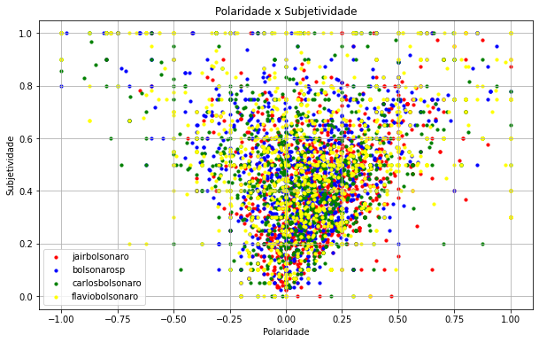
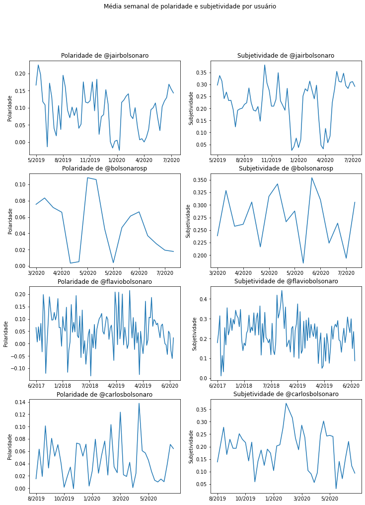

# Análise de sentimentos

Para obter informações dos tweets coletados iremos efetuar uma anális de sentimentos no tweets, isto é, para cada um dos tweets desejamos indentificar se o texto possui um sentimento positivo ou negativo associado, e além disso, também seremos capazes de avaliar se o texto representa uma opinião ou um fato. Para a análise de sentimentos utilizaremos a biblioteca __Textblob__. No entanto, uma das limitações muitas vezes encontradas para fazer processamento de textos é que a maior parte das ferramentas dão suporte apenas para o inglês, por esse motivo, iremos traduzir cada um dos tweets para inglês utilizando a biblioteca __Googletrans__.


```python
!pip install googletrans
```

## Tradução e análise de sentimentos


```python
import textblob
import pandas as pd
from googletrans import Translator
from tqdm import tqdm
import matplotlib.pyplot as plt
import time
import numpy as np
import altair as alt
```


```python
df = pd.read_csv("../data/tweets/preprocessed_tweets.csv", sep = "~").drop(columns = ["Unnamed: 0"])
trans = lambda tw : translator.translate(tw).text
full_text_en = []
for i in tqdm(range(0, 12000, 1000)):
    translator = Translator()
    for tw in df.full_text[i:i+1000]:
        full_text_en.append(trans(tw))
for tw in df.full_text[12000:]:
    full_text_en.append(trans(tw))
df["full_text_en"] = full_text_en
pol = lambda x : textblob.TextBlob(x).polarity
sub = lambda x : textblob.TextBlob(x).subjectivity
df['polarity'] = df.full_text_en.apply(pol)
df['subjectivity'] = df.full_text_en.apply(sub)
```

    100%|██████████| 12/12 [50:16<00:00, 251.41s/it]
    


```python
#df.to_pickle("data/tweets/sentiment_analysis.pkl")
df = pd.read_pickle('data/tweets/sentiment_analysis.pkl')
```

Com os dados já traduzidos, vamos observar alguns tweets em português e em inglês para verificar se as traduções são satisfatórias.


```python
for i in range(5):
    print("Português:")
    print(df.full_text[i])
    print()
    print("Inglês")
    print("\t" + df.full_text_en[i])
    print()
```

    Português:
    -Edifício Joelma/SP, 1974.
    
    -Sgt CASSANIGA salta de helicóptero da FAB no terraço do edifício em chamas para salvar vidas, em uma das maiores tragédias na história do Brasil.
    
    . Link no YouTube: https://t.co/JW8q4qN3a8 https://t.co/3Ulw3G96D5
    
    Inglês
    	- Joelma / SP Building, 1974.
    
    -Sgt CASSANIGA jumps from the FAB helicopter on the terrace of the burning building to save lives, in one of the greatest tragedies in the history of Brazil.
    
    . Link on YouTube: https://t.co/JW8q4qN3a8 https://t.co/3Ulw3G96D5
    
    Português:
    - Água para quem tem sede.
    - Liberdade para um povo. 
    - Brasil acima de tudo, Deus acima de todos!
    - BOM DIA.
    
    . YouTube: https://t.co/eS5aHQfMXu https://t.co/UERpWo4NbR
    
    Inglês
    	- Water for those who are thirsty.
    - Freedom for a people.
    - Brazil above all, God above all!
    - GOOD MORNING.
    
    . YouTube: https://t.co/eS5aHQfMXu https://t.co/UERpWo4NbR
    
    Português:
    @tarcisiogdf @MInfraestrutura 🤝🇧🇷, Ministro!
    
    Inglês
    	@tarcisiogdf @MInfraestrutura 🤝🇧🇷, Minister!
    
    Português:
    2- @MinEconomia @MinCidadania @onyxlorenzoni @MEC_Comunicacao @ItamaratyGovBr @ernestofaraujo https://t.co/WVf6V7pqzC
    
    Inglês
    	2- @MinEconomia @MinCidadania @onyxlorenzoni @MEC_Comunicacao @ItamaratyGovBr @ernestofaraujo https://t.co/WVf6V7pqzC
    
    Português:
    1- Acompanhe as redes sociais! @secomvc @fabiofaria5555 @tarcisiogdf @MInfraestrutura @MinEconomia @minsaude @Mapa_Brasil @TerezaCrisMS @DHumanosBrasil @DamaresAlves https://t.co/86CKnGZ4Ik
    
    Inglês
    	1- Follow the social networks! @secomvc @ fabiofaria5555 @tarcisiogdf @MInfraestrutura @MinEconomia @minsaude @Mapa_Brasil @TerezaCrisMS @DHumanosBrasil @DamaresAlves https://t.co/86CKnGZ4Ik
    
    

## Visualização dos resultados


```python
plot_data = df.groupby(by = "name").mean()
plt.scatter(plot_data.polarity, plot_data.subjectivity)
plt.title("Média de polaridade e subjetividade")
for row in range(len(plot_data)):
    plt.annotate(plot_data.index[row], (plot_data.polarity[row] - 0.01, plot_data.subjectivity[row] - 0.013))
plt.xlabel("Polaridade")
plt.ylabel("Subjetividade")
plt.xlim([0, 0.15])
plt.ylim([0, 0.3])
plt.savefig('images/mean_pol_subj.pdf')
plt.show()
```


.png)


Observamos que todos os perfis estão próximos, no entanto, temos que o perfil do vereador Carlos Bolsonaro (@carlosbolsonaro) é o menos polarizado e subjetivo entre os observados. Também temos que o perfil mais subjetivo é o do deputado Eduardo Bolsonaro (@bolsonarosp) e o mais polarizado é do presidente Jair Bolsonaro (@jairbolsonaro).


```python
fig, ax = plt.subplots()
fig.set_figheight(6)
fig.set_figwidth(10)
ax.set_title("Polaridade x Subjetividade")
for (name, color) in [("jairbolsonaro", "red"), ("bolsonarosp", "blue"),
             ("carlosbolsonaro", "green"), ("flaviobolsonaro", "yellow")]:
    ax.scatter(df[df.name == name].polarity, df[df.name == name].subjectivity, c = color, label = name, s = 10)
ax.set_xlabel("Polaridade")
ax.set_ylabel("Subjetividade")
plt.legend()
plt.grid()
plt.savefig('images/pol_subj_by_name.pdf')
plt.show()
```





Podemos trazer mais informação para essa visualização utilizando a biblioteca Altair para podermos visualizar o Tweet em cada um dos pontos, no entanto, por adequações da biblioteca, iremos utilizar apenas uma amostra de 2000 observações.


```python
plot_data = df.sample(n = 2000)
chart = alt.Chart(plot_data).mark_circle(size=60).encode(
    x='polarity',
    y='subjectivity',
    color=alt.Color('name', legend=alt.Legend(title="Usuário")),
    tooltip=[alt.Tooltip('name', title = "Usuário"), alt.Tooltip('full_text', title = "Tweet")]
).interactive()
chart.save("images/pol_subj_by_name.html")
chart
```


<div id="altair-viz-c390288e6a56418e9ab0d2c5544a8f04"></div>
<script type="text/javascript">
  (function(spec, embedOpt){
    let outputDiv = document.currentScript.previousElementSibling;
    if (outputDiv.id !== "altair-viz-c390288e6a56418e9ab0d2c5544a8f04") {
      outputDiv = document.getElementById("altair-viz-c390288e6a56418e9ab0d2c5544a8f04");
    }
    const paths = {
      "vega": "https://cdn.jsdelivr.net/npm//vega@5?noext",
      "vega-lib": "https://cdn.jsdelivr.net/npm//vega-lib?noext",
      "vega-lite": "https://cdn.jsdelivr.net/npm//vega-lite@4.8.1?noext",
      "vega-embed": "https://cdn.jsdelivr.net/npm//vega-embed@6?noext",
    };

    function loadScript(lib) {
      return new Promise(function(resolve, reject) {
        var s = document.createElement('script');
        s.src = paths[lib];
        s.async = true;
        s.onload = () => resolve(paths[lib]);
        s.onerror = () => reject(`Error loading script: ${paths[lib]}`);
        document.getElementsByTagName("head")[0].appendChild(s);
      });
    }

    function showError(err) {
      outputDiv.innerHTML = `<div class="error" style="color:red;">${err}</div>`;
      throw err;
    }

    function displayChart(vegaEmbed) {
      vegaEmbed(outputDiv, spec, embedOpt)
        .catch(err => showError(`Javascript Error: ${err.message}<br>This usually means there's a typo in your chart specification. See the javascript console for the full traceback.`));
    }

    if(typeof define === "function" && define.amd) {
      requirejs.config({paths});
      require(["vega-embed"], displayChart, err => showError(`Error loading script: ${err.message}`));
    } else if (typeof vegaEmbed === "function") {
      displayChart(vegaEmbed);
    } else {
      loadScript("vega")
        .then(() => loadScript("vega-lite"))
        .then(() => loadScript("vega-embed"))
        .catch(showError)
        .then(() => displayChart(vegaEmbed));
    }
  })({"config": {"view": {"continuousWidth": 400, "continuousHeight": 300}}, "data": {"name": "data-3be49625301b2464cd0fbecdfde5d6b4"}, "mark": {"type": "circle", "size": 60}, "encoding": {"color": {"type": "nominal", "field": "name", "legend": {"title": "Usu\u00e1rio"}}, "tooltip": [{"type": "nominal", "field": "name", "title": "Usu\u00e1rio"}, {"type": "nominal", "field": "full_text", "title": "Tweet"}], "x": {"type": "quantitative", "field": "polarity"}, "y": {"type": "quantitative", "field": "subjectivity"}}, "selection": {"selector009": {"type": "interval", "bind": "scales", "encodings": ["x", "y"]}}, "$schema": "https://vega.github.io/schema/vega-lite/v4.8.1.json", "datasets": {"data-3be49625301b2464cd0fbecdfde5d6b4": [{"full_text": "Nem em tempos de COVID  a fam\u00edlia Marinho, dona da GLOBO, esquece o Min. @AbrahamWeint .\n\nNem parece que viraram r\u00e9us por suspeita de pagar suborno para poder transmitir a copa do mundo. https://t.co/EcHEsYhgRZ", "hashtags": "None", "user_mentions": "AbrahamWeint", "media_type": "video", "status_reply": 0, "name": "bolsonarosp", "retweet_count": 1257, "favorite_count": 4594, "date": "2020-04-09 22:35:08+00:00", "year": 2020, "month": 4, "day": 9, "hour": 22, "minute": 35, "weekday": 3, "has_hashtags": 0, "has_mentions": 1, "has_media": 1, "full_text_en": "Not even in the days of COVID did the Marinho family, owner of GLOBO, forget Min. @AbrahamWeint.\n\nNor does it appear that they became defendants on suspicion of paying bribes in order to transmit the world cup. https://t.co/EcHEsYhgRZ", "polarity": 0.0, "subjectivity": 0.0}, {"full_text": "\"Protocolado pedido de cassa\u00e7\u00e3o de Joice\", por @JornalDaCidadeO :\n\nhttps://t.co/si7aHj8kEa", "hashtags": "None", "user_mentions": "JornalDaCidadeO", "media_type": null, "status_reply": 0, "name": "bolsonarosp", "retweet_count": 4626, "favorite_count": 24602, "date": "2020-06-06 01:09:40+00:00", "year": 2020, "month": 6, "day": 6, "hour": 1, "minute": 9, "weekday": 5, "has_hashtags": 0, "has_mentions": 1, "has_media": 1, "full_text_en": "\"Joice's cassation request filed\", by @JornalDaCidadeO:\n\nhttps://t.co/si7aHj8kEa", "polarity": 0.0, "subjectivity": 0.0}, {"full_text": "RT @benebarbosa_mvb: Sempre que a esquerda fala \"baseado em fatos reais\", sempre h\u00e1 muito mais baseado que fatos ou reais...", "hashtags": "None", "user_mentions": "benebarbosa_mvb", "media_type": null, "status_reply": 0, "name": "flaviobolsonaro", "retweet_count": 488, "favorite_count": 0, "date": "2017-10-23 20:52:31+00:00", "year": 2017, "month": 10, "day": 23, "hour": 20, "minute": 52, "weekday": 0, "has_hashtags": 0, "has_mentions": 1, "has_media": 1, "full_text_en": "RT @benebarbosa_mvb: Whenever the left says \"based on real facts\", there is always much more based on facts or real ...", "polarity": 0.22499999999999998, "subjectivity": 0.275}, {"full_text": "RT @republica_ctba: Luis Lacombe agradece apoio ap\u00f3s sucesso na estr\u00e9ia: \u201cN\u00e3o poderia estar mais feliz\u201d https://t.co/oe0qLKp7OW", "hashtags": "None", "user_mentions": "republica_ctba", "media_type": null, "status_reply": 0, "name": "bolsonarosp", "retweet_count": 1469, "favorite_count": 0, "date": "2020-07-17 01:31:06+00:00", "year": 2020, "month": 7, "day": 17, "hour": 1, "minute": 31, "weekday": 4, "has_hashtags": 0, "has_mentions": 1, "has_media": 1, "full_text_en": "RT @republica_ctba: Luis Lacombe thanks support after success in his debut: \u201cI couldn't be happier\u201d https://t.co/oe0qLKp7OW", "polarity": 0.25, "subjectivity": 0.1}, {"full_text": "RT @CarlosBolsonaro: Enquanto o Presidente, chamado por muitos de genocida, foi impedido de atuar diretamente no combate ao coronav\u00edrus, se\u2026", "hashtags": "None", "user_mentions": "CarlosBolsonaro", "media_type": null, "status_reply": 0, "name": "bolsonarosp", "retweet_count": 5521, "favorite_count": 0, "date": "2020-06-12 15:11:23+00:00", "year": 2020, "month": 6, "day": 12, "hour": 15, "minute": 11, "weekday": 4, "has_hashtags": 0, "has_mentions": 1, "has_media": 1, "full_text_en": "RT @CarlosBolsonaro: While the President, called by many as a genocide, was prevented from acting directly in the fight against the coronavirus, if\u2026", "polarity": 0.19999999999999998, "subjectivity": 0.3}, {"full_text": "Para aplaudir de p\u00e9, filme obrigat\u00f3rio para todos! https://t.co/E8vf4mZBug", "hashtags": "None", "user_mentions": "None", "media_type": null, "status_reply": 0, "name": "flaviobolsonaro", "retweet_count": 92, "favorite_count": 446, "date": "2017-09-30 01:40:43+00:00", "year": 2017, "month": 9, "day": 30, "hour": 1, "minute": 40, "weekday": 5, "has_hashtags": 0, "has_mentions": 0, "has_media": 1, "full_text_en": "To give a standing ovation, a film that is mandatory for everyone! https://t.co/E8vf4mZBug", "polarity": 0.0, "subjectivity": 0.0}, {"full_text": "RT @CarlosBolsonaro: Temos que parabenizar a imprensa pelo esfor\u00e7o absurdo em enxergar 'defesa da democracia' em um ato com membros portand\u2026", "hashtags": "None", "user_mentions": "CarlosBolsonaro", "media_type": null, "status_reply": 0, "name": "flaviobolsonaro", "retweet_count": 10131, "favorite_count": 0, "date": "2020-05-31 18:42:38+00:00", "year": 2020, "month": 5, "day": 31, "hour": 18, "minute": 42, "weekday": 6, "has_hashtags": 0, "has_mentions": 1, "has_media": 1, "full_text_en": "RT @CarlosBolsonaro: Temos que parabenizar a imprensa pelo esfor\u00e7o absurdo em enxergar 'defesa da democracia' em um ato com membros portand\u2026", "polarity": 0.0, "subjectivity": 0.0}, {"full_text": "@Dep_PedroLupion @jairbolsonaro @AbrahamWeint T\u00e1 cheio de fofinhos chor\u00f5es por tr\u00e1s destas atitudes!", "hashtags": "None", "user_mentions": "jairbolsonaro/AbrahamWeint", "media_type": null, "status_reply": 1, "name": "carlosbolsonaro", "retweet_count": 13, "favorite_count": 160, "date": "2019-10-07 17:17:18+00:00", "year": 2019, "month": 10, "day": 7, "hour": 17, "minute": 17, "weekday": 0, "has_hashtags": 0, "has_mentions": 1, "has_media": 1, "full_text_en": "@Dep_PedroLupion @jairbolsonaro @AbrahamWeint It's full of cute cries behind these attitudes!", "polarity": 0.11666666666666665, "subjectivity": 0.75}, {"full_text": "RT @BolsonaroSP: Segundo o governador de SP quem se manifesta pedindo para poder voltar ao trabalho \u00e9 \"miliciano\", os mesmos que ele contro\u2026", "hashtags": "None", "user_mentions": "BolsonaroSP", "media_type": null, "status_reply": 0, "name": "bolsonarosp", "retweet_count": 5399, "favorite_count": 0, "date": "2020-05-05 13:13:23+00:00", "year": 2020, "month": 5, "day": 5, "hour": 13, "minute": 13, "weekday": 1, "has_hashtags": 0, "has_mentions": 1, "has_media": 1, "full_text_en": "RT @BolsonaroSP: Segundo o governador de SP quem se manifesta pedindo para poder voltar ao trabalho \u00e9 \"miliciano\", os mesmos que ele contro\u2026", "polarity": 0.0, "subjectivity": 0.0}, {"full_text": "Link no YouTube: https://t.co/PkGZVjsTgm https://t.co/1YmhUuKngY", "hashtags": "None", "user_mentions": "None", "media_type": "photo", "status_reply": 1, "name": "carlosbolsonaro", "retweet_count": 385, "favorite_count": 2079, "date": "2020-07-01 22:10:11+00:00", "year": 2020, "month": 7, "day": 1, "hour": 22, "minute": 10, "weekday": 2, "has_hashtags": 0, "has_mentions": 0, "has_media": 1, "full_text_en": "Link no YouTube: https://t.co/PkGZVjsTgm https://t.co/1YmhUuKngY", "polarity": 0.0, "subjectivity": 0.0}, {"full_text": "@carlotajoakina @opropriolavo @AnaPaulaVolei @GFiuza_Oficial @Clauwild1 @taoquei1 @Daniel_L_Lopez @leandroruschel @LuizCamargoVlog @LedaNagle @FabioClickTime Seguindo!", "hashtags": "None", "user_mentions": "carlotajoakina/opropriolavo/AnaPaulaVolei/GFiuza_Oficial/Clauwild1/taoquei1/Daniel_L_Lopez/leandroruschel/LuizCamargoVlog/LedaNagle/FabioClickTime", "media_type": null, "status_reply": 1, "name": "flaviobolsonaro", "retweet_count": 0, "favorite_count": 10, "date": "2020-03-27 00:25:01+00:00", "year": 2020, "month": 3, "day": 27, "hour": 0, "minute": 25, "weekday": 4, "has_hashtags": 0, "has_mentions": 1, "has_media": 1, "full_text_en": "@carlotajoakina @opropriolavo @AnaPaulaVolei @GFiuza_Oficial @ Clauwild1 @ taoquei1 @Daniel_L_Lopez @leandroruschel @LuizCamargoVlog @LedaNagle @FabioClickTime Following!", "polarity": 0.0, "subjectivity": 0.1}, {"full_text": "Histeria, desespero, paranoia, insanidade ou mau-caratismo? Ou todos? (2) https://t.co/2yGuGVRq7U", "hashtags": "None", "user_mentions": "None", "media_type": null, "status_reply": 0, "name": "carlosbolsonaro", "retweet_count": 2573, "favorite_count": 15247, "date": "2020-02-28 19:18:40+00:00", "year": 2020, "month": 2, "day": 28, "hour": 19, "minute": 18, "weekday": 4, "has_hashtags": 0, "has_mentions": 0, "has_media": 1, "full_text_en": "Hysteria, despair, paranoia, insanity or bad character? Or all? (2) https://t.co/2yGuGVRq7U", "polarity": -0.6999999999999998, "subjectivity": 0.6666666666666666}, {"full_text": "Di\u00e1logo pelo Brasil continua com @jairbolsonaro e equipe. Acompanhe e d\u00ea RT, pf. https://t.co/BDvLrkdjuH", "hashtags": "None", "user_mentions": "jairbolsonaro", "media_type": null, "status_reply": 0, "name": "flaviobolsonaro", "retweet_count": 407, "favorite_count": 1533, "date": "2020-03-20 18:56:34+00:00", "year": 2020, "month": 3, "day": 20, "hour": 18, "minute": 56, "weekday": 4, "has_hashtags": 0, "has_mentions": 1, "has_media": 1, "full_text_en": "Dialogue for Brazil continues with @jairbolsonaro and team. Track and give RT, please. https://t.co/BDvLrkdjuH", "polarity": 0.0, "subjectivity": 0.0}, {"full_text": "Concordo com a postura do @filgmartin e tamb\u00e9m sou adepto dela. \u00d3bvio que n\u00e3o se deve processar qualquer discord\u00e2ncia ou ofensa, isso \u00e9 democracia, n\u00e3o o fa\u00e7o (e olha que somos muito amea\u00e7ados)\n\nMas certas imputa\u00e7\u00f5es falsas e caluniosas, vindas de figuras p\u00fablicas, merecem a lei. https://t.co/7akzRu92EO", "hashtags": "None", "user_mentions": "filgmartin", "media_type": null, "status_reply": 0, "name": "bolsonarosp", "retweet_count": 903, "favorite_count": 5615, "date": "2020-06-01 14:28:11+00:00", "year": 2020, "month": 6, "day": 1, "hour": 14, "minute": 28, "weekday": 0, "has_hashtags": 0, "has_mentions": 1, "has_media": 1, "full_text_en": "I agree with @filgmartin's stance and I'm also a fan of it. Obviously, no disagreement or offense should be prosecuted, this is democracy, I do not do it (and look, we are very threatened)\n\nBut certain false and slanderous accusations, coming from public figures, deserve the law. https://t.co/7akzRu92EO", "polarity": 0.002857142857142836, "subjectivity": 0.40761904761904766}, {"full_text": "RT @benebarbosa_mvb: E agora s\u00e3o assim... Viva o Desarmamento apoiado pela Globo e pala Veja... https://t.co/TJTD0n06SH", "hashtags": "None", "user_mentions": "benebarbosa_mvb", "media_type": null, "status_reply": 0, "name": "flaviobolsonaro", "retweet_count": 234, "favorite_count": 0, "date": "2017-06-28 01:56:28+00:00", "year": 2017, "month": 6, "day": 28, "hour": 1, "minute": 56, "weekday": 2, "has_hashtags": 0, "has_mentions": 1, "has_media": 1, "full_text_en": "RT @benebarbosa_mvb: And now they are like this ... Long live Disarmament supported by Globo and Pala Veja ... https://t.co/TJTD0n06SH", "polarity": 0.043181818181818175, "subjectivity": 0.45}, {"full_text": "@OGloboPolitica @wilsonwitzel N\u00e3o determinei nada! Fakenews!", "hashtags": "None", "user_mentions": "OGloboPolitica/wilsonwitzel", "media_type": null, "status_reply": 1, "name": "jairbolsonaro", "retweet_count": 3274, "favorite_count": 17026, "date": "2019-09-16 20:47:04+00:00", "year": 2019, "month": 9, "day": 16, "hour": 20, "minute": 47, "weekday": 0, "has_hashtags": 0, "has_mentions": 1, "has_media": 1, "full_text_en": "@OGloboPolitica @wilsonwitzel N\u00e3o determinei nada! Fakenews!", "polarity": 0.0, "subjectivity": 0.0}, {"full_text": "@gen_heleno Ministro, estes s\u00e3o uma piada! Um abra\u00e7o ao senhor!", "hashtags": "None", "user_mentions": "gen_heleno", "media_type": null, "status_reply": 1, "name": "carlosbolsonaro", "retweet_count": 706, "favorite_count": 8449, "date": "2020-01-31 15:09:38+00:00", "year": 2020, "month": 1, "day": 31, "hour": 15, "minute": 9, "weekday": 4, "has_hashtags": 0, "has_mentions": 1, "has_media": 1, "full_text_en": "@gen_heleno Minister, these are a joke! A hug to you!", "polarity": 0.0, "subjectivity": 0.0}, {"full_text": "- Em conversa com o Presidente Iv\u00e1n Duque, da Col\u00f4mbia, falamos da necessidade de termos um plano conjunto, entre a maioria dos pa\u00edses que integram a Amaz\u00f4nia, na garantia de nossa soberania e riquezas naturais.", "hashtags": "None", "user_mentions": "None", "media_type": null, "status_reply": 0, "name": "jairbolsonaro", "retweet_count": 6241, "favorite_count": 50282, "date": "2019-08-26 12:52:54+00:00", "year": 2019, "month": 8, "day": 26, "hour": 12, "minute": 52, "weekday": 0, "has_hashtags": 0, "has_mentions": 0, "has_media": 1, "full_text_en": "- In a conversation with President Iv\u00e1n Duque, from Colombia, we spoke of the need to have a joint plan, among most of the countries that make up the Amazon, to guarantee our sovereignty and natural wealth.", "polarity": 0.3, "subjectivity": 0.45}, {"full_text": "- abertura de mercado de carne para Indon\u00e9sia e amplia\u00e7\u00e3o para China.\n- Abertura do mercado de leite para o Egito;\n- portos do Brasil - recorde de escoamento;\n- Semana do Brasil aumentando o com\u00e9rcio em 12%;\n- reformas de pistas de avi\u00f5es pelo Pa\u00eds;\n- MP da liberdade estudantil;", "hashtags": "None", "user_mentions": "None", "media_type": null, "status_reply": 1, "name": "jairbolsonaro", "retweet_count": 3748, "favorite_count": 22747, "date": "2019-09-15 19:07:37+00:00", "year": 2019, "month": 9, "day": 15, "hour": 19, "minute": 7, "weekday": 6, "has_hashtags": 0, "has_mentions": 0, "has_media": 1, "full_text_en": "- abertura de mercado de carne para Indon\u00e9sia e amplia\u00e7\u00e3o para China.\n- Abertura do mercado de leite para o Egito;\n- portos do Brasil - recorde de escoamento;\n- Semana do Brasil aumentando o com\u00e9rcio em 12%;\n- reformas de pistas de avi\u00f5es pelo Pa\u00eds;\n- MP da liberdade estudantil;", "polarity": 0.0, "subjectivity": 0.0}, {"full_text": "RT @CarlosBolsonaro: Mesmo com toda torcida esquerdista nacional contra o m\u00ednimo alento aos atingidos, como presencio diariamente no Rio de\u2026", "hashtags": "None", "user_mentions": "CarlosBolsonaro", "media_type": null, "status_reply": 0, "name": "flaviobolsonaro", "retweet_count": 7465, "favorite_count": 0, "date": "2020-06-06 14:33:17+00:00", "year": 2020, "month": 6, "day": 6, "hour": 14, "minute": 33, "weekday": 5, "has_hashtags": 0, "has_mentions": 1, "has_media": 1, "full_text_en": "RT @CarlosBolsonaro: Even with all the national leftist fans against the minimum encouragement to those affected, as I see daily in Rio de\u2026", "polarity": -0.025, "subjectivity": 0.3}, {"full_text": "O direito \u00e0 vida \u00e9 inegoci\u00e1vel! #Aborto\u00c9Crime", "hashtags": "Aborto\u00c9Crime", "user_mentions": "None", "media_type": null, "status_reply": 0, "name": "flaviobolsonaro", "retweet_count": 1583, "favorite_count": 6548, "date": "2018-08-03 18:49:10+00:00", "year": 2018, "month": 8, "day": 3, "hour": 18, "minute": 49, "weekday": 4, "has_hashtags": 1, "has_mentions": 0, "has_media": 1, "full_text_en": "O direito \u00e0 vida \u00e9 inegoci\u00e1vel! #Aborto\u00c9Crime", "polarity": 0.0, "subjectivity": 0.0}, {"full_text": "https://t.co/rJkm3dKMPu", "hashtags": "None", "user_mentions": "None", "media_type": "video", "status_reply": 0, "name": "carlosbolsonaro", "retweet_count": 1877, "favorite_count": 11427, "date": "2020-05-06 14:00:13+00:00", "year": 2020, "month": 5, "day": 6, "hour": 14, "minute": 0, "weekday": 2, "has_hashtags": 0, "has_mentions": 0, "has_media": 1, "full_text_en": "https://t.co/rJkm3dKMPu", "polarity": 0.0, "subjectivity": 0.0}, {"full_text": "Meu entendimento \u00e9 que Judici\u00e1rio deveria ter expedido o alvar\u00e1 de soltura. Contudo, no caso do ex-deputado \u00c1lvaro Lins, a pr\u00f3pria Alerj o fez. E, quando h\u00e1 conflitos assim, cabe ao STF a palavra final.", "hashtags": "None", "user_mentions": "None", "media_type": null, "status_reply": 0, "name": "flaviobolsonaro", "retweet_count": 18, "favorite_count": 159, "date": "2017-11-21 17:28:42+00:00", "year": 2017, "month": 11, "day": 21, "hour": 17, "minute": 28, "weekday": 1, "has_hashtags": 0, "has_mentions": 0, "has_media": 1, "full_text_en": "My understanding is that the Judiciary should have issued the release permit. However, in the case of former deputy \u00c1lvaro Lins, Alerj herself did. And when there are conflicts like that, the STF has the final say.", "polarity": 0.0, "subjectivity": 0.5}, {"full_text": "O Diretor Geral da PF, Del. Valeixo, saiu a pedido pr\u00f3prio. Mas boa parte da m\u00eddia insiste em dizer que foi interfer\u00eancia de JB. https://t.co/8H03ZDMmBI", "hashtags": "None", "user_mentions": "None", "media_type": "photo", "status_reply": 0, "name": "bolsonarosp", "retweet_count": 2958, "favorite_count": 16110, "date": "2020-04-24 19:32:51+00:00", "year": 2020, "month": 4, "day": 24, "hour": 19, "minute": 32, "weekday": 4, "has_hashtags": 0, "has_mentions": 0, "has_media": 1, "full_text_en": "PF General Director, Del. Valeixo, left at his own request. But much of the media insists that it was JB's interference. https://t.co/8H03ZDMmBI", "polarity": 0.21250000000000002, "subjectivity": 0.425}, {"full_text": "@leandroruschel Ser\u00e1 que sai na grobo?", "hashtags": "None", "user_mentions": "leandroruschel", "media_type": null, "status_reply": 1, "name": "carlosbolsonaro", "retweet_count": 323, "favorite_count": 2811, "date": "2020-02-12 19:00:18+00:00", "year": 2020, "month": 2, "day": 12, "hour": 19, "minute": 0, "weekday": 2, "has_hashtags": 0, "has_mentions": 1, "has_media": 1, "full_text_en": "@leandroruschel Does it come out in the grobo?", "polarity": 0.0, "subjectivity": 0.0}, {"full_text": "V\u00eddeo em homenagem \u00e0 fam\u00edlia e a meu av\u00f4 Geraldo (pai de @jairbolsonaro ) , falecido em 1995 e caluniado hoje pelo jornal O Globo, em pleno Dia dos Pais...\nEstagi\u00e1rios de jornalismo que fazem isso n\u00e3o merecem respeito. https://t.co/nPE0vqrEFk", "hashtags": "None", "user_mentions": "jairbolsonaro", "media_type": "video", "status_reply": 0, "name": "flaviobolsonaro", "retweet_count": 1456, "favorite_count": 6962, "date": "2018-08-12 22:22:58+00:00", "year": 2018, "month": 8, "day": 12, "hour": 22, "minute": 22, "weekday": 6, "has_hashtags": 0, "has_mentions": 1, "has_media": 1, "full_text_en": "Video in honor of the family and my grandfather Geraldo (father of @jairbolsonaro), who died in 1995 and slandered today by the newspaper O Globo, on Father's Day ...\nJournalism interns who do this do not deserve respect. https://t.co/nPE0vqrEFk", "polarity": 0.0, "subjectivity": 0.0}, {"full_text": "- @mdregional_br https://t.co/sjV9U35pPe", "hashtags": "None", "user_mentions": "mdregional_br", "media_type": "photo", "status_reply": 0, "name": "jairbolsonaro", "retweet_count": 3946, "favorite_count": 21476, "date": "2020-04-22 21:01:16+00:00", "year": 2020, "month": 4, "day": 22, "hour": 21, "minute": 1, "weekday": 2, "has_hashtags": 0, "has_mentions": 1, "has_media": 1, "full_text_en": "- @mdregional_br https://t.co/sjV9U35pPe", "polarity": 0.0, "subjectivity": 0.0}, {"full_text": "- Parab\u00e9ns \u00e0 Folha de S\u00e3o Paulo. \n- Essa mat\u00e9ria n\u00e3o \u00e9 Fake News. https://t.co/UR8Nik2DHE", "hashtags": "None", "user_mentions": "None", "media_type": "photo", "status_reply": 0, "name": "jairbolsonaro", "retweet_count": 5364, "favorite_count": 44189, "date": "2019-10-23 16:14:44+00:00", "year": 2019, "month": 10, "day": 23, "hour": 16, "minute": 14, "weekday": 2, "has_hashtags": 0, "has_mentions": 0, "has_media": 1, "full_text_en": "- Congratulations to Folha de S\u00e3o Paulo.\n- This story is not Fake News. https://t.co/UR8Nik2DHE", "polarity": 0.25, "subjectivity": 1.0}, {"full_text": "Protestos democr\u00e1ticos s\u00e3o esses a\u00ed das imagens, talkei? https://t.co/dwhJ4zuD4T", "hashtags": "None", "user_mentions": "None", "media_type": "photo", "status_reply": 0, "name": "bolsonarosp", "retweet_count": 5602, "favorite_count": 23261, "date": "2020-05-04 01:01:30+00:00", "year": 2020, "month": 5, "day": 4, "hour": 1, "minute": 1, "weekday": 0, "has_hashtags": 0, "has_mentions": 0, "has_media": 1, "full_text_en": "Protestos democr\u00e1ticos s\u00e3o esses a\u00ed das imagens, talkei? https://t.co/dwhJ4zuD4T", "polarity": 0.0, "subjectivity": 0.0}, {"full_text": "A vacina contra o covid19 foi testada em humanos pela primeira vez. Os testes aconteceram nos EUA. @tvbrasilgov @minsaude @lhmandetta https://t.co/kTqUTQkZtz", "hashtags": "None", "user_mentions": "tvbrasilgov/minsaude/lhmandetta", "media_type": "video", "status_reply": 0, "name": "jairbolsonaro", "retweet_count": 5585, "favorite_count": 27834, "date": "2020-03-18 15:45:14+00:00", "year": 2020, "month": 3, "day": 18, "hour": 15, "minute": 45, "weekday": 2, "has_hashtags": 0, "has_mentions": 1, "has_media": 1, "full_text_en": "The vaccine against covid19 was tested in humans for the first time. The tests took place in the USA. @tvbrasilgov @minsaude @lhmandetta https://t.co/kTqUTQkZtz", "polarity": 0.25, "subjectivity": 0.3333333333333333}, {"full_text": "2- Seguran\u00e7a H\u00eddrica: obras no Nordeste avan\u00e7am com libera\u00e7\u00e3o de recursos para o Projeto de integra\u00e7\u00e3o do Rio S\u00e3o Francisco, Ramal do Agreste Pernambucano, Canal do Sert\u00e3o Alagoano, Cintur\u00e3o das \u00c1guas do Cear\u00e1, Vertente litor\u00e2nea da Para\u00edba, entre outros. Detalhes @mdregional_br https://t.co/qEMkU7g1VK", "hashtags": "None", "user_mentions": "mdregional_br", "media_type": "photo", "status_reply": 1, "name": "jairbolsonaro", "retweet_count": 2534, "favorite_count": 14607, "date": "2020-05-13 12:44:57+00:00", "year": 2020, "month": 5, "day": 13, "hour": 12, "minute": 44, "weekday": 2, "has_hashtags": 0, "has_mentions": 1, "has_media": 1, "full_text_en": "2- Water Security: works in the Northeast are advancing with the release of funds for the Project for the integration of the S\u00e3o Francisco River, the Agreste Pernambucano Branch, the Sert\u00e3o Alagoano Canal, the \u00c1guas do Cear\u00e1 Belt, the Para\u00edba coast line, among others. Details @mdregional_br https://t.co/qEMkU7g1VK", "polarity": 0.0, "subjectivity": 0.0}, {"full_text": "O governo Bolsonaro, via @minsaude , liberou R$ 2,8 milh\u00f5es para dois hospitais universit\u00e1rios de Salvador. Os recursos fazem parte do Programa Nacional de Reestrutura\u00e7\u00e3o dos Hospitais Universit\u00e1rios Federais. @PorTiMeu_BR", "hashtags": "None", "user_mentions": "minsaude", "media_type": null, "status_reply": 0, "name": "carlosbolsonaro", "retweet_count": 1443, "favorite_count": 6978, "date": "2019-10-31 16:33:17+00:00", "year": 2019, "month": 10, "day": 31, "hour": 16, "minute": 33, "weekday": 3, "has_hashtags": 0, "has_mentions": 1, "has_media": 1, "full_text_en": "O governo Bolsonaro, via @minsaude , liberou R$ 2,8 milh\u00f5es para dois hospitais universit\u00e1rios de Salvador. Os recursos fazem parte do Programa Nacional de Reestrutura\u00e7\u00e3o dos Hospitais Universit\u00e1rios Federais. @PorTiMeu_BR", "polarity": 0.0, "subjectivity": 0.0}, {"full_text": "Em 2020, o governo do presidente\u00a0@jairmessiasbolsonaro\u00a0disponilizou R$ 4 bilh\u00f5es para investimentos em saneamento b\u00e1sico. A previs\u00e3o \u00e9 atender 4,9 milh\u00f5es de pessoas e gerar 92,4 mil empregos. @mdregional_br", "hashtags": "None", "user_mentions": "mdregional_br", "media_type": null, "status_reply": 0, "name": "carlosbolsonaro", "retweet_count": 2097, "favorite_count": 11590, "date": "2020-03-14 11:09:49+00:00", "year": 2020, "month": 3, "day": 14, "hour": 11, "minute": 9, "weekday": 5, "has_hashtags": 0, "has_mentions": 1, "has_media": 1, "full_text_en": "Em 2020, o governo do presidente\u00a0@jairmessiasbolsonaro\u00a0disponilizou R$ 4 bilh\u00f5es para investimentos em saneamento b\u00e1sico. A previs\u00e3o \u00e9 atender 4,9 milh\u00f5es de pessoas e gerar 92,4 mil empregos. @mdregional_br", "polarity": 0.0, "subjectivity": 0.0}, {"full_text": "Hoje, em audi\u00eancia com os governadores da regi\u00e3o Amaz\u00f4nica, vou abrir essa caixa preta. Transmitirei via LIVE a reuni\u00e3o. https://t.co/RuNnpEb1xC", "hashtags": "None", "user_mentions": "None", "media_type": "photo", "status_reply": 0, "name": "jairbolsonaro", "retweet_count": 5272, "favorite_count": 30949, "date": "2019-08-27 08:13:49+00:00", "year": 2019, "month": 8, "day": 27, "hour": 8, "minute": 13, "weekday": 1, "has_hashtags": 0, "has_mentions": 0, "has_media": 1, "full_text_en": "Today, in an audience with the governors of the Amazon region, I will open this black box. I will broadcast the meeting via LIVE. https://t.co/RuNnpEb1xC", "polarity": -0.010101010101010102, "subjectivity": 0.4777777777777778}, {"full_text": "- Para acompanhar o trabalho dos \u00f3rg\u00e3os do @govbr citados, siga as redes sociais: @mdregional_br @rogeriosmarinho \n\n. Link no YouTube: https://t.co/v6czmg4QKL https://t.co/hguNZhf157", "hashtags": "None", "user_mentions": "govbr/mdregional_br/rogeriosmarinho", "media_type": "photo", "status_reply": 0, "name": "carlosbolsonaro", "retweet_count": 1342, "favorite_count": 6066, "date": "2020-07-05 10:29:00+00:00", "year": 2020, "month": 7, "day": 5, "hour": 10, "minute": 29, "weekday": 6, "has_hashtags": 0, "has_mentions": 1, "has_media": 1, "full_text_en": "- Para acompanhar o trabalho dos \u00f3rg\u00e3os do @govbr citados, siga as redes sociais: @mdregional_br @rogeriosmarinho \n\n. Link no YouTube: https://t.co/v6czmg4QKL https://t.co/hguNZhf157", "polarity": 0.0, "subjectivity": 0.0}, {"full_text": "@saritacoelho Com a nova narrativa, OS ISENT\u00d5ES! Por que n\u00e3o me assusto com a oposi\u00e7\u00e3o conivente do PT?", "hashtags": "None", "user_mentions": "saritacoelho", "media_type": null, "status_reply": 1, "name": "carlosbolsonaro", "retweet_count": 55, "favorite_count": 519, "date": "2020-03-13 17:09:54+00:00", "year": 2020, "month": 3, "day": 13, "hour": 17, "minute": 9, "weekday": 4, "has_hashtags": 0, "has_mentions": 1, "has_media": 1, "full_text_en": "@saritacoelho Com a nova narrativa, OS ISENT\u00d5ES! Por que n\u00e3o me assusto com a oposi\u00e7\u00e3o conivente do PT?", "polarity": 0.0, "subjectivity": 0.0}, {"full_text": "O \u00fanico caminho para resgatar o Brasil - e a pol\u00edtica - passa pela pr\u00f3pria pol\u00edtica.\nParab\u00e9ns aos deputados pela expressiva e retumbante aprova\u00e7\u00e3o em 1\u2070 turno da Nova Previd\u00eancia, na pessoa do presidente da C\u00e2mara @RodrigoMaia .", "hashtags": "None", "user_mentions": "RodrigoMaia", "media_type": null, "status_reply": 0, "name": "flaviobolsonaro", "retweet_count": 1050, "favorite_count": 14284, "date": "2019-07-10 23:58:05+00:00", "year": 2019, "month": 7, "day": 10, "hour": 23, "minute": 58, "weekday": 2, "has_hashtags": 0, "has_mentions": 1, "has_media": 1, "full_text_en": "The only way to rescue Brazil - and politics - is through politics itself.\nCongratulations to the deputies for the expressive and resounding approval in the 1st round of Nova Previd\u00eancia, in the person of the Mayor @RodrigoMaia.", "polarity": 0.20000000000000004, "subjectivity": 0.7999999999999999}, {"full_text": "Obrigado aos milh\u00f5es de brasileiros que, DE GRA\u00c7A, nos apoiam!!! Esse \u00e9 o MEU WhatsApp:\n#MarketeirosDoJair https://t.co/jpyhrllyb0", "hashtags": "MarketeirosDoJair", "user_mentions": "None", "media_type": "video", "status_reply": 0, "name": "flaviobolsonaro", "retweet_count": 1794, "favorite_count": 5883, "date": "2018-10-18 20:48:29+00:00", "year": 2018, "month": 10, "day": 18, "hour": 20, "minute": 48, "weekday": 3, "has_hashtags": 1, "has_mentions": 0, "has_media": 1, "full_text_en": "Thanks to the millions of Brazilians who, for FREE, support us !!! This is MY WhatsApp:\n#MarketeirosDoJair https://t.co/jpyhrllyb0", "polarity": 0.490625, "subjectivity": 0.5}, {"full_text": "Houve contrata\u00e7\u00f5es tamb\u00e9m nas atividades: Constru\u00e7\u00e3o +181 mil; servi\u00e7os +48 mil; Agricultura +13 mil; Informa\u00e7\u00e3o, comunica\u00e7\u00e3o e atividades financeiras +33 mil; Servi\u00e7os dom\u00e9sticos +109 mil; Adm. p\u00fablica, defesa, seguridade social, educa\u00e7\u00e3o, sa\u00fade e servi\u00e7os sociais +132 mil.", "hashtags": "None", "user_mentions": "None", "media_type": null, "status_reply": 1, "name": "jairbolsonaro", "retweet_count": 2525, "favorite_count": 17291, "date": "2019-09-28 15:05:03+00:00", "year": 2019, "month": 9, "day": 28, "hour": 15, "minute": 5, "weekday": 5, "has_hashtags": 0, "has_mentions": 0, "has_media": 1, "full_text_en": "Houve contrata\u00e7\u00f5es tamb\u00e9m nas atividades: Constru\u00e7\u00e3o +181 mil; servi\u00e7os +48 mil; Agricultura +13 mil; Informa\u00e7\u00e3o, comunica\u00e7\u00e3o e atividades financeiras +33 mil; Servi\u00e7os dom\u00e9sticos +109 mil; Adm. p\u00fablica, defesa, seguridade social, educa\u00e7\u00e3o, sa\u00fade e servi\u00e7os sociais +132 mil.", "polarity": 0.03333333333333333, "subjectivity": 0.06666666666666667}, {"full_text": "Para 2020, foram disponibilizados R$ 65,5 bilh\u00f5es do FGTS em financiamentos para habita\u00e7\u00e3o. A expectativa \u00e9 de que sejam financiadas 526 mil moradias das faixas 1,5, 2 e 3. Al\u00e9m disso, mais de 1,3 milh\u00e3o de empregos devem ser gerados. @mdregional_br", "hashtags": "None", "user_mentions": "mdregional_br", "media_type": null, "status_reply": 0, "name": "jairbolsonaro", "retweet_count": 5278, "favorite_count": 30367, "date": "2020-03-16 21:56:49+00:00", "year": 2020, "month": 3, "day": 16, "hour": 21, "minute": 56, "weekday": 0, "has_hashtags": 0, "has_mentions": 1, "has_media": 1, "full_text_en": "For 2020, R $ 65.5 billion of FGTS in housing financing were made available. The expectation is that 526 thousand houses in the 1.5, 2 and 3 brackets will be financed. In addition, more than 1.3 million jobs should be generated. @mdregional_br", "polarity": 0.45, "subjectivity": 0.45}, {"full_text": "RT @OdeCarvalho: Obrigado, Rosamaria Murtinho, Geig\u00ea e Bia Kicis, querid\u00edssimas: https://t.co/eX7DimoGno", "hashtags": "None", "user_mentions": "OdeCarvalho", "media_type": "video", "status_reply": 0, "name": "flaviobolsonaro", "retweet_count": 260, "favorite_count": 0, "date": "2017-07-23 11:55:42+00:00", "year": 2017, "month": 7, "day": 23, "hour": 11, "minute": 55, "weekday": 6, "has_hashtags": 0, "has_mentions": 1, "has_media": 1, "full_text_en": "RT @OdeCarvalho: Obrigado, Rosamaria Murtinho, Geig\u00ea e Bia Kicis, querid\u00edssimas: https://t.co/eX7DimoGno", "polarity": 0.0, "subjectivity": 0.0}, {"full_text": "A preocupa\u00e7\u00e3o com a pr\u00f3pria BIOGRAFIA apareceu no discurso de Moro e no conseho de D\u00f3ria a Paulo Guedes.\n\nCoincid\u00eancia? https://t.co/oAaE25uUj2", "hashtags": "None", "user_mentions": "None", "media_type": "photo", "status_reply": 0, "name": "bolsonarosp", "retweet_count": 5455, "favorite_count": 25018, "date": "2020-05-01 14:44:16+00:00", "year": 2020, "month": 5, "day": 1, "hour": 14, "minute": 44, "weekday": 4, "has_hashtags": 0, "has_mentions": 0, "has_media": 1, "full_text_en": "The concern with BIOGRAPHY itself appeared in Moro's speech and in D\u00f3ria's advice to Paulo Guedes.\n\nCoincidence? https://t.co/oAaE25uUj2", "polarity": 0.0, "subjectivity": 0.0}, {"full_text": "Enquanto esquerda, extrema m\u00eddia e isent\u00f5es d\u00e3o chilique sobre a postura de JB frente \u00e0 pandemia, o Banco Mundial elogia medidas do governo do Brasil.\n\nO \u00f3rg\u00e3o elogiou as pr\u00e1ticas de desburocratiza\u00e7\u00e3o no combate ao coronav\u00edrus, boa parte destas realizadas pela @anvisa_oficial . https://t.co/U5DdRrQ5k4", "hashtags": "None", "user_mentions": "anvisa_oficial", "media_type": "video", "status_reply": 0, "name": "bolsonarosp", "retweet_count": 2430, "favorite_count": 9639, "date": "2020-04-07 10:38:36+00:00", "year": 2020, "month": 4, "day": 7, "hour": 10, "minute": 38, "weekday": 1, "has_hashtags": 0, "has_mentions": 1, "has_media": 1, "full_text_en": "While left, extreme media and exemptions give JB's attitude about the pandemic, the World Bank praises measures taken by the Brazilian government.\n\nThe agency praised the bureaucratization practices in the fight against the coronavirus, most of which were carried out by @anvisa_oficial. https://t.co/U5DdRrQ5k4", "polarity": 0.125, "subjectivity": 0.5}, {"full_text": "Estas e muitas outras a\u00e7\u00f5es do Governo sobre o coronavirus....que vou fingir que n\u00e3o sei porque n\u00e3o te contam. Basta seguir @minsaude @tvbrasilgov @govbr... para maiores informa\u00e7\u00f5es divulgadas e atualizadas h\u00e1 semanas, inclusive replicadas em todas as redes sociais do Presidente: https://t.co/bKCHZV7Qkg", "hashtags": "None", "user_mentions": "minsaude/tvbrasilgov/govbr", "media_type": "video", "status_reply": 0, "name": "carlosbolsonaro", "retweet_count": 2162, "favorite_count": 7909, "date": "2020-03-16 22:20:37+00:00", "year": 2020, "month": 3, "day": 16, "hour": 22, "minute": 20, "weekday": 0, "has_hashtags": 0, "has_mentions": 1, "has_media": 1, "full_text_en": "Estas e muitas outras a\u00e7\u00f5es do Governo sobre o coronavirus....que vou fingir que n\u00e3o sei porque n\u00e3o te contam. Basta seguir @minsaude @tvbrasilgov @govbr... para maiores informa\u00e7\u00f5es divulgadas e atualizadas h\u00e1 semanas, inclusive replicadas em todas as redes sociais do Presidente: https://t.co/bKCHZV7Qkg", "polarity": 0.0, "subjectivity": 0.0}, {"full_text": "\ud83c\uddf5\ud83c\uddf1Ontem n\u00e3o consegui postar. Mas 27/MAI/20 marca os 100 anos das rela\u00e7\u00f5es diplom\u00e1ticas entre Brasil e Pol\u00f4nia.\n\nS\u00edmbolo de luta contra nazismo e comunismo, o povo polon\u00eas \u00e9 fonte de grande inspira\u00e7\u00e3o para todos que buscam a liberdade. Gratulacje!\n@AndrzejDudaandrzej\n@BasedPoland https://t.co/c1C26RsFBz", "hashtags": "None", "user_mentions": "BasedPoland", "media_type": "photo", "status_reply": 0, "name": "bolsonarosp", "retweet_count": 623, "favorite_count": 3389, "date": "2020-05-28 10:46:15+00:00", "year": 2020, "month": 5, "day": 28, "hour": 10, "minute": 46, "weekday": 3, "has_hashtags": 0, "has_mentions": 1, "has_media": 1, "full_text_en": "\ud83c\uddf5\ud83c\uddf1Yesterday I couldn't post. But 27 / MAY / 20 marks the 100th anniversary of diplomatic relations between Brazil and Poland.\n\nSymbol of the struggle against Nazism and Communism, the Polish people are a source of great inspiration for all who seek freedom. Gratulacje!\n@AndrzejDudaandrzej\n@BasedPoland https://t.co/c1C26RsFBz", "polarity": 1.0, "subjectivity": 0.75}, {"full_text": "- Formatura de Guardas-Marinha. Escola Naval, Rio de Janeiro. (07/12) \ud83c\udde7\ud83c\uddf7 https://t.co/qCJFJZHGVX", "hashtags": "None", "user_mentions": "None", "media_type": "video", "status_reply": 0, "name": "jairbolsonaro", "retweet_count": 3603, "favorite_count": 27394, "date": "2019-12-08 22:02:23+00:00", "year": 2019, "month": 12, "day": 8, "hour": 22, "minute": 2, "weekday": 6, "has_hashtags": 0, "has_mentions": 0, "has_media": 1, "full_text_en": "- Graduation of Navy Guards. Naval School, Rio de Janeiro. (07/12) \ud83c\udde7\ud83c\uddf7 https://t.co/qCJFJZHGVX", "polarity": 0.0, "subjectivity": 0.0}, {"full_text": "RT @TeichNelson: Enviamos hoje respiradores aos estados mais necessitados. CE e AM receberam 15 e PE 10. Produzidos no Brasil. O MS e o Gov\u2026", "hashtags": "None", "user_mentions": "TeichNelson", "media_type": null, "status_reply": 0, "name": "flaviobolsonaro", "retweet_count": 10130, "favorite_count": 0, "date": "2020-04-19 03:36:02+00:00", "year": 2020, "month": 4, "day": 19, "hour": 3, "minute": 36, "weekday": 6, "has_hashtags": 0, "has_mentions": 1, "has_media": 1, "full_text_en": "RT @TeichNelson: We are sending respirators today to the most needy states. CE and AM received 15 and PE 10. Produced in Brazil. MS and Gov ...", "polarity": 0.5, "subjectivity": 0.5}, {"full_text": "Daqui a pouco, 9:30h, vai ao ar entrevista que concedi a @CleberBenvegnu para a r\u00e1dio Bandeirantes: governos estaduais e federal na pandemia, elei\u00e7\u00f5es 2020, armas, vida pessoal. Vale a pena ouvir ao programa Outro Olhar.\n\nBaixe o app e ou\u00e7a (Porto Alegre):\nhttps://t.co/ObD2skQGhB https://t.co/nMDEDTEJzX", "hashtags": "None", "user_mentions": "CleberBenvegnu", "media_type": "video", "status_reply": 0, "name": "bolsonarosp", "retweet_count": 203, "favorite_count": 1303, "date": "2020-07-18 12:08:12+00:00", "year": 2020, "month": 7, "day": 18, "hour": 12, "minute": 8, "weekday": 5, "has_hashtags": 0, "has_mentions": 1, "has_media": 1, "full_text_en": "Daqui a pouco, 9:30h, vai ao ar entrevista que concedi a @CleberBenvegnu para a r\u00e1dio Bandeirantes: governos estaduais e federal na pandemia, elei\u00e7\u00f5es 2020, armas, vida pessoal. Vale a pena ouvir ao programa Outro Olhar.\n\nBaixe o app e ou\u00e7a (Porto Alegre):\nhttps://t.co/ObD2skQGhB https://t.co/nMDEDTEJzX", "polarity": 0.0, "subjectivity": 0.0}, {"full_text": "Ao longo das \u00faltimas semanas, o prefeito esquerdista de Nova York diminuiu a for\u00e7a policial, atendendo exig\u00eancias do movimento terrorista Black Lives Matter. \n\nResultado? A pr\u00f3pria comunidade negra vem pedindo a for\u00e7a da policia, gra\u00e7as ao aumento nos crimes na cidade. https://t.co/5VQZRPMPKt", "hashtags": "None", "user_mentions": "None", "media_type": null, "status_reply": 0, "name": "bolsonarosp", "retweet_count": 1178, "favorite_count": 5068, "date": "2020-07-15 10:50:43+00:00", "year": 2020, "month": 7, "day": 15, "hour": 10, "minute": 50, "weekday": 2, "has_hashtags": 0, "has_mentions": 0, "has_media": 1, "full_text_en": "Ao longo das \u00faltimas semanas, o prefeito esquerdista de Nova York diminuiu a for\u00e7a policial, atendendo exig\u00eancias do movimento terrorista Black Lives Matter. \n\nResultado? A pr\u00f3pria comunidade negra vem pedindo a for\u00e7a da policia, gra\u00e7as ao aumento nos crimes na cidade. https://t.co/5VQZRPMPKt", "polarity": -0.16666666666666666, "subjectivity": 0.43333333333333335}, {"full_text": "RT @RenovaMidia: O presidente Bolsonaro declarou:\n\n\u201cRealmente \u00e9 uma tentativa de decidir no tapet\u00e3o. [...] N\u00e3o tem cabimento prosperar uma\u2026", "hashtags": "None", "user_mentions": "RenovaMidia", "media_type": null, "status_reply": 0, "name": "bolsonarosp", "retweet_count": 445, "favorite_count": 0, "date": "2020-06-12 15:14:47+00:00", "year": 2020, "month": 6, "day": 12, "hour": 15, "minute": 14, "weekday": 4, "has_hashtags": 0, "has_mentions": 1, "has_media": 1, "full_text_en": "RT @RenovaMidia: President Bolsonaro declared:\n\n\u201cIt really is an attempt to decide on the mat. [...] There is no point in prospering one ...", "polarity": 0.2, "subjectivity": 0.2}, {"full_text": "Minha ideia \u00e9 dar o exemplo moral e tem que vir do topo, de quem ganha o teto do legislativo - ou acima do teto\n\nSei que esta verba dos parlamentares n\u00e3o se compara aos bilh\u00f5es necess\u00e1rios para combater a pandemia. No entanto \u00e9 preciso demonstrar que estamos unidos c/ a sociedade", "hashtags": "None", "user_mentions": "None", "media_type": null, "status_reply": 1, "name": "bolsonarosp", "retweet_count": 750, "favorite_count": 5212, "date": "2020-04-04 01:27:38+00:00", "year": 2020, "month": 4, "day": 4, "hour": 1, "minute": 27, "weekday": 5, "has_hashtags": 0, "has_mentions": 0, "has_media": 1, "full_text_en": "My idea is to set a moral example and it has to come from the top, of those who win the legislative ceiling - or above the ceiling\n\nI know that this amount of parliamentarians does not compare to the billions needed to fight the pandemic. However, we must demonstrate that we are united with society", "polarity": 0.325, "subjectivity": 0.3125}, {"full_text": "O futuro do Brasil s\u00e3o as nossas crian\u00e7as!\n#TodoPoderEmanaDoPovo https://t.co/uElvV9pOWI", "hashtags": "TodoPoderEmanaDoPovo", "user_mentions": "None", "media_type": "video", "status_reply": 0, "name": "flaviobolsonaro", "retweet_count": 3494, "favorite_count": 18089, "date": "2020-05-04 00:33:59+00:00", "year": 2020, "month": 5, "day": 4, "hour": 0, "minute": 33, "weekday": 0, "has_hashtags": 1, "has_mentions": 0, "has_media": 1, "full_text_en": "O futuro do Brasil s\u00e3o as nossas crian\u00e7as!\n#TodoPoderEmanaDoPovo https://t.co/uElvV9pOWI", "polarity": 0.0, "subjectivity": 0.0}, {"full_text": "2018. Hmmm.... https://t.co/RQEFO87pnw", "hashtags": "None", "user_mentions": "None", "media_type": "photo", "status_reply": 0, "name": "carlosbolsonaro", "retweet_count": 4979, "favorite_count": 19329, "date": "2020-05-31 22:15:19+00:00", "year": 2020, "month": 5, "day": 31, "hour": 22, "minute": 15, "weekday": 6, "has_hashtags": 0, "has_mentions": 0, "has_media": 1, "full_text_en": "2018. Hmmm.... https://t.co/RQEFO87pnw", "polarity": 0.0, "subjectivity": 0.0}, {"full_text": "O @MInfraestrutura\u00a0j\u00e1 entregou 12 obras durante a pandemia: foram 21km de duplica\u00e7\u00e3o na BR101/Nordeste; mais 9km na BR381/MG; mais 22km na BR116/RS. Nova ponte na BR367/MG; nova sala de embarque do Aeroporto de Navegantes/SC; novas instala\u00e7\u00f5es portu\u00e1rias no AM, entre outras.", "hashtags": "None", "user_mentions": "MInfraestrutura", "media_type": null, "status_reply": 0, "name": "carlosbolsonaro", "retweet_count": 2150, "favorite_count": 11336, "date": "2020-04-23 16:10:45+00:00", "year": 2020, "month": 4, "day": 23, "hour": 16, "minute": 10, "weekday": 3, "has_hashtags": 0, "has_mentions": 1, "has_media": 1, "full_text_en": "O @MInfraestrutura\u00a0j\u00e1 entregou 12 obras durante a pandemia: foram 21km de duplica\u00e7\u00e3o na BR101/Nordeste; mais 9km na BR381/MG; mais 22km na BR116/RS. Nova ponte na BR367/MG; nova sala de embarque do Aeroporto de Navegantes/SC; novas instala\u00e7\u00f5es portu\u00e1rias no AM, entre outras.", "polarity": 0.0, "subjectivity": 0.0}, {"full_text": "Participamos do lan\u00e7amento do Programa Nacional das Escolas C\u00edvico-Militares. Implementa\u00e7\u00e3o do modelo depende de demanda das secretarias de Educa\u00e7\u00e3o. Elas devem manifestar interesse junto ao @MEC_Comunicacao e apontar quais escolas podem receber o modelo. Via @tvbrasilgov https://t.co/aRPXvmBKvr", "hashtags": "None", "user_mentions": "MEC_Comunicacao/tvbrasilgov", "media_type": "video", "status_reply": 0, "name": "jairbolsonaro", "retweet_count": 2767, "favorite_count": 16486, "date": "2019-09-05 19:05:47+00:00", "year": 2019, "month": 9, "day": 5, "hour": 19, "minute": 5, "weekday": 3, "has_hashtags": 0, "has_mentions": 1, "has_media": 1, "full_text_en": "We participated in the launch of the National Civic-Military Schools Program. Implementation of the model depends on demand from the education departments. They should express interest with @MEC_Comunicacao and point out which schools can receive the model. Via @tvbrasilgov https://t.co/aRPXvmBKvr", "polarity": 0.0, "subjectivity": 0.0}, {"full_text": "\"O Estado \u00e9 laico, mas eu sou crist\u00e3o. N\u00e3o est\u00e1 na hora de o Supremo ter um ministro evang\u00e9lico?\" https://t.co/XM7jTqyGCU", "hashtags": "None", "user_mentions": "None", "media_type": "video", "status_reply": 0, "name": "jairbolsonaro", "retweet_count": 7397, "favorite_count": 53029, "date": "2019-06-01 01:04:35+00:00", "year": 2019, "month": 6, "day": 1, "hour": 1, "minute": 4, "weekday": 5, "has_hashtags": 0, "has_mentions": 0, "has_media": 1, "full_text_en": "\"The state is secular, but I am a Christian. Isn't it time for the Supreme to have an evangelical minister?\" https://t.co/XM7jTqyGCU", "polarity": 0.0, "subjectivity": 0.0}, {"full_text": "N\u00e3o, \u00e9 a imprensa mesmo que n\u00e3o funciona. https://t.co/yzcsXEnLtL", "hashtags": "None", "user_mentions": "None", "media_type": null, "status_reply": 0, "name": "bolsonarosp", "retweet_count": 1542, "favorite_count": 9562, "date": "2020-06-12 00:06:20+00:00", "year": 2020, "month": 6, "day": 12, "hour": 0, "minute": 6, "weekday": 4, "has_hashtags": 0, "has_mentions": 0, "has_media": 1, "full_text_en": "N\u00e3o, \u00e9 a imprensa mesmo que n\u00e3o funciona. https://t.co/yzcsXEnLtL", "polarity": 0.0, "subjectivity": 0.0}, {"full_text": "--.- ..- . .-. --- / ...- . .-. / --- / . ... .--. . .-. - --- / -.. . -.-. .. ..-. .-. .- .-. / . ... - / https://t.co/7YFuN9uOmQ", "hashtags": "None", "user_mentions": "None", "media_type": "video", "status_reply": 0, "name": "carlosbolsonaro", "retweet_count": 2613, "favorite_count": 19370, "date": "2019-12-12 18:34:46+00:00", "year": 2019, "month": 12, "day": 12, "hour": 18, "minute": 34, "weekday": 3, "has_hashtags": 0, "has_mentions": 0, "has_media": 1, "full_text_en": "--.- ..- . .-. --- / ...- . .-. / --- / . ... .--. . .-. - --- / -.. . -.-. .. ..-. .-. .- .-. / . ... - / https://t.co/7YFuN9uOmQ", "polarity": 0.0, "subjectivity": 0.0}, {"full_text": "Em entrevista hoje para a R\u00e1dio Bandeirantes @RBandeirantes ,ao jornalista @DatenaOficial ,falei sobre as medidas dos ministros do STF Celso de Melo e Alexandre de Moraes, bem como declara\u00e7\u00f5es do presidente @jairbolsonaro .\n\nCompleto:\nhttps://t.co/gVEKfOkySt https://t.co/XcC4evriF0", "hashtags": "None", "user_mentions": "RBandeirantes/DatenaOficial/jairbolsonaro", "media_type": "video", "status_reply": 0, "name": "bolsonarosp", "retweet_count": 657, "favorite_count": 2769, "date": "2020-05-28 16:23:21+00:00", "year": 2020, "month": 5, "day": 28, "hour": 16, "minute": 23, "weekday": 3, "has_hashtags": 0, "has_mentions": 1, "has_media": 1, "full_text_en": "In an interview today with R\u00e1dio Bandeirantes @RBandeirantes, to the journalist @DatenaOficial, I spoke about the measures taken by STF ministers Celso de Melo and Alexandre de Moraes, as well as statements by President @jairbolsonaro.\n\nComplete:\nhttps://t.co/gVEKfOkySt https://t.co/XcC4evriF0", "polarity": 0.1, "subjectivity": 0.4}, {"full_text": "RT @CarlosBolsonaro: Quando \u00e9 com Bolsonaro h\u00e1 mais de 3 anos voc\u00ea n\u00e3o v\u00ea uma linha publicada! https://t.co/HVaCGstnfk", "hashtags": "None", "user_mentions": "CarlosBolsonaro", "media_type": null, "status_reply": 0, "name": "flaviobolsonaro", "retweet_count": 1278, "favorite_count": 0, "date": "2018-10-27 13:41:36+00:00", "year": 2018, "month": 10, "day": 27, "hour": 13, "minute": 41, "weekday": 5, "has_hashtags": 0, "has_mentions": 1, "has_media": 1, "full_text_en": "RT @CarlosBolsonaro: When it is with Bolsonaro for more than 3 years you do not see a published line! https://t.co/HVaCGstnfk", "polarity": 0.625, "subjectivity": 0.5}, {"full_text": "@Pun_Stur - \ud83c\udde7\ud83c\uddf7\ud83e\udd1d\ud83c\uddee\ud83c\uddf3\ud83d\udc4d", "hashtags": "None", "user_mentions": "Pun_Stur", "media_type": null, "status_reply": 1, "name": "jairbolsonaro", "retweet_count": 49, "favorite_count": 1460, "date": "2020-01-26 17:08:55+00:00", "year": 2020, "month": 1, "day": 26, "hour": 17, "minute": 8, "weekday": 6, "has_hashtags": 0, "has_mentions": 1, "has_media": 1, "full_text_en": "@Pun_Stur - \ud83c\udde7\ud83c\uddf7\ud83e\udd1d\ud83c\uddee\ud83c\uddf3\ud83d\udc4d", "polarity": 0.0, "subjectivity": 0.0}, {"full_text": "RT @ernestofaraujo: 1/H\u00e1 um ano e meio procuro explicar o novo Brasil ao mundo, nossa luta para desmantelar o sistema de corrup\u00e7\u00e3o e atraso\u2026", "hashtags": "None", "user_mentions": "ernestofaraujo", "media_type": null, "status_reply": 0, "name": "bolsonarosp", "retweet_count": 5449, "favorite_count": 0, "date": "2020-07-25 15:52:19+00:00", "year": 2020, "month": 7, "day": 25, "hour": 15, "minute": 52, "weekday": 5, "has_hashtags": 0, "has_mentions": 1, "has_media": 1, "full_text_en": "RT @ernestofaraujo: 1 / For a year and a half I have been trying to explain the new Brazil to the world, our struggle to dismantle the system of corruption and backwardness\u2026", "polarity": -0.015151515151515152, "subjectivity": 0.3106060606060606}, {"full_text": "O @minsaude coloca em a\u00e7\u00e3o este ano mais 20 mil novas equipes de servi\u00e7os no SUS. S\u00e3o R$ 706 milh\u00f5es a mais aos munic\u00edpios. As equipes s\u00e3o formadas por m\u00e9dicos, enfermeiros, t\u00e9cnicos de enfermagem e agentes comunit\u00e1rios de sa\u00fade, al\u00e9m de profissionais de sa\u00fade bucal e etc.", "hashtags": "None", "user_mentions": "minsaude", "media_type": null, "status_reply": 0, "name": "carlosbolsonaro", "retweet_count": 1943, "favorite_count": 8904, "date": "2020-01-05 17:45:59+00:00", "year": 2020, "month": 1, "day": 5, "hour": 17, "minute": 45, "weekday": 6, "has_hashtags": 0, "has_mentions": 1, "has_media": 1, "full_text_en": "O @minsaude coloca em a\u00e7\u00e3o este ano mais 20 mil novas equipes de servi\u00e7os no SUS. S\u00e3o R$ 706 milh\u00f5es a mais aos munic\u00edpios. As equipes s\u00e3o formadas por m\u00e9dicos, enfermeiros, t\u00e9cnicos de enfermagem e agentes comunit\u00e1rios de sa\u00fade, al\u00e9m de profissionais de sa\u00fade bucal e etc.", "polarity": 0.0, "subjectivity": 0.0}, {"full_text": "O Secret\u00e1rio Especial de Cultura do Governo Bolsonaro, @RobertoAlvim4 , anunciou para maio de 2020, a Semana Margaret Thatcher e Ronald Reagan, com apoio das embaixadas do Brasil em Londres e nos EUA. https://t.co/42lFziovIz", "hashtags": "None", "user_mentions": "None", "media_type": "photo", "status_reply": 0, "name": "carlosbolsonaro", "retweet_count": 2340, "favorite_count": 12250, "date": "2020-01-09 19:28:21+00:00", "year": 2020, "month": 1, "day": 9, "hour": 19, "minute": 28, "weekday": 3, "has_hashtags": 0, "has_mentions": 0, "has_media": 1, "full_text_en": "The Bolsonaro Government's Special Secretary of Culture, @ RobertoAlvim4, announced for May 2020, Margaret Thatcher and Ronald Reagan Week, with support from the Brazilian embassies in London and the USA. https://t.co/42lFziovIz", "polarity": 0.35714285714285715, "subjectivity": 0.5714285714285714}, {"full_text": "A extrema imprensa lan\u00e7a a fake news sobre Bolsonaro e se ele desmentir a mat\u00e9ria a extrema imprensa diz que ele recuou.\n\nO objetivo \u00e9 dar contornos que o governo \u00e9 confuso, mas na verdade sem a desinforma\u00e7\u00e3o o Brasil estaria melhor.", "hashtags": "None", "user_mentions": "None", "media_type": null, "status_reply": 0, "name": "bolsonarosp", "retweet_count": 3872, "favorite_count": 19822, "date": "2020-04-07 18:47:51+00:00", "year": 2020, "month": 4, "day": 7, "hour": 18, "minute": 47, "weekday": 1, "has_hashtags": 0, "has_mentions": 0, "has_media": 1, "full_text_en": "The extreme press launches fake news about Bolsonaro and if he denies the story, the extreme press says he backed down.\n\nThe objective is to give contours that the government is confused, but in reality without disinformation Brazil would be better off.", "polarity": -0.11507936507936509, "subjectivity": 0.6555555555555556}, {"full_text": "Ex-professor de Harvard  Jordan Peterson: \"Muitas disciplinas se tornaram f\u00e1bricas ideol\u00f3gicas\". Nada do que vemos h\u00e1 anos e tentam agora mudar acontece acaso. Neste dia nacional da valoriza\u00e7\u00e3o da fam\u00edlia, vale lembrar que sem a tradi\u00e7\u00e3o nos tornamos um bando, propositalmente. https://t.co/VjlWhew0W3", "hashtags": "None", "user_mentions": "None", "media_type": "video", "status_reply": 0, "name": "carlosbolsonaro", "retweet_count": 579, "favorite_count": 1946, "date": "2019-10-21 16:00:47+00:00", "year": 2019, "month": 10, "day": 21, "hour": 16, "minute": 0, "weekday": 0, "has_hashtags": 0, "has_mentions": 0, "has_media": 1, "full_text_en": "Former Harvard professor Jordan Peterson: \"Many disciplines have become ideological factories\". Nothing we've seen for years and trying to change now happens by chance. On this national day of appreciation for the family, it is worth remembering that without tradition we became a bunch, on purpose. https://t.co/VjlWhew0W3", "polarity": 0.26666666666666666, "subjectivity": 0.19999999999999998}, {"full_text": "B- Como mostradas em outros locais do pa\u00eds anteriormente, segue hoje em T\u00e1ngua/RJ, mais uma a\u00e7\u00e3o solid\u00e1ria aos caminhoneiros com distribui\u00e7\u00e3o de kits de higiene e de prote\u00e7\u00e3o. @tarcisiogdf https://t.co/yHtlUNCT2x", "hashtags": "None", "user_mentions": "tarcisiogdf", "media_type": "photo", "status_reply": 1, "name": "jairbolsonaro", "retweet_count": 1053, "favorite_count": 4971, "date": "2020-05-12 14:52:42+00:00", "year": 2020, "month": 5, "day": 12, "hour": 14, "minute": 52, "weekday": 1, "has_hashtags": 0, "has_mentions": 1, "has_media": 1, "full_text_en": "B- As shown in other places in the country previously, today continues in T\u00e1ngua / RJ, another solidarity action for truck drivers with the distribution of hygiene and protection kits. @tarcisiogdf https://t.co/yHtlUNCT2x", "polarity": -0.06388888888888887, "subjectivity": 0.21388888888888888}, {"full_text": "Tentativa de censura caminha a passos largos e qualquer um pode ser o pr\u00f3ximo.\n\nN\u00e3o trata-se de lado pol\u00edtico, mas de sua liberdade independentemente de seu pensamento. \n\n.V\u00eddeo via @BolsonaroSP https://t.co/GIqUU5eHmN", "hashtags": "None", "user_mentions": "BolsonaroSP", "media_type": "video", "status_reply": 0, "name": "carlosbolsonaro", "retweet_count": 3220, "favorite_count": 12159, "date": "2020-03-11 11:27:11+00:00", "year": 2020, "month": 3, "day": 11, "hour": 11, "minute": 27, "weekday": 2, "has_hashtags": 0, "has_mentions": 1, "has_media": 1, "full_text_en": "Tentativa de censura caminha a passos largos e qualquer um pode ser o pr\u00f3ximo.\n\nN\u00e3o trata-se de lado pol\u00edtico, mas de sua liberdade independentemente de seu pensamento. \n\n.V\u00eddeo via @BolsonaroSP https://t.co/GIqUU5eHmN", "polarity": 0.0, "subjectivity": 0.0}, {"full_text": "https://t.co/4tLJSR311W", "hashtags": "None", "user_mentions": "None", "media_type": null, "status_reply": 0, "name": "flaviobolsonaro", "retweet_count": 147, "favorite_count": 770, "date": "2020-04-20 15:27:20+00:00", "year": 2020, "month": 4, "day": 20, "hour": 15, "minute": 27, "weekday": 0, "has_hashtags": 0, "has_mentions": 0, "has_media": 1, "full_text_en": "https://t.co/4tLJSR311W", "polarity": 0.0, "subjectivity": 0.0}, {"full_text": "#DeixeDeSeguirAPeppa https://t.co/fWOslYp5aY", "hashtags": "DeixeDeSeguirAPeppa", "user_mentions": "None", "media_type": "photo", "status_reply": 0, "name": "bolsonarosp", "retweet_count": 3920, "favorite_count": 21777, "date": "2020-05-13 22:17:45+00:00", "year": 2020, "month": 5, "day": 13, "hour": 22, "minute": 17, "weekday": 2, "has_hashtags": 1, "has_mentions": 0, "has_media": 1, "full_text_en": "#DeixeDeSeguirAPeppa https://t.co/fWOslYp5aY", "polarity": 0.0, "subjectivity": 0.0}, {"full_text": "@oi1uiz \ud83e\udd23\ud83e\udd23\ud83e\udd23\ud83e\udd23", "hashtags": "None", "user_mentions": "oi1uiz", "media_type": null, "status_reply": 1, "name": "carlosbolsonaro", "retweet_count": 20, "favorite_count": 694, "date": "2020-01-14 18:48:20+00:00", "year": 2020, "month": 1, "day": 14, "hour": 18, "minute": 48, "weekday": 1, "has_hashtags": 0, "has_mentions": 1, "has_media": 1, "full_text_en": "@ oi1uiz \ud83e\udd23\ud83e\udd23\ud83e\udd23\ud83e\udd23", "polarity": 0.0, "subjectivity": 0.0}, {"full_text": "RT @tumaoficial: Ex-Ministro Moro pede a publicidade do v\u00eddeo nestes termos: \"caracterizar\u00e1 verdadeira li\u00e7\u00e3o c\u00edvica, permitindo o escrut\u00edni\u2026", "hashtags": "None", "user_mentions": "tumaoficial", "media_type": null, "status_reply": 0, "name": "bolsonarosp", "retweet_count": 3489, "favorite_count": 0, "date": "2020-05-14 10:44:40+00:00", "year": 2020, "month": 5, "day": 14, "hour": 10, "minute": 44, "weekday": 3, "has_hashtags": 0, "has_mentions": 1, "has_media": 1, "full_text_en": "RT @tumaoficial: Former Minister Moro asks for the video to be publicized in these terms: \"it will characterize a true civic lesson, allowing the scrutiny ...", "polarity": 0.175, "subjectivity": 0.325}, {"full_text": "Hoje \u00e0s 20:00h tem o 2\u00ba epis\u00f3dio de P\u00c1TRIA EDUCADORA. Gr\u00e1tis no site do @brasil_paralelo :\n\nhttps://t.co/aXR5BwmkwH https://t.co/zHiAfdHwi5", "hashtags": "None", "user_mentions": "brasil_paralelo", "media_type": "photo", "status_reply": 0, "name": "bolsonarosp", "retweet_count": 261, "favorite_count": 986, "date": "2020-04-01 21:52:25+00:00", "year": 2020, "month": 4, "day": 1, "hour": 21, "minute": 52, "weekday": 2, "has_hashtags": 0, "has_mentions": 1, "has_media": 1, "full_text_en": "Today at 20: 00h there is the 2nd episode of EDUCATIONAL HOME. Free on the @brasil_paralelo website:\n\nhttps://t.co/aXR5BwmkwH https://t.co/zHiAfdHwi5", "polarity": 0.21666666666666667, "subjectivity": 0.35000000000000003}, {"full_text": "- Ontem vetei artigos do PL 1179/2020 que davam poderes aos s\u00edndicos de restringir a utiliza\u00e7\u00e3o de \u00e1reas comuns e proibir a realiza\u00e7\u00e3o de reuni\u00f5es e festividades inclusive nas \u00e1reas de propriedade exclusiva dos cond\u00f4minos.", "hashtags": "None", "user_mentions": "None", "media_type": null, "status_reply": 0, "name": "jairbolsonaro", "retweet_count": 8426, "favorite_count": 49666, "date": "2020-06-11 18:10:18+00:00", "year": 2020, "month": 6, "day": 11, "hour": 18, "minute": 10, "weekday": 3, "has_hashtags": 0, "has_mentions": 0, "has_media": 1, "full_text_en": "- Yesterday I vetoed articles of PL 1179/2020 that empowered the liquidators to restrict the use of common areas and to prohibit the holding of meetings and festivities even in the areas of exclusive property of the tenants.", "polarity": -0.3, "subjectivity": 0.5}, {"full_text": "10- \u00a030,1 mil brasileiros curados da covid-19;\n\n11- Anvisa libera testes do covid-19 em farm\u00e1cias para desafogar as unidades hospitalares do pa\u00eds;\n\n12- \u00a0Mais de 3,5 milh\u00f5es de empregos preservados com o programa emergencial de preserva\u00e7\u00e3o de emprego e renda;", "hashtags": "None", "user_mentions": "None", "media_type": null, "status_reply": 1, "name": "jairbolsonaro", "retweet_count": 3163, "favorite_count": 21563, "date": "2020-04-29 10:10:31+00:00", "year": 2020, "month": 4, "day": 29, "hour": 10, "minute": 10, "weekday": 2, "has_hashtags": 0, "has_mentions": 0, "has_media": 1, "full_text_en": "10- \u00a030,1 mil brasileiros curados da covid-19;\n\n11- Anvisa libera testes do covid-19 em farm\u00e1cias para desafogar as unidades hospitalares do pa\u00eds;\n\n12- \u00a0Mais de 3,5 milh\u00f5es de empregos preservados com o programa emergencial de preserva\u00e7\u00e3o de emprego e renda;", "polarity": 0.0, "subjectivity": 0.0}, {"full_text": "- O TSE decidiu que n\u00e3o houve disparos em massa de mensagens via WhatsApp durante campanha eleitoral pelo ent\u00e3o candidato \u00e0 Presid\u00eancia da Rep\u00fablica, Jair Messias Bolsonaro. Mais uma narrativa montada pelos canalhas jogada na latrina!", "hashtags": "None", "user_mentions": "None", "media_type": null, "status_reply": 0, "name": "jairbolsonaro", "retweet_count": 7014, "favorite_count": 43116, "date": "2019-09-26 23:53:13+00:00", "year": 2019, "month": 9, "day": 26, "hour": 23, "minute": 53, "weekday": 3, "has_hashtags": 0, "has_mentions": 0, "has_media": 1, "full_text_en": "- O TSE decidiu que n\u00e3o houve disparos em massa de mensagens via WhatsApp durante campanha eleitoral pelo ent\u00e3o candidato \u00e0 Presid\u00eancia da Rep\u00fablica, Jair Messias Bolsonaro. Mais uma narrativa montada pelos canalhas jogada na latrina!", "polarity": 0.0, "subjectivity": 0.0}, {"full_text": "RT @ernestofaraujo: Ao atingir 700.000 seguidores no Twitter, expresso meu orgulho de defender o Brasil, nossa liberdade, nossos interesses\u2026", "hashtags": "None", "user_mentions": "ernestofaraujo", "media_type": null, "status_reply": 0, "name": "bolsonarosp", "retweet_count": 5159, "favorite_count": 0, "date": "2020-06-23 19:57:12+00:00", "year": 2020, "month": 6, "day": 23, "hour": 19, "minute": 57, "weekday": 1, "has_hashtags": 0, "has_mentions": 1, "has_media": 1, "full_text_en": "RT @ernestofaraujo: Upon reaching 700,000 followers on Twitter, I express my pride in defending Brazil, our freedom, our interests ...", "polarity": 0.0, "subjectivity": 0.0}, {"full_text": "Todo dia tem uma bomba para desarmar.\n\nEnquanto ex-ministros vendiam os interesses dos brasileiros para ONGs internacionais estava tudo certo. Gra\u00e7as a Deus hoje temos um Ministro. https://t.co/tk0b8KfBur", "hashtags": "None", "user_mentions": "None", "media_type": null, "status_reply": 0, "name": "bolsonarosp", "retweet_count": 1648, "favorite_count": 6523, "date": "2020-05-29 11:43:06+00:00", "year": 2020, "month": 5, "day": 29, "hour": 11, "minute": 43, "weekday": 4, "has_hashtags": 0, "has_mentions": 0, "has_media": 1, "full_text_en": "Every day there is a bomb to defuse.\n\nWhile ex-ministers were selling Brazilian interests to international NGOs, everything was fine. Thank God today we have a Minister. https://t.co/tk0b8KfBur", "polarity": 0.20833333333333334, "subjectivity": 0.25}, {"full_text": "RT @BolsonaroSP: O SISTEMA USA PANDEMIA CONTRA BOLSONARO \n\nRomper o sistema n\u00e3o acontece sem dor e suor\n\nLutamos pq acreditamos que o povo\u2026", "hashtags": "None", "user_mentions": "BolsonaroSP", "media_type": null, "status_reply": 0, "name": "bolsonarosp", "retweet_count": 1987, "favorite_count": 0, "date": "2020-04-10 11:51:10+00:00", "year": 2020, "month": 4, "day": 10, "hour": 11, "minute": 51, "weekday": 4, "has_hashtags": 0, "has_mentions": 1, "has_media": 1, "full_text_en": "RT @BolsonaroSP: THE USA SYSTEM PANDEMIC AGAINST BOLSONARO\n\nBreaking the system does not happen without pain and sweat\n\nWe fight because we believe the people ...", "polarity": 0.0, "subjectivity": 0.0}, {"full_text": "RT @sikerajr: Muito muito obrigado Pr. https://t.co/2LwAEWPCyO", "hashtags": "None", "user_mentions": "sikerajr", "media_type": "video", "status_reply": 0, "name": "flaviobolsonaro", "retweet_count": 6846, "favorite_count": 0, "date": "2020-03-27 00:37:27+00:00", "year": 2020, "month": 3, "day": 27, "hour": 0, "minute": 37, "weekday": 4, "has_hashtags": 0, "has_mentions": 1, "has_media": 1, "full_text_en": "RT @sikerajr: Thank you very much Pr. Https://t.co/2LwAEWPCyO", "polarity": 0.26, "subjectivity": 0.26}, {"full_text": "Da s\u00e9rie mundo bizarro! Para quem ainda n\u00e3o conhecia, trata-se da malfadada pol\u00edtica de \"ideologia de g\u00eanero\": https://t.co/cDg5ddtIoi", "hashtags": "None", "user_mentions": "None", "media_type": null, "status_reply": 0, "name": "flaviobolsonaro", "retweet_count": 93, "favorite_count": 284, "date": "2017-07-05 02:48:44+00:00", "year": 2017, "month": 7, "day": 5, "hour": 2, "minute": 48, "weekday": 2, "has_hashtags": 0, "has_mentions": 0, "has_media": 1, "full_text_en": "From the bizarre world series! For those who did not know, this is the ill-fated \"gender ideology\" policy: https://t.co/cDg5ddtIoi", "polarity": 0.5, "subjectivity": 0.6}, {"full_text": "@PorTiMeu_BR @jairbolsonaro \ud83d\udc4d", "hashtags": "None", "user_mentions": "jairbolsonaro", "media_type": null, "status_reply": 1, "name": "carlosbolsonaro", "retweet_count": 35, "favorite_count": 440, "date": "2020-04-02 19:09:10+00:00", "year": 2020, "month": 4, "day": 2, "hour": 19, "minute": 9, "weekday": 3, "has_hashtags": 0, "has_mentions": 1, "has_media": 1, "full_text_en": "@PorTiMeu_BR @jairbolsonaro \ud83d\udc4d", "polarity": 0.0, "subjectivity": 0.0}, {"full_text": "RT @jairbolsonaro: Lan\u00e7amento do Cr\u00e9dito Imobili\u00e1rio com taxa fixa. https://t.co/W34f8p8PSp", "hashtags": "None", "user_mentions": "jairbolsonaro", "media_type": null, "status_reply": 0, "name": "flaviobolsonaro", "retweet_count": 3063, "favorite_count": 0, "date": "2020-02-21 13:17:25+00:00", "year": 2020, "month": 2, "day": 21, "hour": 13, "minute": 17, "weekday": 4, "has_hashtags": 0, "has_mentions": 1, "has_media": 1, "full_text_en": "RT @jairbolsonaro: Lan\u00e7amento do Cr\u00e9dito Imobili\u00e1rio com taxa fixa. https://t.co/W34f8p8PSp", "polarity": 0.0, "subjectivity": 0.0}, {"full_text": "RT @OsmarTerra: A quem interessar possa, o Brasil n\u00e3o voltou e nem est\u00e1 no mapa da fome da FAO, que foi administrada desde 2012 pelo petist\u2026", "hashtags": "None", "user_mentions": "OsmarTerra", "media_type": null, "status_reply": 0, "name": "jairbolsonaro", "retweet_count": 4231, "favorite_count": 0, "date": "2019-07-21 21:37:05+00:00", "year": 2019, "month": 7, "day": 21, "hour": 21, "minute": 37, "weekday": 6, "has_hashtags": 0, "has_mentions": 1, "has_media": 1, "full_text_en": "RT @OsmarTerra: A quem interessar possa, o Brasil n\u00e3o voltou e nem est\u00e1 no mapa da fome da FAO, que foi administrada desde 2012 pelo petist\u2026", "polarity": 0.0, "subjectivity": 0.0}, {"full_text": "Come\u00e7a uma nova era na rela\u00e7\u00e3o Brasil-Israel! \ud83c\udde7\ud83c\uddf7\ud83e\udd1d\ud83c\uddee\ud83c\uddf1\nQue Deus aben\u00e7oe nossos povos!\nCom: @jairbolsonaro @netanyahu https://t.co/BBHvSbkOJf", "hashtags": "None", "user_mentions": "jairbolsonaro/netanyahu", "media_type": "photo", "status_reply": 0, "name": "flaviobolsonaro", "retweet_count": 1209, "favorite_count": 9906, "date": "2019-03-31 13:50:39+00:00", "year": 2019, "month": 3, "day": 31, "hour": 13, "minute": 50, "weekday": 6, "has_hashtags": 0, "has_mentions": 1, "has_media": 1, "full_text_en": "A new era begins in the Brazil-Israel relationship! \ud83c\udde7\ud83c\uddf7\ud83e\udd1d\ud83c\uddee\ud83c\uddf1\nMay God bless our people!\nWith: @jairbolsonaro @netanyahu https://t.co/BBHvSbkOJf", "polarity": 0.2130681818181818, "subjectivity": 0.45454545454545453}, {"full_text": "Comunidade brasileira no Jap\u00e3o recebendo Bolsonaro com muito carinho e esperan\u00e7a! https://t.co/FvDvrb54N1", "hashtags": "None", "user_mentions": "None", "media_type": "video", "status_reply": 0, "name": "flaviobolsonaro", "retweet_count": 711, "favorite_count": 2776, "date": "2018-02-25 11:41:15+00:00", "year": 2018, "month": 2, "day": 25, "hour": 11, "minute": 41, "weekday": 6, "has_hashtags": 0, "has_mentions": 0, "has_media": 1, "full_text_en": "Brazilian community in Japan receiving Bolsonaro with much affection and hope! https://t.co/FvDvrb54N1", "polarity": 0.25, "subjectivity": 0.2}, {"full_text": "RT @BolsonaroSP: A condena\u00e7\u00e3o de @DaniloGentili n\u00e3o gera apenas revolta. Ela refor\u00e7a no senso comum a ideia de q cometer crimes mais graves\u2026", "hashtags": "None", "user_mentions": "BolsonaroSP/DaniloGentili", "media_type": null, "status_reply": 0, "name": "flaviobolsonaro", "retweet_count": 3729, "favorite_count": 0, "date": "2019-04-12 12:19:32+00:00", "year": 2019, "month": 4, "day": 12, "hour": 12, "minute": 19, "weekday": 4, "has_hashtags": 0, "has_mentions": 1, "has_media": 1, "full_text_en": "RT @BolsonaroSP: The condemnation of @DaniloGentili does not just generate revolt. It reinforces in common sense the idea of \u200b\u200bcommitting more serious crimes\u2026", "polarity": -0.04444444444444443, "subjectivity": 0.5555555555555555}, {"full_text": "25- O @MInfraestrutura com o Ministro @tarcisiogdf , trabalha na BR-135/MA, entre os munic\u00edpios de Miranda do Norte e Alto Alegre. Ser\u00e3o investidos R$ 64 milh\u00f5es em 5 anos. Muitas outras obras s\u00e3o realizadas dia e noite com o @exercitooficial . https://t.co/03tETIC3IF", "hashtags": "None", "user_mentions": "MInfraestrutura/tarcisiogdf/exercitooficial", "media_type": null, "status_reply": 1, "name": "jairbolsonaro", "retweet_count": 1070, "favorite_count": 5138, "date": "2019-10-27 15:26:59+00:00", "year": 2019, "month": 10, "day": 27, "hour": 15, "minute": 26, "weekday": 6, "has_hashtags": 0, "has_mentions": 1, "has_media": 1, "full_text_en": "25- @MInfraestrutura with Minister @tarcisiogdf, works on BR-135 / MA, between the municipalities of Miranda do Norte and Alto Alegre. R $ 64 million will be invested in 5 years. Many other works are carried out day and night with @exercitooficial. https://t.co/03tETIC3IF", "polarity": 0.1875, "subjectivity": 0.4375}, {"full_text": "RT @fabiowoficial: 4. A pe\u00e7a seria uma proposta para poss\u00edvel uso nas redes sociais, que teria que passar pelo crivo do Governo. N\u00e3o chegou\u2026", "hashtags": "None", "user_mentions": "fabiowoficial", "media_type": null, "status_reply": 0, "name": "bolsonarosp", "retweet_count": 327, "favorite_count": 0, "date": "2020-04-01 20:31:15+00:00", "year": 2020, "month": 4, "day": 1, "hour": 20, "minute": 31, "weekday": 2, "has_hashtags": 0, "has_mentions": 1, "has_media": 1, "full_text_en": "RT @fabiowoficial: 4. The play would be a proposal for possible use on social networks, which would have to pass the Government's scrutiny. Did not arrive\u2026", "polarity": 0.016666666666666666, "subjectivity": 0.5333333333333333}, {"full_text": "Mas.... a lava jato n\u00e3o ia acabar?", "hashtags": "None", "user_mentions": "None", "media_type": null, "status_reply": 0, "name": "carlosbolsonaro", "retweet_count": 1222, "favorite_count": 11601, "date": "2019-09-10 12:12:10+00:00", "year": 2019, "month": 9, "day": 10, "hour": 12, "minute": 12, "weekday": 1, "has_hashtags": 0, "has_mentions": 0, "has_media": 1, "full_text_en": "But ... wasn't the jet wash going to end?", "polarity": 0.0, "subjectivity": 0.0}, {"full_text": "RT @alesilva_38: @lhmandetta Voc\u00ea \u00e9 ortopedista, n\u00e3o epidemiologista. E, quantas vidas poderiam ter sido salvas se voc\u00ea tivesse liberado o\u2026", "hashtags": "None", "user_mentions": "alesilva_38/lhmandetta", "media_type": null, "status_reply": 0, "name": "bolsonarosp", "retweet_count": 687, "favorite_count": 0, "date": "2020-06-21 11:25:50+00:00", "year": 2020, "month": 6, "day": 21, "hour": 11, "minute": 25, "weekday": 6, "has_hashtags": 0, "has_mentions": 1, "has_media": 1, "full_text_en": "RT @ alesilva_38: @lhmandetta You are an orthopedist, not an epidemiologist. And, how many lives could have been saved if you had released the\u2026", "polarity": 0.5, "subjectivity": 0.5}, {"full_text": "17-  O @mdregional_br, Gustavo  Canuto, liberou Recursos \u00e0 Universidade Federal de Vi\u00e7osa (UFV) para aplicar nas \u00e1reas priorit\u00e1rias que ser\u00e3o revitalizadas na regi\u00e3o do Alto Araguaia. A a\u00e7\u00e3o faz parte do \u2018Juntos pelo Araguaia\u2019, lan\u00e7ado pelo Presidente. https://t.co/bgPYIRR9hk", "hashtags": "None", "user_mentions": "mdregional_br", "media_type": null, "status_reply": 1, "name": "jairbolsonaro", "retweet_count": 802, "favorite_count": 4145, "date": "2019-11-03 16:58:56+00:00", "year": 2019, "month": 11, "day": 3, "hour": 16, "minute": 58, "weekday": 6, "has_hashtags": 0, "has_mentions": 1, "has_media": 1, "full_text_en": "17- @mdregional_br, Gustavo Canuto, released resources to the Federal University of Vi\u00e7osa (UFV) to invest in the priority areas that will be revitalized in the Alto Araguaia region. The action is part of 'Juntos pelo Araguaia', launched by the President. https://t.co/bgPYIRR9hk", "polarity": 0.1, "subjectivity": 0.1}, {"full_text": "Solicitei licen\u00e7a n\u00e3o-remunerada para acompanhar meu pai no hospital, impedido regimentalmente de mencionar o n\u00famero de dias que gostaria. Hoje, \u00e9 um grande dia! Boas not\u00edcias!  \ud83d\ude4c\ud83c\udffb! Em breve volto para casa!", "hashtags": "None", "user_mentions": "None", "media_type": null, "status_reply": 0, "name": "carlosbolsonaro", "retweet_count": 2579, "favorite_count": 20913, "date": "2019-09-11 21:00:36+00:00", "year": 2019, "month": 9, "day": 11, "hour": 21, "minute": 0, "weekday": 2, "has_hashtags": 0, "has_mentions": 0, "has_media": 1, "full_text_en": "I applied for unpaid leave to accompany my father to the hospital, who was unable to mention the number of days I would like. Today is a big day! Good news! \ud83d\ude4c\ud83c\udffb! I'll be home soon!", "polarity": 0.175, "subjectivity": 0.4}, {"full_text": "Como vice-presidente da Comiss\u00e3o de Direitos Humanos da C\u00e2mara Municipal do Rio de Janeiro celebro o cumprimento da lei e o fim do sequestro de \u00f4nibus com inocentes que estavam sendo amea\u00e7ados e aterrorizados por mais um bandido que colocava a popula\u00e7\u00e3o em risco.Parab\u00e9ns Pol\u00edcia! https://t.co/M8Ok9PFYV8", "hashtags": "None", "user_mentions": "None", "media_type": "photo", "status_reply": 0, "name": "carlosbolsonaro", "retweet_count": 1820, "favorite_count": 13930, "date": "2019-08-20 13:17:05+00:00", "year": 2019, "month": 8, "day": 20, "hour": 13, "minute": 17, "weekday": 1, "has_hashtags": 0, "has_mentions": 0, "has_media": 1, "full_text_en": "Como vice-presidente da Comiss\u00e3o de Direitos Humanos da C\u00e2mara Municipal do Rio de Janeiro celebro o cumprimento da lei e o fim do sequestro de \u00f4nibus com inocentes que estavam sendo amea\u00e7ados e aterrorizados por mais um bandido que colocava a popula\u00e7\u00e3o em risco.Parab\u00e9ns Pol\u00edcia! https://t.co/M8Ok9PFYV8", "polarity": 0.0, "subjectivity": 0.0}, {"full_text": "RT @BolsonaroSP: FIM DO BOLSA DITADURA\n\nParab\u00e9ns Min. @DamaresAlves ! J\u00e1 foram gastos bons bilh\u00f5es nessas indeniza\u00e7\u00f5es e pens\u00f5es, maioria c\u2026", "hashtags": "None", "user_mentions": "BolsonaroSP/DamaresAlves", "media_type": null, "status_reply": 0, "name": "flaviobolsonaro", "retweet_count": 1989, "favorite_count": 0, "date": "2019-06-08 17:26:56+00:00", "year": 2019, "month": 6, "day": 8, "hour": 17, "minute": 26, "weekday": 5, "has_hashtags": 0, "has_mentions": 1, "has_media": 1, "full_text_en": "RT @BolsonaroSP: END OF BOLSA DITADURA\n\nCongratulations Min. @DamaresAlves! Billions have already been spent on these indemnities and pensions, most of them\u2026", "polarity": 0.2, "subjectivity": 0.3}, {"full_text": "5- O trabalho do @govbr continua:\n@DNIToficial @MinLuizRamos @aviacaodobrasil @portosdobrasil @tvbrasilgov @Marceloscf2 @jorgeseif @ArthurWeint @filgmartin @paulouebel @brunobiancoleal @ppinvestimentos @CmdoCMS @CmdoCML  ....... https://t.co/MKIi9yxM8s", "hashtags": "None", "user_mentions": "govbr/DNIToficial/MinLuizRamos/aviacaodobrasil/portosdobrasil/tvbrasilgov/Marceloscf2/jorgeseif/ArthurWeint/filgmartin/paulouebel/brunobiancoleal/ppinvestimentos/CmdoCMS/CmdoCML", "media_type": "photo", "status_reply": 1, "name": "jairbolsonaro", "retweet_count": 2436, "favorite_count": 16115, "date": "2020-04-25 19:16:34+00:00", "year": 2020, "month": 4, "day": 25, "hour": 19, "minute": 16, "weekday": 5, "has_hashtags": 0, "has_mentions": 1, "has_media": 1, "full_text_en": "5- O trabalho do @govbr continua:\n@DNIToficial @MinLuizRamos @aviacaodobrasil @portosdobrasil @tvbrasilgov @Marceloscf2 @jorgeseif @ArthurWeint @filgmartin @paulouebel @brunobiancoleal @ppinvestimentos @CmdoCMS @CmdoCML  ....... https://t.co/MKIi9yxM8s", "polarity": 0.0, "subjectivity": 0.0}, {"full_text": "RT @augustosnunes: No come\u00e7o deste junho, chefes das torcidas organizadas garantiram em manifestos e atos p\u00fablicos que se converteram em de\u2026", "hashtags": "None", "user_mentions": "augustosnunes", "media_type": null, "status_reply": 0, "name": "bolsonarosp", "retweet_count": 1422, "favorite_count": 0, "date": "2020-06-21 23:15:40+00:00", "year": 2020, "month": 6, "day": 21, "hour": 23, "minute": 15, "weekday": 6, "has_hashtags": 0, "has_mentions": 1, "has_media": 1, "full_text_en": "RT @augustosnunes: At the beginning of this June, heads of the organized fans guaranteed in manifestos and public acts that became\u2026", "polarity": 0.0, "subjectivity": 0.06666666666666667}, {"full_text": "Um dos tr\u00eas queridinhos da isentosfera (os meia d\u00fazia de amiguinhos brincando de pega cobra no escuro) e o Presidente da Rep\u00fablica sendo recepcionados pela popula\u00e7\u00e3o de SP na formatura de sargentos da @PMESP . https://t.co/xQFWWG22ck", "hashtags": "None", "user_mentions": "PMESP", "media_type": "video", "status_reply": 0, "name": "carlosbolsonaro", "retweet_count": 1752, "favorite_count": 8465, "date": "2019-10-11 15:32:22+00:00", "year": 2019, "month": 10, "day": 11, "hour": 15, "minute": 32, "weekday": 4, "has_hashtags": 0, "has_mentions": 1, "has_media": 1, "full_text_en": "Um dos tr\u00eas queridinhos da isentosfera (os meia d\u00fazia de amiguinhos brincando de pega cobra no escuro) e o Presidente da Rep\u00fablica sendo recepcionados pela popula\u00e7\u00e3o de SP na formatura de sargentos da @PMESP . https://t.co/xQFWWG22ck", "polarity": 0.0, "subjectivity": 0.0}, {"full_text": "2) Existem diversas mat\u00e9rias na imprensa sobre o assunto e algumas com o meu posicionamento. No Brasil quando se fala em armas ainda estamos como os carros dos anos 80, quando pessoas comparavam carros nacionais a carro\u00e7as e importar um lhe custava o olho da cara.", "hashtags": "None", "user_mentions": "None", "media_type": null, "status_reply": 1, "name": "bolsonarosp", "retweet_count": 99, "favorite_count": 894, "date": "2020-06-10 17:25:04+00:00", "year": 2020, "month": 6, "day": 10, "hour": 17, "minute": 25, "weekday": 2, "has_hashtags": 0, "has_mentions": 0, "has_media": 1, "full_text_en": "2) Existem diversas mat\u00e9rias na imprensa sobre o assunto e algumas com o meu posicionamento. No Brasil quando se fala em armas ainda estamos como os carros dos anos 80, quando pessoas comparavam carros nacionais a carro\u00e7as e importar um lhe custava o olho da cara.", "polarity": 0.0, "subjectivity": 0.0}, {"full_text": "Fonte segura! @conexaopolitica https://t.co/Dj1UdC8UoT", "hashtags": "None", "user_mentions": "conexaopolitica", "media_type": null, "status_reply": 0, "name": "flaviobolsonaro", "retweet_count": 1310, "favorite_count": 8666, "date": "2020-03-13 15:50:59+00:00", "year": 2020, "month": 3, "day": 13, "hour": 15, "minute": 50, "weekday": 4, "has_hashtags": 0, "has_mentions": 1, "has_media": 1, "full_text_en": "Safe source! @conexaopolitica https://t.co/Dj1UdC8UoT", "polarity": 0.625, "subjectivity": 0.5}, {"full_text": "Ap\u00f3s quase 2 d\u00e9cadas, o Governo Bolsonaro emplacou o Novo Acordo de Salvaguardas Tecnol\u00f3gicas da Base A\u00e9rea de Alc\u00e2ntara. O @mctic calcula ganho de cerca de R$3,5BI/ANO. O citado trar\u00e1 gigantesco crescimento e desenvolvimento direitos para o setor, regi\u00e3o e para todo o pa\u00eds. https://t.co/N6NqzqN5vZ", "hashtags": "None", "user_mentions": "mctic", "media_type": "photo", "status_reply": 0, "name": "carlosbolsonaro", "retweet_count": 1368, "favorite_count": 6221, "date": "2019-12-28 18:06:23+00:00", "year": 2019, "month": 12, "day": 28, "hour": 18, "minute": 6, "weekday": 5, "has_hashtags": 0, "has_mentions": 1, "has_media": 1, "full_text_en": "After almost 2 decades, the Bolsonaro government has signed the New Technological Safeguards Agreement of the Alc\u00e2ntara Air Base. @Mctic calculates a gain of around R $ 3.5 billion / year. The mentioned will bring gigantic growth and development rights for the sector, region and for the whole country. https://t.co/N6NqzqN5vZ", "polarity": -0.15454545454545457, "subjectivity": 0.6181818181818182}, {"full_text": "@real_TMav @depheliolopes Muito rob\u00f4s de \u00faltima gera\u00e7\u00e3o!!!!", "hashtags": "None", "user_mentions": "depheliolopes", "media_type": null, "status_reply": 1, "name": "jairbolsonaro", "retweet_count": 642, "favorite_count": 4374, "date": "2020-02-22 16:03:32+00:00", "year": 2020, "month": 2, "day": 22, "hour": 16, "minute": 3, "weekday": 5, "has_hashtags": 0, "has_mentions": 1, "has_media": 1, "full_text_en": "@real_TMav @depheliolopes Very last generation robots !!!!", "polarity": 0.0, "subjectivity": 0.08666666666666667}, {"full_text": "MPS caducadas, como a da liberdade estudantil e a dos Balancetes, que gerariam economia de milh\u00f5es de reais ao cidad\u00e3o pagador de impostos. Bilh\u00f5es enviados \u00e0 estados e munic\u00edpios e hoje muitos deles alvos de investiga\u00e7\u00e3o por superfaturamento. https://t.co/XZUCWWt13Y", "hashtags": "None", "user_mentions": "None", "media_type": "photo", "status_reply": 0, "name": "carlosbolsonaro", "retweet_count": 5047, "favorite_count": 18064, "date": "2020-05-26 10:19:09+00:00", "year": 2020, "month": 5, "day": 26, "hour": 10, "minute": 19, "weekday": 1, "has_hashtags": 0, "has_mentions": 0, "has_media": 1, "full_text_en": "Expired MPS, such as student freedom and balance sheets, which would generate savings of millions of reais for the taxpayer. Billions sent to states and municipalities and today many of them are targets for over-billing research. https://t.co/XZUCWWt13Y", "polarity": 0.25, "subjectivity": 0.5}, {"full_text": "2. Mais a\u00e7\u00f5es desta semana do @govbr no enfrentamento \u00e0 pandemia da Covid19 e destaques ministeriais. Mais detalhes s\u00e3o encontrados nas redes sociais da @casacivilbr : https://t.co/vn95yuQ807 https://t.co/FMJIxYeJab", "hashtags": "None", "user_mentions": "govbr/casacivilbr", "media_type": "video", "status_reply": 1, "name": "jairbolsonaro", "retweet_count": 964, "favorite_count": 3988, "date": "2020-07-19 15:11:02+00:00", "year": 2020, "month": 7, "day": 19, "hour": 15, "minute": 11, "weekday": 6, "has_hashtags": 0, "has_mentions": 1, "has_media": 1, "full_text_en": "2. More actions this week from @govbr in tackling the Covid19 pandemic and ministerial highlights. More details are found on the social networks of @casacivilbr: https://t.co/vn95yuQ807 https://t.co/FMJIxYeJab", "polarity": 0.3444444444444445, "subjectivity": 0.35555555555555557}, {"full_text": "@AbrahamWeint \ud83e\udd23\ud83e\udd23\ud83e\udd23\ud83e\udd23\ud83d\udc4d\ud83d\udc4d\ud83d\udc4d\ud83d\udc4d", "hashtags": "None", "user_mentions": "AbrahamWeint", "media_type": null, "status_reply": 1, "name": "carlosbolsonaro", "retweet_count": 104, "favorite_count": 2717, "date": "2020-02-15 20:50:04+00:00", "year": 2020, "month": 2, "day": 15, "hour": 20, "minute": 50, "weekday": 5, "has_hashtags": 0, "has_mentions": 1, "has_media": 1, "full_text_en": "@AbrahamWeint \ud83e\udd23\ud83e\udd23\ud83e\udd23\ud83e\udd23\ud83d\udc4d\ud83d\udc4d\ud83d\udc4d\ud83d\udc4d", "polarity": 0.0, "subjectivity": 0.0}, {"full_text": "RT @BolsonaroSP: Regular a internet por si s\u00f3 j\u00e1 seria um absurdo ataque contra a liberdade de express\u00e3o, mas o relat\u00f3rio do sen. Angelo Co\u2026", "hashtags": "None", "user_mentions": "BolsonaroSP", "media_type": null, "status_reply": 0, "name": "flaviobolsonaro", "retweet_count": 2734, "favorite_count": 0, "date": "2020-06-23 19:04:14+00:00", "year": 2020, "month": 6, "day": 23, "hour": 19, "minute": 4, "weekday": 1, "has_hashtags": 0, "has_mentions": 1, "has_media": 1, "full_text_en": "RT @BolsonaroSP: Regulating the internet alone would be an absurd attack on freedom of expression, but sen's report. Angelo Co\u2026", "polarity": -0.5, "subjectivity": 1.0}, {"full_text": "RT @ernestofaraujo: \"Ayuda y libertad!\" Em C\u00facuta, Col\u00f4mbia, fronteira com a Venezuela, em reuni\u00e3o com os Presidentes da Col\u00f4mbia, Chile e\u2026", "hashtags": "None", "user_mentions": "ernestofaraujo", "media_type": null, "status_reply": 0, "name": "flaviobolsonaro", "retweet_count": 1822, "favorite_count": 0, "date": "2019-02-22 22:31:33+00:00", "year": 2019, "month": 2, "day": 22, "hour": 22, "minute": 31, "weekday": 4, "has_hashtags": 0, "has_mentions": 1, "has_media": 1, "full_text_en": "RT @ernestofaraujo: \"Ayuda y libertad!\" Em C\u00facuta, Col\u00f4mbia, fronteira com a Venezuela, em reuni\u00e3o com os Presidentes da Col\u00f4mbia, Chile e\u2026", "polarity": 0.0, "subjectivity": 0.0}, {"full_text": "RT @LuizCamargoVlog: Realmente o brasileiro no geral n\u00e3o sabe votar! Por\u00e9m analisando essa lista de candidatos a preifeitura de S\u00e3o Paulo,\u2026", "hashtags": "None", "user_mentions": "LuizCamargoVlog", "media_type": null, "status_reply": 0, "name": "bolsonarosp", "retweet_count": 845, "favorite_count": 0, "date": "2020-07-15 23:34:04+00:00", "year": 2020, "month": 7, "day": 15, "hour": 23, "minute": 34, "weekday": 2, "has_hashtags": 0, "has_mentions": 1, "has_media": 1, "full_text_en": "RT @LuizCamargoVlog: Realmente o brasileiro no geral n\u00e3o sabe votar! Por\u00e9m analisando essa lista de candidatos a preifeitura de S\u00e3o Paulo,\u2026", "polarity": 0.0, "subjectivity": 0.0}, {"full_text": "O trabalho do Governo Federal para enfrentar o\u00a0coronav\u00edrus\u00a0n\u00e3o para. As a\u00e7\u00f5es integradas com todos os minist\u00e9rios fortaleceram ainda mais o combate ao covid-19. Mais detalhes da semana: https://t.co/ewOerpJ7ma", "hashtags": "None", "user_mentions": "None", "media_type": "video", "status_reply": 0, "name": "carlosbolsonaro", "retweet_count": 1228, "favorite_count": 4985, "date": "2020-03-28 17:06:29+00:00", "year": 2020, "month": 3, "day": 28, "hour": 17, "minute": 6, "weekday": 5, "has_hashtags": 0, "has_mentions": 0, "has_media": 1, "full_text_en": "O trabalho do Governo Federal para enfrentar o\u00a0coronav\u00edrus\u00a0n\u00e3o para. As a\u00e7\u00f5es integradas com todos os minist\u00e9rios fortaleceram ainda mais o combate ao covid-19. Mais detalhes da semana: https://t.co/ewOerpJ7ma", "polarity": 0.0, "subjectivity": 0.0}, {"full_text": "E agora, a preocupa\u00e7\u00e3o com as institui\u00e7\u00f5es valer\u00e1? A t\u00e3o respeitada C\u00e2mara dos Deputados abrigar\u00e1 como respons\u00e1vel pela Comunica\u00e7\u00e3o algu\u00e9m cujos ex-funcion\u00e1rios provaram que pedia at\u00e9 para burlar CPFs para fazer fake news, usando dinheiro p\u00fablico? https://t.co/3VAQZUnRpt", "hashtags": "None", "user_mentions": "None", "media_type": null, "status_reply": 0, "name": "bolsonarosp", "retweet_count": 1669, "favorite_count": 6446, "date": "2020-06-05 19:07:54+00:00", "year": 2020, "month": 6, "day": 5, "hour": 19, "minute": 7, "weekday": 4, "has_hashtags": 0, "has_mentions": 0, "has_media": 1, "full_text_en": "E agora, a preocupa\u00e7\u00e3o com as institui\u00e7\u00f5es valer\u00e1? A t\u00e3o respeitada C\u00e2mara dos Deputados abrigar\u00e1 como respons\u00e1vel pela Comunica\u00e7\u00e3o algu\u00e9m cujos ex-funcion\u00e1rios provaram que pedia at\u00e9 para burlar CPFs para fazer fake news, usando dinheiro p\u00fablico? https://t.co/3VAQZUnRpt", "polarity": -0.5, "subjectivity": 1.0}, {"full_text": "@Astro_Pontes @CNNBrasil @ufmg @parque_bhtec @secomvc @govbr @mctic \ud83c\udde7\ud83c\uddf7\ud83d\udc4d", "hashtags": "None", "user_mentions": "Astro_Pontes/CNNBrasil/ufmg/parque_bhtec/secomvc/govbr/mctic", "media_type": null, "status_reply": 1, "name": "jairbolsonaro", "retweet_count": 315, "favorite_count": 5080, "date": "2020-04-21 22:22:26+00:00", "year": 2020, "month": 4, "day": 21, "hour": 22, "minute": 22, "weekday": 1, "has_hashtags": 0, "has_mentions": 1, "has_media": 1, "full_text_en": "@Astro_Pontes @CNNBrasil @ufmg @parque_bhtec @secomvc @govbr @mctic \ud83c\udde7\ud83c\uddf7\ud83d\udc4d", "polarity": 0.0, "subjectivity": 0.0}, {"full_text": "Governo federal envia ajuda a SP provando que o interesse da popula\u00e7\u00e3o est\u00e1 acima da pol\u00edtica, por  mais que alguns jamais reconhe\u00e7am essa posi\u00e7\u00e3o de estadista do PR @jairbolsonaro . https://t.co/fziGwXp0gj", "hashtags": "None", "user_mentions": "jairbolsonaro", "media_type": null, "status_reply": 0, "name": "bolsonarosp", "retweet_count": 1868, "favorite_count": 7419, "date": "2020-04-01 18:40:06+00:00", "year": 2020, "month": 4, "day": 1, "hour": 18, "minute": 40, "weekday": 2, "has_hashtags": 0, "has_mentions": 1, "has_media": 1, "full_text_en": "Federal government sends aid to SP proving that the interest of the population is above politics, even though some never recognize this position as PR statesman @jairbolsonaro. https://t.co/fziGwXp0gj", "polarity": 0.0, "subjectivity": 0.1}, {"full_text": "Daqui a pouco, \u00e0s 11:00, estarei AO VIVO na R\u00e1dio 93 FM. Participe pelo WhatsApp (21) 968038319", "hashtags": "None", "user_mentions": "None", "media_type": null, "status_reply": 0, "name": "flaviobolsonaro", "retweet_count": 81, "favorite_count": 603, "date": "2018-05-28 13:41:13+00:00", "year": 2018, "month": 5, "day": 28, "hour": 13, "minute": 41, "weekday": 0, "has_hashtags": 0, "has_mentions": 0, "has_media": 1, "full_text_en": "Daqui a pouco, \u00e0s 11:00, estarei AO VIVO na R\u00e1dio 93 FM. Participe pelo WhatsApp (21) 968038319", "polarity": 0.0, "subjectivity": 0.0}, {"full_text": "Excelente live que fiz com o Assessor Especial da Presid\u00eancia @ArthurWeint :\n\nhttps://t.co/AMLqbyOIy0", "hashtags": "None", "user_mentions": "ArthurWeint", "media_type": null, "status_reply": 0, "name": "bolsonarosp", "retweet_count": 489, "favorite_count": 3004, "date": "2020-04-13 02:50:21+00:00", "year": 2020, "month": 4, "day": 13, "hour": 2, "minute": 50, "weekday": 0, "has_hashtags": 0, "has_mentions": 1, "has_media": 1, "full_text_en": "Excellent live I did with the Special Advisor to the Presidency @ArthurWeint:\n\nhttps://t.co/AMLqbyOIy0", "polarity": 0.4978354978354978, "subjectivity": 0.6904761904761904}, {"full_text": "A constru\u00e7\u00e3o civil continua a dar sinais de que est\u00e1 recuperando. A Confedera\u00e7\u00e3o Nacional da Ind\u00fastria (CNI) informou que em agosto, o \u00edndice de evolu\u00e7\u00e3o da atividade do setor cresceu 0,8 ponto. O Brasil quer crescer! https://t.co/knJ8LAkbI2", "hashtags": "None", "user_mentions": "None", "media_type": "photo", "status_reply": 0, "name": "jairbolsonaro", "retweet_count": 2752, "favorite_count": 17638, "date": "2019-09-25 13:16:38+00:00", "year": 2019, "month": 9, "day": 25, "hour": 13, "minute": 16, "weekday": 2, "has_hashtags": 0, "has_mentions": 0, "has_media": 1, "full_text_en": "Construction continues to show signs of recovery. The National Confederation of Industry (CNI) reported that in August, the sector's activity growth index grew 0.8 points. Brazil wants to grow! https://t.co/knJ8LAkbI2", "polarity": 0.25, "subjectivity": 0.1}, {"full_text": "Paulo Marinho, coordenador de campanha de Bolsonaro... \ud83e\udd23\ud83e\udd23\ud83e\udd23\ud83e\udd23. QG em sua resid\u00eancia.... \ud83e\udd23\ud83e\udd23\ud83e\udd23.... Bolsonaro tratava mal os empregados... \ud83e\udd23\ud83e\udd23\ud83e\udd23. Tudo \u00e9 t\u00e3o verdadeiro quanto a declara\u00e7\u00e3o de seu filho dizendo que foi ele que traduziu a conversa de Trump com o Bolsonaro.", "hashtags": "None", "user_mentions": "None", "media_type": null, "status_reply": 0, "name": "carlosbolsonaro", "retweet_count": 4715, "favorite_count": 26944, "date": "2020-05-17 13:00:40+00:00", "year": 2020, "month": 5, "day": 17, "hour": 13, "minute": 0, "weekday": 6, "has_hashtags": 0, "has_mentions": 0, "has_media": 1, "full_text_en": "Paulo Marinho, Bolsonaro's campaign coordinator ... \ud83e\udd23\ud83e\udd23\ud83e\udd23\ud83e\udd23. HQ at your home .... \ud83e\udd23\ud83e\udd23\ud83e\udd23 .... Bolsonaro treated employees badly ... \ud83e\udd23\ud83e\udd23\ud83e\udd23. Everything is as true as his son's statement that it was he who translated Trump's conversation with Bolsonaro.", "polarity": -0.17499999999999993, "subjectivity": 0.6583333333333333}, {"full_text": "https://t.co/89SkrW13Zn", "hashtags": "None", "user_mentions": "None", "media_type": "photo", "status_reply": 0, "name": "jairbolsonaro", "retweet_count": 4628, "favorite_count": 26902, "date": "2020-07-09 21:22:02+00:00", "year": 2020, "month": 7, "day": 9, "hour": 21, "minute": 22, "weekday": 3, "has_hashtags": 0, "has_mentions": 0, "has_media": 1, "full_text_en": "https://t.co/89SkrW13Zn", "polarity": 0.0, "subjectivity": 0.0}, {"full_text": "@thakteixeira \ud83d\udc4d", "hashtags": "None", "user_mentions": "thakteixeira", "media_type": null, "status_reply": 1, "name": "jairbolsonaro", "retweet_count": 30, "favorite_count": 942, "date": "2019-05-24 22:38:23+00:00", "year": 2019, "month": 5, "day": 24, "hour": 22, "minute": 38, "weekday": 4, "has_hashtags": 0, "has_mentions": 1, "has_media": 1, "full_text_en": "@thakteixeira \ud83d\udc4d", "polarity": 0.0, "subjectivity": 0.0}, {"full_text": "@allantercalivre's account has been withheld in Brazil in response to a legal demand. Learn more.", "hashtags": "None", "user_mentions": "None", "media_type": null, "status_reply": 0, "name": "bolsonarosp", "retweet_count": 1533, "favorite_count": 0, "date": "2020-05-22 00:57:41+00:00", "year": 2020, "month": 5, "day": 22, "hour": 0, "minute": 57, "weekday": 4, "has_hashtags": 0, "has_mentions": 0, "has_media": 1, "full_text_en": "@allantercalivre's account has been withheld in Brazil in response to a legal demand. Learn more.", "polarity": 0.35, "subjectivity": 0.35}, {"full_text": "Os vagabundos piram e se afundam em suas narrativas dignas de papel higi\u00eanico usado. @ArthurWeint https://t.co/9WDYAwEN0M", "hashtags": "None", "user_mentions": "ArthurWeint", "media_type": "photo", "status_reply": 0, "name": "carlosbolsonaro", "retweet_count": 1607, "favorite_count": 10363, "date": "2020-03-26 21:41:50+00:00", "year": 2020, "month": 3, "day": 26, "hour": 21, "minute": 41, "weekday": 3, "has_hashtags": 0, "has_mentions": 1, "has_media": 1, "full_text_en": "The vagabonds freak out and sink into their stories worthy of used toilet paper. @ArthurWeint https://t.co/9WDYAwEN0M", "polarity": 0.15, "subjectivity": 0.5}, {"full_text": "RT @jairbolsonaro: 1 - Anunciado o calend\u00e1rio da 2\u00aa parcela do Auxilio de R$ 600, chegando a 59 milh\u00f5es de pessoas. Parte da grande rede de\u2026", "hashtags": "None", "user_mentions": "jairbolsonaro", "media_type": null, "status_reply": 0, "name": "flaviobolsonaro", "retweet_count": 4690, "favorite_count": 0, "date": "2020-05-18 13:32:23+00:00", "year": 2020, "month": 5, "day": 18, "hour": 13, "minute": 32, "weekday": 0, "has_hashtags": 0, "has_mentions": 1, "has_media": 1, "full_text_en": "RT @jairbolsonaro: 1 - The schedule for the second installment of the R $ 600 grant, reaching 59 million people, has been announced. Part of the large\u2026", "polarity": 0.0, "subjectivity": 0.0}, {"full_text": "- Dia de maestro, regendo \"Eterno Her\u00f3i\". \"Cumprindo no espa\u00e7o a miss\u00e3o dos condores... valente e audaz n\u00e3o vacila um instante...\" \ud83c\udde7\ud83c\uddf7\ud83d\udc4d https://t.co/pvIUypakcz", "hashtags": "None", "user_mentions": "None", "media_type": "video", "status_reply": 0, "name": "jairbolsonaro", "retweet_count": 5061, "favorite_count": 38975, "date": "2019-09-07 19:21:16+00:00", "year": 2019, "month": 9, "day": 7, "hour": 19, "minute": 21, "weekday": 5, "has_hashtags": 0, "has_mentions": 0, "has_media": 1, "full_text_en": "- Day of conductor, conducting \"Eternal Hero\". \"Fulfilling the mission of the condors in space ... brave and daring does not waver for an instant ...\" \ud83c\udde7\ud83c\uddf7\ud83d\udc4d https://t.co/pvIUypakcz", "polarity": 0.4, "subjectivity": 0.8333333333333333}, {"full_text": "1.4- Maior programa de inser\u00e7\u00e3o de pessoas gratuitamente. Mais detalhes, na @Caixa ;\n\n2- Ministro do STF determina que a\u00e7\u00f5es de restri\u00e7\u00f5es s\u00e3o de compet\u00eancia de governadores e prefeitos.\n\n3- Assinada MP que isenta 9 milh\u00f5es de fam\u00edlias do pagamento de cerca de R$150, por 3 meses.", "hashtags": "None", "user_mentions": "Caixa", "media_type": null, "status_reply": 1, "name": "jairbolsonaro", "retweet_count": 1491, "favorite_count": 6805, "date": "2020-04-09 22:41:41+00:00", "year": 2020, "month": 4, "day": 9, "hour": 22, "minute": 41, "weekday": 3, "has_hashtags": 0, "has_mentions": 1, "has_media": 1, "full_text_en": "1.4- Maior programa de inser\u00e7\u00e3o de pessoas gratuitamente. Mais detalhes, na @Caixa ;\n\n2- Ministro do STF determina que a\u00e7\u00f5es de restri\u00e7\u00f5es s\u00e3o de compet\u00eancia de governadores e prefeitos.\n\n3- Assinada MP que isenta 9 milh\u00f5es de fam\u00edlias do pagamento de cerca de R$150, por 3 meses.", "polarity": 0.0, "subjectivity": 0.0}, {"full_text": "Os diplomatas do @ItamaratyGovBr e a equipe da \u00e1rea internacional do Presidente, @ernestofaraujo @filgmartin ,repatriaram milhares de brasileiros e constru\u00edram a ponte com o Primeiro-ministro da \u00cdndia @narendramodi . Os resultados vem em boa hora. Parab\u00e9ns! \ud83c\udde7\ud83c\uddf7\ud83d\udc4f https://t.co/KjsqTEUU1d", "hashtags": "None", "user_mentions": "ItamaratyGovBr/ernestofaraujo/filgmartin/narendramodi", "media_type": "photo", "status_reply": 0, "name": "bolsonarosp", "retweet_count": 735, "favorite_count": 3912, "date": "2020-04-08 23:58:03+00:00", "year": 2020, "month": 4, "day": 8, "hour": 23, "minute": 58, "weekday": 2, "has_hashtags": 0, "has_mentions": 1, "has_media": 1, "full_text_en": "Diplomats from @ItamaratyGovBr and the President's international team, @ernestofaraujo @filgmartin, repatriated thousands of Brazilians and built the bridge with the Prime Minister of India @narendramodi. The results come in good time. Congratulations! \ud83c\udde7\ud83c\uddf7\ud83d\udc4f https://t.co/KjsqTEUU1d", "polarity": 0.4375, "subjectivity": 0.30000000000000004}, {"full_text": "@universoesporte Muito bom! Sempre posto uns que marcaram!", "hashtags": "None", "user_mentions": "universoesporte", "media_type": null, "status_reply": 1, "name": "carlosbolsonaro", "retweet_count": 16, "favorite_count": 793, "date": "2019-10-21 23:46:50+00:00", "year": 2019, "month": 10, "day": 21, "hour": 23, "minute": 46, "weekday": 0, "has_hashtags": 0, "has_mentions": 1, "has_media": 1, "full_text_en": "@universoesporte Very good! Always post some who scored!", "polarity": 1.0, "subjectivity": 0.7800000000000001}, {"full_text": "A m\u00fasica \u00e9 clara desde as elei\u00e7\u00f5es: quem mais vocifera contra Bolsonaro n\u00e3o \u00e9 a \u201coposi\u00e7\u00e3o\u201d! S\u00e3o os mesmos que cresceram se limpando no Presidente. Os outros, que no caso s\u00e3o eles mesmos, que realizam os atos e tentam culpar bo\u00e7almente o Capit\u00e3o. E segue a estrat\u00e9gia das te$oura$!", "hashtags": "None", "user_mentions": "None", "media_type": null, "status_reply": 0, "name": "carlosbolsonaro", "retweet_count": 2347, "favorite_count": 15923, "date": "2019-08-26 10:28:10+00:00", "year": 2019, "month": 8, "day": 26, "hour": 10, "minute": 28, "weekday": 0, "has_hashtags": 0, "has_mentions": 0, "has_media": 1, "full_text_en": "The music has been clear since the elections: the one who utters most against Bolsonaro is not the \u201copposition\u201d! They are the ones who grew up cleaning themselves in the President. The others, who in this case are themselves, who perform the acts and silently try to blame the Captain. And follow the te $ oura $ strategy!", "polarity": 0.24166666666666667, "subjectivity": 0.3277777777777778}, {"full_text": "Via: @andrefernm https://t.co/5CXHYQzIbI", "hashtags": "None", "user_mentions": "andrefernm", "media_type": "photo", "status_reply": 0, "name": "flaviobolsonaro", "retweet_count": 726, "favorite_count": 4434, "date": "2020-02-25 16:04:14+00:00", "year": 2020, "month": 2, "day": 25, "hour": 16, "minute": 4, "weekday": 1, "has_hashtags": 0, "has_mentions": 1, "has_media": 1, "full_text_en": "Via: @andrefernm https://t.co/5CXHYQzIbI", "polarity": 0.0, "subjectivity": 0.0}, {"full_text": "RT @fabiowoficial: Hoje o Ministro da Educa\u00e7\u00e3o @AbrahamWeint estar\u00e1 no @ratinhodosbt no quadro 2 dedos de prosa, no @SBTonline as 22:25. \ud83c\udde7\ud83c\uddf7\u2026", "hashtags": "None", "user_mentions": "fabiowoficial/AbrahamWeint/ratinhodosbt/SBTonline", "media_type": null, "status_reply": 0, "name": "flaviobolsonaro", "retweet_count": 223, "favorite_count": 0, "date": "2019-08-02 23:28:17+00:00", "year": 2019, "month": 8, "day": 2, "hour": 23, "minute": 28, "weekday": 4, "has_hashtags": 0, "has_mentions": 1, "has_media": 1, "full_text_en": "RT @fabiowoficial: Today the Minister of Education @AbrahamWeint will be on @ratinhodosbt in table 2 fingers of prose, on @SBTonline at 22:25. \ud83c\udde7\ud83c\uddf7\u2026", "polarity": 0.0, "subjectivity": 0.0}, {"full_text": "\u00c9 um bom come\u00e7o. Interessante seria divulgar, se poss\u00edvel, quantos dos \u00f3bitos tinham doen\u00e7as preexistentes que contribu\u00edram para o falecimento (e quais).\n\nInteressante tamb\u00e9m saber os rem\u00e9dios ministradoa que curaram os doentes. https://t.co/JGZ2BSfVoz", "hashtags": "None", "user_mentions": "None", "media_type": null, "status_reply": 0, "name": "bolsonarosp", "retweet_count": 2452, "favorite_count": 11491, "date": "2020-04-15 01:19:09+00:00", "year": 2020, "month": 4, "day": 15, "hour": 1, "minute": 19, "weekday": 2, "has_hashtags": 0, "has_mentions": 0, "has_media": 1, "full_text_en": "It's a good start. It would be interesting to disclose, if possible, how many of the deaths had pre-existing diseases that contributed to the death (and which ones).\n\nIt is also interesting to know the remedies administered that cured the sick. https://t.co/JGZ2BSfVoz", "polarity": 0.24761904761904763, "subjectivity": 0.6595238095238095}, {"full_text": "Diret\u00f3rio municipal de Belford Roxo cheio de g\u00e1s para trabalhar!\nNossa milit\u00e2ncia org\u00e2nica est\u00e1 cada vez mais bem organizada, vamos com tudo! https://t.co/OyDSiAxXuk", "hashtags": "None", "user_mentions": "None", "media_type": "video", "status_reply": 0, "name": "flaviobolsonaro", "retweet_count": 61, "favorite_count": 408, "date": "2017-12-11 18:38:23+00:00", "year": 2017, "month": 12, "day": 11, "hour": 18, "minute": 38, "weekday": 0, "has_hashtags": 0, "has_mentions": 0, "has_media": 1, "full_text_en": "Municipal directory of Belford Roxo full of gas to work!\nOur organic activism is increasingly well organized, we are going with everything! https://t.co/OyDSiAxXuk", "polarity": 0.546875, "subjectivity": 0.55}, {"full_text": "https://t.co/2r6I2fogZQ", "hashtags": "None", "user_mentions": "None", "media_type": "photo", "status_reply": 1, "name": "carlosbolsonaro", "retweet_count": 314, "favorite_count": 2723, "date": "2019-08-21 15:05:33+00:00", "year": 2019, "month": 8, "day": 21, "hour": 15, "minute": 5, "weekday": 2, "has_hashtags": 0, "has_mentions": 0, "has_media": 1, "full_text_en": "https://t.co/2r6I2fogZQ", "polarity": 0.0, "subjectivity": 0.0}, {"full_text": "1- O trabalho do @govbr continua:\n\n@mdregional_br @MInfraestrutura @minsaude @tarcisiogdf @TeichNelson @rogeriosmarinho @DHumanosBrasil @DamaresAlves https://t.co/bi4Dx0WBGg", "hashtags": "None", "user_mentions": "govbr/mdregional_br/MInfraestrutura/minsaude/tarcisiogdf/TeichNelson/rogeriosmarinho/DHumanosBrasil/DamaresAlves", "media_type": "photo", "status_reply": 0, "name": "jairbolsonaro", "retweet_count": 6446, "favorite_count": 38223, "date": "2020-04-25 19:00:23+00:00", "year": 2020, "month": 4, "day": 25, "hour": 19, "minute": 0, "weekday": 5, "has_hashtags": 0, "has_mentions": 1, "has_media": 1, "full_text_en": "1- O trabalho do @govbr continua:\n\n@mdregional_br @MInfraestrutura @minsaude @tarcisiogdf @TeichNelson @rogeriosmarinho @DHumanosBrasil @DamaresAlves https://t.co/bi4Dx0WBGg", "polarity": 0.0, "subjectivity": 0.0}, {"full_text": "As medidas judiciais est\u00e3o sendo tomadas: https://t.co/WOWnMIzKz1", "hashtags": "None", "user_mentions": "None", "media_type": null, "status_reply": 1, "name": "carlosbolsonaro", "retweet_count": 1053, "favorite_count": 6473, "date": "2019-11-02 21:01:14+00:00", "year": 2019, "month": 11, "day": 2, "hour": 21, "minute": 1, "weekday": 5, "has_hashtags": 0, "has_mentions": 0, "has_media": 1, "full_text_en": "As medidas judiciais est\u00e3o sendo tomadas: https://t.co/WOWnMIzKz1", "polarity": 0.0, "subjectivity": 0.0}, {"full_text": "RT @tvbrasilgov: O @minsaude atualizou para 1.884.967 o n\u00famero de casos confirmados de #covid19 no Brasil. J\u00e1 s\u00e3o 1.154.837 pacientes curad\u2026", "hashtags": "covid19", "user_mentions": "tvbrasilgov/minsaude", "media_type": null, "status_reply": 0, "name": "bolsonarosp", "retweet_count": 174, "favorite_count": 0, "date": "2020-07-14 00:20:04+00:00", "year": 2020, "month": 7, "day": 14, "hour": 0, "minute": 20, "weekday": 1, "has_hashtags": 1, "has_mentions": 1, "has_media": 1, "full_text_en": "RT @tvbrasilgov: O @minsaude atualizou para 1.884.967 o n\u00famero de casos confirmados de #covid19 no Brasil. J\u00e1 s\u00e3o 1.154.837 pacientes curad\u2026", "polarity": 0.05, "subjectivity": 1.0}, {"full_text": "Hoje 19h a @somosalianca convida voc\u00ea para assistir a mais uma SUPER LIVE comigo e os deputados;\n-Fed. @DepSanderson (RS)\n-Est. @cabobebeto (AL)\n\nAcompanhe pelo nosso canal no Youtube e nossa p\u00e1gina no Facebook.\n\nhttps://t.co/Eqr5DkDxL1 https://t.co/7ooR5Mz0kp", "hashtags": "None", "user_mentions": "somosalianca/DepSanderson/cabobebeto", "media_type": "photo", "status_reply": 0, "name": "bolsonarosp", "retweet_count": 185, "favorite_count": 877, "date": "2020-07-01 17:05:07+00:00", "year": 2020, "month": 7, "day": 1, "hour": 17, "minute": 5, "weekday": 2, "has_hashtags": 0, "has_mentions": 1, "has_media": 1, "full_text_en": "Today 19h at @somosalianca invites you to watch another SUPER LIVE with me and the deputies;\n-Fed. @DepSanderson (RS)\n-Est. @cabobebeto (AL)\n\nFollow through our channel on Youtube and our page on Facebook.\n\nhttps://t.co/Eqr5DkDxL1 https://t.co/7ooR5Mz0kp", "polarity": 0.23484848484848483, "subjectivity": 0.5833333333333333}, {"full_text": "- @conexaopolitica https://t.co/9Etkc5bfh9", "hashtags": "None", "user_mentions": "conexaopolitica", "media_type": "photo", "status_reply": 0, "name": "jairbolsonaro", "retweet_count": 10479, "favorite_count": 46222, "date": "2020-04-07 13:37:58+00:00", "year": 2020, "month": 4, "day": 7, "hour": 13, "minute": 37, "weekday": 1, "has_hashtags": 0, "has_mentions": 1, "has_media": 1, "full_text_en": "- @conexaopolitica https://t.co/9Etkc5bfh9", "polarity": 0.0, "subjectivity": 0.0}, {"full_text": "RT @roxmo: Bolsonaro com suspeita de coronav\u00edrus exp\u00f5e o \u201c\u00f3dio do bem\u201d da turma \u201chumanista\u201d https://t.co/SMLNuSYmBu", "hashtags": "None", "user_mentions": "roxmo", "media_type": null, "status_reply": 0, "name": "bolsonarosp", "retweet_count": 1872, "favorite_count": 0, "date": "2020-07-07 17:34:27+00:00", "year": 2020, "month": 7, "day": 7, "hour": 17, "minute": 34, "weekday": 1, "has_hashtags": 0, "has_mentions": 1, "has_media": 1, "full_text_en": "RT @roxmo: Bolsonaro com suspeita de coronav\u00edrus exp\u00f5e o \u201c\u00f3dio do bem\u201d da turma \u201chumanista\u201d https://t.co/SMLNuSYmBu", "polarity": 0.0, "subjectivity": 0.0}, {"full_text": "Desfile c\u00edvico-militar AO VIVO. Acompanhe: https://t.co/kWCfQtQQES", "hashtags": "None", "user_mentions": "None", "media_type": null, "status_reply": 0, "name": "flaviobolsonaro", "retweet_count": 240, "favorite_count": 1869, "date": "2019-09-07 13:18:11+00:00", "year": 2019, "month": 9, "day": 7, "hour": 13, "minute": 18, "weekday": 5, "has_hashtags": 0, "has_mentions": 0, "has_media": 1, "full_text_en": "LIVE civic-military parade. Follow: https://t.co/kWCfQtQQES", "polarity": -0.05681818181818182, "subjectivity": 0.3666666666666667}, {"full_text": "AO VIVO dentro de instantes. Live do @somosalianca ! https://t.co/4LMeMLLEzh", "hashtags": "None", "user_mentions": "somosalianca", "media_type": null, "status_reply": 0, "name": "bolsonarosp", "retweet_count": 672, "favorite_count": 3987, "date": "2020-05-03 19:56:14+00:00", "year": 2020, "month": 5, "day": 3, "hour": 19, "minute": 56, "weekday": 6, "has_hashtags": 0, "has_mentions": 1, "has_media": 1, "full_text_en": "LIVE within moments. @Somosalianca's Live! https://t.co/4LMeMLLEzh", "polarity": 0.15340909090909088, "subjectivity": 0.5}, {"full_text": "A2- At\u00e9 o momento, foram recuperados 1.016 equipamentos desde tipo, que retornam \u00e0 unidades hospitalares do pa\u00eds; @Astro_Pontes \n\nB- Alcan\u00e7ados mais de 55,8 milh\u00f5es de brasileiros com o aux\u00edlio de R$ 600 em pouco mais de 2 meses. Pagamentos somam R$ 65 bilh\u00f5es. @MinCidadania", "hashtags": "None", "user_mentions": "Astro_Pontes/MinCidadania", "media_type": null, "status_reply": 1, "name": "carlosbolsonaro", "retweet_count": 532, "favorite_count": 2769, "date": "2020-05-31 11:04:25+00:00", "year": 2020, "month": 5, "day": 31, "hour": 11, "minute": 4, "weekday": 6, "has_hashtags": 0, "has_mentions": 1, "has_media": 1, "full_text_en": "A2- To date, 1,016 pieces of equipment of this type have been recovered and returned to hospital units in the country; @Astro_Pontes\n\nB- Reached more than 55.8 million Brazilians with the help of R $ 600 in just over 2 months. Payments total R $ 65 billion. @MinCidadania", "polarity": 0.25, "subjectivity": 0.625}, {"full_text": "- Obrigado pela homenagem anime! Nota 10! \ud83d\udc4d https://t.co/T8wNBNBnqv", "hashtags": "None", "user_mentions": "None", "media_type": "photo", "status_reply": 0, "name": "jairbolsonaro", "retweet_count": 12545, "favorite_count": 88267, "date": "2019-07-02 00:44:54+00:00", "year": 2019, "month": 7, "day": 2, "hour": 0, "minute": 44, "weekday": 1, "has_hashtags": 0, "has_mentions": 0, "has_media": 1, "full_text_en": "- Thanks for the anime tribute! Grade 10! \ud83d\udc4d https://t.co/T8wNBNBnqv", "polarity": 0.3125, "subjectivity": 0.2}, {"full_text": "- Durante a recess\u00e3o de 2015, o Risco Brasil, \u00edndice que acompanha a confian\u00e7a dos investidores, chegou a quase 500 pontos. Ontem o Risco atingiu 100,89 pontos, o menor n\u00edvel desde 2012, e a bolsa de valores fechou acima de 112 mil pontos, renovando sua m\u00e1xima hist\u00f3rica.", "hashtags": "None", "user_mentions": "None", "media_type": null, "status_reply": 0, "name": "jairbolsonaro", "retweet_count": 7707, "favorite_count": 44305, "date": "2019-12-14 23:59:33+00:00", "year": 2019, "month": 12, "day": 14, "hour": 23, "minute": 59, "weekday": 5, "has_hashtags": 0, "has_mentions": 0, "has_media": 1, "full_text_en": "- During the 2015 recession, Risco Brasil, an index that tracks investor confidence, reached almost 500 points. Yesterday, Risk reached 100.89 points, the lowest level since 2012, and the stock exchange closed above 112 thousand points, renewing its historic maximum.", "polarity": -0.03333333333333333, "subjectivity": 0.06666666666666667}, {"full_text": "RT @ArthurWeint: Com o H1n1, governos de esquerda usaram tamiflu sem estudos publicados, de boa. Agora, falar de cloroquina \u00e9 blasfemar con\u2026", "hashtags": "None", "user_mentions": "ArthurWeint", "media_type": null, "status_reply": 0, "name": "bolsonarosp", "retweet_count": 3550, "favorite_count": 0, "date": "2020-04-23 17:07:47+00:00", "year": 2020, "month": 4, "day": 23, "hour": 17, "minute": 7, "weekday": 3, "has_hashtags": 0, "has_mentions": 1, "has_media": 1, "full_text_en": "RT @ArthurWeint: With H1n1, left-wing governments used tamiflu without published studies, for good. Now, talking about chloroquine is blaspheming with\u2026", "polarity": 0.7, "subjectivity": 0.6000000000000001}, {"full_text": "O vandalismo nos EUA quer agora invadir \u00e1reas residenciais. No condado de Polk County, Florida-EUA, a pol\u00edcia avisa que esta n\u00e3o \u00e9 uma boa ideia.\n\nComo disse @jairbolsonaro \"um povo armado jamais ser\u00e1 escravizado\".\n\n*V\u00eddeo: instagram @AlexAleluia https://t.co/uKwYuDcMOs", "hashtags": "None", "user_mentions": "jairbolsonaro/AlexAleluia", "media_type": "video", "status_reply": 0, "name": "bolsonarosp", "retweet_count": 1261, "favorite_count": 4406, "date": "2020-06-02 14:15:58+00:00", "year": 2020, "month": 6, "day": 2, "hour": 14, "minute": 15, "weekday": 1, "has_hashtags": 0, "has_mentions": 1, "has_media": 1, "full_text_en": "O vandalismo nos EUA quer agora invadir \u00e1reas residenciais. No condado de Polk County, Florida-EUA, a pol\u00edcia avisa que esta n\u00e3o \u00e9 uma boa ideia.\n\nComo disse @jairbolsonaro \"um povo armado jamais ser\u00e1 escravizado\".\n\n*V\u00eddeo: instagram @AlexAleluia https://t.co/uKwYuDcMOs", "polarity": 0.0, "subjectivity": 0.0}, {"full_text": "- O @MInfraestrutura , Capit\u00e3o @tarcisiogdf , em muitas oportunidades, tem se socorrido do @exercitooficial para obras em rodovias.\n- A ele nossos parab\u00e9ns pela dedica\u00e7\u00e3o em melhor servir ao nosso Brasil. https://t.co/rJp6soHfDk", "hashtags": "None", "user_mentions": "MInfraestrutura/tarcisiogdf/exercitooficial", "media_type": "video", "status_reply": 0, "name": "jairbolsonaro", "retweet_count": 6121, "favorite_count": 35017, "date": "2019-09-23 11:05:46+00:00", "year": 2019, "month": 9, "day": 23, "hour": 11, "minute": 5, "weekday": 0, "has_hashtags": 0, "has_mentions": 1, "has_media": 1, "full_text_en": "- @MInfraestrutura, Capit\u00e3o @tarcisiogdf, on many occasions, has relied on @exercitooficial for road works.\n- Congratulations to him for his dedication to better serve our Brazil. https://t.co/rJp6soHfDk", "polarity": 0.5, "subjectivity": 0.5}, {"full_text": "2- O prazo de cadastramento de bolsistas para o Programa de Combate a Epidemias foi prorrogado. O programa \u00e9 voltado para pesquisas \u00e0 preven\u00e7\u00e3o e ao combate a surtos, endemias, epidemias e pandemias e destinar\u00e1 2,6 mil bolsas. @CAPES_Oficial . Saiba mais: https://t.co/IA1jeGfH8V https://t.co/Sw1FDHX0sw", "hashtags": "None", "user_mentions": "CAPES_Oficial", "media_type": "photo", "status_reply": 1, "name": "jairbolsonaro", "retweet_count": 1204, "favorite_count": 5652, "date": "2020-07-15 10:52:12+00:00", "year": 2020, "month": 7, "day": 15, "hour": 10, "minute": 52, "weekday": 2, "has_hashtags": 0, "has_mentions": 1, "has_media": 1, "full_text_en": "2- The deadline for registering fellows for the Program to Combat Epidemics has been extended. The program is aimed at research into preventing and combating outbreaks, endemics, epidemics and pandemics and will allocate 2,600 scholarships. @CAPES_Oficial. Learn more: https://t.co/IA1jeGfH8V https://t.co/Sw1FDHX0sw", "polarity": 0.5, "subjectivity": 0.5}, {"full_text": "Seu sacrif\u00edcio n\u00e3o ser\u00e1 em v\u00e3o! A semente que plantou junto com pessoas como Olavo de Carvalho e outros, nenhum bandido da esquerda matar\u00e1. Sempre aprendemos, e n\u00f3s , s\u00f3 temos a agradecer. Outras cal\u00fanias vir\u00e3o e estarei aqui! Um forte abra\u00e7o, pai! Mais uma mentira desmascarada! https://t.co/6hpobXN7Wz", "hashtags": "None", "user_mentions": "None", "media_type": "photo", "status_reply": 1, "name": "carlosbolsonaro", "retweet_count": 3297, "favorite_count": 16298, "date": "2019-10-30 20:43:20+00:00", "year": 2019, "month": 10, "day": 30, "hour": 20, "minute": 43, "weekday": 2, "has_hashtags": 0, "has_mentions": 0, "has_media": 1, "full_text_en": "Your sacrifice will not be in vain! The seed he sowed along with people like Olavo de Carvalho and others, no bandit on the left will kill. We always learn, and we can only be thankful. Other slanders will come and I will be here! A big hug, dad! Another unmasked lie! https://t.co/6hpobXN7Wz", "polarity": -0.0390625, "subjectivity": 0.36875}, {"full_text": "- ATEN\u00c7\u00c3O! O Foro de S\u00e3o Paulo segue com seu plano de trazer instabilidade a toda Am\u00e9rica Latina. Por @BolsonaroSP https://t.co/YPwX4g5RF7", "hashtags": "None", "user_mentions": "BolsonaroSP", "media_type": "video", "status_reply": 0, "name": "jairbolsonaro", "retweet_count": 8272, "favorite_count": 33577, "date": "2019-10-26 15:48:55+00:00", "year": 2019, "month": 10, "day": 26, "hour": 15, "minute": 48, "weekday": 5, "has_hashtags": 0, "has_mentions": 1, "has_media": 1, "full_text_en": "- ATTENTION! The S\u00e3o Paulo Forum continues with its plan to bring instability to all of Latin America. By @BolsonaroSP https://t.co/YPwX4g5RF7", "polarity": 0.0, "subjectivity": 0.0}, {"full_text": "Alguns ainda n\u00e3o entenderam que estamos em GUERRA, ficam fazendo cavalo de batalha contra \u201cmandado coletivo\u201d de busca e apreens\u00e3o e defendem outras medidas que s\u00f3 atrapalham o trabalho das pol\u00edcias e das FFAA. https://t.co/rJxwOISPlY", "hashtags": "None", "user_mentions": "None", "media_type": "video", "status_reply": 0, "name": "flaviobolsonaro", "retweet_count": 955, "favorite_count": 2692, "date": "2018-02-21 13:47:50+00:00", "year": 2018, "month": 2, "day": 21, "hour": 13, "minute": 47, "weekday": 2, "has_hashtags": 0, "has_mentions": 0, "has_media": 1, "full_text_en": "Alguns ainda n\u00e3o entenderam que estamos em GUERRA, ficam fazendo cavalo de batalha contra \u201cmandado coletivo\u201d de busca e apreens\u00e3o e defendem outras medidas que s\u00f3 atrapalham o trabalho das pol\u00edcias e das FFAA. https://t.co/rJxwOISPlY", "polarity": 0.0, "subjectivity": 0.0}, {"full_text": "RT @teff_ferrari: Fala minha gente, hoje @maurofagundess e eu, entrevistamos o querido @BolsonaroSP e abordamos muitos assuntos pol\u00eamic0s n\u2026", "hashtags": "None", "user_mentions": "teff_ferrari/maurofagundess/BolsonaroSP", "media_type": null, "status_reply": 0, "name": "bolsonarosp", "retweet_count": 546, "favorite_count": 0, "date": "2020-06-03 15:09:10+00:00", "year": 2020, "month": 6, "day": 3, "hour": 15, "minute": 9, "weekday": 2, "has_hashtags": 0, "has_mentions": 1, "has_media": 1, "full_text_en": "RT @teff_ferrari: Speak my people, today @maurofagundess and I, we interviewed dear @BolsonaroSP and addressed many controversial issues n\u2026", "polarity": 0.525, "subjectivity": 0.725}, {"full_text": "@valoreconomico Chantagem de Bolsonaro? Meu Deus!", "hashtags": "None", "user_mentions": "valoreconomico", "media_type": null, "status_reply": 1, "name": "carlosbolsonaro", "retweet_count": 138, "favorite_count": 1703, "date": "2020-03-10 17:21:31+00:00", "year": 2020, "month": 3, "day": 10, "hour": 17, "minute": 21, "weekday": 1, "has_hashtags": 0, "has_mentions": 1, "has_media": 1, "full_text_en": "@valoreconomico Bolsonaro's blackmail? My God!", "polarity": 0.0, "subjectivity": 0.0}, {"full_text": "N\u00e3o fui eu que anulei o legislativo comprando votos, n\u00e3o fui eu que tive em meu plano de governo o controle da m\u00eddia e da internet e fui eu quem levou uma facada de um militante de esquerda. \u00c9 exatamente o contr\u00e1rio, Folha. 100% Fake News! https://t.co/UHXyv8X6Ux", "hashtags": "None", "user_mentions": "None", "media_type": null, "status_reply": 0, "name": "jairbolsonaro", "retweet_count": 12714, "favorite_count": 61576, "date": "2019-05-20 18:45:42+00:00", "year": 2019, "month": 5, "day": 20, "hour": 18, "minute": 45, "weekday": 0, "has_hashtags": 0, "has_mentions": 0, "has_media": 1, "full_text_en": "I was not the one who annulled the legislature by buying votes, I was not the one who had control over the media and the internet in my government plan and it was I who was stabbed by a leftist militant. It is exactly the opposite, Folha. 100% Fake News! https://t.co/UHXyv8X6Ux", "polarity": -0.10625, "subjectivity": 0.4625}, {"full_text": "@teff_ferrari @maurofagundess Canal do @maurofagundess \ud83d\udc47 Inscreva-se l\u00e1 que mais tarde, ainda hoje, ele sobe o v\u00eddeo da nossa entrevista junto com a @teff_ferrari :\n\n\ud83d\udc47\ud83d\udc47\ud83d\udc47\ud83d\udc47\ud83d\udc47\ud83d\udc47\ud83d\udc47\ud83d\udc47\ud83d\udc47\ud83d\udc47\nhttps://t.co/0GCmk0as6h", "hashtags": "None", "user_mentions": "teff_ferrari/maurofagundess/maurofagundess/teff_ferrari", "media_type": null, "status_reply": 1, "name": "bolsonarosp", "retweet_count": 197, "favorite_count": 1034, "date": "2020-06-03 15:11:10+00:00", "year": 2020, "month": 6, "day": 3, "hour": 15, "minute": 11, "weekday": 2, "has_hashtags": 0, "has_mentions": 1, "has_media": 1, "full_text_en": "@teff_ferrari @maurofagundess @maurofagundess channel \ud83d\udc47 Subscribe there that later, even today, he uploads the video of our interview together with @teff_ferrari:\n\n\ud83d\udc47\ud83d\udc47\ud83d\udc47\ud83d\udc47\ud83d\udc47\ud83d\udc47\ud83d\udc47\ud83d\udc47\ud83d\udc47\ud83d\udc47\nhttps://t.co/0GCmk0as6h", "polarity": 0.0, "subjectivity": 0.0}, {"full_text": "\u00c9 o mal de quem acha que sabe tudo. Em defesa do povo, xinga o povo. E a popula\u00e7\u00e3o sabe sim que nem todo mundo que est\u00e1/esteve no governo pensa como ela. Esse \u00e9 o grande problema! Se pensasse, estariam trabalhando pelo Brasil, n\u00e3o apenas massageando o pr\u00f3prio ego ferido!", "hashtags": "None", "user_mentions": "None", "media_type": null, "status_reply": 1, "name": "carlosbolsonaro", "retweet_count": 1077, "favorite_count": 6838, "date": "2020-03-31 20:52:36+00:00", "year": 2020, "month": 3, "day": 31, "hour": 20, "minute": 52, "weekday": 1, "has_hashtags": 0, "has_mentions": 0, "has_media": 1, "full_text_en": "It is the evil of those who think they know everything. In defense of the people, curse the people. And the population does know that not everyone who is / has been in the government thinks like her. That is the big problem! If I thought, they would be working for Brazil, not just massaging their wounded ego!", "polarity": -0.5, "subjectivity": 0.55}, {"full_text": "RT @jairbolsonaro: Antes mesmo da Nova Previd\u00eancia, j\u00e1 caminhamos para a marca de um milh\u00e3o de novos empregos. Mesmo sem o Pacote Anti-Crim\u2026", "hashtags": "None", "user_mentions": "jairbolsonaro", "media_type": null, "status_reply": 0, "name": "flaviobolsonaro", "retweet_count": 7085, "favorite_count": 0, "date": "2019-10-23 11:15:00+00:00", "year": 2019, "month": 10, "day": 23, "hour": 11, "minute": 15, "weekday": 2, "has_hashtags": 0, "has_mentions": 1, "has_media": 1, "full_text_en": "RT @jairbolsonaro: Even before New Welfare, we are already heading towards the mark of one million new jobs. Even without the Anti-Crim Pack\u2026", "polarity": 0.13636363636363635, "subjectivity": 0.45454545454545453}, {"full_text": "RT @jairbolsonaro: MAIS A\u00c7\u00d5ES DO GOVERNO DO BRASIL desenvolvidas na terceira semana de maio. (Parte 3)\n\nA. 5,8% do PIB em esfor\u00e7o fiscal di\u2026", "hashtags": "None", "user_mentions": "jairbolsonaro", "media_type": null, "status_reply": 0, "name": "flaviobolsonaro", "retweet_count": 4984, "favorite_count": 0, "date": "2020-05-31 17:31:19+00:00", "year": 2020, "month": 5, "day": 31, "hour": 17, "minute": 31, "weekday": 6, "has_hashtags": 0, "has_mentions": 1, "has_media": 1, "full_text_en": "RT @jairbolsonaro: MORE BRAZILIAN GOVERNMENT ACTIONS developed in the third week of May. (Part 3)\n\nA. 5.8% of GDP in fiscal fiscal effort\u2026", "polarity": 0.19999999999999998, "subjectivity": 0.26666666666666666}, {"full_text": "Share it: \"Unmasking Felipe Neto\"\n\nThis video, made by the young Nikolas Ferreira @nikolas_dm , shows a lot about what is going on in Brazil when you talk about President Jair Bolsonaro fight against COVID-19.\n\nFull video:\nhttps://t.co/X440mkj9gQ https://t.co/ADp1MPy6vK", "hashtags": "None", "user_mentions": "nikolas_dm", "media_type": "video", "status_reply": 0, "name": "bolsonarosp", "retweet_count": 2863, "favorite_count": 9563, "date": "2020-07-17 23:12:32+00:00", "year": 2020, "month": 7, "day": 17, "hour": 23, "minute": 12, "weekday": 4, "has_hashtags": 0, "has_mentions": 1, "has_media": 1, "full_text_en": "Share it: \"Unmasking Felipe Neto\"\n\nThis video, made by the young Nikolas Ferreira @nikolas_dm , shows a lot about what is going on in Brazil when you talk about President Jair Bolsonaro fight against COVID-19.\n\nFull video:\nhttps://t.co/X440mkj9gQ https://t.co/ADp1MPy6vK", "polarity": 0.22499999999999998, "subjectivity": 0.47500000000000003}, {"full_text": "Bolsonaro vai \u00e0 feira!! rs\nObrigado Nil\u00f3polis pelo enorme carinho!\n#FlavioBolsonaroSenador177\n#BolsonaroPresidente17\n#riodejaneiro #brasil https://t.co/q06jAcJHuK", "hashtags": "FlavioBolsonaroSenador177/BolsonaroPresidente17/riodejaneiro/brasil", "user_mentions": "None", "media_type": "video", "status_reply": 0, "name": "flaviobolsonaro", "retweet_count": 669, "favorite_count": 3027, "date": "2018-08-26 16:55:42+00:00", "year": 2018, "month": 8, "day": 26, "hour": 16, "minute": 55, "weekday": 6, "has_hashtags": 1, "has_mentions": 0, "has_media": 1, "full_text_en": "Bolsonaro goes to the fair !! LOL\nThank you Nil\u00f3polis for the great affection!\n# FlavioBolsonaroSenador177\n# BolsonaroPresidente17\n#riodejaneiro #brasil https://t.co/q06jAcJHuK", "polarity": 0.9333333333333332, "subjectivity": 0.7833333333333333}, {"full_text": "13- CASA PR\u00d3PRIA: governo amplia de 60 para 90 dias o n\u00e3o pagamento aos compradores, devido \u00e0 crise. Avaliando tempo ainda maior de posterga\u00e7\u00e3o.\n\n14- a @Caixa anuncia redu\u00e7\u00e3o de juros. Em 2018 era de 14% ao m\u00eas, hoje passando para 2,9% ao m\u00eas. Ainda an\u00e1lise de maior redu\u00e7\u00e3o.", "hashtags": "None", "user_mentions": "Caixa", "media_type": null, "status_reply": 1, "name": "jairbolsonaro", "retweet_count": 2977, "favorite_count": 16827, "date": "2020-03-26 23:21:28+00:00", "year": 2020, "month": 3, "day": 26, "hour": 23, "minute": 21, "weekday": 3, "has_hashtags": 0, "has_mentions": 1, "has_media": 1, "full_text_en": "13- OWN HOME: the government expands non-payment to buyers from 60 to 90 days, due to the crisis. Evaluating even longer postponement time.\n\n14- @Caixa announces interest reduction. In 2018 it was 14% per month, today it is 2.9% per month. Still further analysis of reduction.", "polarity": 0.15833333333333333, "subjectivity": 0.625}, {"full_text": "Quando a vontade de UMA pessoa se sobrep\u00f5e \u00e0 de 57 milh\u00f5es de brasileiros, sobre uma campanha que sequer foi veiculada oficialmente (como um aborto de gravidez psic\u00f3logica) percebe-se que a democracia est\u00e1 em risco. https://t.co/71nPYxag3F", "hashtags": "None", "user_mentions": "None", "media_type": null, "status_reply": 0, "name": "flaviobolsonaro", "retweet_count": 1337, "favorite_count": 4238, "date": "2020-03-28 20:03:30+00:00", "year": 2020, "month": 3, "day": 28, "hour": 20, "minute": 3, "weekday": 5, "has_hashtags": 0, "has_mentions": 0, "has_media": 1, "full_text_en": "When ONE person's will overrides that of 57 million Brazilians, on a campaign that has not even been officially broadcast (such as a psychological pregnancy abortion), it is clear that democracy is at risk. https://t.co/71nPYxag3F", "polarity": 0.03333333333333334, "subjectivity": 0.3277777777777778}, {"full_text": "Quem posiciona Bolsonaro apenas como \u201canti-Lula\u201d e aposta na sua desidrata\u00e7\u00e3o se o ladr\u00e3o for preso, n\u00e3o \u00e9 analista pol\u00edtico, \u00e9 torcedor.", "hashtags": "None", "user_mentions": "None", "media_type": null, "status_reply": 0, "name": "flaviobolsonaro", "retweet_count": 108, "favorite_count": 645, "date": "2017-11-08 09:36:09+00:00", "year": 2017, "month": 11, "day": 8, "hour": 9, "minute": 36, "weekday": 2, "has_hashtags": 0, "has_mentions": 0, "has_media": 1, "full_text_en": "Whoever positions Bolsonaro only as \u201canti-Lula\u201d and bets on his dehydration if the thief is arrested, is not a political analyst, he is a supporter.", "polarity": 0.0, "subjectivity": 0.55}, {"full_text": "5- At\u00e9 R$ 23 bilh\u00f5es - Antecipa\u00e7\u00e3o da primeira parcela do 13\u00ba de aposentados e pensionistas do INSS para abril\n\n6- Redu\u00e7\u00e3o do teto de juros do consignado, aumento da margem e do prazo de pagamento.\n\nMais detalhes em: @MinEconomia / @secomvc", "hashtags": "None", "user_mentions": "MinEconomia/secomvc", "media_type": null, "status_reply": 1, "name": "carlosbolsonaro", "retweet_count": 532, "favorite_count": 2465, "date": "2020-03-27 19:27:05+00:00", "year": 2020, "month": 3, "day": 27, "hour": 19, "minute": 27, "weekday": 4, "has_hashtags": 0, "has_mentions": 1, "has_media": 1, "full_text_en": "5- Up to R $ 23 billion - Anticipation of the first installment of the 13th INSS retirees and pensioners for April\n\n6- Reduction of the payroll interest ceiling, increase in margin and payment term.\n\nMore details at: @MinEconomia / @secomvc", "polarity": 0.25, "subjectivity": 0.27777777777777773}, {"full_text": "O problema n\u00e3o \u00e9 o jornalista da GloboNews @cosmemarcelo aproveitar a praia. Problema \u00e9 pedir p ficar em casa e dps fazer essa demagogia\n\nDa\u00ed a imprensa n\u00e3o entende porque cada dia perde mais credibilidade e apela, inventando falsos culpados como \u201crob\u00f4s\u201d, \u201cgabinete do \u00f3dio\u201d e etc https://t.co/hbhasOKhIL", "hashtags": "None", "user_mentions": "cosmemarcelo", "media_type": "video", "status_reply": 0, "name": "bolsonarosp", "retweet_count": 4590, "favorite_count": 19824, "date": "2020-04-07 19:03:05+00:00", "year": 2020, "month": 4, "day": 7, "hour": 19, "minute": 3, "weekday": 1, "has_hashtags": 0, "has_mentions": 1, "has_media": 1, "full_text_en": "The problem is not the GloboNews journalist @cosmemarcelo enjoying the beach. Problem is asking p to stay home and dps do this demagogy\n\nHence the press does not understand why each day it loses more credibility and appeals, inventing false culprits such as \u201crobots\u201d, \u201chate office\u201d and etc. https://t.co/hbhasOKhIL", "polarity": -0.08333333333333337, "subjectivity": 0.5333333333333333}, {"full_text": "Nunca se importaram com o que dizem se importar realmente. Se animam somente com outra coi$a e est\u00e3o dificultando para eles! F\u00e1cil entender tudo que est\u00e1 acontecendo nesse caso! https://t.co/SI5xSAILyq", "hashtags": "None", "user_mentions": "None", "media_type": null, "status_reply": 0, "name": "carlosbolsonaro", "retweet_count": 3066, "favorite_count": 14124, "date": "2019-10-23 12:49:58+00:00", "year": 2019, "month": 10, "day": 23, "hour": 12, "minute": 49, "weekday": 2, "has_hashtags": 0, "has_mentions": 0, "has_media": 1, "full_text_en": "Nunca se importaram com o que dizem se importar realmente. Se animam somente com outra coi$a e est\u00e3o dificultando para eles! F\u00e1cil entender tudo que est\u00e1 acontecendo nesse caso! https://t.co/SI5xSAILyq", "polarity": 0.0, "subjectivity": 0.0}, {"full_text": "- A Emenda Constitucional 86/2015 tornou as emendas parlamentares individuais impositivas, portanto independe da vontade do Presidente a sua libera\u00e7\u00e3o. Outros recursos previstos no or\u00e7amento, havendo disponibilidade, tamb\u00e9m s\u00e3o liberados para obras em estados ou munic\u00edpios.", "hashtags": "None", "user_mentions": "None", "media_type": null, "status_reply": 0, "name": "jairbolsonaro", "retweet_count": 4433, "favorite_count": 37945, "date": "2019-07-10 13:17:17+00:00", "year": 2019, "month": 7, "day": 10, "hour": 13, "minute": 17, "weekday": 2, "has_hashtags": 0, "has_mentions": 0, "has_media": 1, "full_text_en": "- A Emenda Constitucional 86/2015 tornou as emendas parlamentares individuais impositivas, portanto independe da vontade do Presidente a sua libera\u00e7\u00e3o. Outros recursos previstos no or\u00e7amento, havendo disponibilidade, tamb\u00e9m s\u00e3o liberados para obras em estados ou munic\u00edpios.", "polarity": 0.0, "subjectivity": 0.0}, {"full_text": "O PRE\u00c7O DO G\u00c1S\n\n- Como alternativa determinei estudar (urgente) a possibilidade criar locais especializados p/ se encher botij\u00f5es de g\u00e1s. No Brasil existem poucas engarrafadoras. O botij\u00e3o \"anda\" centenas de quil\u00f4metros p/ ser enchido e, depois, mais uma centena at\u00e9 o consumidor.", "hashtags": "None", "user_mentions": "None", "media_type": null, "status_reply": 0, "name": "jairbolsonaro", "retweet_count": 5621, "favorite_count": 35832, "date": "2020-01-10 21:35:06+00:00", "year": 2020, "month": 1, "day": 10, "hour": 21, "minute": 35, "weekday": 4, "has_hashtags": 0, "has_mentions": 0, "has_media": 1, "full_text_en": "O PRE\u00c7O DO G\u00c1S\n\n- Como alternativa determinei estudar (urgente) a possibilidade criar locais especializados p/ se encher botij\u00f5es de g\u00e1s. No Brasil existem poucas engarrafadoras. O botij\u00e3o \"anda\" centenas de quil\u00f4metros p/ ser enchido e, depois, mais uma centena at\u00e9 o consumidor.", "polarity": 0.0, "subjectivity": 0.0}, {"full_text": "O conceito da patrimonialismo acaba de ser atualizado. https://t.co/MThWDtjWyn", "hashtags": "None", "user_mentions": "None", "media_type": null, "status_reply": 0, "name": "bolsonarosp", "retweet_count": 1855, "favorite_count": 10986, "date": "2020-05-09 19:46:01+00:00", "year": 2020, "month": 5, "day": 9, "hour": 19, "minute": 46, "weekday": 5, "has_hashtags": 0, "has_mentions": 0, "has_media": 1, "full_text_en": "The concept of patrimonialism has just been updated. https://t.co/MThWDtjWyn", "polarity": 0.0, "subjectivity": 0.0}, {"full_text": "Corre aqui, Anta! https://t.co/DqnarDKR6Y", "hashtags": "None", "user_mentions": "None", "media_type": "photo", "status_reply": 0, "name": "bolsonarosp", "retweet_count": 1865, "favorite_count": 10105, "date": "2020-05-16 10:54:57+00:00", "year": 2020, "month": 5, "day": 16, "hour": 10, "minute": 54, "weekday": 5, "has_hashtags": 0, "has_mentions": 0, "has_media": 1, "full_text_en": "Run here, Anta! https://t.co/DqnarDKR6Y", "polarity": 0.0, "subjectivity": 0.0}, {"full_text": "Depois do Roda Viva de ontem, essa pesquisa j\u00e1 deve estar desatualizada, Bolsonaro est\u00e1 muito maior do que isso.\nSe nas pesquisas oficiais j\u00e1 est\u00e1 assim, imagina na realidade?!\n#segueolider https://t.co/7DohbVELlJ", "hashtags": "segueolider", "user_mentions": "None", "media_type": "photo", "status_reply": 0, "name": "flaviobolsonaro", "retweet_count": 555, "favorite_count": 2859, "date": "2018-07-31 15:57:17+00:00", "year": 2018, "month": 7, "day": 31, "hour": 15, "minute": 57, "weekday": 1, "has_hashtags": 1, "has_mentions": 0, "has_media": 1, "full_text_en": "After yesterday's Roda Viva, this research must already be out of date, Bolsonaro is much bigger than that.\nIf in official research it is already like this, imagine in reality ?!\n#segueolider https://t.co/7DohbVELlJ", "polarity": 0.0, "subjectivity": 0.5}, {"full_text": "@claudiocfranca Exato! Fazem isso em todo pa\u00eds!", "hashtags": "None", "user_mentions": "claudiocfranca", "media_type": null, "status_reply": 1, "name": "carlosbolsonaro", "retweet_count": 2, "favorite_count": 192, "date": "2019-12-12 21:12:05+00:00", "year": 2019, "month": 12, "day": 12, "hour": 21, "minute": 12, "weekday": 3, "has_hashtags": 0, "has_mentions": 1, "has_media": 1, "full_text_en": "@claudiocfranca Exato! Fazem isso em todo pa\u00eds!", "polarity": 0.0, "subjectivity": 0.0}, {"full_text": "RT @CarlosBolsonaro: https://t.co/9wIC1K47yF", "hashtags": "None", "user_mentions": "CarlosBolsonaro", "media_type": "photo", "status_reply": 0, "name": "bolsonarosp", "retweet_count": 2393, "favorite_count": 0, "date": "2020-06-18 21:59:00+00:00", "year": 2020, "month": 6, "day": 18, "hour": 21, "minute": 59, "weekday": 3, "has_hashtags": 0, "has_mentions": 1, "has_media": 1, "full_text_en": "RT @CarlosBolsonaro: https://t.co/9wIC1K47yF", "polarity": 0.0, "subjectivity": 0.0}, {"full_text": "RT @CarolDeToni: Todo poder emana do povo. \ud83c\udde7\ud83c\uddf7 https://t.co/uadag1QT0n", "hashtags": "None", "user_mentions": "CarolDeToni", "media_type": "photo", "status_reply": 0, "name": "flaviobolsonaro", "retweet_count": 2685, "favorite_count": 0, "date": "2020-05-04 01:03:19+00:00", "year": 2020, "month": 5, "day": 4, "hour": 1, "minute": 3, "weekday": 0, "has_hashtags": 0, "has_mentions": 1, "has_media": 1, "full_text_en": "RT @CarolDeToni: All power emanates from the people. \ud83c\udde7\ud83c\uddf7 https://t.co/uadag1QT0n", "polarity": 0.0, "subjectivity": 0.0}, {"full_text": "@Bolsoneas @opropriolavo @AnaPaulaVolei @GFiuza_Oficial @Clauwild1 @taoquei1 @Daniel_L_Lopez @leandroruschel @LuizCamargoVlog @LedaNagle @PATRlOTAS Verdade! Sigo e indico", "hashtags": "None", "user_mentions": "Bolsoneas/opropriolavo/AnaPaulaVolei/GFiuza_Oficial/Clauwild1/taoquei1/Daniel_L_Lopez/leandroruschel/LuizCamargoVlog/LedaNagle/PATRlOTAS", "media_type": null, "status_reply": 1, "name": "flaviobolsonaro", "retweet_count": 24, "favorite_count": 339, "date": "2020-03-27 00:15:32+00:00", "year": 2020, "month": 3, "day": 27, "hour": 0, "minute": 15, "weekday": 4, "has_hashtags": 0, "has_mentions": 1, "has_media": 1, "full_text_en": "@Bolsoneas @opropriolavo @AnaPaulaVolei @GFiuza_Oficial @ Clauwild1 @ taoquei1 @Daniel_L_Lopez @leandroruschel @LuizCamargoVlog @LedaNagle @PATRlOTS Truth! I follow and indicate", "polarity": 0.0, "subjectivity": 0.0}, {"full_text": "Monumento dedicado a her\u00f3is da guerra civil americana, a guerra que iniciou o desmantelamento da escravid\u00e3o nos EUA, foi depredada por Antifas sob o argumento de combate ao racismo. #BlackLivesMatter ? https://t.co/wJk73tmtAq", "hashtags": "BlackLivesMatter", "user_mentions": "None", "media_type": null, "status_reply": 0, "name": "bolsonarosp", "retweet_count": 1082, "favorite_count": 4820, "date": "2020-06-08 13:22:36+00:00", "year": 2020, "month": 6, "day": 8, "hour": 13, "minute": 22, "weekday": 0, "has_hashtags": 1, "has_mentions": 0, "has_media": 1, "full_text_en": "Monument dedicated to heroes of the American civil war, the war that started the dismantling of slavery in the USA, was destroyed by Antifas under the argument of combating racism. #BlackLivesMatter? https://t.co/wJk73tmtAq", "polarity": 0.0, "subjectivity": 0.0}, {"full_text": "O Governo Federal inicia mais uma fase no investimento em obras de saneamento b\u00e1sico em SP. Em 2020, os empreendimentos neste setor est\u00e3o localizados em 21 estados e no DF e contribuir\u00e3o com a manuten\u00e7\u00e3o de empregos neste momento em que o Pa\u00eds na pandemia do covid-19. https://t.co/LIJEFZduRf", "hashtags": "None", "user_mentions": "None", "media_type": "photo", "status_reply": 0, "name": "carlosbolsonaro", "retweet_count": 2020, "favorite_count": 12200, "date": "2020-04-20 20:58:26+00:00", "year": 2020, "month": 4, "day": 20, "hour": 20, "minute": 58, "weekday": 0, "has_hashtags": 0, "has_mentions": 0, "has_media": 1, "full_text_en": "O Governo Federal inicia mais uma fase no investimento em obras de saneamento b\u00e1sico em SP. Em 2020, os empreendimentos neste setor est\u00e3o localizados em 21 estados e no DF e contribuir\u00e3o com a manuten\u00e7\u00e3o de empregos neste momento em que o Pa\u00eds na pandemia do covid-19. https://t.co/LIJEFZduRf", "polarity": 0.0, "subjectivity": 0.0}, {"full_text": "9- O Brasil que constru\u00edmos ao lado de nosso povo \u00e9 aberto ao mundo, mas que afirma sua soberania, sobre nossas florestas, nossas riquezas e, principalmente, nossos valores. Somos crist\u00e3os, patriotas, temos Deus e a fam\u00edlia no cora\u00e7\u00e3o, os bons costumes, a liberdade e a democracia", "hashtags": "None", "user_mentions": "None", "media_type": null, "status_reply": 1, "name": "jairbolsonaro", "retweet_count": 1757, "favorite_count": 12243, "date": "2020-02-06 09:59:22+00:00", "year": 2020, "month": 2, "day": 6, "hour": 9, "minute": 59, "weekday": 3, "has_hashtags": 0, "has_mentions": 0, "has_media": 1, "full_text_en": "9- The Brazil that we built alongside our people is open to the world, but that affirms its sovereignty, over our forests, our wealth and, above all, our values. We are Christians, patriots, we have God and family at heart, good customs, freedom and democracy", "polarity": 0.2333333333333333, "subjectivity": 0.4000000000000001}, {"full_text": "Est\u00e1 presente em 2.620 munic\u00edpios e j\u00e1 atendeu mais de 781 mil crian\u00e7as e gestantes. No total, mais de 21,2 milh\u00f5es de visitas domiciliares foram realizadas por cerca de 18,8 mil profissionais capacitados que orientam sobre o desenvolvimento das crian\u00e7as de at\u00e9 tr\u00eas anos.", "hashtags": "None", "user_mentions": "None", "media_type": null, "status_reply": 1, "name": "carlosbolsonaro", "retweet_count": 251, "favorite_count": 1590, "date": "2019-10-08 18:45:31+00:00", "year": 2019, "month": 10, "day": 8, "hour": 18, "minute": 45, "weekday": 1, "has_hashtags": 0, "has_mentions": 0, "has_media": 1, "full_text_en": "It is present in 2,620 municipalities and has already served more than 781 thousand children and pregnant women. In total, more than 21.2 million home visits were carried out by approximately 18.8 thousand trained professionals who advise on the development of children up to three years old.", "polarity": 0.1476190476190476, "subjectivity": 0.4357142857142858}, {"full_text": "Live do @tercalivre : Min. @AbrahamWeint convocado pelo STF a depor na PF.\n\nhttps://t.co/R2OX0M75mi", "hashtags": "None", "user_mentions": "tercalivre/AbrahamWeint", "media_type": null, "status_reply": 0, "name": "bolsonarosp", "retweet_count": 682, "favorite_count": 3618, "date": "2020-05-27 01:16:01+00:00", "year": 2020, "month": 5, "day": 27, "hour": 1, "minute": 16, "weekday": 2, "has_hashtags": 0, "has_mentions": 1, "has_media": 1, "full_text_en": "Live from @tercalivre: Min. @AbrahamWeint summoned by the STF to testify at the PF.\n\nhttps://t.co/R2OX0M75mi", "polarity": 0.13636363636363635, "subjectivity": 0.5}, {"full_text": "L\u00edder do PCC no Paran\u00e1 j\u00e1 rompeu a tornozeleira e fugiu. Ser\u00e1 que \u00e9 o juiz que vai recaptur\u00e1-lo? https://t.co/hrXu13MLmC", "hashtags": "None", "user_mentions": "None", "media_type": "photo", "status_reply": 0, "name": "bolsonarosp", "retweet_count": 3151, "favorite_count": 12002, "date": "2020-04-22 20:39:24+00:00", "year": 2020, "month": 4, "day": 22, "hour": 20, "minute": 39, "weekday": 2, "has_hashtags": 0, "has_mentions": 0, "has_media": 1, "full_text_en": "Leader of the PCC in Paran\u00e1 has already broken the anklet and fled. Is it the judge who will recapture him? https://t.co/hrXu13MLmC", "polarity": -0.4, "subjectivity": 0.4}, {"full_text": "- Al\u00e9m disso, visando aumentar a oferta de procedimentos e recursos, o @minsaude tamb\u00e9m disponibilizar\u00e1 aos brasileiros cerca de R$ 233 milh\u00f5es pelo Sa\u00fade da Fam\u00edlia. Ser\u00e3o 10 mil equipes de Aten\u00e7\u00e3o B\u00e1sica credenciadas para auxiliar a popula\u00e7\u00e3o. \ud83d\udc4d", "hashtags": "None", "user_mentions": "minsaude", "media_type": null, "status_reply": 1, "name": "jairbolsonaro", "retweet_count": 3841, "favorite_count": 31558, "date": "2019-07-08 15:06:25+00:00", "year": 2019, "month": 7, "day": 8, "hour": 15, "minute": 6, "weekday": 0, "has_hashtags": 0, "has_mentions": 1, "has_media": 1, "full_text_en": "- In addition, in order to increase the supply of procedures and resources, @minsaude will also make available to Brazilians approximately R $ 233 million through Sa\u00fade da Fam\u00edlia. There will be 10,000 Primary Care teams accredited to assist the population. \ud83d\udc4d", "polarity": 0.13333333333333333, "subjectivity": 0.5}, {"full_text": "- Alvorada (05/05/2020). 9AM\n\n. O povo definha e mais patifarias da maior parte da grande m\u00eddia desmontadas!\n\n. Link no youtube: https://t.co/ddvJ7XtbMv", "hashtags": "None", "user_mentions": "None", "media_type": null, "status_reply": 0, "name": "jairbolsonaro", "retweet_count": 5513, "favorite_count": 27642, "date": "2020-05-05 13:17:31+00:00", "year": 2020, "month": 5, "day": 5, "hour": 13, "minute": 17, "weekday": 1, "has_hashtags": 0, "has_mentions": 0, "has_media": 1, "full_text_en": "- Dawn (05/05/2020). 9AM\n\n. The people withered and more rascals from most of the mainstream media were dismantled!\n\n. Link on youtube: https://t.co/ddvJ7XtbMv", "polarity": 0.5625, "subjectivity": 0.5}, {"full_text": "O que lutamos! Sabemos! @lpbragancabr lpbragancabr sempre dando show! Um forte abra\u00e7o! https://t.co/NoGoAWNLNY", "hashtags": "None", "user_mentions": "lpbragancabr", "media_type": null, "status_reply": 0, "name": "carlosbolsonaro", "retweet_count": 1371, "favorite_count": 8136, "date": "2019-10-17 22:07:01+00:00", "year": 2019, "month": 10, "day": 17, "hour": 22, "minute": 7, "weekday": 3, "has_hashtags": 0, "has_mentions": 1, "has_media": 1, "full_text_en": "O que lutamos! Sabemos! @lpbragancabr lpbragancabr sempre dando show! Um forte abra\u00e7o! https://t.co/NoGoAWNLNY", "polarity": 0.0, "subjectivity": 0.0}, {"full_text": "RT @jairbolsonaro: At\u00e9 quando bandidos ser\u00e3o tratados como cidad\u00e3os em AUDI\u00caNCIAS DE CUST\u00d3DIA? https://t.co/k8YLzqkPZP", "hashtags": "None", "user_mentions": "jairbolsonaro", "media_type": null, "status_reply": 0, "name": "flaviobolsonaro", "retweet_count": 417, "favorite_count": 0, "date": "2017-08-15 12:06:50+00:00", "year": 2017, "month": 8, "day": 15, "hour": 12, "minute": 6, "weekday": 1, "has_hashtags": 0, "has_mentions": 1, "has_media": 1, "full_text_en": "RT @jairbolsonaro: At\u00e9 quando bandidos ser\u00e3o tratados como cidad\u00e3os em AUDI\u00caNCIAS DE CUST\u00d3DIA? https://t.co/k8YLzqkPZP", "polarity": 0.0, "subjectivity": 0.0}, {"full_text": "RT @capitaoderrite: @fabiofaria5555 Sucesso meu amigo ministro  @fabiofaria5555, conte com meu apoio na c\u00e2mara dos deputados. \ud83c\udde7\ud83c\uddf7\ud83c\udde7\ud83c\uddf7\ud83c\udde7\ud83c\uddf7", "hashtags": "None", "user_mentions": "capitaoderrite/fabiofaria5555/fabiofaria5555", "media_type": null, "status_reply": 0, "name": "bolsonarosp", "retweet_count": 123, "favorite_count": 0, "date": "2020-06-12 09:51:47+00:00", "year": 2020, "month": 6, "day": 12, "hour": 9, "minute": 51, "weekday": 4, "has_hashtags": 0, "has_mentions": 1, "has_media": 1, "full_text_en": "RT @capitaoderrite: @fabiofaria5555 Sucesso meu amigo ministro  @fabiofaria5555, conte com meu apoio na c\u00e2mara dos deputados. \ud83c\udde7\ud83c\uddf7\ud83c\udde7\ud83c\uddf7\ud83c\udde7\ud83c\uddf7", "polarity": 0.0, "subjectivity": 0.0}, {"full_text": "RT @secomvc: O Governo retirou o sigilo banc\u00e1rio das opera\u00e7\u00f5es envolvendo recursos p\u00fablicos federais, inclusive em transa\u00e7\u00f5es com estados,\u2026", "hashtags": "None", "user_mentions": "secomvc", "media_type": null, "status_reply": 0, "name": "jairbolsonaro", "retweet_count": 5608, "favorite_count": 0, "date": "2020-05-05 17:20:02+00:00", "year": 2020, "month": 5, "day": 5, "hour": 17, "minute": 20, "weekday": 1, "has_hashtags": 0, "has_mentions": 1, "has_media": 1, "full_text_en": "RT @secomvc: The Government removed banking secrecy from transactions involving federal public funds, including in transactions with states,\u2026", "polarity": 0.0, "subjectivity": 0.06666666666666667}, {"full_text": "Acredito na harmonia, na sensibilidade e no patriotismo dos integrantes dos tr\u00eas Poderes da Rep\u00fablica para o momento que atravessa nossa Na\u00e7\u00e3o. Juntos, ao lado da popula\u00e7\u00e3o brasileira e de Deus, alcan\u00e7aremos nossos objetivos! \ud83c\udde7\ud83c\uddf7", "hashtags": "None", "user_mentions": "None", "media_type": null, "status_reply": 1, "name": "jairbolsonaro", "retweet_count": 5858, "favorite_count": 52139, "date": "2019-05-22 00:44:31+00:00", "year": 2019, "month": 5, "day": 22, "hour": 0, "minute": 44, "weekday": 2, "has_hashtags": 0, "has_mentions": 0, "has_media": 1, "full_text_en": "I believe in the harmony, sensitivity and patriotism of the members of the three Powers of the Republic for the moment that crosses our Nation. Together, alongside the Brazilian population and God, we will achieve our goals! \ud83c\udde7\ud83c\uddf7", "polarity": 0.0, "subjectivity": 0.0}, {"full_text": "@poweritado N\u00e3o for\u00e7a, \u201cMadonna\u201d! \ud83d\ude02\ud83d\ude02\ud83d\ude02! Meu Deus!", "hashtags": "None", "user_mentions": "None", "media_type": null, "status_reply": 1, "name": "carlosbolsonaro", "retweet_count": 7, "favorite_count": 67, "date": "2019-09-20 21:35:11+00:00", "year": 2019, "month": 9, "day": 20, "hour": 21, "minute": 35, "weekday": 4, "has_hashtags": 0, "has_mentions": 0, "has_media": 1, "full_text_en": "@poweritado Don't push, \u201cMadonna\u201d! \ud83d\ude02\ud83d\ude02\ud83d\ude02! My God!", "polarity": 0.0, "subjectivity": 0.0}, {"full_text": "RT @leandroruschel: Nos EUA, mulher \u00e9 morta ap\u00f3s falar a um grupo de ativistas BLM que todas as vidas importavam.\n\nO crime n\u00e3o teve destaqu\u2026", "hashtags": "None", "user_mentions": "leandroruschel", "media_type": null, "status_reply": 0, "name": "bolsonarosp", "retweet_count": 1899, "favorite_count": 0, "date": "2020-07-14 22:42:30+00:00", "year": 2020, "month": 7, "day": 14, "hour": 22, "minute": 42, "weekday": 1, "has_hashtags": 0, "has_mentions": 1, "has_media": 1, "full_text_en": "RT @leandroruschel: Nos EUA, mulher \u00e9 morta ap\u00f3s falar a um grupo de ativistas BLM que todas as vidas importavam.\n\nO crime n\u00e3o teve destaqu\u2026", "polarity": 0.0, "subjectivity": 0.0}, {"full_text": "Estou AO VIVO agora no @tercalivre , acompanhem: https://t.co/YKtWxP71E4", "hashtags": "None", "user_mentions": "tercalivre", "media_type": null, "status_reply": 0, "name": "flaviobolsonaro", "retweet_count": 31, "favorite_count": 161, "date": "2018-02-16 15:02:08+00:00", "year": 2018, "month": 2, "day": 16, "hour": 15, "minute": 2, "weekday": 4, "has_hashtags": 0, "has_mentions": 1, "has_media": 1, "full_text_en": "Estou AO VIVO agora no @tercalivre , acompanhem: https://t.co/YKtWxP71E4", "polarity": 0.0, "subjectivity": 0.0}, {"full_text": "RT @jairbolsonaro: Visitando locais isolados que destinamos parte do or\u00e7amento parlamentar obrigat\u00f3rio. Uma das regi\u00f5es mais humildes do Br\u2026", "hashtags": "None", "user_mentions": "jairbolsonaro", "media_type": null, "status_reply": 0, "name": "flaviobolsonaro", "retweet_count": 509, "favorite_count": 0, "date": "2017-12-16 12:28:10+00:00", "year": 2017, "month": 12, "day": 16, "hour": 12, "minute": 28, "weekday": 5, "has_hashtags": 0, "has_mentions": 1, "has_media": 1, "full_text_en": "RT @jairbolsonaro: Visiting isolated places that we allocate part of the mandatory parliamentary budget. One of the most humble regions in Br\u2026", "polarity": 0.15, "subjectivity": 0.45}, {"full_text": "@DamaresAlves Continue o bom trabalho de sempre, Ministra! Um forte abra\u00e7o! \ud83c\udde7\ud83c\uddf7", "hashtags": "None", "user_mentions": "DamaresAlves", "media_type": null, "status_reply": 1, "name": "jairbolsonaro", "retweet_count": 1236, "favorite_count": 16734, "date": "2020-07-17 12:52:40+00:00", "year": 2020, "month": 7, "day": 17, "hour": 12, "minute": 52, "weekday": 4, "has_hashtags": 0, "has_mentions": 1, "has_media": 1, "full_text_en": "@DamaresAlves Keep up the good work, Minister! A big hug! \ud83c\udde7\ud83c\uddf7", "polarity": 0.4375, "subjectivity": 0.35000000000000003}, {"full_text": "RT @AbrahamWeint: Firmamos, hoje, o Procad-Defesa para estimular projetos conjuntos com o @DefesaGovBr e a @CAPES_Oficial voltados \u00e0 pesqui\u2026", "hashtags": "None", "user_mentions": "AbrahamWeint/DefesaGovBr/CAPES_Oficial", "media_type": null, "status_reply": 0, "name": "jairbolsonaro", "retweet_count": 1895, "favorite_count": 0, "date": "2019-06-25 17:18:10+00:00", "year": 2019, "month": 6, "day": 25, "hour": 17, "minute": 18, "weekday": 1, "has_hashtags": 0, "has_mentions": 1, "has_media": 1, "full_text_en": "RT @AbrahamWeint: Today, we signed Procad-Defense to stimulate joint projects with @DefesaGovBr and @CAPES_Oficial aimed at research\u2026", "polarity": 0.0, "subjectivity": 0.0}, {"full_text": "Se isso fosse feito em favor de qualquer conservador j\u00e1 ter\u00edamos o ultra super mega blaster gabinete mil\u00edcia digital do \u00f3dio - sem contar um processo no TSE para cassar a chapa eleitoral. Mas como foi patrocinado pela esquerda... https://t.co/zf01I5jEHc", "hashtags": "None", "user_mentions": "None", "media_type": "photo", "status_reply": 1, "name": "bolsonarosp", "retweet_count": 242, "favorite_count": 1004, "date": "2020-07-27 14:28:12+00:00", "year": 2020, "month": 7, "day": 27, "hour": 14, "minute": 28, "weekday": 0, "has_hashtags": 0, "has_mentions": 0, "has_media": 1, "full_text_en": "If this were done in favor of any conservative, we would already have the ultra super mega blaster digital hate militia cabinet - not to mention a lawsuit in the TSE to remove the electoral ticket. But as it was sponsored by the left ... https://t.co/zf01I5jEHc", "polarity": -0.11666666666666668, "subjectivity": 0.39166666666666666}, {"full_text": "8- MENOR TAXA DE JUROS SELIC DA HIST\u00d3RIA, 3% AO ANO, GARANTINDO CONFIAN\u00c7A PARA INVESTIMENTOS, GERA\u00c7\u00c3O DE EMPREGOS E AMPLIA\u00c7\u00c3O DO CONSUMO;\n\n9- SUSPENS\u00c3O DO PAGAMENTO DE D\u00cdVIDAS DE FGTS DE EMPREGADORES AT\u00c9 AGOSTO DE 2020;", "hashtags": "None", "user_mentions": "None", "media_type": null, "status_reply": 1, "name": "jairbolsonaro", "retweet_count": 1178, "favorite_count": 5610, "date": "2020-05-11 00:42:32+00:00", "year": 2020, "month": 5, "day": 11, "hour": 0, "minute": 42, "weekday": 0, "has_hashtags": 0, "has_mentions": 0, "has_media": 1, "full_text_en": "8- LOWEST SELIC INTEREST RATE IN HISTORY, 3% PER YEAR, GUARANTEING CONFIDENCE FOR INVESTMENTS, JOB GENERATION AND CONSUMPTION EXPANSION;\n\n9- SUSPENSION OF EMPLOYERS 'FGTS PAYMENT PAYMENTS UNTIL AUGUST 2020;", "polarity": 0.0, "subjectivity": 0.0}, {"full_text": "@vaniribeiro344 @CarlosBolsonaro @mdregional_br \ud83d\udc4d\ud83c\udffc", "hashtags": "None", "user_mentions": "vaniribeiro344/CarlosBolsonaro/mdregional_br", "media_type": null, "status_reply": 1, "name": "jairbolsonaro", "retweet_count": 29, "favorite_count": 397, "date": "2019-10-11 20:24:07+00:00", "year": 2019, "month": 10, "day": 11, "hour": 20, "minute": 24, "weekday": 4, "has_hashtags": 0, "has_mentions": 1, "has_media": 1, "full_text_en": "@ vaniribeiro344 @CarlosBolsonaro @mdregional_br \ud83d\udc4d\ud83c\udffc", "polarity": 0.0, "subjectivity": 0.0}, {"full_text": "Continuando: PT apoiando coloca\u00e7\u00f5es do pi\u00e7\u00f3u e acusando o capitalismo pela covid-19, anunciando o socialismo como solu\u00e7\u00e3o.", "hashtags": "None", "user_mentions": "None", "media_type": null, "status_reply": 1, "name": "carlosbolsonaro", "retweet_count": 1471, "favorite_count": 9904, "date": "2020-05-26 20:03:09+00:00", "year": 2020, "month": 5, "day": 26, "hour": 20, "minute": 3, "weekday": 1, "has_hashtags": 0, "has_mentions": 0, "has_media": 1, "full_text_en": "Continuing: PT supporting pi\u00e7\u00f3u placements and accusing capitalism by covid-19, announcing socialism as a solution.", "polarity": 0.25, "subjectivity": 0.25}, {"full_text": "Diante de 20 pa\u00edses, O programa Crian\u00e7a Feliz se mostrou refer\u00eancia. O encontro foi organizado pelo Centro para Pesquisa Internacional sobre Desenvolvimento na China. Pol\u00edticas mundiais de promo\u00e7\u00e3o \u00e0 educa\u00e7\u00e3o e de combate \u00e0 desigualdade social. Ex: https://t.co/wCdZAV1pYa", "hashtags": "None", "user_mentions": "None", "media_type": null, "status_reply": 1, "name": "jairbolsonaro", "retweet_count": 1203, "favorite_count": 7438, "date": "2019-10-25 14:08:25+00:00", "year": 2019, "month": 10, "day": 25, "hour": 14, "minute": 8, "weekday": 4, "has_hashtags": 0, "has_mentions": 0, "has_media": 1, "full_text_en": "In front of 20 countries, the Crian\u00e7a Feliz program proved to be a reference. The meeting was organized by the Center for International Research on Development in China. Global policies to promote education and combat social inequality. Ex: https://t.co/wCdZAV1pYa", "polarity": -0.01666666666666667, "subjectivity": 0.04166666666666667}, {"full_text": "RT @pslnosenado: Grande dia! \ud83c\udde7\ud83c\uddf7\nSenado Federal aprova MP 871 que combate fraudes no INSS. Confira o posicionamento dos nossos senadores \ud83d\udc47 h\u2026", "hashtags": "None", "user_mentions": "pslnosenado", "media_type": null, "status_reply": 0, "name": "flaviobolsonaro", "retweet_count": 371, "favorite_count": 0, "date": "2019-06-04 00:51:21+00:00", "year": 2019, "month": 6, "day": 4, "hour": 0, "minute": 51, "weekday": 1, "has_hashtags": 0, "has_mentions": 1, "has_media": 1, "full_text_en": "RT @pslnosenado: Great day! \ud83c\udde7\ud83c\uddf7\nFederal Senate approves MP 871 that combats fraud in the INSS. Check the position of our senators \ud83d\udc47 h\u2026", "polarity": 1.0, "subjectivity": 0.75}, {"full_text": "De volta ao Rio de Janeiro ap\u00f3s recupera\u00e7\u00e3o de mais uma cirurgia em detrimento de uma facada que meu pai levou de um militante de esquerda. Publicado no DCM, nosso projeto de lei 1488/19 que orienta que as diretrizes de educa\u00e7\u00e3o do munic\u00edpio sigam as do Minist\u00e9rio da Educa\u00e7\u00e3o. https://t.co/QrNE2h8FvW", "hashtags": "None", "user_mentions": "None", "media_type": "photo", "status_reply": 0, "name": "carlosbolsonaro", "retweet_count": 858, "favorite_count": 6193, "date": "2019-09-20 17:52:16+00:00", "year": 2019, "month": 9, "day": 20, "hour": 17, "minute": 52, "weekday": 4, "has_hashtags": 0, "has_mentions": 0, "has_media": 1, "full_text_en": "Back in Rio de Janeiro after recovering from another surgery at the expense of a stab that my father took from a leftist militant. Published in the DCM, our bill 1488/19 that advises that the municipality's education guidelines follow those of the Ministry of Education. https://t.co/QrNE2h8FvW", "polarity": -0.025, "subjectivity": 0.3}, {"full_text": "Temos tudo para dar certo. Pe\u00e7o a Deus para que tenhamos cada vez mais consci\u00eancia e sabedoria para realizarmos as mudan\u00e7as necess\u00e1rias, que gerar\u00e3o bons frutos no presente e, principalmente, no futuro. EU ACREDITO NO BRASIL! \ud83c\udde7\ud83c\uddf7\ud83d\udc4d", "hashtags": "None", "user_mentions": "None", "media_type": null, "status_reply": 1, "name": "jairbolsonaro", "retweet_count": 4778, "favorite_count": 45891, "date": "2019-05-30 14:47:28+00:00", "year": 2019, "month": 5, "day": 30, "hour": 14, "minute": 47, "weekday": 3, "has_hashtags": 0, "has_mentions": 0, "has_media": 1, "full_text_en": "We have everything to work. I ask God to have more and more awareness and wisdom to make the necessary changes, which will bear good fruit in the present and, especially, in the future. I BELIEVE IN BRAZIL! \ud83c\udde7\ud83c\uddf7\ud83d\udc4d", "polarity": 0.24285714285714285, "subjectivity": 0.5321428571428571}, {"full_text": "CURIOSO, N\u00c9?! Via @ArthurWeint @JornalDaCidadeO https://t.co/tmP7hSpJYM", "hashtags": "None", "user_mentions": "ArthurWeint/JornalDaCidadeO", "media_type": "photo", "status_reply": 0, "name": "carlosbolsonaro", "retweet_count": 2669, "favorite_count": 10423, "date": "2020-03-28 12:19:39+00:00", "year": 2020, "month": 3, "day": 28, "hour": 12, "minute": 19, "weekday": 5, "has_hashtags": 0, "has_mentions": 1, "has_media": 1, "full_text_en": "CURIOUS, HELL ?! Via @ArthurWeint @JornalDaCidadeO https://t.co/tmP7hSpJYM", "polarity": -0.125, "subjectivity": 1.0}, {"full_text": "4- Universit\u00e1rios autorizados a atuar no enfrentamento da quest\u00e3o.\n\n5- Quatro f\u00e1bricas nacionais com foco total em produ\u00e7\u00e3o de respiradores.\n\n6- Distribui\u00e7\u00e3o inicial de 3,4 mi de unidades de cloroquina e hidroxicloroquina para uso em pacientes seguindo as orienta\u00e7\u00f5es m\u00e9dicas.", "hashtags": "None", "user_mentions": "None", "media_type": null, "status_reply": 1, "name": "jairbolsonaro", "retweet_count": 1691, "favorite_count": 7546, "date": "2020-03-28 13:08:31+00:00", "year": 2020, "month": 3, "day": 28, "hour": 13, "minute": 8, "weekday": 5, "has_hashtags": 0, "has_mentions": 0, "has_media": 1, "full_text_en": "4- University students authorized to act in facing the issue.\n\n5- Four national factories with a total focus on the production of respirators.\n\n6- Initial distribution of 3.4 ml of chloroquine and hydroxychloroquine units for use in patients following medical guidelines.", "polarity": 0.0, "subjectivity": 0.2125}, {"full_text": "C\u00e2mara de Vereadores do Rio de Janeiro: pi\u00e7\u00f3u pede que sociedade se rebele contra governo Bolsonaro, diz que usar\u00e1 todas armas para tal e pede lockdown geral.... imagina se o Presidente chegasse perto de falar isso?", "hashtags": "None", "user_mentions": "None", "media_type": null, "status_reply": 0, "name": "carlosbolsonaro", "retweet_count": 4754, "favorite_count": 24932, "date": "2020-05-26 19:50:49+00:00", "year": 2020, "month": 5, "day": 26, "hour": 19, "minute": 50, "weekday": 1, "has_hashtags": 0, "has_mentions": 0, "has_media": 1, "full_text_en": "Rio de Janeiro City Council: pi\u00e7\u00f3u asks society to rebel against the Bolsonaro government, says it will use all weapons for this and asks for a general lockdown .... imagine if the President came close to saying that?", "polarity": 0.05000000000000002, "subjectivity": 0.5}, {"full_text": "Essa not\u00edcia voc\u00ea n\u00e3o ver\u00e1 nos canais que atacaram o governo quando o pre\u00e7o da carne subiu. https://t.co/rPQRL2PsQ9", "hashtags": "None", "user_mentions": "None", "media_type": null, "status_reply": 0, "name": "flaviobolsonaro", "retweet_count": 1291, "favorite_count": 6238, "date": "2020-01-27 16:12:01+00:00", "year": 2020, "month": 1, "day": 27, "hour": 16, "minute": 12, "weekday": 0, "has_hashtags": 0, "has_mentions": 0, "has_media": 1, "full_text_en": "You will not see this news on the channels that attacked the government when the price of meat went up. https://t.co/rPQRL2PsQ9", "polarity": 0.0, "subjectivity": 0.0}, {"full_text": "Percebam como a chamada da mat\u00e9ria \u00e9 CANALHA!\nN\u00e3o existe mais jornalismo dentro da Falha de S\u00e3o Paulo... LIXO!!!! https://t.co/AZDt1GbR8Z", "hashtags": "None", "user_mentions": "None", "media_type": "photo", "status_reply": 0, "name": "flaviobolsonaro", "retweet_count": 2573, "favorite_count": 11298, "date": "2020-05-19 21:01:40+00:00", "year": 2020, "month": 5, "day": 19, "hour": 21, "minute": 1, "weekday": 1, "has_hashtags": 0, "has_mentions": 0, "has_media": 1, "full_text_en": "Realize how the call of matter is CANALHA!\nThere is no more journalism within the S\u00e3o Paulo Fault ... GARBAGE !!!! https://t.co/AZDt1GbR8Z", "polarity": -0.5, "subjectivity": 0.5}, {"full_text": "Notaram que tudo que pega mal \u00e0 primeira vista do p\u00fablico a imprensa diz que estou envolvido, e tudo que pega bem vai pra conta de determinada \"ala\"? Algu\u00e9m acha mesmo que apoiar Bolsonaro e n\u00e3o receber cr\u00edticas di\u00e1rias da imprensa n\u00e3o \u00e9, no m\u00ednimo, incoerente? https://t.co/lLrBfrMyhd", "hashtags": "None", "user_mentions": "None", "media_type": "photo", "status_reply": 0, "name": "carlosbolsonaro", "retweet_count": 3696, "favorite_count": 23282, "date": "2020-04-24 18:40:24+00:00", "year": 2020, "month": 4, "day": 24, "hour": 18, "minute": 40, "weekday": 4, "has_hashtags": 0, "has_mentions": 0, "has_media": 1, "full_text_en": "Notaram que tudo que pega mal \u00e0 primeira vista do p\u00fablico a imprensa diz que estou envolvido, e tudo que pega bem vai pra conta de determinada \"ala\"? Algu\u00e9m acha mesmo que apoiar Bolsonaro e n\u00e3o receber cr\u00edticas di\u00e1rias da imprensa n\u00e3o \u00e9, no m\u00ednimo, incoerente? https://t.co/lLrBfrMyhd", "polarity": 0.0, "subjectivity": 0.0}, {"full_text": "Petista faz \u201csinal de faca\u201d para nossa equipe na rua.\nInacredit\u00e1vel... https://t.co/z0ZNhdiJOw", "hashtags": "None", "user_mentions": "None", "media_type": "video", "status_reply": 0, "name": "flaviobolsonaro", "retweet_count": 5352, "favorite_count": 15472, "date": "2018-09-13 22:33:07+00:00", "year": 2018, "month": 9, "day": 13, "hour": 22, "minute": 33, "weekday": 3, "has_hashtags": 0, "has_mentions": 0, "has_media": 1, "full_text_en": "Petista makes a \u201cknife sign\u201d to our team on the street.\nUnbelievable ... https://t.co/z0ZNhdiJOw", "polarity": -0.25, "subjectivity": 1.0}, {"full_text": "@filgmartin Eles est\u00e3o ressentidos at\u00e9 hoje e sabemos o porqu\u00ea! Mais um papel\u00e3o!", "hashtags": "None", "user_mentions": "filgmartin", "media_type": null, "status_reply": 1, "name": "carlosbolsonaro", "retweet_count": 255, "favorite_count": 2457, "date": "2019-10-10 23:42:10+00:00", "year": 2019, "month": 10, "day": 10, "hour": 23, "minute": 42, "weekday": 3, "has_hashtags": 0, "has_mentions": 1, "has_media": 1, "full_text_en": "@filgmartin They are still resentful and we know why! Another cardboard!", "polarity": 0.0, "subjectivity": 0.0}, {"full_text": "RT @Clauwild1: \u201cO lockdown causou mais mortes do que salvou\u201d, disse Michael Levitt, ganhador do Pr\u00eamio Nobel, da Universidade de Stanford.\u2026", "hashtags": "None", "user_mentions": "Clauwild1", "media_type": null, "status_reply": 0, "name": "flaviobolsonaro", "retweet_count": 2553, "favorite_count": 0, "date": "2020-05-24 15:27:57+00:00", "year": 2020, "month": 5, "day": 24, "hour": 15, "minute": 27, "weekday": 6, "has_hashtags": 0, "has_mentions": 1, "has_media": 1, "full_text_en": "RT @ Clauwild1: \u201cThe lockdown caused more deaths than it saved,\u201d said Michael Levitt, Stanford University Nobel Prize winner.\u2026", "polarity": 0.5, "subjectivity": 0.5}, {"full_text": "RT @benebarbosa_mvb: \"Especialistas\" ouvidos pela @GloboNews repetem TUDO que foi feito at\u00e9 agora como sendo solu\u00e7\u00e3o para o caos no RJ. \u00c9 s\u2026", "hashtags": "None", "user_mentions": "benebarbosa_mvb/GloboNews", "media_type": null, "status_reply": 0, "name": "flaviobolsonaro", "retweet_count": 444, "favorite_count": 0, "date": "2017-09-23 20:56:20+00:00", "year": 2017, "month": 9, "day": 23, "hour": 20, "minute": 56, "weekday": 5, "has_hashtags": 0, "has_mentions": 1, "has_media": 1, "full_text_en": "RT @benebarbosa_mvb: \"Especialistas\" ouvidos pela @GloboNews repetem TUDO que foi feito at\u00e9 agora como sendo solu\u00e7\u00e3o para o caos no RJ. \u00c9 s\u2026", "polarity": 0.0, "subjectivity": 0.0}, {"full_text": "RT @ArthurWeint: H1N1: \nPresidentes lula e obama. M\u00eddia n\u00e3o arrepiou ningu\u00e9m, e pedia calma.\n\nCoronav\u00edrus:\nPresidentes Bolsonaro e Trump. M\u2026", "hashtags": "None", "user_mentions": "ArthurWeint", "media_type": null, "status_reply": 0, "name": "flaviobolsonaro", "retweet_count": 5177, "favorite_count": 0, "date": "2020-03-25 15:16:39+00:00", "year": 2020, "month": 3, "day": 25, "hour": 15, "minute": 16, "weekday": 2, "has_hashtags": 0, "has_mentions": 1, "has_media": 1, "full_text_en": "RT @ArthurWeint: H1N1:\nPresidents Lula and Obama. The media did not shudder, and asked for calm.\n\nCoronavirus:\nPresidents Bolsonaro and Trump. M\u2026", "polarity": 0.30000000000000004, "subjectivity": 0.75}, {"full_text": "13- Pesquisa do SPC Brasil/CNDL mostra que, em 2019, cresceu de 33% para 41% a inten\u00e7\u00e3o de micro e pequenos empres\u00e1rios brasileiros de investir nos pr\u00f3ximos meses. Mais um sinal da confian\u00e7a dos investidores na recupera\u00e7\u00e3o de nossa economia;", "hashtags": "None", "user_mentions": "None", "media_type": null, "status_reply": 1, "name": "carlosbolsonaro", "retweet_count": 522, "favorite_count": 2438, "date": "2019-10-06 21:42:39+00:00", "year": 2019, "month": 10, "day": 6, "hour": 21, "minute": 42, "weekday": 6, "has_hashtags": 0, "has_mentions": 0, "has_media": 1, "full_text_en": "13- Research by SPC Brasil / CNDL shows that, in 2019, the intention of micro and small Brazilian entrepreneurs to invest in the coming months grew from 33% to 41%. Another sign of investor confidence in the recovery of our economy;", "polarity": -0.25, "subjectivity": 0.4}, {"full_text": "Saiba quais foram os principais pontos abordados por Bolsonaro em novo pronunciamento.\n* @conexaopolitica \n\nhttps://t.co/DG3PukwtRu", "hashtags": "None", "user_mentions": "conexaopolitica", "media_type": null, "status_reply": 0, "name": "bolsonarosp", "retweet_count": 801, "favorite_count": 4365, "date": "2020-04-01 14:14:41+00:00", "year": 2020, "month": 4, "day": 1, "hour": 14, "minute": 14, "weekday": 2, "has_hashtags": 0, "has_mentions": 1, "has_media": 1, "full_text_en": "Find out what were the main points raised by Bolsonaro in a new statement.\n* @conexaopolitica\n\nhttps://t.co/DG3PukwtRu", "polarity": 0.1515151515151515, "subjectivity": 0.3939393939393939}, {"full_text": "Se come\u00e7ou falando \"ala ideol\u00f3gica\" nem precisa ler o resto da mat\u00e9ria... https://t.co/Qs08pHDXG6", "hashtags": "None", "user_mentions": "None", "media_type": null, "status_reply": 0, "name": "bolsonarosp", "retweet_count": 702, "favorite_count": 5735, "date": "2020-07-16 23:11:11+00:00", "year": 2020, "month": 7, "day": 16, "hour": 23, "minute": 11, "weekday": 3, "has_hashtags": 0, "has_mentions": 0, "has_media": 1, "full_text_en": "If you started saying \"ideological wing\" you don't even need to read the rest of the story ... https://t.co/Qs08pHDXG6", "polarity": 0.0, "subjectivity": 0.0}, {"full_text": "Por que fazem isso?\nQuem faz isso?\nQuem se beneficia com isso?", "hashtags": "None", "user_mentions": "None", "media_type": null, "status_reply": 1, "name": "bolsonarosp", "retweet_count": 2037, "favorite_count": 13369, "date": "2020-05-02 13:05:59+00:00", "year": 2020, "month": 5, "day": 2, "hour": 13, "minute": 5, "weekday": 5, "has_hashtags": 0, "has_mentions": 0, "has_media": 1, "full_text_en": "Why do they do that?\nWho does that?\nWho benefits from this?", "polarity": 0.0, "subjectivity": 0.0}, {"full_text": "MA, AP, PA, AL, BA e PR: TCU deu aval para desestatiza\u00e7\u00e3o de novos terminais portu\u00e1rios. S\u00e3o prioridades, os leil\u00f5es de terminais nos portos de Santana/AP, Vila do Conde/PA, Macei\u00f3/AL, Aratu/BA e Paranagu\u00e1/PR. Varia\u00e7\u00f5es do modal de transportes evoluindo. @tarcisiogdf https://t.co/tsFWeD6vuX", "hashtags": "None", "user_mentions": "tarcisiogdf", "media_type": "photo", "status_reply": 0, "name": "jairbolsonaro", "retweet_count": 3148, "favorite_count": 16046, "date": "2020-02-20 19:17:05+00:00", "year": 2020, "month": 2, "day": 20, "hour": 19, "minute": 17, "weekday": 3, "has_hashtags": 0, "has_mentions": 1, "has_media": 1, "full_text_en": "MA, AP, PA, AL, BA and PR: TCU endorsed the privatization of new port terminals. Priorities are the auctions of terminals in the ports of Santana / AP, Vila do Conde / PA, Macei\u00f3 / AL, Aratu / BA and Paranagu\u00e1 / PR. Variations in the transport modal evolving. @tarcisiogdf https://t.co/tsFWeD6vuX", "polarity": 0.13636363636363635, "subjectivity": 0.45454545454545453}, {"full_text": "@WesnerCagliari @BlogdoNoblat Se o governador mudasse a c\u00fapula da seguran\u00e7a p\u00fablica, anos atr\u00e1s, n\u00e3o chegar\u00edamos a este ponto dram\u00e1tico. Ser\u00e1 que se o secret\u00e1rio de seguran\u00e7a j\u00e1 fosse o atual interventor n\u00e3o estar\u00edamos melhor?", "hashtags": "None", "user_mentions": "WesnerCagliari/BlogdoNoblat", "media_type": null, "status_reply": 1, "name": "flaviobolsonaro", "retweet_count": 0, "favorite_count": 1, "date": "2018-02-16 17:56:02+00:00", "year": 2018, "month": 2, "day": 16, "hour": 17, "minute": 56, "weekday": 4, "has_hashtags": 0, "has_mentions": 1, "has_media": 1, "full_text_en": "@WesnerCagliari @BlogdoNoblat Se o governador mudasse a c\u00fapula da seguran\u00e7a p\u00fablica, anos atr\u00e1s, n\u00e3o chegar\u00edamos a este ponto dram\u00e1tico. Ser\u00e1 que se o secret\u00e1rio de seguran\u00e7a j\u00e1 fosse o atual interventor n\u00e3o estar\u00edamos melhor?", "polarity": 0.0, "subjectivity": 0.0}, {"full_text": "RT @EconomiaSepec: EST\u00c1 NO AR! Micro, pequenas, m\u00e9dias, grandes empresas j\u00e1 podem acessar o https://t.co/KrnALRfscM, um projeto do @MinEcon\u2026", "hashtags": "None", "user_mentions": "EconomiaSepec", "media_type": null, "status_reply": 0, "name": "flaviobolsonaro", "retweet_count": 71, "favorite_count": 0, "date": "2020-04-10 17:20:00+00:00", "year": 2020, "month": 4, "day": 10, "hour": 17, "minute": 20, "weekday": 4, "has_hashtags": 0, "has_mentions": 1, "has_media": 1, "full_text_en": "RT @EconomiaSepec: IT'S ON THE AIR! Micro, small, medium, large companies can now access https://t.co/KrnALRfscM, a @ MinEcon project\u2026", "polarity": -0.017857142857142863, "subjectivity": 0.41428571428571426}, {"full_text": "Todo meu apoio ao Deputado @DouglasGarcia, que assim como o Deputado Gil Diniz @CarteiroReaca, segue v\u00edtima de uma absurda e injusta persegui\u00e7\u00e3o na ALESP, apenas por manter seus ideais conservadores.", "hashtags": "None", "user_mentions": "DouglasGarcia/carteiroreaca", "media_type": null, "status_reply": 0, "name": "bolsonarosp", "retweet_count": 1928, "favorite_count": 10994, "date": "2020-07-24 22:43:44+00:00", "year": 2020, "month": 7, "day": 24, "hour": 22, "minute": 43, "weekday": 4, "has_hashtags": 0, "has_mentions": 1, "has_media": 1, "full_text_en": "All my support for Congressman @DouglasGarcia, who, like Congressman Gil Diniz @CarteiroReaca, remains the victim of an absurd and unfair persecution at ALESP, just for maintaining his conservative ideals.", "polarity": -0.35833333333333334, "subjectivity": 0.6833333333333332}, {"full_text": "- Minha solidariedade ao cantor @gusttavo_lima, que vem sendo injusta e covardemente atacado ap\u00f3s a grande live que fez dentro de sua pr\u00f3pria casa. Ele e outros artistas sertanejos e de demais g\u00eaneros, t\u00eam sido grandes her\u00f3is nessa luta contra a COVID19 e merecem aplausos!", "hashtags": "None", "user_mentions": "gusttavo_lima", "media_type": null, "status_reply": 0, "name": "jairbolsonaro", "retweet_count": 18648, "favorite_count": 160375, "date": "2020-04-17 00:50:36+00:00", "year": 2020, "month": 4, "day": 17, "hour": 0, "minute": 50, "weekday": 4, "has_hashtags": 0, "has_mentions": 1, "has_media": 1, "full_text_en": "- Minha solidariedade ao cantor @gusttavo_lima, que vem sendo injusta e covardemente atacado ap\u00f3s a grande live que fez dentro de sua pr\u00f3pria casa. Ele e outros artistas sertanejos e de demais g\u00eaneros, t\u00eam sido grandes her\u00f3is nessa luta contra a COVID19 e merecem aplausos!", "polarity": 0.17045454545454544, "subjectivity": 0.5}, {"full_text": "O BRASIL N\u00c3O PODE PARAR! @mctic  @MEC_Comunicacao @MinCidadania  @secomvc @mmeioambiente @MinEconomia @mdregional_br @ItamaratyGovBr @DefesaGovBr @Mapa_Brasil @Astro_Pontes @onyxlorenzoni @rsallesmma @rogeriosmarinho @ernestofaraujo @TerezaCrisMS https://t.co/A7IzCNT9Kd", "hashtags": "None", "user_mentions": "mctic/MEC_Comunicacao/MinCidadania/secomvc/mmeioambiente/MinEconomia/mdregional_br/ItamaratyGovBr/DefesaGovBr/Mapa_Brasil/Astro_Pontes/onyxlorenzoni/rsallesmma/rogeriosmarinho/ernestofaraujo/TerezaCrisMS", "media_type": "photo", "status_reply": 0, "name": "carlosbolsonaro", "retweet_count": 1741, "favorite_count": 7545, "date": "2020-06-07 12:02:23+00:00", "year": 2020, "month": 6, "day": 7, "hour": 12, "minute": 2, "weekday": 6, "has_hashtags": 0, "has_mentions": 1, "has_media": 1, "full_text_en": "BRAZIL CANNOT STOP! @mctic @MEC_Comunicacao @MinCidadania @secomvc @mmeioambiente @MinEconomia @mdregional_br @ItamaratyGovBr @DefesaGovBr @Mapa_Brasil @Astro_Pontes @onyxlorenzoni @rsallesmma @rogeriosmarinho @Ternestofarau9 @Testestzarajo9", "polarity": 0.0, "subjectivity": 0.0}, {"full_text": "Mais obras no nordeste. https://t.co/HVZh8xgk0c", "hashtags": "None", "user_mentions": "None", "media_type": null, "status_reply": 0, "name": "bolsonarosp", "retweet_count": 1033, "favorite_count": 6071, "date": "2020-07-02 22:13:47+00:00", "year": 2020, "month": 7, "day": 2, "hour": 22, "minute": 13, "weekday": 3, "has_hashtags": 0, "has_mentions": 0, "has_media": 1, "full_text_en": "Mais obras no nordeste. https://t.co/HVZh8xgk0c", "polarity": 0.0, "subjectivity": 0.0}, {"full_text": "Curioso, a mesma esquerda que dizia amar o ENEM, agora implora para que ele n\u00e3o seja realizado (tudo para atrapalhar o Governo Bolsonaro).\n\nN\u00e3o adianta o choro, o Ministro @AbrahamWeint confirma: vai ter ENEM sim! https://t.co/0wXu6550Uu", "hashtags": "None", "user_mentions": "AbrahamWeint", "media_type": null, "status_reply": 0, "name": "bolsonarosp", "retweet_count": 2045, "favorite_count": 9784, "date": "2020-05-06 17:16:51+00:00", "year": 2020, "month": 5, "day": 6, "hour": 17, "minute": 16, "weekday": 2, "has_hashtags": 0, "has_mentions": 1, "has_media": 1, "full_text_en": "Curioso, a mesma esquerda que dizia amar o ENEM, agora implora para que ele n\u00e3o seja realizado (tudo para atrapalhar o Governo Bolsonaro).\n\nN\u00e3o adianta o choro, o Ministro @AbrahamWeint confirma: vai ter ENEM sim! https://t.co/0wXu6550Uu", "polarity": 0.0, "subjectivity": 0.0}, {"full_text": "C-Liberadas as concess\u00f5es de mais 22 aeroportos. Processo se desenvolve. Garantir investimentos privados para transformar nossos ativos e melhorar a qualidade do servi\u00e7o ao usu\u00e1rio. @MInfraestrutura @tarcisiogdf . Detalhes dos locais anunciados no mapa: https://t.co/9RCJM7XnV7", "hashtags": "None", "user_mentions": "MInfraestrutura/tarcisiogdf", "media_type": "photo", "status_reply": 1, "name": "jairbolsonaro", "retweet_count": 1318, "favorite_count": 5874, "date": "2020-07-04 11:09:05+00:00", "year": 2020, "month": 7, "day": 4, "hour": 11, "minute": 9, "weekday": 5, "has_hashtags": 0, "has_mentions": 1, "has_media": 1, "full_text_en": "C-Releases for 22 more airports. Process develops. Guarantee private investments to transform our assets and improve the quality of service to the user. @MInfraestrutura @tarcisiogdf. Details of the locations announced on the map: https://t.co/9RCJM7XnV7", "polarity": 0.25, "subjectivity": 0.4375}, {"full_text": "RT @jairbolsonaro: - Hidroxicloroquina e, mais uma vez, grande parte da m\u00eddia \u00e9 desmascarada sobre o uso do cart\u00e3o corporativo. Lixo! Mente\u2026", "hashtags": "None", "user_mentions": "jairbolsonaro", "media_type": null, "status_reply": 0, "name": "bolsonarosp", "retweet_count": 10909, "favorite_count": 0, "date": "2020-05-11 17:33:19+00:00", "year": 2020, "month": 5, "day": 11, "hour": 17, "minute": 33, "weekday": 0, "has_hashtags": 0, "has_mentions": 1, "has_media": 1, "full_text_en": "RT @jairbolsonaro: - Hydroxychloroquine and, once again, much of the media is exposed about the use of the corporate card. Garbage! Mind\u2026", "polarity": 0.1, "subjectivity": 0.1}, {"full_text": "For\u00e7as Armadas seguem o trabalho 24h por dia, 7 dias na semana, no combate ao covid-19. @DefesaGovBr @exercitooficial @marmilbr @fab_oficial https://t.co/yarz4PnSBl", "hashtags": "None", "user_mentions": "DefesaGovBr/exercitooficial/marmilbr/fab_oficial", "media_type": "video", "status_reply": 0, "name": "jairbolsonaro", "retweet_count": 4058, "favorite_count": 18728, "date": "2020-03-28 16:10:21+00:00", "year": 2020, "month": 3, "day": 28, "hour": 16, "minute": 10, "weekday": 5, "has_hashtags": 0, "has_mentions": 1, "has_media": 1, "full_text_en": "For\u00e7as Armadas seguem o trabalho 24h por dia, 7 dias na semana, no combate ao covid-19. @DefesaGovBr @exercitooficial @marmilbr @fab_oficial https://t.co/yarz4PnSBl", "polarity": 0.0, "subjectivity": 0.0}, {"full_text": "Quer se manter informado? N\u00b002\n\n@GFiuza_Oficial \n@Clauwild1\n@taoquei1\n@Daniel_L_Lopez \n@LuizCamargoVlog\n@silviogrimaldo\n@PATRIOTAS\n@reportersalles\n@fabioclicktime\n@mayrannealmeida\n@fabifbbr\n@LorenzonItalo \n@claudeLuca_\n@criticanac\n@estudosN\n@leandroruschel\n@dimacgarcia", "hashtags": "None", "user_mentions": "GFiuza_Oficial/Clauwild1/taoquei1/Daniel_L_Lopez/LuizCamargoVlog/silviogrimaldo/patriotas/reportersalles/FabioClickTime/mayrannealmeida/fabifbbr/LorenzonItalo/ClaudeLuca_/criticanac/EstudosN/leandroruschel/dimacgarcia", "media_type": null, "status_reply": 0, "name": "flaviobolsonaro", "retweet_count": 979, "favorite_count": 3929, "date": "2020-05-16 20:48:08+00:00", "year": 2020, "month": 5, "day": 16, "hour": 20, "minute": 48, "weekday": 5, "has_hashtags": 0, "has_mentions": 1, "has_media": 1, "full_text_en": "Want to stay informed? N \u00b0 02\n\n@GFiuza_Oficial\n@ Clauwild1\n@ taoquei1\n@Daniel_L_Lopez\n@LuizCamargoVlog\n@silviogrimaldo\n@PATRIOTAS\n@reportersalles\n@fabioclicktime\n@mayrannealmeida\n@fabifbbr\n@LorenzonItalo\n@claudeLuca_\n@criticanac\n@studiesN\n@leandroruschel\n@dimacgarcia", "polarity": 0.0, "subjectivity": 0.0}, {"full_text": "2- Dia do Policial Rodovi\u00e1rio Federal: cerca de R$110 milh\u00f5es de apreens\u00e3o de coca\u00edna em um dia, opera\u00e7\u00f5es antidrogas resultam cerca de 3x mais efetividade que em 2019 e concurso para Agentes de Seguran\u00e7a P\u00fablica Federal.\n\n. @MInfraestrutura @Mapa_Brasil @PRFBrasil", "hashtags": "None", "user_mentions": "MInfraestrutura/Mapa_Brasil/PRFBrasil", "media_type": null, "status_reply": 1, "name": "jairbolsonaro", "retweet_count": 1498, "favorite_count": 11364, "date": "2020-07-24 02:52:59+00:00", "year": 2020, "month": 7, "day": 24, "hour": 2, "minute": 52, "weekday": 4, "has_hashtags": 0, "has_mentions": 1, "has_media": 1, "full_text_en": "2- Federal Highway Patrol Day: about R $ 110 million of cocaine seizure in one day, anti-drug operations are about 3x more effective than in 2019 and a contest for Federal Public Security Agents.\n\n. @MInfraestrutura @Mapa_Brasil @PRFBrasil", "polarity": 0.3666666666666667, "subjectivity": 0.45555555555555555}, {"full_text": "O Secret\u00e1rio Especial de Previd\u00eancia e Trabalho, @rogeriosmarinho , exp\u00f5e que o governo vai apresentar na primeira semana de novembro a\u00e7\u00f5es para inser\u00e7\u00e3o no mercado de trabalho para os jovens que s\u00e3o cerca de 30%, contra 11% da m\u00e9dia da sociedade. https://t.co/CkmIg5Hlc4", "hashtags": "None", "user_mentions": "rogeriosmarinho", "media_type": "video", "status_reply": 0, "name": "jairbolsonaro", "retweet_count": 2716, "favorite_count": 16120, "date": "2019-10-24 21:37:21+00:00", "year": 2019, "month": 10, "day": 24, "hour": 21, "minute": 37, "weekday": 3, "has_hashtags": 0, "has_mentions": 1, "has_media": 1, "full_text_en": "The Special Secretary for Social Security and Labor, @rogeriosmarinho, explains that the government will present, in the first week of November, actions for insertion in the labor market for young people, which are about 30%, against 11% of the society average. https://t.co/CkmIg5Hlc4", "polarity": 0.0984126984126984, "subjectivity": 0.29523809523809524}, {"full_text": "\"Protestos\" contra o racismo, manifesta\u00e7\u00f5es de Antifas/Black Blocs \"pela democracia\"...\n\nSabe quantas cr\u00edticas da grande imprensa por estarem se aglomerando? R: Zero.\n\nQnd criticavam JB e passeatas pr\u00f3-gov. era s\u00f3 a m\u00eddia esquerdista tentando desgatar JB e se lixando p sua sa\u00fade https://t.co/8MZgSfyabq", "hashtags": "None", "user_mentions": "None", "media_type": "photo", "status_reply": 0, "name": "bolsonarosp", "retweet_count": 508, "favorite_count": 2211, "date": "2020-06-06 23:58:36+00:00", "year": 2020, "month": 6, "day": 6, "hour": 23, "minute": 58, "weekday": 5, "has_hashtags": 0, "has_mentions": 0, "has_media": 1, "full_text_en": "\"Protestos\" contra o racismo, manifesta\u00e7\u00f5es de Antifas/Black Blocs \"pela democracia\"...\n\nSabe quantas cr\u00edticas da grande imprensa por estarem se aglomerando? R: Zero.\n\nQnd criticavam JB e passeatas pr\u00f3-gov. era s\u00f3 a m\u00eddia esquerdista tentando desgatar JB e se lixando p sua sa\u00fade https://t.co/8MZgSfyabq", "polarity": 0.0, "subjectivity": 0.0}, {"full_text": "COMBATE \u00c0 CORRUP\u00c7\u00c3O 3: A Controladoria Geral da Uni\u00e3o e a PF desarticularam organiza\u00e7\u00e3o criminosa respons\u00e1vel por fraudar licita\u00e7\u00e3o do Programa Viva Maranh\u00e3o, al\u00e9m de muitas outras opera\u00e7\u00f5es no ano de 2019.", "hashtags": "None", "user_mentions": "None", "media_type": null, "status_reply": 1, "name": "carlosbolsonaro", "retweet_count": 794, "favorite_count": 4871, "date": "2019-12-29 14:36:59+00:00", "year": 2019, "month": 12, "day": 29, "hour": 14, "minute": 36, "weekday": 6, "has_hashtags": 0, "has_mentions": 0, "has_media": 1, "full_text_en": "COMBATING CORRUPTION 3: The Federal Comptroller General and the PF dismantled the criminal organization responsible for defrauding the tender for the Viva Maranh\u00e3o Program, in addition to many other operations in 2019.", "polarity": 0.045000000000000005, "subjectivity": 0.495}, {"full_text": "E- Programa de manuten\u00e7\u00e3o Emprego e da Renda atinge cerca de 36,2 milh\u00f5es de pessoas. O Brasileiro quer trabalhar para manter sua dignidade e colocar a comida na mesa de sua casa para sua fam\u00edlia; @MinEconomia", "hashtags": "None", "user_mentions": "MinEconomia", "media_type": null, "status_reply": 1, "name": "jairbolsonaro", "retweet_count": 1609, "favorite_count": 8183, "date": "2020-05-15 11:00:41+00:00", "year": 2020, "month": 5, "day": 15, "hour": 11, "minute": 0, "weekday": 4, "has_hashtags": 0, "has_mentions": 1, "has_media": 1, "full_text_en": "E- Employment and Income maintenance program reaches around 36.2 million people. The Brazilian wants to work to maintain his dignity and put food on the table in his house for his family; @MinEconomy", "polarity": 0.2, "subjectivity": 0.1}, {"full_text": "- Os hospitais universit\u00e1rios v\u00e3o receber mais 6 mil profissionais de sa\u00fade, por concursos p\u00fablicos e por contrata\u00e7\u00e3o tempor\u00e1ria. Com isso, avan\u00e7amos nas realiza\u00e7\u00f5es di\u00e1rias, ampliamos o quadro e nos preparamos para preservar quem \u00e9 do grupo de risco. @MEC_Comunicacao", "hashtags": "None", "user_mentions": "MEC_Comunicacao", "media_type": null, "status_reply": 0, "name": "jairbolsonaro", "retweet_count": 7955, "favorite_count": 45229, "date": "2020-03-28 00:50:49+00:00", "year": 2020, "month": 3, "day": 28, "hour": 0, "minute": 50, "weekday": 5, "has_hashtags": 0, "has_mentions": 1, "has_media": 1, "full_text_en": "- University hospitals will receive more than 6 thousand health professionals, through public tenders and temporary contracts. With this, we move forward in our daily achievements, expand the picture and prepare ourselves to preserve who is at risk. @MEC_Comunicacao", "polarity": 0.16666666666666666, "subjectivity": 0.18888888888888888}, {"full_text": "\ud83c\udde7\ud83c\uddf7\ud83e\udd1d\ud83c\uddf5\ud83c\uddf1 https://t.co/lilugLP071", "hashtags": "None", "user_mentions": "None", "media_type": null, "status_reply": 0, "name": "jairbolsonaro", "retweet_count": 5369, "favorite_count": 43278, "date": "2019-09-07 15:13:51+00:00", "year": 2019, "month": 9, "day": 7, "hour": 15, "minute": 13, "weekday": 5, "has_hashtags": 0, "has_mentions": 0, "has_media": 1, "full_text_en": "\ud83c\udde7\ud83c\uddf7\ud83e\udd1d\ud83c\uddf5\ud83c\uddf1 https://t.co/lilugLP071", "polarity": 0.0, "subjectivity": 0.0}, {"full_text": "@brunofb89 @emiliomoreno Sempre assim. Ignoram o conte\u00fado postado, que trata exatamente desse tipo de \"jornalista\" militante, e mudam o foco pra lacrar. Em seguida saem chorando. Qualquer cordialidade com esse tipo, cuja inten\u00e7\u00e3o j\u00e1 sabemos h\u00e1 muito, \u00e9 legitimar a canalhice!", "hashtags": "None", "user_mentions": "brunofb89/emiliomoreno", "media_type": null, "status_reply": 1, "name": "carlosbolsonaro", "retweet_count": 87, "favorite_count": 630, "date": "2020-04-21 22:03:11+00:00", "year": 2020, "month": 4, "day": 21, "hour": 22, "minute": 3, "weekday": 1, "has_hashtags": 0, "has_mentions": 1, "has_media": 1, "full_text_en": "@ brunofb89 @emiliomoreno Always like this. They ignore the posted content, which deals with exactly this type of militant \"journalist\", and change the focus to seal. Then they go out crying. Any cordiality with this type, whose intention we have known for a long time, is to legitimize channeling!", "polarity": -0.00416666666666667, "subjectivity": 0.4166666666666667}, {"full_text": "Vampir\u00e3o, Amante, Montanha, Avi\u00e3o.... https://t.co/sJsIjgjQo4", "hashtags": "None", "user_mentions": "None", "media_type": "photo", "status_reply": 0, "name": "carlosbolsonaro", "retweet_count": 984, "favorite_count": 4014, "date": "2019-10-23 15:29:08+00:00", "year": 2019, "month": 10, "day": 23, "hour": 15, "minute": 29, "weekday": 2, "has_hashtags": 0, "has_mentions": 0, "has_media": 1, "full_text_en": "Vampir\u00e3o, Amante, Montanha, Avi\u00e3o.... https://t.co/sJsIjgjQo4", "polarity": 0.0, "subjectivity": 0.0}, {"full_text": "RT @MariaFPatriota1: @RafaelFontana Rafael, uma mega carreata  em Curitiba.  Possivelmente a maior que j\u00e1 teve. Direita Curitiba, Tamandar\u00e9\u2026", "hashtags": "None", "user_mentions": "MariaFPatriota1/RafaelFontana", "media_type": null, "status_reply": 0, "name": "flaviobolsonaro", "retweet_count": 685, "favorite_count": 0, "date": "2020-05-17 20:37:20+00:00", "year": 2020, "month": 5, "day": 17, "hour": 20, "minute": 37, "weekday": 6, "has_hashtags": 0, "has_mentions": 1, "has_media": 1, "full_text_en": "RT @MariaFPatriota1: @RafaelFontana Rafael, uma mega carreata  em Curitiba.  Possivelmente a maior que j\u00e1 teve. Direita Curitiba, Tamandar\u00e9\u2026", "polarity": 0.0, "subjectivity": 0.0}, {"full_text": "i3- Divulga\u00e7\u00e3o de dados sobre aux\u00edlio emergencial no portal da transpar\u00eancia; \n\ni4- 680 ag\u00eancias da @Caixa abertas neste s\u00e1bado para pagamento do aux\u00edlio emergencial. O cadastro agora pode ser feito tamb\u00e9m pelos correios.", "hashtags": "None", "user_mentions": "Caixa", "media_type": null, "status_reply": 1, "name": "jairbolsonaro", "retweet_count": 1796, "favorite_count": 10550, "date": "2020-06-14 14:34:25+00:00", "year": 2020, "month": 6, "day": 14, "hour": 14, "minute": 34, "weekday": 6, "has_hashtags": 0, "has_mentions": 1, "has_media": 1, "full_text_en": "i3- Disclosure of data on emergency assistance on the transparency portal;\n\ni4- 680 @Caixa branches open this Saturday for payment of emergency aid. Registration can now also be done by post.", "polarity": 0.0, "subjectivity": 0.5}, {"full_text": "Por isso que ele quer tudo sigiloso, sem transpar\u00eancia... https://t.co/g0qOJyZLlK", "hashtags": "None", "user_mentions": "None", "media_type": null, "status_reply": 0, "name": "bolsonarosp", "retweet_count": 1409, "favorite_count": 5321, "date": "2020-04-14 16:40:59+00:00", "year": 2020, "month": 4, "day": 14, "hour": 16, "minute": 40, "weekday": 1, "has_hashtags": 0, "has_mentions": 0, "has_media": 1, "full_text_en": "That's why he wants everything confidential, without transparency ... https://t.co/g0qOJyZLlK", "polarity": 0.2, "subjectivity": 0.1}, {"full_text": "Nosso amigo Chang, que nos acompanhou em Taiwan \ud83c\uddf9\ud83c\uddfc, fala o que aconteceu com o \u00faltimo pol\u00edtico que usou este telesc\u00f3pio na \u201cescola do futuro\u201d, em Taipei. \n#bolsonaro #bolsonaro2018 #bolsomito #bolsomito2018 #escola #cultura #livros #livrodomito #mitoouverdade #taiwan https://t.co/ISpGvEIDQg", "hashtags": "bolsonaro/bolsonaro2018/bolsomito/bolsomito2018/escola/cultura/livros/livrodomito/mitoouverdade/taiwan", "user_mentions": "None", "media_type": "video", "status_reply": 0, "name": "flaviobolsonaro", "retweet_count": 73, "favorite_count": 373, "date": "2018-03-05 20:01:08+00:00", "year": 2018, "month": 3, "day": 5, "hour": 20, "minute": 1, "weekday": 0, "has_hashtags": 1, "has_mentions": 0, "has_media": 1, "full_text_en": "Nosso amigo Chang, que nos acompanhou em Taiwan \ud83c\uddf9\ud83c\uddfc, fala o que aconteceu com o \u00faltimo pol\u00edtico que usou este telesc\u00f3pio na \u201cescola do futuro\u201d, em Taipei. \n#bolsonaro #bolsonaro2018 #bolsomito #bolsomito2018 #escola #cultura #livros #livrodomito #mitoouverdade #taiwan https://t.co/ISpGvEIDQg", "polarity": 0.0, "subjectivity": 0.0}, {"full_text": "7- Produtores de mais 23 cidades de MT v\u00e3o integrar programa federal que fomenta a agricultura irrigada. Com 250 mil hectares de \u00e1rea, o Polo de Irriga\u00e7\u00e3o Sustent\u00e1vel do Sul de MT passa a fazer parte de estrat\u00e9gia coordenada pelo @mdregional_br. Endenda: https://t.co/U4F0JA7HRo", "hashtags": "None", "user_mentions": "mdregional_br", "media_type": null, "status_reply": 1, "name": "jairbolsonaro", "retweet_count": 984, "favorite_count": 4832, "date": "2020-05-07 12:35:40+00:00", "year": 2020, "month": 5, "day": 7, "hour": 12, "minute": 35, "weekday": 3, "has_hashtags": 0, "has_mentions": 1, "has_media": 1, "full_text_en": "7- Producers from over 23 cities in MT will integrate a federal program that promotes irrigated agriculture. With 250 thousand hectares of area, the Sustainable Irrigation Pole of the South of MT becomes part of a strategy coordinated by @mdregional_br. Address: https://t.co/U4F0JA7HRo", "polarity": 0.0, "subjectivity": 0.0}, {"full_text": "RT @jairbolsonaro: Chuvas no ES, MG e RJ: Nos 2 primeiros estados, agimos imediatamente no socorro e na libera\u00e7\u00e3o de recursos emergenciais\u2026", "hashtags": "None", "user_mentions": "jairbolsonaro", "media_type": null, "status_reply": 0, "name": "flaviobolsonaro", "retweet_count": 2906, "favorite_count": 0, "date": "2020-03-01 23:51:36+00:00", "year": 2020, "month": 3, "day": 1, "hour": 23, "minute": 51, "weekday": 6, "has_hashtags": 0, "has_mentions": 1, "has_media": 1, "full_text_en": "RT @jairbolsonaro: Chuvas no ES, MG e RJ: Nos 2 primeiros estados, agimos imediatamente no socorro e na libera\u00e7\u00e3o de recursos emergenciais\u2026", "polarity": 0.0, "subjectivity": 0.0}, {"full_text": "RT @conexaopolitica: \u00daLTIMAS: TRE concede liminar e determina que Lindbergh Farias exclua post que calunia @FlavioBolsonaro. \n\n https://t.c\u2026", "hashtags": "None", "user_mentions": "conexaopolitica/FlavioBolsonaro", "media_type": null, "status_reply": 0, "name": "flaviobolsonaro", "retweet_count": 1091, "favorite_count": 0, "date": "2018-09-29 10:55:13+00:00", "year": 2018, "month": 9, "day": 29, "hour": 10, "minute": 55, "weekday": 5, "has_hashtags": 0, "has_mentions": 1, "has_media": 1, "full_text_en": "RT @conexaopolitica: LATEST: TRE grants an injunction and orders Lindbergh Farias to delete a post that slanders @FlavioBolsonaro.\n\n https: //t.c\u2026", "polarity": 0.5, "subjectivity": 0.9}, {"full_text": "A\u00e7\u00f5es de combate a fraudes geram economia de R$ 961 milh\u00f5es em 2019\nResultado \u00e9 107,1% maior que 2018. A For\u00e7a-Tarefa \u00e9 formada pela Secretaria Especial de Previd\u00eancia e Trabalho do @MinEconomia , @policiafederal e MPF para desarticula\u00e7\u00e3o de esquemas criminosos.", "hashtags": "None", "user_mentions": "MinEconomia/policiafederal", "media_type": null, "status_reply": 0, "name": "carlosbolsonaro", "retweet_count": 1469, "favorite_count": 6680, "date": "2020-01-30 12:50:28+00:00", "year": 2020, "month": 1, "day": 30, "hour": 12, "minute": 50, "weekday": 3, "has_hashtags": 0, "has_mentions": 1, "has_media": 1, "full_text_en": "Actions to combat fraud generate savings of R $ 961 million in 2019\nThe result is 107.1% higher than 2018. The Task Force is formed by the Special Secretariat for Social Security and Labor of @MinEconomia, @policiafederal and MPF to dismantle criminal schemes.", "polarity": 0.06011904761904763, "subjectivity": 0.4220238095238095}, {"full_text": "RT @BolsonaroSP: Ontem visitamos uma UTI neonatal em Boa Vista com 46 beb\u00eas internados, destes 40 eram filhos de venezuelanas.\n\nHoje em Pac\u2026", "hashtags": "None", "user_mentions": "BolsonaroSP", "media_type": null, "status_reply": 0, "name": "flaviobolsonaro", "retweet_count": 2236, "favorite_count": 0, "date": "2019-05-01 14:48:38+00:00", "year": 2019, "month": 5, "day": 1, "hour": 14, "minute": 48, "weekday": 2, "has_hashtags": 0, "has_mentions": 1, "has_media": 1, "full_text_en": "RT @BolsonaroSP: Yesterday we visited a neonatal ICU in Boa Vista with 46 hospitalized babies, of these 40 were children of Venezuelans.\n\nToday in Pac\u2026", "polarity": 0.0, "subjectivity": 0.0}, {"full_text": "N\u00e3o caiam na conversa de sites perdedores e m\u00eddias manipuladoras. Todo movimento est\u00e1 em prol do cofrinho que vai se esvaziando e agora sendo aplicado onde deveria. Aos fatos: https://t.co/ihBSQwzjih", "hashtags": "None", "user_mentions": "None", "media_type": "video", "status_reply": 0, "name": "carlosbolsonaro", "retweet_count": 2671, "favorite_count": 15449, "date": "2019-08-21 13:46:57+00:00", "year": 2019, "month": 8, "day": 21, "hour": 13, "minute": 46, "weekday": 2, "has_hashtags": 0, "has_mentions": 0, "has_media": 1, "full_text_en": "N\u00e3o caiam na conversa de sites perdedores e m\u00eddias manipuladoras. Todo movimento est\u00e1 em prol do cofrinho que vai se esvaziando e agora sendo aplicado onde deveria. Aos fatos: https://t.co/ihBSQwzjih", "polarity": 0.0, "subjectivity": 0.0}, {"full_text": "@MaxwellLimaOliv - Forte abra\u00e7o ao Sebasti\u00e3o e a todos os her\u00f3is que lutaram pela liberdade e pelo Brasil! \ud83c\udde7\ud83c\uddf7\ud83d\udc4d", "hashtags": "None", "user_mentions": "MaxwellLimaOliv", "media_type": null, "status_reply": 1, "name": "jairbolsonaro", "retweet_count": 237, "favorite_count": 2864, "date": "2019-12-12 01:58:58+00:00", "year": 2019, "month": 12, "day": 12, "hour": 1, "minute": 58, "weekday": 3, "has_hashtags": 0, "has_mentions": 1, "has_media": 1, "full_text_en": "@MaxwellLimaOliv - Strong hug to Sebasti\u00e3o and all the heroes who fought for freedom and for Brazil! \ud83c\udde7\ud83c\uddf7\ud83d\udc4d", "polarity": 0.5416666666666666, "subjectivity": 0.7333333333333333}, {"full_text": "Com responsabilidade e serenidade venceremos! https://t.co/7rgNzg6tkD", "hashtags": "None", "user_mentions": "None", "media_type": null, "status_reply": 0, "name": "flaviobolsonaro", "retweet_count": 938, "favorite_count": 5867, "date": "2020-03-24 13:36:46+00:00", "year": 2020, "month": 3, "day": 24, "hour": 13, "minute": 36, "weekday": 1, "has_hashtags": 0, "has_mentions": 0, "has_media": 1, "full_text_en": "With responsibility and serenity we will win! https://t.co/7rgNzg6tkD", "polarity": 1.0, "subjectivity": 0.4}, {"full_text": "@escutandocreep @paulokogos Forte abra\u00e7o Paulo Kogos! \ud83d\udc4d\ud83c\udffb", "hashtags": "None", "user_mentions": "PauloKogos", "media_type": null, "status_reply": 1, "name": "jairbolsonaro", "retweet_count": 2234, "favorite_count": 7916, "date": "2019-10-11 00:21:39+00:00", "year": 2019, "month": 10, "day": 11, "hour": 0, "minute": 21, "weekday": 4, "has_hashtags": 0, "has_mentions": 1, "has_media": 1, "full_text_en": "@escutandocreep @paulokogos Strong hug Paulo Kogos! \ud83d\udc4d\ud83c\udffb", "polarity": 0.5416666666666666, "subjectivity": 0.7333333333333333}, {"full_text": "Presidente @jairbolsonaro : coletiva sobre o que escondem desde antes do inic\u00edcio de seu mandato. https://t.co/l9YekHy0cm", "hashtags": "None", "user_mentions": "jairbolsonaro", "media_type": null, "status_reply": 0, "name": "carlosbolsonaro", "retweet_count": 1902, "favorite_count": 10165, "date": "2020-05-23 11:54:39+00:00", "year": 2020, "month": 5, "day": 23, "hour": 11, "minute": 54, "weekday": 5, "has_hashtags": 0, "has_mentions": 1, "has_media": 1, "full_text_en": "President @jairbolsonaro: collective about what they hide since before the beginning of their term. https://t.co/l9YekHy0cm", "polarity": 0.0, "subjectivity": 0.0}, {"full_text": "O Minist\u00e9rio das Rela\u00e7\u00f5es Exteriores, (@ernestofaraujo ), publica nota que \u00f3rg\u00e3os de seguran\u00e7a p\u00fablica do Brasil e Israel fecharam interc\u00e2mbio de experi\u00eancias sobre crimes internacionais! \ud83c\udde7\ud83c\uddf7\ud83e\udd1d\ud83c\uddee\ud83c\uddf1 https://t.co/fVVIdEdIjf", "hashtags": "None", "user_mentions": "ernestofaraujo", "media_type": "photo", "status_reply": 0, "name": "carlosbolsonaro", "retweet_count": 711, "favorite_count": 3455, "date": "2019-12-31 18:00:32+00:00", "year": 2019, "month": 12, "day": 31, "hour": 18, "minute": 0, "weekday": 1, "has_hashtags": 0, "has_mentions": 1, "has_media": 1, "full_text_en": "O Minist\u00e9rio das Rela\u00e7\u00f5es Exteriores, (@ernestofaraujo ), publica nota que \u00f3rg\u00e3os de seguran\u00e7a p\u00fablica do Brasil e Israel fecharam interc\u00e2mbio de experi\u00eancias sobre crimes internacionais! \ud83c\udde7\ud83c\uddf7\ud83e\udd1d\ud83c\uddee\ud83c\uddf1 https://t.co/fVVIdEdIjf", "polarity": 0.0, "subjectivity": 0.0}, {"full_text": "- Com dezenas de centrais nos estados e mais empresas, essa verdadeira viagem do botij\u00e3o deixaria de existir, ter\u00edamos mais competi\u00e7\u00e3o e o pre\u00e7o cairia.", "hashtags": "None", "user_mentions": "None", "media_type": null, "status_reply": 1, "name": "jairbolsonaro", "retweet_count": 2084, "favorite_count": 16080, "date": "2020-01-10 21:35:07+00:00", "year": 2020, "month": 1, "day": 10, "hour": 21, "minute": 35, "weekday": 4, "has_hashtags": 0, "has_mentions": 0, "has_media": 1, "full_text_en": "- Com dezenas de centrais nos estados e mais empresas, essa verdadeira viagem do botij\u00e3o deixaria de existir, ter\u00edamos mais competi\u00e7\u00e3o e o pre\u00e7o cairia.", "polarity": 0.0, "subjectivity": 0.0}, {"full_text": "@OCerebro_ @FlavioDino Ai pode tamb\u00e9m!", "hashtags": "None", "user_mentions": "FlavioDino", "media_type": null, "status_reply": 1, "name": "carlosbolsonaro", "retweet_count": 47, "favorite_count": 325, "date": "2020-04-05 12:21:21+00:00", "year": 2020, "month": 4, "day": 5, "hour": 12, "minute": 21, "weekday": 6, "has_hashtags": 0, "has_mentions": 1, "has_media": 1, "full_text_en": "@OCerebro_ @FlavioDino You can too!", "polarity": 0.0, "subjectivity": 0.0}, {"full_text": "RT @LorenzonItalo: O Brasil vale mais que uma biografia.   #FechadoComBolsonaro", "hashtags": "FechadoComBolsonaro", "user_mentions": "LorenzonItalo", "media_type": null, "status_reply": 0, "name": "flaviobolsonaro", "retweet_count": 2680, "favorite_count": 0, "date": "2020-04-24 22:36:38+00:00", "year": 2020, "month": 4, "day": 24, "hour": 22, "minute": 36, "weekday": 4, "has_hashtags": 1, "has_mentions": 1, "has_media": 1, "full_text_en": "RT @LorenzonItalo: O Brasil vale mais que uma biografia.   #FechadoComBolsonaro", "polarity": 0.05, "subjectivity": 1.0}, {"full_text": "@allantercalivre's account has been withheld in Brazil in response to a legal demand. Learn more.", "hashtags": "None", "user_mentions": "None", "media_type": null, "status_reply": 0, "name": "flaviobolsonaro", "retweet_count": 2281, "favorite_count": 0, "date": "2020-04-04 15:48:25+00:00", "year": 2020, "month": 4, "day": 4, "hour": 15, "minute": 48, "weekday": 5, "has_hashtags": 0, "has_mentions": 0, "has_media": 1, "full_text_en": "@allantercalivre's account has been withheld in Brazil in response to a legal demand. Learn more.", "polarity": 0.35, "subjectivity": 0.35}, {"full_text": "O BRASIL VAI DAR CERTO! \ud83c\udde7\ud83c\uddf7 https://t.co/CrCRWDKiGP", "hashtags": "None", "user_mentions": "None", "media_type": null, "status_reply": 0, "name": "flaviobolsonaro", "retweet_count": 216, "favorite_count": 1080, "date": "2018-09-03 13:37:14+00:00", "year": 2018, "month": 9, "day": 3, "hour": 13, "minute": 37, "weekday": 0, "has_hashtags": 0, "has_mentions": 0, "has_media": 1, "full_text_en": "O BRASIL VAI DAR CERTO! \ud83c\udde7\ud83c\uddf7 https://t.co/CrCRWDKiGP", "polarity": 0.0, "subjectivity": 0.0}, {"full_text": "No passado, os presidentes de estatais, como p. ex. a Petrobr\u00e1s, eram indicados pelo crit\u00e9rio pol\u00edtico. Bilh\u00f5es eram desviados, roubados. Olhem o PETROL\u00c3O.\n\nJair Bolsonaro mudou isso, como prometeu. Hoje, os presidentes dessas empresas s\u00e3o indicados por crit\u00e9rios t\u00e9cnicos.", "hashtags": "None", "user_mentions": "None", "media_type": null, "status_reply": 1, "name": "jairbolsonaro", "retweet_count": 1698, "favorite_count": 8936, "date": "2020-01-29 11:58:48+00:00", "year": 2020, "month": 1, "day": 29, "hour": 11, "minute": 58, "weekday": 2, "has_hashtags": 0, "has_mentions": 0, "has_media": 1, "full_text_en": "No passado, os presidentes de estatais, como p. ex. a Petrobr\u00e1s, eram indicados pelo crit\u00e9rio pol\u00edtico. Bilh\u00f5es eram desviados, roubados. Olhem o PETROL\u00c3O.\n\nJair Bolsonaro mudou isso, como prometeu. Hoje, os presidentes dessas empresas s\u00e3o indicados por crit\u00e9rios t\u00e9cnicos.", "polarity": 0.0, "subjectivity": 0.0}, {"full_text": "Al\u00e9m de n\u00e3o admitir que sua ideia causou ainda mais problemas, joga a culpa no t\u00e3o sofrido povo paulistano.\n\nIsso \u00e9 a esquerda, sempre imputando suas pr\u00f3prias falhas a outras pessoas. https://t.co/PKiisAWQeE", "hashtags": "None", "user_mentions": "None", "media_type": null, "status_reply": 0, "name": "bolsonarosp", "retweet_count": 1971, "favorite_count": 9043, "date": "2020-05-22 00:42:56+00:00", "year": 2020, "month": 5, "day": 22, "hour": 0, "minute": 42, "weekday": 4, "has_hashtags": 0, "has_mentions": 0, "has_media": 1, "full_text_en": "In addition to not admitting that his idea caused even more problems, he blames the suffering people of S\u00e3o Paulo.\n\nThis is the left, always imputing its own faults to other people. https://t.co/PKiisAWQeE", "polarity": 0.24375000000000002, "subjectivity": 0.46875}, {"full_text": "RT @jairbolsonaro: No evento de P\u00e1scoa no Planalto na semana passada, perguntei para algumas crian\u00e7as ali presentes quem torcia para o Palm\u2026", "hashtags": "None", "user_mentions": "jairbolsonaro", "media_type": null, "status_reply": 0, "name": "flaviobolsonaro", "retweet_count": 9426, "favorite_count": 0, "date": "2019-04-25 23:49:21+00:00", "year": 2019, "month": 4, "day": 25, "hour": 23, "minute": 49, "weekday": 3, "has_hashtags": 0, "has_mentions": 1, "has_media": 1, "full_text_en": "RT @jairbolsonaro: At the Easter event in Planalto last week, I asked some of the children there who supported the Palm\u2026", "polarity": 0.0, "subjectivity": 0.06666666666666667}, {"full_text": "7- O Governo Federal destaca a Iniciativa + Manuten\u00e7\u00e3o de Respiradores, rede \nvolunt\u00e1ria formada pelo SENAI e por grandes ind\u00fastrias. Saiba onde est\u00e3o os \n39 pontos que recebem esses equipamentos para conserto no site do Portal da \nInd\u00fastria.", "hashtags": "None", "user_mentions": "None", "media_type": null, "status_reply": 1, "name": "jairbolsonaro", "retweet_count": 670, "favorite_count": 2978, "date": "2020-05-20 13:50:47+00:00", "year": 2020, "month": 5, "day": 20, "hour": 13, "minute": 50, "weekday": 2, "has_hashtags": 0, "has_mentions": 0, "has_media": 1, "full_text_en": "7- The Federal Government highlights the Initiative + Maintenance of Respirators, network\nvoluntary training formed by SENAI and major industries. Find out where the\n39 points that receive this equipment for repair on the Portal da\nIndustry.", "polarity": 0.0625, "subjectivity": 0.5}, {"full_text": "@PorTiMeu_BR @governosp \"Ali est\u00e1 decretado que n\u00e3o \u00e9 area de risco\".", "hashtags": "None", "user_mentions": "governosp", "media_type": null, "status_reply": 1, "name": "carlosbolsonaro", "retweet_count": 153, "favorite_count": 1205, "date": "2020-04-01 21:43:21+00:00", "year": 2020, "month": 4, "day": 1, "hour": 21, "minute": 43, "weekday": 2, "has_hashtags": 0, "has_mentions": 1, "has_media": 1, "full_text_en": "@PorTiMeu_BR @governosp \"It is decreed that it is not a risk area\".", "polarity": 0.0, "subjectivity": 0.0}, {"full_text": "A. Vamos de informa\u00e7\u00e3o: @EconomiaSepec @minsaude @mctic @casacivilbr @DefesaGovBr @anvisa_oficial @ReceitaFederal  @Inmetro @SENAInacional @govbr \n\n. Link no YouTube: https://t.co/5i0Fnhm39a https://t.co/CMhtFfXu1Z", "hashtags": "None", "user_mentions": "EconomiaSepec/minsaude/mctic/casacivilbr/DefesaGovBr/anvisa_oficial/ReceitaFederal/Inmetro/SENAInacional/govbr", "media_type": "photo", "status_reply": 0, "name": "carlosbolsonaro", "retweet_count": 748, "favorite_count": 3272, "date": "2020-07-17 16:15:43+00:00", "year": 2020, "month": 7, "day": 17, "hour": 16, "minute": 15, "weekday": 4, "has_hashtags": 0, "has_mentions": 1, "has_media": 1, "full_text_en": "A. Let's go for information: @EconomiaSepec @minsaude @mctic @casacivilbr @DefesaGovBr @anvisa_oficial @ReceitaFederal @Inmetro @SENAInacional @govbr\n\n. Link on YouTube: https://t.co/5i0Fnhm39a https://t.co/CMhtFfXu1Z", "polarity": 0.0, "subjectivity": 0.0}, {"full_text": "Perdeu o PR @jairbolsonaro na Jovem Pan? Clique no link abaixo para assistir. Muito boa entrevista!\n@augustosnunes \n\nhttps://t.co/Utkw3WUSBt", "hashtags": "None", "user_mentions": "jairbolsonaro/augustosnunes", "media_type": null, "status_reply": 0, "name": "bolsonarosp", "retweet_count": 2883, "favorite_count": 15076, "date": "2020-04-03 01:53:25+00:00", "year": 2020, "month": 4, "day": 3, "hour": 1, "minute": 53, "weekday": 4, "has_hashtags": 0, "has_mentions": 1, "has_media": 1, "full_text_en": "Did you miss PR @jairbolsonaro in Jovem Pan? Click the link below to watch. Very good interview!\n@officialnunes\n\nhttps://t.co/Utkw3WUSBt", "polarity": 1.0, "subjectivity": 0.7800000000000001}, {"full_text": "3- Em 2019, o setor de habita\u00e7\u00e3o foi a \u00e1rea sob responsabilidade do @mdregional_br que mais recebeu recursos. Foram R$ 4,87 bilh\u00f5es disponibilizados ao programa, sendo que mais de 85% desse valor foi destinado ao atendimento da Faixa 1 \u2013 fam\u00edlias com renda mensal de at\u00e9 R$ 1.800.", "hashtags": "None", "user_mentions": "mdregional_br", "media_type": null, "status_reply": 1, "name": "carlosbolsonaro", "retweet_count": 569, "favorite_count": 3146, "date": "2020-03-06 21:25:00+00:00", "year": 2020, "month": 3, "day": 6, "hour": 21, "minute": 25, "weekday": 4, "has_hashtags": 0, "has_mentions": 1, "has_media": 1, "full_text_en": "3- In 2019, the housing sector was the area under the responsibility of @mdregional_br that received the most resources. R $ 4.87 billion was made available to the program, of which more than 85% of this amount was earmarked for serving Band 1 - families with a monthly income of up to R $ 1,800.", "polarity": 0.4666666666666666, "subjectivity": 0.4666666666666666}, {"full_text": "- Minist\u00e9rio do Desenvolvimento Regional\n\n- Recursos liberados no m\u00eas de novembro, por regi\u00e3o, para Habita\u00e7\u00e3o, Obras H\u00eddricas e Mobilidade:\n\n- Nordeste ..... 352 milh\u00f5es \n- Sudeste ..... 134 milh\u00f5es \n- Norte ..... 54 milh\u00f5es\n- Sul .....  43 milh\u00f5es \n- Centro-Oeste .... 42 milh\u00f5es", "hashtags": "None", "user_mentions": "None", "media_type": null, "status_reply": 0, "name": "jairbolsonaro", "retweet_count": 10075, "favorite_count": 54559, "date": "2019-11-12 20:22:59+00:00", "year": 2019, "month": 11, "day": 12, "hour": 20, "minute": 22, "weekday": 1, "has_hashtags": 0, "has_mentions": 0, "has_media": 1, "full_text_en": "- Minist\u00e9rio do Desenvolvimento Regional\n\n- Recursos liberados no m\u00eas de novembro, por regi\u00e3o, para Habita\u00e7\u00e3o, Obras H\u00eddricas e Mobilidade:\n\n- Nordeste ..... 352 milh\u00f5es \n- Sudeste ..... 134 milh\u00f5es \n- Norte ..... 54 milh\u00f5es\n- Sul .....  43 milh\u00f5es \n- Centro-Oeste .... 42 milh\u00f5es", "polarity": 0.0, "subjectivity": 0.0}, {"full_text": "O @MEC_Comunicacao j\u00e1 empenhou R$ 82 mi para investimento nas universidades neste ano. As principais obras incluem o Complexo de Sa\u00fade da Universidade Federal de Lavras/MG, o N\u00facleo Integrado de Pesquisas e Inova\u00e7\u00e3o Tecnol\u00f3gica da UFRN e o Instituto de Ci\u00eancias de Sa\u00fade da UFRGS.", "hashtags": "None", "user_mentions": "MEC_Comunicacao", "media_type": null, "status_reply": 1, "name": "carlosbolsonaro", "retweet_count": 352, "favorite_count": 2176, "date": "2019-10-17 17:31:27+00:00", "year": 2019, "month": 10, "day": 17, "hour": 17, "minute": 31, "weekday": 3, "has_hashtags": 0, "has_mentions": 1, "has_media": 1, "full_text_en": "@MEC_Comunicacao has already invested R $ 82 million to invest in universities this year. The main works include the Health Complex of the Federal University of Lavras / MG, the Integrated Nucleus for Research and Technological Innovation at UFRN and the Institute of Health Sciences at UFRGS.", "polarity": -0.06666666666666667, "subjectivity": 0.3666666666666667}, {"full_text": "RT @LuizCamargoVlog: S\u00e3o 800 seres humanos que morreram,fam\u00edlias que agora est\u00e3o chorando, para vc de forma nojenta querer lacrar em cima d\u2026", "hashtags": "None", "user_mentions": "LuizCamargoVlog", "media_type": null, "status_reply": 0, "name": "bolsonarosp", "retweet_count": 1080, "favorite_count": 0, "date": "2020-04-08 22:46:41+00:00", "year": 2020, "month": 4, "day": 8, "hour": 22, "minute": 46, "weekday": 2, "has_hashtags": 0, "has_mentions": 1, "has_media": 1, "full_text_en": "RT @LuizCamargoVlog: There are 800 human beings who died, families that are now crying, so you disgustingly want to seal over\u2026", "polarity": -0.39999999999999997, "subjectivity": 0.5666666666666667}, {"full_text": "@OsmarTerra E aqui seguem a \"prud\u00eancia e sofistica\u00e7\u00e3o!\"", "hashtags": "None", "user_mentions": "OsmarTerra", "media_type": null, "status_reply": 1, "name": "carlosbolsonaro", "retweet_count": 373, "favorite_count": 3012, "date": "2020-04-01 19:33:16+00:00", "year": 2020, "month": 4, "day": 1, "hour": 19, "minute": 33, "weekday": 2, "has_hashtags": 0, "has_mentions": 1, "has_media": 1, "full_text_en": "@OsmarTerra E aqui seguem a \"prud\u00eancia e sofistica\u00e7\u00e3o!\"", "polarity": 0.0, "subjectivity": 0.0}, {"full_text": "Conte-me mais alguma novidade desta fac\u00e7\u00e3o! https://t.co/wF2F6om17d", "hashtags": "None", "user_mentions": "None", "media_type": null, "status_reply": 0, "name": "carlosbolsonaro", "retweet_count": 1494, "favorite_count": 6887, "date": "2019-08-28 19:35:27+00:00", "year": 2019, "month": 8, "day": 28, "hour": 19, "minute": 35, "weekday": 2, "has_hashtags": 0, "has_mentions": 0, "has_media": 1, "full_text_en": "Tell me some more news from this faction! https://t.co/wF2F6om17d", "polarity": 0.625, "subjectivity": 0.5}, {"full_text": "Sem apoio espont\u00e2neo, Joice d\u00e1 ordem para criar perfis fakes para defend\u00ea-la nas redes sociais.\n\nAcuse-os do que voc\u00ea faz, xingue-os do que voc\u00ea \u00e9. Nada poderia representar a nova esquerda melhor do que o pr\u00f3prio Lenin.\n#GabineteDaPepa https://t.co/Ge7BbT5Kgr", "hashtags": "GabineteDaPepa", "user_mentions": "None", "media_type": "video", "status_reply": 0, "name": "bolsonarosp", "retweet_count": 5149, "favorite_count": 20487, "date": "2020-04-28 14:17:35+00:00", "year": 2020, "month": 4, "day": 28, "hour": 14, "minute": 17, "weekday": 1, "has_hashtags": 1, "has_mentions": 0, "has_media": 1, "full_text_en": "Sem apoio espont\u00e2neo, Joice d\u00e1 ordem para criar perfis fakes para defend\u00ea-la nas redes sociais.\n\nAcuse-os do que voc\u00ea faz, xingue-os do que voc\u00ea \u00e9. Nada poderia representar a nova esquerda melhor do que o pr\u00f3prio Lenin.\n#GabineteDaPepa https://t.co/Ge7BbT5Kgr", "polarity": 0.0, "subjectivity": 0.0}, {"full_text": "O Brasil deveria fazer o mesmo. Aqui eles se fantasiam de torcida organizada, mas todos sabemos que querem \u00e9 desordem, baderna e confronto com manifesta\u00e7\u00f5es pac\u00edficas. https://t.co/vIJsT2SBSp", "hashtags": "None", "user_mentions": "None", "media_type": null, "status_reply": 0, "name": "bolsonarosp", "retweet_count": 5672, "favorite_count": 28290, "date": "2020-05-31 17:04:17+00:00", "year": 2020, "month": 5, "day": 31, "hour": 17, "minute": 4, "weekday": 6, "has_hashtags": 0, "has_mentions": 0, "has_media": 1, "full_text_en": "Brazil should do the same. Here they dress up as organized fans, but we all know what they want is disorder, turmoil and confrontation with peaceful demonstrations. https://t.co/vIJsT2SBSp", "polarity": 0.125, "subjectivity": 0.3125}, {"full_text": "#Capit\u00e3oVoltou e ningu\u00e9m segura mais! \u00c9 1\u00b0 turno! https://t.co/Qa2u8ZKOiV", "hashtags": "Capit\u00e3oVoltou", "user_mentions": "None", "media_type": null, "status_reply": 0, "name": "flaviobolsonaro", "retweet_count": 942, "favorite_count": 4361, "date": "2018-09-24 17:57:35+00:00", "year": 2018, "month": 9, "day": 24, "hour": 17, "minute": 57, "weekday": 0, "has_hashtags": 1, "has_mentions": 0, "has_media": 1, "full_text_en": "# Capit\u00e3oVoltou and nobody holds anymore! It's 1st shift! https://t.co/Qa2u8ZKOiV", "polarity": 0.0, "subjectivity": 0.0}, {"full_text": "@bernardopkuster's account has been withheld in Brazil in response to a legal demand. Learn more.", "hashtags": "None", "user_mentions": "None", "media_type": null, "status_reply": 0, "name": "bolsonarosp", "retweet_count": 5151, "favorite_count": 0, "date": "2020-04-14 18:20:38+00:00", "year": 2020, "month": 4, "day": 14, "hour": 18, "minute": 20, "weekday": 1, "has_hashtags": 0, "has_mentions": 0, "has_media": 1, "full_text_en": "@bernardopkuster's account has been withheld in Brazil in response to a legal demand. Learn more.", "polarity": 0.35, "subjectivity": 0.35}, {"full_text": "Alguns insinuam que a nomea\u00e7\u00e3o do novo MJ e Diretor-geral da PF atenderia a interesses dos filhos do Bolsonaro. Resta saber qual interesse?\n\nNem eu, Fl\u00e1vio ou Carlos respondemos a processo no STF, somos r\u00e9us ou investigados pela PF. https://t.co/pgn5eTdKuA", "hashtags": "None", "user_mentions": "None", "media_type": "video", "status_reply": 0, "name": "bolsonarosp", "retweet_count": 6741, "favorite_count": 28974, "date": "2020-04-26 23:18:44+00:00", "year": 2020, "month": 4, "day": 26, "hour": 23, "minute": 18, "weekday": 6, "has_hashtags": 0, "has_mentions": 0, "has_media": 1, "full_text_en": "Alguns insinuam que a nomea\u00e7\u00e3o do novo MJ e Diretor-geral da PF atenderia a interesses dos filhos do Bolsonaro. Resta saber qual interesse?\n\nNem eu, Fl\u00e1vio ou Carlos respondemos a processo no STF, somos r\u00e9us ou investigados pela PF. https://t.co/pgn5eTdKuA", "polarity": 0.0, "subjectivity": 0.0}, {"full_text": "Proximidade com pa\u00edses que t\u00eam a somar: Uns tentam tirar o Brasil do buraco e os mesmos de sempre insistem em mant\u00ea-lo! Escolas receber\u00e3o R$225 mil do Jap\u00e3o por projetos de consumo consciente. A iniciativa vai financiar cinco planos, um em cada regi\u00e3o do pa\u00eds. @tvbrasilgov", "hashtags": "None", "user_mentions": "tvbrasilgov", "media_type": null, "status_reply": 0, "name": "carlosbolsonaro", "retweet_count": 1897, "favorite_count": 9831, "date": "2019-09-11 10:38:42+00:00", "year": 2019, "month": 9, "day": 11, "hour": 10, "minute": 38, "weekday": 2, "has_hashtags": 0, "has_mentions": 1, "has_media": 1, "full_text_en": "Proximity to countries that have to add: Some try to get Brazil out of the hole and the same ones always insist on keeping it! Schools will receive R $ 225,000 from Japan for conscious consumption projects. The initiative will finance five plans, one in each region of the country. @tvbrasilgov", "polarity": 0.05, "subjectivity": 0.3125}, {"full_text": "RT @ArthurWeint: 11. Bolsonaro reduziu de 29 para 22 o n\u00famero de minist\u00e9rios de seu governo e indicou todos os ministros de forma independe\u2026", "hashtags": "None", "user_mentions": "ArthurWeint", "media_type": null, "status_reply": 0, "name": "carlosbolsonaro", "retweet_count": 3161, "favorite_count": 0, "date": "2019-08-21 23:41:11+00:00", "year": 2019, "month": 8, "day": 21, "hour": 23, "minute": 41, "weekday": 2, "has_hashtags": 0, "has_mentions": 1, "has_media": 1, "full_text_en": "RT @ArthurWeint: 11. Bolsonaro reduced the number of government ministries from 29 to 22 and appointed all ministers independently ...", "polarity": 0.0, "subjectivity": 0.125}, {"full_text": "@Alecsan63169692 \ud83e\udd23\ud83e\udd23\ud83e\udd23", "hashtags": "None", "user_mentions": "None", "media_type": null, "status_reply": 1, "name": "carlosbolsonaro", "retweet_count": 3, "favorite_count": 69, "date": "2020-01-03 09:25:49+00:00", "year": 2020, "month": 1, "day": 3, "hour": 9, "minute": 25, "weekday": 4, "has_hashtags": 0, "has_mentions": 0, "has_media": 1, "full_text_en": "@ Alecsan63169692", "polarity": 0.0, "subjectivity": 0.0}, {"full_text": "S\u00f3 imaginem se o marmita tivesse vencido a elei\u00e7\u00e3o. Ouvir\u00edamos na ONU coisas do tipo:\n\n\"Lula preso pol\u00edtico\"\n\n\"Venezuela e Cuba sao democracias\"\n\n\"S\u00e9rgio Moro vil\u00e3o nacional\"\n\n\"Liberdade pros hackers\"\n\nGra\u00e7as a Deus o Brasil n\u00e3o deixou!", "hashtags": "None", "user_mentions": "None", "media_type": null, "status_reply": 0, "name": "carlosbolsonaro", "retweet_count": 3332, "favorite_count": 22728, "date": "2019-09-24 17:26:54+00:00", "year": 2019, "month": 9, "day": 24, "hour": 17, "minute": 26, "weekday": 1, "has_hashtags": 0, "has_mentions": 0, "has_media": 1, "full_text_en": "Just imagine if the lunchbox had won the election. We would hear things like that at the UN:\n\n\"Lula political prisoner\"\n\n\"Venezuela and Cuba are democracies\"\n\n\"S\u00e9rgio Moro national villain\"\n\n\"Freedom for hackers\"\n\nThanks to God Brazil did not leave!", "polarity": 0.125, "subjectivity": 0.15000000000000002}, {"full_text": "RT @comoserlivre: Cert\u00edssimo e Esclarecedor Obrigado. @onyxlorenzoni e @BolsonaroSP", "hashtags": "None", "user_mentions": "comoserlivre/onyxlorenzoni/BolsonaroSP", "media_type": null, "status_reply": 0, "name": "bolsonarosp", "retweet_count": 158, "favorite_count": 0, "date": "2020-04-08 22:55:48+00:00", "year": 2020, "month": 4, "day": 8, "hour": 22, "minute": 55, "weekday": 2, "has_hashtags": 0, "has_mentions": 1, "has_media": 1, "full_text_en": "RT @comoserlivre: Very clear and clarifying Thank you. @onyxlorenzoni and @BolsonaroSP", "polarity": 0.13000000000000003, "subjectivity": 0.4983333333333333}, {"full_text": "A- Todas as medidas de isolamento adotadas por governadores e prefeitos sempre visaram retardar o cont\u00e1gio enquanto os hospitais se preparavam para receber respiradores e leitos UTIs.", "hashtags": "None", "user_mentions": "None", "media_type": null, "status_reply": 0, "name": "jairbolsonaro", "retweet_count": 7307, "favorite_count": 48523, "date": "2020-07-08 12:59:38+00:00", "year": 2020, "month": 7, "day": 8, "hour": 12, "minute": 59, "weekday": 2, "has_hashtags": 0, "has_mentions": 0, "has_media": 1, "full_text_en": "A- All the isolation measures adopted by governors and mayors have always aimed at delaying contagion while hospitals were preparing to receive respirators and ICU beds.", "polarity": 0.0, "subjectivity": 0.0}, {"full_text": "O deputado @jairbolsonaro acaba de sofrer um ataque com ovo de uma militante. D\u00favida na delegacia \u00e9 se registra agress\u00e3o ou aborto.", "hashtags": "None", "user_mentions": "jairbolsonaro", "media_type": null, "status_reply": 0, "name": "flaviobolsonaro", "retweet_count": 420, "favorite_count": 2122, "date": "2017-08-17 19:40:01+00:00", "year": 2017, "month": 8, "day": 17, "hour": 19, "minute": 40, "weekday": 3, "has_hashtags": 0, "has_mentions": 1, "has_media": 1, "full_text_en": "O deputado @jairbolsonaro acaba de sofrer um ataque com ovo de uma militante. D\u00favida na delegacia \u00e9 se registra agress\u00e3o ou aborto.", "polarity": 0.0, "subjectivity": 0.0}, {"full_text": "RT @tercalivre: Isto\u00c9 recebeu quase R$ 350 milh\u00f5es na era Lula e Dilma - https://t.co/wsNG3MFwX6", "hashtags": "None", "user_mentions": "tercalivre", "media_type": null, "status_reply": 0, "name": "bolsonarosp", "retweet_count": 3510, "favorite_count": 0, "date": "2020-03-31 01:55:13+00:00", "year": 2020, "month": 3, "day": 31, "hour": 1, "minute": 55, "weekday": 1, "has_hashtags": 0, "has_mentions": 1, "has_media": 1, "full_text_en": "RT @tercalivre: Isto\u00c9 recebeu quase R$ 350 milh\u00f5es na era Lula e Dilma - https://t.co/wsNG3MFwX6", "polarity": 0.0, "subjectivity": 0.0}, {"full_text": "RT @CarlosBolsonaro: Estou para ver uma pessoa, ao meu ver, mais m\u00e1u car\u00e1ter que este s\u00e9rgio moro. Enquanto no governo afirmava que nunca h\u2026", "hashtags": "None", "user_mentions": "CarlosBolsonaro", "media_type": null, "status_reply": 0, "name": "flaviobolsonaro", "retweet_count": 6569, "favorite_count": 0, "date": "2020-05-15 00:25:35+00:00", "year": 2020, "month": 5, "day": 15, "hour": 0, "minute": 25, "weekday": 4, "has_hashtags": 0, "has_mentions": 1, "has_media": 1, "full_text_en": "RT @CarlosBolsonaro: I am about to see a person, in my view, more bad character than this Serbian live. While in government he stated that there is never\u2026", "polarity": -0.021212121212121165, "subjectivity": 0.5555555555555555}, {"full_text": "Debate: esquerda x esquerda x esquerda x esquerda x esquerda\n\nA democracia dos sonhos do PT, PSOL e PCdoB, .... https://t.co/6ftUz8Y3vG", "hashtags": "None", "user_mentions": "None", "media_type": "photo", "status_reply": 0, "name": "carlosbolsonaro", "retweet_count": 1608, "favorite_count": 8749, "date": "2020-04-08 14:49:06+00:00", "year": 2020, "month": 4, "day": 8, "hour": 14, "minute": 49, "weekday": 2, "has_hashtags": 0, "has_mentions": 0, "has_media": 1, "full_text_en": "Debate: esquerda x esquerda x esquerda x esquerda x esquerda\n\nA democracia dos sonhos do PT, PSOL e PCdoB, .... https://t.co/6ftUz8Y3vG", "polarity": 0.0, "subjectivity": 0.0}, {"full_text": "Realmente \u00e9 um fato no m\u00ednimo intrigante... https://t.co/IP3GoJ6mZz", "hashtags": "None", "user_mentions": "None", "media_type": null, "status_reply": 0, "name": "bolsonarosp", "retweet_count": 5877, "favorite_count": 22980, "date": "2020-06-18 13:14:04+00:00", "year": 2020, "month": 6, "day": 18, "hour": 13, "minute": 14, "weekday": 3, "has_hashtags": 0, "has_mentions": 0, "has_media": 1, "full_text_en": "It really is an intriguing fact to say the least ... https://t.co/IP3GoJ6mZz", "polarity": 2.7755575615628914e-17, "subjectivity": 0.4}, {"full_text": "A especialidade do Antagonista \u00e9... (a resposta \u00e9 com voc\u00eas).\n\n*Twitter: @secomvc https://t.co/Rw5xPnbrYX", "hashtags": "None", "user_mentions": "secomvc", "media_type": "photo", "status_reply": 0, "name": "bolsonarosp", "retweet_count": 2722, "favorite_count": 13480, "date": "2020-06-08 22:15:48+00:00", "year": 2020, "month": 6, "day": 8, "hour": 22, "minute": 15, "weekday": 0, "has_hashtags": 0, "has_mentions": 1, "has_media": 1, "full_text_en": "The Antagonist's specialty is ... (the answer is up to you).\n\n* Twitter: @secomvc https://t.co/Rw5xPnbrYX", "polarity": 0.0, "subjectivity": 0.0}, {"full_text": "- Aos que foram \u00e0s ruas hoje manifestar seus anseios, parab\u00e9ns mais uma vez pela civilidade. A popula\u00e7\u00e3o brasileira mostrou novamente que tem legitimidade, consci\u00eancia e responsabilidade para estar inclu\u00edda cada vez mais nas decis\u00f5es pol\u00edticas do nosso Brasil. \ud83c\udde7\ud83c\uddf7\ud83d\udc4d", "hashtags": "None", "user_mentions": "None", "media_type": null, "status_reply": 0, "name": "jairbolsonaro", "retweet_count": 12180, "favorite_count": 91959, "date": "2019-06-30 20:17:26+00:00", "year": 2019, "month": 6, "day": 30, "hour": 20, "minute": 17, "weekday": 6, "has_hashtags": 0, "has_mentions": 0, "has_media": 1, "full_text_en": "- Aos que foram \u00e0s ruas hoje manifestar seus anseios, parab\u00e9ns mais uma vez pela civilidade. A popula\u00e7\u00e3o brasileira mostrou novamente que tem legitimidade, consci\u00eancia e responsabilidade para estar inclu\u00edda cada vez mais nas decis\u00f5es pol\u00edticas do nosso Brasil. \ud83c\udde7\ud83c\uddf7\ud83d\udc4d", "polarity": 0.0, "subjectivity": 0.0}, {"full_text": "- O Estatuto do Desarmamento ainda est\u00e1 em vigor. Somente outra lei poder\u00e1 alter\u00e1-lo.\n- Por decreto n\u00e3o se pode conceder o que s\u00f3 \u00e9 permitido por lei.\n- O Congresso cada vez mais vai se convencendo do direito \u00e0 leg\u00edtima defesa.", "hashtags": "None", "user_mentions": "None", "media_type": null, "status_reply": 0, "name": "jairbolsonaro", "retweet_count": 5350, "favorite_count": 32286, "date": "2019-10-16 11:27:36+00:00", "year": 2019, "month": 10, "day": 16, "hour": 11, "minute": 27, "weekday": 2, "has_hashtags": 0, "has_mentions": 0, "has_media": 1, "full_text_en": "- The Disarmament Statute is still in effect. Only another law can change it.\n- By decree it is not possible to grant what is only allowed by law.\n- Congress is increasingly convinced of the right to self-defense.", "polarity": 0.07142857142857142, "subjectivity": 0.8839285714285714}, {"full_text": "RT @russianbotbr: \ud83e\uddd0 https://t.co/TSpoQOVxxy", "hashtags": "None", "user_mentions": "russianbotbr", "media_type": "video", "status_reply": 0, "name": "bolsonarosp", "retweet_count": 544, "favorite_count": 0, "date": "2020-07-11 17:23:58+00:00", "year": 2020, "month": 7, "day": 11, "hour": 17, "minute": 23, "weekday": 5, "has_hashtags": 0, "has_mentions": 1, "has_media": 1, "full_text_en": "RT @russianbotbr: \ud83e\uddd0 https://t.co/TSpoQOVxxy", "polarity": 0.0, "subjectivity": 0.0}, {"full_text": "Nao s\u00f3 o governador eleito nas costas do Presidente. Certamente h\u00e1 muito mais gente envolvida, n\u00e9, GROBO? https://t.co/lSAd60drog", "hashtags": "None", "user_mentions": "None", "media_type": null, "status_reply": 0, "name": "carlosbolsonaro", "retweet_count": 3773, "favorite_count": 18332, "date": "2019-10-30 14:52:25+00:00", "year": 2019, "month": 10, "day": 30, "hour": 14, "minute": 52, "weekday": 2, "has_hashtags": 0, "has_mentions": 0, "has_media": 1, "full_text_en": "Not just the governor-elect behind the President's back. Certainly more people are involved, right, GROBO? https://t.co/lSAd60drog", "polarity": 0.09642857142857142, "subjectivity": 0.43392857142857144}, {"full_text": "Infla\u00e7\u00e3o registrou queda hist\u00f3ria de 0,04% para o m\u00eas de setembro. \u00c9 o menor resultado desde 1998. \ud83d\udc4d", "hashtags": "None", "user_mentions": "None", "media_type": null, "status_reply": 0, "name": "jairbolsonaro", "retweet_count": 7893, "favorite_count": 47359, "date": "2019-10-09 14:29:50+00:00", "year": 2019, "month": 10, "day": 9, "hour": 14, "minute": 29, "weekday": 2, "has_hashtags": 0, "has_mentions": 0, "has_media": 1, "full_text_en": "Inflation registered a historical fall of 0.04% for the month of September. It is the lowest result since 1998. \ud83d\udc4d", "polarity": 0.0, "subjectivity": 0.0}, {"full_text": "A C\u00e2mara de Com\u00e9rcio Exterior, zerou as taxas de importa\u00e7\u00e3o de 141 novos produtos. Medicamentos, equipamentos hospitalares, produtos de higiene e insumos variados fazem parte da lista, que passa a contar com 313 itens sem Imposto de Importa\u00e7\u00e3o no combate ao covid-19. @govbr", "hashtags": "None", "user_mentions": "govbr", "media_type": null, "status_reply": 0, "name": "carlosbolsonaro", "retweet_count": 1976, "favorite_count": 10767, "date": "2020-04-23 19:18:47+00:00", "year": 2020, "month": 4, "day": 23, "hour": 19, "minute": 18, "weekday": 3, "has_hashtags": 0, "has_mentions": 1, "has_media": 1, "full_text_en": "A C\u00e2mara de Com\u00e9rcio Exterior, zerou as taxas de importa\u00e7\u00e3o de 141 novos produtos. Medicamentos, equipamentos hospitalares, produtos de higiene e insumos variados fazem parte da lista, que passa a contar com 313 itens sem Imposto de Importa\u00e7\u00e3o no combate ao covid-19. @govbr", "polarity": 0.0, "subjectivity": 0.0}, {"full_text": "No regime militar:\n\nJOS\u00c9 DIRCEU: preso e solto na troca pelo sequestrado embaixador dos EUA\n\nGUSHIKEN: foi da Libelu e sindicalista grevista\n\nFRANKLIN MARTINS Guerrilheiro do MR-8 e participou do sequestro do emb. EUA\n\n&gt;&gt; Todos ministros do PT e jamais taxados de \"ala ideol\u00f3gica\" https://t.co/tpQ3gpL6gY", "hashtags": "None", "user_mentions": "None", "media_type": "photo", "status_reply": 0, "name": "bolsonarosp", "retweet_count": 1393, "favorite_count": 4313, "date": "2020-07-18 21:44:40+00:00", "year": 2020, "month": 7, "day": 18, "hour": 21, "minute": 44, "weekday": 5, "has_hashtags": 0, "has_mentions": 0, "has_media": 1, "full_text_en": "No regime militar:\n\nJOS\u00c9 DIRCEU: preso e solto na troca pelo sequestrado embaixador dos EUA\n\nGUSHIKEN: foi da Libelu e sindicalista grevista\n\nFRANKLIN MARTINS Guerrilheiro do MR-8 e participou do sequestro do emb. EUA\n\n&gt;&gt; Todos ministros do PT e jamais taxados de \"ala ideol\u00f3gica\" https://t.co/tpQ3gpL6gY", "polarity": 0.0, "subjectivity": 0.0}, {"full_text": "\ud83d\udc49\ud83c\udffb\ud83d\udc49\ud83c\udffbA concorr\u00eancia vai ter que baixar tamb\u00e9m! \ud83c\udde7\ud83c\uddf7 https://t.co/9G3nj4JHTr", "hashtags": "None", "user_mentions": "None", "media_type": "photo", "status_reply": 0, "name": "carlosbolsonaro", "retweet_count": 390, "favorite_count": 2096, "date": "2019-08-21 14:10:26+00:00", "year": 2019, "month": 8, "day": 21, "hour": 14, "minute": 10, "weekday": 2, "has_hashtags": 0, "has_mentions": 0, "has_media": 1, "full_text_en": "Concorr\u00eancia\ud83c\udffb\ud83d\udc49\ud83c\udffbThe competition will have to go down too! \ud83c\udde7\ud83c\uddf7 https://t.co/9G3nj4JHTr", "polarity": -0.19444444444444448, "subjectivity": 0.2888888888888889}, {"full_text": "32- IN\u00c9DITA MACI\u00c7A diversifica\u00e7\u00e3o dos modais de transporte de carga a todo vapor: Outubro de boas not\u00edcias para o Porto de Vit\u00f3ria/ES. Entre janeiro e setembro de 2019, a movimenta\u00e7\u00e3o de cont\u00eaineres no terminal saltou 13,8% se comparado ao mesmo per\u00edodo de 2018. @portosdobrasil", "hashtags": "None", "user_mentions": "portosdobrasil", "media_type": null, "status_reply": 1, "name": "jairbolsonaro", "retweet_count": 1430, "favorite_count": 8031, "date": "2019-11-10 19:06:03+00:00", "year": 2019, "month": 11, "day": 10, "hour": 19, "minute": 6, "weekday": 6, "has_hashtags": 0, "has_mentions": 1, "has_media": 1, "full_text_en": "32- UNPRECISED MASSIVE diversification of cargo transport modes at full throttle: October of good news for the Port of Vit\u00f3ria / ES. Between January and September 2019, container handling at the terminal jumped 13.8% compared to the same period in 2018. @portosdobrasil", "polarity": 0.26249999999999996, "subjectivity": 0.5687500000000001}, {"full_text": "- Brasil inaugura, em Jerusal\u00e9m, escrit\u00f3rio da APEX com presen\u00e7a de Benjamin @netanyahu e @BolsonaroSP: https://t.co/aUw4fyiQBh", "hashtags": "None", "user_mentions": "netanyahu/BolsonaroSP", "media_type": null, "status_reply": 0, "name": "jairbolsonaro", "retweet_count": 3355, "favorite_count": 20683, "date": "2019-12-16 11:51:08+00:00", "year": 2019, "month": 12, "day": 16, "hour": 11, "minute": 51, "weekday": 0, "has_hashtags": 0, "has_mentions": 1, "has_media": 1, "full_text_en": "- Brazil opens APEX office in Jerusalem with Benjamin @netanyahu and @BolsonaroSP present: https://t.co/aUw4fyiQBh", "polarity": 0.0, "subjectivity": 0.0}, {"full_text": "- @FoxNews mostra estudos sobre a efic\u00e1cia da Hidroxicloroquina no combate ao Coronav\u00edrus. https://t.co/C0qbQmqDez", "hashtags": "None", "user_mentions": "FoxNews", "media_type": null, "status_reply": 0, "name": "jairbolsonaro", "retweet_count": 9052, "favorite_count": 37328, "date": "2020-07-18 09:35:09+00:00", "year": 2020, "month": 7, "day": 18, "hour": 9, "minute": 35, "weekday": 5, "has_hashtags": 0, "has_mentions": 1, "has_media": 1, "full_text_en": "- @FoxNews shows studies on the effectiveness of Hydroxychloroquine in combating Coronavirus. https://t.co/C0qbQmqDez", "polarity": 0.0, "subjectivity": 0.0}, {"full_text": "\ud83d\udc37", "hashtags": "None", "user_mentions": "None", "media_type": null, "status_reply": 0, "name": "carlosbolsonaro", "retweet_count": 823, "favorite_count": 10203, "date": "2019-12-19 00:26:09+00:00", "year": 2019, "month": 12, "day": 19, "hour": 0, "minute": 26, "weekday": 3, "has_hashtags": 0, "has_mentions": 0, "has_media": 1, "full_text_en": "\ud83d\udc37", "polarity": 0.0, "subjectivity": 0.0}, {"full_text": "@PePatriota @MariaDinalva9 \ud83d\udc4d\ud83c\udffb", "hashtags": "None", "user_mentions": "PePatriota/MariaDinalva9", "media_type": null, "status_reply": 1, "name": "carlosbolsonaro", "retweet_count": 8, "favorite_count": 126, "date": "2020-01-12 21:08:56+00:00", "year": 2020, "month": 1, "day": 12, "hour": 21, "minute": 8, "weekday": 6, "has_hashtags": 0, "has_mentions": 1, "has_media": 1, "full_text_en": "@PePatriota @ MariaDinalva9 \ud83d\udc4d\ud83c\udffb", "polarity": 0.0, "subjectivity": 0.0}, {"full_text": "Algu\u00e9m poderia por gentileza citar que reputa\u00e7\u00f5es foram \"assassinadas\" pela tal melissia digital e com quais fake news isso foi feito? Ou ficar\u00e3o apenas com insinua\u00e7\u00f5es levianas tentando criminalizar opini\u00e3o e a liberdade nas redes sociais?", "hashtags": "None", "user_mentions": "None", "media_type": null, "status_reply": 1, "name": "carlosbolsonaro", "retweet_count": 946, "favorite_count": 5583, "date": "2019-10-15 20:45:26+00:00", "year": 2019, "month": 10, "day": 15, "hour": 20, "minute": 45, "weekday": 1, "has_hashtags": 0, "has_mentions": 0, "has_media": 1, "full_text_en": "Could someone kindly quote that reputations were \"murdered\" by such digital melissia and what fake news was this done with? Or will they just be left with frivolous hints trying to criminalize opinion and freedom on social media?", "polarity": 0.022222222222222216, "subjectivity": 0.41111111111111115}, {"full_text": "O PSOL \u00e9 a maior fraude eleitoral. Sa\u00edram da costela do PT, supostamente por quest\u00f5es \u00e9ticas, mas agora querem Luladr\u00e3o livre e o marmita do presidi\u00e1rio eleito. Onde h\u00e1 socialismo n\u00e3o h\u00e1 liberdade e vice versa. Mas botam socialismo e liberdade no nome. #MarketeirosDoJair", "hashtags": "MarketeirosDoJair", "user_mentions": "None", "media_type": null, "status_reply": 0, "name": "flaviobolsonaro", "retweet_count": 2911, "favorite_count": 8747, "date": "2018-10-18 21:49:30+00:00", "year": 2018, "month": 10, "day": 18, "hour": 21, "minute": 49, "weekday": 3, "has_hashtags": 1, "has_mentions": 0, "has_media": 1, "full_text_en": "PSOL is the biggest electoral fraud. They left the rib of the PT, supposedly for ethical reasons, but now they want a free thief and the lunch box for the elected prisoner. Where there is socialism there is no freedom and vice versa. But they put socialism and freedom in the name. #MarketersDoJair", "polarity": 0.20000000000000004, "subjectivity": 0.4666666666666666}, {"full_text": "- Agrade\u00e7o a confian\u00e7a no meu nome para o Senado pelo RJ, mas n\u00e3o existe elei\u00e7\u00e3o ganha.\n- Esse \u00e9 o momento de darmos uma resposta aos corruptos e aos que tratam bandidos como v\u00edtimas da sociedade. https://t.co/jgtAIb50L3", "hashtags": "None", "user_mentions": "None", "media_type": null, "status_reply": 0, "name": "flaviobolsonaro", "retweet_count": 381, "favorite_count": 2060, "date": "2018-03-26 13:52:27+00:00", "year": 2018, "month": 3, "day": 26, "hour": 13, "minute": 52, "weekday": 0, "has_hashtags": 0, "has_mentions": 0, "has_media": 1, "full_text_en": "- Agrade\u00e7o a confian\u00e7a no meu nome para o Senado pelo RJ, mas n\u00e3o existe elei\u00e7\u00e3o ganha.\n- Esse \u00e9 o momento de darmos uma resposta aos corruptos e aos que tratam bandidos como v\u00edtimas da sociedade. https://t.co/jgtAIb50L3", "polarity": 0.0, "subjectivity": 0.0}, {"full_text": "@leandroruschel Ser\u00e1?", "hashtags": "None", "user_mentions": "leandroruschel", "media_type": null, "status_reply": 1, "name": "carlosbolsonaro", "retweet_count": 145, "favorite_count": 2595, "date": "2020-05-28 09:53:05+00:00", "year": 2020, "month": 5, "day": 28, "hour": 9, "minute": 53, "weekday": 3, "has_hashtags": 0, "has_mentions": 1, "has_media": 1, "full_text_en": "@leandroruschel Is it?", "polarity": 0.0, "subjectivity": 0.0}, {"full_text": "- No m\u00ednimo estranho o sil\u00eancio de ONGs e esquerda brasileira sobre o \u00f3leo nas praias do Nordeste.\n- O apoio desses partidos ao ditador Maduro fortalece a tese de um derramamento criminoso. https://t.co/o3B96kD6Sh", "hashtags": "None", "user_mentions": "None", "media_type": "video", "status_reply": 0, "name": "jairbolsonaro", "retweet_count": 11110, "favorite_count": 52797, "date": "2019-10-23 02:31:21+00:00", "year": 2019, "month": 10, "day": 23, "hour": 2, "minute": 31, "weekday": 2, "has_hashtags": 0, "has_mentions": 0, "has_media": 1, "full_text_en": "- At least strange, the silence of NGOs and the Brazilian left over oil on the beaches of the Northeast.\n- The support of these parties for the dictator Maduro strengthens the thesis of a criminal spill. https://t.co/o3B96kD6Sh", "polarity": -0.1875, "subjectivity": 0.275}, {"full_text": "VIS\u00c3O DE ALGUNS JORNALISTAS\n\nManifesta\u00e7\u00e3o da ESQUERDA c/pagamentos, p\u00e3o c/mortadela e quebra-quebra &gt; cr\u00edtica leg\u00edtima ao governo,faz parte da democracia\n\nManifesta\u00e7\u00e3o de DIREITA c/fam\u00edlia, bandeira do Brasil,zero incidentes c/pol\u00edcia &gt; ato ditatorial q atenta contra a democracia https://t.co/6u4AaZCXeI", "hashtags": "None", "user_mentions": "None", "media_type": "photo", "status_reply": 0, "name": "bolsonarosp", "retweet_count": 2485, "favorite_count": 9520, "date": "2020-05-04 11:48:24+00:00", "year": 2020, "month": 5, "day": 4, "hour": 11, "minute": 48, "weekday": 0, "has_hashtags": 0, "has_mentions": 0, "has_media": 1, "full_text_en": "VIS\u00c3O DE ALGUNS JORNALISTAS\n\nManifesta\u00e7\u00e3o da ESQUERDA c/pagamentos, p\u00e3o c/mortadela e quebra-quebra &gt; cr\u00edtica leg\u00edtima ao governo,faz parte da democracia\n\nManifesta\u00e7\u00e3o de DIREITA c/fam\u00edlia, bandeira do Brasil,zero incidentes c/pol\u00edcia &gt; ato ditatorial q atenta contra a democracia https://t.co/6u4AaZCXeI", "polarity": 0.0, "subjectivity": 0.0}, {"full_text": "Basta cada um fazer sua parte! Os imbecis cacarejam que o Governo n\u00e3o est\u00e1 fazendo nada e colaboram com o caos. Sigamos mostrando as muitas a\u00e7\u00f5es at\u00e9 aqui realizadas, e informando, cada um em seu c\u00edrculo de amigos/familiares, sobre cuidados b\u00e1sicos e medidas de combate ao v\u00edrus.", "hashtags": "None", "user_mentions": "None", "media_type": null, "status_reply": 1, "name": "carlosbolsonaro", "retweet_count": 754, "favorite_count": 3367, "date": "2020-03-20 20:24:28+00:00", "year": 2020, "month": 3, "day": 20, "hour": 20, "minute": 24, "weekday": 4, "has_hashtags": 0, "has_mentions": 0, "has_media": 1, "full_text_en": "Basta cada um fazer sua parte! Os imbecis cacarejam que o Governo n\u00e3o est\u00e1 fazendo nada e colaboram com o caos. Sigamos mostrando as muitas a\u00e7\u00f5es at\u00e9 aqui realizadas, e informando, cada um em seu c\u00edrculo de amigos/familiares, sobre cuidados b\u00e1sicos e medidas de combate ao v\u00edrus.", "polarity": 0.0, "subjectivity": 0.0}, {"full_text": "N\u00e3o sabia que coronav\u00edrus dava em porco tamb\u00e9m...", "hashtags": "None", "user_mentions": "None", "media_type": null, "status_reply": 0, "name": "bolsonarosp", "retweet_count": 15861, "favorite_count": 61786, "date": "2020-06-18 00:51:41+00:00", "year": 2020, "month": 6, "day": 18, "hour": 0, "minute": 51, "weekday": 3, "has_hashtags": 0, "has_mentions": 0, "has_media": 1, "full_text_en": "I didn't know that coronavirus gave pigs too ...", "polarity": 0.0, "subjectivity": 0.0}, {"full_text": "RT @DouglasGarcia: URGENTE!!! Retweetem! Isto \u00e9 grav\u00edssimo! Algu\u00e9m sabe me dizer em que Cidade/Estado aconteceu esta ocorr\u00eancia? Espalhem a\u2026", "hashtags": "None", "user_mentions": "DouglasGarcia", "media_type": null, "status_reply": 0, "name": "flaviobolsonaro", "retweet_count": 6295, "favorite_count": 0, "date": "2020-03-30 03:48:25+00:00", "year": 2020, "month": 3, "day": 30, "hour": 3, "minute": 48, "weekday": 0, "has_hashtags": 0, "has_mentions": 1, "has_media": 1, "full_text_en": "RT @DouglasGarcia: URGENT !!! Retweet! This is very serious! Can anyone tell me in which City / State this occurrence happened? Spread the\u2026", "polarity": -0.5416666666666667, "subjectivity": 0.8666666666666667}, {"full_text": "@Miltonneves Porque politicamente correto nunca foi sobre O QUE se fala e sim sobre QUEM fala.", "hashtags": "None", "user_mentions": "Miltonneves", "media_type": null, "status_reply": 1, "name": "bolsonarosp", "retweet_count": 263, "favorite_count": 3209, "date": "2020-05-07 00:25:47+00:00", "year": 2020, "month": 5, "day": 7, "hour": 0, "minute": 25, "weekday": 3, "has_hashtags": 0, "has_mentions": 1, "has_media": 1, "full_text_en": "@Miltonneves Because politically correct was never about WHAT people talk about, but about WHO speaks.", "polarity": 0.0, "subjectivity": 0.1}, {"full_text": "-Lava jato n\u00e3o era sigilosa (nenhuma fases) e toda deflagra\u00e7\u00e3o envolvia +100 servidores. As sigilosas eram aquelas que envolviam s\u00f3 levantamentos de intelig\u00eancia.\n\n-Ser\u00e1 que o Bessias tb \u00e9 fake news? Ou Lula virar ministro p escapar de pris\u00e3o n \u00e9 interfer\u00eancia em opera\u00e7\u00e3o da PF? https://t.co/g6JBd2YVab https://t.co/ogCuulifOB", "hashtags": "None", "user_mentions": "None", "media_type": "photo", "status_reply": 0, "name": "bolsonarosp", "retweet_count": 2158, "favorite_count": 9585, "date": "2020-04-26 15:27:06+00:00", "year": 2020, "month": 4, "day": 26, "hour": 15, "minute": 27, "weekday": 6, "has_hashtags": 0, "has_mentions": 0, "has_media": 1, "full_text_en": "-Lava jato n\u00e3o era sigilosa (nenhuma fases) e toda deflagra\u00e7\u00e3o envolvia +100 servidores. As sigilosas eram aquelas que envolviam s\u00f3 levantamentos de intelig\u00eancia.\n\n-Ser\u00e1 que o Bessias tb \u00e9 fake news? Ou Lula virar ministro p escapar de pris\u00e3o n \u00e9 interfer\u00eancia em opera\u00e7\u00e3o da PF? https://t.co/g6JBd2YVab https://t.co/ogCuulifOB", "polarity": -0.5, "subjectivity": 1.0}, {"full_text": "- Os potenciais efeitos da transfer\u00eancia desses recursos incluem, entre outras vantagens, aumento significativo de investimentos (m\u00e9dia de 10% para os estados e 14% para munic\u00edpios).", "hashtags": "None", "user_mentions": "None", "media_type": null, "status_reply": 1, "name": "jairbolsonaro", "retweet_count": 1596, "favorite_count": 10676, "date": "2020-02-04 14:36:24+00:00", "year": 2020, "month": 2, "day": 4, "hour": 14, "minute": 36, "weekday": 1, "has_hashtags": 0, "has_mentions": 0, "has_media": 1, "full_text_en": "- Os potenciais efeitos da transfer\u00eancia desses recursos incluem, entre outras vantagens, aumento significativo de investimentos (m\u00e9dia de 10% para os estados e 14% para munic\u00edpios).", "polarity": 0.0, "subjectivity": 0.0}, {"full_text": "31- Apreens\u00e3o de drogas nas rodovias federais do RJ aumentou mais de 66% em rela\u00e7\u00e3o a 2018. S\u00e3o mais de 20 toneladas de entorpecentes desde janeiro.A utiliza\u00e7\u00e3o de c\u00e3es farejadores e o aumento das a\u00e7\u00f5es de intelig\u00eancia resultaram no acr\u00e9scimo das ocorr\u00eancias. @PRFBrasil @SF_Moro https://t.co/RAg8iuPNeD", "hashtags": "None", "user_mentions": "PRFBrasil/SF_Moro", "media_type": "photo", "status_reply": 1, "name": "jairbolsonaro", "retweet_count": 1004, "favorite_count": 4977, "date": "2019-11-03 18:25:02+00:00", "year": 2019, "month": 11, "day": 3, "hour": 18, "minute": 25, "weekday": 6, "has_hashtags": 0, "has_mentions": 1, "has_media": 1, "full_text_en": "31- Seizure of drugs on the federal highways of RJ increased by more than 66% in relation to 2018. There are more than 20 tons of narcotics since January. The use of sniffer dogs and the increase in intelligence actions resulted in the increase in occurrences. @PRFBrasil @SF_Moro https://t.co/RAg8iuPNeD", "polarity": 0.5, "subjectivity": 0.5}, {"full_text": "Repost @brasil_paralelo :\nAMANH\u00c3! ESTREIA A TRILOGIA P\u00c1TRIA EDUCADORA. Link:\n\nhttps://t.co/brQpelsAu2 https://t.co/mivpJhzclp", "hashtags": "None", "user_mentions": "brasil_paralelo", "media_type": "photo", "status_reply": 0, "name": "bolsonarosp", "retweet_count": 508, "favorite_count": 2281, "date": "2020-03-31 00:17:41+00:00", "year": 2020, "month": 3, "day": 31, "hour": 0, "minute": 17, "weekday": 1, "has_hashtags": 0, "has_mentions": 1, "has_media": 1, "full_text_en": "Repost @brasil_paralelo :\nAMANH\u00c3! ESTREIA A TRILOGIA P\u00c1TRIA EDUCADORA. Link:\n\nhttps://t.co/brQpelsAu2 https://t.co/mivpJhzclp", "polarity": 0.0, "subjectivity": 0.0}, {"full_text": "RT @deputadomoraes: Alguns dos materiais apreendidos na manifesta\u00e7\u00e3o PRO DEMOCRACIA (fake) dos ANTIFAS, vulgo BLACK BLOCS! https://t.co/fJR\u2026", "hashtags": "None", "user_mentions": "deputadomoraes", "media_type": null, "status_reply": 0, "name": "flaviobolsonaro", "retweet_count": 441, "favorite_count": 0, "date": "2020-06-08 00:43:46+00:00", "year": 2020, "month": 6, "day": 8, "hour": 0, "minute": 43, "weekday": 0, "has_hashtags": 0, "has_mentions": 1, "has_media": 1, "full_text_en": "RT @deputadomoraes: Some of the materials seized at the PRO DEMOCRACY demonstration (fake) by ANTIFAS, aka BLACK BLOCS! https://t.co/fJR\u2026", "polarity": -0.35416666666666663, "subjectivity": 0.7166666666666667}, {"full_text": "- O Congresso sugeriu passar para R$ 3,8 bi, bem acima da lei. Valor esse que poderia ser vetado pelo Executivo, sem problemas legais.\n\n- Com o Or\u00e7amento j\u00e1 votado e com o FEFC fixado em R$ 2 bi (seguindo a Lei Eleitoral e o TSE), o Presidente deve sancionar ou vetar o \"Fund\u00e3o\"?", "hashtags": "None", "user_mentions": "None", "media_type": null, "status_reply": 1, "name": "jairbolsonaro", "retweet_count": 1300, "favorite_count": 6921, "date": "2020-01-02 21:06:38+00:00", "year": 2020, "month": 1, "day": 2, "hour": 21, "minute": 6, "weekday": 3, "has_hashtags": 0, "has_mentions": 0, "has_media": 1, "full_text_en": "- O Congresso sugeriu passar para R$ 3,8 bi, bem acima da lei. Valor esse que poderia ser vetado pelo Executivo, sem problemas legais.\n\n- Com o Or\u00e7amento j\u00e1 votado e com o FEFC fixado em R$ 2 bi (seguindo a Lei Eleitoral e o TSE), o Presidente deve sancionar ou vetar o \"Fund\u00e3o\"?", "polarity": 0.0, "subjectivity": 0.0}, {"full_text": "RT @BolsonaroSP: Por tr\u00e1s de toda mat\u00e9ria da extrema imprensa tem uma pessoa esquisita assim \ud83d\ude02", "hashtags": "None", "user_mentions": "BolsonaroSP", "media_type": null, "status_reply": 0, "name": "bolsonarosp", "retweet_count": 5395, "favorite_count": 0, "date": "2020-04-19 04:04:01+00:00", "year": 2020, "month": 4, "day": 19, "hour": 4, "minute": 4, "weekday": 6, "has_hashtags": 0, "has_mentions": 1, "has_media": 1, "full_text_en": "RT @BolsonaroSP: Por tr\u00e1s de toda mat\u00e9ria da extrema imprensa tem uma pessoa esquisita assim \ud83d\ude02", "polarity": 0.0, "subjectivity": 0.0}, {"full_text": "https://t.co/lKF79AK14Q", "hashtags": "None", "user_mentions": "None", "media_type": "photo", "status_reply": 0, "name": "jairbolsonaro", "retweet_count": 5409, "favorite_count": 33262, "date": "2019-12-04 01:02:03+00:00", "year": 2019, "month": 12, "day": 4, "hour": 1, "minute": 2, "weekday": 2, "has_hashtags": 0, "has_mentions": 0, "has_media": 1, "full_text_en": "https://t.co/lKF79AK14Q", "polarity": 0.0, "subjectivity": 0.0}, {"full_text": "\"O hospital n\u00e3o passa de um amontoado de lona, imprest\u00e1vel.\n\nTudo indica que a fortuna utilizada foi desviada.\n\nA tirania de Witzel come\u00e7a a fazer sentido.\n\nParece ser mera encena\u00e7\u00e3o com fins inconfess\u00e1veis.\n\nVeja o v\u00eddeo:\" https://t.co/8QGN6b8D0q", "hashtags": "None", "user_mentions": "None", "media_type": null, "status_reply": 0, "name": "carlosbolsonaro", "retweet_count": 3120, "favorite_count": 10777, "date": "2020-05-14 20:50:12+00:00", "year": 2020, "month": 5, "day": 14, "hour": 20, "minute": 50, "weekday": 3, "has_hashtags": 0, "has_mentions": 0, "has_media": 1, "full_text_en": "\"The hospital is nothing more than a useless pile of canvas.\n\nEverything indicates that the fortune used was diverted.\n\nWitzel's tyranny begins to make sense.\n\nIt appears to be mere staging with unavoidable ends.\n\nWatch the video: \"https://t.co/8QGN6b8D0q", "polarity": -0.16666666666666666, "subjectivity": 0.39999999999999997}, {"full_text": "Confere? https://t.co/6kjQpSGjb5", "hashtags": "None", "user_mentions": "None", "media_type": null, "status_reply": 0, "name": "carlosbolsonaro", "retweet_count": 4825, "favorite_count": 20827, "date": "2020-05-04 20:30:03+00:00", "year": 2020, "month": 5, "day": 4, "hour": 20, "minute": 30, "weekday": 0, "has_hashtags": 0, "has_mentions": 0, "has_media": 1, "full_text_en": "Confere? https://t.co/6kjQpSGjb5", "polarity": 0.0, "subjectivity": 0.0}, {"full_text": "RT @BolsonaroSP: Em meio a todas essas arbitrariedades ainda existem 2 pessoas presas por protestar. Eles pagaram fian\u00e7a, mas voltaram a se\u2026", "hashtags": "None", "user_mentions": "BolsonaroSP", "media_type": null, "status_reply": 0, "name": "bolsonarosp", "retweet_count": 8658, "favorite_count": 0, "date": "2020-05-29 01:03:29+00:00", "year": 2020, "month": 5, "day": 29, "hour": 1, "minute": 3, "weekday": 4, "has_hashtags": 0, "has_mentions": 1, "has_media": 1, "full_text_en": "RT @BolsonaroSP: Em meio a todas essas arbitrariedades ainda existem 2 pessoas presas por protestar. Eles pagaram fian\u00e7a, mas voltaram a se\u2026", "polarity": 0.0, "subjectivity": 0.0}, {"full_text": "@ODORIZZIOficial \ud83d\udc4d", "hashtags": "None", "user_mentions": "ODORIZZIOficial", "media_type": null, "status_reply": 1, "name": "jairbolsonaro", "retweet_count": 46, "favorite_count": 3737, "date": "2019-07-26 02:46:29+00:00", "year": 2019, "month": 7, "day": 26, "hour": 2, "minute": 46, "weekday": 4, "has_hashtags": 0, "has_mentions": 1, "has_media": 1, "full_text_en": "@ODORIZZIOficial \ud83d\udc4d", "polarity": 0.0, "subjectivity": 0.0}, {"full_text": "RT @tarcisiogdf: Corrigimos todos os pontos pol\u00eamicos da antiga \"Placa Mercosul\" com a nova placa (necess\u00e1ria por conta do aumento da frota\u2026", "hashtags": "None", "user_mentions": "tarcisiogdf", "media_type": null, "status_reply": 0, "name": "jairbolsonaro", "retweet_count": 4269, "favorite_count": 0, "date": "2020-01-23 22:51:53+00:00", "year": 2020, "month": 1, "day": 23, "hour": 22, "minute": 51, "weekday": 3, "has_hashtags": 0, "has_mentions": 1, "has_media": 1, "full_text_en": "RT @tarcisiogdf: Corrigimos todos os pontos pol\u00eamicos da antiga \"Placa Mercosul\" com a nova placa (necess\u00e1ria por conta do aumento da frota\u2026", "polarity": 0.0, "subjectivity": 0.0}, {"full_text": "https://t.co/zqGP3cjErj", "hashtags": "None", "user_mentions": "None", "media_type": "photo", "status_reply": 1, "name": "carlosbolsonaro", "retweet_count": 558, "favorite_count": 3781, "date": "2020-05-09 18:00:37+00:00", "year": 2020, "month": 5, "day": 9, "hour": 18, "minute": 0, "weekday": 5, "has_hashtags": 0, "has_mentions": 0, "has_media": 1, "full_text_en": "https://t.co/zqGP3cjErj", "polarity": 0.0, "subjectivity": 0.0}, {"full_text": "Boa noite a todos! Menos pra vc que torcia para n\u00e3o aparecer um rem\u00e9dio eficaz contra o coronav\u00edrus, s\u00f3 para ver a grande m\u00eddia botar na conta de Bolsonaro cada v\u00edtima da doen\u00e7a.\n#BolsonaroTemRazao #BoraTrabalhar https://t.co/gNcaJ1b86Q", "hashtags": "BolsonaroTemRazao/BoraTrabalhar", "user_mentions": "None", "media_type": "photo", "status_reply": 0, "name": "flaviobolsonaro", "retweet_count": 2572, "favorite_count": 11057, "date": "2020-03-26 00:04:02+00:00", "year": 2020, "month": 3, "day": 26, "hour": 0, "minute": 4, "weekday": 3, "has_hashtags": 1, "has_mentions": 0, "has_media": 1, "full_text_en": "Good evening everyone! Except for you who hoped that an effective remedy against the coronavirus would not appear, just to see the mainstream media putting every victim of the disease in Bolsonaro's account.\n#BolsonaroTemRazao #BoraTrabalhar https://t.co/gNcaJ1b86Q", "polarity": 0.46666666666666673, "subjectivity": 0.4833333333333334}, {"full_text": "Primeiro, governadores e prefeitos de esquerda fazem de tudo pra ajudar na fal\u00eancia de empresas.\n\nDepois, acontecer\u00e1 isso aqui. Pura coincid\u00eancia, claro... https://t.co/4XvECWMw5E", "hashtags": "None", "user_mentions": "None", "media_type": "photo", "status_reply": 0, "name": "bolsonarosp", "retweet_count": 1460, "favorite_count": 5485, "date": "2020-05-08 15:12:32+00:00", "year": 2020, "month": 5, "day": 8, "hour": 15, "minute": 12, "weekday": 4, "has_hashtags": 0, "has_mentions": 0, "has_media": 1, "full_text_en": "Primeiro, governadores e prefeitos de esquerda fazem de tudo pra ajudar na fal\u00eancia de empresas.\n\nDepois, acontecer\u00e1 isso aqui. Pura coincid\u00eancia, claro... https://t.co/4XvECWMw5E", "polarity": 0.0, "subjectivity": 0.0}, {"full_text": "- Com o aprofundamento das rela\u00e7\u00f5es entre o nosso Brasil e a \u00cdndia, expressado nos 15 acordos hoje assinados, as expectativas s\u00e3o as melhores. O com\u00e9rcio, por exemplo, que hoje movimenta USD 6 bilh\u00f5es/ano, poder\u00e1 passar de USD 50 bilh\u00f5es at\u00e9 2022, como estima o PM @narendramodi.", "hashtags": "None", "user_mentions": "narendramodi", "media_type": null, "status_reply": 0, "name": "jairbolsonaro", "retweet_count": 5140, "favorite_count": 28874, "date": "2020-01-25 14:13:03+00:00", "year": 2020, "month": 1, "day": 25, "hour": 14, "minute": 13, "weekday": 5, "has_hashtags": 0, "has_mentions": 1, "has_media": 1, "full_text_en": "- Com o aprofundamento das rela\u00e7\u00f5es entre o nosso Brasil e a \u00cdndia, expressado nos 15 acordos hoje assinados, as expectativas s\u00e3o as melhores. O com\u00e9rcio, por exemplo, que hoje movimenta USD 6 bilh\u00f5es/ano, poder\u00e1 passar de USD 50 bilh\u00f5es at\u00e9 2022, como estima o PM @narendramodi.", "polarity": 0.0, "subjectivity": 0.0}, {"full_text": "RT @filgmartin: 3. Como disse anteriormente, a decis\u00e3o baseia-se em par\u00e2metros quantitativos previamente estabelecidos e n\u00e3o pro\u00edbe v\u00f4os pa\u2026", "hashtags": "None", "user_mentions": "filgmartin", "media_type": null, "status_reply": 0, "name": "bolsonarosp", "retweet_count": 646, "favorite_count": 0, "date": "2020-05-25 01:06:03+00:00", "year": 2020, "month": 5, "day": 25, "hour": 1, "minute": 6, "weekday": 0, "has_hashtags": 0, "has_mentions": 1, "has_media": 1, "full_text_en": "RT @filgmartin: 3. As I said earlier, the decision is based on previously established quantitative parameters and does not prohibit flights to\u2026", "polarity": 0.11111111111111112, "subjectivity": 0.5555555555555556}, {"full_text": "@VianaNatalia @UOL Conhecidos como Veganos carn\u00edvoros.", "hashtags": "None", "user_mentions": "VianaNatalia/UOL", "media_type": null, "status_reply": 1, "name": "carlosbolsonaro", "retweet_count": 144, "favorite_count": 1765, "date": "2019-10-31 23:35:21+00:00", "year": 2019, "month": 10, "day": 31, "hour": 23, "minute": 35, "weekday": 3, "has_hashtags": 0, "has_mentions": 1, "has_media": 1, "full_text_en": "@VianaNatalia @UOL Known as Carnivorous Vegans.", "polarity": 0.0, "subjectivity": 0.0}, {"full_text": "Uma honra tamb\u00e9m ter participado desse momento hist\u00f3rico! https://t.co/LrJoYDyTE0", "hashtags": "None", "user_mentions": "None", "media_type": null, "status_reply": 0, "name": "flaviobolsonaro", "retweet_count": 109, "favorite_count": 803, "date": "2017-10-23 11:26:47+00:00", "year": 2017, "month": 10, "day": 23, "hour": 11, "minute": 26, "weekday": 0, "has_hashtags": 0, "has_mentions": 0, "has_media": 1, "full_text_en": "It was also an honor to have participated in this historic moment! https://t.co/LrJoYDyTE0", "polarity": 0.0, "subjectivity": 0.0}, {"full_text": "S\u00f3 assim pro Temer ter alta mesmo... https://t.co/VMcOxO7IOt", "hashtags": "None", "user_mentions": "None", "media_type": null, "status_reply": 0, "name": "flaviobolsonaro", "retweet_count": 20, "favorite_count": 200, "date": "2017-11-27 12:14:12+00:00", "year": 2017, "month": 11, "day": 27, "hour": 12, "minute": 14, "weekday": 0, "has_hashtags": 0, "has_mentions": 0, "has_media": 1, "full_text_en": "Just like that for Temer to be discharged ... https://t.co/VMcOxO7IOt", "polarity": 0.0, "subjectivity": 0.0}, {"full_text": "Numa democracia, quando o Congresso n\u00e3o se posiciona sobre uma mat\u00e9ria, pode ser sinal de que ela est\u00e1 pacificada, que a legisla\u00e7\u00e3o deve permanecer como est\u00e1. Parece que o PSOL n\u00e3o aceita democracia, quer mudar a legisla\u00e7\u00e3o no ativismo jur\u00eddico. #Aborto\u00c9crime", "hashtags": "Aborto\u00c9crime", "user_mentions": "None", "media_type": null, "status_reply": 0, "name": "flaviobolsonaro", "retweet_count": 548, "favorite_count": 2340, "date": "2018-08-09 10:56:06+00:00", "year": 2018, "month": 8, "day": 9, "hour": 10, "minute": 56, "weekday": 3, "has_hashtags": 1, "has_mentions": 0, "has_media": 1, "full_text_en": "Numa democracia, quando o Congresso n\u00e3o se posiciona sobre uma mat\u00e9ria, pode ser sinal de que ela est\u00e1 pacificada, que a legisla\u00e7\u00e3o deve permanecer como est\u00e1. Parece que o PSOL n\u00e3o aceita democracia, quer mudar a legisla\u00e7\u00e3o no ativismo jur\u00eddico. #Aborto\u00c9crime", "polarity": 0.0, "subjectivity": 0.0}, {"full_text": "Moleque de 19 anos criou uma empresa e venceu licita\u00e7\u00e3o no RJ de R$56mi p fornecer respiradores\n\nA empresa jamais fabricou 1 respirador!Garoto mora no exterior e sumiu com o dinheiro\n\nComo resposta Witzel demitiu seu subsecret\u00e1rio executivo - pagou o pato\n\nhttps://t.co/raRRcmFj6s", "hashtags": "None", "user_mentions": "None", "media_type": null, "status_reply": 0, "name": "bolsonarosp", "retweet_count": 6107, "favorite_count": 21726, "date": "2020-05-03 12:37:41+00:00", "year": 2020, "month": 5, "day": 3, "hour": 12, "minute": 37, "weekday": 6, "has_hashtags": 0, "has_mentions": 0, "has_media": 1, "full_text_en": "19-year-old kid created a company and won a R $ 56m bid in Rio de Janeiro to supply respirators\n\nThe company never manufactured 1 respirator! Boy lives abroad and disappeared with the money\n\nIn response Witzel fired his executive undersecretary - paid the duck\n\nhttps://t.co/raRRcmFj6s", "polarity": 0.0, "subjectivity": 0.0}, {"full_text": "Agora \u00e9 oficial! Coletiva \u00e0s 20:00, acompanhem! https://t.co/7zuH4vHR2c", "hashtags": "None", "user_mentions": "None", "media_type": null, "status_reply": 0, "name": "flaviobolsonaro", "retweet_count": 136, "favorite_count": 884, "date": "2018-01-05 21:43:17+00:00", "year": 2018, "month": 1, "day": 5, "hour": 21, "minute": 43, "weekday": 4, "has_hashtags": 0, "has_mentions": 0, "has_media": 1, "full_text_en": "Agora \u00e9 oficial! Coletiva \u00e0s 20:00, acompanhem! https://t.co/7zuH4vHR2c", "polarity": 0.0, "subjectivity": 0.0}, {"full_text": "Na compara\u00e7\u00e3o com os valores no mesmo per\u00edodo de 2018, o PIB subiu 1%. O resultado foi elevado principalmente pela alta da ind\u00fastria (0,7%) e dos servi\u00e7os (0,3%). Em valores correntes, o PIB no segundo trimestre de 2019 totalizou R$ 1,780 trilh\u00e3o. Via @jorgeofco https://t.co/U20HgxbHjU", "hashtags": "None", "user_mentions": "jorgeofco", "media_type": "photo", "status_reply": 0, "name": "carlosbolsonaro", "retweet_count": 484, "favorite_count": 2423, "date": "2019-08-30 14:23:44+00:00", "year": 2019, "month": 8, "day": 30, "hour": 14, "minute": 23, "weekday": 4, "has_hashtags": 0, "has_mentions": 1, "has_media": 1, "full_text_en": "Compared to the figures for the same period in 2018, GDP rose 1%. The result was mainly driven by the increase in industry (0.7%) and services (0.3%). In current values, GDP in the second quarter of 2019 totaled R $ 1.780 trillion. Via @jorgeofco https://t.co/U20HgxbHjU", "polarity": 0.15333333333333332, "subjectivity": 0.36166666666666664}, {"full_text": "#SomosTodosBolsonaro https://t.co/3jw2xEoj1d", "hashtags": "SomosTodosBolsonaro", "user_mentions": "None", "media_type": null, "status_reply": 0, "name": "flaviobolsonaro", "retweet_count": 116, "favorite_count": 690, "date": "2018-08-09 01:13:06+00:00", "year": 2018, "month": 8, "day": 9, "hour": 1, "minute": 13, "weekday": 3, "has_hashtags": 1, "has_mentions": 0, "has_media": 1, "full_text_en": "#SomosTodosBolsonaro https://t.co/3jw2xEoj1d", "polarity": 0.0, "subjectivity": 0.0}, {"full_text": "3- @govbr @MinEconomia \n\n. Link no YouTube: https://t.co/cubgF3NF4D https://t.co/OC6zzzmt2f", "hashtags": "None", "user_mentions": "govbr/MinEconomia", "media_type": "photo", "status_reply": 1, "name": "carlosbolsonaro", "retweet_count": 294, "favorite_count": 1654, "date": "2020-07-16 21:25:49+00:00", "year": 2020, "month": 7, "day": 16, "hour": 21, "minute": 25, "weekday": 3, "has_hashtags": 0, "has_mentions": 1, "has_media": 1, "full_text_en": "3- @govbr @MinEconomia \n\n. Link no YouTube: https://t.co/cubgF3NF4D https://t.co/OC6zzzmt2f", "polarity": 0.0, "subjectivity": 0.0}, {"full_text": "Faltou a segunda parte: https://t.co/1KKkLOXUhP", "hashtags": "None", "user_mentions": "None", "media_type": "photo", "status_reply": 1, "name": "carlosbolsonaro", "retweet_count": 1751, "favorite_count": 8561, "date": "2020-04-10 18:42:58+00:00", "year": 2020, "month": 4, "day": 10, "hour": 18, "minute": 42, "weekday": 4, "has_hashtags": 0, "has_mentions": 0, "has_media": 1, "full_text_en": "Faltou a segunda parte: https://t.co/1KKkLOXUhP", "polarity": 0.0, "subjectivity": 0.0}, {"full_text": "- Presidente Jair Bolsonaro na Academia Militar das Agulhas Negras em Resende/RJ: https://t.co/W4IDXkpVdA", "hashtags": "None", "user_mentions": "None", "media_type": null, "status_reply": 0, "name": "jairbolsonaro", "retweet_count": 2554, "favorite_count": 18675, "date": "2019-11-30 23:39:48+00:00", "year": 2019, "month": 11, "day": 30, "hour": 23, "minute": 39, "weekday": 5, "has_hashtags": 0, "has_mentions": 0, "has_media": 1, "full_text_en": "- President Jair Bolsonaro at the Agulhas Negras Military Academy in Resende / RJ: https://t.co/W4IDXkpVdA", "polarity": -0.1, "subjectivity": 0.1}, {"full_text": "RT @tercalivre: N\u00e3o perca!\n\n#contrafakenews #tercalivre https://t.co/pIk8JZWBdm", "hashtags": "contrafakenews/tercalivre", "user_mentions": "tercalivre", "media_type": "photo", "status_reply": 0, "name": "bolsonarosp", "retweet_count": 2923, "favorite_count": 0, "date": "2020-05-27 22:47:46+00:00", "year": 2020, "month": 5, "day": 27, "hour": 22, "minute": 47, "weekday": 2, "has_hashtags": 1, "has_mentions": 1, "has_media": 1, "full_text_en": "RT @tercalivre: Don't miss it!\n\n#contractfakenews #tercalivre https://t.co/pIk8JZWBdm", "polarity": 0.0, "subjectivity": 0.0}, {"full_text": "Convers\u00e1vamos sobre isso ontem. E tamb\u00e9m sobre o \u201cesquecimento\u201d da m\u00eddia quanto \u00e0s agress\u00f5es de Alckmin e Ciro a eleitores e jornalistas. Ahhhhh se fosse o Bolsonaro... https://t.co/uJqormJ1Q1", "hashtags": "None", "user_mentions": "None", "media_type": null, "status_reply": 0, "name": "flaviobolsonaro", "retweet_count": 2830, "favorite_count": 12904, "date": "2018-09-24 12:17:44+00:00", "year": 2018, "month": 9, "day": 24, "hour": 12, "minute": 17, "weekday": 0, "has_hashtags": 0, "has_mentions": 0, "has_media": 1, "full_text_en": "We talked about it yesterday. And also about the media's \u201cforgetfulness\u201d regarding Alckmin and Ciro's aggressions against voters and journalists. Ahhhhh if it were Bolsonaro ... https://t.co/uJqormJ1Q1", "polarity": 0.0, "subjectivity": 0.0}, {"full_text": "- Boa segunda-feira a todos! Se poss\u00edvel, assistam at\u00e9 o final! https://t.co/uE3lQ79XH0", "hashtags": "None", "user_mentions": "None", "media_type": "video", "status_reply": 0, "name": "jairbolsonaro", "retweet_count": 5282, "favorite_count": 33622, "date": "2019-10-14 14:24:21+00:00", "year": 2019, "month": 10, "day": 14, "hour": 14, "minute": 24, "weekday": 0, "has_hashtags": 0, "has_mentions": 0, "has_media": 1, "full_text_en": "- Good Monday, everyone! If possible, watch until the end! https://t.co/uE3lQ79XH0", "polarity": 0.4375, "subjectivity": 0.8}, {"full_text": "@educardinal E no reino da prud\u00eancia, sofistica\u00e7\u00e3o e biografia....", "hashtags": "None", "user_mentions": "educardinal", "media_type": null, "status_reply": 1, "name": "carlosbolsonaro", "retweet_count": 63, "favorite_count": 509, "date": "2020-05-23 22:33:57+00:00", "year": 2020, "month": 5, "day": 23, "hour": 22, "minute": 33, "weekday": 5, "has_hashtags": 0, "has_mentions": 1, "has_media": 1, "full_text_en": "@educardinal And in the realm of prudence, sophistication and biography ....", "polarity": 0.0, "subjectivity": 0.0}, {"full_text": "RT @cabojunioamaral: N\u00e3o h\u00e1 na hist\u00f3ria do nosso pa\u00eds algu\u00e9m l\u00edder pol\u00edtico que tenha tido essa conex\u00e3o com as pessoas do mundo real. Orgul\u2026", "hashtags": "None", "user_mentions": "cabojunioamaral", "media_type": null, "status_reply": 0, "name": "flaviobolsonaro", "retweet_count": 4613, "favorite_count": 0, "date": "2020-06-27 15:21:58+00:00", "year": 2020, "month": 6, "day": 27, "hour": 15, "minute": 21, "weekday": 5, "has_hashtags": 0, "has_mentions": 1, "has_media": 1, "full_text_en": "RT @cabojunioamaral: N\u00e3o h\u00e1 na hist\u00f3ria do nosso pa\u00eds algu\u00e9m l\u00edder pol\u00edtico que tenha tido essa conex\u00e3o com as pessoas do mundo real. Orgul\u2026", "polarity": 0.2, "subjectivity": 0.30000000000000004}, {"full_text": "RT @MInfraestrutura: \u27a1 Alinhamento entre @govbr (@MInfraestrutura, @oficial_Anac e @CadeGovBr) e empresas de avia\u00e7\u00e3o garante que todos os e\u2026", "hashtags": "None", "user_mentions": "MInfraestrutura/govbr/MInfraestrutura/oficial_Anac/CadeGovBr", "media_type": null, "status_reply": 0, "name": "flaviobolsonaro", "retweet_count": 338, "favorite_count": 0, "date": "2020-03-24 17:41:35+00:00", "year": 2020, "month": 3, "day": 24, "hour": 17, "minute": 41, "weekday": 1, "has_hashtags": 0, "has_mentions": 1, "has_media": 1, "full_text_en": "RT @MInfraestrutura: \u27a1 Alignment between @govbr (@MInfraestrutura, @oficial_Anac and @CadeGovBr) and aviation companies ensures that all e\u2026", "polarity": 0.0, "subjectivity": 0.0}, {"full_text": "Por que ser\u00e1 que n\u00e3o vemos um \"ISENT\u00c3O\" tucanista vagabundo, uma \"outoridade\", \"c\u00farnalista\" ou \"defensores(as) das mulheres\" quando partem para o ataque contra quem n\u00e3o \u00e9 de sua laia? R: s\u00e3o todos a mesma porcaria que colocaram o Brasil n\u00e3o situa\u00e7\u00e3o que chegou!", "hashtags": "None", "user_mentions": "None", "media_type": null, "status_reply": 0, "name": "carlosbolsonaro", "retweet_count": 3034, "favorite_count": 16726, "date": "2020-03-02 16:42:07+00:00", "year": 2020, "month": 3, "day": 2, "hour": 16, "minute": 42, "weekday": 0, "has_hashtags": 0, "has_mentions": 0, "has_media": 1, "full_text_en": "Why is it that we do not see a vagabond Tucanist \"EXEMPTION\", an \"award\", \"choralist\" or \"defenders of women\" when they go on the attack against those who are not their kind? A: they are all the same crap that put Brazil in the situation that arrived!", "polarity": -0.13333333333333333, "subjectivity": 0.6083333333333333}, {"full_text": "30- Suspens\u00e3o do ajuste anual de pre\u00e7os de medicamentos (acordo);\n\n31- Inscri\u00e7\u00e3o de mais de 664 mil profissionais de sa\u00fade e 89 mil estudantes no Programa \u201cBrasil Conta Comigo\u201d;\n\n32- Parceria da @marmilbr com a sociedade civil para fabrica\u00e7\u00e3o de m\u00e1scaras 3D;", "hashtags": "None", "user_mentions": "marmilbr", "media_type": null, "status_reply": 1, "name": "carlosbolsonaro", "retweet_count": 883, "favorite_count": 4477, "date": "2020-04-12 21:36:35+00:00", "year": 2020, "month": 4, "day": 12, "hour": 21, "minute": 36, "weekday": 6, "has_hashtags": 0, "has_mentions": 1, "has_media": 1, "full_text_en": "30- Suspension of the annual drug price adjustment (agreement);\n\n31- Enrollment of more than 664 thousand health professionals and 89 thousand students in the \u201cBrasil Conta Comigo\u201d Program;\n\n32- Partnership between @marmilbr and civil society for the manufacture of 3D masks;", "polarity": 0.5, "subjectivity": 0.5}, {"full_text": "Este tipo de not\u00edcia canalha e sensacionalista tem a mesma finalidade do atentado: provocar terror nas pessoas em prol de seus interesses. https://t.co/WVJ3qNdskP", "hashtags": "None", "user_mentions": "None", "media_type": "photo", "status_reply": 0, "name": "carlosbolsonaro", "retweet_count": 1307, "favorite_count": 6797, "date": "2020-03-31 18:58:40+00:00", "year": 2020, "month": 3, "day": 31, "hour": 18, "minute": 58, "weekday": 1, "has_hashtags": 0, "has_mentions": 0, "has_media": 1, "full_text_en": "This type of scoundrel and sensationalist news has the same purpose as the attack: to provoke terror in people for the sake of their interests. https://t.co/WVJ3qNdskP", "polarity": 0.0, "subjectivity": 0.125}, {"full_text": "Trabalhando na internet numa das filiais do.... meu Deus do c\u00e9u! Tem que rir destes porcos!!!! \ud83d\ude02\ud83d\ude02\ud83d\ude02 https://t.co/4id2j9FUnJ", "hashtags": "None", "user_mentions": "None", "media_type": "photo", "status_reply": 0, "name": "carlosbolsonaro", "retweet_count": 3228, "favorite_count": 28008, "date": "2019-11-03 19:33:53+00:00", "year": 2019, "month": 11, "day": 3, "hour": 19, "minute": 33, "weekday": 6, "has_hashtags": 0, "has_mentions": 0, "has_media": 1, "full_text_en": "Trabalhando na internet numa das filiais do.... meu Deus do c\u00e9u! Tem que rir destes porcos!!!! \ud83d\ude02\ud83d\ude02\ud83d\ude02 https://t.co/4id2j9FUnJ", "polarity": 0.0, "subjectivity": 0.0}, {"full_text": "RT @tomfm_: PRESOS POL\u00cdTICOS em 2020 no Brasil:\n\nAnt\u00f4nio Carlos Bronzeri, 64 anos, engenheiro.\n\n#PresosPol\u00edticos https://t.co/SgQ0rPXaLT", "hashtags": "PresosPol\u00edticos", "user_mentions": "tomfm_", "media_type": "photo", "status_reply": 0, "name": "bolsonarosp", "retweet_count": 1340, "favorite_count": 0, "date": "2020-06-27 00:18:45+00:00", "year": 2020, "month": 6, "day": 27, "hour": 0, "minute": 18, "weekday": 5, "has_hashtags": 1, "has_mentions": 1, "has_media": 1, "full_text_en": "RT @tomfm_: POLITICAL PRISONERS in 2020 in Brazil:\n\nAnt\u00f4nio Carlos Bronzeri, 64 years old, engineer.\n\n# Political Prisoners https://t.co/SgQ0rPXaLT", "polarity": 0.03333333333333333, "subjectivity": 0.13333333333333333}, {"full_text": "RT @AlanaPassosRJ: Bom dia.  \nEstamos trabalhando, hoje \u00e9 dia de mais uma fiscaliza\u00e7\u00e3o nos hospitais de campanha do Rio de Janeiro", "hashtags": "None", "user_mentions": "AlanaPassosRJ", "media_type": null, "status_reply": 0, "name": "flaviobolsonaro", "retweet_count": 691, "favorite_count": 0, "date": "2020-05-20 15:52:56+00:00", "year": 2020, "month": 5, "day": 20, "hour": 15, "minute": 52, "weekday": 2, "has_hashtags": 0, "has_mentions": 1, "has_media": 1, "full_text_en": "RT @AlanaPassosRJ: Good morning.\nWe are working, today is another inspection day in the field hospitals in Rio de Janeiro", "polarity": 0.7, "subjectivity": 0.6000000000000001}, {"full_text": "RT @CarlosBolsonaro: U\u00e9, S\u00e9rgio?! Nesta \u00e9poca o Presidente o abra\u00e7ou e o levantou... https://t.co/Iy49lMvczE", "hashtags": "None", "user_mentions": "CarlosBolsonaro", "media_type": "video", "status_reply": 0, "name": "bolsonarosp", "retweet_count": 9354, "favorite_count": 0, "date": "2020-05-03 18:34:16+00:00", "year": 2020, "month": 5, "day": 3, "hour": 18, "minute": 34, "weekday": 6, "has_hashtags": 0, "has_mentions": 1, "has_media": 1, "full_text_en": "RT @CarlosBolsonaro: U\u00e9, S\u00e9rgio?! Nesta \u00e9poca o Presidente o abra\u00e7ou e o levantou... https://t.co/Iy49lMvczE", "polarity": 0.0, "subjectivity": 0.0}, {"full_text": "RT @BolsonaroSP: A exemplo do senador @FlavioBolsonaro e sua esposa, em breve vou \u00e0 @policiafederal fazer meu registro e ficar a disposi\u00e7\u00e3o\u2026", "hashtags": "None", "user_mentions": "BolsonaroSP/FlavioBolsonaro/policiafederal", "media_type": null, "status_reply": 0, "name": "bolsonarosp", "retweet_count": 1725, "favorite_count": 0, "date": "2020-06-02 17:24:33+00:00", "year": 2020, "month": 6, "day": 2, "hour": 17, "minute": 24, "weekday": 1, "has_hashtags": 0, "has_mentions": 1, "has_media": 1, "full_text_en": "RT @BolsonaroSP: Like Senator @FlavioBolsonaro and his wife, I will soon go to @policiafederal to register and be available\u2026", "polarity": 0.0, "subjectivity": 0.0}, {"full_text": "@CanalEliasJr1 \ud83d\udc4d", "hashtags": "None", "user_mentions": "CanalEliasJr1", "media_type": null, "status_reply": 1, "name": "carlosbolsonaro", "retweet_count": 0, "favorite_count": 66, "date": "2020-02-07 00:18:22+00:00", "year": 2020, "month": 2, "day": 7, "hour": 0, "minute": 18, "weekday": 4, "has_hashtags": 0, "has_mentions": 1, "has_media": 1, "full_text_en": "@ CanalEliasJr1 \ud83d\udc4d", "polarity": 0.0, "subjectivity": 0.0}, {"full_text": "D- R$ 1,2 bilh\u00e3o liberados para a\u00e7\u00f5es voltadas \u00e0s pessoas em situa\u00e7\u00e3o de rua; @DHumanosBrasil\n@DamaresAlves\n\nE- Mais de R$ 721 milh\u00f5es garantidos para cerca de 105 escolas p\u00fablicas durante a crise; @MEC_Comunicacao", "hashtags": "None", "user_mentions": "DHumanosBrasil/DamaresAlves/MEC_Comunicacao", "media_type": null, "status_reply": 1, "name": "jairbolsonaro", "retweet_count": 767, "favorite_count": 3404, "date": "2020-05-19 00:39:24+00:00", "year": 2020, "month": 5, "day": 19, "hour": 0, "minute": 39, "weekday": 1, "has_hashtags": 0, "has_mentions": 1, "has_media": 1, "full_text_en": "D- R $ 1.2 billion released for actions aimed at homeless people; @DHumanosBrasil\n@DamaresAlves\n\nE- More than R $ 721 million guaranteed for about 105 public schools during the crisis; @MEC_Comunicacao", "polarity": 0.25, "subjectivity": 0.2833333333333333}, {"full_text": "Pronunciamento oficial de @jairbolsonaro AO VIVO do seu Facebook, nesta quinta, \u00e0s 16:00.\nPeco a todos que compartilhem! https://t.co/OSBvRT92Q0", "hashtags": "None", "user_mentions": "jairbolsonaro", "media_type": "photo", "status_reply": 0, "name": "flaviobolsonaro", "retweet_count": 322, "favorite_count": 694, "date": "2017-08-07 14:12:20+00:00", "year": 2017, "month": 8, "day": 7, "hour": 14, "minute": 12, "weekday": 0, "has_hashtags": 0, "has_mentions": 1, "has_media": 1, "full_text_en": "Pronunciamento oficial de @jairbolsonaro AO VIVO do seu Facebook, nesta quinta, \u00e0s 16:00.\nPeco a todos que compartilhem! https://t.co/OSBvRT92Q0", "polarity": 0.0, "subjectivity": 0.0}, {"full_text": "RT @fabiofaria5555: Minha atua\u00e7\u00e3o prova que estou comprometido com as pautas do PR Bolsonaro. Votei a favor da PEC do Teto, Reforma Trabalh\u2026", "hashtags": "None", "user_mentions": "fabiofaria5555", "media_type": null, "status_reply": 0, "name": "bolsonarosp", "retweet_count": 785, "favorite_count": 0, "date": "2020-06-12 09:51:29+00:00", "year": 2020, "month": 6, "day": 12, "hour": 9, "minute": 51, "weekday": 4, "has_hashtags": 0, "has_mentions": 1, "has_media": 1, "full_text_en": "RT @fabiofaria5555: Minha atua\u00e7\u00e3o prova que estou comprometido com as pautas do PR Bolsonaro. Votei a favor da PEC do Teto, Reforma Trabalh\u2026", "polarity": 0.0, "subjectivity": 0.0}, {"full_text": "Mais informa\u00e7\u00f5es sobre o assunto, identificado desde o dia 2 de setembro: https://t.co/gVnM4saawu https://t.co/dsqa9Xk8jL", "hashtags": "None", "user_mentions": "None", "media_type": "video", "status_reply": 1, "name": "jairbolsonaro", "retweet_count": 3543, "favorite_count": 17658, "date": "2019-10-27 21:18:47+00:00", "year": 2019, "month": 10, "day": 27, "hour": 21, "minute": 18, "weekday": 6, "has_hashtags": 0, "has_mentions": 0, "has_media": 1, "full_text_en": "More information on the subject, identified since September 2: https://t.co/gVnM4saawu https://t.co/dsqa9Xk8jL", "polarity": 0.16666666666666669, "subjectivity": 0.41666666666666663}, {"full_text": "RT @BolsonaroSP: PR @jairbolsonaro investiu R$ 352mi no @mctic @Astro_Pontes q:\n\n-far\u00e1 em 3 meses 40.000 respiradores,alguns 100% nacionais\u2026", "hashtags": "None", "user_mentions": "BolsonaroSP/jairbolsonaro/mctic/Astro_Pontes", "media_type": null, "status_reply": 0, "name": "bolsonarosp", "retweet_count": 598, "favorite_count": 0, "date": "2020-06-04 15:22:15+00:00", "year": 2020, "month": 6, "day": 4, "hour": 15, "minute": 22, "weekday": 3, "has_hashtags": 0, "has_mentions": 1, "has_media": 1, "full_text_en": "RT @BolsonaroSP: PR @jairbolsonaro investiu R$ 352mi no @mctic @Astro_Pontes q:\n\n-far\u00e1 em 3 meses 40.000 respiradores,alguns 100% nacionais\u2026", "polarity": 0.0, "subjectivity": 0.0}, {"full_text": "- Nesta manh\u00e3, conversei com o Presidente da R\u00fassia, Vladimir Putin.\n\n- Concordamos em aprofundar ainda mais a coopera\u00e7\u00e3o entre nossos pa\u00edses, inclusive no combate \u00e0 covid-19.\n\n- Tratamos tamb\u00e9m dos resultados que queremos atingir na pr\u00f3xima C\u00fapula do BRICS, em S\u00e3o Petersburgo. https://t.co/LL08lqexsH", "hashtags": "None", "user_mentions": "None", "media_type": "photo", "status_reply": 0, "name": "jairbolsonaro", "retweet_count": 4770, "favorite_count": 38109, "date": "2020-06-15 14:01:12+00:00", "year": 2020, "month": 6, "day": 15, "hour": 14, "minute": 1, "weekday": 0, "has_hashtags": 0, "has_mentions": 0, "has_media": 1, "full_text_en": "- This morning, I spoke with the President of Russia, Vladimir Putin.\n\n- We agree to further deepen the cooperation between our countries, including the fight against covid-19.\n\n- We also deal with the results we want to achieve at the next BRICS Summit, in St. Petersburg. https://t.co/LL08lqexsH", "polarity": 0.0, "subjectivity": 0.25}, {"full_text": "Inten\u00e7\u00e3o de investir do setor hoteleiro no 2\u2022 semestre \u00e9 21,1% superior \u00e0 registrada no mesmo per\u00edodo do ano passado. A perspectiva tamb\u00e9m \u00e9 positiva para a contrata\u00e7\u00e3o: 22,7% dos empreendedores afirmam que pretendem empregar novos funcion\u00e1rios at\u00e9 o final do ano. @minturismo", "hashtags": "None", "user_mentions": "minturismo", "media_type": null, "status_reply": 0, "name": "carlosbolsonaro", "retweet_count": 957, "favorite_count": 5878, "date": "2019-09-11 10:50:32+00:00", "year": 2019, "month": 9, "day": 11, "hour": 10, "minute": 50, "weekday": 2, "has_hashtags": 0, "has_mentions": 1, "has_media": 1, "full_text_en": "Intention to invest in the hotel sector in the 2 \u2022 semester is 21.1% higher than that registered in the same period last year. The outlook is also positive for hiring: 22.7% of entrepreneurs say they intend to hire new employees by the end of the year. @minturismo", "polarity": 0.12272727272727273, "subjectivity": 0.3383333333333333}, {"full_text": "B- O Governo Bolsonaro ja investiu R$ 76,6 bilh\u00f5es no pagamento do aux\u00edlio emergencial de R$ 600. S\u00e3o R$ 27,4 bilh\u00f5es no Nordeste, R$ 27,7 bilh\u00f5es no Sudoeste, R$ 8,3 bilh\u00f5es no Norte, R$ 5,4 bilh\u00f5es no Centro-Oeste e R$7,8 bilh\u00f5es no Sul. @MinCidadania https://t.co/Chi1IhHc8y", "hashtags": "None", "user_mentions": "MinCidadania", "media_type": "photo", "status_reply": 1, "name": "jairbolsonaro", "retweet_count": 876, "favorite_count": 3535, "date": "2020-06-11 11:21:56+00:00", "year": 2020, "month": 6, "day": 11, "hour": 11, "minute": 21, "weekday": 3, "has_hashtags": 0, "has_mentions": 1, "has_media": 1, "full_text_en": "B- The Bolsonaro government has already invested R $ 76.6 billion in the payment of emergency aid of R $ 600. There are R $ 27.4 billion in the Northeast, R $ 27.7 billion in the Southwest, R $ 8.3 billion in the North , R $ 5.4 billion in the Midwest and R $ 7.8 billion in the South. @MinCidadania https://t.co/Chi1IhHc8y", "polarity": 0.0, "subjectivity": 0.0}, {"full_text": "Ser\u00e1 que hoje teremos os \"especiaIistas\" do \"c\u00ea curte\" e dos adoradores de condenados do PT (a mesma porcaria), como existiam ontem atacando o Governo, ignorando o tudo que ocorre no mundo e culpando o Presidente Bolsonaro? https://t.co/jABCxKChSZ", "hashtags": "None", "user_mentions": "None", "media_type": "photo", "status_reply": 0, "name": "carlosbolsonaro", "retweet_count": 1928, "favorite_count": 8739, "date": "2020-03-10 21:14:23+00:00", "year": 2020, "month": 3, "day": 10, "hour": 21, "minute": 14, "weekday": 1, "has_hashtags": 0, "has_mentions": 0, "has_media": 1, "full_text_en": "Will we have today the \"experts\" of \"you like\" and the worshipers of convicts of the PT (the same crap), as they existed yesterday attacking the Government, ignoring everything that happens in the world and blaming President Bolsonaro? https://t.co/jABCxKChSZ", "polarity": -0.4, "subjectivity": 0.4625}, {"full_text": "D- A ponte do Abun\u00e3 \u00e9 uma obra transformadora para a regi\u00e3o Norte e essencial para integra\u00e7\u00e3o nacional. O @MInfraestrutura est\u00e1 \u00e0 frente deste que \u00e9 um dos maiores e mais modernos trabalhos de engenharia realizados na Amaz\u00f4nia, e que ser\u00e1 entregue ainda este ano. @tarcisiogdf https://t.co/8j53EPr39r", "hashtags": "None", "user_mentions": "MInfraestrutura/tarcisiogdf", "media_type": "video", "status_reply": 1, "name": "jairbolsonaro", "retweet_count": 1273, "favorite_count": 5665, "date": "2020-06-14 14:26:37+00:00", "year": 2020, "month": 6, "day": 14, "hour": 14, "minute": 26, "weekday": 6, "has_hashtags": 0, "has_mentions": 1, "has_media": 1, "full_text_en": "D- The Abun\u00e3 Bridge is a transformative work for the North and essential for national integration. @MInfraestrutura is ahead of this which is one of the largest and most modern engineering works carried out in the Amazon, and which will be delivered later this year. @tarcisiogdf https://t.co/8j53EPr39r", "polarity": 0.175, "subjectivity": 0.275}, {"full_text": "*Via @conexaopolitica \n\nhttps://t.co/703KOWsQQp https://t.co/I6gdsSJJLd", "hashtags": "None", "user_mentions": "conexaopolitica", "media_type": "photo", "status_reply": 0, "name": "bolsonarosp", "retweet_count": 424, "favorite_count": 2032, "date": "2020-03-30 20:13:32+00:00", "year": 2020, "month": 3, "day": 30, "hour": 20, "minute": 13, "weekday": 0, "has_hashtags": 0, "has_mentions": 1, "has_media": 1, "full_text_en": "*Via @conexaopolitica \n\nhttps://t.co/703KOWsQQp https://t.co/I6gdsSJJLd", "polarity": 0.0, "subjectivity": 0.0}, {"full_text": "Como ser\u00e1 que era a reuni\u00e3o ministerial de outros presidentes?\ud83e\udd14", "hashtags": "None", "user_mentions": "None", "media_type": null, "status_reply": 0, "name": "bolsonarosp", "retweet_count": 4538, "favorite_count": 44598, "date": "2020-05-23 23:45:51+00:00", "year": 2020, "month": 5, "day": 23, "hour": 23, "minute": 45, "weekday": 5, "has_hashtags": 0, "has_mentions": 0, "has_media": 1, "full_text_en": "What was the ministerial meeting of other presidents like?", "polarity": -0.125, "subjectivity": 0.375}, {"full_text": "Aten\u00e7\u00e3o: as parcelas extras do aux\u00edlio emergencial come\u00e7am a ser pagas hoje, com a 4\u00aa rodada tendo seu in\u00edcio nesta quarta-feira.\n\nhttps://t.co/OH5iSdjDug", "hashtags": "None", "user_mentions": "None", "media_type": null, "status_reply": 0, "name": "bolsonarosp", "retweet_count": 324, "favorite_count": 1923, "date": "2020-07-22 15:35:48+00:00", "year": 2020, "month": 7, "day": 22, "hour": 15, "minute": 35, "weekday": 2, "has_hashtags": 0, "has_mentions": 0, "has_media": 1, "full_text_en": "Attention: the extra installments of the emergency aid start to be paid today, with the 4th round starting this Wednesday.\n\nhttps://t.co/OH5iSdjDug", "polarity": -0.06666666666666667, "subjectivity": 0.19999999999999998}, {"full_text": "@emiliomoreno E num canavial de rola voc\u00ea capinaria com o cu!", "hashtags": "None", "user_mentions": "emiliomoreno", "media_type": null, "status_reply": 1, "name": "carlosbolsonaro", "retweet_count": 594, "favorite_count": 5707, "date": "2020-04-21 21:47:58+00:00", "year": 2020, "month": 4, "day": 21, "hour": 21, "minute": 47, "weekday": 1, "has_hashtags": 0, "has_mentions": 1, "has_media": 1, "full_text_en": "@emiliomoreno E num canavial de rola voc\u00ea capinaria com o cu!", "polarity": 0.0, "subjectivity": 0.0}, {"full_text": "Obras de manuten\u00e7\u00e3o, complementa\u00e7\u00e3o e conserva\u00e7\u00e3o nas rodovias do Brasil seguem o acelerado fluxo de demandas de nosso Governo. Bom trabalho @DNIToficial @MInfraestrutura e @exercitooficial : BRs101/SE, 287/RS, 419/MS, 163/PR, 316/PA, 116/RS, BRs 280,476,163, 376, 158 e 373. https://t.co/hpPNnJBsWg", "hashtags": "None", "user_mentions": "DNIToficial/MInfraestrutura/exercitooficial", "media_type": "video", "status_reply": 0, "name": "jairbolsonaro", "retweet_count": 4817, "favorite_count": 23830, "date": "2020-02-19 19:14:46+00:00", "year": 2020, "month": 2, "day": 19, "hour": 19, "minute": 14, "weekday": 2, "has_hashtags": 0, "has_mentions": 1, "has_media": 1, "full_text_en": "Maintenance, complementation and conservation works on highways in Brazil follow the accelerated flow of demands from our Government. Good job @DNIToficial @MInfraestrutura and @exercitooficial: BRs101 / SE, 287 / RS, 419 / MS, 163 / PR, 316 / PA, 116 / RS, BRs 280,476,163, 376, 158 and 373. https://t.co / hpPNnJBsWg", "polarity": 0.7, "subjectivity": 0.6000000000000001}, {"full_text": "@Seu_Gilberto @adrianotomasoni Exato.", "hashtags": "None", "user_mentions": "Seu_Gilberto/adrianotomasoni", "media_type": null, "status_reply": 1, "name": "carlosbolsonaro", "retweet_count": 5, "favorite_count": 52, "date": "2020-03-08 20:21:17+00:00", "year": 2020, "month": 3, "day": 8, "hour": 20, "minute": 21, "weekday": 6, "has_hashtags": 0, "has_mentions": 1, "has_media": 1, "full_text_en": "@Your_Gilberto @adrianotomasoni Exactly.", "polarity": 0.25, "subjectivity": 0.25}, {"full_text": "O cara que financia a instabilidade pol\u00edtica, n\u00e3o respeita as decis\u00f5es de pa\u00edses soberanos, d\u00e1 dinheiro para militantes abortistas e que dividem a sociedade em fun\u00e7\u00e3o da cor da pele... https://t.co/uXXCB5Lnvg", "hashtags": "None", "user_mentions": "None", "media_type": null, "status_reply": 0, "name": "flaviobolsonaro", "retweet_count": 490, "favorite_count": 1742, "date": "2018-06-04 13:25:35+00:00", "year": 2018, "month": 6, "day": 4, "hour": 13, "minute": 25, "weekday": 0, "has_hashtags": 0, "has_mentions": 0, "has_media": 1, "full_text_en": "The guy who finances political instability, does not respect the decisions of sovereign countries, gives money to abortionist militants and who divide society according to the color of their skin ... https://t.co/uXXCB5Lnvg", "polarity": 0.0, "subjectivity": 0.1}, {"full_text": "@Panic_RL - Parab\u00e9ns! \ud83d\udc4d", "hashtags": "None", "user_mentions": "Panic_RL", "media_type": null, "status_reply": 1, "name": "jairbolsonaro", "retweet_count": 91, "favorite_count": 4304, "date": "2020-01-29 03:20:07+00:00", "year": 2020, "month": 1, "day": 29, "hour": 3, "minute": 20, "weekday": 2, "has_hashtags": 0, "has_mentions": 1, "has_media": 1, "full_text_en": "@Panic_RL - Parab\u00e9ns! \ud83d\udc4d", "polarity": 0.0, "subjectivity": 0.0}, {"full_text": "Inicialmente o \"fique em casa\" era para que governantes estruturassem hospitais.\n\nO governo federal j\u00e1 enviou R$ 31,3 bilh\u00f5es a estados e at\u00e9 hoje tem governador determinando lockdown e hospital sem estrutura.\n\nPara onde foi esse dinheiro?\n\n*Fonte: @secomvc 5/JUL https://t.co/rLY3o7eo4u", "hashtags": "None", "user_mentions": "secomvc", "media_type": "photo", "status_reply": 0, "name": "bolsonarosp", "retweet_count": 1146, "favorite_count": 3634, "date": "2020-07-20 15:37:33+00:00", "year": 2020, "month": 7, "day": 20, "hour": 15, "minute": 37, "weekday": 0, "has_hashtags": 0, "has_mentions": 1, "has_media": 1, "full_text_en": "Inicialmente o \"fique em casa\" era para que governantes estruturassem hospitais.\n\nO governo federal j\u00e1 enviou R$ 31,3 bilh\u00f5es a estados e at\u00e9 hoje tem governador determinando lockdown e hospital sem estrutura.\n\nPara onde foi esse dinheiro?\n\n*Fonte: @secomvc 5/JUL https://t.co/rLY3o7eo4u", "polarity": 0.0, "subjectivity": 0.0}, {"full_text": "Estou presente em todas as sess\u00f5es virtuais. Nem para limpar o rabo de um cachorro o jornal O Globo serve. Manipuladores mentirosos! https://t.co/WquaPRQZ7U", "hashtags": "None", "user_mentions": "None", "media_type": "photo", "status_reply": 0, "name": "carlosbolsonaro", "retweet_count": 2387, "favorite_count": 12876, "date": "2020-04-08 13:35:56+00:00", "year": 2020, "month": 4, "day": 8, "hour": 13, "minute": 35, "weekday": 2, "has_hashtags": 0, "has_mentions": 0, "has_media": 1, "full_text_en": "Estou presente em todas as sess\u00f5es virtuais. Nem para limpar o rabo de um cachorro o jornal O Globo serve. Manipuladores mentirosos! https://t.co/WquaPRQZ7U", "polarity": 0.0, "subjectivity": 0.0}, {"full_text": "G- libera\u00e7\u00e3o de R$ 600 milh\u00f5es para universidades, institutos federais e hospitais universit\u00e1rios para insumos contra o covid-19;\n\nH- Envio de R$ 4 milh\u00f5es para constru\u00e7\u00e3o de hospital de campanha universit\u00e1rio em Sergipe; @AbrahamWeint", "hashtags": "None", "user_mentions": "AbrahamWeint", "media_type": null, "status_reply": 1, "name": "carlosbolsonaro", "retweet_count": 277, "favorite_count": 1291, "date": "2020-05-03 23:03:13+00:00", "year": 2020, "month": 5, "day": 3, "hour": 23, "minute": 3, "weekday": 6, "has_hashtags": 0, "has_mentions": 1, "has_media": 1, "full_text_en": "G- release of R $ 600 million to universities, federal institutes and university hospitals for inputs against the covid-19;\n\nH- Shipment of R $ 4 million for the construction of a university campaign hospital in Sergipe; @AbrahamWeint", "polarity": 0.0, "subjectivity": 0.0}, {"full_text": "- Obrigado meus amigos Policiais Civis e Militares do Rio de Janeiro. https://t.co/ksjJNRLJwZ", "hashtags": "None", "user_mentions": "None", "media_type": "video", "status_reply": 0, "name": "jairbolsonaro", "retweet_count": 18832, "favorite_count": 89327, "date": "2020-05-24 01:04:55+00:00", "year": 2020, "month": 5, "day": 24, "hour": 1, "minute": 4, "weekday": 6, "has_hashtags": 0, "has_mentions": 0, "has_media": 1, "full_text_en": "- Thank you my friends Civil and Military Police in Rio de Janeiro. https://t.co/ksjJNRLJwZ", "polarity": -0.1, "subjectivity": 0.1}, {"full_text": "Curta uma amostra de Black Lives Matter. O problema do racismo s\u00e3o os carros, t\u00e1. https://t.co/NVenXQwJob", "hashtags": "None", "user_mentions": "None", "media_type": null, "status_reply": 0, "name": "bolsonarosp", "retweet_count": 5511, "favorite_count": 22920, "date": "2020-06-06 13:00:33+00:00", "year": 2020, "month": 6, "day": 6, "hour": 13, "minute": 0, "weekday": 5, "has_hashtags": 0, "has_mentions": 0, "has_media": 1, "full_text_en": "Enjoy a sample of Black Lives Matter. The problem with racism is cars, okay. https://t.co/NVenXQwJob", "polarity": 0.24444444444444446, "subjectivity": 0.4777777777777778}, {"full_text": "@MlZANEKRISTOS @BancodoBrasil @JornalDaCidadeO Sim. Havia printado de sua conta. E qualquer imbecil sabe que tenho acesso a ela. Agora corrigido. Quanto a lacra\u00e7\u00e3o, se fosse mais inteligente, talvez entenderia o que quero dizer.", "hashtags": "None", "user_mentions": "BancodoBrasil/JornalDaCidadeO", "media_type": null, "status_reply": 1, "name": "carlosbolsonaro", "retweet_count": 33, "favorite_count": 287, "date": "2020-05-20 17:13:17+00:00", "year": 2020, "month": 5, "day": 20, "hour": 17, "minute": 13, "weekday": 2, "has_hashtags": 0, "has_mentions": 1, "has_media": 1, "full_text_en": "@MlZANEKRISTOS @BancodoBrasil @JornalDaCidadeO Yes. It had printed from your account. And any imbecile knows that I have access to it. Now corrected. As for sealing, if I were smarter, maybe I would understand what I mean.", "polarity": -0.55625, "subjectivity": 0.84375}, {"full_text": "@AlexAleluia @jairbolsonaro Me inspirando em seu projeto e explicitado na justificativa do mesmo, apresentei mat\u00e9ria de mesmo conte\u00fado em meu munic\u00edpio. Sei que a luta ser\u00e1 \u00e1rdua pois aqui \u00e9 o ber\u00e7o do PT e PSOL, mas tentaremos! Um grande abra\u00e7o!", "hashtags": "None", "user_mentions": "AlexAleluia/jairbolsonaro", "media_type": null, "status_reply": 1, "name": "carlosbolsonaro", "retweet_count": 56, "favorite_count": 533, "date": "2019-10-02 23:17:34+00:00", "year": 2019, "month": 10, "day": 2, "hour": 23, "minute": 17, "weekday": 2, "has_hashtags": 0, "has_mentions": 1, "has_media": 1, "full_text_en": "@AlexAleluia @jairbolsonaro Me inspirando em seu projeto e explicitado na justificativa do mesmo, apresentei mat\u00e9ria de mesmo conte\u00fado em meu munic\u00edpio. Sei que a luta ser\u00e1 \u00e1rdua pois aqui \u00e9 o ber\u00e7o do PT e PSOL, mas tentaremos! Um grande abra\u00e7o!", "polarity": 0.0, "subjectivity": 0.0}, {"full_text": "\ud83e\udd14 https://t.co/AqtGLMVErK", "hashtags": "None", "user_mentions": "None", "media_type": null, "status_reply": 0, "name": "carlosbolsonaro", "retweet_count": 1003, "favorite_count": 4527, "date": "2020-06-13 22:48:30+00:00", "year": 2020, "month": 6, "day": 13, "hour": 22, "minute": 48, "weekday": 5, "has_hashtags": 0, "has_mentions": 0, "has_media": 1, "full_text_en": "\ud83e\udd14 https://t.co/AqtGLMVErK", "polarity": 0.0, "subjectivity": 0.0}, {"full_text": "@GABRlELPlNHElRO N\u00e3o tenho certeza! Hahahahahahahahah", "hashtags": "None", "user_mentions": "GABRlELPlNHElRO", "media_type": null, "status_reply": 1, "name": "flaviobolsonaro", "retweet_count": 7, "favorite_count": 227, "date": "2018-03-30 13:24:13+00:00", "year": 2018, "month": 3, "day": 30, "hour": 13, "minute": 24, "weekday": 4, "has_hashtags": 0, "has_mentions": 1, "has_media": 1, "full_text_en": "@GABRlELPlNHElRO I'm not sure! Hahahahahahahahah", "polarity": -0.3125, "subjectivity": 0.8888888888888888}, {"full_text": "Todo apoio ao Min. Paulo Guedes!\ud83c\udde7\ud83c\uddf7 https://t.co/X8O5bh2tQU", "hashtags": "None", "user_mentions": "None", "media_type": null, "status_reply": 0, "name": "bolsonarosp", "retweet_count": 3516, "favorite_count": 22690, "date": "2020-04-27 15:35:38+00:00", "year": 2020, "month": 4, "day": 27, "hour": 15, "minute": 35, "weekday": 0, "has_hashtags": 0, "has_mentions": 0, "has_media": 1, "full_text_en": "All support to Min. Paulo Guedes! \ud83c\udde7\ud83c\uddf7 https://t.co/X8O5bh2tQU", "polarity": 0.0, "subjectivity": 0.0}, {"full_text": "- A situa\u00e7\u00e3o pol\u00edtica da Venezuela tem reflexos diretos no Estado de Roraima: aumento da viol\u00eancia e popula\u00e7\u00e3o de rua, piora na sa\u00fade e educa\u00e7\u00e3o, etc.\n\n- O novo governo da Argentina, que faz divisa com a Regi\u00e3o Sul do Brasil (RS, SC e PR), tomou as seguintes medidas:", "hashtags": "None", "user_mentions": "None", "media_type": null, "status_reply": 0, "name": "jairbolsonaro", "retweet_count": 4622, "favorite_count": 26838, "date": "2019-12-17 14:10:19+00:00", "year": 2019, "month": 12, "day": 17, "hour": 14, "minute": 10, "weekday": 1, "has_hashtags": 0, "has_mentions": 0, "has_media": 1, "full_text_en": "- Venezuela's political situation has a direct impact on the State of Roraima: increased violence and homelessness, worsening health and education, etc.\n\n- The new government of Argentina, which borders the South Region of Brazil (RS, SC and PR), has taken the following measures:", "polarity": 0.05909090909090909, "subjectivity": 0.26363636363636367}, {"full_text": "O Sr. Presidente da Rep\u00fablica Jair Messias Bolsonaro foi avaliado clinicamente e ser\u00e1 submetido a cirurgia de corre\u00e7\u00e3o de h\u00e9rnia incisional, que surgiu em decorr\u00eancia das interven\u00e7\u00f5es cirurgicas previamente realizadas. \n\nSP, 1\u2022 de setembro de 2019.\n\nDr. Ricardo Peixoto Camarinha", "hashtags": "None", "user_mentions": "None", "media_type": null, "status_reply": 1, "name": "jairbolsonaro", "retweet_count": 2523, "favorite_count": 23648, "date": "2019-09-01 15:59:19+00:00", "year": 2019, "month": 9, "day": 1, "hour": 15, "minute": 59, "weekday": 6, "has_hashtags": 0, "has_mentions": 0, "has_media": 1, "full_text_en": "Mr. President of the Republic Jair Messias Bolsonaro has been clinically evaluated and will undergo surgery to correct incisional hernia, which arose as a result of previously performed surgical interventions.\n\nSP, September 1, 2019.\n\nDr. Ricardo Peixoto Camarinha", "polarity": -0.16666666666666666, "subjectivity": 0.16666666666666666}, {"full_text": "24 de maio 2020\nO povo \u00e9 soberano! \ud83c\udde7\ud83c\uddf7\nVia @AllineSapore https://t.co/R7n2r9Bawr", "hashtags": "None", "user_mentions": "None", "media_type": "video", "status_reply": 0, "name": "flaviobolsonaro", "retweet_count": 2639, "favorite_count": 11914, "date": "2020-05-24 18:12:23+00:00", "year": 2020, "month": 5, "day": 24, "hour": 18, "minute": 12, "weekday": 6, "has_hashtags": 0, "has_mentions": 0, "has_media": 1, "full_text_en": "May 24, 2020\nThe people are sovereign! \ud83c\udde7\ud83c\uddf7\nVia @AllineSapore https://t.co/R7n2r9Bawr", "polarity": 0.0, "subjectivity": 0.0}, {"full_text": "\ud83c\udde7\ud83c\uddf7", "hashtags": "None", "user_mentions": "None", "media_type": null, "status_reply": 0, "name": "carlosbolsonaro", "retweet_count": 483, "favorite_count": 5454, "date": "2019-10-17 04:44:56+00:00", "year": 2019, "month": 10, "day": 17, "hour": 4, "minute": 44, "weekday": 3, "has_hashtags": 0, "has_mentions": 0, "has_media": 1, "full_text_en": "\ud83c\udde7\ud83c\uddf7", "polarity": 0.0, "subjectivity": 0.0}, {"full_text": "Como um governante de esquerda pode f... o mundo: https://t.co/qJ5QmKPZU0", "hashtags": "None", "user_mentions": "None", "media_type": null, "status_reply": 0, "name": "flaviobolsonaro", "retweet_count": 47, "favorite_count": 180, "date": "2017-09-30 21:53:26+00:00", "year": 2017, "month": 9, "day": 30, "hour": 21, "minute": 53, "weekday": 5, "has_hashtags": 0, "has_mentions": 0, "has_media": 1, "full_text_en": "How a leftist ruler can f ... the world: https://t.co/qJ5QmKPZU0", "polarity": -0.05, "subjectivity": 0.6}, {"full_text": "Boa not\u00edcia. Novo rem\u00e9dio para combater o COVID-19 no horizonte.\n\nO remdesivir pode, segundo o Dr. Fauci, bloquear uma enzima que o v\u00edrus utiliza. https://t.co/it6GOwwRsk", "hashtags": "None", "user_mentions": "None", "media_type": null, "status_reply": 0, "name": "bolsonarosp", "retweet_count": 2652, "favorite_count": 12701, "date": "2020-04-29 22:23:37+00:00", "year": 2020, "month": 4, "day": 29, "hour": 22, "minute": 23, "weekday": 2, "has_hashtags": 0, "has_mentions": 0, "has_media": 1, "full_text_en": "Good news. New remedy to combat COVID-19 on the horizon.\n\nRemdesivir may, according to Dr. Fauci, block an enzyme that the virus uses. https://t.co/it6GOwwRsk", "polarity": 0.41818181818181815, "subjectivity": 0.5272727272727273}, {"full_text": "A\u00e7\u00f5es atualizadas do Governo em combate ao coronavirus: https://t.co/6yEb9NS1H9", "hashtags": "None", "user_mentions": "None", "media_type": "photo", "status_reply": 1, "name": "jairbolsonaro", "retweet_count": 2754, "favorite_count": 11416, "date": "2020-03-20 22:53:17+00:00", "year": 2020, "month": 3, "day": 20, "hour": 22, "minute": 53, "weekday": 4, "has_hashtags": 0, "has_mentions": 0, "has_media": 1, "full_text_en": "Updated Government actions to combat coronavirus: https://t.co/6yEb9NS1H9", "polarity": 0.0, "subjectivity": 0.0}, {"full_text": "RT @jairbolsonaro: Andamento do in\u00edcio do Programa de Dessaliniza\u00e7\u00e3o da \u00e1gua no Nordeste com o Governo Bolsonaro. Trabalho oriundo de Israe\u2026", "hashtags": "None", "user_mentions": "jairbolsonaro", "media_type": null, "status_reply": 0, "name": "flaviobolsonaro", "retweet_count": 4709, "favorite_count": 0, "date": "2019-04-14 00:59:16+00:00", "year": 2019, "month": 4, "day": 14, "hour": 0, "minute": 59, "weekday": 6, "has_hashtags": 0, "has_mentions": 1, "has_media": 1, "full_text_en": "RT @jairbolsonaro: Progress of the beginning of the Water Desalination Program in the Northeast with the Bolsonaro Government. Work from Israe\u2026", "polarity": 0.0, "subjectivity": 0.0}, {"full_text": "\"Ele mesmo levou em seu corpo os nossos pecados sobre o madeiro, a fim de que morr\u00eassemos para os pecados e viv\u00eassemos para a justi\u00e7a; por suas feridas voc\u00eas foram curados.\"\n1 Pedro 2:24\n\n- A todos uma Sexta-feira Santa de reflex\u00e3o. Que Deus nos aben\u00e7oe! https://t.co/q6joGrP75p", "hashtags": "None", "user_mentions": "None", "media_type": "photo", "status_reply": 0, "name": "jairbolsonaro", "retweet_count": 13393, "favorite_count": 77997, "date": "2020-04-10 18:12:11+00:00", "year": 2020, "month": 4, "day": 10, "hour": 18, "minute": 12, "weekday": 4, "has_hashtags": 0, "has_mentions": 0, "has_media": 1, "full_text_en": "\"Ele mesmo levou em seu corpo os nossos pecados sobre o madeiro, a fim de que morr\u00eassemos para os pecados e viv\u00eassemos para a justi\u00e7a; por suas feridas voc\u00eas foram curados.\"\n1 Pedro 2:24\n\n- A todos uma Sexta-feira Santa de reflex\u00e3o. Que Deus nos aben\u00e7oe! https://t.co/q6joGrP75p", "polarity": 0.0, "subjectivity": 0.0}, {"full_text": "https://t.co/O7bmLFxnyf", "hashtags": "None", "user_mentions": "None", "media_type": null, "status_reply": 1, "name": "jairbolsonaro", "retweet_count": 1034, "favorite_count": 6441, "date": "2019-10-03 19:02:54+00:00", "year": 2019, "month": 10, "day": 3, "hour": 19, "minute": 2, "weekday": 3, "has_hashtags": 0, "has_mentions": 0, "has_media": 1, "full_text_en": "https://t.co/O7bmLFxnyf", "polarity": 0.0, "subjectivity": 0.0}, {"full_text": "- Foz do Igua\u00e7u/PR: https://t.co/tLPTviWIiV", "hashtags": "None", "user_mentions": "None", "media_type": "video", "status_reply": 0, "name": "jairbolsonaro", "retweet_count": 4915, "favorite_count": 25009, "date": "2020-03-15 18:14:16+00:00", "year": 2020, "month": 3, "day": 15, "hour": 18, "minute": 14, "weekday": 6, "has_hashtags": 0, "has_mentions": 0, "has_media": 1, "full_text_en": "- Foz do Igua\u00e7u / PR: https://t.co/tLPTviWIiV", "polarity": 0.0, "subjectivity": 0.0}, {"full_text": "A @petrobras doa 600.000 testes para covid-19 ao SUS: Empresas e \u00f3rg\u00e3os que h\u00e1 poucos anos eram desvalorizados por problemas administrativos e de CORRUP\u00c7\u00c3O GENERALIZADA voltam a dar resultados aos brasileiros e a servirem \u00e0 na\u00e7\u00e3o.", "hashtags": "None", "user_mentions": "petrobras", "media_type": null, "status_reply": 0, "name": "jairbolsonaro", "retweet_count": 7647, "favorite_count": 45872, "date": "2020-03-26 00:19:02+00:00", "year": 2020, "month": 3, "day": 26, "hour": 0, "minute": 19, "weekday": 3, "has_hashtags": 0, "has_mentions": 1, "has_media": 1, "full_text_en": "@Petrobras donates 600,000 tests for covid-19 to SUS: Companies and bodies that were devalued a few years ago by administrative problems and GENERALIZED CORRUPTION are once again giving results to Brazilians and serving the nation.", "polarity": -0.2, "subjectivity": 0.1}, {"full_text": "Macri foi ing\u00eanuo! Acreditou que poderia contar com a esquerda, como se existisse empatia no comunismo. Ficou em cima do muro, perdeu apoio de um lado, n\u00e3o conseguiu do outro, e quando decidiu descer j\u00e1 era tarde! Se dependesse do isent\u00e3o daqui, Bolsonaro cometeria o mesmo erro!", "hashtags": "None", "user_mentions": "None", "media_type": null, "status_reply": 0, "name": "carlosbolsonaro", "retweet_count": 4514, "favorite_count": 23820, "date": "2019-10-28 15:49:04+00:00", "year": 2019, "month": 10, "day": 28, "hour": 15, "minute": 49, "weekday": 0, "has_hashtags": 0, "has_mentions": 0, "has_media": 1, "full_text_en": "Macri was naive! He believed that he could count on the left, as if there was empathy in communism. He stayed on the fence, lost support on one side, failed on the other, and when he decided to go down it was too late! If he depended on the exemption here, Bolsonaro would make the same mistake!", "polarity": -0.21865079365079368, "subjectivity": 0.38412698412698415}, {"full_text": "RT @AlbuquerqueDavy: O amigo do A\u00e9cio, que financiou um jatinho de R$ 17 mi pelo BNDES e que teve o servi\u00e7o de t\u00e1xi a\u00e9reo alugado pelo ex-p\u2026", "hashtags": "None", "user_mentions": "AlbuquerqueDavy", "media_type": null, "status_reply": 0, "name": "bolsonarosp", "retweet_count": 2680, "favorite_count": 0, "date": "2020-05-21 22:25:03+00:00", "year": 2020, "month": 5, "day": 21, "hour": 22, "minute": 25, "weekday": 3, "has_hashtags": 0, "has_mentions": 1, "has_media": 1, "full_text_en": "RT @AlbuquerqueDavy: A\u00e9cio's friend, who financed a R $ 17 million jet by BNDES and who had the air taxi service rented by the former\u2026", "polarity": 0.0, "subjectivity": 0.0}, {"full_text": "@ReporterBoate Galera do Minecraft! \ud83d\udc4d\ud83c\udde7\ud83c\uddf7", "hashtags": "None", "user_mentions": "None", "media_type": null, "status_reply": 1, "name": "jairbolsonaro", "retweet_count": 14047, "favorite_count": 33819, "date": "2019-11-05 15:59:50+00:00", "year": 2019, "month": 11, "day": 5, "hour": 15, "minute": 59, "weekday": 1, "has_hashtags": 0, "has_mentions": 0, "has_media": 1, "full_text_en": "@ReporterBoate Galera do Minecraft! \ud83d\udc4d\ud83c\udde7\ud83c\uddf7", "polarity": 0.0, "subjectivity": 0.0}, {"full_text": "https://t.co/w0s5hT3Kbm", "hashtags": "None", "user_mentions": "None", "media_type": "photo", "status_reply": 0, "name": "carlosbolsonaro", "retweet_count": 936, "favorite_count": 6127, "date": "2020-07-04 17:00:04+00:00", "year": 2020, "month": 7, "day": 4, "hour": 17, "minute": 0, "weekday": 5, "has_hashtags": 0, "has_mentions": 0, "has_media": 1, "full_text_en": "https://t.co/w0s5hT3Kbm", "polarity": 0.0, "subjectivity": 0.0}, {"full_text": "Prefeito de Mirand\u00f3polis-SP, Everton Sod\u00e1rio @EvertonSodario contraria D\u00f3ria e autoriza a compra da cloroquina pelo poder p\u00fablico, bem como sua prescri\u00e7\u00e3o m\u00e9dica no combate ao coronav\u00edrus. https://t.co/pxkaOW2sV9", "hashtags": "None", "user_mentions": "EvertonSodario", "media_type": "photo", "status_reply": 0, "name": "bolsonarosp", "retweet_count": 1947, "favorite_count": 8654, "date": "2020-05-18 20:10:20+00:00", "year": 2020, "month": 5, "day": 18, "hour": 20, "minute": 10, "weekday": 0, "has_hashtags": 0, "has_mentions": 1, "has_media": 1, "full_text_en": "Mayor of Mirand\u00f3polis-SP, Everton Sod\u00e1rio @EvertonSodario contradicts D\u00f3ria and authorizes the purchase of chloroquine by the government, as well as his medical prescription to fight the coronavirus. https://t.co/pxkaOW2sV9", "polarity": 0.0, "subjectivity": 0.0}, {"full_text": "Conhe\u00e7a os candidatos de Bolsonaro.\n#Bolsonaro17 #FlavioBolsonaroSenador177 https://t.co/aZAh1kYafR", "hashtags": "Bolsonaro17/FlavioBolsonaroSenador177", "user_mentions": "None", "media_type": "video", "status_reply": 0, "name": "flaviobolsonaro", "retweet_count": 882, "favorite_count": 2916, "date": "2018-09-06 15:42:23+00:00", "year": 2018, "month": 9, "day": 6, "hour": 15, "minute": 42, "weekday": 3, "has_hashtags": 1, "has_mentions": 0, "has_media": 1, "full_text_en": "Meet Bolsonaro's candidates.\n# Bolsonaro17 # FlavioBolsonaroSenador177 https://t.co/aZAh1kYafR", "polarity": 0.0, "subjectivity": 0.0}, {"full_text": "Sem aumentar despesas, apenas remanejando recursos, o Presidente @jairbolsonaro recriou o Minist\u00e9rio das Comunica\u00e7\u00f5es, acompanhando a evolu\u00e7\u00e3o do setor.\n\nDesejo ao novo ministro @fabiofaria5555 sucesso na miss\u00e3o, da qual tamb\u00e9m faz parte o SECOM @fabiowoficial. https://t.co/w43adb6UGu", "hashtags": "None", "user_mentions": "jairbolsonaro/fabiofaria5555/fabiowoficial", "media_type": "photo", "status_reply": 0, "name": "bolsonarosp", "retweet_count": 1142, "favorite_count": 8048, "date": "2020-06-11 23:58:02+00:00", "year": 2020, "month": 6, "day": 11, "hour": 23, "minute": 58, "weekday": 3, "has_hashtags": 0, "has_mentions": 1, "has_media": 1, "full_text_en": "Sem aumentar despesas, apenas remanejando recursos, o Presidente @jairbolsonaro recriou o Minist\u00e9rio das Comunica\u00e7\u00f5es, acompanhando a evolu\u00e7\u00e3o do setor.\n\nDesejo ao novo ministro @fabiofaria5555 sucesso na miss\u00e3o, da qual tamb\u00e9m faz parte o SECOM @fabiowoficial. https://t.co/w43adb6UGu", "polarity": 0.0, "subjectivity": 0.0}, {"full_text": "RT @BolsonaroSP: N\u00e3o \u00e9 de hoje que Choice tem tara pela CPMI das Fake News. Em dezembro, atrav\u00e9s de liminar, ela foi l\u00edder por 1 dia do PSL\u2026", "hashtags": "None", "user_mentions": "BolsonaroSP", "media_type": null, "status_reply": 0, "name": "bolsonarosp", "retweet_count": 2583, "favorite_count": 0, "date": "2020-04-27 11:55:46+00:00", "year": 2020, "month": 4, "day": 27, "hour": 11, "minute": 55, "weekday": 0, "has_hashtags": 0, "has_mentions": 1, "has_media": 1, "full_text_en": "RT @BolsonaroSP: It is not today that Choice has tare for the Fake News CPMI. In December, through an injunction, she was the leader for 1 day of the PSL\u2026", "polarity": -0.5, "subjectivity": 1.0}, {"full_text": "- Na pr\u00f3xima segunda-feira Brasil e Israel assinam acordo de combate ao crime organizado. \ud83c\udde7\ud83c\uddf7\ud83e\udd1d\ud83c\uddee\ud83c\uddf1 https://t.co/PMN9p9L5AX", "hashtags": "None", "user_mentions": "None", "media_type": "photo", "status_reply": 0, "name": "jairbolsonaro", "retweet_count": 6099, "favorite_count": 36109, "date": "2019-12-29 00:58:57+00:00", "year": 2019, "month": 12, "day": 29, "hour": 0, "minute": 58, "weekday": 6, "has_hashtags": 0, "has_mentions": 0, "has_media": 1, "full_text_en": "- Next Monday Brazil and Israel sign an agreement to fight organized crime. \ud83c\udde7\ud83c\uddf7\ud83e\udd1d\ud83c\uddee\ud83c\uddf1 https://t.co/PMN9p9L5AX", "polarity": 0.0, "subjectivity": 0.0}, {"full_text": "RT @ItamaratyGovBr: Em 2019, foram assinadas 12 concess\u00f5es de aeroportos no \u00e2mbito do #PPI. S\u00f3 com a assinatura dos contratos o Governo Fed\u2026", "hashtags": "PPI", "user_mentions": "ItamaratyGovBr", "media_type": null, "status_reply": 0, "name": "flaviobolsonaro", "retweet_count": 56, "favorite_count": 0, "date": "2020-01-21 20:46:14+00:00", "year": 2020, "month": 1, "day": 21, "hour": 20, "minute": 46, "weekday": 1, "has_hashtags": 1, "has_mentions": 1, "has_media": 1, "full_text_en": "RT @ItamaratyGovBr: Em 2019, foram assinadas 12 concess\u00f5es de aeroportos no \u00e2mbito do #PPI. S\u00f3 com a assinatura dos contratos o Governo Fed\u2026", "polarity": 0.0, "subjectivity": 0.0}, {"full_text": "@Adriano_BR17 @policiafederal Pi\u00e7\u00f3u t\u00e1 nervos(x)!", "hashtags": "None", "user_mentions": "policiafederal", "media_type": null, "status_reply": 1, "name": "carlosbolsonaro", "retweet_count": 3, "favorite_count": 24, "date": "2019-09-16 12:21:12+00:00", "year": 2019, "month": 9, "day": 16, "hour": 12, "minute": 21, "weekday": 0, "has_hashtags": 0, "has_mentions": 1, "has_media": 1, "full_text_en": "@Adriano_BR17 @policiafederal Pi\u00e7\u00f3u t\u00e1 nervos(x)!", "polarity": 0.0, "subjectivity": 0.0}, {"full_text": "Al\u00f4 Roraima! Hoje tem recorde no aeroporto?\nE vai ter live tamb\u00e9m no Facebook (se a internet permitir, n\u00e9?!). Com @jairbolsonaro e @BolsonaroSP https://t.co/EzKBcd5Mww", "hashtags": "None", "user_mentions": "jairbolsonaro/BolsonaroSP", "media_type": "photo", "status_reply": 0, "name": "flaviobolsonaro", "retweet_count": 151, "favorite_count": 940, "date": "2018-04-12 12:23:27+00:00", "year": 2018, "month": 4, "day": 12, "hour": 12, "minute": 23, "weekday": 3, "has_hashtags": 0, "has_mentions": 1, "has_media": 1, "full_text_en": "Hello Roraima! Do you have a record at the airport today?\nAnd there will also be live on Facebook (if the internet allows it, right ?!). With @jairbolsonaro and @BolsonaroSP https://t.co/EzKBcd5Mww", "polarity": 0.24675324675324672, "subjectivity": 0.5178571428571428}, {"full_text": "B. @MInfraestrutura @tarcisiogdf @portosdobrasil \n\n. Link no YouTube: https://t.co/8kyUDNwuCv https://t.co/om8SUubgP6", "hashtags": "None", "user_mentions": "MInfraestrutura/tarcisiogdf/portosdobrasil", "media_type": "photo", "status_reply": 1, "name": "carlosbolsonaro", "retweet_count": 247, "favorite_count": 1360, "date": "2020-07-17 16:16:46+00:00", "year": 2020, "month": 7, "day": 17, "hour": 16, "minute": 16, "weekday": 4, "has_hashtags": 0, "has_mentions": 1, "has_media": 1, "full_text_en": "B. @MInfraestrutura @tarcisiogdf @portosdobrasil\n\n. Link no YouTube: https://t.co/8kyUDNwuCv https://t.co/om8SUubgP6", "polarity": 0.0, "subjectivity": 0.0}, {"full_text": "11- R$ 2 bilh\u00f5es liberados para hospitais filantr\u00f3picos;\n\n12 Mais de 300 mil kits de higiene com 1,5 milh\u00e3o de produtos de limpeza e higiene, montados e distribu\u00eddos pela For\u00e7as Armadas; @DefesaGovBr \n\n13- atingidas 2,2 mil ag\u00eancias da @Caixa abertas aos s\u00e1bados;", "hashtags": "None", "user_mentions": "DefesaGovBr/Caixa", "media_type": null, "status_reply": 1, "name": "jairbolsonaro", "retweet_count": 1193, "favorite_count": 5555, "date": "2020-05-31 09:41:34+00:00", "year": 2020, "month": 5, "day": 31, "hour": 9, "minute": 41, "weekday": 6, "has_hashtags": 0, "has_mentions": 1, "has_media": 1, "full_text_en": "11- R $ 2 billion released to philanthropic hospitals;\n\n12 More than 300 thousand hygiene kits with 1.5 million cleaning and hygiene products, assembled and distributed by the Armed Forces; @DefesaGovBr\n\n13- 2,200 @Caixa branches open on Saturdays were reached;", "polarity": 0.25, "subjectivity": 0.5}, {"full_text": "1- Divulga\u00e7\u00f5es di\u00e1rias! Sempre para maiores detalhes, siga os perfis citados nas exposi\u00e7\u00f5es:\n\n. @MinEconomia @brunobiancoleal https://t.co/ShozxqAcQk", "hashtags": "None", "user_mentions": "MinEconomia/brunobiancoleal", "media_type": "photo", "status_reply": 0, "name": "carlosbolsonaro", "retweet_count": 1162, "favorite_count": 5505, "date": "2020-07-03 10:15:17+00:00", "year": 2020, "month": 7, "day": 3, "hour": 10, "minute": 15, "weekday": 4, "has_hashtags": 0, "has_mentions": 1, "has_media": 1, "full_text_en": "1- Daily disclosures! Always for more details, follow the profiles mentioned in the exhibitions:\n\n. @MinEconomia @brunobiancoleal https://t.co/ShozxqAcQk", "polarity": 0.25, "subjectivity": 0.25}, {"full_text": "PERSEGUI\u00c7\u00c3O A PASTORES DA UNIVERSAL EM ANGOLA\n\nPor tr\u00e1s das agress\u00f5es e expuls\u00f5es h\u00e1 tb o desrespeito \u00e0 liberdade religiosa, de imprensa e direitos humanos. Esperamos que as autoridades angolanas resolvam eventuais conflitos de maneira civilizada.\n@recordtvoficial\n@jornaldarecord https://t.co/qlyIvvlLtl", "hashtags": "None", "user_mentions": "recordtvoficial/jornaldarecord", "media_type": "video", "status_reply": 0, "name": "bolsonarosp", "retweet_count": 718, "favorite_count": 3563, "date": "2020-07-13 23:35:11+00:00", "year": 2020, "month": 7, "day": 13, "hour": 23, "minute": 35, "weekday": 0, "has_hashtags": 0, "has_mentions": 1, "has_media": 1, "full_text_en": "PERSECUTION OF UNIVERSAL SHEPHERDS IN ANGOLA\n\nBehind the aggressions and expulsions there is also disrespect for religious freedom, the press and human rights. We hope that the Angolan authorities will resolve any conflicts in a civilized manner.\n@recordtvoficial\n@jornaldarecord https://t.co/qlyIvvlLtl", "polarity": 0.0, "subjectivity": 0.39}, {"full_text": "- Live da Semana (18/07/2019) completa j\u00e1 dispon\u00edvel no canal Jair Bolsonaro, no Youtube: https://t.co/eDjaFjwRNE", "hashtags": "None", "user_mentions": "None", "media_type": null, "status_reply": 0, "name": "jairbolsonaro", "retweet_count": 1802, "favorite_count": 13224, "date": "2019-07-19 20:19:00+00:00", "year": 2019, "month": 7, "day": 19, "hour": 20, "minute": 19, "weekday": 4, "has_hashtags": 0, "has_mentions": 0, "has_media": 1, "full_text_en": "- Live da Semana (18/07/2019) completa j\u00e1 dispon\u00edvel no canal Jair Bolsonaro, no Youtube: https://t.co/eDjaFjwRNE", "polarity": 0.13636363636363635, "subjectivity": 0.5}, {"full_text": "RT @MarceloCRedeTV: Recebi este v\u00eddeo. Se n\u00e3o for editado ou manipulado \u00e9 not\u00e1vel e assustadora a passividade do ex ministro S\u00e9rgio Moro fa\u2026", "hashtags": "None", "user_mentions": "MarceloCRedeTV", "media_type": null, "status_reply": 0, "name": "bolsonarosp", "retweet_count": 5705, "favorite_count": 0, "date": "2020-05-23 18:19:12+00:00", "year": 2020, "month": 5, "day": 23, "hour": 18, "minute": 19, "weekday": 5, "has_hashtags": 0, "has_mentions": 1, "has_media": 1, "full_text_en": "RT @MarceloCRedeTV: I received this video. If it is not edited or manipulated, the passivity of ex-minister S\u00e9rgio Moro fa\u2026", "polarity": 0.0, "subjectivity": 0.0}, {"full_text": "Amanh\u00e3, 05/ABR (DOM), temos uma live marcada com o Ministro da Educa\u00e7\u00e3o @AbrahamWeint . Aguardamos por voc\u00ea. https://t.co/ibYJliX7Ui", "hashtags": "None", "user_mentions": "AbrahamWeint", "media_type": "photo", "status_reply": 0, "name": "bolsonarosp", "retweet_count": 1476, "favorite_count": 7698, "date": "2020-04-05 01:23:11+00:00", "year": 2020, "month": 4, "day": 5, "hour": 1, "minute": 23, "weekday": 6, "has_hashtags": 0, "has_mentions": 1, "has_media": 1, "full_text_en": "Tomorrow, 05 / APR (DOM), we have a live scheduled with the Minister of Education @AbrahamWeint. We are waiting for you. https://t.co/ibYJliX7Ui", "polarity": 0.13636363636363635, "subjectivity": 0.5}, {"full_text": "Presidente @jairbolsonaro fala sobre o atual Brasil para empres\u00e1rios dos Emirados \u00c1rabes Unidos. https://t.co/SVQudBcWjf", "hashtags": "None", "user_mentions": "jairbolsonaro", "media_type": "video", "status_reply": 0, "name": "carlosbolsonaro", "retweet_count": 1807, "favorite_count": 10408, "date": "2019-10-27 20:54:47+00:00", "year": 2019, "month": 10, "day": 27, "hour": 20, "minute": 54, "weekday": 6, "has_hashtags": 0, "has_mentions": 1, "has_media": 1, "full_text_en": "Presidente @jairbolsonaro fala sobre o atual Brasil para empres\u00e1rios dos Emirados \u00c1rabes Unidos. https://t.co/SVQudBcWjf", "polarity": 0.0, "subjectivity": 0.0}, {"full_text": "Mais uma realidade exposta. Aprova\u00e7\u00e3o do #PacoteAnticrime \u00e9 um dos maiores anseios da sociedade! https://t.co/HvGk3NWcRe", "hashtags": "PacoteAnticrime", "user_mentions": "None", "media_type": "video", "status_reply": 0, "name": "jairbolsonaro", "retweet_count": 11218, "favorite_count": 41691, "date": "2019-10-08 10:09:07+00:00", "year": 2019, "month": 10, "day": 8, "hour": 10, "minute": 9, "weekday": 1, "has_hashtags": 1, "has_mentions": 0, "has_media": 1, "full_text_en": "Mais uma realidade exposta. Aprova\u00e7\u00e3o do #PacoteAnticrime \u00e9 um dos maiores anseios da sociedade! https://t.co/HvGk3NWcRe", "polarity": 0.0, "subjectivity": 0.0}, {"full_text": "27\u00aa fam\u00edlia de policial do Rio estra\u00e7alhada s\u00f3 este ano. Quando o Estado dar\u00e1 condi\u00e7\u00f5es legais para que nossos policiais comecem a virar esse 7 a 1? Meus sentimentos \u00e0 fam\u00edlia do PM Jean Felipe de Abreu Carvalho.\nhttps://t.co/ZvqMcnwo9G", "hashtags": "None", "user_mentions": "None", "media_type": null, "status_reply": 0, "name": "flaviobolsonaro", "retweet_count": 548, "favorite_count": 1893, "date": "2018-03-16 14:06:19+00:00", "year": 2018, "month": 3, "day": 16, "hour": 14, "minute": 6, "weekday": 4, "has_hashtags": 0, "has_mentions": 0, "has_media": 1, "full_text_en": "27th Rio police family shattered this year alone. When will the State give legal conditions for our police to start turning this 7 to 1? My feelings to the family of PM Jean Felipe de Abreu Carvalho.\nhttps://t.co/ZvqMcnwo9G", "polarity": 0.2, "subjectivity": 0.2}, {"full_text": "Na minha opini\u00e3o, o Brasil poderia ter come\u00e7ado o jogo vencendo por at\u00e9 dois a zero, mas n\u00e3o fomos competentes para abrir a vantagem. Parab\u00e9ns \u00e0 B\u00e9lgica e, agora, s\u00f3 nos resta Bolsonaro para nos dar esperan\u00e7a e alelagira em 018!!!", "hashtags": "None", "user_mentions": "None", "media_type": null, "status_reply": 0, "name": "flaviobolsonaro", "retweet_count": 315, "favorite_count": 3176, "date": "2018-07-07 00:11:08+00:00", "year": 2018, "month": 7, "day": 7, "hour": 0, "minute": 11, "weekday": 5, "has_hashtags": 0, "has_mentions": 0, "has_media": 1, "full_text_en": "Na minha opini\u00e3o, o Brasil poderia ter come\u00e7ado o jogo vencendo por at\u00e9 dois a zero, mas n\u00e3o fomos competentes para abrir a vantagem. Parab\u00e9ns \u00e0 B\u00e9lgica e, agora, s\u00f3 nos resta Bolsonaro para nos dar esperan\u00e7a e alelagira em 018!!!", "polarity": 0.0, "subjectivity": 0.0}, {"full_text": "Qual ser\u00e1 a pr\u00f3xima estrat\u00e9gia dos sem escr\u00fapulos para tentar derrubar o governo amanh\u00e3? \ud83e\udd14 https://t.co/KuS2uquGp3", "hashtags": "None", "user_mentions": "None", "media_type": "photo", "status_reply": 0, "name": "bolsonarosp", "retweet_count": 3925, "favorite_count": 22675, "date": "2020-05-13 19:40:53+00:00", "year": 2020, "month": 5, "day": 13, "hour": 19, "minute": 40, "weekday": 2, "has_hashtags": 0, "has_mentions": 0, "has_media": 1, "full_text_en": "What will be the next strategy of the unscrupulous to try to overthrow the government tomorrow? \ud83e\udd14 https://t.co/KuS2uquGp3", "polarity": 0.0, "subjectivity": 0.0}, {"full_text": "Ignor\u00e2ncia ou m\u00e1-f\u00e9? Mover a m\u00e1quina p\u00fablica com base numa fake news, meu Deus!\n\nEsse churrasco \u00e9 t\u00e3o verdeiro quanto levar o mar para MG ou o porteiro do condom\u00ednio da Barra relacionando JB \u00e0 morte da Mariela. https://t.co/dB0JxEGbga", "hashtags": "None", "user_mentions": "None", "media_type": "photo", "status_reply": 0, "name": "bolsonarosp", "retweet_count": 1841, "favorite_count": 7845, "date": "2020-05-09 15:50:02+00:00", "year": 2020, "month": 5, "day": 9, "hour": 15, "minute": 50, "weekday": 5, "has_hashtags": 0, "has_mentions": 0, "has_media": 1, "full_text_en": "Ignorance or bad faith? Move the public machine based on fake news, my God!\n\nThis barbecue is as green as taking the sea to MG or the porter of Barra's condo, relating JB to Mariela's death. https://t.co/dB0JxEGbga", "polarity": -0.3812499999999999, "subjectivity": 0.5083333333333333}, {"full_text": "- Mais detalhes na explana\u00e7\u00e3o do Presidente da @anvisa_oficial.\n\n- Lembrando que a principal e b\u00e1sica medida inicial de preven\u00e7\u00e3o \u00e9 sempre que poss\u00edvel, lavar as m\u00e3os.\n\n. Link no youtube: https://t.co/N5J3treu2W", "hashtags": "None", "user_mentions": "anvisa_oficial", "media_type": null, "status_reply": 1, "name": "jairbolsonaro", "retweet_count": 2054, "favorite_count": 11813, "date": "2020-03-19 14:55:58+00:00", "year": 2020, "month": 3, "day": 19, "hour": 14, "minute": 55, "weekday": 3, "has_hashtags": 0, "has_mentions": 1, "has_media": 1, "full_text_en": "- More details in the explanation of the President of @anvisa_oficial.\n\n- Remembering that the main and basic initial preventive measure is whenever possible, wash your hands.\n\n. Link on youtube: https://t.co/N5J3treu2W", "polarity": 0.13333333333333333, "subjectivity": 0.39166666666666666}, {"full_text": "@ToSohObservando @DefensorKleber Porque o Ad\u00e9lio \u00e9 v\u00edtima da sociedade!", "hashtags": "None", "user_mentions": "ToSohObservando/DefensorKleber", "media_type": null, "status_reply": 1, "name": "carlosbolsonaro", "retweet_count": 49, "favorite_count": 598, "date": "2020-04-25 21:51:33+00:00", "year": 2020, "month": 4, "day": 25, "hour": 21, "minute": 51, "weekday": 5, "has_hashtags": 0, "has_mentions": 1, "has_media": 1, "full_text_en": "@ToSohObservando @DefensorKleber Porque o Ad\u00e9lio \u00e9 v\u00edtima da sociedade!", "polarity": 0.0, "subjectivity": 0.0}, {"full_text": "11- Nova fase de pagamento do PIS/Pasep injeta mais de R$18 bilh\u00f5es na economia, beneficiando cerca de 24 milh\u00f5es de trabalhadores. FGTS liberado tamb\u00e9m para os aniversariantes de janeiro. S\u00e3o R$1,8 bilh\u00e3o para 4 milh\u00f5es de benefici\u00e1rios. https://t.co/DlNGYQvJ7j", "hashtags": "None", "user_mentions": "None", "media_type": null, "status_reply": 1, "name": "jairbolsonaro", "retweet_count": 1053, "favorite_count": 5507, "date": "2019-10-20 16:36:45+00:00", "year": 2019, "month": 10, "day": 20, "hour": 16, "minute": 36, "weekday": 6, "has_hashtags": 0, "has_mentions": 0, "has_media": 1, "full_text_en": "11- New PIS / Pasep payment phase injects more than R $ 18 billion into the economy, benefiting around 24 million workers. FGTS also released for January birthdays. There are R $ 1.8 billion for 4 million beneficiaries. https://t.co/DlNGYQvJ7j", "polarity": 0.3181818181818182, "subjectivity": 0.4772727272727273}, {"full_text": "RT @CarlosBolsonaro: Ai pode? E com aval da rede social?... o sistema est\u00e1 enraizado e n\u00e3o \u00e9 novidade pra ningu\u00e9m. Lembremos sempre para on\u2026", "hashtags": "None", "user_mentions": "CarlosBolsonaro", "media_type": null, "status_reply": 0, "name": "bolsonarosp", "retweet_count": 6942, "favorite_count": 0, "date": "2020-05-13 09:45:30+00:00", "year": 2020, "month": 5, "day": 13, "hour": 9, "minute": 45, "weekday": 2, "has_hashtags": 0, "has_mentions": 1, "has_media": 1, "full_text_en": "RT @CarlosBolsonaro: Can you? And with the endorsement of the social network? ... the system is rooted and is nothing new for anyone. Let us always remember for the\u2026", "polarity": 0.08484848484848484, "subjectivity": 0.2606060606060606}, {"full_text": "RT @jairbolsonaro: - Vou falar do PT sempre. N\u00e3o adianta chorar. N\u00e3o \u00e9 porque perderam a elei\u00e7\u00e3o que seus crimes devem ser ignorados. Os ef\u2026", "hashtags": "None", "user_mentions": "jairbolsonaro", "media_type": null, "status_reply": 0, "name": "flaviobolsonaro", "retweet_count": 13164, "favorite_count": 0, "date": "2019-07-21 16:59:41+00:00", "year": 2019, "month": 7, "day": 21, "hour": 16, "minute": 59, "weekday": 6, "has_hashtags": 0, "has_mentions": 1, "has_media": 1, "full_text_en": "RT @jairbolsonaro: - I will always talk about the PT. There is no use crying. It is not because they lost the election that their crimes should be ignored. The ef\u2026", "polarity": -0.2, "subjectivity": 0.6}, {"full_text": "BRA-SIL https://t.co/B82gVxsyST", "hashtags": "None", "user_mentions": "None", "media_type": null, "status_reply": 0, "name": "carlosbolsonaro", "retweet_count": 849, "favorite_count": 4350, "date": "2019-10-18 10:18:34+00:00", "year": 2019, "month": 10, "day": 18, "hour": 10, "minute": 18, "weekday": 4, "has_hashtags": 0, "has_mentions": 0, "has_media": 1, "full_text_en": "BRA-SIL https://t.co/B82gVxsyST", "polarity": 0.0, "subjectivity": 0.0}, {"full_text": "- A\u00e7\u00f5es do @govbr expostas nas redes sociais. Segue o fio e demais informa\u00e7\u00f5es sempre explicitadas n\u00e3o timeline! https://t.co/Dk6Ds4CDaQ", "hashtags": "None", "user_mentions": "govbr", "media_type": "photo", "status_reply": 0, "name": "carlosbolsonaro", "retweet_count": 1194, "favorite_count": 5443, "date": "2020-07-01 22:09:09+00:00", "year": 2020, "month": 7, "day": 1, "hour": 22, "minute": 9, "weekday": 2, "has_hashtags": 0, "has_mentions": 1, "has_media": 1, "full_text_en": "- A\u00e7\u00f5es do @govbr expostas nas redes sociais. Segue o fio e demais informa\u00e7\u00f5es sempre explicitadas n\u00e3o timeline! https://t.co/Dk6Ds4CDaQ", "polarity": 0.0, "subjectivity": 0.0}, {"full_text": "J\u00e1 est\u00e1 no ar! Acesse, assista e compartilhe (gr\u00e1tis!):\n\nhttps://t.co/dsTJ0TRfyo https://t.co/QOeHHWk0au", "hashtags": "None", "user_mentions": "None", "media_type": null, "status_reply": 0, "name": "bolsonarosp", "retweet_count": 312, "favorite_count": 989, "date": "2020-03-31 23:03:52+00:00", "year": 2020, "month": 3, "day": 31, "hour": 23, "minute": 3, "weekday": 1, "has_hashtags": 0, "has_mentions": 0, "has_media": 1, "full_text_en": "It's already in the air! Access, watch and share (free!):\n\nhttps://t.co/dsTJ0TRfyo https://t.co/QOeHHWk0au", "polarity": 0.5, "subjectivity": 0.8}, {"full_text": "RT @SargentoFAHUR: O Juiz Diego Paolo Barausse colocou em pris\u00e3o domiciliar Valacir de Alencar, condenado a 76 anos de pris\u00e3o no Paran\u00e1. Ap\u2026", "hashtags": "None", "user_mentions": "SargentoFAHUR", "media_type": null, "status_reply": 0, "name": "bolsonarosp", "retweet_count": 1896, "favorite_count": 0, "date": "2020-04-22 16:27:25+00:00", "year": 2020, "month": 4, "day": 22, "hour": 16, "minute": 27, "weekday": 2, "has_hashtags": 0, "has_mentions": 1, "has_media": 1, "full_text_en": "RT @SargentoFAHUR: Judge Diego Paolo Barausse placed Valacir de Alencar under house arrest, sentenced to 76 years in prison in Paran\u00e1. After\u2026", "polarity": -0.05, "subjectivity": 0.0}, {"full_text": "Partido Novo, MBL, Major Ol\u00edmpico.... nada de novidade nessa terrinha!", "hashtags": "None", "user_mentions": "None", "media_type": null, "status_reply": 1, "name": "carlosbolsonaro", "retweet_count": 747, "favorite_count": 6191, "date": "2019-12-26 08:55:38+00:00", "year": 2019, "month": 12, "day": 26, "hour": 8, "minute": 55, "weekday": 3, "has_hashtags": 0, "has_mentions": 0, "has_media": 1, "full_text_en": "Partido Novo, MBL, Major Ol\u00edmpico .... nothing new in this land!", "polarity": 0.11647727272727272, "subjectivity": 0.4772727272727273}, {"full_text": "RT @BolsonaroSP: Hoje o PSL se fez presente na CPMI das fake news, os titulares @filipebarrost e @CarolDeToni , eu de suplente, senador @Fl\u2026", "hashtags": "None", "user_mentions": "BolsonaroSP/filipebarrost/CarolDeToni", "media_type": null, "status_reply": 0, "name": "flaviobolsonaro", "retweet_count": 1268, "favorite_count": 0, "date": "2019-10-24 02:39:32+00:00", "year": 2019, "month": 10, "day": 24, "hour": 2, "minute": 39, "weekday": 3, "has_hashtags": 0, "has_mentions": 1, "has_media": 1, "full_text_en": "RT @BolsonaroSP: Today the PSL was present at the CPMI of fake news, the members @filipebarrost and @CarolDeToni, I as an alternate, senator @ Fl\u2026", "polarity": -0.16666666666666666, "subjectivity": 0.3333333333333333}, {"full_text": "(1/2)Neste v\u00eddeo fa\u00e7o uma retrospectiva do que aconteceu nas \u00faltimas semanas, assista pra entender.\n\nAl\u00e9m de falar como Deputado, me pronuncio como advogado que sou, explicando pq este inqu\u00e9rito \u00e9 inconstitucional e viola a liberdade de todos os brasileiros, n\u00e3o s\u00f3 dos atingidos. https://t.co/snZQ17U6fr", "hashtags": "None", "user_mentions": "None", "media_type": "video", "status_reply": 0, "name": "bolsonarosp", "retweet_count": 872, "favorite_count": 3648, "date": "2020-05-28 17:17:02+00:00", "year": 2020, "month": 5, "day": 28, "hour": 17, "minute": 17, "weekday": 3, "has_hashtags": 0, "has_mentions": 0, "has_media": 1, "full_text_en": "(1/2) In this video I do a retrospective of what happened in the last weeks, watch to understand.\n\nIn addition to speaking as a deputy, I pronounce myself as a lawyer, explaining why this investigation is unconstitutional and violates the freedom of all Brazilians, not just those affected. https://t.co/snZQ17U6fr", "polarity": 0.0, "subjectivity": 0.06666666666666667}, {"full_text": "- Lamento que o presidente Macron busque instrumentalizar uma quest\u00e3o interna do Brasil e de outros pa\u00edses amaz\u00f4nicos p/ ganhos pol\u00edticos pessoais. O tom sensacionalista com que se refere \u00e0 Amaz\u00f4nia (apelando at\u00e9 p/ fotos falsas) n\u00e3o contribui em nada para a solu\u00e7\u00e3o do problema.", "hashtags": "None", "user_mentions": "None", "media_type": null, "status_reply": 0, "name": "jairbolsonaro", "retweet_count": 16752, "favorite_count": 95020, "date": "2019-08-22 22:36:48+00:00", "year": 2019, "month": 8, "day": 22, "hour": 22, "minute": 36, "weekday": 3, "has_hashtags": 0, "has_mentions": 0, "has_media": 1, "full_text_en": "- I regret that President Macron seeks to instrumentalize an internal issue in Brazil and other Amazonian countries for personal political gains. The sensational tone with which she refers to the Amazon (even appealing for fake photos) does nothing to solve the problem.", "polarity": 0.07738095238095236, "subjectivity": 0.4202380952380952}, {"full_text": "@DboraNeri10 Boa noite! \ud83c\udde7\ud83c\uddf7", "hashtags": "None", "user_mentions": "DboraNeri10", "media_type": null, "status_reply": 1, "name": "jairbolsonaro", "retweet_count": 101, "favorite_count": 2273, "date": "2019-05-22 00:47:18+00:00", "year": 2019, "month": 5, "day": 22, "hour": 0, "minute": 47, "weekday": 2, "has_hashtags": 0, "has_mentions": 1, "has_media": 1, "full_text_en": "@ DboraNeri10 Good night! \ud83c\udde7\ud83c\uddf7", "polarity": 0.875, "subjectivity": 0.6000000000000001}, {"full_text": "RT @BolsonaroSP: \ud83c\udde7\ud83c\uddf7\ud83e\udd1d\ud83c\uddfa\ud83c\uddf8Al\u00e9m dos at\u00e9 USD 60 bi que o FED (Banco Central EUA)  anunciou como ajuda p Brasil, ambos os governos seguem trabalha\u2026", "hashtags": "None", "user_mentions": "BolsonaroSP", "media_type": null, "status_reply": 0, "name": "bolsonarosp", "retweet_count": 1429, "favorite_count": 0, "date": "2020-04-13 22:29:43+00:00", "year": 2020, "month": 4, "day": 13, "hour": 22, "minute": 29, "weekday": 0, "has_hashtags": 0, "has_mentions": 1, "has_media": 1, "full_text_en": "RT @BolsonaroSP: \ud83c\udde7\ud83c\uddf7\ud83e\udd1d\ud83c\uddfa\ud83c\uddf8In addition to the USD 60 billion that the FED (US Central Bank) announced as aid to Brazil, both governments continue to work\u2026", "polarity": 0.0, "subjectivity": 0.25}, {"full_text": "O super\u00e1vit prim\u00e1rio do Executivo Federal foi de R$ 44,1 bilh\u00f5es em janeiro, o melhor da s\u00e9rie hist\u00f3rica. O Governo Jair Bolsonaro vem fazendo sua parte no enxugamento de gastos. Ressaltando que cada Poder \u00e9 independente com seus gastos e custos segundo a Constitui\u00e7\u00e3o.", "hashtags": "None", "user_mentions": "None", "media_type": null, "status_reply": 0, "name": "carlosbolsonaro", "retweet_count": 2837, "favorite_count": 14469, "date": "2020-03-12 11:36:50+00:00", "year": 2020, "month": 3, "day": 12, "hour": 11, "minute": 36, "weekday": 3, "has_hashtags": 0, "has_mentions": 0, "has_media": 1, "full_text_en": "O super\u00e1vit prim\u00e1rio do Executivo Federal foi de R$ 44,1 bilh\u00f5es em janeiro, o melhor da s\u00e9rie hist\u00f3rica. O Governo Jair Bolsonaro vem fazendo sua parte no enxugamento de gastos. Ressaltando que cada Poder \u00e9 independente com seus gastos e custos segundo a Constitui\u00e7\u00e3o.", "polarity": 0.0, "subjectivity": 0.0}, {"full_text": "Mais A\u00e9reas come\u00e7am a operar voos internacionais no Brasil. As primeiras foram a Norwegian e a Sky Airline, na pr\u00f3xima semana, a FlyBondi. A modifica\u00e7\u00e3o na legisla\u00e7\u00e3o possibilitou a entrada de companhias internacionais, que demonstram crescente interesse. @AgoraNoticiasBr", "hashtags": "None", "user_mentions": "AgoraNoticiasBr", "media_type": null, "status_reply": 0, "name": "carlosbolsonaro", "retweet_count": 1212, "favorite_count": 6717, "date": "2019-10-10 10:58:45+00:00", "year": 2019, "month": 10, "day": 10, "hour": 10, "minute": 58, "weekday": 3, "has_hashtags": 0, "has_mentions": 1, "has_media": 1, "full_text_en": "Mais A\u00e9reas come\u00e7am a operar voos internacionais no Brasil. As primeiras foram a Norwegian e a Sky Airline, na pr\u00f3xima semana, a FlyBondi. A modifica\u00e7\u00e3o na legisla\u00e7\u00e3o possibilitou a entrada de companhias internacionais, que demonstram crescente interesse. @AgoraNoticiasBr", "polarity": 0.0, "subjectivity": 0.0}, {"full_text": "Presidente @jairbolsonaro entrou hoje com ADI provocando STF a se pronunciar sobre liberdade de express\u00e3o, legalidade e proporcionalidade. https://t.co/AUVxS9QUTl", "hashtags": "None", "user_mentions": "jairbolsonaro", "media_type": "photo", "status_reply": 0, "name": "bolsonarosp", "retweet_count": 3662, "favorite_count": 17190, "date": "2020-07-25 22:43:29+00:00", "year": 2020, "month": 7, "day": 25, "hour": 22, "minute": 43, "weekday": 5, "has_hashtags": 0, "has_mentions": 1, "has_media": 1, "full_text_en": "President @jairbolsonaro joined ADI today causing the Supreme Court to rule on freedom of expression, legality and proportionality. https://t.co/AUVxS9QUTl", "polarity": 0.0, "subjectivity": 0.0}, {"full_text": "RT @jairbolsonaro: - Quando falamos em uni\u00e3o, nos referimos aos que querem o melhor para o Brasil e para os brasileiros, n\u00e3o uma alian\u00e7a co\u2026", "hashtags": "None", "user_mentions": "jairbolsonaro", "media_type": null, "status_reply": 0, "name": "flaviobolsonaro", "retweet_count": 14626, "favorite_count": 0, "date": "2020-04-02 21:26:25+00:00", "year": 2020, "month": 4, "day": 2, "hour": 21, "minute": 26, "weekday": 3, "has_hashtags": 0, "has_mentions": 1, "has_media": 1, "full_text_en": "RT @jairbolsonaro: - When we talk about unity, we mean those who want the best for Brazil and for Brazilians, not an alliance with\u2026", "polarity": 0.34375, "subjectivity": 0.49375}, {"full_text": "- N\u00d3S SOMOS CONTRA A LIBERA\u00c7\u00c3O DAS DROGAS!", "hashtags": "None", "user_mentions": "None", "media_type": null, "status_reply": 1, "name": "jairbolsonaro", "retweet_count": 7103, "favorite_count": 55113, "date": "2019-07-22 21:42:14+00:00", "year": 2019, "month": 7, "day": 22, "hour": 21, "minute": 42, "weekday": 0, "has_hashtags": 0, "has_mentions": 0, "has_media": 1, "full_text_en": "- WE ARE AGAINST DRUG RELEASE!", "polarity": 0.0, "subjectivity": 0.0}, {"full_text": "BOLSONARO: ORGIA LGBT COM DINHEIRO P\u00daBLICO, N\u00c3O! https://t.co/WyB8l5Mrat", "hashtags": "None", "user_mentions": "None", "media_type": null, "status_reply": 0, "name": "flaviobolsonaro", "retweet_count": 219, "favorite_count": 1075, "date": "2017-10-18 20:29:39+00:00", "year": 2017, "month": 10, "day": 18, "hour": 20, "minute": 29, "weekday": 2, "has_hashtags": 0, "has_mentions": 0, "has_media": 1, "full_text_en": "BOLSONARO: LGBT ORGY WITH PUBLIC MONEY, NO! https://t.co/WyB8l5Mrat", "polarity": 0.0, "subjectivity": 0.06666666666666667}, {"full_text": "RT @BolsonaroSP: 10 FAKE NEWS CONTRA BOLSONARO\n\nVeja alguns exemplos de mentiras divulgadas pelo PT, imprensa e na internet para denegrir @\u2026", "hashtags": "None", "user_mentions": "BolsonaroSP", "media_type": null, "status_reply": 0, "name": "flaviobolsonaro", "retweet_count": 2721, "favorite_count": 0, "date": "2018-10-26 02:46:46+00:00", "year": 2018, "month": 10, "day": 26, "hour": 2, "minute": 46, "weekday": 4, "has_hashtags": 0, "has_mentions": 1, "has_media": 1, "full_text_en": "RT @BolsonaroSP: 10 FAKE NEWS AGAINST BOLSONARO\n\nSee some examples of lies divulged by PT, press and on the internet to denigrate @\u2026", "polarity": -0.5, "subjectivity": 1.0}, {"full_text": "O desemprego teve queda em 16 estados, em 2019. As menores taxas foram registradas em SC (6,1%) e em RO, RS, MS e MT (8%). A popula\u00e7\u00e3o ocupada tamb\u00e9m aumentou 2% no Brasil e em 23 estados, totalizando 93,4 milh\u00f5es de trabalhadores. IBGE ( @secomvc )", "hashtags": "None", "user_mentions": "secomvc", "media_type": null, "status_reply": 0, "name": "carlosbolsonaro", "retweet_count": 1664, "favorite_count": 8186, "date": "2020-02-15 10:48:12+00:00", "year": 2020, "month": 2, "day": 15, "hour": 10, "minute": 48, "weekday": 5, "has_hashtags": 0, "has_mentions": 1, "has_media": 1, "full_text_en": "Unemployment dropped in 16 states in 2019. The lowest rates were recorded in SC (6.1%) and in RO, RS, MS and MT (8%). The employed population also increased by 2% in Brazil and in 23 states, totaling 93.4 million workers. IBGE (@secomvc)", "polarity": 0.0, "subjectivity": 0.0}, {"full_text": "Conseguem entender como essa emissora \u00e9 CANALHA?! \nMais de 4h ap\u00f3s o jornal nacional mentir sobre o que Bolsonaro tinha falado, eles se utilizam do mesmo \u201cmodus operandi\u201d e repetem a mentira! MUDE DE CANAL!! https://t.co/nrjryitpGc", "hashtags": "None", "user_mentions": "None", "media_type": null, "status_reply": 0, "name": "flaviobolsonaro", "retweet_count": 3334, "favorite_count": 13138, "date": "2020-05-24 22:18:46+00:00", "year": 2020, "month": 5, "day": 24, "hour": 22, "minute": 18, "weekday": 6, "has_hashtags": 0, "has_mentions": 0, "has_media": 1, "full_text_en": "Can you understand how this station is CANAL ?!\nMore than 4 hours after the national newspaper lied about what Bolsonaro had said, they use the same \u201cmodus operandi\u201d and repeat the lie! CHANGE THE CHANNEL !! https://t.co/nrjryitpGc", "polarity": 0.25, "subjectivity": 0.3125}, {"full_text": "RT @jairbolsonaro: Em Bras\u00edlia, nosso gabinete de um tempo para c\u00e1 n\u00e3o para um segundo, nem nos dias de sess\u00f5es. Procuramos dar aten\u00e7\u00e3o a t\u2026", "hashtags": "None", "user_mentions": "jairbolsonaro", "media_type": null, "status_reply": 0, "name": "flaviobolsonaro", "retweet_count": 523, "favorite_count": 0, "date": "2017-11-23 20:23:30+00:00", "year": 2017, "month": 11, "day": 23, "hour": 20, "minute": 23, "weekday": 3, "has_hashtags": 0, "has_mentions": 1, "has_media": 1, "full_text_en": "RT @jairbolsonaro: In Bras\u00edlia, our office has not been here for a second, not even on session days. We try to pay attention to t\u2026", "polarity": 0.0, "subjectivity": 0.0}, {"full_text": "RT @BolsonaroSP: Nestas imagens \u00e9 poss\u00edvel ver em 2 \"manifesta\u00e7\u00f5es\" da esquerda o uso de roj\u00f5es.\n\nSer\u00e1 que a imprensa tem mem\u00f3ria curta ou\u2026", "hashtags": "None", "user_mentions": "BolsonaroSP", "media_type": null, "status_reply": 0, "name": "bolsonarosp", "retweet_count": 2011, "favorite_count": 0, "date": "2020-06-01 00:04:17+00:00", "year": 2020, "month": 6, "day": 1, "hour": 0, "minute": 4, "weekday": 0, "has_hashtags": 0, "has_mentions": 1, "has_media": 1, "full_text_en": "RT @BolsonaroSP: In these images it is possible to see in 2 \"demonstrations\" from the left the use of rockets.\n\nDoes the press have a short memory or\u2026", "polarity": 0.0, "subjectivity": 0.43333333333333335}, {"full_text": "O Governo Federal repassou R$152 milh\u00f5es de reais ao RJ, que encontra-se em dificuldade para folha de pagamento e atendimentos (urgente).", "hashtags": "None", "user_mentions": "None", "media_type": null, "status_reply": 1, "name": "carlosbolsonaro", "retweet_count": 843, "favorite_count": 4758, "date": "2019-12-29 10:00:27+00:00", "year": 2019, "month": 12, "day": 29, "hour": 10, "minute": 0, "weekday": 6, "has_hashtags": 0, "has_mentions": 0, "has_media": 1, "full_text_en": "The Federal Government transferred R $ 152 million reais to RJ, which is in difficulty for payroll and assistance (urgent).", "polarity": 0.0, "subjectivity": 0.0}, {"full_text": "D- Solu\u00e7\u00f5es permanentes para problemas estruturais. Aperfei\u00e7oamento das reformas: PEC Emergencial do Pacto Federativo e Plano Mansuwto est\u00e3o sendo aprimorados e  dar\u00e3o f\u00f4lego a Estados e Munic\u00edpios para vencer a crise.", "hashtags": "None", "user_mentions": "None", "media_type": null, "status_reply": 1, "name": "jairbolsonaro", "retweet_count": 1301, "favorite_count": 6614, "date": "2020-03-23 18:29:22+00:00", "year": 2020, "month": 3, "day": 23, "hour": 18, "minute": 29, "weekday": 0, "has_hashtags": 0, "has_mentions": 0, "has_media": 1, "full_text_en": "D- Permanent solutions for structural problems. Improvement of the reforms: Emergency PEC of the Federative Pact and Plan Mansuwto are being improved and will give impetus to States and Municipalities to overcome the crisis.", "polarity": 0.0, "subjectivity": 0.0}, {"full_text": "@PorTiMeu_BR @mdregional_br \ud83c\udf39", "hashtags": "None", "user_mentions": "mdregional_br", "media_type": null, "status_reply": 1, "name": "carlosbolsonaro", "retweet_count": 9, "favorite_count": 116, "date": "2020-01-24 14:57:35+00:00", "year": 2020, "month": 1, "day": 24, "hour": 14, "minute": 57, "weekday": 4, "has_hashtags": 0, "has_mentions": 1, "has_media": 1, "full_text_en": "@PorTiMeu_BR @mdregional_br \ud83c\udf39", "polarity": 0.0, "subjectivity": 0.0}, {"full_text": "RT @BlogDoPim: Come\u00e7ou a pr\u00e9-venda da edi\u00e7\u00e3o especial em capa dura do best-seller de Olavo de Carvalho, idealizado e organizado por mim. Ga\u2026", "hashtags": "None", "user_mentions": "None", "media_type": null, "status_reply": 0, "name": "flaviobolsonaro", "retweet_count": 123, "favorite_count": 0, "date": "2017-10-15 15:15:09+00:00", "year": 2017, "month": 10, "day": 15, "hour": 15, "minute": 15, "weekday": 6, "has_hashtags": 0, "has_mentions": 0, "has_media": 1, "full_text_en": "RT @BlogDoPim: The pre-sale of the special hardcover edition of Olavo de Carvalho's bestseller, idealized and organized by me, has started. Ga ...", "polarity": 0.35714285714285715, "subjectivity": 0.5714285714285714}, {"full_text": "Obrigado pela considera\u00e7\u00e3o, amigos da Ceil\u00e2ndia-DF! Chegando no anivers\u00e1rio da Alice, 10 anos, cujo cora\u00e7\u00e3o foi transportado nas asas da nossa @portalfab . Os her\u00f3is que realizam diariamente este tipo de servi\u00e7o de maneira extraordin\u00e1ria! https://t.co/dICheGrYeG", "hashtags": "None", "user_mentions": "None", "media_type": "video", "status_reply": 0, "name": "jairbolsonaro", "retweet_count": 6349, "favorite_count": 40618, "date": "2019-11-01 14:39:28+00:00", "year": 2019, "month": 11, "day": 1, "hour": 14, "minute": 39, "weekday": 4, "has_hashtags": 0, "has_mentions": 0, "has_media": 1, "full_text_en": "Thanks for your consideration, friends of Ceil\u00e2ndia-DF! Arriving at Alice's birthday, 10 years old, whose heart was carried on the wings of our @portalfab. The heroes who perform this type of service every day in an extraordinary way! https://t.co/dICheGrYeG", "polarity": 0.25555555555555554, "subjectivity": 0.4666666666666666}, {"full_text": "Quem voc\u00ea quer ver preso primeiro?", "hashtags": "None", "user_mentions": "None", "media_type": null, "status_reply": 0, "name": "flaviobolsonaro", "retweet_count": 116, "favorite_count": 423, "date": "2017-09-07 17:29:46+00:00", "year": 2017, "month": 9, "day": 7, "hour": 17, "minute": 29, "weekday": 3, "has_hashtags": 0, "has_mentions": 0, "has_media": 1, "full_text_en": "Quem voc\u00ea quer ver preso primeiro?", "polarity": 0.0, "subjectivity": 0.0}, {"full_text": "Alcan\u00e7amos a meta deste ano para privatiza\u00e7\u00f5es e concess\u00f5es ( @MinEconomia )- menos estado, menos cargos nas m\u00e3os de pol\u00edticos, mais efici\u00eancia e dinheiro p\u00fablico aplicado em locais realmente necess\u00e1rios. Avan\u00e7aremos mais! @tvbrasilgov https://t.co/kHShyZG0OK", "hashtags": "None", "user_mentions": "MinEconomia/tvbrasilgov", "media_type": "video", "status_reply": 0, "name": "jairbolsonaro", "retweet_count": 4797, "favorite_count": 23872, "date": "2019-10-05 15:32:19+00:00", "year": 2019, "month": 10, "day": 5, "hour": 15, "minute": 32, "weekday": 5, "has_hashtags": 0, "has_mentions": 1, "has_media": 1, "full_text_en": "We achieved this year's target for privatizations and concessions (@MinEconomia) - less state, less positions in the hands of politicians, more efficiency and public money invested in really needed places. We will advance further! @tvbrasilgov https://t.co/kHShyZG0OK", "polarity": 0.061111111111111116, "subjectivity": 0.2333333333333333}, {"full_text": "@tarcisiogdf \ud83c\udde7\ud83c\uddf7\ud83e\udd1d", "hashtags": "None", "user_mentions": "tarcisiogdf", "media_type": null, "status_reply": 1, "name": "jairbolsonaro", "retweet_count": 917, "favorite_count": 12399, "date": "2020-05-30 18:21:40+00:00", "year": 2020, "month": 5, "day": 30, "hour": 18, "minute": 21, "weekday": 5, "has_hashtags": 0, "has_mentions": 1, "has_media": 1, "full_text_en": "@tarcisiogdf \ud83c\udde7\ud83c\uddf7\ud83e\udd1d", "polarity": 0.0, "subjectivity": 0.0}, {"full_text": "3/6- Os expositores brasileiros que v\u00e3o \u00e0 Alemanha s\u00e3o do PA, RO, MG, BA, PI e RS. Foram escolhidos entre 18 inscritos ap\u00f3s edital publicado pelo Minist\u00e9rio da Agricultura Pecu\u00e1ria e Abastecimento (@Min_Agricultura).", "hashtags": "None", "user_mentions": "None", "media_type": null, "status_reply": 1, "name": "carlosbolsonaro", "retweet_count": 351, "favorite_count": 1730, "date": "2020-02-09 17:00:33+00:00", "year": 2020, "month": 2, "day": 9, "hour": 17, "minute": 0, "weekday": 6, "has_hashtags": 0, "has_mentions": 0, "has_media": 1, "full_text_en": "3 / 6- The Brazilian exhibitors going to Germany are from PA, RO, MG, BA, PI and RS. 18 applicants were chosen after an announcement published by the Ministry of Agriculture, Livestock and Supply (@Min_Agricultura).", "polarity": 0.0, "subjectivity": 0.0}, {"full_text": "8- Governo j\u00e1 bateu a meta estipulado para privatiza\u00e7\u00f5es em 2019. Impedimento de loteamentos pol\u00edticos, qualifica\u00e7\u00e3o de servi\u00e7os, recursos obtidos sendo aplicados onde realmente necessitam, al\u00e9m de com muito sacrif\u00edcio, tapar rombos monstruosos. Seguimos! https://t.co/L6Ifml4Khe", "hashtags": "None", "user_mentions": "None", "media_type": null, "status_reply": 1, "name": "jairbolsonaro", "retweet_count": 1029, "favorite_count": 4814, "date": "2019-10-13 11:55:39+00:00", "year": 2019, "month": 10, "day": 13, "hour": 11, "minute": 55, "weekday": 6, "has_hashtags": 0, "has_mentions": 0, "has_media": 1, "full_text_en": "8- Government has already hit the target set for privatizations in 2019. Prevention of political allotments, qualification of services, resources obtained being applied where they really need, in addition to much sacrifice, to cover monstrous holes. We continue! https://t.co/L6Ifml4Khe", "polarity": 0.15, "subjectivity": 0.16666666666666666}, {"full_text": "RT @jrguzzofatos: Um dos maiores mist\u00e9rios da atual epidemia provocada pelo coronav\u00edrus \u00e9 o seguinte: porque as estat\u00edsticas oficiais \u2014 e a\u2026", "hashtags": "None", "user_mentions": "jrguzzofatos", "media_type": null, "status_reply": 0, "name": "bolsonarosp", "retweet_count": 7045, "favorite_count": 0, "date": "2020-04-08 20:01:46+00:00", "year": 2020, "month": 4, "day": 8, "hour": 20, "minute": 1, "weekday": 2, "has_hashtags": 0, "has_mentions": 1, "has_media": 1, "full_text_en": "RT @jrguzzofatos: One of the biggest mysteries of the current epidemic caused by the coronavirus is the following: because the official statistics - and\u2026", "polarity": 0.0, "subjectivity": 0.25}, {"full_text": "Esta \u00e9 a exemplo de profissional apoiada por todo establishment que repete aos 4 cantos a palavra \"fake news\" sem mostrar nenhuma em seus notici\u00e1rios. A isto chama-se cria\u00e7\u00e3o de narrativa. Todos desonestos intelectuais.", "hashtags": "None", "user_mentions": "None", "media_type": null, "status_reply": 1, "name": "bolsonarosp", "retweet_count": 735, "favorite_count": 4059, "date": "2020-05-29 16:40:12+00:00", "year": 2020, "month": 5, "day": 29, "hour": 16, "minute": 40, "weekday": 4, "has_hashtags": 0, "has_mentions": 0, "has_media": 1, "full_text_en": "Esta \u00e9 a exemplo de profissional apoiada por todo establishment que repete aos 4 cantos a palavra \"fake news\" sem mostrar nenhuma em seus notici\u00e1rios. A isto chama-se cria\u00e7\u00e3o de narrativa. Todos desonestos intelectuais.", "polarity": -0.5, "subjectivity": 1.0}, {"full_text": "Aumento de 300% de celulares apreendidos dentro nas celas!\nParab\u00e9ns pela sua \u201ccompet\u00eancia\u201d em facilitar o ingresso de celulares nos pres\u00eddios do Rio. Sua ideologia faz tanto mal ao povo quanto a corrup\u00e7\u00e3o. Vejam: https://t.co/aQvLiYHDAD https://t.co/zFn1qhNiv4", "hashtags": "None", "user_mentions": "None", "media_type": null, "status_reply": 0, "name": "flaviobolsonaro", "retweet_count": 2232, "favorite_count": 11994, "date": "2018-11-08 21:28:46+00:00", "year": 2018, "month": 11, "day": 8, "hour": 21, "minute": 28, "weekday": 3, "has_hashtags": 0, "has_mentions": 0, "has_media": 1, "full_text_en": "Aumento de 300% de celulares apreendidos dentro nas celas!\nParab\u00e9ns pela sua \u201ccompet\u00eancia\u201d em facilitar o ingresso de celulares nos pres\u00eddios do Rio. Sua ideologia faz tanto mal ao povo quanto a corrup\u00e7\u00e3o. Vejam: https://t.co/aQvLiYHDAD https://t.co/zFn1qhNiv4", "polarity": 0.0, "subjectivity": 0.0}, {"full_text": "RT @PMERJ: \ud83d\udc96O c\u00e2ncer de mama \u00e9 o que mais mata mulheres em todo o mundo. A preven\u00e7\u00e3o e o diagn\u00f3stico precoce s\u00e3o muito importantes.\n#Outubr\u2026", "hashtags": "None", "user_mentions": "PMERJ", "media_type": null, "status_reply": 0, "name": "flaviobolsonaro", "retweet_count": 31, "favorite_count": 0, "date": "2017-10-26 14:52:03+00:00", "year": 2017, "month": 10, "day": 26, "hour": 14, "minute": 52, "weekday": 3, "has_hashtags": 0, "has_mentions": 1, "has_media": 1, "full_text_en": "RT @PMERJ: \ud83d\udc96Breast cancer kills women the most worldwide. Prevention and early diagnosis are very important.\n# October ...", "polarity": 0.37333333333333335, "subjectivity": 0.6}, {"full_text": "(8/9) mostrou parte de sua bela fam\u00edlia (isso tamb\u00e9m irrita esquerdista, t\u00e1), se declarou amorosamente para sua esposa (aqui feminista se corroe toda), distraiu os brasileiros e fez propaganda para empresas que mant\u00e9m empregos e colaboram para o bom desenvolvimento da sociedade.", "hashtags": "None", "user_mentions": "None", "media_type": null, "status_reply": 1, "name": "bolsonarosp", "retweet_count": 694, "favorite_count": 5525, "date": "2020-04-16 16:59:48+00:00", "year": 2020, "month": 4, "day": 16, "hour": 16, "minute": 59, "weekday": 3, "has_hashtags": 0, "has_mentions": 0, "has_media": 1, "full_text_en": "(8/9) mostrou parte de sua bela fam\u00edlia (isso tamb\u00e9m irrita esquerdista, t\u00e1), se declarou amorosamente para sua esposa (aqui feminista se corroe toda), distraiu os brasileiros e fez propaganda para empresas que mant\u00e9m empregos e colaboram para o bom desenvolvimento da sociedade.", "polarity": -0.1, "subjectivity": 0.1}, {"full_text": "Meus sentimentos para a fam\u00edlia, que Deus os ampare neste triste momento. https://t.co/Jwq52O3Xyw", "hashtags": "None", "user_mentions": "None", "media_type": null, "status_reply": 0, "name": "bolsonarosp", "retweet_count": 928, "favorite_count": 8126, "date": "2020-07-18 21:35:07+00:00", "year": 2020, "month": 7, "day": 18, "hour": 21, "minute": 35, "weekday": 5, "has_hashtags": 0, "has_mentions": 0, "has_media": 1, "full_text_en": "Meus sentimentos para a fam\u00edlia, que Deus os ampare neste triste momento. https://t.co/Jwq52O3Xyw", "polarity": 0.0, "subjectivity": 0.0}, {"full_text": "RT @leandrolyrarj: Enquanto o Congresso abocanha R$ 30 bilh\u00f5es p/ fins eleitorais e enterra MPs 895 e 896, que cortam a mamata da UNE e dos\u2026", "hashtags": "None", "user_mentions": "leandrolyrarj", "media_type": null, "status_reply": 0, "name": "carlosbolsonaro", "retweet_count": 1415, "favorite_count": 0, "date": "2020-02-12 22:19:41+00:00", "year": 2020, "month": 2, "day": 12, "hour": 22, "minute": 19, "weekday": 2, "has_hashtags": 0, "has_mentions": 1, "has_media": 1, "full_text_en": "RT @leandrolyrarj: While Congress grabs R $ 30 billion for electoral purposes and buries MPs 895 and 896, which cut the UNE and US ...", "polarity": 0.0, "subjectivity": 0.0}, {"full_text": "O que leva o vice-presidente da rep\u00fablica se reunir com o maior opositor SOCIALISTA do governo, que se mostra diariamente com atitudes totalmente na contram\u00e3o de seu Presidente? https://t.co/xCIC3S88RM", "hashtags": "None", "user_mentions": "None", "media_type": "photo", "status_reply": 0, "name": "carlosbolsonaro", "retweet_count": 4807, "favorite_count": 20282, "date": "2020-04-03 23:08:59+00:00", "year": 2020, "month": 4, "day": 3, "hour": 23, "minute": 8, "weekday": 4, "has_hashtags": 0, "has_mentions": 0, "has_media": 1, "full_text_en": "What makes the vice president of the republic meet with the government's greatest SOCIALIST opponent, who shows himself daily with attitudes totally against his President? https://t.co/xCIC3S88RM", "polarity": 0.3333333333333333, "subjectivity": 0.5833333333333334}, {"full_text": "2.3- As informa\u00e7\u00f5es de sa\u00fade circular\u00e3o entre os profissionais envolvidos em cada caso, de forma segura e rastre\u00e1vel. O cidad\u00e3o vai poder saber toda sua trajet\u00f3ria no SUS, como quais vacinas tomou, os atendimentos realizados, exames, medicamentos usados e interna\u00e7\u00f5es. @secomvc", "hashtags": "None", "user_mentions": "secomvc", "media_type": null, "status_reply": 1, "name": "jairbolsonaro", "retweet_count": 948, "favorite_count": 4487, "date": "2020-06-03 19:00:45+00:00", "year": 2020, "month": 6, "day": 3, "hour": 19, "minute": 0, "weekday": 2, "has_hashtags": 0, "has_mentions": 1, "has_media": 1, "full_text_en": "2.3- Health information will circulate among the professionals involved in each case, in a safe and traceable manner. The citizen will be able to know his entire trajectory in SUS, such as which vaccines he took, the consultations performed, exams, used medicines and hospitalizations. @secomvc", "polarity": 0.25, "subjectivity": 0.5625}, {"full_text": "Parab\u00e9ns, @sikerajr https://t.co/o4WJcnK85L", "hashtags": "None", "user_mentions": "sikerajr", "media_type": null, "status_reply": 0, "name": "flaviobolsonaro", "retweet_count": 1796, "favorite_count": 10577, "date": "2020-03-26 15:33:51+00:00", "year": 2020, "month": 3, "day": 26, "hour": 15, "minute": 33, "weekday": 3, "has_hashtags": 0, "has_mentions": 1, "has_media": 1, "full_text_en": "Congratulations, @sikerajr https://t.co/o4WJcnK85L", "polarity": 0.0, "subjectivity": 0.0}, {"full_text": "RT @BolsonaroSP: J\u00e1 assistiu ao Brasil Precisa Saber desta semana com o @allantercalivre  ? Est\u00e1 sensacional. Assista, compartilhe e inscre\u2026", "hashtags": "None", "user_mentions": "BolsonaroSP/allantercalivre", "media_type": null, "status_reply": 0, "name": "bolsonarosp", "retweet_count": 864, "favorite_count": 0, "date": "2020-06-01 18:26:19+00:00", "year": 2020, "month": 6, "day": 1, "hour": 18, "minute": 26, "weekday": 0, "has_hashtags": 0, "has_mentions": 1, "has_media": 1, "full_text_en": "RT @BolsonaroSP: Have you watched Brazil Need to Know this week with @allantercalivre? It is sensational. Watch, share and subscribe ...", "polarity": 0.6666666666666666, "subjectivity": 0.6666666666666666}, {"full_text": "8- Com ag\u00eancias fechadas, governo refor\u00e7a trabalho virtual no INSS. Benef\u00edcios ser\u00e3o concedidos sem per\u00edcia presencial: bastando anexar laudo m\u00e9dico em um sistema virtual do INSS.\n\n9- Acompanhe diariamente as informa\u00e7\u00f5es aqui divulgadas e pelos org\u00e3os do @govbr .", "hashtags": "None", "user_mentions": "govbr", "media_type": null, "status_reply": 1, "name": "jairbolsonaro", "retweet_count": 2358, "favorite_count": 12479, "date": "2020-03-28 19:51:47+00:00", "year": 2020, "month": 3, "day": 28, "hour": 19, "minute": 51, "weekday": 5, "has_hashtags": 0, "has_mentions": 1, "has_media": 1, "full_text_en": "8- Com ag\u00eancias fechadas, governo refor\u00e7a trabalho virtual no INSS. Benef\u00edcios ser\u00e3o concedidos sem per\u00edcia presencial: bastando anexar laudo m\u00e9dico em um sistema virtual do INSS.\n\n9- Acompanhe diariamente as informa\u00e7\u00f5es aqui divulgadas e pelos org\u00e3os do @govbr .", "polarity": 0.0, "subjectivity": 0.0}, {"full_text": "- Os t\u00edtulos de propriedade rural, depois de d\u00e9cadas de \"esquecimento\", come\u00e7am a chegar no campo. https://t.co/E0fTMcAQso", "hashtags": "None", "user_mentions": "None", "media_type": "video", "status_reply": 0, "name": "jairbolsonaro", "retweet_count": 5174, "favorite_count": 29247, "date": "2019-12-27 13:57:01+00:00", "year": 2019, "month": 12, "day": 27, "hour": 13, "minute": 57, "weekday": 4, "has_hashtags": 0, "has_mentions": 0, "has_media": 1, "full_text_en": "- Rural property titles, after decades of \"oblivion\", begin to arrive in the countryside. https://t.co/E0fTMcAQso", "polarity": 0.0, "subjectivity": 0.0}, {"full_text": "- 13/dezembro: DIA DO MARINHEIRO\n\n\"Feliz \u00e9 o Pa\u00eds que tem uma FFAA comprometida com a liberdade do seu povo.\" https://t.co/3fWQOMI6L3", "hashtags": "None", "user_mentions": "None", "media_type": "video", "status_reply": 0, "name": "jairbolsonaro", "retweet_count": 4557, "favorite_count": 31057, "date": "2019-12-13 22:51:21+00:00", "year": 2019, "month": 12, "day": 13, "hour": 22, "minute": 51, "weekday": 4, "has_hashtags": 0, "has_mentions": 0, "has_media": 1, "full_text_en": "- December 13: SAILOR'S DAY\n\n\"Happy is the country that has an FFAA committed to the freedom of its people.\" https://t.co/3fWQOMI6L3", "polarity": 0.8, "subjectivity": 1.0}, {"full_text": "@rogeriosmarinho @mdregional_br \ud83c\udde7\ud83c\uddf7", "hashtags": "None", "user_mentions": "rogeriosmarinho/mdregional_br", "media_type": null, "status_reply": 1, "name": "jairbolsonaro", "retweet_count": 374, "favorite_count": 6352, "date": "2020-04-23 22:43:23+00:00", "year": 2020, "month": 4, "day": 23, "hour": 22, "minute": 43, "weekday": 3, "has_hashtags": 0, "has_mentions": 1, "has_media": 1, "full_text_en": "@rogeriosmarinho @mdregional_br \ud83c\udde7\ud83c\uddf7", "polarity": 0.0, "subjectivity": 0.0}, {"full_text": "\"Bom jornalismo \u00e9 o que faz as perguntas isentas e imparciais, e n\u00e3o, o \u2018jornalismo inquisitivo\u2019 que almeja obter respostas que gostaria de ouvir do entrevistado.\"\n(Boris Casoy) https://t.co/TB5cNBEr7K", "hashtags": "None", "user_mentions": "None", "media_type": "video", "status_reply": 0, "name": "flaviobolsonaro", "retweet_count": 5676, "favorite_count": 32047, "date": "2019-01-22 11:57:28+00:00", "year": 2019, "month": 1, "day": 22, "hour": 11, "minute": 57, "weekday": 1, "has_hashtags": 0, "has_mentions": 0, "has_media": 1, "full_text_en": "\"Good journalism is what asks impartial and impartial questions, not the\u2018 inquisitive journalism 'that aims to get answers that it would like to hear from the interviewee. \"\n(Boris Casoy) https://t.co/TB5cNBEr7K", "polarity": 0.7, "subjectivity": 0.6000000000000001}, {"full_text": "@leandroruschel @flaviogordon Alguma novidade? Desculpem o sarcasmo! Agora liguemos alguns pontos e... BINGO!", "hashtags": "None", "user_mentions": "leandroruschel/flaviogordon", "media_type": null, "status_reply": 1, "name": "carlosbolsonaro", "retweet_count": 307, "favorite_count": 2710, "date": "2020-01-24 18:19:38+00:00", "year": 2020, "month": 1, "day": 24, "hour": 18, "minute": 19, "weekday": 4, "has_hashtags": 0, "has_mentions": 1, "has_media": 1, "full_text_en": "@leandroruschel @flaviogordon Alguma novidade? Desculpem o sarcasmo! Agora liguemos alguns pontos e... BINGO!", "polarity": 0.0, "subjectivity": 0.0}, {"full_text": "Tenho assistido mais gente reclamando em espanhol, ingl\u00eas e portugu\u00eas de Portugal que portugu\u00eas do Brasil! \ud83e\udd14", "hashtags": "None", "user_mentions": "None", "media_type": null, "status_reply": 0, "name": "carlosbolsonaro", "retweet_count": 1420, "favorite_count": 16905, "date": "2019-08-21 22:08:36+00:00", "year": 2019, "month": 8, "day": 21, "hour": 22, "minute": 8, "weekday": 2, "has_hashtags": 0, "has_mentions": 0, "has_media": 1, "full_text_en": "I've been watching more people complaining in Spanish, English and Portuguese from Portugal than Brazilian Portuguese! \ud83e\udd14", "polarity": 0.16666666666666666, "subjectivity": 0.16666666666666666}, {"full_text": "As For\u00e7as Armadas, como sempre, ao lado da Constitui\u00e7\u00e3o e da democracia! https://t.co/MN9cIGS1H9", "hashtags": "None", "user_mentions": "None", "media_type": null, "status_reply": 0, "name": "flaviobolsonaro", "retweet_count": 967, "favorite_count": 5601, "date": "2018-04-04 01:30:04+00:00", "year": 2018, "month": 4, "day": 4, "hour": 1, "minute": 30, "weekday": 2, "has_hashtags": 0, "has_mentions": 0, "has_media": 1, "full_text_en": "As For\u00e7as Armadas, como sempre, ao lado da Constitui\u00e7\u00e3o e da democracia! https://t.co/MN9cIGS1H9", "polarity": 0.0, "subjectivity": 0.0}, {"full_text": "RT @mcolombomendes: Mas a coisa est\u00e1 t\u00e3o normalizada, depois de tantas d\u00e9cadas, que j\u00e1 perdemos a capacidade de nos escandalizar. E isso ao\u2026", "hashtags": "None", "user_mentions": "mcolombomendes", "media_type": null, "status_reply": 0, "name": "bolsonarosp", "retweet_count": 74, "favorite_count": 0, "date": "2020-06-23 16:23:07+00:00", "year": 2020, "month": 6, "day": 23, "hour": 16, "minute": 23, "weekday": 1, "has_hashtags": 0, "has_mentions": 1, "has_media": 1, "full_text_en": "RT @mcolombomendes: But things are so normalized, after so many decades, that we have lost the ability to scandalize ourselves. And that when\u2026", "polarity": 0.5, "subjectivity": 0.5}, {"full_text": "O choro \u00e9 livre. Lula n\u00e3o!", "hashtags": "None", "user_mentions": "None", "media_type": null, "status_reply": 0, "name": "flaviobolsonaro", "retweet_count": 5240, "favorite_count": 17276, "date": "2018-07-08 18:51:22+00:00", "year": 2018, "month": 7, "day": 8, "hour": 18, "minute": 51, "weekday": 6, "has_hashtags": 0, "has_mentions": 0, "has_media": 1, "full_text_en": "The cry is free. Lula doesn't!", "polarity": 0.5, "subjectivity": 0.8}, {"full_text": "- O \"crime\" da discord\u00e2ncia.\n- Mais que resistir, vencer.\n\n. Link no YouTube: https://t.co/zWcnSFL3Zh", "hashtags": "None", "user_mentions": "None", "media_type": null, "status_reply": 0, "name": "jairbolsonaro", "retweet_count": 5397, "favorite_count": 25336, "date": "2020-05-18 11:13:46+00:00", "year": 2020, "month": 5, "day": 18, "hour": 11, "minute": 13, "weekday": 0, "has_hashtags": 0, "has_mentions": 0, "has_media": 1, "full_text_en": "- The \"crime\" of disagreement.\n- More than resist, win.\n\n. Link on YouTube: https://t.co/zWcnSFL3Zh", "polarity": 0.65, "subjectivity": 0.45}, {"full_text": "3- O @govbr continua as a\u00e7\u00f5es de apoio aos caminhoneiros. Desta vez em BH/MG, em parceria com empresa concession\u00e1ria, Pol\u00edcia Militar e SEST/SENAT. Realiza\u00e7\u00e3o de testes r\u00e1pidos para COVID-19 e distribui\u00e7\u00e3o de kits com m\u00e1scara reutiliz\u00e1vel. Detalhes: @MInfraestrutura https://t.co/Mx0kJKp6fB", "hashtags": "None", "user_mentions": "govbr/MInfraestrutura", "media_type": "photo", "status_reply": 1, "name": "jairbolsonaro", "retweet_count": 1154, "favorite_count": 5541, "date": "2020-06-19 10:10:36+00:00", "year": 2020, "month": 6, "day": 19, "hour": 10, "minute": 10, "weekday": 4, "has_hashtags": 0, "has_mentions": 1, "has_media": 1, "full_text_en": "3- @govbr continues to support truck drivers. This time in BH / MG, in partnership with a concessionary company, Military Police and SEST / SENAT. Performing quick tests for COVID-19 and distributing kits with a reusable mask. Details: @MInfraestrutura https://t.co/Mx0kJKp6fB", "polarity": 0.11666666666666665, "subjectivity": 0.3}, {"full_text": "Da s\u00e9rie Jo\u00e3o 8:32 (2)\n\nO PRESIDENTE PODE MISTURAR POL\u00cdTICA COM RELIGI\u00c3O?\n\n- \"O Estado \u00e9 laico, SIM. Mas o Presidente da Rep\u00fablica \u00e9 CRIST\u00c3O, como aproximadamente 90% do povo brasileiro tamb\u00e9m o \u00c9.\"\n\n- Romanos 8:31, se Deus \u00e9 por n\u00f3s quem ser\u00e1 contra n\u00f3s?", "hashtags": "None", "user_mentions": "None", "media_type": null, "status_reply": 0, "name": "jairbolsonaro", "retweet_count": 8528, "favorite_count": 63022, "date": "2019-08-06 15:23:57+00:00", "year": 2019, "month": 8, "day": 6, "hour": 15, "minute": 23, "weekday": 1, "has_hashtags": 0, "has_mentions": 0, "has_media": 1, "full_text_en": "Da s\u00e9rie Jo\u00e3o 8:32 (2)\n\nO PRESIDENTE PODE MISTURAR POL\u00cdTICA COM RELIGI\u00c3O?\n\n- \"O Estado \u00e9 laico, SIM. Mas o Presidente da Rep\u00fablica \u00e9 CRIST\u00c3O, como aproximadamente 90% do povo brasileiro tamb\u00e9m o \u00c9.\"\n\n- Romanos 8:31, se Deus \u00e9 por n\u00f3s quem ser\u00e1 contra n\u00f3s?", "polarity": 0.0, "subjectivity": 0.0}, {"full_text": "O Chefe do Estado-Maior Conjunto das For\u00e7as Armadas, Tenente-Brigadeiro do Ar Raul Botelho, em coletiva de imprensa no Pal\u00e1cio do Planalto, exp\u00f5e mais avan\u00e7os sobre as a\u00e7\u00f5es da @marmilbr, do @exercitooficial e da @fab_oficial no combate ao covid-19: https://t.co/m3u4SzgBiU", "hashtags": "None", "user_mentions": "marmilbr/exercitooficial/fab_oficial", "media_type": "video", "status_reply": 0, "name": "carlosbolsonaro", "retweet_count": 2087, "favorite_count": 8304, "date": "2020-03-31 00:16:10+00:00", "year": 2020, "month": 3, "day": 31, "hour": 0, "minute": 16, "weekday": 1, "has_hashtags": 0, "has_mentions": 1, "has_media": 1, "full_text_en": "The Chief of the Joint Chiefs of Staff of the Armed Forces, Lieutenant-Brigadier of the Air Raul Botelho, in a press conference at the Planalto Palace, presents further advances on the actions of @marmilbr, @exercitooficial and @fab_oficial in the fight against covid- 19: https://t.co/m3u4SzgBiU", "polarity": 0.0, "subjectivity": 0.5}, {"full_text": "VOC\u00ca SABIA? O Presidente @JairBolsonaro concedeu isen\u00e7\u00e3o do pagamento da conta de luz para mais de nove milh\u00f5es de fam\u00edlias durante a pandemia.\n\nA medida vale at\u00e9 o dia 30/06 e contempla benefici\u00e1rios da tarifa social com contas de at\u00e9 R$ 150.\n\n\ud83c\udde7\ud83c\uddf7\ud83c\udde7\ud83c\uddf7\ud83c\udde7\ud83c\uddf7 https://t.co/SIslOtjArh", "hashtags": "None", "user_mentions": "jairbolsonaro", "media_type": "photo", "status_reply": 0, "name": "bolsonarosp", "retweet_count": 2053, "favorite_count": 7877, "date": "2020-04-29 00:25:23+00:00", "year": 2020, "month": 4, "day": 29, "hour": 0, "minute": 25, "weekday": 2, "has_hashtags": 0, "has_mentions": 1, "has_media": 1, "full_text_en": "DID YOU KNOW? President @JairBolsonaro granted exemption from paying the electricity bill to more than nine million families during the pandemic.\n\nThe measure is valid until 06/30 and includes beneficiaries of the social tariff with accounts of up to R $ 150.\n\n\ud83c\udde7\ud83c\uddf7\ud83c\udde7\ud83c\uddf7\ud83c\udde7\ud83c\uddf7 https://t.co/SIslOtjArh", "polarity": 0.26666666666666666, "subjectivity": 0.2833333333333333}, {"full_text": "https://t.co/YtE5fMdTMn", "hashtags": "None", "user_mentions": "None", "media_type": "video", "status_reply": 0, "name": "carlosbolsonaro", "retweet_count": 3446, "favorite_count": 13504, "date": "2020-06-12 01:31:24+00:00", "year": 2020, "month": 6, "day": 12, "hour": 1, "minute": 31, "weekday": 4, "has_hashtags": 0, "has_mentions": 0, "has_media": 1, "full_text_en": "https://t.co/YtE5fMdTMn", "polarity": 0.0, "subjectivity": 0.0}, {"full_text": "Todos sabem que o Presidente n\u00e3o quer o AI-5 e nem ditadura. Quem o acusar disso n\u00e3o passa de um verme querendo puxar a narrativa para o seu lado obscuro. Ou seja, n\u00e3o merece nosso respeito.", "hashtags": "None", "user_mentions": "None", "media_type": null, "status_reply": 0, "name": "bolsonarosp", "retweet_count": 7283, "favorite_count": 42735, "date": "2020-04-20 19:57:45+00:00", "year": 2020, "month": 4, "day": 20, "hour": 19, "minute": 57, "weekday": 0, "has_hashtags": 0, "has_mentions": 0, "has_media": 1, "full_text_en": "Todos sabem que o Presidente n\u00e3o quer o AI-5 e nem ditadura. Quem o acusar disso n\u00e3o passa de um verme querendo puxar a narrativa para o seu lado obscuro. Ou seja, n\u00e3o merece nosso respeito.", "polarity": 0.0, "subjectivity": 0.0}, {"full_text": "As partes do avi\u00e3o e os objetos estavam a aproximadamente 280 milhas n\u00e1uticas (518 km) de Ushuaia, na Argentina. O navio da Marinha do Brasil permanece na \u00e1rea de busca em a\u00e7\u00f5es coordenadas com autoridades chilenas e duas lanchas do navio continuam a recolher destro\u00e7os.", "hashtags": "None", "user_mentions": "None", "media_type": null, "status_reply": 1, "name": "jairbolsonaro", "retweet_count": 2060, "favorite_count": 13426, "date": "2019-12-11 22:10:13+00:00", "year": 2019, "month": 12, "day": 11, "hour": 22, "minute": 10, "weekday": 2, "has_hashtags": 0, "has_mentions": 0, "has_media": 1, "full_text_en": "The plane parts and objects were approximately 280 nautical miles (518 km) from Ushuaia, Argentina. The Brazilian Navy vessel remains in the search area in coordinated actions with Chilean authorities and two boats from the ship continue to collect debris.", "polarity": -0.4, "subjectivity": 0.6}, {"full_text": "Nesse outro aqui a fisionomia j\u00e1 havia mudado um pouco... https://t.co/vnrf71GzBI", "hashtags": "None", "user_mentions": "None", "media_type": "video", "status_reply": 0, "name": "carlosbolsonaro", "retweet_count": 2736, "favorite_count": 10857, "date": "2020-05-28 14:21:02+00:00", "year": 2020, "month": 5, "day": 28, "hour": 14, "minute": 21, "weekday": 3, "has_hashtags": 0, "has_mentions": 0, "has_media": 1, "full_text_en": "In this other one, the physiognomy had already changed a little ... https://t.co/vnrf71GzBI", "polarity": -0.15625, "subjectivity": 0.4375}, {"full_text": "RT @BolsonaroSP: JORNALISTA LILIANE VENTURA RASGA O VERBO SOBRE JOICE\n\nLiliane, assim como muitos, apoiou Joice em 2018 e hoje se mostra ar\u2026", "hashtags": "None", "user_mentions": "BolsonaroSP", "media_type": null, "status_reply": 0, "name": "bolsonarosp", "retweet_count": 4120, "favorite_count": 0, "date": "2020-04-22 01:54:27+00:00", "year": 2020, "month": 4, "day": 22, "hour": 1, "minute": 54, "weekday": 2, "has_hashtags": 0, "has_mentions": 1, "has_media": 1, "full_text_en": "RT @BolsonaroSP: JOURNALIST LILIANE VENTURA TEARS THE VERB ABOUT JOICE\n\nLiliane, like many others, supported Joice in 2018 and today she looks like\u2026", "polarity": 0.5, "subjectivity": 0.5}, {"full_text": "Ontem, os Ministros @AmendoncaMJSP e Eduardo Pazuello revogaram Portaria assinada pelos ex-Ministros da Justi\u00e7a e da Sa\u00fade em mar\u00e7o.\n\nAssim brasileiros n\u00e3o poder\u00e3o ser punidos atrav\u00e9s do C\u00f3digo Penal por \"violar o isolamento social\", ao contr\u00e1rio do que pretendiam Moro e Mandetta https://t.co/ou2mIsah3u", "hashtags": "None", "user_mentions": "AmendoncaMJSP", "media_type": null, "status_reply": 0, "name": "bolsonarosp", "retweet_count": 743, "favorite_count": 3105, "date": "2020-05-29 11:56:56+00:00", "year": 2020, "month": 5, "day": 29, "hour": 11, "minute": 56, "weekday": 4, "has_hashtags": 0, "has_mentions": 1, "has_media": 1, "full_text_en": "Yesterday, Ministers @AmendoncaMJSP and Eduardo Pazuello revoked an Ordinance signed by the former Ministers of Justice and Health in March.\n\nThus, Brazilians cannot be punished through the Penal Code for \"violating social isolation\", contrary to what Moro and Mandetta intended https://t.co/ou2mIsah3u", "polarity": 0.016666666666666666, "subjectivity": 0.03333333333333333}, {"full_text": "Ap\u00f3s essa fraude na urna e para que n\u00e3o pairem d\u00favidas, declaro meu meu voto em Davi Alcolumbre para presid\u00eancia do Senado.", "hashtags": "None", "user_mentions": "None", "media_type": null, "status_reply": 0, "name": "flaviobolsonaro", "retweet_count": 3809, "favorite_count": 35264, "date": "2019-02-02 19:35:00+00:00", "year": 2019, "month": 2, "day": 2, "hour": 19, "minute": 35, "weekday": 5, "has_hashtags": 0, "has_mentions": 0, "has_media": 1, "full_text_en": "Ap\u00f3s essa fraude na urna e para que n\u00e3o pairem d\u00favidas, declaro meu meu voto em Davi Alcolumbre para presid\u00eancia do Senado.", "polarity": 0.0, "subjectivity": 0.0}, {"full_text": "Senador @randolfeap , o senhor \u00e9 um fanfarr\u00e3o. https://t.co/FsO5ZS5PYh", "hashtags": "None", "user_mentions": "randolfeap", "media_type": "photo", "status_reply": 0, "name": "bolsonarosp", "retweet_count": 1676, "favorite_count": 11297, "date": "2020-06-16 00:30:49+00:00", "year": 2020, "month": 6, "day": 16, "hour": 0, "minute": 30, "weekday": 1, "has_hashtags": 0, "has_mentions": 1, "has_media": 1, "full_text_en": "Senator @randolfeap, you are a bully. https://t.co/FsO5ZS5PYh", "polarity": 0.0, "subjectivity": 0.0}, {"full_text": "A relatora da CPI das fake news \u00e9 a deputada petista L\u00eddice da Mata, que diz que Lula \u00e9 perseguido pol\u00edtico, que a ONU deu a ele o direito de se candidatar a presid\u00eancia e que a culpa da mis\u00e9ria no Brasil \u00e9 da reforma trabalhista. \n\nEla vai se autoinvestigar? https://t.co/fJOVmoJSIn", "hashtags": "None", "user_mentions": "None", "media_type": "photo", "status_reply": 0, "name": "carlosbolsonaro", "retweet_count": 2203, "favorite_count": 9863, "date": "2019-10-15 20:13:18+00:00", "year": 2019, "month": 10, "day": 15, "hour": 20, "minute": 13, "weekday": 1, "has_hashtags": 0, "has_mentions": 0, "has_media": 1, "full_text_en": "CPI's rapporteur on fake news is PT deputy L\u00eddice da Mata, who says Lula is persecuted politician, that the UN has given him the right to run for president and that the blame for the misery in Brazil is labor reform.\n\nWill she self-investigate? https://t.co/fJOVmoJSIn", "polarity": -0.10714285714285715, "subjectivity": 0.7678571428571428}, {"full_text": "\u201cAto democr\u00e1tico\u201d no centro do RJ!\nLogo mais no Fant\u00e1stico! https://t.co/9X3LvxXdQW", "hashtags": "None", "user_mentions": "None", "media_type": null, "status_reply": 0, "name": "flaviobolsonaro", "retweet_count": 2473, "favorite_count": 10139, "date": "2020-06-07 22:08:23+00:00", "year": 2020, "month": 6, "day": 7, "hour": 22, "minute": 8, "weekday": 6, "has_hashtags": 0, "has_mentions": 0, "has_media": 1, "full_text_en": "\u201cAto democr\u00e1tico\u201d no centro do RJ!\nLogo mais no Fant\u00e1stico! https://t.co/9X3LvxXdQW", "polarity": 0.0, "subjectivity": 0.0}, {"full_text": "A. Detalhes nas redes sociais citadas na linha: @MInfraestrutura @tarcisiogdf @Marceloscf2 \n \n. Link no YouTube: https://t.co/nbXi9qjDfJ https://t.co/blOAw0sfxl", "hashtags": "None", "user_mentions": "MInfraestrutura/tarcisiogdf/Marceloscf2", "media_type": "photo", "status_reply": 0, "name": "carlosbolsonaro", "retweet_count": 622, "favorite_count": 3143, "date": "2020-07-23 15:49:37+00:00", "year": 2020, "month": 7, "day": 23, "hour": 15, "minute": 49, "weekday": 3, "has_hashtags": 0, "has_mentions": 1, "has_media": 1, "full_text_en": "A. Detalhes nas redes sociais citadas na linha: @MInfraestrutura @tarcisiogdf @Marceloscf2 \n \n. Link no YouTube: https://t.co/nbXi9qjDfJ https://t.co/blOAw0sfxl", "polarity": 0.0, "subjectivity": 0.0}, {"full_text": "_ _ ..   _ .  ..  _ _ _  / ...  _.  _.  _ _.. / _ _ _ ... / ..  _ _ . _ _ _ / ... _.  ..._ ..  .._ _ _.  ... _ _ _ / .  _.  _ _ .", "hashtags": "None", "user_mentions": "None", "media_type": null, "status_reply": 0, "name": "carlosbolsonaro", "retweet_count": 1253, "favorite_count": 11576, "date": "2019-12-10 20:30:47+00:00", "year": 2019, "month": 12, "day": 10, "hour": 20, "minute": 30, "weekday": 1, "has_hashtags": 0, "has_mentions": 0, "has_media": 1, "full_text_en": "_ _ ..   _ .  ..  _ _ _  / ...  _.  _.  _ _.. / _ _ _ ... / ..  _ _ . _ _ _ / ... _.  ..._ ..  .._ _ _.  ... _ _ _ / .  _.  _ _ .", "polarity": 0.0, "subjectivity": 0.0}, {"full_text": "- O que advers\u00e1rios apontam como \"autoritarismo\" do governo e de seus apoiadores n\u00e3o passam de posicionamentos alinhados aos valores do nosso povo, que \u00e9, em sua grande maioria, conservador. A tentativa de excluir esse pensamento do debate p\u00fablico \u00e9 que, de fato, \u00e9 autorit\u00e1ria.", "hashtags": "None", "user_mentions": "None", "media_type": null, "status_reply": 1, "name": "jairbolsonaro", "retweet_count": 8337, "favorite_count": 47363, "date": "2020-06-17 01:28:39+00:00", "year": 2020, "month": 6, "day": 17, "hour": 1, "minute": 28, "weekday": 2, "has_hashtags": 0, "has_mentions": 0, "has_media": 1, "full_text_en": "- What opponents point to as \"authoritarianism\" by the government and its supporters is nothing more than positions aligned with the values \u200b\u200bof our people, who are, for the most part, conservative. The attempt to exclude this thought from the public debate is that, in fact, it is authoritarian.", "polarity": 0.3333333333333333, "subjectivity": 0.35555555555555557}, {"full_text": "- CRIST\u00c1LIA, Produtos Qu\u00edmicos e Farmac\u00eauticos. Com o povo de Itapira/SP. https://t.co/wt0oU05XeP", "hashtags": "None", "user_mentions": "None", "media_type": "video", "status_reply": 0, "name": "jairbolsonaro", "retweet_count": 3722, "favorite_count": 27935, "date": "2019-08-06 21:22:03+00:00", "year": 2019, "month": 8, "day": 6, "hour": 21, "minute": 22, "weekday": 1, "has_hashtags": 0, "has_mentions": 0, "has_media": 1, "full_text_en": "- CRIST\u00c1LIA, Chemicals and Pharmaceuticals. With the people of Itapira / SP. https://t.co/wt0oU05XeP", "polarity": 0.0, "subjectivity": 0.0}, {"full_text": "Boulos, lament\u00e1vel voc\u00ea querer aparecer num situa\u00e7\u00e3o dessas. J\u00e1 que n\u00e3o respeita nem a propriedade privada do outros, respeite ao menos nossa convalescen\u00e7a. #EstouComBolsonaro https://t.co/OLnBxwxCR9", "hashtags": "EstouComBolsonaro", "user_mentions": "None", "media_type": null, "status_reply": 0, "name": "flaviobolsonaro", "retweet_count": 3355, "favorite_count": 16442, "date": "2018-09-08 18:24:21+00:00", "year": 2018, "month": 9, "day": 8, "hour": 18, "minute": 24, "weekday": 5, "has_hashtags": 1, "has_mentions": 0, "has_media": 1, "full_text_en": "Boulos, unfortunate you want to appear in such a situation. Since you don't even respect the private property of others, at least respect our convalescence. #EstouComBolsonaro https://t.co/OLnBxwxCR9", "polarity": -0.2, "subjectivity": 0.56875}, {"full_text": "RT @jairbolsonaro: Grande vit\u00f3ria no leil\u00e3o do trecho centro-sul da Ferrovia Norte-Sul. Investimento previsto de R$ 2,8 BILH\u00d5ES. Levaremos\u2026", "hashtags": "None", "user_mentions": "jairbolsonaro", "media_type": null, "status_reply": 0, "name": "flaviobolsonaro", "retweet_count": 5709, "favorite_count": 0, "date": "2019-03-28 22:35:01+00:00", "year": 2019, "month": 3, "day": 28, "hour": 22, "minute": 35, "weekday": 3, "has_hashtags": 0, "has_mentions": 1, "has_media": 1, "full_text_en": "RT @jairbolsonaro: Big win in the auction of the south-central section of the North-South Railway. Estimated investment of R $ 2.8 BILLION. We will take ...", "polarity": 0.4, "subjectivity": 0.25}, {"full_text": "J\u00e1 passa de 106.000 assistindo ao vivo.", "hashtags": "None", "user_mentions": "None", "media_type": null, "status_reply": 1, "name": "bolsonarosp", "retweet_count": 874, "favorite_count": 7757, "date": "2020-05-28 00:24:44+00:00", "year": 2020, "month": 5, "day": 28, "hour": 0, "minute": 24, "weekday": 3, "has_hashtags": 0, "has_mentions": 0, "has_media": 1, "full_text_en": "J\u00e1 passa de 106.000 assistindo ao vivo.", "polarity": 0.0, "subjectivity": 0.0}, {"full_text": "Mais divulga\u00e7\u00f5es di\u00e1rias, infelizmente ignorada por grande parte da m\u00eddia (primeiro a 07 de maio):\n\nA- inicialmente, 20 milh\u00f5es de testes disponibilizados para profissionais de sa\u00fade e grupos de risco; @minsaude @TeichNelson", "hashtags": "None", "user_mentions": "minsaude/TeichNelson", "media_type": null, "status_reply": 0, "name": "carlosbolsonaro", "retweet_count": 2939, "favorite_count": 13626, "date": "2020-05-11 01:14:42+00:00", "year": 2020, "month": 5, "day": 11, "hour": 1, "minute": 14, "weekday": 0, "has_hashtags": 0, "has_mentions": 1, "has_media": 1, "full_text_en": "More daily disclosures, unfortunately ignored by most of the media (1st to 7th of May):\n\nA- initially, 20 million tests made available to health professionals and risk groups; @minsaude @TeichNelson", "polarity": 0.15, "subjectivity": 0.39999999999999997}, {"full_text": "Repost @mariofrias :\n\nUm importante passo para auxiliar artistas, t\u00e9cnicos e demais profissionais da Cultura de todo o Brasil. Foi sancionada ontem pelo Presidente @Jairmessiasbolsonaro a Lei Aldir Blanc. https://t.co/eQbAWbPihu", "hashtags": "None", "user_mentions": "MARIOFRIAS", "media_type": "photo", "status_reply": 0, "name": "bolsonarosp", "retweet_count": 279, "favorite_count": 2356, "date": "2020-07-01 10:49:35+00:00", "year": 2020, "month": 7, "day": 1, "hour": 10, "minute": 49, "weekday": 2, "has_hashtags": 0, "has_mentions": 1, "has_media": 1, "full_text_en": "Repost @mariofrias:\n\nAn important step to assist artists, technicians and other cultural professionals from all over Brazil. Aldir Blanc Law was sanctioned yesterday by President @Jairmessiasbolsonaro. https://t.co/eQbAWbPihu", "polarity": 0.125, "subjectivity": 0.4916666666666667}, {"full_text": "RT @Pismo_B: It looks like a Trump Rally!!\n\nYes it is, in England!!\n\nThe UK Loves You @realDonaldTrump!!\n\nhttps://t.co/vJZPDIuC1O", "hashtags": "None", "user_mentions": "Pismo_B/realDonaldTrump", "media_type": null, "status_reply": 0, "name": "bolsonarosp", "retweet_count": 4551, "favorite_count": 0, "date": "2020-06-21 11:18:26+00:00", "year": 2020, "month": 6, "day": 21, "hour": 11, "minute": 18, "weekday": 6, "has_hashtags": 0, "has_mentions": 1, "has_media": 1, "full_text_en": "RT @Pismo_B: It looks like a Trump Rally!!\n\nYes it is, in England!!\n\nThe UK Loves You @realDonaldTrump!!\n\nhttps://t.co/vJZPDIuC1O", "polarity": 0.0, "subjectivity": 0.0}, {"full_text": "Sem passado, o pa\u00eds est\u00e1 condenado a n\u00e3o ter futuro. Seja atrav\u00e9s da destrui\u00e7\u00e3o f\u00edsica, mas principalmente pela esculhamba\u00e7\u00e3o intelectual. @MTurismo https://t.co/gFyuD9hYw2", "hashtags": "None", "user_mentions": "MTurismo", "media_type": "photo", "status_reply": 0, "name": "carlosbolsonaro", "retweet_count": 955, "favorite_count": 4825, "date": "2020-03-11 15:36:53+00:00", "year": 2020, "month": 3, "day": 11, "hour": 15, "minute": 36, "weekday": 2, "has_hashtags": 0, "has_mentions": 1, "has_media": 1, "full_text_en": "Without a past, the country is doomed to have no future. Whether through physical destruction, but mainly through intellectual esculhamba\u00e7\u00e3o. @MTurismo https://t.co/gFyuD9hYw2", "polarity": 0.04333333333333333, "subjectivity": 0.25023809523809526}, {"full_text": "- VAMOS ACELERAR A DESCENTRALIZA\u00c7\u00c3O DE RECURSOS PROPOSTA NO PACTO FEDERATIVO.", "hashtags": "None", "user_mentions": "None", "media_type": null, "status_reply": 1, "name": "jairbolsonaro", "retweet_count": 1429, "favorite_count": 7615, "date": "2020-03-23 20:20:36+00:00", "year": 2020, "month": 3, "day": 23, "hour": 20, "minute": 20, "weekday": 0, "has_hashtags": 0, "has_mentions": 0, "has_media": 1, "full_text_en": "- WE WILL ACCELERATE THE DECENTRALIZATION OF RESOURCES PROPOSED IN THE FEDERATIVE PACT.", "polarity": 0.0, "subjectivity": 0.0}, {"full_text": "O pr\u00f3prio whatsapp diz que o projeto do senado \u00e9 ruim. Autoria \u00e9 do senador Alessandro Vieira (Cidadania-SE) e relatoria do senador Angelo Coronel (PSD-BA). #PL2630NAO https://t.co/p02gY7xT66", "hashtags": "PL2630NAO", "user_mentions": "None", "media_type": "photo", "status_reply": 0, "name": "bolsonarosp", "retweet_count": 3263, "favorite_count": 10675, "date": "2020-06-23 19:56:57+00:00", "year": 2020, "month": 6, "day": 23, "hour": 19, "minute": 56, "weekday": 1, "has_hashtags": 1, "has_mentions": 0, "has_media": 1, "full_text_en": "WhatsApp itself says that the Senate bill is bad. Authored by Senator Alessandro Vieira (Cidadania-SE) and rapporteur by Senator Angelo Coronel (PSD-BA). # PL2630NAO https://t.co/p02gY7xT66", "polarity": -0.6999999999999998, "subjectivity": 0.6666666666666666}, {"full_text": "- A epidemia afeta diretamente a todos, mas medidas extremas sem planejamento e racionalidade podem ser ainda mais nocivas do que a pr\u00f3pria doen\u00e7a no longo prazo. Quando falamos em proteger empregos, tamb\u00e9m estamos falando de preservar a vida das pessoas. \u00c9 isso que faremos!", "hashtags": "None", "user_mentions": "None", "media_type": null, "status_reply": 0, "name": "jairbolsonaro", "retweet_count": 11630, "favorite_count": 74027, "date": "2020-03-24 01:27:38+00:00", "year": 2020, "month": 3, "day": 24, "hour": 1, "minute": 27, "weekday": 1, "has_hashtags": 0, "has_mentions": 0, "has_media": 1, "full_text_en": "- The epidemic affects everyone directly, but extreme measures without planning and rationality can be even more harmful than the disease itself in the long run. When we talk about protecting jobs, we are also talking about preserving people's lives. That's what we will do!", "polarity": 0.103125, "subjectivity": 0.575}, {"full_text": "Sigo e indico!!! RT https://t.co/rRtgcRLWoE", "hashtags": "None", "user_mentions": "None", "media_type": null, "status_reply": 0, "name": "flaviobolsonaro", "retweet_count": 80, "favorite_count": 575, "date": "2017-11-06 01:06:04+00:00", "year": 2017, "month": 11, "day": 6, "hour": 1, "minute": 6, "weekday": 0, "has_hashtags": 0, "has_mentions": 0, "has_media": 1, "full_text_en": "I follow and indicate !!! RT https://t.co/rRtgcRLWoE", "polarity": 0.0, "subjectivity": 0.0}, {"full_text": "@taoquei1 \ud83d\ude07", "hashtags": "None", "user_mentions": "taoquei1", "media_type": null, "status_reply": 1, "name": "carlosbolsonaro", "retweet_count": 9, "favorite_count": 256, "date": "2019-10-04 23:32:37+00:00", "year": 2019, "month": 10, "day": 4, "hour": 23, "minute": 32, "weekday": 4, "has_hashtags": 0, "has_mentions": 1, "has_media": 1, "full_text_en": "@ taoquei1 \ud83d\ude07", "polarity": 0.0, "subjectivity": 0.0}, {"full_text": "5- Pres\u00eddios de SP, TO, PI, BA, MS e SC mobilizam grupos para a produ\u00e7\u00e3o do material. As detentas da Penitenci\u00e1ria Feminina de Teresina, possuem estrutura com m\u00e1quinas de costura industrial, iniciaram a produ\u00e7\u00e3o de m\u00e1scaras.", "hashtags": "None", "user_mentions": "None", "media_type": null, "status_reply": 1, "name": "jairbolsonaro", "retweet_count": 1310, "favorite_count": 6637, "date": "2020-04-22 03:54:44+00:00", "year": 2020, "month": 4, "day": 22, "hour": 3, "minute": 54, "weekday": 2, "has_hashtags": 0, "has_mentions": 0, "has_media": 1, "full_text_en": "5- Pres\u00eddios de SP, TO, PI, BA, MS e SC mobilizam grupos para a produ\u00e7\u00e3o do material. As detentas da Penitenci\u00e1ria Feminina de Teresina, possuem estrutura com m\u00e1quinas de costura industrial, iniciaram a produ\u00e7\u00e3o de m\u00e1scaras.", "polarity": 0.0, "subjectivity": 0.0}, {"full_text": "RT @BolsonaroSP: Digite quaisquer 3 d\u00edgitos no google seguido de \"novos casos\". Bizarro!\n\nPor exemplo:\n123 novos casos\n765 novos casos\n888\u2026", "hashtags": "None", "user_mentions": "BolsonaroSP", "media_type": null, "status_reply": 0, "name": "bolsonarosp", "retweet_count": 3866, "favorite_count": 0, "date": "2020-06-23 22:10:38+00:00", "year": 2020, "month": 6, "day": 23, "hour": 22, "minute": 10, "weekday": 1, "has_hashtags": 0, "has_mentions": 1, "has_media": 1, "full_text_en": "RT @BolsonaroSP: Enter any 3 digits on google followed by \"new cases\". Bizarre!\n\nFor example:\n123 new cases\n765 new cases\n888 ...", "polarity": 0.22727272727272727, "subjectivity": 0.4909090909090909}, {"full_text": "RT @CarlosBolsonaro: Da s\u00e9rie: medidas de governadores e prefeitos.... Prud\u00eancia, sofistica\u00e7\u00e3o, biografia, ci\u00eancia, socialismo e liberdade.\u2026", "hashtags": "None", "user_mentions": "CarlosBolsonaro", "media_type": null, "status_reply": 0, "name": "flaviobolsonaro", "retweet_count": 3737, "favorite_count": 0, "date": "2020-05-17 15:55:26+00:00", "year": 2020, "month": 5, "day": 17, "hour": 15, "minute": 55, "weekday": 6, "has_hashtags": 0, "has_mentions": 1, "has_media": 1, "full_text_en": "RT @CarlosBolsonaro: Da s\u00e9rie: medidas de governadores e prefeitos.... Prud\u00eancia, sofistica\u00e7\u00e3o, biografia, ci\u00eancia, socialismo e liberdade.\u2026", "polarity": 0.0, "subjectivity": 0.0}, {"full_text": "RT @sergiohcsantana: O trabalho do Minist\u00e9rio da Educa\u00e7\u00e3o do PR @jairbolsonaro n\u00e3o para!!! \nParab\u00e9ns ao amigo @CarlosNadalim e equipe!!!", "hashtags": "None", "user_mentions": "sergiohcsantana/jairbolsonaro/CarlosNadalim", "media_type": null, "status_reply": 0, "name": "bolsonarosp", "retweet_count": 311, "favorite_count": 0, "date": "2020-07-10 11:11:01+00:00", "year": 2020, "month": 7, "day": 10, "hour": 11, "minute": 11, "weekday": 4, "has_hashtags": 0, "has_mentions": 1, "has_media": 1, "full_text_en": "RT @sergiohcsantana: The work of the Ministry of Education of PR @jairbolsonaro does not stop !!!\nCongratulations to the friend @CarlosNadalim and team !!!", "polarity": 0.0, "subjectivity": 0.0}, {"full_text": "B. @aviacaodobrasil \n\nLink no YouTube: https://t.co/G00935NyKE https://t.co/u8xQkGIUyE", "hashtags": "None", "user_mentions": "aviacaodobrasil", "media_type": "photo", "status_reply": 1, "name": "carlosbolsonaro", "retweet_count": 264, "favorite_count": 1449, "date": "2020-07-23 15:50:38+00:00", "year": 2020, "month": 7, "day": 23, "hour": 15, "minute": 50, "weekday": 3, "has_hashtags": 0, "has_mentions": 1, "has_media": 1, "full_text_en": "B. @aviacaodobrasil \n\nLink no YouTube: https://t.co/G00935NyKE https://t.co/u8xQkGIUyE", "polarity": 0.0, "subjectivity": 0.0}, {"full_text": "- I also want to greet my friend @realDonaldTrump for the courageous speech he delivered yesterday. Those were the words of a great statesman. May the legacy and the values \u200b\u200bof the Founders of this great nation endure and be kept from the evil intentions of radicals.", "hashtags": "None", "user_mentions": "realDonaldTrump", "media_type": null, "status_reply": 1, "name": "jairbolsonaro", "retweet_count": 3050, "favorite_count": 21352, "date": "2020-07-04 20:52:52+00:00", "year": 2020, "month": 7, "day": 4, "hour": 20, "minute": 52, "weekday": 5, "has_hashtags": 0, "has_mentions": 1, "has_media": 1, "full_text_en": "- I also want to greet my friend @realDonaldTrump for the courageous speech he delivered yesterday. Those were the words of a great statesman. May the legacy and the values \u200b\u200bof the Founders of this great nation endure and be kept from the evil intentions of radicals.", "polarity": 0.20000000000000004, "subjectivity": 0.8333333333333334}, {"full_text": "https://t.co/83cv0zTvLK", "hashtags": "None", "user_mentions": "None", "media_type": "photo", "status_reply": 0, "name": "carlosbolsonaro", "retweet_count": 1486, "favorite_count": 6862, "date": "2020-04-07 19:51:33+00:00", "year": 2020, "month": 4, "day": 7, "hour": 19, "minute": 51, "weekday": 1, "has_hashtags": 0, "has_mentions": 0, "has_media": 1, "full_text_en": "https://t.co/83cv0zTvLK", "polarity": 0.0, "subjectivity": 0.0}, {"full_text": "Minha solidariedade ao Ministro @SF_Moro pelas ofensas de um representante dos derrotados nas urnas, uma pessoa amarga, frustrada, que nunca entender\u00e1 a responsabilidade de trabalhar pelo Brasil. https://t.co/CVszGwtXWz", "hashtags": "None", "user_mentions": "SF_Moro", "media_type": null, "status_reply": 0, "name": "flaviobolsonaro", "retweet_count": 2441, "favorite_count": 15815, "date": "2020-02-12 23:45:09+00:00", "year": 2020, "month": 2, "day": 12, "hour": 23, "minute": 45, "weekday": 2, "has_hashtags": 0, "has_mentions": 1, "has_media": 1, "full_text_en": "Minha solidariedade ao Ministro @SF_Moro pelas ofensas de um representante dos derrotados nas urnas, uma pessoa amarga, frustrada, que nunca entender\u00e1 a responsabilidade de trabalhar pelo Brasil. https://t.co/CVszGwtXWz", "polarity": 0.0, "subjectivity": 0.0}, {"full_text": "@Bolsoneas Forte abra\u00e7o!", "hashtags": "None", "user_mentions": "Bolsoneas", "media_type": null, "status_reply": 1, "name": "carlosbolsonaro", "retweet_count": 91, "favorite_count": 2353, "date": "2020-01-16 12:48:43+00:00", "year": 2020, "month": 1, "day": 16, "hour": 12, "minute": 48, "weekday": 3, "has_hashtags": 0, "has_mentions": 1, "has_media": 1, "full_text_en": "@Bolsoneas Forte abra\u00e7o!", "polarity": 0.0, "subjectivity": 0.0}, {"full_text": "\u00c9 INACREDIT\u00c1VEL! https://t.co/EHom4Fk1MZ", "hashtags": "None", "user_mentions": "None", "media_type": "photo", "status_reply": 0, "name": "carlosbolsonaro", "retweet_count": 3632, "favorite_count": 16300, "date": "2020-01-20 15:01:18+00:00", "year": 2020, "month": 1, "day": 20, "hour": 15, "minute": 1, "weekday": 0, "has_hashtags": 0, "has_mentions": 0, "has_media": 1, "full_text_en": "\u00c9 INACREDIT\u00c1VEL! https://t.co/EHom4Fk1MZ", "polarity": 0.0, "subjectivity": 0.0}, {"full_text": "RT @jrguzzofatos: O Brasil, segundo n\u00fameros computados pela revista \u201cSuperinteressante\u201d, tem em 1 ano, sozinho, mais homic\u00eddios que 52 outr\u2026", "hashtags": "None", "user_mentions": "jrguzzofatos", "media_type": null, "status_reply": 0, "name": "carlosbolsonaro", "retweet_count": 4567, "favorite_count": 0, "date": "2019-10-08 02:34:05+00:00", "year": 2019, "month": 10, "day": 8, "hour": 2, "minute": 34, "weekday": 1, "has_hashtags": 0, "has_mentions": 1, "has_media": 1, "full_text_en": "RT @jrguzzofatos: Brazil, according to figures computed by the magazine \u201cSuperinteressante\u201d, has in 1 year alone more homicides than 52 others\u2026", "polarity": 0.5, "subjectivity": 0.5}, {"full_text": "Li\u00e7\u00e3o para n\u00e3o esquecer: pra muita gente, vale tudo para chegar ao poder.\n\nTudo mesmo, at\u00e9 ser\"de direita\" mas passar pano pra Lula e o PT, mentindo que nunca interferiram na PF.\n\nM\u00e1scaras caem quando o projeto pessoal de poder vem em primeiro lugar, sobrepondo a vontade do povo. https://t.co/vSJN3q1uW0", "hashtags": "None", "user_mentions": "None", "media_type": "photo", "status_reply": 0, "name": "bolsonarosp", "retweet_count": 687, "favorite_count": 3584, "date": "2020-05-14 17:08:13+00:00", "year": 2020, "month": 5, "day": 14, "hour": 17, "minute": 8, "weekday": 3, "has_hashtags": 0, "has_mentions": 0, "has_media": 1, "full_text_en": "Lesson not to forget: for many people, anything goes to power.\n\nAll the same, even being \"right-wing\" but giving Lula and the PT cloth, lying that they never interfered in the PF.\n\nMasks fall when the personal project of power comes first, overriding the will of the people. https://t.co/vSJN3q1uW0", "polarity": 0.1875, "subjectivity": 0.3145833333333333}, {"full_text": "RT @BolsonaroSP: Exemplo a ser seguido por comerciantes para pressionar os governadores a abrirem os com\u00e9rcios.\n\nA famosa produtora de cal\u00e7\u2026", "hashtags": "None", "user_mentions": "BolsonaroSP", "media_type": null, "status_reply": 0, "name": "bolsonarosp", "retweet_count": 4639, "favorite_count": 0, "date": "2020-05-15 23:03:43+00:00", "year": 2020, "month": 5, "day": 15, "hour": 23, "minute": 3, "weekday": 4, "has_hashtags": 0, "has_mentions": 1, "has_media": 1, "full_text_en": "RT @BolsonaroSP: Example to be followed by traders to pressure governors to open trades.\n\nThe famous shoe producer\u2026", "polarity": 0.25, "subjectivity": 0.75}, {"full_text": "https://t.co/2ZQ9Kcbtpe", "hashtags": "None", "user_mentions": "None", "media_type": "photo", "status_reply": 0, "name": "carlosbolsonaro", "retweet_count": 1957, "favorite_count": 8177, "date": "2019-12-14 20:14:28+00:00", "year": 2019, "month": 12, "day": 14, "hour": 20, "minute": 14, "weekday": 5, "has_hashtags": 0, "has_mentions": 0, "has_media": 1, "full_text_en": "https://t.co/2ZQ9Kcbtpe", "polarity": 0.0, "subjectivity": 0.0}, {"full_text": "RT @carlosjordy: O Presidente Rodrigo Maia falou uma inverdade sobre @AbrahamWeint e o banco Votorantim. O banco n\u00e3o quebrou em 2009 e cont\u2026", "hashtags": "None", "user_mentions": "carlosjordy/AbrahamWeint", "media_type": null, "status_reply": 0, "name": "bolsonarosp", "retweet_count": 7373, "favorite_count": 0, "date": "2020-06-19 22:59:35+00:00", "year": 2020, "month": 6, "day": 19, "hour": 22, "minute": 59, "weekday": 4, "has_hashtags": 0, "has_mentions": 1, "has_media": 1, "full_text_en": "RT @carlosjordy: President Rodrigo Maia spoke untruthfully about @AbrahamWeint and the bank Votorantim. The bank did not break in 2009 and cont\u2026", "polarity": 0.0, "subjectivity": 0.0}, {"full_text": "Na Su\u00e9cia, uma fam\u00edlia realizava sua mudan\u00e7a de casa, at\u00e9 ser se deparar com o \u201cprotesto\u201d do Black Lives Matter e ter suas vidas destru\u00eddas.\n\nTodo rep\u00fadio ao racismo, mas o que uma atitude repugnante desta ajuda na luta contra o preconceito? https://t.co/jRht0n4Oap", "hashtags": "None", "user_mentions": "None", "media_type": null, "status_reply": 0, "name": "bolsonarosp", "retweet_count": 1921, "favorite_count": 6585, "date": "2020-06-08 17:44:19+00:00", "year": 2020, "month": 6, "day": 8, "hour": 17, "minute": 44, "weekday": 0, "has_hashtags": 0, "has_mentions": 0, "has_media": 1, "full_text_en": "In Sweden, a family was moving house, until they came across the \u201cprotest\u201d of the Black Lives Matter and had their lives destroyed.\n\nAny repudiation of racism, but what a disgusting attitude does this help in the fight against prejudice? https://t.co/jRht0n4Oap", "polarity": -0.5833333333333334, "subjectivity": 0.7166666666666667}, {"full_text": "Aos poucos, juntos, vamos cumprindo nossos compromissos com o brasileiro, desburocratizando e o retorno chega tamb\u00e9m chega ao consumidor! Ainda h\u00e1 muito o que fazer! https://t.co/4VEWkh0oeS https://t.co/E8OXBq20vR", "hashtags": "None", "user_mentions": "None", "media_type": "video", "status_reply": 1, "name": "jairbolsonaro", "retweet_count": 2329, "favorite_count": 13399, "date": "2019-11-07 08:46:17+00:00", "year": 2019, "month": 11, "day": 7, "hour": 8, "minute": 46, "weekday": 3, "has_hashtags": 0, "has_mentions": 0, "has_media": 1, "full_text_en": "Gradually, together, we are fulfilling our commitments to the Brazilian, reducing bureaucracy and the return also reaches the consumer! There is still a lot to do! https://t.co/4VEWkh0oeS https://t.co/E8OXBq20vR", "polarity": 0.0, "subjectivity": 0.0}, {"full_text": "O Governo Federal vai impulsionar a produtividade no Pa\u00eds com o programa Brasil Mais. Melhorar a gest\u00e3o, inovar processos e reduzir desperd\u00edcios em mais de 200 mil pequenas e m\u00e9dias empresas. Desburocratiza\u00e7\u00e3o, desenvolvimento e empregos! https://t.co/ihUZhUD8WV", "hashtags": "None", "user_mentions": "None", "media_type": "video", "status_reply": 0, "name": "carlosbolsonaro", "retweet_count": 3807, "favorite_count": 19238, "date": "2020-02-26 10:55:23+00:00", "year": 2020, "month": 2, "day": 26, "hour": 10, "minute": 55, "weekday": 2, "has_hashtags": 0, "has_mentions": 0, "has_media": 1, "full_text_en": "The Federal Government will boost productivity in the country with the Brasil Mais program. Improve management, innovate processes and reduce waste in more than 200 thousand small and medium-sized companies. Red tape, development and jobs! https://t.co/ihUZhUD8WV", "polarity": 0.012499999999999997, "subjectivity": 0.225}, {"full_text": "Grazie mille per il messaggio di sostegno a mio padre @jairbolsonaro , futuro presidente del Brasile, a Dio piacendo! https://t.co/D3GYSU3yLX", "hashtags": "None", "user_mentions": "jairbolsonaro", "media_type": null, "status_reply": 0, "name": "flaviobolsonaro", "retweet_count": 819, "favorite_count": 5573, "date": "2018-09-15 20:28:27+00:00", "year": 2018, "month": 9, "day": 15, "hour": 20, "minute": 28, "weekday": 5, "has_hashtags": 0, "has_mentions": 1, "has_media": 1, "full_text_en": "Thank you so much for the message of support to my father @jairbolsonaro, future president of Brazil, God willing! https://t.co/D3GYSU3yLX", "polarity": 0.1708333333333333, "subjectivity": 0.35833333333333334}, {"full_text": "RT @benebarbosa_mvb: Liberdade de express\u00e3o s\u00f3 na casa dos outros! https://t.co/UF32yIzBIS", "hashtags": "None", "user_mentions": "benebarbosa_mvb", "media_type": null, "status_reply": 0, "name": "flaviobolsonaro", "retweet_count": 396, "favorite_count": 0, "date": "2017-10-08 17:27:14+00:00", "year": 2017, "month": 10, "day": 8, "hour": 17, "minute": 27, "weekday": 6, "has_hashtags": 0, "has_mentions": 1, "has_media": 1, "full_text_en": "RT @benebarbosa_mvb: Freedom of expression only in the home of others! https://t.co/UF32yIzBIS", "polarity": 0.0, "subjectivity": 1.0}, {"full_text": "@Pauloeuaqui Kkkkkk", "hashtags": "None", "user_mentions": "Pauloeuaqui", "media_type": null, "status_reply": 1, "name": "jairbolsonaro", "retweet_count": 171, "favorite_count": 2290, "date": "2019-10-30 22:57:59+00:00", "year": 2019, "month": 10, "day": 30, "hour": 22, "minute": 57, "weekday": 2, "has_hashtags": 0, "has_mentions": 1, "has_media": 1, "full_text_en": "@Pauloeuaqui Kkkkkk", "polarity": 0.0, "subjectivity": 0.0}, {"full_text": "https://t.co/X9K3dLuBAP", "hashtags": "None", "user_mentions": "None", "media_type": "video", "status_reply": 0, "name": "jairbolsonaro", "retweet_count": 9752, "favorite_count": 72759, "date": "2019-06-28 22:24:21+00:00", "year": 2019, "month": 6, "day": 28, "hour": 22, "minute": 24, "weekday": 4, "has_hashtags": 0, "has_mentions": 0, "has_media": 1, "full_text_en": "https://t.co/X9K3dLuBAP", "polarity": 0.0, "subjectivity": 0.0}, {"full_text": "2- @MinEconomia @MinCidadania @onyxlorenzoni @MEC_Comunicacao @ItamaratyGovBr @ernestofaraujo https://t.co/WVf6V7pqzC", "hashtags": "None", "user_mentions": "MinEconomia/MinCidadania/onyxlorenzoni/MEC_Comunicacao/ItamaratyGovBr/ernestofaraujo", "media_type": "photo", "status_reply": 1, "name": "jairbolsonaro", "retweet_count": 1337, "favorite_count": 6383, "date": "2020-07-26 15:40:39+00:00", "year": 2020, "month": 7, "day": 26, "hour": 15, "minute": 40, "weekday": 6, "has_hashtags": 0, "has_mentions": 1, "has_media": 1, "full_text_en": "2- @MinEconomia @MinCidadania @onyxlorenzoni @MEC_Comunicacao @ItamaratyGovBr @ernestofaraujo https://t.co/WVf6V7pqzC", "polarity": 0.0, "subjectivity": 0.0}, {"full_text": "RT @jairbolsonaro: https://t.co/1MvxMBe4mu", "hashtags": "None", "user_mentions": "jairbolsonaro", "media_type": "photo", "status_reply": 0, "name": "bolsonarosp", "retweet_count": 12106, "favorite_count": 0, "date": "2020-04-25 16:37:23+00:00", "year": 2020, "month": 4, "day": 25, "hour": 16, "minute": 37, "weekday": 5, "has_hashtags": 0, "has_mentions": 1, "has_media": 1, "full_text_en": "RT @jairbolsonaro: https://t.co/1MvxMBe4mu", "polarity": 0.0, "subjectivity": 0.0}, {"full_text": "RT @BolsonaroSP: O PSOL de Freixo votou contra o Marco do Saneamento B\u00e1sico. \"Socialismo e liberdade\" para voc\u00ea piscin\u00e3o para ele.\n@sergiod\u2026", "hashtags": "None", "user_mentions": "BolsonaroSP", "media_type": null, "status_reply": 0, "name": "bolsonarosp", "retweet_count": 9242, "favorite_count": 0, "date": "2020-06-25 12:14:25+00:00", "year": 2020, "month": 6, "day": 25, "hour": 12, "minute": 14, "weekday": 3, "has_hashtags": 0, "has_mentions": 1, "has_media": 1, "full_text_en": "RT @BolsonaroSP: Freixo's PSOL voted against the Basic Sanitation Framework. \"Socialism and freedom\" for you out there for him.\n@ sergiod ...", "polarity": 0.0, "subjectivity": 0.125}, {"full_text": "Portaria do @Min_Agricultura cria descontos no m\u00eas de outubro para produtos oriundos da Agricultura  Familiar. Valorizar e estimular o pequeno produtor e economia ao consumidor. Detalhes: https://t.co/l3OMP0bBZE", "hashtags": "None", "user_mentions": "None", "media_type": null, "status_reply": 0, "name": "jairbolsonaro", "retweet_count": 3132, "favorite_count": 17085, "date": "2019-10-09 10:47:28+00:00", "year": 2019, "month": 10, "day": 9, "hour": 10, "minute": 47, "weekday": 2, "has_hashtags": 0, "has_mentions": 0, "has_media": 1, "full_text_en": "@Min_Agricultura Ordinance creates discounts in October for products from Family Farming. Valuing and stimulating the small producer and economy to the consumer. Details: https://t.co/l3OMP0bBZE", "polarity": -0.25, "subjectivity": 0.4}, {"full_text": "https://t.co/4DD0l3xKe6", "hashtags": "None", "user_mentions": "None", "media_type": "photo", "status_reply": 1, "name": "jairbolsonaro", "retweet_count": 3271, "favorite_count": 39293, "date": "2019-07-02 00:22:37+00:00", "year": 2019, "month": 7, "day": 2, "hour": 0, "minute": 22, "weekday": 1, "has_hashtags": 0, "has_mentions": 0, "has_media": 1, "full_text_en": "https://t.co/4DD0l3xKe6", "polarity": 0.0, "subjectivity": 0.0}, {"full_text": "RT @CarlaZambelli38: @majorfabianadep @BolsonaroSP O problema dela n\u00e3o \u00e9 mais o peso, mas ter mentido. Fez uma bari\u00e1trica, que baixa MUITO\u2026", "hashtags": "None", "user_mentions": "CarlaZambelli38/majorfabianadep/BolsonaroSP", "media_type": null, "status_reply": 0, "name": "bolsonarosp", "retweet_count": 482, "favorite_count": 0, "date": "2020-06-18 01:31:54+00:00", "year": 2020, "month": 6, "day": 18, "hour": 1, "minute": 31, "weekday": 3, "has_hashtags": 0, "has_mentions": 1, "has_media": 1, "full_text_en": "RT @ CarlaZambelli38: @majorfabianadep @BolsonaroSP Her problem is no longer the weight, but having lied. Did a bariatric, which lowers A LOT ...", "polarity": 0.0, "subjectivity": 0.0}, {"full_text": "15- Caf\u00e9 em alta nos portos do Brasil! As exporta\u00e7\u00f5es pelo Porto de Vit\u00f3ria cresceram 306,4% entre jan e set/19, o maior dos \u00faltimos 5 anos para o per\u00edodo. Espanha, EUA e Alemanha s\u00e3o os destinos com maior crescimento. Aumento da produ\u00e7\u00e3o significa mais empregos! @portosdobrasil", "hashtags": "None", "user_mentions": "portosdobrasil", "media_type": null, "status_reply": 1, "name": "jairbolsonaro", "retweet_count": 1192, "favorite_count": 6012, "date": "2019-10-20 16:43:03+00:00", "year": 2019, "month": 10, "day": 20, "hour": 16, "minute": 43, "weekday": 6, "has_hashtags": 0, "has_mentions": 1, "has_media": 1, "full_text_en": "15- Coffee on the rise in Brazilian ports! Exports through the Port of Vit\u00f3ria grew 306.4% between Jan and Sep / 19, the highest of the last 5 years for the period. Spain, USA and Germany are the fastest growing destinations. Increased production means more jobs! @portosdobrasil", "polarity": 0.3125, "subjectivity": 0.2833333333333333}, {"full_text": "Lament\u00e1vel a postura do pai dela... ao lado de pessoas que s\u00e3o contra a redu\u00e7\u00e3o da maioridade penal de bandidos como os que brutalizaram a sua filha. https://t.co/MqQvZsYCJo", "hashtags": "None", "user_mentions": "None", "media_type": null, "status_reply": 0, "name": "flaviobolsonaro", "retweet_count": 344, "favorite_count": 1720, "date": "2018-05-22 15:32:30+00:00", "year": 2018, "month": 5, "day": 22, "hour": 15, "minute": 32, "weekday": 1, "has_hashtags": 0, "has_mentions": 0, "has_media": 1, "full_text_en": "The position of her father is unfortunate ... with people who are against reducing the criminal age of criminals like those who brutalized their daughter. https://t.co/MqQvZsYCJo", "polarity": -0.45, "subjectivity": 0.775}, {"full_text": "Obs: a prud\u00eancia e sofistica\u00e7\u00e3oo est\u00e3o mais fortes que nunca no governo.", "hashtags": "None", "user_mentions": "None", "media_type": null, "status_reply": 1, "name": "carlosbolsonaro", "retweet_count": 1024, "favorite_count": 9686, "date": "2020-05-23 22:58:54+00:00", "year": 2020, "month": 5, "day": 23, "hour": 22, "minute": 58, "weekday": 5, "has_hashtags": 0, "has_mentions": 0, "has_media": 1, "full_text_en": "Note: prudence and sophistication are stronger than ever in government.", "polarity": 0.0, "subjectivity": 0.0}, {"full_text": "Bolsonaro bota o ventilador sobre mais uma cortina de fuma\u00e7a: o interesse franc\u00eas na nossa Amaz\u00f4nia! https://t.co/OSY9UfgEXZ", "hashtags": "None", "user_mentions": "None", "media_type": null, "status_reply": 0, "name": "flaviobolsonaro", "retweet_count": 2174, "favorite_count": 12472, "date": "2019-08-23 00:46:59+00:00", "year": 2019, "month": 8, "day": 23, "hour": 0, "minute": 46, "weekday": 4, "has_hashtags": 0, "has_mentions": 0, "has_media": 1, "full_text_en": "Bolsonaro sets the fan on yet another smokescreen: the French interest in our Amazon! https://t.co/OSY9UfgEXZ", "polarity": 0.0, "subjectivity": 0.0}, {"full_text": "- Mais um \u00eaxito das nossas For\u00e7as Armadas, na permanente defesa da soberania nacional. Nossa Marinha lan\u00e7ou, com pleno sucesso, o 3o prot\u00f3tipo do m\u00edssil antinavio que est\u00e1 sendo desenvolvido integralmente no Pa\u00eds. \u00c9 o Brasil da autossufici\u00eancia tecnol\u00f3gica. Parab\u00e9ns @marmilbr! https://t.co/nJ6Zn5oyQY", "hashtags": "None", "user_mentions": "marmilbr", "media_type": "photo", "status_reply": 0, "name": "jairbolsonaro", "retweet_count": 2861, "favorite_count": 22265, "date": "2019-07-12 14:04:56+00:00", "year": 2019, "month": 7, "day": 12, "hour": 14, "minute": 4, "weekday": 4, "has_hashtags": 0, "has_mentions": 1, "has_media": 1, "full_text_en": "- Another success of our Armed Forces, in the permanent defense of national sovereignty. Our Navy launched, with full success, the 3rd prototype of the anti-ship missile that is being developed entirely in the country. It is the Brazil of technological self-sufficiency. Congratulations @marmilbr! https://t.co/nJ6Zn5oyQY", "polarity": 0.17500000000000002, "subjectivity": 0.24583333333333335}, {"full_text": "Estou para ver uma pessoa, ao meu ver, mais m\u00e1u car\u00e1ter que este s\u00e9rgio moro. Enquanto no governo afirmava que nunca houve interfer\u00eancia do presidente na Pol\u00edcia Federal. Ontem entregou conversas privadas para a globo com sua afilhada, que nada comprovou a n\u00e3o ser sua \u00edndole.", "hashtags": "None", "user_mentions": "None", "media_type": null, "status_reply": 0, "name": "carlosbolsonaro", "retweet_count": 6570, "favorite_count": 38093, "date": "2020-05-14 23:38:38+00:00", "year": 2020, "month": 5, "day": 14, "hour": 23, "minute": 38, "weekday": 3, "has_hashtags": 0, "has_mentions": 0, "has_media": 1, "full_text_en": "I am about to see a person, in my view, more bad character than this Serbian live. While in the government he stated that there was never interference from the president in the Federal Police. Yesterday he delivered private conversations to Globo with his godson, who proved nothing but his nature.", "polarity": -0.015909090909090873, "subjectivity": 0.5104166666666666}, {"full_text": "@allantercalivre's account has been withheld in Brazil in response to a legal demand. Learn more.", "hashtags": "None", "user_mentions": "None", "media_type": null, "status_reply": 0, "name": "flaviobolsonaro", "retweet_count": 2258, "favorite_count": 0, "date": "2020-06-22 01:13:18+00:00", "year": 2020, "month": 6, "day": 22, "hour": 1, "minute": 13, "weekday": 0, "has_hashtags": 0, "has_mentions": 0, "has_media": 1, "full_text_en": "@allantercalivre's account has been withheld in Brazil in response to a legal demand. Learn more.", "polarity": 0.35, "subjectivity": 0.35}, {"full_text": "\u00c9 daqui a pouco o debate na Band, \u00e0s 22:00.\nUse a hashtag #EstouComBolsonaro https://t.co/sPmuSg4DnY", "hashtags": "EstouComBolsonaro", "user_mentions": "None", "media_type": "video", "status_reply": 0, "name": "flaviobolsonaro", "retweet_count": 994, "favorite_count": 3555, "date": "2018-08-09 22:52:55+00:00", "year": 2018, "month": 8, "day": 9, "hour": 22, "minute": 52, "weekday": 3, "has_hashtags": 1, "has_mentions": 0, "has_media": 1, "full_text_en": "\u00c9 daqui a pouco o debate na Band, \u00e0s 22:00.\nUse a hashtag #EstouComBolsonaro https://t.co/sPmuSg4DnY", "polarity": 0.0, "subjectivity": 0.0}, {"full_text": "Bia tem esse depoimento aqui tamb\u00e9m. O endere\u00e7o bate com o da certid\u00e3o de \u00f3bito.\n\nCertid\u00e3o de \u00f3bito, dois depoimentos com familiares e ainda assim a imprensa quer nos dizer que o que nossos olhos enxergam n\u00e3o \u00e9 verdade\n\nA verdade \u00e9 que a imprensa tem seus motivos para fazer isso! https://t.co/zXkI1nNmS9 https://t.co/bnIu3JFIjv", "hashtags": "None", "user_mentions": "None", "media_type": "video", "status_reply": 0, "name": "bolsonarosp", "retweet_count": 1323, "favorite_count": 4533, "date": "2020-03-30 14:19:59+00:00", "year": 2020, "month": 3, "day": 30, "hour": 14, "minute": 19, "weekday": 0, "has_hashtags": 0, "has_mentions": 0, "has_media": 1, "full_text_en": "Bia tem esse depoimento aqui tamb\u00e9m. O endere\u00e7o bate com o da certid\u00e3o de \u00f3bito.\n\nCertid\u00e3o de \u00f3bito, dois depoimentos com familiares e ainda assim a imprensa quer nos dizer que o que nossos olhos enxergam n\u00e3o \u00e9 verdade\n\nA verdade \u00e9 que a imprensa tem seus motivos para fazer isso! https://t.co/zXkI1nNmS9 https://t.co/bnIu3JFIjv", "polarity": 0.0, "subjectivity": 0.0}, {"full_text": "S\u00e3o le\u00f5es contra os que tentam resolver os problemas e atender aos interesses do pa\u00eds e gatinhas no cio com os que apenas trabalham em prol de seus pr\u00f3prios interesses. Fiquemos atentos!", "hashtags": "None", "user_mentions": "None", "media_type": null, "status_reply": 1, "name": "carlosbolsonaro", "retweet_count": 1384, "favorite_count": 8079, "date": "2020-02-14 18:41:05+00:00", "year": 2020, "month": 2, "day": 14, "hour": 18, "minute": 41, "weekday": 4, "has_hashtags": 0, "has_mentions": 0, "has_media": 1, "full_text_en": "They are lions against those who try to solve problems and serve the interests of the country and kittens in heat with those who only work for their own interests. Stay tuned!", "polarity": 0.375, "subjectivity": 1.0}, {"full_text": "RT @BolsonaroSP: Imagem de helic\u00f3ptero da carreata hoje em Bras\u00edlia. Qual outra autoridade tem esse apoio?\n\nPresidente @jairbolsonaro cobro\u2026", "hashtags": "None", "user_mentions": "BolsonaroSP/jairbolsonaro", "media_type": null, "status_reply": 0, "name": "bolsonarosp", "retweet_count": 9864, "favorite_count": 0, "date": "2020-05-03 21:56:15+00:00", "year": 2020, "month": 5, "day": 3, "hour": 21, "minute": 56, "weekday": 6, "has_hashtags": 0, "has_mentions": 1, "has_media": 1, "full_text_en": "RT @BolsonaroSP: Helicopter image of the motorcade today in Bras\u00edlia. Which other authority has this support?\n\nPresident @jairbolsonaro collect\u2026", "polarity": -0.125, "subjectivity": 0.375}, {"full_text": "4. Nos aproximamos das seguintes marcas hist\u00f3ricas, a serem atingidas nos pr\u00f3ximos dias:\n\na) 35 milh\u00f5es de subscri\u00e7\u00f5es nas 4 principais plataformas (Facebook, Twitter, Instagram e Youtube);\n\nb) 130 milh\u00f5es de visualiza\u00e7\u00f5es no YouTube;\n\nc)  15 milh\u00f5es no Instagram.", "hashtags": "None", "user_mentions": "None", "media_type": null, "status_reply": 1, "name": "jairbolsonaro", "retweet_count": 2368, "favorite_count": 17213, "date": "2020-01-09 15:36:20+00:00", "year": 2020, "month": 1, "day": 9, "hour": 15, "minute": 36, "weekday": 3, "has_hashtags": 0, "has_mentions": 0, "has_media": 1, "full_text_en": "4. Nos aproximamos das seguintes marcas hist\u00f3ricas, a serem atingidas nos pr\u00f3ximos dias:\n\na) 35 milh\u00f5es de subscri\u00e7\u00f5es nas 4 principais plataformas (Facebook, Twitter, Instagram e Youtube);\n\nb) 130 milh\u00f5es de visualiza\u00e7\u00f5es no YouTube;\n\nc)  15 milh\u00f5es no Instagram.", "polarity": 0.0, "subjectivity": 0.0}, {"full_text": "RT @BolsonaroSP: @batmanreaca @o_antagonista @RenanAllvys Tem que perguntar qual imagem antes: a de juiz ou a de pol\u00edtico fanfarr\u00e3o.", "hashtags": "None", "user_mentions": "BolsonaroSP/batmanreaca/o_antagonista/RenanAllvys", "media_type": null, "status_reply": 0, "name": "bolsonarosp", "retweet_count": 210, "favorite_count": 0, "date": "2020-05-25 10:48:35+00:00", "year": 2020, "month": 5, "day": 25, "hour": 10, "minute": 48, "weekday": 0, "has_hashtags": 0, "has_mentions": 1, "has_media": 1, "full_text_en": "RT @BolsonaroSP: @batmanreaca @o_antagonista @RenanAllvys You have to ask which image before: that of a judge or that of a swashbuckling politician.", "polarity": 0.0, "subjectivity": 0.0}, {"full_text": "RT @jairbolsonaro: - Pesquisa realizada no estado do Par\u00e1. https://t.co/EAS7uhsdwh", "hashtags": "None", "user_mentions": "jairbolsonaro", "media_type": "photo", "status_reply": 0, "name": "flaviobolsonaro", "retweet_count": 970, "favorite_count": 0, "date": "2017-08-07 10:22:22+00:00", "year": 2017, "month": 8, "day": 7, "hour": 10, "minute": 22, "weekday": 0, "has_hashtags": 0, "has_mentions": 1, "has_media": 1, "full_text_en": "RT @jairbolsonaro: - Pesquisa realizada no estado do Par\u00e1. https://t.co/EAS7uhsdwh", "polarity": 0.0, "subjectivity": 0.0}, {"full_text": "@republica_ctba Vai desenhando....", "hashtags": "None", "user_mentions": "republica_ctba", "media_type": null, "status_reply": 1, "name": "carlosbolsonaro", "retweet_count": 412, "favorite_count": 4516, "date": "2020-05-07 20:19:03+00:00", "year": 2020, "month": 5, "day": 7, "hour": 20, "minute": 19, "weekday": 3, "has_hashtags": 0, "has_mentions": 1, "has_media": 1, "full_text_en": "@republica_ctba Go drawing ....", "polarity": 0.0, "subjectivity": 0.0}, {"full_text": "RT @CarlosBolsonaro: MAIS ATUA\u00c7\u00d5ES DO @govbr DIANTE DO MOMENTO DE CRISE MUNDIAL:\n\n1. Mais de 4,8 milh\u00f5es de empregos preservados pelo Progr\u2026", "hashtags": "None", "user_mentions": "CarlosBolsonaro/govbr", "media_type": null, "status_reply": 0, "name": "flaviobolsonaro", "retweet_count": 4973, "favorite_count": 0, "date": "2020-05-03 16:51:53+00:00", "year": 2020, "month": 5, "day": 3, "hour": 16, "minute": 51, "weekday": 6, "has_hashtags": 0, "has_mentions": 1, "has_media": 1, "full_text_en": "RT @CarlosBolsonaro: MAIS ATUA\u00c7\u00d5ES DO @govbr DIANTE DO MOMENTO DE CRISE MUNDIAL:\n\n1. Mais de 4,8 milh\u00f5es de empregos preservados pelo Progr\u2026", "polarity": 0.0, "subjectivity": 0.0}, {"full_text": "1) Votei em @davialcolumbre nas duas vota\u00e7\u00f5es. N\u00e3o abri meu voto na 1a. vota\u00e7\u00e3o, que acabou anulada por tentativa de fraude, para evitar especula\u00e7\u00f5es sobre suposta  interfer\u00eancia do Presidente no Senado.", "hashtags": "None", "user_mentions": "davialcolumbre", "media_type": null, "status_reply": 0, "name": "flaviobolsonaro", "retweet_count": 1955, "favorite_count": 17670, "date": "2019-02-02 23:30:08+00:00", "year": 2019, "month": 2, "day": 2, "hour": 23, "minute": 30, "weekday": 5, "has_hashtags": 0, "has_mentions": 1, "has_media": 1, "full_text_en": "1) Votei em @davialcolumbre nas duas vota\u00e7\u00f5es. N\u00e3o abri meu voto na 1a. vota\u00e7\u00e3o, que acabou anulada por tentativa de fraude, para evitar especula\u00e7\u00f5es sobre suposta  interfer\u00eancia do Presidente no Senado.", "polarity": 0.0, "subjectivity": 0.0}, {"full_text": "Lamento o falecimento do Arcebispo Dom Henrique Soares, grande defensor dos valores crist\u00e3os nesse tempo em que estes s\u00e3o t\u00e3o deturpados em ben\u00e9fico de ideologias nefastas.\n\nQue Deus o acolha. https://t.co/DkF0kTgfJP", "hashtags": "None", "user_mentions": "None", "media_type": "photo", "status_reply": 0, "name": "bolsonarosp", "retweet_count": 848, "favorite_count": 7471, "date": "2020-07-19 19:50:55+00:00", "year": 2020, "month": 7, "day": 19, "hour": 19, "minute": 50, "weekday": 6, "has_hashtags": 0, "has_mentions": 0, "has_media": 1, "full_text_en": "Lamento o falecimento do Arcebispo Dom Henrique Soares, grande defensor dos valores crist\u00e3os nesse tempo em que estes s\u00e3o t\u00e3o deturpados em ben\u00e9fico de ideologias nefastas.\n\nQue Deus o acolha. https://t.co/DkF0kTgfJP", "polarity": 0.0, "subjectivity": 0.0}, {"full_text": "@SF_Moro s\u00e9rgio compartilhando Lauro jardim e com aquele humor c\u00eacurtiano!?\ud83d\ude02\ud83d\ude02\ud83d\ude02", "hashtags": "None", "user_mentions": "SF_Moro", "media_type": null, "status_reply": 1, "name": "carlosbolsonaro", "retweet_count": 1468, "favorite_count": 14836, "date": "2020-05-27 00:37:49+00:00", "year": 2020, "month": 5, "day": 27, "hour": 0, "minute": 37, "weekday": 2, "has_hashtags": 0, "has_mentions": 1, "has_media": 1, "full_text_en": "@SF_Moro s\u00e9rgio sharing Lauro Jardim and with that Curtian humor!? \ud83d\ude02\ud83d\ude02\ud83d\ude02", "polarity": 0.0, "subjectivity": 0.0}, {"full_text": "O livro que estou escrevendo em coautoria com @mcolombomendes , \"O FEN\u00d4MENO IGNORADO\", \u00e9 tamb\u00e9m uma necessidade de registro hist\u00f3rico sob a \u00f3tica de quem viveu a elei\u00e7\u00e3o e o pr\u00e9-2018 de dentro.\n\nSigam-nos em nossas redes:\n-Insta: ofenomenoignorado\n-Face: O fen\u00f4meno ignorado https://t.co/nPulCfcggb", "hashtags": "None", "user_mentions": "mcolombomendes", "media_type": null, "status_reply": 0, "name": "bolsonarosp", "retweet_count": 375, "favorite_count": 1986, "date": "2020-07-14 01:29:29+00:00", "year": 2020, "month": 7, "day": 14, "hour": 1, "minute": 29, "weekday": 1, "has_hashtags": 0, "has_mentions": 1, "has_media": 1, "full_text_en": "The book I'm co-authoring with @mcolombomendes, \"O IGNORADO PHENOMENON\", is also a need for historical record from the perspective of those who lived the election and the pre-2018 from within.\n\nFollow us on our networks:\n-Insta: ofenomenoignorado\n-Face: The ignored phenomenon https://t.co/nPulCfcggb", "polarity": 0.0, "subjectivity": 0.0}, {"full_text": "#Bolsonaro17\n#FlavioBolsonaroSenador177 https://t.co/RHl8MNUZSG", "hashtags": "Bolsonaro17/FlavioBolsonaroSenador177", "user_mentions": "None", "media_type": "photo", "status_reply": 0, "name": "flaviobolsonaro", "retweet_count": 196, "favorite_count": 925, "date": "2018-08-26 10:52:30+00:00", "year": 2018, "month": 8, "day": 26, "hour": 10, "minute": 52, "weekday": 6, "has_hashtags": 1, "has_mentions": 0, "has_media": 1, "full_text_en": "# Bolsonaro17\n# FlavioBolsonaroSenador177 https://t.co/RHl8MNUZSG", "polarity": 0.0, "subjectivity": 0.0}, {"full_text": "Jur\u00eddico de @jairbolsonaro representar\u00e1 organiza\u00e7\u00f5es Globo no @TSEjusbr por ser o \u00fanico cujo lan\u00e7amento de pr\u00e9-candidatura \u00e0 Presid\u00eancia n\u00e3o teve cobertura da emissora. Falta de isonomia pode ser punida com suspens\u00e3o da programa\u00e7\u00e3o por 24 horas, segundo a legisla\u00e7\u00e3o eleitoral!", "hashtags": "None", "user_mentions": "jairbolsonaro/TSEjusbr", "media_type": null, "status_reply": 0, "name": "flaviobolsonaro", "retweet_count": 1592, "favorite_count": 5937, "date": "2018-03-11 02:41:02+00:00", "year": 2018, "month": 3, "day": 11, "hour": 2, "minute": 41, "weekday": 6, "has_hashtags": 0, "has_mentions": 1, "has_media": 1, "full_text_en": "Jur\u00eddico de @jairbolsonaro representar\u00e1 organiza\u00e7\u00f5es Globo no @TSEjusbr por ser o \u00fanico cujo lan\u00e7amento de pr\u00e9-candidatura \u00e0 Presid\u00eancia n\u00e3o teve cobertura da emissora. Falta de isonomia pode ser punida com suspens\u00e3o da programa\u00e7\u00e3o por 24 horas, segundo a legisla\u00e7\u00e3o eleitoral!", "polarity": 0.0, "subjectivity": 0.0}, {"full_text": "O que voc\u00ea acha que pode acontecer dentro de banheiros unissex no Brasil?", "hashtags": "None", "user_mentions": "None", "media_type": null, "status_reply": 0, "name": "flaviobolsonaro", "retweet_count": 184, "favorite_count": 474, "date": "2017-09-01 23:10:51+00:00", "year": 2017, "month": 9, "day": 1, "hour": 23, "minute": 10, "weekday": 4, "has_hashtags": 0, "has_mentions": 0, "has_media": 1, "full_text_en": "O que voc\u00ea acha que pode acontecer dentro de banheiros unissex no Brasil?", "polarity": 0.0, "subjectivity": 0.0}, {"full_text": "RT @PATRIOTASBR38: Aprova\u00e7\u00e3o de Bolsonaro cresce no Nordeste, aponta pesquisa. Sigam:@gazeta_brasil \nhttps://t.co/QifO3ukFrm", "hashtags": "None", "user_mentions": "PATRIOTASBR38/gazeta_brasil", "media_type": null, "status_reply": 0, "name": "flaviobolsonaro", "retweet_count": 240, "favorite_count": 0, "date": "2020-07-25 16:28:39+00:00", "year": 2020, "month": 7, "day": 25, "hour": 16, "minute": 28, "weekday": 5, "has_hashtags": 0, "has_mentions": 1, "has_media": 1, "full_text_en": "RT @ PATRIOTASBR38: Bolsonaro's approval grows in the Northeast, points out research. Follow: @gazeta_brasil\nhttps://t.co/QifO3ukFrm", "polarity": 0.0, "subjectivity": 0.0}, {"full_text": "MBL, o Pi\u00e7OL do centro. https://t.co/TCJZ2SZBaQ", "hashtags": "None", "user_mentions": "None", "media_type": null, "status_reply": 0, "name": "bolsonarosp", "retweet_count": 556, "favorite_count": 4124, "date": "2020-05-05 12:07:54+00:00", "year": 2020, "month": 5, "day": 5, "hour": 12, "minute": 7, "weekday": 1, "has_hashtags": 0, "has_mentions": 0, "has_media": 1, "full_text_en": "MBL, the Pi\u00e7OL of the center. https://t.co/TCJZ2SZBaQ", "polarity": -0.1, "subjectivity": 0.1}, {"full_text": "Sa\u00fade em 1\u00ba lugar, mas como diria @opropriolavo : \"modera\u00e7\u00e3o na defesa da verdade \u00e9 servi\u00e7o prestado \u00e0 mentira\".\n\n#BolsonaroEstavaCerto https://t.co/bRvgrXazd3", "hashtags": "BolsonaroEstavaCerto", "user_mentions": "opropriolavo", "media_type": "video", "status_reply": 0, "name": "bolsonarosp", "retweet_count": 1946, "favorite_count": 7884, "date": "2020-04-08 22:50:07+00:00", "year": 2020, "month": 4, "day": 8, "hour": 22, "minute": 50, "weekday": 2, "has_hashtags": 1, "has_mentions": 1, "has_media": 1, "full_text_en": "Health in first place, but as @opropriolavo would say: \"moderation in the defense of the truth is service rendered to lies\".\n\n#BolsonaroEstavaCerto https://t.co/bRvgrXazd3", "polarity": 0.25, "subjectivity": 0.3333333333333333}, {"full_text": "Pol\u00edcia faz apreens\u00f5es de coquet\u00e9is molotov e armas brancas.\n\nMas \u00e9 tudo pela democracia t\u00e1, s\u00f3 iriam incendiar quem merecesse... (ironia) https://t.co/tpnl8k33Az", "hashtags": "None", "user_mentions": "None", "media_type": null, "status_reply": 0, "name": "bolsonarosp", "retweet_count": 2872, "favorite_count": 12300, "date": "2020-06-07 15:51:35+00:00", "year": 2020, "month": 6, "day": 7, "hour": 15, "minute": 51, "weekday": 6, "has_hashtags": 0, "has_mentions": 0, "has_media": 1, "full_text_en": "Pol\u00edcia faz apreens\u00f5es de coquet\u00e9is molotov e armas brancas.\n\nMas \u00e9 tudo pela democracia t\u00e1, s\u00f3 iriam incendiar quem merecesse... (ironia) https://t.co/tpnl8k33Az", "polarity": 0.0, "subjectivity": 0.0}, {"full_text": "RT @ArticulacaoC: Em discurso, Donald Trump reafirma o seu compromisso com a defesa dos monumentos hist\u00f3ricos, e diz que esses her\u00f3is jamai\u2026", "hashtags": "None", "user_mentions": "ArticulacaoC", "media_type": null, "status_reply": 0, "name": "bolsonarosp", "retweet_count": 276, "favorite_count": 0, "date": "2020-07-05 14:31:58+00:00", "year": 2020, "month": 7, "day": 5, "hour": 14, "minute": 31, "weekday": 6, "has_hashtags": 0, "has_mentions": 1, "has_media": 1, "full_text_en": "RT @ArticulacaoC: Em discurso, Donald Trump reafirma o seu compromisso com a defesa dos monumentos hist\u00f3ricos, e diz que esses her\u00f3is jamai\u2026", "polarity": 0.0, "subjectivity": 0.0}, {"full_text": "Mais obras de grande porte em fase de conclus\u00e3o no ES, SE,PI, GO, al\u00e9m de reparos cont\u00ednuos devido a\u00e7\u00f5es do tempo em MT, PI, ES, SP, RJ e muitas outras regi\u00f5es de responsabilidade do Governo Federal. Mais detalhes nos perfis do @MInfraestrutura , @DNIToficial e @exercitooficial https://t.co/VWPX60bzla", "hashtags": "None", "user_mentions": "MInfraestrutura/DNIToficial/exercitooficial", "media_type": "video", "status_reply": 0, "name": "jairbolsonaro", "retweet_count": 4814, "favorite_count": 25600, "date": "2020-03-11 10:27:34+00:00", "year": 2020, "month": 3, "day": 11, "hour": 10, "minute": 27, "weekday": 2, "has_hashtags": 0, "has_mentions": 1, "has_media": 1, "full_text_en": "More large-scale works being completed in ES, SE, PI, GO, in addition to continuous repairs due to weather actions in MT, PI, ES, SP, RJ and many other regions under the responsibility of the Federal Government. More details in the profiles of @MInfraestrutura, @DNIToficial and @exercitooficial https://t.co/VWPX60bzla", "polarity": 0.25, "subjectivity": 0.45}, {"full_text": "@ArthurWeint \ud83d\udc4d", "hashtags": "None", "user_mentions": "ArthurWeint", "media_type": null, "status_reply": 1, "name": "jairbolsonaro", "retweet_count": 925, "favorite_count": 10708, "date": "2020-04-10 22:37:02+00:00", "year": 2020, "month": 4, "day": 10, "hour": 22, "minute": 37, "weekday": 4, "has_hashtags": 0, "has_mentions": 1, "has_media": 1, "full_text_en": "@ArthurWeint \ud83d\udc4d", "polarity": 0.0, "subjectivity": 0.0}, {"full_text": "Homenagem diretamente de Marietta (Ge\u00f3rgia/EUA). Obrigado pela confian\u00e7a! https://t.co/54uZ2v84Rc", "hashtags": "None", "user_mentions": "None", "media_type": "photo", "status_reply": 0, "name": "flaviobolsonaro", "retweet_count": 109, "favorite_count": 756, "date": "2018-01-18 00:06:34+00:00", "year": 2018, "month": 1, "day": 18, "hour": 0, "minute": 6, "weekday": 3, "has_hashtags": 0, "has_mentions": 0, "has_media": 1, "full_text_en": "Homenagem diretamente de Marietta (Ge\u00f3rgia/EUA). Obrigado pela confian\u00e7a! https://t.co/54uZ2v84Rc", "polarity": 0.0, "subjectivity": 0.0}, {"full_text": "@AngelpeloBrasil Como ele sabe? A Justi\u00e7a poderia se interessar....", "hashtags": "None", "user_mentions": "AngelpeloBrasil", "media_type": null, "status_reply": 1, "name": "carlosbolsonaro", "retweet_count": 271, "favorite_count": 1722, "date": "2020-06-20 16:35:48+00:00", "year": 2020, "month": 6, "day": 20, "hour": 16, "minute": 35, "weekday": 5, "has_hashtags": 0, "has_mentions": 1, "has_media": 1, "full_text_en": "@AngelpeloBrasil How does he know? Justice could be interested ....", "polarity": 0.25, "subjectivity": 0.5}, {"full_text": "2/7\nMaioridade penal apenas aos 18 anos \u00e9 um incentivo para que crian\u00e7as e adolescentes entrem no mundo do crime. O Estado e a sociedade n\u00e3o toleram mais isso e a nossa legisla\u00e7\u00e3o precisa avan\u00e7ar.", "hashtags": "None", "user_mentions": "None", "media_type": null, "status_reply": 1, "name": "flaviobolsonaro", "retweet_count": 79, "favorite_count": 599, "date": "2019-06-27 21:00:12+00:00", "year": 2019, "month": 6, "day": 27, "hour": 21, "minute": 0, "weekday": 3, "has_hashtags": 0, "has_mentions": 0, "has_media": 1, "full_text_en": "2/7\nThe age of criminal responsibility at the age of 18 is an incentive for children and adolescents to enter the world of crime. The State and society are no longer tolerating this and our legislation needs to move forward.", "polarity": -0.4, "subjectivity": 0.55}, {"full_text": "RT @jairbolsonaro: \"O Ex\u00e9rcito \u00e9 do povo, e n\u00e3o se pode acusar o povo de ser assassino... no Ex\u00e9rcito sempre tem um respons\u00e1vel...\"  Com a\u2026", "hashtags": "None", "user_mentions": "jairbolsonaro", "media_type": null, "status_reply": 0, "name": "flaviobolsonaro", "retweet_count": 8058, "favorite_count": 0, "date": "2019-04-12 23:35:02+00:00", "year": 2019, "month": 4, "day": 12, "hour": 23, "minute": 35, "weekday": 4, "has_hashtags": 0, "has_mentions": 1, "has_media": 1, "full_text_en": "RT @jairbolsonaro: \"O Ex\u00e9rcito \u00e9 do povo, e n\u00e3o se pode acusar o povo de ser assassino... no Ex\u00e9rcito sempre tem um respons\u00e1vel...\"  Com a\u2026", "polarity": 0.0, "subjectivity": 0.0}, {"full_text": "Quando a milit\u00e2ncia de algumas aurltoridades se sobrep\u00f5e \u00e0s necessidades da popula\u00e7\u00e3o. Dar decis\u00e3o sentado n sof\u00e1 confort\u00e1vel, na sala com ar condicionado, tomando vinho caro  com presunto de Parma \u00e9 mole! N\u00e3o tenho d\u00favidas de que a decis\u00e3o surreal ser\u00e1 reformada. https://t.co/3wJCvNnyMT", "hashtags": "None", "user_mentions": "None", "media_type": null, "status_reply": 0, "name": "flaviobolsonaro", "retweet_count": 874, "favorite_count": 3225, "date": "2020-03-28 19:21:20+00:00", "year": 2020, "month": 3, "day": 28, "hour": 19, "minute": 21, "weekday": 5, "has_hashtags": 0, "has_mentions": 0, "has_media": 1, "full_text_en": "When the militancy of some communities overrides the needs of the population. Making a decision sitting on a comfortable sofa, in the air-conditioned room, drinking expensive wine with Parma ham is easy! I have no doubt that the surreal decision will be reformed. https://t.co/3wJCvNnyMT", "polarity": 0.1729166666666667, "subjectivity": 0.8333333333333334}, {"full_text": "RT @CarlosBolsonaro: A pessoa com mais ind\u00edcios do suposto crime n\u00e3o somente n\u00e3o foi investigada, como serviu de v\u00edtima para investigar os\u2026", "hashtags": "None", "user_mentions": "CarlosBolsonaro", "media_type": null, "status_reply": 0, "name": "carlosbolsonaro", "retweet_count": 6035, "favorite_count": 0, "date": "2020-05-30 11:46:00+00:00", "year": 2020, "month": 5, "day": 30, "hour": 11, "minute": 46, "weekday": 5, "has_hashtags": 0, "has_mentions": 1, "has_media": 1, "full_text_en": "RT @CarlosBolsonaro: The person with the most evidence of the alleged crime was not only not investigated, but served as a victim to investigate\u2026", "polarity": 0.08125, "subjectivity": 0.41250000000000003}, {"full_text": "Todo dia... @rsallesmma https://t.co/p1DlvhwMVD", "hashtags": "None", "user_mentions": "rsallesmma", "media_type": "photo", "status_reply": 0, "name": "bolsonarosp", "retweet_count": 459, "favorite_count": 2408, "date": "2020-05-29 18:57:47+00:00", "year": 2020, "month": 5, "day": 29, "hour": 18, "minute": 57, "weekday": 4, "has_hashtags": 0, "has_mentions": 1, "has_media": 1, "full_text_en": "Todo dia... @rsallesmma https://t.co/p1DlvhwMVD", "polarity": 0.0, "subjectivity": 0.0}, {"full_text": "RT @CarolDeToni: J\u00e1 os outros candidatos gastaram cifras milion\u00e1rias com disparos e ag\u00eancias de publicidade, ou seja, quanto mais avan\u00e7amos\u2026", "hashtags": "None", "user_mentions": "CarolDeToni", "media_type": null, "status_reply": 0, "name": "flaviobolsonaro", "retweet_count": 730, "favorite_count": 0, "date": "2020-02-20 00:57:34+00:00", "year": 2020, "month": 2, "day": 20, "hour": 0, "minute": 57, "weekday": 3, "has_hashtags": 0, "has_mentions": 1, "has_media": 1, "full_text_en": "RT @CarolDeToni: J\u00e1 os outros candidatos gastaram cifras milion\u00e1rias com disparos e ag\u00eancias de publicidade, ou seja, quanto mais avan\u00e7amos\u2026", "polarity": 0.0, "subjectivity": 0.0}, {"full_text": "RT @brasil_paralelo: Felipe Neto comemorou a tentativa de removerem nossa \u00fanica fonte de financiamento: a assinatura volunt\u00e1ria dos membros\u2026", "hashtags": "None", "user_mentions": "brasil_paralelo", "media_type": null, "status_reply": 0, "name": "bolsonarosp", "retweet_count": 4414, "favorite_count": 0, "date": "2020-07-07 00:38:35+00:00", "year": 2020, "month": 7, "day": 7, "hour": 0, "minute": 38, "weekday": 1, "has_hashtags": 0, "has_mentions": 1, "has_media": 1, "full_text_en": "RT @brasil_paralelo: Felipe Neto celebrated the attempt to remove our only source of funding: the voluntary subscription of members ...", "polarity": 0.175, "subjectivity": 0.875}, {"full_text": "- Taj Mahal.\n- \u00cdndia, miss\u00e3o cumprida.\n- De retorno ao nosso Brasil. \ud83c\uddee\ud83c\uddf3\ud83d\udeeb\ud83c\udde7\ud83c\uddf7 https://t.co/7TWhSQecQS", "hashtags": "None", "user_mentions": "None", "media_type": "photo", "status_reply": 0, "name": "jairbolsonaro", "retweet_count": 5973, "favorite_count": 70235, "date": "2020-01-27 20:41:22+00:00", "year": 2020, "month": 1, "day": 27, "hour": 20, "minute": 41, "weekday": 0, "has_hashtags": 0, "has_mentions": 0, "has_media": 1, "full_text_en": "- Taj Mahal.\n- \u00cdndia, miss\u00e3o cumprida.\n- De retorno ao nosso Brasil. \ud83c\uddee\ud83c\uddf3\ud83d\udeeb\ud83c\udde7\ud83c\uddf7 https://t.co/7TWhSQecQS", "polarity": 0.0, "subjectivity": 0.0}, {"full_text": "@DanFernandesOMG Menin(x)!", "hashtags": "None", "user_mentions": "DanFernandesOMG", "media_type": null, "status_reply": 1, "name": "carlosbolsonaro", "retweet_count": 30, "favorite_count": 581, "date": "2020-04-21 22:45:20+00:00", "year": 2020, "month": 4, "day": 21, "hour": 22, "minute": 45, "weekday": 1, "has_hashtags": 0, "has_mentions": 1, "has_media": 1, "full_text_en": "@DanFernandesOMG Menin(x)!", "polarity": 0.0, "subjectivity": 0.0}, {"full_text": "1\ufe0f\u20e3 Reuni\u00e3o esclarecedora e produtiva com o Embaixador do Brasil na China, Sr. Paulo Estivallet, e sua equipe.\nH\u00e1 um mundo de oportunidades para ampliar ainda mais a rela\u00e7\u00e3o comercial entre os dois pa\u00edses, em especial no agroneg\u00f3cio, na infraestrutura, no petr\u00f3leo e at\u00e9 no turismo https://t.co/an3p1MKDMx", "hashtags": "None", "user_mentions": "None", "media_type": "photo", "status_reply": 0, "name": "flaviobolsonaro", "retweet_count": 185, "favorite_count": 1757, "date": "2019-09-16 11:45:11+00:00", "year": 2019, "month": 9, "day": 16, "hour": 11, "minute": 45, "weekday": 0, "has_hashtags": 0, "has_mentions": 0, "has_media": 1, "full_text_en": "1\ufe0f\u20e3 Enlightening and productive meeting with the Ambassador of Brazil to China, Mr. Paulo Estivallet, and his team.\nThere is a world of opportunities to further expand the commercial relationship between the two countries, especially in agribusiness, infrastructure, oil and even tourism https://t.co/an3p1MKDMx", "polarity": 0.075, "subjectivity": 0.475}, {"full_text": "Em uma clara viola\u00e7\u00e3o da lei, um grupo divulgou dados pessoais meus, do Presidente e de outras pessoas ligadas ao Governo.\n\nComo n\u00e3o podem nos acusar de crime algum, cometem crimes para nos expor.\n\nEstou tomando medidas legais e a investiga\u00e7\u00e3o ser\u00e1 feita pelos \u00f3rg\u00e3os competentes.", "hashtags": "None", "user_mentions": "None", "media_type": null, "status_reply": 0, "name": "bolsonarosp", "retweet_count": 4229, "favorite_count": 24157, "date": "2020-06-02 14:04:43+00:00", "year": 2020, "month": 6, "day": 2, "hour": 14, "minute": 4, "weekday": 1, "has_hashtags": 0, "has_mentions": 0, "has_media": 1, "full_text_en": "In a clear violation of the law, a group released personal data about me, the President and others linked to the Government.\n\nAs they cannot accuse us of any crime, they commit crimes to expose us.\n\nI am taking legal action and the investigation will be carried out by Organs competent bodies.", "polarity": 0.18, "subjectivity": 0.32999999999999996}, {"full_text": "3- Para mais informa\u00e7\u00f5es assista o v\u00eddeo, e sempre para maiores detalhes sigam as redes sociais do @govbr .\n\n4- Nos siga no Parler com o perfil original: (JairMBolsonaro) https://t.co/HKju0hlyHn", "hashtags": "None", "user_mentions": "govbr", "media_type": "video", "status_reply": 1, "name": "jairbolsonaro", "retweet_count": 1776, "favorite_count": 9482, "date": "2020-07-13 11:50:52+00:00", "year": 2020, "month": 7, "day": 13, "hour": 11, "minute": 50, "weekday": 0, "has_hashtags": 0, "has_mentions": 1, "has_media": 1, "full_text_en": "3- For more information watch the video, and always for more details follow the social networks of @govbr.\n\n4- Follow us on Parler with the original profile: (JairMBolsonaro) https://t.co/HKju0hlyHn", "polarity": 0.13166666666666668, "subjectivity": 0.5633333333333332}, {"full_text": "\ud83c\uddf9\ud83c\uddfc Felicito a reelei\u00e7\u00e3o democr\u00e1tica da Presidente de Taiwan, Sra. Tsai Ing-wen @iingwen .\n\nTerra sensacional que pude visitar em 2018 com excelente educa\u00e7\u00e3o e n\u00edvel tecnol\u00f3gico. Al\u00e9m disso, Taiwan tem demonstrado efici\u00eancia no combate \u00e0 pandemia. https://t.co/Whxk431Gcs", "hashtags": "None", "user_mentions": "iingwen", "media_type": null, "status_reply": 0, "name": "bolsonarosp", "retweet_count": 2598, "favorite_count": 12015, "date": "2020-05-26 13:17:39+00:00", "year": 2020, "month": 5, "day": 26, "hour": 13, "minute": 17, "weekday": 1, "has_hashtags": 0, "has_mentions": 1, "has_media": 1, "full_text_en": "\ud83c\uddf9\ud83c\uddfc I congratulate the democratic re-election of the President of Taiwan, Ms. Tsai Ing-wen @iingwen.\n\nSensational land that I was able to visit in 2018 with excellent education and technological level. In addition, Taiwan has demonstrated efficiency in combating the pandemic. https://t.co/Whxk431Gcs", "polarity": 0.7222222222222222, "subjectivity": 0.7638888888888888}, {"full_text": "@gusttavo_lima - Parab\u00e9ns pela excelente live! Forte abra\u00e7o!", "hashtags": "None", "user_mentions": "gusttavo_lima", "media_type": null, "status_reply": 1, "name": "jairbolsonaro", "retweet_count": 2564, "favorite_count": 41103, "date": "2020-04-13 00:47:34+00:00", "year": 2020, "month": 4, "day": 13, "hour": 0, "minute": 47, "weekday": 0, "has_hashtags": 0, "has_mentions": 1, "has_media": 1, "full_text_en": "@gusttavo_lima - Parab\u00e9ns pela excelente live! Forte abra\u00e7o!", "polarity": 0.2130681818181818, "subjectivity": 0.5}, {"full_text": ". @LiloVLOG comenta a sa\u00edda de Moro:\n\nhttps://t.co/aLxXOjOIHt", "hashtags": "None", "user_mentions": "LiloVLOG", "media_type": null, "status_reply": 0, "name": "bolsonarosp", "retweet_count": 762, "favorite_count": 4162, "date": "2020-04-25 12:04:53+00:00", "year": 2020, "month": 4, "day": 25, "hour": 12, "minute": 4, "weekday": 5, "has_hashtags": 0, "has_mentions": 1, "has_media": 1, "full_text_en": ". @LiloVLOG comenta a sa\u00edda de Moro:\n\nhttps://t.co/aLxXOjOIHt", "polarity": 0.0, "subjectivity": 0.0}, {"full_text": "FODA-SE https://t.co/hK2DlOCeB6", "hashtags": "None", "user_mentions": "None", "media_type": null, "status_reply": 0, "name": "carlosbolsonaro", "retweet_count": 4871, "favorite_count": 38163, "date": "2020-05-23 13:03:52+00:00", "year": 2020, "month": 5, "day": 23, "hour": 13, "minute": 3, "weekday": 5, "has_hashtags": 0, "has_mentions": 0, "has_media": 1, "full_text_en": "FUCK YOURSELF https://t.co/hK2DlOCeB6", "polarity": -0.4, "subjectivity": 0.6}, {"full_text": "5-MAIS EXPORTA\u00c7\u00d5ES \u2013 Depois de abrir mercado de carne pra a Indon\u00e9sia, ampliar para a China e introduzir o leite brasileiro e seus derivados no Egito, o Minist\u00e9rio da Agricultura fecha acordo com a Arabia Saudita para exporta\u00e7\u00e3o de frutas, castanhas e derivados de ovos.", "hashtags": "None", "user_mentions": "None", "media_type": null, "status_reply": 1, "name": "jairbolsonaro", "retweet_count": 1732, "favorite_count": 8331, "date": "2019-09-22 14:56:20+00:00", "year": 2019, "month": 9, "day": 22, "hour": 14, "minute": 56, "weekday": 6, "has_hashtags": 0, "has_mentions": 0, "has_media": 1, "full_text_en": "5-MORE EXPORTS - After opening the meat market to Indonesia, expanding to China and introducing Brazilian milk and its derivatives in Egypt, the Ministry of Agriculture closes an agreement with Saudi Arabia for the export of fruits, nuts and egg products .", "polarity": 0.0, "subjectivity": 0.0}, {"full_text": "@jairbolsonaro Biografia.... c\u00ea curte?", "hashtags": "None", "user_mentions": "jairbolsonaro", "media_type": null, "status_reply": 1, "name": "carlosbolsonaro", "retweet_count": 1083, "favorite_count": 12081, "date": "2020-05-02 12:06:12+00:00", "year": 2020, "month": 5, "day": 2, "hour": 12, "minute": 6, "weekday": 5, "has_hashtags": 0, "has_mentions": 1, "has_media": 1, "full_text_en": "@jairbolsonaro Biography .... do you like it?", "polarity": 0.0, "subjectivity": 0.0}, {"full_text": "Em 10 minutos farei uma Live no Facebook sobre o livro \"Jair Messias Bolsonaro, Mito ou Verdade\". https://t.co/yZFzGfGJKG", "hashtags": "None", "user_mentions": "None", "media_type": null, "status_reply": 0, "name": "flaviobolsonaro", "retweet_count": 20, "favorite_count": 168, "date": "2017-09-04 19:55:30+00:00", "year": 2017, "month": 9, "day": 4, "hour": 19, "minute": 55, "weekday": 0, "has_hashtags": 0, "has_mentions": 0, "has_media": 1, "full_text_en": "Em 10 minutos farei uma Live no Facebook sobre o livro \"Jair Messias Bolsonaro, Mito ou Verdade\". https://t.co/yZFzGfGJKG", "polarity": 0.13636363636363635, "subjectivity": 0.5}, {"full_text": "RT @jairbolsonaro: - Da s\u00e9rie JO\u00c3O 8:32 (4)\n\n- Com o poss\u00edvel retorno da turma do Foro de S\u00e3o Paulo na Argentina, agora o povo saca, em mas\u2026", "hashtags": "None", "user_mentions": "jairbolsonaro", "media_type": null, "status_reply": 0, "name": "flaviobolsonaro", "retweet_count": 7069, "favorite_count": 0, "date": "2019-08-18 14:28:37+00:00", "year": 2019, "month": 8, "day": 18, "hour": 14, "minute": 28, "weekday": 6, "has_hashtags": 0, "has_mentions": 1, "has_media": 1, "full_text_en": "RT @jairbolsonaro: - From the JO\u00c3O 8:32 series (4)\n\n- With the possible return of the group from the Foro de S\u00e3o Paulo in Argentina, now the people know, but\u2026", "polarity": 0.0, "subjectivity": 1.0}, {"full_text": "RT @AbrahamWeint: O GOV @jairbolsonaro autorizou a distribui\u00e7\u00e3o dos alimentos que est\u00e3o em estoque nas escolas com aulas suspensas aos pais\u2026", "hashtags": "None", "user_mentions": "AbrahamWeint/jairbolsonaro", "media_type": null, "status_reply": 0, "name": "jairbolsonaro", "retweet_count": 4639, "favorite_count": 0, "date": "2020-04-08 18:02:07+00:00", "year": 2020, "month": 4, "day": 8, "hour": 18, "minute": 2, "weekday": 2, "has_hashtags": 0, "has_mentions": 1, "has_media": 1, "full_text_en": "RT @AbrahamWeint: O GOV @jairbolsonaro autorizou a distribui\u00e7\u00e3o dos alimentos que est\u00e3o em estoque nas escolas com aulas suspensas aos pais\u2026", "polarity": 0.05, "subjectivity": 1.0}, {"full_text": "Como alguns do Congresso podem atrapalhar muito todo o Brasil (PRE\u00c7O DO COMBUST\u00cdVEL): https://t.co/yvXvlJhWeM", "hashtags": "None", "user_mentions": "None", "media_type": "video", "status_reply": 0, "name": "carlosbolsonaro", "retweet_count": 3271, "favorite_count": 13010, "date": "2020-01-08 14:37:23+00:00", "year": 2020, "month": 1, "day": 8, "hour": 14, "minute": 37, "weekday": 2, "has_hashtags": 0, "has_mentions": 0, "has_media": 1, "full_text_en": "As some of the Congress can disrupt the whole of Brazil (FUEL PRICE): https://t.co/yvXvlJhWeM", "polarity": 0.2, "subjectivity": 0.4}, {"full_text": "Live semanal do PR @jairbolsonaro :\n\nhttps://t.co/Gbbkx3ZxGE", "hashtags": "None", "user_mentions": "jairbolsonaro", "media_type": null, "status_reply": 0, "name": "bolsonarosp", "retweet_count": 251, "favorite_count": 1416, "date": "2020-07-16 22:51:55+00:00", "year": 2020, "month": 7, "day": 16, "hour": 22, "minute": 51, "weekday": 3, "has_hashtags": 0, "has_mentions": 1, "has_media": 1, "full_text_en": "PR's weekly live @jairbolsonaro:\n\nhttps://t.co/Gbbkx3ZxGE", "polarity": 0.13636363636363635, "subjectivity": 0.5}, {"full_text": "Decreto 06 de 20/03/2020, elaborado pelo Presidente @jairbolsonaro, decretando calamidade p\u00fablica no Brasil devido ao covid-19, mas a social democracia c\u00eacurtiana n\u00e3o podia ignorar o carnaval. Sempre com muita prud\u00eancia, sofistica\u00e7\u00e3o, biografia e cal\u00e7a encravada.", "hashtags": "None", "user_mentions": "jairbolsonaro", "media_type": null, "status_reply": 0, "name": "carlosbolsonaro", "retweet_count": 4193, "favorite_count": 19490, "date": "2020-05-16 22:06:28+00:00", "year": 2020, "month": 5, "day": 16, "hour": 22, "minute": 6, "weekday": 5, "has_hashtags": 0, "has_mentions": 1, "has_media": 1, "full_text_en": "Decree 06 of 20/03/2020, prepared by President @jairbolsonaro, decreeing public calamity in Brazil due to the covid-19, but the C\u00eacurtiana social democracy could not ignore the carnival. Always with great prudence, sophistication, biography and ingrown pants.", "polarity": 0.17708333333333334, "subjectivity": 0.3145833333333333}, {"full_text": "@djmaspfc \ud83d\udc4d", "hashtags": "None", "user_mentions": "djmaspfc", "media_type": null, "status_reply": 1, "name": "jairbolsonaro", "retweet_count": 18, "favorite_count": 490, "date": "2019-06-03 13:12:03+00:00", "year": 2019, "month": 6, "day": 3, "hour": 13, "minute": 12, "weekday": 0, "has_hashtags": 0, "has_mentions": 1, "has_media": 1, "full_text_en": "@djmaspfc \ud83d\udc4d", "polarity": 0.0, "subjectivity": 0.0}, {"full_text": "RT @BolsonaroSP: J\u00e1 j\u00e1 postarei v\u00eddeo sobre a \"jornalista\" Patr\u00edcia Lelis. Deixo claro q os prints q ela oferece como fundamento da den\u00fanci\u2026", "hashtags": "None", "user_mentions": "BolsonaroSP", "media_type": null, "status_reply": 0, "name": "flaviobolsonaro", "retweet_count": 1475, "favorite_count": 0, "date": "2018-04-14 20:17:19+00:00", "year": 2018, "month": 4, "day": 14, "hour": 20, "minute": 17, "weekday": 5, "has_hashtags": 0, "has_mentions": 1, "has_media": 1, "full_text_en": "RT @BolsonaroSP: I will already post a video about \"journalist\" Patr\u00edcia Lelis. I make it clear q the prints q she offers as a basis for the complaint\u2026", "polarity": 0.1, "subjectivity": 0.19166666666666665}, {"full_text": "RT @BolsonaroSP: A nova Secret\u00e1ria Comunica\u00e7\u00e3o da C\u00e2mara! Um verdadeiro tapa na cara da sociedade dado pelo presidente Rodrigo Maia que nom\u2026", "hashtags": "None", "user_mentions": "BolsonaroSP", "media_type": null, "status_reply": 0, "name": "bolsonarosp", "retweet_count": 3430, "favorite_count": 0, "date": "2020-06-14 12:19:36+00:00", "year": 2020, "month": 6, "day": 14, "hour": 12, "minute": 19, "weekday": 6, "has_hashtags": 0, "has_mentions": 1, "has_media": 1, "full_text_en": "RT @BolsonaroSP: The new Communication Secretary of the Chamber! A real slap in the face of society given by President Rodrigo Maia who\u2026", "polarity": 0.18522727272727274, "subjectivity": 0.3772727272727273}, {"full_text": "O Brasil est\u00e1 aflito com as pautas que andam muito lentamente e impossibilitam o pa\u00eds de avan\u00e7ar! N\u00e3o podemos deixar serem abafados. Pacote anti-crime, vota\u00e7\u00e3o de MPs, projetos e reformas fundamentais para gerarmos empregos e atrair investidores! Vamos Brasil!", "hashtags": "None", "user_mentions": "None", "media_type": null, "status_reply": 0, "name": "carlosbolsonaro", "retweet_count": 3424, "favorite_count": 17279, "date": "2019-09-17 23:56:31+00:00", "year": 2019, "month": 9, "day": 17, "hour": 23, "minute": 56, "weekday": 1, "has_hashtags": 0, "has_mentions": 0, "has_media": 1, "full_text_en": "Brazil is afflicted with agendas that are moving very slowly and make it impossible for the country to move forward! We can't let them be stuffy. Anti-crime package, MP voting, projects and fundamental reforms to generate jobs and attract investors! Go Brazil!", "polarity": -0.6950000000000001, "subjectivity": 0.76}, {"full_text": "Quem sugerem que basta o Pres. @jairbolsonaro imprimir mais dinheiro que a\u00ed n\u00e3o faltar\u00e1 recurso para nada, aposta na ignor\u00e2ncia de parte da popula\u00e7\u00e3o que n\u00e3o sabe que isto gera automaticamente mais infla\u00e7\u00e3o.\n\nQuem 1\u00ba sofre com isso s\u00e3o os mais pobres. Mas isso p eles \u00e9 detalhe.", "hashtags": "None", "user_mentions": "jairbolsonaro", "media_type": null, "status_reply": 0, "name": "bolsonarosp", "retweet_count": 4452, "favorite_count": 26426, "date": "2020-04-06 23:29:34+00:00", "year": 2020, "month": 4, "day": 6, "hour": 23, "minute": 29, "weekday": 0, "has_hashtags": 0, "has_mentions": 1, "has_media": 1, "full_text_en": "Who suggest that Pres. @jairbolsonaro print more money that there will be no lack of resources for anything, bet on the ignorance of part of the population that does not know that this automatically generates more inflation.\n\nThose who suffer from it are the poorest. But this is a detail.", "polarity": 0.5, "subjectivity": 0.5}, {"full_text": "@iaragb Interessante!!!!", "hashtags": "None", "user_mentions": "iaragb", "media_type": null, "status_reply": 1, "name": "carlosbolsonaro", "retweet_count": 50, "favorite_count": 450, "date": "2020-05-04 19:41:09+00:00", "year": 2020, "month": 5, "day": 4, "hour": 19, "minute": 41, "weekday": 0, "has_hashtags": 0, "has_mentions": 1, "has_media": 1, "full_text_en": "@iaragb Interesting !!!!", "polarity": 1.0, "subjectivity": 0.5}, {"full_text": "RT @ArthurWeint: Na Europa, 50% dos jovens fazem ensino t\u00e9cnico. Governo Bolsonaro vai expandir em 80% o ensino t\u00e9cnico no Brasil durante s\u2026", "hashtags": "None", "user_mentions": "ArthurWeint", "media_type": null, "status_reply": 0, "name": "carlosbolsonaro", "retweet_count": 3550, "favorite_count": 0, "date": "2019-10-09 12:19:05+00:00", "year": 2019, "month": 10, "day": 9, "hour": 12, "minute": 19, "weekday": 2, "has_hashtags": 0, "has_mentions": 1, "has_media": 1, "full_text_en": "RT @ArthurWeint: Na Europa, 50% dos jovens fazem ensino t\u00e9cnico. Governo Bolsonaro vai expandir em 80% o ensino t\u00e9cnico no Brasil durante s\u2026", "polarity": 0.0, "subjectivity": 0.0}, {"full_text": "RT @PATRlOTAS38: Lula comemora o mostro do coronav\u00edrus e todas as milhares de mortes que ele foi respons\u00e1vel. #BrasilComBolsonaro https://t\u2026", "hashtags": "BrasilComBolsonaro", "user_mentions": "None", "media_type": null, "status_reply": 0, "name": "flaviobolsonaro", "retweet_count": 840, "favorite_count": 0, "date": "2020-05-20 00:46:39+00:00", "year": 2020, "month": 5, "day": 20, "hour": 0, "minute": 46, "weekday": 2, "has_hashtags": 1, "has_mentions": 0, "has_media": 1, "full_text_en": "RT @PATRlOTAS38: Lula comemora o mostro do coronav\u00edrus e todas as milhares de mortes que ele foi respons\u00e1vel. #BrasilComBolsonaro https://t\u2026", "polarity": 0.0, "subjectivity": 0.0}, {"full_text": "RT @CarlosBolsonaro: Notaram que tudo que pega mal \u00e0 primeira vista do p\u00fablico a imprensa diz que estou envolvido, e tudo que pega bem vai\u2026", "hashtags": "None", "user_mentions": "CarlosBolsonaro", "media_type": null, "status_reply": 0, "name": "bolsonarosp", "retweet_count": 3696, "favorite_count": 0, "date": "2020-04-24 21:34:14+00:00", "year": 2020, "month": 4, "day": 24, "hour": 21, "minute": 34, "weekday": 4, "has_hashtags": 0, "has_mentions": 1, "has_media": 1, "full_text_en": "RT @CarlosBolsonaro: They noticed that everything that looks bad at first sight of the public says that I'm involved, and everything that looks good goes\u2026", "polarity": 0.06250000000000003, "subjectivity": 0.4166666666666667}, {"full_text": "- OBRIGADO MEU CEAR\u00c1.\n- Jair Bolsonaro.\n\n. Link no YouTube: https://t.co/nUsBD7zOBO https://t.co/WTj3ZiDLwd", "hashtags": "None", "user_mentions": "None", "media_type": "video", "status_reply": 0, "name": "jairbolsonaro", "retweet_count": 11771, "favorite_count": 56132, "date": "2020-06-28 11:03:25+00:00", "year": 2020, "month": 6, "day": 28, "hour": 11, "minute": 3, "weekday": 6, "has_hashtags": 0, "has_mentions": 0, "has_media": 1, "full_text_en": "- THANKS MY CEAR\u00c1.\n- Jair Bolsonaro.\n\n. Link on YouTube: https://t.co/nUsBD7zOBO https://t.co/WTj3ZiDLwd", "polarity": 0.2, "subjectivity": 0.2}, {"full_text": "RT @BolsonaroSP: Mais de 700 mil benefici\u00e1rios v\u00e3o receber a primeira parcela do Aux\u00edlio Emergencial, na primeira rodada do novo ciclo. Mai\u2026", "hashtags": "None", "user_mentions": "BolsonaroSP", "media_type": null, "status_reply": 0, "name": "flaviobolsonaro", "retweet_count": 326, "favorite_count": 0, "date": "2020-07-22 21:50:31+00:00", "year": 2020, "month": 7, "day": 22, "hour": 21, "minute": 50, "weekday": 2, "has_hashtags": 0, "has_mentions": 1, "has_media": 1, "full_text_en": "RT @BolsonaroSP: Mais de 700 mil benefici\u00e1rios v\u00e3o receber a primeira parcela do Aux\u00edlio Emergencial, na primeira rodada do novo ciclo. Mai\u2026", "polarity": 0.0, "subjectivity": 0.0}, {"full_text": "@ohshitmarilu @MAvancaBrasil @cidada_frente @oswaldojor Isso \u00e9 um insulto aos judeus.", "hashtags": "None", "user_mentions": "ohshitmarilu/cidada_frente/oswaldojor", "media_type": null, "status_reply": 1, "name": "bolsonarosp", "retweet_count": 42, "favorite_count": 380, "date": "2020-06-13 21:05:17+00:00", "year": 2020, "month": 6, "day": 13, "hour": 21, "minute": 5, "weekday": 5, "has_hashtags": 0, "has_mentions": 1, "has_media": 1, "full_text_en": "@ohshitmarilu @MAvancaBrasil @cidada_frente @oswaldojor This is an insult to the Jews.", "polarity": 0.0, "subjectivity": 0.0}, {"full_text": "Armas e farinha l\u00e1ctea para o par, \u201csocialismo e liberdade\u201d pra voc\u00eas! https://t.co/t7zBNOFVlq", "hashtags": "None", "user_mentions": "None", "media_type": "photo", "status_reply": 0, "name": "carlosbolsonaro", "retweet_count": 2921, "favorite_count": 14012, "date": "2020-06-25 10:02:45+00:00", "year": 2020, "month": 6, "day": 25, "hour": 10, "minute": 2, "weekday": 3, "has_hashtags": 0, "has_mentions": 0, "has_media": 1, "full_text_en": "Weapons and milk flour for the pair, \u201csocialism and freedom\u201d for you! https://t.co/t7zBNOFVlq", "polarity": 0.0, "subjectivity": 0.0}, {"full_text": "@JoaquinTeixeira Kkkkkkkkk", "hashtags": "None", "user_mentions": "JoaquinTeixeira", "media_type": null, "status_reply": 1, "name": "bolsonarosp", "retweet_count": 20, "favorite_count": 899, "date": "2020-06-17 16:34:37+00:00", "year": 2020, "month": 6, "day": 17, "hour": 16, "minute": 34, "weekday": 2, "has_hashtags": 0, "has_mentions": 1, "has_media": 1, "full_text_en": "@JoaquinTeixeira Kkkkkkkkk", "polarity": 0.0, "subjectivity": 0.0}, {"full_text": "RT @BolsonaroSP: AO VIVO agora Presidente TRUMP @realDonaldTrump CPAC-EUA. Assista, compartilhe:\n\nhttps://t.co/mobfLLvZKs", "hashtags": "None", "user_mentions": "BolsonaroSP/realDonaldTrump", "media_type": null, "status_reply": 0, "name": "flaviobolsonaro", "retweet_count": 482, "favorite_count": 0, "date": "2020-02-29 21:27:04+00:00", "year": 2020, "month": 2, "day": 29, "hour": 21, "minute": 27, "weekday": 5, "has_hashtags": 0, "has_mentions": 1, "has_media": 1, "full_text_en": "RT @BolsonaroSP: LIVE now President TRUMP @realDonaldTrump CPAC-USA. Watch, share:\n\nhttps://t.co/mobfLLvZKs", "polarity": 0.13636363636363635, "subjectivity": 0.5}, {"full_text": "@ArthurWeint Uma figura oculta por tr\u00e1s do cachorro e da crian\u00e7a. Algo assim....", "hashtags": "None", "user_mentions": "ArthurWeint", "media_type": null, "status_reply": 1, "name": "carlosbolsonaro", "retweet_count": 246, "favorite_count": 3277, "date": "2020-03-07 14:08:57+00:00", "year": 2020, "month": 3, "day": 7, "hour": 14, "minute": 8, "weekday": 5, "has_hashtags": 0, "has_mentions": 1, "has_media": 1, "full_text_en": "@ArthurWeint A figure hidden behind the dog and the child. Something like....", "polarity": -0.2833333333333333, "subjectivity": 0.5166666666666666}, {"full_text": "RT @USAmbBR: Boa conversa ontem com o secret\u00e1rio do @MinEconomia @marceloguaranys sobre como podemos #TrabalharJuntos para facilitar ainda\u2026", "hashtags": "TrabalharJuntos", "user_mentions": "USAmbBR/MinEconomia/marceloguaranys", "media_type": null, "status_reply": 0, "name": "bolsonarosp", "retweet_count": 683, "favorite_count": 0, "date": "2020-07-25 22:47:10+00:00", "year": 2020, "month": 7, "day": 25, "hour": 22, "minute": 47, "weekday": 5, "has_hashtags": 1, "has_mentions": 1, "has_media": 1, "full_text_en": "RT @USAmbBR: Good conversation yesterday with the secretary of @MinEconomia @marceloguaranys about how we can #Work together to make it even easier\u2026", "polarity": 0.7, "subjectivity": 0.6000000000000001}, {"full_text": "RT @conexaopolitica: AN\u00c1LISE: Cotada para o Minist\u00e9rio de Direitos Humanos, Fam\u00edlia e Direitos da Mulher, a advogada e pastora Damares Alve\u2026", "hashtags": "None", "user_mentions": "conexaopolitica", "media_type": null, "status_reply": 0, "name": "flaviobolsonaro", "retweet_count": 836, "favorite_count": 0, "date": "2018-12-02 21:28:16+00:00", "year": 2018, "month": 12, "day": 2, "hour": 21, "minute": 28, "weekday": 6, "has_hashtags": 0, "has_mentions": 1, "has_media": 1, "full_text_en": "RT @conexaopolitica: AN\u00c1LISE: Cotada para o Minist\u00e9rio de Direitos Humanos, Fam\u00edlia e Direitos da Mulher, a advogada e pastora Damares Alve\u2026", "polarity": 0.0, "subjectivity": 0.0}, {"full_text": "Divulga\u00e7\u00e3o de fotos de estupradores e ped\u00f3filos na internet. Voc\u00ea \u00e9 a favor ou contra? Entenda: https://t.co/mscHwlV05C", "hashtags": "None", "user_mentions": "None", "media_type": null, "status_reply": 0, "name": "flaviobolsonaro", "retweet_count": 126, "favorite_count": 802, "date": "2018-04-12 01:36:08+00:00", "year": 2018, "month": 4, "day": 12, "hour": 1, "minute": 36, "weekday": 3, "has_hashtags": 0, "has_mentions": 0, "has_media": 1, "full_text_en": "Disclosure of photos of rapists and pedophiles on the internet. Are you for or against it? Understand: https://t.co/mscHwlV05C", "polarity": 0.0, "subjectivity": 0.0}, {"full_text": "- Atualiza\u00e7\u00e3o de a\u00e7\u00f5es do Governo Federal no enfrentamento ao covid-19: https://t.co/zOOwSjNUo9", "hashtags": "None", "user_mentions": "None", "media_type": null, "status_reply": 0, "name": "jairbolsonaro", "retweet_count": 3754, "favorite_count": 19398, "date": "2020-04-01 15:22:17+00:00", "year": 2020, "month": 4, "day": 1, "hour": 15, "minute": 22, "weekday": 2, "has_hashtags": 0, "has_mentions": 0, "has_media": 1, "full_text_en": "- Atualiza\u00e7\u00e3o de a\u00e7\u00f5es do Governo Federal no enfrentamento ao covid-19: https://t.co/zOOwSjNUo9", "polarity": 0.0, "subjectivity": 0.0}, {"full_text": "Parab\u00e9ns ao povo do Cear\u00e1 pela excelente escolha. Que Deus o ilumine amigo @andrefernm ! https://t.co/pQ9u7ZUITK", "hashtags": "None", "user_mentions": "andrefernm", "media_type": null, "status_reply": 0, "name": "flaviobolsonaro", "retweet_count": 1157, "favorite_count": 7578, "date": "2018-10-09 00:52:07+00:00", "year": 2018, "month": 10, "day": 9, "hour": 0, "minute": 52, "weekday": 1, "has_hashtags": 0, "has_mentions": 1, "has_media": 1, "full_text_en": "Congratulations to the people of Cear\u00e1 for the excellent choice. May God enlighten you friend @andrefernm! https://t.co/pQ9u7ZUITK", "polarity": 1.0, "subjectivity": 1.0}, {"full_text": "RT @lcoutinho: Um dos principais nomes do #Hezbollah na Am\u00e9rica do Sul acaba de ser extraditado do #Brasil para o #Paraguai. Ahmad Assad Ba\u2026", "hashtags": "Hezbollah/Brasil/Paraguai", "user_mentions": "lcoutinho", "media_type": null, "status_reply": 0, "name": "bolsonarosp", "retweet_count": 1462, "favorite_count": 0, "date": "2020-07-22 12:58:39+00:00", "year": 2020, "month": 7, "day": 22, "hour": 12, "minute": 58, "weekday": 2, "has_hashtags": 1, "has_mentions": 1, "has_media": 1, "full_text_en": "RT @lcoutinho: One of the main names of #Hezbollah in South America has just been extradited from #Brasil to #Paraguai. Ahmad Assad Ba\u2026", "polarity": 0.16666666666666666, "subjectivity": 0.3333333333333333}, {"full_text": "Em fevereiro de 2020, com o novo modelo de concess\u00e3o de bolsas por m\u00e9rito e desenvolvimento regional, eram 81.400 bolsas no Pa\u00eds, distribu\u00eddas por mais de 350 institui\u00e7\u00f5es de ensino superior \u2013 p\u00fablicas e privadas. Em mar\u00e7o, j\u00e1 s\u00e3o 84.786 benef\u00edcios para mestrado e doutorado.", "hashtags": "None", "user_mentions": "None", "media_type": null, "status_reply": 1, "name": "carlosbolsonaro", "retweet_count": 488, "favorite_count": 2873, "date": "2020-03-25 21:40:48+00:00", "year": 2020, "month": 3, "day": 25, "hour": 21, "minute": 40, "weekday": 2, "has_hashtags": 0, "has_mentions": 0, "has_media": 1, "full_text_en": "Em fevereiro de 2020, com o novo modelo de concess\u00e3o de bolsas por m\u00e9rito e desenvolvimento regional, eram 81.400 bolsas no Pa\u00eds, distribu\u00eddas por mais de 350 institui\u00e7\u00f5es de ensino superior \u2013 p\u00fablicas e privadas. Em mar\u00e7o, j\u00e1 s\u00e3o 84.786 benef\u00edcios para mestrado e doutorado.", "polarity": 0.7, "subjectivity": 0.9}, {"full_text": "RT @jairbolsonaro: Hoje no Domingo Espetacular (TV Record) por volta das 21:30h. https://t.co/WmSp4RPHAr", "hashtags": "None", "user_mentions": "jairbolsonaro", "media_type": "video", "status_reply": 0, "name": "flaviobolsonaro", "retweet_count": 7085, "favorite_count": 0, "date": "2019-11-03 22:58:15+00:00", "year": 2019, "month": 11, "day": 3, "hour": 22, "minute": 58, "weekday": 6, "has_hashtags": 0, "has_mentions": 1, "has_media": 1, "full_text_en": "RT @jairbolsonaro: Today on Spectacular Sunday (TV Record) around 9:30 pm. https://t.co/WmSp4RPHAr", "polarity": 0.6, "subjectivity": 0.9}, {"full_text": "@DomEsdras \ud83d\udc4d\ud83c\udffc\ud83d\udc4d\ud83c\udffc\ud83d\udc4d\ud83c\udffc\ud83d\udc4d\ud83c\udffc", "hashtags": "None", "user_mentions": "DomEsdras", "media_type": null, "status_reply": 1, "name": "carlosbolsonaro", "retweet_count": 14, "favorite_count": 415, "date": "2019-08-21 18:14:45+00:00", "year": 2019, "month": 8, "day": 21, "hour": 18, "minute": 14, "weekday": 2, "has_hashtags": 0, "has_mentions": 1, "has_media": 1, "full_text_en": "@DomEsdras \ud83d\udc4d\ud83c\udffc\ud83d\udc4d\ud83c\udffc\ud83d\udc4d\ud83c\udffc\ud83d\udc4d\ud83c\udffc", "polarity": 0.0, "subjectivity": 0.0}, {"full_text": "- Crian\u00e7as fazem pedido ao Presidente.\n- N\u00e3o ao aborto. https://t.co/Gn3H4YiTR9", "hashtags": "None", "user_mentions": "None", "media_type": "video", "status_reply": 0, "name": "jairbolsonaro", "retweet_count": 10656, "favorite_count": 63723, "date": "2020-04-23 23:46:27+00:00", "year": 2020, "month": 4, "day": 23, "hour": 23, "minute": 46, "weekday": 3, "has_hashtags": 0, "has_mentions": 0, "has_media": 1, "full_text_en": "- Crian\u00e7as fazem pedido ao Presidente.\n- N\u00e3o ao aborto. https://t.co/Gn3H4YiTR9", "polarity": 0.0, "subjectivity": 0.0}, {"full_text": "E a m\u00e1gica aconteceu! https://t.co/IZ3nZHmZt1 https://t.co/bV6ia1uBrb", "hashtags": "None", "user_mentions": "None", "media_type": "photo", "status_reply": 0, "name": "bolsonarosp", "retweet_count": 3879, "favorite_count": 12153, "date": "2020-05-14 19:00:02+00:00", "year": 2020, "month": 5, "day": 14, "hour": 19, "minute": 0, "weekday": 3, "has_hashtags": 0, "has_mentions": 0, "has_media": 1, "full_text_en": "And the magic happened! https://t.co/IZ3nZHmZt1 https://t.co/bV6ia1uBrb", "polarity": 0.625, "subjectivity": 1.0}, {"full_text": "4- Os povos ind\u00edgenas e tradicionais t\u00eam recebido aten\u00e7\u00e3o especial do @govbr durante a pandemia. O Brasil agora tem o primeiro hospital das Am\u00e9ricas para ind\u00edgenas e R$ 4,7 bilh\u00f5es ser\u00e3o usados na prote\u00e7\u00e3o de mais de 160 mil fam\u00edlias. Detalhes das a\u00e7\u00f5es: @DamaresAlves @secomvc https://t.co/eJpFWm34uE", "hashtags": "None", "user_mentions": "govbr/DamaresAlves/secomvc", "media_type": "video", "status_reply": 1, "name": "jairbolsonaro", "retweet_count": 1080, "favorite_count": 4410, "date": "2020-06-08 17:44:47+00:00", "year": 2020, "month": 6, "day": 8, "hour": 17, "minute": 44, "weekday": 0, "has_hashtags": 0, "has_mentions": 1, "has_media": 1, "full_text_en": "4- Indigenous and traditional peoples have received special attention from @govbr during the pandemic. Brazil now has the first hospital in the Americas for indigenous people and R $ 4.7 billion will be used to protect more than 160 thousand families. Action details: @DamaresAlves @secomvc https://t.co/eJpFWm34uE", "polarity": 0.24142857142857146, "subjectivity": 0.45095238095238094}, {"full_text": "TENTATIVA DE RECRIAR CPMF DERRUBA CHEFE DA RECEITA. Paulo Guedes exonerou, a pedido, o chefe da Receita Federal por diverg\u00eancias no projeto da reforma tribut\u00e1ria. A recria\u00e7\u00e3o da CPMF ou aumento da carga tribut\u00e1ria est\u00e3o fora da reforma tribut\u00e1ria por determina\u00e7\u00e3o do Presidente.", "hashtags": "None", "user_mentions": "None", "media_type": null, "status_reply": 0, "name": "jairbolsonaro", "retweet_count": 11534, "favorite_count": 67027, "date": "2019-09-11 20:24:04+00:00", "year": 2019, "month": 9, "day": 11, "hour": 20, "minute": 24, "weekday": 2, "has_hashtags": 0, "has_mentions": 0, "has_media": 1, "full_text_en": "TENTATIVA DE RECRIAR CPMF DERRUBA CHEFE DA RECEITA. Paulo Guedes exonerou, a pedido, o chefe da Receita Federal por diverg\u00eancias no projeto da reforma tribut\u00e1ria. A recria\u00e7\u00e3o da CPMF ou aumento da carga tribut\u00e1ria est\u00e3o fora da reforma tribut\u00e1ria por determina\u00e7\u00e3o do Presidente.", "polarity": 0.0, "subjectivity": 0.0}, {"full_text": "@LucianaACBarros Padr\u00e3o novo.", "hashtags": "None", "user_mentions": "LucianaACBarros", "media_type": null, "status_reply": 1, "name": "carlosbolsonaro", "retweet_count": 68, "favorite_count": 1133, "date": "2020-05-23 15:18:07+00:00", "year": 2020, "month": 5, "day": 23, "hour": 15, "minute": 18, "weekday": 5, "has_hashtags": 0, "has_mentions": 1, "has_media": 1, "full_text_en": "@LucianaACBarros New pattern.", "polarity": 0.13636363636363635, "subjectivity": 0.45454545454545453}, {"full_text": "viatura, o ladr\u00e3o fez men\u00e7\u00e3o de sacar arma, o que ampara a a\u00e7\u00e3o do PM. Chamar ladr\u00e3o de moto de \"motociclista\" escancara a inten\u00e7\u00e3o do G1. Quem l\u00ea essa mentira acredita que o vagabundo dava passeio no parque.", "hashtags": "None", "user_mentions": "None", "media_type": null, "status_reply": 1, "name": "bolsonarosp", "retweet_count": 384, "favorite_count": 2879, "date": "2020-07-26 21:08:10+00:00", "year": 2020, "month": 7, "day": 26, "hour": 21, "minute": 8, "weekday": 6, "has_hashtags": 0, "has_mentions": 0, "has_media": 1, "full_text_en": "vehicle, the thief made mention of drawing a weapon, which supports the action of the PM. Calling a motorcycle thief a \"motorcyclist\" opens up the G1's intention. Those who read this lie believe that the tramp was taking a walk in the park.", "polarity": 0.1, "subjectivity": 0.1}, {"full_text": "RT @CarlosBolsonaro: s\u00e9rgio, o ex-Moro que j\u00e1 foi her\u00f3i para todos,  joga hoje como os que o acusaram de agir e foi defendido por quem hoje\u2026", "hashtags": "None", "user_mentions": "CarlosBolsonaro", "media_type": null, "status_reply": 0, "name": "bolsonarosp", "retweet_count": 6175, "favorite_count": 0, "date": "2020-05-22 17:10:30+00:00", "year": 2020, "month": 5, "day": 22, "hour": 17, "minute": 10, "weekday": 4, "has_hashtags": 0, "has_mentions": 1, "has_media": 1, "full_text_en": "RT @CarlosBolsonaro: sergio, the ex-Moro who was once a hero to everyone, plays today as those who accused him of acting and was defended by those who today\u2026", "polarity": 0.0, "subjectivity": 0.0}, {"full_text": "- Mau*. \ud83d\udc4d\ud83c\udde7\ud83c\uddf7", "hashtags": "None", "user_mentions": "None", "media_type": null, "status_reply": 1, "name": "jairbolsonaro", "retweet_count": 453, "favorite_count": 6306, "date": "2020-03-08 12:46:15+00:00", "year": 2020, "month": 3, "day": 8, "hour": 12, "minute": 46, "weekday": 6, "has_hashtags": 0, "has_mentions": 0, "has_media": 1, "full_text_en": "- Want *. \ud83d\udc4d\ud83c\udde7\ud83c\uddf7", "polarity": 0.0, "subjectivity": 0.0}, {"full_text": "RT @tarcisiogdf: Com orgulho comunico conclus\u00e3o do asfalto da BR-163 at\u00e9 Miritituba/PA. No carnaval, em nome do presidente @JairBolsonaro,\u2026", "hashtags": "None", "user_mentions": "tarcisiogdf/jairbolsonaro", "media_type": null, "status_reply": 0, "name": "flaviobolsonaro", "retweet_count": 8399, "favorite_count": 0, "date": "2019-11-28 12:30:34+00:00", "year": 2019, "month": 11, "day": 28, "hour": 12, "minute": 30, "weekday": 3, "has_hashtags": 0, "has_mentions": 1, "has_media": 1, "full_text_en": "RT @tarcisiogdf: Com orgulho comunico conclus\u00e3o do asfalto da BR-163 at\u00e9 Miritituba/PA. No carnaval, em nome do presidente @JairBolsonaro,\u2026", "polarity": 0.0, "subjectivity": 0.0}, {"full_text": "RT @josiasteofilo: Renegado pela Netflix, O Jardim das Afli\u00e7\u00f5es entrou no cat\u00e1logo da sua concorrente, Amazon Prime. https://t.co/mUKI4vfOt\u2026", "hashtags": "None", "user_mentions": "josiasteofilo", "media_type": null, "status_reply": 0, "name": "flaviobolsonaro", "retweet_count": 1673, "favorite_count": 0, "date": "2019-07-29 11:53:35+00:00", "year": 2019, "month": 7, "day": 29, "hour": 11, "minute": 53, "weekday": 0, "has_hashtags": 0, "has_mentions": 1, "has_media": 1, "full_text_en": "RT @josiasteofilo: Dismissed by Netflix, O Jardim das Afli\u00e7\u00f5es entered the catalog of its competitor, Amazon Prime. https://t.co/mUKI4vfOt\u2026", "polarity": 0.0, "subjectivity": 0.0}, {"full_text": "@TerezaCrisMS \ud83c\udde7\ud83c\uddf7\ud83d\udc4d\ud83c\udffb, Ministra!", "hashtags": "None", "user_mentions": "TerezaCrisMS", "media_type": null, "status_reply": 1, "name": "jairbolsonaro", "retweet_count": 637, "favorite_count": 10151, "date": "2020-07-15 17:31:28+00:00", "year": 2020, "month": 7, "day": 15, "hour": 17, "minute": 31, "weekday": 2, "has_hashtags": 0, "has_mentions": 1, "has_media": 1, "full_text_en": "@TerezaCrisMS \ud83c\udde7\ud83c\uddf7\ud83d\udc4d\ud83c\udffb, Minister!", "polarity": 0.0, "subjectivity": 0.0}, {"full_text": "Projeto de lei dos deputados Fl\u00e1vio Bolsonaro (PSL) e Bruno Dauaire (PRP) quer impedir a cobran\u00e7a de multas de tr\u00e2nsito a servidores que estiverem dirigindo ve\u00edculos da administra\u00e7\u00e3o durante o exerc\u00edcio de suas fun\u00e7\u00f5es.\n\ud83d\udd3d\nLink da mat\u00e9ria: https://t.co/k25o1B9W05", "hashtags": "None", "user_mentions": "None", "media_type": null, "status_reply": 0, "name": "flaviobolsonaro", "retweet_count": 104, "favorite_count": 812, "date": "2018-05-17 22:01:34+00:00", "year": 2018, "month": 5, "day": 17, "hour": 22, "minute": 1, "weekday": 3, "has_hashtags": 0, "has_mentions": 0, "has_media": 1, "full_text_en": "Bill of deputies Fl\u00e1vio Bolsonaro (PSL) and Bruno Dauaire (PRP) wants to prevent the charging of traffic fines to civil servants who are driving administration vehicles during the exercise of their functions.\n\ud83d\udd3d\nArticle link: https://t.co/k25o1B9W05", "polarity": 0.2, "subjectivity": 0.1}, {"full_text": "Nos \u00faltimos 100 dias do Governo Bolsonaro, entraram em opera\u00e7\u00e3o 61 sistemas de dessaliniza\u00e7\u00e3o, quase um a cada 2 dias: 9 no CE, 16 na PB, 11 no RN, 4 no PI, 8 na BA e 13 em AL. O Programa estabelece permanente acesso \u00e0 \u00e1gua para o consumo no semi\u00e1rido brasileiro. @mdregional_br https://t.co/g8lY3i6UBe", "hashtags": "None", "user_mentions": "mdregional_br", "media_type": "photo", "status_reply": 0, "name": "carlosbolsonaro", "retweet_count": 2637, "favorite_count": 9951, "date": "2020-02-05 22:45:43+00:00", "year": 2020, "month": 2, "day": 5, "hour": 22, "minute": 45, "weekday": 2, "has_hashtags": 0, "has_mentions": 1, "has_media": 1, "full_text_en": "In the last 100 days of the Bolsonaro government, 61 desalination systems went into operation, almost one every 2 days: 9 in CE, 16 in PB, 11 in RN, 4 in PI, 8 in BA and 13 in AL. The Program establishes permanent access to water for consumption in the Brazilian semiarid region. @mdregional_br https://t.co/g8lY3i6UBe", "polarity": 0.0, "subjectivity": 0.06666666666666667}, {"full_text": "Se quisermos uma pa\u00eds decente, independentemente do que acontecendo, ter\u00edamos que ter candidaturas independentes, assim 99% de quem causa problema n\u00e3o estaria atrapalhando o desenvolvimento fingindo incorformismo por uma fala! S\u00f3 que aqui \u00e9 Brasil e est\u00e1 tudo amarrado! Boa sorte!", "hashtags": "None", "user_mentions": "None", "media_type": null, "status_reply": 0, "name": "carlosbolsonaro", "retweet_count": 2873, "favorite_count": 15429, "date": "2019-10-09 20:46:06+00:00", "year": 2019, "month": 10, "day": 9, "hour": 20, "minute": 46, "weekday": 2, "has_hashtags": 0, "has_mentions": 0, "has_media": 1, "full_text_en": "Se quisermos uma pa\u00eds decente, independentemente do que acontecendo, ter\u00edamos que ter candidaturas independentes, assim 99% de quem causa problema n\u00e3o estaria atrapalhando o desenvolvimento fingindo incorformismo por uma fala! S\u00f3 que aqui \u00e9 Brasil e est\u00e1 tudo amarrado! Boa sorte!", "polarity": 0.0, "subjectivity": 0.0}, {"full_text": "https://t.co/lHIijfE7oG", "hashtags": "None", "user_mentions": "None", "media_type": "photo", "status_reply": 0, "name": "carlosbolsonaro", "retweet_count": 2467, "favorite_count": 14587, "date": "2020-03-15 17:20:58+00:00", "year": 2020, "month": 3, "day": 15, "hour": 17, "minute": 20, "weekday": 6, "has_hashtags": 0, "has_mentions": 0, "has_media": 1, "full_text_en": "https://t.co/lHIijfE7oG", "polarity": 0.0, "subjectivity": 0.0}, {"full_text": "Mais uma VIT\u00d3RIA! Agora em cima do PT: https://t.co/HjbpWQHGk4", "hashtags": "None", "user_mentions": "None", "media_type": null, "status_reply": 0, "name": "flaviobolsonaro", "retweet_count": 2064, "favorite_count": 8247, "date": "2018-10-04 14:28:22+00:00", "year": 2018, "month": 10, "day": 4, "hour": 14, "minute": 28, "weekday": 3, "has_hashtags": 0, "has_mentions": 0, "has_media": 1, "full_text_en": "One more victory! Now over the PT: https://t.co/HjbpWQHGk4", "polarity": 0.625, "subjectivity": 0.5}, {"full_text": "N\u00e3o sou profeta, mas h\u00e1 anos denuncio que Beltrame \u00e9 um dos respons\u00e1veis pelo caos na seguran\u00e7a p\u00fablica do Rio. Mas o ex-secret\u00e1rio de Cabral (!!!) e Pez\u00e3o (!!!) \u00e9 cogitado para assumir um midi\u00e1tico e politiqueiro minist\u00e9rio da seguran\u00e7a de Temer (!!!)... \nhttps://t.co/ZnEcq7adap", "hashtags": "None", "user_mentions": "None", "media_type": null, "status_reply": 0, "name": "flaviobolsonaro", "retweet_count": 96, "favorite_count": 404, "date": "2018-02-17 15:16:18+00:00", "year": 2018, "month": 2, "day": 17, "hour": 15, "minute": 16, "weekday": 5, "has_hashtags": 0, "has_mentions": 0, "has_media": 1, "full_text_en": "N\u00e3o sou profeta, mas h\u00e1 anos denuncio que Beltrame \u00e9 um dos respons\u00e1veis pelo caos na seguran\u00e7a p\u00fablica do Rio. Mas o ex-secret\u00e1rio de Cabral (!!!) e Pez\u00e3o (!!!) \u00e9 cogitado para assumir um midi\u00e1tico e politiqueiro minist\u00e9rio da seguran\u00e7a de Temer (!!!)... \nhttps://t.co/ZnEcq7adap", "polarity": 0.0, "subjectivity": 0.0}, {"full_text": "RT @jairbolsonaro: Reuni\u00e3o virtual com os maiores empregadores do Brasil. O cen\u00e1rio \u00e9 preocupante. Uma economia devastada afetar\u00e1 diretamen\u2026", "hashtags": "None", "user_mentions": "jairbolsonaro", "media_type": null, "status_reply": 0, "name": "flaviobolsonaro", "retweet_count": 10806, "favorite_count": 0, "date": "2020-05-14 17:06:40+00:00", "year": 2020, "month": 5, "day": 14, "hour": 17, "minute": 6, "weekday": 3, "has_hashtags": 0, "has_mentions": 1, "has_media": 1, "full_text_en": "RT @jairbolsonaro: Virtual meeting with the largest employers in Brazil. The scenario is worrying. A devastated economy will directly affect\u2026", "polarity": 0.1, "subjectivity": 0.4}, {"full_text": "LIVR hoje em meu facebook e youtube: onde est\u00e3o as liberdades em nossa democracia? Com:\n-Dep. Fed. @filipebarrost \n-Dep. Est. @DouglasGarcia \n- @kimpaim \n\nInscreva-se em nosso canal no youtube e assista:\nhttps://t.co/hF9aQDQRYA https://t.co/Ljk8l9PPLD", "hashtags": "None", "user_mentions": "filipebarrost/DouglasGarcia/kimpaim", "media_type": "photo", "status_reply": 0, "name": "bolsonarosp", "retweet_count": 394, "favorite_count": 1622, "date": "2020-05-29 18:20:06+00:00", "year": 2020, "month": 5, "day": 29, "hour": 18, "minute": 20, "weekday": 4, "has_hashtags": 0, "has_mentions": 1, "has_media": 1, "full_text_en": "FREE today on my facebook and youtube: where are the freedoms in our democracy? With:\n-Dep. Fed. @Filipebarrost\n-Dep. Est. @DouglasGarcia\n- @kimpaim\n\nSubscribe to our youtube channel and watch:\nhttps://t.co/hF9aQDQRYA https://t.co/Ljk8l9PPLD", "polarity": 0.4, "subjectivity": 0.8}, {"full_text": "@CarlosFidelis87 Temos lido sobre! O \u201csistema\u201d est\u00e1 em plena atividade!", "hashtags": "None", "user_mentions": "CarlosFidelis87", "media_type": null, "status_reply": 1, "name": "carlosbolsonaro", "retweet_count": 24, "favorite_count": 229, "date": "2020-01-19 16:39:04+00:00", "year": 2020, "month": 1, "day": 19, "hour": 16, "minute": 39, "weekday": 6, "has_hashtags": 0, "has_mentions": 1, "has_media": 1, "full_text_en": "@CarlosFidelis87 Temos lido sobre! O \u201csistema\u201d est\u00e1 em plena atividade!", "polarity": 0.0, "subjectivity": 0.0}, {"full_text": "Fiquemos atentos, a Lei da Censura pode ser votada na semana que vem pelo Senado. Cobre de seu Senador o posicionamento contra esse absurdo, que extingue a liberdade de express\u00e3o na internet. https://t.co/pUv2bIngZB", "hashtags": "None", "user_mentions": "None", "media_type": null, "status_reply": 0, "name": "bolsonarosp", "retweet_count": 1869, "favorite_count": 5686, "date": "2020-06-19 21:52:58+00:00", "year": 2020, "month": 6, "day": 19, "hour": 21, "minute": 52, "weekday": 4, "has_hashtags": 0, "has_mentions": 0, "has_media": 1, "full_text_en": "Let us be aware, the Censorship Law can be voted on next week by the Senate. He covers his Senator's position against this absurdity, which extinguishes freedom of expression on the internet. https://t.co/pUv2bIngZB", "polarity": 0.125, "subjectivity": 0.125}, {"full_text": "Terminou apenas mostrando que um v\u00eddeo foi supostamente passado pelo presidente para contatos pessoais, distorcendo sutilmente as pr\u00f3prias palavras para dar a sensa\u00e7\u00e3o de que n\u00e3o mudou de posi\u00e7\u00e3o e n\u00e3o mentiu, sendo atacada injustamente apenas por exercer sua sant\u00edssima profiss\u00e3o", "hashtags": "None", "user_mentions": "None", "media_type": null, "status_reply": 1, "name": "carlosbolsonaro", "retweet_count": 1537, "favorite_count": 9141, "date": "2020-02-28 03:01:52+00:00", "year": 2020, "month": 2, "day": 28, "hour": 3, "minute": 1, "weekday": 4, "has_hashtags": 0, "has_mentions": 0, "has_media": 1, "full_text_en": "It ended only by showing that a video was supposedly passed by the president for personal contacts, subtly distorting his own words to give the feeling that he did not change his position and did not lie, being attacked unfairly just for exercising his most holy profession.", "polarity": 0.044444444444444446, "subjectivity": 0.7166666666666667}, {"full_text": "Qualquer um que minimamente acompanha a imprensa internacional em pa\u00edses que queriam o ladr\u00e3o lulla, o poste condenado ou um \u201cisent\u00e3o\u201d sofisticado na presid\u00eancia da rep\u00fablica, percebe facilmente, que quem diz que n\u00e3o existe vi\u00e9s ideol\u00f3gico \u00e9 no m\u00ednimo um mal intencionado.", "hashtags": "None", "user_mentions": "None", "media_type": null, "status_reply": 0, "name": "carlosbolsonaro", "retweet_count": 3086, "favorite_count": 18190, "date": "2020-07-08 13:34:03+00:00", "year": 2020, "month": 7, "day": 8, "hour": 13, "minute": 34, "weekday": 2, "has_hashtags": 0, "has_mentions": 0, "has_media": 1, "full_text_en": "Anyone who minimally accompanies the international press in countries that wanted the lulla thief, the condemned post or a sophisticated \u201cexemption\u201d in the presidency of the republic, easily realizes that whoever says that there is no ideological bias is at least a malicious person.", "polarity": 0.10666666666666669, "subjectivity": 0.5666666666666667}, {"full_text": "https://t.co/kPzNlxO35x", "hashtags": "None", "user_mentions": "None", "media_type": "photo", "status_reply": 0, "name": "carlosbolsonaro", "retweet_count": 1910, "favorite_count": 16683, "date": "2020-02-10 01:33:13+00:00", "year": 2020, "month": 2, "day": 10, "hour": 1, "minute": 33, "weekday": 0, "has_hashtags": 0, "has_mentions": 0, "has_media": 1, "full_text_en": "https://t.co/kPzNlxO35x", "polarity": 0.0, "subjectivity": 0.0}, {"full_text": "Atrav\u00e9s do Minist\u00e9rio da Economia, o Governo @JairBolsonaro apresentou proposta de R$ 77 bilh\u00f5es para ajudar nas finan\u00e7as de estados e munic\u00edpios https://t.co/zInEypYrKr", "hashtags": "None", "user_mentions": "jairbolsonaro", "media_type": "photo", "status_reply": 0, "name": "bolsonarosp", "retweet_count": 914, "favorite_count": 4089, "date": "2020-04-20 14:33:19+00:00", "year": 2020, "month": 4, "day": 20, "hour": 14, "minute": 33, "weekday": 0, "has_hashtags": 0, "has_mentions": 1, "has_media": 1, "full_text_en": "Atrav\u00e9s do Minist\u00e9rio da Economia, o Governo @JairBolsonaro apresentou proposta de R$ 77 bilh\u00f5es para ajudar nas finan\u00e7as de estados e munic\u00edpios https://t.co/zInEypYrKr", "polarity": 0.0, "subjectivity": 0.0}, {"full_text": "Quase 13 mil brasileiros em 90 pa\u00edses j\u00e1 retornaram ao pa\u00eds. Esta semana, ocorre a\u00e7\u00e3o do @ItamaratyGovBr com apoio do governo colombiano para facilita\u00e7\u00e3o de volta de mais pessoas e coopera\u00e7\u00e3o com o governo do Chile para o retorno de 31 cidad\u00e3os que estavam retidos em Cuba.", "hashtags": "None", "user_mentions": "ItamaratyGovBr", "media_type": null, "status_reply": 0, "name": "carlosbolsonaro", "retweet_count": 2923, "favorite_count": 18496, "date": "2020-04-15 12:16:25+00:00", "year": 2020, "month": 4, "day": 15, "hour": 12, "minute": 16, "weekday": 2, "has_hashtags": 0, "has_mentions": 1, "has_media": 1, "full_text_en": "Quase 13 mil brasileiros em 90 pa\u00edses j\u00e1 retornaram ao pa\u00eds. Esta semana, ocorre a\u00e7\u00e3o do @ItamaratyGovBr com apoio do governo colombiano para facilita\u00e7\u00e3o de volta de mais pessoas e coopera\u00e7\u00e3o com o governo do Chile para o retorno de 31 cidad\u00e3os que estavam retidos em Cuba.", "polarity": 0.0, "subjectivity": 0.0}, {"full_text": "Expondo a verdade para infelicidade de muitos: https://t.co/tuRRrAGGHj", "hashtags": "None", "user_mentions": "None", "media_type": null, "status_reply": 0, "name": "carlosbolsonaro", "retweet_count": 2380, "favorite_count": 13810, "date": "2020-01-30 10:20:01+00:00", "year": 2020, "month": 1, "day": 30, "hour": 10, "minute": 20, "weekday": 3, "has_hashtags": 0, "has_mentions": 0, "has_media": 1, "full_text_en": "Expondo a verdade para infelicidade de muitos: https://t.co/tuRRrAGGHj", "polarity": 0.0, "subjectivity": 0.0}, {"full_text": "O que est\u00e1 em jogo \u00e9 muito mais do que s\u00f3 uma elei\u00e7\u00e3o nos EUA... https://t.co/M1mNxBluBM", "hashtags": "None", "user_mentions": "None", "media_type": null, "status_reply": 0, "name": "bolsonarosp", "retweet_count": 2202, "favorite_count": 11541, "date": "2020-07-18 21:34:56+00:00", "year": 2020, "month": 7, "day": 18, "hour": 21, "minute": 34, "weekday": 5, "has_hashtags": 0, "has_mentions": 0, "has_media": 1, "full_text_en": "O que est\u00e1 em jogo \u00e9 muito mais do que s\u00f3 uma elei\u00e7\u00e3o nos EUA... https://t.co/M1mNxBluBM", "polarity": 0.0, "subjectivity": 0.0}, {"full_text": "A duras penas e contra todos que querem ver o Brasil destru\u00eddo! Parece inacredit\u00e1vel, mas sabemos que n\u00e3o \u00e9.", "hashtags": "None", "user_mentions": "None", "media_type": null, "status_reply": 1, "name": "carlosbolsonaro", "retweet_count": 627, "favorite_count": 5901, "date": "2019-09-03 00:12:03+00:00", "year": 2019, "month": 9, "day": 3, "hour": 0, "minute": 12, "weekday": 1, "has_hashtags": 0, "has_mentions": 0, "has_media": 1, "full_text_en": "Hardly and against everyone who wants to see Brazil destroyed! It sounds unbelievable, but we know it isn't.", "polarity": -0.09722222222222222, "subjectivity": 0.5472222222222222}, {"full_text": "O sistema j\u00e1 escolheu o seu candidato e, adivinhem, n\u00e3o \u00e9 Bolsonaro!!! https://t.co/uQVEXXzwXL", "hashtags": "None", "user_mentions": "None", "media_type": null, "status_reply": 0, "name": "flaviobolsonaro", "retweet_count": 299, "favorite_count": 1539, "date": "2018-08-14 14:20:48+00:00", "year": 2018, "month": 8, "day": 14, "hour": 14, "minute": 20, "weekday": 1, "has_hashtags": 0, "has_mentions": 0, "has_media": 1, "full_text_en": "The system has already chosen its candidate and, guess what, it's not Bolsonaro !!! https://t.co/uQVEXXzwXL", "polarity": 0.0, "subjectivity": 0.0}, {"full_text": "Entrevista para o @jornaldarecord instantes antes de sair do hospital em SP. https://t.co/BaiGfggycp", "hashtags": "None", "user_mentions": "jornaldarecord", "media_type": null, "status_reply": 0, "name": "jairbolsonaro", "retweet_count": 2389, "favorite_count": 15674, "date": "2019-09-17 01:54:10+00:00", "year": 2019, "month": 9, "day": 17, "hour": 1, "minute": 54, "weekday": 1, "has_hashtags": 0, "has_mentions": 1, "has_media": 1, "full_text_en": "Interview for @jornaldarecord moments before leaving the hospital in SP. https://t.co/BaiGfggycp", "polarity": 0.0, "subjectivity": 0.0}, {"full_text": "RT @jairbolsonaro: - O m\u00e9dico David Uip tomou, ou n\u00e3o, HIDROXICLOROQUINA para se curar? https://t.co/RsfNKAv6qM", "hashtags": "None", "user_mentions": "jairbolsonaro", "media_type": "video", "status_reply": 0, "name": "flaviobolsonaro", "retweet_count": 13851, "favorite_count": 0, "date": "2020-04-07 13:29:31+00:00", "year": 2020, "month": 4, "day": 7, "hour": 13, "minute": 29, "weekday": 1, "has_hashtags": 0, "has_mentions": 1, "has_media": 1, "full_text_en": "RT @jairbolsonaro: - Did doctor David Uip take HYDROXICLOROQUINE to cure himself or not? https://t.co/RsfNKAv6qM", "polarity": 0.0, "subjectivity": 0.0}, {"full_text": "- Em minha 1a conversa com o PM de Singapura, Lee Hsien Loong, ficou claro que queremos fazer muito mais nas rela\u00e7\u00f5es entre nossos pa\u00edses. Singapura \u00e9 um grande investidor no Brasil e quer investir ainda mais. Estou otimista com as perspectivas de celebrarmos um acordo comercial. https://t.co/v81yy0dfGX", "hashtags": "None", "user_mentions": "None", "media_type": "photo", "status_reply": 0, "name": "jairbolsonaro", "retweet_count": 3077, "favorite_count": 24705, "date": "2019-06-29 18:43:40+00:00", "year": 2019, "month": 6, "day": 29, "hour": 18, "minute": 43, "weekday": 5, "has_hashtags": 0, "has_mentions": 0, "has_media": 1, "full_text_en": "- In my first conversation with the Singapore PM, Lee Hsien Loong, it was clear that we want to do much more in the relations between our countries. Singapore is a major investor in Brazil and wants to invest even more. I am optimistic about the prospects of entering into a trade agreement. https://t.co/v81yy0dfGX", "polarity": 0.26875, "subjectivity": 0.38611111111111107}, {"full_text": "RT @RenovaMidia: Questionado sobre as cr\u00edticas de que representa uma amea\u00e7a \u00e0 democracia, Jair Bolsonaro (PSL) retrucou:\n\n\"Sou uma amea\u00e7a a\u2026", "hashtags": "None", "user_mentions": "RenovaMidia", "media_type": null, "status_reply": 0, "name": "flaviobolsonaro", "retweet_count": 787, "favorite_count": 0, "date": "2018-09-26 12:54:39+00:00", "year": 2018, "month": 9, "day": 26, "hour": 12, "minute": 54, "weekday": 2, "has_hashtags": 0, "has_mentions": 1, "has_media": 1, "full_text_en": "RT @RenovaMidia: Asked about the criticism that it represents a threat to democracy, Jair Bolsonaro (PSL) replied:\n\n\"I am a threat to ...", "polarity": 0.0, "subjectivity": 0.0}, {"full_text": "Risco-pa\u00eds cai a 93 pontos, menor n\u00edvel em 12 anos. A Uni\u00e3o levantou R$29,5 bilh\u00f5es em privatiza\u00e7\u00f5es em janeiro de 2020. O objetivo para o ano \u00e9 de R$150 bilh\u00f5es. Empregos avan\u00e7am e o Governo segue desinchando o estado extremamente burocr\u00e1tico. Temos tudo para crescer!", "hashtags": "None", "user_mentions": "None", "media_type": null, "status_reply": 0, "name": "jairbolsonaro", "retweet_count": 7864, "favorite_count": 41200, "date": "2020-02-18 15:18:03+00:00", "year": 2020, "month": 2, "day": 18, "hour": 15, "minute": 18, "weekday": 1, "has_hashtags": 0, "has_mentions": 0, "has_media": 1, "full_text_en": "Country risk falls to 93 points, the lowest level in 12 years. The Federal Government raised R $ 29.5 billion in privatizations in January 2020. The goal for the year is R $ 150 billion. Jobs are advancing and the Government continues to undo the extremely bureaucratic state. We have everything to grow!", "polarity": -0.15625, "subjectivity": 1.0}, {"full_text": "RT @ArthurWeint: Esse \u00e9 o bom jornalismo? Ser\u00e1 que essa mo\u00e7a tem algum vi\u00e9s de esquerda? Desmentida na hora at\u00e9 pelo colega de trabalho nos\u2026", "hashtags": "None", "user_mentions": "ArthurWeint", "media_type": null, "status_reply": 0, "name": "flaviobolsonaro", "retweet_count": 5497, "favorite_count": 0, "date": "2020-05-16 14:39:15+00:00", "year": 2020, "month": 5, "day": 16, "hour": 14, "minute": 39, "weekday": 5, "has_hashtags": 0, "has_mentions": 1, "has_media": 1, "full_text_en": "RT @ArthurWeint: Esse \u00e9 o bom jornalismo? Ser\u00e1 que essa mo\u00e7a tem algum vi\u00e9s de esquerda? Desmentida na hora at\u00e9 pelo colega de trabalho nos\u2026", "polarity": 0.0, "subjectivity": 0.0}, {"full_text": "Largando o a\u00e7o na grava\u00e7\u00e3o do programa \u201cFala Baixada\u201d, que vai ao ar na sexta-feira, \u00e0s 13:30, na Band! https://t.co/idZ8w5QUct", "hashtags": "None", "user_mentions": "None", "media_type": "photo", "status_reply": 0, "name": "flaviobolsonaro", "retweet_count": 59, "favorite_count": 463, "date": "2018-07-03 20:28:00+00:00", "year": 2018, "month": 7, "day": 3, "hour": 20, "minute": 28, "weekday": 1, "has_hashtags": 0, "has_mentions": 0, "has_media": 1, "full_text_en": "Largando o a\u00e7o na grava\u00e7\u00e3o do programa \u201cFala Baixada\u201d, que vai ao ar na sexta-feira, \u00e0s 13:30, na Band! https://t.co/idZ8w5QUct", "polarity": 0.0, "subjectivity": 0.0}, {"full_text": "- @DHumanosBrasil @DamaresAlves @tvbrasilgov \n\n. Detalhes no YouTube: https://t.co/LqPHXCarTN https://t.co/lYBQEiSJ9R", "hashtags": "None", "user_mentions": "DHumanosBrasil/DamaresAlves/tvbrasilgov", "media_type": "photo", "status_reply": 1, "name": "carlosbolsonaro", "retweet_count": 366, "favorite_count": 1964, "date": "2020-07-04 21:14:24+00:00", "year": 2020, "month": 7, "day": 4, "hour": 21, "minute": 14, "weekday": 5, "has_hashtags": 0, "has_mentions": 1, "has_media": 1, "full_text_en": "- @DHumanosBrasil @DamaresAlves @tvbrasilgov\n\n. Details on YouTube: https://t.co/LqPHXCarTN https://t.co/lYBQEiSJ9R", "polarity": 0.0, "subjectivity": 0.0}, {"full_text": "- Nessa guerra o inimigo a ser derrotado ser\u00e3o os burocratas (sem dificuldade da minha parte), e os \"especialistas\", que se dividem em 2 grandes grupos: os idiotas \u00fateis que gostam de aparecer nas TVs e os lobistas (graneiros).", "hashtags": "None", "user_mentions": "None", "media_type": null, "status_reply": 1, "name": "jairbolsonaro", "retweet_count": 2375, "favorite_count": 17096, "date": "2020-01-10 21:35:07+00:00", "year": 2020, "month": 1, "day": 10, "hour": 21, "minute": 35, "weekday": 4, "has_hashtags": 0, "has_mentions": 0, "has_media": 1, "full_text_en": "- Nessa guerra o inimigo a ser derrotado ser\u00e3o os burocratas (sem dificuldade da minha parte), e os \"especialistas\", que se dividem em 2 grandes grupos: os idiotas \u00fateis que gostam de aparecer nas TVs e os lobistas (graneiros).", "polarity": 0.0, "subjectivity": 0.0}, {"full_text": "Hoje 10:00h no @tercalivre https://t.co/KFVjKqbHve", "hashtags": "None", "user_mentions": "tercalivre", "media_type": null, "status_reply": 0, "name": "bolsonarosp", "retweet_count": 1660, "favorite_count": 7124, "date": "2020-06-16 11:36:21+00:00", "year": 2020, "month": 6, "day": 16, "hour": 11, "minute": 36, "weekday": 1, "has_hashtags": 0, "has_mentions": 1, "has_media": 1, "full_text_en": "Today 10: 00h on @tercalivre https://t.co/KFVjKqbHve", "polarity": 0.0, "subjectivity": 0.0}, {"full_text": "- Ap\u00f3s a dispensa de vistos para turistas americanos, australianos, canadenses e japoneses, o Parque Cataratas do Igua\u00e7u recebeu quase 40% a mais de visitantes desses pa\u00edses, levando-se em conta o mesmo per\u00edodo de 2018. Excelente dia a todos!", "hashtags": "None", "user_mentions": "None", "media_type": null, "status_reply": 0, "name": "jairbolsonaro", "retweet_count": 7953, "favorite_count": 61240, "date": "2019-07-30 10:50:39+00:00", "year": 2019, "month": 7, "day": 30, "hour": 10, "minute": 50, "weekday": 1, "has_hashtags": 0, "has_mentions": 0, "has_media": 1, "full_text_en": "- After the waiver of visas for American, Australian, Canadian and Japanese tourists, the Igua\u00e7u Falls Park received almost 40% more visitors from these countries, taking into account the same period of 2018. Excellent day to all!", "polarity": 0.25, "subjectivity": 0.2708333333333333}, {"full_text": "RT @Jouberth19: Procurador de contas quer suspender sal\u00e1rio do ex-ministro S\u00e9rgio Moro. Se ele est\u00e1 ganhando como colunista da crusoe, que\u2026", "hashtags": "None", "user_mentions": "Jouberth19", "media_type": null, "status_reply": 0, "name": "bolsonarosp", "retweet_count": 1100, "favorite_count": 0, "date": "2020-06-22 22:07:03+00:00", "year": 2020, "month": 6, "day": 22, "hour": 22, "minute": 7, "weekday": 0, "has_hashtags": 0, "has_mentions": 1, "has_media": 1, "full_text_en": "RT @ Jouberth19: Account prosecutor wants to suspend the salary of ex-minister S\u00e9rgio Moro. If he is winning as a columnist for crusoe, what\u2026", "polarity": 0.35, "subjectivity": 0.425}, {"full_text": "-  Portaria para que hospitais de pequeno porte recebam infectados, tirando-os do posto de sa\u00fade, assim todos os munic\u00edpios atuar\u00e3o com mais seguran\u00e7a a todos.\n\n- Fundo de doa\u00e7\u00f5es para enfrentamento ao covid-19 / @minsaude", "hashtags": "None", "user_mentions": "minsaude", "media_type": null, "status_reply": 1, "name": "jairbolsonaro", "retweet_count": 1459, "favorite_count": 7032, "date": "2020-03-23 19:41:22+00:00", "year": 2020, "month": 3, "day": 23, "hour": 19, "minute": 41, "weekday": 0, "has_hashtags": 0, "has_mentions": 1, "has_media": 1, "full_text_en": "- Ordinance for small hospitals to get infected, removing them from the health post, so that all municipalities will act with greater security for all.\n\n- Donation fund to combat covid-19 / @minsaude", "polarity": 0.125, "subjectivity": 0.45}, {"full_text": "\ud83e\udd14.... https://t.co/BQ10LtaVtY", "hashtags": "None", "user_mentions": "None", "media_type": "photo", "status_reply": 1, "name": "carlosbolsonaro", "retweet_count": 2400, "favorite_count": 10449, "date": "2020-05-05 12:56:03+00:00", "year": 2020, "month": 5, "day": 5, "hour": 12, "minute": 56, "weekday": 1, "has_hashtags": 0, "has_mentions": 0, "has_media": 1, "full_text_en": "\ud83e\udd14.... https://t.co/BQ10LtaVtY", "polarity": 0.0, "subjectivity": 0.0}, {"full_text": "- PESCADORES DO BRASIL: Ser\u00e1 um prazer receber os pescadores de Santa Catarina aqui em Bras\u00edlia. Vamos desburocratizar, desregulamentar, otimizar a pesca no Brasil. Tudo o que tiver ao meu alcance e do Secret\u00e1rio da Pesca , Jorge Seif, faremos. BOA VIAGEM A TODOS! https://t.co/PuLiSuAB2n", "hashtags": "None", "user_mentions": "None", "media_type": "video", "status_reply": 0, "name": "jairbolsonaro", "retweet_count": 3791, "favorite_count": 27509, "date": "2019-08-04 20:49:44+00:00", "year": 2019, "month": 8, "day": 4, "hour": 20, "minute": 49, "weekday": 6, "has_hashtags": 0, "has_mentions": 0, "has_media": 1, "full_text_en": "- FISHERMEN OF BRAZIL: It will be a pleasure to welcome fishermen from Santa Catarina here in Brasilia. We are going to cut red tape, deregulate, optimize fishing in Brazil. Everything I have at my fingertips and that of the Secretary of Fisheries, Jorge Seif, we will do. GOOD TRIP TO EVERYONE! https://t.co/PuLiSuAB2n", "polarity": 0.5583333333333333, "subjectivity": 0.5}, {"full_text": "NORDESTE: Em 2020, pavimenta\u00e7\u00e3o de 284,3 mil m2 de vias em 27 munic\u00edpios de SE / Pavimenta\u00e7\u00e3o na BA. Cerca de 300 mil pessoas ser\u00e3o beneficiadas em 14 munic\u00edpios / 200 mil pessoas, em 16 munic\u00edpios de PE - obras rec\u00e9m-entregues e iniciadas nos pr\u00f3ximos meses. Detalhes: @codevasf https://t.co/fb8CXPURBv", "hashtags": "None", "user_mentions": "codevasf", "media_type": "photo", "status_reply": 0, "name": "jairbolsonaro", "retweet_count": 4007, "favorite_count": 21109, "date": "2020-02-29 13:11:32+00:00", "year": 2020, "month": 2, "day": 29, "hour": 13, "minute": 11, "weekday": 5, "has_hashtags": 0, "has_mentions": 1, "has_media": 1, "full_text_en": "NORTHEAST: In 2020, paving of 284.3 thousand m2 of roads in 27 municipalities in SE / Paving in BA. Approximately 300 thousand people will be benefited in 14 municipalities / 200 thousand people, in 16 municipalities of PE - works recently delivered and started in the coming months. Details: @codevasf https://t.co/fb8CXPURBv", "polarity": -0.2, "subjectivity": 0.425}, {"full_text": "Ignorem prints de supostas postagens minhas quebrando o pau com meu irm\u00e3o @BolsonaroSP nas redes. S\u00c3O FAKE! A informa\u00e7\u00e3o que tenho \u00e9 que a autoria seria do tal \"corrup\u00e7\u00e3o brasileira memes\". A conferir. https://t.co/vjSnPV6VJe", "hashtags": "None", "user_mentions": "BolsonaroSP", "media_type": "photo", "status_reply": 0, "name": "flaviobolsonaro", "retweet_count": 132, "favorite_count": 620, "date": "2017-12-20 16:17:29+00:00", "year": 2017, "month": 12, "day": 20, "hour": 16, "minute": 17, "weekday": 2, "has_hashtags": 0, "has_mentions": 1, "has_media": 1, "full_text_en": "Ignore prints of alleged posts of me breaking the stick with my brother @BolsonaroSP on the networks. ARE FAKE! The information I have is that the authorship would be such \"corruption Brazilian memes\". To check. https://t.co/vjSnPV6VJe", "polarity": -0.24166666666666667, "subjectivity": 0.5333333333333333}, {"full_text": "3) At\u00e9 esta ter\u00e7a (19), o governo federal j\u00e1 entregou 861 respiradores pulmonares produzidos pela ind\u00fastria nacional para refor\u00e7ar o enfrentamento da Covid-19 nos estados brasileiros.", "hashtags": "None", "user_mentions": "None", "media_type": null, "status_reply": 1, "name": "flaviobolsonaro", "retweet_count": 238, "favorite_count": 901, "date": "2020-05-21 10:24:28+00:00", "year": 2020, "month": 5, "day": 21, "hour": 10, "minute": 24, "weekday": 3, "has_hashtags": 0, "has_mentions": 0, "has_media": 1, "full_text_en": "3) At\u00e9 esta ter\u00e7a (19), o governo federal j\u00e1 entregou 861 respiradores pulmonares produzidos pela ind\u00fastria nacional para refor\u00e7ar o enfrentamento da Covid-19 nos estados brasileiros.", "polarity": 0.0, "subjectivity": 0.0}, {"full_text": "- Desde 1948 a ONU j\u00e1 sugeria internacionalizar a Amaz\u00f4nia.\n- Pa\u00edses outros sempre se interessaram pelas riquezas da regi\u00e3o.\n- O pa\u00eds europeu que tem a maior divisa com o Brasil \u00e9 a Fran\u00e7a.\n- Nas palavras de @alexandregarcia a verdade sufocada. https://t.co/rmiMe3iz9o", "hashtags": "None", "user_mentions": "alexandregarcia", "media_type": null, "status_reply": 0, "name": "jairbolsonaro", "retweet_count": 6391, "favorite_count": 30760, "date": "2019-09-29 13:09:12+00:00", "year": 2019, "month": 9, "day": 29, "hour": 13, "minute": 9, "weekday": 6, "has_hashtags": 0, "has_mentions": 1, "has_media": 1, "full_text_en": "- Since 1948 the UN has already suggested internationalizing the Amazon.\n- Other countries have always been interested in the region's wealth.\n- The European country that has the largest currency with Brazil is France.\n- In the words of @alexandregarcia, the suffocated truth. https://t.co/rmiMe3iz9o", "polarity": 0.041666666666666664, "subjectivity": 0.2916666666666667}, {"full_text": "RT @AiltonBenedito: Cientistas e acad\u00eamicos brasileiros escrevem Carta Aberta ao Presidente em defesa do uso precoce da hidroxicloroquina e\u2026", "hashtags": "None", "user_mentions": "AiltonBenedito", "media_type": null, "status_reply": 0, "name": "flaviobolsonaro", "retweet_count": 2405, "favorite_count": 0, "date": "2020-05-07 15:31:18+00:00", "year": 2020, "month": 5, "day": 7, "hour": 15, "minute": 31, "weekday": 3, "has_hashtags": 0, "has_mentions": 1, "has_media": 1, "full_text_en": "RT @AiltonBenedito: Brazilian scientists and academics write an Open Letter to the President in defense of the early use of hydroxychloroquine and\u2026", "polarity": 0.05, "subjectivity": 0.4}, {"full_text": "https://t.co/FeS7Xpzma1 (esse v\u00eddeo \u00e9 real ou parece ser montado?) https://t.co/dXeCdmEV6D", "hashtags": "None", "user_mentions": "None", "media_type": "video", "status_reply": 0, "name": "carlosbolsonaro", "retweet_count": 756, "favorite_count": 4970, "date": "2019-09-24 12:33:35+00:00", "year": 2019, "month": 9, "day": 24, "hour": 12, "minute": 33, "weekday": 1, "has_hashtags": 0, "has_mentions": 0, "has_media": 1, "full_text_en": "https://t.co/FeS7Xpzma1 (is this video real or does it appear to be edited?) https://t.co/dXeCdmEV6D", "polarity": 0.2, "subjectivity": 0.30000000000000004}, {"full_text": "RT @BolsonaroSP: GOVERNO @JAIRBOLSONARO LAN\u00c7A CADASTRO PARA RECEBER O AUX\u00cdLIO EMERGENCIAL\n\nO BENEF\u00cdCIO MENSAL \u00c9 DESTINADO A TRABALHADORES I\u2026", "hashtags": "None", "user_mentions": "BolsonaroSP/jairbolsonaro", "media_type": null, "status_reply": 0, "name": "bolsonarosp", "retweet_count": 1174, "favorite_count": 0, "date": "2020-04-07 19:03:03+00:00", "year": 2020, "month": 4, "day": 7, "hour": 19, "minute": 3, "weekday": 1, "has_hashtags": 0, "has_mentions": 1, "has_media": 1, "full_text_en": "RT @BolsonaroSP: GOVERNMENT @JAIRBOLSONARO LAUNCHES REGISTRATION TO RECEIVE EMERGENCY AID\n\nTHE MONTHLY BENEFIT IS INTENDED FOR WORKERS I ...", "polarity": 0.0, "subjectivity": 0.0}, {"full_text": "RT @jairbolsonaro: - A desonestidade ainda persiste na pol\u00edtica. O espertalh\u00e3o da vez agora \u00e9 o Governador de Pernambuco, do PSB.\n- Mas o p\u2026", "hashtags": "None", "user_mentions": "jairbolsonaro", "media_type": null, "status_reply": 0, "name": "flaviobolsonaro", "retweet_count": 12481, "favorite_count": 0, "date": "2019-10-18 19:14:44+00:00", "year": 2019, "month": 10, "day": 18, "hour": 19, "minute": 14, "weekday": 4, "has_hashtags": 0, "has_mentions": 1, "has_media": 1, "full_text_en": "RT @jairbolsonaro: - A desonestidade ainda persiste na pol\u00edtica. O espertalh\u00e3o da vez agora \u00e9 o Governador de Pernambuco, do PSB.\n- Mas o p\u2026", "polarity": 0.0, "subjectivity": 0.0}, {"full_text": "RT @CUBADECIDE: \ud83c\udde8\ud83c\uddfaHoy! A las 4:30 PM nos vemos en #T\u00faDecides desde el Facebook de @RosaMariaPaya \ud83d\udc47 https://t.co/w1Pppfx0Hk", "hashtags": "T\u00faDecides", "user_mentions": "CUBADECIDE/RosaMariaPaya", "media_type": "photo", "status_reply": 0, "name": "bolsonarosp", "retweet_count": 69, "favorite_count": 0, "date": "2020-06-19 18:14:28+00:00", "year": 2020, "month": 6, "day": 19, "hour": 18, "minute": 14, "weekday": 4, "has_hashtags": 1, "has_mentions": 1, "has_media": 1, "full_text_en": "RT @CUBADECIDE: Today! At 4:30 PM see you at # T\u00faDecides from @RosaMariaPaya's Facebook \ud83d\udc47 https://t.co/w1Pppfx0Hk", "polarity": 0.0, "subjectivity": 0.0}, {"full_text": "RT @AllanGarcs1: Sou m\u00e9dico, tenho 28 anos de formado e pergunto porque n\u00e3o admitir que ficou curado tomando a Hidroxicloroquina associado\u2026", "hashtags": "None", "user_mentions": "AllanGarcs1", "media_type": null, "status_reply": 0, "name": "bolsonarosp", "retweet_count": 5517, "favorite_count": 0, "date": "2020-04-07 03:08:29+00:00", "year": 2020, "month": 4, "day": 7, "hour": 3, "minute": 8, "weekday": 1, "has_hashtags": 0, "has_mentions": 1, "has_media": 1, "full_text_en": "RT @ AllanGarcs1: I'm a doctor, I'm 28 years old and I wonder why I can't admit that I was cured taking the associated Hydroxychloroquine\u2026", "polarity": 0.1, "subjectivity": 0.2}, {"full_text": "AO VIVO agora Presidente na sa\u00edda do Alvorada:\n\nhttps://t.co/LqXyk1HClV", "hashtags": "None", "user_mentions": "None", "media_type": null, "status_reply": 0, "name": "bolsonarosp", "retweet_count": 662, "favorite_count": 3760, "date": "2020-04-29 12:46:56+00:00", "year": 2020, "month": 4, "day": 29, "hour": 12, "minute": 46, "weekday": 2, "has_hashtags": 0, "has_mentions": 0, "has_media": 1, "full_text_en": "LIVE now President at Alvorada exit:\n\nhttps://t.co/LqXyk1HClV", "polarity": 0.13636363636363635, "subjectivity": 0.5}, {"full_text": "ALGUNS RESULTADOS DO TRABALHO DO GOVERNO BOLSONARO NESTA PRIMEIRA SEMANA DE OUTUBRO DE 2019 (parte 1/3): https://t.co/CQUkGwlAib", "hashtags": "None", "user_mentions": "None", "media_type": "photo", "status_reply": 0, "name": "jairbolsonaro", "retweet_count": 2831, "favorite_count": 12068, "date": "2019-10-06 13:20:14+00:00", "year": 2019, "month": 10, "day": 6, "hour": 13, "minute": 20, "weekday": 6, "has_hashtags": 0, "has_mentions": 0, "has_media": 1, "full_text_en": "SOME RESULTS OF THE WORK OF THE BOLSONAR GOVERNMENT IN THIS FIRST WEEK OF OCTOBER 2019 (part 1/3): https://t.co/CQUkGwlAib", "polarity": 0.25, "subjectivity": 0.3333333333333333}, {"full_text": "Tenho orgulho desse cara. Sua hist\u00f3ria de vida dispensa coment\u00e1rios. Aguente sempre firme, Capit\u00e3o. A na\u00e7\u00e3o de bem est\u00e1 com o senhor! Sou seu soldado h\u00e1 quase 20 anos e isso n\u00e3o vai mudar independentemente do que vier. Estou preparado! Eles n\u00e3o tomar\u00e3o o Brasil para o Foro de SP. https://t.co/w78OwKzzMg", "hashtags": "None", "user_mentions": "None", "media_type": "photo", "status_reply": 0, "name": "carlosbolsonaro", "retweet_count": 8190, "favorite_count": 46229, "date": "2019-10-30 20:41:26+00:00", "year": 2019, "month": 10, "day": 30, "hour": 20, "minute": 41, "weekday": 2, "has_hashtags": 0, "has_mentions": 0, "has_media": 1, "full_text_en": "Tenho orgulho desse cara. Sua hist\u00f3ria de vida dispensa coment\u00e1rios. Aguente sempre firme, Capit\u00e3o. A na\u00e7\u00e3o de bem est\u00e1 com o senhor! Sou seu soldado h\u00e1 quase 20 anos e isso n\u00e3o vai mudar independentemente do que vier. Estou preparado! Eles n\u00e3o tomar\u00e3o o Brasil para o Foro de SP. https://t.co/w78OwKzzMg", "polarity": 0.0, "subjectivity": 0.0}, {"full_text": "Al\u00f4 S\u00e3o Paulo! Lan\u00e7amento do Livro \u201cJair Messias Bolsonaro, Mito ou Verdade\u201d, dia 27/Dez (quarta), \u00e0s 18:00, na Livraria Saraiva do Shoppinh Pario Paulista: https://t.co/Sj7MOcq4KW", "hashtags": "None", "user_mentions": "None", "media_type": null, "status_reply": 0, "name": "flaviobolsonaro", "retweet_count": 39, "favorite_count": 274, "date": "2017-12-25 16:55:02+00:00", "year": 2017, "month": 12, "day": 25, "hour": 16, "minute": 55, "weekday": 0, "has_hashtags": 0, "has_mentions": 0, "has_media": 1, "full_text_en": "Hello S\u00e3o Paulo! Launch of the book \"Jair Messias Bolsonaro, Mito ou Verdade\", on December 27 (Wednesday), at 18:00, at Livraria Saraiva of Shoppinh Pario Paulista: https://t.co/Sj7MOcq4KW", "polarity": 0.0, "subjectivity": 0.0}, {"full_text": "O @MinCidadania construiu e reformou 135 restaurantes comunit\u00e1rios at\u00e9 o fim de 2019. Uso de produtos da agricultura familiar de cada regi\u00e3o. Junto, o Governo Bolsonaro oferece e busca ampliar servi\u00e7os de capacita\u00e7\u00e3o para o mercado de trabalho, como j\u00e1 mostrado anteriormente. https://t.co/x5Adq8Crk8", "hashtags": "None", "user_mentions": "MinCidadania", "media_type": "video", "status_reply": 0, "name": "carlosbolsonaro", "retweet_count": 2353, "favorite_count": 8429, "date": "2020-02-04 11:06:32+00:00", "year": 2020, "month": 2, "day": 4, "hour": 11, "minute": 6, "weekday": 1, "has_hashtags": 0, "has_mentions": 1, "has_media": 1, "full_text_en": "@MinCidadania built and renovated 135 community restaurants by the end of 2019. Use of family farming products from each region. Together, the Bolsonaro government offers and seeks to expand training services for the labor market, as previously shown. https://t.co/x5Adq8Crk8", "polarity": -0.033333333333333326, "subjectivity": 0.08333333333333333}, {"full_text": "Verdades q a esquerda quer esconder p poder impunimente botar na conta de JB todos os malef\u00edcios da pandemia:\n\n-STF tirou poderes do PR para determinar condi\u00e7\u00f5es de quarentena/lockdown\n\n-Congresso aprovou lei Mansueto obrigando PR a repassar verba a estados q arrecadarem a menor", "hashtags": "None", "user_mentions": "None", "media_type": null, "status_reply": 0, "name": "bolsonarosp", "retweet_count": 2363, "favorite_count": 9599, "date": "2020-07-12 15:47:02+00:00", "year": 2020, "month": 7, "day": 12, "hour": 15, "minute": 47, "weekday": 6, "has_hashtags": 0, "has_mentions": 0, "has_media": 1, "full_text_en": "Verdades q a esquerda quer esconder p poder impunimente botar na conta de JB todos os malef\u00edcios da pandemia:\n\n-STF tirou poderes do PR para determinar condi\u00e7\u00f5es de quarentena/lockdown\n\n-Congresso aprovou lei Mansueto obrigando PR a repassar verba a estados q arrecadarem a menor", "polarity": 0.0, "subjectivity": 0.0}, {"full_text": "8. Recursos liberados para atender estados da Amaz\u00f4nia Legal, desde compra de m\u00e1quinas at\u00e9 constru\u00e7\u00f5es de vias para facilita\u00e7\u00e3o de locomo\u00e7\u00e3o da popula\u00e7\u00e3o;\n\n9. A superintend\u00eancia do Desenvolvimento do Centro-Oeste garantiu recursos para melhorar a infraestrutura de cidades goianas", "hashtags": "None", "user_mentions": "None", "media_type": null, "status_reply": 1, "name": "jairbolsonaro", "retweet_count": 2286, "favorite_count": 14346, "date": "2020-06-20 19:46:37+00:00", "year": 2020, "month": 6, "day": 20, "hour": 19, "minute": 46, "weekday": 5, "has_hashtags": 0, "has_mentions": 0, "has_media": 1, "full_text_en": "8. Resources released to serve states in the Legal Amazon, from the purchase of machinery to the construction of roads to facilitate the movement of the population;\n\n9. The Central-West Development superintendence guaranteed resources to improve the infrastructure of cities in Goi\u00e1s", "polarity": 0.2, "subjectivity": 0.2}, {"full_text": "Se mulher j\u00e1 \u00e9 assediada em trens e metr\u00f4s, imagina num banheiro unissex? https://t.co/SwvvenGMN4", "hashtags": "None", "user_mentions": "None", "media_type": null, "status_reply": 0, "name": "flaviobolsonaro", "retweet_count": 180, "favorite_count": 635, "date": "2017-10-14 01:59:12+00:00", "year": 2017, "month": 10, "day": 14, "hour": 1, "minute": 59, "weekday": 5, "has_hashtags": 0, "has_mentions": 0, "has_media": 1, "full_text_en": "If a woman is already harassed on trains and subways, can you imagine a unisex bathroom? https://t.co/SwvvenGMN4", "polarity": 0.0, "subjectivity": 0.0}, {"full_text": "RODOVIA PRESIDENTE DUTRA:\n\n- N\u00e3o procede a informa\u00e7\u00e3o que seriam criadas, na Dutra, uma pra\u00e7a de ped\u00e1gio em Guarulhos/SP e outra na regi\u00e3o de Barra Mansa/RJ.", "hashtags": "None", "user_mentions": "None", "media_type": null, "status_reply": 0, "name": "jairbolsonaro", "retweet_count": 4098, "favorite_count": 26393, "date": "2020-01-21 23:54:10+00:00", "year": 2020, "month": 1, "day": 21, "hour": 23, "minute": 54, "weekday": 1, "has_hashtags": 0, "has_mentions": 0, "has_media": 1, "full_text_en": "RODOVIA PRESIDENTE DUTRA:\n\n- N\u00e3o procede a informa\u00e7\u00e3o que seriam criadas, na Dutra, uma pra\u00e7a de ped\u00e1gio em Guarulhos/SP e outra na regi\u00e3o de Barra Mansa/RJ.", "polarity": 0.0, "subjectivity": 0.0}, {"full_text": "RT @jairbolsonaro: - Obrigado pela considera\u00e7\u00e3o, Presidente @realDonaldTrump ! https://t.co/KcJZifEi9a", "hashtags": "None", "user_mentions": "jairbolsonaro/realDonaldTrump", "media_type": "video", "status_reply": 0, "name": "flaviobolsonaro", "retweet_count": 9515, "favorite_count": 0, "date": "2019-09-24 16:17:03+00:00", "year": 2019, "month": 9, "day": 24, "hour": 16, "minute": 17, "weekday": 1, "has_hashtags": 0, "has_mentions": 1, "has_media": 1, "full_text_en": "RT @jairbolsonaro: - Obrigado pela considera\u00e7\u00e3o, Presidente @realDonaldTrump ! https://t.co/KcJZifEi9a", "polarity": 0.0, "subjectivity": 0.0}, {"full_text": "RT @EconomiaSepec: Os programas de acesso ao cr\u00e9dito do @govbr, com a participa\u00e7\u00e3o direta da @EconomiaSepec @mineconomia, seguem levando o\u2026", "hashtags": "None", "user_mentions": "EconomiaSepec/govbr/EconomiaSepec/MinEconomia", "media_type": null, "status_reply": 0, "name": "flaviobolsonaro", "retweet_count": 38, "favorite_count": 0, "date": "2020-07-22 21:46:13+00:00", "year": 2020, "month": 7, "day": 22, "hour": 21, "minute": 46, "weekday": 2, "has_hashtags": 0, "has_mentions": 1, "has_media": 1, "full_text_en": "RT @EconomiaSepec: Os programas de acesso ao cr\u00e9dito do @govbr, com a participa\u00e7\u00e3o direta da @EconomiaSepec @mineconomia, seguem levando o\u2026", "polarity": 0.0, "subjectivity": 0.0}, {"full_text": "- EXEMPLOS DE A\u00c7\u00d5ES DAS FOR\u00c7AS ARMADAS NO COMBATE AO COVID-19:\n\n1. Mais de 29 mil militares da @marmilbr , @exercitooficial e @fab_oficial atuam no combate ao covid-19 desde o in\u00edcio do problema;", "hashtags": "None", "user_mentions": "marmilbr/exercitooficial/fab_oficial", "media_type": null, "status_reply": 0, "name": "jairbolsonaro", "retweet_count": 5854, "favorite_count": 33559, "date": "2020-05-01 22:46:27+00:00", "year": 2020, "month": 5, "day": 1, "hour": 22, "minute": 46, "weekday": 4, "has_hashtags": 0, "has_mentions": 1, "has_media": 1, "full_text_en": "- EXEMPLOS DE A\u00c7\u00d5ES DAS FOR\u00c7AS ARMADAS NO COMBATE AO COVID-19:\n\n1. Mais de 29 mil militares da @marmilbr , @exercitooficial e @fab_oficial atuam no combate ao covid-19 desde o in\u00edcio do problema;", "polarity": 0.0, "subjectivity": 0.0}, {"full_text": "RT @jairbolsonaro: Nossos agradecimentos aos brasileiros e americanos pela receptividade em nossa passagem nos Estados Unidos da Am\u00e9rica! T\u2026", "hashtags": "None", "user_mentions": "jairbolsonaro", "media_type": null, "status_reply": 0, "name": "flaviobolsonaro", "retweet_count": 552, "favorite_count": 0, "date": "2017-10-15 22:55:30+00:00", "year": 2017, "month": 10, "day": 15, "hour": 22, "minute": 55, "weekday": 6, "has_hashtags": 0, "has_mentions": 1, "has_media": 1, "full_text_en": "RT @jairbolsonaro: Our thanks to Brazilians and Americans for their receptivity to our stay in the United States of America! T ...", "polarity": 0.25, "subjectivity": 0.2}, {"full_text": "DEN\u00daNCIA! Militante professor faz apologia \u00e0s drogas dentro de sala de aula: https://t.co/elYTJhxzdp", "hashtags": "None", "user_mentions": "None", "media_type": null, "status_reply": 0, "name": "flaviobolsonaro", "retweet_count": 188, "favorite_count": 470, "date": "2017-07-07 18:32:18+00:00", "year": 2017, "month": 7, "day": 7, "hour": 18, "minute": 32, "weekday": 4, "has_hashtags": 0, "has_mentions": 0, "has_media": 1, "full_text_en": "COMPLAINT! Militant professor makes apology for drugs inside the classroom: https://t.co/elYTJhxzdp", "polarity": -0.375, "subjectivity": 0.2}, {"full_text": "RT @carlosjordy: A todos q est\u00e3o nos procurando p/ saber o q podemos fazer p/ ajudar os ativistas presos de forma arbitr\u00e1ria a mando de Ale\u2026", "hashtags": "None", "user_mentions": "carlosjordy", "media_type": null, "status_reply": 0, "name": "bolsonarosp", "retweet_count": 6325, "favorite_count": 0, "date": "2020-06-16 09:34:06+00:00", "year": 2020, "month": 6, "day": 16, "hour": 9, "minute": 34, "weekday": 1, "has_hashtags": 0, "has_mentions": 1, "has_media": 1, "full_text_en": "RT @carlosjordy: To all who are looking for us to know what we can do to help activists imprisoned arbitrarily at the behest of Ale\u2026", "polarity": -0.1, "subjectivity": 0.6}, {"full_text": "Bate-papo com @conexaopolitica . RT https://t.co/1dX7qc2RYl", "hashtags": "None", "user_mentions": "conexaopolitica", "media_type": null, "status_reply": 0, "name": "flaviobolsonaro", "retweet_count": 39, "favorite_count": 202, "date": "2017-12-23 00:43:33+00:00", "year": 2017, "month": 12, "day": 23, "hour": 0, "minute": 43, "weekday": 5, "has_hashtags": 0, "has_mentions": 1, "has_media": 1, "full_text_en": "Chat with @conexaopolitica. RT https://t.co/1dX7qc2RYl", "polarity": 0.0, "subjectivity": 0.0}, {"full_text": "RT @FlavioBolsonaro: \u201cJornalistas\u201d:\n- E agora que n\u00e3o temos nada de expressivo para usar contra o Bolsonaro?! O que fazer?\n\n- J\u00e1 sei! Vamos\u2026", "hashtags": "None", "user_mentions": "FlavioBolsonaro", "media_type": null, "status_reply": 0, "name": "bolsonarosp", "retweet_count": 3332, "favorite_count": 0, "date": "2020-06-08 15:19:18+00:00", "year": 2020, "month": 6, "day": 8, "hour": 15, "minute": 19, "weekday": 0, "has_hashtags": 0, "has_mentions": 1, "has_media": 1, "full_text_en": "RT @FlavioBolsonaro: \u201cJornalistas\u201d:\n- E agora que n\u00e3o temos nada de expressivo para usar contra o Bolsonaro?! O que fazer?\n\n- J\u00e1 sei! Vamos\u2026", "polarity": 0.0, "subjectivity": 0.0}, {"full_text": "RT @ArthurWeint: 5. Bolsonaro apresentou MP que torna pol\u00edtica de estado a antecipa\u00e7\u00e3o anual do 13\u00ba dos aposentados e pensionistas do INSS,\u2026", "hashtags": "None", "user_mentions": "ArthurWeint", "media_type": null, "status_reply": 0, "name": "carlosbolsonaro", "retweet_count": 3484, "favorite_count": 0, "date": "2019-08-21 23:40:57+00:00", "year": 2019, "month": 8, "day": 21, "hour": 23, "minute": 40, "weekday": 2, "has_hashtags": 0, "has_mentions": 1, "has_media": 1, "full_text_en": "RT @ArthurWeint: 5. Bolsonaro presented MP that makes state policy the annual anticipation of the 13th INSS retirees and pensioners,\u2026", "polarity": 0.0, "subjectivity": 0.0}, {"full_text": "- Ante o ataque covarde do Facebook, censurando p\u00e1ginas de direita e de apoio a Bolsonaro, precisamos de sua ajuda.\n- Assista ao v\u00eddeo e baixe o aplicativo \u201cMANO\u201d. https://t.co/xoVCJ1Kjpp", "hashtags": "None", "user_mentions": "None", "media_type": "video", "status_reply": 0, "name": "flaviobolsonaro", "retweet_count": 1352, "favorite_count": 3697, "date": "2018-07-26 19:12:48+00:00", "year": 2018, "month": 7, "day": 26, "hour": 19, "minute": 12, "weekday": 3, "has_hashtags": 0, "has_mentions": 0, "has_media": 1, "full_text_en": "- Ante o ataque covarde do Facebook, censurando p\u00e1ginas de direita e de apoio a Bolsonaro, precisamos de sua ajuda.\n- Assista ao v\u00eddeo e baixe o aplicativo \u201cMANO\u201d. https://t.co/xoVCJ1Kjpp", "polarity": 0.0, "subjectivity": 0.0}, {"full_text": "\u201c... exceto por decis\u00e3o judicial, quando, nesse caso, O SIGILO ficar\u00e1 sob a guarda do ju\u00edzo solicitante.\u201d", "hashtags": "None", "user_mentions": "None", "media_type": null, "status_reply": 1, "name": "flaviobolsonaro", "retweet_count": 334, "favorite_count": 2466, "date": "2020-05-07 23:27:46+00:00", "year": 2020, "month": 5, "day": 7, "hour": 23, "minute": 27, "weekday": 3, "has_hashtags": 0, "has_mentions": 0, "has_media": 1, "full_text_en": "\u201c... exceto por decis\u00e3o judicial, quando, nesse caso, O SIGILO ficar\u00e1 sob a guarda do ju\u00edzo solicitante.\u201d", "polarity": 0.0, "subjectivity": 0.0}, {"full_text": "5- Foi discutida tamb\u00e9m a Iniciativa de Um Trilh\u00e3o de \u00c1rvores, para replantar, evitar degradar e melhor proteger um trilh\u00e3o de \u00e1rvores em todo o mundo at\u00e9 2050. A assinatura do Plano de Trabalho \ud83c\udde7\ud83c\uddf7\ud83c\uddfa\ud83c\uddf2 para Ci\u00eancia e Tecnologia 2020-2023. Ainda existem outras pautas em andamento.", "hashtags": "None", "user_mentions": "None", "media_type": null, "status_reply": 1, "name": "jairbolsonaro", "retweet_count": 2055, "favorite_count": 12660, "date": "2020-03-08 17:55:38+00:00", "year": 2020, "month": 3, "day": 8, "hour": 17, "minute": 55, "weekday": 6, "has_hashtags": 0, "has_mentions": 0, "has_media": 1, "full_text_en": "5- The One Trillion Trees Initiative was also discussed, to replant, avoid degrading and better protect one trillion trees worldwide by 2050. The signing of the \ud83c\udde7\ud83c\uddf7\ud83c\uddfa\ud83c\uddf2 Work Plan for Science and Technology 2020-2023. There are still other guidelines in progress.", "polarity": 0.1875, "subjectivity": 0.4375}, {"full_text": "Ditaduras n\u00e3o surgem do dia para noite. Atualmente, s\u00e3o plantadas ao longo dos anos, com a tomada de toda esfera de poder (exatamente o que a esquerda fez no Brasil).\n\nAssim, a extin\u00e7\u00e3o da liberdade vem revestida de verniz legal, mesmo indo contra qualquer legalidade e justi\u00e7a. https://t.co/Y8XnmHhe7w", "hashtags": "None", "user_mentions": "None", "media_type": "video", "status_reply": 0, "name": "bolsonarosp", "retweet_count": 1161, "favorite_count": 4842, "date": "2020-05-28 20:07:56+00:00", "year": 2020, "month": 5, "day": 28, "hour": 20, "minute": 7, "weekday": 3, "has_hashtags": 0, "has_mentions": 0, "has_media": 1, "full_text_en": "Dictatorships do not arise overnight. Currently, they are planted over the years, with the seizure of every sphere of power (exactly what the left did in Brazil).\n\nThus, the extinction of freedom is coated with legal varnish, even going against any legality and justice. https://t.co/Y8XnmHhe7w", "polarity": 0.1125, "subjectivity": 0.21250000000000002}, {"full_text": "O Brasil tem jeito sim! Obrigado Curitiba! https://t.co/p0TBFGcS2K", "hashtags": "None", "user_mentions": "None", "media_type": null, "status_reply": 0, "name": "flaviobolsonaro", "retweet_count": 289, "favorite_count": 1272, "date": "2018-03-28 22:35:35+00:00", "year": 2018, "month": 3, "day": 28, "hour": 22, "minute": 35, "weekday": 2, "has_hashtags": 0, "has_mentions": 0, "has_media": 1, "full_text_en": "Brazil does have a way! Thank you Curitiba! https://t.co/p0TBFGcS2K", "polarity": 0.0, "subjectivity": 0.0}, {"full_text": "RT @tarcisiogdf: Na \u00faltima Live do presidente @JairBolsonaro, explicamos como vamos fazer para que a nova placa de tr\u00e2nsito fique mais bara\u2026", "hashtags": "None", "user_mentions": "tarcisiogdf/jairbolsonaro", "media_type": null, "status_reply": 0, "name": "flaviobolsonaro", "retweet_count": 4485, "favorite_count": 0, "date": "2019-07-09 20:47:47+00:00", "year": 2019, "month": 7, "day": 9, "hour": 20, "minute": 47, "weekday": 1, "has_hashtags": 0, "has_mentions": 1, "has_media": 1, "full_text_en": "RT @tarcisiogdf: In the last Live of President @JairBolsonaro, we explained how we are going to make the new traffic sign cheaper ...", "polarity": 0.0909090909090909, "subjectivity": 0.34040404040404043}, {"full_text": "Nessa semana apresentarei projeto de lei para: 1 - Passar de 5 para 10 anos a validade da Carteira de Habilita\u00e7\u00e3o; 2 - Passar de 20 para 40 pontos o limite para perder a CNH. Comente: https://t.co/Wl0d7YHaXd", "hashtags": "None", "user_mentions": "None", "media_type": "video", "status_reply": 0, "name": "jairbolsonaro", "retweet_count": 6631, "favorite_count": 46733, "date": "2019-06-02 22:10:55+00:00", "year": 2019, "month": 6, "day": 2, "hour": 22, "minute": 10, "weekday": 6, "has_hashtags": 0, "has_mentions": 0, "has_media": 1, "full_text_en": "This week I will present a bill to: 1 - Increase the validity of the driver's license from 5 to 10 years; 2 - Pass the limit to lose CNH from 20 to 40 points. Comment: https://t.co/Wl0d7YHaXd", "polarity": 0.0, "subjectivity": 0.0}, {"full_text": "RT @OsmarTerra: ATEN\u00c7\u00c3O:vejam como parcela da imprensa atua para te assustar! Hoje,26/07, foi o dia com menor n\u00famero de mortes por Covid re\u2026", "hashtags": "None", "user_mentions": "OsmarTerra", "media_type": null, "status_reply": 0, "name": "flaviobolsonaro", "retweet_count": 3285, "favorite_count": 0, "date": "2020-07-27 12:19:59+00:00", "year": 2020, "month": 7, "day": 27, "hour": 12, "minute": 19, "weekday": 0, "has_hashtags": 0, "has_mentions": 1, "has_media": 1, "full_text_en": "RT @OsmarTerra: ATEN\u00c7\u00c3O:vejam como parcela da imprensa atua para te assustar! Hoje,26/07, foi o dia com menor n\u00famero de mortes por Covid re\u2026", "polarity": 0.0, "subjectivity": 0.0}, {"full_text": "@suellen_boni @jairbolsonaro Estamos neutros para governador aqui no RJ. Vamos acompanhar atentamente o desenrolar da campanha e, se for o caso, podemos nos posicionar mais pra frente.", "hashtags": "None", "user_mentions": "suellen_boni/jairbolsonaro", "media_type": null, "status_reply": 1, "name": "flaviobolsonaro", "retweet_count": 2, "favorite_count": 18, "date": "2018-08-17 11:26:26+00:00", "year": 2018, "month": 8, "day": 17, "hour": 11, "minute": 26, "weekday": 4, "has_hashtags": 0, "has_mentions": 1, "has_media": 1, "full_text_en": "@suellen_boni @jairbolsonaro Estamos neutros para governador aqui no RJ. Vamos acompanhar atentamente o desenrolar da campanha e, se for o caso, podemos nos posicionar mais pra frente.", "polarity": 0.0, "subjectivity": 0.0}, {"full_text": "@JornalDaCidadeO Pra se defender... acusar\u00e1 o Presidente e sentar\u00e1 de pernas cruzadas com a cal\u00e7a encravada!", "hashtags": "None", "user_mentions": "JornalDaCidadeO", "media_type": null, "status_reply": 1, "name": "carlosbolsonaro", "retweet_count": 316, "favorite_count": 2240, "date": "2020-03-29 14:44:05+00:00", "year": 2020, "month": 3, "day": 29, "hour": 14, "minute": 44, "weekday": 6, "has_hashtags": 0, "has_mentions": 1, "has_media": 1, "full_text_en": "@JornalDaCidadeO To defend yourself ... you will accuse the President and sit cross-legged with your pants on!", "polarity": 0.0, "subjectivity": 0.0}, {"full_text": "RT @KassyDillon: Suppressing free speech...", "hashtags": "None", "user_mentions": "KassyDillon", "media_type": null, "status_reply": 0, "name": "bolsonarosp", "retweet_count": 1664, "favorite_count": 0, "date": "2020-07-27 00:07:20+00:00", "year": 2020, "month": 7, "day": 27, "hour": 0, "minute": 7, "weekday": 0, "has_hashtags": 0, "has_mentions": 1, "has_media": 1, "full_text_en": "RT @KassyDillon: Suppressing free speech...", "polarity": 0.4, "subjectivity": 0.8}, {"full_text": "RT @conexaopolitica: Covid-19: Pelo terceiro dia consecutivo Brasil tem aumento no n\u00famero de pessoas curadas em 24 horas https://t.co/J7kyL\u2026", "hashtags": "None", "user_mentions": "conexaopolitica", "media_type": null, "status_reply": 0, "name": "bolsonarosp", "retweet_count": 1202, "favorite_count": 0, "date": "2020-05-08 15:07:04+00:00", "year": 2020, "month": 5, "day": 8, "hour": 15, "minute": 7, "weekday": 4, "has_hashtags": 0, "has_mentions": 1, "has_media": 1, "full_text_en": "RT @conexaopolitica: Covid-19: Pelo terceiro dia consecutivo Brasil tem aumento no n\u00famero de pessoas curadas em 24 horas https://t.co/J7kyL\u2026", "polarity": 0.0, "subjectivity": 0.0}, {"full_text": "O Brasil foi devastado pelo PT e alinhados. Entretanto, ainda tem jeito: https://t.co/KsKy0U1Sal", "hashtags": "None", "user_mentions": "None", "media_type": "photo", "status_reply": 0, "name": "carlosbolsonaro", "retweet_count": 835, "favorite_count": 4130, "date": "2019-09-02 12:17:18+00:00", "year": 2019, "month": 9, "day": 2, "hour": 12, "minute": 17, "weekday": 0, "has_hashtags": 0, "has_mentions": 0, "has_media": 1, "full_text_en": "Brazil was devastated by the PT and aligned. However, there is still a way: https://t.co/KsKy0U1Sal", "polarity": 0.0, "subjectivity": 0.0}, {"full_text": "Pr\u00f3ximo passo, pedofilia? Tudo para destruir os moldes de nossa sociedade e controlar o bando crescente sem limites! https://t.co/8Xn5tdxO5C", "hashtags": "None", "user_mentions": "None", "media_type": null, "status_reply": 0, "name": "carlosbolsonaro", "retweet_count": 1808, "favorite_count": 8554, "date": "2019-12-18 14:44:24+00:00", "year": 2019, "month": 12, "day": 18, "hour": 14, "minute": 44, "weekday": 2, "has_hashtags": 0, "has_mentions": 0, "has_media": 1, "full_text_en": "Pr\u00f3ximo passo, pedofilia? Tudo para destruir os moldes de nossa sociedade e controlar o bando crescente sem limites! https://t.co/8Xn5tdxO5C", "polarity": 0.0, "subjectivity": 0.0}, {"full_text": "O com\u00e9rcio de produtos automotivos entre Brasil e Paraguai tem crescido. Em 2019, a corrente de com\u00e9rcio somou US$ 650 milh\u00f5es, com exporta\u00e7\u00f5es no valor de US$ 415 milh\u00f5es e importa\u00e7\u00f5es no valor de US$ 235 milh\u00f5es, o que resultou em super\u00e1vit de US$ 180 milh\u00f5es para o Brasil.", "hashtags": "None", "user_mentions": "None", "media_type": null, "status_reply": 1, "name": "jairbolsonaro", "retweet_count": 1769, "favorite_count": 11055, "date": "2020-02-11 21:29:32+00:00", "year": 2020, "month": 2, "day": 11, "hour": 21, "minute": 29, "weekday": 1, "has_hashtags": 0, "has_mentions": 0, "has_media": 1, "full_text_en": "The trade in automotive products between Brazil and Paraguay has grown. In 2019, the trade flow totaled US $ 650 million, with exports worth US $ 415 million and imports worth US $ 235 million, which resulted in a US $ 180 million surplus for Brazil.", "polarity": 0.3, "subjectivity": 0.1}, {"full_text": "Por que o atual governo inaugura tantas mais obras do que alguns anteriores?\n\nRepare no sorriso do Min. @tarcisiogdf ,rs. https://t.co/ZaNqynKWOU", "hashtags": "None", "user_mentions": "tarcisiogdf", "media_type": "video", "status_reply": 0, "name": "bolsonarosp", "retweet_count": 3858, "favorite_count": 18050, "date": "2020-07-03 09:56:46+00:00", "year": 2020, "month": 7, "day": 3, "hour": 9, "minute": 56, "weekday": 4, "has_hashtags": 0, "has_mentions": 1, "has_media": 1, "full_text_en": "Por que o atual governo inaugura tantas mais obras do que alguns anteriores?\n\nRepare no sorriso do Min. @tarcisiogdf ,rs. https://t.co/ZaNqynKWOU", "polarity": 0.0, "subjectivity": 0.0}, {"full_text": "O discurso do Presidente @jairbolsonaro levou ao conhecimento mundial a pauta vencedora das elei\u00e7\u00f5es de 2018.\nPor isso, os derrotados nas urnas est\u00e3o criticando o discurso libertador, verdadeiro e que ainda fez convite ao mundo para que venham conhecer o Brasil #BolsonaronaOnu", "hashtags": "BolsonaronaOnu", "user_mentions": "jairbolsonaro", "media_type": null, "status_reply": 0, "name": "flaviobolsonaro", "retweet_count": 2201, "favorite_count": 14666, "date": "2019-09-24 14:19:59+00:00", "year": 2019, "month": 9, "day": 24, "hour": 14, "minute": 19, "weekday": 1, "has_hashtags": 1, "has_mentions": 1, "has_media": 1, "full_text_en": "President @jairbolsonaro's speech brought the winning agenda of the 2018 elections to the attention of the world.\nFor this reason, those defeated at the polls are criticizing the liberating speech, true and that even invited the world to come and visit Brazil #BolsonaronaOnu", "polarity": 0.425, "subjectivity": 0.7}, {"full_text": "RT @BolsonaroSP: Governador @jdoriajr nos deve uma explica\u00e7\u00e3o. Seu sil\u00eancio significa a coniv\u00eancia com os porcos comunistas do PCdoB pichad\u2026", "hashtags": "None", "user_mentions": "BolsonaroSP/jdoriajr", "media_type": null, "status_reply": 0, "name": "flaviobolsonaro", "retweet_count": 7601, "favorite_count": 0, "date": "2020-04-19 02:35:46+00:00", "year": 2020, "month": 4, "day": 19, "hour": 2, "minute": 35, "weekday": 6, "has_hashtags": 0, "has_mentions": 1, "has_media": 1, "full_text_en": "RT @BolsonaroSP: Governor @jdoriajr owes us an explanation. Their silence signifies collusion with the communist pigs of the PCdoB pichad\u2026", "polarity": 0.0, "subjectivity": 0.0}, {"full_text": "4- COMBATE \u00c0 CORRUP\u00c7\u00c3O 2: A Pol\u00edcia Federal deflagra a 67a fase da Lava Jato. A opera\u00e7\u00e3o \u2018Tango &amp; Cash\u2019 objetiva investigar a atua\u00e7\u00e3o de poss\u00edvel cartel de empreiteiras, cujo objetivo era vencer licita\u00e7\u00f5es de grandes obras ligadas a empresas estatais. @SF_Moro", "hashtags": "None", "user_mentions": "SF_Moro", "media_type": null, "status_reply": 1, "name": "jairbolsonaro", "retweet_count": 922, "favorite_count": 4188, "date": "2019-10-27 14:57:37+00:00", "year": 2019, "month": 10, "day": 27, "hour": 14, "minute": 57, "weekday": 6, "has_hashtags": 0, "has_mentions": 1, "has_media": 1, "full_text_en": "4- COMBATE \u00c0 CORRUP\u00c7\u00c3O 2: A Pol\u00edcia Federal deflagra a 67a fase da Lava Jato. A opera\u00e7\u00e3o \u2018Tango &amp; Cash\u2019 objetiva investigar a atua\u00e7\u00e3o de poss\u00edvel cartel de empreiteiras, cujo objetivo era vencer licita\u00e7\u00f5es de grandes obras ligadas a empresas estatais. @SF_Moro", "polarity": 0.0, "subjectivity": 0.0}, {"full_text": "https://t.co/snmctBWH7w", "hashtags": "None", "user_mentions": "None", "media_type": "photo", "status_reply": 0, "name": "carlosbolsonaro", "retweet_count": 883, "favorite_count": 12590, "date": "2020-01-07 19:16:02+00:00", "year": 2020, "month": 1, "day": 7, "hour": 19, "minute": 16, "weekday": 1, "has_hashtags": 0, "has_mentions": 0, "has_media": 1, "full_text_en": "https://t.co/snmctBWH7w", "polarity": 0.0, "subjectivity": 0.0}, {"full_text": "RT @ojardimdoc: #OJardimdasAfli\u00e7\u00f5es citado na mat\u00e9ria da Bloomberg: https://t.co/P1u4JZ1YSw", "hashtags": "OJardimdasAfli\u00e7\u00f5es", "user_mentions": "ojardimdoc", "media_type": null, "status_reply": 0, "name": "flaviobolsonaro", "retweet_count": 51, "favorite_count": 0, "date": "2017-09-09 00:09:37+00:00", "year": 2017, "month": 9, "day": 9, "hour": 0, "minute": 9, "weekday": 5, "has_hashtags": 1, "has_mentions": 1, "has_media": 1, "full_text_en": "RT @ojardimdoc: #OJardimdasAfli\u00e7\u00f5es citado na mat\u00e9ria da Bloomberg: https://t.co/P1u4JZ1YSw", "polarity": 0.0, "subjectivity": 0.0}, {"full_text": "Dos mesmos produtores de \"N\u00e3o concorda comigo \u00e9 fascista\", vem a\u00ed \"N\u00e3o compra meu jornal \u00e9 ditador\"", "hashtags": "None", "user_mentions": "None", "media_type": null, "status_reply": 0, "name": "carlosbolsonaro", "retweet_count": 4952, "favorite_count": 27523, "date": "2019-11-01 00:38:58+00:00", "year": 2019, "month": 11, "day": 1, "hour": 0, "minute": 38, "weekday": 4, "has_hashtags": 0, "has_mentions": 0, "has_media": 1, "full_text_en": "Dos mesmos produtores de \"N\u00e3o concorda comigo \u00e9 fascista\", vem a\u00ed \"N\u00e3o compra meu jornal \u00e9 ditador\"", "polarity": 0.0, "subjectivity": 0.0}, {"full_text": "- Desburocratiza\u00e7\u00e3o para importa\u00e7\u00e3o de insumos e mat\u00e9ria-prima.\n\n- Prorroga\u00e7\u00e3o do prazo de pagamento do FGTS, injetando R$ 30 bilh\u00f5es na economia. \n\n- Adiamento do pagamento dos impostos do Simples Nacional, com economia de R$ 22,2 bilh\u00f5es para pequenas e m\u00e9dias empresas.", "hashtags": "None", "user_mentions": "None", "media_type": null, "status_reply": 1, "name": "carlosbolsonaro", "retweet_count": 206, "favorite_count": 811, "date": "2020-03-20 19:04:12+00:00", "year": 2020, "month": 3, "day": 20, "hour": 19, "minute": 4, "weekday": 4, "has_hashtags": 0, "has_mentions": 0, "has_media": 1, "full_text_en": "- Reducing bureaucracy for importing inputs and raw materials.\n\n- Extension of the FGTS payment term, injecting R $ 30 billion into the economy.\n\n- Postponement of the payment of Simples Nacional taxes, with savings of R $ 22.2 billion for small and medium-sized companies.", "polarity": -0.2403846153846154, "subjectivity": 0.4307692307692308}, {"full_text": "https://t.co/lTjdib2OeH", "hashtags": "None", "user_mentions": "None", "media_type": "video", "status_reply": 0, "name": "carlosbolsonaro", "retweet_count": 4326, "favorite_count": 22831, "date": "2020-05-18 21:54:02+00:00", "year": 2020, "month": 5, "day": 18, "hour": 21, "minute": 54, "weekday": 0, "has_hashtags": 0, "has_mentions": 0, "has_media": 1, "full_text_en": "https://t.co/lTjdib2OeH", "polarity": 0.0, "subjectivity": 0.0}, {"full_text": "RT @DouglasGarcia: Representarei na PGR todos os parlamentares que incentivaram grupos de exterm\u00ednio a conservadores, os ditos \u201cantifas\u201d. h\u2026", "hashtags": "None", "user_mentions": "DouglasGarcia", "media_type": null, "status_reply": 0, "name": "flaviobolsonaro", "retweet_count": 3062, "favorite_count": 0, "date": "2020-05-31 21:26:35+00:00", "year": 2020, "month": 5, "day": 31, "hour": 21, "minute": 26, "weekday": 6, "has_hashtags": 0, "has_mentions": 1, "has_media": 1, "full_text_en": "RT @DouglasGarcia: Representarei na PGR todos os parlamentares que incentivaram grupos de exterm\u00ednio a conservadores, os ditos \u201cantifas\u201d. h\u2026", "polarity": 0.0, "subjectivity": 0.0}, {"full_text": "- Para onde est\u00e1vamos indo...\n- @sikerajr https://t.co/Z44Xvl0rB1", "hashtags": "None", "user_mentions": "sikerajr", "media_type": "video", "status_reply": 0, "name": "jairbolsonaro", "retweet_count": 8038, "favorite_count": 36843, "date": "2020-02-08 20:21:02+00:00", "year": 2020, "month": 2, "day": 8, "hour": 20, "minute": 21, "weekday": 5, "has_hashtags": 0, "has_mentions": 1, "has_media": 1, "full_text_en": "- Where were we going ...\n- @sikerajr https://t.co/Z44Xvl0rB1", "polarity": 0.0, "subjectivity": 0.0}, {"full_text": "Quem cogita prud\u00eancia e sofistica\u00e7\u00e3o prezando pelo isentismo que trouxe o Brasil ao fundo do po\u00e7o, como a oposi\u00e7\u00e3o desejada do tucanato, n\u00e3o quer mudan\u00e7as e desrespeita e humilha quem elegeu o Presidente. Os positivistas s\u00e3o lixo que necessitam ser expurgados!", "hashtags": "None", "user_mentions": "None", "media_type": null, "status_reply": 0, "name": "carlosbolsonaro", "retweet_count": 3527, "favorite_count": 18003, "date": "2020-03-09 11:09:11+00:00", "year": 2020, "month": 3, "day": 9, "hour": 11, "minute": 9, "weekday": 0, "has_hashtags": 0, "has_mentions": 0, "has_media": 1, "full_text_en": "Quem cogita prud\u00eancia e sofistica\u00e7\u00e3o prezando pelo isentismo que trouxe o Brasil ao fundo do po\u00e7o, como a oposi\u00e7\u00e3o desejada do tucanato, n\u00e3o quer mudan\u00e7as e desrespeita e humilha quem elegeu o Presidente. Os positivistas s\u00e3o lixo que necessitam ser expurgados!", "polarity": 0.0, "subjectivity": 0.0}, {"full_text": "https://t.co/5QJTpFYmlW", "hashtags": "None", "user_mentions": "None", "media_type": "photo", "status_reply": 1, "name": "carlosbolsonaro", "retweet_count": 282, "favorite_count": 1304, "date": "2020-06-13 14:18:36+00:00", "year": 2020, "month": 6, "day": 13, "hour": 14, "minute": 18, "weekday": 5, "has_hashtags": 0, "has_mentions": 0, "has_media": 1, "full_text_en": "https://t.co/5QJTpFYmlW", "polarity": 0.0, "subjectivity": 0.0}, {"full_text": "@avilaandre @_felipemelo_ Ser\u00e1 que o profissional que fez a mat\u00e9ria, promovendo grauitamente um ataque a um ministro, pensou nisso? Ser\u00e1 que o ministro n\u00e3o tem fam\u00edlia?\n\nPare de ser desonesto e inverter as coisas.\n\nE outra, o \"jornalista\" saiu assim na rua porque quis. Estou promovendo a beleza dele.", "hashtags": "None", "user_mentions": "avilaandre/_felipemelo_", "media_type": null, "status_reply": 1, "name": "bolsonarosp", "retweet_count": 411, "favorite_count": 5005, "date": "2020-04-19 02:31:51+00:00", "year": 2020, "month": 4, "day": 19, "hour": 2, "minute": 31, "weekday": 6, "has_hashtags": 0, "has_mentions": 1, "has_media": 1, "full_text_en": "@avilaandre @_felipemelo_ Ser\u00e1 que o profissional que fez a mat\u00e9ria, promovendo grauitamente um ataque a um ministro, pensou nisso? Ser\u00e1 que o ministro n\u00e3o tem fam\u00edlia?\n\nPare de ser desonesto e inverter as coisas.\n\nE outra, o \"jornalista\" saiu assim na rua porque quis. Estou promovendo a beleza dele.", "polarity": 0.0, "subjectivity": 0.0}, {"full_text": "Hj acompanhei checkup padr\u00e3o de meu pai no HFA/DF, e conheci essa princesa que carrega consigo uma paix\u00e3o espont\u00e2nea pelo Presidente. \u00c9 comum e surpreendente. Ap\u00f3s, fomos ao Planalto fazer o que gosto: somar! Algo diferente do que est\u00e1 maioria da m\u00eddia porca e alinhados espalham! https://t.co/SH4asHlBrA", "hashtags": "None", "user_mentions": "None", "media_type": "photo", "status_reply": 0, "name": "carlosbolsonaro", "retweet_count": 853, "favorite_count": 7496, "date": "2019-09-26 23:27:22+00:00", "year": 2019, "month": 9, "day": 26, "hour": 23, "minute": 27, "weekday": 3, "has_hashtags": 0, "has_mentions": 0, "has_media": 1, "full_text_en": "Hj followed my father's standard checkup at HFA / DF, and I met this princess who carries with her a spontaneous passion for the President. It is common and surprising. Afterwards, we went to Planalto to do what I like: add up! Something different than what most media and aligned nut spread! https://t.co/SH4asHlBrA", "polarity": 0.3, "subjectivity": 0.5}, {"full_text": "@felipe_leema Igual, seguem do lado do povo. S\u00f3 vagabundos n\u00e3o gostam da PM.\n\nFique com Deus.", "hashtags": "None", "user_mentions": "felipe_leema", "media_type": null, "status_reply": 1, "name": "bolsonarosp", "retweet_count": 33, "favorite_count": 333, "date": "2020-05-25 00:48:06+00:00", "year": 2020, "month": 5, "day": 25, "hour": 0, "minute": 48, "weekday": 0, "has_hashtags": 0, "has_mentions": 1, "has_media": 1, "full_text_en": "@felipe_leema Equal, follow the side of the people. Only tramps don't like PM.\n\nGod be with you.", "polarity": 0.0, "subjectivity": 0.625}, {"full_text": "URGENTE! Passeata do MBL!!! https://t.co/nKXVr2oqwy", "hashtags": "None", "user_mentions": "None", "media_type": null, "status_reply": 0, "name": "bolsonarosp", "retweet_count": 2700, "favorite_count": 14932, "date": "2020-07-12 20:02:38+00:00", "year": 2020, "month": 7, "day": 12, "hour": 20, "minute": 2, "weekday": 6, "has_hashtags": 0, "has_mentions": 0, "has_media": 1, "full_text_en": "URGENT! MBL march !!! https://t.co/nKXVr2oqwy", "polarity": 0.0, "subjectivity": 0.0}, {"full_text": "RT @DouglasGarcia: URGENTE! RETWITTEM A THREAD: \n\nO CREMESP hoje fez uma den\u00fancia grav\u00edssima contra o Governo de SP e contra a Secretaria d\u2026", "hashtags": "None", "user_mentions": "DouglasGarcia", "media_type": null, "status_reply": 0, "name": "flaviobolsonaro", "retweet_count": 7799, "favorite_count": 0, "date": "2020-04-11 03:38:28+00:00", "year": 2020, "month": 4, "day": 11, "hour": 3, "minute": 38, "weekday": 5, "has_hashtags": 0, "has_mentions": 1, "has_media": 1, "full_text_en": "RT @DouglasGarcia: URGENT! RETWITTEM A THREAD:\n\nCREMESP today made a very serious complaint against the Government of SP and against the Secretariat of\u2026", "polarity": -0.3666666666666667, "subjectivity": 0.5333333333333333}, {"full_text": "Deputados protocolaram no MP de S\u00e3o Paulo den\u00fancia cobrando explica\u00e7\u00f5es do governador @jdoriajr sobre os pichadores que entraram no Pal\u00e1cio dos Bandeirantes.\n\nOs requerentes a\u00e3o os deputados estaduais de SP:\n@carteiroreaca\n@DouglasGarcia @DAVILAFREDERICO\n@MajorMecca\n@valbolsonaro https://t.co/xPRTzVDaS0", "hashtags": "None", "user_mentions": "jdoriajr/carteiroreaca/DouglasGarcia/DAVILAFREDERICO/MajorMecca/valbolsonaro", "media_type": "photo", "status_reply": 0, "name": "bolsonarosp", "retweet_count": 1767, "favorite_count": 6566, "date": "2020-04-21 13:42:42+00:00", "year": 2020, "month": 4, "day": 21, "hour": 13, "minute": 42, "weekday": 1, "has_hashtags": 0, "has_mentions": 1, "has_media": 1, "full_text_en": "Deputies filed a complaint with the S\u00e3o Paulo MP demanding explanations from the governor @jdoriajr about the taggers who entered the Pal\u00e1cio dos Bandeirantes.\n\nApplicants are SP state deputies:\n@carteiroreaca\n@DouglasGarcia @DAVILAFREDERICO\n@MajorMecca\n@valbolsonaro https://t.co/xPRTzVDaS0", "polarity": -0.3, "subjectivity": 0.2}, {"full_text": "RT @AMendoncaAGU: Parabenizo o delegado Rolando Alexandre de Souza, novo diretor-geral da Pol\u00edcia Federal. Profissional t\u00e9cnico, com experi\u2026", "hashtags": "None", "user_mentions": "None", "media_type": null, "status_reply": 0, "name": "bolsonarosp", "retweet_count": 5077, "favorite_count": 0, "date": "2020-05-04 21:34:50+00:00", "year": 2020, "month": 5, "day": 4, "hour": 21, "minute": 34, "weekday": 0, "has_hashtags": 0, "has_mentions": 0, "has_media": 1, "full_text_en": "RT @AMendoncaAGU: Parabenizo o delegado Rolando Alexandre de Souza, novo diretor-geral da Pol\u00edcia Federal. Profissional t\u00e9cnico, com experi\u2026", "polarity": 0.0, "subjectivity": 0.0}, {"full_text": "Venha participar! https://t.co/h9wx7i1cPH", "hashtags": "None", "user_mentions": "None", "media_type": "photo", "status_reply": 0, "name": "flaviobolsonaro", "retweet_count": 316, "favorite_count": 1471, "date": "2018-08-22 11:04:50+00:00", "year": 2018, "month": 8, "day": 22, "hour": 11, "minute": 4, "weekday": 2, "has_hashtags": 0, "has_mentions": 0, "has_media": 1, "full_text_en": "Venha participar! https://t.co/h9wx7i1cPH", "polarity": 0.0, "subjectivity": 0.0}, {"full_text": "Na tentativa de diminuir a imensa m\u00e1quina p\u00fablica, o Governo Bolsonaro espera arrecadar R$ 6 bilh\u00f5es em 2020 com a venda de im\u00f3veis da Uni\u00e3o. Via @republica_ctba https://t.co/IwPgbNFt2z", "hashtags": "None", "user_mentions": "republica_ctba", "media_type": "photo", "status_reply": 0, "name": "carlosbolsonaro", "retweet_count": 1586, "favorite_count": 10351, "date": "2020-01-18 10:58:48+00:00", "year": 2020, "month": 1, "day": 18, "hour": 10, "minute": 58, "weekday": 5, "has_hashtags": 0, "has_mentions": 1, "has_media": 1, "full_text_en": "Na tentativa de diminuir a imensa m\u00e1quina p\u00fablica, o Governo Bolsonaro espera arrecadar R$ 6 bilh\u00f5es em 2020 com a venda de im\u00f3veis da Uni\u00e3o. Via @republica_ctba https://t.co/IwPgbNFt2z", "polarity": 0.0, "subjectivity": 0.0}, {"full_text": "@william_lucio Estava tudo parado e abandonado. Os efeitos do acordo v\u00e3o al\u00e9m da arrecada\u00e7\u00e3o do Governo. Influ\u00eancia no desenvolvimento da regi\u00e3o em todos os aspectos. \ud83d\udc4d\ud83c\udffc", "hashtags": "None", "user_mentions": "william_lucio", "media_type": null, "status_reply": 1, "name": "carlosbolsonaro", "retweet_count": 31, "favorite_count": 221, "date": "2019-10-23 21:20:07+00:00", "year": 2019, "month": 10, "day": 23, "hour": 21, "minute": 20, "weekday": 2, "has_hashtags": 0, "has_mentions": 1, "has_media": 1, "full_text_en": "@william_lucio Estava tudo parado e abandonado. Os efeitos do acordo v\u00e3o al\u00e9m da arrecada\u00e7\u00e3o do Governo. Influ\u00eancia no desenvolvimento da regi\u00e3o em todos os aspectos. \ud83d\udc4d\ud83c\udffc", "polarity": 0.0, "subjectivity": 0.0}, {"full_text": "\"Em defesa da Revolu\u00e7\u00e3o e Ditadura prolet\u00e1rias (sic).\"\n\nN\u00e3o \u00e9 dif\u00edcil escolher um lado!\n#NinguemDerrubaBolsonaro https://t.co/aRzuvQyAav", "hashtags": "NinguemDerrubaBolsonaro", "user_mentions": "None", "media_type": null, "status_reply": 0, "name": "flaviobolsonaro", "retweet_count": 2139, "favorite_count": 7775, "date": "2020-06-14 21:30:00+00:00", "year": 2020, "month": 6, "day": 14, "hour": 21, "minute": 30, "weekday": 6, "has_hashtags": 1, "has_mentions": 0, "has_media": 1, "full_text_en": "\"In defense of the proletarian Revolution and Dictatorship (sic).\"\n\nIt is not difficult to choose sides!\n#NinguemDerrubaBolsonaro https://t.co/aRzuvQyAav", "polarity": 0.3125, "subjectivity": 1.0}, {"full_text": "RT @dw_brasil: Segundo rede social, perfis disseminavam informa\u00e7\u00f5es falsas para difamar movimento pr\u00f3-democracia em Hong Kong e espalhar cr\u2026", "hashtags": "None", "user_mentions": "dw_brasil", "media_type": null, "status_reply": 0, "name": "bolsonarosp", "retweet_count": 176, "favorite_count": 0, "date": "2020-06-12 14:09:28+00:00", "year": 2020, "month": 6, "day": 12, "hour": 14, "minute": 9, "weekday": 4, "has_hashtags": 0, "has_mentions": 1, "has_media": 1, "full_text_en": "RT @dw_brasil: Segundo rede social, perfis disseminavam informa\u00e7\u00f5es falsas para difamar movimento pr\u00f3-democracia em Hong Kong e espalhar cr\u2026", "polarity": 0.03333333333333333, "subjectivity": 0.06666666666666667}, {"full_text": "RT @jeffs_araujo35: Cansa.\n\nO Brasil hoje est\u00e1 melhor que h\u00e1 10 meses?\n\n- Infla\u00e7\u00e3o? Mais baixa\n- Risco pa\u00eds? Mais baixo\n- Selic? Mais baixa\u2026", "hashtags": "None", "user_mentions": "jeffs_araujo35", "media_type": null, "status_reply": 0, "name": "jairbolsonaro", "retweet_count": 3063, "favorite_count": 0, "date": "2019-10-18 13:06:56+00:00", "year": 2019, "month": 10, "day": 18, "hour": 13, "minute": 6, "weekday": 4, "has_hashtags": 0, "has_mentions": 1, "has_media": 1, "full_text_en": "RT @ jeffs_araujo35: Tired.\n\nIs Brazil today better than 10 months ago?\n\n- Inflation? Lower\n- Country risk? Lower\n- Selic? Lower ...", "polarity": 0.04999999999999999, "subjectivity": 0.6}, {"full_text": "RT @OsmarTerra: Est\u00e1 passando da hora de rever uma pol\u00edtica de quarentena para todos sem resultado! A fome ser\u00e1 mais devastadora que o coro\u2026", "hashtags": "None", "user_mentions": "OsmarTerra", "media_type": null, "status_reply": 0, "name": "bolsonarosp", "retweet_count": 5134, "favorite_count": 0, "date": "2020-04-05 14:22:27+00:00", "year": 2020, "month": 4, "day": 5, "hour": 14, "minute": 22, "weekday": 6, "has_hashtags": 0, "has_mentions": 1, "has_media": 1, "full_text_en": "RT @OsmarTerra: It's time to review a quarantine policy for everyone to no avail! Hunger will be more devastating than the choir ...", "polarity": -0.25, "subjectivity": 0.75}, {"full_text": "RT @tarcisiogdf: Come\u00e7ando dia com 3 boas not\u00edcias para avia\u00e7\u00e3o no Brasil: Governo @jairbolsonaro resolveu impasse que durava anos com Arge\u2026", "hashtags": "None", "user_mentions": "tarcisiogdf/jairbolsonaro", "media_type": null, "status_reply": 0, "name": "jairbolsonaro", "retweet_count": 4623, "favorite_count": 0, "date": "2019-12-05 16:53:58+00:00", "year": 2019, "month": 12, "day": 5, "hour": 16, "minute": 53, "weekday": 3, "has_hashtags": 0, "has_mentions": 1, "has_media": 1, "full_text_en": "RT @tarcisiogdf: Come\u00e7ando dia com 3 boas not\u00edcias para avia\u00e7\u00e3o no Brasil: Governo @jairbolsonaro resolveu impasse que durava anos com Arge\u2026", "polarity": 0.0, "subjectivity": 0.0}, {"full_text": "Dia triste no meu RJ.\nA tempestade foi inesperada, mas a neglig\u00eancia com conten\u00e7\u00e3o de encostas e habita\u00e7\u00f5es em \u00e1reas de risco s\u00e3o hist\u00f3ricas.\nFalei h\u00e1 pouco com o Prefeito Crivela e me coloquei \u00e0 disposi\u00e7\u00e3o para ajudar no que for preciso.\nMeus sentimentos as fam\u00edlias das v\u00edtimas.", "hashtags": "None", "user_mentions": "None", "media_type": null, "status_reply": 0, "name": "flaviobolsonaro", "retweet_count": 1892, "favorite_count": 23078, "date": "2019-02-07 17:41:35+00:00", "year": 2019, "month": 2, "day": 7, "hour": 17, "minute": 41, "weekday": 3, "has_hashtags": 0, "has_mentions": 0, "has_media": 1, "full_text_en": "Dia triste no meu RJ.\nA tempestade foi inesperada, mas a neglig\u00eancia com conten\u00e7\u00e3o de encostas e habita\u00e7\u00f5es em \u00e1reas de risco s\u00e3o hist\u00f3ricas.\nFalei h\u00e1 pouco com o Prefeito Crivela e me coloquei \u00e0 disposi\u00e7\u00e3o para ajudar no que for preciso.\nMeus sentimentos as fam\u00edlias das v\u00edtimas.", "polarity": 0.0, "subjectivity": 0.0}, {"full_text": "RT @BolsonaroSP: Gov. @IbaneisOficial (DF) tentou, mas a justi\u00e7a n\u00e3o permitiu que ele abrisse academias, barbearias e outros com\u00e9rcios, poi\u2026", "hashtags": "None", "user_mentions": "BolsonaroSP/IbaneisOficial", "media_type": null, "status_reply": 0, "name": "bolsonarosp", "retweet_count": 1135, "favorite_count": 0, "date": "2020-07-09 13:46:20+00:00", "year": 2020, "month": 7, "day": 9, "hour": 13, "minute": 46, "weekday": 3, "has_hashtags": 0, "has_mentions": 1, "has_media": 1, "full_text_en": "RT @BolsonaroSP: Gov. @IbaneisOficial (DF) tried, but the justice did not allow him to open gyms, barber shops and other shops, because\u2026", "polarity": -0.0625, "subjectivity": 0.4375}, {"full_text": "Bolsomoto no Guaruj\u00e1 -SP! https://t.co/jxEku1iwqv", "hashtags": "None", "user_mentions": "None", "media_type": "video", "status_reply": 0, "name": "jairbolsonaro", "retweet_count": 5697, "favorite_count": 42946, "date": "2020-02-24 20:30:55+00:00", "year": 2020, "month": 2, "day": 24, "hour": 20, "minute": 30, "weekday": 0, "has_hashtags": 0, "has_mentions": 0, "has_media": 1, "full_text_en": "Bolsomoto in Guaruj\u00e1 -SP! https://t.co/jxEku1iwqv", "polarity": 0.0, "subjectivity": 0.0}, {"full_text": "@CurtoCesar N\u00e3o me diga?", "hashtags": "None", "user_mentions": "CurtoCesar", "media_type": null, "status_reply": 1, "name": "carlosbolsonaro", "retweet_count": 9, "favorite_count": 140, "date": "2019-11-07 15:09:51+00:00", "year": 2019, "month": 11, "day": 7, "hour": 15, "minute": 9, "weekday": 3, "has_hashtags": 0, "has_mentions": 1, "has_media": 1, "full_text_en": "@CurtoCesar Don't tell me?", "polarity": 0.0, "subjectivity": 0.0}, {"full_text": "@onyxlorenzoni \ud83c\udde7\ud83c\uddf7\ud83d\udc4d\ud83c\udffb", "hashtags": "None", "user_mentions": "onyxlorenzoni", "media_type": null, "status_reply": 1, "name": "jairbolsonaro", "retweet_count": 504, "favorite_count": 8596, "date": "2020-06-28 12:25:51+00:00", "year": 2020, "month": 6, "day": 28, "hour": 12, "minute": 25, "weekday": 6, "has_hashtags": 0, "has_mentions": 1, "has_media": 1, "full_text_en": "@onyxlorenzoni \ud83c\udde7\ud83c\uddf7\ud83d\udc4d\ud83c\udffb", "polarity": 0.0, "subjectivity": 0.0}, {"full_text": "Antes do Governo @jairbolsonaro a Bolsa de Valores nunca havia passado os 99 mil pontos, hoje superou os 107 mil pontos atingindo seu recorde hist\u00f3rico. Isso \u00e9 confian\u00e7a no Projeto Econ\u00f4mico do Governo.", "hashtags": "None", "user_mentions": "jairbolsonaro", "media_type": null, "status_reply": 1, "name": "carlosbolsonaro", "retweet_count": 1123, "favorite_count": 6341, "date": "2019-10-22 23:00:33+00:00", "year": 2019, "month": 10, "day": 22, "hour": 23, "minute": 0, "weekday": 1, "has_hashtags": 0, "has_mentions": 1, "has_media": 1, "full_text_en": "Before the @jairbolsonaro Government, the Stock Exchange had never passed 99 thousand points, today it surpassed 107 thousand points, reaching its historical record. This is confidence in the Government's Economic Project.", "polarity": 0.1, "subjectivity": 0.1}, {"full_text": "RT @jairbolsonaro: - Ultrapassamos hoje a marca de 2,5 milh\u00f5es de empregos preservados pela MP936. Todos esses trabalhadores receber\u00e3o, a p\u2026", "hashtags": "None", "user_mentions": "jairbolsonaro", "media_type": null, "status_reply": 0, "name": "flaviobolsonaro", "retweet_count": 11006, "favorite_count": 0, "date": "2020-04-17 12:00:28+00:00", "year": 2020, "month": 4, "day": 17, "hour": 12, "minute": 0, "weekday": 4, "has_hashtags": 0, "has_mentions": 1, "has_media": 1, "full_text_en": "RT @jairbolsonaro: - Today we surpassed the mark of 2.5 million jobs preserved by MP936. All of these workers will receive, to\u2026", "polarity": 0.0, "subjectivity": 0.0}, {"full_text": "@gcasagrande83 @CABRlELinHELL Meu Deus! Um monstro de cada setor! \ud83d\ude02\ud83d\ude02\ud83d\ude02", "hashtags": "None", "user_mentions": "gcasagrande83", "media_type": null, "status_reply": 1, "name": "carlosbolsonaro", "retweet_count": 3, "favorite_count": 65, "date": "2019-08-20 11:21:30+00:00", "year": 2019, "month": 8, "day": 20, "hour": 11, "minute": 21, "weekday": 1, "has_hashtags": 0, "has_mentions": 1, "has_media": 1, "full_text_en": "@ gcasagrande83 @CABRlELinHELL My God! One monster from each sector! \ud83d\ude02\ud83d\ude02\ud83d\ude02", "polarity": 0.0, "subjectivity": 0.0}, {"full_text": "Ap\u00f3s iniciativa do Presidente Bolsonaro, isen\u00e7\u00e3o de vistos para o Jap\u00e3o, Canad\u00e1, Austr\u00e1lia e EUA, o turismo no Brasil tem aumento de 158% de reservas para 2020. Empregos, economia e desenvolvimento social. Via @MTurismo e @EmbraturNews", "hashtags": "None", "user_mentions": "MTurismo/EmbraturNews", "media_type": null, "status_reply": 0, "name": "carlosbolsonaro", "retweet_count": 2532, "favorite_count": 11189, "date": "2019-12-28 15:37:04+00:00", "year": 2019, "month": 12, "day": 28, "hour": 15, "minute": 37, "weekday": 5, "has_hashtags": 0, "has_mentions": 1, "has_media": 1, "full_text_en": "After President Bolsonaro's initiative, visa exemptions for Japan, Canada, Australia and the USA, tourism in Brazil has a 158% increase in reserves for 2020. Jobs, economy and social development. Via @MTurismo and @EmbraturNews", "polarity": 0.03333333333333333, "subjectivity": 0.06666666666666667}, {"full_text": "Bom dia! Que Deus aben\u00e7oe nossa na\u00e7\u00e3o! https://t.co/B1UVdqBaNw", "hashtags": "None", "user_mentions": "None", "media_type": null, "status_reply": 0, "name": "flaviobolsonaro", "retweet_count": 721, "favorite_count": 5009, "date": "2020-03-27 10:54:58+00:00", "year": 2020, "month": 3, "day": 27, "hour": 10, "minute": 54, "weekday": 4, "has_hashtags": 0, "has_mentions": 0, "has_media": 1, "full_text_en": "Good Morning! May God bless our nation! https://t.co/B1UVdqBaNw", "polarity": 1.0, "subjectivity": 0.6000000000000001}, {"full_text": "- Seguimos reconstruindo o Brasil: @MInfraestrutura @DNIToficial https://t.co/nvDXnH3Dek", "hashtags": "None", "user_mentions": "MInfraestrutura/DNIToficial", "media_type": "photo", "status_reply": 0, "name": "jairbolsonaro", "retweet_count": 3438, "favorite_count": 18281, "date": "2020-03-06 14:30:45+00:00", "year": 2020, "month": 3, "day": 6, "hour": 14, "minute": 30, "weekday": 4, "has_hashtags": 0, "has_mentions": 1, "has_media": 1, "full_text_en": "- We continue to rebuild Brazil: @MInfraestrutura @DNIToficial https://t.co/nvDXnH3Dek", "polarity": 0.0, "subjectivity": 0.0}, {"full_text": "H- Apoio para incentivar pequenos produtores org\u00e2nicos no Brasil durante a covid-19. @Mapa_Brasil @TerezaCrisMS . Detalhes: https://t.co/dpW0q07mpl", "hashtags": "None", "user_mentions": "Mapa_Brasil/TerezaCrisMS", "media_type": null, "status_reply": 1, "name": "jairbolsonaro", "retweet_count": 1138, "favorite_count": 5732, "date": "2020-06-14 14:30:52+00:00", "year": 2020, "month": 6, "day": 14, "hour": 14, "minute": 30, "weekday": 6, "has_hashtags": 0, "has_mentions": 1, "has_media": 1, "full_text_en": "H- Support to encourage small organic producers in Brazil during covid-19. @Mapa_Brasil @TerezaCrisMS. Details: https://t.co/dpW0q07mpl", "polarity": -0.25, "subjectivity": 0.4}, {"full_text": "RT @AnaPaulaVolei: Parab\u00e9ns, @heliobeltrao. Vc est\u00e1 sozinho fazendo todo o trabalho do jornalismo investigativo que h\u00e1 tempos n\u00e3o d\u00e1 as car\u2026", "hashtags": "None", "user_mentions": "AnaPaulaVolei/heliobeltrao", "media_type": null, "status_reply": 0, "name": "flaviobolsonaro", "retweet_count": 3250, "favorite_count": 0, "date": "2020-04-05 16:32:17+00:00", "year": 2020, "month": 4, "day": 5, "hour": 16, "minute": 32, "weekday": 6, "has_hashtags": 0, "has_mentions": 1, "has_media": 1, "full_text_en": "RT @AnaPaulaVolei: Congratulations, @heliobeltrao. You are alone doing all the work of investigative journalism that for a long time has not given the char\u2026", "polarity": -0.05, "subjectivity": 0.4}, {"full_text": "- Donald Trump e o Deputado Eduardo @BolsonaroSP.\n\n- De 2003 para c\u00e1 voc\u00ea sabe quem foram nossos embaixadores em Washington?\n\n- Nesse per\u00edodo como foram nossas rela\u00e7\u00f5es com os Estados Unidos? https://t.co/HFCkZDEv5H", "hashtags": "None", "user_mentions": "BolsonaroSP", "media_type": "video", "status_reply": 0, "name": "jairbolsonaro", "retweet_count": 4547, "favorite_count": 28783, "date": "2019-07-13 19:42:54+00:00", "year": 2019, "month": 7, "day": 13, "hour": 19, "minute": 42, "weekday": 5, "has_hashtags": 0, "has_mentions": 1, "has_media": 1, "full_text_en": "- Donald Trump e o Deputado Eduardo @BolsonaroSP.\n\n- De 2003 para c\u00e1 voc\u00ea sabe quem foram nossos embaixadores em Washington?\n\n- Nesse per\u00edodo como foram nossas rela\u00e7\u00f5es com os Estados Unidos? https://t.co/HFCkZDEv5H", "polarity": 0.0, "subjectivity": 0.0}, {"full_text": "Acho inclusive que o pr\u00f3prio Ministro das Comunica\u00e7\u00f5es poderia tomar atitude sobre isso. N\u00e3o adianta deixar as bombas explodirem no colo de quem simplesmente s\u00f3 ajuda 24h por dia e leva porrada de tudo que \u00e9 lado e n\u00e3o desmentir a m\u00eddia tradicional quanto a estes absurdos.", "hashtags": "None", "user_mentions": "None", "media_type": null, "status_reply": 1, "name": "carlosbolsonaro", "retweet_count": 1422, "favorite_count": 8192, "date": "2020-07-01 13:24:36+00:00", "year": 2020, "month": 7, "day": 1, "hour": 13, "minute": 24, "weekday": 2, "has_hashtags": 0, "has_mentions": 0, "has_media": 1, "full_text_en": "I even think that the Minister of Communications himself could take action on this. There is no point in letting the bombs explode in the lap of someone who simply only helps 24 hours a day and takes a beating from everything that is on the side and does not belie the traditional media about these absurdities.", "polarity": 0.03333333333333333, "subjectivity": 0.6166666666666667}, {"full_text": "- N\u00f3s somos acostumados a superar as adversidades. Na tempestade, ajudamos uns aos outros. Somos uma na\u00e7\u00e3o de irm\u00e3os. Nenhum v\u00edrus \u00e9 mais forte do que o nosso povo. Estamos lutando e faremos o que for necess\u00e1rio para proteger a vida de cada brasileiro!", "hashtags": "None", "user_mentions": "None", "media_type": null, "status_reply": 1, "name": "jairbolsonaro", "retweet_count": 4663, "favorite_count": 25928, "date": "2020-03-17 21:46:17+00:00", "year": 2020, "month": 3, "day": 17, "hour": 21, "minute": 46, "weekday": 1, "has_hashtags": 0, "has_mentions": 0, "has_media": 1, "full_text_en": "- We are used to overcoming adversity. In the storm, we help each other. We are a nation of brothers. No virus is stronger than our people. We are fighting and we will do whatever is necessary to protect the life of each Brazilian!", "polarity": -0.0625, "subjectivity": 0.6875}, {"full_text": "T\u00e1 chegando a hora! Vamos usar a hashtag #BolsonaroNoRodaViva \nDaqui a pouco, \u00e0s 22:15, @jairmessiasbolsonaro no Roda Viva (TV Cultura).\nJ\u00e1 teve live com ele hoje na TV Bolsonaro (para ter acesso baixe gratuitamente o aplicativo \u201cmano\u201d). https://t.co/5AhIzrOFkJ", "hashtags": "BolsonaroNoRodaViva", "user_mentions": "None", "media_type": "photo", "status_reply": 0, "name": "flaviobolsonaro", "retweet_count": 707, "favorite_count": 2538, "date": "2018-07-30 21:28:20+00:00", "year": 2018, "month": 7, "day": 30, "hour": 21, "minute": 28, "weekday": 0, "has_hashtags": 1, "has_mentions": 0, "has_media": 1, "full_text_en": "T\u00e1 chegando a hora! Vamos usar a hashtag #BolsonaroNoRodaViva \nDaqui a pouco, \u00e0s 22:15, @jairmessiasbolsonaro no Roda Viva (TV Cultura).\nJ\u00e1 teve live com ele hoje na TV Bolsonaro (para ter acesso baixe gratuitamente o aplicativo \u201cmano\u201d). https://t.co/5AhIzrOFkJ", "polarity": 0.13636363636363635, "subjectivity": 0.5}, {"full_text": "O ataque deles \u00e9 cr\u00edtica. A resposta do povo \u00e9 ataque. Eis mais uma \"v\u00edtima\" dos ataques ao \"jornalismo\". Um anjinho de alma pura e inocente que s\u00f3 quer cumprir o seu dever de informar a popula\u00e7\u00e3o que tanto ama! Pat\u00e9tico! https://t.co/6jUwIdTmH0", "hashtags": "None", "user_mentions": "None", "media_type": "photo", "status_reply": 0, "name": "carlosbolsonaro", "retweet_count": 1928, "favorite_count": 9087, "date": "2020-03-13 18:39:36+00:00", "year": 2020, "month": 3, "day": 13, "hour": 18, "minute": 39, "weekday": 4, "has_hashtags": 0, "has_mentions": 0, "has_media": 1, "full_text_en": "Their attack is critical. The people's response is attack. Here is another \"victim\" of the attacks on \"journalism\". An angel with a pure and innocent soul who just wants to fulfill his duty to inform the people he loves so much! Pathetic! https://t.co/6jUwIdTmH0", "polarity": -0.0267857142857143, "subjectivity": 0.525}, {"full_text": "RT @ludmilagrilo: O sujeito coloca os termos \u201cracismo\u201d e \u201colavismo\u201d em um mesmo post, tentando provocar uma sensa\u00e7\u00e3o de falsa equival\u00eancia.\u2026", "hashtags": "None", "user_mentions": "ludmilagrilo", "media_type": null, "status_reply": 0, "name": "bolsonarosp", "retweet_count": 1418, "favorite_count": 0, "date": "2020-06-06 12:57:15+00:00", "year": 2020, "month": 6, "day": 6, "hour": 12, "minute": 57, "weekday": 5, "has_hashtags": 0, "has_mentions": 1, "has_media": 1, "full_text_en": "RT @ludmilagrilo: The subject puts the terms \u201cracism\u201d and \u201colavism\u201d in the same post, trying to provoke a sensation of false equivalence.\u2026", "polarity": -0.1888888888888889, "subjectivity": 0.3527777777777778}, {"full_text": "#DitaDoria https://t.co/YIFkeGhLj7", "hashtags": "DitaDoria", "user_mentions": "None", "media_type": null, "status_reply": 0, "name": "bolsonarosp", "retweet_count": 2655, "favorite_count": 10191, "date": "2020-04-10 15:17:14+00:00", "year": 2020, "month": 4, "day": 10, "hour": 15, "minute": 17, "weekday": 4, "has_hashtags": 1, "has_mentions": 0, "has_media": 1, "full_text_en": "#DitaDoria https://t.co/YIFkeGhLj7", "polarity": 0.0, "subjectivity": 0.0}, {"full_text": "@Osandrobarboza @MPF_PGR \ud83e\udd23\ud83e\udd23\ud83e\udd23\ud83e\udd23...", "hashtags": "None", "user_mentions": "Osandrobarboza/MPF_PGR", "media_type": null, "status_reply": 1, "name": "carlosbolsonaro", "retweet_count": 25, "favorite_count": 891, "date": "2019-12-24 17:48:14+00:00", "year": 2019, "month": 12, "day": 24, "hour": 17, "minute": 48, "weekday": 1, "has_hashtags": 0, "has_mentions": 1, "has_media": 1, "full_text_en": "@Osandrobarboza @MPF_PGR \ud83e\udd23\ud83e\udd23\ud83e\udd23\ud83e\udd23...", "polarity": 0.0, "subjectivity": 0.0}, {"full_text": "RT @jairbolsonaro: - I'd like to congratulate President @realDonaldTrump and the people of the USA on the 244th anniversary of their indepe\u2026", "hashtags": "None", "user_mentions": "jairbolsonaro/realDonaldTrump", "media_type": null, "status_reply": 0, "name": "bolsonarosp", "retweet_count": 5793, "favorite_count": 0, "date": "2020-07-04 23:05:44+00:00", "year": 2020, "month": 7, "day": 4, "hour": 23, "minute": 5, "weekday": 5, "has_hashtags": 0, "has_mentions": 1, "has_media": 1, "full_text_en": "RT @jairbolsonaro: - I'd like to congratulate President @realDonaldTrump and the people of the USA on the 244th anniversary of their indepe\u2026", "polarity": 0.0, "subjectivity": 0.0}, {"full_text": "8- MP 885, que agiliza a venda de bens apreendidos do tr\u00e1fico de drogas e permite o uso dos recursos no combate ao crime organizado, aprovada na C\u00e2mara, com obstru\u00e7\u00e3o do PSOL. Vit\u00f3ria do Brasil! Derrota do crime ;", "hashtags": "None", "user_mentions": "None", "media_type": null, "status_reply": 1, "name": "carlosbolsonaro", "retweet_count": 606, "favorite_count": 2777, "date": "2019-10-06 21:29:16+00:00", "year": 2019, "month": 10, "day": 6, "hour": 21, "minute": 29, "weekday": 6, "has_hashtags": 0, "has_mentions": 0, "has_media": 1, "full_text_en": "8- MP 885, which speeds up the sale of goods seized from drug trafficking and allows the use of resources to fight organized crime, approved by the Chamber, with obstruction from the PSOL. Victory in Brazil! Defeat of crime;", "polarity": 0.0, "subjectivity": 0.0}, {"full_text": "RT @jairbolsonaro: - O Conselho Nacional de Pol\u00edtica Energ\u00e9tica estabeleceu diretrizes para que o etanol possa ser vendido das usinas diret\u2026", "hashtags": "None", "user_mentions": "jairbolsonaro", "media_type": null, "status_reply": 0, "name": "bolsonarosp", "retweet_count": 9799, "favorite_count": 0, "date": "2020-07-01 17:05:14+00:00", "year": 2020, "month": 7, "day": 1, "hour": 17, "minute": 5, "weekday": 2, "has_hashtags": 0, "has_mentions": 1, "has_media": 1, "full_text_en": "RT @jairbolsonaro: - The National Energy Policy Council has established guidelines so that ethanol can be sold from direct plants\u2026", "polarity": 0.1, "subjectivity": 0.4}, {"full_text": "- FELIZ DIA DOS PAIS! Na foto: eu com o peixe e meu pai, Percy Geraldo Bolsonaro, ao lado. Um \u00f3timo domingo a todos! \ud83d\udc4d\ud83c\udde7\ud83c\uddf7 https://t.co/3EUWAcvg0v", "hashtags": "None", "user_mentions": "None", "media_type": "photo", "status_reply": 0, "name": "jairbolsonaro", "retweet_count": 4965, "favorite_count": 66502, "date": "2019-08-11 16:53:23+00:00", "year": 2019, "month": 8, "day": 11, "hour": 16, "minute": 53, "weekday": 6, "has_hashtags": 0, "has_mentions": 0, "has_media": 1, "full_text_en": "- HAPPY FATHERS DAY! In the photo: me with the fish and my father, Percy Geraldo Bolsonaro, beside. A great Sunday everyone! \ud83d\udc4d\ud83c\udde7\ud83c\uddf7 https://t.co/3EUWAcvg0v", "polarity": 1.0, "subjectivity": 0.875}, {"full_text": "14- Alcan\u00e7ada a meta deste ano para privatiza\u00e7\u00f5es e concess\u00f5es - menos estado, menos cargos nas m\u00e3os de pol\u00edticos, mais efici\u00eancia e dinheiro p\u00fablico aplicado em locais realmente necess\u00e1rios. Mais vir\u00e3o! https://t.co/Th8eyuLSv7 ;", "hashtags": "None", "user_mentions": "None", "media_type": null, "status_reply": 1, "name": "carlosbolsonaro", "retweet_count": 529, "favorite_count": 2370, "date": "2019-10-06 21:43:59+00:00", "year": 2019, "month": 10, "day": 6, "hour": 21, "minute": 43, "weekday": 6, "has_hashtags": 0, "has_mentions": 0, "has_media": 1, "full_text_en": "14- This year's goal for privatizations and concessions has been achieved - less state, less positions in the hands of politicians, more efficiency and public money invested in really needed places. More will come! https://t.co/Th8eyuLSv7;", "polarity": 0.16527777777777777, "subjectivity": 0.2333333333333333}, {"full_text": "@JuniorMascio Anota a\u00ed: a chapa s\u00e9rgio &amp; alicate.", "hashtags": "None", "user_mentions": "JuniorMascio", "media_type": null, "status_reply": 1, "name": "carlosbolsonaro", "retweet_count": 89, "favorite_count": 723, "date": "2020-05-31 22:44:18+00:00", "year": 2020, "month": 5, "day": 31, "hour": 22, "minute": 44, "weekday": 6, "has_hashtags": 0, "has_mentions": 1, "has_media": 1, "full_text_en": "@JuniorMascio Anota a\u00ed: a chapa s\u00e9rgio &amp; alicate.", "polarity": 0.0, "subjectivity": 0.0}, {"full_text": "RT @mdregional_br: #CHUVAS | @govbr reconhece calamidade e emerg\u00eancia em cidades paulistas atingidas por temporais. Decis\u00e3o foi publicada n\u2026", "hashtags": "CHUVAS", "user_mentions": "mdregional_br/govbr", "media_type": null, "status_reply": 0, "name": "jairbolsonaro", "retweet_count": 698, "favorite_count": 0, "date": "2020-03-05 17:08:32+00:00", "year": 2020, "month": 3, "day": 5, "hour": 17, "minute": 8, "weekday": 3, "has_hashtags": 1, "has_mentions": 1, "has_media": 1, "full_text_en": "RT @mdregional_br: #CHUVAS | @govbr recognizes calamity and emergency in S\u00e3o Paulo cities affected by storms. Decision was published in\u2026", "polarity": 0.0, "subjectivity": 0.0}, {"full_text": "Pouco importa o que vai se achar nessas buscas, o retrato que fica \u00e9 que esses deputados e os apoiadores de Bolsonaro s\u00e3o anti-democr\u00e1ticos.\n\nPara tanto chegaram a botar no rolo o publicit\u00e1rio do Alian\u00e7a @somosalianca S\u00e9rgio Lima - que tamb\u00e9m foi alvo desta \u00faltima opera\u00e7\u00e3o.", "hashtags": "None", "user_mentions": "somosalianca", "media_type": null, "status_reply": 1, "name": "bolsonarosp", "retweet_count": 440, "favorite_count": 2260, "date": "2020-06-19 16:13:51+00:00", "year": 2020, "month": 6, "day": 19, "hour": 16, "minute": 13, "weekday": 4, "has_hashtags": 0, "has_mentions": 1, "has_media": 1, "full_text_en": "It doesn't matter what you find in these searches, the picture that remains is that these deputies and Bolsonaro's supporters are anti-democratic.\n\nTo this end, they put the Alian\u00e7a @somosalianca advertising man Sergio Lima - who was also the target of this last operation.", "polarity": 0.0, "subjectivity": 0.06666666666666667}, {"full_text": "Mais uma das iniciativas do @govbr e do @MinEconomia para manter emprego e renda dos brasileiros \u00e9 a redu\u00e7\u00e3o pela metade da contribui\u00e7\u00e3o obrigat\u00f3ria das empresas para o Sistema S. A medida vale por 3 meses. A MP 932/20 diminui em mais de R$ 2,5 bilh\u00f5es as despesas das empresas.", "hashtags": "None", "user_mentions": "govbr/MinEconomia", "media_type": null, "status_reply": 0, "name": "jairbolsonaro", "retweet_count": 7750, "favorite_count": 42692, "date": "2020-04-04 21:38:24+00:00", "year": 2020, "month": 4, "day": 4, "hour": 21, "minute": 38, "weekday": 5, "has_hashtags": 0, "has_mentions": 1, "has_media": 1, "full_text_en": "Mais uma das iniciativas do @govbr e do @MinEconomia para manter emprego e renda dos brasileiros \u00e9 a redu\u00e7\u00e3o pela metade da contribui\u00e7\u00e3o obrigat\u00f3ria das empresas para o Sistema S. A medida vale por 3 meses. A MP 932/20 diminui em mais de R$ 2,5 bilh\u00f5es as despesas das empresas.", "polarity": 0.0, "subjectivity": 0.0}, {"full_text": "@ArthurWeint \u00c9 inacredit\u00e1vel....", "hashtags": "None", "user_mentions": "ArthurWeint", "media_type": null, "status_reply": 1, "name": "carlosbolsonaro", "retweet_count": 487, "favorite_count": 5799, "date": "2020-04-30 16:39:56+00:00", "year": 2020, "month": 4, "day": 30, "hour": 16, "minute": 39, "weekday": 3, "has_hashtags": 0, "has_mentions": 1, "has_media": 1, "full_text_en": "@ArthurWeint It's unbelievable ....", "polarity": -0.25, "subjectivity": 1.0}, {"full_text": "\"Desde 2003, 50 estudos comprovam a efic\u00e1cia da cloroquina\", por @bernardopkuster para o @JornalBSM :\n\nhttps://t.co/UMg0RZCdyL", "hashtags": "None", "user_mentions": "bernardopkuster/JornalBSM", "media_type": null, "status_reply": 0, "name": "bolsonarosp", "retweet_count": 2285, "favorite_count": 10290, "date": "2020-05-17 12:59:03+00:00", "year": 2020, "month": 5, "day": 17, "hour": 12, "minute": 59, "weekday": 6, "has_hashtags": 0, "has_mentions": 1, "has_media": 1, "full_text_en": "\"Since 2003, 50 studies prove the effectiveness of chloroquine\", by @bernardopkuster for @JornalBSM:\n\nhttps://t.co/UMg0RZCdyL", "polarity": 0.0, "subjectivity": 0.0}, {"full_text": "RT @AbrahamWeint: H\u00e1 muito \"jornalista\" dizendo que eu xinguei fulano, beltrano e siclano. Tenho muitas horas de entrevistas duras e in\u00famer\u2026", "hashtags": "None", "user_mentions": "AbrahamWeint", "media_type": null, "status_reply": 0, "name": "bolsonarosp", "retweet_count": 5109, "favorite_count": 0, "date": "2020-05-08 19:20:57+00:00", "year": 2020, "month": 5, "day": 8, "hour": 19, "minute": 20, "weekday": 4, "has_hashtags": 0, "has_mentions": 1, "has_media": 1, "full_text_en": "RT @AbrahamWeint: H\u00e1 muito \"jornalista\" dizendo que eu xinguei fulano, beltrano e siclano. Tenho muitas horas de entrevistas duras e in\u00famer\u2026", "polarity": 0.0, "subjectivity": 0.0}, {"full_text": "https://t.co/cJLe1CvkV6", "hashtags": "None", "user_mentions": "None", "media_type": "photo", "status_reply": 1, "name": "flaviobolsonaro", "retweet_count": 125, "favorite_count": 742, "date": "2018-09-06 17:27:04+00:00", "year": 2018, "month": 9, "day": 6, "hour": 17, "minute": 27, "weekday": 3, "has_hashtags": 0, "has_mentions": 0, "has_media": 1, "full_text_en": "https://t.co/cJLe1CvkV6", "polarity": 0.0, "subjectivity": 0.0}, {"full_text": "Investimentos estrangeiros, prazo de validade e diminui\u00e7\u00e3o do custo da CNH.\nhttps://t.co/grw6bXVn2a", "hashtags": "None", "user_mentions": "None", "media_type": null, "status_reply": 0, "name": "flaviobolsonaro", "retweet_count": 482, "favorite_count": 3621, "date": "2019-02-27 23:53:20+00:00", "year": 2019, "month": 2, "day": 27, "hour": 23, "minute": 53, "weekday": 2, "has_hashtags": 0, "has_mentions": 0, "has_media": 1, "full_text_en": "Foreign investments, expiration date and CNH cost reduction.\nhttps://t.co/grw6bXVn2a", "polarity": -0.125, "subjectivity": 0.125}, {"full_text": "Quer se manter informado? (2)\n\n@opropriolavo \n@AnaPaulaVolei\n@GFiuza_Oficial \n@Clauwild1\n@taoquei1\n@Daniel_L_Lopez\n@leandroruschel\n@LuizCamargoVlog\n@LedaNagle \n\nIndiquem pessoas para seguir no Twitter", "hashtags": "None", "user_mentions": "opropriolavo/AnaPaulaVolei/GFiuza_Oficial/Clauwild1/taoquei1/Daniel_L_Lopez/leandroruschel/LuizCamargoVlog/LedaNagle", "media_type": null, "status_reply": 0, "name": "flaviobolsonaro", "retweet_count": 1880, "favorite_count": 7562, "date": "2020-03-26 20:42:11+00:00", "year": 2020, "month": 3, "day": 26, "hour": 20, "minute": 42, "weekday": 3, "has_hashtags": 0, "has_mentions": 1, "has_media": 1, "full_text_en": "Want to stay informed? (2)\n\n@opropriolavo\n@AnaPaulaVolei\n@GFiuza_Oficial\n@ Clauwild1\n@ taoquei1\n@Daniel_L_Lopez\n@leandroruschel\n@LuizCamargoVlog\n@LedaNagle\n\nRefer people to follow on Twitter", "polarity": 0.0, "subjectivity": 0.0}, {"full_text": "PLN 4 APROVADO!\nVit\u00f3ria do Brasil! \ud83c\udde7\ud83c\uddf7 https://t.co/TSNpotgJhM", "hashtags": "None", "user_mentions": "None", "media_type": null, "status_reply": 0, "name": "flaviobolsonaro", "retweet_count": 687, "favorite_count": 7966, "date": "2019-06-12 01:14:38+00:00", "year": 2019, "month": 6, "day": 12, "hour": 1, "minute": 14, "weekday": 2, "has_hashtags": 0, "has_mentions": 0, "has_media": 1, "full_text_en": "PLN 4 APROVADO!\nVit\u00f3ria do Brasil! \ud83c\udde7\ud83c\uddf7 https://t.co/TSNpotgJhM", "polarity": 0.0, "subjectivity": 0.0}, {"full_text": "Hoje 13:30h Ernesto Lacombe @luislacombereal fala com Guilherme Fiuza @GFiuza_Oficial em seu canal no youtube. Um bate papo que certamente n\u00e3o seguir\u00e1 o politicamente correto.\n\nInscreva-se l\u00e1, compartilhe e assista pelo link:\nhttps://t.co/eRsEVFvd8T https://t.co/w7nTFZhRHl", "hashtags": "None", "user_mentions": "luislacombereal/GFiuza_Oficial", "media_type": "photo", "status_reply": 0, "name": "bolsonarosp", "retweet_count": 686, "favorite_count": 3337, "date": "2020-07-23 13:51:31+00:00", "year": 2020, "month": 7, "day": 23, "hour": 13, "minute": 51, "weekday": 3, "has_hashtags": 0, "has_mentions": 1, "has_media": 1, "full_text_en": "Today 13: 30h Ernesto Lacombe @luislacombereal speaks with Guilherme Fiuza @GFiuza_Oficial on his youtube channel. A chat that will certainly not follow the politically correct.\n\nSign up there, share and watch through the link:\nhttps://t.co/eRsEVFvd8T https://t.co/w7nTFZhRHl", "polarity": -0.05357142857142857, "subjectivity": 0.3357142857142857}, {"full_text": "O @MEC_Comunicacao lan\u00e7a o \u201cprograma Educa\u00e7\u00e3o em Pr\u00e1tica\u201d, que alia o ensino fundamental \u00e0 pr\u00e1tica da educa\u00e7\u00e3o geral e premia\u00e7\u00e3o, mais uma vez, \u00e0 institui\u00e7\u00f5es do projeto. Com curr\u00edculos apropriados, O MEC tamb\u00e9m anunciou a cria\u00e7\u00e3o de 500 novas escolas de educa\u00e7\u00e3o integral. https://t.co/7237aYI8k7", "hashtags": "None", "user_mentions": "MEC_Comunicacao", "media_type": "video", "status_reply": 0, "name": "carlosbolsonaro", "retweet_count": 1446, "favorite_count": 6501, "date": "2019-11-07 10:12:18+00:00", "year": 2019, "month": 11, "day": 7, "hour": 10, "minute": 12, "weekday": 3, "has_hashtags": 0, "has_mentions": 1, "has_media": 1, "full_text_en": "@MEC_Comunicacao launches the \u201cEducation in Practice program\u201d, which combines elementary education with the practice of general education and awards, once again, to the project institutions. With appropriate curricula, MEC also announced the creation of 500 new schools of integral education. https://t.co/7237aYI8k7", "polarity": 0.24659090909090908, "subjectivity": 0.5886363636363636}, {"full_text": "RT @jrguzzofatos: \u201cNo mundo todo est\u00e3o fazendo como aqui no Brasil\u201d, dizem dez entre dez adeptos do \u201cfique em casa\u201d. Pois \u00e9 justamente esse\u2026", "hashtags": "None", "user_mentions": "jrguzzofatos", "media_type": null, "status_reply": 0, "name": "jairbolsonaro", "retweet_count": 2732, "favorite_count": 0, "date": "2020-05-16 19:07:34+00:00", "year": 2020, "month": 5, "day": 16, "hour": 19, "minute": 7, "weekday": 5, "has_hashtags": 0, "has_mentions": 1, "has_media": 1, "full_text_en": "RT @jrguzzofatos: \u201cAll over the world they are doing the same as here in Brazil\u201d, say ten out of ten fans of \u201cstay at home\u201d. That's right ...", "polarity": 0.07142857142857142, "subjectivity": 0.16517857142857142}, {"full_text": "Os brasileiros foram pacificamente \u00e0s ruas para nos cobrar. Sinal que a sociedade n\u00e3o perdeu as esperan\u00e7as de que n\u00f3s pol\u00edticos escutemos sua voz. N\u00e3o podemos ignorar isso. \u00c9 hora de retribuirmos esse sentimento. Estamos todos no mesmo barco e juntos podemos mudar o Brasil! \ud83c\udde7\ud83c\uddf7", "hashtags": "None", "user_mentions": "None", "media_type": null, "status_reply": 0, "name": "jairbolsonaro", "retweet_count": 11113, "favorite_count": 82904, "date": "2019-05-26 23:05:47+00:00", "year": 2019, "month": 5, "day": 26, "hour": 23, "minute": 5, "weekday": 6, "has_hashtags": 0, "has_mentions": 0, "has_media": 1, "full_text_en": "The Brazilians took to the streets peacefully to charge us. A sign that society has not lost hope that we politicians will hear your voice. We cannot ignore this. It is time to return that feeling. We are all in the same boat and together we can change Brazil! \ud83c\udde7\ud83c\uddf7", "polarity": 0.125, "subjectivity": 0.3125}, {"full_text": "RT @alexandregarcia: N\u00e3o acredito que a Dra Raissa Soares, de Porto Seguro, tenha sido dispensada. Creio que o governador da Bahia apenas l\u2026", "hashtags": "None", "user_mentions": "alexandregarcia", "media_type": null, "status_reply": 0, "name": "bolsonarosp", "retweet_count": 7104, "favorite_count": 0, "date": "2020-07-03 09:57:03+00:00", "year": 2020, "month": 7, "day": 3, "hour": 9, "minute": 57, "weekday": 4, "has_hashtags": 0, "has_mentions": 1, "has_media": 1, "full_text_en": "RT @alexandregarcia: N\u00e3o acredito que a Dra Raissa Soares, de Porto Seguro, tenha sido dispensada. Creio que o governador da Bahia apenas l\u2026", "polarity": 0.0, "subjectivity": 0.0}, {"full_text": "RT @jairbolsonaro: Praia de Praia Grande (SP). Obrigado a todos pela considera\u00e7\u00e3o! https://t.co/fxZGjtCwMS", "hashtags": "None", "user_mentions": "jairbolsonaro", "media_type": "video", "status_reply": 0, "name": "flaviobolsonaro", "retweet_count": 4479, "favorite_count": 0, "date": "2020-02-25 15:55:54+00:00", "year": 2020, "month": 2, "day": 25, "hour": 15, "minute": 55, "weekday": 1, "has_hashtags": 0, "has_mentions": 1, "has_media": 1, "full_text_en": "RT @jairbolsonaro: Praia Grande Beach (SP). Thank you all for your consideration! https://t.co/fxZGjtCwMS", "polarity": 0.0, "subjectivity": 0.0}, {"full_text": "RT @_Leitadas_Loen: Olha o Ayan entrando no Cambur\u00e3o kkkkkkkkkkkkkkkkkkkkkkkkkkkkkkkkkkkkkkkkkkkkkkkkkkkkkkkkkkkkkkkkkkkkkkkkkkkkkkkkkkkkkk\u2026", "hashtags": "None", "user_mentions": "_Leitadas_Loen", "media_type": null, "status_reply": 0, "name": "bolsonarosp", "retweet_count": 4859, "favorite_count": 0, "date": "2020-07-11 17:24:14+00:00", "year": 2020, "month": 7, "day": 11, "hour": 17, "minute": 24, "weekday": 5, "has_hashtags": 0, "has_mentions": 1, "has_media": 1, "full_text_en": "RT @_Leitada_Loen: Look at Ayan entering the Van kkkkkkkkkkkkkkkkkkkkkkkkkkkkkkkkkkkkkkkkkkkkkkkkkkkkkkkkkkkkkkkkkkkkkkkkkkkkkkkkkkkkkk ...", "polarity": 0.0, "subjectivity": 0.0}, {"full_text": "- H\u00e1 d\u00e9cadas a esquerda se infiltrou em nossas institui\u00e7\u00f5es e passou a promover sua ideologia travestida de posicionamentos t\u00e9cnicos. O decreto que assinei hoje extingue vagas para \u00f3rg\u00e3os aparelhados no Conselho Nacional sobre Drogas e acaba com o vi\u00e9s ideol\u00f3gico nas discuss\u00f5es.", "hashtags": "None", "user_mentions": "None", "media_type": null, "status_reply": 0, "name": "jairbolsonaro", "retweet_count": 8174, "favorite_count": 60969, "date": "2019-07-22 21:42:14+00:00", "year": 2019, "month": 7, "day": 22, "hour": 21, "minute": 42, "weekday": 0, "has_hashtags": 0, "has_mentions": 0, "has_media": 1, "full_text_en": "- H\u00e1 d\u00e9cadas a esquerda se infiltrou em nossas institui\u00e7\u00f5es e passou a promover sua ideologia travestida de posicionamentos t\u00e9cnicos. O decreto que assinei hoje extingue vagas para \u00f3rg\u00e3os aparelhados no Conselho Nacional sobre Drogas e acaba com o vi\u00e9s ideol\u00f3gico nas discuss\u00f5es.", "polarity": 0.0, "subjectivity": 0.0}, {"full_text": "Mais da s\u00e9rie: FakeNews do Bem, Gabinete do Amor, indigna\u00e7\u00f5es seletivas e \u00f3dio do bem: https://t.co/TNybEuvaBD", "hashtags": "None", "user_mentions": "None", "media_type": null, "status_reply": 0, "name": "carlosbolsonaro", "retweet_count": 2384, "favorite_count": 9759, "date": "2020-07-11 12:59:53+00:00", "year": 2020, "month": 7, "day": 11, "hour": 12, "minute": 59, "weekday": 5, "has_hashtags": 0, "has_mentions": 0, "has_media": 1, "full_text_en": "More from the series: FakeNews do Bem, Gabinete do Amor, selective indignations and hate for good: https://t.co/TNybEuvaBD", "polarity": 0.1333333333333333, "subjectivity": 0.6666666666666666}, {"full_text": "RT @BolsonaroSP: Onde estava a ABI (Ass. Bras. de Imprensa), t\u00e3o zelosa com a conduta presidencial, quando Lula e Dilma estavam saqueando o\u2026", "hashtags": "None", "user_mentions": "BolsonaroSP", "media_type": null, "status_reply": 0, "name": "bolsonarosp", "retweet_count": 2100, "favorite_count": 0, "date": "2020-07-08 16:45:35+00:00", "year": 2020, "month": 7, "day": 8, "hour": 16, "minute": 45, "weekday": 2, "has_hashtags": 0, "has_mentions": 1, "has_media": 1, "full_text_en": "RT @BolsonaroSP: Where was ABI (Ass. Bras. De Imprensa), so zealous with presidential conduct, when Lula and Dilma were looting the\u2026", "polarity": 0.0, "subjectivity": 0.0}, {"full_text": "RT @GFiuza_Oficial: Aos patrulheiros q usam as v\u00edtimas do coronav\u00edrus em sua obsess\u00e3o doentia de apontar assassinos: o governador de Nova Y\u2026", "hashtags": "None", "user_mentions": "GFiuza_Oficial", "media_type": null, "status_reply": 0, "name": "flaviobolsonaro", "retweet_count": 7735, "favorite_count": 0, "date": "2020-05-07 15:38:30+00:00", "year": 2020, "month": 5, "day": 7, "hour": 15, "minute": 38, "weekday": 3, "has_hashtags": 0, "has_mentions": 1, "has_media": 1, "full_text_en": "RT @GFiuza_Oficial: To the patrolmen who use coronavirus victims in their unhealthy obsession with targeting murderers: the governor of Nova Y\u2026", "polarity": -0.4, "subjectivity": 0.7}, {"full_text": "\ud83c\udde8\ud83c\uddfa Cuba tem v\u00e1rias hist\u00f3rias tristes como esta. Lamentavelmente... https://t.co/m01oawphay", "hashtags": "None", "user_mentions": "None", "media_type": null, "status_reply": 0, "name": "bolsonarosp", "retweet_count": 633, "favorite_count": 2790, "date": "2020-07-13 19:03:20+00:00", "year": 2020, "month": 7, "day": 13, "hour": 19, "minute": 3, "weekday": 0, "has_hashtags": 0, "has_mentions": 0, "has_media": 1, "full_text_en": "\ud83c\udde8\ud83c\uddfa Cuba tem v\u00e1rias hist\u00f3rias tristes como esta. Lamentavelmente... https://t.co/m01oawphay", "polarity": 0.0, "subjectivity": 0.0}, {"full_text": "C- O @MinEconomia anunciou mais uma medida, nesta (quarta (10): o Fundo Garantidor de Opera\u00e7\u00f5es. Linha de Cr\u00e9dito com aporte de R$15,9 bilh\u00f5es concedida no \u00e2mbito do programa Nacional de Apoio \u00e0s Micro e Pequenas Empresas no Brasil. https://t.co/FF3Iezqq4d", "hashtags": "None", "user_mentions": "MinEconomia", "media_type": "photo", "status_reply": 1, "name": "jairbolsonaro", "retweet_count": 837, "favorite_count": 3781, "date": "2020-06-11 11:23:38+00:00", "year": 2020, "month": 6, "day": 11, "hour": 11, "minute": 23, "weekday": 3, "has_hashtags": 0, "has_mentions": 1, "has_media": 1, "full_text_en": "C- @MinEconomia announced one more measure, this (fourth (10): the Operations Guarantee Fund. Credit line with an investment of R $ 15.9 billion granted under the National Program to Support Micro and Small Companies in Brazil. https://t.co/FF3Iezqq4d", "polarity": 0.08333333333333333, "subjectivity": 0.3}, {"full_text": "Ontem postei uma foto com a Piloto Maj. Carla no dia em que cheguei de SP com meu pai ap\u00f3s cirurgia. J\u00e1 que n\u00e3o estou no \u201cgabinete do \u00f3dio\u201d no DF, nome imbecil criado por parte da m\u00eddia para atacar o Presidente Bolsonaro, os trabalhos continuam no \u201cescrit\u00f3rio do mal\u201d (\ud83d\ude02) no RJ. https://t.co/IPMYwVQUGk", "hashtags": "None", "user_mentions": "None", "media_type": "photo", "status_reply": 0, "name": "carlosbolsonaro", "retweet_count": 640, "favorite_count": 5086, "date": "2019-09-24 19:26:27+00:00", "year": 2019, "month": 9, "day": 24, "hour": 19, "minute": 26, "weekday": 1, "has_hashtags": 0, "has_mentions": 0, "has_media": 1, "full_text_en": "Yesterday I posted a photo with Piloto Maj. Carla the day I arrived from SP with my father after surgery. Since I'm not in the \u201chate office\u201d in DF, an imbecile name created by the media to attack President Bolsonaro, the work continues in the \u201coffice of evil\u201d (\ud83d\ude02) in RJ. https://t.co/IPMYwVQUGk", "polarity": -0.8666666666666667, "subjectivity": 0.9666666666666667}, {"full_text": "RT @BolsonaroSP: \u00c9 incr\u00edvel, atores e jornalistas da Rede Globo n\u00e3o est\u00e3o NEM A\u00cd para a quarentena que tanto defendem. Ou seja, o povo que\u2026", "hashtags": "None", "user_mentions": "BolsonaroSP", "media_type": null, "status_reply": 0, "name": "bolsonarosp", "retweet_count": 6412, "favorite_count": 0, "date": "2020-04-15 22:04:01+00:00", "year": 2020, "month": 4, "day": 15, "hour": 22, "minute": 4, "weekday": 2, "has_hashtags": 0, "has_mentions": 1, "has_media": 1, "full_text_en": "RT @BolsonaroSP: \u00c9 incr\u00edvel, atores e jornalistas da Rede Globo n\u00e3o est\u00e3o NEM A\u00cd para a quarentena que tanto defendem. Ou seja, o povo que\u2026", "polarity": 0.0, "subjectivity": 0.0}, {"full_text": "- @rogeriosmarinho https://t.co/ToAS2PXtFh", "hashtags": "None", "user_mentions": "rogeriosmarinho", "media_type": "photo", "status_reply": 0, "name": "jairbolsonaro", "retweet_count": 1840, "favorite_count": 11710, "date": "2020-02-06 21:09:36+00:00", "year": 2020, "month": 2, "day": 6, "hour": 21, "minute": 9, "weekday": 3, "has_hashtags": 0, "has_mentions": 1, "has_media": 1, "full_text_en": "- @rogeriosmarinho https://t.co/ToAS2PXtFh", "polarity": 0.0, "subjectivity": 0.0}, {"full_text": "Passo a passo, o Brasil vai alcan\u00e7ar o lugar de respeito que merece no cen\u00e1rio mundial. https://t.co/4HAarzodsH", "hashtags": "None", "user_mentions": "None", "media_type": null, "status_reply": 0, "name": "flaviobolsonaro", "retweet_count": 375, "favorite_count": 2775, "date": "2020-01-27 16:09:58+00:00", "year": 2020, "month": 1, "day": 27, "hour": 16, "minute": 9, "weekday": 0, "has_hashtags": 0, "has_mentions": 0, "has_media": 1, "full_text_en": "Step by step, Brazil will achieve the place of respect it deserves on the world stage. https://t.co/4HAarzodsH", "polarity": 0.0, "subjectivity": 0.0}, {"full_text": "RT @benebarbosa_mvb: O artigo que ele do fingiu que nao leu... Reinaldo Azevedo fala sobre armas e s\u00f3 h\u00e1 duas op\u00e7\u00f5es: ou \u00e9 ignorante ou \u00e9 m\u2026", "hashtags": "None", "user_mentions": "benebarbosa_mvb", "media_type": null, "status_reply": 0, "name": "flaviobolsonaro", "retweet_count": 205, "favorite_count": 0, "date": "2017-12-16 12:27:20+00:00", "year": 2017, "month": 12, "day": 16, "hour": 12, "minute": 27, "weekday": 5, "has_hashtags": 0, "has_mentions": 1, "has_media": 1, "full_text_en": "RT @benebarbosa_mvb: The article he pretended he didn't read ... Reinaldo Azevedo talks about weapons and there are only two options: either he is ignorant or he is m\u2026", "polarity": 0.0, "subjectivity": 1.0}, {"full_text": "F- Extin\u00e7\u00e3o de tributos, diminui\u00e7\u00e3o de juros e negocia\u00e7\u00f5es de d\u00edvidas s\u00e3o mais atitudes tomadas pelo @govbr para garantir o m\u00ednimo de respiro ao brasileiro sufocado por restri\u00e7\u00f5es, muitas vezes injustific\u00e1veis.", "hashtags": "None", "user_mentions": "govbr", "media_type": null, "status_reply": 1, "name": "jairbolsonaro", "retweet_count": 2004, "favorite_count": 10435, "date": "2020-05-15 11:01:18+00:00", "year": 2020, "month": 5, "day": 15, "hour": 11, "minute": 1, "weekday": 4, "has_hashtags": 0, "has_mentions": 1, "has_media": 1, "full_text_en": "F- Extinction of taxes, reduction of interest and debt negotiations are more attitudes taken by @govbr to guarantee the minimum breathing for the Brazilian suffocated by restrictions, often unjustified.", "polarity": 0.5, "subjectivity": 0.5}, {"full_text": "Quer se manter informado?\n@tercalivre \n@conexaopolitica \n@RenovaMidia \n@JornalBSM\n@alexandregarcia \n@bernardopkuster\n@allantercalivre \n@LiloVLOG \n@camila_abdo\n@profpaulamarisa \n@ValeriaBnews \n@visaomacro \n@WinstonLing \n@isentoes2\n\nEsqueci de algu\u00e9m?!", "hashtags": "None", "user_mentions": "tercalivre/conexaopolitica/RenovaMidia/JornalBSM/alexandregarcia/bernardopkuster/allantercalivre/LiloVLOG/camila_abdo/profpaulamarisa/ValeriaBnews/visaomacro/WinstonLing/isentoes2", "media_type": null, "status_reply": 0, "name": "flaviobolsonaro", "retweet_count": 3453, "favorite_count": 13321, "date": "2020-03-26 20:17:33+00:00", "year": 2020, "month": 3, "day": 26, "hour": 20, "minute": 17, "weekday": 3, "has_hashtags": 0, "has_mentions": 1, "has_media": 1, "full_text_en": "Want to stay informed?\n@tercalivre\n@sheffield\n@RenovaMidia\n@JournalBSM\n@alexandregarcia\n@bernardopkuster\n@allantercalivre\n@LiloVLOG\n@camila_abdo\n@profpaulamarisa\n@ValeriaBnews\n@visaomacro\n@WinstonLing\n@ isentoes2\n\nI forgot someone ?!", "polarity": 0.0, "subjectivity": 0.0}, {"full_text": "- Jantar com Presidente @realDonaldTrump\n- Mar-a-Lago/Fl\u00f3rida/USA. https://t.co/4EzmAj85dR", "hashtags": "None", "user_mentions": "realDonaldTrump", "media_type": "video", "status_reply": 0, "name": "jairbolsonaro", "retweet_count": 7254, "favorite_count": 39427, "date": "2020-03-08 02:46:24+00:00", "year": 2020, "month": 3, "day": 8, "hour": 2, "minute": 46, "weekday": 6, "has_hashtags": 0, "has_mentions": 1, "has_media": 1, "full_text_en": "- Dinner with President @realDonaldTrump\n- Mar-a-Lago / Florida / USA. https://t.co/4EzmAj85dR", "polarity": 0.0, "subjectivity": 0.0}, {"full_text": "Caso voc\u00ea j\u00e1 tenha sido v\u00edtima de algum desses marginais, que acabaram de ser presos no Recreio/RJ, pe\u00e7o que v\u00e1 \u00e0 42\u00aa DP e fa\u00e7a o reconhecimento, para que respondam por todos os crimes que j\u00e1 cometeram e passem mais tempo na cadeia.\nParab\u00e9ns aos policiais pela ocorr\u00eancia! RT! https://t.co/ZhvD5KEKfu", "hashtags": "None", "user_mentions": "None", "media_type": "photo", "status_reply": 0, "name": "flaviobolsonaro", "retweet_count": 211, "favorite_count": 740, "date": "2018-02-02 13:21:18+00:00", "year": 2018, "month": 2, "day": 2, "hour": 13, "minute": 21, "weekday": 4, "has_hashtags": 0, "has_mentions": 0, "has_media": 1, "full_text_en": "If you have already been a victim of one of these criminals, who have just been arrested in Recreio / RJ, I ask you to go to 42nd DP and do the recognition, so that they answer for all the crimes they have already committed and spend more time in jail.\nCongratulations to the police for the occurrence! RT! https://t.co/ZhvD5KEKfu", "polarity": 0.08958333333333333, "subjectivity": 0.18333333333333335}, {"full_text": "@czj_17 Dane-se o compromisso com a informa\u00e7\u00e3o real! O neg\u00f3cio \u00e9 tentar enfraquecer o Presidente porque o processo de desmame do dinheiro p\u00fablico est\u00e1 funcionando!", "hashtags": "None", "user_mentions": "CZJ_17", "media_type": null, "status_reply": 0, "name": "carlosbolsonaro", "retweet_count": 102, "favorite_count": 604, "date": "2019-09-02 16:48:20+00:00", "year": 2019, "month": 9, "day": 2, "hour": 16, "minute": 48, "weekday": 0, "has_hashtags": 0, "has_mentions": 1, "has_media": 1, "full_text_en": "@czj_17 Dane-se o compromisso com a informa\u00e7\u00e3o real! O neg\u00f3cio \u00e9 tentar enfraquecer o Presidente porque o processo de desmame do dinheiro p\u00fablico est\u00e1 funcionando!", "polarity": 0.3125, "subjectivity": 0.30000000000000004}, {"full_text": "Todo nosso apoio ao movimento #endireitapaqueta\nMais um n\u00facleo do PSL para combater a esquerdalha (PT/PSOL), em defesa da fam\u00edlia, contra a libera\u00e7\u00e3o das drogas! Em breve estaremos efetivamente combatendo a desordem perpetuada na ilha de Paquet\u00e1! https://t.co/ywyyqS0vH0", "hashtags": "endireitapaqueta", "user_mentions": "None", "media_type": "photo", "status_reply": 0, "name": "flaviobolsonaro", "retweet_count": 559, "favorite_count": 4290, "date": "2018-11-09 18:04:02+00:00", "year": 2018, "month": 11, "day": 9, "hour": 18, "minute": 4, "weekday": 4, "has_hashtags": 1, "has_mentions": 0, "has_media": 1, "full_text_en": "Todo nosso apoio ao movimento #endireitapaqueta\nMais um n\u00facleo do PSL para combater a esquerdalha (PT/PSOL), em defesa da fam\u00edlia, contra a libera\u00e7\u00e3o das drogas! Em breve estaremos efetivamente combatendo a desordem perpetuada na ilha de Paquet\u00e1! https://t.co/ywyyqS0vH0", "polarity": 0.0, "subjectivity": 0.0}, {"full_text": "Jornal disseminando v\u00eddeo onde o Presidente da Rep\u00fablica \u00e9 assassinado (t\u00e3o descarado que tiveram que escrever \"derrotar\"). Busca e apreens\u00e3o tamb\u00e9m? T\u00e1 parecendo que inqu\u00e9rito ilegal visa apenas perseguir apoiadores do governo... https://t.co/bPpywGqZhf", "hashtags": "None", "user_mentions": "None", "media_type": null, "status_reply": 0, "name": "carlosbolsonaro", "retweet_count": 1954, "favorite_count": 8010, "date": "2020-05-29 00:30:24+00:00", "year": 2020, "month": 5, "day": 29, "hour": 0, "minute": 30, "weekday": 4, "has_hashtags": 0, "has_mentions": 0, "has_media": 1, "full_text_en": "Newspaper disseminating video where the President of the Republic is murdered (so brazen they had to write \"defeat\"). Search and seizure too? It looks like an illegal investigation is only aimed at harassing government supporters ... https://t.co/bPpywGqZhf", "polarity": -0.25, "subjectivity": 0.75}, {"full_text": "RT @secomvc: O Governo do Brasil tem reagido desde o princ\u00edpio da pandemia. Em janeiro, provid\u00eancias em portos e aeroportos. No come\u00e7o de f\u2026", "hashtags": "None", "user_mentions": "secomvc", "media_type": null, "status_reply": 0, "name": "flaviobolsonaro", "retweet_count": 138, "favorite_count": 0, "date": "2020-05-22 00:34:12+00:00", "year": 2020, "month": 5, "day": 22, "hour": 0, "minute": 34, "weekday": 4, "has_hashtags": 0, "has_mentions": 1, "has_media": 1, "full_text_en": "RT @secomvc: The Government of Brazil has reacted since the beginning of the pandemic. In January, arrangements at ports and airports. At the beginning of f\u2026", "polarity": 0.0, "subjectivity": 0.0}, {"full_text": "- @GFiuza_Oficial revela muta\u00e7\u00f5es da esquerda e o escancaremento das velhas e novas alian\u00e7as disfar\u00e7adas para chegarem ao poder, mais uma vez tentando enganar a popula\u00e7\u00e3o. https://t.co/7asqE79ZWh", "hashtags": "None", "user_mentions": "GFiuza_Oficial", "media_type": null, "status_reply": 0, "name": "jairbolsonaro", "retweet_count": 4820, "favorite_count": 20822, "date": "2020-02-08 23:58:41+00:00", "year": 2020, "month": 2, "day": 8, "hour": 23, "minute": 58, "weekday": 5, "has_hashtags": 0, "has_mentions": 1, "has_media": 1, "full_text_en": "- @GFiuza_Oficial reveals mutations of the left and the gap of old and new alliances in disguise to come to power, once again trying to deceive the population. https://t.co/7asqE79ZWh", "polarity": 0.07878787878787878, "subjectivity": 0.21818181818181817}, {"full_text": "RT @BrunoEnglerDM: Hoje \u00e9 dia de homenagear o jornal mais fake do Brasil e toda a extrema-imprensa pelo seu dia! Parab\u00e9ns, @Estadao!!! \u00c9 1\u00ba\u2026", "hashtags": "None", "user_mentions": "BrunoEnglerDM/Estadao", "media_type": null, "status_reply": 0, "name": "bolsonarosp", "retweet_count": 1559, "favorite_count": 0, "date": "2020-04-01 18:49:42+00:00", "year": 2020, "month": 4, "day": 1, "hour": 18, "minute": 49, "weekday": 2, "has_hashtags": 0, "has_mentions": 1, "has_media": 1, "full_text_en": "RT @BrunoEnglerDM: Today is the day to pay tribute to the most fake newspaper in Brazil and all the extreme press for its day! Congratulations, @Estadao !!! It's 1st ...", "polarity": -0.10172526041666667, "subjectivity": 0.8333333333333334}, {"full_text": "RT @BolsonaroSP: Allan @allantercalivre AO VIVO agora na porta de sua casa comentando para a imprensa sobre os mandados de busca contra ele\u2026", "hashtags": "None", "user_mentions": "BolsonaroSP/allantercalivre", "media_type": null, "status_reply": 0, "name": "bolsonarosp", "retweet_count": 1249, "favorite_count": 0, "date": "2020-05-27 13:46:50+00:00", "year": 2020, "month": 5, "day": 27, "hour": 13, "minute": 46, "weekday": 2, "has_hashtags": 0, "has_mentions": 1, "has_media": 1, "full_text_en": "RT @BolsonaroSP: Allan @allantercalivre AO VIVO agora na porta de sua casa comentando para a imprensa sobre os mandados de busca contra ele\u2026", "polarity": 0.0, "subjectivity": 0.0}, {"full_text": "https://t.co/Kg54au0XoV", "hashtags": "None", "user_mentions": "None", "media_type": "photo", "status_reply": 0, "name": "carlosbolsonaro", "retweet_count": 1066, "favorite_count": 10182, "date": "2020-01-01 00:45:41+00:00", "year": 2020, "month": 1, "day": 1, "hour": 0, "minute": 45, "weekday": 2, "has_hashtags": 0, "has_mentions": 0, "has_media": 1, "full_text_en": "https://t.co/Kg54au0XoV", "polarity": 0.0, "subjectivity": 0.0}, {"full_text": "Amada, onde voc\u00ea estava quinta-feira, dia 26/MAR? \n\nEu estava no Plen\u00e1rio da C\u00e2mara, trabalhando pelo povo brasileiro, ajudando junto com outros deputados a aprovar, p. ex., R$ 600 aos aut\u00f4nomos. E a senhora?\n\nMais amor, por favor... \ud83d\udc95 https://t.co/kR9xCgKExA https://t.co/Pv857A4JBE", "hashtags": "None", "user_mentions": "None", "media_type": "photo", "status_reply": 0, "name": "bolsonarosp", "retweet_count": 1727, "favorite_count": 9790, "date": "2020-03-30 00:12:24+00:00", "year": 2020, "month": 3, "day": 30, "hour": 0, "minute": 12, "weekday": 0, "has_hashtags": 0, "has_mentions": 0, "has_media": 1, "full_text_en": "Amada, onde voc\u00ea estava quinta-feira, dia 26/MAR? \n\nEu estava no Plen\u00e1rio da C\u00e2mara, trabalhando pelo povo brasileiro, ajudando junto com outros deputados a aprovar, p. ex., R$ 600 aos aut\u00f4nomos. E a senhora?\n\nMais amor, por favor... \ud83d\udc95 https://t.co/kR9xCgKExA https://t.co/Pv857A4JBE", "polarity": 0.0, "subjectivity": 0.0}, {"full_text": "@joaofafneri \u00c9 verdade! Um dia descobrem!", "hashtags": "None", "user_mentions": "joaofafneri", "media_type": null, "status_reply": 1, "name": "carlosbolsonaro", "retweet_count": 17, "favorite_count": 271, "date": "2020-03-17 00:44:56+00:00", "year": 2020, "month": 3, "day": 17, "hour": 0, "minute": 44, "weekday": 1, "has_hashtags": 0, "has_mentions": 1, "has_media": 1, "full_text_en": "@joaofafneri \u00c9 verdade! Um dia descobrem!", "polarity": 0.0, "subjectivity": 0.0}, {"full_text": "O BRASIL N\u00c3O PODE PARAR! Detalhes nas redes sociais: @MEC_Comunicacao @ItamaratyGovBr @ernestofaraujo https://t.co/NOAPG2rV3D", "hashtags": "None", "user_mentions": "MEC_Comunicacao/ItamaratyGovBr/ernestofaraujo", "media_type": "photo", "status_reply": 1, "name": "carlosbolsonaro", "retweet_count": 489, "favorite_count": 2475, "date": "2020-06-28 18:10:56+00:00", "year": 2020, "month": 6, "day": 28, "hour": 18, "minute": 10, "weekday": 6, "has_hashtags": 0, "has_mentions": 1, "has_media": 1, "full_text_en": "O BRASIL N\u00c3O PODE PARAR! Detalhes nas redes sociais: @MEC_Comunicacao @ItamaratyGovBr @ernestofaraujo https://t.co/NOAPG2rV3D", "polarity": 0.0, "subjectivity": 0.0}, {"full_text": "\u00d3tima iniciativa, @filipebarrost, tem meu total apoio. Estamos juntos nesta luta.\n\nhttps://t.co/sKutigFi4W https://t.co/vjPuC0Kc9O", "hashtags": "None", "user_mentions": "filipebarrost", "media_type": "photo", "status_reply": 0, "name": "bolsonarosp", "retweet_count": 641, "favorite_count": 3353, "date": "2020-07-03 21:30:44+00:00", "year": 2020, "month": 7, "day": 3, "hour": 21, "minute": 30, "weekday": 4, "has_hashtags": 0, "has_mentions": 1, "has_media": 1, "full_text_en": "Great initiative, @filipebarrost, has my full support. We are together in this fight.\n\nhttps://t.co/sKutigFi4W https://t.co/vjPuC0Kc9O", "polarity": 0.575, "subjectivity": 0.65}, {"full_text": "RT @BorrachinhaMMA: Pronto agora vai l\u00e1 falar mau do bozo https://t.co/4WQAye4viA", "hashtags": "None", "user_mentions": "BorrachinhaMMA", "media_type": "photo", "status_reply": 0, "name": "bolsonarosp", "retweet_count": 1087, "favorite_count": 0, "date": "2020-05-14 16:31:36+00:00", "year": 2020, "month": 5, "day": 14, "hour": 16, "minute": 31, "weekday": 3, "has_hashtags": 0, "has_mentions": 1, "has_media": 1, "full_text_en": "RT @BorrachinhaMMA: Okay, now let's talk bad about bozo https://t.co/4WQAye4viA", "polarity": -0.09999999999999992, "subjectivity": 0.5833333333333333}, {"full_text": "Mais de 1milh\u00e3o de empregos tempor\u00e1rios gerados no setor e obras que impactam milh\u00f5es de brasileiros. A\u00e7\u00f5es como o metr\u00f4 de Fortaleza (CE), metr\u00f4 de Salvador (BA), Linha Verde do BRT de Campinas, a Linha 9 em Esmeralda, S\u00e3o Paulo (SP) e o corredor de \u00f4nibus BRT Transbrasil (RJ).", "hashtags": "None", "user_mentions": "None", "media_type": null, "status_reply": 1, "name": "carlosbolsonaro", "retweet_count": 528, "favorite_count": 2790, "date": "2020-01-28 11:00:23+00:00", "year": 2020, "month": 1, "day": 28, "hour": 11, "minute": 0, "weekday": 1, "has_hashtags": 0, "has_mentions": 0, "has_media": 1, "full_text_en": "More than 1 million temporary jobs created in the sector and works that impact millions of Brazilians. Actions such as the Fortaleza subway (CE), Salvador subway (BA), Campinas BRT Green Line, Line 9 in Esmeralda, S\u00e3o Paulo (SP) and the BRT Transbrasil (RJ) bus corridor.", "polarity": 0.09999999999999999, "subjectivity": 0.43333333333333335}, {"full_text": "BOLSONARO PEDE REDU\u00c7\u00c3O NO VALOR DAS ARMAS PARA SERVIDORES DA SEGURAN\u00c7A: https://t.co/cBYOvgRYuL", "hashtags": "None", "user_mentions": "None", "media_type": null, "status_reply": 0, "name": "flaviobolsonaro", "retweet_count": 42, "favorite_count": 257, "date": "2017-09-27 21:33:08+00:00", "year": 2017, "month": 9, "day": 27, "hour": 21, "minute": 33, "weekday": 2, "has_hashtags": 0, "has_mentions": 0, "has_media": 1, "full_text_en": "BOLSONARO ASKS FOR REDUCTION IN THE VALUE OF WEAPONS FOR SECURITY SERVERS: https://t.co/cBYOvgRYuL", "polarity": 0.0, "subjectivity": 0.0}, {"full_text": "https://t.co/OdBfNvw3vH", "hashtags": "None", "user_mentions": "None", "media_type": "photo", "status_reply": 0, "name": "flaviobolsonaro", "retweet_count": 72, "favorite_count": 332, "date": "2017-12-23 20:23:45+00:00", "year": 2017, "month": 12, "day": 23, "hour": 20, "minute": 23, "weekday": 5, "has_hashtags": 0, "has_mentions": 0, "has_media": 1, "full_text_en": "https://t.co/OdBfNvw3vH", "polarity": 0.0, "subjectivity": 0.0}, {"full_text": "Por oportuno, informo que jamais tratei temas sens\u00edveis ou de seguran\u00e7a nacional via celular.", "hashtags": "None", "user_mentions": "None", "media_type": null, "status_reply": 1, "name": "jairbolsonaro", "retweet_count": 4293, "favorite_count": 44535, "date": "2019-07-25 14:53:41+00:00", "year": 2019, "month": 7, "day": 25, "hour": 14, "minute": 53, "weekday": 3, "has_hashtags": 0, "has_mentions": 0, "has_media": 1, "full_text_en": "Por oportuno, informo que jamais tratei temas sens\u00edveis ou de seguran\u00e7a nacional via celular.", "polarity": 0.0, "subjectivity": 0.0}, {"full_text": "@omachoalpha @jairbolsonaro Pqp! \ud83d\ude02\ud83d\ude02\ud83d\ude02\ud83d\ude02! Eles n\u00e3o se cansam em uma! De verdade! Imagina a pr\u00f3xima, bicho????", "hashtags": "None", "user_mentions": "omachoalpha/jairbolsonaro", "media_type": null, "status_reply": 1, "name": "carlosbolsonaro", "retweet_count": 54, "favorite_count": 621, "date": "2019-11-10 21:44:31+00:00", "year": 2019, "month": 11, "day": 10, "hour": 21, "minute": 44, "weekday": 6, "has_hashtags": 0, "has_mentions": 1, "has_media": 1, "full_text_en": "@omachoalpha @jairbolsonaro Pqp! \ud83d\ude02\ud83d\ude02\ud83d\ude02\ud83d\ude02! They don't get tired in one! Really! Imagine the next one, animal ????", "polarity": -0.08333333333333333, "subjectivity": 0.3}, {"full_text": "RT @jairbolsonaro: Esta amea\u00e7a vai ser transmitida pela m\u00eddia ou s\u00f3 quando eu responder como defenderei minha fam\u00edlia e propriedade, tentan\u2026", "hashtags": "None", "user_mentions": "jairbolsonaro", "media_type": null, "status_reply": 0, "name": "flaviobolsonaro", "retweet_count": 14480, "favorite_count": 0, "date": "2018-10-13 22:16:20+00:00", "year": 2018, "month": 10, "day": 13, "hour": 22, "minute": 16, "weekday": 5, "has_hashtags": 0, "has_mentions": 1, "has_media": 1, "full_text_en": "RT @jairbolsonaro: This threat will be broadcast by the media or only when I answer how I will defend my family and property, trying to\u2026", "polarity": 0.0, "subjectivity": 1.0}, {"full_text": "@leandroruschel \u00c9 inacredit\u00e1vel!", "hashtags": "None", "user_mentions": "leandroruschel", "media_type": null, "status_reply": 1, "name": "carlosbolsonaro", "retweet_count": 515, "favorite_count": 6020, "date": "2020-06-05 17:13:03+00:00", "year": 2020, "month": 6, "day": 5, "hour": 17, "minute": 13, "weekday": 4, "has_hashtags": 0, "has_mentions": 1, "has_media": 1, "full_text_en": "@leandroruschel It's unbelievable!", "polarity": -0.3125, "subjectivity": 1.0}, {"full_text": "Obrigado aos Policiais Civis do Rio pela grande manifesta\u00e7\u00e3o de apoio e confian\u00e7a em nosso trabalho! Vamos com tudo! https://t.co/0IRkhfqFDS", "hashtags": "None", "user_mentions": "None", "media_type": "photo", "status_reply": 0, "name": "flaviobolsonaro", "retweet_count": 97, "favorite_count": 685, "date": "2017-12-09 07:06:39+00:00", "year": 2017, "month": 12, "day": 9, "hour": 7, "minute": 6, "weekday": 5, "has_hashtags": 0, "has_mentions": 0, "has_media": 1, "full_text_en": "Thanks to the Civil Police of Rio for the great expression of support and confidence in our work! Let's go with everything! https://t.co/0IRkhfqFDS", "polarity": 0.6, "subjectivity": 0.475}, {"full_text": "Daqui a pouco eu e o @capitaoderrite falaremos sobre ordens do governador D\u00f3ria e a PMESP, pris\u00f5es ilegais, legisla\u00e7\u00e3o sobre armas e etc. Acompanhe no meu INSTAGRAM! \ud83d\udc4d https://t.co/ERzPyBT4Gw", "hashtags": "None", "user_mentions": "capitaoderrite", "media_type": "photo", "status_reply": 0, "name": "bolsonarosp", "retweet_count": 830, "favorite_count": 5558, "date": "2020-04-17 21:00:55+00:00", "year": 2020, "month": 4, "day": 17, "hour": 21, "minute": 0, "weekday": 4, "has_hashtags": 0, "has_mentions": 1, "has_media": 1, "full_text_en": "Soon @capitaoderrite and I will talk about orders from Governor D\u00f3ria and PMESP, illegal arrests, legislation on weapons and so on. Follow on my INSTAGRAM! \ud83d\udc4d https://t.co/ERzPyBT4Gw", "polarity": -0.625, "subjectivity": 0.5}, {"full_text": "- Por 345 x 76,  texto-base da nossa Medida Provis\u00f3ria da Liberdade Econ\u00f4mica acaba de ser APROVADO na C\u00e2mara. O Brasil d\u00e1 mais um passo important\u00edssimo rumo \u00e0 prosperidade. Nossos parab\u00e9ns aos parlamentares! A caminho menos burocracia e mais empregos. \ud83c\udde7\ud83c\uddf7", "hashtags": "None", "user_mentions": "None", "media_type": null, "status_reply": 0, "name": "jairbolsonaro", "retweet_count": 7944, "favorite_count": 54470, "date": "2019-08-14 02:49:04+00:00", "year": 2019, "month": 8, "day": 14, "hour": 2, "minute": 49, "weekday": 2, "has_hashtags": 0, "has_mentions": 0, "has_media": 1, "full_text_en": "- By 345 x 76, the basic text of our Provisional Measure for Economic Freedom has just been APPROVED in the Chamber. Brazil takes another very important step towards prosperity. Congratulations to the parliamentarians! On the way less bureaucracy and more jobs. \ud83c\udde7\ud83c\uddf7", "polarity": 0.23666666666666672, "subjectivity": 0.3783333333333333}, {"full_text": "Junto com o Presidente Bolsonaro, o @MEC_Comunicacao @AbrahamWeint e o Ministro da Justi\u00e7a e Seguran\u00e7a P\u00fablica @SF_Moro lan\u00e7aram uma nova linha de pesquisa para bolsas de mestrado, doutorado e p\u00f3s-doutorado, com valores iniciais investidos de cerca de R$10.000.000,00.", "hashtags": "None", "user_mentions": "MEC_Comunicacao/AbrahamWeint/SF_Moro", "media_type": null, "status_reply": 0, "name": "carlosbolsonaro", "retweet_count": 1872, "favorite_count": 9955, "date": "2020-01-11 21:50:29+00:00", "year": 2020, "month": 1, "day": 11, "hour": 21, "minute": 50, "weekday": 5, "has_hashtags": 0, "has_mentions": 1, "has_media": 1, "full_text_en": "Together with President Bolsonaro, @MEC_Comunicacao @AbrahamWeint and the Minister of Justice and Public Security @SF_Moro launched a new line of research for masters, doctorate and postdoctoral fellowships, with initial invested amounts of around R $ 10,000,000, 00.", "polarity": 0.04545454545454545, "subjectivity": 0.17373737373737375}, {"full_text": "At\u00e9 os f\u00e3s de organismos multaleterais t\u00eam fundamento para abrir o com\u00e9rcio.\n\nA dose do rem\u00e9dio quarentena est\u00e1 matando o paciente e os sinais s\u00e3o evidentes. https://t.co/ZHmBPuJ4T7", "hashtags": "None", "user_mentions": "None", "media_type": "photo", "status_reply": 0, "name": "bolsonarosp", "retweet_count": 1648, "favorite_count": 6973, "date": "2020-05-12 10:59:04+00:00", "year": 2020, "month": 5, "day": 12, "hour": 10, "minute": 59, "weekday": 1, "has_hashtags": 0, "has_mentions": 0, "has_media": 1, "full_text_en": "Even fans of multi-ethnic organizations have a foundation for opening up trade.\n\nThe dose of the quarantine remedy is killing the patient and the signs are evident. https://t.co/ZHmBPuJ4T7", "polarity": 0.25, "subjectivity": 0.25}, {"full_text": "@gazeta_brasil Tem m\u00e9todo? ... https://t.co/MmcIq7OjTg", "hashtags": "None", "user_mentions": "gazeta_brasil", "media_type": "video", "status_reply": 1, "name": "carlosbolsonaro", "retweet_count": 622, "favorite_count": 2132, "date": "2020-07-10 19:21:57+00:00", "year": 2020, "month": 7, "day": 10, "hour": 19, "minute": 21, "weekday": 4, "has_hashtags": 0, "has_mentions": 1, "has_media": 1, "full_text_en": "@gazeta_brasil Do you have a method? ... https://t.co/MmcIq7OjTg", "polarity": 0.0, "subjectivity": 0.0}, {"full_text": "Ainda pode meme? Ent\u00e3o segura essa m\u00e1gica a\u00ed @allantercalivre ! https://t.co/68XPYxO7Fc", "hashtags": "None", "user_mentions": "allantercalivre", "media_type": "video", "status_reply": 0, "name": "bolsonarosp", "retweet_count": 4540, "favorite_count": 14912, "date": "2020-05-28 11:30:14+00:00", "year": 2020, "month": 5, "day": 28, "hour": 11, "minute": 30, "weekday": 3, "has_hashtags": 0, "has_mentions": 1, "has_media": 1, "full_text_en": "Ainda pode meme? Ent\u00e3o segura essa m\u00e1gica a\u00ed @allantercalivre ! https://t.co/68XPYxO7Fc", "polarity": 0.0, "subjectivity": 0.0}, {"full_text": "Democracia: liberdade entre entre os poderes, sempre respeitando a Constitui\u00e7\u00e3o e as leis. https://t.co/SvgKOmhxBu", "hashtags": "None", "user_mentions": "None", "media_type": "video", "status_reply": 0, "name": "jairbolsonaro", "retweet_count": 9284, "favorite_count": 49648, "date": "2020-06-01 12:36:02+00:00", "year": 2020, "month": 6, "day": 1, "hour": 12, "minute": 36, "weekday": 0, "has_hashtags": 0, "has_mentions": 0, "has_media": 1, "full_text_en": "Democracy: freedom between the powers, always respecting the Constitution and the laws. https://t.co/SvgKOmhxBu", "polarity": 0.0, "subjectivity": 0.0}, {"full_text": "-23/ABR: Folha publica q Moro est\u00e1 de sa\u00edda do MJ. No mesmo dia a assessoria do MJ diz a deputados bolsonaristas q Moro n\u00e3o sai\n\n-24/ABR: Planalto cogita + 1 reuni\u00e3o de Moro com PR p ver se chegam a um nome p diretor da PF. Moro faz coletiva de imprensa se demitindo e atacando PR https://t.co/4pChy9Pax6", "hashtags": "None", "user_mentions": "None", "media_type": null, "status_reply": 0, "name": "bolsonarosp", "retweet_count": 2230, "favorite_count": 9085, "date": "2020-05-02 13:29:49+00:00", "year": 2020, "month": 5, "day": 2, "hour": 13, "minute": 29, "weekday": 5, "has_hashtags": 0, "has_mentions": 0, "has_media": 1, "full_text_en": "-23/ABR: Folha publica q Moro est\u00e1 de sa\u00edda do MJ. No mesmo dia a assessoria do MJ diz a deputados bolsonaristas q Moro n\u00e3o sai\n\n-24/ABR: Planalto cogita + 1 reuni\u00e3o de Moro com PR p ver se chegam a um nome p diretor da PF. Moro faz coletiva de imprensa se demitindo e atacando PR https://t.co/4pChy9Pax6", "polarity": 0.0, "subjectivity": 0.0}, {"full_text": "\ud83c\uddfa\ud83c\uddf8\ud83c\udde7\ud83c\uddf7PR @jairbolsonaro conversou hoje ao lado do MRE @ernestofaraujo com o Presidente dos EUA @realDonaldTrump . https://t.co/W1XR4gRGJJ", "hashtags": "None", "user_mentions": "jairbolsonaro/ernestofaraujo/realDonaldTrump", "media_type": "photo", "status_reply": 0, "name": "bolsonarosp", "retweet_count": 434, "favorite_count": 2326, "date": "2020-04-01 15:22:02+00:00", "year": 2020, "month": 4, "day": 1, "hour": 15, "minute": 22, "weekday": 2, "has_hashtags": 0, "has_mentions": 1, "has_media": 1, "full_text_en": "\ud83c\uddfa\ud83c\uddf8\ud83c\udde7\ud83c\uddf7PR @jairbolsonaro spoke today with MRE @ernestofaraujo with the President of the USA @realDonaldTrump. https://t.co/W1XR4gRGJJ", "polarity": 0.0, "subjectivity": 0.0}, {"full_text": "- Segundo dados do Minist\u00e9rio da Economia, em rela\u00e7\u00e3o ao primeiro semestre de 2017 a apreens\u00e3o de coca\u00edna pela Receita Federal MAIS QUE DOBROU EM NOSSO GOVERNO. \u00c9 o Brasil firme no combate ao tr\u00e1fico de drogas! \ud83c\udde7\ud83c\uddf7", "hashtags": "None", "user_mentions": "None", "media_type": null, "status_reply": 0, "name": "jairbolsonaro", "retweet_count": 4934, "favorite_count": 34980, "date": "2019-07-23 19:24:01+00:00", "year": 2019, "month": 7, "day": 23, "hour": 19, "minute": 24, "weekday": 1, "has_hashtags": 0, "has_mentions": 0, "has_media": 1, "full_text_en": "- According to data from the Ministry of Economy, in relation to the first half of 2017 the seizure of cocaine by the IRS MORE THAN DOUBLE IN OUR GOVERNMENT. Brazil is firm in the fight against drug trafficking! \ud83c\udde7\ud83c\uddf7", "polarity": 0.06666666666666668, "subjectivity": 0.27999999999999997}, {"full_text": "Ex-secret\u00e1rio-executivo de Sa\u00fade de Witzel foi preso hoje no Rio, semanas ap\u00f3s deixar o cargo\n\nGabriell Neves \u00e9 suspeito de corrup\u00e7\u00e3o na compra emergencial sem licita\u00e7\u00e3o de respiradores para pacientes com COVID-19\n\nAposto que n\u00e3o ser\u00e1 o \u00fanico caso do tipo\n\nhttps://t.co/4X6dzcJs1G", "hashtags": "None", "user_mentions": "None", "media_type": null, "status_reply": 0, "name": "bolsonarosp", "retweet_count": 1228, "favorite_count": 4875, "date": "2020-05-07 20:03:37+00:00", "year": 2020, "month": 5, "day": 7, "hour": 20, "minute": 3, "weekday": 3, "has_hashtags": 0, "has_mentions": 0, "has_media": 1, "full_text_en": "Former Witzel Executive Health Secretary was arrested today in Rio, weeks after leaving office\n\nGabriell Neves is suspected of corruption in emergency purchase without bidding on respirators for patients with COVID-19\n\nI bet it won't be the only case of its kind\n\nhttps://t.co/4X6dzcJs1G", "polarity": 0.19999999999999998, "subjectivity": 0.6333333333333333}, {"full_text": "T\u00e1 tudo dominado! \nO ministro Ricardo Lewandowski acaba de autorizar que o presidi\u00e1rio Lula seja entrevistado pela Folha de S\u00e3o Paulo (ve\u00edculo oficial do PT) na carceragem da Pol\u00edcia Federal, em Curitiba, onde cumpre pena.\nSomos n\u00f3s contra todo o sistema!\n#Veja600milhoes", "hashtags": "Veja600milhoes", "user_mentions": "None", "media_type": null, "status_reply": 0, "name": "flaviobolsonaro", "retweet_count": 7281, "favorite_count": 24399, "date": "2018-09-28 14:14:41+00:00", "year": 2018, "month": 9, "day": 28, "hour": 14, "minute": 14, "weekday": 4, "has_hashtags": 1, "has_mentions": 0, "has_media": 1, "full_text_en": "It's all mastered!\nMinister Ricardo Lewandowski has just authorized President Lula to be interviewed by Folha de S\u00e3o Paulo (official PT vehicle) in the Federal Police jail, in Curitiba, where he is serving a sentence.\nWe are against the whole system!\n# See600millions", "polarity": 0.075, "subjectivity": 0.2}, {"full_text": "RT @jairbolsonaro: MAIS REALIZA\u00c7\u00d5ES DO GOVERNO NA \u00daLTIMA SEMANA COMPLETA DE SETEMBRO:\n\n1- 272 mil novos empregos (na passagem do trimestre\u2026", "hashtags": "None", "user_mentions": "jairbolsonaro", "media_type": null, "status_reply": 0, "name": "flaviobolsonaro", "retweet_count": 5112, "favorite_count": 0, "date": "2019-09-30 01:09:55+00:00", "year": 2019, "month": 9, "day": 30, "hour": 1, "minute": 9, "weekday": 0, "has_hashtags": 0, "has_mentions": 1, "has_media": 1, "full_text_en": "RT @jairbolsonaro: MORE GOVERNMENT ACHIEVEMENTS IN THE LAST FULL WEEK OF SEPTEMBER:\n\n1- 272 thousand new jobs (during the quarter\u2026", "polarity": 0.24659090909090908, "subjectivity": 0.3928030303030303}, {"full_text": "- Bom dia a todos! https://t.co/8kZXV2JzLr", "hashtags": "None", "user_mentions": "None", "media_type": "video", "status_reply": 0, "name": "jairbolsonaro", "retweet_count": 2806, "favorite_count": 24411, "date": "2020-01-17 13:13:01+00:00", "year": 2020, "month": 1, "day": 17, "hour": 13, "minute": 13, "weekday": 4, "has_hashtags": 0, "has_mentions": 0, "has_media": 1, "full_text_en": "- Bom dia a todos! https://t.co/8kZXV2JzLr", "polarity": 0.0, "subjectivity": 0.0}, {"full_text": "Sul https://t.co/ceqJkKnjoA", "hashtags": "None", "user_mentions": "None", "media_type": "photo", "status_reply": 1, "name": "flaviobolsonaro", "retweet_count": 49, "favorite_count": 308, "date": "2019-10-17 16:03:54+00:00", "year": 2019, "month": 10, "day": 17, "hour": 16, "minute": 3, "weekday": 3, "has_hashtags": 0, "has_mentions": 0, "has_media": 1, "full_text_en": "Sul https://t.co/ceqJkKnjoA", "polarity": 0.0, "subjectivity": 0.0}, {"full_text": "4- Elabora\u00e7\u00e3o de plano de conting\u00eancia com medidas de preven\u00e7\u00e3o para povos ind\u00edgenas;\n\n5- Aquisi\u00e7\u00e3o de milhares respiradores mec\u00e2nicos produzidos no Brasil;\n\n6- Assinatura de acordo de coopera\u00e7\u00e3o com mercados para evitar pre\u00e7os abusivos;", "hashtags": "None", "user_mentions": "None", "media_type": null, "status_reply": 1, "name": "carlosbolsonaro", "retweet_count": 496, "favorite_count": 2389, "date": "2020-04-20 12:23:15+00:00", "year": 2020, "month": 4, "day": 20, "hour": 12, "minute": 23, "weekday": 0, "has_hashtags": 0, "has_mentions": 0, "has_media": 1, "full_text_en": "4- Elabora\u00e7\u00e3o de plano de conting\u00eancia com medidas de preven\u00e7\u00e3o para povos ind\u00edgenas;\n\n5- Aquisi\u00e7\u00e3o de milhares respiradores mec\u00e2nicos produzidos no Brasil;\n\n6- Assinatura de acordo de coopera\u00e7\u00e3o com mercados para evitar pre\u00e7os abusivos;", "polarity": 0.0, "subjectivity": 0.0}, {"full_text": "RT @BolsonaroSP: Ainda bem que n\u00e3o \u00e9 no Leblon n\u00e9? Vai que o pessoal contrai COVID... https://t.co/yyB10M5cKG", "hashtags": "None", "user_mentions": "BolsonaroSP", "media_type": "video", "status_reply": 0, "name": "bolsonarosp", "retweet_count": 4565, "favorite_count": 0, "date": "2020-07-11 20:09:51+00:00", "year": 2020, "month": 7, "day": 11, "hour": 20, "minute": 9, "weekday": 5, "has_hashtags": 0, "has_mentions": 1, "has_media": 1, "full_text_en": "RT @BolsonaroSP: Good thing it's not in Leblon, right? The people get COVID ... https://t.co/yyB10M5cKG", "polarity": 0.4928571428571428, "subjectivity": 0.5678571428571428}, {"full_text": "RT @tomfm_: O Ian \u00e9 um cara corajoso, o Brasil deve muito a ele. Quem dera tiv\u00e9ssemos mais Ians nessa terra de cordeiros.", "hashtags": "None", "user_mentions": "tomfm_", "media_type": null, "status_reply": 0, "name": "bolsonarosp", "retweet_count": 73, "favorite_count": 0, "date": "2020-07-18 12:11:59+00:00", "year": 2020, "month": 7, "day": 18, "hour": 12, "minute": 11, "weekday": 5, "has_hashtags": 0, "has_mentions": 1, "has_media": 1, "full_text_en": "RT @tomfm_: O Ian \u00e9 um cara corajoso, o Brasil deve muito a ele. Quem dera tiv\u00e9ssemos mais Ians nessa terra de cordeiros.", "polarity": 0.05, "subjectivity": 1.0}, {"full_text": "MPs perder\u00e3o validade se n\u00e3o aprovadas quando o Congresso voltar do recesso: MP q acaba c/ obrigatoriedade de \u00f3rg\u00e3os p\u00fablicos publicarem atos em jornais (substitu\u00eddo por meio eletr\u00f4nico gratuito), ECONOMIZANDO BILH\u00d5ES DO PAGADOR DE IMPOSTOS. Tema n\u00e3o \u00e9 consenso! @AgoraNoticiasBr", "hashtags": "None", "user_mentions": "AgoraNoticiasBr", "media_type": null, "status_reply": 0, "name": "carlosbolsonaro", "retweet_count": 2563, "favorite_count": 9009, "date": "2020-01-18 19:52:47+00:00", "year": 2020, "month": 1, "day": 18, "hour": 19, "minute": 52, "weekday": 5, "has_hashtags": 0, "has_mentions": 1, "has_media": 1, "full_text_en": "MPs perder\u00e3o validade se n\u00e3o aprovadas quando o Congresso voltar do recesso: MP q acaba c/ obrigatoriedade de \u00f3rg\u00e3os p\u00fablicos publicarem atos em jornais (substitu\u00eddo por meio eletr\u00f4nico gratuito), ECONOMIZANDO BILH\u00d5ES DO PAGADOR DE IMPOSTOS. Tema n\u00e3o \u00e9 consenso! @AgoraNoticiasBr", "polarity": 0.0, "subjectivity": 0.0}, {"full_text": "RT @jairbolsonaro: Agrade\u00e7o a considera\u00e7\u00e3o, Guaruj\u00e1! Um forte abra\u00e7o! Com @depheliolopes https://t.co/LoBEMWkKDY", "hashtags": "None", "user_mentions": "jairbolsonaro/depheliolopes", "media_type": "video", "status_reply": 0, "name": "flaviobolsonaro", "retweet_count": 5412, "favorite_count": 0, "date": "2020-02-22 18:30:12+00:00", "year": 2020, "month": 2, "day": 22, "hour": 18, "minute": 30, "weekday": 5, "has_hashtags": 0, "has_mentions": 1, "has_media": 1, "full_text_en": "RT @jairbolsonaro: Thank you for your consideration, Guaruj\u00e1! A big hug! With @depheliolopes https://t.co/LoBEMWkKDY", "polarity": 0.0, "subjectivity": 0.1}, {"full_text": "RT @sergiodireita1: Saldo do Black Lives Matter: piora do racismo nos EUA, saques, vandalismo e mortes; o legado de Martin Luther King avil\u2026", "hashtags": "None", "user_mentions": "sergiodireita1", "media_type": null, "status_reply": 0, "name": "bolsonarosp", "retweet_count": 1612, "favorite_count": 0, "date": "2020-07-22 13:11:43+00:00", "year": 2020, "month": 7, "day": 22, "hour": 13, "minute": 11, "weekday": 2, "has_hashtags": 0, "has_mentions": 1, "has_media": 1, "full_text_en": "RT @sergiodireita1: Saldo do Black Lives Matter: piora do racismo nos EUA, saques, vandalismo e mortes; o legado de Martin Luther King avil\u2026", "polarity": -0.16666666666666666, "subjectivity": 0.43333333333333335}, {"full_text": "Beltrame \u00e9 um dos principais respons\u00e1veis pelo caos na seguran\u00e7a do Rio hoje. https://t.co/hRCxL2g3dj", "hashtags": "None", "user_mentions": "None", "media_type": null, "status_reply": 0, "name": "flaviobolsonaro", "retweet_count": 128, "favorite_count": 599, "date": "2018-02-17 10:23:31+00:00", "year": 2018, "month": 2, "day": 17, "hour": 10, "minute": 23, "weekday": 5, "has_hashtags": 0, "has_mentions": 0, "has_media": 1, "full_text_en": "Beltrame \u00e9 um dos principais respons\u00e1veis pelo caos na seguran\u00e7a do Rio hoje. https://t.co/hRCxL2g3dj", "polarity": 0.0, "subjectivity": 0.0}, {"full_text": "Todos buscam ser o \u201canti-Bolsonaro\u201d, mas s\u00f3 Bolsonaro \u00e9 anti esse sistema corrupto e ultrapassado! https://t.co/stdcxfarET", "hashtags": "None", "user_mentions": "None", "media_type": null, "status_reply": 0, "name": "flaviobolsonaro", "retweet_count": 211, "favorite_count": 1160, "date": "2018-06-07 23:33:27+00:00", "year": 2018, "month": 6, "day": 7, "hour": 23, "minute": 33, "weekday": 3, "has_hashtags": 0, "has_mentions": 0, "has_media": 1, "full_text_en": "Everyone seeks to be the \u201canti-Bolsonaro\u201d, but only Bolsonaro is anti this corrupt and outdated system! https://t.co/stdcxfarET", "polarity": -0.3333333333333333, "subjectivity": 0.8777777777777778}, {"full_text": "Em meio \u00e0 pandemia o governador do Rio, Wilson Witzel, resolveu tornar sigilosos contratos que somam R$ 1,5 bilh\u00f5es com dinheiro do contribuinte.\n\nDep. Fed. Luiz Lima @Oficialluizlima entrou com pedido de investiga\u00e7\u00e3o no MP e TCE.\n\n*Via @conexaopolitica :\nhttps://t.co/TJ9B7X11wc", "hashtags": "None", "user_mentions": "Oficialluizlima/conexaopolitica", "media_type": null, "status_reply": 0, "name": "bolsonarosp", "retweet_count": 1997, "favorite_count": 7124, "date": "2020-04-16 16:30:58+00:00", "year": 2020, "month": 4, "day": 16, "hour": 16, "minute": 30, "weekday": 3, "has_hashtags": 0, "has_mentions": 1, "has_media": 1, "full_text_en": "In the midst of the pandemic, the governor of Rio, Wilson Witzel, decided to make contracts totaling R $ 1.5 billion with taxpayer money confidential.\n\nDep. Fed. Luiz Lima @Oficialluizlima filed a request for investigation in the MP and TCE.\n\n* Via @conexaopolitica:\nhttps://t.co/TJ9B7X11wc", "polarity": 0.0, "subjectivity": 0.0}, {"full_text": "S\u00f3 existe democracia em um dos lados.\n@CarlosBolsonaro https://t.co/tVk9nO2SdT", "hashtags": "None", "user_mentions": "CarlosBolsonaro", "media_type": "photo", "status_reply": 0, "name": "bolsonarosp", "retweet_count": 1284, "favorite_count": 6522, "date": "2020-06-27 11:07:40+00:00", "year": 2020, "month": 6, "day": 27, "hour": 11, "minute": 7, "weekday": 5, "has_hashtags": 0, "has_mentions": 1, "has_media": 1, "full_text_en": "There is only democracy on one side.\n@CarlosBolsonaro https://t.co/tVk9nO2SdT", "polarity": 0.0, "subjectivity": 1.0}, {"full_text": "RT @AbrahamWeint: Vamos falar sobre #FakeNews? Fique por dentro da verdade! https://t.co/JpnYd7u9F0", "hashtags": "FakeNews", "user_mentions": "AbrahamWeint", "media_type": "video", "status_reply": 0, "name": "jairbolsonaro", "retweet_count": 7333, "favorite_count": 0, "date": "2019-05-21 22:38:41+00:00", "year": 2019, "month": 5, "day": 21, "hour": 22, "minute": 38, "weekday": 1, "has_hashtags": 1, "has_mentions": 1, "has_media": 1, "full_text_en": "RT @AbrahamWeint: Shall we talk about #FakeNews? Stay on top of the truth! https://t.co/JpnYd7u9F0", "polarity": 0.625, "subjectivity": 0.5}, {"full_text": "Os que criam mentiras 24h por dia podem espernear \u00e0 vontade! https://t.co/oaecfR2tvU", "hashtags": "None", "user_mentions": "None", "media_type": "photo", "status_reply": 0, "name": "carlosbolsonaro", "retweet_count": 3165, "favorite_count": 26330, "date": "2020-02-24 23:51:09+00:00", "year": 2020, "month": 2, "day": 24, "hour": 23, "minute": 51, "weekday": 0, "has_hashtags": 0, "has_mentions": 0, "has_media": 1, "full_text_en": "Those who create lies 24 hours a day can kick at will! https://t.co/oaecfR2tvU", "polarity": 0.0, "subjectivity": 0.0}, {"full_text": "Se perguntar nestes atos criminosos dos Antifas a defini\u00e7\u00e3o de fascismo ningu\u00e9m sabe. https://t.co/q3I0zrjlqY", "hashtags": "None", "user_mentions": "None", "media_type": null, "status_reply": 0, "name": "bolsonarosp", "retweet_count": 684, "favorite_count": 4696, "date": "2020-06-03 11:43:02+00:00", "year": 2020, "month": 6, "day": 3, "hour": 11, "minute": 43, "weekday": 2, "has_hashtags": 0, "has_mentions": 0, "has_media": 1, "full_text_en": "If you ask in these criminal acts of Antifas the definition of fascism nobody knows. https://t.co/q3I0zrjlqY", "polarity": -0.4, "subjectivity": 0.55}, {"full_text": "Enquete para presidente no Rio de Janeiro d\u00e1 @jairbolsonaro no primeiro turno: https://t.co/1TVlmgKiUN", "hashtags": "None", "user_mentions": "jairbolsonaro", "media_type": null, "status_reply": 0, "name": "flaviobolsonaro", "retweet_count": 149, "favorite_count": 865, "date": "2018-02-25 21:47:00+00:00", "year": 2018, "month": 2, "day": 25, "hour": 21, "minute": 47, "weekday": 6, "has_hashtags": 0, "has_mentions": 1, "has_media": 1, "full_text_en": "Enquete para presidente no Rio de Janeiro d\u00e1 @jairbolsonaro no primeiro turno: https://t.co/1TVlmgKiUN", "polarity": 0.0, "subjectivity": 0.0}, {"full_text": "RT @Biakicis: O que acontece quando o debatedor perde o argumento \u00e9 a cabe\u00e7a. Parab\u00e9ns, Caio Copolla. Manteve a cabe\u00e7a e a raz\u00e3o. Parte 1 h\u2026", "hashtags": "None", "user_mentions": "Biakicis", "media_type": null, "status_reply": 0, "name": "bolsonarosp", "retweet_count": 6666, "favorite_count": 0, "date": "2020-07-09 17:17:38+00:00", "year": 2020, "month": 7, "day": 9, "hour": 17, "minute": 17, "weekday": 3, "has_hashtags": 0, "has_mentions": 1, "has_media": 1, "full_text_en": "RT @Biakicis: What happens when the debater loses the argument is his head. Congratulations, Caio Copolla. He kept his head and reason. Part 1 h ...", "polarity": -0.3, "subjectivity": 0.1}, {"full_text": "RT @aguedescartoon: Cuidado, eles querem devorar seu c\u00e9rebro! https://t.co/HhKCbjnb6h", "hashtags": "None", "user_mentions": "aguedescartoon", "media_type": "photo", "status_reply": 0, "name": "flaviobolsonaro", "retweet_count": 532, "favorite_count": 0, "date": "2018-05-05 18:46:22+00:00", "year": 2018, "month": 5, "day": 5, "hour": 18, "minute": 46, "weekday": 5, "has_hashtags": 0, "has_mentions": 1, "has_media": 1, "full_text_en": "RT @aguedescartoon: Cuidado, eles querem devorar seu c\u00e9rebro! https://t.co/HhKCbjnb6h", "polarity": 0.0, "subjectivity": 0.0}, {"full_text": "RT @BrunoEnglerDM: A #GloboLixo n\u00e3o consegue mais produzir fake news em paz! https://t.co/T8b2tSoh2p", "hashtags": "GloboLixo", "user_mentions": "BrunoEnglerDM", "media_type": "video", "status_reply": 0, "name": "bolsonarosp", "retweet_count": 4061, "favorite_count": 0, "date": "2020-04-17 20:18:08+00:00", "year": 2020, "month": 4, "day": 17, "hour": 20, "minute": 18, "weekday": 4, "has_hashtags": 1, "has_mentions": 1, "has_media": 1, "full_text_en": "RT @BrunoEnglerDM: A #GloboLixo n\u00e3o consegue mais produzir fake news em paz! https://t.co/T8b2tSoh2p", "polarity": -0.625, "subjectivity": 1.0}, {"full_text": "Obs: Postalis chegou a comprar pap\u00e9is podres da Venezuela, amigo de Foro de SP de Lula e Dilma. Voc\u00ea investiria seu dinheiro na Venezuela de Maduro?\n\nO que n\u00f3s queremos quando falamos em liberalismo econ\u00f4mico \u00e9 mais do seu dinheiro na sua m\u00e3o e menos na m\u00e3o do Estado. https://t.co/8yywVVQVKp", "hashtags": "None", "user_mentions": "None", "media_type": "photo", "status_reply": 1, "name": "bolsonarosp", "retweet_count": 462, "favorite_count": 2041, "date": "2020-07-04 12:43:59+00:00", "year": 2020, "month": 7, "day": 4, "hour": 12, "minute": 43, "weekday": 5, "has_hashtags": 0, "has_mentions": 0, "has_media": 1, "full_text_en": "Obs: Postalis chegou a comprar pap\u00e9is podres da Venezuela, amigo de Foro de SP de Lula e Dilma. Voc\u00ea investiria seu dinheiro na Venezuela de Maduro?\n\nO que n\u00f3s queremos quando falamos em liberalismo econ\u00f4mico \u00e9 mais do seu dinheiro na sua m\u00e3o e menos na m\u00e3o do Estado. https://t.co/8yywVVQVKp", "polarity": 0.0, "subjectivity": 0.0}, {"full_text": "- Vamos fazer o \"Alian\u00e7a pelo Brasil.\" Obrigado, Para\u00edba! https://t.co/PEWWbumY0j", "hashtags": "None", "user_mentions": "None", "media_type": "video", "status_reply": 0, "name": "jairbolsonaro", "retweet_count": 6036, "favorite_count": 33042, "date": "2020-01-19 21:24:20+00:00", "year": 2020, "month": 1, "day": 19, "hour": 21, "minute": 24, "weekday": 6, "has_hashtags": 0, "has_mentions": 0, "has_media": 1, "full_text_en": "- Vamos fazer o \"Alian\u00e7a pelo Brasil.\" Obrigado, Para\u00edba! https://t.co/PEWWbumY0j", "polarity": 0.0, "subjectivity": 0.0}, {"full_text": "O foco da mat\u00e9ria n\u00e3o deveria ser o benef\u00edcio levado \u00e0 popula\u00e7\u00e3o? Infelizmente, parte da m\u00eddia al\u00e9m de boicotar a divulga\u00e7\u00e3o das boas a\u00e7\u00f5es do governo @jairbolsonaro usa o espa\u00e7o para atac\u00e1-lo com fake news, ainda que isso custe o resqu\u00edcio de sua credibilidade. https://t.co/ULCgGMccBC", "hashtags": "None", "user_mentions": "jairbolsonaro", "media_type": null, "status_reply": 0, "name": "flaviobolsonaro", "retweet_count": 826, "favorite_count": 4795, "date": "2019-10-10 11:20:29+00:00", "year": 2019, "month": 10, "day": 10, "hour": 11, "minute": 20, "weekday": 3, "has_hashtags": 0, "has_mentions": 1, "has_media": 1, "full_text_en": "Shouldn't the focus of the story be the benefit brought to the population? Unfortunately, part of the media, in addition to boycotting the disclosure of the government's good deeds @jairbolsonaro, uses the space to attack it with fake news, even if it costs the remainder of its credibility. https://t.co/ULCgGMccBC", "polarity": -0.10000000000000002, "subjectivity": 0.8666666666666667}, {"full_text": "RT @AbrahamWeint: Conhecem a Avenida ou o T\u00fanel Rebou\u00e7as? Os irm\u00e3os Rebou\u00e7as foram os principais engenheiros do Imp\u00e9rio. Her\u00f3is da Guerra d\u2026", "hashtags": "None", "user_mentions": "AbrahamWeint", "media_type": null, "status_reply": 0, "name": "bolsonarosp", "retweet_count": 3922, "favorite_count": 0, "date": "2020-05-17 10:17:12+00:00", "year": 2020, "month": 5, "day": 17, "hour": 10, "minute": 17, "weekday": 6, "has_hashtags": 0, "has_mentions": 1, "has_media": 1, "full_text_en": "RT @AbrahamWeint: Do you know the Avenue or the Rebou\u00e7as Tunnel? The Rebou\u00e7as brothers were the main engineers of the Empire. War Heroes of\u2026", "polarity": 0.16666666666666666, "subjectivity": 0.3333333333333333}, {"full_text": "S\u00e9rio agora, se voc\u00ea ainda n\u00e3o percebeu est\u00e3o tentando te enganar usando um discurso limpinho para te convencer a aceitar as pautas pol\u00edticas deles.\n\nAborto, desencarceramento e derrubada do presidente Bolsonaro s\u00e3o algumas dessas pautas.", "hashtags": "None", "user_mentions": "None", "media_type": null, "status_reply": 1, "name": "bolsonarosp", "retweet_count": 914, "favorite_count": 5999, "date": "2020-05-18 16:26:03+00:00", "year": 2020, "month": 5, "day": 18, "hour": 16, "minute": 26, "weekday": 0, "has_hashtags": 0, "has_mentions": 0, "has_media": 1, "full_text_en": "Seriously now, if you haven't noticed yet, they are trying to trick you by using a clean speech to convince you to accept their political agendas.\n\nAbortion, extrication and overthrow of President Bolsonaro are some of these guidelines.", "polarity": 0.011111111111111127, "subjectivity": 0.48888888888888893}, {"full_text": "@Nathibarbisan_ Opa!", "hashtags": "None", "user_mentions": "Nathibarbisan_", "media_type": null, "status_reply": 1, "name": "carlosbolsonaro", "retweet_count": 41, "favorite_count": 106, "date": "2019-10-29 21:52:03+00:00", "year": 2019, "month": 10, "day": 29, "hour": 21, "minute": 52, "weekday": 1, "has_hashtags": 0, "has_mentions": 1, "has_media": 1, "full_text_en": "@Nathibarbisan_ Opa!", "polarity": 0.0, "subjectivity": 0.0}, {"full_text": "Bom dia a voc\u00ea que defende a liberdade de express\u00e3o e respeita o direito sagrado de @jairbolsonaro ter opini\u00e3o pr\u00f3pria, fora do politicamente coreto. Bom dia tamb\u00e9m aos \u00edndios, que querem sua carta de alforria para explorarem sua propriedade, mas a C\u00e2mara acha que n\u00e3o \u00e9 a hora.", "hashtags": "None", "user_mentions": "jairbolsonaro", "media_type": null, "status_reply": 0, "name": "flaviobolsonaro", "retweet_count": 3688, "favorite_count": 23710, "date": "2020-02-19 11:11:06+00:00", "year": 2020, "month": 2, "day": 19, "hour": 11, "minute": 11, "weekday": 2, "has_hashtags": 0, "has_mentions": 1, "has_media": 1, "full_text_en": "Bom dia a voc\u00ea que defende a liberdade de express\u00e3o e respeita o direito sagrado de @jairbolsonaro ter opini\u00e3o pr\u00f3pria, fora do politicamente coreto. Bom dia tamb\u00e9m aos \u00edndios, que querem sua carta de alforria para explorarem sua propriedade, mas a C\u00e2mara acha que n\u00e3o \u00e9 a hora.", "polarity": 0.0, "subjectivity": 0.0}, {"full_text": "An\u00fancio mundial: Moto GP est\u00e1 de volta ao Rio ap\u00f3s 15 anos! Seguimos fazendo nossa parte para resgatar o Rio.\nhttps://t.co/wcvjMc8lrg", "hashtags": "None", "user_mentions": "None", "media_type": null, "status_reply": 0, "name": "flaviobolsonaro", "retweet_count": 573, "favorite_count": 4670, "date": "2019-10-11 15:26:44+00:00", "year": 2019, "month": 10, "day": 11, "hour": 15, "minute": 26, "weekday": 4, "has_hashtags": 0, "has_mentions": 0, "has_media": 1, "full_text_en": "An\u00fancio mundial: Moto GP est\u00e1 de volta ao Rio ap\u00f3s 15 anos! Seguimos fazendo nossa parte para resgatar o Rio.\nhttps://t.co/wcvjMc8lrg", "polarity": 0.0, "subjectivity": 0.0}, {"full_text": "@SenorRomanini @Br_Ydnas Eita!", "hashtags": "None", "user_mentions": "None", "media_type": null, "status_reply": 1, "name": "carlosbolsonaro", "retweet_count": 35, "favorite_count": 474, "date": "2020-06-05 16:54:02+00:00", "year": 2020, "month": 6, "day": 5, "hour": 16, "minute": 54, "weekday": 4, "has_hashtags": 0, "has_mentions": 0, "has_media": 1, "full_text_en": "@SenorRomanini @Br_Ydnas Eita!", "polarity": 0.0, "subjectivity": 0.0}, {"full_text": "O Governo Federal zera impostos sobre medicamentos em teste para Covid-19. A isen\u00e7\u00e3o da al\u00edquota do Imposto de Importa\u00e7\u00e3o versa sobre mais de 100 medicamentos, como antirretrovirais e antivirais, afim de facilitar leques de estudos no combate ao v\u00edrus. Detalhes @MinEconomia", "hashtags": "None", "user_mentions": "MinEconomia", "media_type": null, "status_reply": 0, "name": "jairbolsonaro", "retweet_count": 8369, "favorite_count": 45602, "date": "2020-05-18 16:10:42+00:00", "year": 2020, "month": 5, "day": 18, "hour": 16, "minute": 10, "weekday": 0, "has_hashtags": 0, "has_mentions": 1, "has_media": 1, "full_text_en": "The Federal Government levied taxes on drug tests for Covid-19. The exemption from the Import Tax rate covers more than 100 medications, such as antiretrovirals and antivirals, in order to facilitate a range of studies to combat the virus. Details @MinEconomia", "polarity": 0.25, "subjectivity": 0.5}, {"full_text": "- Bebel do Ic\u00f3, no Cear\u00e1, apresentando a nova barragem de Lima Campos e agradecendo ao Governo @jairbolsonaro.\n\n. Link no youtube: https://t.co/QpREq4CTop https://t.co/4RD6lUcBUN", "hashtags": "None", "user_mentions": "jairbolsonaro", "media_type": "video", "status_reply": 0, "name": "jairbolsonaro", "retweet_count": 5065, "favorite_count": 22489, "date": "2020-02-13 17:17:16+00:00", "year": 2020, "month": 2, "day": 13, "hour": 17, "minute": 17, "weekday": 3, "has_hashtags": 0, "has_mentions": 1, "has_media": 1, "full_text_en": "- Bebel do Ic\u00f3, in Cear\u00e1, presenting the new Lima Campos dam and thanking the Government @jairbolsonaro.\n\n. Link on youtube: https://t.co/QpREq4CTop https://t.co/4RD6lUcBUN", "polarity": 0.13636363636363635, "subjectivity": 0.45454545454545453}, {"full_text": "Link no YouTube: https://t.co/bX913rnmIr ( @mdregional_br @rogeriosmarinho ) https://t.co/cKAiajXXtj", "hashtags": "None", "user_mentions": "mdregional_br/rogeriosmarinho", "media_type": "photo", "status_reply": 1, "name": "carlosbolsonaro", "retweet_count": 317, "favorite_count": 1493, "date": "2020-06-26 11:02:50+00:00", "year": 2020, "month": 6, "day": 26, "hour": 11, "minute": 2, "weekday": 4, "has_hashtags": 0, "has_mentions": 1, "has_media": 1, "full_text_en": "Link no YouTube: https://t.co/bX913rnmIr ( @mdregional_br @rogeriosmarinho ) https://t.co/cKAiajXXtj", "polarity": 0.0, "subjectivity": 0.0}, {"full_text": "- Mais a\u00e7\u00f5es do @govbr (19 a 26 de junho)\n\nA. @CAPES_Oficial seleciona 31 projetos de pesquisa para o combate ao coronav\u00edrus;\n\nB. 44,5 mil kits de higiene e limpeza distribu\u00eddos para comunidades ind\u00edgenas; @DHumanosBrasil @DamaresAlves", "hashtags": "None", "user_mentions": "govbr/CAPES_Oficial/DHumanosBrasil/DamaresAlves", "media_type": null, "status_reply": 0, "name": "jairbolsonaro", "retweet_count": 4518, "favorite_count": 24377, "date": "2020-06-27 22:21:18+00:00", "year": 2020, "month": 6, "day": 27, "hour": 22, "minute": 21, "weekday": 5, "has_hashtags": 0, "has_mentions": 1, "has_media": 1, "full_text_en": "- More actions from @govbr (June 19th to 26th)\n\nA. @CAPES_Oficial selects 31 research projects to combat the coronavirus;\n\nB. 44,500 hygiene and cleaning kits distributed to indigenous communities; @DHumanosBrasil @DamaresAlves", "polarity": 0.5, "subjectivity": 0.5}, {"full_text": "\u00c9 mais f\u00e1cil tentar culpar o Presidente @jairbolsonaro de todos os problemas do mundo! #GolpeDeEstado https://t.co/VU0iOsLX0y", "hashtags": "GolpeDeEstado", "user_mentions": "jairbolsonaro", "media_type": null, "status_reply": 0, "name": "flaviobolsonaro", "retweet_count": 3530, "favorite_count": 14145, "date": "2020-05-02 13:36:20+00:00", "year": 2020, "month": 5, "day": 2, "hour": 13, "minute": 36, "weekday": 5, "has_hashtags": 1, "has_mentions": 1, "has_media": 1, "full_text_en": "It's easier to try to blame President @jairbolsonaro for all the world's problems! #GolpeDeEstado https://t.co/VU0iOsLX0y", "polarity": 0.0, "subjectivity": 0.0}, {"full_text": "E parab\u00e9ns \u00e0 minha querida av\u00f3 Cida, Professora e que faz anivers\u00e1rio hoje! Te amo! https://t.co/FcqSn6mqhi", "hashtags": "None", "user_mentions": "None", "media_type": null, "status_reply": 0, "name": "flaviobolsonaro", "retweet_count": 46, "favorite_count": 461, "date": "2017-10-15 16:46:06+00:00", "year": 2017, "month": 10, "day": 15, "hour": 16, "minute": 46, "weekday": 6, "has_hashtags": 0, "has_mentions": 0, "has_media": 1, "full_text_en": "And congratulations to my dear grandmother Cida, Teacher and who is celebrating her birthday today! Love you! https://t.co/FcqSn6mqhi", "polarity": 0.625, "subjectivity": 0.6}, {"full_text": "G. @Mapa_Brasil @TerezaCrisMS antecipou de forma in\u00e9dita a libera\u00e7\u00e3o dos recursos do Fundo de Defesa da Economia Cafeeira (Funcaf\u00e9). A libera\u00e7\u00e3o que s\u00f3 ocorreria em julho objetiva apoiar o setor neste momento de crise da covid-19; https://t.co/7llKvMJYAN", "hashtags": "None", "user_mentions": "Mapa_Brasil/TerezaCrisMS", "media_type": "photo", "status_reply": 1, "name": "jairbolsonaro", "retweet_count": 1010, "favorite_count": 4751, "date": "2020-06-06 16:13:28+00:00", "year": 2020, "month": 6, "day": 6, "hour": 16, "minute": 13, "weekday": 5, "has_hashtags": 0, "has_mentions": 1, "has_media": 1, "full_text_en": "G. @Mapa_Brasil @TerezaCrisMS unprecedentedly anticipated the release of funds from the Coffee Economy Defense Fund (Funcaf\u00e9). The release that would only take place in July aims to support the sector in this moment of crisis of the covid-19; https://t.co/7llKvMJYAN", "polarity": 0.3, "subjectivity": 0.95}, {"full_text": "RT @Francischini_: https://t.co/XjBNLLZU78", "hashtags": "None", "user_mentions": "Francischini_", "media_type": "video", "status_reply": 0, "name": "flaviobolsonaro", "retweet_count": 516, "favorite_count": 0, "date": "2017-11-30 00:01:43+00:00", "year": 2017, "month": 11, "day": 30, "hour": 0, "minute": 1, "weekday": 3, "has_hashtags": 0, "has_mentions": 1, "has_media": 1, "full_text_en": "RT @Francischini_: https://t.co/XjBNLLZU78", "polarity": 0.0, "subjectivity": 0.0}, {"full_text": "RT @CarlosBolsonaro: Meu Deus, Meu Deus, Meu Deus! Eles n\u00e3o param de mentir 24horas por dia! https://t.co/RuFfmMxLpf", "hashtags": "None", "user_mentions": "CarlosBolsonaro", "media_type": "photo", "status_reply": 0, "name": "flaviobolsonaro", "retweet_count": 3109, "favorite_count": 0, "date": "2020-07-01 15:17:37+00:00", "year": 2020, "month": 7, "day": 1, "hour": 15, "minute": 17, "weekday": 2, "has_hashtags": 0, "has_mentions": 1, "has_media": 1, "full_text_en": "RT @CarlosBolsonaro: Meu Deus, Meu Deus, Meu Deus! Eles n\u00e3o param de mentir 24horas por dia! https://t.co/RuFfmMxLpf", "polarity": 0.0, "subjectivity": 0.0}, {"full_text": "RT @jairbolsonaro: - Tereza Cristina e Ernesto negociando em Bruxelas, Onyx e Guedes no Brasil e eu, ap\u00f3s conversar com Merkel, Macron e Ma\u2026", "hashtags": "None", "user_mentions": "jairbolsonaro", "media_type": null, "status_reply": 0, "name": "flaviobolsonaro", "retweet_count": 7756, "favorite_count": 0, "date": "2019-06-28 20:57:36+00:00", "year": 2019, "month": 6, "day": 28, "hour": 20, "minute": 57, "weekday": 4, "has_hashtags": 0, "has_mentions": 1, "has_media": 1, "full_text_en": "RT @jairbolsonaro: - Tereza Cristina and Ernesto negotiating in Brussels, Onyx and Guedes in Brazil and me, after talking to Merkel, Macron and Ma\u2026", "polarity": 0.0, "subjectivity": 0.0}, {"full_text": "RT @AbrahamWeint: ENEM: entre os dias 20 e 30 de junho, o MEC ir\u00e1 consultar diretamente todos os inscritos para a defini\u00e7\u00e3o da nova data. C\u2026", "hashtags": "None", "user_mentions": "AbrahamWeint", "media_type": null, "status_reply": 0, "name": "bolsonarosp", "retweet_count": 2842, "favorite_count": 0, "date": "2020-06-10 16:27:13+00:00", "year": 2020, "month": 6, "day": 10, "hour": 16, "minute": 27, "weekday": 2, "has_hashtags": 0, "has_mentions": 1, "has_media": 1, "full_text_en": "RT @AbrahamWeint: ENEM: entre os dias 20 e 30 de junho, o MEC ir\u00e1 consultar diretamente todos os inscritos para a defini\u00e7\u00e3o da nova data. C\u2026", "polarity": 0.0, "subjectivity": 0.0}, {"full_text": "Presidente @jairbolsonaro AO VIVO em seu Facebook, agora \u00e0s 19:00, anunciando novas medidas para enfrentar a crise. Assista e d\u00ea RT!#BolsonaroTemRazao", "hashtags": "BolsonaroTemRazao", "user_mentions": "jairbolsonaro", "media_type": null, "status_reply": 0, "name": "flaviobolsonaro", "retweet_count": 1909, "favorite_count": 9467, "date": "2020-03-26 21:59:04+00:00", "year": 2020, "month": 3, "day": 26, "hour": 21, "minute": 59, "weekday": 3, "has_hashtags": 1, "has_mentions": 1, "has_media": 1, "full_text_en": "President @jairbolsonaro LIVE on his Facebook, now at 19:00, announcing new measures to face the crisis. Watch and RT! #BolsonaroTemRazao", "polarity": 0.15340909090909088, "subjectivity": 0.4772727272727273}, {"full_text": "@jairbolsonaro vence o 1\u00ba round!!! #BolsonaroNoRodaViva", "hashtags": "BolsonaroNoRodaViva", "user_mentions": "jairbolsonaro", "media_type": null, "status_reply": 0, "name": "flaviobolsonaro", "retweet_count": 172, "favorite_count": 1449, "date": "2018-07-31 01:42:19+00:00", "year": 2018, "month": 7, "day": 31, "hour": 1, "minute": 42, "weekday": 1, "has_hashtags": 1, "has_mentions": 1, "has_media": 1, "full_text_en": "@jairbolsonaro wins the 1st round !!! #BolsonaroNoRodaViva", "polarity": -0.045312500000000006, "subjectivity": 0.30000000000000004}, {"full_text": "RT @GFiuza_Oficial: O carinho entre Lula e D\u00f3ria sob a b\u00ean\u00e7\u00e3o do coronav\u00edrus \u00e9 a mais completa tradu\u00e7\u00e3o at\u00e9 agora do que est\u00e1 acontecendo.\u2026", "hashtags": "None", "user_mentions": "GFiuza_Oficial", "media_type": null, "status_reply": 0, "name": "bolsonarosp", "retweet_count": 10458, "favorite_count": 0, "date": "2020-04-02 16:28:32+00:00", "year": 2020, "month": 4, "day": 2, "hour": 16, "minute": 28, "weekday": 3, "has_hashtags": 0, "has_mentions": 1, "has_media": 1, "full_text_en": "RT @GFiuza_Oficial: The affection between Lula and D\u00f3ria under the blessing of the coronavirus is the most complete translation so far of what is happening.\u2026", "polarity": 0.2333333333333333, "subjectivity": 0.6333333333333333}, {"full_text": "Jair Bolsonaro est\u00e1 mais forte do que nunca e pronto para ser eleito Presidente do Brasil no 1\u00b0 TURNO!\nDeus acaba de nos dar mais um sinal de que o bem vencer\u00e1 o mal!\nObrigado a todos que nos deram for\u00e7a nesse momento muito dif\u00edcil!\nBrasil acima de tudo, Deus acima de todos! https://t.co/iijlCFBhE1", "hashtags": "None", "user_mentions": "None", "media_type": "photo", "status_reply": 0, "name": "flaviobolsonaro", "retweet_count": 10035, "favorite_count": 43184, "date": "2018-09-07 04:08:47+00:00", "year": 2018, "month": 9, "day": 7, "hour": 4, "minute": 8, "weekday": 4, "has_hashtags": 0, "has_mentions": 0, "has_media": 1, "full_text_en": "Jair Bolsonaro est\u00e1 mais forte do que nunca e pronto para ser eleito Presidente do Brasil no 1\u00b0 TURNO!\nDeus acaba de nos dar mais um sinal de que o bem vencer\u00e1 o mal!\nObrigado a todos que nos deram for\u00e7a nesse momento muito dif\u00edcil!\nBrasil acima de tudo, Deus acima de todos! https://t.co/iijlCFBhE1", "polarity": 0.0, "subjectivity": 0.0}, {"full_text": "GOVERNADOR DITADOR DO CEAR\u00c1, CAMILO SANTANA (PT), PRO\u00cdBE SENHORAS DE IREM AS PRAIAS\n\nSe vc n\u00e3o reagir j\u00e1 j\u00e1 governadores socialistas, como Camilo Santana do Cear\u00e1, estar\u00e3o fazendo ainda pior\n\nE n\u00e3o espere ajuda de institui\u00e7\u00f5es e pessoas q voc\u00ea j\u00e1 sabe q est\u00e3o se lixando para voc\u00ea https://t.co/HqqOR4gSKm", "hashtags": "None", "user_mentions": "None", "media_type": "video", "status_reply": 0, "name": "bolsonarosp", "retweet_count": 1902, "favorite_count": 6990, "date": "2020-05-22 16:58:11+00:00", "year": 2020, "month": 5, "day": 22, "hour": 16, "minute": 58, "weekday": 4, "has_hashtags": 0, "has_mentions": 0, "has_media": 1, "full_text_en": "GOVERNOR DICTATOR OF CEAR\u00c1, CAMILO SANTANA (PT), PROHIBITS LADIES FROM GOING TO THE BEACHES\n\nIf you don\u2019t react already, socialist governors, like Camilo Santana do Cear\u00e1, will be doing even worse\n\nAnd don't expect help from institutions and people you already know are screwing up for you https://t.co/HqqOR4gSKm", "polarity": -0.4, "subjectivity": 0.6}, {"full_text": "Brasileiros que estavam retidos no exterior e conseguiram retornar ao Brasil j\u00e1 passa de 16 mil. Dia 21, foram repatriados 120 brasileiros dos Emirados \u00c1rabes e 14 da Fran\u00e7a e 7 \u00f4nibus provenientes da Bol\u00edvia. Hoje chegar\u00e3o mais 10 \u00f4nibus com brasileiros da Bol\u00edvia. @govbr", "hashtags": "None", "user_mentions": "govbr", "media_type": null, "status_reply": 0, "name": "jairbolsonaro", "retweet_count": 5613, "favorite_count": 38968, "date": "2020-04-23 03:24:15+00:00", "year": 2020, "month": 4, "day": 23, "hour": 3, "minute": 24, "weekday": 3, "has_hashtags": 0, "has_mentions": 1, "has_media": 1, "full_text_en": "Brasileiros que estavam retidos no exterior e conseguiram retornar ao Brasil j\u00e1 passa de 16 mil. Dia 21, foram repatriados 120 brasileiros dos Emirados \u00c1rabes e 14 da Fran\u00e7a e 7 \u00f4nibus provenientes da Bol\u00edvia. Hoje chegar\u00e3o mais 10 \u00f4nibus com brasileiros da Bol\u00edvia. @govbr", "polarity": 0.0, "subjectivity": 0.0}, {"full_text": "Por que s\u00f3 agora, quando um Governo monta sua equipe de forma independente e p\u00f5e fim a essa rela\u00e7\u00e3o prom\u00edscua, dando in\u00edcio a uma rela\u00e7\u00e3o republicana e levando \u00e0 pr\u00e1tica o respeito \u00e0 autonomia de cada poder, as velhas raposas e a m\u00eddia militante veem uma amea\u00e7a? N\u00f3s sabemos!", "hashtags": "None", "user_mentions": "None", "media_type": null, "status_reply": 1, "name": "carlosbolsonaro", "retweet_count": 2500, "favorite_count": 11244, "date": "2020-02-20 15:56:30+00:00", "year": 2020, "month": 2, "day": 20, "hour": 15, "minute": 56, "weekday": 3, "has_hashtags": 0, "has_mentions": 0, "has_media": 1, "full_text_en": "Why only now, when a government assembles its team independently and puts an end to this promiscuous relationship, starting a republican relationship and putting into practice the respect for the autonomy of each power, do the old foxes and the militant media see a threat ? We know!", "polarity": 0.03125, "subjectivity": 0.35625}, {"full_text": "- \ud83c\udde7\ud83c\uddf7 https://t.co/4IQJhiOn2u", "hashtags": "None", "user_mentions": "None", "media_type": "photo", "status_reply": 1, "name": "jairbolsonaro", "retweet_count": 857, "favorite_count": 3580, "date": "2020-06-06 00:37:48+00:00", "year": 2020, "month": 6, "day": 6, "hour": 0, "minute": 37, "weekday": 5, "has_hashtags": 0, "has_mentions": 0, "has_media": 1, "full_text_en": "- \ud83c\udde7\ud83c\uddf7 https://t.co/4IQJhiOn2u", "polarity": 0.0, "subjectivity": 0.0}, {"full_text": "Live de quinta-feira com o Presidente (22/08/2019). Link no YouTube: https://t.co/bPBs4yRCPv", "hashtags": "None", "user_mentions": "None", "media_type": null, "status_reply": 0, "name": "jairbolsonaro", "retweet_count": 2104, "favorite_count": 13381, "date": "2019-08-23 00:16:47+00:00", "year": 2019, "month": 8, "day": 23, "hour": 0, "minute": 16, "weekday": 4, "has_hashtags": 0, "has_mentions": 0, "has_media": 1, "full_text_en": "Thursday live with the President (22/08/2019). Link on YouTube: https://t.co/bPBs4yRCPv", "polarity": 0.13636363636363635, "subjectivity": 0.5}, {"full_text": "https://t.co/vSG5LiAzbV", "hashtags": "None", "user_mentions": "None", "media_type": "photo", "status_reply": 0, "name": "flaviobolsonaro", "retweet_count": 1755, "favorite_count": 8625, "date": "2020-02-26 13:12:30+00:00", "year": 2020, "month": 2, "day": 26, "hour": 13, "minute": 12, "weekday": 2, "has_hashtags": 0, "has_mentions": 0, "has_media": 1, "full_text_en": "https://t.co/vSG5LiAzbV", "polarity": 0.0, "subjectivity": 0.0}, {"full_text": "Mais uma grande carreata!\nSaindo do centro de Marechal Hermes. Espero voc\u00eas!\n#Bolsonaro17 #FlavioBolsonaroSenador177 #errejota https://t.co/vZXlHMWKwm", "hashtags": "Bolsonaro17/FlavioBolsonaroSenador177/errejota", "user_mentions": "None", "media_type": "video", "status_reply": 0, "name": "flaviobolsonaro", "retweet_count": 1207, "favorite_count": 5095, "date": "2018-10-05 19:27:27+00:00", "year": 2018, "month": 10, "day": 5, "hour": 19, "minute": 27, "weekday": 4, "has_hashtags": 1, "has_mentions": 0, "has_media": 1, "full_text_en": "Another great motorcade!\nLeaving the center of Marshal Hermes. I hope you guys!\n# Bolsonaro17 # FlavioBolsonaroSenador177 #errejota https://t.co/vZXlHMWKwm", "polarity": 0.4375, "subjectivity": 0.425}, {"full_text": "Como o pr\u00f3prio Presidente j\u00e1 disse: n\u00e3o votem em quem usar o fund\u00e3o. N\u00e3o \u00e9 \u00e0 toa que existe movimentos constantes no Congresso e afins para calar as redes sociais. Entender \u00e9 simples! Os fatos est\u00e3o expl\u00edcitos e fiquem \u00e0 vontade com suas decis\u00f5es, sem problema algum!", "hashtags": "None", "user_mentions": "None", "media_type": null, "status_reply": 1, "name": "carlosbolsonaro", "retweet_count": 1028, "favorite_count": 5084, "date": "2020-01-18 14:33:45+00:00", "year": 2020, "month": 1, "day": 18, "hour": 14, "minute": 33, "weekday": 5, "has_hashtags": 0, "has_mentions": 0, "has_media": 1, "full_text_en": "Como o pr\u00f3prio Presidente j\u00e1 disse: n\u00e3o votem em quem usar o fund\u00e3o. N\u00e3o \u00e9 \u00e0 toa que existe movimentos constantes no Congresso e afins para calar as redes sociais. Entender \u00e9 simples! Os fatos est\u00e3o expl\u00edcitos e fiquem \u00e0 vontade com suas decis\u00f5es, sem problema algum!", "polarity": 0.0, "subjectivity": 0.0}, {"full_text": "Nosso presente serve para mostrar qu\u00e3o grave s\u00e3o as consequ\u00eancias de um governo socialista, populista e completamente corrupto. N\u00e3o h\u00e1 responsabilidade com o futuro do Brasil, mas apenas com seus prop\u00f3sitos ideol\u00f3gicos. A conta sempre chega e os efeitos s\u00e3o sentidos por anos.", "hashtags": "None", "user_mentions": "None", "media_type": null, "status_reply": 1, "name": "jairbolsonaro", "retweet_count": 6340, "favorite_count": 44268, "date": "2019-05-17 13:34:07+00:00", "year": 2019, "month": 5, "day": 17, "hour": 13, "minute": 34, "weekday": 4, "has_hashtags": 0, "has_mentions": 0, "has_media": 1, "full_text_en": "Our gift serves to show how serious the consequences of a socialist, populist and completely corrupt government are. There is no responsibility for the future of Brazil, but only for its ideological purposes. The bill always arrives and the effects are felt for years.", "polarity": -0.20833333333333331, "subjectivity": 0.6979166666666666}, {"full_text": "@AMendoncaAGU \ud83c\udde7\ud83c\uddf7", "hashtags": "None", "user_mentions": "None", "media_type": null, "status_reply": 1, "name": "jairbolsonaro", "retweet_count": 578, "favorite_count": 7562, "date": "2020-04-13 14:30:40+00:00", "year": 2020, "month": 4, "day": 13, "hour": 14, "minute": 30, "weekday": 0, "has_hashtags": 0, "has_mentions": 0, "has_media": 1, "full_text_en": "@AMendoncaAGU \ud83c\udde7\ud83c\uddf7", "polarity": 0.0, "subjectivity": 0.0}, {"full_text": "2- Portos: Prote\u00e7\u00e3o m\u00e1xima para continuidade de opera\u00e7\u00f5es: equipamentos ao campo, afastamento de grupo de risco, escala digital, restri\u00e7\u00f5es a tripula\u00e7\u00f5es de fora.\n\n3- AVIA\u00c7\u00c3O: MP garante minimamente o setor e mant\u00e9m linhas essenciais no abastecimento de rem\u00e9dios e insumos. https://t.co/WhyuEXKMdV", "hashtags": "None", "user_mentions": "None", "media_type": "photo", "status_reply": 1, "name": "jairbolsonaro", "retweet_count": 2032, "favorite_count": 11981, "date": "2020-03-19 16:45:13+00:00", "year": 2020, "month": 3, "day": 19, "hour": 16, "minute": 45, "weekday": 3, "has_hashtags": 0, "has_mentions": 0, "has_media": 1, "full_text_en": "2- Ports: Maximum protection for continuity of operations: equipment in the field, removal of risk group, digital scale, restrictions to outside crews.\n\n3- AVIATION: MP minimally guarantees the sector and maintains essential lines in the supply of medicines and supplies. https://t.co/WhyuEXKMdV", "polarity": -0.025, "subjectivity": 0.2375}, {"full_text": "Mais uma medida para transpar\u00eancia com o dinheiro do pagador de impostos: as 665 cidades brasileiras com mais de 50 mil habitantes ter\u00e3o que aderir \u00e0s novas regras do preg\u00e3o eletr\u00f4nico quando forem utilizar recursos da Uni\u00e3o vindos de transfer\u00eancias volunt\u00e1rias. @MinEconomia", "hashtags": "None", "user_mentions": "MinEconomia", "media_type": null, "status_reply": 0, "name": "jairbolsonaro", "retweet_count": 4533, "favorite_count": 25638, "date": "2020-02-05 18:04:03+00:00", "year": 2020, "month": 2, "day": 5, "hour": 18, "minute": 4, "weekday": 2, "has_hashtags": 0, "has_mentions": 1, "has_media": 1, "full_text_en": "Mais uma medida para transpar\u00eancia com o dinheiro do pagador de impostos: as 665 cidades brasileiras com mais de 50 mil habitantes ter\u00e3o que aderir \u00e0s novas regras do preg\u00e3o eletr\u00f4nico quando forem utilizar recursos da Uni\u00e3o vindos de transfer\u00eancias volunt\u00e1rias. @MinEconomia", "polarity": 0.0, "subjectivity": 0.0}, {"full_text": "Mais um \u201cconvertido\u201d para @jairbolsonaro .Lula traiu a confian\u00e7a de milh\u00f5es de brasileiros.A hist\u00f3ria de vida de Bolsonaro, contada inclusive no livro \u201cMito ou Verdade\u201d, n\u00e3o deixa d\u00favidas de que com ele \u00e9 completamente diferente!\nO Brasil tem jeito sim, depende de cada um de n\u00f3s! https://t.co/KM8WYjXTPO", "hashtags": "None", "user_mentions": "jairbolsonaro", "media_type": "photo", "status_reply": 0, "name": "flaviobolsonaro", "retweet_count": 206, "favorite_count": 1267, "date": "2018-02-22 16:09:53+00:00", "year": 2018, "month": 2, "day": 22, "hour": 16, "minute": 9, "weekday": 3, "has_hashtags": 0, "has_mentions": 1, "has_media": 1, "full_text_en": "Mais um \u201cconvertido\u201d para @jairbolsonaro .Lula traiu a confian\u00e7a de milh\u00f5es de brasileiros.A hist\u00f3ria de vida de Bolsonaro, contada inclusive no livro \u201cMito ou Verdade\u201d, n\u00e3o deixa d\u00favidas de que com ele \u00e9 completamente diferente!\nO Brasil tem jeito sim, depende de cada um de n\u00f3s! https://t.co/KM8WYjXTPO", "polarity": 0.0, "subjectivity": 0.0}, {"full_text": "@naggyinho Salve! \ud83d\udc4d", "hashtags": "None", "user_mentions": "Naggyinho", "media_type": null, "status_reply": 1, "name": "jairbolsonaro", "retweet_count": 473, "favorite_count": 2497, "date": "2019-05-25 15:59:14+00:00", "year": 2019, "month": 5, "day": 25, "hour": 15, "minute": 59, "weekday": 5, "has_hashtags": 0, "has_mentions": 1, "has_media": 1, "full_text_en": "@naggyinho Hi! \ud83d\udc4d", "polarity": 0.0, "subjectivity": 0.0}, {"full_text": "Por dentro, p\u00e3o bolorento https://t.co/m8ZT5Eu2Zq", "hashtags": "None", "user_mentions": "None", "media_type": null, "status_reply": 0, "name": "flaviobolsonaro", "retweet_count": 28, "favorite_count": 297, "date": "2017-09-15 20:56:38+00:00", "year": 2017, "month": 9, "day": 15, "hour": 20, "minute": 56, "weekday": 4, "has_hashtags": 0, "has_mentions": 0, "has_media": 1, "full_text_en": "Por dentro, p\u00e3o bolorento https://t.co/m8ZT5Eu2Zq", "polarity": 0.0, "subjectivity": 0.0}, {"full_text": "O Brasil Precisa Saber: exclusivo c/@mfriasoficial , Sec. Cultura do Governo Bolsonaro.\n\nFalamos sobre muita coisa: cultura, televis\u00e3o, rodeio, fam\u00edlia e muito mais, al\u00e9m das ideias para sua pasta.\n\nAssista, compartilhe e inscreva-se em nosso canal\ud83d\udc47\nhttps://t.co/sKMESjo4tF https://t.co/byDzCxjxmV", "hashtags": "None", "user_mentions": "mfriasoficial", "media_type": "video", "status_reply": 0, "name": "bolsonarosp", "retweet_count": 884, "favorite_count": 3749, "date": "2020-06-27 20:56:09+00:00", "year": 2020, "month": 6, "day": 27, "hour": 20, "minute": 56, "weekday": 5, "has_hashtags": 0, "has_mentions": 1, "has_media": 1, "full_text_en": "Brazil needs to know: exclusive with @ mfriasoficial, Sec. Culture of the Bolsonaro Government.\n\nWe talked about a lot: culture, television, rodeo, family and more, in addition to the ideas for your portfolio.\n\nWatch, share and subscribe to our channel\ud83d\udc47\nhttps://t.co/sKMESjo4tF https://t.co/byDzCxjxmV", "polarity": 0.2, "subjectivity": 0.55}, {"full_text": "RT @carteiroreaca: Vou entrar com mandado de seguran\u00e7a para impedir que as vias em S\u00e3o Paulo sejam interditadas pelo Prefeito Bruno Covas!\u2026", "hashtags": "None", "user_mentions": "carteiroreaca", "media_type": null, "status_reply": 0, "name": "bolsonarosp", "retweet_count": 3739, "favorite_count": 0, "date": "2020-05-03 01:47:30+00:00", "year": 2020, "month": 5, "day": 3, "hour": 1, "minute": 47, "weekday": 6, "has_hashtags": 0, "has_mentions": 1, "has_media": 1, "full_text_en": "RT @carteiroreaca: I will file a writ of mandamus to prevent the roads in S\u00e3o Paulo from being blocked by Mayor Bruno Covas!\u2026", "polarity": 0.0, "subjectivity": 0.0}, {"full_text": "Sab\u00edamos que coronav\u00edrus ataca os pulm\u00f5es, s\u00f3 n\u00e3o sab\u00edamos que o v\u00edrus tamb\u00e9m ataca o c\u00e9rebro de jornalista - ou pseudo jornalista.\n\nA extrema imprensa brasileira faz quest\u00e3o de se enterrar por si s\u00f3. Que mat\u00e9ria rid\u00edcula, meu Deus... https://t.co/xAkK8Ppq28", "hashtags": "None", "user_mentions": "None", "media_type": null, "status_reply": 0, "name": "bolsonarosp", "retweet_count": 1287, "favorite_count": 7976, "date": "2020-05-15 10:43:24+00:00", "year": 2020, "month": 5, "day": 15, "hour": 10, "minute": 43, "weekday": 4, "has_hashtags": 0, "has_mentions": 0, "has_media": 1, "full_text_en": "We knew that coronavirus attacks the lungs, we just didn't know that the virus also attacks the brain of a journalist - or pseudo journalist.\n\nThe extreme Brazilian press insists on burying itself. What a ridiculous matter, my God ... https://t.co/xAkK8Ppq28", "polarity": -0.22916666666666666, "subjectivity": 1.0}, {"full_text": "Fazer milh\u00f5es de brasileiros voltarem a acreditar no Brasil, n\u00e3o tem pre\u00e7o! Que Deus nos capacite para corresponder \u00e0s expectativas de todos. https://t.co/gZA04h3uUG", "hashtags": "None", "user_mentions": "None", "media_type": null, "status_reply": 0, "name": "flaviobolsonaro", "retweet_count": 370, "favorite_count": 1787, "date": "2018-07-24 02:11:37+00:00", "year": 2018, "month": 7, "day": 24, "hour": 2, "minute": 11, "weekday": 1, "has_hashtags": 0, "has_mentions": 0, "has_media": 1, "full_text_en": "Making millions of Brazilians believe in Brazil again is priceless! May God enable us to live up to everyone's expectations. https://t.co/gZA04h3uUG", "polarity": 0.5681818181818181, "subjectivity": 0.75}, {"full_text": "RT @BolsonaroSP: Ao longo das \u00faltimas semanas, o prefeito esquerdista de Nova York diminuiu a for\u00e7a policial, atendendo exig\u00eancias do movim\u2026", "hashtags": "None", "user_mentions": "BolsonaroSP", "media_type": null, "status_reply": 0, "name": "bolsonarosp", "retweet_count": 1178, "favorite_count": 0, "date": "2020-07-15 15:35:02+00:00", "year": 2020, "month": 7, "day": 15, "hour": 15, "minute": 35, "weekday": 2, "has_hashtags": 0, "has_mentions": 1, "has_media": 1, "full_text_en": "RT @BolsonaroSP: Over the past few weeks, the leftist mayor of New York has reduced the police force, meeting the demands of the movement\u2026", "polarity": -0.09090909090909091, "subjectivity": 0.35113636363636364}, {"full_text": "Hospitais Universit\u00e1rios de 22 estados e DF recebem do @minsaude R$ 79,5 milh\u00f5es em recursos para a melhoria dos atendimentos e reestrutura\u00e7\u00e3o dos servi\u00e7os. S\u00e3o 708 novas ambul\u00e2ncias em todo Brasil desde o in\u00edcio da gest\u00e3o Bolsonaro, com investimento de R$ 134 milh\u00f5es.", "hashtags": "None", "user_mentions": "minsaude", "media_type": null, "status_reply": 1, "name": "carlosbolsonaro", "retweet_count": 479, "favorite_count": 2115, "date": "2019-12-29 09:49:51+00:00", "year": 2019, "month": 12, "day": 29, "hour": 9, "minute": 49, "weekday": 6, "has_hashtags": 0, "has_mentions": 1, "has_media": 1, "full_text_en": "University hospitals in 22 states and the Federal District receive R $ 79.5 million in funds from @minsaude to improve care and restructure services. There are 708 new ambulances throughout Brazil since the beginning of the Bolsonaro administration, with an investment of R $ 134 million.", "polarity": 0.13636363636363635, "subjectivity": 0.45454545454545453}, {"full_text": "Em 2019, foram mais de 21,2 milh\u00f5es de visitas domiciliares realizadas por cerca de 18,8 mil profissionais que orientam sobre o desenvolvimento das crian\u00e7as inseridas no Cadastro \u00danico e programas sociais do governo federal que recebem o Benef\u00edcio de Presta\u00e7\u00e3o continuada (BPC).", "hashtags": "None", "user_mentions": "None", "media_type": null, "status_reply": 1, "name": "carlosbolsonaro", "retweet_count": 573, "favorite_count": 3234, "date": "2020-01-28 00:04:30+00:00", "year": 2020, "month": 1, "day": 28, "hour": 0, "minute": 4, "weekday": 1, "has_hashtags": 0, "has_mentions": 0, "has_media": 1, "full_text_en": "Em 2019, foram mais de 21,2 milh\u00f5es de visitas domiciliares realizadas por cerca de 18,8 mil profissionais que orientam sobre o desenvolvimento das crian\u00e7as inseridas no Cadastro \u00danico e programas sociais do governo federal que recebem o Benef\u00edcio de Presta\u00e7\u00e3o continuada (BPC).", "polarity": 0.0, "subjectivity": 0.0}, {"full_text": "Empresas do mercado financeiro abrem mais de 1,5 mil vagas de trabalho para administradores, advogados, programadores, contadores, gestores de recursos humanos e profissionais das mais variadas forma\u00e7\u00f5es.\nDetalhes: https://t.co/F2boteGpFj", "hashtags": "None", "user_mentions": "None", "media_type": null, "status_reply": 0, "name": "carlosbolsonaro", "retweet_count": 2261, "favorite_count": 10034, "date": "2019-11-11 20:40:14+00:00", "year": 2019, "month": 11, "day": 11, "hour": 20, "minute": 40, "weekday": 0, "has_hashtags": 0, "has_mentions": 0, "has_media": 1, "full_text_en": "Financial market companies open more than 1,500 job openings for administrators, lawyers, programmers, accountants, human resources managers and professionals from the most varied backgrounds.\nDetails: https://t.co/F2boteGpFj", "polarity": 0.2, "subjectivity": 0.32}, {"full_text": "Al\u00f4 @STF_oficial ,neste momento,MAIS UMA VEZ, uma gigantesca quantidade de pessoas desejando a morte do chefe do Poder Executivo em sua timeline! S\u00f3 vale para um lado e do jeito que \u00e9 narrado pela m\u00eddia? Ministros, poderiam averiguar e se pronunciarem ou estaria eu sendo radical?", "hashtags": "None", "user_mentions": "STF_oficial", "media_type": null, "status_reply": 0, "name": "carlosbolsonaro", "retweet_count": 8083, "favorite_count": 38105, "date": "2020-07-12 14:37:59+00:00", "year": 2020, "month": 7, "day": 12, "hour": 14, "minute": 37, "weekday": 6, "has_hashtags": 0, "has_mentions": 1, "has_media": 1, "full_text_en": "Al\u00f4 @STF_oficial ,neste momento,MAIS UMA VEZ, uma gigantesca quantidade de pessoas desejando a morte do chefe do Poder Executivo em sua timeline! S\u00f3 vale para um lado e do jeito que \u00e9 narrado pela m\u00eddia? Ministros, poderiam averiguar e se pronunciarem ou estaria eu sendo radical?", "polarity": 0.0, "subjectivity": 0.0}, {"full_text": "- @MInfraestrutura @ppinvestimentos @MinEconomia @portosdobrasil @aviacaodobrasil https://t.co/1KNNEkwtpt", "hashtags": "None", "user_mentions": "MInfraestrutura/ppinvestimentos/MinEconomia/portosdobrasil/aviacaodobrasil", "media_type": "photo", "status_reply": 0, "name": "carlosbolsonaro", "retweet_count": 1154, "favorite_count": 6585, "date": "2020-06-18 16:07:52+00:00", "year": 2020, "month": 6, "day": 18, "hour": 16, "minute": 7, "weekday": 3, "has_hashtags": 0, "has_mentions": 1, "has_media": 1, "full_text_en": "- @MInfraestrutura @ppinvestimentos @MinEconomia @portosdobrasil @aviacaodobrasil https://t.co/1KNNEkwtpt", "polarity": 0.0, "subjectivity": 0.0}, {"full_text": "Grato pela considera\u00e7\u00e3o! https://t.co/Q9aXLDCBn0", "hashtags": "None", "user_mentions": "None", "media_type": null, "status_reply": 0, "name": "jairbolsonaro", "retweet_count": 5601, "favorite_count": 36961, "date": "2019-09-10 11:20:07+00:00", "year": 2019, "month": 9, "day": 10, "hour": 11, "minute": 20, "weekday": 1, "has_hashtags": 0, "has_mentions": 0, "has_media": 1, "full_text_en": "Grato pela considera\u00e7\u00e3o! https://t.co/Q9aXLDCBn0", "polarity": 0.0, "subjectivity": 0.0}, {"full_text": "19- A produ\u00e7\u00e3o de ve\u00edculos cresceu 16,6% em outubro. O n\u00famero representa uma eleva\u00e7\u00e3o de 9,6% em compara\u00e7\u00e3o a outubro de 2018. Nos primeiros dez meses do ano houve aumento de 3,6% em rela\u00e7\u00e3o aos fabricados de janeiro a outubro do ano passado. https://t.co/mmXg4IlY1V https://t.co/NEYl8xXlmg", "hashtags": "None", "user_mentions": "None", "media_type": "photo", "status_reply": 1, "name": "jairbolsonaro", "retweet_count": 828, "favorite_count": 3903, "date": "2019-11-10 18:33:46+00:00", "year": 2019, "month": 11, "day": 10, "hour": 18, "minute": 33, "weekday": 6, "has_hashtags": 0, "has_mentions": 0, "has_media": 1, "full_text_en": "19- Vehicle production grew 16.6% in October. The number represents an increase of 9.6% compared to October 2018. In the first ten months of the year there was an increase of 3.6% in relation to those manufactured from January to October last year. https://t.co/mmXg4IlY1V https://t.co/NEYl8xXlmg", "polarity": 0.08333333333333333, "subjectivity": 0.13333333333333333}, {"full_text": "Excelentes not\u00edcias! \ud83d\ude4f\nhttps://t.co/SV5WwvT8vR\n\n*Via @conexaopolitica (baixe seu app e fique informado:\n-Android: https://t.co/WRB90sCfs4\n-IOS: https://t.co/Zot2I2dBOL", "hashtags": "None", "user_mentions": "conexaopolitica", "media_type": null, "status_reply": 0, "name": "bolsonarosp", "retweet_count": 2169, "favorite_count": 8498, "date": "2020-04-06 14:00:22+00:00", "year": 2020, "month": 4, "day": 6, "hour": 14, "minute": 0, "weekday": 0, "has_hashtags": 0, "has_mentions": 1, "has_media": 1, "full_text_en": "Great news! \ud83d\ude4f\nhttps://t.co/SV5WwvT8vR\n\n* Via @conexaopolitica (download your app and stay informed:\n-Android: https://t.co/WRB90sCfs4\n-IOS: https://t.co/Zot2I2dBOL", "polarity": 1.0, "subjectivity": 0.75}, {"full_text": "RT @AiltonBenedito: Suspens\u00e3o do direito de propriedade, proibi\u00e7\u00e3o do exerc\u00edcio das liberdades de pensamento, locomo\u00e7\u00e3o, informa\u00e7\u00e3o e expre\u2026", "hashtags": "None", "user_mentions": "AiltonBenedito", "media_type": null, "status_reply": 0, "name": "bolsonarosp", "retweet_count": 5364, "favorite_count": 0, "date": "2020-04-02 02:18:23+00:00", "year": 2020, "month": 4, "day": 2, "hour": 2, "minute": 18, "weekday": 3, "has_hashtags": 0, "has_mentions": 1, "has_media": 1, "full_text_en": "RT @AiltonBenedito: Suspension of property rights, prohibition on the exercise of freedom of thought, locomotion, information and expres\u2026", "polarity": 0.0, "subjectivity": 0.0}, {"full_text": "T\u00e1 mais f\u00e1cil conhecer algu\u00e9m que j\u00e1 foi entrevistado por instituto de pesquisa que algum eleitor da Marina. Mas, segundo o DataFalha, ela teria 13% das inten\u00e7\u00f5es de voto para presid\u00eancia.  #DataFolhaMente", "hashtags": "DataFolhaMente", "user_mentions": "None", "media_type": null, "status_reply": 0, "name": "flaviobolsonaro", "retweet_count": 207, "favorite_count": 1014, "date": "2018-01-31 23:36:34+00:00", "year": 2018, "month": 1, "day": 31, "hour": 23, "minute": 36, "weekday": 2, "has_hashtags": 1, "has_mentions": 0, "has_media": 1, "full_text_en": "It is easier to meet someone who has already been interviewed by a research institute than any voter in the Marina. But, according to DataFalha, she would have 13% of the voting intentions for the presidency. #DataFolhaMente", "polarity": 0.0, "subjectivity": 0.0}, {"full_text": "6. Entrega de 272 respiradores produzidos no Brasil. Cronograma organizado para produ\u00e7\u00e3o de mis de 14.000 destes no mercado nacional; @minsaude\n\n7. @govbr zera Imposto de Importa\u00e7\u00e3o de mais 81 produtos no combate ao covid-19;", "hashtags": "None", "user_mentions": "minsaude/govbr", "media_type": null, "status_reply": 1, "name": "carlosbolsonaro", "retweet_count": 1320, "favorite_count": 6607, "date": "2020-05-03 14:19:11+00:00", "year": 2020, "month": 5, "day": 3, "hour": 14, "minute": 19, "weekday": 6, "has_hashtags": 0, "has_mentions": 1, "has_media": 1, "full_text_en": "6. Delivery of 272 respirators produced in Brazil. Organized schedule for the production of more than 14,000 of these in the national market; @minsaude\n\n7. @govbr zeroes Import Tax on 81 more products to combat covid-19;", "polarity": 0.5, "subjectivity": 0.5}, {"full_text": "RT @cabojunioamaral: Tudo que a C\u00e2mara votou at\u00e9 agora \u00e9 muito f\u00e1cil. S\u00e3o medidas que fazem o GOVERNO gastar mais. O povo exige sacrif\u00edcios\u2026", "hashtags": "None", "user_mentions": "cabojunioamaral", "media_type": null, "status_reply": 0, "name": "bolsonarosp", "retweet_count": 1117, "favorite_count": 0, "date": "2020-04-06 23:27:28+00:00", "year": 2020, "month": 4, "day": 6, "hour": 23, "minute": 27, "weekday": 0, "has_hashtags": 0, "has_mentions": 1, "has_media": 1, "full_text_en": "RT @cabojunioamaral: Everything that the Chamber has voted so far is very easy. These are measures that make the GOVERNMENT spend more. The people demand sacrifices ...", "polarity": 0.3877777777777778, "subjectivity": 0.8333333333333334}, {"full_text": "F- Determina\u00e7\u00e3o em andamento de opera\u00e7\u00f5es, via @CGUonline em estados e munic\u00edpios no combate ao desvio de recursos do pagador de impostos. Como podem sujeitos mau car\u00e1cteres dizer que o @govbr age pouco?", "hashtags": "None", "user_mentions": "CGUonline/govbr", "media_type": null, "status_reply": 1, "name": "carlosbolsonaro", "retweet_count": 833, "favorite_count": 5992, "date": "2020-05-29 10:38:02+00:00", "year": 2020, "month": 5, "day": 29, "hour": 10, "minute": 38, "weekday": 4, "has_hashtags": 0, "has_mentions": 1, "has_media": 1, "full_text_en": "F- Determination of ongoing operations, via @CGUonline in states and municipalities to combat the diversion of resources from the taxpayer. How can bad guys say that @govbr acts little?", "polarity": -0.4437499999999999, "subjectivity": 0.5833333333333333}, {"full_text": "Quem acerta acaba n\u00e3o errando, pois o erro pode virar um acerto mesmo estando errado ao falar da coisa certa. Se um erra e outro acerta, ningu\u00e9m acerta nem erra. #NoblatDevolveMeuCelular https://t.co/5Y9srFIl2Z", "hashtags": "NoblatDevolveMeuCelular", "user_mentions": "None", "media_type": null, "status_reply": 0, "name": "flaviobolsonaro", "retweet_count": 122, "favorite_count": 838, "date": "2018-07-31 20:24:13+00:00", "year": 2018, "month": 7, "day": 31, "hour": 20, "minute": 24, "weekday": 1, "has_hashtags": 1, "has_mentions": 0, "has_media": 1, "full_text_en": "Whoever gets it right doesn't end up making a mistake, because the mistake can become a hit even if it is wrong when talking about the right thing. If one misses and another misses, no one misses or misses. #NoblatDevolveMeuCelular https://t.co/5Y9srFIl2Z", "polarity": 0.023809523809523798, "subjectivity": 0.6571428571428571}, {"full_text": "8- TCU autoriza-Bahia: concess\u00e3o da Ferrovia Oeste-Leste. 2\u2022 leil\u00e3o de ferrovia de nosso Governo previsto para 1\u2022 semestre de 2020. Varia\u00e7\u00e3o dos transportes modais favorecem \u00e0 toda sociedade, desde barateamento dos produtos a consumidores e produtores. https://t.co/sTtSLj8a7W https://t.co/gmsTjyYkl0", "hashtags": "None", "user_mentions": "None", "media_type": "photo", "status_reply": 1, "name": "jairbolsonaro", "retweet_count": 911, "favorite_count": 4191, "date": "2019-11-03 16:31:03+00:00", "year": 2019, "month": 11, "day": 3, "hour": 16, "minute": 31, "weekday": 6, "has_hashtags": 0, "has_mentions": 0, "has_media": 1, "full_text_en": "8- TCU authorizes-Bahia: concession of Ferrovia Oeste-Leste. 2 \u2022 our government's railroad auction scheduled for 1 \u2022 semester 2020. Variation in modal transport favors the whole society, from cheaper products to consumers and producers. https://t.co/sTtSLj8a7W https://t.co/gmsTjyYkl0", "polarity": 0.2, "subjectivity": 0.4}, {"full_text": "@saritacoelho @samiabomfim Bom v\u00eddeo. Mais uma narrativa levantada  novamente vai por terra.", "hashtags": "None", "user_mentions": "saritacoelho/samiabomfim", "media_type": null, "status_reply": 1, "name": "carlosbolsonaro", "retweet_count": 35, "favorite_count": 363, "date": "2020-06-04 00:04:32+00:00", "year": 2020, "month": 6, "day": 4, "hour": 0, "minute": 4, "weekday": 3, "has_hashtags": 0, "has_mentions": 1, "has_media": 1, "full_text_en": "@saritacoelho @samiabomfim Bom v\u00eddeo. Mais uma narrativa levantada  novamente vai por terra.", "polarity": 0.0, "subjectivity": 0.0}, {"full_text": "- Informo que meu 2\u00b0 teste para COVID-19 deu NEGATIVO.\n- Boa noite a todos.", "hashtags": "None", "user_mentions": "None", "media_type": null, "status_reply": 0, "name": "jairbolsonaro", "retweet_count": 16854, "favorite_count": 141493, "date": "2020-03-18 00:52:50+00:00", "year": 2020, "month": 3, "day": 18, "hour": 0, "minute": 52, "weekday": 2, "has_hashtags": 0, "has_mentions": 0, "has_media": 1, "full_text_en": "- I inform you that my 2nd test for COVID-19 was NEGATIVE.\n- Good evening everyone.", "polarity": 0.13333333333333333, "subjectivity": 0.3333333333333333}, {"full_text": "Exame toxicol\u00f3gico que \u00e9 bom, nada n\u00e9?! https://t.co/B1YtjQDHoE", "hashtags": "None", "user_mentions": "None", "media_type": null, "status_reply": 0, "name": "flaviobolsonaro", "retweet_count": 1689, "favorite_count": 9337, "date": "2018-09-26 22:25:49+00:00", "year": 2018, "month": 9, "day": 26, "hour": 22, "minute": 25, "weekday": 2, "has_hashtags": 0, "has_mentions": 0, "has_media": 1, "full_text_en": "Toxicology test that is good, nothing right ?! https://t.co/B1YtjQDHoE", "polarity": 0.5285714285714285, "subjectivity": 0.5678571428571428}, {"full_text": "O @MInfraestrutura, atrav\u00e9s do @Dnitoficial, est\u00e1 trabalhando na BR-135/MA, entre os munic\u00edpios de Miranda do Norte e Alto Alegre. Ser\u00e3o investidos R$ 64 milh\u00f5es em 5 anos. Para saber detalhes destas e muitas outras obras do Governo Bolsonaro, siga os perfis citados. https://t.co/95WlZE797w", "hashtags": "None", "user_mentions": "MInfraestrutura/DNIToficial", "media_type": "photo", "status_reply": 0, "name": "carlosbolsonaro", "retweet_count": 645, "favorite_count": 3089, "date": "2019-10-21 14:13:34+00:00", "year": 2019, "month": 10, "day": 21, "hour": 14, "minute": 13, "weekday": 0, "has_hashtags": 0, "has_mentions": 1, "has_media": 1, "full_text_en": "O @MInfraestrutura, atrav\u00e9s do @Dnitoficial, est\u00e1 trabalhando na BR-135/MA, entre os munic\u00edpios de Miranda do Norte e Alto Alegre. Ser\u00e3o investidos R$ 64 milh\u00f5es em 5 anos. Para saber detalhes destas e muitas outras obras do Governo Bolsonaro, siga os perfis citados. https://t.co/95WlZE797w", "polarity": 0.0, "subjectivity": 0.0}, {"full_text": "Hahahahahahahahahahahahahahahahahahahahahahh... ele acreditou no Sardinha! https://t.co/GZUsQXMKeo", "hashtags": "None", "user_mentions": "None", "media_type": null, "status_reply": 0, "name": "flaviobolsonaro", "retweet_count": 43, "favorite_count": 536, "date": "2018-07-09 01:39:38+00:00", "year": 2018, "month": 7, "day": 9, "hour": 1, "minute": 39, "weekday": 0, "has_hashtags": 0, "has_mentions": 0, "has_media": 1, "full_text_en": "Hahahahahahahahahahahahahahahahahahahahahahh ... he believed in Sardine! https://t.co/GZUsQXMKeo", "polarity": 0.0, "subjectivity": 0.0}, {"full_text": "@EwertonDC Lembran\u00e7as para ela! \ud83d\udc99\ud83d\udc99\ud83d\udc99", "hashtags": "None", "user_mentions": "EwertonDC", "media_type": null, "status_reply": 1, "name": "carlosbolsonaro", "retweet_count": 5, "favorite_count": 157, "date": "2020-01-26 18:37:58+00:00", "year": 2020, "month": 1, "day": 26, "hour": 18, "minute": 37, "weekday": 6, "has_hashtags": 0, "has_mentions": 1, "has_media": 1, "full_text_en": "@EwertonDC Souvenirs for her! \ud83d\udc99\ud83d\udc99\ud83d\udc99", "polarity": 0.0, "subjectivity": 0.0}, {"full_text": "Tomemos cuidado, pois muitos ainda se mostrar\u00e3o!", "hashtags": "None", "user_mentions": "None", "media_type": null, "status_reply": 1, "name": "carlosbolsonaro", "retweet_count": 983, "favorite_count": 9036, "date": "2019-12-15 15:26:09+00:00", "year": 2019, "month": 12, "day": 15, "hour": 15, "minute": 26, "weekday": 6, "has_hashtags": 0, "has_mentions": 0, "has_media": 1, "full_text_en": "Take care, as many will still show up!", "polarity": 0.625, "subjectivity": 0.5}, {"full_text": "A @Caixa trabalhando para ajudar os pequenos nesta pandemia\ud83c\udde7\ud83c\uddf7\ud83d\udc4f\n\nhttps://t.co/YIrzBXqKFw", "hashtags": "None", "user_mentions": "Caixa", "media_type": null, "status_reply": 0, "name": "bolsonarosp", "retweet_count": 801, "favorite_count": 4661, "date": "2020-07-24 11:52:31+00:00", "year": 2020, "month": 7, "day": 24, "hour": 11, "minute": 52, "weekday": 4, "has_hashtags": 0, "has_mentions": 1, "has_media": 1, "full_text_en": "@Caixa working to help the little ones in this pandemic\ud83c\udde7\ud83c\uddf7\ud83d\udc4f\n\nhttps://t.co/YIrzBXqKFw", "polarity": -0.1875, "subjectivity": 0.5}, {"full_text": "Parab\u00e9ns, Bene! https://t.co/tb8TZ7uc04", "hashtags": "None", "user_mentions": "None", "media_type": null, "status_reply": 0, "name": "flaviobolsonaro", "retweet_count": 23, "favorite_count": 376, "date": "2017-10-24 23:00:31+00:00", "year": 2017, "month": 10, "day": 24, "hour": 23, "minute": 0, "weekday": 1, "has_hashtags": 0, "has_mentions": 0, "has_media": 1, "full_text_en": "Congratulations, Bene! https://t.co/tb8TZ7uc04", "polarity": 0.0, "subjectivity": 0.0}, {"full_text": "@PATRlOTAS Um novo nome para a velha narrativa. Querem ludibriar os outros dando uma impress\u00e3o de roupagem nova sem o desgaste p\u00edfio de suas eternas a\u00e7\u00f5es de ataque... e obviamente, que se voc\u00ea se defender eles se vitimizar\u00e3o!", "hashtags": "None", "user_mentions": "PATRlOTAS", "media_type": null, "status_reply": 1, "name": "carlosbolsonaro", "retweet_count": 325, "favorite_count": 2656, "date": "2020-03-14 00:16:55+00:00", "year": 2020, "month": 3, "day": 14, "hour": 0, "minute": 16, "weekday": 5, "has_hashtags": 0, "has_mentions": 1, "has_media": 1, "full_text_en": "@PATRlOTAS A new name for the old narrative. They want to deceive others by giving an impression of new clothes without the meager wear and tear of their eternal attacking actions ... and obviously, if you defend yourself they will be victimized!", "polarity": -0.045454545454545456, "subjectivity": 0.5218181818181818}, {"full_text": "Tudo isso pega carona, e tamb\u00e9m d\u00e1 carona, \u00e0 narrativa dos inqu\u00e9ritos do STF e ao 3\u00ba turno no TSE, que n\u00e3o reconhecem o movimento espont\u00e2neo que elegeu bolsonaro e bolsonaristas em 2018, preferindo acreditar na inven\u00e7\u00e3o de que h\u00e1 uma rede arquitetada por tr\u00e1s desse movimento. https://t.co/7jj8b5dH5I", "hashtags": "None", "user_mentions": "None", "media_type": "photo", "status_reply": 1, "name": "bolsonarosp", "retweet_count": 615, "favorite_count": 2900, "date": "2020-07-09 01:10:23+00:00", "year": 2020, "month": 7, "day": 9, "hour": 1, "minute": 10, "weekday": 3, "has_hashtags": 0, "has_mentions": 0, "has_media": 1, "full_text_en": "Tudo isso pega carona, e tamb\u00e9m d\u00e1 carona, \u00e0 narrativa dos inqu\u00e9ritos do STF e ao 3\u00ba turno no TSE, que n\u00e3o reconhecem o movimento espont\u00e2neo que elegeu bolsonaro e bolsonaristas em 2018, preferindo acreditar na inven\u00e7\u00e3o de que h\u00e1 uma rede arquitetada por tr\u00e1s desse movimento. https://t.co/7jj8b5dH5I", "polarity": 0.0, "subjectivity": 0.0}, {"full_text": "N\u00e3o faltar\u00e3o recursos federais para a sa\u00fade da popula\u00e7\u00e3o brasileira! @jairbolsonaro https://t.co/TgGzY3siuW", "hashtags": "None", "user_mentions": "jairbolsonaro", "media_type": null, "status_reply": 0, "name": "flaviobolsonaro", "retweet_count": 1532, "favorite_count": 8333, "date": "2020-03-22 13:59:03+00:00", "year": 2020, "month": 3, "day": 22, "hour": 13, "minute": 59, "weekday": 6, "has_hashtags": 0, "has_mentions": 1, "has_media": 1, "full_text_en": "There will be no shortage of federal resources for the health of the Brazilian population! @jairbolsonaro https://t.co/TgGzY3siuW", "polarity": 0.0, "subjectivity": 0.0}, {"full_text": "650 munic\u00edpios aderiram \u00e0 Escola C\u00edvico-militar. Em breve anunciaremos as primeiras cidades contempladas e j\u00e1 para come\u00e7ar o ano letivo do ano que vem! Saiba mais pelas palavras do @MEC_Comunicacao @AbrahamWeint : https://t.co/6AgfCTgryM", "hashtags": "None", "user_mentions": "MEC_Comunicacao/AbrahamWeint", "media_type": "video", "status_reply": 0, "name": "jairbolsonaro", "retweet_count": 3934, "favorite_count": 21084, "date": "2019-10-16 23:29:31+00:00", "year": 2019, "month": 10, "day": 16, "hour": 23, "minute": 29, "weekday": 2, "has_hashtags": 0, "has_mentions": 1, "has_media": 1, "full_text_en": "650 municipalities joined the Civic-Military School. Soon we will announce the first cities to be contemplated and to start the school year next year! Find out more through the words of @MEC_Comunicacao @AbrahamWeint: https://t.co/6AgfCTgryM", "polarity": 0.25, "subjectivity": 0.27777777777777773}, {"full_text": "#PL2630Nao https://t.co/M64V5y8DJx", "hashtags": "PL2630Nao", "user_mentions": "None", "media_type": null, "status_reply": 0, "name": "bolsonarosp", "retweet_count": 977, "favorite_count": 4695, "date": "2020-06-02 16:09:55+00:00", "year": 2020, "month": 6, "day": 2, "hour": 16, "minute": 9, "weekday": 1, "has_hashtags": 1, "has_mentions": 0, "has_media": 1, "full_text_en": "# PL2630Nao https://t.co/M64V5y8DJx", "polarity": 0.0, "subjectivity": 0.0}, {"full_text": "\u201cN\u00e3o investimos no Brasil porque n\u00e3o temos confian\u00e7a no governo\u201d, disseram investidores aqui no Jap\u00e3o. Isso precisa mudar!", "hashtags": "None", "user_mentions": "None", "media_type": null, "status_reply": 0, "name": "flaviobolsonaro", "retweet_count": 587, "favorite_count": 2355, "date": "2018-02-25 21:56:26+00:00", "year": 2018, "month": 2, "day": 25, "hour": 21, "minute": 56, "weekday": 6, "has_hashtags": 0, "has_mentions": 0, "has_media": 1, "full_text_en": "\u201cN\u00e3o investimos no Brasil porque n\u00e3o temos confian\u00e7a no governo\u201d, disseram investidores aqui no Jap\u00e3o. Isso precisa mudar!", "polarity": 0.0, "subjectivity": 0.0}, {"full_text": "RT @jairbolsonaro: - Agora, Ceil\u00e2ndia/DF. https://t.co/uGNSPoswBz", "hashtags": "None", "user_mentions": "jairbolsonaro", "media_type": "video", "status_reply": 0, "name": "bolsonarosp", "retweet_count": 8325, "favorite_count": 0, "date": "2020-03-29 15:54:11+00:00", "year": 2020, "month": 3, "day": 29, "hour": 15, "minute": 54, "weekday": 6, "has_hashtags": 0, "has_mentions": 1, "has_media": 1, "full_text_en": "RT @jairbolsonaro: - Now, Ceil\u00e2ndia / DF. https://t.co/uGNSPoswBz", "polarity": 0.0, "subjectivity": 0.0}, {"full_text": "Live da vit\u00f3ria! Hoje, \u00e0s 18:30, nosso futuro Presidente do Brasil @jairbolsonaro far\u00e1 uma transmiss\u00e3o ao vivo pelo seu Facebook.\nParticipe desse momento hist\u00f3rico!\n#MudaBrasil17", "hashtags": "MudaBrasil17", "user_mentions": "jairbolsonaro", "media_type": null, "status_reply": 0, "name": "flaviobolsonaro", "retweet_count": 4210, "favorite_count": 12962, "date": "2018-10-27 13:50:47+00:00", "year": 2018, "month": 10, "day": 27, "hour": 13, "minute": 50, "weekday": 5, "has_hashtags": 1, "has_mentions": 1, "has_media": 1, "full_text_en": "Live from victory! Today, at 6:30 pm, our future President of Brazil @jairbolsonaro will broadcast live on his Facebook.\nParticipate in this historic moment!\n# MudaBrasil17", "polarity": 0.07670454545454544, "subjectivity": 0.28125}, {"full_text": "RT @CarlosBolsonaro: Quando o que importa n\u00e3o \u00e9 a verdade diante de um v\u00eddeo p\u00fablico, mas a narrativa repetida mil vezes pelos bandidos at\u00e9\u2026", "hashtags": "None", "user_mentions": "CarlosBolsonaro", "media_type": null, "status_reply": 0, "name": "jairbolsonaro", "retweet_count": 4799, "favorite_count": 0, "date": "2020-05-09 15:47:00+00:00", "year": 2020, "month": 5, "day": 9, "hour": 15, "minute": 47, "weekday": 5, "has_hashtags": 0, "has_mentions": 1, "has_media": 1, "full_text_en": "RT @CarlosBolsonaro: When what matters is not the truth in front of a public video, but the narrative repeated a thousand times by the bandits until\u2026", "polarity": 0.0, "subjectivity": 0.06666666666666667}, {"full_text": "A pessoa com mais ind\u00edcios do suposto crime n\u00e3o somente n\u00e3o foi investigada, como serviu de v\u00edtima para investigar os outros. https://t.co/O67GqKwRFv", "hashtags": "None", "user_mentions": "None", "media_type": "video", "status_reply": 0, "name": "carlosbolsonaro", "retweet_count": 6035, "favorite_count": 20697, "date": "2020-05-28 22:39:53+00:00", "year": 2020, "month": 5, "day": 28, "hour": 22, "minute": 39, "weekday": 3, "has_hashtags": 0, "has_mentions": 0, "has_media": 1, "full_text_en": "The person with the most evidence of the alleged crime was not only not investigated, but served as a victim to investigate others. https://t.co/O67GqKwRFv", "polarity": 0.08125, "subjectivity": 0.41250000000000003}, {"full_text": "RT @sensoinc: L\u00edder do MBL avalia cen\u00e1rio: \"Qualquer outra lideran\u00e7a de esquerda que surge, eles j\u00e1 atacam como inimigos: Marina Silva, Cir\u2026", "hashtags": "None", "user_mentions": "sensoinc", "media_type": null, "status_reply": 0, "name": "bolsonarosp", "retweet_count": 383, "favorite_count": 0, "date": "2020-07-18 01:06:31+00:00", "year": 2020, "month": 7, "day": 18, "hour": 1, "minute": 6, "weekday": 5, "has_hashtags": 0, "has_mentions": 1, "has_media": 1, "full_text_en": "RT @sensoinc: MBL leader evaluates scenario: \"Any other left leadership that appears, they already attack as enemies: Marina Silva, Cir\u2026", "polarity": -0.0625, "subjectivity": 0.1875}, {"full_text": "Sempre defendi os direitos dos policiais. Visitei in\u00fameras vezes o Batalh\u00e3o Prisional da PM (BEP) para ouvir PMs presos injustamente. V\u00e1rios foram inocentados e voltaram para seus batalh\u00f5es, trabalhando desmotivados porque foram abandonados pela Corpora\u00e7\u00e3o quando mais precisavam.", "hashtags": "None", "user_mentions": "None", "media_type": null, "status_reply": 0, "name": "flaviobolsonaro", "retweet_count": 1037, "favorite_count": 6654, "date": "2020-02-20 20:16:03+00:00", "year": 2020, "month": 2, "day": 20, "hour": 20, "minute": 16, "weekday": 3, "has_hashtags": 0, "has_mentions": 0, "has_media": 1, "full_text_en": "Sempre defendi os direitos dos policiais. Visitei in\u00fameras vezes o Batalh\u00e3o Prisional da PM (BEP) para ouvir PMs presos injustamente. V\u00e1rios foram inocentados e voltaram para seus batalh\u00f5es, trabalhando desmotivados porque foram abandonados pela Corpora\u00e7\u00e3o quando mais precisavam.", "polarity": 0.0, "subjectivity": 0.0}, {"full_text": "Estamos recebendo mensagens de todo o Brasil!\nN\u00e3o tenho palavras para agradecer tamanho carinho e considera\u00e7\u00e3o com meu pai e toda a fam\u00edlia Bolsonaro. Pe\u00e7o que continuem orando por ele. OBRIGADO BRASIL! #For\u00e7aBolsonaro https://t.co/JRwLV86enU", "hashtags": "For\u00e7aBolsonaro", "user_mentions": "None", "media_type": "video", "status_reply": 0, "name": "flaviobolsonaro", "retweet_count": 2435, "favorite_count": 11459, "date": "2018-09-07 17:40:34+00:00", "year": 2018, "month": 9, "day": 7, "hour": 17, "minute": 40, "weekday": 4, "has_hashtags": 1, "has_mentions": 0, "has_media": 1, "full_text_en": "We are receiving messages from all over Brazil!\nI have no words to thank for such affection and consideration for my father and the entire Bolsonaro family. I ask you to continue praying for him. THANKS BRAZIL! #ForceBolsonaro https://t.co/JRwLV86enU", "polarity": 0.08333333333333333, "subjectivity": 0.44166666666666665}, {"full_text": "PSIC\u00d3LOGOS: as armadilhas dos gastos p\u00fablicos! Entenda e tire suas conclus\u00f5es: https://t.co/fa6MY9iZWw", "hashtags": "None", "user_mentions": "None", "media_type": "photo", "status_reply": 0, "name": "carlosbolsonaro", "retweet_count": 793, "favorite_count": 3066, "date": "2019-10-10 16:26:31+00:00", "year": 2019, "month": 10, "day": 10, "hour": 16, "minute": 26, "weekday": 3, "has_hashtags": 0, "has_mentions": 0, "has_media": 1, "full_text_en": "PSYCHOLOGISTS: the pitfalls of public spending! Understand and draw your conclusions: https://t.co/fa6MY9iZWw", "polarity": 0.0, "subjectivity": 0.06666666666666667}, {"full_text": "RT @SF_Moro: PR @jairbolsonaro fez a campanha presidencial mais barata da hist\u00f3ria. Manchete da Folha de S\u00e3o Paulo de hoje n\u00e3o reflete a re\u2026", "hashtags": "None", "user_mentions": "SF_Moro/jairbolsonaro", "media_type": null, "status_reply": 0, "name": "jairbolsonaro", "retweet_count": 12470, "favorite_count": 0, "date": "2019-10-06 16:04:56+00:00", "year": 2019, "month": 10, "day": 6, "hour": 16, "minute": 4, "weekday": 6, "has_hashtags": 0, "has_mentions": 1, "has_media": 1, "full_text_en": "RT @SF_Moro: PR @jairbolsonaro made the cheapest presidential campaign in history. Today's Folha de S\u00e3o Paulo headline does not reflect the\u2026", "polarity": 0.0, "subjectivity": 0.0}, {"full_text": "\u00c9 MENINO OU MENINA?\n\nAssista at\u00e9 o fim!!! \ud83d\udc99\ud83d\udc93\ud83d\udc99\ud83d\udc93 Feliz dia das m\u00e3es para a mais nova mam\u00e3e do peda\u00e7o Helo\u00edsa !\ud83d\ude18\ud83c\udf39 \n\n*M\u00fasica @ZNC_Oficial https://t.co/aCHI2nxVgS", "hashtags": "None", "user_mentions": "ZNC_Oficial", "media_type": "video", "status_reply": 0, "name": "bolsonarosp", "retweet_count": 3075, "favorite_count": 26656, "date": "2020-05-10 20:36:34+00:00", "year": 2020, "month": 5, "day": 10, "hour": 20, "minute": 36, "weekday": 6, "has_hashtags": 0, "has_mentions": 1, "has_media": 1, "full_text_en": "\u00c9 MENINO OU MENINA?\n\nAssista at\u00e9 o fim!!! \ud83d\udc99\ud83d\udc93\ud83d\udc99\ud83d\udc93 Feliz dia das m\u00e3es para a mais nova mam\u00e3e do peda\u00e7o Helo\u00edsa !\ud83d\ude18\ud83c\udf39 \n\n*M\u00fasica @ZNC_Oficial https://t.co/aCHI2nxVgS", "polarity": 0.0, "subjectivity": 0.0}, {"full_text": "@marisa_lobo @jairbolsonaro \ud83c\udf37", "hashtags": "None", "user_mentions": "marisa_lobo/jairbolsonaro", "media_type": null, "status_reply": 1, "name": "carlosbolsonaro", "retweet_count": 19, "favorite_count": 459, "date": "2019-10-30 23:35:51+00:00", "year": 2019, "month": 10, "day": 30, "hour": 23, "minute": 35, "weekday": 2, "has_hashtags": 0, "has_mentions": 1, "has_media": 1, "full_text_en": "@marisa_lobo @jairbolsonaro \ud83c\udf37", "polarity": 0.0, "subjectivity": 0.0}, {"full_text": "RT @JornalBSM: Ainda t\u00edmidas, rea\u00e7\u00f5es de procuradores e ju\u00edzes contra a sanha tir\u00e2nica de governadores e prefeitos come\u00e7am a aparecer. \n\nht\u2026", "hashtags": "None", "user_mentions": "JornalBSM", "media_type": null, "status_reply": 0, "name": "bolsonarosp", "retweet_count": 1478, "favorite_count": 0, "date": "2020-04-21 16:42:19+00:00", "year": 2020, "month": 4, "day": 21, "hour": 16, "minute": 42, "weekday": 1, "has_hashtags": 0, "has_mentions": 1, "has_media": 1, "full_text_en": "RT @JornalBSM: Still timid, reactions from prosecutors and judges against the tyrannical fate of governors and mayors are beginning to appear.\n\nht ...", "polarity": 0.0, "subjectivity": 0.0}, {"full_text": "Prud\u00eancia e sofistica\u00e7\u00e3o..... https://t.co/h25ZmoLEto", "hashtags": "None", "user_mentions": "None", "media_type": "photo", "status_reply": 0, "name": "carlosbolsonaro", "retweet_count": 4003, "favorite_count": 18136, "date": "2020-05-24 15:37:25+00:00", "year": 2020, "month": 5, "day": 24, "hour": 15, "minute": 37, "weekday": 6, "has_hashtags": 0, "has_mentions": 0, "has_media": 1, "full_text_en": "Prudence and sophistication ..... https://t.co/h25ZmoLEto", "polarity": 0.0, "subjectivity": 0.0}, {"full_text": "RT @mdregional_br: Medida contempla 21 estados e o DF e vai dar celeridade aos empreendimentos, aquecer a economia e manter empregos. https\u2026", "hashtags": "None", "user_mentions": "mdregional_br", "media_type": null, "status_reply": 0, "name": "bolsonarosp", "retweet_count": 119, "favorite_count": 0, "date": "2020-05-22 17:27:22+00:00", "year": 2020, "month": 5, "day": 22, "hour": 17, "minute": 27, "weekday": 4, "has_hashtags": 0, "has_mentions": 1, "has_media": 1, "full_text_en": "RT @mdregional_br: Measure includes 21 states and the Federal District and will speed up the enterprises, heat the economy and keep jobs. https ...", "polarity": 0.0, "subjectivity": 0.0}, {"full_text": "RT @ernestofaraujo: Durante 20 anos o Brasil tentou chegar l\u00e1 sendo um aluno aplicado na escola do globalismo. N\u00e3o deu. O Brasil que agora\u2026", "hashtags": "None", "user_mentions": "ernestofaraujo", "media_type": null, "status_reply": 0, "name": "jairbolsonaro", "retweet_count": 4909, "favorite_count": 0, "date": "2019-06-30 14:29:12+00:00", "year": 2019, "month": 6, "day": 30, "hour": 14, "minute": 29, "weekday": 6, "has_hashtags": 0, "has_mentions": 1, "has_media": 1, "full_text_en": "RT @ernestofaraujo: Durante 20 anos o Brasil tentou chegar l\u00e1 sendo um aluno aplicado na escola do globalismo. N\u00e3o deu. O Brasil que agora\u2026", "polarity": 0.0, "subjectivity": 0.0}, {"full_text": "De acordo com depoimento do vizinho de cela de Ad\u00e9lio Bispo, o ataque contra Jair Bolsonaro s\u00f3 teria ocorrido ap\u00f3s uma promessa de pagamento de R$ 500 mil para matar o \u201cdr. Jair\u201d. Via @RenovaMidia #QuemMandouMatarBolsonaro https://t.co/vhehqlOnaf", "hashtags": "QuemMandouMatarBolsonaro", "user_mentions": "RenovaMidia", "media_type": "photo", "status_reply": 0, "name": "carlosbolsonaro", "retweet_count": 3500, "favorite_count": 12837, "date": "2019-11-01 12:25:15+00:00", "year": 2019, "month": 11, "day": 1, "hour": 12, "minute": 25, "weekday": 4, "has_hashtags": 1, "has_mentions": 1, "has_media": 1, "full_text_en": "According to the testimony of Ad\u00e9lio Bispo's cell neighbor, the attack against Jair Bolsonaro would only have occurred after a promise to pay R $ 500,000 to kill \u201cdr. Jair \u201d. Via @RenovaMidia #QuemMandouMatarBolsonaro https://t.co/vhehqlOnaf", "polarity": 0.0, "subjectivity": 1.0}, {"full_text": "Investimento em pesquisas, inova\u00e7\u00f5es tecnol\u00f3gicas e ambientais. \u00c9 o projeto #Rota2030. Entenda: https://t.co/6UuTj1OtdX", "hashtags": "Rota2030", "user_mentions": "None", "media_type": "video", "status_reply": 0, "name": "jairbolsonaro", "retweet_count": 3265, "favorite_count": 19034, "date": "2019-09-23 16:00:41+00:00", "year": 2019, "month": 9, "day": 23, "hour": 16, "minute": 0, "weekday": 0, "has_hashtags": 1, "has_mentions": 0, "has_media": 1, "full_text_en": "Investimento em pesquisas, inova\u00e7\u00f5es tecnol\u00f3gicas e ambientais. \u00c9 o projeto #Rota2030. Entenda: https://t.co/6UuTj1OtdX", "polarity": 0.0, "subjectivity": 0.0}, {"full_text": "J\u00e1 somos mais de 100 mil na TV Bolsonaro!!!\n\nBaixe o aplicativo \u201cMano\u201d, na sua loja virtual, e acompanhe lives e entrevistas exclusivas, jogos e interaja conosco a todo momento.\n\nMuito obrigado! https://t.co/pFgdbQehRs", "hashtags": "None", "user_mentions": "None", "media_type": "photo", "status_reply": 0, "name": "flaviobolsonaro", "retweet_count": 681, "favorite_count": 2671, "date": "2018-09-20 11:45:46+00:00", "year": 2018, "month": 9, "day": 20, "hour": 11, "minute": 45, "weekday": 3, "has_hashtags": 0, "has_mentions": 0, "has_media": 1, "full_text_en": "We are already more than 100 thousand on TV Bolsonaro !!!\n\nDownload the \u201cMano\u201d app, in your virtual store, and follow exclusive lives and interviews, games and interact with us at all times.\n\nThank you! https://t.co/pFgdbQehRs", "polarity": 1.0, "subjectivity": 0.5}, {"full_text": "O MJ Andr\u00e9 Mendon\u00e7a @AmendoncaMJSP , revogou elementos da Portaria MJSP 389/2020, que imputava exig\u00eancias como chips nas armas da For\u00e7a Nacional.\n\nO Governo @JairBolsonaro continua disposto a flexibilizar o acesso \u00e0s armas para que o povo possa exerger o direito de se defender. https://t.co/QvzoDdW0Ys", "hashtags": "None", "user_mentions": "AmendoncaMJSP/jairbolsonaro", "media_type": "photo", "status_reply": 0, "name": "bolsonarosp", "retweet_count": 471, "favorite_count": 2169, "date": "2020-07-24 22:38:28+00:00", "year": 2020, "month": 7, "day": 24, "hour": 22, "minute": 38, "weekday": 4, "has_hashtags": 0, "has_mentions": 1, "has_media": 1, "full_text_en": "MJ Andr\u00e9 Mendon\u00e7a @AmendoncaMJSP, revoked elements of Ordinance MJSP 389/2020, which imputed requirements such as chips in the weapons of the National Force.\n\nThe @JairBolsonaro Government remains ready to make access to arms more flexible so that the people can exercise their right to defend themselves. https://t.co/QvzoDdW0Ys", "polarity": 0.2464285714285714, "subjectivity": 0.5089285714285714}, {"full_text": "https://t.co/eVOkeWdd4A", "hashtags": "None", "user_mentions": "None", "media_type": "photo", "status_reply": 0, "name": "flaviobolsonaro", "retweet_count": 225, "favorite_count": 970, "date": "2018-08-17 13:25:39+00:00", "year": 2018, "month": 8, "day": 17, "hour": 13, "minute": 25, "weekday": 4, "has_hashtags": 0, "has_mentions": 0, "has_media": 1, "full_text_en": "https://t.co/eVOkeWdd4A", "polarity": 0.0, "subjectivity": 0.0}, {"full_text": "https://t.co/qdd1pNn86M", "hashtags": "None", "user_mentions": "None", "media_type": "photo", "status_reply": 1, "name": "carlosbolsonaro", "retweet_count": 238, "favorite_count": 1374, "date": "2020-06-20 20:41:44+00:00", "year": 2020, "month": 6, "day": 20, "hour": 20, "minute": 41, "weekday": 5, "has_hashtags": 0, "has_mentions": 0, "has_media": 1, "full_text_en": "https://t.co/qdd1pNn86M", "polarity": 0.0, "subjectivity": 0.0}, {"full_text": "@filipetrielli Sim! Eles tem m\u00eddia, universidades, sindicatos, partidos, classe art\u00edstica, ju\u00edzes, movimentos, ongs e outros. A diferen\u00e7a do aparato \u00e9 absurda, apesar de que nada disso pode contra o povo, basta ter consci\u00eancia de sua pr\u00f3pria for\u00e7a, j\u00e1 demonstrada nas \u00faltimas elei\u00e7\u00f5es...", "hashtags": "None", "user_mentions": "filipetrielli", "media_type": null, "status_reply": 1, "name": "carlosbolsonaro", "retweet_count": 104, "favorite_count": 579, "date": "2019-10-14 18:12:33+00:00", "year": 2019, "month": 10, "day": 14, "hour": 18, "minute": 12, "weekday": 0, "has_hashtags": 0, "has_mentions": 1, "has_media": 1, "full_text_en": "@filipetrielli Sim! Eles tem m\u00eddia, universidades, sindicatos, partidos, classe art\u00edstica, ju\u00edzes, movimentos, ongs e outros. A diferen\u00e7a do aparato \u00e9 absurda, apesar de que nada disso pode contra o povo, basta ter consci\u00eancia de sua pr\u00f3pria for\u00e7a, j\u00e1 demonstrada nas \u00faltimas elei\u00e7\u00f5es...", "polarity": 0.0, "subjectivity": 0.0}, {"full_text": "Link da live de agora 21h (youtube):\n\nhttps://t.co/uWCwhuMqN0 https://t.co/BoMLW2X0Ti", "hashtags": "None", "user_mentions": "None", "media_type": null, "status_reply": 0, "name": "bolsonarosp", "retweet_count": 215, "favorite_count": 1223, "date": "2020-06-24 23:47:49+00:00", "year": 2020, "month": 6, "day": 24, "hour": 23, "minute": 47, "weekday": 2, "has_hashtags": 0, "has_mentions": 0, "has_media": 1, "full_text_en": "Live link of 21h now (youtube):\n\nhttps://t.co/uWCwhuMqN0 https://t.co/BoMLW2X0Ti", "polarity": 0.13636363636363635, "subjectivity": 0.5}, {"full_text": "O mercado imobili\u00e1rio voltou a evoluir positivamente no segundo trimestre de 2019, segundo estudo do @MinEconomia . Em junho, foram lan\u00e7ados 16.298 novos im\u00f3veis, o segundo maior resultado da s\u00e9rie hist\u00f3rica iniciada em janeiro de 2014.", "hashtags": "None", "user_mentions": "MinEconomia", "media_type": null, "status_reply": 0, "name": "jairbolsonaro", "retweet_count": 3261, "favorite_count": 21989, "date": "2019-09-26 19:51:07+00:00", "year": 2019, "month": 9, "day": 26, "hour": 19, "minute": 51, "weekday": 3, "has_hashtags": 0, "has_mentions": 1, "has_media": 1, "full_text_en": "The real estate market returned to evolve positively in the second quarter of 2019, according to a study by @MinEconomia. In June, 16,298 new properties were launched, the second highest result in the historical series that started in January 2014.", "polarity": 0.09393939393939393, "subjectivity": 0.21666666666666667}, {"full_text": "@netobegalli F\u00e3s de Dragon ball \ud83d\udc4d", "hashtags": "None", "user_mentions": "netobegalli", "media_type": null, "status_reply": 1, "name": "jairbolsonaro", "retweet_count": 2429, "favorite_count": 8534, "date": "2019-06-20 21:57:43+00:00", "year": 2019, "month": 6, "day": 20, "hour": 21, "minute": 57, "weekday": 3, "has_hashtags": 0, "has_mentions": 1, "has_media": 1, "full_text_en": "@netobegalli F\u00e3s de Dragon ball \ud83d\udc4d", "polarity": 0.0, "subjectivity": 0.0}, {"full_text": "- Nas ruas de Guaratinguet\u00e1/SP. Rumo a Barretos. \ud83c\udde7\ud83c\uddf7 https://t.co/MRa54Mzh0g", "hashtags": "None", "user_mentions": "None", "media_type": "video", "status_reply": 0, "name": "jairbolsonaro", "retweet_count": 3744, "favorite_count": 29950, "date": "2019-08-17 21:19:19+00:00", "year": 2019, "month": 8, "day": 17, "hour": 21, "minute": 19, "weekday": 5, "has_hashtags": 0, "has_mentions": 0, "has_media": 1, "full_text_en": "- Nas ruas de Guaratinguet\u00e1/SP. Rumo a Barretos. \ud83c\udde7\ud83c\uddf7 https://t.co/MRa54Mzh0g", "polarity": 0.0, "subjectivity": 0.0}, {"full_text": "RT @FABRlELinHeLL: Apresentador da CNN desmente Kim no ar\n\nhttps://t.co/iwjF07aWHP", "hashtags": "None", "user_mentions": "FABRlELinHeLL", "media_type": "video", "status_reply": 0, "name": "bolsonarosp", "retweet_count": 613, "favorite_count": 0, "date": "2020-07-13 00:11:07+00:00", "year": 2020, "month": 7, "day": 13, "hour": 0, "minute": 11, "weekday": 0, "has_hashtags": 0, "has_mentions": 1, "has_media": 1, "full_text_en": "RT @FABRlELinHeLL: Apresentador da CNN desmente Kim no ar\n\nhttps://t.co/iwjF07aWHP", "polarity": 0.0, "subjectivity": 0.0}, {"full_text": "Nunca podemos esquecer que atrelado a todos os problemas internos atuais e hist\u00f3ricos, existe tamb\u00e9m, uma realidade econ\u00f4mica mundial. Seguimos fazendo nossa parte!", "hashtags": "None", "user_mentions": "None", "media_type": null, "status_reply": 1, "name": "jairbolsonaro", "retweet_count": 2462, "favorite_count": 17094, "date": "2020-02-29 10:42:11+00:00", "year": 2020, "month": 2, "day": 29, "hour": 10, "minute": 42, "weekday": 5, "has_hashtags": 0, "has_mentions": 0, "has_media": 1, "full_text_en": "We can never forget that linked to all current and historical internal problems, there is also a global economic reality. We keep doing our part!", "polarity": 0.05, "subjectivity": 0.12000000000000002}, {"full_text": "5- Militares completaram 50 dias da Opera\u00e7\u00e3o covid-19 com treinamentos para atendimentos m\u00e9dicos, entrega de cestas b\u00e1sicas, transporte a\u00e9reo de medicamentos e materiais de sa\u00fade e descontamina\u00e7\u00e3o de \u00e1reas p\u00fablicas; @DefesaGovBr", "hashtags": "None", "user_mentions": "DefesaGovBr", "media_type": null, "status_reply": 1, "name": "carlosbolsonaro", "retweet_count": 349, "favorite_count": 1876, "date": "2020-05-18 18:05:41+00:00", "year": 2020, "month": 5, "day": 18, "hour": 18, "minute": 5, "weekday": 0, "has_hashtags": 0, "has_mentions": 1, "has_media": 1, "full_text_en": "5- Military personnel completed 50 days of Operation covid-19 with training for medical assistance, delivery of basic food baskets, air transport of medicines and health materials and decontamination of public areas; @DefesaGovBr", "polarity": -0.025, "subjectivity": 0.07291666666666667}, {"full_text": "A. Mais de 12 mil ventiladores pulmonares est\u00e3o no sistema de sa\u00fade brasileiro. Trabalho da\u00a0@sepececonomia , @minsaude , @SENAInacional , @casacivilbr , @mctic, @DefesaGovBr , @ReceitaFederal , @anvisa_oficial , @Inmetro , agentes privados e @govbr . https://t.co/Ry92GpEfUs https://t.co/CjAdhvqiWb", "hashtags": "None", "user_mentions": "minsaude/SENAInacional/casacivilbr/mctic/DefesaGovBr/ReceitaFederal/anvisa_oficial/Inmetro/govbr", "media_type": "video", "status_reply": 0, "name": "jairbolsonaro", "retweet_count": 4340, "favorite_count": 19853, "date": "2020-07-17 11:30:51+00:00", "year": 2020, "month": 7, "day": 17, "hour": 11, "minute": 30, "weekday": 4, "has_hashtags": 0, "has_mentions": 1, "has_media": 1, "full_text_en": "A. More than 12,000 lung ventilators are in the Brazilian healthcare system. Work by @sepececonomia, @minsaude, @SENAInacional, @casacivilbr, @mctic, @DefesaGovBr, @ReceitaFederal, @anvisa_oficial, @Inmetro, private agents and @govbr. https://t.co/Ry92GpEfUs https://t.co/CjAdhvqiWb", "polarity": 0.25, "subjectivity": 0.4375}, {"full_text": "O velho teatro das tesouras volta a agir mais descarado: os tra\u00edras vermelhos com seus porcarias, alinhados com os tucanos e seus gulosinhos biografados! S\u00f3 observar o movimento de rod\u00edzio das prostitutas nas \u00faltimas d\u00e9cadas! A roupagem muda, contudo, o rabo sempre fica de fora!", "hashtags": "None", "user_mentions": "None", "media_type": null, "status_reply": 0, "name": "carlosbolsonaro", "retweet_count": 6055, "favorite_count": 30562, "date": "2020-07-06 23:16:32+00:00", "year": 2020, "month": 7, "day": 6, "hour": 23, "minute": 16, "weekday": 0, "has_hashtags": 0, "has_mentions": 0, "has_media": 1, "full_text_en": "The old theater of scissors is back to being more brazen: the red tra\u00edras with their crap, aligned with the toucans and their biographical sweet tooth! Just observe the movement of prostitutes in rotation in recent decades! The outfit changes, however, the tail always stays out!", "polarity": 0.03392857142857142, "subjectivity": 0.34285714285714286}, {"full_text": "RT @OlavoOpressor: Ouvi dizer -- mas, juro, n\u00e3o acredito -- que o Doriana s\u00f3 n\u00e3o gosta da cloroquina porque n\u00e3o \u00e9 suposit\u00f3rio.", "hashtags": "None", "user_mentions": "OlavoOpressor", "media_type": null, "status_reply": 0, "name": "bolsonarosp", "retweet_count": 3470, "favorite_count": 0, "date": "2020-05-22 09:53:44+00:00", "year": 2020, "month": 5, "day": 22, "hour": 9, "minute": 53, "weekday": 4, "has_hashtags": 0, "has_mentions": 1, "has_media": 1, "full_text_en": "RT @OlavoOpressor: I heard - but I swear, I don't believe - that Doriana just doesn't like chloroquine because it's not a suppository.", "polarity": 0.0, "subjectivity": 0.0}, {"full_text": "RT @jairbolsonaro: Boa tarde! Comunico em primeira m\u00e3o a indica\u00e7\u00e3o do Sr. Tarc\u00edsio Gomes de Freitas, formado pelo Instituto Militar de Enge\u2026", "hashtags": "None", "user_mentions": "jairbolsonaro", "media_type": null, "status_reply": 0, "name": "flaviobolsonaro", "retweet_count": 7075, "favorite_count": 0, "date": "2018-11-27 19:20:46+00:00", "year": 2018, "month": 11, "day": 27, "hour": 19, "minute": 20, "weekday": 1, "has_hashtags": 0, "has_mentions": 1, "has_media": 1, "full_text_en": "RT @jairbolsonaro: Boa tarde! Comunico em primeira m\u00e3o a indica\u00e7\u00e3o do Sr. Tarc\u00edsio Gomes de Freitas, formado pelo Instituto Militar de Enge\u2026", "polarity": 0.0, "subjectivity": 0.0}, {"full_text": ". O Governo Federal prop\u00f5e a estados e munic\u00edpios, a inclus\u00e3o de uma cl\u00e1usula de calamidade p\u00fablica, onde recursos extras poder\u00e3o ser utilizados para atender as necessidades locais por ocasi\u00e3o do enfrentamento de uma situa\u00e7\u00e3o adversa.", "hashtags": "None", "user_mentions": "None", "media_type": null, "status_reply": 1, "name": "jairbolsonaro", "retweet_count": 1851, "favorite_count": 10267, "date": "2020-03-23 20:17:44+00:00", "year": 2020, "month": 3, "day": 23, "hour": 20, "minute": 17, "weekday": 0, "has_hashtags": 0, "has_mentions": 0, "has_media": 1, "full_text_en": ". The Federal Government proposes to states and municipalities, the inclusion of a public calamity clause, where extra resources can be used to meet local needs when facing an adverse situation.", "polarity": 0.0, "subjectivity": 0.05555555555555556}, {"full_text": "RT @jairbolsonaro: - Agora, Ceil\u00e2ndia/DF. https://t.co/uGNSPoswBz", "hashtags": "None", "user_mentions": "jairbolsonaro", "media_type": "video", "status_reply": 0, "name": "flaviobolsonaro", "retweet_count": 8325, "favorite_count": 0, "date": "2020-03-29 14:48:18+00:00", "year": 2020, "month": 3, "day": 29, "hour": 14, "minute": 48, "weekday": 6, "has_hashtags": 0, "has_mentions": 1, "has_media": 1, "full_text_en": "RT @jairbolsonaro: - Now, Ceil\u00e2ndia / DF. https://t.co/uGNSPoswBz", "polarity": 0.0, "subjectivity": 0.0}, {"full_text": "@taoquei1 @MPF_PGR @TeichNelson Bem interessante!!!!", "hashtags": "None", "user_mentions": "taoquei1/MPF_PGR/TeichNelson", "media_type": null, "status_reply": 1, "name": "carlosbolsonaro", "retweet_count": 235, "favorite_count": 2715, "date": "2020-05-06 14:08:41+00:00", "year": 2020, "month": 5, "day": 6, "hour": 14, "minute": 8, "weekday": 2, "has_hashtags": 0, "has_mentions": 1, "has_media": 1, "full_text_en": "@ taoquei1 @MPF_PGR @TeichNelson Very interesting !!!!", "polarity": 1.0, "subjectivity": 0.65}, {"full_text": "Mais armas legais significam menos mortes.\n\nQuem mata n\u00e3o \u00e9 a arma, \u00e9 o homem.\n\n*Via Dep. Est. @RuyIrigaray (RS) https://t.co/liJ94YkLEJ", "hashtags": "None", "user_mentions": "RuyIrigaray", "media_type": "photo", "status_reply": 0, "name": "bolsonarosp", "retweet_count": 737, "favorite_count": 3509, "date": "2020-07-03 16:36:18+00:00", "year": 2020, "month": 7, "day": 3, "hour": 16, "minute": 36, "weekday": 4, "has_hashtags": 0, "has_mentions": 1, "has_media": 1, "full_text_en": "Mais armas legais significam menos mortes.\n\nQuem mata n\u00e3o \u00e9 a arma, \u00e9 o homem.\n\n*Via Dep. Est. @RuyIrigaray (RS) https://t.co/liJ94YkLEJ", "polarity": 0.0, "subjectivity": 0.0}, {"full_text": "@correio Coloquem a frase completa, cambada de desonestos. O Brasil n\u00e3o aguenta mais tanta canalhice por parte de voc\u00eas!", "hashtags": "None", "user_mentions": "correio", "media_type": null, "status_reply": 1, "name": "carlosbolsonaro", "retweet_count": 2226, "favorite_count": 17633, "date": "2020-05-19 23:40:16+00:00", "year": 2020, "month": 5, "day": 19, "hour": 23, "minute": 40, "weekday": 1, "has_hashtags": 0, "has_mentions": 1, "has_media": 1, "full_text_en": "@correio Put the complete sentence, bunch of rogue ones. Brazil can't take so much channeling from you anymore!", "polarity": 0.175, "subjectivity": 0.30000000000000004}, {"full_text": "Bruno e Marrone @brunomarroneweb mandam a real sobre Bolsonaro! https://t.co/AcgnkQ7cBN", "hashtags": "None", "user_mentions": "brunomarroneweb", "media_type": "video", "status_reply": 0, "name": "bolsonarosp", "retweet_count": 2393, "favorite_count": 12308, "date": "2020-07-26 14:18:30+00:00", "year": 2020, "month": 7, "day": 26, "hour": 14, "minute": 18, "weekday": 6, "has_hashtags": 0, "has_mentions": 1, "has_media": 1, "full_text_en": "Bruno and Marrone @brunomarroneweb send the real about Bolsonaro! https://t.co/AcgnkQ7cBN", "polarity": 0.25, "subjectivity": 0.30000000000000004}, {"full_text": "RT @tarcisiogdf: Ano passado nosso carnaval foi junto aos caminhoneiros numa fila de 50km com os atoleiros da BR-163/PA. Naquela semana lev\u2026", "hashtags": "None", "user_mentions": "tarcisiogdf", "media_type": null, "status_reply": 0, "name": "flaviobolsonaro", "retweet_count": 6250, "favorite_count": 0, "date": "2020-02-14 01:18:57+00:00", "year": 2020, "month": 2, "day": 14, "hour": 1, "minute": 18, "weekday": 4, "has_hashtags": 0, "has_mentions": 1, "has_media": 1, "full_text_en": "RT @tarcisiogdf: Ano passado nosso carnaval foi junto aos caminhoneiros numa fila de 50km com os atoleiros da BR-163/PA. Naquela semana lev\u2026", "polarity": 0.0, "subjectivity": 0.0}, {"full_text": "RT @BolsonaroSP: Lembrando que a senhora n\u00e3o hesitou em afirmar que o Presidente cometeu \u201chomic\u00eddio doloso\u201d ao participar de manifesta\u00e7\u00e3o p\u2026", "hashtags": "None", "user_mentions": "BolsonaroSP", "media_type": null, "status_reply": 0, "name": "bolsonarosp", "retweet_count": 845, "favorite_count": 0, "date": "2020-05-11 17:59:20+00:00", "year": 2020, "month": 5, "day": 11, "hour": 17, "minute": 59, "weekday": 0, "has_hashtags": 0, "has_mentions": 1, "has_media": 1, "full_text_en": "RT @BolsonaroSP: Recalling that you did not hesitate to say that the President committed \u201cintentional homicide\u201d while participating in a demonstration for\u2026", "polarity": 0.0, "subjectivity": 0.0}, {"full_text": "Hoje \u00e0s 22:00h a TV MAIS ABC @tvmaisabcdm recebe o Policial Civil Paulo Chuchu @chuchusincero , pessoa que j\u00e1 me assessorou, para falar sobre a CPMI dos Memes e sua injusta derrubada das redes sociais.\n\nAcompanhe AO VIVO pelo facebook da TV MAIS ABC:\nhttps://t.co/xWGSRbeXx7 https://t.co/SCKEOsRcdw", "hashtags": "None", "user_mentions": "tvmaisabcdm/chuchusincero", "media_type": "photo", "status_reply": 0, "name": "bolsonarosp", "retweet_count": 173, "favorite_count": 894, "date": "2020-07-14 17:21:12+00:00", "year": 2020, "month": 7, "day": 14, "hour": 17, "minute": 21, "weekday": 1, "has_hashtags": 0, "has_mentions": 1, "has_media": 1, "full_text_en": "Today at 22: 00h the TV MAIS ABC @tvmaisabcdm receives the Civil Policeman Paulo Chuchu @chuchusincero, person who already advised me, to talk about the CPMI of Memes and its unfair overthrow of social networks.\n\nFollow LIVE on facebook from TV MAIS ABC:\nhttps://t.co/xWGSRbeXx7 https://t.co/SCKEOsRcdw", "polarity": -0.1101010101010101, "subjectivity": 0.5222222222222223}, {"full_text": "Alckmin + Boulos + Haddad + Meireles unidos contra o Bolsonaro. Que orgulho de estar do lado certo! \n#FlavioBolsonaroSenador177 #BolsonaroPresidente17 #PTNuncaMais", "hashtags": "FlavioBolsonaroSenador177/BolsonaroPresidente17/PTNuncaMais", "user_mentions": "None", "media_type": null, "status_reply": 0, "name": "flaviobolsonaro", "retweet_count": 3182, "favorite_count": 13030, "date": "2018-09-27 23:51:15+00:00", "year": 2018, "month": 9, "day": 27, "hour": 23, "minute": 51, "weekday": 3, "has_hashtags": 1, "has_mentions": 0, "has_media": 1, "full_text_en": "Alckmin + Boulos + Haddad + Meireles united against Bolsonaro. What a pride to be on the right side!\n# FlavioBolsonaroSenador177 # BolsonaroPresidente17 #PTNuncaMais", "polarity": 0.3571428571428571, "subjectivity": 0.5357142857142857}, {"full_text": "H. Chegada de mais de 73,5 milh\u00f5es de m\u00e1scaras de tr\u00eas camadas e N95; @MInfraestrutura @tarcisiogdf \n\n\u00a0I. Atendimento de sa\u00fade garantido\u00a0 a ind\u00edgenas\u00a0 de 6.000 aldeias em todo pa\u00eds; @DHumanosBrasil @DamaresAlves", "hashtags": "None", "user_mentions": "MInfraestrutura/tarcisiogdf/DHumanosBrasil/DamaresAlves", "media_type": null, "status_reply": 1, "name": "jairbolsonaro", "retweet_count": 1406, "favorite_count": 7159, "date": "2020-06-03 09:48:45+00:00", "year": 2020, "month": 6, "day": 3, "hour": 9, "minute": 48, "weekday": 2, "has_hashtags": 0, "has_mentions": 1, "has_media": 1, "full_text_en": "H. Arrival of more than 73.5 million three-layer and N95 masks; @MInfraestrutura @tarcisiogdf\n\nI. Health care guaranteed to indigenous people from 6,000 villages across the country; @DHumanosBrasil @DamaresAlves", "polarity": 0.5, "subjectivity": 0.5}, {"full_text": "@ernestofaraujo \ud83c\udde7\ud83c\uddf7\ud83d\udc4d\ud83c\udffb", "hashtags": "None", "user_mentions": "ernestofaraujo", "media_type": null, "status_reply": 1, "name": "jairbolsonaro", "retweet_count": 1371, "favorite_count": 18355, "date": "2020-05-31 23:41:52+00:00", "year": 2020, "month": 5, "day": 31, "hour": 23, "minute": 41, "weekday": 6, "has_hashtags": 0, "has_mentions": 1, "has_media": 1, "full_text_en": "@ernestofaraujo \ud83c\udde7\ud83c\uddf7\ud83d\udc4d\ud83c\udffb", "polarity": 0.0, "subjectivity": 0.0}, {"full_text": "JORNALISMO  ENVERGONHADO: a voz, segundo a per\u00edcia, tamb\u00e9m n\u00e3o \u00e9 a do porteiro. A tentativa de associar Jair Bolsonaro \u00e0 morte da Marielle, \u00e9 mais um esc\u00e2ndalo da TV Globo, associado ao que h\u00e1 de mais sujo na investiga\u00e7\u00e3o feita pelo Governo do RJ. https://t.co/IJGvF2293r", "hashtags": "None", "user_mentions": "None", "media_type": null, "status_reply": 0, "name": "jairbolsonaro", "retweet_count": 8168, "favorite_count": 39114, "date": "2020-02-12 10:44:27+00:00", "year": 2020, "month": 2, "day": 12, "hour": 10, "minute": 44, "weekday": 2, "has_hashtags": 0, "has_mentions": 0, "has_media": 1, "full_text_en": "ASHAMED JOURNALISM: the voice, according to the expertise, is also not that of the doorman. The attempt to associate Jair Bolsonaro with the death of Marielle, is another scandal of TV Globo, associated with what is most dirty in the investigation carried out by the Government of RJ. https://t.co/IJGvF2293r", "polarity": -0.04999999999999999, "subjectivity": 0.65}, {"full_text": "Com a palavra, o ex-ministro da educa\u00e7\u00e3o do PT, o marmita de corrupto condenado e ineleg\u00edvel. O que nos levou aos piores \u00edndices de educa\u00e7\u00e3o e maiores \u00edndices de corrup\u00e7\u00e3o do planeta: https://t.co/XTEdbXJiPg", "hashtags": "None", "user_mentions": "None", "media_type": "video", "status_reply": 0, "name": "carlosbolsonaro", "retweet_count": 4824, "favorite_count": 15785, "date": "2020-01-20 14:09:57+00:00", "year": 2020, "month": 1, "day": 20, "hour": 14, "minute": 9, "weekday": 0, "has_hashtags": 0, "has_mentions": 0, "has_media": 1, "full_text_en": "Com a palavra, o ex-ministro da educa\u00e7\u00e3o do PT, o marmita de corrupto condenado e ineleg\u00edvel. O que nos levou aos piores \u00edndices de educa\u00e7\u00e3o e maiores \u00edndices de corrup\u00e7\u00e3o do planeta: https://t.co/XTEdbXJiPg", "polarity": 0.0, "subjectivity": 0.0}, {"full_text": "O @MEC_Comunicacao vai liberar mais R$ 43 milh\u00f5es para 96 obras em universidades. Em 54 obras com mais de 75% de execu\u00e7\u00e3o ser\u00e3o usados R$ 14,3 milh\u00f5es. o objetivo \u00e9 potencializar as obras que beneficiem os estudantes e sejam fontes potenciais de recursos. @AgoraNoticiasBr", "hashtags": "None", "user_mentions": "MEC_Comunicacao/AgoraNoticiasBr", "media_type": null, "status_reply": 0, "name": "carlosbolsonaro", "retweet_count": 823, "favorite_count": 4590, "date": "2019-10-17 17:28:48+00:00", "year": 2019, "month": 10, "day": 17, "hour": 17, "minute": 28, "weekday": 3, "has_hashtags": 0, "has_mentions": 1, "has_media": 1, "full_text_en": "@MEC_Comunicacao will release an additional R $ 43 million for 96 works in universities. R $ 14.3 million will be used in 54 works with more than 75% execution. the objective is to enhance works that benefit students and are potential sources of funds. @AgoraNoticiasBr", "polarity": 0.16666666666666666, "subjectivity": 0.5333333333333333}, {"full_text": "1- Devido ao com\u00e9rcio fechado em muitos estados e munic\u00edpios, a @fab_oficial organiza pontos estrat\u00e9gicos de distribui\u00e7\u00e3o de refei\u00e7\u00e3o a caminhoneiros. Meta \u00e9 evitar desabastecimento para a popula\u00e7\u00e3o e garantir o m\u00ednimo conforto aos profissionais deste primordial servi\u00e7o no pa\u00eds: https://t.co/5jI2AS1nuq", "hashtags": "None", "user_mentions": "fab_oficial", "media_type": "video", "status_reply": 0, "name": "jairbolsonaro", "retweet_count": 7268, "favorite_count": 32815, "date": "2020-05-06 20:45:19+00:00", "year": 2020, "month": 5, "day": 6, "hour": 20, "minute": 45, "weekday": 2, "has_hashtags": 0, "has_mentions": 1, "has_media": 1, "full_text_en": "1- Due to the closed commerce in many states and municipalities, @fab_oficial organizes strategic points of meal distribution to truck drivers. The goal is to avoid shortages for the population and guarantee the minimum comfort to the professionals of this essential service in the country: https://t.co/5jI2AS1nuq", "polarity": 0.06875, "subjectivity": 0.31875}, {"full_text": "RT @OdeCarvalho: 2) sem levar uma tropa-de-choque disposta a tudo, igual \u00e0quela que o estar\u00e1 esperando para n\u00e3o deix\u00e1-lo fazer a palestra.", "hashtags": "None", "user_mentions": "OdeCarvalho", "media_type": null, "status_reply": 0, "name": "flaviobolsonaro", "retweet_count": 55, "favorite_count": 0, "date": "2017-10-15 22:18:02+00:00", "year": 2017, "month": 10, "day": 15, "hour": 22, "minute": 18, "weekday": 6, "has_hashtags": 0, "has_mentions": 1, "has_media": 1, "full_text_en": "RT @OdeCarvalho: 2) without taking a shock troop willing to do anything, just like the one that will be waiting for you not to let you do the lecture.", "polarity": 0.25, "subjectivity": 0.75}, {"full_text": "Sim, somos contra o aumento do fund\u00e3o eleitoral, como sempre expusemos, entretanto temos que respeitar a lei e n\u00e3o adianta querer culpar o presidente pois sabemos como funciona o sistema. A tentativa \u00e9 clara: desgastar Bolsonaro para abrir alas para D\u00f3rias e Amoedos da vida!", "hashtags": "None", "user_mentions": "None", "media_type": null, "status_reply": 0, "name": "carlosbolsonaro", "retweet_count": 2895, "favorite_count": 16180, "date": "2019-09-02 13:11:34+00:00", "year": 2019, "month": 9, "day": 2, "hour": 13, "minute": 11, "weekday": 0, "has_hashtags": 0, "has_mentions": 0, "has_media": 1, "full_text_en": "Yes, we are against the increase in the electoral fund, as we have always explained, however we have to respect the law and it is useless to want to blame the president because we know how the system works. The attempt is clear: wearing Bolsonaro to make way for D\u00f3rias e Amoedos of life!", "polarity": -0.1875, "subjectivity": 0.29166666666666663}, {"full_text": "D- Projeto de dessaliniza\u00e7\u00e3o em PE conta com R$ 33,2 milh\u00f5es do @govbr e 3,7 mi do Estado. Nesta fase, o Programa \u00c1gua Doce, do @mdregional_br ,instalar\u00e1 93 sistemas de dessaliniza\u00e7\u00e3o dos 170 previstos para ofertar \u00e1gua pot\u00e1vel aos que mais precisam. Mais: https://t.co/X3bcwv6jYY https://t.co/P0In7dZ50R", "hashtags": "None", "user_mentions": "govbr/mdregional_br", "media_type": "photo", "status_reply": 1, "name": "jairbolsonaro", "retweet_count": 2427, "favorite_count": 9048, "date": "2020-06-22 09:27:11+00:00", "year": 2020, "month": 6, "day": 22, "hour": 9, "minute": 27, "weekday": 0, "has_hashtags": 0, "has_mentions": 1, "has_media": 1, "full_text_en": "D- PE desalination project has R $ 33.2 million from @govbr and 3.7 million from the State. In this phase, the \u00c1gua Doce Program, from @mdregional_br, will install 93 desalination systems out of the 170 planned to offer drinking water to those who need it most. More: https://t.co/X3bcwv6jYY https://t.co/P0In7dZ50R", "polarity": 0.5, "subjectivity": 0.5}, {"full_text": "Justamente pelo oq aconteceu hoje a extrema-imprensa apoia a #LeiDaCensuraNao \nEles descaradamente iriam mentir sobre TUDO sem o contradit\u00f3rio do que realmente aconteceu!\n#Somos57MILHOES", "hashtags": "LeiDaCensuraNao/Somos57MILHOES", "user_mentions": "None", "media_type": null, "status_reply": 0, "name": "flaviobolsonaro", "retweet_count": 2036, "favorite_count": 7839, "date": "2020-05-31 19:01:42+00:00", "year": 2020, "month": 5, "day": 31, "hour": 19, "minute": 1, "weekday": 6, "has_hashtags": 1, "has_mentions": 0, "has_media": 1, "full_text_en": "Precisely because of what happened today, the extreme press supports #LeiDaCensuraNao\nThey would shamelessly lie about EVERYTHING without contradicting what really happened!\n# Somos57MILHOES", "polarity": 0.17500000000000002, "subjectivity": 0.6666666666666666}, {"full_text": "@OGloboPolitica @jairbolsonaro @RodrigoMaia Se o Presidente responde os fakenews s\u00e3o os primeiros a dizer que ele est\u00e1 comprando briga. MPs caducadas e enviadas, ajuda financeira cont\u00ednua a estados e munic\u00edpios desde o in\u00edcio, al\u00e9m de a\u00e7\u00f5es di\u00e1rias expostas nas redes sociais e este ser todo dia com esse papo.", "hashtags": "None", "user_mentions": "OGloboPolitica/jairbolsonaro/RodrigoMaia", "media_type": null, "status_reply": 1, "name": "carlosbolsonaro", "retweet_count": 1594, "favorite_count": 9670, "date": "2020-05-30 17:51:55+00:00", "year": 2020, "month": 5, "day": 30, "hour": 17, "minute": 51, "weekday": 5, "has_hashtags": 0, "has_mentions": 1, "has_media": 1, "full_text_en": "@OGloboPolitica @jairbolsonaro @RodrigoMaia If the President answers, the fakenews are the first to say that he is buying a fight. Expired and sent MPs, continuous financial aid to states and municipalities since the beginning, in addition to daily actions exposed on social networks and this being every day with this chat.", "polarity": 0.07083333333333333, "subjectivity": 0.09999999999999999}, {"full_text": "1- O @minsaude @TeichNelson encerra o m\u00eas com a entrega de 272 novos respiradores ao Sistema \u00danico de Sa\u00fade. Produzidos no Brasil, os equipamentos ajudam no enfrentamento da Covid-19.  Saiba mais: https://t.co/KrJYIg7lBc", "hashtags": "None", "user_mentions": "minsaude/TeichNelson", "media_type": null, "status_reply": 0, "name": "jairbolsonaro", "retweet_count": 6272, "favorite_count": 37392, "date": "2020-04-28 11:56:24+00:00", "year": 2020, "month": 4, "day": 28, "hour": 11, "minute": 56, "weekday": 1, "has_hashtags": 0, "has_mentions": 1, "has_media": 1, "full_text_en": "1- O @minsaude @TeichNelson encerra o m\u00eas com a entrega de 272 novos respiradores ao Sistema \u00danico de Sa\u00fade. Produzidos no Brasil, os equipamentos ajudam no enfrentamento da Covid-19.  Saiba mais: https://t.co/KrJYIg7lBc", "polarity": 0.0, "subjectivity": 0.0}, {"full_text": "RT @AbrahamWeint: Mais uma porcaria de mat\u00e9ria da Folha/Frias. Os recursos est\u00e3o no MEC e ser\u00e3o utilizados, com a lideran\u00e7a do Presidente B\u2026", "hashtags": "None", "user_mentions": "AbrahamWeint", "media_type": null, "status_reply": 0, "name": "carlosbolsonaro", "retweet_count": 3340, "favorite_count": 0, "date": "2020-01-17 19:37:23+00:00", "year": 2020, "month": 1, "day": 17, "hour": 19, "minute": 37, "weekday": 4, "has_hashtags": 0, "has_mentions": 1, "has_media": 1, "full_text_en": "RT @AbrahamWeint: Another piece of crap from Folha / Frias. The resources are in the MEC and will be used, with the leadership of President B\u2026", "polarity": -0.8, "subjectivity": 0.8}, {"full_text": "@profpaulamarisa Falou em sujeira.....", "hashtags": "None", "user_mentions": "profpaulamarisa", "media_type": null, "status_reply": 1, "name": "carlosbolsonaro", "retweet_count": 219, "favorite_count": 2386, "date": "2020-04-08 20:59:23+00:00", "year": 2020, "month": 4, "day": 8, "hour": 20, "minute": 59, "weekday": 2, "has_hashtags": 0, "has_mentions": 1, "has_media": 1, "full_text_en": "@profpaulamarisa You spoke of dirt .....", "polarity": 0.0, "subjectivity": 0.0}, {"full_text": "@edsonsalomaomc's account has been withheld in Brazil in response to a legal demand. Learn more.", "hashtags": "None", "user_mentions": "None", "media_type": null, "status_reply": 0, "name": "bolsonarosp", "retweet_count": 1620, "favorite_count": 0, "date": "2020-06-07 04:37:47+00:00", "year": 2020, "month": 6, "day": 7, "hour": 4, "minute": 37, "weekday": 6, "has_hashtags": 0, "has_mentions": 0, "has_media": 1, "full_text_en": "@edsonsalomaomc's account has been withheld in Brazil in response to a legal demand. Learn more.", "polarity": 0.35, "subjectivity": 0.35}, {"full_text": "Outro lote foi para o Mato Grosso do Sul tamb\u00e9m, estado das opera\u00e7\u00f5es da empresa que se comprometeu em n\u00e3o deixar faltar o material nos hospitais da cidade.", "hashtags": "None", "user_mentions": "None", "media_type": null, "status_reply": 1, "name": "bolsonarosp", "retweet_count": 277, "favorite_count": 2434, "date": "2020-04-30 01:11:14+00:00", "year": 2020, "month": 4, "day": 30, "hour": 1, "minute": 11, "weekday": 3, "has_hashtags": 0, "has_mentions": 0, "has_media": 1, "full_text_en": "Another batch went to Mato Grosso do Sul as well, the state of the company's operations, which pledged not to miss the material in the city's hospitals.", "polarity": 0.0, "subjectivity": 0.0}, {"full_text": "REVOLTANTE! D\u00f3ria diz que se confinamento em SP n\u00e3o for de 60%, prender\u00e1 pessoas nas ruas usando a PM. Para isso usar\u00e1 dados celulares do povo sem autoriza\u00e7\u00e3o\n\nPq nenhum rep\u00f3rter pergunta sobre Constitui\u00e7\u00e3o, garantias individuais e como ele poderia prender inocentes? \n\n#DitaDoria https://t.co/ieyloRCvqb", "hashtags": "DitaDoria", "user_mentions": "None", "media_type": "video", "status_reply": 0, "name": "bolsonarosp", "retweet_count": 5302, "favorite_count": 20299, "date": "2020-04-10 10:52:31+00:00", "year": 2020, "month": 4, "day": 10, "hour": 10, "minute": 52, "weekday": 4, "has_hashtags": 1, "has_mentions": 0, "has_media": 1, "full_text_en": "REVOLTING! D\u00f3ria says that if confinement in SP is not 60%, she will arrest people on the streets using the PM. To do so, he will use people's cellular data without authorization\n\nBecause no reporter asks about the constitution, individual guarantees and how he could arrest innocent people?\n\n#DitaDoria https://t.co/ieyloRCvqb", "polarity": 0.1, "subjectivity": 0.275}, {"full_text": "E- 25mil vagas na @CAPES_Oficial para cursos virtuais e gratuitos, principalmente os da \u00e1rea de exatas.\n\nF- Implanta\u00e7\u00e3o de aplicativo de gest\u00e3o hospitalar nos hospitais universit\u00e1rios. Organiza\u00e7\u00e3o para efici\u00eancia.  @MEC_Comunicacao @AbrahamWeint", "hashtags": "None", "user_mentions": "CAPES_Oficial/MEC_Comunicacao/AbrahamWeint", "media_type": null, "status_reply": 1, "name": "jairbolsonaro", "retweet_count": 1027, "favorite_count": 4812, "date": "2020-06-14 14:28:10+00:00", "year": 2020, "month": 6, "day": 14, "hour": 14, "minute": 28, "weekday": 6, "has_hashtags": 0, "has_mentions": 1, "has_media": 1, "full_text_en": "E- 25 thousand vacancies in @CAPES_Oficial for virtual and free courses, mainly those in the exact area.\n\nF- Implementation of a hospital management application in university hospitals. Organization for efficiency. @MEC_Comunicacao @AbrahamWeint", "polarity": 0.2722222222222222, "subjectivity": 0.4611111111111111}, {"full_text": "Quase tudo que ocorre nos EUA e europa vem depois para o Brasil.\n\nPor l\u00e1 est\u00e3o deprendando monumentos dizendo que s\u00e3o figuras hist\u00f3ricas racistas, proibindo exibi\u00e7\u00e3o de filmes cl\u00e1ssicos como \"E o vento levou\" ou mesmo contestando pessoas como Churchill, l\u00edder brit\u00e2nico da 2\u00aaGM. https://t.co/cqXndR4FCR", "hashtags": "None", "user_mentions": "None", "media_type": "photo", "status_reply": 0, "name": "bolsonarosp", "retweet_count": 895, "favorite_count": 5501, "date": "2020-06-14 15:16:30+00:00", "year": 2020, "month": 6, "day": 14, "hour": 15, "minute": 16, "weekday": 6, "has_hashtags": 0, "has_mentions": 0, "has_media": 1, "full_text_en": "Almost everything that happens in the USA and Europe comes later to Brazil.\n\nThere, they are dismantling monuments saying that they are racist historical figures, banning the showing of classic films like \"And the wind took\" or even contesting people like Churchill, British leader of the 2nd GM. https://t.co/cqXndR4FCR", "polarity": 0.03333333333333333, "subjectivity": 0.03333333333333333}, {"full_text": "- S\u00e3o Paulo -SP: https://t.co/VtzALcLDo6", "hashtags": "None", "user_mentions": "None", "media_type": "video", "status_reply": 0, "name": "jairbolsonaro", "retweet_count": 6344, "favorite_count": 35758, "date": "2020-03-15 21:14:58+00:00", "year": 2020, "month": 3, "day": 15, "hour": 21, "minute": 14, "weekday": 6, "has_hashtags": 0, "has_mentions": 0, "has_media": 1, "full_text_en": "- S\u00e3o Paulo -SP: https://t.co/VtzALcLDo6", "polarity": 0.0, "subjectivity": 0.0}, {"full_text": "RT @jairbolsonaro: 1- As obras de duplica\u00e7\u00e3o da BR-101/Sergipe continuam! As equipes executam servi\u00e7os de pavimento r\u00edgido. As obras de dup\u2026", "hashtags": "None", "user_mentions": "jairbolsonaro", "media_type": null, "status_reply": 0, "name": "flaviobolsonaro", "retweet_count": 4879, "favorite_count": 0, "date": "2020-05-17 01:17:00+00:00", "year": 2020, "month": 5, "day": 17, "hour": 1, "minute": 17, "weekday": 6, "has_hashtags": 0, "has_mentions": 1, "has_media": 1, "full_text_en": "RT @jairbolsonaro: 1- The duplication work on BR-101 / Sergipe continues! The teams perform rigid pavement services. The works of dup\u2026", "polarity": 0.0, "subjectivity": 0.0}, {"full_text": "RT @brasil_paralelo: Pediram pra voc\u00ea ficar em casa.\nE voc\u00ea obedeceu.\nEm poucos dias, as ruas ficaram vazias.\nOs com\u00e9rcios fecharam.\nOs car\u2026", "hashtags": "None", "user_mentions": "brasil_paralelo", "media_type": null, "status_reply": 0, "name": "bolsonarosp", "retweet_count": 980, "favorite_count": 0, "date": "2020-06-29 13:32:41+00:00", "year": 2020, "month": 6, "day": 29, "hour": 13, "minute": 32, "weekday": 0, "has_hashtags": 0, "has_mentions": 1, "has_media": 1, "full_text_en": "RT @brasil_paralelo: Pediram pra voc\u00ea ficar em casa.\nE voc\u00ea obedeceu.\nEm poucos dias, as ruas ficaram vazias.\nOs com\u00e9rcios fecharam.\nOs car\u2026", "polarity": 0.0, "subjectivity": 0.0}, {"full_text": "\"Bolsonaro n\u00e3o vira as costas para o povo e vai ao encontro daqueles que espontaneamente j\u00e1 estavam na frente do QG do Ex\u00e9rcito\".\n\nTrabalho da extrema imprensa hoje \u00e9 estimular disc\u00f3rdia entre os poderes e botar palavras na boca do Presidente.\n\n#RIPimprensa https://t.co/4jt8as4Gm5", "hashtags": "RIPimprensa", "user_mentions": "None", "media_type": null, "status_reply": 0, "name": "bolsonarosp", "retweet_count": 2580, "favorite_count": 11664, "date": "2020-04-19 18:14:28+00:00", "year": 2020, "month": 4, "day": 19, "hour": 18, "minute": 14, "weekday": 6, "has_hashtags": 1, "has_mentions": 0, "has_media": 1, "full_text_en": "\"Bolsonaro n\u00e3o vira as costas para o povo e vai ao encontro daqueles que espontaneamente j\u00e1 estavam na frente do QG do Ex\u00e9rcito\".\n\nTrabalho da extrema imprensa hoje \u00e9 estimular disc\u00f3rdia entre os poderes e botar palavras na boca do Presidente.\n\n#RIPimprensa https://t.co/4jt8as4Gm5", "polarity": 0.0, "subjectivity": 0.0}, {"full_text": "RT @rogeriosmarinho: Hoje, realizamos a entrega de 419 moradias no PR e SP. \u00c9 o governo @jairbolsonaro realizando o sonho da casa pr\u00f3pria p\u2026", "hashtags": "None", "user_mentions": "rogeriosmarinho/jairbolsonaro", "media_type": null, "status_reply": 0, "name": "flaviobolsonaro", "retweet_count": 999, "favorite_count": 0, "date": "2020-05-06 23:09:17+00:00", "year": 2020, "month": 5, "day": 6, "hour": 23, "minute": 9, "weekday": 2, "has_hashtags": 0, "has_mentions": 1, "has_media": 1, "full_text_en": "RT @rogeriosmarinho: Today, we deliver 419 homes in PR and SP. It is the government @jairbolsonaro fulfilling the dream of owning a home\u2026", "polarity": 0.0, "subjectivity": 0.0}, {"full_text": "@10Ronaldinho \ud83e\udd19", "hashtags": "None", "user_mentions": "10Ronaldinho", "media_type": null, "status_reply": 1, "name": "jairbolsonaro", "retweet_count": 2008, "favorite_count": 30132, "date": "2019-06-17 19:25:09+00:00", "year": 2019, "month": 6, "day": 17, "hour": 19, "minute": 25, "weekday": 0, "has_hashtags": 0, "has_mentions": 1, "has_media": 1, "full_text_en": "@10Ronaldinho \ud83e\udd19", "polarity": 0.0, "subjectivity": 0.0}, {"full_text": "C\u00ea curte uma m\u00e3o invis\u00edvel? Prud\u00eancia e sofistica\u00e7\u00e3o!", "hashtags": "None", "user_mentions": "None", "media_type": null, "status_reply": 1, "name": "carlosbolsonaro", "retweet_count": 970, "favorite_count": 9200, "date": "2020-04-04 22:37:32+00:00", "year": 2020, "month": 4, "day": 4, "hour": 22, "minute": 37, "weekday": 5, "has_hashtags": 0, "has_mentions": 0, "has_media": 1, "full_text_en": "Do you enjoy an invisible hand? Prudence and sophistication!", "polarity": 0.5, "subjectivity": 0.5}, {"full_text": "Presidentes com \"postura\" foram respons\u00e1veis pela destrui\u00e7\u00e3o do Brasil que estamos reconstruindo. Enquanto se preocuparam com palavras bonitas e etiqueta, esqueceram de pegar firme contra a criminalidade, a corrup\u00e7\u00e3o, a destrui\u00e7\u00e3o da fam\u00edlia e os ataques \u00e0 soberania do Brasil.", "hashtags": "None", "user_mentions": "None", "media_type": null, "status_reply": 0, "name": "jairbolsonaro", "retweet_count": 12260, "favorite_count": 67880, "date": "2019-09-05 15:11:05+00:00", "year": 2019, "month": 9, "day": 5, "hour": 15, "minute": 11, "weekday": 3, "has_hashtags": 0, "has_mentions": 0, "has_media": 1, "full_text_en": "Presidents with \"posture\" were responsible for the destruction of Brazil that we are rebuilding. While concerned with beautiful words and etiquette, they forgot to take a firm stand against crime, corruption, the destruction of the family and attacks on Brazil's sovereignty.", "polarity": 0.2833333333333334, "subjectivity": 0.65}, {"full_text": "RT @lhmandetta: O Minist\u00e9rio da Sa\u00fade/SUS \ud83c\udde7\ud83c\uddf7 tem um novo servi\u00e7o para preven\u00e7\u00e3o e combate ao #coronavirus.  Baixe agora o aplicativo e se m\u2026", "hashtags": "coronavirus", "user_mentions": "lhmandetta", "media_type": null, "status_reply": 0, "name": "jairbolsonaro", "retweet_count": 4332, "favorite_count": 0, "date": "2020-03-01 01:23:27+00:00", "year": 2020, "month": 3, "day": 1, "hour": 1, "minute": 23, "weekday": 6, "has_hashtags": 1, "has_mentions": 1, "has_media": 1, "full_text_en": "RT @lhmandetta: The Ministry of Health / SUS \ud83c\udde7\ud83c\uddf7 has a new service for preventing and fighting #coronavirus. Download the application now and get\u2026", "polarity": 0.13636363636363635, "subjectivity": 0.45454545454545453}, {"full_text": "@EternoCaos2 @luizasmll @MInfraestrutura Os escorregadios cal\u00e7as encravadas!", "hashtags": "None", "user_mentions": "EternoCaos2/MInfraestrutura", "media_type": null, "status_reply": 1, "name": "carlosbolsonaro", "retweet_count": 2, "favorite_count": 53, "date": "2019-12-27 17:17:06+00:00", "year": 2019, "month": 12, "day": 27, "hour": 17, "minute": 17, "weekday": 4, "has_hashtags": 0, "has_mentions": 1, "has_media": 1, "full_text_en": "@ EternoCaos2 @luizasmll @MInfraestrutura The slippery wedged pants!", "polarity": 0.0, "subjectivity": 0.0}, {"full_text": "Jornalista da Folha de S\u00e3o Paulo. Apenas isso a dizer! Se responder \u00e9 ataque, n\u00e3o esque\u00e7am! https://t.co/rVaRwMs5Yh", "hashtags": "None", "user_mentions": "None", "media_type": "photo", "status_reply": 0, "name": "carlosbolsonaro", "retweet_count": 2950, "favorite_count": 15687, "date": "2020-03-18 21:43:47+00:00", "year": 2020, "month": 3, "day": 18, "hour": 21, "minute": 43, "weekday": 2, "has_hashtags": 0, "has_mentions": 0, "has_media": 1, "full_text_en": "Jornalista da Folha de S\u00e3o Paulo. Apenas isso a dizer! Se responder \u00e9 ataque, n\u00e3o esque\u00e7am! https://t.co/rVaRwMs5Yh", "polarity": 0.0, "subjectivity": 0.0}, {"full_text": "Gov.Bolsonaro 11 a 17/JUL:\n\nZerou imposto de rem\u00e9dio para AME e j\u00e1 o fez tb p c\u00e2ncer e AIDS em 2019\nBrasil-Uruguai\nImagens coronav\u00edrus\nProte\u00e7\u00e3o crian\u00e7a/adolescente\n+Empregos\nPosse MEC\nProibi\u00e7\u00e3o queimadas\nMCTIC na Amaz\u00f4nia\n@mincomunicacoes\n@fabiofaria5555\n@secom\n@fabiowoficial https://t.co/rj4TjEiYu0", "hashtags": "None", "user_mentions": "mincomunicacoes/fabiofaria5555/SECOM/fabiowoficial", "media_type": "video", "status_reply": 0, "name": "bolsonarosp", "retweet_count": 343, "favorite_count": 1439, "date": "2020-07-18 16:35:55+00:00", "year": 2020, "month": 7, "day": 18, "hour": 16, "minute": 35, "weekday": 5, "has_hashtags": 0, "has_mentions": 1, "has_media": 1, "full_text_en": "Gov.Bolsonaro 11 a 17/JUL:\n\nZerou imposto de rem\u00e9dio para AME e j\u00e1 o fez tb p c\u00e2ncer e AIDS em 2019\nBrasil-Uruguai\nImagens coronav\u00edrus\nProte\u00e7\u00e3o crian\u00e7a/adolescente\n+Empregos\nPosse MEC\nProibi\u00e7\u00e3o queimadas\nMCTIC na Amaz\u00f4nia\n@mincomunicacoes\n@fabiofaria5555\n@secom\n@fabiowoficial https://t.co/rj4TjEiYu0", "polarity": 0.0, "subjectivity": 0.0}, {"full_text": "400 dias de Governo Bolsonaro: 24.400 pessoas benefiadas pelo Programa \u00c1gua Doce, com 61 sistemas de dessaniliza\u00e7\u00e3o. \u00c1gua para consumo no semi-\u00e1rido brasileiro. Muitas outras frentes no enfrentamento a mais este problema hist\u00f3rico e proposital seguem a todo vapor. @mdregional_br https://t.co/PDFioD9NLm", "hashtags": "None", "user_mentions": "mdregional_br", "media_type": "photo", "status_reply": 0, "name": "carlosbolsonaro", "retweet_count": 1452, "favorite_count": 6286, "date": "2020-02-11 23:43:12+00:00", "year": 2020, "month": 2, "day": 11, "hour": 23, "minute": 43, "weekday": 1, "has_hashtags": 0, "has_mentions": 1, "has_media": 1, "full_text_en": "400 days of Bolsonaro Government: 24,400 people benefited by the \u00c1gua Doce Program, with 61 desalination systems. Water for consumption in the Brazilian semi-arid. Many other fronts in tackling this historic and purposeful problem are still in full swing. @mdregional_br https://t.co/PDFioD9NLm", "polarity": 0.18125, "subjectivity": 0.35625}, {"full_text": "Mesmo com as dificuldades causadas pela pandemia, a agropecu\u00e1ria brasileira segue forte\n\nCom o governo @JairBolsonaro, o Agro segue sendo um dos setores mais produtivos e relevantes para nossa economia \ud83d\udc4d\ud83c\udde7\ud83c\uddf7 https://t.co/w2HGM5MCEW", "hashtags": "None", "user_mentions": "jairbolsonaro", "media_type": "photo", "status_reply": 0, "name": "bolsonarosp", "retweet_count": 728, "favorite_count": 4156, "date": "2020-05-15 20:36:16+00:00", "year": 2020, "month": 5, "day": 15, "hour": 20, "minute": 36, "weekday": 4, "has_hashtags": 0, "has_mentions": 1, "has_media": 1, "full_text_en": "Despite the difficulties caused by the pandemic, Brazilian agriculture remains strong\n\nWith the @JairBolsonaro government, Agro remains one of the most productive and relevant sectors for our economy \ud83d\udc4d\ud83c\udde7\ud83c\uddf7 https://t.co/w2HGM5MCEW", "polarity": 0.4444444444444445, "subjectivity": 0.7111111111111111}, {"full_text": "https://t.co/e9abglSyNG", "hashtags": "None", "user_mentions": "None", "media_type": "photo", "status_reply": 0, "name": "carlosbolsonaro", "retweet_count": 3954, "favorite_count": 17150, "date": "2020-04-13 01:52:40+00:00", "year": 2020, "month": 4, "day": 13, "hour": 1, "minute": 52, "weekday": 0, "has_hashtags": 0, "has_mentions": 0, "has_media": 1, "full_text_en": "https://t.co/e9abglSyNG", "polarity": 0.0, "subjectivity": 0.0}, {"full_text": "Eu sabia que voc\u00ea n\u00e3o esconderia esse Bolsonaro dentro de voc\u00ea por muito tempo! rs https://t.co/uONBnDBdJg", "hashtags": "None", "user_mentions": "None", "media_type": null, "status_reply": 0, "name": "flaviobolsonaro", "retweet_count": 348, "favorite_count": 2786, "date": "2018-09-24 18:00:20+00:00", "year": 2018, "month": 9, "day": 24, "hour": 18, "minute": 0, "weekday": 0, "has_hashtags": 0, "has_mentions": 0, "has_media": 1, "full_text_en": "I knew you wouldn't hide this Bolsonaro inside you for long! rs https://t.co/uONBnDBdJg", "polarity": -0.0625, "subjectivity": 0.4}, {"full_text": "RT @SF_Moro: Resultados dos primeiros tr\u00eas meses do programa Em Frente Brasil contra criminalidade violenta nas cinco cidades escolhidas. A\u2026", "hashtags": "None", "user_mentions": "SF_Moro", "media_type": null, "status_reply": 0, "name": "jairbolsonaro", "retweet_count": 7424, "favorite_count": 0, "date": "2019-12-04 02:44:52+00:00", "year": 2019, "month": 12, "day": 4, "hour": 2, "minute": 44, "weekday": 2, "has_hashtags": 0, "has_mentions": 1, "has_media": 1, "full_text_en": "RT @SF_Moro: Results of the first three months of the Em Frente Brasil program against violent crime in the five chosen cities. THE\u2026", "polarity": -0.275, "subjectivity": 0.6666666666666666}, {"full_text": "O programa \u00e9 uma pol\u00edtica inovadora no mundo na educa\u00e7\u00e3o, com o pr\u00eamio WISE Awards, da C\u00fapula Mundial de Inova\u00e7\u00e3o para a Educa\u00e7\u00e3o. Coordenado pelo @MinCidadania , integra a\u00e7\u00f5es na cultura, no desenvolvimento social, nos direitos humanos, na educa\u00e7\u00e3o, na justi\u00e7a e na sa\u00fade.", "hashtags": "None", "user_mentions": "MinCidadania", "media_type": null, "status_reply": 1, "name": "carlosbolsonaro", "retweet_count": 285, "favorite_count": 1753, "date": "2019-10-08 18:43:58+00:00", "year": 2019, "month": 10, "day": 8, "hour": 18, "minute": 43, "weekday": 1, "has_hashtags": 0, "has_mentions": 1, "has_media": 1, "full_text_en": "The program is an innovative policy in the world in education, with the WISE Awards from the World Summit on Innovation for Education. Coordinated by @MinCidadania, it integrates actions in culture, social development, human rights, education, justice and health.", "polarity": 0.30833333333333335, "subjectivity": 0.5166666666666666}, {"full_text": "- O Banco Central anuncia nova Taxa de Juros: 4,5%, suficientemente baixa para continuar impulsionando o crescimento do Brasil. Essa \u00e9 a menor taxa de nossa hist\u00f3ria. Com esses percentuais economizaremos, a t\u00edtulo de juros, aproximadamente R$ 110 bilh\u00f5es em 2020.", "hashtags": "None", "user_mentions": "None", "media_type": null, "status_reply": 0, "name": "jairbolsonaro", "retweet_count": 8134, "favorite_count": 44273, "date": "2019-12-11 22:50:59+00:00", "year": 2019, "month": 12, "day": 11, "hour": 22, "minute": 50, "weekday": 2, "has_hashtags": 0, "has_mentions": 0, "has_media": 1, "full_text_en": "- The Central Bank announces a new Interest Rate: 4.5%, low enough to continue driving growth in Brazil. This is the lowest rate in our history. With these percentages, we will save, as interest, approximately R $ 110 billion in 2020.", "polarity": -0.052727272727272734, "subjectivity": 0.4209090909090909}, {"full_text": "Eu mesmo printei! N\u00e3o entendi muito mas....", "hashtags": "None", "user_mentions": "None", "media_type": null, "status_reply": 1, "name": "carlosbolsonaro", "retweet_count": 195, "favorite_count": 4008, "date": "2020-01-11 13:33:56+00:00", "year": 2020, "month": 1, "day": 11, "hour": 13, "minute": 33, "weekday": 5, "has_hashtags": 0, "has_mentions": 0, "has_media": 1, "full_text_en": "Eu mesmo printei! N\u00e3o entendi muito mas....", "polarity": 0.0, "subjectivity": 0.0}, {"full_text": "\u00c9 verdade que o Jornal Nacional deu espa\u00e7o para os lan\u00e7amentos de pr\u00e9-candidaturas \u00e0 Presid\u00eancia, mas \u201cesqueceu\u201d da de Bolsonaro? Pode isso TSE? @jornalnacional @TSEjusbr @jairbolsonaro", "hashtags": "None", "user_mentions": "jornalnacional/TSEjusbr/jairbolsonaro", "media_type": null, "status_reply": 0, "name": "flaviobolsonaro", "retweet_count": 875, "favorite_count": 3157, "date": "2018-03-09 03:05:15+00:00", "year": 2018, "month": 3, "day": 9, "hour": 3, "minute": 5, "weekday": 4, "has_hashtags": 0, "has_mentions": 1, "has_media": 1, "full_text_en": "Is it true that Jornal Nacional gave space for the launch of pre-candidacies for the Presidency, but \u201cforgot\u201d about Bolsonaro's? Can that TSE? @journalnacional @TSEjusbr @jairbolsonaro", "polarity": 0.35, "subjectivity": 0.65}, {"full_text": "Ruy Goiaba! Hahahahahahhhaha https://t.co/5sCrlgLp8n", "hashtags": "None", "user_mentions": "None", "media_type": "photo", "status_reply": 0, "name": "carlosbolsonaro", "retweet_count": 420, "favorite_count": 3513, "date": "2019-09-27 16:53:50+00:00", "year": 2019, "month": 9, "day": 27, "hour": 16, "minute": 53, "weekday": 4, "has_hashtags": 0, "has_mentions": 0, "has_media": 1, "full_text_en": "Ruy Goiaba! Hahahahahahhhaha https://t.co/5sCrlgLp8n", "polarity": 0.0, "subjectivity": 0.0}, {"full_text": "@israelmessias96 @secomvc - Bom domingo! \ud83d\udc4d", "hashtags": "None", "user_mentions": "israelmessias96/secomvc", "media_type": null, "status_reply": 1, "name": "jairbolsonaro", "retweet_count": 44, "favorite_count": 612, "date": "2019-11-24 15:32:42+00:00", "year": 2019, "month": 11, "day": 24, "hour": 15, "minute": 32, "weekday": 6, "has_hashtags": 0, "has_mentions": 1, "has_media": 1, "full_text_en": "@ israelmessias96 @secomvc - Good Sunday! \ud83d\udc4d", "polarity": 0.875, "subjectivity": 0.6000000000000001}, {"full_text": "1- Pequenos neg\u00f3cios de todo o pa\u00eds enfrentam problemas com as restri\u00e7\u00f5es comerciais.  Para ajudar neste momento, o Governo Federal promove a intera\u00e7\u00e3o desses empres\u00e1rios com startups. Iniciativa conjunta do @mctic com o @MinEconomia. Entenda como funciona o programa: https://t.co/kDA9lZ4c4a", "hashtags": "None", "user_mentions": "mctic/MinEconomia", "media_type": "video", "status_reply": 0, "name": "jairbolsonaro", "retweet_count": 4624, "favorite_count": 22604, "date": "2020-05-07 12:18:09+00:00", "year": 2020, "month": 5, "day": 7, "hour": 12, "minute": 18, "weekday": 3, "has_hashtags": 0, "has_mentions": 1, "has_media": 1, "full_text_en": "1- Small businesses across the country face problems with trade restrictions. To help this moment, the Federal Government promotes the interaction of these entrepreneurs with startups. Joint initiative of @mctic with @MinEconomia. Understand how the program works: https://t.co/kDA9lZ4c4a", "polarity": -0.25, "subjectivity": 0.4}, {"full_text": "Nome \u201cfamiliar\u201d e de f\u00e1cil reconhecimento em um contexto desde o in\u00edcio do Governo. Prud\u00eancia, sofistica\u00e7\u00e3o, biografia, tucanos, socialismo, liberdade, pula-pirata e brinquedo Gepeto. https://t.co/pSUL0wDfRD", "hashtags": "None", "user_mentions": "None", "media_type": "photo", "status_reply": 0, "name": "carlosbolsonaro", "retweet_count": 2304, "favorite_count": 13035, "date": "2020-07-08 13:24:04+00:00", "year": 2020, "month": 7, "day": 8, "hour": 13, "minute": 24, "weekday": 2, "has_hashtags": 0, "has_mentions": 0, "has_media": 1, "full_text_en": "Nome \u201cfamiliar\u201d e de f\u00e1cil reconhecimento em um contexto desde o in\u00edcio do Governo. Prud\u00eancia, sofistica\u00e7\u00e3o, biografia, tucanos, socialismo, liberdade, pula-pirata e brinquedo Gepeto. https://t.co/pSUL0wDfRD", "polarity": 0.375, "subjectivity": 0.5}, {"full_text": "Bolsonaro anunciou seu apartamento, em Bras\u00edlia, no Jornal Nacional. Tragam um t\u00edtulo de corretor do ano pra ele! rs \n#JairBolsonaroNoJornalNacional \n#FlavioBolsonaroSenador177\n#BolsonaroPresidente17 https://t.co/EQlamqjbt0", "hashtags": "JairBolsonaroNoJornalNacional/FlavioBolsonaroSenador177/BolsonaroPresidente17", "user_mentions": "None", "media_type": "video", "status_reply": 0, "name": "flaviobolsonaro", "retweet_count": 967, "favorite_count": 4133, "date": "2018-08-29 00:45:32+00:00", "year": 2018, "month": 8, "day": 29, "hour": 0, "minute": 45, "weekday": 2, "has_hashtags": 1, "has_mentions": 0, "has_media": 1, "full_text_en": "Bolsonaro anunciou seu apartamento, em Bras\u00edlia, no Jornal Nacional. Tragam um t\u00edtulo de corretor do ano pra ele! rs \n#JairBolsonaroNoJornalNacional \n#FlavioBolsonaroSenador177\n#BolsonaroPresidente17 https://t.co/EQlamqjbt0", "polarity": 0.0, "subjectivity": 0.0}, {"full_text": "RT @GeneralGirao: Com base no voto do Ministro Barroso, o STF se declara \"ONIPRESENTE\". Como cat\u00f3lico, eu pensava que era apenas um atribut\u2026", "hashtags": "None", "user_mentions": "GeneralGirao", "media_type": null, "status_reply": 0, "name": "bolsonarosp", "retweet_count": 1142, "favorite_count": 0, "date": "2020-06-19 16:38:41+00:00", "year": 2020, "month": 6, "day": 19, "hour": 16, "minute": 38, "weekday": 4, "has_hashtags": 0, "has_mentions": 1, "has_media": 1, "full_text_en": "RT @GeneralGirao: Based on the vote of Minister Barroso, the STF declares itself \"OMNIPRESENT\". As a Catholic, I thought I was just an attribut\u2026", "polarity": 0.0, "subjectivity": 0.1}, {"full_text": "RT @Biakicis: Adv.e Prof Ricardo Gomes,na produ\u00e7\u00e3o do @brasil_paralelo - 7 den\u00fancias(consequ\u00eancias do caso Covid,fala do caminho da servid\u00e3\u2026", "hashtags": "None", "user_mentions": "Biakicis/brasil_paralelo", "media_type": null, "status_reply": 0, "name": "bolsonarosp", "retweet_count": 515, "favorite_count": 0, "date": "2020-07-06 00:14:59+00:00", "year": 2020, "month": 7, "day": 6, "hour": 0, "minute": 14, "weekday": 0, "has_hashtags": 0, "has_mentions": 1, "has_media": 1, "full_text_en": "RT @Biakicis: Adv.e Prof Ricardo Gomes,na produ\u00e7\u00e3o do @brasil_paralelo - 7 den\u00fancias(consequ\u00eancias do caso Covid,fala do caminho da servid\u00e3\u2026", "polarity": 0.0, "subjectivity": 0.0}, {"full_text": "S\u00e3o Paulo \u00e9 a segunda cidade mais buscada no mundo para se viajar, ficando atr\u00e1s apenas de Da Nang, no Vietn\u00e3, segundo dados elaborados pelo Google. Os dados mostram que estamos no caminho certo para transformar o Brasil. Todos juntos  podemos muito mais! @MTurismo", "hashtags": "None", "user_mentions": "MTurismo", "media_type": null, "status_reply": 1, "name": "jairbolsonaro", "retweet_count": 1806, "favorite_count": 11726, "date": "2020-02-21 17:04:52+00:00", "year": 2020, "month": 2, "day": 21, "hour": 17, "minute": 4, "weekday": 4, "has_hashtags": 0, "has_mentions": 1, "has_media": 1, "full_text_en": "S\u00e3o Paulo is the second most sought-after city in the world to travel, second only to Da Nang, in Vietnam, according to data prepared by Google. The data show that we are on the right path to transform Brazil. All together we can do so much more! @MTourism", "polarity": 0.2351190476190476, "subjectivity": 0.4226190476190476}, {"full_text": "A outra Medida Provis\u00f3ria que est\u00e1 prestes a perder a validade se o Congresso n\u00e3o aprov\u00e1-la \u00e9 a MP DA LIBERDADE ESTUDANTIL que retira o monop\u00f3lio de milh\u00f5es da carteira estudantil da UNE, transformando-as em gratuitas. Os temas ainda n\u00e3o possuem o qu\u00f3rum dentro do parlamento.", "hashtags": "None", "user_mentions": "None", "media_type": null, "status_reply": 1, "name": "carlosbolsonaro", "retweet_count": 1508, "favorite_count": 5107, "date": "2020-01-18 19:53:43+00:00", "year": 2020, "month": 1, "day": 18, "hour": 19, "minute": 53, "weekday": 5, "has_hashtags": 0, "has_mentions": 0, "has_media": 1, "full_text_en": "A outra Medida Provis\u00f3ria que est\u00e1 prestes a perder a validade se o Congresso n\u00e3o aprov\u00e1-la \u00e9 a MP DA LIBERDADE ESTUDANTIL que retira o monop\u00f3lio de milh\u00f5es da carteira estudantil da UNE, transformando-as em gratuitas. Os temas ainda n\u00e3o possuem o qu\u00f3rum dentro do parlamento.", "polarity": 0.0, "subjectivity": 0.0}, {"full_text": "RT @albuquerque_af: Tirando pouqu\u00edssimos Estados, Governadores socaram a popula\u00e7\u00e3o tanto tempo em casa para ROUBAR e/ou CONSPIRAR\n\nNada al\u00e9\u2026", "hashtags": "None", "user_mentions": "albuquerque_af", "media_type": null, "status_reply": 0, "name": "bolsonarosp", "retweet_count": 407, "favorite_count": 0, "date": "2020-05-26 13:02:27+00:00", "year": 2020, "month": 5, "day": 26, "hour": 13, "minute": 2, "weekday": 1, "has_hashtags": 0, "has_mentions": 1, "has_media": 1, "full_text_en": "RT @albuquerque_af: With the exception of very few States, Governors punched the population for so long at home to STEAL and / or CONSPIRATE\n\nNothing else ...", "polarity": -0.155, "subjectivity": 0.265}, {"full_text": "@ArthurWeint Esc\u00f3ria que quer o caos para tirar um Presidente do poder e voltar a e$tourar os cofres do pagador de impostos. Em nada, absolutamente em nada ajudam a popula\u00e7\u00e3o.", "hashtags": "None", "user_mentions": "ArthurWeint", "media_type": null, "status_reply": 1, "name": "carlosbolsonaro", "retweet_count": 1500, "favorite_count": 7705, "date": "2020-04-05 00:58:28+00:00", "year": 2020, "month": 4, "day": 5, "hour": 0, "minute": 58, "weekday": 6, "has_hashtags": 0, "has_mentions": 1, "has_media": 1, "full_text_en": "@ArthurWeint Scum who wants chaos to take a President out of power and return to and tour the taxpayer's coffers. They do not help the population at all.", "polarity": -0.04999999999999999, "subjectivity": 0.25}, {"full_text": "O @MinCidadania atendeu ao anseio das fam\u00edlias com crian\u00e7as com microcefalia decorrente do v\u00edrus Zika. Medida Provis\u00f3ria assinada hoje, faz com que os necessitados financeiramente recebam uma pens\u00e3o vital\u00edcia, possibilitando o aumento de renda destes seios familiares. Entenda: https://t.co/2az2T9b6vK", "hashtags": "None", "user_mentions": "MinCidadania", "media_type": "video", "status_reply": 0, "name": "jairbolsonaro", "retweet_count": 5424, "favorite_count": 28001, "date": "2019-09-04 20:56:27+00:00", "year": 2019, "month": 9, "day": 4, "hour": 20, "minute": 56, "weekday": 2, "has_hashtags": 0, "has_mentions": 1, "has_media": 1, "full_text_en": "O @MinCidadania atendeu ao anseio das fam\u00edlias com crian\u00e7as com microcefalia decorrente do v\u00edrus Zika. Medida Provis\u00f3ria assinada hoje, faz com que os necessitados financeiramente recebam uma pens\u00e3o vital\u00edcia, possibilitando o aumento de renda destes seios familiares. Entenda: https://t.co/2az2T9b6vK", "polarity": 0.0, "subjectivity": 0.0}, {"full_text": "RT @AiltonBenedito: DESAFIO a todos os jornalistas, especialmente das organiza\u00e7\u00f5es Globo, e democratas de retroescavadeira  a publicar nas\u2026", "hashtags": "None", "user_mentions": "AiltonBenedito", "media_type": null, "status_reply": 0, "name": "flaviobolsonaro", "retweet_count": 4593, "favorite_count": 0, "date": "2020-04-05 21:33:51+00:00", "year": 2020, "month": 4, "day": 5, "hour": 21, "minute": 33, "weekday": 6, "has_hashtags": 0, "has_mentions": 1, "has_media": 1, "full_text_en": "RT @AiltonBenedito: CHALLENGE to all journalists, especially from Globo organizations, and backhoe democrats to publish on\u2026", "polarity": 0.0, "subjectivity": 1.0}, {"full_text": "https://t.co/YltRmGnFuE", "hashtags": "None", "user_mentions": "None", "media_type": "photo", "status_reply": 0, "name": "carlosbolsonaro", "retweet_count": 2179, "favorite_count": 19905, "date": "2020-05-29 22:33:14+00:00", "year": 2020, "month": 5, "day": 29, "hour": 22, "minute": 33, "weekday": 4, "has_hashtags": 0, "has_mentions": 0, "has_media": 1, "full_text_en": "https://t.co/YltRmGnFuE", "polarity": 0.0, "subjectivity": 0.0}, {"full_text": "- No passado, como todos sabem, os m\u00e9todos eram outros. Hoje, o parlamento est\u00e1 mais que consciente de sua responsabilidade, do que devem ou n\u00e3o aprovar ou aperfei\u00e7oar, sempre focado no bem estar de todos.", "hashtags": "None", "user_mentions": "None", "media_type": null, "status_reply": 1, "name": "jairbolsonaro", "retweet_count": 3142, "favorite_count": 29655, "date": "2019-07-10 13:17:18+00:00", "year": 2019, "month": 7, "day": 10, "hour": 13, "minute": 17, "weekday": 2, "has_hashtags": 0, "has_mentions": 0, "has_media": 1, "full_text_en": "- No passado, como todos sabem, os m\u00e9todos eram outros. Hoje, o parlamento est\u00e1 mais que consciente de sua responsabilidade, do que devem ou n\u00e3o aprovar ou aperfei\u00e7oar, sempre focado no bem estar de todos.", "polarity": 0.0, "subjectivity": 0.0}, {"full_text": "Em 2019, o governo Bolsonaro concedeu \u00e0 iniciativa privada a explora\u00e7\u00e3o de mais de 10 aeroportos. Para 2020,  iniciativas avan\u00e7adas para mais de 20 em todo Brasil. Menos concentra\u00e7\u00e3o nas m\u00e3os de pol\u00edticos e melhores servi\u00e7os oferecidos ao cidad\u00e3o. Detalhes em @MInfraestrutura", "hashtags": "None", "user_mentions": "MInfraestrutura", "media_type": null, "status_reply": 0, "name": "carlosbolsonaro", "retweet_count": 1917, "favorite_count": 9838, "date": "2020-01-04 17:47:20+00:00", "year": 2020, "month": 1, "day": 4, "hour": 17, "minute": 47, "weekday": 5, "has_hashtags": 0, "has_mentions": 1, "has_media": 1, "full_text_en": "Em 2019, o governo Bolsonaro concedeu \u00e0 iniciativa privada a explora\u00e7\u00e3o de mais de 10 aeroportos. Para 2020,  iniciativas avan\u00e7adas para mais de 20 em todo Brasil. Menos concentra\u00e7\u00e3o nas m\u00e3os de pol\u00edticos e melhores servi\u00e7os oferecidos ao cidad\u00e3o. Detalhes em @MInfraestrutura", "polarity": 0.0, "subjectivity": 0.0}, {"full_text": "Com o prazo aberto de inscri\u00e7\u00f5es de governadores e prefeitos, o @MEC_Comunicacao definiu 54 institui\u00e7\u00f5es de ensino do projeto-piloto das Escolas C\u00edvico-Militares em 2020: 18 na Regi\u00e3o Norte; 13 na Sul; 11 no Centro-Oeste; 7 no Nordeste e 5 no Sudeste.  https://t.co/7eRHwTct1Z", "hashtags": "None", "user_mentions": "MEC_Comunicacao", "media_type": null, "status_reply": 0, "name": "jairbolsonaro", "retweet_count": 3242, "favorite_count": 18244, "date": "2020-03-04 10:20:24+00:00", "year": 2020, "month": 3, "day": 4, "hour": 10, "minute": 20, "weekday": 2, "has_hashtags": 0, "has_mentions": 1, "has_media": 1, "full_text_en": "With the open enrollment deadline for governors and mayors, @MEC_Comunicacao defined 54 educational institutions for the pilot project of the Civic-Military Schools in 2020: 18 in the Northern Region; 13 in the South; 11 in the Midwest; 7 in the Northeast and 5 in the Southeast. https://t.co/7eRHwTct1Z", "polarity": 0.125, "subjectivity": 0.375}, {"full_text": "Muito obrigado aos quase 50 milh\u00f5es de brasileiros que depositaram a esperan\u00e7a em @jairbolsonaro ! Parab\u00e9ns aos nossos 52 deputados federais eleitos pelo PSL, j\u00e1 come\u00e7amos com uma s\u00f3lida base de apoio, s\u00f3 do PSL, ao futuro governo Bolsonaro. https://t.co/EH4rynZTgv", "hashtags": "None", "user_mentions": "jairbolsonaro", "media_type": "photo", "status_reply": 0, "name": "flaviobolsonaro", "retweet_count": 2229, "favorite_count": 14684, "date": "2018-10-08 04:08:49+00:00", "year": 2018, "month": 10, "day": 8, "hour": 4, "minute": 8, "weekday": 0, "has_hashtags": 0, "has_mentions": 1, "has_media": 1, "full_text_en": "Thank you very much to the almost 50 million Brazilians who put hope in @jairbolsonaro! Congratulations to our 52 federal deputies elected by the PSL, we have already started with a solid base of support, only from the PSL, for the future Bolsonaro government. https://t.co/EH4rynZTgv", "polarity": -0.095, "subjectivity": 0.497}, {"full_text": "- @mdregional_br (Link: https://t.co/bB36vhV8lP ) https://t.co/PbwLTKzHnt", "hashtags": "None", "user_mentions": "mdregional_br", "media_type": "photo", "status_reply": 0, "name": "carlosbolsonaro", "retweet_count": 1164, "favorite_count": 5498, "date": "2020-06-23 10:41:10+00:00", "year": 2020, "month": 6, "day": 23, "hour": 10, "minute": 41, "weekday": 1, "has_hashtags": 0, "has_mentions": 1, "has_media": 1, "full_text_en": "- @mdregional_br (Link: https://t.co/bB36vhV8lP ) https://t.co/PbwLTKzHnt", "polarity": 0.0, "subjectivity": 0.0}, {"full_text": "Todos sabem que parte da imprensa censura Bolsonaro ou s\u00f3 abre espa\u00e7o para distorcer o que ele fala. Mas est\u00e3o inovando, agora atacam Bolsonaro por n\u00e3o lhes dar a oportunidade de censur\u00e1-lo ou distorcer o que ele fala. Deve ser terr\u00edvel, voc\u00ea sabe...", "hashtags": "None", "user_mentions": "None", "media_type": null, "status_reply": 0, "name": "flaviobolsonaro", "retweet_count": 639, "favorite_count": 4144, "date": "2018-03-28 09:27:35+00:00", "year": 2018, "month": 3, "day": 28, "hour": 9, "minute": 27, "weekday": 2, "has_hashtags": 0, "has_mentions": 0, "has_media": 1, "full_text_en": "Todos sabem que parte da imprensa censura Bolsonaro ou s\u00f3 abre espa\u00e7o para distorcer o que ele fala. Mas est\u00e3o inovando, agora atacam Bolsonaro por n\u00e3o lhes dar a oportunidade de censur\u00e1-lo ou distorcer o que ele fala. Deve ser terr\u00edvel, voc\u00ea sabe...", "polarity": 0.0, "subjectivity": 0.0}, {"full_text": "WITZEL E O COVID\u00c3O\n\n-Subsecret\u00e1rio de sa\u00fade do RJ foi preso\n\n-Dos 1.000 respiradores comprados por Witzel 52 foram entregues, sendo que nenhum serve para tratar do COVID\n\n-Garoto de 19 anos ganhou R$ 56mi de licita\u00e7\u00e3o p entregar respiradores. N\u00e3o entregou nada e sumiu c/ dinheiro https://t.co/C1Ell0xLHk", "hashtags": "None", "user_mentions": "None", "media_type": "photo", "status_reply": 0, "name": "bolsonarosp", "retweet_count": 5548, "favorite_count": 19195, "date": "2020-05-11 11:27:23+00:00", "year": 2020, "month": 5, "day": 11, "hour": 11, "minute": 27, "weekday": 0, "has_hashtags": 0, "has_mentions": 0, "has_media": 1, "full_text_en": "WITZEL E O COVID\u00c3O\n\n-Subsecret\u00e1rio de sa\u00fade do RJ foi preso\n\n-Dos 1.000 respiradores comprados por Witzel 52 foram entregues, sendo que nenhum serve para tratar do COVID\n\n-Garoto de 19 anos ganhou R$ 56mi de licita\u00e7\u00e3o p entregar respiradores. N\u00e3o entregou nada e sumiu c/ dinheiro https://t.co/C1Ell0xLHk", "polarity": 0.0, "subjectivity": 0.0}, {"full_text": "RT @andrefernm: A tag #ForaMaia est\u00e1 nos assuntos mais falados do momento!\n\nQuem mandou ser um deputado de 70mil votos querendo mandar no B\u2026", "hashtags": "ForaMaia", "user_mentions": "andrefernm", "media_type": null, "status_reply": 0, "name": "bolsonarosp", "retweet_count": 4701, "favorite_count": 0, "date": "2020-04-17 11:37:15+00:00", "year": 2020, "month": 4, "day": 17, "hour": 11, "minute": 37, "weekday": 4, "has_hashtags": 1, "has_mentions": 1, "has_media": 1, "full_text_en": "RT @andrefernm: A tag #ForaMaia est\u00e1 nos assuntos mais falados do momento!\n\nQuem mandou ser um deputado de 70mil votos querendo mandar no B\u2026", "polarity": 0.0, "subjectivity": 0.0}, {"full_text": "A cultura a servi\u00e7o da verdade! Parab\u00e9ns @CanalHipocritas https://t.co/ludNWBVzC5", "hashtags": "None", "user_mentions": "CanalHipocritas", "media_type": null, "status_reply": 0, "name": "flaviobolsonaro", "retweet_count": 61, "favorite_count": 396, "date": "2018-08-09 12:03:27+00:00", "year": 2018, "month": 8, "day": 9, "hour": 12, "minute": 3, "weekday": 3, "has_hashtags": 0, "has_mentions": 1, "has_media": 1, "full_text_en": "A cultura a servi\u00e7o da verdade! Parab\u00e9ns @CanalHipocritas https://t.co/ludNWBVzC5", "polarity": 0.0, "subjectivity": 0.0}, {"full_text": "- N\u00c3O existe possibilidade do Governo aumentar a CIDE para manter os pre\u00e7os dos combust\u00edveis. O barril do petr\u00f3leo caiu, em m\u00e9dia, 30% (US$ 35 o barril). A Petrobras continuar\u00e1 mantendo sua pol\u00edtica de pre\u00e7os sem interfer\u00eancias. A tend\u00eancia \u00e9 que os pre\u00e7os caiam nas refinarias.", "hashtags": "None", "user_mentions": "None", "media_type": null, "status_reply": 0, "name": "jairbolsonaro", "retweet_count": 5908, "favorite_count": 36345, "date": "2020-03-09 17:53:15+00:00", "year": 2020, "month": 3, "day": 9, "hour": 17, "minute": 53, "weekday": 0, "has_hashtags": 0, "has_mentions": 0, "has_media": 1, "full_text_en": "- There is NO possibility for the Government to increase the CIDE to maintain fuel prices. The barrel of oil fell by an average of 30% ($ 35 a barrel). Petrobras will continue to maintain its pricing policy without interference. The trend is for prices to fall at refineries.", "polarity": -0.15, "subjectivity": 0.39999999999999997}, {"full_text": "RT @jairbolsonaro: - Opera\u00e7\u00e3o Regresso.\n- Decolando rumo ao Brasil. https://t.co/xcm2qnWJ1X", "hashtags": "None", "user_mentions": "jairbolsonaro", "media_type": "video", "status_reply": 0, "name": "flaviobolsonaro", "retweet_count": 3783, "favorite_count": 0, "date": "2020-02-07 23:24:18+00:00", "year": 2020, "month": 2, "day": 7, "hour": 23, "minute": 24, "weekday": 4, "has_hashtags": 0, "has_mentions": 1, "has_media": 1, "full_text_en": "RT @jairbolsonaro: - Opera\u00e7\u00e3o Regresso.\n- Decolando rumo ao Brasil. https://t.co/xcm2qnWJ1X", "polarity": 0.0, "subjectivity": 0.0}, {"full_text": "Fant\u00e1stico e Pat\u00e9tico: https://t.co/ao7DeaLJPo", "hashtags": "None", "user_mentions": "None", "media_type": "video", "status_reply": 0, "name": "carlosbolsonaro", "retweet_count": 4556, "favorite_count": 15879, "date": "2020-06-01 20:26:23+00:00", "year": 2020, "month": 6, "day": 1, "hour": 20, "minute": 26, "weekday": 0, "has_hashtags": 0, "has_mentions": 0, "has_media": 1, "full_text_en": "Fantastic and Pathetic: https://t.co/ao7DeaLJPo", "polarity": -0.3, "subjectivity": 0.95}, {"full_text": "Agora Bolsonaro PA\u00c7OU de todos os limites!!!! https://t.co/iXklbciFPi", "hashtags": "None", "user_mentions": "None", "media_type": "photo", "status_reply": 0, "name": "carlosbolsonaro", "retweet_count": 1077, "favorite_count": 7209, "date": "2020-03-09 16:44:07+00:00", "year": 2020, "month": 3, "day": 9, "hour": 16, "minute": 44, "weekday": 0, "has_hashtags": 0, "has_mentions": 0, "has_media": 1, "full_text_en": "Now Bolsonaro PA\u00c7OU of all limits !!!! https://t.co/iXklbciFPi", "polarity": 0.0, "subjectivity": 0.0}, {"full_text": "Continuamos enxugando gastos com dinheiro p\u00fablico! @MinEconomia https://t.co/uJZD8TbwqR", "hashtags": "None", "user_mentions": "MinEconomia", "media_type": "photo", "status_reply": 0, "name": "jairbolsonaro", "retweet_count": 3384, "favorite_count": 19943, "date": "2019-08-23 12:00:23+00:00", "year": 2019, "month": 8, "day": 23, "hour": 12, "minute": 0, "weekday": 4, "has_hashtags": 0, "has_mentions": 1, "has_media": 1, "full_text_en": "We keep wiping expenses with public money! @MinEconomia https://t.co/uJZD8TbwqR", "polarity": 0.0, "subjectivity": 0.06666666666666667}, {"full_text": "RT @BolsonaroSP: Entregamos hj nos hospitais (Bras\u00edlia):\n\nHRAN\n600 macac\u00f5es\n600 protetores faciais\n500 m\u00e1scaras reutiliz\u00e1veis\n\nHosp.Sta.Mar\u2026", "hashtags": "None", "user_mentions": "BolsonaroSP", "media_type": null, "status_reply": 0, "name": "bolsonarosp", "retweet_count": 795, "favorite_count": 0, "date": "2020-04-30 02:27:06+00:00", "year": 2020, "month": 4, "day": 30, "hour": 2, "minute": 27, "weekday": 3, "has_hashtags": 0, "has_mentions": 1, "has_media": 1, "full_text_en": "RT @BolsonaroSP: We deliver today to hospitals (Bras\u00edlia):\n\nHRAN\n600 overalls\n600 face shields\n500 reusable masks\n\nHosp.Sta.Mar ...", "polarity": 0.0, "subjectivity": 0.0}, {"full_text": "O sistema reage \u00e0 transpar\u00eancia! https://t.co/tU5W69hyMc", "hashtags": "None", "user_mentions": "None", "media_type": null, "status_reply": 0, "name": "flaviobolsonaro", "retweet_count": 78, "favorite_count": 276, "date": "2017-07-23 11:58:53+00:00", "year": 2017, "month": 7, "day": 23, "hour": 11, "minute": 58, "weekday": 6, "has_hashtags": 0, "has_mentions": 0, "has_media": 1, "full_text_en": "The system reacts to transparency! https://t.co/tU5W69hyMc", "polarity": 0.0, "subjectivity": 0.0}, {"full_text": "RT @secomvc: \u26a0\ufe0f\u26a0\ufe0f\u26a0\ufe0f Conforme prometemos, segue o v\u00eddeo com um resum\u00e3o das a\u00e7\u00f5es do Governo Federal no contexto da pandemia.\n\n\ud83c\udde7\ud83c\uddf7 Apenas ALGU\u2026", "hashtags": "None", "user_mentions": "secomvc", "media_type": null, "status_reply": 0, "name": "jairbolsonaro", "retweet_count": 4306, "favorite_count": 0, "date": "2020-06-15 23:44:28+00:00", "year": 2020, "month": 6, "day": 15, "hour": 23, "minute": 44, "weekday": 0, "has_hashtags": 0, "has_mentions": 1, "has_media": 1, "full_text_en": "RT @secomvc: \u26a0\ufe0f\u26a0\ufe0f\u26a0\ufe0f As we promised, follow the video with a summary of the Federal Government's actions in the context of the pandemic.\n\n\ud83c\udde7\ud83c\uddf7 Just SOME ...", "polarity": 0.0, "subjectivity": 0.0}, {"full_text": "Presidente se solidarizando com as v\u00edtimas do v\u00edrus. Isso n\u00e3o interessa \u00e0 emissoras e \"liberais\". Incapazes de apontar crimes, tiram declara\u00e7\u00f5es de contexto para destruir reputa\u00e7\u00f5es. At\u00e9 onde vai o modus operandi criminoso de alguns? https://t.co/7mxRdFKqly", "hashtags": "None", "user_mentions": "None", "media_type": "video", "status_reply": 0, "name": "carlosbolsonaro", "retweet_count": 7026, "favorite_count": 32058, "date": "2020-04-29 02:36:23+00:00", "year": 2020, "month": 4, "day": 29, "hour": 2, "minute": 36, "weekday": 2, "has_hashtags": 0, "has_mentions": 0, "has_media": 1, "full_text_en": "President sympathizing with the victims of the virus. This does not interest broadcasters and \"liberals\". Unable to pinpoint crimes, they take contextual statements to destroy reputations. How far does the criminal modus operandi of some go? https://t.co/7mxRdFKqly", "polarity": -0.25, "subjectivity": 0.5125}, {"full_text": "Confere? Que Deus conforte esta fam\u00edlia! https://t.co/8Qt7QfbBAG", "hashtags": "None", "user_mentions": "None", "media_type": null, "status_reply": 0, "name": "carlosbolsonaro", "retweet_count": 5081, "favorite_count": 19726, "date": "2020-04-11 15:13:31+00:00", "year": 2020, "month": 4, "day": 11, "hour": 15, "minute": 13, "weekday": 5, "has_hashtags": 0, "has_mentions": 0, "has_media": 1, "full_text_en": "Check? May God comfort this family! https://t.co/8Qt7QfbBAG", "polarity": 0.0, "subjectivity": 0.0}, {"full_text": "RT @lhmandetta: \u00c9 Amanh\u00e3.... 458 ambul\u00e2ncias ser\u00e3o entregues para o SAMU de v\u00e1rios munic\u00edpios do Brasil\ud83c\udde7\ud83c\uddf7 ! Mais uma realiza\u00e7\u00e3o do governo\u2026", "hashtags": "None", "user_mentions": "lhmandetta", "media_type": null, "status_reply": 0, "name": "jairbolsonaro", "retweet_count": 7877, "favorite_count": 0, "date": "2019-12-18 02:19:22+00:00", "year": 2019, "month": 12, "day": 18, "hour": 2, "minute": 19, "weekday": 2, "has_hashtags": 0, "has_mentions": 1, "has_media": 1, "full_text_en": "RT @lhmandetta: It's Tomorrow .... 458 ambulances will be delivered to SAMU from several municipalities in Brasil\ud83c\udde7\ud83c\uddf7! Another government achievement ...", "polarity": 0.0, "subjectivity": 0.0}, {"full_text": "RT @CarlosBolsonaro: Quase 13 mil brasileiros em 90 pa\u00edses j\u00e1 retornaram ao pa\u00eds. Esta semana, ocorre a\u00e7\u00e3o do @ItamaratyGovBr com apoio do\u2026", "hashtags": "None", "user_mentions": "CarlosBolsonaro/ItamaratyGovBr", "media_type": null, "status_reply": 0, "name": "jairbolsonaro", "retweet_count": 2923, "favorite_count": 0, "date": "2020-04-15 16:00:08+00:00", "year": 2020, "month": 4, "day": 15, "hour": 16, "minute": 0, "weekday": 2, "has_hashtags": 0, "has_mentions": 1, "has_media": 1, "full_text_en": "RT @CarlosBolsonaro: Quase 13 mil brasileiros em 90 pa\u00edses j\u00e1 retornaram ao pa\u00eds. Esta semana, ocorre a\u00e7\u00e3o do @ItamaratyGovBr com apoio do\u2026", "polarity": 0.0, "subjectivity": 0.0}, {"full_text": "Vit\u00f3ria contra Freixo: o psolento entrou com a\u00e7\u00e3o contra mim e perdeu!\nMe acusou de \u201cincentivar pessoas a mat\u00e1-lo\u201d no Facebook (uma mentira absurda), a justi\u00e7a julgou seu pedido improcedente e ainda o condenou a pagar meu advogados.", "hashtags": "None", "user_mentions": "None", "media_type": null, "status_reply": 0, "name": "flaviobolsonaro", "retweet_count": 4565, "favorite_count": 25622, "date": "2018-10-04 02:17:31+00:00", "year": 2018, "month": 10, "day": 4, "hour": 2, "minute": 17, "weekday": 3, "has_hashtags": 0, "has_mentions": 0, "has_media": 1, "full_text_en": "Victory against Freixo: the psolento filed a lawsuit against me and lost!\nHe accused me of \u201cencouraging people to kill him\u201d on Facebook (an absurd lie), the court dismissed his request as unfounded and even ordered him to pay my lawyers.", "polarity": -0.5, "subjectivity": 1.0}, {"full_text": "\ud83c\udde7\ud83c\uddf7\ud83e\udd1d\ud83c\uddee\ud83c\uddf3 https://t.co/Pwh8kLbS1g", "hashtags": "None", "user_mentions": "None", "media_type": "photo", "status_reply": 0, "name": "jairbolsonaro", "retweet_count": 4261, "favorite_count": 32485, "date": "2020-01-26 11:36:20+00:00", "year": 2020, "month": 1, "day": 26, "hour": 11, "minute": 36, "weekday": 6, "has_hashtags": 0, "has_mentions": 0, "has_media": 1, "full_text_en": "\ud83c\udde7\ud83c\uddf7\ud83e\udd1d\ud83c\uddee\ud83c\uddf3 https://t.co/Pwh8kLbS1g", "polarity": 0.0, "subjectivity": 0.0}, {"full_text": "Ontem a C\u00e2mara modificou o Plano Mansueto, transformando o projeto em uma verdadeira bomba fiscal, fazendo com que o Governo Federal arque com a irresponsabilidade de Governos Estaduais\n\nOu seja, o dinheiro p\u00fablico correr\u00e1 solto, sem controle... \n\nhttps://t.co/VIf3U73qA3", "hashtags": "None", "user_mentions": "None", "media_type": null, "status_reply": 0, "name": "bolsonarosp", "retweet_count": 3011, "favorite_count": 9633, "date": "2020-04-14 18:23:08+00:00", "year": 2020, "month": 4, "day": 14, "hour": 18, "minute": 23, "weekday": 1, "has_hashtags": 0, "has_mentions": 0, "has_media": 1, "full_text_en": "Ontem a C\u00e2mara modificou o Plano Mansueto, transformando o projeto em uma verdadeira bomba fiscal, fazendo com que o Governo Federal arque com a irresponsabilidade de Governos Estaduais\n\nOu seja, o dinheiro p\u00fablico correr\u00e1 solto, sem controle... \n\nhttps://t.co/VIf3U73qA3", "polarity": 0.0, "subjectivity": 0.0}, {"full_text": "- DNIT no Vale do Jequitinhonha. Recapeamento da Rodovia 367 e alargamento sobre a ponte do Rio Ara\u00e7ua\u00ed. Nossos parab\u00e9ns ao Capit\u00e3o Tarc\u00edsio, Ministro da Infraestrutura! https://t.co/nkfHgMp869", "hashtags": "None", "user_mentions": "None", "media_type": "video", "status_reply": 0, "name": "jairbolsonaro", "retweet_count": 6222, "favorite_count": 39685, "date": "2019-06-22 13:47:30+00:00", "year": 2019, "month": 6, "day": 22, "hour": 13, "minute": 47, "weekday": 5, "has_hashtags": 0, "has_mentions": 0, "has_media": 1, "full_text_en": "- DNIT in the Jequitinhonha Valley. Recapping of Highway 367 and widening over the Ara\u00e7ua\u00ed River bridge. Our congratulations to Captain Tarc\u00edsio, Minister of Infrastructure! https://t.co/nkfHgMp869", "polarity": 0.0, "subjectivity": 0.0}, {"full_text": "@MinEconomia https://t.co/HDft39ukL1", "hashtags": "None", "user_mentions": "MinEconomia", "media_type": "photo", "status_reply": 1, "name": "jairbolsonaro", "retweet_count": 503, "favorite_count": 2649, "date": "2020-05-20 13:45:12+00:00", "year": 2020, "month": 5, "day": 20, "hour": 13, "minute": 45, "weekday": 2, "has_hashtags": 0, "has_mentions": 1, "has_media": 1, "full_text_en": "@MinEconomia https://t.co/HDft39ukL1", "polarity": 0.0, "subjectivity": 0.0}, {"full_text": "Ponto final. https://t.co/S5o2CnUvLP", "hashtags": "None", "user_mentions": "None", "media_type": null, "status_reply": 0, "name": "flaviobolsonaro", "retweet_count": 1196, "favorite_count": 4495, "date": "2018-09-21 14:50:46+00:00", "year": 2018, "month": 9, "day": 21, "hour": 14, "minute": 50, "weekday": 4, "has_hashtags": 0, "has_mentions": 0, "has_media": 1, "full_text_en": "End. https://t.co/S5o2CnUvLP", "polarity": 0.0, "subjectivity": 0.0}, {"full_text": "RT @CarlosBolsonaro: T\u00cdTULOS RECENTES DO BOTAFOFO: cauducou a MP do 13\u00b0 do Bolsa-Fam\u00edlia, MP da carteira de estudante, MP dos balancetes e\u2026", "hashtags": "None", "user_mentions": "CarlosBolsonaro", "media_type": null, "status_reply": 0, "name": "bolsonarosp", "retweet_count": 11364, "favorite_count": 0, "date": "2020-04-19 15:13:13+00:00", "year": 2020, "month": 4, "day": 19, "hour": 15, "minute": 13, "weekday": 6, "has_hashtags": 0, "has_mentions": 1, "has_media": 1, "full_text_en": "RT @CarlosBolsonaro: RECENT TITLES OF BOTAFOGO: the MP of the 13th of the Bolsa-Fam\u00edlia has expired, MP of the student ID, MP of the balance sheets and\u2026", "polarity": 0.0, "subjectivity": 0.125}, {"full_text": "RT @MarceloCRedeTV: Nossa manchete : REDU\u00c7\u00c3O de QUASE 50% Dos \u00f3bitos entre ontem e hoje ! manchete da concorrente : MAIS QUE O DOBRO de 100\u2026", "hashtags": "None", "user_mentions": "MarceloCRedeTV", "media_type": null, "status_reply": 0, "name": "flaviobolsonaro", "retweet_count": 6502, "favorite_count": 0, "date": "2020-05-04 00:14:52+00:00", "year": 2020, "month": 5, "day": 4, "hour": 0, "minute": 14, "weekday": 0, "has_hashtags": 0, "has_mentions": 1, "has_media": 1, "full_text_en": "RT @MarceloCRedeTV: Nossa manchete : REDU\u00c7\u00c3O de QUASE 50% Dos \u00f3bitos entre ontem e hoje ! manchete da concorrente : MAIS QUE O DOBRO de 100\u2026", "polarity": 0.0, "subjectivity": 0.0}, {"full_text": "@AlexAleluia Lament\u00e1vel. N\u00e3o estamos falando de econonia, mas de sobreviv\u00eancia! A que ponto chegaram algumas decis\u00f5es de certos pol\u00edticos....", "hashtags": "None", "user_mentions": "AlexAleluia", "media_type": null, "status_reply": 1, "name": "carlosbolsonaro", "retweet_count": 400, "favorite_count": 2882, "date": "2020-04-08 20:41:53+00:00", "year": 2020, "month": 4, "day": 8, "hour": 20, "minute": 41, "weekday": 2, "has_hashtags": 0, "has_mentions": 1, "has_media": 1, "full_text_en": "@AlexAleluia Regrettable. We are not talking about economics, but about survival! How far have certain politicians' decisions reached ...", "polarity": 0.15714285714285714, "subjectivity": 0.7857142857142857}, {"full_text": "RT @BolsonaroSP: O problema n\u00e3o \u00e9 o jornalista da GloboNews @cosmemarcelo aproveitar a praia. Problema \u00e9 pedir p ficar em casa e dps fazer\u2026", "hashtags": "None", "user_mentions": "BolsonaroSP/cosmemarcelo", "media_type": null, "status_reply": 0, "name": "flaviobolsonaro", "retweet_count": 4590, "favorite_count": 0, "date": "2020-04-07 21:53:19+00:00", "year": 2020, "month": 4, "day": 7, "hour": 21, "minute": 53, "weekday": 1, "has_hashtags": 0, "has_mentions": 1, "has_media": 1, "full_text_en": "RT @BolsonaroSP: The problem is not the GloboNews journalist @cosmemarcelo enjoying the beach. Problem is asking to stay at home and dps do\u2026", "polarity": 0.5, "subjectivity": 0.6}, {"full_text": "Se o caos se concretizar os mesmo que nos levaram para esta situa\u00e7\u00e3o v\u00e3o vir com solu\u00e7\u00f5es milagrosas.\n\nTodos j\u00e1 vimos esse filme antes e sabemos o final. https://t.co/yB2mSKl3HC", "hashtags": "None", "user_mentions": "None", "media_type": "photo", "status_reply": 0, "name": "bolsonarosp", "retweet_count": 1894, "favorite_count": 8559, "date": "2020-05-09 18:41:00+00:00", "year": 2020, "month": 5, "day": 9, "hour": 18, "minute": 41, "weekday": 5, "has_hashtags": 0, "has_mentions": 0, "has_media": 1, "full_text_en": "If chaos materializes, the same ones that led us to this situation will come with miraculous solutions.\n\nWe've all seen this movie before and we know the ending. https://t.co/yB2mSKl3HC", "polarity": 0.0, "subjectivity": 0.125}, {"full_text": "S\u00e3o + de R$200 milh\u00f5es para que as crian\u00e7as sejam alfabetizadas no tempo certo, c/ programa Tempo de Aprender. S\u00e3o a\u00e7\u00f5es de alfabetiza\u00e7\u00e3o com base em evid\u00eancias cient\u00edficas. Secret\u00e1rios dos dos estados, munic\u00edpios e do DF podem aderir ao programa. Mais em: https://t.co/jt1O1SmimF https://t.co/v2kKZhGwkY", "hashtags": "None", "user_mentions": "None", "media_type": "video", "status_reply": 0, "name": "jairbolsonaro", "retweet_count": 5501, "favorite_count": 26540, "date": "2020-02-25 10:15:43+00:00", "year": 2020, "month": 2, "day": 25, "hour": 10, "minute": 15, "weekday": 1, "has_hashtags": 0, "has_mentions": 0, "has_media": 1, "full_text_en": "They are + R $ 200 million for children to be literate at the right time, with the Tempo de Aprender program. These are literacy actions based on scientific evidence. Secretaries of states, municipalities and the Federal District can join the program. More at: https://t.co/jt1O1SmimF https://t.co/v2kKZhGwkY", "polarity": 0.39285714285714285, "subjectivity": 0.5178571428571428}, {"full_text": "Segue o fio: https://t.co/cs22AMmkgk", "hashtags": "None", "user_mentions": "None", "media_type": null, "status_reply": 0, "name": "jairbolsonaro", "retweet_count": 2987, "favorite_count": 18626, "date": "2020-02-26 00:14:32+00:00", "year": 2020, "month": 2, "day": 26, "hour": 0, "minute": 14, "weekday": 2, "has_hashtags": 0, "has_mentions": 0, "has_media": 1, "full_text_en": "Follow the thread: https://t.co/cs22AMmkgk", "polarity": 0.0, "subjectivity": 0.0}, {"full_text": "RT @rsallesmma: O Pres. @jairbolsonaro determinou abertura de investiga\u00e7\u00e3o rigorosa para apurar e punir os respons\u00e1veis pelos os fatos narr\u2026", "hashtags": "None", "user_mentions": "rsallesmma/jairbolsonaro", "media_type": null, "status_reply": 0, "name": "jairbolsonaro", "retweet_count": 7316, "favorite_count": 0, "date": "2019-08-26 13:20:59+00:00", "year": 2019, "month": 8, "day": 26, "hour": 13, "minute": 20, "weekday": 0, "has_hashtags": 0, "has_mentions": 1, "has_media": 1, "full_text_en": "RT @rsallesmma: O Pres. @jairbolsonaro determinou abertura de investiga\u00e7\u00e3o rigorosa para apurar e punir os respons\u00e1veis pelos os fatos narr\u2026", "polarity": 0.05, "subjectivity": 1.0}, {"full_text": "Com a unifica\u00e7\u00e3o das centrais de atendimento Disque 100 (Direitos Humanos) e Disque 180 (Atendimento \u00e0 Mulher) redu\u00e7\u00e3o de tempo de espera de 50 minutos para 20 segundos, gerando economia de R$28 milh\u00f5es no processo proposto e 4 milh\u00f5es de atendimentos s\u00f3 em 2019. @govbr", "hashtags": "None", "user_mentions": "govbr", "media_type": null, "status_reply": 1, "name": "carlosbolsonaro", "retweet_count": 1030, "favorite_count": 5383, "date": "2020-02-10 20:07:33+00:00", "year": 2020, "month": 2, "day": 10, "hour": 20, "minute": 7, "weekday": 0, "has_hashtags": 0, "has_mentions": 1, "has_media": 1, "full_text_en": "With the unification of the call centers Dial 100 (Human Rights) and Dial 180 (Service to Women) reduction of waiting time from 50 minutes to 20 seconds, generating savings of R $ 28 million in the proposed process and 4 million calls in 2019 alone . @govbr", "polarity": 0.0, "subjectivity": 0.1}, {"full_text": "RT @sensoinc: A Damares foi estuprada e sofreu chacota da Globo por isso. O Suzy estuprou, matou e escondeu o corpo e foi defendida pelo Dr\u2026", "hashtags": "None", "user_mentions": "sensoinc", "media_type": null, "status_reply": 0, "name": "carlosbolsonaro", "retweet_count": 755, "favorite_count": 0, "date": "2020-03-13 17:07:14+00:00", "year": 2020, "month": 3, "day": 13, "hour": 17, "minute": 7, "weekday": 4, "has_hashtags": 0, "has_mentions": 1, "has_media": 1, "full_text_en": "RT @sensoinc: A Damares foi estuprada e sofreu chacota da Globo por isso. O Suzy estuprou, matou e escondeu o corpo e foi defendida pelo Dr\u2026", "polarity": 0.0, "subjectivity": 0.0}, {"full_text": "Boa noite! Valeu! \ud83d\udc4d\ud83c\udffb", "hashtags": "None", "user_mentions": "None", "media_type": null, "status_reply": 0, "name": "jairbolsonaro", "retweet_count": 4679, "favorite_count": 58617, "date": "2019-05-17 00:10:09+00:00", "year": 2019, "month": 5, "day": 17, "hour": 0, "minute": 10, "weekday": 4, "has_hashtags": 0, "has_mentions": 0, "has_media": 1, "full_text_en": "Good night! Thanks! \ud83d\udc4d\ud83c\udffb", "polarity": 0.5625, "subjectivity": 0.4}, {"full_text": "Caber\u00e1 ao Congresso Nacional aprimorar a proposta de nova previd\u00eancia com emendas. Por exemplo, a que inclui as guardas municipais nas mesmas regras de policiais.", "hashtags": "None", "user_mentions": "None", "media_type": null, "status_reply": 0, "name": "flaviobolsonaro", "retweet_count": 1037, "favorite_count": 11455, "date": "2019-02-20 21:42:03+00:00", "year": 2019, "month": 2, "day": 20, "hour": 21, "minute": 42, "weekday": 2, "has_hashtags": 0, "has_mentions": 0, "has_media": 1, "full_text_en": "Caber\u00e1 ao Congresso Nacional aprimorar a proposta de nova previd\u00eancia com emendas. Por exemplo, a que inclui as guardas municipais nas mesmas regras de policiais.", "polarity": 0.0, "subjectivity": 0.0}, {"full_text": "- Parab\u00e9ns Ministro @Astro_Pontes e equipe!", "hashtags": "None", "user_mentions": "Astro_Pontes", "media_type": null, "status_reply": 1, "name": "jairbolsonaro", "retweet_count": 2120, "favorite_count": 30006, "date": "2019-06-30 12:57:48+00:00", "year": 2019, "month": 6, "day": 30, "hour": 12, "minute": 57, "weekday": 6, "has_hashtags": 0, "has_mentions": 1, "has_media": 1, "full_text_en": "- Congratulations Minister @Astro_Pontes and team!", "polarity": 0.0, "subjectivity": 0.0}, {"full_text": "RT @BolsonaroSP: Mais verdadeiro imposs\u00edvel.", "hashtags": "None", "user_mentions": "BolsonaroSP", "media_type": null, "status_reply": 0, "name": "bolsonarosp", "retweet_count": 3420, "favorite_count": 0, "date": "2020-06-27 17:39:54+00:00", "year": 2020, "month": 6, "day": 27, "hour": 17, "minute": 39, "weekday": 5, "has_hashtags": 0, "has_mentions": 1, "has_media": 1, "full_text_en": "RT @BolsonaroSP: Mais verdadeiro imposs\u00edvel.", "polarity": 0.0, "subjectivity": 0.0}, {"full_text": "Durante impeachment de Dilma a imprensa acostomou a cobrir os atos pr\u00f3-PT das janelas dos pr\u00e9dios ou dos helic\u00f3pteros e drones.\n\nNos atos pr\u00f3 Bolsonaro a imprensa usa banquinhos e fica a vontade para trabalhar, mesmo que contra o presidente. https://t.co/HVwNS2TZpu", "hashtags": "None", "user_mentions": "None", "media_type": "photo", "status_reply": 0, "name": "bolsonarosp", "retweet_count": 1320, "favorite_count": 6573, "date": "2020-05-31 19:23:50+00:00", "year": 2020, "month": 5, "day": 31, "hour": 19, "minute": 23, "weekday": 6, "has_hashtags": 0, "has_mentions": 0, "has_media": 1, "full_text_en": "Durante impeachment de Dilma a imprensa acostomou a cobrir os atos pr\u00f3-PT das janelas dos pr\u00e9dios ou dos helic\u00f3pteros e drones.\n\nNos atos pr\u00f3 Bolsonaro a imprensa usa banquinhos e fica a vontade para trabalhar, mesmo que contra o presidente. https://t.co/HVwNS2TZpu", "polarity": 0.0, "subjectivity": 0.0}, {"full_text": "Brasil!!! https://t.co/8MTvVGhHLb", "hashtags": "None", "user_mentions": "None", "media_type": null, "status_reply": 0, "name": "flaviobolsonaro", "retweet_count": 43, "favorite_count": 304, "date": "2017-12-02 20:00:25+00:00", "year": 2017, "month": 12, "day": 2, "hour": 20, "minute": 0, "weekday": 5, "has_hashtags": 0, "has_mentions": 0, "has_media": 1, "full_text_en": "Brazil!!! https://t.co/8MTvVGhHLb", "polarity": 0.0, "subjectivity": 0.0}, {"full_text": "@CABRlELinHELL @gcasagrande83 T\u00e1 ficando feio o neg\u00f3cio! \ud83d\ude02\ud83d\ude02\ud83d\ude02", "hashtags": "None", "user_mentions": "gcasagrande83", "media_type": null, "status_reply": 1, "name": "carlosbolsonaro", "retweet_count": 9, "favorite_count": 77, "date": "2019-08-20 11:26:11+00:00", "year": 2019, "month": 8, "day": 20, "hour": 11, "minute": 26, "weekday": 1, "has_hashtags": 0, "has_mentions": 1, "has_media": 1, "full_text_en": "@CABRlELinHELL @ gcasagrande83 The business is getting ugly! \ud83d\ude02\ud83d\ude02\ud83d\ude02", "polarity": -0.875, "subjectivity": 1.0}, {"full_text": "- O Brasil n\u00e3o mais ser\u00e1 ref\u00fagio de canalhas travestidos de presos pol\u00edticos!", "hashtags": "None", "user_mentions": "None", "media_type": null, "status_reply": 1, "name": "jairbolsonaro", "retweet_count": 5663, "favorite_count": 49049, "date": "2019-07-23 13:22:09+00:00", "year": 2019, "month": 7, "day": 23, "hour": 13, "minute": 22, "weekday": 1, "has_hashtags": 0, "has_mentions": 0, "has_media": 1, "full_text_en": "- Brazil will no longer be a refuge for scoundrels dressed as political prisoners!", "polarity": 0.0, "subjectivity": 0.1}, {"full_text": "@PorTiMeu_BR @tarcisiogdf Por que ser\u00e1?", "hashtags": "None", "user_mentions": "tarcisiogdf", "media_type": null, "status_reply": 1, "name": "carlosbolsonaro", "retweet_count": 69, "favorite_count": 657, "date": "2020-03-04 19:10:19+00:00", "year": 2020, "month": 3, "day": 4, "hour": 19, "minute": 10, "weekday": 2, "has_hashtags": 0, "has_mentions": 1, "has_media": 1, "full_text_en": "@PorTiMeu_BR @tarcisiogdf Why will it be?", "polarity": 0.0, "subjectivity": 0.0}, {"full_text": "Neste momento delicado, o Governo @JairBolsonaro tem trabalhado pra salvar vidas, sem deixar de lado a renda dos brasileiros.\n\nS\u00e3o bilh\u00f5es de reais destinados \u00e0 luta contra a pandemia, protegendo vidas e empregos.\n\nAssista e compartilhe este v\u00eddeo: https://t.co/Goj0Z6mXYF\n\n\ud83c\udde7\ud83c\uddf7\ud83c\udde7\ud83c\uddf7\ud83c\udde7\ud83c\uddf7 https://t.co/xCTPtBNj37", "hashtags": "None", "user_mentions": "jairbolsonaro", "media_type": "video", "status_reply": 0, "name": "bolsonarosp", "retweet_count": 1194, "favorite_count": 4534, "date": "2020-04-15 22:07:54+00:00", "year": 2020, "month": 4, "day": 15, "hour": 22, "minute": 7, "weekday": 2, "has_hashtags": 0, "has_mentions": 1, "has_media": 1, "full_text_en": "In this delicate moment, the Government @JairBolsonaro has been working to save lives, without leaving aside the income of Brazilians.\n\nBillions of reais are spent on fighting the pandemic, protecting lives and jobs.\n\nWatch and share this video: https://t.co/Goj0Z6mXYF\n\n\ud83c\udde7\ud83c\uddf7\ud83c\udde7\ud83c\uddf7\ud83c\udde7\ud83c\uddf7 https://t.co/xCTPtBNj37", "polarity": -0.2, "subjectivity": 0.5}, {"full_text": "- Pastor Frank Mendon\u00e7a.\n- Coordenador Geral UMADEGO.\n- Brasil acima de tudo!\n- Deus acima de todos!\n- Um Bom dia a todos! https://t.co/drVI874wE0", "hashtags": "None", "user_mentions": "None", "media_type": "video", "status_reply": 0, "name": "jairbolsonaro", "retweet_count": 4983, "favorite_count": 28249, "date": "2020-03-02 12:10:44+00:00", "year": 2020, "month": 3, "day": 2, "hour": 12, "minute": 10, "weekday": 0, "has_hashtags": 0, "has_mentions": 0, "has_media": 1, "full_text_en": "- Pastor Frank Mendon\u00e7a.\n- General Coordinator UMADEGO.\n- Brazil above all!\n- God above all!\n- A good day to all! https://t.co/drVI874wE0", "polarity": 0.23125, "subjectivity": 0.325}, {"full_text": "Esse ele nem se deu ao trabalho de tentar esconder... #cad\u00eaaprova https://t.co/zxbfbd939X", "hashtags": "cad\u00eaaprova", "user_mentions": "None", "media_type": null, "status_reply": 0, "name": "flaviobolsonaro", "retweet_count": 76, "favorite_count": 327, "date": "2018-02-21 21:58:52+00:00", "year": 2018, "month": 2, "day": 21, "hour": 21, "minute": 58, "weekday": 2, "has_hashtags": 1, "has_mentions": 0, "has_media": 1, "full_text_en": "This one he didn't even bother trying to hide ... # cad\u00eaaprova https://t.co/zxbfbd939X", "polarity": 0.0, "subjectivity": 0.0}, {"full_text": "- Nossa miss\u00e3o \u00e9 proteger vidas e empregos.\n\n. Link no youtube: https://t.co/WWVOfKQyyw", "hashtags": "None", "user_mentions": "None", "media_type": null, "status_reply": 0, "name": "jairbolsonaro", "retweet_count": 5271, "favorite_count": 30687, "date": "2020-03-23 15:29:01+00:00", "year": 2020, "month": 3, "day": 23, "hour": 15, "minute": 29, "weekday": 0, "has_hashtags": 0, "has_mentions": 0, "has_media": 1, "full_text_en": "- Our mission is to protect lives and jobs.\n\n. Link on youtube: https://t.co/WWVOfKQyyw", "polarity": 0.0, "subjectivity": 0.0}, {"full_text": "- Resumo de nossa miss\u00e3o no dia de ontem, 06/06, em Buenos Aires, Argentina. Bom dia a todos! \ud83c\udde7\ud83c\uddf7 https://t.co/uUmt9gElow", "hashtags": "None", "user_mentions": "None", "media_type": "video", "status_reply": 0, "name": "jairbolsonaro", "retweet_count": 2545, "favorite_count": 18562, "date": "2019-06-07 10:34:17+00:00", "year": 2019, "month": 6, "day": 7, "hour": 10, "minute": 34, "weekday": 4, "has_hashtags": 0, "has_mentions": 0, "has_media": 1, "full_text_en": "- Summary of our mission yesterday, 06/06, in Buenos Aires, Argentina. Good morning everyone! \ud83c\udde7\ud83c\uddf7 https://t.co/uUmt9gElow", "polarity": 0.875, "subjectivity": 0.6000000000000001}, {"full_text": "A 1\u00aa fase do projeto reduziu 42,5% nos homic\u00eddios e 29,1% de roubos nas 5 cidades modelos (Ananindeua/PA, Cariacica/ES, Goi\u00e2nia, Paulista/PE e S\u00e3o Jos\u00e9 dos Pinhais/PR). A  2a fase de pol\u00edticas p\u00fablicas devem come\u00e7ar em mar\u00e7o nas cidades-piloto. @JusticaGovBR @SF_Moro", "hashtags": "None", "user_mentions": "JusticaGovBR/SF_Moro", "media_type": null, "status_reply": 1, "name": "carlosbolsonaro", "retweet_count": 633, "favorite_count": 3102, "date": "2020-02-28 20:41:31+00:00", "year": 2020, "month": 2, "day": 28, "hour": 20, "minute": 41, "weekday": 4, "has_hashtags": 0, "has_mentions": 1, "has_media": 1, "full_text_en": "The first phase of the project reduced 42.5% in homicides and 29.1% in robberies in the 5 model cities (Ananindeua / PA, Cariacica / ES, Goi\u00e2nia, Paulista / PE and S\u00e3o Jos\u00e9 dos Pinhais / PR). The second phase of public policies should start in March in the pilot cities. @JusticaGovBR @SF_Moro", "polarity": 0.08333333333333333, "subjectivity": 0.13333333333333333}, {"full_text": "RT @CarlosBolsonaro: Comentarista de televis\u00e3o espalhou fake news sobre bandeira neonazista, foi desmentido de forma vexat\u00f3ria pelo Embaixa\u2026", "hashtags": "None", "user_mentions": "CarlosBolsonaro", "media_type": null, "status_reply": 0, "name": "flaviobolsonaro", "retweet_count": 7576, "favorite_count": 0, "date": "2020-06-01 01:34:41+00:00", "year": 2020, "month": 6, "day": 1, "hour": 1, "minute": 34, "weekday": 0, "has_hashtags": 0, "has_mentions": 1, "has_media": 1, "full_text_en": "RT @CarlosBolsonaro: Comentarista de televis\u00e3o espalhou fake news sobre bandeira neonazista, foi desmentido de forma vexat\u00f3ria pelo Embaixa\u2026", "polarity": -0.5, "subjectivity": 1.0}, {"full_text": "- Hoje, estivemos na Regi\u00e3o do Tri\u00e2ngulo Mineiro. \n\n- Agrade\u00e7o a considera\u00e7\u00e3o deste maravilhoso povo. \n\n- Seguimos trabalhando com a\u00e7\u00f5es explicitadas diariamente em nossas redes sociais! \n\n- Obrigado Minas Gerais! https://t.co/f4kDWzZ7Xw", "hashtags": "None", "user_mentions": "None", "media_type": "video", "status_reply": 0, "name": "jairbolsonaro", "retweet_count": 8409, "favorite_count": 39329, "date": "2020-06-27 16:39:05+00:00", "year": 2020, "month": 6, "day": 27, "hour": 16, "minute": 39, "weekday": 5, "has_hashtags": 0, "has_mentions": 0, "has_media": 1, "full_text_en": "- Today, we were in the Tri\u00e2ngulo Mineiro Region.\n\n- I appreciate the consideration of this wonderful people.\n\n- We continue working with actions explained daily on our social networks!\n\n- Thank you Minas Gerais! https://t.co/f4kDWzZ7Xw", "polarity": 0.3506944444444444, "subjectivity": 0.35555555555555557}, {"full_text": "RT @BlogDoPim: Como falei ontem, ataques a Israel - que s\u00e3o di\u00e1rios, mas ignorados pela imprensa - ser\u00e3o agora noticiados e depositados na\u2026", "hashtags": "None", "user_mentions": "None", "media_type": null, "status_reply": 0, "name": "flaviobolsonaro", "retweet_count": 1146, "favorite_count": 0, "date": "2017-12-07 12:55:43+00:00", "year": 2017, "month": 12, "day": 7, "hour": 12, "minute": 55, "weekday": 3, "has_hashtags": 0, "has_mentions": 0, "has_media": 1, "full_text_en": "RT @BlogDoPim: As I said yesterday, attacks on Israel - which are daily, but ignored by the press - will now be reported and deposited in\u2026", "polarity": 0.0, "subjectivity": 0.0}, {"full_text": "RT @CarlosBolsonaro: E ai, Ministros do STF? Vamos agir ou s\u00f3 vale pra outros casos?", "hashtags": "None", "user_mentions": "CarlosBolsonaro", "media_type": null, "status_reply": 0, "name": "carlosbolsonaro", "retweet_count": 11252, "favorite_count": 0, "date": "2020-05-27 00:19:22+00:00", "year": 2020, "month": 5, "day": 27, "hour": 0, "minute": 19, "weekday": 2, "has_hashtags": 0, "has_mentions": 1, "has_media": 1, "full_text_en": "RT @CarlosBolsonaro: What's up, STF Ministers? Are we going to act or is it just for other cases?", "polarity": -0.125, "subjectivity": 0.375}, {"full_text": "Estamos no @parler_app , a rede social que promete liberdade! Assim, podemos estar em contato direto com internautas transmitindo aquilo que pensamos de verdade. Baixe o app e nos siga l\u00e1:\n\nhttps://t.co/k14AU4jEiW https://t.co/ofNK2VPpHq", "hashtags": "None", "user_mentions": "parler_app", "media_type": "photo", "status_reply": 0, "name": "bolsonarosp", "retweet_count": 1058, "favorite_count": 4900, "date": "2020-07-02 22:15:07+00:00", "year": 2020, "month": 7, "day": 2, "hour": 22, "minute": 15, "weekday": 3, "has_hashtags": 0, "has_mentions": 1, "has_media": 1, "full_text_en": "We are on @parler_app, the social network that promises freedom! Thus, we can be in direct contact with Internet users transmitting what we really think. Download the app and follow us there:\n\nhttps://t.co/k14AU4jEiW https://t.co/ofNK2VPpHq", "polarity": 0.11388888888888889, "subjectivity": 0.22222222222222224}, {"full_text": "3- @marmilbr e do Ex\u00e9rcito, em Natal (RN), junto com o Instituto Senai de Inova\u00e7\u00e3o em Energias Renov\u00e1veis confeccionam m\u00e1scaras de prote\u00e7\u00e3o em acr\u00edlico.\n\n4- @govbr firma acordo com setores industriais para o aumento da produ\u00e7\u00e3o nacional de m\u00e1scaras de TNT e N95.", "hashtags": "None", "user_mentions": "marmilbr/govbr", "media_type": null, "status_reply": 1, "name": "jairbolsonaro", "retweet_count": 1280, "favorite_count": 6492, "date": "2020-04-22 03:51:25+00:00", "year": 2020, "month": 4, "day": 22, "hour": 3, "minute": 51, "weekday": 2, "has_hashtags": 0, "has_mentions": 1, "has_media": 1, "full_text_en": "3- @marmilbr e do Ex\u00e9rcito, em Natal (RN), junto com o Instituto Senai de Inova\u00e7\u00e3o em Energias Renov\u00e1veis confeccionam m\u00e1scaras de prote\u00e7\u00e3o em acr\u00edlico.\n\n4- @govbr firma acordo com setores industriais para o aumento da produ\u00e7\u00e3o nacional de m\u00e1scaras de TNT e N95.", "polarity": 0.0, "subjectivity": 0.0}, {"full_text": "RT @leandrolyrarj: Minha solidariedade \u00e0 Dra. Nise Yamaguchi, suspensa pelo Hosp. Einstein por defender hidroxicloroquina como tratamento p\u2026", "hashtags": "None", "user_mentions": "leandrolyrarj", "media_type": null, "status_reply": 0, "name": "bolsonarosp", "retweet_count": 3946, "favorite_count": 0, "date": "2020-07-11 17:25:27+00:00", "year": 2020, "month": 7, "day": 11, "hour": 17, "minute": 25, "weekday": 5, "has_hashtags": 0, "has_mentions": 1, "has_media": 1, "full_text_en": "RT @leandrolyrarj: My solidarity with Dr. Nise Yamaguchi, suspended by Hosp. Einstein for defending hydroxychloroquine as a treatment for\u2026", "polarity": 0.0, "subjectivity": 0.0}, {"full_text": "@saritacoelho Parte da imprensa brasileira nao tem o menor compromisso em ajudar. O objetivo \u00e9 \u00f3bvio.", "hashtags": "None", "user_mentions": "saritacoelho", "media_type": null, "status_reply": 1, "name": "carlosbolsonaro", "retweet_count": 111, "favorite_count": 475, "date": "2020-03-28 13:46:41+00:00", "year": 2020, "month": 3, "day": 28, "hour": 13, "minute": 46, "weekday": 5, "has_hashtags": 0, "has_mentions": 1, "has_media": 1, "full_text_en": "@saritacoelho Parte da imprensa brasileira nao tem o menor compromisso em ajudar. O objetivo \u00e9 \u00f3bvio.", "polarity": 0.0, "subjectivity": 0.0}, {"full_text": "https://t.co/bixjA00rUJ", "hashtags": "None", "user_mentions": "None", "media_type": "photo", "status_reply": 0, "name": "carlosbolsonaro", "retweet_count": 750, "favorite_count": 6856, "date": "2020-03-06 20:04:26+00:00", "year": 2020, "month": 3, "day": 6, "hour": 20, "minute": 4, "weekday": 4, "has_hashtags": 0, "has_mentions": 0, "has_media": 1, "full_text_en": "https://t.co/bixjA00rUJ", "polarity": 0.0, "subjectivity": 0.0}, {"full_text": "4-  EDUCA\u00c7\u00c3O: Lan\u00e7amento de projeto de ensino de educa\u00e7\u00e3o financeira para crian\u00e7as, usando personagens infantis e Mais bolsas de pesquisa em \u00e1reas \u00fateis com retorno \u00e0 sociedade, sem aumentar impostos! https://t.co/58QLfB2JCR  / https://t.co/6dlQhNqYiI ;", "hashtags": "None", "user_mentions": "None", "media_type": null, "status_reply": 1, "name": "carlosbolsonaro", "retweet_count": 594, "favorite_count": 2675, "date": "2019-10-06 21:20:38+00:00", "year": 2019, "month": 10, "day": 6, "hour": 21, "minute": 20, "weekday": 6, "has_hashtags": 0, "has_mentions": 0, "has_media": 1, "full_text_en": "4-  EDUCA\u00c7\u00c3O: Lan\u00e7amento de projeto de ensino de educa\u00e7\u00e3o financeira para crian\u00e7as, usando personagens infantis e Mais bolsas de pesquisa em \u00e1reas \u00fateis com retorno \u00e0 sociedade, sem aumentar impostos! https://t.co/58QLfB2JCR  / https://t.co/6dlQhNqYiI ;", "polarity": 0.0, "subjectivity": 0.0}, {"full_text": "Repudio qualquer pr\u00e1tica violenta contra membros da imprensa, o que vai na contram\u00e3o de tudo que defendemos: liberdade de express\u00e3o e n\u00e3o inteferencia do estado nos meios de comunica\u00e7\u00e3o.\n\nQuem invade uma propriedade privada e amea\u00e7a uma vida indefesa merece apodrecer na cadeia.", "hashtags": "None", "user_mentions": "None", "media_type": null, "status_reply": 0, "name": "bolsonarosp", "retweet_count": 2435, "favorite_count": 17772, "date": "2020-06-10 23:58:22+00:00", "year": 2020, "month": 6, "day": 10, "hour": 23, "minute": 58, "weekday": 2, "has_hashtags": 0, "has_mentions": 0, "has_media": 1, "full_text_en": "Repudio qualquer pr\u00e1tica violenta contra membros da imprensa, o que vai na contram\u00e3o de tudo que defendemos: liberdade de express\u00e3o e n\u00e3o inteferencia do estado nos meios de comunica\u00e7\u00e3o.\n\nQuem invade uma propriedade privada e amea\u00e7a uma vida indefesa merece apodrecer na cadeia.", "polarity": 0.0, "subjectivity": 0.0}, {"full_text": "AO VIVO agora boletim da noite do @tercalivre :\n\nhttps://t.co/QRDCIBTn9v", "hashtags": "None", "user_mentions": "tercalivre", "media_type": null, "status_reply": 0, "name": "bolsonarosp", "retweet_count": 258, "favorite_count": 1491, "date": "2020-07-20 23:34:10+00:00", "year": 2020, "month": 7, "day": 20, "hour": 23, "minute": 34, "weekday": 0, "has_hashtags": 0, "has_mentions": 1, "has_media": 1, "full_text_en": "AO VIVO agora boletim da noite do @tercalivre :\n\nhttps://t.co/QRDCIBTn9v", "polarity": 0.0, "subjectivity": 0.0}, {"full_text": "RT @BolsonaroSP: Ontem a C\u00e2mara modificou o Plano Mansueto, transformando o projeto em uma verdadeira bomba fiscal, fazendo com que o Gover\u2026", "hashtags": "None", "user_mentions": "BolsonaroSP", "media_type": null, "status_reply": 0, "name": "bolsonarosp", "retweet_count": 3011, "favorite_count": 0, "date": "2020-04-14 20:20:32+00:00", "year": 2020, "month": 4, "day": 14, "hour": 20, "minute": 20, "weekday": 1, "has_hashtags": 0, "has_mentions": 1, "has_media": 1, "full_text_en": "RT @BolsonaroSP: Yesterday the Chamber modified the Mansueto Plan, transforming the project into a real fiscal bomb, making the Government\u2026", "polarity": 0.2, "subjectivity": 0.30000000000000004}, {"full_text": "RT @BolsonaroSP: Assista na \u00edntegra da entrevista do Min. Paulo Guedes feita em\n28/MAR/2020: \u2018Os Desafios da Economia frente \u00e0 Pandemia:\n\nh\u2026", "hashtags": "None", "user_mentions": "BolsonaroSP", "media_type": null, "status_reply": 0, "name": "flaviobolsonaro", "retweet_count": 1033, "favorite_count": 0, "date": "2020-03-29 04:02:39+00:00", "year": 2020, "month": 3, "day": 29, "hour": 4, "minute": 2, "weekday": 6, "has_hashtags": 0, "has_mentions": 1, "has_media": 1, "full_text_en": "RT @BolsonaroSP: Watch the full interview by Min. Paulo Guedes in\nMAR / 28/2020: \u2018The Challenges of the Economy in the face of Pandemic:\n\nH\u2026", "polarity": 0.35, "subjectivity": 0.55}, {"full_text": "RT @MarthaSeillier: \" @jairbolsonaro\u2069 vai ser conhecido como o presidente ferrovi\u00e1rio. A gente est\u00e1 falando em deixar encaminhados mais de\u2026", "hashtags": "None", "user_mentions": "MarthaSeillier/jairbolsonaro", "media_type": null, "status_reply": 0, "name": "bolsonarosp", "retweet_count": 1099, "favorite_count": 0, "date": "2020-06-19 01:43:12+00:00", "year": 2020, "month": 6, "day": 19, "hour": 1, "minute": 43, "weekday": 4, "has_hashtags": 0, "has_mentions": 1, "has_media": 1, "full_text_en": "RT @MarthaSeillier: \"@jairbolsonaro will be known as the railway president. We are talking about leaving more than\u2026", "polarity": 0.5, "subjectivity": 0.5}, {"full_text": "@PorTiMeu_BR Alguma novidade no jogo?", "hashtags": "None", "user_mentions": "None", "media_type": null, "status_reply": 1, "name": "carlosbolsonaro", "retweet_count": 294, "favorite_count": 3140, "date": "2020-04-05 14:23:36+00:00", "year": 2020, "month": 4, "day": 5, "hour": 14, "minute": 23, "weekday": 6, "has_hashtags": 0, "has_mentions": 0, "has_media": 1, "full_text_en": "@PorTiMeu_BR Anything new in the game?", "polarity": -0.13181818181818183, "subjectivity": 0.42727272727272725}, {"full_text": "Na Cracol\u00e2ndia tamb\u00e9m? https://t.co/oLDwvuv3YB", "hashtags": "None", "user_mentions": "None", "media_type": "photo", "status_reply": 0, "name": "carlosbolsonaro", "retweet_count": 2663, "favorite_count": 11106, "date": "2020-06-29 17:19:26+00:00", "year": 2020, "month": 6, "day": 29, "hour": 17, "minute": 19, "weekday": 0, "has_hashtags": 0, "has_mentions": 0, "has_media": 1, "full_text_en": "Na Cracol\u00e2ndia tamb\u00e9m? https://t.co/oLDwvuv3YB", "polarity": 0.0, "subjectivity": 0.0}, {"full_text": "- J\u00e1 falamos com o Presidente Pi\u00f1era e pedimos a Deus que todos os envolvidos tenham \u00eaxito no resgate.", "hashtags": "None", "user_mentions": "None", "media_type": null, "status_reply": 1, "name": "jairbolsonaro", "retweet_count": 1693, "favorite_count": 15854, "date": "2019-12-10 14:21:00+00:00", "year": 2019, "month": 12, "day": 10, "hour": 14, "minute": 21, "weekday": 1, "has_hashtags": 0, "has_mentions": 0, "has_media": 1, "full_text_en": "- We have already spoken to President Pi\u00f1era and we ask God that all involved are successful in the rescue.", "polarity": 0.75, "subjectivity": 0.95}, {"full_text": "Abertura de empresas no pa\u00eds cresce mais de 25% em um ano. Taxa de desemprego caindo. Com crescimento de 62% em rela\u00e7\u00e3o \u00e0 2018, mercado captou o valor de R$ 450,7 bilh\u00f5es. H\u00e1 muito para ser feito e a confian\u00e7a vem sendo recuperada aos poucos!", "hashtags": "None", "user_mentions": "None", "media_type": null, "status_reply": 0, "name": "carlosbolsonaro", "retweet_count": 2185, "favorite_count": 10134, "date": "2020-02-05 16:19:36+00:00", "year": 2020, "month": 2, "day": 5, "hour": 16, "minute": 19, "weekday": 2, "has_hashtags": 0, "has_mentions": 0, "has_media": 1, "full_text_en": "Opening of companies in the country grows more than 25% in one year. Unemployment rate falling. With a 62% growth compared to 2018, the market captured R $ 450.7 billion. There is much to be done and trust is gradually recovering!", "polarity": 0.375, "subjectivity": 0.35}, {"full_text": "Desde sempre, sab\u00edamos que n\u00e3o seria f\u00e1cil. N\u00e3o haver\u00e1 #GolpeDeEstado ! https://t.co/D08EcWDpZd", "hashtags": "GolpeDeEstado", "user_mentions": "None", "media_type": null, "status_reply": 0, "name": "flaviobolsonaro", "retweet_count": 4080, "favorite_count": 17581, "date": "2020-05-02 13:34:36+00:00", "year": 2020, "month": 5, "day": 2, "hour": 13, "minute": 34, "weekday": 5, "has_hashtags": 1, "has_mentions": 0, "has_media": 1, "full_text_en": "Desde sempre, sab\u00edamos que n\u00e3o seria f\u00e1cil. N\u00e3o haver\u00e1 #GolpeDeEstado ! https://t.co/D08EcWDpZd", "polarity": 0.0, "subjectivity": 0.0}, {"full_text": "E seu filho, tem um professor assim?\nLeia o excelente artigo de Eduardo Bolsonaro\u200b e ligue seu sinal de alerta:\nhttps://t.co/FyWTdYZ5mx via @BolsonaroSP", "hashtags": "None", "user_mentions": "BolsonaroSP", "media_type": null, "status_reply": 0, "name": "flaviobolsonaro", "retweet_count": 272, "favorite_count": 954, "date": "2018-04-26 11:00:01+00:00", "year": 2018, "month": 4, "day": 26, "hour": 11, "minute": 0, "weekday": 3, "has_hashtags": 0, "has_mentions": 1, "has_media": 1, "full_text_en": "E seu filho, tem um professor assim?\nLeia o excelente artigo de Eduardo Bolsonaro\u200b e ligue seu sinal de alerta:\nhttps://t.co/FyWTdYZ5mx via @BolsonaroSP", "polarity": 0.0, "subjectivity": 0.0}, {"full_text": "RT @milenereis: Ei, @MBLivre e @RenanSantosMBL, chega aqui.\nA revista Cointelegraph publicou o parecer do juiz que deferiu as pris\u00f5es, busc\u2026", "hashtags": "None", "user_mentions": "milenereis/MBLivre/RenanSantosMBL", "media_type": null, "status_reply": 0, "name": "bolsonarosp", "retweet_count": 388, "favorite_count": 0, "date": "2020-07-12 16:07:13+00:00", "year": 2020, "month": 7, "day": 12, "hour": 16, "minute": 7, "weekday": 6, "has_hashtags": 0, "has_mentions": 1, "has_media": 1, "full_text_en": "RT @milenereis: Ei, @MBLivre e @RenanSantosMBL, chega aqui.\nA revista Cointelegraph publicou o parecer do juiz que deferiu as pris\u00f5es, busc\u2026", "polarity": 0.0, "subjectivity": 0.0}, {"full_text": "Se voc\u00ea quer saber se algu\u00e9m \u00e9 adepto ou simp\u00e1tico ao terrorismo basta conferir se o PSOL apoia. Grandre probabilidade de acerto! Sobre expuls\u00e3o no ex\u00e9rcito, deve estar falando do cumpanheiro socialista/terrorista Carlos Lamarca... Ser\u00e1 que ele era fissurado em hamb\u00fargueres?", "hashtags": "None", "user_mentions": "None", "media_type": null, "status_reply": 1, "name": "carlosbolsonaro", "retweet_count": 1292, "favorite_count": 8321, "date": "2020-06-03 23:12:22+00:00", "year": 2020, "month": 6, "day": 3, "hour": 23, "minute": 12, "weekday": 2, "has_hashtags": 0, "has_mentions": 0, "has_media": 1, "full_text_en": "Se voc\u00ea quer saber se algu\u00e9m \u00e9 adepto ou simp\u00e1tico ao terrorismo basta conferir se o PSOL apoia. Grandre probabilidade de acerto! Sobre expuls\u00e3o no ex\u00e9rcito, deve estar falando do cumpanheiro socialista/terrorista Carlos Lamarca... Ser\u00e1 que ele era fissurado em hamb\u00fargueres?", "polarity": 0.0, "subjectivity": 0.0}, {"full_text": "Cad\u00ea a prova? \u00c9 g\u00f3pi!!!! https://t.co/L8HLfkhjBa", "hashtags": "None", "user_mentions": "None", "media_type": null, "status_reply": 0, "name": "flaviobolsonaro", "retweet_count": 165, "favorite_count": 921, "date": "2018-08-05 00:30:22+00:00", "year": 2018, "month": 8, "day": 5, "hour": 0, "minute": 30, "weekday": 6, "has_hashtags": 0, "has_mentions": 0, "has_media": 1, "full_text_en": "Where's the proof? It's gopi !!!! https://t.co/L8HLfkhjBa", "polarity": 0.0, "subjectivity": 0.0}, {"full_text": "@KruizVicente Amigo, n\u00e3o sou do governo. Estou longe e fa\u00e7o apenas o que acredito. Acredite! O demais nada posso fazer! Tudo j\u00e1 tentei. Que o Brasil ven\u00e7a!", "hashtags": "None", "user_mentions": "KruizVicente", "media_type": null, "status_reply": 1, "name": "carlosbolsonaro", "retweet_count": 17, "favorite_count": 134, "date": "2019-08-26 15:14:57+00:00", "year": 2019, "month": 8, "day": 26, "hour": 15, "minute": 14, "weekday": 0, "has_hashtags": 0, "has_mentions": 1, "has_media": 1, "full_text_en": "@KruizVicente Friend, I'm not from the government. I am far away and do only what I believe. Believe! I can't do anything else! I've tried everything. May Brazil win!", "polarity": 0.3666666666666667, "subjectivity": 0.7999999999999999}, {"full_text": "@CesarAr85146257 @MEC_Comunicacao @AbrahamWeint @mctic Padr\u00e3o!", "hashtags": "None", "user_mentions": "CesarAr85146257/MEC_Comunicacao/AbrahamWeint/mctic", "media_type": null, "status_reply": 1, "name": "carlosbolsonaro", "retweet_count": 8, "favorite_count": 108, "date": "2019-12-23 14:05:57+00:00", "year": 2019, "month": 12, "day": 23, "hour": 14, "minute": 5, "weekday": 0, "has_hashtags": 0, "has_mentions": 1, "has_media": 1, "full_text_en": "@CesarAr85146257 @MEC_Comunicacao @AbrahamWeint @mctic Padr\u00e3o!", "polarity": 0.0, "subjectivity": 0.0}, {"full_text": "RT @SF_Moro: Seguindo a orienta\u00e7\u00e3o do PR @jairbolsonaro , estamos sendo firmes com o crime organizado, isolando as lideran\u00e7as em pres\u00eddios\u2026", "hashtags": "None", "user_mentions": "SF_Moro/jairbolsonaro", "media_type": null, "status_reply": 0, "name": "jairbolsonaro", "retweet_count": 8215, "favorite_count": 0, "date": "2020-01-25 18:11:19+00:00", "year": 2020, "month": 1, "day": 25, "hour": 18, "minute": 11, "weekday": 5, "has_hashtags": 0, "has_mentions": 1, "has_media": 1, "full_text_en": "RT @SF_Moro: Seguindo a orienta\u00e7\u00e3o do PR @jairbolsonaro , estamos sendo firmes com o crime organizado, isolando as lideran\u00e7as em pres\u00eddios\u2026", "polarity": 0.0, "subjectivity": 0.0}, {"full_text": "O Brasil tem mais do que vontade de crescer! Junto com o Ministro @SF_Moro ,o combate \u00e0 viol\u00eancia traz a confian\u00e7a do investidor e gera ambiente favor\u00e1vel \u00e0 empregabilidade e economia. Veja os n\u00fameros, inten\u00e7\u00f5es e acordos para que desenvolvamos sempre mais! https://t.co/4HvOVZORkS", "hashtags": "None", "user_mentions": "SF_Moro", "media_type": "video", "status_reply": 0, "name": "jairbolsonaro", "retweet_count": 4328, "favorite_count": 21326, "date": "2019-10-21 12:07:02+00:00", "year": 2019, "month": 10, "day": 21, "hour": 12, "minute": 7, "weekday": 0, "has_hashtags": 0, "has_mentions": 1, "has_media": 1, "full_text_en": "Brazil has more than a desire to grow! Together with Minister @SF_Moro, combating violence brings investor confidence and creates a favorable environment for employability and savings. See the numbers, intentions and agreements so that we can always develop more! https://t.co/4HvOVZORkS", "polarity": 0.625, "subjectivity": 0.5}, {"full_text": "Presidente Jair Bolsonaro no Programa do Ratinho - 04/06/2019: https://t.co/EruxNXmF1m", "hashtags": "None", "user_mentions": "None", "media_type": null, "status_reply": 0, "name": "jairbolsonaro", "retweet_count": 1683, "favorite_count": 13474, "date": "2019-06-05 14:26:07+00:00", "year": 2019, "month": 6, "day": 5, "hour": 14, "minute": 26, "weekday": 2, "has_hashtags": 0, "has_mentions": 0, "has_media": 1, "full_text_en": "President Jair Bolsonaro in the Ratinho Program - 06/04/2019: https://t.co/EruxNXmF1m", "polarity": 0.0, "subjectivity": 0.0}, {"full_text": "RT @jairbolsonaro: FAKENEWS DE ARAQUE: os c\u00e3es ladram e a caravana passa. https://t.co/k4bVFZXsM1", "hashtags": "None", "user_mentions": "jairbolsonaro", "media_type": null, "status_reply": 0, "name": "flaviobolsonaro", "retweet_count": 4426, "favorite_count": 0, "date": "2018-10-19 00:45:59+00:00", "year": 2018, "month": 10, "day": 19, "hour": 0, "minute": 45, "weekday": 4, "has_hashtags": 0, "has_mentions": 1, "has_media": 1, "full_text_en": "RT @jairbolsonaro: FAKENEWS DE ARAQUE: dogs bark and the caravan passes by. https://t.co/k4bVFZXsM1", "polarity": 0.0, "subjectivity": 0.0}, {"full_text": "+ de 350 institui\u00e7\u00f5es de ensino superior p\u00fablicas e privadas iniciam, a partir de 6/03, ao modelo in\u00e9dito de concess\u00e3o de bolsas de p\u00f3s-gradua\u00e7\u00e3o, mestrado e doutorado. 84 mil bolsas com base no desempenho acad\u00eamico (meritocracia) e no desenvolvimento regional. @MEC_Comunicacao", "hashtags": "None", "user_mentions": "MEC_Comunicacao", "media_type": null, "status_reply": 0, "name": "carlosbolsonaro", "retweet_count": 1940, "favorite_count": 8542, "date": "2020-03-06 16:25:41+00:00", "year": 2020, "month": 3, "day": 6, "hour": 16, "minute": 25, "weekday": 4, "has_hashtags": 0, "has_mentions": 1, "has_media": 1, "full_text_en": "More than 350 public and private higher education institutions start, as of March 6, the unprecedented model for granting postgraduate, master and doctoral scholarships. 84 thousand scholarships based on academic performance (meritocracy) and regional development. @MEC_Comunicacao", "polarity": 0.225, "subjectivity": 0.3902777777777778}, {"full_text": "8-MULTAS NO TR\u00c2NSITO : Um m\u00eas ap\u00f3s determinarmos a suspens\u00e3o do uso de radares m\u00f3veis em rodovias federais, dados da PRF apontam que, em Agosto, o n\u00famero de multas caiu 64% em rela\u00e7\u00e3o \u00e0 m\u00e9dia do primeiro semestre e o n\u00famero de mortes tamb\u00e9m.", "hashtags": "None", "user_mentions": "None", "media_type": null, "status_reply": 1, "name": "jairbolsonaro", "retweet_count": 1744, "favorite_count": 8483, "date": "2019-09-22 15:01:33+00:00", "year": 2019, "month": 9, "day": 22, "hour": 15, "minute": 1, "weekday": 6, "has_hashtags": 0, "has_mentions": 0, "has_media": 1, "full_text_en": "8-MULTAS NO TR\u00c2NSITO : Um m\u00eas ap\u00f3s determinarmos a suspens\u00e3o do uso de radares m\u00f3veis em rodovias federais, dados da PRF apontam que, em Agosto, o n\u00famero de multas caiu 64% em rela\u00e7\u00e3o \u00e0 m\u00e9dia do primeiro semestre e o n\u00famero de mortes tamb\u00e9m.", "polarity": 0.0, "subjectivity": 0.0}, {"full_text": "RT @filgmartin: Sobre a mat\u00e9ria criminosa da ISTO\u00c9, esclare\u00e7o que j\u00e1 providenciei aos meus advogados que entrem com a\u00e7\u00f5es c\u00edveis e criminai\u2026", "hashtags": "None", "user_mentions": "filgmartin", "media_type": null, "status_reply": 0, "name": "bolsonarosp", "retweet_count": 6118, "favorite_count": 0, "date": "2020-06-21 11:25:59+00:00", "year": 2020, "month": 6, "day": 21, "hour": 11, "minute": 25, "weekday": 6, "has_hashtags": 0, "has_mentions": 1, "has_media": 1, "full_text_en": "RT @filgmartin: Regarding ISTO\u00c9's criminal matter, I clarify that I have already provided my lawyers with civil and criminal actions\u2026", "polarity": -0.4, "subjectivity": 0.55}, {"full_text": "O @mdregional_br amplia em 142% repasses federais para programas de habitacionais. O governo do presidente @jairbolsonaro investiu R$ 2,47 bilh\u00f5es no primeiro semestre deste ano. No mesmo per\u00edodo, em 2018, os pagamentos ao programa atingiram apenas R$ 1,02 bilh\u00e3o.", "hashtags": "None", "user_mentions": "mdregional_br/jairbolsonaro", "media_type": null, "status_reply": 0, "name": "carlosbolsonaro", "retweet_count": 941, "favorite_count": 4748, "date": "2019-08-30 20:24:06+00:00", "year": 2019, "month": 8, "day": 30, "hour": 20, "minute": 24, "weekday": 4, "has_hashtags": 0, "has_mentions": 1, "has_media": 1, "full_text_en": "@Mdregional_br expands federal transfers to housing programs by 142%. The government of President @jairbolsonaro invested R $ 2.47 billion in the first half of this year. In the same period, in 2018, payments to the program reached only R $ 1.02 billion.", "polarity": 0.020833333333333336, "subjectivity": 0.40625}, {"full_text": "RT @RenzoGracieBJJ: Agora assistam at\u00e9 o final... vai muito al\u00e9m do que podemos imaginar.. \ud83e\udd14\ud83e\udd14 https://t.co/7WQ1tiF6S5", "hashtags": "None", "user_mentions": "RenzoGracieBJJ", "media_type": "video", "status_reply": 0, "name": "bolsonarosp", "retweet_count": 4627, "favorite_count": 0, "date": "2020-06-08 17:41:43+00:00", "year": 2020, "month": 6, "day": 8, "hour": 17, "minute": 41, "weekday": 0, "has_hashtags": 0, "has_mentions": 1, "has_media": 1, "full_text_en": "RT @RenzoGracieBJJ: Agora assistam at\u00e9 o final... vai muito al\u00e9m do que podemos imaginar.. \ud83e\udd14\ud83e\udd14 https://t.co/7WQ1tiF6S5", "polarity": 0.0, "subjectivity": 1.0}, {"full_text": "Os inimigos seguem na velha t\u00e1tica de tentar separar o que \u00e9 indivis\u00edvel. Eu e meus irm\u00e3os, @CarlosBolsonaro e @BolsonaroSP seguimos fortes, unidos por um Brasil melhor, soldados do mesmo capit\u00e3o, o nosso pai @jairbolsonaro .", "hashtags": "None", "user_mentions": "CarlosBolsonaro/BolsonaroSP/jairbolsonaro", "media_type": null, "status_reply": 0, "name": "flaviobolsonaro", "retweet_count": 2593, "favorite_count": 18710, "date": "2018-11-06 15:27:34+00:00", "year": 2018, "month": 11, "day": 6, "hour": 15, "minute": 27, "weekday": 1, "has_hashtags": 0, "has_mentions": 1, "has_media": 1, "full_text_en": "The enemies follow the old tactic of trying to separate what is indivisible. My brothers and I, @CarlosBolsonaro and @BolsonaroSP remain strong, united by a better Brazil, soldiers of the same captain, our father @jairbolsonaro.", "polarity": 0.2583333333333333, "subjectivity": 0.38958333333333334}, {"full_text": "https://t.co/hCpu4TeRkc", "hashtags": "None", "user_mentions": "None", "media_type": "photo", "status_reply": 1, "name": "carlosbolsonaro", "retweet_count": 587, "favorite_count": 5634, "date": "2020-07-11 17:34:36+00:00", "year": 2020, "month": 7, "day": 11, "hour": 17, "minute": 34, "weekday": 5, "has_hashtags": 0, "has_mentions": 0, "has_media": 1, "full_text_en": "https://t.co/hCpu4TeRkc", "polarity": 0.0, "subjectivity": 0.0}, {"full_text": "RT @ernestofaraujo: Aloysio Nunes, ex-Senador, ex-Ministro, ex-Motorista de Marighela, frequentador das p\u00e1ginas da Lava-Jato. Pragm\u00e1tico e\u2026", "hashtags": "None", "user_mentions": "ernestofaraujo", "media_type": null, "status_reply": 0, "name": "bolsonarosp", "retweet_count": 4109, "favorite_count": 0, "date": "2020-05-07 00:21:06+00:00", "year": 2020, "month": 5, "day": 7, "hour": 0, "minute": 21, "weekday": 3, "has_hashtags": 0, "has_mentions": 1, "has_media": 1, "full_text_en": "RT @ernestofaraujo: Aloysio Nunes, ex-Senador, ex-Ministro, ex-Motorista de Marighela, frequentador das p\u00e1ginas da Lava-Jato. Pragm\u00e1tico e\u2026", "polarity": 0.0, "subjectivity": 0.0}, {"full_text": "H. Chegada de mais de 73,5 milh\u00f5es de m\u00e1scaras de tr\u00eas camadas e N95; @MInfraestrutura @tarcisiogdf \n\n\u00a0I. Atendimento de sa\u00fade garantido\u00a0 a ind\u00edgenas\u00a0 de 6.000 aldeias em todo pa\u00eds; @DHumanosBrasil @DamaresAlves", "hashtags": "None", "user_mentions": "MInfraestrutura/tarcisiogdf/DHumanosBrasil/DamaresAlves", "media_type": null, "status_reply": 1, "name": "flaviobolsonaro", "retweet_count": 81, "favorite_count": 407, "date": "2020-06-03 12:45:22+00:00", "year": 2020, "month": 6, "day": 3, "hour": 12, "minute": 45, "weekday": 2, "has_hashtags": 0, "has_mentions": 1, "has_media": 1, "full_text_en": "H. Arrival of more than 73.5 million three-layer and N95 masks; @MInfraestrutura @tarcisiogdf\n\nI. Health care guaranteed to indigenous people from 6,000 villages across the country; @DHumanosBrasil @DamaresAlves", "polarity": 0.5, "subjectivity": 0.5}, {"full_text": "Algu\u00e9m sabe o nome do rem\u00e9dio que o Brasil precisa pra se livrar desse c\u00e2ncer chamado PT? https://t.co/UF9UDAZuf5", "hashtags": "None", "user_mentions": "None", "media_type": "photo", "status_reply": 0, "name": "flaviobolsonaro", "retweet_count": 427, "favorite_count": 1707, "date": "2018-04-13 17:30:20+00:00", "year": 2018, "month": 4, "day": 13, "hour": 17, "minute": 30, "weekday": 4, "has_hashtags": 0, "has_mentions": 0, "has_media": 1, "full_text_en": "Does anyone know the name of the medicine Brazil needs to get rid of this cancer called PT? https://t.co/UF9UDAZuf5", "polarity": 0.0, "subjectivity": 0.0}, {"full_text": "- Hoje na sa\u00edda do Alvorada o prazer em encontrar um Soldado que, por 45 dias, esteve nas matas do Vale do Ribeira (Eldorado/SP), na ca\u00e7a do terrorista (her\u00f3i do PT) Lamarca. https://t.co/45T4RTB6AG", "hashtags": "None", "user_mentions": "None", "media_type": "video", "status_reply": 0, "name": "jairbolsonaro", "retweet_count": 5851, "favorite_count": 34255, "date": "2020-02-29 15:56:27+00:00", "year": 2020, "month": 2, "day": 29, "hour": 15, "minute": 56, "weekday": 5, "has_hashtags": 0, "has_mentions": 0, "has_media": 1, "full_text_en": "- Today at the departure of Alvorada, the pleasure of meeting a Soldier who, for 45 days, was in the woods of Vale do Ribeira (Eldorado / SP), hunting for the terrorist (PT hero) Lamarca. https://t.co/45T4RTB6AG", "polarity": 0.0, "subjectivity": 0.0}, {"full_text": "RT @planalto: O Governo Federal repassou ao @MinCidadania mais R$ 25,7 bilh\u00f5es para o pagamento do aux\u00edlio emergencial a pessoas em situa\u00e7\u00e3\u2026", "hashtags": "None", "user_mentions": "planalto/MinCidadania", "media_type": null, "status_reply": 0, "name": "bolsonarosp", "retweet_count": 370, "favorite_count": 0, "date": "2020-04-29 00:24:07+00:00", "year": 2020, "month": 4, "day": 29, "hour": 0, "minute": 24, "weekday": 2, "has_hashtags": 0, "has_mentions": 1, "has_media": 1, "full_text_en": "RT @planalto: The Federal Government transferred another R $ 25.7 billion to @MinCidadania for the payment of emergency assistance to people in situations\u2026", "polarity": 0.0, "subjectivity": 0.0}, {"full_text": "S\u00f3 o conhecimento liberta!\nVendo de perto mais um pouco do ensino de excel\u00eancia da Marinha do Brasil, no Centro de Instru\u00e7\u00e3o Almirante Sylvio de Camargo.\nCom @jairbolsonaro @carlosjordy @marmilbr https://t.co/rzADeovKON", "hashtags": "None", "user_mentions": "jairbolsonaro/carlosjordy/marmilbr", "media_type": "photo", "status_reply": 0, "name": "flaviobolsonaro", "retweet_count": 103, "favorite_count": 719, "date": "2018-05-14 16:32:44+00:00", "year": 2018, "month": 5, "day": 14, "hour": 16, "minute": 32, "weekday": 0, "has_hashtags": 0, "has_mentions": 1, "has_media": 1, "full_text_en": "Only knowledge frees!\nSeeing a little more closely the teaching of excellence of the Brazilian Navy, at the Admiral Sylvio de Camargo Instruction Center.\nWith @jairbolsonaro @carlosjordy @marmilbr https://t.co/rzADeovKON", "polarity": 0.053125, "subjectivity": 0.525}, {"full_text": "Jair Bolsonaro vai aos debates durante a campanha? Ou\u00e7a a resposta dele mesmo!\nVia @jairbolsonaro https://t.co/95jwZkQJu6", "hashtags": "None", "user_mentions": "jairbolsonaro", "media_type": "video", "status_reply": 0, "name": "flaviobolsonaro", "retweet_count": 271, "favorite_count": 1164, "date": "2018-06-25 17:11:04+00:00", "year": 2018, "month": 6, "day": 25, "hour": 17, "minute": 11, "weekday": 0, "has_hashtags": 0, "has_mentions": 1, "has_media": 1, "full_text_en": "Jair Bolsonaro vai aos debates durante a campanha? Ou\u00e7a a resposta dele mesmo!\nVia @jairbolsonaro https://t.co/95jwZkQJu6", "polarity": 0.0, "subjectivity": 0.0}, {"full_text": "13- In\u00edcio do pagamento do aux\u00edlio emergencial de R$ 600 atingindo 2,6 milh\u00f5es de pessoas no primeiro momento;\n\n14- Autoriza\u00e7\u00e3o de saque de at\u00e9 R$1.045 do FGTS a partir de junho;\n\n15- Suspens\u00e3o da cobran\u00e7a pela capta\u00e7\u00e3o de \u00e1gua bruta em rios da Uni\u00e3o por 4 meses; @Minas_Energia", "hashtags": "None", "user_mentions": "Minas_Energia", "media_type": null, "status_reply": 1, "name": "carlosbolsonaro", "retweet_count": 675, "favorite_count": 2830, "date": "2020-04-12 21:31:08+00:00", "year": 2020, "month": 4, "day": 12, "hour": 21, "minute": 31, "weekday": 6, "has_hashtags": 0, "has_mentions": 1, "has_media": 1, "full_text_en": "13- In\u00edcio do pagamento do aux\u00edlio emergencial de R$ 600 atingindo 2,6 milh\u00f5es de pessoas no primeiro momento;\n\n14- Autoriza\u00e7\u00e3o de saque de at\u00e9 R$1.045 do FGTS a partir de junho;\n\n15- Suspens\u00e3o da cobran\u00e7a pela capta\u00e7\u00e3o de \u00e1gua bruta em rios da Uni\u00e3o por 4 meses; @Minas_Energia", "polarity": 0.0, "subjectivity": 0.0}, {"full_text": "O volume de neg\u00f3cios que o Brasil faz em 1 ano com os EUA equivale ao que fazem com o Chile em 1 semana. Isso tem que mudar. https://t.co/qUBEClCkC6", "hashtags": "None", "user_mentions": "None", "media_type": "photo", "status_reply": 0, "name": "flaviobolsonaro", "retweet_count": 282, "favorite_count": 1514, "date": "2017-10-09 19:11:32+00:00", "year": 2017, "month": 10, "day": 9, "hour": 19, "minute": 11, "weekday": 0, "has_hashtags": 0, "has_mentions": 0, "has_media": 1, "full_text_en": "The volume of business that Brazil does in 1 year with the USA is equivalent to what it does with Chile in 1 week. This has to change. https://t.co/qUBEClCkC6", "polarity": 0.0, "subjectivity": 0.0}, {"full_text": "Hoje \u00e0s 20:00h farei live com o Vereador de Salvador-BA Alexandre Aleluia @AlexAleluia me meu instagram (BolsonaroSP).\n\nHidroxicloroquina, governadores ditadores, prefeitos tentando reabrir com\u00e9rcio, liberdades suprimidas e muito mais! https://t.co/VYhKUcU6uI", "hashtags": "None", "user_mentions": "AlexAleluia", "media_type": "photo", "status_reply": 0, "name": "bolsonarosp", "retweet_count": 343, "favorite_count": 2006, "date": "2020-05-15 20:51:32+00:00", "year": 2020, "month": 5, "day": 15, "hour": 20, "minute": 51, "weekday": 4, "has_hashtags": 0, "has_mentions": 1, "has_media": 1, "full_text_en": "Today at 20: 00h I will live with the Alderman of Salvador-BA Alexandre Aleluia @AlexAleluia me my instagram (BolsonaroSP).\n\nHydroxychloroquine, dictator governors, mayors trying to reopen trade, suppressed freedoms and more! https://t.co/VYhKUcU6uI", "polarity": 0.3806818181818182, "subjectivity": 0.5}, {"full_text": "RT @AmendoncaMJSP: 5. Assim, na qualidade de Ministro da Justi\u00e7a e Seguran\u00e7a P\u00fablica, defendo que todas as investiga\u00e7\u00f5es sejam submetidas \u00e0\u2026", "hashtags": "None", "user_mentions": "AmendoncaMJSP", "media_type": null, "status_reply": 0, "name": "flaviobolsonaro", "retweet_count": 3004, "favorite_count": 0, "date": "2020-05-27 20:06:25+00:00", "year": 2020, "month": 5, "day": 27, "hour": 20, "minute": 6, "weekday": 2, "has_hashtags": 0, "has_mentions": 1, "has_media": 1, "full_text_en": "RT @AmendoncaMJSP: 5. Assim, na qualidade de Ministro da Justi\u00e7a e Seguran\u00e7a P\u00fablica, defendo que todas as investiga\u00e7\u00f5es sejam submetidas \u00e0\u2026", "polarity": 0.0, "subjectivity": 0.0}, {"full_text": "\u00c9 muita canalhice coordenada por Botafogo e seus asseclas nesta dita CPMI que n\u00e3o faz porcaria nenhuma em prol do Brasil a n\u00e3o ser dar palanque pol\u00edtico a vagabundos que querem inventar qualquer motivo bo\u00e7al para justificar por mais uma via, derrubar o Presidente Bolsonaro.", "hashtags": "None", "user_mentions": "None", "media_type": null, "status_reply": 0, "name": "carlosbolsonaro", "retweet_count": 6267, "favorite_count": 32220, "date": "2020-04-21 11:41:29+00:00", "year": 2020, "month": 4, "day": 21, "hour": 11, "minute": 41, "weekday": 1, "has_hashtags": 0, "has_mentions": 0, "has_media": 1, "full_text_en": "\u00c9 muita canalhice coordenada por Botafogo e seus asseclas nesta dita CPMI que n\u00e3o faz porcaria nenhuma em prol do Brasil a n\u00e3o ser dar palanque pol\u00edtico a vagabundos que querem inventar qualquer motivo bo\u00e7al para justificar por mais uma via, derrubar o Presidente Bolsonaro.", "polarity": 0.0, "subjectivity": 0.0}, {"full_text": "Inclusive a decis\u00e3o ocorreu no dia seguinte ao Deputado Gil Diniz cogitar publicamente participar de pr\u00e9vias para ser candidato \u00e0 Prefeitura de S\u00e3o Paulo, disputando a vaga contra Joice.", "hashtags": "None", "user_mentions": "None", "media_type": null, "status_reply": 1, "name": "bolsonarosp", "retweet_count": 496, "favorite_count": 3400, "date": "2020-07-19 20:00:33+00:00", "year": 2020, "month": 7, "day": 19, "hour": 20, "minute": 0, "weekday": 6, "has_hashtags": 0, "has_mentions": 0, "has_media": 1, "full_text_en": "The decision even took place the day after Deputy Gil Diniz publicly considered participating in preliminaries to be a candidate for the City of S\u00e3o Paulo, disputing the vacancy against Joice.", "polarity": 0.0, "subjectivity": 0.06666666666666667}, {"full_text": "RT @CarlosBolsonaro: Algumas a\u00e7\u00f5es do Governo Bolsonaro nesta semana:\n\n1- Isen\u00e7\u00e3o de pagamento de energia para mais de 9 milh\u00f5es de fam\u00edlia\u2026", "hashtags": "None", "user_mentions": "CarlosBolsonaro", "media_type": null, "status_reply": 0, "name": "jairbolsonaro", "retweet_count": 4655, "favorite_count": 0, "date": "2020-04-12 23:55:19+00:00", "year": 2020, "month": 4, "day": 12, "hour": 23, "minute": 55, "weekday": 6, "has_hashtags": 0, "has_mentions": 1, "has_media": 1, "full_text_en": "RT @CarlosBolsonaro: Algumas a\u00e7\u00f5es do Governo Bolsonaro nesta semana:\n\n1- Isen\u00e7\u00e3o de pagamento de energia para mais de 9 milh\u00f5es de fam\u00edlia\u2026", "polarity": 0.0, "subjectivity": 0.0}, {"full_text": "A lava-jato nas ruas baseada nas dela\u00e7\u00f5es do Palocci. Todo dia a estrat\u00e9gia das tesouras vai por terra! Nem vou falar dos porcarias dos \u201cISENT\u00d5ES\u201d, mas te cuida PT. O que voc\u00eas fizeram com o Brasil sob a tutela de muitos canalhas engravatados ainda n\u00e3o chegou nem perto do fim!", "hashtags": "None", "user_mentions": "None", "media_type": null, "status_reply": 0, "name": "carlosbolsonaro", "retweet_count": 2804, "favorite_count": 14249, "date": "2019-10-03 23:57:35+00:00", "year": 2019, "month": 10, "day": 3, "hour": 23, "minute": 57, "weekday": 3, "has_hashtags": 0, "has_mentions": 0, "has_media": 1, "full_text_en": "A lava-jato nas ruas baseada nas dela\u00e7\u00f5es do Palocci. Todo dia a estrat\u00e9gia das tesouras vai por terra! Nem vou falar dos porcarias dos \u201cISENT\u00d5ES\u201d, mas te cuida PT. O que voc\u00eas fizeram com o Brasil sob a tutela de muitos canalhas engravatados ainda n\u00e3o chegou nem perto do fim!", "polarity": 0.0, "subjectivity": 0.0}, {"full_text": "Prefeituras j\u00e1 podem aderir ao \u201cPrograma Munic\u00edpio Mais Cidad\u00e3o\u201d do Governo Bolsonaro. Iniciativa estimula a\u00e7\u00f5es culturais, de sa\u00fade, esportivas, educativas e de desenvolvimento social da comunidade, por meio de parcerias entre a Uni\u00e3o e as cidades. https://t.co/5oATzWzNKc", "hashtags": "None", "user_mentions": "None", "media_type": "video", "status_reply": 0, "name": "carlosbolsonaro", "retweet_count": 1576, "favorite_count": 6417, "date": "2020-01-29 11:23:00+00:00", "year": 2020, "month": 1, "day": 29, "hour": 11, "minute": 23, "weekday": 2, "has_hashtags": 0, "has_mentions": 0, "has_media": 1, "full_text_en": "Prefeituras j\u00e1 podem aderir ao \u201cPrograma Munic\u00edpio Mais Cidad\u00e3o\u201d do Governo Bolsonaro. Iniciativa estimula a\u00e7\u00f5es culturais, de sa\u00fade, esportivas, educativas e de desenvolvimento social da comunidade, por meio de parcerias entre a Uni\u00e3o e as cidades. https://t.co/5oATzWzNKc", "polarity": 0.03333333333333333, "subjectivity": 0.06666666666666667}, {"full_text": "Novo = Livres = MBL = RenovaBr = Luciano Huck.... e por a\u00ed vai! Tirem suas conclus\u00f5es!", "hashtags": "None", "user_mentions": "None", "media_type": null, "status_reply": 0, "name": "carlosbolsonaro", "retweet_count": 4041, "favorite_count": 22518, "date": "2020-01-19 19:36:19+00:00", "year": 2020, "month": 1, "day": 19, "hour": 19, "minute": 36, "weekday": 6, "has_hashtags": 0, "has_mentions": 0, "has_media": 1, "full_text_en": "Novo = Livres = MBL = RenovaBr = Luciano Huck.... e por a\u00ed vai! Tirem suas conclus\u00f5es!", "polarity": 0.0, "subjectivity": 0.0}, {"full_text": "CALEND\u00c1RIO DE PAGAMENTOS CORONA VOUCHER\n\nSaiba quando estar\u00e3o dispon\u00edveis os saques do Aux\u00edlio Emergencial para quem tem direito\n\nMais informa\u00e7\u00f5es:\nCentral de Atendimento @Caixa - 111\nhttps://t.co/dvHX72nX3e\nhttps://t.co/oHAZUBRRIA\nhttps://t.co/a7vwaESx3S\nhttps://t.co/GDNcz2F93X https://t.co/XCvAPuWoZi", "hashtags": "None", "user_mentions": "Caixa", "media_type": "photo", "status_reply": 0, "name": "bolsonarosp", "retweet_count": 575, "favorite_count": 2174, "date": "2020-04-15 16:47:08+00:00", "year": 2020, "month": 4, "day": 15, "hour": 16, "minute": 47, "weekday": 2, "has_hashtags": 0, "has_mentions": 1, "has_media": 1, "full_text_en": "CALEND\u00c1RIO DE PAGAMENTOS CORONA VOUCHER\n\nSaiba quando estar\u00e3o dispon\u00edveis os saques do Aux\u00edlio Emergencial para quem tem direito\n\nMais informa\u00e7\u00f5es:\nCentral de Atendimento @Caixa - 111\nhttps://t.co/dvHX72nX3e\nhttps://t.co/oHAZUBRRIA\nhttps://t.co/a7vwaESx3S\nhttps://t.co/GDNcz2F93X https://t.co/XCvAPuWoZi", "polarity": 0.0, "subjectivity": 0.25}, {"full_text": "Com a filia\u00e7\u00e3o ao PSL garantimos que @jairbolsonaro ser\u00e1 candidato \u00e0 Presid\u00eancia da Rep\u00fablica e, se Deus quiser, seremos o primeiro partido conservador e de direita do Brasil. https://t.co/zOkpiKAJyG", "hashtags": "None", "user_mentions": "jairbolsonaro", "media_type": "video", "status_reply": 0, "name": "flaviobolsonaro", "retweet_count": 654, "favorite_count": 2680, "date": "2018-03-07 20:00:03+00:00", "year": 2018, "month": 3, "day": 7, "hour": 20, "minute": 0, "weekday": 2, "has_hashtags": 0, "has_mentions": 1, "has_media": 1, "full_text_en": "With PSL membership we guarantee that @jairbolsonaro will be a candidate for the Presidency of the Republic and, God willing, we will be the first conservative and right-wing party in Brazil. https://t.co/zOkpiKAJyG", "polarity": 0.25, "subjectivity": 0.5416666666666666}, {"full_text": "- An\u00e1polis/GO e a nossa aeronave KC-390. https://t.co/eNJ001q9hZ", "hashtags": "None", "user_mentions": "None", "media_type": null, "status_reply": 0, "name": "jairbolsonaro", "retweet_count": 1510, "favorite_count": 10934, "date": "2019-09-04 18:38:12+00:00", "year": 2019, "month": 9, "day": 4, "hour": 18, "minute": 38, "weekday": 2, "has_hashtags": 0, "has_mentions": 0, "has_media": 1, "full_text_en": "- An\u00e1polis/GO e a nossa aeronave KC-390. https://t.co/eNJ001q9hZ", "polarity": 0.0, "subjectivity": 0.0}, {"full_text": "Que Deus conforte nossos irm\u00e3os argentinos que hoje experimentam a volta do socialismo e a destrui\u00e7\u00e3o da vida e economia de seu pa\u00eds. Que em nosso Brasil, as autoridades que prezam pela democracia, entendam e se unam no entendimento no que podemos brevemente nos tornar!", "hashtags": "None", "user_mentions": "None", "media_type": null, "status_reply": 0, "name": "carlosbolsonaro", "retweet_count": 9412, "favorite_count": 54157, "date": "2020-06-21 19:47:50+00:00", "year": 2020, "month": 6, "day": 21, "hour": 19, "minute": 47, "weekday": 6, "has_hashtags": 0, "has_mentions": 0, "has_media": 1, "full_text_en": "May God comfort our Argentine brothers who today are experiencing the return of socialism and the destruction of their country's life and economy. That in our Brazil, the authorities that value democracy, understand and unite in understanding what we can soon become!", "polarity": 0.0, "subjectivity": 0.0}, {"full_text": "Assim como a MP que acaba com obrigatoriedade de \u00f3rg\u00e3os p\u00fablicos publicarem atos em jornais (substitu\u00eddo por meio eletr\u00f4nico gratuito), ECONOMIZANDO MILH\u00d5ES DO PAGADOR DE IMPOSTOS, a MP DA LIBERDADE ESTUDANTIL, se n\u00e3o votada pelo Congresso at\u00e9 dia 16/02 tamb\u00e9m perder\u00e1 a validade. https://t.co/Ilf1S4FvJO", "hashtags": "None", "user_mentions": "None", "media_type": "video", "status_reply": 0, "name": "carlosbolsonaro", "retweet_count": 3885, "favorite_count": 13253, "date": "2020-02-12 15:22:43+00:00", "year": 2020, "month": 2, "day": 12, "hour": 15, "minute": 22, "weekday": 2, "has_hashtags": 0, "has_mentions": 0, "has_media": 1, "full_text_en": "Just as the MP that ends with the obligation of public bodies to publish acts in newspapers (replaced by free electronic means), SAVING MILLIONS FROM THE TAX PAYER, the MP OF STUDENT LIBERTY, if not voted by Congress until 02/16 will also lose its validity . https://t.co/Ilf1S4FvJO", "polarity": 0.2, "subjectivity": 0.43333333333333335}, {"full_text": "@Flaviano_OS Processos a caminho! Amig\u00e3o, se o governo cair, o que n\u00e3o acredito, o prejudicado n\u00e3o ser\u00e1 o Presidente n\u00e3o! Abra\u00e7o!", "hashtags": "None", "user_mentions": "Flaviano_OS", "media_type": null, "status_reply": 1, "name": "carlosbolsonaro", "retweet_count": 1, "favorite_count": 18, "date": "2019-09-15 12:01:48+00:00", "year": 2019, "month": 9, "day": 15, "hour": 12, "minute": 1, "weekday": 6, "has_hashtags": 0, "has_mentions": 1, "has_media": 1, "full_text_en": "@Flaviano_OS Processes on the way! Buddy, if the government falls, which I don't believe, the victim will not be the President! Hug!", "polarity": -0.11718750000000001, "subjectivity": 0.05}, {"full_text": "RT @secomvc: Falsa imputa\u00e7\u00e3o de crime \u00e9 crime. O senhor Ricardo Noblat e o chargista est\u00e3o imputando ao Presidente da Rep\u00fablica o grav\u00edssim\u2026", "hashtags": "None", "user_mentions": "secomvc", "media_type": null, "status_reply": 0, "name": "bolsonarosp", "retweet_count": 10022, "favorite_count": 0, "date": "2020-06-15 14:02:59+00:00", "year": 2020, "month": 6, "day": 15, "hour": 14, "minute": 2, "weekday": 0, "has_hashtags": 0, "has_mentions": 1, "has_media": 1, "full_text_en": "RT @secomvc: False imputation of crime is a crime. Mr. Ricardo Noblat and the cartoonist are imputing to the President of the Republic the very serious\u2026", "polarity": -0.10000000000000003, "subjectivity": 0.44999999999999996}, {"full_text": "Em entrevista, o Presidente @JairBolsonaro confirmou seu diagn\u00f3stico de COVID-19 e pediu que a liberdade de express\u00e3o atinja todos os brasileiros, mesmo aqueles que o criticam.\n\nVoc\u00ea pode n\u00e3o gostar dele, \u00e9 seu direito. Mas dizer que o Presidente \u00e9 um ditador \u00e9 insanidade. https://t.co/nPkxCWMs6N", "hashtags": "None", "user_mentions": "jairbolsonaro", "media_type": "video", "status_reply": 0, "name": "bolsonarosp", "retweet_count": 2807, "favorite_count": 15131, "date": "2020-07-07 18:05:34+00:00", "year": 2020, "month": 7, "day": 7, "hour": 18, "minute": 5, "weekday": 1, "has_hashtags": 0, "has_mentions": 1, "has_media": 1, "full_text_en": "In an interview, President @JairBolsonaro confirmed his diagnosis of COVID-19 and called for freedom of expression to reach all Brazilians, even those who criticize him.\n\nYou may not like it, it is your right. But to say that the President is a dictator is insanity. https://t.co/nPkxCWMs6N", "polarity": 0.34285714285714286, "subjectivity": 0.7678571428571428}, {"full_text": "O Porto do Rio de Janeiro movimentou 3,5 mi de toneladas de cargas no 1\u00ba sem/2019, 6,5% a mais do que o 1\u00ba sem/2018. Destaque para as cargas de cont\u00eaineres e gran\u00e9is s\u00f3lidos, que cresceram 14,7%, em compara\u00e7\u00e3o ao mesmo per\u00edodo de 2018. https://t.co/7qeVCPOAgF  - @portosdobrasil", "hashtags": "None", "user_mentions": "portosdobrasil", "media_type": null, "status_reply": 0, "name": "carlosbolsonaro", "retweet_count": 960, "favorite_count": 6031, "date": "2019-08-22 18:29:43+00:00", "year": 2019, "month": 8, "day": 22, "hour": 18, "minute": 29, "weekday": 3, "has_hashtags": 0, "has_mentions": 1, "has_media": 1, "full_text_en": "O Porto do Rio de Janeiro movimentou 3,5 mi de toneladas de cargas no 1\u00ba sem/2019, 6,5% a mais do que o 1\u00ba sem/2018. Destaque para as cargas de cont\u00eaineres e gran\u00e9is s\u00f3lidos, que cresceram 14,7%, em compara\u00e7\u00e3o ao mesmo per\u00edodo de 2018. https://t.co/7qeVCPOAgF  - @portosdobrasil", "polarity": 0.0, "subjectivity": 0.0}, {"full_text": "RT @jairbolsonaro: 1.1- O @MinEconomia vem simplificando os procedimentos de compras p\u00fablicas na pandemia e facilitado o acesso p\u00fablico aos\u2026", "hashtags": "None", "user_mentions": "jairbolsonaro/MinEconomia", "media_type": null, "status_reply": 0, "name": "bolsonarosp", "retweet_count": 4543, "favorite_count": 0, "date": "2020-06-04 01:52:54+00:00", "year": 2020, "month": 6, "day": 4, "hour": 1, "minute": 52, "weekday": 3, "has_hashtags": 0, "has_mentions": 1, "has_media": 1, "full_text_en": "RT @jairbolsonaro: 1.1- @MinEconomia has been simplifying public procurement procedures in the pandemic and facilitating public access to\u2026", "polarity": 0.0, "subjectivity": 0.06666666666666667}, {"full_text": "Via @jairbolsonaro\n\nA- Em Itatuba - PB, inaugurados mais 40 dessalinizadores do Programa \u00c1gua Doce. S\u00e3o investimentos federais que v\u00e3o levar \u00e1gua pot\u00e1vel para 27 munic\u00edpios do sert\u00e3o paraibano substituindo os carros-pipa. Mais a caminho!\n@mdregional_br @rogeriosmarinho https://t.co/UxRRY3Aula", "hashtags": "None", "user_mentions": "jairbolsonaro/mdregional_br/rogeriosmarinho", "media_type": "video", "status_reply": 0, "name": "bolsonarosp", "retweet_count": 858, "favorite_count": 3426, "date": "2020-07-05 11:23:03+00:00", "year": 2020, "month": 7, "day": 5, "hour": 11, "minute": 23, "weekday": 6, "has_hashtags": 0, "has_mentions": 1, "has_media": 1, "full_text_en": "Via @jairbolsonaro\n\nA- Em Itatuba - PB, inaugurados mais 40 dessalinizadores do Programa \u00c1gua Doce. S\u00e3o investimentos federais que v\u00e3o levar \u00e1gua pot\u00e1vel para 27 munic\u00edpios do sert\u00e3o paraibano substituindo os carros-pipa. Mais a caminho!\n@mdregional_br @rogeriosmarinho https://t.co/UxRRY3Aula", "polarity": 0.0, "subjectivity": 0.0}, {"full_text": "@allantercalivre's account has been withheld in Brazil in response to a legal demand. Learn more.", "hashtags": "None", "user_mentions": "None", "media_type": null, "status_reply": 0, "name": "flaviobolsonaro", "retweet_count": 2819, "favorite_count": 0, "date": "2020-04-04 14:06:49+00:00", "year": 2020, "month": 4, "day": 4, "hour": 14, "minute": 6, "weekday": 5, "has_hashtags": 0, "has_mentions": 0, "has_media": 1, "full_text_en": "@allantercalivre's account has been withheld in Brazil in response to a legal demand. Learn more.", "polarity": 0.35, "subjectivity": 0.35}, {"full_text": "Se algu\u00e9m ainda tinha d\u00favida de que o PSDB defende ideologia de g\u00eanero, segue a prova: https://t.co/SwvvenGMN4", "hashtags": "None", "user_mentions": "None", "media_type": null, "status_reply": 0, "name": "flaviobolsonaro", "retweet_count": 165, "favorite_count": 491, "date": "2017-10-14 01:57:13+00:00", "year": 2017, "month": 10, "day": 14, "hour": 1, "minute": 57, "weekday": 5, "has_hashtags": 0, "has_mentions": 0, "has_media": 1, "full_text_en": "If anyone still had doubts that the PSDB defends gender ideology, follow the proof: https://t.co/SwvvenGMN4", "polarity": 0.0, "subjectivity": 0.0}, {"full_text": "Repudiamos pancadaria, covardia e viol\u00eancia como forma de fazer pol\u00edtica\n\nOntem Curitiba viveu momentos de terror, com esquerdistas destruindo a cidade e queimando nosssa bandeira\n\nHoje patriotas retomaram as ruas, hastearam nosso pavilh\u00e3o novamente e mostraram: o bem vencer\u00e1 \ud83d\udc4d https://t.co/lLaMPvg9eA", "hashtags": "None", "user_mentions": "None", "media_type": "video", "status_reply": 0, "name": "bolsonarosp", "retweet_count": 1499, "favorite_count": 8588, "date": "2020-06-03 10:14:41+00:00", "year": 2020, "month": 6, "day": 3, "hour": 10, "minute": 14, "weekday": 2, "has_hashtags": 0, "has_mentions": 0, "has_media": 1, "full_text_en": "We reject beating, cowardice and violence as a way of doing politics\n\nYesterday Curitiba lived moments of terror, with leftists destroying the city and burning our flag\n\nToday patriots resumed the streets, hoisted our pavilion again and showed: good will win \ud83d\udc4d https://t.co/lLaMPvg9eA", "polarity": 0.43333333333333335, "subjectivity": 0.3333333333333333}, {"full_text": "1 - Anunciado o calend\u00e1rio da 2\u00aa parcela do Auxilio de R$ 600, chegando a 59 milh\u00f5es de pessoas. Parte da grande rede de prote\u00e7\u00e3o social montada pelo @govbr em 45 dias.\n\n. Calend\u00e1rio da segunda parcela: https://t.co/hLgNEShZVO\n\n. @MinCidadania", "hashtags": "None", "user_mentions": "govbr/MinCidadania", "media_type": null, "status_reply": 0, "name": "jairbolsonaro", "retweet_count": 4690, "favorite_count": 27492, "date": "2020-05-18 13:18:25+00:00", "year": 2020, "month": 5, "day": 18, "hour": 13, "minute": 18, "weekday": 0, "has_hashtags": 0, "has_mentions": 1, "has_media": 1, "full_text_en": "1 - The schedule for the 2nd installment of the R $ 600 aid was announced, reaching 59 million people. Part of the large social protection network set up by @govbr in 45 days.\n\n. Second installment schedule: https://t.co/hLgNEShZVO\n\n. @MinCidadania", "polarity": 0.0619047619047619, "subjectivity": 0.1238095238095238}, {"full_text": "RT @sergiohcsantana: M\u00e9todo Lastreazza para nunca errar uma previs\u00e3o ou ser acusado de criar fake news: se o fato noticiado n\u00e3o ocorrer,  \u00e9\u2026", "hashtags": "None", "user_mentions": "sergiohcsantana", "media_type": null, "status_reply": 0, "name": "bolsonarosp", "retweet_count": 191, "favorite_count": 0, "date": "2020-04-07 18:35:27+00:00", "year": 2020, "month": 4, "day": 7, "hour": 18, "minute": 35, "weekday": 1, "has_hashtags": 0, "has_mentions": 1, "has_media": 1, "full_text_en": "RT @sergiohcsantana: Lastreazza method to never miss a prediction or be accused of creating fake news: if the reported fact does not occur, it is\u2026", "polarity": -0.5, "subjectivity": 1.0}, {"full_text": "Prud\u00eancia, sofistica\u00e7\u00e3o, ALICATE DA ODEBRECHT &amp; BIOGRAFIA! https://t.co/ZlV4545KBP", "hashtags": "None", "user_mentions": "None", "media_type": "photo", "status_reply": 1, "name": "carlosbolsonaro", "retweet_count": 1906, "favorite_count": 8966, "date": "2020-05-31 22:27:40+00:00", "year": 2020, "month": 5, "day": 31, "hour": 22, "minute": 27, "weekday": 6, "has_hashtags": 0, "has_mentions": 0, "has_media": 1, "full_text_en": "Prud\u00eancia, sofistica\u00e7\u00e3o, ALICATE DA ODEBRECHT &amp; BIOGRAFIA! https://t.co/ZlV4545KBP", "polarity": 0.0, "subjectivity": 0.0}, {"full_text": "https://t.co/emNXQmMHrC", "hashtags": "None", "user_mentions": "None", "media_type": "photo", "status_reply": 0, "name": "flaviobolsonaro", "retweet_count": 1531, "favorite_count": 10504, "date": "2019-04-14 00:19:58+00:00", "year": 2019, "month": 4, "day": 14, "hour": 0, "minute": 19, "weekday": 6, "has_hashtags": 0, "has_mentions": 0, "has_media": 1, "full_text_en": "https://t.co/emNXQmMHrC", "polarity": 0.0, "subjectivity": 0.0}, {"full_text": "Depois o povo tem ojeriza da pol\u00edtica e n\u00e3o sabem o porqu\u00ea... https://t.co/tdlDMkaCyP", "hashtags": "None", "user_mentions": "None", "media_type": null, "status_reply": 0, "name": "bolsonarosp", "retweet_count": 3000, "favorite_count": 12953, "date": "2020-05-07 01:44:28+00:00", "year": 2020, "month": 5, "day": 7, "hour": 1, "minute": 44, "weekday": 3, "has_hashtags": 0, "has_mentions": 0, "has_media": 1, "full_text_en": "Then the people are loathe about politics and they don't know why ... https://t.co/tdlDMkaCyP", "polarity": 0.0, "subjectivity": 0.0}, {"full_text": "Esta semana devido \u00e0s chuvas: r\u00e1pida corre\u00e7\u00e3o de afundamento de pista na BR153/GO; corre\u00e7\u00e3o de problema na BR230/PB; trabalho intenso na BR135/PI; em menos de 6h, libera\u00e7\u00e3o de tr\u00e1fego devido a deslizamento na BR116/MG; em 24h, libera\u00e7\u00e3o de trecho na BR222/MA... @MInfraestrutura https://t.co/iytlAW6O7i", "hashtags": "None", "user_mentions": "MInfraestrutura", "media_type": "photo", "status_reply": 1, "name": "jairbolsonaro", "retweet_count": 1479, "favorite_count": 9666, "date": "2020-03-15 12:02:51+00:00", "year": 2020, "month": 3, "day": 15, "hour": 12, "minute": 2, "weekday": 6, "has_hashtags": 0, "has_mentions": 1, "has_media": 1, "full_text_en": "This week due to the rains: quick correction of the sinking of the runway on BR153 / GO; problem correction in BR230 / PB; intense work on BR135 / PI; in less than 6 hours, traffic release due to landslide on BR116 / MG; in 24h, stretch release on BR222 / MA ... @MInfraestrutura https://t.co/iytlAW6O7i", "polarity": 0.023333333333333334, "subjectivity": 0.46333333333333326}, {"full_text": "RT @secomvc: O Presidente @jairbolsonaro nomeou @aramagem como diretor-geral da @policiafederal. Ramagem atuava como diretor da Ag\u00eancia Bra\u2026", "hashtags": "None", "user_mentions": "secomvc/jairbolsonaro/aramagem/policiafederal", "media_type": null, "status_reply": 0, "name": "flaviobolsonaro", "retweet_count": 1485, "favorite_count": 0, "date": "2020-04-28 18:39:48+00:00", "year": 2020, "month": 4, "day": 28, "hour": 18, "minute": 39, "weekday": 1, "has_hashtags": 0, "has_mentions": 1, "has_media": 1, "full_text_en": "RT @secomvc: O Presidente @jairbolsonaro nomeou @aramagem como diretor-geral da @policiafederal. Ramagem atuava como diretor da Ag\u00eancia Bra\u2026", "polarity": 0.05, "subjectivity": 1.0}, {"full_text": "@Estadao @ECantanhede Fakenews e Estab\u00e3o, tudo a ver!", "hashtags": "None", "user_mentions": "Estadao/ECantanhede", "media_type": null, "status_reply": 1, "name": "carlosbolsonaro", "retweet_count": 317, "favorite_count": 3942, "date": "2019-08-20 10:19:56+00:00", "year": 2019, "month": 8, "day": 20, "hour": 10, "minute": 19, "weekday": 1, "has_hashtags": 0, "has_mentions": 1, "has_media": 1, "full_text_en": "@Estadao @ECantanhede Fakenews e Estab\u00e3o, tudo a ver!", "polarity": 0.0, "subjectivity": 0.0}, {"full_text": "@allantercalivre's account has been withheld in Brazil in response to a legal demand. Learn more.", "hashtags": "None", "user_mentions": "None", "media_type": null, "status_reply": 0, "name": "bolsonarosp", "retweet_count": 2356, "favorite_count": 0, "date": "2020-04-17 00:42:27+00:00", "year": 2020, "month": 4, "day": 17, "hour": 0, "minute": 42, "weekday": 4, "has_hashtags": 0, "has_mentions": 0, "has_media": 1, "full_text_en": "@allantercalivre's account has been withheld in Brazil in response to a legal demand. Learn more.", "polarity": 0.35, "subjectivity": 0.35}, {"full_text": "@SF_Moro \ud83d\udc4d\ud83d\udc4d\ud83d\udc4d", "hashtags": "None", "user_mentions": "SF_Moro", "media_type": null, "status_reply": 1, "name": "jairbolsonaro", "retweet_count": 759, "favorite_count": 15567, "date": "2020-02-16 14:37:01+00:00", "year": 2020, "month": 2, "day": 16, "hour": 14, "minute": 37, "weekday": 6, "has_hashtags": 0, "has_mentions": 1, "has_media": 1, "full_text_en": "@SF_Moro \ud83d\udc4d\ud83d\udc4d\ud83d\udc4d", "polarity": 0.0, "subjectivity": 0.0}, {"full_text": "https://t.co/qNdwYW7CST", "hashtags": "None", "user_mentions": "None", "media_type": "photo", "status_reply": 1, "name": "carlosbolsonaro", "retweet_count": 361, "favorite_count": 2181, "date": "2020-01-30 21:49:18+00:00", "year": 2020, "month": 1, "day": 30, "hour": 21, "minute": 49, "weekday": 3, "has_hashtags": 0, "has_mentions": 0, "has_media": 1, "full_text_en": "https://t.co/qNdwYW7CST", "polarity": 0.0, "subjectivity": 0.0}, {"full_text": "- @minsaude @DHumanosBrasil @DamaresAlves \n\n. Link no YouTube: https://t.co/lvJoBcrkPQ https://t.co/Erb05baKjp", "hashtags": "None", "user_mentions": "minsaude/DHumanosBrasil/DamaresAlves", "media_type": "photo", "status_reply": 1, "name": "carlosbolsonaro", "retweet_count": 178, "favorite_count": 800, "date": "2020-07-08 17:26:01+00:00", "year": 2020, "month": 7, "day": 8, "hour": 17, "minute": 26, "weekday": 2, "has_hashtags": 0, "has_mentions": 1, "has_media": 1, "full_text_en": "- @minsaude @DHumanosBrasil @DamaresAlves \n\n. Link no YouTube: https://t.co/lvJoBcrkPQ https://t.co/Erb05baKjp", "polarity": 0.0, "subjectivity": 0.0}, {"full_text": "RT @moura_101: Coisas que realmente assustam:\n\n- 70 mil homic\u00eddios anuais.\n- Indulto de Dia das M\u00e3es p/ Suzane Richthofen.\n- Desarmamento c\u2026", "hashtags": "None", "user_mentions": "moura_101", "media_type": null, "status_reply": 0, "name": "flaviobolsonaro", "retweet_count": 2170, "favorite_count": 0, "date": "2018-07-27 20:23:45+00:00", "year": 2018, "month": 7, "day": 27, "hour": 20, "minute": 23, "weekday": 4, "has_hashtags": 0, "has_mentions": 1, "has_media": 1, "full_text_en": "RT @moura_101: Coisas que realmente assustam:\n\n- 70 mil homic\u00eddios anuais.\n- Indulto de Dia das M\u00e3es p/ Suzane Richthofen.\n- Desarmamento c\u2026", "polarity": 0.0, "subjectivity": 0.0}, {"full_text": "4- As rotinas e fluxos est\u00e3o sendo adequados para garantir a melhor extra\u00e7\u00e3o dos dados di\u00e1rios, o que implica em aguardar os relat\u00f3rios estaduais e checagem de dados.", "hashtags": "None", "user_mentions": "None", "media_type": null, "status_reply": 1, "name": "jairbolsonaro", "retweet_count": 1495, "favorite_count": 10206, "date": "2020-06-06 12:16:18+00:00", "year": 2020, "month": 6, "day": 6, "hour": 12, "minute": 16, "weekday": 5, "has_hashtags": 0, "has_mentions": 0, "has_media": 1, "full_text_en": "4- Routines and flows are being adequate to guarantee the best extraction of daily data, which implies waiting for state reports and data checking.", "polarity": 0.4444444444444444, "subjectivity": 0.2111111111111111}, {"full_text": "RT @Fabricio_Rebelo: @gilmarmendes Seria interessante se o Ministro exemplificasse um \u00fanico pa\u00eds no mundo que adote o que se quis fazer aqu\u2026", "hashtags": "None", "user_mentions": "Fabricio_Rebelo/gilmarmendes", "media_type": null, "status_reply": 0, "name": "bolsonarosp", "retweet_count": 216, "favorite_count": 0, "date": "2020-06-13 02:00:12+00:00", "year": 2020, "month": 6, "day": 13, "hour": 2, "minute": 0, "weekday": 5, "has_hashtags": 0, "has_mentions": 1, "has_media": 1, "full_text_en": "RT @Fabricio_Rebelo: @gilmarmendes Seria interessante se o Ministro exemplificasse um \u00fanico pa\u00eds no mundo que adote o que se quis fazer aqu\u2026", "polarity": 0.0, "subjectivity": 0.0}, {"full_text": "Tudo o que a extrema imprensa n\u00e3o sabe ela inventa.", "hashtags": "None", "user_mentions": "None", "media_type": null, "status_reply": 0, "name": "bolsonarosp", "retweet_count": 4200, "favorite_count": 32115, "date": "2020-05-13 14:45:45+00:00", "year": 2020, "month": 5, "day": 13, "hour": 14, "minute": 45, "weekday": 2, "has_hashtags": 0, "has_mentions": 0, "has_media": 1, "full_text_en": "Everything the extreme press does not know it invents.", "polarity": -0.125, "subjectivity": 1.0}, {"full_text": "LULA E DILMA TIRADOS DE RELAT\u00d3RIO DA CPI DO BNDES: A\u00ed surgem aqueles imbecis metidos a Einstein, achando que manjam tudo e n\u00e3o sabem de nada, ou pelo menos se esfor\u00e7am para tentam mostrar isso, dizendo que os filhos do Presidente acabar\u00e3o com seu mandato. Haja paci\u00eancia!", "hashtags": "None", "user_mentions": "None", "media_type": null, "status_reply": 1, "name": "carlosbolsonaro", "retweet_count": 981, "favorite_count": 5420, "date": "2019-10-16 22:37:51+00:00", "year": 2019, "month": 10, "day": 16, "hour": 22, "minute": 37, "weekday": 2, "has_hashtags": 0, "has_mentions": 0, "has_media": 1, "full_text_en": "LULA AND DILMA TAKEN FROM BNDES 'CPI REPORT: Then there are those imbeciles involved with Einstein, thinking they keep everything and don't know anything, or at least try to show it, saying that the President's children will end his term. Be patient!", "polarity": -0.375, "subjectivity": 0.4}, {"full_text": "\u00c9 urgente mudar a legisla\u00e7\u00e3o penal, preferencialmente com um Congresso Nacional que trate bandido como bandido! https://t.co/LxMMKaA8W2", "hashtags": "None", "user_mentions": "None", "media_type": null, "status_reply": 0, "name": "flaviobolsonaro", "retweet_count": 259, "favorite_count": 949, "date": "2018-02-24 13:37:36+00:00", "year": 2018, "month": 2, "day": 24, "hour": 13, "minute": 37, "weekday": 5, "has_hashtags": 0, "has_mentions": 0, "has_media": 1, "full_text_en": "\u00c9 urgente mudar a legisla\u00e7\u00e3o penal, preferencialmente com um Congresso Nacional que trate bandido como bandido! https://t.co/LxMMKaA8W2", "polarity": 0.0, "subjectivity": 0.0}, {"full_text": "RT @BolsonaroSP: COVID\u00c3O ou CoronaJato?\n\n\"COVID-19: cinco governadores est\u00e3o na mira da PGR\", por @conexaopolitica :\n\nhttps://t.co/gIOagiwD\u2026", "hashtags": "None", "user_mentions": "BolsonaroSP/conexaopolitica", "media_type": null, "status_reply": 0, "name": "flaviobolsonaro", "retweet_count": 3526, "favorite_count": 0, "date": "2020-05-08 15:23:30+00:00", "year": 2020, "month": 5, "day": 8, "hour": 15, "minute": 23, "weekday": 4, "has_hashtags": 0, "has_mentions": 1, "has_media": 1, "full_text_en": "RT @BolsonaroSP: COVID\u00c3O ou CoronaJato?\n\n\"COVID-19: cinco governadores est\u00e3o na mira da PGR\", por @conexaopolitica :\n\nhttps://t.co/gIOagiwD\u2026", "polarity": 0.0, "subjectivity": 0.0}, {"full_text": "NOVO BOLSA ATLETA (@MinCidadania ): 6.248 contemplados. O atletismo (862), nata\u00e7\u00e3o (483), handebol (316), tiro esportivo (299) e t\u00eanis de mesa (256). Todos os esportes rec\u00e9m-inclu\u00eddos nos programas ol\u00edmpicos e paral\u00edmpicos tamb\u00e9m entraram na lista. https://t.co/vngDdHPavY", "hashtags": "None", "user_mentions": "MinCidadania", "media_type": null, "status_reply": 0, "name": "carlosbolsonaro", "retweet_count": 1154, "favorite_count": 5214, "date": "2020-01-16 12:29:03+00:00", "year": 2020, "month": 1, "day": 16, "hour": 12, "minute": 29, "weekday": 3, "has_hashtags": 0, "has_mentions": 1, "has_media": 1, "full_text_en": "NOVO BOLSA ATLETA (@MinCidadania ): 6.248 contemplados. O atletismo (862), nata\u00e7\u00e3o (483), handebol (316), tiro esportivo (299) e t\u00eanis de mesa (256). Todos os esportes rec\u00e9m-inclu\u00eddos nos programas ol\u00edmpicos e paral\u00edmpicos tamb\u00e9m entraram na lista. https://t.co/vngDdHPavY", "polarity": 0.0, "subjectivity": 0.0}, {"full_text": "O @mdregional_br , @minsaude @MinCidadania , @MInfraestrutura , @Caixa e outros agem de forma unificada com os estados de MG e ES diante das catastr\u00f3ficas chuvas que ocorrem. Sigam os perfis citados para maiores informa\u00e7\u00f5es! https://t.co/9ClElYP4c8", "hashtags": "None", "user_mentions": "mdregional_br/minsaude/MinCidadania/MInfraestrutura/Caixa", "media_type": "photo", "status_reply": 0, "name": "carlosbolsonaro", "retweet_count": 658, "favorite_count": 3256, "date": "2020-01-25 20:24:57+00:00", "year": 2020, "month": 1, "day": 25, "hour": 20, "minute": 24, "weekday": 5, "has_hashtags": 0, "has_mentions": 1, "has_media": 1, "full_text_en": "O @mdregional_br , @minsaude @MinCidadania , @MInfraestrutura , @Caixa e outros agem de forma unificada com os estados de MG e ES diante das catastr\u00f3ficas chuvas que ocorrem. Sigam os perfis citados para maiores informa\u00e7\u00f5es! https://t.co/9ClElYP4c8", "polarity": 0.0, "subjectivity": 0.0}, {"full_text": "RT @claudiodemetri3: .\nBolsonaro mostrou ao mundo que n\u00e3o \u00e9 hip\u00f3crita. Bolsonaro mostrou lealdade a seu povo. Mostrou que \u00e9 bom de briga.\u2026", "hashtags": "None", "user_mentions": "claudiodemetri3", "media_type": null, "status_reply": 0, "name": "bolsonarosp", "retweet_count": 1241, "favorite_count": 0, "date": "2020-05-23 12:44:34+00:00", "year": 2020, "month": 5, "day": 23, "hour": 12, "minute": 44, "weekday": 5, "has_hashtags": 0, "has_mentions": 1, "has_media": 1, "full_text_en": "RT @ claudiodemetri3:.\nBolsonaro showed the world that he is not a hypocrite. Bolsonaro showed loyalty to his people. He showed that he is good at fighting.\u2026", "polarity": 0.7, "subjectivity": 0.6000000000000001}, {"full_text": "B- O @DNIToficial finalizou as obras de manuten\u00e7\u00e3o e amplia\u00e7\u00e3o das bacias de manobra para navios maiores no Porto de Santos, agora com maior profundidade. O local \u00e9 o maior terminal portu\u00e1rio do Brasil e rota de grande relev\u00e2ncia para o com\u00e9rcio nacional e exterior. https://t.co/3mFu9NDzcR", "hashtags": "None", "user_mentions": "DNIToficial", "media_type": "photo", "status_reply": 1, "name": "jairbolsonaro", "retweet_count": 1041, "favorite_count": 4720, "date": "2020-07-06 11:50:08+00:00", "year": 2020, "month": 7, "day": 6, "hour": 11, "minute": 50, "weekday": 0, "has_hashtags": 0, "has_mentions": 1, "has_media": 1, "full_text_en": "B- @DNIToficial has completed the maintenance and expansion works of the maneuvering basins for larger ships in the Port of Santos, now with greater depth. The location is the largest port terminal in Brazil and a route of great relevance for national and foreign trade. https://t.co/3mFu9NDzcR", "polarity": 0.29375, "subjectivity": 0.46875}, {"full_text": "- Fernandez-Kirchner tiveram 47% dos votos na pr\u00e9via das elei\u00e7\u00f5es argentinas no domingo. Com isso, o peso desvalorizou de 45 para 59, uma perda de 30%; o risco-pa\u00eds subiu de 860 para 1800 pontos e as a\u00e7\u00f5es perderam 50% de seu valor.", "hashtags": "None", "user_mentions": "None", "media_type": null, "status_reply": 0, "name": "jairbolsonaro", "retweet_count": 8148, "favorite_count": 50559, "date": "2019-08-15 00:39:35+00:00", "year": 2019, "month": 8, "day": 15, "hour": 0, "minute": 39, "weekday": 3, "has_hashtags": 0, "has_mentions": 0, "has_media": 1, "full_text_en": "- Fernandez-Kirchner tiveram 47% dos votos na pr\u00e9via das elei\u00e7\u00f5es argentinas no domingo. Com isso, o peso desvalorizou de 45 para 59, uma perda de 30%; o risco-pa\u00eds subiu de 860 para 1800 pontos e as a\u00e7\u00f5es perderam 50% de seu valor.", "polarity": 0.0, "subjectivity": 0.0}, {"full_text": "RT @BolsonaroSP: Emendas de nossa autoria. Verba para a sa\u00fade! https://t.co/akeC6i1eWj", "hashtags": "None", "user_mentions": "BolsonaroSP", "media_type": "photo", "status_reply": 0, "name": "flaviobolsonaro", "retweet_count": 53, "favorite_count": 0, "date": "2018-01-28 00:09:37+00:00", "year": 2018, "month": 1, "day": 28, "hour": 0, "minute": 9, "weekday": 6, "has_hashtags": 0, "has_mentions": 1, "has_media": 1, "full_text_en": "RT @BolsonaroSP: Amendments of our own. Budget for health! https://t.co/akeC6i1eWj", "polarity": 0.75, "subjectivity": 1.0}, {"full_text": "Lembram q chamavam/chamam @opropriolavo de lun\u00e1tico, terraplanista e toda sorte de xingamentos por ele falar em globalismo?As chacotas confundindo propositalmente globalismo com globaliza\u00e7\u00e3o?\n\nO que s\u00e3o os \u00f3rg\u00e3os abaixo?\n-OMS (sa\u00fade)\n-TPI (justi\u00e7a)\n-WWF (meio ambiente) https://t.co/5h7Ii8UOJK", "hashtags": "None", "user_mentions": "opropriolavo", "media_type": null, "status_reply": 0, "name": "bolsonarosp", "retweet_count": 1532, "favorite_count": 5886, "date": "2020-03-30 19:12:28+00:00", "year": 2020, "month": 3, "day": 30, "hour": 19, "minute": 12, "weekday": 0, "has_hashtags": 0, "has_mentions": 1, "has_media": 1, "full_text_en": "Do you remember who called / called @opropriolavo a lunatic, an earthman and all sorts of name-calling because he talks about globalism?\n\nWhat are the organs below?\n-OMS (health)\n-TPI (justice)\n-WWF (environment) https://t.co/5h7Ii8UOJK", "polarity": 0.0, "subjectivity": 0.0}, {"full_text": "\ud83d\udc4d\ud83c\udffc @onyxlorenzoni @ernestofaraujo @jairbolsonaro https://t.co/TqhjB4YBFL", "hashtags": "None", "user_mentions": "onyxlorenzoni/ernestofaraujo/jairbolsonaro", "media_type": "photo", "status_reply": 0, "name": "carlosbolsonaro", "retweet_count": 553, "favorite_count": 3165, "date": "2019-10-29 23:22:14+00:00", "year": 2019, "month": 10, "day": 29, "hour": 23, "minute": 22, "weekday": 1, "has_hashtags": 0, "has_mentions": 1, "has_media": 1, "full_text_en": "\ud83d\udc4d\ud83c\udffc @onyxlorenzoni @ernestofaraujo @jairbolsonaro https://t.co/TqhjB4YBFL", "polarity": 0.0, "subjectivity": 0.0}, {"full_text": "T\u00e1 doendo at\u00e9 agora perder os informantes, pra responder um \"vagabundo\" que nem citou o \"jornal\". Felicidades ao sergio, cuidado que tem amiguinho que anda com algo no fundo do palet\u00f3. \ud83d\ude02\ud83d\ude02\ud83d\ude02 https://t.co/DN6FGEwRbr", "hashtags": "None", "user_mentions": "None", "media_type": null, "status_reply": 0, "name": "carlosbolsonaro", "retweet_count": 3544, "favorite_count": 19943, "date": "2020-06-15 23:30:03+00:00", "year": 2020, "month": 6, "day": 15, "hour": 23, "minute": 30, "weekday": 0, "has_hashtags": 0, "has_mentions": 0, "has_media": 1, "full_text_en": "It hurts so far to lose the informants, to answer a \"vagabond\" who didn't even mention the \"newspaper\". Cheers to Sergio, beware that he has a little friend who walks around with something at the bottom of his jacket. \ud83d\ude02\ud83d\ude02\ud83d\ude02 https://t.co/DN6FGEwRbr", "polarity": -0.04375, "subjectivity": 0.75}, {"full_text": "@caueHpc \ud83d\udc4d https://t.co/PRROiADVap", "hashtags": "None", "user_mentions": "caueHpc", "media_type": "photo", "status_reply": 1, "name": "carlosbolsonaro", "retweet_count": 401, "favorite_count": 8667, "date": "2020-04-23 03:03:11+00:00", "year": 2020, "month": 4, "day": 23, "hour": 3, "minute": 3, "weekday": 3, "has_hashtags": 0, "has_mentions": 1, "has_media": 1, "full_text_en": "@caueHpc \ud83d\udc4d https://t.co/PRROiADVap", "polarity": 0.0, "subjectivity": 0.0}, {"full_text": "- Brasil e Uruguai cada vez mais ser\u00e3o grandes parceiros, na promo\u00e7\u00e3o da democracia e nas rela\u00e7\u00f5es comerciais. \ud83c\udde7\ud83c\uddf7\ud83e\udd1d\ud83c\uddfa\ud83c\uddfe", "hashtags": "None", "user_mentions": "None", "media_type": null, "status_reply": 1, "name": "jairbolsonaro", "retweet_count": 3612, "favorite_count": 28290, "date": "2019-11-28 23:25:43+00:00", "year": 2019, "month": 11, "day": 28, "hour": 23, "minute": 25, "weekday": 3, "has_hashtags": 0, "has_mentions": 0, "has_media": 1, "full_text_en": "- Brazil and Uruguay will increasingly be great partners in the promotion of democracy and trade relations. \ud83c\udde7\ud83c\uddf7\ud83e\udd1d\ud83c\uddfa\ud83c\uddfe", "polarity": 0.8, "subjectivity": 0.75}, {"full_text": "Presidente @jairbolsonaro ao vivo agora:\n\nhttps://t.co/EgLq5a1sOy", "hashtags": "None", "user_mentions": "jairbolsonaro", "media_type": null, "status_reply": 0, "name": "bolsonarosp", "retweet_count": 1004, "favorite_count": 5945, "date": "2020-04-28 22:45:20+00:00", "year": 2020, "month": 4, "day": 28, "hour": 22, "minute": 45, "weekday": 1, "has_hashtags": 0, "has_mentions": 1, "has_media": 1, "full_text_en": "President @jairbolsonaro live now:\n\nhttps://t.co/EgLq5a1sOy", "polarity": 0.13636363636363635, "subjectivity": 0.5}, {"full_text": "-Pal\u00e1cio do Planalto (15/05) 17:40 https://t.co/RCxrdOASmI", "hashtags": "None", "user_mentions": "None", "media_type": "video", "status_reply": 0, "name": "jairbolsonaro", "retweet_count": 6493, "favorite_count": 36321, "date": "2020-05-15 21:09:30+00:00", "year": 2020, "month": 5, "day": 15, "hour": 21, "minute": 9, "weekday": 4, "has_hashtags": 0, "has_mentions": 0, "has_media": 1, "full_text_en": "-Palace of Planalto (15/05) 17:40 https://t.co/RCxrdOASmI", "polarity": 0.0, "subjectivity": 0.0}, {"full_text": "\"Governo da Bahia diz que errou ao confirmar 216 novos casos de COVID-19\". https://t.co/loBNOdjQWV", "hashtags": "None", "user_mentions": "None", "media_type": "photo", "status_reply": 0, "name": "bolsonarosp", "retweet_count": 2728, "favorite_count": 10926, "date": "2020-06-08 15:35:57+00:00", "year": 2020, "month": 6, "day": 8, "hour": 15, "minute": 35, "weekday": 0, "has_hashtags": 0, "has_mentions": 0, "has_media": 1, "full_text_en": "\"Governo da Bahia diz que errou ao confirmar 216 novos casos de COVID-19\". https://t.co/loBNOdjQWV", "polarity": 0.0, "subjectivity": 0.0}, {"full_text": "\ud83c\uddec\ud83c\udde7 Vacina de Oxford deve chegar em dezembro ao Brasil\ud83d\ude4f\n\nFernando Conrado @fernandoconrado traz a boa e a m\u00e1 not\u00edcia sobre a vacina. Sim, a m\u00e1 not\u00edcia, pois o Brasil n\u00e3o \u00e9 para principiantes. https://t.co/1VGjAPFfYu", "hashtags": "None", "user_mentions": "fernandoconrado", "media_type": "video", "status_reply": 0, "name": "bolsonarosp", "retweet_count": 2054, "favorite_count": 6058, "date": "2020-07-26 20:21:19+00:00", "year": 2020, "month": 7, "day": 26, "hour": 20, "minute": 21, "weekday": 6, "has_hashtags": 0, "has_mentions": 1, "has_media": 1, "full_text_en": "\ud83c\uddec\ud83c\udde7 Oxford vaccine should arrive in Brazil in December\ud83d\ude4f\n\nFernando Conrado @fernandoconrado brings the good and bad news about the vaccine. Yes, the bad news, as Brazil is not for beginners. https://t.co/1VGjAPFfYu", "polarity": -0.23333333333333325, "subjectivity": 0.6444444444444444}, {"full_text": "RT @gen_heleno: O mesmo j\u00e1 aconteceu quando o Congresso passou o COAF da Justi\u00e7a para o Banco Central. Os mesmos que, hoje, mentem ser de i\u2026", "hashtags": "None", "user_mentions": "gen_heleno", "media_type": null, "status_reply": 0, "name": "flaviobolsonaro", "retweet_count": 3484, "favorite_count": 0, "date": "2020-01-23 22:41:45+00:00", "year": 2020, "month": 1, "day": 23, "hour": 22, "minute": 41, "weekday": 3, "has_hashtags": 0, "has_mentions": 1, "has_media": 1, "full_text_en": "RT @gen_heleno: O mesmo j\u00e1 aconteceu quando o Congresso passou o COAF da Justi\u00e7a para o Banco Central. Os mesmos que, hoje, mentem ser de i\u2026", "polarity": 0.025, "subjectivity": 0.625}, {"full_text": "Ministra @DamaresAlves d\u00e1 recado sobre pris\u00f5es arbrit\u00e1rias de idosos. https://t.co/TqvZRR7jpv", "hashtags": "None", "user_mentions": "DamaresAlves", "media_type": "video", "status_reply": 0, "name": "bolsonarosp", "retweet_count": 5406, "favorite_count": 17749, "date": "2020-04-22 16:25:09+00:00", "year": 2020, "month": 4, "day": 22, "hour": 16, "minute": 25, "weekday": 2, "has_hashtags": 0, "has_mentions": 1, "has_media": 1, "full_text_en": "Minister @DamaresAlves gives a message about arbitrary prisons for the elderly. https://t.co/TqvZRR7jpv", "polarity": -0.1, "subjectivity": 0.6}, {"full_text": "RT @BolsonaroSP: . @luciano_hang conversou com 2 dos seus maiores fornecedores de chocolates, empreendedores que certamente empregam v\u00e1rias\u2026", "hashtags": "None", "user_mentions": "BolsonaroSP/luciano_hang", "media_type": null, "status_reply": 0, "name": "flaviobolsonaro", "retweet_count": 6281, "favorite_count": 0, "date": "2020-04-05 17:51:10+00:00", "year": 2020, "month": 4, "day": 5, "hour": 17, "minute": 51, "weekday": 6, "has_hashtags": 0, "has_mentions": 1, "has_media": 1, "full_text_en": "RT @BolsonaroSP:. @luciano_hang talked to 2 of his biggest chocolate suppliers, entrepreneurs who certainly employ several\u2026", "polarity": 0.21428571428571427, "subjectivity": 0.5714285714285714}, {"full_text": "- O hist\u00f3rico do meu governo prova que sempre estivemos ao lado da democracia e da Constitui\u00e7\u00e3o brasileira. N\u00e3o houve, at\u00e9 agora, nenhuma medida que demonstre qualquer tipo de apre\u00e7o nosso ao autoritarismo, muito pelo contr\u00e1rio.", "hashtags": "None", "user_mentions": "None", "media_type": null, "status_reply": 0, "name": "jairbolsonaro", "retweet_count": 22064, "favorite_count": 113985, "date": "2020-06-17 01:27:43+00:00", "year": 2020, "month": 6, "day": 17, "hour": 1, "minute": 27, "weekday": 2, "has_hashtags": 0, "has_mentions": 0, "has_media": 1, "full_text_en": "- My government's record proves that we have always been on the side of democracy and the Brazilian Constitution. So far, there has been no measure that shows any kind of our appreciation for authoritarianism, quite the contrary.", "polarity": 0.3333333333333333, "subjectivity": 0.6333333333333333}, {"full_text": "RT @conexaopolitica: Bolsonaro descarta aumentar imposto ap\u00f3s queda do petr\u00f3leo https://t.co/MH0SMnGjPb", "hashtags": "None", "user_mentions": "conexaopolitica", "media_type": null, "status_reply": 0, "name": "jairbolsonaro", "retweet_count": 1100, "favorite_count": 0, "date": "2020-03-10 10:56:47+00:00", "year": 2020, "month": 3, "day": 10, "hour": 10, "minute": 56, "weekday": 1, "has_hashtags": 0, "has_mentions": 1, "has_media": 1, "full_text_en": "RT @conexaopolitica: Bolsonaro rules out raising tax after oil drop https://t.co/MH0SMnGjPb", "polarity": 0.0, "subjectivity": 0.0}, {"full_text": "- A\u00e7\u00f5es atualizadas sobre o combate ao coronavirus: https://t.co/uUoU2gJ00N", "hashtags": "None", "user_mentions": "None", "media_type": "photo", "status_reply": 1, "name": "jairbolsonaro", "retweet_count": 4006, "favorite_count": 17461, "date": "2020-03-21 11:38:47+00:00", "year": 2020, "month": 3, "day": 21, "hour": 11, "minute": 38, "weekday": 5, "has_hashtags": 0, "has_mentions": 0, "has_media": 1, "full_text_en": "- Updated actions on the fight against coronavirus: https://t.co/uUoU2gJ00N", "polarity": 0.0, "subjectivity": 0.0}, {"full_text": "O Brasil est\u00e1 preparado para um estadista? https://t.co/dXnUldmi13", "hashtags": "None", "user_mentions": "None", "media_type": null, "status_reply": 0, "name": "flaviobolsonaro", "retweet_count": 23, "favorite_count": 132, "date": "2017-06-27 22:52:58+00:00", "year": 2017, "month": 6, "day": 27, "hour": 22, "minute": 52, "weekday": 1, "has_hashtags": 0, "has_mentions": 0, "has_media": 1, "full_text_en": "O Brasil est\u00e1 preparado para um estadista? https://t.co/dXnUldmi13", "polarity": 0.0, "subjectivity": 0.0}, {"full_text": "17- Em 8 meses, quase 8 mil assassinatos a menos em rela\u00e7\u00e3o ao mesmo per\u00edodo de 2018. Quase 8 mil vidas salvas. Queda de 22%, caminhando para a maior em d\u00e9cadas. Resultados do choque moral ap\u00f3s nossa chegada e da Seguran\u00e7a P\u00fablica feita com intelig\u00eancia e efici\u00eancia. @SF_Moro", "hashtags": "None", "user_mentions": "SF_Moro", "media_type": null, "status_reply": 1, "name": "jairbolsonaro", "retweet_count": 995, "favorite_count": 4689, "date": "2019-10-27 15:17:51+00:00", "year": 2019, "month": 10, "day": 27, "hour": 15, "minute": 17, "weekday": 6, "has_hashtags": 0, "has_mentions": 1, "has_media": 1, "full_text_en": "17- In 8 months, almost 8,000 fewer murders compared to the same period in 2018. Almost 8,000 lives saved. Drop of 22%, heading for the biggest in decades. Results of the moral shock after our arrival and the Public Security done with intelligence and efficiency. @SF_Moro", "polarity": 0.0, "subjectivity": 0.14722222222222223}, {"full_text": "Hoje eu n\u00e3o consigo mais cantar o \u201cgol do Juninho, monumental\u201d, fico em sil\u00eancio nessa parte... Muito dif\u00edcil separar a import\u00e2ncia dele para o Vasco dentro de campo do militante pol\u00edtico fora dele, defendendo corrupto condenado e preso. https://t.co/I7Ar1B4p9a", "hashtags": "None", "user_mentions": "None", "media_type": null, "status_reply": 0, "name": "flaviobolsonaro", "retweet_count": 298, "favorite_count": 1834, "date": "2018-06-07 23:57:18+00:00", "year": 2018, "month": 6, "day": 7, "hour": 23, "minute": 57, "weekday": 3, "has_hashtags": 0, "has_mentions": 0, "has_media": 1, "full_text_en": "Today I can no longer sing the \"Juninho goal, monumental\", I am silent in that part ... It is very difficult to separate his importance for Vasco within the field of the political militant outside him, defending corrupt convicted and imprisoned. https://t.co/I7Ar1B4p9a", "polarity": -0.22999999999999998, "subjectivity": 0.45}, {"full_text": "RT @jairbolsonaro: - Estamos trabalhando para que se fa\u00e7a valer o direito \u00e0 livre express\u00e3o em nosso pa\u00eds. Nenhuma viola\u00e7\u00e3o desse princ\u00edpio\u2026", "hashtags": "None", "user_mentions": "jairbolsonaro", "media_type": null, "status_reply": 0, "name": "bolsonarosp", "retweet_count": 21235, "favorite_count": 0, "date": "2020-05-28 10:48:41+00:00", "year": 2020, "month": 5, "day": 28, "hour": 10, "minute": 48, "weekday": 3, "has_hashtags": 0, "has_mentions": 1, "has_media": 1, "full_text_en": "RT @jairbolsonaro: - Estamos trabalhando para que se fa\u00e7a valer o direito \u00e0 livre express\u00e3o em nosso pa\u00eds. Nenhuma viola\u00e7\u00e3o desse princ\u00edpio\u2026", "polarity": 0.0, "subjectivity": 0.0}, {"full_text": "J. Antecipa\u00e7\u00e3o da Garantia-Safra para mais de 120 mil fam\u00edlias de 149 munic\u00edpios; @Mapa_Brasil \n\nK. Mais de R$ 8,1 milh\u00f5es para desenvolvimento de obras de saneamento em nove estados. Investimentos j\u00e1 chegam a R$ 30,1 milh\u00f5es; @mdregional_br", "hashtags": "None", "user_mentions": "Mapa_Brasil/mdregional_br", "media_type": null, "status_reply": 1, "name": "jairbolsonaro", "retweet_count": 1683, "favorite_count": 10068, "date": "2020-05-31 17:32:08+00:00", "year": 2020, "month": 5, "day": 31, "hour": 17, "minute": 32, "weekday": 6, "has_hashtags": 0, "has_mentions": 1, "has_media": 1, "full_text_en": "J. Anticipation of the Vintage Guarantee for more than 120 thousand families in 149 municipalities; @Brazil map\n\nK. More than R $ 8.1 million for the development of sanitation works in nine states. Investments already reach R $ 30.1 million; @mdregional_br", "polarity": 0.5, "subjectivity": 0.5}, {"full_text": "@IsabelPriscila2 O Brasil n\u00e3o chegou aqui \u00e0 toa! Eu repito! Estou muito tranquilo e nem um pouco preocupado. Cada pa\u00eds tem o que merece!", "hashtags": "None", "user_mentions": "IsabelPriscila2", "media_type": null, "status_reply": 1, "name": "carlosbolsonaro", "retweet_count": 90, "favorite_count": 762, "date": "2019-12-25 18:50:24+00:00", "year": 2019, "month": 12, "day": 25, "hour": 18, "minute": 50, "weekday": 2, "has_hashtags": 0, "has_mentions": 1, "has_media": 1, "full_text_en": "@ IsabelPriscila2 Brazil didn't come here for nothing! I repeat! I am very calm and not at all concerned. Each country has what it deserves!", "polarity": 0.4875000000000001, "subjectivity": 0.9750000000000001}, {"full_text": "@PATRlOTAS Meu Deus!", "hashtags": "None", "user_mentions": "PATRlOTAS", "media_type": null, "status_reply": 1, "name": "carlosbolsonaro", "retweet_count": 321, "favorite_count": 3647, "date": "2019-12-24 20:09:21+00:00", "year": 2019, "month": 12, "day": 24, "hour": 20, "minute": 9, "weekday": 1, "has_hashtags": 0, "has_mentions": 1, "has_media": 1, "full_text_en": "@PATRlOTS My God!", "polarity": 0.0, "subjectivity": 0.0}, {"full_text": "A vida continua: https://t.co/3gXRtjn7n3 RT!", "hashtags": "None", "user_mentions": "None", "media_type": null, "status_reply": 0, "name": "flaviobolsonaro", "retweet_count": 16, "favorite_count": 68, "date": "2017-08-30 03:50:53+00:00", "year": 2017, "month": 8, "day": 30, "hour": 3, "minute": 50, "weekday": 2, "has_hashtags": 0, "has_mentions": 0, "has_media": 1, "full_text_en": "Life goes on: https://t.co/3gXRtjn7n3 RT!", "polarity": 0.0, "subjectivity": 0.0}, {"full_text": "- \"Quando o homem n\u00e3o tem mais ambi\u00e7\u00e3o deve comprar um lote no cemit\u00e9rio.\" https://t.co/o7KegRHQYw", "hashtags": "None", "user_mentions": "None", "media_type": "video", "status_reply": 0, "name": "jairbolsonaro", "retweet_count": 3649, "favorite_count": 31185, "date": "2019-07-20 02:10:47+00:00", "year": 2019, "month": 7, "day": 20, "hour": 2, "minute": 10, "weekday": 5, "has_hashtags": 0, "has_mentions": 0, "has_media": 1, "full_text_en": "- \"Quando o homem n\u00e3o tem mais ambi\u00e7\u00e3o deve comprar um lote no cemit\u00e9rio.\" https://t.co/o7KegRHQYw", "polarity": 0.0, "subjectivity": 0.0}, {"full_text": "\u00c9 poss\u00edvel existir algo mais pau mole que um PSDB? Sim, partido novo, (x) nov(x) menin(x) permitid(x) do sistema: https://t.co/hMayAJ4PXu", "hashtags": "None", "user_mentions": "None", "media_type": "photo", "status_reply": 0, "name": "carlosbolsonaro", "retweet_count": 3323, "favorite_count": 22414, "date": "2020-05-23 14:56:44+00:00", "year": 2020, "month": 5, "day": 23, "hour": 14, "minute": 56, "weekday": 5, "has_hashtags": 0, "has_mentions": 0, "has_media": 1, "full_text_en": "Is it possible to have something more soft than a PSDB? Yes, new party, (x) nov (x) boy (x) allowed (x) of the system: https://t.co/hMayAJ4PXu", "polarity": 0.18409090909090908, "subjectivity": 0.5761363636363637}, {"full_text": "RT @Biakicis: E agora, governadores, e agora que o Diretor Geral da OMS @DrTedros est\u00e1 falando o que o Presidente @jairbolsonaro vem faland\u2026", "hashtags": "None", "user_mentions": "Biakicis/DrTedros/jairbolsonaro", "media_type": null, "status_reply": 0, "name": "flaviobolsonaro", "retweet_count": 8521, "favorite_count": 0, "date": "2020-03-30 21:17:43+00:00", "year": 2020, "month": 3, "day": 30, "hour": 21, "minute": 17, "weekday": 0, "has_hashtags": 0, "has_mentions": 1, "has_media": 1, "full_text_en": "RT @Biakicis: And now, governors, and now that the Director-General of WHO @DrTedros is saying what President @jairbolsonaro is saying\u2026", "polarity": 0.0, "subjectivity": 0.0}, {"full_text": "RT @hoje_no: Nessas horas \u00e9 melhor tomar uma aten\u00e7\u00e3o especial por onde pisa e por onde se anda! \ud83d\ude2c", "hashtags": "None", "user_mentions": "hoje_no", "media_type": null, "status_reply": 0, "name": "bolsonarosp", "retweet_count": 604, "favorite_count": 0, "date": "2020-07-22 20:43:58+00:00", "year": 2020, "month": 7, "day": 22, "hour": 20, "minute": 43, "weekday": 2, "has_hashtags": 0, "has_mentions": 1, "has_media": 1, "full_text_en": "RT @hoje_no: Nessas horas \u00e9 melhor tomar uma aten\u00e7\u00e3o especial por onde pisa e por onde se anda! \ud83d\ude2c", "polarity": 0.0, "subjectivity": 0.0}, {"full_text": "- A medida consolida a legisla\u00e7\u00e3o, valoriza a responsabilidade e estimula o esp\u00edrito solid\u00e1rio entre os brasileiros, principalmente neste momento de crise devido aos impactos econ\u00f4micos e sociais causados pela pandemia de Covid-19.", "hashtags": "None", "user_mentions": "None", "media_type": null, "status_reply": 1, "name": "jairbolsonaro", "retweet_count": 3001, "favorite_count": 21362, "date": "2020-06-24 19:05:51+00:00", "year": 2020, "month": 6, "day": 24, "hour": 19, "minute": 5, "weekday": 2, "has_hashtags": 0, "has_mentions": 0, "has_media": 1, "full_text_en": "- The measure consolidates the legislation, values \u200b\u200bresponsibility and encourages a spirit of solidarity among Brazilians, especially at this time of crisis due to the economic and social impacts caused by the Covid-19 pandemic.", "polarity": 0.027083333333333334, "subjectivity": 0.41041666666666665}, {"full_text": "O @govbr , via @ItamaratyGovBr , @mdregional_br e outros se alinham com as grandes pot\u00eancias do mundo para passos p\u00f3s e durante covid-19. Esta semana em conversas com Chanceleres da Austr\u00e1lia, Coreia do Sul, EUA, \u00cdndia, Israel e Emirados \u00c1rabes, Jap\u00e3o e Canad\u00e1. \ud83c\udde6\ud83c\uddfa\ud83c\udde7\ud83c\uddf7\ud83c\uddf0\ud83c\uddf7\ud83c\uddfa\ud83c\uddf8\ud83c\uddee\ud83c\uddf3\ud83c\uddee\ud83c\uddf1\ud83c\uddef\ud83c\uddf5\ud83c\udde8\ud83c\udde6 https://t.co/Rc9NgEKCsc", "hashtags": "None", "user_mentions": "govbr/ItamaratyGovBr/mdregional_br", "media_type": "photo", "status_reply": 0, "name": "jairbolsonaro", "retweet_count": 5017, "favorite_count": 26961, "date": "2020-06-07 15:47:40+00:00", "year": 2020, "month": 6, "day": 7, "hour": 15, "minute": 47, "weekday": 6, "has_hashtags": 0, "has_mentions": 1, "has_media": 1, "full_text_en": "@Govbr, via @ItamaratyGovBr, @mdregional_br and others align themselves with the great powers of the world for post and during covid-19 steps. This week in talks with Foreign Ministers from Australia, South Korea, USA, India, Israel and the United Arab Emirates, Japan and Canada. \ud83c\udde6\ud83c\uddfa\ud83c\udde7\ud83c\uddf7\ud83c\uddf0\ud83c\uddf7\ud83c\uddfa\ud83c\uddf8\ud83c\uddee\ud83c\uddf3\ud83c\uddee\ud83c\uddf1\ud83c\uddef\ud83c\uddf5\ud83c\udde8\ud83c\udde6 https://t.co/Rc9NgEKCsc", "polarity": 0.3375, "subjectivity": 0.4375}, {"full_text": "RT @BolsonaroSP: Humilde e negro. Foi assassinado. Como se sabe, nenhum movimento social fez manifesta\u00e7\u00e3o. Sabe por qu\u00ea?\n\nPorque eles est\u00e3o\u2026", "hashtags": "None", "user_mentions": "BolsonaroSP", "media_type": null, "status_reply": 0, "name": "bolsonarosp", "retweet_count": 2924, "favorite_count": 0, "date": "2020-06-23 10:28:32+00:00", "year": 2020, "month": 6, "day": 23, "hour": 10, "minute": 28, "weekday": 1, "has_hashtags": 0, "has_mentions": 1, "has_media": 1, "full_text_en": "RT @BolsonaroSP: Humble and black. He was murdered. As is known, no social movement has demonstrated. Do you know why?\n\nBecause they are ...", "polarity": -0.1277777777777778, "subjectivity": 0.3}, {"full_text": "Deixa eu adivinhar os destaques: \u201cSanto\u201d, \u201cSardinha\u201d e Marina \u201cVov\u00f3 Zilda\u201d Silva empatados com Bolsonaro e Fernando \u201cKit Gay\u201d Haddad com dois d\u00edgitos... sem o voto impresso tudo \u00e9 poss\u00edvel no DataFoice! https://t.co/NTs4xjArOP", "hashtags": "None", "user_mentions": "None", "media_type": null, "status_reply": 0, "name": "flaviobolsonaro", "retweet_count": 301, "favorite_count": 1429, "date": "2018-06-09 20:54:08+00:00", "year": 2018, "month": 6, "day": 9, "hour": 20, "minute": 54, "weekday": 5, "has_hashtags": 0, "has_mentions": 0, "has_media": 1, "full_text_en": "Let me guess the highlights: \u201cSanto\u201d, \u201cSardinha\u201d and Marina \u201cVov\u00f3 Zilda\u201d Silva tied with Bolsonaro and Fernando \u201cKit Gay\u201d Haddad with two digits ... without the printed vote everything is possible in DataFoice! https://t.co/NTs4xjArOP", "polarity": 0.20833333333333334, "subjectivity": 0.7916666666666667}, {"full_text": "RT @elmachazo: Est\u00e1vamos voltando de Araguari MG para Bras\u00edlia de helic\u00f3ptero e no meio do caminho Bolsonaro mandou o piloto pousar no meio\u2026", "hashtags": "None", "user_mentions": "elmachazo", "media_type": null, "status_reply": 0, "name": "flaviobolsonaro", "retweet_count": 3116, "favorite_count": 0, "date": "2020-07-01 16:20:09+00:00", "year": 2020, "month": 7, "day": 1, "hour": 16, "minute": 20, "weekday": 2, "has_hashtags": 0, "has_mentions": 1, "has_media": 1, "full_text_en": "RT @elmachazo: We were returning from Araguari MG to Bras\u00edlia by helicopter and halfway through Bolsonaro ordered the pilot to land in the middle\u2026", "polarity": 0.0, "subjectivity": 0.0}, {"full_text": "RT @ludmilagrilo: Os professores de Direito que est\u00e3o fazendo malabarismos pra tentar justificar o injustific\u00e1vel, em vez de cumprir dignam\u2026", "hashtags": "None", "user_mentions": "ludmilagrilo", "media_type": null, "status_reply": 0, "name": "bolsonarosp", "retweet_count": 3760, "favorite_count": 0, "date": "2020-06-29 11:49:58+00:00", "year": 2020, "month": 6, "day": 29, "hour": 11, "minute": 49, "weekday": 0, "has_hashtags": 0, "has_mentions": 1, "has_media": 1, "full_text_en": "RT @ludmilagrilo: Law professors who are juggling to try to justify the unjustifiable, instead of fulfilling dignity\u2026", "polarity": 0.0, "subjectivity": 0.0}, {"full_text": "\"Enquete que vai definir nova data do Enem termina amanh\u00e3\", apenas participam da enquete os candidatos.\n\n*Via @conexaopolitica :\n\nhttps://t.co/RjXEcuMdnO", "hashtags": "None", "user_mentions": "conexaopolitica", "media_type": null, "status_reply": 0, "name": "bolsonarosp", "retweet_count": 359, "favorite_count": 2185, "date": "2020-06-29 16:22:13+00:00", "year": 2020, "month": 6, "day": 29, "hour": 16, "minute": 22, "weekday": 0, "has_hashtags": 0, "has_mentions": 1, "has_media": 1, "full_text_en": "\"Enquete que vai definir nova data do Enem termina amanh\u00e3\", apenas participam da enquete os candidatos.\n\n*Via @conexaopolitica :\n\nhttps://t.co/RjXEcuMdnO", "polarity": 0.0, "subjectivity": 0.0}, {"full_text": "- A partir de setembro o biodiesel representar\u00e1 11% do total da mistura no \u00f3leo diesel consumido no Brasil (B-11). Nosso biodiesel \u00e9 produzido com mais de 80% de soja, o que representa mais emprego no campo, redu\u00e7\u00e3o de importa\u00e7\u00e3o de diesel e menos polui\u00e7\u00e3o.", "hashtags": "None", "user_mentions": "None", "media_type": null, "status_reply": 0, "name": "jairbolsonaro", "retweet_count": 6037, "favorite_count": 42332, "date": "2019-08-07 13:30:58+00:00", "year": 2019, "month": 8, "day": 7, "hour": 13, "minute": 30, "weekday": 2, "has_hashtags": 0, "has_mentions": 0, "has_media": 1, "full_text_en": "- A partir de setembro o biodiesel representar\u00e1 11% do total da mistura no \u00f3leo diesel consumido no Brasil (B-11). Nosso biodiesel \u00e9 produzido com mais de 80% de soja, o que representa mais emprego no campo, redu\u00e7\u00e3o de importa\u00e7\u00e3o de diesel e menos polui\u00e7\u00e3o.", "polarity": 0.0, "subjectivity": 0.75}, {"full_text": "- Obrigado S\u00e3o Paulo. https://t.co/EYcldP5dOm", "hashtags": "None", "user_mentions": "None", "media_type": "video", "status_reply": 0, "name": "jairbolsonaro", "retweet_count": 4497, "favorite_count": 34609, "date": "2019-09-01 19:02:05+00:00", "year": 2019, "month": 9, "day": 1, "hour": 19, "minute": 2, "weekday": 6, "has_hashtags": 0, "has_mentions": 0, "has_media": 1, "full_text_en": "- Thank you S\u00e3o Paulo. https://t.co/EYcldP5dOm", "polarity": 0.0, "subjectivity": 0.0}, {"full_text": "As a\u00e7\u00f5es de 2019 contemplaram DF, AL, AM, BA, CE, ES, GO, MG, PA, PB, PE e PI. S\u00e3o 10 tipos de Rotas: A\u00e7a\u00ed; Biodiversidade; Cacau; Cordeiro; Economia Circular; Fruticultura; Leite; Mel; Peixe; e Tecnologia da Informa\u00e7\u00e3o e Comunica\u00e7\u00e3o. S\u00e3o 800 munic\u00edpios nas 5 regi\u00f5es do Pa\u00eds.", "hashtags": "None", "user_mentions": "None", "media_type": null, "status_reply": 1, "name": "carlosbolsonaro", "retweet_count": 505, "favorite_count": 2969, "date": "2020-01-27 11:30:50+00:00", "year": 2020, "month": 1, "day": 27, "hour": 11, "minute": 30, "weekday": 0, "has_hashtags": 0, "has_mentions": 0, "has_media": 1, "full_text_en": "As a\u00e7\u00f5es de 2019 contemplaram DF, AL, AM, BA, CE, ES, GO, MG, PA, PB, PE e PI. S\u00e3o 10 tipos de Rotas: A\u00e7a\u00ed; Biodiversidade; Cacau; Cordeiro; Economia Circular; Fruticultura; Leite; Mel; Peixe; e Tecnologia da Informa\u00e7\u00e3o e Comunica\u00e7\u00e3o. S\u00e3o 800 munic\u00edpios nas 5 regi\u00f5es do Pa\u00eds.", "polarity": 0.0, "subjectivity": 0.0}, {"full_text": "E pensar que o start de toda essa ang\u00fastia que o Brasil est\u00e1 passando foi dado por S\u00e9rgio moro...", "hashtags": "None", "user_mentions": "None", "media_type": null, "status_reply": 0, "name": "carlosbolsonaro", "retweet_count": 9590, "favorite_count": 63535, "date": "2020-06-17 10:21:12+00:00", "year": 2020, "month": 6, "day": 17, "hour": 10, "minute": 21, "weekday": 2, "has_hashtags": 0, "has_mentions": 0, "has_media": 1, "full_text_en": "E pensar que o start de toda essa ang\u00fastia que o Brasil est\u00e1 passando foi dado por S\u00e9rgio moro...", "polarity": 0.0, "subjectivity": 0.0}, {"full_text": "Nosso governo trabalha para levar energia el\u00e9trica \u00e0s regi\u00f5es remotas dos estados que comp\u00f5em a Amaz\u00f4nia Legal. O Programa Mais Luz para a Amaz\u00f4nia, beneficiar\u00e1 cerca de 70 mil fam\u00edlias de baixa renda que vivem em comunidades ribeirinhas. @Minas_Energia", "hashtags": "None", "user_mentions": "Minas_Energia", "media_type": null, "status_reply": 1, "name": "jairbolsonaro", "retweet_count": 2141, "favorite_count": 12708, "date": "2020-02-09 12:33:15+00:00", "year": 2020, "month": 2, "day": 9, "hour": 12, "minute": 33, "weekday": 6, "has_hashtags": 0, "has_mentions": 1, "has_media": 1, "full_text_en": "Our government works to bring electricity to remote regions of the states that make up the Legal Amazon. The Mais Luz for the Amazon Program, will benefit approximately 70 thousand low-income families living in riverside communities. @Minas_Energia", "polarity": -0.10000000000000002, "subjectivity": 0.3333333333333333}, {"full_text": "@capitaobrasilll Bem por a\u00ed!", "hashtags": "None", "user_mentions": "capitaobrasilll", "media_type": null, "status_reply": 1, "name": "carlosbolsonaro", "retweet_count": 19, "favorite_count": 174, "date": "2019-09-03 18:34:05+00:00", "year": 2019, "month": 9, "day": 3, "hour": 18, "minute": 34, "weekday": 1, "has_hashtags": 0, "has_mentions": 1, "has_media": 1, "full_text_en": "@capitaobrasilll Bem por a\u00ed!", "polarity": 0.0, "subjectivity": 0.0}, {"full_text": "RT @rsallesmma: https://t.co/eTa6nwVkNh", "hashtags": "None", "user_mentions": "rsallesmma", "media_type": null, "status_reply": 0, "name": "flaviobolsonaro", "retweet_count": 2022, "favorite_count": 0, "date": "2019-08-22 13:58:27+00:00", "year": 2019, "month": 8, "day": 22, "hour": 13, "minute": 58, "weekday": 3, "has_hashtags": 0, "has_mentions": 1, "has_media": 1, "full_text_en": "RT @rsallesmma: https://t.co/eTa6nwVkNh", "polarity": 0.0, "subjectivity": 0.0}, {"full_text": "@taoquei1 Isso \u00e9 tara n\u00e3o correspondida dos militant(x)s. Quanta babaquice e fakenews. Ali\u00e1s, gabinete do \u00f3dio deve ser o nome onde a m\u00e3e de alguns d\u00e3o expediente e seus filhotes de chocadeira n\u00e3o curtem! Afinal qualquer um sabe que mulher gosta de homem. Entretanto respeito \u00e0s demais!", "hashtags": "None", "user_mentions": "taoquei1", "media_type": null, "status_reply": 1, "name": "carlosbolsonaro", "retweet_count": 89, "favorite_count": 707, "date": "2019-10-04 23:25:54+00:00", "year": 2019, "month": 10, "day": 4, "hour": 23, "minute": 25, "weekday": 4, "has_hashtags": 0, "has_mentions": 1, "has_media": 1, "full_text_en": "@ taoquei1 This is unmatched tare of the militant (x) s. How much nonsense and fakenews. Incidentally, hate office should be the name where the mother of some give expedient and their brooder hatchlings don't like it! After all, anyone knows which woman likes a man. However, respect the others!", "polarity": -0.4, "subjectivity": 0.55}, {"full_text": "N\u00e3o s\u00e3o meros manifestantes, sabemos muito bem que no m\u00ednimo s\u00e3o v\u00e2ndalos promovendo quebra-quebra na propriedade alheia e amea\u00e7ando vidas (por vezes propriedades de negros).\n\nE as armas garantiram que nenhum crime, contra patrim\u00f4nio ou vida, fosse cometidos.\n#AllLivesMatter https://t.co/S96bKfJ03U", "hashtags": "AllLivesMatter", "user_mentions": "None", "media_type": "photo", "status_reply": 0, "name": "bolsonarosp", "retweet_count": 654, "favorite_count": 4063, "date": "2020-06-29 19:00:24+00:00", "year": 2020, "month": 6, "day": 29, "hour": 19, "minute": 0, "weekday": 0, "has_hashtags": 1, "has_mentions": 0, "has_media": 1, "full_text_en": "They are not mere protesters, we know very well that at the very least they are vandals promoting break-breaks in the property of others and threatening lives (sometimes properties of blacks).\n\nAnd the weapons ensured that no crime, against property or life, was committed.\n#AllLivesMatter https://t.co/S96bKfJ03U", "polarity": 0.02, "subjectivity": 0.44}, {"full_text": "RT @ShockWaveRadio_: Conhe\u00e7a a SHOCK WAVE RADIO e todos seus PROGRAMAS.\n\nPara todos os detalhes visite: https://t.co/Rutt5SyneT https://t.c\u2026", "hashtags": "None", "user_mentions": "ShockWaveRadio_", "media_type": null, "status_reply": 0, "name": "bolsonarosp", "retweet_count": 84, "favorite_count": 0, "date": "2020-07-22 21:31:34+00:00", "year": 2020, "month": 7, "day": 22, "hour": 21, "minute": 31, "weekday": 2, "has_hashtags": 0, "has_mentions": 1, "has_media": 1, "full_text_en": "RT @ShockWaveRadio_: Discover SHOCK WAVE RADIO and all its PROGRAMS.\n\nFor all the details visit: https://t.co/Rutt5SyneT https: //t.c\u2026", "polarity": 0.0, "subjectivity": 0.0}, {"full_text": "LIVE: Mais uma mat\u00e9ria porca da Globo. Caso Marielle. https://t.co/GVW7KtWPVX", "hashtags": "None", "user_mentions": "None", "media_type": null, "status_reply": 0, "name": "jairbolsonaro", "retweet_count": 10043, "favorite_count": 49862, "date": "2019-10-30 01:22:48+00:00", "year": 2019, "month": 10, "day": 30, "hour": 1, "minute": 22, "weekday": 2, "has_hashtags": 0, "has_mentions": 0, "has_media": 1, "full_text_en": "LIVE: Another nut story from Globo. Marielle case. https://t.co/GVW7KtWPVX", "polarity": 0.13636363636363635, "subjectivity": 0.5}, {"full_text": "@MarcioF62191027 @fiapessoal N\u00e3o estou abandonando ningu\u00e9m. S\u00f3 que do jeito que sempre me empenhei e coloquei at\u00e9 minha sa\u00fade em risco incont\u00e1veis vezes, n\u00e3o mais mesmo. Boa sorte e que tudo corra bem!", "hashtags": "None", "user_mentions": "MarcioF62191027/fiapessoal", "media_type": null, "status_reply": 1, "name": "carlosbolsonaro", "retweet_count": 48, "favorite_count": 868, "date": "2019-12-19 14:17:44+00:00", "year": 2019, "month": 12, "day": 19, "hour": 14, "minute": 17, "weekday": 3, "has_hashtags": 0, "has_mentions": 1, "has_media": 1, "full_text_en": "@ MarcioF62191027 @fiapessoal I'm not abandoning anyone. Only the way I always worked and put my health at risk countless times, not anymore. Good luck and may everything go well!", "polarity": 0.2916666666666667, "subjectivity": 0.7000000000000001}, {"full_text": "@saulov8 @tercalivre @conexaopolitica @RenovaMidia @JornalBSM @alexandregarcia @bernardopkuster @allantercalivre @LiloVLOG @camila_abdo @profpaulamarisa @ValeriaBnews @visaomacro @WinstonLing @isentoes2 @GFiuza_Oficial Verdade! Sigo e indico", "hashtags": "None", "user_mentions": "saulov8/tercalivre/conexaopolitica/RenovaMidia/JornalBSM/alexandregarcia/bernardopkuster/allantercalivre/LiloVLOG/camila_abdo/profpaulamarisa/ValeriaBnews/visaomacro/WinstonLing/isentoes2/GFiuza_Oficial", "media_type": null, "status_reply": 1, "name": "flaviobolsonaro", "retweet_count": 14, "favorite_count": 260, "date": "2020-03-26 20:20:04+00:00", "year": 2020, "month": 3, "day": 26, "hour": 20, "minute": 20, "weekday": 3, "has_hashtags": 0, "has_mentions": 1, "has_media": 1, "full_text_en": "@ saulov8 @tercalivre @conexaopolitica @RenovaMidia @JornalBSM @alexandregarcia @bernardopkuster @allantercalivre @LiloVLOG @camila_abdo @profpaulamarisa @ValeriaBnews @visaomacro @WinstonLing @ isentoes2 @ Verdade! I follow and indicate", "polarity": 0.0, "subjectivity": 0.0}, {"full_text": "- Pulveriza\u00e7\u00e3o a\u00e9rea/Vale do Ribeira/bananicultura. \n\n- A Instru\u00e7\u00e3o Normativa n\u00b0 13, de 08/abr/2020, do nosso Governo, revoga a IN n\u00b042, de 07/set/2004 (Governo do PT).\n\n- A manuten\u00e7\u00e3o de empregos, produ\u00e7\u00e3o e zelo pela vida do trabalhador, \u00e9 objetivo de nosso Governo. https://t.co/dZU3x8AI3W", "hashtags": "None", "user_mentions": "None", "media_type": "video", "status_reply": 0, "name": "jairbolsonaro", "retweet_count": 3974, "favorite_count": 21766, "date": "2020-04-13 16:26:44+00:00", "year": 2020, "month": 4, "day": 13, "hour": 16, "minute": 26, "weekday": 0, "has_hashtags": 0, "has_mentions": 0, "has_media": 1, "full_text_en": "- Pulveriza\u00e7\u00e3o a\u00e9rea/Vale do Ribeira/bananicultura. \n\n- A Instru\u00e7\u00e3o Normativa n\u00b0 13, de 08/abr/2020, do nosso Governo, revoga a IN n\u00b042, de 07/set/2004 (Governo do PT).\n\n- A manuten\u00e7\u00e3o de empregos, produ\u00e7\u00e3o e zelo pela vida do trabalhador, \u00e9 objetivo de nosso Governo. https://t.co/dZU3x8AI3W", "polarity": 0.0, "subjectivity": 0.0}, {"full_text": "RT @BolsonaroSP: Selva https://t.co/byjrufgSLN", "hashtags": "None", "user_mentions": "BolsonaroSP", "media_type": "photo", "status_reply": 0, "name": "bolsonarosp", "retweet_count": 4748, "favorite_count": 0, "date": "2020-05-22 21:59:29+00:00", "year": 2020, "month": 5, "day": 22, "hour": 21, "minute": 59, "weekday": 4, "has_hashtags": 0, "has_mentions": 1, "has_media": 1, "full_text_en": "RT @BolsonaroSP: Selva https://t.co/byjrufgSLN", "polarity": 0.0, "subjectivity": 0.0}, {"full_text": "- Boris Casoy e a retirada dos radares m\u00f3veis das rodovias federais. Vamos deixar de infernizar a vida dos motoristas. https://t.co/XZhNEZw33k", "hashtags": "None", "user_mentions": "None", "media_type": "video", "status_reply": 0, "name": "jairbolsonaro", "retweet_count": 7590, "favorite_count": 43470, "date": "2019-08-16 18:15:37+00:00", "year": 2019, "month": 8, "day": 16, "hour": 18, "minute": 15, "weekday": 4, "has_hashtags": 0, "has_mentions": 0, "has_media": 1, "full_text_en": "- Boris Casoy e a retirada dos radares m\u00f3veis das rodovias federais. Vamos deixar de infernizar a vida dos motoristas. https://t.co/XZhNEZw33k", "polarity": 0.0, "subjectivity": 0.0}, {"full_text": "O @govbr convocou 3.391 m\u00e9dicos, se juntando aos quase 13.000 que atuam no Projeto Mais M\u00e9dicos para o Brasil. 1.202 munic\u00edpios de todos os estados e DF receberam refor\u00e7o. O @minsaude @TeichNelson anunciou mais 3.300 respiradores nacionais e multiplica\u00e7\u00e3o dos testes da Covid-19.", "hashtags": "None", "user_mentions": "govbr/minsaude/TeichNelson", "media_type": null, "status_reply": 0, "name": "jairbolsonaro", "retweet_count": 8420, "favorite_count": 45042, "date": "2020-04-21 13:24:18+00:00", "year": 2020, "month": 4, "day": 21, "hour": 13, "minute": 24, "weekday": 1, "has_hashtags": 0, "has_mentions": 1, "has_media": 1, "full_text_en": "O @govbr convocou 3.391 m\u00e9dicos, se juntando aos quase 13.000 que atuam no Projeto Mais M\u00e9dicos para o Brasil. 1.202 munic\u00edpios de todos os estados e DF receberam refor\u00e7o. O @minsaude @TeichNelson anunciou mais 3.300 respiradores nacionais e multiplica\u00e7\u00e3o dos testes da Covid-19.", "polarity": 0.0, "subjectivity": 0.0}, {"full_text": "@Beserrote Rond\u00f4nia! \ud83d\udc4d", "hashtags": "None", "user_mentions": "beserrote", "media_type": null, "status_reply": 1, "name": "jairbolsonaro", "retweet_count": 95, "favorite_count": 826, "date": "2019-05-27 00:16:55+00:00", "year": 2019, "month": 5, "day": 27, "hour": 0, "minute": 16, "weekday": 0, "has_hashtags": 0, "has_mentions": 1, "has_media": 1, "full_text_en": "@Beserrote Rond\u00f4nia! \ud83d\udc4d", "polarity": 0.0, "subjectivity": 0.0}, {"full_text": "RT @cabojunioamaral: As PMs de v\u00e1rios locais do Brasil apreenderam indiv\u00edduos com coquet\u00e9is molotov, gal\u00f5es de gasolina, bast\u00f5es de madeira\u2026", "hashtags": "None", "user_mentions": "cabojunioamaral", "media_type": null, "status_reply": 0, "name": "flaviobolsonaro", "retweet_count": 1150, "favorite_count": 0, "date": "2020-06-07 21:40:08+00:00", "year": 2020, "month": 6, "day": 7, "hour": 21, "minute": 40, "weekday": 6, "has_hashtags": 0, "has_mentions": 1, "has_media": 1, "full_text_en": "RT @cabojunioamaral: PMs from various places in Brazil apprehended individuals with molotov cocktails, gallons of gasoline, wooden sticks ...", "polarity": 0.0, "subjectivity": 0.25}, {"full_text": "J\u00e1 se inscreveu? Evento ser\u00e1 de 29 a 31/MAI ! @EuSouMBC https://t.co/jyLqDDDmLD", "hashtags": "None", "user_mentions": "EuSouMBC", "media_type": null, "status_reply": 0, "name": "bolsonarosp", "retweet_count": 980, "favorite_count": 5019, "date": "2020-05-05 18:26:43+00:00", "year": 2020, "month": 5, "day": 5, "hour": 18, "minute": 26, "weekday": 1, "has_hashtags": 0, "has_mentions": 1, "has_media": 1, "full_text_en": "J\u00e1 se inscreveu? Evento ser\u00e1 de 29 a 31/MAI ! @EuSouMBC https://t.co/jyLqDDDmLD", "polarity": 0.0, "subjectivity": 0.0}, {"full_text": "S\u00f3 n\u00e3o contavam com a for\u00e7a do povo e diante disso agem como cagalh\u00f5es que sempre foram.", "hashtags": "None", "user_mentions": "None", "media_type": null, "status_reply": 1, "name": "carlosbolsonaro", "retweet_count": 2257, "favorite_count": 17506, "date": "2020-05-24 18:10:47+00:00", "year": 2020, "month": 5, "day": 24, "hour": 18, "minute": 10, "weekday": 6, "has_hashtags": 0, "has_mentions": 0, "has_media": 1, "full_text_en": "They just did not have the strength of the people and before that they act like shits that they always were.", "polarity": 0.0, "subjectivity": 0.0}, {"full_text": "RT @taoquei1: \ud83d\udc4a\ud83c\udffb\ud83c\udde7\ud83c\uddf7", "hashtags": "None", "user_mentions": "taoquei1", "media_type": null, "status_reply": 0, "name": "carlosbolsonaro", "retweet_count": 554, "favorite_count": 0, "date": "2020-03-11 01:01:53+00:00", "year": 2020, "month": 3, "day": 11, "hour": 1, "minute": 1, "weekday": 2, "has_hashtags": 0, "has_mentions": 1, "has_media": 1, "full_text_en": "RT @taoquei1: \ud83d\udc4a\ud83c\udffb\ud83c\udde7\ud83c\uddf7", "polarity": 0.0, "subjectivity": 0.0}, {"full_text": "@edsonsalomaomc's account has been withheld in Brazil in response to a legal demand. Learn more.", "hashtags": "None", "user_mentions": "None", "media_type": null, "status_reply": 0, "name": "bolsonarosp", "retweet_count": 4854, "favorite_count": 0, "date": "2020-04-29 01:04:23+00:00", "year": 2020, "month": 4, "day": 29, "hour": 1, "minute": 4, "weekday": 2, "has_hashtags": 0, "has_mentions": 0, "has_media": 1, "full_text_en": "@edsonsalomaomc's account has been withheld in Brazil in response to a legal demand. Learn more.", "polarity": 0.35, "subjectivity": 0.35}, {"full_text": "RT @opropriolavo: O Fachin est\u00e1 iniciando uma brutal campanha anticrist\u00e3, e ningu\u00e9m presta aten\u00e7\u00e3o.", "hashtags": "None", "user_mentions": "opropriolavo", "media_type": null, "status_reply": 0, "name": "bolsonarosp", "retweet_count": 10298, "favorite_count": 0, "date": "2020-06-27 15:02:37+00:00", "year": 2020, "month": 6, "day": 27, "hour": 15, "minute": 2, "weekday": 5, "has_hashtags": 0, "has_mentions": 1, "has_media": 1, "full_text_en": "RT @opropriolavo: O Fachin est\u00e1 iniciando uma brutal campanha anticrist\u00e3, e ningu\u00e9m presta aten\u00e7\u00e3o.", "polarity": -0.4125, "subjectivity": 1.0}, {"full_text": "RT @jairbolsonaro: - FORO DE SP: Sofreram um duro rev\u00e9s com nossa elei\u00e7\u00e3o quando fechamos as torneiras da corrup\u00e7\u00e3o estatal.\n\n- Contudo, n\u00e3\u2026", "hashtags": "None", "user_mentions": "jairbolsonaro", "media_type": null, "status_reply": 0, "name": "flaviobolsonaro", "retweet_count": 6153, "favorite_count": 0, "date": "2019-10-21 18:44:40+00:00", "year": 2019, "month": 10, "day": 21, "hour": 18, "minute": 44, "weekday": 0, "has_hashtags": 0, "has_mentions": 1, "has_media": 1, "full_text_en": "RT @jairbolsonaro: - FORO DE SP: Sofreram um duro rev\u00e9s com nossa elei\u00e7\u00e3o quando fechamos as torneiras da corrup\u00e7\u00e3o estatal.\n\n- Contudo, n\u00e3\u2026", "polarity": 0.0, "subjectivity": 0.0}, {"full_text": "A recusa do processo de impeachment do Presidente dos EUA e a responsabilidade do parlamento com seu pa\u00eds. Entenda: https://t.co/d8zqyvvBpN", "hashtags": "None", "user_mentions": "None", "media_type": null, "status_reply": 0, "name": "jairbolsonaro", "retweet_count": 2255, "favorite_count": 14053, "date": "2020-02-06 19:02:15+00:00", "year": 2020, "month": 2, "day": 6, "hour": 19, "minute": 2, "weekday": 3, "has_hashtags": 0, "has_mentions": 0, "has_media": 1, "full_text_en": "The refusal of the impeachment process of the President of the USA and the responsibility of parliament with his country. Understand: https://t.co/d8zqyvvBpN", "polarity": 0.0, "subjectivity": 0.0}, {"full_text": "Cuidado para n\u00e3o vomitar...\n\n*Via @Biakicis https://t.co/F1IwREtnhQ", "hashtags": "None", "user_mentions": "Biakicis", "media_type": "photo", "status_reply": 0, "name": "bolsonarosp", "retweet_count": 2580, "favorite_count": 12858, "date": "2020-07-09 10:15:10+00:00", "year": 2020, "month": 7, "day": 9, "hour": 10, "minute": 15, "weekday": 3, "has_hashtags": 0, "has_mentions": 1, "has_media": 1, "full_text_en": "Be careful not to throw up ...\n\n* Via @Biakicis https://t.co/F1IwREtnhQ", "polarity": -0.1, "subjectivity": 1.0}, {"full_text": "Resultado do m\u00e9todo Paulo Freire de ensino. E quem rir ou zuar \u00e9 preconceito lingu\u00edstico!\ud83d\ude02 https://t.co/E6haPoOhbX", "hashtags": "None", "user_mentions": "None", "media_type": null, "status_reply": 0, "name": "bolsonarosp", "retweet_count": 4171, "favorite_count": 22758, "date": "2020-04-21 10:57:05+00:00", "year": 2020, "month": 4, "day": 21, "hour": 10, "minute": 57, "weekday": 1, "has_hashtags": 0, "has_mentions": 0, "has_media": 1, "full_text_en": "Result of the Paulo Freire method of teaching. And whoever laughs or laughs is linguistic prejudice! \ud83d\ude02 https://t.co/E6haPoOhbX", "polarity": 0.125, "subjectivity": 0.1}, {"full_text": "Quer se manter informado? N\u00b003\n\n@pastorliomar\n@EuSouMBC\n@Henriolliveira\n@kimpaim\n@sikerajr\n@MarceloCRedeTV \n@allan_frutuozo \n@OpressaoDivas", "hashtags": "None", "user_mentions": "PastorLiomar/EuSouMBC/henriolliveira/kimpaim/sikerajr/MarceloCRedeTV/allan_frutuozo/OpressaoDivas", "media_type": null, "status_reply": 0, "name": "flaviobolsonaro", "retweet_count": 624, "favorite_count": 2702, "date": "2020-05-16 20:51:35+00:00", "year": 2020, "month": 5, "day": 16, "hour": 20, "minute": 51, "weekday": 5, "has_hashtags": 0, "has_mentions": 1, "has_media": 1, "full_text_en": "Quer se manter informado? N\u00b003\n\n@pastorliomar\n@EuSouMBC\n@Henriolliveira\n@kimpaim\n@sikerajr\n@MarceloCRedeTV \n@allan_frutuozo \n@OpressaoDivas", "polarity": 0.0, "subjectivity": 0.0}, {"full_text": "Falow, belesssssss.... https://t.co/HyltZ5OdCK", "hashtags": "None", "user_mentions": "None", "media_type": "video", "status_reply": 0, "name": "carlosbolsonaro", "retweet_count": 2373, "favorite_count": 15301, "date": "2020-04-08 11:44:05+00:00", "year": 2020, "month": 4, "day": 8, "hour": 11, "minute": 44, "weekday": 2, "has_hashtags": 0, "has_mentions": 0, "has_media": 1, "full_text_en": "Falow, belesssssss .... https://t.co/HyltZ5OdCK", "polarity": 0.0, "subjectivity": 0.0}, {"full_text": "RT @MajorVitorHugo: Lutar c/ todas as for\u00e7as contra o COVID19, a partir d op\u00e7\u00f5es cientificamente vi\u00e1veis, \u00e9 ato d coragem e demonstra\u00e7\u00e3o d\u2026", "hashtags": "None", "user_mentions": "MajorVitorHugo", "media_type": null, "status_reply": 0, "name": "bolsonarosp", "retweet_count": 1705, "favorite_count": 0, "date": "2020-04-06 20:39:54+00:00", "year": 2020, "month": 4, "day": 6, "hour": 20, "minute": 39, "weekday": 0, "has_hashtags": 0, "has_mentions": 1, "has_media": 1, "full_text_en": "RT @MajorVitorHugo: Fighting with / all forces against COVID 19, based on scientifically viable options, is an act of courage and demonstration of\u2026", "polarity": 0.0, "subjectivity": 0.0}, {"full_text": "https://t.co/PXSrXGePy0", "hashtags": "None", "user_mentions": "None", "media_type": "video", "status_reply": 0, "name": "carlosbolsonaro", "retweet_count": 839, "favorite_count": 6092, "date": "2019-10-29 00:32:02+00:00", "year": 2019, "month": 10, "day": 29, "hour": 0, "minute": 32, "weekday": 1, "has_hashtags": 0, "has_mentions": 0, "has_media": 1, "full_text_en": "https://t.co/PXSrXGePy0", "polarity": 0.0, "subjectivity": 0.0}, {"full_text": "Ap\u00f3s anos de obras inacabadas e mal feitas descobertas e absurdos bilh\u00f5es de reais gastos, o governo Bolsonaro tem como uma de suas principais metas honrar o dinheiro p\u00fablico gasto e levar adiante as obras de transposi\u00e7\u00e3o do S\u00e3o Francisco. @mdregional_br @tvbrasilgov https://t.co/b2ZXOLbbuN", "hashtags": "None", "user_mentions": "mdregional_br/tvbrasilgov", "media_type": "video", "status_reply": 0, "name": "carlosbolsonaro", "retweet_count": 1857, "favorite_count": 7510, "date": "2019-09-03 10:07:10+00:00", "year": 2019, "month": 9, "day": 3, "hour": 10, "minute": 7, "weekday": 1, "has_hashtags": 0, "has_mentions": 1, "has_media": 1, "full_text_en": "Ap\u00f3s anos de obras inacabadas e mal feitas descobertas e absurdos bilh\u00f5es de reais gastos, o governo Bolsonaro tem como uma de suas principais metas honrar o dinheiro p\u00fablico gasto e levar adiante as obras de transposi\u00e7\u00e3o do S\u00e3o Francisco. @mdregional_br @tvbrasilgov https://t.co/b2ZXOLbbuN", "polarity": 0.0, "subjectivity": 0.0}, {"full_text": "Depois do Congresso apoiar R$500 para o aux\u00edlio emergencial, estudos do @govbr , com responsabilidade fiscal e apoio da lideran\u00e7a do governo na C\u00e2mara, o @MinEconomia alcan\u00e7ou os R$600 pagos em 3 parcelas. O maior programa de aux\u00edlio aos mais necessitados do mundo! https://t.co/2DfubzHbvX", "hashtags": "None", "user_mentions": "govbr/MinEconomia", "media_type": "video", "status_reply": 0, "name": "jairbolsonaro", "retweet_count": 6461, "favorite_count": 31906, "date": "2020-06-11 21:28:24+00:00", "year": 2020, "month": 6, "day": 11, "hour": 21, "minute": 28, "weekday": 3, "has_hashtags": 0, "has_mentions": 1, "has_media": 1, "full_text_en": "After Congress supported R $ 500 for emergency aid, studies by @govbr, with fiscal responsibility and support from the government leadership in the Chamber, @MinEconomia reached the R $ 600 paid in 3 installments. The largest aid program for the most needy in the world! https://t.co/2DfubzHbvX", "polarity": 0.625, "subjectivity": 0.5}, {"full_text": "Quando a 2\u00aa onda (recess\u00e3o) piorar ainda mais as coisas, lembre-se disso. E lembrem-se quem, desde o in\u00edcio, teve a coragem para dizer qual era o melhor caminho a ser seguido, contrariando bund\u00f5es sofisticados. https://t.co/SgU3Wt710e", "hashtags": "None", "user_mentions": "None", "media_type": "photo", "status_reply": 0, "name": "bolsonarosp", "retweet_count": 1876, "favorite_count": 7895, "date": "2020-06-15 11:07:22+00:00", "year": 2020, "month": 6, "day": 15, "hour": 11, "minute": 7, "weekday": 0, "has_hashtags": 0, "has_mentions": 0, "has_media": 1, "full_text_en": "When the 2nd wave (recession) makes things worse, remember that. And remember who, from the beginning, had the courage to say what was the best way to go, going against sophisticated asses. https://t.co/SgU3Wt710e", "polarity": 0.275, "subjectivity": 0.475}, {"full_text": "Os judeus antes de serem assassinados pelos nazistas foram rotulados, demonizados e, enfim, desumanizados.\n\nUma total invers\u00e3o no imagin\u00e1rio das pessoas usando jogo de palavras, repetindo mentiras at\u00e9 que se sedimentassem como verdade em suas cabe\u00e7as.", "hashtags": "None", "user_mentions": "None", "media_type": null, "status_reply": 0, "name": "bolsonarosp", "retweet_count": 2742, "favorite_count": 13528, "date": "2020-06-01 23:10:03+00:00", "year": 2020, "month": 6, "day": 1, "hour": 23, "minute": 10, "weekday": 0, "has_hashtags": 0, "has_mentions": 0, "has_media": 1, "full_text_en": "Before the Jews were murdered by the Nazis, they were labeled, demonized and, finally, dehumanized.\n\nA total inversion in the imagination of people using wordplay, repeating lies until they settle as truth in their heads.", "polarity": 0.0, "subjectivity": 0.875}, {"full_text": "Desemprego no pa\u00eds segue tend\u00eancia de queda. O Brasil precisa avan\u00e7ar r\u00e1pido! https://t.co/0VaHNlicvP", "hashtags": "None", "user_mentions": "None", "media_type": "video", "status_reply": 0, "name": "jairbolsonaro", "retweet_count": 4475, "favorite_count": 27628, "date": "2019-09-20 12:48:23+00:00", "year": 2019, "month": 9, "day": 20, "hour": 12, "minute": 48, "weekday": 4, "has_hashtags": 0, "has_mentions": 0, "has_media": 1, "full_text_en": "Unemployment in the country follows a downward trend. Brazil needs to move fast! https://t.co/0VaHNlicvP", "polarity": 0.25, "subjectivity": 0.6}, {"full_text": "A mais nova tentativa tir\u00e2nica de matar a liberdade na internet BR \u00e9 o PL 1429/20, dos deputados Tabata Amaral @tabataamaralsp e Felipe Rigoni @rigoni_felipe (n\u00e3o por acaso ambos vindos do RenovaBR, de Jorge Paulo Lemann).\n\nLeia este artigo para entender:\n\nhttps://t.co/yEJK8diXbB", "hashtags": "None", "user_mentions": "tabataamaralsp/rigoni_felipe", "media_type": null, "status_reply": 0, "name": "bolsonarosp", "retweet_count": 1488, "favorite_count": 4167, "date": "2020-05-19 23:30:31+00:00", "year": 2020, "month": 5, "day": 19, "hour": 23, "minute": 30, "weekday": 1, "has_hashtags": 0, "has_mentions": 1, "has_media": 1, "full_text_en": "The newest tyrannical attempt to kill freedom on the BR internet is PL 1429/20, by deputies Tabata Amaral @tabataamaralsp and Felipe Rigoni @rigoni_felipe (not by chance both coming from RenovaBR, by Jorge Paulo Lemann).\n\nRead this article to understand:\n\nhttps://t.co/yEJK8diXbB", "polarity": 0.0, "subjectivity": 0.0}, {"full_text": "RT @ThreeSeas24: Polish Pres. Andrzej Duda spoke with Brazilian Pres. Jair Bolsonaro on the 100th anniversary of establishing diplomatic re\u2026", "hashtags": "None", "user_mentions": "ThreeSeas24", "media_type": null, "status_reply": 0, "name": "bolsonarosp", "retweet_count": 613, "favorite_count": 0, "date": "2020-05-28 20:21:44+00:00", "year": 2020, "month": 5, "day": 28, "hour": 20, "minute": 21, "weekday": 3, "has_hashtags": 0, "has_mentions": 1, "has_media": 1, "full_text_en": "RT @ThreeSeas24: Polish Pres. Andrzej Duda spoke with Brazilian Pres. Jair Bolsonaro on the 100th anniversary of establishing diplomatic re\u2026", "polarity": 0.0, "subjectivity": 0.0}, {"full_text": "- A partir de agora apenas inventar\u00e3o.", "hashtags": "None", "user_mentions": "None", "media_type": null, "status_reply": 1, "name": "jairbolsonaro", "retweet_count": 6174, "favorite_count": 57847, "date": "2020-05-27 01:21:20+00:00", "year": 2020, "month": 5, "day": 27, "hour": 1, "minute": 21, "weekday": 2, "has_hashtags": 0, "has_mentions": 0, "has_media": 1, "full_text_en": "- From now on they will only invent.", "polarity": 0.0, "subjectivity": 1.0}, {"full_text": "As \u00e1guas do S\u00e3o Francisco conclu\u00edram o enchimento do reservat\u00f3rio Negreiros, em Salgueiro (PE). Desde ent\u00e3o vem avan\u00e7ado aos canais do Eixo Norte em dire\u00e7\u00e3o ao a\u00e7ude Milagres, entre Pernambuco e Cear\u00e1. Via @mdregional_br https://t.co/l6jRYoZI20", "hashtags": "None", "user_mentions": "mdregional_br", "media_type": "video", "status_reply": 0, "name": "carlosbolsonaro", "retweet_count": 2830, "favorite_count": 11585, "date": "2020-01-22 16:44:26+00:00", "year": 2020, "month": 1, "day": 22, "hour": 16, "minute": 44, "weekday": 2, "has_hashtags": 0, "has_mentions": 1, "has_media": 1, "full_text_en": "As \u00e1guas do S\u00e3o Francisco conclu\u00edram o enchimento do reservat\u00f3rio Negreiros, em Salgueiro (PE). Desde ent\u00e3o vem avan\u00e7ado aos canais do Eixo Norte em dire\u00e7\u00e3o ao a\u00e7ude Milagres, entre Pernambuco e Cear\u00e1. Via @mdregional_br https://t.co/l6jRYoZI20", "polarity": 0.0, "subjectivity": 0.0}, {"full_text": "https://t.co/VwN6Ssvax9", "hashtags": "None", "user_mentions": "None", "media_type": "photo", "status_reply": 0, "name": "flaviobolsonaro", "retweet_count": 300, "favorite_count": 2696, "date": "2019-08-01 19:49:45+00:00", "year": 2019, "month": 8, "day": 1, "hour": 19, "minute": 49, "weekday": 3, "has_hashtags": 0, "has_mentions": 0, "has_media": 1, "full_text_en": "https://t.co/VwN6Ssvax9", "polarity": 0.0, "subjectivity": 0.0}, {"full_text": "Via @tradutores_br : para preservar verdadeiramente, \u00e9 necess\u00e1rio n\u00e3o que o governo crie regras em excesso e impe\u00e7a a viabiliza\u00e7\u00e3o econ\u00f4mica, mas que seja de interesse geral, tanto econ\u00f4mico quanto social e assim exista a conscientiza\u00e7\u00e3o da preserva\u00e7\u00e3o. https://t.co/hkzSby9deb", "hashtags": "None", "user_mentions": "tradutores_br", "media_type": null, "status_reply": 0, "name": "jairbolsonaro", "retweet_count": 3023, "favorite_count": 19957, "date": "2019-08-28 16:17:35+00:00", "year": 2019, "month": 8, "day": 28, "hour": 16, "minute": 17, "weekday": 2, "has_hashtags": 0, "has_mentions": 1, "has_media": 1, "full_text_en": "Via @tradutores_br : para preservar verdadeiramente, \u00e9 necess\u00e1rio n\u00e3o que o governo crie regras em excesso e impe\u00e7a a viabiliza\u00e7\u00e3o econ\u00f4mica, mas que seja de interesse geral, tanto econ\u00f4mico quanto social e assim exista a conscientiza\u00e7\u00e3o da preserva\u00e7\u00e3o. https://t.co/hkzSby9deb", "polarity": 0.03333333333333333, "subjectivity": 0.06666666666666667}, {"full_text": "Mais a\u00e7\u00f5es concretizadas do @govbr dos \u00faltimos dias que VEREMOS S\u00d3 NA INTERNET! @mctic @Astro_Pontes @minsaude @Mapa_Brasil @TerezaCrisMS @MInfraestrutura @tarcisiogdf @Minas_Energia https://t.co/pRzu0k6bRo", "hashtags": "None", "user_mentions": "govbr/mctic/Astro_Pontes/minsaude/Mapa_Brasil/TerezaCrisMS/MInfraestrutura/tarcisiogdf/Minas_Energia", "media_type": "photo", "status_reply": 0, "name": "carlosbolsonaro", "retweet_count": 1947, "favorite_count": 8348, "date": "2020-06-03 10:04:05+00:00", "year": 2020, "month": 6, "day": 3, "hour": 10, "minute": 4, "weekday": 2, "has_hashtags": 0, "has_mentions": 1, "has_media": 1, "full_text_en": "Mais a\u00e7\u00f5es concretizadas do @govbr dos \u00faltimos dias que VEREMOS S\u00d3 NA INTERNET! @mctic @Astro_Pontes @minsaude @Mapa_Brasil @TerezaCrisMS @MInfraestrutura @tarcisiogdf @Minas_Energia https://t.co/pRzu0k6bRo", "polarity": 0.0, "subjectivity": 0.0}, {"full_text": "O Presidente @JairBolsonaro confirmou que contraiu a COVID-19 e que se encontra sem maiores complica\u00e7\u00f5es.\n\nE agora, como ficam aqueles da m\u00eddia e da pol\u00edtica que juravam que ele havia contra\u00eddo o corona meses atr\u00e1s? Semanas perdidas naquela pol\u00eamica que, agora, se prova falsa.", "hashtags": "None", "user_mentions": "jairbolsonaro", "media_type": null, "status_reply": 0, "name": "bolsonarosp", "retweet_count": 4639, "favorite_count": 30893, "date": "2020-07-07 16:02:55+00:00", "year": 2020, "month": 7, "day": 7, "hour": 16, "minute": 2, "weekday": 1, "has_hashtags": 0, "has_mentions": 1, "has_media": 1, "full_text_en": "O Presidente @JairBolsonaro confirmou que contraiu a COVID-19 e que se encontra sem maiores complica\u00e7\u00f5es.\n\nE agora, como ficam aqueles da m\u00eddia e da pol\u00edtica que juravam que ele havia contra\u00eddo o corona meses atr\u00e1s? Semanas perdidas naquela pol\u00eamica que, agora, se prova falsa.", "polarity": 0.0, "subjectivity": 0.0}, {"full_text": "Comiss\u00e3o de Rela\u00e7\u00f5es Exteriores, presidida pelo Dep. Eduardo Bolsonaro, aprovou o acordo de salvaguardas tecnol\u00f3gicas p/ o Centro de Lan\u00e7amento de Alc\u00e2ntara, no Maranh\u00e3o. H\u00e1 20 anos esper\u00e1vamos a efetiva\u00e7\u00e3o de um acordo que pudesse nos colocar no seleto grupo da corrida espacial.", "hashtags": "None", "user_mentions": "None", "media_type": null, "status_reply": 0, "name": "jairbolsonaro", "retweet_count": 5147, "favorite_count": 38509, "date": "2019-08-21 23:25:19+00:00", "year": 2019, "month": 8, "day": 21, "hour": 23, "minute": 25, "weekday": 2, "has_hashtags": 0, "has_mentions": 0, "has_media": 1, "full_text_en": "The Foreign Relations Commission, chaired by Dep. Eduardo Bolsonaro, approved the technological safeguards agreement for the Alc\u00e2ntara Launch Center, in Maranh\u00e3o. Twenty years ago, we had hoped for an agreement that could put us in the select space race group.", "polarity": -0.1125, "subjectivity": 0.1125}, {"full_text": "RT @MarcosQuezado1: Empres\u00e1rio Jos\u00e9 R S Vieira, vice-prefeito d Ourol\u00e2ndia pelo PT, foi morto ontem c 9 tiros em Salvador. Ele era principa\u2026", "hashtags": "None", "user_mentions": "MarcosQuezado1", "media_type": null, "status_reply": 0, "name": "carlosbolsonaro", "retweet_count": 3762, "favorite_count": 0, "date": "2020-01-20 11:27:11+00:00", "year": 2020, "month": 1, "day": 20, "hour": 11, "minute": 27, "weekday": 0, "has_hashtags": 0, "has_mentions": 1, "has_media": 1, "full_text_en": "RT @ MarcosQuezado1: Businessman Jos\u00e9 R S Vieira, deputy mayor of Ourol\u00e2ndia for the PT, was killed yesterday with 9 shots in Salvador. He was prince ...", "polarity": -0.2, "subjectivity": 0.0}, {"full_text": "@joaoamoedonovo Precisa perguntar ainda? \ud83e\udd23", "hashtags": "None", "user_mentions": "joaoamoedonovo", "media_type": null, "status_reply": 1, "name": "carlosbolsonaro", "retweet_count": 637, "favorite_count": 9052, "date": "2020-02-05 21:50:28+00:00", "year": 2020, "month": 2, "day": 5, "hour": 21, "minute": 50, "weekday": 2, "has_hashtags": 0, "has_mentions": 1, "has_media": 1, "full_text_en": "@joaoamoedonovo Need to ask yet? \ud83e\udd23", "polarity": 0.0, "subjectivity": 0.0}, {"full_text": "Afastaram (x) menin(x) jornalista da alta c\u00fapula do governo ou est\u00e1 cumprindo diariamente o que determinam!", "hashtags": "None", "user_mentions": "None", "media_type": null, "status_reply": 1, "name": "carlosbolsonaro", "retweet_count": 198, "favorite_count": 2489, "date": "2019-10-12 03:31:10+00:00", "year": 2019, "month": 10, "day": 12, "hour": 3, "minute": 31, "weekday": 5, "has_hashtags": 0, "has_mentions": 0, "has_media": 1, "full_text_en": "They have removed (x) menin (x) journalist from the top government or is doing what they say on a daily basis!", "polarity": 0.25, "subjectivity": 0.25}, {"full_text": "3- O @mmeioambiente entrega lan\u00e7amentos nas agendas de floresta e meio ambiente urbano, al\u00e9m de marcos no ecoturismo e bioeconomia. RESULTADOS! @rsallesmma . https://t.co/8fW91q0xMU https://t.co/xE57gW9Qwu", "hashtags": "None", "user_mentions": "mmeioambiente/rsallesmma", "media_type": "video", "status_reply": 1, "name": "jairbolsonaro", "retweet_count": 1587, "favorite_count": 8380, "date": "2020-07-07 09:55:00+00:00", "year": 2020, "month": 7, "day": 7, "hour": 9, "minute": 55, "weekday": 1, "has_hashtags": 0, "has_mentions": 1, "has_media": 1, "full_text_en": "3- @mmeioambiente delivers launches on the forest and urban environment agendas, in addition to milestones in ecotourism and bioeconomics. RESULTS! @rsallesmma. https://t.co/8fW91q0xMU https://t.co/xE57gW9Qwu", "polarity": 0.0, "subjectivity": 0.0}, {"full_text": "Ainda que o juiz fixe na pena m\u00ednima, 8 anos de cadeia, o regime de cumprimento inicial ser\u00e1 o fechado (pres\u00eddio o dia todo).\n\nIsto \u00e9 o m\u00ednimo que merece quem se aproveita do atual estado de calamidade para enriquecer as custas do dinheiro do contribuinte. https://t.co/5OPVHipeXD", "hashtags": "None", "user_mentions": "None", "media_type": "photo", "status_reply": 1, "name": "bolsonarosp", "retweet_count": 786, "favorite_count": 3387, "date": "2020-04-20 20:09:33+00:00", "year": 2020, "month": 4, "day": 20, "hour": 20, "minute": 9, "weekday": 0, "has_hashtags": 0, "has_mentions": 0, "has_media": 1, "full_text_en": "Ainda que o juiz fixe na pena m\u00ednima, 8 anos de cadeia, o regime de cumprimento inicial ser\u00e1 o fechado (pres\u00eddio o dia todo).\n\nIsto \u00e9 o m\u00ednimo que merece quem se aproveita do atual estado de calamidade para enriquecer as custas do dinheiro do contribuinte. https://t.co/5OPVHipeXD", "polarity": 0.0, "subjectivity": 0.0}, {"full_text": "A imposi\u00e7\u00e3o ideol\u00f3gica de alguns \u201cmilitantes\u201d (n\u00e3o professores), persiste! \nExemplo claro de patrulhamento ideol\u00f3gico!\nVia: @SnapBolsonaro . https://t.co/eXTjWRnaXJ", "hashtags": "None", "user_mentions": "None", "media_type": null, "status_reply": 0, "name": "flaviobolsonaro", "retweet_count": 475, "favorite_count": 1996, "date": "2018-05-24 15:44:05+00:00", "year": 2018, "month": 5, "day": 24, "hour": 15, "minute": 44, "weekday": 3, "has_hashtags": 0, "has_mentions": 0, "has_media": 1, "full_text_en": "The ideological imposition of some \u201cmilitants\u201d (not teachers), persists!\nClear example of ideological patrolling!\nVia: @SnapBolsonaro. https://t.co/eXTjWRnaXJ", "polarity": 0.12500000000000003, "subjectivity": 0.3833333333333333}, {"full_text": "Botafogo ataca DIARIAMENTE o Presidente nas entrelinhas como um belo frouxo e quando recebe uma resposta aberta incorpora a Madre Tereza! Quanto tempo at\u00e9 vir com papinho de que est\u00e1 sendo atacado por rob\u00f4s do gabinete do \u00f3dio como se a humanidade morresse de amores por ele?", "hashtags": "None", "user_mentions": "None", "media_type": null, "status_reply": 0, "name": "carlosbolsonaro", "retweet_count": 9440, "favorite_count": 44835, "date": "2020-04-17 00:32:48+00:00", "year": 2020, "month": 4, "day": 17, "hour": 0, "minute": 32, "weekday": 4, "has_hashtags": 0, "has_mentions": 0, "has_media": 1, "full_text_en": "Botafogo attacks the President DAILY between the lines like a beautiful slack and when he receives an open response he incorporates Mother Teresa! How long until you come up with the talk that you are being attacked by robots from the hate office as if humanity died of love for it?", "polarity": 0.08333333333333331, "subjectivity": 0.5666666666666667}, {"full_text": "RT @jairbolsonaro: Saques do FGTS somam R$27,65 bilh\u00f5es e atingem quase 60 milh\u00f5es de pessoas. Faltando cerca de R$ 15 bilh\u00f5es dispon\u00edveis\u2026", "hashtags": "None", "user_mentions": "jairbolsonaro", "media_type": null, "status_reply": 0, "name": "flaviobolsonaro", "retweet_count": 3652, "favorite_count": 0, "date": "2020-02-22 20:33:55+00:00", "year": 2020, "month": 2, "day": 22, "hour": 20, "minute": 33, "weekday": 5, "has_hashtags": 0, "has_mentions": 1, "has_media": 1, "full_text_en": "RT @jairbolsonaro: Saques do FGTS somam R$27,65 bilh\u00f5es e atingem quase 60 milh\u00f5es de pessoas. Faltando cerca de R$ 15 bilh\u00f5es dispon\u00edveis\u2026", "polarity": 0.0, "subjectivity": 0.0}, {"full_text": "RT @GFiuza_Oficial: Augusto Nunes: quarentena em SP n\u00e3o funcionou e vai ser prorrogada https://t.co/AuPZcsEEap via @YouTube", "hashtags": "None", "user_mentions": "GFiuza_Oficial/YouTube", "media_type": null, "status_reply": 0, "name": "bolsonarosp", "retweet_count": 2025, "favorite_count": 0, "date": "2020-05-02 13:29:57+00:00", "year": 2020, "month": 5, "day": 2, "hour": 13, "minute": 29, "weekday": 5, "has_hashtags": 0, "has_mentions": 1, "has_media": 1, "full_text_en": "RT @GFiuza_Oficial: Augusto Nunes: quarantine in SP did not work and will be extended https://t.co/AuPZcsEEap via @YouTube", "polarity": 0.0, "subjectivity": 0.0}, {"full_text": "RT @FotosDeFatos: Jonatan Diniz, o brasileiro que foi preso na Venezuela. Seu crime? Oferecer comida as crian\u00e7as daquele pa\u00eds.\n\nA todos ami\u2026", "hashtags": "None", "user_mentions": "FotosDeFatos", "media_type": null, "status_reply": 0, "name": "flaviobolsonaro", "retweet_count": 3396, "favorite_count": 0, "date": "2018-01-06 09:38:35+00:00", "year": 2018, "month": 1, "day": 6, "hour": 9, "minute": 38, "weekday": 5, "has_hashtags": 0, "has_mentions": 1, "has_media": 1, "full_text_en": "RT @FotosDeFatos: Jonatan Diniz, o brasileiro que foi preso na Venezuela. Seu crime? Oferecer comida as crian\u00e7as daquele pa\u00eds.\n\nA todos ami\u2026", "polarity": 0.0, "subjectivity": 0.0}, {"full_text": "RT @govbr: \u00c9 amplia\u00e7\u00e3o da log\u00edstica para reduzir o custo do transporte. Aqui \u00e9 mais infraestrutura. #Aqui\u00e9Brasil", "hashtags": "Aqui\u00e9Brasil", "user_mentions": "govbr", "media_type": null, "status_reply": 0, "name": "carlosbolsonaro", "retweet_count": 796, "favorite_count": 0, "date": "2019-12-29 00:07:52+00:00", "year": 2019, "month": 12, "day": 29, "hour": 0, "minute": 7, "weekday": 6, "has_hashtags": 1, "has_mentions": 1, "has_media": 1, "full_text_en": "RT @govbr: Expansion of logistics to reduce the cost of transportation. Here is more infrastructure. #Here is Brazil", "polarity": 0.5, "subjectivity": 0.5}, {"full_text": "RT @cabojunioamaral: O que est\u00e1 no nosso alcance para lutar contra os abusos praticados recentemente pelo STF, tem sido feito. \n\nFinal da m\u2026", "hashtags": "None", "user_mentions": "cabojunioamaral", "media_type": null, "status_reply": 0, "name": "bolsonarosp", "retweet_count": 791, "favorite_count": 0, "date": "2020-06-18 02:41:37+00:00", "year": 2020, "month": 6, "day": 18, "hour": 2, "minute": 41, "weekday": 3, "has_hashtags": 0, "has_mentions": 1, "has_media": 1, "full_text_en": "RT @cabojunioamaral: What is in our power to fight the abuses practiced recently by the STF, has been done.\n\nEnd of m\u2026", "polarity": 0.0, "subjectivity": 0.25}, {"full_text": "Quase 132 anos ap\u00f3s a aboli\u00e7\u00e3o da escravatura no Brasil, em 2019, no Governo Bolsonaro, houve a caracteriza\u00e7\u00e3o da exist\u00eancia dessa pr\u00e1tica com 1.054 pessoas resgatadas em situa\u00e7\u00f5es desse tipo. @gazeta_brasil", "hashtags": "None", "user_mentions": "gazeta_brasil", "media_type": null, "status_reply": 0, "name": "carlosbolsonaro", "retweet_count": 856, "favorite_count": 4599, "date": "2020-01-29 17:32:32+00:00", "year": 2020, "month": 1, "day": 29, "hour": 17, "minute": 32, "weekday": 2, "has_hashtags": 0, "has_mentions": 1, "has_media": 1, "full_text_en": "Almost 132 years after the abolition of slavery in Brazil, in 2019, under the Bolsonaro government, there was a characterization of the existence of this practice with 1,054 people rescued in situations of this type. @gazeta_brasil", "polarity": 0.0, "subjectivity": 0.0}, {"full_text": "Assim como no Brasil e EUA, acontece tamb\u00e9m na Fran\u00e7a!\n\nNingu\u00e9m acredita mais nas m\u00eddias tradicionais, o povo cansou de tanta desinforma\u00e7\u00e3o!\nPor isso querem calar a internet, principalmente as redes sociais!\n#LeiDaCensuraNao https://t.co/2Iqgx6VvFE", "hashtags": "LeiDaCensuraNao", "user_mentions": "None", "media_type": "video", "status_reply": 0, "name": "flaviobolsonaro", "retweet_count": 1815, "favorite_count": 6148, "date": "2020-06-06 17:32:55+00:00", "year": 2020, "month": 6, "day": 6, "hour": 17, "minute": 32, "weekday": 5, "has_hashtags": 1, "has_mentions": 0, "has_media": 1, "full_text_en": "As in Brazil and the USA, it also happens in France!\n\nNobody believes in traditional media anymore, the people got tired of so much misinformation!\nThat's why they want to shut up the internet, especially social networks!\n#LeiDaCensuraNao https://t.co/2Iqgx6VvFE", "polarity": -0.016666666666666673, "subjectivity": 0.4458333333333333}, {"full_text": "Mais detalhes em nossa timeline di\u00e1ria. @minsaude @TeichNelson @govbr https://t.co/KDw1uNURvu", "hashtags": "None", "user_mentions": "minsaude/TeichNelson/govbr", "media_type": "photo", "status_reply": 0, "name": "carlosbolsonaro", "retweet_count": 1377, "favorite_count": 7474, "date": "2020-05-06 10:16:44+00:00", "year": 2020, "month": 5, "day": 6, "hour": 10, "minute": 16, "weekday": 2, "has_hashtags": 0, "has_mentions": 1, "has_media": 1, "full_text_en": "More details in our daily timeline. @minsaude @TeichNelson @govbr https://t.co/KDw1uNURvu", "polarity": 0.25, "subjectivity": 0.25}, {"full_text": "Da s\u00e9rie \"quarentena para voc\u00ea,vida normal para mim\",agora com diretor da Globo\n\nMais uma vez, o problema n\u00e3o \u00e9 ele caminhar.O problema \u00e9 ele em p\u00fablico pedir para as pessoas ficarem em casa e na vida real fazer essa hipocrisia\n\nObs:isso n ocorre s\u00f3 qnd o tema \u00e9 o COVID\n@Biakicis https://t.co/RLNkTTivk6", "hashtags": "None", "user_mentions": "Biakicis", "media_type": "photo", "status_reply": 0, "name": "bolsonarosp", "retweet_count": 2795, "favorite_count": 9957, "date": "2020-04-20 12:14:29+00:00", "year": 2020, "month": 4, "day": 20, "hour": 12, "minute": 14, "weekday": 0, "has_hashtags": 0, "has_mentions": 1, "has_media": 1, "full_text_en": "Da s\u00e9rie \"quarentena para voc\u00ea,vida normal para mim\",agora com diretor da Globo\n\nMais uma vez, o problema n\u00e3o \u00e9 ele caminhar.O problema \u00e9 ele em p\u00fablico pedir para as pessoas ficarem em casa e na vida real fazer essa hipocrisia\n\nObs:isso n ocorre s\u00f3 qnd o tema \u00e9 o COVID\n@Biakicis https://t.co/RLNkTTivk6", "polarity": 0.175, "subjectivity": 0.475}, {"full_text": "Triste o pa\u00eds em que o governo federal s\u00f3 d\u00e1 aten\u00e7\u00e3o ao Museu Nacional depois que ele foi lambido pelas chamas, levando nossa hist\u00f3ria a p\u00f3...", "hashtags": "None", "user_mentions": "None", "media_type": null, "status_reply": 0, "name": "flaviobolsonaro", "retweet_count": 340, "favorite_count": 1821, "date": "2018-09-03 10:29:02+00:00", "year": 2018, "month": 9, "day": 3, "hour": 10, "minute": 29, "weekday": 0, "has_hashtags": 0, "has_mentions": 0, "has_media": 1, "full_text_en": "Sad the country where the federal government only pays attention to the National Museum after it was licked by the flames, taking our history to dust ...", "polarity": -0.25, "subjectivity": 1.0}, {"full_text": "Esses s\u00e3o os paladinos das fake news.\n\nUm j\u00e1 condenado e a outra, Joice, ap\u00f3s esc\u00e2ndalos com \u00e1udios, prints e den\u00fancia de seus assessores foi promovida ao cargo de secretaria de comunica\u00e7\u00e3o por Rodrigo Maia. Isso n\u00e3o \u00e9 uma C\u00e2mara s\u00e9ria. https://t.co/dhTc4Eysp7", "hashtags": "None", "user_mentions": "None", "media_type": "photo", "status_reply": 0, "name": "bolsonarosp", "retweet_count": 2338, "favorite_count": 9125, "date": "2020-06-29 00:11:10+00:00", "year": 2020, "month": 6, "day": 29, "hour": 0, "minute": 11, "weekday": 0, "has_hashtags": 0, "has_mentions": 0, "has_media": 1, "full_text_en": "These are the champions of fake news.\n\nOne already convicted and the other, Joice, after scandals with audios, prints and accusations from his advisers, was promoted to the position of communication secretary by Rodrigo Maia. This is not a serious Chamber. https://t.co/dhTc4Eysp7", "polarity": -0.1527777777777778, "subjectivity": 0.6805555555555555}, {"full_text": "RT @CarlosBolsonaro: A pedido da @VEJA ! N\u00e3o se preocupem, abutres, disponibilizo tamb\u00e9m o \u00e1udio da liga\u00e7\u00e3o feita no dia 14/03/2018 para a\u2026", "hashtags": "None", "user_mentions": "CarlosBolsonaro/VEJA", "media_type": null, "status_reply": 0, "name": "jairbolsonaro", "retweet_count": 10700, "favorite_count": 0, "date": "2019-10-30 16:37:18+00:00", "year": 2019, "month": 10, "day": 30, "hour": 16, "minute": 37, "weekday": 2, "has_hashtags": 0, "has_mentions": 1, "has_media": 1, "full_text_en": "RT @CarlosBolsonaro: At the request of @VEJA! Don't worry, vultures, I also provide the audio of the call made on 14/03/2018 for the\u2026", "polarity": 0.0, "subjectivity": 0.0}, {"full_text": "Paulo Guedes (@MinEconomia ) enviar\u00e1 as propostas de reforma tribut\u00e1ria e pacto federativo at\u00e9 o final de setembro ao Congresso. Estas juntamente com a aprova\u00e7\u00e3o a Previd\u00eancia \u2013 s\u00e3o essenciais para que o Brasil amenize o problema fiscal e tenha crescimento real. @conexaopolitica", "hashtags": "None", "user_mentions": "MinEconomia/conexaopolitica", "media_type": null, "status_reply": 0, "name": "carlosbolsonaro", "retweet_count": 955, "favorite_count": 5890, "date": "2019-08-23 10:15:25+00:00", "year": 2019, "month": 8, "day": 23, "hour": 10, "minute": 15, "weekday": 4, "has_hashtags": 0, "has_mentions": 1, "has_media": 1, "full_text_en": "Paulo Guedes (@MinEconomia) will send proposals for tax reform and federative pact by the end of September to Congress. These together with Social Security approval - are essential for Brazil to alleviate the fiscal problem and have real growth. @sheffield", "polarity": 0.07777777777777778, "subjectivity": 0.22222222222222224}, {"full_text": "Estarei daqui a pouco no Youtube do Ter\u00e7a Livre AO VIVO com @Biakicis @ItaloMarsili1 @opropriolavo @tercalivre . https://t.co/aJVKT0vbDD", "hashtags": "None", "user_mentions": "Biakicis/ItaloMarsili1/opropriolavo/tercalivre", "media_type": "photo", "status_reply": 0, "name": "bolsonarosp", "retweet_count": 1064, "favorite_count": 5236, "date": "2020-05-27 22:45:43+00:00", "year": 2020, "month": 5, "day": 27, "hour": 22, "minute": 45, "weekday": 2, "has_hashtags": 0, "has_mentions": 1, "has_media": 1, "full_text_en": "I'll be on YouTube on Tuesday Free LIVE with @Biakicis @ ItaloMarsili1 @opropriolavo @tercalivre. https://t.co/aJVKT0vbDD", "polarity": 0.2681818181818182, "subjectivity": 0.65}, {"full_text": "Que vergonha, dona @veramagalhaes, funcion\u00e1ria p\u00fablica dos paulistas, voc\u00ea est\u00e1 MENTINDO DESCARADAMENTE\n\nVoc\u00ea INVERTEU a ordem das fotos pra parecer que o manifestante agride o fot\u00f3grafo, quando na verdade ele ajudou o fot\u00f3grafo a levantar, veja o v\u00eddeo\n\nTENHA VERGONHA NA CARA! https://t.co/lfPiCvUTZe https://t.co/QWvB3enigc", "hashtags": "None", "user_mentions": "veramagalhaes", "media_type": "video", "status_reply": 0, "name": "bolsonarosp", "retweet_count": 4194, "favorite_count": 14639, "date": "2020-05-04 18:52:01+00:00", "year": 2020, "month": 5, "day": 4, "hour": 18, "minute": 52, "weekday": 0, "has_hashtags": 0, "has_mentions": 1, "has_media": 1, "full_text_en": "Shame on you, Dona @veramagalhaes, a public employee from S\u00e3o Paulo, you are LYING OUT\n\nYou INVERTED the order of the photos to make it look like the protester attacks the photographer, when in fact he helped the photographer stand up, watch the video\n\nHAVE SHAME ON YOUR FACE! https://t.co/lfPiCvUTZe https://t.co/QWvB3enigc", "polarity": 0.0, "subjectivity": 0.06666666666666667}, {"full_text": "\ud83c\uddea\ud83c\uddf8 Acontece na Espanha e acontece no Brasil. S\u00f3 o pessoal da direita tem moral para ir as ruas com o povo.\n\nOs outros reclamam n\u00e3o por causa da pandemia, mas sim porque com ou sem COVID eles n\u00e3o tem essa moral.\n@vox_es @Santi_ABASCAL https://t.co/qCiZ37iSHZ", "hashtags": "None", "user_mentions": "vox_es/Santi_ABASCAL", "media_type": null, "status_reply": 0, "name": "bolsonarosp", "retweet_count": 544, "favorite_count": 3011, "date": "2020-05-23 20:22:21+00:00", "year": 2020, "month": 5, "day": 23, "hour": 20, "minute": 22, "weekday": 5, "has_hashtags": 0, "has_mentions": 1, "has_media": 1, "full_text_en": "\ud83c\uddea\ud83c\uddf8 It happens in Spain and it happens in Brazil. Only the people on the right have the moral to go out on the streets with the people.\n\nThe others complain not because of the pandemic, but because with or without COVID they don't have that morale.\n@vox_es @Santi_ABASCAL https://t.co/qCiZ37iSHZ", "polarity": 0.09523809523809523, "subjectivity": 0.5952380952380952}, {"full_text": "O projeto de lei  da vensura (n\u00ba 1429/20):\nhttps://t.co/koNQOLA4Xy", "hashtags": "None", "user_mentions": "None", "media_type": null, "status_reply": 1, "name": "bolsonarosp", "retweet_count": 385, "favorite_count": 1621, "date": "2020-05-07 01:49:23+00:00", "year": 2020, "month": 5, "day": 7, "hour": 1, "minute": 49, "weekday": 3, "has_hashtags": 0, "has_mentions": 0, "has_media": 1, "full_text_en": "O projeto de lei  da vensura (n\u00ba 1429/20):\nhttps://t.co/koNQOLA4Xy", "polarity": 0.0, "subjectivity": 0.0}, {"full_text": "Pronunciamento do presidente @jairbolsonaro sobre o #coronavirus \nhttps://t.co/FXwBoHJi5L", "hashtags": "coronavirus", "user_mentions": "jairbolsonaro", "media_type": null, "status_reply": 0, "name": "flaviobolsonaro", "retweet_count": 129, "favorite_count": 1163, "date": "2020-03-13 00:18:33+00:00", "year": 2020, "month": 3, "day": 13, "hour": 0, "minute": 18, "weekday": 4, "has_hashtags": 1, "has_mentions": 1, "has_media": 1, "full_text_en": "President's statement @jairbolsonaro on #coronavirus\nhttps://t.co/FXwBoHJi5L", "polarity": 0.0, "subjectivity": 0.0}, {"full_text": "O que essas pessoas estavam fazendo de errado ou ruim para que o governador Ibaneis determinasse sua remo\u00e7\u00e3o? Manifesta\u00e7\u00e3o seguindo protocolos de sa\u00fade n\u00e3o desrespeita sequer o decreto distrital.\n\nSei que a PM cumpre ordens, mas surpreende negativamente essa a\u00e7\u00e3o. https://t.co/m1QS3CpvMV", "hashtags": "None", "user_mentions": "None", "media_type": "video", "status_reply": 0, "name": "bolsonarosp", "retweet_count": 3949, "favorite_count": 16353, "date": "2020-06-13 18:50:04+00:00", "year": 2020, "month": 6, "day": 13, "hour": 18, "minute": 50, "weekday": 5, "has_hashtags": 0, "has_mentions": 0, "has_media": 1, "full_text_en": "O que essas pessoas estavam fazendo de errado ou ruim para que o governador Ibaneis determinasse sua remo\u00e7\u00e3o? Manifesta\u00e7\u00e3o seguindo protocolos de sa\u00fade n\u00e3o desrespeita sequer o decreto distrital.\n\nSei que a PM cumpre ordens, mas surpreende negativamente essa a\u00e7\u00e3o. https://t.co/m1QS3CpvMV", "polarity": 0.0, "subjectivity": 0.0}, {"full_text": "RT @jairbolsonaro: Ontem (13) o Conselho Nacional de Tr\u00e2nsito, presidido pelo o Min. da Infraestrutura, @tarcisiogdf, decidiu acabar com a\u2026", "hashtags": "None", "user_mentions": "jairbolsonaro/tarcisiogdf", "media_type": null, "status_reply": 0, "name": "flaviobolsonaro", "retweet_count": 9707, "favorite_count": 0, "date": "2019-06-14 15:26:16+00:00", "year": 2019, "month": 6, "day": 14, "hour": 15, "minute": 26, "weekday": 4, "has_hashtags": 0, "has_mentions": 1, "has_media": 1, "full_text_en": "RT @jairbolsonaro: Yesterday (13) the National Traffic Council, chaired by the Minister of Infrastructure, @tarcisiogdf, decided to end the\u2026", "polarity": 0.0, "subjectivity": 0.0}, {"full_text": "RT @BolsonaroSP: Formatura dos novos Sargentos da PM em S\u00e3o Paulo-SP. Microfone anuncia D\u00f3ria e depois anuncia Bolsonaro hoje. @jairbolsona\u2026", "hashtags": "None", "user_mentions": "BolsonaroSP", "media_type": null, "status_reply": 0, "name": "flaviobolsonaro", "retweet_count": 3553, "favorite_count": 0, "date": "2019-10-11 20:29:52+00:00", "year": 2019, "month": 10, "day": 11, "hour": 20, "minute": 29, "weekday": 4, "has_hashtags": 0, "has_mentions": 1, "has_media": 1, "full_text_en": "RT @BolsonaroSP: Formatura dos novos Sargentos da PM em S\u00e3o Paulo-SP. Microfone anuncia D\u00f3ria e depois anuncia Bolsonaro hoje. @jairbolsona\u2026", "polarity": 0.0, "subjectivity": 0.0}, {"full_text": "- Gostaria de parabenizar o Presidente @realDonaldTrump e o povo dos EUA pelo 244\u00ba anivers\u00e1rio de sua Independ\u00eancia. Como l\u00edderes das duas maiores democracias ocidentais, trabalhamos para avan\u00e7ar os ideais de liberdade, democracia e dignidade humana que esta data representa.", "hashtags": "None", "user_mentions": "realDonaldTrump", "media_type": null, "status_reply": 0, "name": "jairbolsonaro", "retweet_count": 8141, "favorite_count": 53789, "date": "2020-07-04 20:31:16+00:00", "year": 2020, "month": 7, "day": 4, "hour": 20, "minute": 31, "weekday": 5, "has_hashtags": 0, "has_mentions": 1, "has_media": 1, "full_text_en": "- I would like to congratulate President @realDonaldTrump and the people of the USA on the 244th anniversary of his Independence. As leaders of the two largest Western democracies, we work to advance the ideals of freedom, democracy and human dignity that this date represents.", "polarity": 0.0, "subjectivity": 0.05}, {"full_text": "- @govbr @secomvc https://t.co/4wfTsF5U8C", "hashtags": "None", "user_mentions": "govbr/secomvc", "media_type": "photo", "status_reply": 1, "name": "carlosbolsonaro", "retweet_count": 300, "favorite_count": 1403, "date": "2020-06-18 16:12:29+00:00", "year": 2020, "month": 6, "day": 18, "hour": 16, "minute": 12, "weekday": 3, "has_hashtags": 0, "has_mentions": 1, "has_media": 1, "full_text_en": "- @govbr @secomvc https://t.co/4wfTsF5U8C", "polarity": 0.0, "subjectivity": 0.0}, {"full_text": "RT @BolsonaroSP: Os que mais abrem a boca para falar a palavra \"ci\u00eancia\" s\u00e3o justamente os que mais a desconsideram.\n\nMais uma excelente re\u2026", "hashtags": "None", "user_mentions": "BolsonaroSP", "media_type": null, "status_reply": 0, "name": "bolsonarosp", "retweet_count": 741, "favorite_count": 0, "date": "2020-05-19 17:27:39+00:00", "year": 2020, "month": 5, "day": 19, "hour": 17, "minute": 27, "weekday": 1, "has_hashtags": 0, "has_mentions": 1, "has_media": 1, "full_text_en": "RT @BolsonaroSP: Those who open their mouths the most to speak the word \"science\" are precisely those who disregard it most.\n\nAnother excellent re\u2026", "polarity": 0.48, "subjectivity": 0.6599999999999999}, {"full_text": "1- Ferrovias a caminho com os novos leil\u00f5es da Fiol e da Ferrogr\u00e3o, com a opera\u00e7\u00e3o da Norte-Sul e com os investimentos crescentes em linhas f\u00e9rreas, o @MInfraestrutura d\u00e1 import\u00e2ncia ao setor essencial para o desenvolvimento do pa\u00eds. Detalhes no podcast: https://t.co/qWbk5QQ1YY https://t.co/JTUgKONZZf", "hashtags": "None", "user_mentions": "MInfraestrutura", "media_type": "video", "status_reply": 0, "name": "jairbolsonaro", "retweet_count": 7531, "favorite_count": 34478, "date": "2020-06-26 09:35:22+00:00", "year": 2020, "month": 6, "day": 26, "hour": 9, "minute": 35, "weekday": 4, "has_hashtags": 0, "has_mentions": 1, "has_media": 1, "full_text_en": "1- Railways on the way with the new auctions of Fiol and Ferrogr\u00e3o, with the operation of Norte-Sul and with the increasing investments in railway lines, @MInfraestrutura gives importance to the sector essential for the development of the country. Details on the podcast: https://t.co/qWbk5QQ1YY https://t.co/JTUgKONZZf", "polarity": 0.06818181818181818, "subjectivity": 0.37727272727272726}, {"full_text": "RT @AiltonBenedito: O grande perigo da #CPMIFakeNews come\u00e7a quando ela ouvir os \u201cespecialistas\u201d e os integrantes das autodenominadas ag\u00eanci\u2026", "hashtags": "CPMIFakeNews", "user_mentions": "AiltonBenedito", "media_type": null, "status_reply": 0, "name": "carlosbolsonaro", "retweet_count": 1573, "favorite_count": 0, "date": "2019-11-07 17:25:49+00:00", "year": 2019, "month": 11, "day": 7, "hour": 17, "minute": 25, "weekday": 3, "has_hashtags": 1, "has_mentions": 1, "has_media": 1, "full_text_en": "RT @AiltonBenedito: The great danger of #CPMIFakeNews begins when it hears the \u201cexperts\u201d and members of the self-appointed agencies\u2026", "polarity": 0.8, "subjectivity": 0.75}, {"full_text": "As \u00e1reas transferidas \u00e0 @AviacaoGovBr s\u00e3o em: Cruzeiro do Sul-AC, Tabatinga-AM, Tef\u00e9-AM, S\u00e3o Mateus-ES, Goi\u00e2nia-GO, Imperatriz e S\u00e3o Lu\u00eds-MA, Corumb\u00e1-MS, Altamira e Santar\u00e9m-PA, Petrolina (PE), Parna\u00edba e Teresina-PI, Foz do Igua\u00e7u-PR, Pelotas-RS, Uruguaiana-RS e Joinville-SC", "hashtags": "None", "user_mentions": "AviacaoGovBr", "media_type": null, "status_reply": 1, "name": "carlosbolsonaro", "retweet_count": 272, "favorite_count": 1708, "date": "2019-10-09 18:41:37+00:00", "year": 2019, "month": 10, "day": 9, "hour": 18, "minute": 41, "weekday": 2, "has_hashtags": 0, "has_mentions": 1, "has_media": 1, "full_text_en": "As \u00e1reas transferidas \u00e0 @AviacaoGovBr s\u00e3o em: Cruzeiro do Sul-AC, Tabatinga-AM, Tef\u00e9-AM, S\u00e3o Mateus-ES, Goi\u00e2nia-GO, Imperatriz e S\u00e3o Lu\u00eds-MA, Corumb\u00e1-MS, Altamira e Santar\u00e9m-PA, Petrolina (PE), Parna\u00edba e Teresina-PI, Foz do Igua\u00e7u-PR, Pelotas-RS, Uruguaiana-RS e Joinville-SC", "polarity": 0.0, "subjectivity": 0.0}, {"full_text": "9- O @mdregional_br junto com o governador de RR, inauguraram a quinta sase do sistemas de esgotamento sanit\u00e1rio de boa vista, beneficindo centenas de milhares de brasileiros; https://t.co/L2phi38PtR\n\u00a0\n10- Discurso de abertura da ONU: soberania nacional; https://t.co/QPMGSh4uYu", "hashtags": "None", "user_mentions": "mdregional_br", "media_type": null, "status_reply": 1, "name": "jairbolsonaro", "retweet_count": 1056, "favorite_count": 4840, "date": "2019-09-29 15:21:36+00:00", "year": 2019, "month": 9, "day": 29, "hour": 15, "minute": 21, "weekday": 6, "has_hashtags": 0, "has_mentions": 1, "has_media": 1, "full_text_en": "9- O @mdregional_br junto com o governador de RR, inauguraram a quinta sase do sistemas de esgotamento sanit\u00e1rio de boa vista, beneficindo centenas de milhares de brasileiros; https://t.co/L2phi38PtR\n\u00a0\n10- Discurso de abertura da ONU: soberania nacional; https://t.co/QPMGSh4uYu", "polarity": 0.0, "subjectivity": 0.0}, {"full_text": "Os Minist\u00e9rios do @mmeioambiente, @Min_Agricultura e outros liberaram recursos junto a Estados para aplica\u00e7\u00e3o nas \u00e1reas priorit\u00e1rias que ser\u00e3o revitalizadas na regi\u00e3o do Alto Araguaia. A a\u00e7\u00e3o faz parte do \u2018Juntos pelo Araguaia\u2019, projeto de revitaliza\u00e7\u00e3o lan\u00e7ado pelo Presidente: https://t.co/ldPtpTdSsH", "hashtags": "None", "user_mentions": "mmeioambiente", "media_type": "video", "status_reply": 0, "name": "carlosbolsonaro", "retweet_count": 1219, "favorite_count": 5287, "date": "2019-12-30 22:51:55+00:00", "year": 2019, "month": 12, "day": 30, "hour": 22, "minute": 51, "weekday": 0, "has_hashtags": 0, "has_mentions": 1, "has_media": 1, "full_text_en": "The Ministries of @mmeioambiente, @Min_Agricultura and others released funds from the States for application in the priority areas that will be revitalized in the Alto Araguaia region. The action is part of \u2018Juntos pelo Araguaia\u2019, a revitalization project launched by the President: https://t.co/ldPtpTdSsH", "polarity": 0.1, "subjectivity": 0.1}, {"full_text": "Se um parente seu na cidade de SP passar mal e precisar ir ao hospital certifique-se que ele passar\u00e1 mal no dia combinado com a placa do seu carro, assim voc\u00ea respeita o rod\u00edzio.\n\nSe for COVID e vc n\u00e3o tiver carro, td bem. \u00c9 s\u00f3 pegar o bus\u00e3o e avisar ao v\u00edrus p n\u00e3o se proliferar. https://t.co/MChUsRz9ck", "hashtags": "None", "user_mentions": "None", "media_type": "photo", "status_reply": 0, "name": "bolsonarosp", "retweet_count": 2005, "favorite_count": 7915, "date": "2020-05-15 11:28:51+00:00", "year": 2020, "month": 5, "day": 15, "hour": 11, "minute": 28, "weekday": 4, "has_hashtags": 0, "has_mentions": 0, "has_media": 1, "full_text_en": "If a relative of yours in the city of SP feels sick and needs to go to the hospital make sure that he will be sick on the day agreed with your license plate, so you respect the rotation.\n\nIf it\u2019s COVID and you don\u2019t have a car, okay. Just take the bus and tell the virus not to proliferate. https://t.co/MChUsRz9ck", "polarity": -0.08571428571428572, "subjectivity": 0.6206349206349207}, {"full_text": "Embaixatriz da Ucr\u00e2nia no Brasil, Fabiana Tronenko fala verdades sobre a proposital desinforma\u00e7\u00e3o acerca de s\u00edmbolos da Ucr\u00e2nia. https://t.co/lPjWSrv2kC", "hashtags": "None", "user_mentions": "None", "media_type": null, "status_reply": 0, "name": "bolsonarosp", "retweet_count": 906, "favorite_count": 3660, "date": "2020-06-05 13:48:56+00:00", "year": 2020, "month": 6, "day": 5, "hour": 13, "minute": 48, "weekday": 4, "has_hashtags": 0, "has_mentions": 0, "has_media": 1, "full_text_en": "Ukrainian Ambassador to Brazil, Fabiana Tronenko speaks truths about the purposeful misinformation about symbols of Ukraine. https://t.co/lPjWSrv2kC", "polarity": 0.0, "subjectivity": 0.0}, {"full_text": "16- Quase meio milh\u00e3o de alunos ser\u00e3o beneficiados pelo projeto CI\u00caNCIA \u00c9 10, do Minist\u00e9rio da Educa\u00e7\u00e3o nas escolas p\u00fablicas. 3920 vagas para professores de ci\u00eancias que d\u00e3o aula para estudantes do sexto ao nono ano.", "hashtags": "None", "user_mentions": "None", "media_type": null, "status_reply": 1, "name": "jairbolsonaro", "retweet_count": 2082, "favorite_count": 13487, "date": "2019-09-29 15:29:57+00:00", "year": 2019, "month": 9, "day": 29, "hour": 15, "minute": 29, "weekday": 6, "has_hashtags": 0, "has_mentions": 0, "has_media": 1, "full_text_en": "16- Quase meio milh\u00e3o de alunos ser\u00e3o beneficiados pelo projeto CI\u00caNCIA \u00c9 10, do Minist\u00e9rio da Educa\u00e7\u00e3o nas escolas p\u00fablicas. 3920 vagas para professores de ci\u00eancias que d\u00e3o aula para estudantes do sexto ao nono ano.", "polarity": 0.0, "subjectivity": 0.0}, {"full_text": "- Nessa sexta-feira, 11/outubro, com muita honra, estarei na formatura de Sargentos da PMESP.\n- Parque Anhembi, 10hs. https://t.co/48KaDMZMzw", "hashtags": "None", "user_mentions": "None", "media_type": "video", "status_reply": 0, "name": "jairbolsonaro", "retweet_count": 2041, "favorite_count": 15591, "date": "2019-10-10 21:34:02+00:00", "year": 2019, "month": 10, "day": 10, "hour": 21, "minute": 34, "weekday": 3, "has_hashtags": 0, "has_mentions": 0, "has_media": 1, "full_text_en": "- This Friday, October 11, with great honor, I will be at the graduation of Sergeants from PMESP.\n- Anhembi Park, 10 am. https://t.co/48KaDMZMzw", "polarity": 0.8, "subjectivity": 0.75}, {"full_text": "- Em minha primeira participa\u00e7\u00e3o na C\u00fapula do Mercosul, alcan\u00e7amos resultados que fazem a diferen\u00e7a na vida do cidad\u00e3os. Destaco acordo fechado para eliminar a cobran\u00e7a do \"roaming\" de telefonia para quem viaja de um pa\u00eds para outro dentro do bloco. Seguimos desburocratizando! \ud83c\udde7\ud83c\uddf7", "hashtags": "None", "user_mentions": "None", "media_type": null, "status_reply": 0, "name": "jairbolsonaro", "retweet_count": 4522, "favorite_count": 35818, "date": "2019-07-19 13:28:53+00:00", "year": 2019, "month": 7, "day": 19, "hour": 13, "minute": 28, "weekday": 4, "has_hashtags": 0, "has_mentions": 0, "has_media": 1, "full_text_en": "- Em minha primeira participa\u00e7\u00e3o na C\u00fapula do Mercosul, alcan\u00e7amos resultados que fazem a diferen\u00e7a na vida do cidad\u00e3os. Destaco acordo fechado para eliminar a cobran\u00e7a do \"roaming\" de telefonia para quem viaja de um pa\u00eds para outro dentro do bloco. Seguimos desburocratizando! \ud83c\udde7\ud83c\uddf7", "polarity": 0.0, "subjectivity": 0.0}, {"full_text": "@conexaopolitica A\u00ed pode!!!! @STF_oficial", "hashtags": "None", "user_mentions": "conexaopolitica/STF_oficial", "media_type": null, "status_reply": 1, "name": "carlosbolsonaro", "retweet_count": 576, "favorite_count": 4615, "date": "2020-07-01 16:16:13+00:00", "year": 2020, "month": 7, "day": 1, "hour": 16, "minute": 16, "weekday": 2, "has_hashtags": 0, "has_mentions": 1, "has_media": 1, "full_text_en": "@conexaopolitica There you can !!!! @STF_oficial", "polarity": 0.0, "subjectivity": 0.0}, {"full_text": "Menor pode roubar carro, assaltar e ainda trocar tiros com a pol\u00edcia... Mas ainda tem gente que \u00e9 contra a redu\u00e7\u00e3o da maioridade penal!\nSe tem idade pra fazer isso tudo - ou coisas muito piores, como estuprar - tem idade pra ser preso, e n\u00e3o \u201capreendido\u201d.\n\nhttps://t.co/GOxZb0lx2m", "hashtags": "None", "user_mentions": "None", "media_type": null, "status_reply": 0, "name": "flaviobolsonaro", "retweet_count": 338, "favorite_count": 1225, "date": "2018-03-04 23:53:49+00:00", "year": 2018, "month": 3, "day": 4, "hour": 23, "minute": 53, "weekday": 6, "has_hashtags": 0, "has_mentions": 0, "has_media": 1, "full_text_en": "Menor pode roubar carro, assaltar e ainda trocar tiros com a pol\u00edcia... Mas ainda tem gente que \u00e9 contra a redu\u00e7\u00e3o da maioridade penal!\nSe tem idade pra fazer isso tudo - ou coisas muito piores, como estuprar - tem idade pra ser preso, e n\u00e3o \u201capreendido\u201d.\n\nhttps://t.co/GOxZb0lx2m", "polarity": 0.0, "subjectivity": 0.0}, {"full_text": "O Programa de Resid\u00eancia Pedag\u00f3gica \u00e9 uma das a\u00e7\u00f5es que integram a Pol\u00edtica Nacional de Forma\u00e7\u00e3o de Professores e tem por objetivo induzir o aperfei\u00e7oamento da forma\u00e7\u00e3o pr\u00e1tica nos cursos de licenciatura. Entenda: via @CAPES_Oficial @MEC_Comunicacao @AbrahamWeint https://t.co/A1ZU4V2UHE", "hashtags": "None", "user_mentions": "CAPES_Oficial/MEC_Comunicacao/AbrahamWeint", "media_type": "video", "status_reply": 0, "name": "carlosbolsonaro", "retweet_count": 1383, "favorite_count": 6406, "date": "2020-02-16 19:25:10+00:00", "year": 2020, "month": 2, "day": 16, "hour": 19, "minute": 25, "weekday": 6, "has_hashtags": 0, "has_mentions": 1, "has_media": 1, "full_text_en": "The Pedagogical Residency Program is one of the actions that are part of the National Teacher Training Policy and aims to induce the improvement of practical training in undergraduate courses. Understand: via @CAPES_Oficial @MEC_Comunicacao @AbrahamWeint https://t.co/A1ZU4V2UHE", "polarity": 0.0, "subjectivity": 0.0}, {"full_text": "N\u00f3s sabemos o que \u00e9 ser acusado do que n\u00e3o \u00e9 e nunca foi, ainda mais de algo t\u00e3o abjeto como racismo... E se fosse o Bolsonaro na sua situa\u00e7\u00e3o, William, qual seria seu coment\u00e1rio no ar? https://t.co/iSQbSjDc7v", "hashtags": "None", "user_mentions": "None", "media_type": null, "status_reply": 0, "name": "flaviobolsonaro", "retweet_count": 188, "favorite_count": 962, "date": "2018-01-14 14:46:35+00:00", "year": 2018, "month": 1, "day": 14, "hour": 14, "minute": 46, "weekday": 6, "has_hashtags": 0, "has_mentions": 0, "has_media": 1, "full_text_en": "N\u00f3s sabemos o que \u00e9 ser acusado do que n\u00e3o \u00e9 e nunca foi, ainda mais de algo t\u00e3o abjeto como racismo... E se fosse o Bolsonaro na sua situa\u00e7\u00e3o, William, qual seria seu coment\u00e1rio no ar? https://t.co/iSQbSjDc7v", "polarity": 0.0, "subjectivity": 0.0}, {"full_text": "@LuccaEmanuelll @jairbolsonaro Lucca, forte abra\u00e7o para voc\u00ea e para todos os piauienses!", "hashtags": "None", "user_mentions": "LuccaEmanuelll/jairbolsonaro", "media_type": null, "status_reply": 1, "name": "flaviobolsonaro", "retweet_count": 1, "favorite_count": 57, "date": "2017-09-05 14:57:09+00:00", "year": 2017, "month": 9, "day": 5, "hour": 14, "minute": 57, "weekday": 1, "has_hashtags": 0, "has_mentions": 1, "has_media": 1, "full_text_en": "@LuccaEmanuelll @jairbolsonaro Lucca, a big hug for you and all Piau\u00ed people!", "polarity": 0.0, "subjectivity": 0.1}, {"full_text": "Que Deus nos d\u00ea muita for\u00e7a e sabedoria para vencermos as v\u00e1rias batalhas di\u00e1rias. \ud83c\udde7\ud83c\uddf7 https://t.co/8ClPsbvPk3", "hashtags": "None", "user_mentions": "None", "media_type": null, "status_reply": 0, "name": "flaviobolsonaro", "retweet_count": 2893, "favorite_count": 22859, "date": "2019-10-30 09:16:04+00:00", "year": 2019, "month": 10, "day": 30, "hour": 9, "minute": 16, "weekday": 2, "has_hashtags": 0, "has_mentions": 0, "has_media": 1, "full_text_en": "Que Deus nos d\u00ea muita for\u00e7a e sabedoria para vencermos as v\u00e1rias batalhas di\u00e1rias. \ud83c\udde7\ud83c\uddf7 https://t.co/8ClPsbvPk3", "polarity": 0.0, "subjectivity": 0.0}, {"full_text": "Programa Crian\u00e7a Feliz \u00e9 reconhecido como refer\u00eancia para diminui\u00e7\u00e3o de desigualdade social no mundo. O Brasil assumiu papel de lideran\u00e7a no F\u00f3rum de Desenvolvimento Sustent\u00e1vel, realizado em Pequim. @MinCidadania https://t.co/ZmQ7iVuKoN", "hashtags": "None", "user_mentions": "MinCidadania", "media_type": "video", "status_reply": 0, "name": "jairbolsonaro", "retweet_count": 3071, "favorite_count": 16352, "date": "2019-10-25 14:01:08+00:00", "year": 2019, "month": 10, "day": 25, "hour": 14, "minute": 1, "weekday": 4, "has_hashtags": 0, "has_mentions": 1, "has_media": 1, "full_text_en": "Happy Child Program is recognized as a reference for reducing social inequality in the world. Brazil took a leading role at the Sustainable Development Forum, held in Beijing. @MinCidadania https://t.co/ZmQ7iVuKoN", "polarity": 0.4166666666666667, "subjectivity": 0.5333333333333333}, {"full_text": "Mas quem est\u00e1 falando q o Lemann bancou sua campanha? Falei que voc\u00ea \u00e9 ligado ao projeto de poder dele,me acusar de algo diferente disso \u00e9 desinforma\u00e7\u00e3o. Pela sua lei seu tweet deveria ser deletado\n\nAgora,quem \u00e9 o Estado (censor) p dizer qual informa\u00e7\u00e3o o povo deve ou n consumir? https://t.co/nMbMivTFQe", "hashtags": "None", "user_mentions": "None", "media_type": null, "status_reply": 0, "name": "bolsonarosp", "retweet_count": 986, "favorite_count": 5606, "date": "2020-05-07 15:19:35+00:00", "year": 2020, "month": 5, "day": 7, "hour": 15, "minute": 19, "weekday": 3, "has_hashtags": 0, "has_mentions": 0, "has_media": 1, "full_text_en": "Mas quem est\u00e1 falando q o Lemann bancou sua campanha? Falei que voc\u00ea \u00e9 ligado ao projeto de poder dele,me acusar de algo diferente disso \u00e9 desinforma\u00e7\u00e3o. Pela sua lei seu tweet deveria ser deletado\n\nAgora,quem \u00e9 o Estado (censor) p dizer qual informa\u00e7\u00e3o o povo deve ou n consumir? https://t.co/nMbMivTFQe", "polarity": 0.0, "subjectivity": 0.0}, {"full_text": "3.2- A lista inclui 202,6 km de duplica\u00e7\u00e3o, pavimenta\u00e7\u00e3o ou restaura\u00e7\u00e3o em rodovias federais, a amplia\u00e7\u00e3o do Terminal de Cont\u00eaineres do Porto de Salvador e as inaugura\u00e7\u00f5es nos aeroportos de Fortaleza (CE) e Navegantes (SC). @tarcisiogdf", "hashtags": "None", "user_mentions": "tarcisiogdf", "media_type": null, "status_reply": 1, "name": "jairbolsonaro", "retweet_count": 1958, "favorite_count": 12239, "date": "2020-06-03 19:02:34+00:00", "year": 2020, "month": 6, "day": 3, "hour": 19, "minute": 2, "weekday": 2, "has_hashtags": 0, "has_mentions": 1, "has_media": 1, "full_text_en": "3.2- The list includes 202.6 km of duplication, paving or restoration on federal highways, the expansion of the Container Terminal of the Port of Salvador and the inaugurations at the airports of Fortaleza (CE) and Navegantes (SC). @tarcisiogdf", "polarity": 0.0, "subjectivity": 0.0}, {"full_text": "RT @benebarbosa_mvb: Fake News tem cura? N\u00e3o, mas tem ant\u00eddoto! Sigam o @sensoinc !", "hashtags": "None", "user_mentions": "benebarbosa_mvb/sensoinc", "media_type": null, "status_reply": 0, "name": "flaviobolsonaro", "retweet_count": 191, "favorite_count": 0, "date": "2017-09-20 13:02:07+00:00", "year": 2017, "month": 9, "day": 20, "hour": 13, "minute": 2, "weekday": 2, "has_hashtags": 0, "has_mentions": 1, "has_media": 1, "full_text_en": "RT @benebarbosa_mvb: Does Fake News have a cure? No, but it has an antidote! Follow @sensoinc!", "polarity": -0.78125, "subjectivity": 1.0}, {"full_text": "OAB - SP quer LIBERAR 25 MIL PRESOS \n\nTemos alertado bastante sobre como muita gente utiliza este delicado momento, que requer seriedade e muito trabalho, para destruir nosso pa\u00eds\n\nE curioso: enquanto o cidad\u00e3o deve se confinar, preso tem que ser solto?\n\nhttps://t.co/wa6f50Caun", "hashtags": "None", "user_mentions": "None", "media_type": null, "status_reply": 0, "name": "bolsonarosp", "retweet_count": 3783, "favorite_count": 12243, "date": "2020-05-12 17:39:43+00:00", "year": 2020, "month": 5, "day": 12, "hour": 17, "minute": 39, "weekday": 1, "has_hashtags": 0, "has_mentions": 0, "has_media": 1, "full_text_en": "OAB - SP wants to RELEASE 25 THOUSAND PRISONERS\n\nWe have warned a lot about how many people use this delicate moment, which requires seriousness and a lot of work, to destroy our country\n\nAnd curious: while the citizen must confine himself, does prisoner have to be released?\n\nhttps://t.co/wa6f50Caun", "polarity": 0.01999999999999999, "subjectivity": 0.5}, {"full_text": "- Em nosso Governo, pela segunda vez, a mais baixa taxa de juros da hist\u00f3ria do Brasil.\n- \u00c9 a Economia dando certo. https://t.co/92Cewj3a5O", "hashtags": "None", "user_mentions": "None", "media_type": "photo", "status_reply": 0, "name": "jairbolsonaro", "retweet_count": 5282, "favorite_count": 30188, "date": "2019-09-18 21:54:13+00:00", "year": 2019, "month": 9, "day": 18, "hour": 21, "minute": 54, "weekday": 2, "has_hashtags": 0, "has_mentions": 0, "has_media": 1, "full_text_en": "- Em nosso Governo, pela segunda vez, a mais baixa taxa de juros da hist\u00f3ria do Brasil.\n- \u00c9 a Economia dando certo. https://t.co/92Cewj3a5O", "polarity": 0.0, "subjectivity": 0.0}, {"full_text": "@bernardopkuster \ud83d\ude4f\ud83c\udffb", "hashtags": "None", "user_mentions": "bernardopkuster", "media_type": null, "status_reply": 1, "name": "jairbolsonaro", "retweet_count": 222, "favorite_count": 3718, "date": "2019-10-12 21:36:42+00:00", "year": 2019, "month": 10, "day": 12, "hour": 21, "minute": 36, "weekday": 5, "has_hashtags": 0, "has_mentions": 1, "has_media": 1, "full_text_en": "@bernardopkuster \ud83d\ude4f\ud83c\udffb", "polarity": 0.0, "subjectivity": 0.0}, {"full_text": "- Parab\u00e9ns @BorisJohnson, novo Primeiro-Ministro do Reino Unido, eleito com o compromisso louv\u00e1vel de respeitar os des\u00edgnios do povo brit\u00e2nico. Conte com o Brasil na busca por livre com\u00e9rcio, na promo\u00e7\u00e3o da prosperidade para nossos povos, e na defesa da liberdade e da democracia.", "hashtags": "None", "user_mentions": "BorisJohnson", "media_type": null, "status_reply": 0, "name": "jairbolsonaro", "retweet_count": 4190, "favorite_count": 33067, "date": "2019-07-23 15:47:20+00:00", "year": 2019, "month": 7, "day": 23, "hour": 15, "minute": 47, "weekday": 1, "has_hashtags": 0, "has_mentions": 1, "has_media": 1, "full_text_en": "- Parab\u00e9ns @BorisJohnson, novo Primeiro-Ministro do Reino Unido, eleito com o compromisso louv\u00e1vel de respeitar os des\u00edgnios do povo brit\u00e2nico. Conte com o Brasil na busca por livre com\u00e9rcio, na promo\u00e7\u00e3o da prosperidade para nossos povos, e na defesa da liberdade e da democracia.", "polarity": 0.0, "subjectivity": 0.0}, {"full_text": "Sendo na pr\u00e1tica o que a esquerda s\u00f3 \u00e9 no discurso. https://t.co/kufkFmeT2p", "hashtags": "None", "user_mentions": "None", "media_type": null, "status_reply": 0, "name": "flaviobolsonaro", "retweet_count": 90, "favorite_count": 580, "date": "2017-09-27 22:24:17+00:00", "year": 2017, "month": 9, "day": 27, "hour": 22, "minute": 24, "weekday": 2, "has_hashtags": 0, "has_mentions": 0, "has_media": 1, "full_text_en": "In practice, what the left is only in speech. https://t.co/kufkFmeT2p", "polarity": 0.0, "subjectivity": 0.5}, {"full_text": "- Somos uma das maiores democracias do mundo, comprometidos com a prote\u00e7\u00e3o ambiental e respeitamos a soberania de cada pa\u00eds. Meu muito obrigado a dezenas de chefes de estado que me ouviram e nos ajudaram a superar uma crise que s\u00f3 interessava aos que querem enfraquecer o Brasil!", "hashtags": "None", "user_mentions": "None", "media_type": null, "status_reply": 1, "name": "jairbolsonaro", "retweet_count": 6554, "favorite_count": 48716, "date": "2019-08-25 14:48:14+00:00", "year": 2019, "month": 8, "day": 25, "hour": 14, "minute": 48, "weekday": 6, "has_hashtags": 0, "has_mentions": 0, "has_media": 1, "full_text_en": "- We are one of the largest democracies in the world, committed to environmental protection and respect the sovereignty of each country. My thanks to dozens of heads of state who heard me and helped us to overcome a crisis that only interested those who want to weaken Brazil!", "polarity": 0.1708333333333333, "subjectivity": 0.5666666666666667}, {"full_text": "RT @tarcisiogdf: Importante destacar que ser\u00e1 1\u00aa empresa a operar no mercado brasileiro por conta da MP que abriu capital estrangeiro em em\u2026", "hashtags": "None", "user_mentions": "tarcisiogdf", "media_type": null, "status_reply": 0, "name": "jairbolsonaro", "retweet_count": 2243, "favorite_count": 0, "date": "2019-05-18 13:54:32+00:00", "year": 2019, "month": 5, "day": 18, "hour": 13, "minute": 54, "weekday": 5, "has_hashtags": 0, "has_mentions": 1, "has_media": 1, "full_text_en": "RT @tarcisiogdf: It is important to highlight that it will be the first company to operate in the Brazilian market due to the MP that went abroad in\u2026", "polarity": 0.17500000000000002, "subjectivity": 0.5694444444444444}, {"full_text": "1.2- Os recursos financeiros ser\u00e3o repassados aos munic\u00edpios que criarem Centros Comunit\u00e1rios de Refer\u00eancia e Centros de Atendimento para Enfrentamento \u00e0 Covid-19, que ser\u00e3o respons\u00e1veis por testar a popula\u00e7\u00e3o de risco.", "hashtags": "None", "user_mentions": "None", "media_type": null, "status_reply": 1, "name": "jairbolsonaro", "retweet_count": 1068, "favorite_count": 4883, "date": "2020-06-08 17:10:53+00:00", "year": 2020, "month": 6, "day": 8, "hour": 17, "minute": 10, "weekday": 0, "has_hashtags": 0, "has_mentions": 0, "has_media": 1, "full_text_en": "1.2- The financial resources will be transferred to the municipalities that create Community Reference Centers and Service Centers for Coping with Covid-19, which will be responsible for testing the population at risk.", "polarity": 0.1, "subjectivity": 0.275}, {"full_text": "@leloramos10 Prud\u00eancia e sofistica\u00e7\u00e3o. O ETERNO papel higi\u00eanico do PT.", "hashtags": "None", "user_mentions": "leloramos10", "media_type": null, "status_reply": 1, "name": "carlosbolsonaro", "retweet_count": 238, "favorite_count": 2763, "date": "2020-04-21 22:51:29+00:00", "year": 2020, "month": 4, "day": 21, "hour": 22, "minute": 51, "weekday": 1, "has_hashtags": 0, "has_mentions": 1, "has_media": 1, "full_text_en": "@leloramos10 Prud\u00eancia e sofistica\u00e7\u00e3o. O ETERNO papel higi\u00eanico do PT.", "polarity": 0.0, "subjectivity": 0.0}, {"full_text": "7. O @DHumanosBrasil destina mais R$ 2,5 bi no combate ao Covid-19. Equipamentos de Prote\u00e7\u00e3o Individual (EPIs) para profissionais das unidades p\u00fablicas de atendimento, pessoas com defici\u00eancia atendidas pelo Servi\u00e7o de Acolhimento Institucional e refor\u00e7o a alimenta\u00e7\u00e3o de idosos. https://t.co/8LMC83UhBJ", "hashtags": "None", "user_mentions": "DHumanosBrasil", "media_type": "photo", "status_reply": 1, "name": "jairbolsonaro", "retweet_count": 2002, "favorite_count": 13729, "date": "2020-05-08 09:35:26+00:00", "year": 2020, "month": 5, "day": 8, "hour": 9, "minute": 35, "weekday": 4, "has_hashtags": 0, "has_mentions": 1, "has_media": 1, "full_text_en": "7. @DHumanosBrasil allocates an additional R $ 2.5 billion to combat Covid-19. Personal Protective Equipment (PPE) for professionals from public care units, people with disabilities served by the Institutional Reception Service and reinforcement for the elderly. https://t.co/8LMC83UhBJ", "polarity": 0.0, "subjectivity": 0.18333333333333332}, {"full_text": "Leiam a thread completa \ud83c\udde7\ud83c\uddf7 https://t.co/xJ64lxSZsX", "hashtags": "None", "user_mentions": "None", "media_type": null, "status_reply": 0, "name": "bolsonarosp", "retweet_count": 1820, "favorite_count": 12007, "date": "2020-06-17 02:38:07+00:00", "year": 2020, "month": 6, "day": 17, "hour": 2, "minute": 38, "weekday": 2, "has_hashtags": 0, "has_mentions": 0, "has_media": 1, "full_text_en": "Read the full thread \ud83c\udde7\ud83c\uddf7 https://t.co/xJ64lxSZsX", "polarity": 0.35, "subjectivity": 0.55}, {"full_text": "Meu pai leva a facada, n\u00e3o morre por milagre de Deus e \u00e9 acusado de propagar o \u00f3dio. Ele \u00e9 a maior v\u00edtima de Fake News e \u00e9 acusado de propagar mentiras. N\u00f3s temos o que eles n\u00e3o t\u00eam: voc\u00eas #MarketeirosDoJair https://t.co/EH2nGT9iqT", "hashtags": "MarketeirosDoJair", "user_mentions": "None", "media_type": "photo", "status_reply": 0, "name": "flaviobolsonaro", "retweet_count": 1708, "favorite_count": 4472, "date": "2018-10-18 20:15:08+00:00", "year": 2018, "month": 10, "day": 18, "hour": 20, "minute": 15, "weekday": 3, "has_hashtags": 1, "has_mentions": 0, "has_media": 1, "full_text_en": "My father is stabbed, does not die by a miracle of God and is accused of spreading hatred. He is the biggest victim of Fake News and is accused of spreading lies. We have what they don't have: you #MarketeirosDoJair https://t.co/EH2nGT9iqT", "polarity": -0.2875, "subjectivity": 0.525}, {"full_text": "O @MInfraestrutura @tarcisiogdf fala dos benef\u00edcios que os novos investimentos ferrovi\u00e1rios do Governo Bolsonaro trazem ao sul do pa\u00eds. Via @tvbrasilgov https://t.co/lG0wcNbcXR", "hashtags": "None", "user_mentions": "MInfraestrutura/tarcisiogdf/tvbrasilgov", "media_type": "video", "status_reply": 0, "name": "carlosbolsonaro", "retweet_count": 1048, "favorite_count": 4616, "date": "2020-02-14 18:18:21+00:00", "year": 2020, "month": 2, "day": 14, "hour": 18, "minute": 18, "weekday": 4, "has_hashtags": 0, "has_mentions": 1, "has_media": 1, "full_text_en": "@MInfraestrutura @tarcisiogdf speaks of the benefits that the Bolsonaro Government's new rail investments bring to the south of the country. Via @tvbrasilgov https://t.co/lG0wcNbcXR", "polarity": 0.13636363636363635, "subjectivity": 0.45454545454545453}, {"full_text": "RT @AiltonBenedito: O G1 est\u00e1 contrariado porque Prevent Senior orienta prescri\u00e7\u00e3o de cloroquina para qualquer paciente com mais de 70 anos\u2026", "hashtags": "None", "user_mentions": "AiltonBenedito", "media_type": null, "status_reply": 0, "name": "flaviobolsonaro", "retweet_count": 4181, "favorite_count": 0, "date": "2020-04-05 13:23:20+00:00", "year": 2020, "month": 4, "day": 5, "hour": 13, "minute": 23, "weekday": 6, "has_hashtags": 0, "has_mentions": 1, "has_media": 1, "full_text_en": "RT @AiltonBenedito: G1 is upset because Prevent Senior advises the prescription of chloroquine for any patient over 70\u2026", "polarity": 0.0, "subjectivity": 0.0}, {"full_text": "RT @saritacoelho: Censura n\u00e3o; liberdade de express\u00e3o! #PL2630NAO #FechadoComBolsonaro https://t.co/U78OrqZLes", "hashtags": "PL2630NAO/FechadoComBolsonaro", "user_mentions": "saritacoelho", "media_type": "video", "status_reply": 0, "name": "flaviobolsonaro", "retweet_count": 788, "favorite_count": 0, "date": "2020-05-31 15:39:03+00:00", "year": 2020, "month": 5, "day": 31, "hour": 15, "minute": 39, "weekday": 6, "has_hashtags": 1, "has_mentions": 1, "has_media": 1, "full_text_en": "RT @saritacoelho: Censura n\u00e3o; liberdade de express\u00e3o! #PL2630NAO #FechadoComBolsonaro https://t.co/U78OrqZLes", "polarity": 0.0, "subjectivity": 0.0}, {"full_text": "Essa iniciativa de nosso Governo tem o objetivo de ampliar a concorr\u00eancia nas licita\u00e7\u00f5es p\u00fablicas e permitir\u00e1 que empresas de todo o Brasil participem destes processos realizados pelos munic\u00edpios. Tal iniciativa \u00e9 tamb\u00e9m uma forma de combater a corrup\u00e7\u00e3o.", "hashtags": "None", "user_mentions": "None", "media_type": null, "status_reply": 1, "name": "jairbolsonaro", "retweet_count": 1812, "favorite_count": 11304, "date": "2020-02-05 18:05:04+00:00", "year": 2020, "month": 2, "day": 5, "hour": 18, "minute": 5, "weekday": 2, "has_hashtags": 0, "has_mentions": 0, "has_media": 1, "full_text_en": "Essa iniciativa de nosso Governo tem o objetivo de ampliar a concorr\u00eancia nas licita\u00e7\u00f5es p\u00fablicas e permitir\u00e1 que empresas de todo o Brasil participem destes processos realizados pelos munic\u00edpios. Tal iniciativa \u00e9 tamb\u00e9m uma forma de combater a corrup\u00e7\u00e3o.", "polarity": 0.0, "subjectivity": 0.0}, {"full_text": "RT @tarcisiogdf: Ano passado nosso carnaval foi junto aos caminhoneiros numa fila de 50km com os atoleiros da BR-163/PA. Naquela semana lev\u2026", "hashtags": "None", "user_mentions": "tarcisiogdf", "media_type": null, "status_reply": 0, "name": "jairbolsonaro", "retweet_count": 6250, "favorite_count": 0, "date": "2020-02-13 21:36:45+00:00", "year": 2020, "month": 2, "day": 13, "hour": 21, "minute": 36, "weekday": 3, "has_hashtags": 0, "has_mentions": 1, "has_media": 1, "full_text_en": "RT @tarcisiogdf: Last year our carnival was with the truckers in a 50km line with the quagmires of the BR-163 / PA. That week it took\u2026", "polarity": 0.0, "subjectivity": 0.06666666666666667}, {"full_text": "Se tiv\u00e9ssemos 10% dessa organiza\u00e7\u00e3o certamente n\u00e3o estar\u00edamos passando por isso.\n\nDefendo a liberdade de express\u00e3o a todos, lembrando que \u00e9 cada vez mais not\u00e1vel a persegui\u00e7\u00e3o de redes sociais a perfis de direita, dentro e fora do Brasil, mesmo sem haver crime nos posts/perfis. https://t.co/dFP0fKGouh", "hashtags": "None", "user_mentions": "None", "media_type": "photo", "status_reply": 0, "name": "bolsonarosp", "retweet_count": 1030, "favorite_count": 4666, "date": "2020-07-09 01:12:47+00:00", "year": 2020, "month": 7, "day": 9, "hour": 1, "minute": 12, "weekday": 3, "has_hashtags": 0, "has_mentions": 0, "has_media": 1, "full_text_en": "If we had 10% of that organization, we certainly wouldn't be going through this.\n\nI defend freedom of expression for everyone, remembering that the persecution of social networks to right-wing profiles, both inside and outside Brazil, is becoming increasingly noticeable, even though there is no crime in the posts / profiles. https://t.co/dFP0fKGouh", "polarity": 0.1744047619047619, "subjectivity": 0.38452380952380955}, {"full_text": "@lucaselias20 @flaviogarage Abra\u00e7o e melhoras. (kkkkk)", "hashtags": "None", "user_mentions": "lucaselias20/flaviogarage", "media_type": null, "status_reply": 1, "name": "jairbolsonaro", "retweet_count": 2311, "favorite_count": 9637, "date": "2019-06-12 01:28:37+00:00", "year": 2019, "month": 6, "day": 12, "hour": 1, "minute": 28, "weekday": 2, "has_hashtags": 0, "has_mentions": 1, "has_media": 1, "full_text_en": "@ lucaselias20 @flaviogarage Hug and get well. (kkkkk)", "polarity": 0.0, "subjectivity": 0.0}, {"full_text": "Grupelhos com faixas do PSTU, PCO, bon\u00e9s do MST e CUT, faixas que reproduzem gesto do corrupto condenado Lulla, cartazes com \u00f3dio ao Presidente. Ligados a partidos que assaltaram o \ud83c\udde7\ud83c\uddf7 est\u00e3o nas ruas, contudo n\u00e3o h\u00e1 aquele alvoro\u00e7o de outros poderes quanto atacar institui\u00e7\u00f5es!", "hashtags": "None", "user_mentions": "None", "media_type": null, "status_reply": 0, "name": "carlosbolsonaro", "retweet_count": 5683, "favorite_count": 27699, "date": "2020-06-07 18:39:43+00:00", "year": 2020, "month": 6, "day": 7, "hour": 18, "minute": 39, "weekday": 6, "has_hashtags": 0, "has_mentions": 0, "has_media": 1, "full_text_en": "Grupelhos com faixas do PSTU, PCO, bon\u00e9s do MST e CUT, faixas que reproduzem gesto do corrupto condenado Lulla, cartazes com \u00f3dio ao Presidente. Ligados a partidos que assaltaram o \ud83c\udde7\ud83c\uddf7 est\u00e3o nas ruas, contudo n\u00e3o h\u00e1 aquele alvoro\u00e7o de outros poderes quanto atacar institui\u00e7\u00f5es!", "polarity": 0.0, "subjectivity": 0.0}, {"full_text": "Estamos sufocando o crime organizado, bem como, retirando o sustento dos partidos e grupos terroristas que comp\u00f5em o Foro de SP. Estes pretendem, mediante o terror, empobrecimento dos povos e falta de educa\u00e7\u00e3o, manterem seus l\u00edderes ativos e sempre buscando o poder!", "hashtags": "None", "user_mentions": "None", "media_type": null, "status_reply": 1, "name": "jairbolsonaro", "retweet_count": 3462, "favorite_count": 20505, "date": "2019-10-10 10:26:23+00:00", "year": 2019, "month": 10, "day": 10, "hour": 10, "minute": 26, "weekday": 3, "has_hashtags": 0, "has_mentions": 0, "has_media": 1, "full_text_en": "We are stifling organized crime, as well as withdrawing support from the terrorist parties and groups that make up the Forum of SP. They intend, through terror, impoverishment of people and lack of education, to keep their leaders active and always seeking power!", "polarity": -0.16666666666666666, "subjectivity": 0.6}, {"full_text": "O que est\u00e1 em jogo \u00e9 o futuro do Brasil.\nJair Bolsonaro est\u00e1 preparado para a miss\u00e3o e pe\u00e7o o seu voto para Senador, n\u00famero 177, para estar junto com ele no resgate do Brasil!\n#elesim #riodejaneiro #rio #rj #errejota #vemcomigo #estoucombolsonaro #brasil #missao @jairbolsonaro https://t.co/4216c9Ldrn", "hashtags": "elesim/riodejaneiro/rio/rj/errejota/vemcomigo/estoucombolsonaro/brasil/missao", "user_mentions": "jairbolsonaro", "media_type": "video", "status_reply": 0, "name": "flaviobolsonaro", "retweet_count": 1142, "favorite_count": 4343, "date": "2018-09-26 11:45:47+00:00", "year": 2018, "month": 9, "day": 26, "hour": 11, "minute": 45, "weekday": 2, "has_hashtags": 1, "has_mentions": 1, "has_media": 1, "full_text_en": "What is at stake is the future of Brazil.\nJair Bolsonaro is prepared for the mission and I ask your vote for Senator, number 177, to be together with him in the rescue of Brazil!\n#elesim #riodejaneiro #rio #rj #errejota #vemcomigo #estoucombolsonaro #brasil #missao @jairbolsonaro https://t.co/4216c9Ldrn", "polarity": 0.0, "subjectivity": 0.125}, {"full_text": "Jap\u00e3o, pa\u00eds com mais idososos do mundo, est\u00e1 em p\u00e2nico. SQN! Presidente @jairbolsonaro quer proteger pessoas do grupo de risco (idosos e com doen\u00e7as pre-existentes) e que demais voltem ao trabalho.\n#BolsonaroTemRazao https://t.co/o20SGHUaW9", "hashtags": "BolsonaroTemRazao", "user_mentions": "jairbolsonaro", "media_type": "video", "status_reply": 0, "name": "flaviobolsonaro", "retweet_count": 1865, "favorite_count": 6818, "date": "2020-03-25 15:31:39+00:00", "year": 2020, "month": 3, "day": 25, "hour": 15, "minute": 31, "weekday": 2, "has_hashtags": 1, "has_mentions": 1, "has_media": 1, "full_text_en": "Japan, the world's oldest country, is in a panic. SQN! President @jairbolsonaro wants to protect people at risk (elderly and pre-existing diseases) and that others return to work.\n#BolsonaroTemRazao https://t.co/o20SGHUaW9", "polarity": 0.2, "subjectivity": 0.1}, {"full_text": "O PSOL apoia para presid\u00eancia do Brasil o candidato do presidi\u00e1rio condenado por corrup\u00e7\u00e3o. E n\u00f3s convidamos para comandar a Justi\u00e7a aquele que o condenou. A diferen\u00e7a entre PSL e PSOL n\u00e3o \u00e9 apenas a letra \u201cO\u201d. https://t.co/BhN5v4xZtZ", "hashtags": "None", "user_mentions": "None", "media_type": null, "status_reply": 0, "name": "flaviobolsonaro", "retweet_count": 1645, "favorite_count": 10554, "date": "2018-11-08 18:13:14+00:00", "year": 2018, "month": 11, "day": 8, "hour": 18, "minute": 13, "weekday": 3, "has_hashtags": 0, "has_mentions": 0, "has_media": 1, "full_text_en": "PSOL supports the presidential candidate convicted of corruption for the presidency of Brazil. And we invite the one who condemned him to command Justice. The difference between PSL and PSOL is not just the letter \"O\". https://t.co/BhN5v4xZtZ", "polarity": 0.0, "subjectivity": 0.0}, {"full_text": "RT @profpaulamarisa: Recordar \u00e9 viver\nVc sabia dessa parceria \"sensacional\" na \u00e9poca do Impeachment de Dilma? https://t.co/6O61dpheEa", "hashtags": "None", "user_mentions": "profpaulamarisa", "media_type": "video", "status_reply": 0, "name": "bolsonarosp", "retweet_count": 1679, "favorite_count": 0, "date": "2020-05-04 20:38:28+00:00", "year": 2020, "month": 5, "day": 4, "hour": 20, "minute": 38, "weekday": 0, "has_hashtags": 0, "has_mentions": 1, "has_media": 1, "full_text_en": "RT @profpaulamarisa: Recordar \u00e9 viver\nVc sabia dessa parceria \"sensacional\" na \u00e9poca do Impeachment de Dilma? https://t.co/6O61dpheEa", "polarity": 0.0, "subjectivity": 0.0}, {"full_text": "D- Habilita\u00e7\u00e3o de mais 632 leitos de UTI para atendimento exclusivo de pacientes com covid-19. At\u00e9 ent\u00e3o, s\u00e3o 3.236 habilitados em todo Brasil; @minsaude @TeichNelson", "hashtags": "None", "user_mentions": "minsaude/TeichNelson", "media_type": null, "status_reply": 1, "name": "carlosbolsonaro", "retweet_count": 529, "favorite_count": 2821, "date": "2020-05-11 01:15:55+00:00", "year": 2020, "month": 5, "day": 11, "hour": 1, "minute": 15, "weekday": 0, "has_hashtags": 0, "has_mentions": 1, "has_media": 1, "full_text_en": "D- Enabling more than 632 ICU beds for exclusive care of patients with covid-19. Until then, there are 3,236 qualified in all of Brazil; @minsaude @TeichNelson", "polarity": 0.5, "subjectivity": 0.5}, {"full_text": "23- Com agora Lei 13886/19, que AGILIZA a venda e a UTILIZA\u00c7\u00c3O dos bens apreendidos do tr\u00e1fico e permite imediato uso do dinheiro decorrente. Os recursos tamb\u00e9m ser\u00e3o utilizados NA preven\u00e7\u00e3o e repress\u00e3o ao tr\u00e1fico de drogas e tratamento de dependentes. https://t.co/dyVKRH66Jp", "hashtags": "None", "user_mentions": "None", "media_type": "photo", "status_reply": 1, "name": "jairbolsonaro", "retweet_count": 985, "favorite_count": 5156, "date": "2019-11-03 18:08:09+00:00", "year": 2019, "month": 11, "day": 3, "hour": 18, "minute": 8, "weekday": 6, "has_hashtags": 0, "has_mentions": 0, "has_media": 1, "full_text_en": "23- Now Law 13886/19, which streamlines the sale and use of goods seized from trafficking and allows immediate use of the resulting money. The funds will also be used in the prevention and suppression of drug trafficking and treatment of dependents. https://t.co/dyVKRH66Jp", "polarity": 0.0, "subjectivity": 0.0}, {"full_text": "RT @jairbolsonaro: https://t.co/J9sdzk0Ia7", "hashtags": "None", "user_mentions": "jairbolsonaro", "media_type": "photo", "status_reply": 0, "name": "flaviobolsonaro", "retweet_count": 4607, "favorite_count": 0, "date": "2020-05-07 14:37:08+00:00", "year": 2020, "month": 5, "day": 7, "hour": 14, "minute": 37, "weekday": 3, "has_hashtags": 0, "has_mentions": 1, "has_media": 1, "full_text_en": "RT @jairbolsonaro: https://t.co/J9sdzk0Ia7", "polarity": 0.0, "subjectivity": 0.0}, {"full_text": "RT @BolsonaroSP: LIVE agora do @tercalivre com @opropriolavo :\n\nhttps://t.co/LeITUymbjh", "hashtags": "None", "user_mentions": "BolsonaroSP/tercalivre/opropriolavo", "media_type": null, "status_reply": 0, "name": "bolsonarosp", "retweet_count": 559, "favorite_count": 0, "date": "2020-05-01 21:58:47+00:00", "year": 2020, "month": 5, "day": 1, "hour": 21, "minute": 58, "weekday": 4, "has_hashtags": 0, "has_mentions": 1, "has_media": 1, "full_text_en": "RT @BolsonaroSP: LIVE now from @tercalivre with @opropriolavo:\n\nhttps://t.co/LeITUymbjh", "polarity": 0.13636363636363635, "subjectivity": 0.5}, {"full_text": "RT @GFiuza_Oficial: No momento em que o governador de Nova York atesta que o confinamento n\u00e3o est\u00e1 evitando o cont\u00e1gio, o governador do Rio\u2026", "hashtags": "None", "user_mentions": "GFiuza_Oficial", "media_type": null, "status_reply": 0, "name": "flaviobolsonaro", "retweet_count": 6986, "favorite_count": 0, "date": "2020-05-07 15:33:04+00:00", "year": 2020, "month": 5, "day": 7, "hour": 15, "minute": 33, "weekday": 3, "has_hashtags": 0, "has_mentions": 1, "has_media": 1, "full_text_en": "RT @GFiuza_Oficial: No momento em que o governador de Nova York atesta que o confinamento n\u00e3o est\u00e1 evitando o cont\u00e1gio, o governador do Rio\u2026", "polarity": 0.0, "subjectivity": 0.0}, {"full_text": "RT @secomvc: S\u00e3o in\u00fameras as a\u00e7\u00f5es do Governo Federal para continuar cuidando dos brasileiros. Mais de 5,5 milh\u00f5es de empregos preservados,\u2026", "hashtags": "None", "user_mentions": "secomvc", "media_type": null, "status_reply": 0, "name": "jairbolsonaro", "retweet_count": 1589, "favorite_count": 0, "date": "2020-05-10 15:32:39+00:00", "year": 2020, "month": 5, "day": 10, "hour": 15, "minute": 32, "weekday": 6, "has_hashtags": 0, "has_mentions": 1, "has_media": 1, "full_text_en": "RT @secomvc: There are countless actions by the Federal Government to continue taking care of Brazilians. More than 5.5 million jobs preserved,\u2026", "polarity": 0.25, "subjectivity": 0.5}, {"full_text": "Tivemos direito at\u00e9 a homenagem da crian\u00e7ada, ontem, nas 7 horas de aut\u00f3grafos, no Rio. Obrigado a todos pelo enorme carinho! @jairbolsonaro https://t.co/UECeaszXUj", "hashtags": "None", "user_mentions": "jairbolsonaro", "media_type": "video", "status_reply": 0, "name": "flaviobolsonaro", "retweet_count": 255, "favorite_count": 1448, "date": "2017-09-10 13:37:00+00:00", "year": 2017, "month": 9, "day": 10, "hour": 13, "minute": 37, "weekday": 6, "has_hashtags": 0, "has_mentions": 1, "has_media": 1, "full_text_en": "We even had the right to pay tribute to the kids, yesterday, at the 7 hours of autographs, in Rio. Thank you all for your great affection! @jairbolsonaro https://t.co/UECeaszXUj", "polarity": 0.6428571428571428, "subjectivity": 0.6428571428571428}, {"full_text": "Obras sempre ignoradas e sendo retomadas para interligar o Brasil e criar o desenvolvimento do pa\u00eds! Via @tarcisiogdf @MInfraestrutura https://t.co/KZbUAQYeBw", "hashtags": "None", "user_mentions": "tarcisiogdf/MInfraestrutura", "media_type": "video", "status_reply": 0, "name": "carlosbolsonaro", "retweet_count": 2040, "favorite_count": 9065, "date": "2019-09-04 18:52:30+00:00", "year": 2019, "month": 9, "day": 4, "hour": 18, "minute": 52, "weekday": 2, "has_hashtags": 0, "has_mentions": 1, "has_media": 1, "full_text_en": "Obras sempre ignoradas e sendo retomadas para interligar o Brasil e criar o desenvolvimento do pa\u00eds! Via @tarcisiogdf @MInfraestrutura https://t.co/KZbUAQYeBw", "polarity": 0.0, "subjectivity": 0.0}, {"full_text": "@mathgoes14 \ud83d\udc4d\ud83c\udffb", "hashtags": "None", "user_mentions": "mathgoes14", "media_type": null, "status_reply": 1, "name": "jairbolsonaro", "retweet_count": 55, "favorite_count": 1935, "date": "2019-05-17 00:13:56+00:00", "year": 2019, "month": 5, "day": 17, "hour": 0, "minute": 13, "weekday": 4, "has_hashtags": 0, "has_mentions": 1, "has_media": 1, "full_text_en": "@mathgoes14 \ud83d\udc4d\ud83c\udffb", "polarity": 0.0, "subjectivity": 0.0}, {"full_text": "@casacivilbr @govbr @minsaude @MInfraestrutura \ud83c\udde7\ud83c\uddf7\ud83e\udd1d", "hashtags": "None", "user_mentions": "casacivilbr/govbr/minsaude/MInfraestrutura", "media_type": null, "status_reply": 1, "name": "jairbolsonaro", "retweet_count": 248, "favorite_count": 4405, "date": "2020-07-20 18:26:50+00:00", "year": 2020, "month": 7, "day": 20, "hour": 18, "minute": 26, "weekday": 0, "has_hashtags": 0, "has_mentions": 1, "has_media": 1, "full_text_en": "@casacivilbr @govbr @minsaude @MInfraestrutura \ud83c\udde7\ud83c\uddf7\ud83e\udd1d", "polarity": 0.0, "subjectivity": 0.0}, {"full_text": "Ah v\u00e1! Foram para Cuba e est\u00e3o reclamando da falta de alimentos e rem\u00e9dios? Mas este n\u00e3o \u00e9 o pa\u00eds refer\u00eancia em sa\u00fade? \ud83e\udd14\ud83e\udd37\u200d\u2642\ufe0f https://t.co/dvVMZsz53Q", "hashtags": "None", "user_mentions": "None", "media_type": null, "status_reply": 0, "name": "bolsonarosp", "retweet_count": 1876, "favorite_count": 8600, "date": "2020-04-23 17:13:43+00:00", "year": 2020, "month": 4, "day": 23, "hour": 17, "minute": 13, "weekday": 3, "has_hashtags": 0, "has_mentions": 0, "has_media": 1, "full_text_en": "Ah v\u00e1! Foram para Cuba e est\u00e3o reclamando da falta de alimentos e rem\u00e9dios? Mas este n\u00e3o \u00e9 o pa\u00eds refer\u00eancia em sa\u00fade? \ud83e\udd14\ud83e\udd37\u200d\u2642\ufe0f https://t.co/dvVMZsz53Q", "polarity": 0.0, "subjectivity": 0.0}, {"full_text": "N\u00e3o se dobrar ao politicamente correto. Esta \u00e9 a ideia! \ud83d\udc4a\n@CarlosBolsonaro https://t.co/3SRXgXgLwI https://t.co/LIo9GVIAnq", "hashtags": "None", "user_mentions": "CarlosBolsonaro", "media_type": "video", "status_reply": 0, "name": "bolsonarosp", "retweet_count": 1362, "favorite_count": 5563, "date": "2020-05-18 16:15:00+00:00", "year": 2020, "month": 5, "day": 18, "hour": 16, "minute": 15, "weekday": 0, "has_hashtags": 0, "has_mentions": 1, "has_media": 1, "full_text_en": "Do not bend to the politically correct. This is the idea! \ud83d\udc4a\n@CarlosBolsonaro https://t.co/3SRXgXgLwI https://t.co/LIo9GVIAnq", "polarity": 0.0, "subjectivity": 0.1}, {"full_text": "Parab\u00e9ns Presidente pela condu\u00e7\u00e3o dos trabalhos e pelo compromisso com a Cultura, deixando de lado diverg\u00eancias partid\u00e1rias e focando apenas na recupera\u00e7\u00e3o do setor.", "hashtags": "None", "user_mentions": "None", "media_type": null, "status_reply": 1, "name": "bolsonarosp", "retweet_count": 109, "favorite_count": 1142, "date": "2020-07-01 10:49:36+00:00", "year": 2020, "month": 7, "day": 1, "hour": 10, "minute": 49, "weekday": 2, "has_hashtags": 0, "has_mentions": 0, "has_media": 1, "full_text_en": "Parab\u00e9ns Presidente pela condu\u00e7\u00e3o dos trabalhos e pelo compromisso com a Cultura, deixando de lado diverg\u00eancias partid\u00e1rias e focando apenas na recupera\u00e7\u00e3o do setor.", "polarity": 0.0, "subjectivity": 0.0}, {"full_text": "E. Desarticulando a log\u00edstica do crime: A @PRFBrasil apreendeu mais 247 kg de coca\u00edna no MS, 2,2 toneladas de maconha na Rodovia Fern\u00e3o Dias entre SP e BH e mais 150 kg de pasta base de coca\u00edna em Guapirmirim/RJ; @JusticaGovBR @AmendoncaMJSP https://t.co/eAKlwg3fZc", "hashtags": "None", "user_mentions": "PRFBrasil/JusticaGovBR/AmendoncaMJSP", "media_type": "video", "status_reply": 1, "name": "jairbolsonaro", "retweet_count": 840, "favorite_count": 3414, "date": "2020-06-11 11:28:27+00:00", "year": 2020, "month": 6, "day": 11, "hour": 11, "minute": 28, "weekday": 3, "has_hashtags": 0, "has_mentions": 1, "has_media": 1, "full_text_en": "E. Dismantling the logistics of crime: @PRFBrasil seized another 247 kg of cocaine in MS, 2.2 tons of marijuana on Rodovia Fern\u00e3o Dias between SP and BH and another 150 kg of cocaine base paste in Guapirmirim / RJ; @JusticaGovBR @AmendoncaMJSP https://t.co/eAKlwg3fZc", "polarity": -0.8, "subjectivity": 1.0}, {"full_text": "\u00d3tima iniciativa, Ministro @fabiofaria5555. A m\u00eddia alternativa, em muitas ocasi\u00f5es, se mostra merecedora de tanta aten\u00e7\u00e3o quanto outros ve\u00edculos. https://t.co/JgXyYQEqm9", "hashtags": "None", "user_mentions": "fabiofaria5555", "media_type": null, "status_reply": 0, "name": "bolsonarosp", "retweet_count": 273, "favorite_count": 1962, "date": "2020-07-23 18:46:05+00:00", "year": 2020, "month": 7, "day": 23, "hour": 18, "minute": 46, "weekday": 3, "has_hashtags": 0, "has_mentions": 1, "has_media": 1, "full_text_en": "Great initiative, Minister @ fabiofaria5555. The alternative media, on many occasions, are deserving of as much attention as other media. https://t.co/JgXyYQEqm9", "polarity": 0.395, "subjectivity": 0.525}, {"full_text": "RT @BolsonaroSP: Daqui a pouco, 9:30h, vai ao ar entrevista que concedi a @CleberBenvegnu para a r\u00e1dio Bandeirantes: governos estaduais e f\u2026", "hashtags": "None", "user_mentions": "BolsonaroSP/CleberBenvegnu", "media_type": null, "status_reply": 0, "name": "bolsonarosp", "retweet_count": 203, "favorite_count": 0, "date": "2020-07-18 12:35:30+00:00", "year": 2020, "month": 7, "day": 18, "hour": 12, "minute": 35, "weekday": 5, "has_hashtags": 0, "has_mentions": 1, "has_media": 1, "full_text_en": "RT @BolsonaroSP: In a little while, 9: 30h, an interview will be aired that I gave @CleberBenvegnu to Bandeirantes radio: state and federal governments\u2026", "polarity": -0.04375, "subjectivity": 0.6}, {"full_text": "@LorenzonItalo @Os3Podreres @allantercalivre Perfeito!", "hashtags": "None", "user_mentions": "LorenzonItalo/Os3Podreres/allantercalivre", "media_type": null, "status_reply": 1, "name": "carlosbolsonaro", "retweet_count": 68, "favorite_count": 1428, "date": "2020-01-25 12:42:24+00:00", "year": 2020, "month": 1, "day": 25, "hour": 12, "minute": 42, "weekday": 5, "has_hashtags": 0, "has_mentions": 1, "has_media": 1, "full_text_en": "@LorenzonItalo @ Os3Podreres @allantercalivre Perfect!", "polarity": 1.0, "subjectivity": 1.0}, {"full_text": "O consulado em Madri embarcou ontem 338 em voo fretado de repatria\u00e7\u00e3o. 9 cidad\u00e3os foram repatriados pelo consulado em Genebra e 1 em Zurique. Por meio da embaixada em Lilongue, ocorre a repatria\u00e7\u00e3o de brasileira que se encontrava retida no Malawi.", "hashtags": "None", "user_mentions": "None", "media_type": null, "status_reply": 1, "name": "carlosbolsonaro", "retweet_count": 715, "favorite_count": 6579, "date": "2020-04-26 12:58:21+00:00", "year": 2020, "month": 4, "day": 26, "hour": 12, "minute": 58, "weekday": 6, "has_hashtags": 0, "has_mentions": 0, "has_media": 1, "full_text_en": "O consulado em Madri embarcou ontem 338 em voo fretado de repatria\u00e7\u00e3o. 9 cidad\u00e3os foram repatriados pelo consulado em Genebra e 1 em Zurique. Por meio da embaixada em Lilongue, ocorre a repatria\u00e7\u00e3o de brasileira que se encontrava retida no Malawi.", "polarity": 0.0, "subjectivity": 0.0}, {"full_text": "Nossa estima a estes valorosos guerreiros e sauda\u00e7\u00f5es aos que j\u00e1 tombaram na defesa da sociedade, seja combatendo a criminalidade ou defendendo cidad\u00e3os de trag\u00e9dias \ud83c\udde7\ud83c\uddf7\n@BombeirosPMESP @PMESP \n@marcospalumbo https://t.co/Lyxsto0u4u", "hashtags": "None", "user_mentions": "BombeirosPMESP/PMESP/marcospalumbo", "media_type": "photo", "status_reply": 0, "name": "bolsonarosp", "retweet_count": 411, "favorite_count": 2286, "date": "2020-06-24 17:44:11+00:00", "year": 2020, "month": 6, "day": 24, "hour": 17, "minute": 44, "weekday": 2, "has_hashtags": 0, "has_mentions": 1, "has_media": 1, "full_text_en": "Our esteem to these valiant warriors and greetings to those who have already fallen in the defense of society, whether fighting crime or defending citizens from tragedies \ud83c\udde7\ud83c\uddf7\n@BombeirosPMESP @PMESP\n@marcospalumbo https://t.co/Lyxsto0u4u", "polarity": 0.0, "subjectivity": 0.0}, {"full_text": "RT @jairbolsonaro: Depois do Congresso apoiar R$500 para o aux\u00edlio emergencial, estudos do @govbr , com responsabilidade fiscal e apoio da\u2026", "hashtags": "None", "user_mentions": "jairbolsonaro/govbr", "media_type": null, "status_reply": 0, "name": "flaviobolsonaro", "retweet_count": 6461, "favorite_count": 0, "date": "2020-06-11 21:48:32+00:00", "year": 2020, "month": 6, "day": 11, "hour": 21, "minute": 48, "weekday": 3, "has_hashtags": 0, "has_mentions": 1, "has_media": 1, "full_text_en": "RT @jairbolsonaro: Depois do Congresso apoiar R$500 para o aux\u00edlio emergencial, estudos do @govbr , com responsabilidade fiscal e apoio da\u2026", "polarity": 0.0, "subjectivity": 0.0}, {"full_text": "11- Sancionado o novo marco das telecomunica\u00e7\u00f5es. Mais amplia\u00e7\u00e3o do acesso \u00e0 internet para a popula\u00e7\u00e3o, ou seja, informa\u00e7\u00e3o chegando mesmo em locais onde o investimento em banda larga \u00e9 considerado pouco rent\u00e1vel pelas empresas: os rinc\u00f5es do Brasil. @mctic", "hashtags": "None", "user_mentions": "mctic", "media_type": null, "status_reply": 1, "name": "jairbolsonaro", "retweet_count": 956, "favorite_count": 4543, "date": "2019-10-13 12:00:50+00:00", "year": 2019, "month": 10, "day": 13, "hour": 12, "minute": 0, "weekday": 6, "has_hashtags": 0, "has_mentions": 1, "has_media": 1, "full_text_en": "11- The new telecommunications framework has been sanctioned. Further expansion of Internet access for the population, that is, information reaching even places where investment in broadband is considered unprofitable by companies: the corners of Brazil. @mctic", "polarity": 0.06818181818181818, "subjectivity": 0.4772727272727273}, {"full_text": "#PatriotasComBolsonaro https://t.co/JmpHjusMKt", "hashtags": "PatriotasComBolsonaro", "user_mentions": "None", "media_type": null, "status_reply": 0, "name": "flaviobolsonaro", "retweet_count": 669, "favorite_count": 3326, "date": "2020-07-19 16:14:59+00:00", "year": 2020, "month": 7, "day": 19, "hour": 16, "minute": 14, "weekday": 6, "has_hashtags": 1, "has_mentions": 0, "has_media": 1, "full_text_en": "#PatriotasComBolsonaro https://t.co/JmpHjusMKt", "polarity": 0.0, "subjectivity": 0.0}, {"full_text": "Estranho, algu\u00e9m viu a imprensa reclamar da aglomera\u00e7\u00e3o dos antifas? Ou isso s\u00f3 servia contra os conservadores patriotas?", "hashtags": "None", "user_mentions": "None", "media_type": null, "status_reply": 0, "name": "bolsonarosp", "retweet_count": 10062, "favorite_count": 62496, "date": "2020-06-01 00:36:03+00:00", "year": 2020, "month": 6, "day": 1, "hour": 0, "minute": 36, "weekday": 0, "has_hashtags": 0, "has_mentions": 0, "has_media": 1, "full_text_en": "Estranho, algu\u00e9m viu a imprensa reclamar da aglomera\u00e7\u00e3o dos antifas? Ou isso s\u00f3 servia contra os conservadores patriotas?", "polarity": 0.0, "subjectivity": 0.0}, {"full_text": "RT @tarcisiogdf: Entregamos nova pista na BR-381/MG e j\u00e1 preparamos sua concess\u00e3o junto \u00e0 BR-262. Modelo ser\u00e1 in\u00e9dito no \ud83c\udde7\ud83c\uddf7, com pontos de\u2026", "hashtags": "None", "user_mentions": "tarcisiogdf", "media_type": null, "status_reply": 0, "name": "jairbolsonaro", "retweet_count": 3242, "favorite_count": 0, "date": "2019-07-20 16:27:52+00:00", "year": 2019, "month": 7, "day": 20, "hour": 16, "minute": 27, "weekday": 5, "has_hashtags": 0, "has_mentions": 1, "has_media": 1, "full_text_en": "RT @tarcisiogdf: Entregamos nova pista na BR-381/MG e j\u00e1 preparamos sua concess\u00e3o junto \u00e0 BR-262. Modelo ser\u00e1 in\u00e9dito no \ud83c\udde7\ud83c\uddf7, com pontos de\u2026", "polarity": 0.0, "subjectivity": 0.0}, {"full_text": "https://t.co/XWxBWFyOC7", "hashtags": "None", "user_mentions": "None", "media_type": "photo", "status_reply": 1, "name": "carlosbolsonaro", "retweet_count": 307, "favorite_count": 1451, "date": "2020-07-01 15:40:09+00:00", "year": 2020, "month": 7, "day": 1, "hour": 15, "minute": 40, "weekday": 2, "has_hashtags": 0, "has_mentions": 0, "has_media": 1, "full_text_en": "https://t.co/XWxBWFyOC7", "polarity": 0.0, "subjectivity": 0.0}, {"full_text": "https://t.co/GJSaWZe26W", "hashtags": "None", "user_mentions": "None", "media_type": "video", "status_reply": 1, "name": "carlosbolsonaro", "retweet_count": 1014, "favorite_count": 3501, "date": "2020-06-12 01:35:01+00:00", "year": 2020, "month": 6, "day": 12, "hour": 1, "minute": 35, "weekday": 4, "has_hashtags": 0, "has_mentions": 0, "has_media": 1, "full_text_en": "https://t.co/GJSaWZe26W", "polarity": 0.0, "subjectivity": 0.0}, {"full_text": "Ops.... https://t.co/sMhzwrRK2I", "hashtags": "None", "user_mentions": "None", "media_type": "photo", "status_reply": 0, "name": "carlosbolsonaro", "retweet_count": 3477, "favorite_count": 20386, "date": "2020-04-27 10:36:34+00:00", "year": 2020, "month": 4, "day": 27, "hour": 10, "minute": 36, "weekday": 0, "has_hashtags": 0, "has_mentions": 0, "has_media": 1, "full_text_en": "Ops.... https://t.co/sMhzwrRK2I", "polarity": 0.0, "subjectivity": 0.0}, {"full_text": "6- Autorizado repasse de mais R$ 21 milh\u00f5es garantindo a continuidade de projetos e a\u00e7\u00f5es de saneamento b\u00e1sico em 15 estados;\n\n7- Seis munic\u00edpios de MG, PR, RS e SC ter\u00e3o R$ 30 milh\u00f5es em obras e estudos voltados para mobilidade urbana;", "hashtags": "None", "user_mentions": "None", "media_type": null, "status_reply": 1, "name": "carlosbolsonaro", "retweet_count": 285, "favorite_count": 1143, "date": "2020-06-06 20:11:56+00:00", "year": 2020, "month": 6, "day": 6, "hour": 20, "minute": 11, "weekday": 5, "has_hashtags": 0, "has_mentions": 0, "has_media": 1, "full_text_en": "6- Autorizado repasse de mais R$ 21 milh\u00f5es garantindo a continuidade de projetos e a\u00e7\u00f5es de saneamento b\u00e1sico em 15 estados;\n\n7- Seis munic\u00edpios de MG, PR, RS e SC ter\u00e3o R$ 30 milh\u00f5es em obras e estudos voltados para mobilidade urbana;", "polarity": 0.0, "subjectivity": 0.0}, {"full_text": "3- 1.218 munic\u00edpios j\u00e1 contam com o refor\u00e7o de mais 3.314 m\u00e9dicos no atendimento a pacientes com Covid-19. O aumento no n\u00famero de profissionais \u00e9 resultado de duas primeiras chamadas do Edital n\u00ba 5/20, lan\u00e7ado emergencialmente como medida de enfrentamento \u00e0 pandemia. @minsaude", "hashtags": "None", "user_mentions": "minsaude", "media_type": null, "status_reply": 1, "name": "jairbolsonaro", "retweet_count": 2602, "favorite_count": 17610, "date": "2020-05-21 09:44:05+00:00", "year": 2020, "month": 5, "day": 21, "hour": 9, "minute": 44, "weekday": 3, "has_hashtags": 0, "has_mentions": 1, "has_media": 1, "full_text_en": "3- 1,218 municipalities already count on the reinforcement of another 3,314 doctors in the care of patients with Covid-19. The increase in the number of professionals is the result of the first two calls for Edital n\u00ba 5/20, launched as an emergency measure to combat the pandemic. @minsaude", "polarity": 0.25, "subjectivity": 0.3333333333333333}, {"full_text": "A esc\u00f3ria estribucha sem o dinheiro do pagador de impostos, outrora derramado aos bilh\u00f5es em suas gargantas profundas. #EuApoioBolsonaro https://t.co/PAC2g3XTJR", "hashtags": "EuApoioBolsonaro", "user_mentions": "None", "media_type": null, "status_reply": 0, "name": "carlosbolsonaro", "retweet_count": 4491, "favorite_count": 19462, "date": "2020-02-26 12:59:05+00:00", "year": 2020, "month": 2, "day": 26, "hour": 12, "minute": 59, "weekday": 2, "has_hashtags": 1, "has_mentions": 0, "has_media": 1, "full_text_en": "Slag stirs without the taxpayer money, once poured into the billions in its deep throats. #EuApoioBolsonaro https://t.co/PAC2g3XTJR", "polarity": 0.0, "subjectivity": 0.4}, {"full_text": "A pauta clim\u00e1tica \u00e9 leg\u00edtima, mas \u00e9 instrumentalizada por agendas globalistas e projetos de poder que amea\u00e7am a soberania do nosso pa\u00eds. \u00c9 nosso dever proteger nossa Amaz\u00f4nia, seja de desmatamento ilegal e queimadas, seja de interven\u00e7\u00f5es oportunistas internacionais. @filgmartin https://t.co/DaeBHmpmRC", "hashtags": "None", "user_mentions": "filgmartin", "media_type": "video", "status_reply": 0, "name": "carlosbolsonaro", "retweet_count": 2318, "favorite_count": 11023, "date": "2019-08-24 16:56:51+00:00", "year": 2019, "month": 8, "day": 24, "hour": 16, "minute": 56, "weekday": 5, "has_hashtags": 0, "has_mentions": 1, "has_media": 1, "full_text_en": "The climate agenda is legitimate, but it is instrumentalized by globalist agendas and power projects that threaten the sovereignty of our country. It is our duty to protect our Amazon, whether from illegal deforestation and fires, or from opportunistic international interventions. @filgmartin https://t.co/DaeBHmpmRC", "polarity": -0.25, "subjectivity": 0.25}, {"full_text": "T\u00e1 liberado! Quem vai votar de camisa do Bolsonaro d\u00e1 RT! https://t.co/E5SxjVNRFZ\n#FlavioBoosonaroSenador177 #BolsonaroPresidente17", "hashtags": "FlavioBoosonaroSenador177/BolsonaroPresidente17", "user_mentions": "None", "media_type": null, "status_reply": 0, "name": "flaviobolsonaro", "retweet_count": 2964, "favorite_count": 7924, "date": "2018-10-06 01:41:32+00:00", "year": 2018, "month": 10, "day": 6, "hour": 1, "minute": 41, "weekday": 5, "has_hashtags": 1, "has_mentions": 0, "has_media": 1, "full_text_en": "It's cleared! Who will vote for Bolsonaro's shirt gives RT! https://t.co/E5SxjVNRFZ\n# FlavioBoosonaroSenador177 # BolsonaroPresidente17", "polarity": 0.0, "subjectivity": 0.0}, {"full_text": "Pera\u00ed, @ECantanhede (jornalista do Estad\u00e3o e da GloboNews), a senhora criticou o Presidente por ir \u00e0 padaria mas fez o mesmo?\n\nA senhora \u00e9 MAIS VELHA que @JairBolsonaro, ent\u00e3o deveria ficar confinada em sua casa, n\u00e3o? Esqueceu do pr\u00f3prio conselho? \ud83e\udd14\n\n#PrudenciaESofisticacao https://t.co/QAkoiUvdgD", "hashtags": "PrudenciaESofisticacao", "user_mentions": "ECantanhede/jairbolsonaro", "media_type": "photo", "status_reply": 0, "name": "bolsonarosp", "retweet_count": 5947, "favorite_count": 25053, "date": "2020-04-13 16:24:42+00:00", "year": 2020, "month": 4, "day": 13, "hour": 16, "minute": 24, "weekday": 0, "has_hashtags": 1, "has_mentions": 1, "has_media": 1, "full_text_en": "Wait, @ECantanhede (journalist from Estad\u00e3o and GloboNews), did you criticize the President for going to the bakery but did the same?\n\nYou are OLDER than @JairBolsonaro, so you should be confined to your home, right? Forgot your own advice? \ud83e\udd14\n\n#PrudenciaESofisticacao https://t.co/QAkoiUvdgD", "polarity": 0.26309523809523805, "subjectivity": 0.49851190476190477}, {"full_text": "EUA formaliza apoio \u00e0 entrada do Brasil na OCDE. Organiza\u00e7\u00e3o para Coopera\u00e7\u00e3o e o Desenvolvimento Econ\u00f4mico \u00e9 formada por 36 pa\u00edses. Estes se re\u00fanem para alinhar pol\u00edticas para crescimento econ\u00f4mico e desenvolvimento. Tal alinhamento acarreta medidas de barateamento de produtos.", "hashtags": "None", "user_mentions": "None", "media_type": null, "status_reply": 0, "name": "carlosbolsonaro", "retweet_count": 2336, "favorite_count": 13268, "date": "2020-01-17 21:03:49+00:00", "year": 2020, "month": 1, "day": 17, "hour": 21, "minute": 3, "weekday": 4, "has_hashtags": 0, "has_mentions": 0, "has_media": 1, "full_text_en": "EUA formaliza apoio \u00e0 entrada do Brasil na OCDE. Organiza\u00e7\u00e3o para Coopera\u00e7\u00e3o e o Desenvolvimento Econ\u00f4mico \u00e9 formada por 36 pa\u00edses. Estes se re\u00fanem para alinhar pol\u00edticas para crescimento econ\u00f4mico e desenvolvimento. Tal alinhamento acarreta medidas de barateamento de produtos.", "polarity": 0.0, "subjectivity": 0.0}, {"full_text": "Opera\u00e7\u00e3o nominada de \u201cIntramuros\u201d pela @policiafederal desarticula organiza\u00e7\u00e3o criminosa de dentro dos pres\u00eddios, que era voltada para o tr\u00e1fico de drogas no Maranh\u00e3o. https://t.co/hqOht449XX", "hashtags": "None", "user_mentions": "policiafederal", "media_type": null, "status_reply": 0, "name": "carlosbolsonaro", "retweet_count": 981, "favorite_count": 4507, "date": "2019-10-15 18:56:44+00:00", "year": 2019, "month": 10, "day": 15, "hour": 18, "minute": 56, "weekday": 1, "has_hashtags": 0, "has_mentions": 1, "has_media": 1, "full_text_en": "Opera\u00e7\u00e3o nominada de \u201cIntramuros\u201d pela @policiafederal desarticula organiza\u00e7\u00e3o criminosa de dentro dos pres\u00eddios, que era voltada para o tr\u00e1fico de drogas no Maranh\u00e3o. https://t.co/hqOht449XX", "polarity": 0.0, "subjectivity": 0.0}, {"full_text": "A2- Os propriet\u00e1rios est\u00e3o sendo responsabilizados pela destrui\u00e7\u00e3o de mais de 1,2 mil hectares de mata sem autoriza\u00e7\u00e3o. O montante ser\u00e1 usado para garantir a recupera\u00e7\u00e3o do dano ambiental e indeniza\u00e7\u00e3o por dano moral coletivo. @mmeioambiente  @rsallesmma", "hashtags": "None", "user_mentions": "mmeioambiente/rsallesmma", "media_type": null, "status_reply": 1, "name": "jairbolsonaro", "retweet_count": 1604, "favorite_count": 6911, "date": "2020-06-22 09:07:53+00:00", "year": 2020, "month": 6, "day": 22, "hour": 9, "minute": 7, "weekday": 0, "has_hashtags": 0, "has_mentions": 1, "has_media": 1, "full_text_en": "A2- The owners are being held responsible for the destruction of more than 1,200 hectares of forest without authorization. The amount will be used to guarantee the recovery of environmental damage and indemnity for collective moral damage. @mmeioambiente @rsallesmma", "polarity": 0.2333333333333333, "subjectivity": 0.43333333333333335}, {"full_text": "@DefensorKleber Se te acusarem de queimar a rosca tu sai mostrando o rabo por a\u00ed? Isso \u00e9 um defensor p\u00fablico. Meu Deus!", "hashtags": "None", "user_mentions": "DefensorKleber", "media_type": null, "status_reply": 1, "name": "carlosbolsonaro", "retweet_count": 1078, "favorite_count": 7446, "date": "2020-04-25 21:49:24+00:00", "year": 2020, "month": 4, "day": 25, "hour": 21, "minute": 49, "weekday": 5, "has_hashtags": 0, "has_mentions": 1, "has_media": 1, "full_text_en": "@DefensorKleber If you are accused of burning the donut, do you go out showing your tail around? This is a public defender. My God!", "polarity": 0.0, "subjectivity": 0.06666666666666667}, {"full_text": "RT @EconomiaSepec: Foi institu\u00eddo o Programa Emergencial de Acesso ao Cr\u00e9dito, com previs\u00e3o de aporte de at\u00e9 R$ 20 bilh\u00f5es da Uni\u00e3o ao Fund\u2026", "hashtags": "None", "user_mentions": "EconomiaSepec", "media_type": null, "status_reply": 0, "name": "flaviobolsonaro", "retweet_count": 71, "favorite_count": 0, "date": "2020-06-02 15:02:22+00:00", "year": 2020, "month": 6, "day": 2, "hour": 15, "minute": 2, "weekday": 1, "has_hashtags": 0, "has_mentions": 1, "has_media": 1, "full_text_en": "RT @EconomiaSepec: The Emergency Program for Access to Credit was established, with an estimated contribution of up to R $ 20 billion from the Union to the Fund\u2026", "polarity": 0.0, "subjectivity": 0.0}, {"full_text": "Ap\u00f3s abertura de mercado de carne para Indon\u00e9sia, amplia\u00e7\u00e3o de vendas para China, agora mais uma boa not\u00edcia para a economia brasileira: Egito abre mercado de l\u00e1cteos para o Brasil! https://t.co/zNpSQDchOi", "hashtags": "None", "user_mentions": "None", "media_type": null, "status_reply": 0, "name": "jairbolsonaro", "retweet_count": 6309, "favorite_count": 37151, "date": "2019-09-14 14:06:54+00:00", "year": 2019, "month": 9, "day": 14, "hour": 14, "minute": 6, "weekday": 5, "has_hashtags": 0, "has_mentions": 0, "has_media": 1, "full_text_en": "After opening the meat market to Indonesia, expanding sales to China, now more good news for the Brazilian economy: Egypt opens dairy market to Brazil! https://t.co/zNpSQDchOi", "polarity": 0.6875, "subjectivity": 0.55}, {"full_text": "@SF_Moro \ud83d\udc4d\ud83c\udffc\ud83c\udde7\ud83c\uddf7Vamos, Moro!", "hashtags": "None", "user_mentions": "SF_Moro", "media_type": null, "status_reply": 1, "name": "jairbolsonaro", "retweet_count": 5075, "favorite_count": 52287, "date": "2019-08-28 00:48:55+00:00", "year": 2019, "month": 8, "day": 28, "hour": 0, "minute": 48, "weekday": 2, "has_hashtags": 0, "has_mentions": 1, "has_media": 1, "full_text_en": "@SF_Moro \ud83d\udc4d\ud83c\udffc\ud83c\udde7\ud83c\uddf7Vamos, Moro!", "polarity": 0.0, "subjectivity": 0.0}, {"full_text": "RT @DacoUrsula: @SenadoFederal Meu Deus... o que voc\u00eas est\u00e3o fazendo? Parem de segregar as pessoas.", "hashtags": "None", "user_mentions": "DacoUrsula/SenadoFederal", "media_type": null, "status_reply": 0, "name": "bolsonarosp", "retweet_count": 75, "favorite_count": 0, "date": "2020-07-20 22:04:02+00:00", "year": 2020, "month": 7, "day": 20, "hour": 22, "minute": 4, "weekday": 0, "has_hashtags": 0, "has_mentions": 1, "has_media": 1, "full_text_en": "RT @DacoUrsula: @SenadoFederal My God ... what are you doing? Stop segregating people.", "polarity": 0.0, "subjectivity": 0.0}, {"full_text": "7- Parceria em rede com o N\u00facleo de Tecnologias Estrat\u00e9gicas em Sa\u00fade (Nutes) da Universidade Estadual da Para\u00edba (UEPB), UFCG, IFPB e Departamento Regional do Servi\u00e7o Nacional de Aprendizagem Industrial (Senai) da Para\u00edba possibilitou a produ\u00e7\u00e3o para os profissionais de sa\u00fade.", "hashtags": "None", "user_mentions": "None", "media_type": null, "status_reply": 1, "name": "jairbolsonaro", "retweet_count": 2193, "favorite_count": 16360, "date": "2020-04-22 03:58:50+00:00", "year": 2020, "month": 4, "day": 22, "hour": 3, "minute": 58, "weekday": 2, "has_hashtags": 0, "has_mentions": 0, "has_media": 1, "full_text_en": "7- Parceria em rede com o N\u00facleo de Tecnologias Estrat\u00e9gicas em Sa\u00fade (Nutes) da Universidade Estadual da Para\u00edba (UEPB), UFCG, IFPB e Departamento Regional do Servi\u00e7o Nacional de Aprendizagem Industrial (Senai) da Para\u00edba possibilitou a produ\u00e7\u00e3o para os profissionais de sa\u00fade.", "polarity": 0.0, "subjectivity": 0.0}, {"full_text": "Com bom senso, o povo quer trabalhar p/ n\u00e3o morrer de fome! As investidas contra a pr\u00f3pria popula\u00e7\u00e3o s\u00e3o claras. Sem o aux\u00edlio o pa\u00eds estaria num caos proposital jamais visto. O Brasil n\u00e3o pode parar, mesmo que os  cal\u00e7as encravadas, pi\u00e7oulistas, petistas e biografados insistam! https://t.co/CbV0ntLNhb", "hashtags": "None", "user_mentions": "None", "media_type": "photo", "status_reply": 0, "name": "carlosbolsonaro", "retweet_count": 1825, "favorite_count": 8210, "date": "2020-05-19 21:58:12+00:00", "year": 2020, "month": 5, "day": 19, "hour": 21, "minute": 58, "weekday": 1, "has_hashtags": 0, "has_mentions": 0, "has_media": 1, "full_text_en": "With common sense, the people want to work to not starve! The attacks against the population itself are clear. Without aid the country would be in a purposeful chaos never seen before. Brazil cannot stop, even if the trousers, pi\u00e7oulistas, PT and biographers insist! https://t.co/CbV0ntLNhb", "polarity": -0.12499999999999999, "subjectivity": 0.44166666666666665}, {"full_text": "RT @conexaopolitica: Em depoimento na PF, Moro diz que n\u00e3o acusou Bolsonaro de crime https://t.co/whSpydRZA5", "hashtags": "None", "user_mentions": "conexaopolitica", "media_type": null, "status_reply": 0, "name": "bolsonarosp", "retweet_count": 1087, "favorite_count": 0, "date": "2020-05-06 01:37:13+00:00", "year": 2020, "month": 5, "day": 6, "hour": 1, "minute": 37, "weekday": 2, "has_hashtags": 0, "has_mentions": 1, "has_media": 1, "full_text_en": "RT @conexaopolitica: In testimony in the PF, Moro says he did not accuse Bolsonaro of crime https://t.co/whSpydRZA5", "polarity": 0.0, "subjectivity": 0.0}, {"full_text": "RT @dimacgarcia: Agora n\u00e3o \u00e9 brincadeira, essa precisa ser uma vota\u00e7\u00e3o avassaladora. Isso \u00e9 a prioridade hoje!\n\nVOTE N\u00c3O! #LeiDaCensuraNao\u2026", "hashtags": "LeiDaCensuraNao", "user_mentions": "dimacgarcia", "media_type": null, "status_reply": 0, "name": "flaviobolsonaro", "retweet_count": 2190, "favorite_count": 0, "date": "2020-05-29 20:16:32+00:00", "year": 2020, "month": 5, "day": 29, "hour": 20, "minute": 16, "weekday": 4, "has_hashtags": 1, "has_mentions": 1, "has_media": 1, "full_text_en": "RT @dimacgarcia: Agora n\u00e3o \u00e9 brincadeira, essa precisa ser uma vota\u00e7\u00e3o avassaladora. Isso \u00e9 a prioridade hoje!\n\nVOTE N\u00c3O! #LeiDaCensuraNao\u2026", "polarity": 0.0, "subjectivity": 0.0}, {"full_text": "RT @taoquei1: Aten\u00e7\u00e3o M\u00cdDIA INSANA, A brit\u00e2nica de 21 anos que virou not\u00edcia mundial N\u00c3O MORREU DE CORONAVIRUS! Ser\u00e1 que v\u00e3o compartilhar a\u2026", "hashtags": "None", "user_mentions": "taoquei1", "media_type": null, "status_reply": 0, "name": "flaviobolsonaro", "retweet_count": 3439, "favorite_count": 0, "date": "2020-03-28 16:13:08+00:00", "year": 2020, "month": 3, "day": 28, "hour": 16, "minute": 13, "weekday": 5, "has_hashtags": 0, "has_mentions": 1, "has_media": 1, "full_text_en": "RT @ taoquei1: Attention INSANE MEDIA, The 21-year-old British woman who became world news DID NOT DIE FROM CORONAVIRUS! Will they share the\u2026", "polarity": -0.5, "subjectivity": 0.5}, {"full_text": "Est\u00e1 clara a hipocrisia! Criticar qualquer autoridade que n\u00e3o seja Bolsonaro \u00e9 ataque, mas um \"jornalista\" associando o chefe do poder executivo ao nazismo, vira \"charge de humor\". A n\u00f3s a criminaliza\u00e7\u00e3o da opini\u00e3o, a eles o direito at\u00e9 de difamar! https://t.co/2eslvFge5l", "hashtags": "None", "user_mentions": "None", "media_type": null, "status_reply": 0, "name": "carlosbolsonaro", "retweet_count": 5682, "favorite_count": 24353, "date": "2020-06-16 00:34:11+00:00", "year": 2020, "month": 6, "day": 16, "hour": 0, "minute": 34, "weekday": 1, "has_hashtags": 0, "has_mentions": 0, "has_media": 1, "full_text_en": "Hypocrisy is clear! Criticizing any authority other than Bolsonaro is an attack, but a \"journalist\" associating the chief executive with Nazism, becomes a \"humorous charge\". To us the criminalization of opinion, to them the right to even defame! https://t.co/2eslvFge5l", "polarity": 0.21428571428571427, "subjectivity": 0.5735119047619047}, {"full_text": "O brasileiro consegue um importante passo com a FORTE diminui\u00e7\u00e3o do valor do DPVAT, infelizmente ao n\u00e3o possibilitarem sua extin\u00e7\u00e3o!", "hashtags": "None", "user_mentions": "None", "media_type": null, "status_reply": 0, "name": "carlosbolsonaro", "retweet_count": 1535, "favorite_count": 9544, "date": "2020-01-11 14:11:47+00:00", "year": 2020, "month": 1, "day": 11, "hour": 14, "minute": 11, "weekday": 5, "has_hashtags": 0, "has_mentions": 0, "has_media": 1, "full_text_en": "O brasileiro consegue um importante passo com a FORTE diminui\u00e7\u00e3o do valor do DPVAT, infelizmente ao n\u00e3o possibilitarem sua extin\u00e7\u00e3o!", "polarity": 0.0, "subjectivity": 0.0}, {"full_text": "- Apreens\u00e3o de drogas pela @PRFBrasil .\n- Compara\u00e7\u00e3o entre os meses de maio e junho de 2019 e 2020 https://t.co/U86i3UrZJt", "hashtags": "None", "user_mentions": "PRFBrasil", "media_type": "photo", "status_reply": 0, "name": "jairbolsonaro", "retweet_count": 5802, "favorite_count": 32888, "date": "2020-07-05 01:42:16+00:00", "year": 2020, "month": 7, "day": 5, "hour": 1, "minute": 42, "weekday": 6, "has_hashtags": 0, "has_mentions": 1, "has_media": 1, "full_text_en": "- Seizure of drugs by @PRFBrasil.\n- Comparison between the months of May and June 2019 and 2020 https://t.co/U86i3UrZJt", "polarity": 0.0, "subjectivity": 0.0}, {"full_text": "5- Academias Diplom\u00e1ticas: interc\u00e2mbio de estudantes diplomatas.", "hashtags": "None", "user_mentions": "None", "media_type": null, "status_reply": 1, "name": "jairbolsonaro", "retweet_count": 894, "favorite_count": 8079, "date": "2019-10-28 20:07:27+00:00", "year": 2019, "month": 10, "day": 28, "hour": 20, "minute": 7, "weekday": 0, "has_hashtags": 0, "has_mentions": 0, "has_media": 1, "full_text_en": "5- Diplomatic Academies: exchange of diplomatic students.", "polarity": 0.0, "subjectivity": 0.0}, {"full_text": "E. @govbr prioriza produtos da agricultura familiar em suas compras e diante dos baixos juros lan\u00e7a cr\u00e9dito especial para a pequeno produtor. @Mapa_Brasil @TerezaCrisMS . https://t.co/l3ZxR06Fpg", "hashtags": "None", "user_mentions": "govbr/Mapa_Brasil/TerezaCrisMS", "media_type": null, "status_reply": 1, "name": "jairbolsonaro", "retweet_count": 1340, "favorite_count": 7448, "date": "2020-06-25 11:56:12+00:00", "year": 2020, "month": 6, "day": 25, "hour": 11, "minute": 56, "weekday": 3, "has_hashtags": 0, "has_mentions": 1, "has_media": 1, "full_text_en": "E. @govbr prioritizes family farming products in its purchases and, in view of low interest rates, launches special credit for the small producer. @Mapa_Brasil @TerezaCrisMS. https://t.co/l3ZxR06Fpg", "polarity": 0.03571428571428572, "subjectivity": 0.4238095238095238}, {"full_text": "RT @CarlosBolsonaro: O ESTATIZANTE N\u00c3O \u00c9 O BOLSONARO? N\u00e3o vejo um pio sobre estes fatos, pelo contr\u00e1rio. A pauta criada para denegrir Bolso\u2026", "hashtags": "None", "user_mentions": "CarlosBolsonaro", "media_type": null, "status_reply": 0, "name": "flaviobolsonaro", "retweet_count": 139, "favorite_count": 0, "date": "2017-11-21 18:22:32+00:00", "year": 2017, "month": 11, "day": 21, "hour": 18, "minute": 22, "weekday": 1, "has_hashtags": 0, "has_mentions": 1, "has_media": 1, "full_text_en": "RT @CarlosBolsonaro: ISN'T THE STATIZANT THE BOLSONARO? I don't see a peep about these facts, on the contrary. The agenda created to denigrate Pocket\u2026", "polarity": 0.0, "subjectivity": 0.0}, {"full_text": "\"O golpe da pandemia\", por @sikerajr . T\u00e1 errado? https://t.co/7ba3JGM7L0", "hashtags": "None", "user_mentions": "sikerajr", "media_type": "video", "status_reply": 0, "name": "bolsonarosp", "retweet_count": 2856, "favorite_count": 9384, "date": "2020-06-10 21:55:08+00:00", "year": 2020, "month": 6, "day": 10, "hour": 21, "minute": 55, "weekday": 2, "has_hashtags": 0, "has_mentions": 1, "has_media": 1, "full_text_en": "\"O golpe da pandemia\", por @sikerajr . T\u00e1 errado? https://t.co/7ba3JGM7L0", "polarity": 0.0, "subjectivity": 0.0}, {"full_text": "Parab\u00e9ns @dw_brasil . Ainda h\u00e1 esperan\u00e7a em alguns segmentos da m\u00eddia que pretendem fazer um trabalho \u00e9tico e minimamente respeitoso \ud83d\udc4d\n\nAl\u00e9m disso estou em contato com meu jur\u00eddico para process\u00e1-lo. https://t.co/gdnOkIaM8J https://t.co/z27NbdNCMr", "hashtags": "None", "user_mentions": "dw_brasil", "media_type": "photo", "status_reply": 0, "name": "bolsonarosp", "retweet_count": 1190, "favorite_count": 5526, "date": "2020-06-19 18:10:46+00:00", "year": 2020, "month": 6, "day": 19, "hour": 18, "minute": 10, "weekday": 4, "has_hashtags": 0, "has_mentions": 1, "has_media": 1, "full_text_en": "Congratulations @dw_brasil. There is still hope in some segments of the media that intend to do ethical and minimally respectful work \ud83d\udc4d\n\nIn addition, I am in contact with my legal counsel to process it. https://t.co/gdnOkIaM8J https://t.co/z27NbdNCMr", "polarity": 0.3, "subjectivity": 0.49999999999999994}, {"full_text": "Siga o fio!!! https://t.co/o4LAbZ372z", "hashtags": "None", "user_mentions": "None", "media_type": null, "status_reply": 0, "name": "jairbolsonaro", "retweet_count": 7787, "favorite_count": 43741, "date": "2020-05-03 16:32:59+00:00", "year": 2020, "month": 5, "day": 3, "hour": 16, "minute": 32, "weekday": 6, "has_hashtags": 0, "has_mentions": 0, "has_media": 1, "full_text_en": "Follow the thread !!! https://t.co/o4LAbZ372z", "polarity": 0.0, "subjectivity": 0.0}, {"full_text": "Estamos num di\u00e1rio embate para garantir as liberdades. https://t.co/QcrYNJEUDT", "hashtags": "None", "user_mentions": "None", "media_type": null, "status_reply": 0, "name": "bolsonarosp", "retweet_count": 2576, "favorite_count": 18679, "date": "2020-06-05 13:37:33+00:00", "year": 2020, "month": 6, "day": 5, "hour": 13, "minute": 37, "weekday": 4, "has_hashtags": 0, "has_mentions": 0, "has_media": 1, "full_text_en": "Estamos num di\u00e1rio embate para garantir as liberdades. https://t.co/QcrYNJEUDT", "polarity": 0.0, "subjectivity": 0.0}, {"full_text": "Tmj! https://t.co/6ik4mowlB3", "hashtags": "None", "user_mentions": "None", "media_type": null, "status_reply": 0, "name": "flaviobolsonaro", "retweet_count": 5, "favorite_count": 62, "date": "2017-09-20 10:45:38+00:00", "year": 2017, "month": 9, "day": 20, "hour": 10, "minute": 45, "weekday": 2, "has_hashtags": 0, "has_mentions": 0, "has_media": 1, "full_text_en": "Tmj! https://t.co/6ik4mowlB3", "polarity": 0.0, "subjectivity": 0.0}, {"full_text": "Palha\u00e7da. Te contar viu... PSOL faz muito melhor. https://t.co/rTQkpNJMog", "hashtags": "None", "user_mentions": "None", "media_type": null, "status_reply": 0, "name": "bolsonarosp", "retweet_count": 3743, "favorite_count": 19307, "date": "2020-06-10 17:21:54+00:00", "year": 2020, "month": 6, "day": 10, "hour": 17, "minute": 21, "weekday": 2, "has_hashtags": 0, "has_mentions": 0, "has_media": 1, "full_text_en": "Palha\u00e7da. Te contar viu... PSOL faz muito melhor. https://t.co/rTQkpNJMog", "polarity": 0.0, "subjectivity": 0.0}, {"full_text": "O fogo que mais arde \u00e9 o da nossa soberania sobre a Amaz\u00f4nia. Assista, comente e COMPARTILHE. https://t.co/sCmvsS72z3", "hashtags": "None", "user_mentions": "None", "media_type": "video", "status_reply": 0, "name": "jairbolsonaro", "retweet_count": 14196, "favorite_count": 47163, "date": "2019-08-23 17:52:52+00:00", "year": 2019, "month": 8, "day": 23, "hour": 17, "minute": 52, "weekday": 4, "has_hashtags": 0, "has_mentions": 0, "has_media": 1, "full_text_en": "The fire that burns most is that of our sovereignty over the Amazon. Watch, comment and SHARE. https://t.co/sCmvsS72z3", "polarity": 0.5, "subjectivity": 0.5}, {"full_text": "3- @JusticaGovBR @AmendoncaMJSP \n\n. Detalhes: https://t.co/Cl318K63Ux https://t.co/RLONrMvDQe", "hashtags": "None", "user_mentions": "JusticaGovBR/AmendoncaMJSP", "media_type": "photo", "status_reply": 1, "name": "carlosbolsonaro", "retweet_count": 205, "favorite_count": 1147, "date": "2020-07-25 13:44:58+00:00", "year": 2020, "month": 7, "day": 25, "hour": 13, "minute": 44, "weekday": 5, "has_hashtags": 0, "has_mentions": 1, "has_media": 1, "full_text_en": "3- @JusticaGovBR @AmendoncaMJSP\n\n. Details: https://t.co/Cl318K63Ux https://t.co/RLONrMvDQe", "polarity": 0.0, "subjectivity": 0.0}, {"full_text": "Meu pai @jairbolsonaro foi avaliado agora por m\u00e9dicos do Albert Einstein, que dicidiram n\u00e3o oper\u00e1-lo este ano. Ele toma posse em Jan/2019 e, depois, far\u00e1 novos exames para agendar a cirurgia. https://t.co/KEu33n5Bz1", "hashtags": "None", "user_mentions": "jairbolsonaro", "media_type": "photo", "status_reply": 0, "name": "flaviobolsonaro", "retweet_count": 2027, "favorite_count": 13722, "date": "2018-11-23 17:43:31+00:00", "year": 2018, "month": 11, "day": 23, "hour": 17, "minute": 43, "weekday": 4, "has_hashtags": 0, "has_mentions": 1, "has_media": 1, "full_text_en": "My father @jairbolsonaro has now been evaluated by doctors at Albert Einstein, who decided not to operate on him this year. He takes office in Jan / 2019 and then will do new tests to schedule the surgery. https://t.co/KEu33n5Bz1", "polarity": 0.13636363636363635, "subjectivity": 0.45454545454545453}, {"full_text": "Curioso para ver o resultado. H\u00e1 universidade no RJ que o diret\u00f3rio acad\u00eamico parece uma cracol\u00e2ndia. Duvida? Fa\u00e7a uma visita inopinada em algumas delas e constatar\u00e1. https://t.co/cUUAZjEKzw", "hashtags": "None", "user_mentions": "None", "media_type": null, "status_reply": 0, "name": "flaviobolsonaro", "retweet_count": 554, "favorite_count": 2721, "date": "2020-02-05 12:18:13+00:00", "year": 2020, "month": 2, "day": 5, "hour": 12, "minute": 18, "weekday": 2, "has_hashtags": 0, "has_mentions": 0, "has_media": 1, "full_text_en": "Curioso para ver o resultado. H\u00e1 universidade no RJ que o diret\u00f3rio acad\u00eamico parece uma cracol\u00e2ndia. Duvida? Fa\u00e7a uma visita inopinada em algumas delas e constatar\u00e1. https://t.co/cUUAZjEKzw", "polarity": 0.0, "subjectivity": 0.0}, {"full_text": "- QG do @exercitooficial (DF): https://t.co/WkcQKiHJtR", "hashtags": "None", "user_mentions": "exercitooficial", "media_type": "video", "status_reply": 0, "name": "jairbolsonaro", "retweet_count": 15178, "favorite_count": 75406, "date": "2020-04-19 16:56:47+00:00", "year": 2020, "month": 4, "day": 19, "hour": 16, "minute": 56, "weekday": 6, "has_hashtags": 0, "has_mentions": 1, "has_media": 1, "full_text_en": "- QG do @exercitooficial (DF): https://t.co/WkcQKiHJtR", "polarity": 0.0, "subjectivity": 0.0}, {"full_text": "- C130 da @fab_oficial no combate ao fogo na Serra da Mantiqueira.\n\n. Link no YouTube: https://t.co/ztanrgSGrD https://t.co/JNiRj8GbXx", "hashtags": "None", "user_mentions": "fab_oficial", "media_type": "video", "status_reply": 0, "name": "jairbolsonaro", "retweet_count": 3602, "favorite_count": 20966, "date": "2020-07-21 19:13:45+00:00", "year": 2020, "month": 7, "day": 21, "hour": 19, "minute": 13, "weekday": 1, "has_hashtags": 0, "has_mentions": 1, "has_media": 1, "full_text_en": "- C130 from @fab_oficial in the fire fighting in Serra da Mantiqueira.\n\n. Link on YouTube: https://t.co/ztanrgSGrD https://t.co/JNiRj8GbXx", "polarity": 0.0, "subjectivity": 0.0}, {"full_text": "Link da live:\n\nhttps://t.co/AFhbrmQYvf", "hashtags": "None", "user_mentions": "None", "media_type": null, "status_reply": 1, "name": "bolsonarosp", "retweet_count": 198, "favorite_count": 1019, "date": "2020-05-28 00:24:18+00:00", "year": 2020, "month": 5, "day": 28, "hour": 0, "minute": 24, "weekday": 3, "has_hashtags": 0, "has_mentions": 0, "has_media": 1, "full_text_en": "Link da live:\n\nhttps://t.co/AFhbrmQYvf", "polarity": 0.13636363636363635, "subjectivity": 0.5}, {"full_text": "https://t.co/BcCMpdFloV", "hashtags": "None", "user_mentions": "None", "media_type": "photo", "status_reply": 0, "name": "jairbolsonaro", "retweet_count": 4548, "favorite_count": 31644, "date": "2019-09-27 23:57:10+00:00", "year": 2019, "month": 9, "day": 27, "hour": 23, "minute": 57, "weekday": 4, "has_hashtags": 0, "has_mentions": 0, "has_media": 1, "full_text_en": "https://t.co/BcCMpdFloV", "polarity": 0.0, "subjectivity": 0.0}, {"full_text": "Que abram a porta dos desesperados..... \ud83e\udd23\ud83e\udd23\ud83e\udd23\ud83e\udd23. @JoseMedeirosMT https://t.co/9caYXx0qne", "hashtags": "None", "user_mentions": "JoseMedeirosMT", "media_type": "photo", "status_reply": 0, "name": "carlosbolsonaro", "retweet_count": 2724, "favorite_count": 16543, "date": "2020-04-04 22:29:27+00:00", "year": 2020, "month": 4, "day": 4, "hour": 22, "minute": 29, "weekday": 5, "has_hashtags": 0, "has_mentions": 1, "has_media": 1, "full_text_en": "Let them open the door of the desperate ..... \ud83e\udd23\ud83e\udd23\ud83e\udd23\ud83e\udd23. @JoseMedeirosMT https://t.co/9caYXx0qne", "polarity": -0.3, "subjectivity": 0.75}, {"full_text": "Agora pouco, no v\u00f4o de volta para o Rio, fiquei comovido com os passageiros demonstrando solidariedade a meu pai, pelo atentado covarde que sofreu.\nAmanh\u00e3 (domingo) \u00e0s 11:00 estarei em Copacabana, na altura do Posto 6, no ato pela vida dele.\nTe espero l\u00e1! #EstouComBolsonaro https://t.co/6LgSki9ued", "hashtags": "EstouComBolsonaro", "user_mentions": "None", "media_type": "video", "status_reply": 0, "name": "flaviobolsonaro", "retweet_count": 2951, "favorite_count": 12533, "date": "2018-09-09 01:09:44+00:00", "year": 2018, "month": 9, "day": 9, "hour": 1, "minute": 9, "weekday": 6, "has_hashtags": 1, "has_mentions": 0, "has_media": 1, "full_text_en": "Agora pouco, no v\u00f4o de volta para o Rio, fiquei comovido com os passageiros demonstrando solidariedade a meu pai, pelo atentado covarde que sofreu.\nAmanh\u00e3 (domingo) \u00e0s 11:00 estarei em Copacabana, na altura do Posto 6, no ato pela vida dele.\nTe espero l\u00e1! #EstouComBolsonaro https://t.co/6LgSki9ued", "polarity": 0.0, "subjectivity": 0.0}, {"full_text": "O \u201cRAMBO DA F\u00d4IA\u201d e as crias do presidi\u00e1rio corrupto! Via @filipebarrost : A oposi\u00e7\u00e3o ao Presidente @jairbolsonaro questionou ao STF 45 vezes medidas do governo. O n\u00famero \u00e9 muito maior que em anos passados. Por que ser\u00e1? https://t.co/ZFt7J4Pb4x", "hashtags": "None", "user_mentions": "filipebarrost/jairbolsonaro", "media_type": "photo", "status_reply": 0, "name": "carlosbolsonaro", "retweet_count": 743, "favorite_count": 3173, "date": "2019-09-23 16:59:02+00:00", "year": 2019, "month": 9, "day": 23, "hour": 16, "minute": 59, "weekday": 0, "has_hashtags": 0, "has_mentions": 1, "has_media": 1, "full_text_en": "O \u201cRAMBO DA F\u00d4IA\u201d e as crias do presidi\u00e1rio corrupto! Via @filipebarrost : A oposi\u00e7\u00e3o ao Presidente @jairbolsonaro questionou ao STF 45 vezes medidas do governo. O n\u00famero \u00e9 muito maior que em anos passados. Por que ser\u00e1? https://t.co/ZFt7J4Pb4x", "polarity": 0.0, "subjectivity": 0.0}, {"full_text": "@SamuelL14631208 4! \ud83d\ude02\ud83d\udc4d\ud83c\udffc", "hashtags": "None", "user_mentions": "SamuelL14631208", "media_type": null, "status_reply": 1, "name": "carlosbolsonaro", "retweet_count": 16, "favorite_count": 646, "date": "2019-11-10 22:37:13+00:00", "year": 2019, "month": 11, "day": 10, "hour": 22, "minute": 37, "weekday": 6, "has_hashtags": 0, "has_mentions": 1, "has_media": 1, "full_text_en": "@SamuelL14631208 4! \ud83d\ude02\ud83d\udc4d\ud83c\udffc", "polarity": 0.0, "subjectivity": 0.0}, {"full_text": "14. PR lhe concedeu a medalha do m\u00e9rito naval, que a m\u00eddia entendeu como uma \u201cprovoca\u00e7\u00e3o.\u201d Presidente da C\u00e2mara, Rodrigo Maia, voltou a atacar Weintraub, lamentando o pa\u00eds ter um \u201cministro t\u00e3o desqualificado.\u201d", "hashtags": "None", "user_mentions": "None", "media_type": null, "status_reply": 1, "name": "jairbolsonaro", "retweet_count": 4145, "favorite_count": 25258, "date": "2020-05-30 21:06:15+00:00", "year": 2020, "month": 5, "day": 30, "hour": 21, "minute": 6, "weekday": 5, "has_hashtags": 0, "has_mentions": 0, "has_media": 1, "full_text_en": "14. PR awarded him the medal of naval merit, which the media understood as a \u201cprovocation.\u201d Mayor, Maia, again attacked Weintraub, regretting the country having such a \"disqualified minister.\"", "polarity": 0.0, "subjectivity": 0.5}, {"full_text": "RT @benebarbosa_mvb: @gilmarmendes O excelent\u00edssimo ministro deveria saber que o Brasil j\u00e1 possuiu um dos mais rigorosos mecanismos de fisc\u2026", "hashtags": "None", "user_mentions": "benebarbosa_mvb/gilmarmendes", "media_type": null, "status_reply": 0, "name": "bolsonarosp", "retweet_count": 988, "favorite_count": 0, "date": "2020-06-13 01:59:57+00:00", "year": 2020, "month": 6, "day": 13, "hour": 1, "minute": 59, "weekday": 5, "has_hashtags": 0, "has_mentions": 1, "has_media": 1, "full_text_en": "RT @benebarbosa_mvb: @gilmarmendes The excellent minister should know that Brazil has already had one of the most rigorous tax mechanisms\u2026", "polarity": 0.75, "subjectivity": 0.75}, {"full_text": "RT @jairbolsonaro: A- Nos \u00faltimos dias, mais 6 opera\u00e7\u00f5es de combate a supostos desvios de dinheiro do pagador de impostos deflagrando opera\u2026", "hashtags": "None", "user_mentions": "jairbolsonaro", "media_type": null, "status_reply": 0, "name": "flaviobolsonaro", "retweet_count": 5225, "favorite_count": 0, "date": "2020-07-06 13:57:01+00:00", "year": 2020, "month": 7, "day": 6, "hour": 13, "minute": 57, "weekday": 0, "has_hashtags": 0, "has_mentions": 1, "has_media": 1, "full_text_en": "RT @jairbolsonaro: A- Nos \u00faltimos dias, mais 6 opera\u00e7\u00f5es de combate a supostos desvios de dinheiro do pagador de impostos deflagrando opera\u2026", "polarity": 0.0, "subjectivity": 0.0}, {"full_text": "7- Mais testes para profissionais de sa\u00fade e seguran\u00e7a que agem no front de batalha.\n\n8- R$ 202 milh\u00f5es do fundo de seguran\u00e7a v\u00e3o para o combate ao coronavirus. @JusticaGovBR\n\n9- Hospitais de pequeno porte recebem infectados, dando  mais seguran\u00e7a aos postos de sa\u00fade.", "hashtags": "None", "user_mentions": "JusticaGovBR", "media_type": null, "status_reply": 1, "name": "jairbolsonaro", "retweet_count": 2355, "favorite_count": 13470, "date": "2020-03-28 13:09:31+00:00", "year": 2020, "month": 3, "day": 28, "hour": 13, "minute": 9, "weekday": 5, "has_hashtags": 0, "has_mentions": 1, "has_media": 1, "full_text_en": "7- More tests for health and safety professionals who act on the battlefront.\n\n8- R $ 202 million from the security fund goes to fight the coronavirus. @JusticaGovBR\n\n9- Small hospitals get infected, giving more security to health posts.", "polarity": 0.25, "subjectivity": 0.4666666666666666}, {"full_text": "Vale ressaltar que qualquer um pode HOJE consultar o DCMonline. O sistema est\u00e1 desesperado e disposto a fazer TUDO. Tentaram assassin\u00e1-lo com uma facada e Deus o salvou. Agora tentam da forma mais baixa assassinar a sua reputa\u00e7\u00e3o. Podem ter tudo, mas n\u00f3s temos A VERDADE!", "hashtags": "None", "user_mentions": "None", "media_type": null, "status_reply": 1, "name": "carlosbolsonaro", "retweet_count": 2992, "favorite_count": 15533, "date": "2019-10-30 02:36:28+00:00", "year": 2019, "month": 10, "day": 30, "hour": 2, "minute": 36, "weekday": 2, "has_hashtags": 0, "has_mentions": 0, "has_media": 1, "full_text_en": "It is worth mentioning that anyone can TODAY consult DCMonline. The system is desperate and willing to do EVERYTHING. They tried to stab him and God saved him. Now they try in the lowest way to murder your reputation. They may have everything, but we have the TRUTH!", "polarity": 0.00416666666666667, "subjectivity": 0.6166666666666667}, {"full_text": "https://t.co/uXWHNubOcs", "hashtags": "None", "user_mentions": "None", "media_type": "photo", "status_reply": 0, "name": "carlosbolsonaro", "retweet_count": 1755, "favorite_count": 13070, "date": "2020-01-30 19:56:44+00:00", "year": 2020, "month": 1, "day": 30, "hour": 19, "minute": 56, "weekday": 3, "has_hashtags": 0, "has_mentions": 0, "has_media": 1, "full_text_en": "https://t.co/uXWHNubOcs", "polarity": 0.0, "subjectivity": 0.0}, {"full_text": "RT @jairbolsonaro: O partido das For\u00e7as Armadas \u00e9 o Brasil, por isso temos liberdade e democracia. https://t.co/6wWRkcRfS0", "hashtags": "None", "user_mentions": "jairbolsonaro", "media_type": "video", "status_reply": 0, "name": "flaviobolsonaro", "retweet_count": 507, "favorite_count": 0, "date": "2017-12-07 12:55:32+00:00", "year": 2017, "month": 12, "day": 7, "hour": 12, "minute": 55, "weekday": 3, "has_hashtags": 0, "has_mentions": 1, "has_media": 1, "full_text_en": "RT @jairbolsonaro: The Armed Forces party is Brazil, so we have freedom and democracy. https://t.co/6wWRkcRfS0", "polarity": 0.0, "subjectivity": 0.0}, {"full_text": "@ThouCaverna1 @SandraRezende17 \ud83e\udd23\ud83e\udd23\ud83e\udd23\ud83e\udd23", "hashtags": "None", "user_mentions": "SandraRezende17", "media_type": null, "status_reply": 0, "name": "carlosbolsonaro", "retweet_count": 1, "favorite_count": 72, "date": "2019-12-19 00:00:48+00:00", "year": 2019, "month": 12, "day": 19, "hour": 0, "minute": 0, "weekday": 3, "has_hashtags": 0, "has_mentions": 1, "has_media": 1, "full_text_en": "@ ThouCaverna1 @ SandraRezende17 \ud83e\udd23\ud83e\udd23\ud83e\udd23\ud83e\udd23", "polarity": 0.0, "subjectivity": 0.0}, {"full_text": "- Macei\u00f3/AL: https://t.co/fJbvWmkxuy", "hashtags": "None", "user_mentions": "None", "media_type": "video", "status_reply": 0, "name": "jairbolsonaro", "retweet_count": 5169, "favorite_count": 27229, "date": "2020-03-15 16:50:51+00:00", "year": 2020, "month": 3, "day": 15, "hour": 16, "minute": 50, "weekday": 6, "has_hashtags": 0, "has_mentions": 0, "has_media": 1, "full_text_en": "- Macei\u00f3 / AL: https://t.co/fJbvWmkxuy", "polarity": 0.0, "subjectivity": 0.0}, {"full_text": "O @SBTonline e a Fla TV (youtube) transmitem agora AO VIVO a final do campeonato cario:\n\n@Flamengo x Fluminense\n\nhttps://t.co/q2CoMu16SD", "hashtags": "None", "user_mentions": "SBTonline/Flamengo", "media_type": null, "status_reply": 0, "name": "bolsonarosp", "retweet_count": 135, "favorite_count": 1159, "date": "2020-07-18 17:33:48+00:00", "year": 2020, "month": 7, "day": 18, "hour": 17, "minute": 33, "weekday": 5, "has_hashtags": 0, "has_mentions": 1, "has_media": 1, "full_text_en": "O @SBTonline e a Fla TV (youtube) transmitem agora AO VIVO a final do campeonato cario:\n\n@Flamengo x Fluminense\n\nhttps://t.co/q2CoMu16SD", "polarity": 0.0, "subjectivity": 1.0}, {"full_text": "Ele nunca perde a oportunidade! Hahahahaha. @realDonaldTrump https://t.co/4pQISFW5Id", "hashtags": "None", "user_mentions": "realDonaldTrump", "media_type": null, "status_reply": 0, "name": "bolsonarosp", "retweet_count": 2603, "favorite_count": 14114, "date": "2020-04-08 21:10:37+00:00", "year": 2020, "month": 4, "day": 8, "hour": 21, "minute": 10, "weekday": 2, "has_hashtags": 0, "has_mentions": 1, "has_media": 1, "full_text_en": "He never misses the opportunity! Hahahahaha. @realDonaldTrump https://t.co/4pQISFW5Id", "polarity": 0.2, "subjectivity": 0.6}, {"full_text": "- Com o prefeito M\u00e3o Santa, de Parna\u00edba. Obrigado Piaui! Um abra\u00e7o meu Nordeste! https://t.co/ZY8BaoGqGF", "hashtags": "None", "user_mentions": "None", "media_type": "video", "status_reply": 0, "name": "jairbolsonaro", "retweet_count": 4724, "favorite_count": 31868, "date": "2019-08-14 17:02:59+00:00", "year": 2019, "month": 8, "day": 14, "hour": 17, "minute": 2, "weekday": 2, "has_hashtags": 0, "has_mentions": 0, "has_media": 1, "full_text_en": "- With Mayor M\u00e3o Santa, from Parna\u00edba. Thank you Piaui! A hug from my Northeast! https://t.co/ZY8BaoGqGF", "polarity": 0.0, "subjectivity": 0.0}, {"full_text": "RT @rsallesmma: Com o grande parceiro Min @@tarcisiogdf alinhando medidas para dinamizar o recebimento de investimentos, nacionais e estran\u2026", "hashtags": "None", "user_mentions": "rsallesmma/tarcisiogdf", "media_type": null, "status_reply": 0, "name": "jairbolsonaro", "retweet_count": 3586, "favorite_count": 0, "date": "2019-07-04 03:09:46+00:00", "year": 2019, "month": 7, "day": 4, "hour": 3, "minute": 9, "weekday": 3, "has_hashtags": 0, "has_mentions": 1, "has_media": 1, "full_text_en": "RT @rsallesmma: With the great partner Min @@ tarcisiogdf, aligning measures to boost the receipt of investments, national and foreign\u2026", "polarity": 0.8, "subjectivity": 0.75}, {"full_text": "RT @jairbolsonaro: - Itinga, Vale do Jequitinhonha/MG. https://t.co/1ni521RS2v", "hashtags": "None", "user_mentions": "jairbolsonaro", "media_type": "video", "status_reply": 0, "name": "flaviobolsonaro", "retweet_count": 5654, "favorite_count": 0, "date": "2020-06-30 00:10:37+00:00", "year": 2020, "month": 6, "day": 30, "hour": 0, "minute": 10, "weekday": 1, "has_hashtags": 0, "has_mentions": 1, "has_media": 1, "full_text_en": "RT @jairbolsonaro: - Itinga, Vale do Jequitinhonha/MG. https://t.co/1ni521RS2v", "polarity": 0.0, "subjectivity": 0.0}, {"full_text": "A imensa quantidade de pessoas pedindo a morte do chefe do Executivo neste momento deveria ser motivo de solidariedade imediata dos l\u00edderes dos outros poderes, mas o que vemos novamente \u00e9 a seletividade da indigna\u00e7\u00e3o e ningu\u00e9m chama os tais \u201cdesumanos\u201d de rob\u00f4s. N\u00e3o ter\u00e3o \u00eaxito!", "hashtags": "None", "user_mentions": "None", "media_type": null, "status_reply": 0, "name": "carlosbolsonaro", "retweet_count": 12662, "favorite_count": 74543, "date": "2020-07-07 01:55:50+00:00", "year": 2020, "month": 7, "day": 7, "hour": 1, "minute": 55, "weekday": 1, "has_hashtags": 0, "has_mentions": 0, "has_media": 1, "full_text_en": "The immense number of people calling for the death of the chief executive at this point should be a matter of immediate solidarity with the leaders of the other powers, but what we see again is the selectivity of indignation and no one calls these \"inhumans\" robots. They will not succeed!", "polarity": -0.078125, "subjectivity": 0.6875}, {"full_text": "Segundo a CNN e Globo, os democratas est\u00e3o agredindo os (anti)democratas.\n#Somos57MILHOES https://t.co/c0xZsXqCWy", "hashtags": "Somos57MILHOES", "user_mentions": "None", "media_type": "photo", "status_reply": 0, "name": "flaviobolsonaro", "retweet_count": 3681, "favorite_count": 12528, "date": "2020-05-31 20:12:23+00:00", "year": 2020, "month": 5, "day": 31, "hour": 20, "minute": 12, "weekday": 6, "has_hashtags": 1, "has_mentions": 0, "has_media": 1, "full_text_en": "Segundo a CNN e Globo, os democratas est\u00e3o agredindo os (anti)democratas.\n#Somos57MILHOES https://t.co/c0xZsXqCWy", "polarity": 0.0, "subjectivity": 0.0}, {"full_text": "E surge mais uma testemunha no caso Ad\u00e9lio... a quem interessa esconder tudo isso, hein?\n\n#QuemMandouMatarBolsonaro \n\nhttps://t.co/t3NDiQ9jat", "hashtags": "QuemMandouMatarBolsonaro", "user_mentions": "None", "media_type": null, "status_reply": 0, "name": "bolsonarosp", "retweet_count": 1183, "favorite_count": 4195, "date": "2020-05-11 18:04:20+00:00", "year": 2020, "month": 5, "day": 11, "hour": 18, "minute": 4, "weekday": 0, "has_hashtags": 1, "has_mentions": 0, "has_media": 1, "full_text_en": "And another witness appears in the Ad\u00e9lio case ... who wants to hide all that, huh?\n\n#QuemMandouMatarBolsonaro\n\nhttps://t.co/t3NDiQ9jat", "polarity": 0.2, "subjectivity": 0.1}, {"full_text": "Certamente palavras,mesmo r\u00edspidas e at\u00e9 inadequadas,s\u00e3o menos graves do q tais atos violentos\n\nO apropriado em crimes contra a honra \u00e9 o ofendido processar judicialmente o caluniador, n\u00e3o prend\u00ea-lo.", "hashtags": "None", "user_mentions": "None", "media_type": null, "status_reply": 1, "name": "bolsonarosp", "retweet_count": 270, "favorite_count": 2042, "date": "2020-06-16 01:30:38+00:00", "year": 2020, "month": 6, "day": 16, "hour": 1, "minute": 30, "weekday": 1, "has_hashtags": 0, "has_mentions": 0, "has_media": 1, "full_text_en": "Certainly words, even harsh and even inappropriate, are less serious than such violent acts.\n\nWhat is appropriate in crimes against honor is the offended person to prosecute the slanderer, not to arrest him.", "polarity": -0.10446428571428573, "subjectivity": 0.5005952380952381}, {"full_text": "Seus lixos, sabemos qual o intuito de voc\u00eas e o que querem. N\u00e3o tenho medo algum diante de mais uma investida desonesta vindo de quem vem! N\u00e3o transformar\u00e3o o Brasil numa Venezuela!", "hashtags": "None", "user_mentions": "None", "media_type": null, "status_reply": 0, "name": "carlosbolsonaro", "retweet_count": 4508, "favorite_count": 33682, "date": "2019-09-10 22:13:22+00:00", "year": 2019, "month": 9, "day": 10, "hour": 22, "minute": 13, "weekday": 1, "has_hashtags": 0, "has_mentions": 0, "has_media": 1, "full_text_en": "Your garbage, we know what your purpose is and what you want. I am not afraid at all of another dishonest attack coming from those who come! They will not turn Brazil into Venezuela!", "polarity": -0.084375, "subjectivity": 0.7}, {"full_text": "RT @Francischini_: Amea\u00e7as n\u00e3o me intimidam!\nVou continuar batendo forte!\n\u00d4 \u201cBandidinho\u201d das pedras pegue senha na fila! https://t.co/Yz5nA\u2026", "hashtags": "None", "user_mentions": "Francischini_", "media_type": null, "status_reply": 0, "name": "flaviobolsonaro", "retweet_count": 621, "favorite_count": 0, "date": "2018-01-16 04:05:08+00:00", "year": 2018, "month": 1, "day": 16, "hour": 4, "minute": 5, "weekday": 1, "has_hashtags": 0, "has_mentions": 1, "has_media": 1, "full_text_en": "RT @Francischini_: Amea\u00e7as n\u00e3o me intimidam!\nVou continuar batendo forte!\n\u00d4 \u201cBandidinho\u201d das pedras pegue senha na fila! https://t.co/Yz5nA\u2026", "polarity": 0.0, "subjectivity": 0.0}, {"full_text": "Aplicativo com informa\u00e7\u00f5es oficiais sobre o Coronav\u00edrus:\n\n*App Coronav\u00edrus SUS*\n_Informa\u00e7\u00f5es Oficiais_\n\n*Android*\nhttps://t.co/9f9zScwBve\n\n*iOS*\nhttps://t.co/3nbfmc1NSm", "hashtags": "None", "user_mentions": "None", "media_type": null, "status_reply": 0, "name": "flaviobolsonaro", "retweet_count": 313, "favorite_count": 1187, "date": "2020-03-21 19:09:08+00:00", "year": 2020, "month": 3, "day": 21, "hour": 19, "minute": 9, "weekday": 5, "has_hashtags": 0, "has_mentions": 0, "has_media": 1, "full_text_en": "Application with official information about Coronavirus:\n\n* App Coronavirus SUS *\n_Official Information_\n\n* Android *\nhttps://t.co/9f9zScwBve\n\n* iOS *\nhttps://t.co/3nbfmc1NSm", "polarity": 0.0, "subjectivity": 0.0}, {"full_text": "RT @AbrahamWeint: Irei tomar todas as medidas cab\u00edveis para a responsabiliza\u00e7\u00e3o dos envolvidos pela m\u00e1 gest\u00e3o na UFMT. Os quatro campi sem\u2026", "hashtags": "None", "user_mentions": "AbrahamWeint", "media_type": null, "status_reply": 0, "name": "jairbolsonaro", "retweet_count": 4978, "favorite_count": 0, "date": "2019-07-16 20:49:50+00:00", "year": 2019, "month": 7, "day": 16, "hour": 20, "minute": 49, "weekday": 1, "has_hashtags": 0, "has_mentions": 1, "has_media": 1, "full_text_en": "RT @AbrahamWeint: Irei tomar todas as medidas cab\u00edveis para a responsabiliza\u00e7\u00e3o dos envolvidos pela m\u00e1 gest\u00e3o na UFMT. Os quatro campi sem\u2026", "polarity": 0.0, "subjectivity": 0.0}, {"full_text": "Grande esfor\u00e7o do governo para desobstruir a pauta de vota\u00e7\u00e3o do Congresso, que j\u00e1 acumulava mais de 130 vetos. https://t.co/S0X978qHnk", "hashtags": "None", "user_mentions": "None", "media_type": "photo", "status_reply": 0, "name": "flaviobolsonaro", "retweet_count": 240, "favorite_count": 2294, "date": "2019-06-05 21:50:57+00:00", "year": 2019, "month": 6, "day": 5, "hour": 21, "minute": 50, "weekday": 2, "has_hashtags": 0, "has_mentions": 0, "has_media": 1, "full_text_en": "Great effort by the government to clear the voting agenda of Congress, which has already accumulated more than 130 vetoes. https://t.co/S0X978qHnk", "polarity": 0.4666666666666666, "subjectivity": 0.5444444444444444}, {"full_text": "A oposi\u00e7\u00e3o tenta a todo custo emplacar a tese de que s\u00f3 perdeu as elei\u00e7\u00f5es por conta de supostas fake news, como se a popula\u00e7\u00e3o brasileira fosse idiota e eles tivessem muita credibilidade.", "hashtags": "None", "user_mentions": "None", "media_type": null, "status_reply": 0, "name": "jairbolsonaro", "retweet_count": 9839, "favorite_count": 73242, "date": "2019-06-27 20:46:42+00:00", "year": 2019, "month": 6, "day": 27, "hour": 20, "minute": 46, "weekday": 3, "has_hashtags": 0, "has_mentions": 0, "has_media": 1, "full_text_en": "A oposi\u00e7\u00e3o tenta a todo custo emplacar a tese de que s\u00f3 perdeu as elei\u00e7\u00f5es por conta de supostas fake news, como se a popula\u00e7\u00e3o brasileira fosse idiota e eles tivessem muita credibilidade.", "polarity": -0.5, "subjectivity": 1.0}, {"full_text": "Que surpresa, a velha e a nova esquerda andando juntinhas \ud83d\udc95 https://t.co/rfIS8rswwu https://t.co/ONJ3wpc7bn", "hashtags": "None", "user_mentions": "None", "media_type": "photo", "status_reply": 0, "name": "bolsonarosp", "retweet_count": 1081, "favorite_count": 5915, "date": "2020-04-17 00:43:45+00:00", "year": 2020, "month": 4, "day": 17, "hour": 0, "minute": 43, "weekday": 4, "has_hashtags": 0, "has_mentions": 0, "has_media": 1, "full_text_en": "Que surpresa, a velha e a nova esquerda andando juntinhas \ud83d\udc95 https://t.co/rfIS8rswwu https://t.co/ONJ3wpc7bn", "polarity": 0.0, "subjectivity": 0.0}, {"full_text": "A Globo, sabendo dos fatos e podendo esclarec\u00ea-los, preferiu levantar suspeitas contra o Presidente e alimentar narrativas criminosas. Um simples acesso aos registros internos do Condom\u00ednio mostra que no dia 14/03/2018 NENHUMA solicita\u00e7\u00e3o de entrada foi feita para a casa 58. https://t.co/2nyFYqcwRk", "hashtags": "None", "user_mentions": "None", "media_type": "video", "status_reply": 0, "name": "carlosbolsonaro", "retweet_count": 13998, "favorite_count": 48319, "date": "2019-10-30 13:42:01+00:00", "year": 2019, "month": 10, "day": 30, "hour": 13, "minute": 42, "weekday": 2, "has_hashtags": 0, "has_mentions": 0, "has_media": 1, "full_text_en": "A Globo, sabendo dos fatos e podendo esclarec\u00ea-los, preferiu levantar suspeitas contra o Presidente e alimentar narrativas criminosas. Um simples acesso aos registros internos do Condom\u00ednio mostra que no dia 14/03/2018 NENHUMA solicita\u00e7\u00e3o de entrada foi feita para a casa 58. https://t.co/2nyFYqcwRk", "polarity": 0.0, "subjectivity": 0.0}, {"full_text": "Acontece no Brasil, acontece nos EUA. https://t.co/DgEGiqhAVH", "hashtags": "None", "user_mentions": "None", "media_type": null, "status_reply": 0, "name": "bolsonarosp", "retweet_count": 367, "favorite_count": 2313, "date": "2020-07-14 14:10:14+00:00", "year": 2020, "month": 7, "day": 14, "hour": 14, "minute": 10, "weekday": 1, "has_hashtags": 0, "has_mentions": 0, "has_media": 1, "full_text_en": "Acontece no Brasil, acontece nos EUA. https://t.co/DgEGiqhAVH", "polarity": 0.0, "subjectivity": 0.0}, {"full_text": "@B2giBarsanti Exato!", "hashtags": "None", "user_mentions": "B2giBarsanti", "media_type": null, "status_reply": 1, "name": "carlosbolsonaro", "retweet_count": 3, "favorite_count": 57, "date": "2019-10-10 18:09:22+00:00", "year": 2019, "month": 10, "day": 10, "hour": 18, "minute": 9, "weekday": 3, "has_hashtags": 0, "has_mentions": 1, "has_media": 1, "full_text_en": "@ B2giBarsanti Exact!", "polarity": 0.3125, "subjectivity": 0.25}, {"full_text": "@PauloMartins10 @SantosFC \ud83d\udc37\ud83d\udc4d\ud83c\udffc", "hashtags": "None", "user_mentions": "PauloMartins10/SantosFC", "media_type": null, "status_reply": 1, "name": "jairbolsonaro", "retweet_count": 148, "favorite_count": 2921, "date": "2019-10-17 05:11:55+00:00", "year": 2019, "month": 10, "day": 17, "hour": 5, "minute": 11, "weekday": 3, "has_hashtags": 0, "has_mentions": 1, "has_media": 1, "full_text_en": "@ PauloMartins10 @SantosFC \ud83d\udc37\ud83d\udc4d\ud83c\udffc", "polarity": 0.0, "subjectivity": 0.0}, {"full_text": "@veramagalhaes A lacrosfera est\u00e1 est\u00e1 desesperada! \ud83d\ude02\ud83d\ude02\ud83d\ude02\ud83d\ude02", "hashtags": "None", "user_mentions": "veramagalhaes", "media_type": null, "status_reply": 1, "name": "carlosbolsonaro", "retweet_count": 507, "favorite_count": 5382, "date": "2019-11-10 22:52:33+00:00", "year": 2019, "month": 11, "day": 10, "hour": 22, "minute": 52, "weekday": 6, "has_hashtags": 0, "has_mentions": 1, "has_media": 1, "full_text_en": "@veramagalhaes A lacrosfera est\u00e1 est\u00e1 desesperada! \ud83d\ude02\ud83d\ude02\ud83d\ude02\ud83d\ude02", "polarity": 0.0, "subjectivity": 0.0}, {"full_text": "Bolsonaro est\u00e1 \u00f3timo, not\u00edcia de que ele estava internado \u00e9 mentira.", "hashtags": "None", "user_mentions": "None", "media_type": null, "status_reply": 0, "name": "flaviobolsonaro", "retweet_count": 335, "favorite_count": 1974, "date": "2018-04-14 00:02:46+00:00", "year": 2018, "month": 4, "day": 14, "hour": 0, "minute": 2, "weekday": 5, "has_hashtags": 0, "has_mentions": 0, "has_media": 1, "full_text_en": "Bolsonaro is fine, news that he was hospitalized is a lie.", "polarity": 0.4166666666666667, "subjectivity": 0.5}, {"full_text": "A verdade ponto a ponto! Assista at\u00e9 o final...\nhttps://t.co/zuQfObHeW5", "hashtags": "None", "user_mentions": "None", "media_type": null, "status_reply": 0, "name": "flaviobolsonaro", "retweet_count": 2449, "favorite_count": 8820, "date": "2019-12-19 19:47:11+00:00", "year": 2019, "month": 12, "day": 19, "hour": 19, "minute": 47, "weekday": 3, "has_hashtags": 0, "has_mentions": 0, "has_media": 1, "full_text_en": "A verdade ponto a ponto! Assista at\u00e9 o final...\nhttps://t.co/zuQfObHeW5", "polarity": 0.0, "subjectivity": 1.0}, {"full_text": "https://t.co/nUUVBM8ESk", "hashtags": "None", "user_mentions": "None", "media_type": "photo", "status_reply": 0, "name": "jairbolsonaro", "retweet_count": 10421, "favorite_count": 47910, "date": "2020-04-19 03:15:44+00:00", "year": 2020, "month": 4, "day": 19, "hour": 3, "minute": 15, "weekday": 6, "has_hashtags": 0, "has_mentions": 0, "has_media": 1, "full_text_en": "https://t.co/nUUVBM8ESk", "polarity": 0.0, "subjectivity": 0.0}, {"full_text": "O setor cervejeiro brasileiro, o terceiro maior do mundo, com mais de 1.000 empresas registradas, respons\u00e1vel pela cria\u00e7\u00e3o de 2,7 milh\u00f5es de empregos no pa\u00eds e 14 bilh\u00f5es de litros consumidos por ano.", "hashtags": "None", "user_mentions": "None", "media_type": null, "status_reply": 1, "name": "carlosbolsonaro", "retweet_count": 317, "favorite_count": 2561, "date": "2019-10-04 23:00:25+00:00", "year": 2019, "month": 10, "day": 4, "hour": 23, "minute": 0, "weekday": 4, "has_hashtags": 0, "has_mentions": 0, "has_media": 1, "full_text_en": "O setor cervejeiro brasileiro, o terceiro maior do mundo, com mais de 1.000 empresas registradas, respons\u00e1vel pela cria\u00e7\u00e3o de 2,7 milh\u00f5es de empregos no pa\u00eds e 14 bilh\u00f5es de litros consumidos por ano.", "polarity": 0.0, "subjectivity": 0.0}, {"full_text": "RT @filgmartin: \ud83e\udd14 https://t.co/IgD9EdJ1pT", "hashtags": "None", "user_mentions": "filgmartin", "media_type": "photo", "status_reply": 0, "name": "bolsonarosp", "retweet_count": 1553, "favorite_count": 0, "date": "2020-04-25 20:36:48+00:00", "year": 2020, "month": 4, "day": 25, "hour": 20, "minute": 36, "weekday": 5, "has_hashtags": 0, "has_mentions": 1, "has_media": 1, "full_text_en": "RT @filgmartin: \ud83e\udd14 https://t.co/IgD9EdJ1pT", "polarity": 0.0, "subjectivity": 0.0}, {"full_text": "Fato! https://t.co/XJmmjWUFmI", "hashtags": "None", "user_mentions": "None", "media_type": null, "status_reply": 0, "name": "flaviobolsonaro", "retweet_count": 38, "favorite_count": 239, "date": "2018-02-24 13:38:26+00:00", "year": 2018, "month": 2, "day": 24, "hour": 13, "minute": 38, "weekday": 5, "has_hashtags": 0, "has_mentions": 0, "has_media": 1, "full_text_en": "Fact! https://t.co/XJmmjWUFmI", "polarity": 0.0, "subjectivity": 0.0}, {"full_text": "Trump de voadora na OMS! \ud83d\udc4f\n@realDonaldTrump \ud83c\uddfa\ud83c\uddf8\n@Nigel_Farage \ud83c\uddec\ud83c\udde7 https://t.co/gKl4E09asJ", "hashtags": "None", "user_mentions": "realDonaldTrump/Nigel_Farage", "media_type": null, "status_reply": 0, "name": "bolsonarosp", "retweet_count": 730, "favorite_count": 4239, "date": "2020-05-30 16:19:22+00:00", "year": 2020, "month": 5, "day": 30, "hour": 16, "minute": 19, "weekday": 5, "has_hashtags": 0, "has_mentions": 1, "has_media": 1, "full_text_en": "Trump de voadora na OMS! \ud83d\udc4f\n@realDonaldTrump \ud83c\uddfa\ud83c\uddf8\n@Nigel_Farage \ud83c\uddec\ud83c\udde7 https://t.co/gKl4E09asJ", "polarity": 0.0, "subjectivity": 0.0}, {"full_text": "https://t.co/KspVjlTRHU", "hashtags": "None", "user_mentions": "None", "media_type": "photo", "status_reply": 0, "name": "flaviobolsonaro", "retweet_count": 114, "favorite_count": 1097, "date": "2018-04-08 19:04:46+00:00", "year": 2018, "month": 4, "day": 8, "hour": 19, "minute": 4, "weekday": 6, "has_hashtags": 0, "has_mentions": 0, "has_media": 1, "full_text_en": "https://t.co/KspVjlTRHU", "polarity": 0.0, "subjectivity": 0.0}, {"full_text": "RT @Jerusalem_Post: Israeli officials praise American departure from UNESCO https://t.co/eduYqV1iun https://t.co/TvRaBfV21B", "hashtags": "None", "user_mentions": "Jerusalem_Post", "media_type": "photo", "status_reply": 0, "name": "flaviobolsonaro", "retweet_count": 60, "favorite_count": 0, "date": "2017-10-12 16:27:27+00:00", "year": 2017, "month": 10, "day": 12, "hour": 16, "minute": 27, "weekday": 3, "has_hashtags": 0, "has_mentions": 1, "has_media": 1, "full_text_en": "RT @Jerusalem_Post: Israeli officials praise American departure from UNESCO https://t.co/eduYqV1iun https://t.co/TvRaBfV21B", "polarity": 0.0, "subjectivity": 0.0}, {"full_text": "@JapaDoBonor0 Eu jamais vi tanto \u201centendido\u201d num assunto que tenho certeza que nunca ouviram falar em minha vida! O que mostra que est\u00e3o coordenados e existem muitos inocentes tamb\u00e9m!", "hashtags": "None", "user_mentions": "JapaDoBonor0", "media_type": null, "status_reply": 1, "name": "carlosbolsonaro", "retweet_count": 355, "favorite_count": 2318, "date": "2019-12-26 08:26:50+00:00", "year": 2019, "month": 12, "day": 26, "hour": 8, "minute": 26, "weekday": 3, "has_hashtags": 0, "has_mentions": 1, "has_media": 1, "full_text_en": "@JapaDoBonor0 Eu jamais vi tanto \u201centendido\u201d num assunto que tenho certeza que nunca ouviram falar em minha vida! O que mostra que est\u00e3o coordenados e existem muitos inocentes tamb\u00e9m!", "polarity": 0.0, "subjectivity": 0.0}, {"full_text": "RT @gen_heleno: A proposta de recriar o Minist\u00e9rio da Seguran\u00e7a P\u00fablica n\u00e3o \u00e9 do Presidente Jair Bolsonaro, e sim da maioria dos Secret\u00e1rio\u2026", "hashtags": "None", "user_mentions": "gen_heleno", "media_type": null, "status_reply": 0, "name": "flaviobolsonaro", "retweet_count": 7859, "favorite_count": 0, "date": "2020-01-23 22:41:32+00:00", "year": 2020, "month": 1, "day": 23, "hour": 22, "minute": 41, "weekday": 3, "has_hashtags": 0, "has_mentions": 1, "has_media": 1, "full_text_en": "RT @gen_heleno: A proposta de recriar o Minist\u00e9rio da Seguran\u00e7a P\u00fablica n\u00e3o \u00e9 do Presidente Jair Bolsonaro, e sim da maioria dos Secret\u00e1rio\u2026", "polarity": 0.0, "subjectivity": 0.0}, {"full_text": "RT @jairbolsonaro: - EM NOSSO GOVERNO CAEM OS HOMIC\u00cdDIOS, A VIOL\u00caNCIA E AS FAL\u00c1CIAS! https://t.co/ShUhKSkEs4", "hashtags": "None", "user_mentions": "jairbolsonaro", "media_type": "photo", "status_reply": 0, "name": "flaviobolsonaro", "retweet_count": 4465, "favorite_count": 0, "date": "2020-02-14 16:16:23+00:00", "year": 2020, "month": 2, "day": 14, "hour": 16, "minute": 16, "weekday": 4, "has_hashtags": 0, "has_mentions": 1, "has_media": 1, "full_text_en": "RT @jairbolsonaro: - IN OUR GOVERNMENT HOMICIDES, VIOLENCE AND FALLACIES FALL! https://t.co/ShUhKSkEs4", "polarity": 0.0, "subjectivity": 0.0}, {"full_text": "RT @Pedro010763: A Lei \u00f1 \u00e9 igual para todos e as redes sociais tb n\u00e3o. https://t.co/MXX10734Ej", "hashtags": "None", "user_mentions": "Pedro010763", "media_type": "photo", "status_reply": 0, "name": "bolsonarosp", "retweet_count": 2145, "favorite_count": 0, "date": "2020-05-14 18:51:56+00:00", "year": 2020, "month": 5, "day": 14, "hour": 18, "minute": 51, "weekday": 3, "has_hashtags": 0, "has_mentions": 1, "has_media": 1, "full_text_en": "RT @ Pedro010763: Law \u00f1 is the same for everyone and social networks are not. https://t.co/MXX10734Ej", "polarity": 0.016666666666666666, "subjectivity": 0.09583333333333333}, {"full_text": "RT @filipebarrost: EM BREVE EM ALGUM VE\u00cdCULO DA M\u00cdDIA: \n\nPresidente @jairbolsonaro \u00e9 flagrado brigando com Ministro Moro em hospital de S\u00e3o\u2026", "hashtags": "None", "user_mentions": "filipebarrost/jairbolsonaro", "media_type": null, "status_reply": 0, "name": "carlosbolsonaro", "retweet_count": 734, "favorite_count": 0, "date": "2019-09-15 21:38:29+00:00", "year": 2019, "month": 9, "day": 15, "hour": 21, "minute": 38, "weekday": 6, "has_hashtags": 0, "has_mentions": 1, "has_media": 1, "full_text_en": "RT @filipebarrost: COMING SOON IN SOME MEDIA VEHICLE:\n\nPresident @jairbolsonaro is caught fighting with Minister Moro in a hospital in S\u00e3o\u2026", "polarity": 0.0, "subjectivity": 0.0}, {"full_text": "RT @jairbolsonaro: - Para Merval Pereira (O Globo) a Educa\u00e7\u00e3o e a Cultura eram uma maravilha no Brasil. https://t.co/xVYpu4BxXZ", "hashtags": "None", "user_mentions": "jairbolsonaro", "media_type": "video", "status_reply": 0, "name": "flaviobolsonaro", "retweet_count": 8972, "favorite_count": 0, "date": "2019-12-25 02:28:29+00:00", "year": 2019, "month": 12, "day": 25, "hour": 2, "minute": 28, "weekday": 2, "has_hashtags": 0, "has_mentions": 1, "has_media": 1, "full_text_en": "RT @jairbolsonaro: - For Merval Pereira (O Globo) Education and Culture were a marvel in Brazil. https://t.co/xVYpu4BxXZ", "polarity": 0.0, "subjectivity": 0.0}, {"full_text": "RT @AllineSapore: Bras\u00edlia agora \n#FechadoComBolsonaro \nhttps://t.co/wx4Cf0367L", "hashtags": "FechadoComBolsonaro", "user_mentions": "None", "media_type": "video", "status_reply": 0, "name": "flaviobolsonaro", "retweet_count": 1153, "favorite_count": 0, "date": "2020-05-24 03:46:47+00:00", "year": 2020, "month": 5, "day": 24, "hour": 3, "minute": 46, "weekday": 6, "has_hashtags": 1, "has_mentions": 0, "has_media": 1, "full_text_en": "RT @AllineSapore: Bras\u00edlia agora \n#FechadoComBolsonaro \nhttps://t.co/wx4Cf0367L", "polarity": 0.0, "subjectivity": 0.0}, {"full_text": "H\u00e1 in\u00fameras suspeitas de mortes que est\u00e3o sendo falsamente atribu\u00eddas ao coronav\u00edrus. Por que governantes est\u00e3o fazendo isso? \ud83e\udd14\n\nUm total desrespeito com os familiares que s\u00e3o obrigados a enterrar seus entes queridos sem poder v\u00ea-los pela \u00faltima vez. https://t.co/DT0IBvv4aq", "hashtags": "None", "user_mentions": "None", "media_type": null, "status_reply": 0, "name": "bolsonarosp", "retweet_count": 4108, "favorite_count": 12884, "date": "2020-04-13 22:16:08+00:00", "year": 2020, "month": 4, "day": 13, "hour": 22, "minute": 16, "weekday": 0, "has_hashtags": 0, "has_mentions": 0, "has_media": 1, "full_text_en": "There are numerous suspicions of deaths that are being falsely attributed to the coronavirus. Why are governments doing this? \ud83e\udd14\n\nTotal disrespect for family members who are forced to bury their loved ones without being able to see them for the last time. https://t.co/DT0IBvv4aq", "polarity": 0.0714285714285714, "subjectivity": 0.505952380952381}, {"full_text": "7.1- coronavoucher: R$ 98 bilh\u00f5es para 54 milh\u00f5es de brasileiros.\n\n8- Ajuda financeira \u00e0 prefeituras:  R$ 3 bilh\u00f5es j\u00e1 usados e ser\u00e3o mais R$5 bilh\u00f5es para mais de 300 munic\u00edpios.\n\n9- Saque de at\u00e9 R$1.045,00 do FGTS a partir de junho. 60 milh\u00f5es de brasileiros e R$37 bilh\u00f5es.", "hashtags": "None", "user_mentions": "None", "media_type": null, "status_reply": 1, "name": "jairbolsonaro", "retweet_count": 1607, "favorite_count": 8697, "date": "2020-04-09 22:59:54+00:00", "year": 2020, "month": 4, "day": 9, "hour": 22, "minute": 59, "weekday": 3, "has_hashtags": 0, "has_mentions": 0, "has_media": 1, "full_text_en": "7.1- coronavoucher: R$ 98 bilh\u00f5es para 54 milh\u00f5es de brasileiros.\n\n8- Ajuda financeira \u00e0 prefeituras:  R$ 3 bilh\u00f5es j\u00e1 usados e ser\u00e3o mais R$5 bilh\u00f5es para mais de 300 munic\u00edpios.\n\n9- Saque de at\u00e9 R$1.045,00 do FGTS a partir de junho. 60 milh\u00f5es de brasileiros e R$37 bilh\u00f5es.", "polarity": 0.0, "subjectivity": 0.0}, {"full_text": "Repost @jairbolsonaro :\n\nMRE @ernestofaraujo e Emb. Robert Lighthizer, rep. de Com\u00e9rcio dos EUA, conversaram p discutir maneiras de implementar a intensifica\u00e7\u00e3o do com\u00e9rcio entre os pa\u00edses.\n\nIniciativa foi parte da sequ\u00eancia da reuni\u00e3o entre Trump e Bolsonaro em mar\u00e7o na Fl\u00f3rida.", "hashtags": "None", "user_mentions": "jairbolsonaro/ernestofaraujo", "media_type": null, "status_reply": 1, "name": "bolsonarosp", "retweet_count": 278, "favorite_count": 1906, "date": "2020-04-13 15:57:25+00:00", "year": 2020, "month": 4, "day": 13, "hour": 15, "minute": 57, "weekday": 0, "has_hashtags": 0, "has_mentions": 1, "has_media": 1, "full_text_en": "Repost @jairbolsonaro:\n\nMRE @ernestofaraujo and Emb. Robert Lighthizer, rep. US Trade Council, talked to discuss ways to implement intensified trade between countries.\n\nInitiative was part of the sequence of the meeting between Trump and Bolsonaro in March in Florida.", "polarity": 0.0, "subjectivity": 0.0}, {"full_text": "RT @SF_Moro: Entrevista no Ratinho, hoje \u00e0 noite. https://t.co/oYlNFSaYlQ", "hashtags": "None", "user_mentions": "SF_Moro", "media_type": "photo", "status_reply": 0, "name": "jairbolsonaro", "retweet_count": 7418, "favorite_count": 0, "date": "2019-06-18 11:55:28+00:00", "year": 2019, "month": 6, "day": 18, "hour": 11, "minute": 55, "weekday": 1, "has_hashtags": 0, "has_mentions": 1, "has_media": 1, "full_text_en": "RT @SF_Moro: Interview at Ratinho, tonight. https://t.co/oYlNFSaYlQ", "polarity": 0.0, "subjectivity": 0.0}, {"full_text": "Parab\u00e9ns , @jairbolsonaro e ministro @tarcisiogdf !!!!! https://t.co/i0pVHvmfLi", "hashtags": "None", "user_mentions": "jairbolsonaro/tarcisiogdf", "media_type": null, "status_reply": 0, "name": "flaviobolsonaro", "retweet_count": 1213, "favorite_count": 7167, "date": "2020-02-21 18:24:36+00:00", "year": 2020, "month": 2, "day": 21, "hour": 18, "minute": 24, "weekday": 4, "has_hashtags": 0, "has_mentions": 1, "has_media": 1, "full_text_en": "Parab\u00e9ns , @jairbolsonaro e ministro @tarcisiogdf !!!!! https://t.co/i0pVHvmfLi", "polarity": 0.0, "subjectivity": 0.0}, {"full_text": "18-MENOS GASTOS P\u00daBLICOS: reduzir gasto com energia el\u00e9trica no setor p\u00fablico. Revis\u00e3o de contratos e gera\u00e7\u00e3o de energia solar diminuindo custos em at\u00e9 90%. Instala\u00e7\u00e3o de micro usinas fotovoltaicas nos pr\u00e9dios anexos da Esplanada dos Minist\u00e9rios e outros.", "hashtags": "None", "user_mentions": "None", "media_type": null, "status_reply": 1, "name": "jairbolsonaro", "retweet_count": 2595, "favorite_count": 15921, "date": "2019-09-22 15:12:42+00:00", "year": 2019, "month": 9, "day": 22, "hour": 15, "minute": 12, "weekday": 6, "has_hashtags": 0, "has_mentions": 0, "has_media": 1, "full_text_en": "18-MENOS GASTOS P\u00daBLICOS: reduzir gasto com energia el\u00e9trica no setor p\u00fablico. Revis\u00e3o de contratos e gera\u00e7\u00e3o de energia solar diminuindo custos em at\u00e9 90%. Instala\u00e7\u00e3o de micro usinas fotovoltaicas nos pr\u00e9dios anexos da Esplanada dos Minist\u00e9rios e outros.", "polarity": 0.0, "subjectivity": 0.0}, {"full_text": "Bolsonaro: \u201cTemos 2 problemas que n\u00e3o podem ser dissociados: o v\u00edrus e o desemprego\u201d \n\n https://t.co/IILfeK9yGk", "hashtags": "None", "user_mentions": "None", "media_type": null, "status_reply": 0, "name": "flaviobolsonaro", "retweet_count": 2252, "favorite_count": 11097, "date": "2020-03-30 12:33:05+00:00", "year": 2020, "month": 3, "day": 30, "hour": 12, "minute": 33, "weekday": 0, "has_hashtags": 0, "has_mentions": 0, "has_media": 1, "full_text_en": "Bolsonaro: \"We have 2 problems that cannot be dissociated: the virus and unemployment\"\n\n https://t.co/IILfeK9yGk", "polarity": 0.0, "subjectivity": 0.0}, {"full_text": "- Jair Messias recebe Jorge Jesus ap\u00f3s a conquista da Supercopa pelo Flamengo. \ud83d\udc4d https://t.co/QdnC70As4j", "hashtags": "None", "user_mentions": "None", "media_type": "photo", "status_reply": 0, "name": "jairbolsonaro", "retweet_count": 3266, "favorite_count": 32945, "date": "2020-02-18 01:59:36+00:00", "year": 2020, "month": 2, "day": 18, "hour": 1, "minute": 59, "weekday": 1, "has_hashtags": 0, "has_mentions": 0, "has_media": 1, "full_text_en": "- Jair Messias receives Jorge Jesus after Flamengo won the Super Cup. \ud83d\udc4d https://t.co/QdnC70As4j", "polarity": 0.3333333333333333, "subjectivity": 0.6666666666666666}, {"full_text": "Por que ser\u00e1? Tudo t\u00e3o na cara! https://t.co/SyiFRiiU18", "hashtags": "None", "user_mentions": "None", "media_type": null, "status_reply": 0, "name": "carlosbolsonaro", "retweet_count": 1226, "favorite_count": 7055, "date": "2019-10-07 12:59:08+00:00", "year": 2019, "month": 10, "day": 7, "hour": 12, "minute": 59, "weekday": 0, "has_hashtags": 0, "has_mentions": 0, "has_media": 1, "full_text_en": "I wonder why? Everything so in the face! https://t.co/SyiFRiiU18", "polarity": 0.0, "subjectivity": 0.0}, {"full_text": "1- Ap\u00f3s zerar impostos de produtos no combate ao c\u00e2ncer e aids, mais de 500 itens de sa\u00fade e outros, o @MinEconomia zera imposto de importa\u00e7\u00e3o de mais 147 produtos sem similar produzidos no Brasil; https://t.co/LPtD3SmfI9 / https://t.co/MpeqOkd2nq / https://t.co/5MOgORVYGz", "hashtags": "None", "user_mentions": "MinEconomia", "media_type": null, "status_reply": 1, "name": "carlosbolsonaro", "retweet_count": 700, "favorite_count": 3077, "date": "2019-10-06 21:12:50+00:00", "year": 2019, "month": 10, "day": 6, "hour": 21, "minute": 12, "weekday": 6, "has_hashtags": 0, "has_mentions": 1, "has_media": 1, "full_text_en": "1- After zeroing taxes on products in the fight against cancer and AIDS, more than 500 health items and others, @MinEconomia zeroes the import tax of 147 more unparalleled products produced in Brazil; https://t.co/LPtD3SmfI9 / https://t.co/MpeqOkd2nq / https://t.co/5MOgORVYGz", "polarity": 0.5, "subjectivity": 0.5}, {"full_text": "O melhor mesmo \u00e9 desagradar ao Lulla, n\u00e3o tem cacha\u00e7a que pague! rs https://t.co/2iilUs0qIj", "hashtags": "None", "user_mentions": "None", "media_type": null, "status_reply": 0, "name": "flaviobolsonaro", "retweet_count": 111, "favorite_count": 654, "date": "2017-10-10 01:46:30+00:00", "year": 2017, "month": 10, "day": 10, "hour": 1, "minute": 46, "weekday": 1, "has_hashtags": 0, "has_mentions": 0, "has_media": 1, "full_text_en": "The best thing is to displease Lulla, there is no cacha\u00e7a to pay! rs https://t.co/2iilUs0qIj", "polarity": 1.0, "subjectivity": 0.3}, {"full_text": "E agora? Quem usa perfis falsos? Ser\u00e1 q a CPMI da Fake News vai confiscar o celular dela e de sua assessoria igual fizeram c/ @edsonsalomaomc ,assessor do Dep.Est. @DouglasGarcia?", "hashtags": "None", "user_mentions": "edsonsalomaomc/DouglasGarcia", "media_type": null, "status_reply": 1, "name": "bolsonarosp", "retweet_count": 2341, "favorite_count": 10653, "date": "2020-04-28 14:17:35+00:00", "year": 2020, "month": 4, "day": 28, "hour": 14, "minute": 17, "weekday": 1, "has_hashtags": 0, "has_mentions": 1, "has_media": 1, "full_text_en": "E agora? Quem usa perfis falsos? Ser\u00e1 q a CPMI da Fake News vai confiscar o celular dela e de sua assessoria igual fizeram c/ @edsonsalomaomc ,assessor do Dep.Est. @DouglasGarcia?", "polarity": -0.5, "subjectivity": 1.0}, {"full_text": "Isso q d\u00e1 acreditar nos furos da Patr\u00edcia Campos Mello. Passa-se vergonha\n\nMas eles nunca reconhecem. V\u00e3o querer cassar a chapa JB/Mour\u00e3o dizendo q os R$ 15 foram p pagar rob\u00f4s,quer valer?\n\n*Via @allantercalivre:\n@CNNBrasil promove a concorr\u00eancia.Nunca vi isso.\nSigam:@tercalivre https://t.co/0iO63P39Mz", "hashtags": "None", "user_mentions": "allantercalivre/CNNBrasil/tercalivre", "media_type": "video", "status_reply": 0, "name": "bolsonarosp", "retweet_count": 1178, "favorite_count": 5158, "date": "2020-06-04 11:07:06+00:00", "year": 2020, "month": 6, "day": 4, "hour": 11, "minute": 7, "weekday": 3, "has_hashtags": 0, "has_mentions": 1, "has_media": 1, "full_text_en": "That gives you believe in the holes of Patr\u00edcia Campos Mello. Shame goes on\n\nBut they never recognize. They will want to remove the JB / Mour\u00e3o ticket saying that the R $ 15 were paid to pay for robots, really?\n\n* Via @allantercalivre:\n@CNNBrasil promotes competition. I never saw that.\nFollow: @tercalivre https://t.co/0iO63P39Mz", "polarity": 0.2, "subjectivity": 0.2}, {"full_text": "- @minsaude @MinEconomia https://t.co/zm1z6RhbiN", "hashtags": "None", "user_mentions": "minsaude/MinEconomia", "media_type": "photo", "status_reply": 0, "name": "carlosbolsonaro", "retweet_count": 1164, "favorite_count": 5890, "date": "2020-06-02 01:19:43+00:00", "year": 2020, "month": 6, "day": 2, "hour": 1, "minute": 19, "weekday": 1, "has_hashtags": 0, "has_mentions": 1, "has_media": 1, "full_text_en": "- @minsaude @MinEconomia https://t.co/zm1z6RhbiN", "polarity": 0.0, "subjectivity": 0.0}, {"full_text": "23:59 Nomea\u00e7\u00e3o de Ramagem fere princ\u00edpios constitucionais.\n\n00:00 STF n\u00e3o pode intervir na nomea\u00e7\u00e3o em outros poderes, por isso nega liminar contra nomea\u00e7\u00e3o de Joice para assumir secretaria de comunica\u00e7\u00e3o da C\u00e2mara, indicada por Rodrigo Maia. https://t.co/SyuBugiLHT", "hashtags": "None", "user_mentions": "None", "media_type": "photo", "status_reply": 0, "name": "bolsonarosp", "retweet_count": 4999, "favorite_count": 16392, "date": "2020-06-27 10:36:33+00:00", "year": 2020, "month": 6, "day": 27, "hour": 10, "minute": 36, "weekday": 5, "has_hashtags": 0, "has_mentions": 0, "has_media": 1, "full_text_en": "23:59 Nomea\u00e7\u00e3o de Ramagem fere princ\u00edpios constitucionais.\n\n00:00 STF n\u00e3o pode intervir na nomea\u00e7\u00e3o em outros poderes, por isso nega liminar contra nomea\u00e7\u00e3o de Joice para assumir secretaria de comunica\u00e7\u00e3o da C\u00e2mara, indicada por Rodrigo Maia. https://t.co/SyuBugiLHT", "polarity": 0.0, "subjectivity": 0.0}, {"full_text": "2- O @minsaude refor\u00e7a a\u00e7\u00f5es de atendimento ao pacientes com coronav\u00edrus. A partir de hoje, 1.761 leitos de UTI recebem recursos exclusivos para a assist\u00eancia a doen\u00e7a.", "hashtags": "None", "user_mentions": "minsaude", "media_type": null, "status_reply": 1, "name": "jairbolsonaro", "retweet_count": 1380, "favorite_count": 7943, "date": "2020-04-27 16:19:44+00:00", "year": 2020, "month": 4, "day": 27, "hour": 16, "minute": 19, "weekday": 0, "has_hashtags": 0, "has_mentions": 1, "has_media": 1, "full_text_en": "2- O @minsaude refor\u00e7a a\u00e7\u00f5es de atendimento ao pacientes com coronav\u00edrus. A partir de hoje, 1.761 leitos de UTI recebem recursos exclusivos para a assist\u00eancia a doen\u00e7a.", "polarity": 0.0, "subjectivity": 0.0}, {"full_text": "- Presidente, Ministros, Senadores, Deputados, Governadores, Prefeitos, Vereadores, Ju\u00edzes: VEJAM A NOSSA RESPONSABILIDADE. https://t.co/dieNKWqY4F", "hashtags": "None", "user_mentions": "None", "media_type": "photo", "status_reply": 0, "name": "jairbolsonaro", "retweet_count": 10894, "favorite_count": 67611, "date": "2019-05-26 20:07:39+00:00", "year": 2019, "month": 5, "day": 26, "hour": 20, "minute": 7, "weekday": 6, "has_hashtags": 0, "has_mentions": 0, "has_media": 1, "full_text_en": "- President, Ministers, Senators, Deputies, Governors, Mayors, Councilors, Judges: SEE OUR RESPONSIBILITY. https://t.co/dieNKWqY4F", "polarity": 0.0, "subjectivity": 0.0}, {"full_text": "@Victor_Dorsey_ @MInfraestrutura @exercitooficial Pra vc tb. Obrigado, Victor.", "hashtags": "None", "user_mentions": "Victor_Dorsey_/MInfraestrutura/exercitooficial", "media_type": null, "status_reply": 1, "name": "carlosbolsonaro", "retweet_count": 2, "favorite_count": 28, "date": "2019-12-22 23:24:02+00:00", "year": 2019, "month": 12, "day": 22, "hour": 23, "minute": 24, "weekday": 6, "has_hashtags": 0, "has_mentions": 1, "has_media": 1, "full_text_en": "@Victor_Dorsey_ @MInfraestrutura @exercitooficial Pra vc tb. Thank you, Victor.", "polarity": 0.0, "subjectivity": 0.0}, {"full_text": "RT @PauloMartins10: Trump \u00e9 ridicularizado pela imprensa tradicional brasileira e americana. Ap\u00f3s seis meses de seu governo, os EUA... http\u2026", "hashtags": "None", "user_mentions": "PauloMartins10", "media_type": null, "status_reply": 0, "name": "flaviobolsonaro", "retweet_count": 42, "favorite_count": 0, "date": "2017-08-07 10:34:27+00:00", "year": 2017, "month": 8, "day": 7, "hour": 10, "minute": 34, "weekday": 0, "has_hashtags": 0, "has_mentions": 1, "has_media": 1, "full_text_en": "RT @PauloMartins10: Trump \u00e9 ridicularizado pela imprensa tradicional brasileira e americana. Ap\u00f3s seis meses de seu governo, os EUA... http\u2026", "polarity": 0.0, "subjectivity": 0.0}, {"full_text": "RT @jcsnGuarulhos: Ela pede nosso dinheiro atrav\u00e9s da empresa da qual ela \u00e9 s\u00f3cia a Fina Flor Produtora de Filmes LTDA CNPJ:\u00a010.358.078/000\u2026", "hashtags": "None", "user_mentions": "jcsnGuarulhos", "media_type": null, "status_reply": 0, "name": "bolsonarosp", "retweet_count": 723, "favorite_count": 0, "date": "2020-04-02 19:45:55+00:00", "year": 2020, "month": 4, "day": 2, "hour": 19, "minute": 45, "weekday": 3, "has_hashtags": 0, "has_mentions": 1, "has_media": 1, "full_text_en": "RT @jcsnGuarulhos: She asks for our money through the company of which she is a partner, Fina Flor Produtora de Filmes LTDA CNPJ: 10.358.078 / 000\u2026", "polarity": 0.0, "subjectivity": 0.0}, {"full_text": "23- Ap\u00f3s conversa com o Presidente Jair Bolsonaro, \u00cdndia libera carregamento de insumos para produ\u00e7\u00e3o de hidroxicloroquina;\n\n24- Aquisi\u00e7\u00e3o de 15 mil respiradores nacionais, com entrega inicial prevista ainda em abril;", "hashtags": "None", "user_mentions": "None", "media_type": null, "status_reply": 1, "name": "carlosbolsonaro", "retweet_count": 751, "favorite_count": 3094, "date": "2020-04-12 21:34:15+00:00", "year": 2020, "month": 4, "day": 12, "hour": 21, "minute": 34, "weekday": 6, "has_hashtags": 0, "has_mentions": 0, "has_media": 1, "full_text_en": "23- After a conversation with President Jair Bolsonaro, India releases the loading of inputs for the production of hydroxychloroquine;\n\n24- Acquisition of 15 thousand national respirators, with initial delivery scheduled for April;", "polarity": 0.0, "subjectivity": 0.0}, {"full_text": "O PT destruiu o Brasil e o governo Bolsonaro junto com os brasileiros, cumprem com sucesso, a \u00e1rdua tarefa de conserta-lo. @MinEconomia libera recursos para pagamento de bolsas de outubro. As 80 mil bolsas de p\u00f3s-gradua\u00e7\u00e3o, referentes a setembro, est\u00e3o asseguradas.", "hashtags": "None", "user_mentions": "MinEconomia", "media_type": null, "status_reply": 0, "name": "carlosbolsonaro", "retweet_count": 2814, "favorite_count": 15883, "date": "2019-09-30 20:17:41+00:00", "year": 2019, "month": 9, "day": 30, "hour": 20, "minute": 17, "weekday": 0, "has_hashtags": 0, "has_mentions": 1, "has_media": 1, "full_text_en": "O PT destruiu o Brasil e o governo Bolsonaro junto com os brasileiros, cumprem com sucesso, a \u00e1rdua tarefa de conserta-lo. @MinEconomia libera recursos para pagamento de bolsas de outubro. As 80 mil bolsas de p\u00f3s-gradua\u00e7\u00e3o, referentes a setembro, est\u00e3o asseguradas.", "polarity": 0.0, "subjectivity": 0.0}, {"full_text": "O coronav\u00edrus j\u00e1 est\u00e1 sendo combatido! O governo criou gabinete de crise, est\u00e1 liberando at\u00e9 147 bilh\u00f5es para atender os mais vulner\u00e1veis (idosos e outros), manter empregos e refor\u00e7ar a sa\u00fade, ir\u00e1 comprar 2 mil leitos, etc. A situa\u00e7\u00e3o \u00e9 revers\u00edvel. N\u00e3o caia em cilada oportunista!", "hashtags": "None", "user_mentions": "None", "media_type": null, "status_reply": 1, "name": "carlosbolsonaro", "retweet_count": 2403, "favorite_count": 11177, "date": "2020-03-17 16:14:06+00:00", "year": 2020, "month": 3, "day": 17, "hour": 16, "minute": 14, "weekday": 1, "has_hashtags": 0, "has_mentions": 0, "has_media": 1, "full_text_en": "The coronavirus is already being fought! The government created a crisis office, is freeing up to 147 billion to serve the most vulnerable (the elderly and others), keep jobs and strengthen health, will buy 2 thousand beds, etc. The situation is reversible. Don't fall into an opportunistic trap!", "polarity": -0.0625, "subjectivity": 0.5}, {"full_text": "Quem mandou matar Jair Bolsonaro? Por que nenhuma resposta convincente diante de tantos ind\u00edcios? https://t.co/GlRNhURj8D", "hashtags": "None", "user_mentions": "None", "media_type": null, "status_reply": 0, "name": "carlosbolsonaro", "retweet_count": 2359, "favorite_count": 11652, "date": "2019-09-14 23:40:45+00:00", "year": 2019, "month": 9, "day": 14, "hour": 23, "minute": 40, "weekday": 5, "has_hashtags": 0, "has_mentions": 0, "has_media": 1, "full_text_en": "Who ordered the killing of Jair Bolsonaro? Why no convincing answer in the face of so much evidence? https://t.co/GlRNhURj8D", "polarity": -0.024999999999999994, "subjectivity": 0.6}, {"full_text": "RT @BolsonaroSP: L\u00facida reflex\u00e3o do Dr. Ives Gandra Martins sobre os efeitos da interfer\u00eancia do poder judici\u00e1rio, atrav\u00e9s do min. Alexandr\u2026", "hashtags": "None", "user_mentions": "BolsonaroSP", "media_type": null, "status_reply": 0, "name": "bolsonarosp", "retweet_count": 2422, "favorite_count": 0, "date": "2020-05-04 00:35:53+00:00", "year": 2020, "month": 5, "day": 4, "hour": 0, "minute": 35, "weekday": 0, "has_hashtags": 0, "has_mentions": 1, "has_media": 1, "full_text_en": "RT @BolsonaroSP: Dr. Ives Gandra Martins' lucid reflection on the effects of the interference of the judiciary, through min. Alexandr ...", "polarity": 0.0, "subjectivity": 0.0}, {"full_text": "O canal do YouTube TVESCOLA do @MEC_Comunicacao oferece programas did\u00e1ticos e cient\u00edficos para quem quer aprender sobre educa\u00e7\u00e3o nas escolas, sem a preocupa\u00e7\u00e3o de formar militantes, mas cidad\u00e3os. Acompanhe e tire suas conclus\u00f5es. https://t.co/nYxrDEt87e", "hashtags": "None", "user_mentions": "MEC_Comunicacao", "media_type": null, "status_reply": 0, "name": "carlosbolsonaro", "retweet_count": 686, "favorite_count": 3633, "date": "2019-08-22 22:07:12+00:00", "year": 2019, "month": 8, "day": 22, "hour": 22, "minute": 7, "weekday": 3, "has_hashtags": 0, "has_mentions": 1, "has_media": 1, "full_text_en": "The YouTube channel TVESCOLA do @MEC_Comunicacao offers educational and scientific programs for those who want to learn about education in schools, without the concern of training militants, but citizens. Follow up and draw your conclusions. https://t.co/nYxrDEt87e", "polarity": 0.175, "subjectivity": 0.125}, {"full_text": "RT @LucianaACBarros: Milhares de pessoas se curando, a esperan\u00e7a se renovando, vidas se preservando...\ud83d\ude42mas a cura \u00f1 vende jornais... Que es\u2026", "hashtags": "None", "user_mentions": "LucianaACBarros", "media_type": null, "status_reply": 0, "name": "carlosbolsonaro", "retweet_count": 2847, "favorite_count": 0, "date": "2020-04-13 01:21:40+00:00", "year": 2020, "month": 4, "day": 13, "hour": 1, "minute": 21, "weekday": 0, "has_hashtags": 0, "has_mentions": 1, "has_media": 1, "full_text_en": "RT @LucianaACBarros: Thousands of people are healing, hope is renewed, lives are preserved ... but the cure doesn\u2019t sell newspapers ... What are\u2026", "polarity": 0.0, "subjectivity": 0.0}, {"full_text": "RT @SF_Moro: Agradecemos ao Paraguai pela entrega ao Brasil de mais um chef\u00e3o do tr\u00e1fico de drogas brasileiro capturado naquele pa\u00eds. Aqui\u2026", "hashtags": "None", "user_mentions": "SF_Moro", "media_type": null, "status_reply": 0, "name": "jairbolsonaro", "retweet_count": 7065, "favorite_count": 0, "date": "2019-10-16 11:27:52+00:00", "year": 2019, "month": 10, "day": 16, "hour": 11, "minute": 27, "weekday": 2, "has_hashtags": 0, "has_mentions": 1, "has_media": 1, "full_text_en": "RT @SF_Moro: We thank Paraguay for the delivery to Brazil of another Brazilian drug lord captured in that country. On here\u2026", "polarity": 0.0, "subjectivity": 0.0}, {"full_text": "Ap\u00f3s +de 40 anos, reinaugurada a BR163; al\u00e7as da ponte e linha Vermelha no RJ e o trabalho continua: devido a chuva o @MInfraestrutura atua na BR459-SP e BR116-MG. Duplica\u00e7\u00f5es , massa asf\u00e1ltica e corre\u00e7\u00f5es, com apoio do @exercitooficial nas BR116-RS, BR101-SE, BR282-SC e mais. \ud83c\udde7\ud83c\uddf7 https://t.co/a8ah5ypqWc", "hashtags": "None", "user_mentions": "MInfraestrutura/exercitooficial", "media_type": "video", "status_reply": 0, "name": "jairbolsonaro", "retweet_count": 6371, "favorite_count": 33438, "date": "2020-02-17 11:18:44+00:00", "year": 2020, "month": 2, "day": 17, "hour": 11, "minute": 18, "weekday": 0, "has_hashtags": 0, "has_mentions": 1, "has_media": 1, "full_text_en": "After 40 years, BR163 reopened; handles of the bridge and Red line in RJ and the work continues: due to rain, @MInfraestrutura operates on BR459-SP and BR116-MG. Duplications, asphalt mass and corrections, with support from @exercitooficial on BR116-RS, BR101-SE, BR282-SC and more. \ud83c\udde7\ud83c\uddf7 https://t.co/a8ah5ypqWc", "polarity": 0.125, "subjectivity": 0.2916666666666667}, {"full_text": "@AiltonBenedito Tah dificil se decidir h\u00e1 uns meses...", "hashtags": "None", "user_mentions": "AiltonBenedito", "media_type": null, "status_reply": 1, "name": "carlosbolsonaro", "retweet_count": 193, "favorite_count": 2933, "date": "2020-07-18 20:33:08+00:00", "year": 2020, "month": 7, "day": 18, "hour": 20, "minute": 33, "weekday": 5, "has_hashtags": 0, "has_mentions": 1, "has_media": 1, "full_text_en": "@AiltonBenedito Tah hard to decide a few months ago ...", "polarity": -0.24583333333333335, "subjectivity": 0.3208333333333333}, {"full_text": "A @policiafederal queimou mais de 3 ton. de coca\u00edna. A apreens\u00e3o recorde em 2019 j\u00e1 superou 60 ton.. Com o Projeto Pra Frente Brasil, o trabalho de intelig\u00eancia entre agentes de seguran\u00e7a da Uni\u00e3o, Estados e Munic\u00edpios, estes e outros \u00edndices de criminalidade continuam caindo.", "hashtags": "None", "user_mentions": "policiafederal", "media_type": null, "status_reply": 0, "name": "jairbolsonaro", "retweet_count": 5046, "favorite_count": 29796, "date": "2019-10-10 10:13:58+00:00", "year": 2019, "month": 10, "day": 10, "hour": 10, "minute": 13, "weekday": 3, "has_hashtags": 0, "has_mentions": 1, "has_media": 1, "full_text_en": "@Policiafederal burned more than 3 tons. of cocaine. The record apprehension in 2019 has already exceeded 60 tons. With the Pra Frente Brasil Project, intelligence work among security agents from the Union, States and Municipalities, these and other crime rates continue to fall.", "polarity": 0.1875, "subjectivity": 0.4375}, {"full_text": "@l03n27 @kimpaim J\u00e1 estou vendo o processo por me amea\u00e7ar...", "hashtags": "None", "user_mentions": "l03n27/kimpaim", "media_type": null, "status_reply": 1, "name": "bolsonarosp", "retweet_count": 230, "favorite_count": 3674, "date": "2020-06-05 04:51:47+00:00", "year": 2020, "month": 6, "day": 5, "hour": 4, "minute": 51, "weekday": 4, "has_hashtags": 0, "has_mentions": 1, "has_media": 1, "full_text_en": "@ l03n27 @kimpaim I can already see the process for threatening me ...", "polarity": 0.0, "subjectivity": 0.0}, {"full_text": "RT @CarlosBolsonaro: Quando o que importa n\u00e3o \u00e9 a verdade diante de um v\u00eddeo p\u00fablico, mas a narrativa repetida mil vezes pelos bandidos at\u00e9\u2026", "hashtags": "None", "user_mentions": "CarlosBolsonaro", "media_type": null, "status_reply": 0, "name": "flaviobolsonaro", "retweet_count": 4799, "favorite_count": 0, "date": "2020-05-09 16:20:32+00:00", "year": 2020, "month": 5, "day": 9, "hour": 16, "minute": 20, "weekday": 5, "has_hashtags": 0, "has_mentions": 1, "has_media": 1, "full_text_en": "RT @CarlosBolsonaro: Quando o que importa n\u00e3o \u00e9 a verdade diante de um v\u00eddeo p\u00fablico, mas a narrativa repetida mil vezes pelos bandidos at\u00e9\u2026", "polarity": 0.0, "subjectivity": 0.0}, {"full_text": "3- Ap\u00f3s novo terminal aeroportu\u00e1rio em Foz do Igua\u00e7u, equipes do @MInfraestrutura trabalham dia e noite nas obras da pista do aeroporto de Foz do Igua\u00e7u, que est\u00e1 sendo ampliada em 600m. S\u00e3o 200 empregos diretos gerados, mais atrativos e voos internacionais e nacionais. https://t.co/wrW9wMrDOu", "hashtags": "None", "user_mentions": "MInfraestrutura", "media_type": "photo", "status_reply": 1, "name": "jairbolsonaro", "retweet_count": 894, "favorite_count": 4301, "date": "2020-06-12 09:41:33+00:00", "year": 2020, "month": 6, "day": 12, "hour": 9, "minute": 41, "weekday": 4, "has_hashtags": 0, "has_mentions": 1, "has_media": 1, "full_text_en": "3- After a new airport terminal in Foz do Igua\u00e7u, @MInfraestrutura teams work day and night on the work on the runway at Foz do Igua\u00e7u airport, which is being expanded by 600m. There are 200 direct jobs generated, more attractive and international and national flights. https://t.co/wrW9wMrDOu", "polarity": 0.30727272727272725, "subjectivity": 0.4709090909090909}, {"full_text": "RT @jairbolsonaro: O juiz federal S\u00e9rgio Moro aceitou nosso convite para o Minist\u00e9rio da Justi\u00e7a e Seguran\u00e7a P\u00fablica. Sua agenda anti-corru\u2026", "hashtags": "None", "user_mentions": "jairbolsonaro", "media_type": null, "status_reply": 0, "name": "flaviobolsonaro", "retweet_count": 37253, "favorite_count": 0, "date": "2018-11-01 19:39:38+00:00", "year": 2018, "month": 11, "day": 1, "hour": 19, "minute": 39, "weekday": 3, "has_hashtags": 0, "has_mentions": 1, "has_media": 1, "full_text_en": "RT @jairbolsonaro: Federal judge S\u00e9rgio Moro accepted our invitation to the Ministry of Justice and Public Security. Your anti-race schedule ...", "polarity": 0.0, "subjectivity": 0.06666666666666667}, {"full_text": "Exposi\u00e7\u00e3o das atitudes tomadas pelo time de Ministros. https://t.co/b1jktNZNV7", "hashtags": "None", "user_mentions": "None", "media_type": null, "status_reply": 1, "name": "jairbolsonaro", "retweet_count": 1417, "favorite_count": 8726, "date": "2020-03-19 12:21:29+00:00", "year": 2020, "month": 3, "day": 19, "hour": 12, "minute": 21, "weekday": 3, "has_hashtags": 0, "has_mentions": 0, "has_media": 1, "full_text_en": "Exposition of the actions taken by the team of Ministers. https://t.co/b1jktNZNV7", "polarity": 0.0, "subjectivity": 0.0}, {"full_text": "Politizaram tudo j\u00e1. https://t.co/PKDZdxjVhA", "hashtags": "None", "user_mentions": "None", "media_type": null, "status_reply": 0, "name": "bolsonarosp", "retweet_count": 1406, "favorite_count": 9514, "date": "2020-05-16 19:59:38+00:00", "year": 2020, "month": 5, "day": 16, "hour": 19, "minute": 59, "weekday": 5, "has_hashtags": 0, "has_mentions": 0, "has_media": 1, "full_text_en": "They politicized everything already. https://t.co/PKDZdxjVhA", "polarity": 0.0, "subjectivity": 0.0}, {"full_text": "@realDonaldTrump @jairbolsonaro Thanks, Mr. President! And we Brazilian people agree! Hugs from Brazil!", "hashtags": "None", "user_mentions": "realDonaldTrump/jairbolsonaro", "media_type": null, "status_reply": 1, "name": "carlosbolsonaro", "retweet_count": 1524, "favorite_count": 17874, "date": "2019-08-23 22:09:08+00:00", "year": 2019, "month": 8, "day": 23, "hour": 22, "minute": 9, "weekday": 4, "has_hashtags": 0, "has_mentions": 1, "has_media": 1, "full_text_en": "@realDonaldTrump @jairbolsonaro Thanks, Mr. President! And we Brazilian people agree! Hugs from Brazil!", "polarity": 0.390625, "subjectivity": 0.2}, {"full_text": "RT @AmendoncaMJSP: Solicitei \u00e0 @policiafederal e \u00e0 @MPF_PGR abertura de inqu\u00e9rito para investigar publica\u00e7\u00e3o reproduzida no Twitter Blog do\u2026", "hashtags": "None", "user_mentions": "AmendoncaMJSP/policiafederal/MPF_PGR", "media_type": null, "status_reply": 0, "name": "jairbolsonaro", "retweet_count": 8097, "favorite_count": 0, "date": "2020-06-15 17:18:10+00:00", "year": 2020, "month": 6, "day": 15, "hour": 17, "minute": 18, "weekday": 0, "has_hashtags": 0, "has_mentions": 1, "has_media": 1, "full_text_en": "RT @AmendoncaMJSP: I asked @policiafederal and @MPF_PGR to open an investigation to investigate the publication reproduced on Twitter's Blog\u2026", "polarity": 0.0, "subjectivity": 0.5}, {"full_text": "3- O @ItamaratyGovBr , @ernestofaraujo , segue o trabalho com sua equipe: Em a\u00e7\u00e3o conjunta das Embaixadas em Abidj\u00e3, Abuja, Lib\u00e9ria, Serra Leoa, Bissau, Dacar, Burkina Faso, C\u00f4te d\u2019Ivoire, G\u00e2mbia, Gana, Guin\u00e9-Bissau, Nig\u00e9ria e Senegal, foram repatriados mais 130 brasileiros. https://t.co/Yby41lkaHv", "hashtags": "None", "user_mentions": "ItamaratyGovBr/ernestofaraujo", "media_type": "video", "status_reply": 1, "name": "jairbolsonaro", "retweet_count": 1455, "favorite_count": 7004, "date": "2020-07-25 18:08:07+00:00", "year": 2020, "month": 7, "day": 25, "hour": 18, "minute": 8, "weekday": 5, "has_hashtags": 0, "has_mentions": 1, "has_media": 1, "full_text_en": "3- @ItamaratyGovBr, @ernestofaraujo, follows the work with his team: In joint action by the Embassies in Abidjan, Abuja, Liberia, Sierra Leone, Bissau, Dakar, Burkina Faso, C\u00f4te d'Ivoire, Gambia, Ghana, Guinea-Bissau , Nigeria and Senegal, 130 more Brazilians were repatriated. https://t.co/Yby41lkaHv", "polarity": 0.3, "subjectivity": 0.3}, {"full_text": "Confirma\u00e7\u00e3o de governadores eleitos que fizeram campanha atrelada a @jairbolsonaro nos d\u00e1 boa expectativa para presid\u00eancia.", "hashtags": "None", "user_mentions": "jairbolsonaro", "media_type": null, "status_reply": 0, "name": "flaviobolsonaro", "retweet_count": 3380, "favorite_count": 28441, "date": "2018-10-28 21:43:23+00:00", "year": 2018, "month": 10, "day": 28, "hour": 21, "minute": 43, "weekday": 6, "has_hashtags": 0, "has_mentions": 1, "has_media": 1, "full_text_en": "Confirmation from governors-elect who campaigned on @jairbolsonaro gives us good expectations for the presidency.", "polarity": 0.7, "subjectivity": 0.6000000000000001}, {"full_text": "A percep\u00e7\u00e3o do povo sobre o que est\u00e1 acontecendo no pa\u00eds \u00e9 a mais genu\u00edna manifesta\u00e7\u00e3o de democracia.\nIsso n\u00e3o \u00e9 estimulado por Bolsonaro, \u00e9 o povo indignado mesmo, com a postura de algumas altas autoridades. Portanto, reflitam, ao inv\u00e9s de procurar culpados. #FechadoComBolsonaro https://t.co/ghuaX5aOto", "hashtags": "FechadoComBolsonaro", "user_mentions": "None", "media_type": "photo", "status_reply": 0, "name": "flaviobolsonaro", "retweet_count": 4402, "favorite_count": 20148, "date": "2020-05-03 13:56:46+00:00", "year": 2020, "month": 5, "day": 3, "hour": 13, "minute": 56, "weekday": 6, "has_hashtags": 1, "has_mentions": 0, "has_media": 1, "full_text_en": "The people's perception of what is happening in the country is the most genuine manifestation of democracy.\nThis is not encouraged by Bolsonaro, it is the people really indignant, with the stance of some high authorities. So reflect, instead of looking for the guilty. #FechadoComBolsonaro https://t.co/ghuaX5aOto", "polarity": 0.152, "subjectivity": 0.5479999999999999}, {"full_text": "- Hoje, grande parte dos 20 milh\u00f5es de clientes, que tem o limite de at\u00e9 R$ 500,00, est\u00e3o endividados.  Estamos falando de pessoas que n\u00e3o podem saldar suas d\u00edvidas e pagam juros m\u00e9dios de 14%/m\u00eas, e que seriam isentas da tarifa de acordo com a medida que foi tomada pelo BC.", "hashtags": "None", "user_mentions": "None", "media_type": null, "status_reply": 1, "name": "jairbolsonaro", "retweet_count": 2515, "favorite_count": 15470, "date": "2020-01-11 11:26:15+00:00", "year": 2020, "month": 1, "day": 11, "hour": 11, "minute": 26, "weekday": 5, "has_hashtags": 0, "has_mentions": 0, "has_media": 1, "full_text_en": "- Hoje, grande parte dos 20 milh\u00f5es de clientes, que tem o limite de at\u00e9 R$ 500,00, est\u00e3o endividados.  Estamos falando de pessoas que n\u00e3o podem saldar suas d\u00edvidas e pagam juros m\u00e9dios de 14%/m\u00eas, e que seriam isentas da tarifa de acordo com a medida que foi tomada pelo BC.", "polarity": 0.0, "subjectivity": 0.0}, {"full_text": "LEI ANTICRIME: saldo extremamente positivo!\n\n1.  Aumenta de 30 para 40 anos o per\u00edodo m\u00e1ximo de condena\u00e7\u00e3o.\n\n2. Aumenta o per\u00edodo de perman\u00eancia de presos em pres\u00eddios federais de 360 dias para 3 anos, renov\u00e1veis por mais tr\u00eas.", "hashtags": "None", "user_mentions": "None", "media_type": null, "status_reply": 0, "name": "jairbolsonaro", "retweet_count": 5455, "favorite_count": 34192, "date": "2019-12-26 02:57:01+00:00", "year": 2019, "month": 12, "day": 26, "hour": 2, "minute": 57, "weekday": 3, "has_hashtags": 0, "has_mentions": 0, "has_media": 1, "full_text_en": "ANTICRIME LAW: Extremely positive balance!\n\n1. The maximum sentence period is increased from 30 to 40 years.\n\n2. Increases the period of detention of prisoners in federal prisons from 360 days to 3 years, renewable for another three.", "polarity": 0.28409090909090906, "subjectivity": 0.5454545454545454}, {"full_text": "Hoje o Presidente @JairBolsonaro falou sobre o que o Governo Federal tem feito pra combater o coronav\u00edrus. \n\nVeja e compartilhe:\n\nhttps://t.co/3sWpjMKD5s", "hashtags": "None", "user_mentions": "jairbolsonaro", "media_type": null, "status_reply": 0, "name": "bolsonarosp", "retweet_count": 406, "favorite_count": 1531, "date": "2020-04-01 20:20:36+00:00", "year": 2020, "month": 4, "day": 1, "hour": 20, "minute": 20, "weekday": 2, "has_hashtags": 0, "has_mentions": 1, "has_media": 1, "full_text_en": "Today President @JairBolsonaro spoke about what the Federal Government has been doing to fight the coronavirus.\n\nSee and share:\n\nhttps://t.co/3sWpjMKD5s", "polarity": 0.0, "subjectivity": 0.0}, {"full_text": "Os dados s\u00e3o da Pesquisa Nacional por Amostra de Domic\u00edlios Cont\u00ednua (PNAD Cont\u00ednua). A popula\u00e7\u00e3o ocupada tamb\u00e9m aumentou no Brasil (2%) e em 23 estados, totalizando 93,4 milh\u00f5es de trabalhadores em 2019.", "hashtags": "None", "user_mentions": "None", "media_type": null, "status_reply": 1, "name": "carlosbolsonaro", "retweet_count": 466, "favorite_count": 3093, "date": "2020-02-16 13:42:16+00:00", "year": 2020, "month": 2, "day": 16, "hour": 13, "minute": 42, "weekday": 6, "has_hashtags": 0, "has_mentions": 0, "has_media": 1, "full_text_en": "The data are from the Continuous National Household Sample Survey (Continuous PNAD). The employed population also increased in Brazil (2%) and in 23 states, totaling 93.4 million workers in 2019.", "polarity": 0.0, "subjectivity": 0.0}, {"full_text": "Dep. Fed. e Pastor @marcofeliciano d\u00e1 aula de hist\u00f3ria e jejum citando Abraham Lincoln, guerra da secess\u00e3o, apoio evang\u00e9lico e muito mais!\n\nVale a pena conferir seu pronunciamento de hoje na sess\u00e3o virtual da C\u00e2mara dos Deputados. https://t.co/WZ21EerrlA", "hashtags": "None", "user_mentions": "marcofeliciano", "media_type": "video", "status_reply": 0, "name": "bolsonarosp", "retweet_count": 740, "favorite_count": 3590, "date": "2020-04-08 21:09:13+00:00", "year": 2020, "month": 4, "day": 8, "hour": 21, "minute": 9, "weekday": 2, "has_hashtags": 0, "has_mentions": 1, "has_media": 1, "full_text_en": "Dep. Fed. And Pastor @marcofeliciano teaches history and fasting classes citing Abraham Lincoln, secession war, evangelical support and much more!\n\nIt is worth checking his speech today at the virtual session of the Chamber of Deputies. https://t.co/WZ21EerrlA", "polarity": 0.4625, "subjectivity": 0.3}, {"full_text": "- Nosso QG no Guaruj\u00e1/SP.\n- Um bom carnaval a todos. https://t.co/gMLyda1YbK", "hashtags": "None", "user_mentions": "None", "media_type": "video", "status_reply": 0, "name": "jairbolsonaro", "retweet_count": 3317, "favorite_count": 21471, "date": "2020-02-22 12:46:57+00:00", "year": 2020, "month": 2, "day": 22, "hour": 12, "minute": 46, "weekday": 5, "has_hashtags": 0, "has_mentions": 0, "has_media": 1, "full_text_en": "- Our HQ in Guaruj\u00e1 / SP.\n- A good carnival to everyone. https://t.co/gMLyda1YbK", "polarity": 0.7, "subjectivity": 0.6000000000000001}, {"full_text": "- Visita da garotada de escolas, que tive o prazer de receber na frente do Pal\u00e1cio da Alvorada!\n\n- Obrigado pela considera\u00e7\u00e3o! https://t.co/wRbOjNPFsE", "hashtags": "None", "user_mentions": "None", "media_type": "video", "status_reply": 0, "name": "jairbolsonaro", "retweet_count": 3776, "favorite_count": 28670, "date": "2019-09-27 22:15:25+00:00", "year": 2019, "month": 9, "day": 27, "hour": 22, "minute": 15, "weekday": 4, "has_hashtags": 0, "has_mentions": 0, "has_media": 1, "full_text_en": "- Visit of kids from schools, which I had the pleasure of receiving in front of the Pal\u00e1cio da Alvorada!\n\n- Thanks for the consideration! https://t.co/wRbOjNPFsE", "polarity": 0.25, "subjectivity": 0.2}, {"full_text": "Querem ser tratados como semideuses enquanto agem como bestas desalmadas! Ainda falam em persegui\u00e7\u00e3o, colocando mortes, pris\u00f5es e fechamento de jornais no mesmo patamar que respostas feitas em um celular pessoal. S\u00f3 convencem trouxa a essa altura!", "hashtags": "None", "user_mentions": "None", "media_type": null, "status_reply": 1, "name": "carlosbolsonaro", "retweet_count": 1393, "favorite_count": 8242, "date": "2020-02-29 01:49:18+00:00", "year": 2020, "month": 2, "day": 29, "hour": 1, "minute": 49, "weekday": 5, "has_hashtags": 0, "has_mentions": 0, "has_media": 1, "full_text_en": "They want to be treated like demigods while acting like soulless beasts! They still talk about persecution, putting deaths, arrests and closing newspapers on the same level as responses made on a personal cell phone. Only Muggles are convinced at this point!", "polarity": 0.0, "subjectivity": 0.35625}, {"full_text": "17. Hospital Universit\u00e1rio\u00a0 de Bras\u00edlia avan\u00e7a em pesquisa dos efeitos da covid-19 durante a gesta\u00e7\u00e3o.\n\n18. Chegada do 27o voo fretado pelo Governo Federal com insumos. Pa\u00eds j\u00e1 recebeu 165 milh\u00f5es de m\u00e1scaras cir\u00fargicas e do tipo N95. @MInfraestrutura", "hashtags": "None", "user_mentions": "MInfraestrutura", "media_type": null, "status_reply": 1, "name": "jairbolsonaro", "retweet_count": 2007, "favorite_count": 12915, "date": "2020-06-29 21:41:43+00:00", "year": 2020, "month": 6, "day": 29, "hour": 21, "minute": 41, "weekday": 0, "has_hashtags": 0, "has_mentions": 1, "has_media": 1, "full_text_en": "17. Hospital Universit\u00e1rio de Bras\u00edlia advances in research on the effects of covid-19 during pregnancy.\n\n18. Arrival of the 27th flight chartered by the Federal Government with supplies. The country has already received 165 million surgical masks and the N95 type. @MInfrastructure", "polarity": 0.0, "subjectivity": 0.0}, {"full_text": "N\u00e3o \u00e9 campanha, \u00e9 manifesta\u00e7\u00e3o espont\u00e2nea de opini\u00e3o, sem ofender ningu\u00e9m: https://t.co/tEdjV6pPWd", "hashtags": "None", "user_mentions": "None", "media_type": null, "status_reply": 0, "name": "flaviobolsonaro", "retweet_count": 260, "favorite_count": 1363, "date": "2018-01-27 00:47:03+00:00", "year": 2018, "month": 1, "day": 27, "hour": 0, "minute": 47, "weekday": 5, "has_hashtags": 0, "has_mentions": 0, "has_media": 1, "full_text_en": "It's not a campaign, it's a spontaneous expression of opinion, without offending anyone: https://t.co/tEdjV6pPWd", "polarity": 0.6, "subjectivity": 0.9}, {"full_text": "- A liberdade de express\u00e3o segundo o Ministro Alexandre de Moraes. https://t.co/cLBRXX1sfM", "hashtags": "None", "user_mentions": "None", "media_type": "video", "status_reply": 0, "name": "jairbolsonaro", "retweet_count": 18236, "favorite_count": 66314, "date": "2020-05-28 02:38:47+00:00", "year": 2020, "month": 5, "day": 28, "hour": 2, "minute": 38, "weekday": 3, "has_hashtags": 0, "has_mentions": 0, "has_media": 1, "full_text_en": "- Freedom of expression according to Minister Alexandre de Moraes. https://t.co/cLBRXX1sfM", "polarity": 0.0, "subjectivity": 0.0}, {"full_text": "M\u00e1xima de Lenin seguida \u00e0 risca pela esquerda: \u201cXingue-o do que voc\u00ea \u00e9, acuse-o de fazer o que voc\u00ea faz!\u201d #Nordeste\u00c917 https://t.co/hMKxIzlBu1", "hashtags": "Nordeste\u00c917", "user_mentions": "None", "media_type": null, "status_reply": 0, "name": "flaviobolsonaro", "retweet_count": 2999, "favorite_count": 7972, "date": "2018-10-25 21:18:32+00:00", "year": 2018, "month": 10, "day": 25, "hour": 21, "minute": 18, "weekday": 3, "has_hashtags": 1, "has_mentions": 0, "has_media": 1, "full_text_en": "Lenin's maxim followed strictly by the left: \u201cCurse him for what you are, accuse him of doing what you do!\u201d # Nordeste\u00c917 https://t.co/hMKxIzlBu1", "polarity": 0.0, "subjectivity": 0.0}, {"full_text": "- Ensino de refer\u00eancia, com respeito e disciplina.\n- Parab\u00e9ns a todos os alunos, de hoje e de ontem, do Col\u00e9gio Militar do Rio de Janeiro pelo seu 129\u00b0 anivers\u00e1rio!\nAssista: https://t.co/Rvo9a7rjQj", "hashtags": "None", "user_mentions": "None", "media_type": null, "status_reply": 0, "name": "flaviobolsonaro", "retweet_count": 117, "favorite_count": 815, "date": "2018-05-06 23:13:13+00:00", "year": 2018, "month": 5, "day": 6, "hour": 23, "minute": 13, "weekday": 6, "has_hashtags": 0, "has_mentions": 0, "has_media": 1, "full_text_en": "- Reference teaching, with respect and discipline.\n- Congratulations to all students, today and yesterday, at the Military College of Rio de Janeiro for their 129th anniversary!\nWatch: https://t.co/Rvo9a7rjQj", "polarity": -0.125, "subjectivity": 0.1}, {"full_text": "\u201c\u00c1udios revelam\u201d_ segundo leitor.... pqp!", "hashtags": "None", "user_mentions": "None", "media_type": null, "status_reply": 1, "name": "carlosbolsonaro", "retweet_count": 380, "favorite_count": 3937, "date": "2019-11-10 21:57:10+00:00", "year": 2019, "month": 11, "day": 10, "hour": 21, "minute": 57, "weekday": 6, "has_hashtags": 0, "has_mentions": 0, "has_media": 1, "full_text_en": "\u201cAudios reveal\u201d _ second reader .... pqp!", "polarity": 0.0, "subjectivity": 0.0}, {"full_text": "AMANH\u00c3!\nVamos participar!\n.\nVOTE SIM\u2705 - POR UMA NITER\u00d3I MAIS SEGURA! https://t.co/gtE6ffaL36", "hashtags": "None", "user_mentions": "None", "media_type": "photo", "status_reply": 1, "name": "flaviobolsonaro", "retweet_count": 41, "favorite_count": 277, "date": "2017-10-29 01:16:04+00:00", "year": 2017, "month": 10, "day": 29, "hour": 1, "minute": 16, "weekday": 6, "has_hashtags": 0, "has_mentions": 0, "has_media": 1, "full_text_en": "TOMORROW!\nLet's participate!\n.\nVOTE YES\u2705 - FOR A SAFER NITER\u00d3I! https://t.co/gtE6ffaL36", "polarity": 0.0, "subjectivity": 0.0}, {"full_text": "Milh\u00f5es passam fome e s\u00e3o impedidos de buscar o pr\u00f3prio sustento; a classe privilegiada de jornalistas debocha, comendo bem, bebendo vinho e relaxando em luxuosos apartamentos\n\nA\u00ed n\u00e3o aceitam cr\u00edticas do povo e mentem que estas vem de \"mil\u00edcias digitais\"\n\nhttps://t.co/7OCUS0Z1Ir", "hashtags": "None", "user_mentions": "None", "media_type": null, "status_reply": 0, "name": "bolsonarosp", "retweet_count": 1833, "favorite_count": 5893, "date": "2020-05-14 18:51:09+00:00", "year": 2020, "month": 5, "day": 14, "hour": 18, "minute": 51, "weekday": 3, "has_hashtags": 0, "has_mentions": 0, "has_media": 1, "full_text_en": "Millions are hungry and are prevented from seeking their own sustenance; the privileged class of journalists scoffs, eating well, drinking wine and relaxing in luxurious apartments\n\nThere they do not accept criticism from the people and lie that they come from \"digital militias\"\n\nhttps://t.co/7OCUS0Z1Ir", "polarity": 0.3, "subjectivity": 0.5}, {"full_text": "Qualquer projeto que restrinja a internet/m\u00eddia ter\u00e1 meu voto contr\u00e1rio. Pressione seu senador e deputado a fazer igual.\n\nPor isso logo em meu 1\u00ba ano de mandato, em 2015, protocolei a PEC da INTERNET LIVRE n\u00ba 86/2015.\n\nhttps://t.co/BgOMPqBNvr https://t.co/Z8xTmFyjsW", "hashtags": "None", "user_mentions": "None", "media_type": null, "status_reply": 0, "name": "bolsonarosp", "retweet_count": 728, "favorite_count": 2805, "date": "2020-06-19 19:22:52+00:00", "year": 2020, "month": 6, "day": 19, "hour": 19, "minute": 22, "weekday": 4, "has_hashtags": 0, "has_mentions": 0, "has_media": 1, "full_text_en": "Any project that restricts the internet / media will have my vote against. Press your senator and deputy to do the same.\n\nFor this reason, in my first year of office, in 2015, I protocated the PEC of INTERNET LIVRE n\u00ba 86/2015.\n\nhttps://t.co/BgOMPqBNvr https://t.co/Z8xTmFyjsW", "polarity": 0.125, "subjectivity": 0.22916666666666666}, {"full_text": "No Rio, @jairbolsonaro em 1\u00b0, seguido de Lula que est\u00e1 empatado com \"nenhum\"! rs via @ParanaPesquisas https://t.co/qFdeKsG2sS", "hashtags": "None", "user_mentions": "jairbolsonaro/ParanaPesquisas", "media_type": "photo", "status_reply": 0, "name": "flaviobolsonaro", "retweet_count": 416, "favorite_count": 1577, "date": "2017-07-12 12:10:07+00:00", "year": 2017, "month": 7, "day": 12, "hour": 12, "minute": 10, "weekday": 2, "has_hashtags": 0, "has_mentions": 1, "has_media": 1, "full_text_en": "No Rio, @jairbolsonaro em 1\u00b0, seguido de Lula que est\u00e1 empatado com \"nenhum\"! rs via @ParanaPesquisas https://t.co/qFdeKsG2sS", "polarity": 0.0, "subjectivity": 0.0}, {"full_text": "RT @CarlosBolsonaro: Facilita\u00e7\u00e3o de entrada de bancos internacionais no Brasil. As novas regras definidas pelo presidente @jairmessiasbolso\u2026", "hashtags": "None", "user_mentions": "CarlosBolsonaro", "media_type": null, "status_reply": 0, "name": "jairbolsonaro", "retweet_count": 2081, "favorite_count": 0, "date": "2019-10-04 00:28:51+00:00", "year": 2019, "month": 10, "day": 4, "hour": 0, "minute": 28, "weekday": 4, "has_hashtags": 0, "has_mentions": 1, "has_media": 1, "full_text_en": "RT @CarlosBolsonaro: Facilita\u00e7\u00e3o de entrada de bancos internacionais no Brasil. As novas regras definidas pelo presidente @jairmessiasbolso\u2026", "polarity": 0.0, "subjectivity": 0.0}, {"full_text": "https://t.co/ow0Sk0Q6jt", "hashtags": "None", "user_mentions": "None", "media_type": "photo", "status_reply": 1, "name": "carlosbolsonaro", "retweet_count": 495, "favorite_count": 2831, "date": "2020-01-26 13:21:39+00:00", "year": 2020, "month": 1, "day": 26, "hour": 13, "minute": 21, "weekday": 6, "has_hashtags": 0, "has_mentions": 0, "has_media": 1, "full_text_en": "https://t.co/ow0Sk0Q6jt", "polarity": 0.0, "subjectivity": 0.0}, {"full_text": "https://t.co/JSPVQadM95", "hashtags": "None", "user_mentions": "None", "media_type": "video", "status_reply": 0, "name": "carlosbolsonaro", "retweet_count": 1664, "favorite_count": 10082, "date": "2020-05-29 22:15:50+00:00", "year": 2020, "month": 5, "day": 29, "hour": 22, "minute": 15, "weekday": 4, "has_hashtags": 0, "has_mentions": 0, "has_media": 1, "full_text_en": "https://t.co/JSPVQadM95", "polarity": 0.0, "subjectivity": 0.0}, {"full_text": "RT @jairbolsonaro: Tenho 35Mi de seguidores em minhas m\u00eddias sociais, c/ not\u00edcias n\u00e3o divulgadas por parte da imprensa tradicional. No What\u2026", "hashtags": "None", "user_mentions": "jairbolsonaro", "media_type": null, "status_reply": 0, "name": "flaviobolsonaro", "retweet_count": 13149, "favorite_count": 0, "date": "2020-02-26 17:42:13+00:00", "year": 2020, "month": 2, "day": 26, "hour": 17, "minute": 42, "weekday": 2, "has_hashtags": 0, "has_mentions": 1, "has_media": 1, "full_text_en": "RT @jairbolsonaro: Tenho 35Mi de seguidores em minhas m\u00eddias sociais, c/ not\u00edcias n\u00e3o divulgadas por parte da imprensa tradicional. No What\u2026", "polarity": 0.0, "subjectivity": 0.0}, {"full_text": "4- Desde o come\u00e7o da pandemia, o Governo Federal j\u00e1 distribuiu 101,8 milh\u00f5es \nde medicamentos, testes e EPIs para estados e munic\u00edpios.\n\n5- O @govbr j\u00e1 habilitou 3,8 mil leitos de UTI para tratamento exclusivo \nde pacientes com a Covid-19.", "hashtags": "None", "user_mentions": "govbr", "media_type": null, "status_reply": 1, "name": "jairbolsonaro", "retweet_count": 698, "favorite_count": 2951, "date": "2020-05-20 13:49:33+00:00", "year": 2020, "month": 5, "day": 20, "hour": 13, "minute": 49, "weekday": 2, "has_hashtags": 0, "has_mentions": 1, "has_media": 1, "full_text_en": "4- Since the beginning of the pandemic, the Federal Government has distributed 101.8 million\nmedicines, tests and PPE for states and municipalities.\n\n5- @govbr has already enabled 3,800 ICU beds for exclusive treatment\nof patients with Covid-19.", "polarity": 0.0, "subjectivity": 0.0}, {"full_text": "Mais 16 Instru\u00e7\u00f5es Normativas revogadas para desburocratizar a m\u00e1quina administrativa. Esta \u00e9 a segunda a\u00e7\u00e3o da Secretaria de Gest\u00e3o nesta linha. Em agosto de 2019, 164 portarias foram revogadas. Ainda neste ano, ser\u00e3o analisados cerca de 200 outros normativos. @MinEconomia", "hashtags": "None", "user_mentions": "MinEconomia", "media_type": null, "status_reply": 0, "name": "jairbolsonaro", "retweet_count": 4049, "favorite_count": 21505, "date": "2020-03-03 12:24:34+00:00", "year": 2020, "month": 3, "day": 3, "hour": 12, "minute": 24, "weekday": 1, "has_hashtags": 0, "has_mentions": 1, "has_media": 1, "full_text_en": "More 16 Revoked Normative Instructions to reduce the administrative bureaucracy. This is the second action of the Secretariat of Management in this line. In August 2019, 164 ordinances were revoked. Still this year, about 200 other regulations will be analyzed. @MinEconomy", "polarity": 0.11875, "subjectivity": 0.24375}, {"full_text": "RT @jairbolsonaro: - Feliz Dia das M\u00e3es.\n- Dona Olinda, 93 anos, m\u00e3e de 7 filhos. https://t.co/bHVJ2He8Xk", "hashtags": "None", "user_mentions": "jairbolsonaro", "media_type": "photo", "status_reply": 0, "name": "flaviobolsonaro", "retweet_count": 7406, "favorite_count": 0, "date": "2020-05-10 16:39:55+00:00", "year": 2020, "month": 5, "day": 10, "hour": 16, "minute": 39, "weekday": 6, "has_hashtags": 0, "has_mentions": 1, "has_media": 1, "full_text_en": "RT @jairbolsonaro: - Feliz Dia das M\u00e3es.\n- Dona Olinda, 93 anos, m\u00e3e de 7 filhos. https://t.co/bHVJ2He8Xk", "polarity": 0.0, "subjectivity": 0.0}, {"full_text": "G. Publicada Medida Provis\u00f3ria que institui o Programa Emergencial de Acesso a Cr\u00e9dito para pequenas e m\u00e9dias empresas. A Uni\u00e3o est\u00e1 autorizada a aumentar em at\u00e9 R$ 20 bilh\u00f5es no Fundo Garantidor para investimentos do @bndes .", "hashtags": "None", "user_mentions": "bndes", "media_type": null, "status_reply": 1, "name": "jairbolsonaro", "retweet_count": 1130, "favorite_count": 5269, "date": "2020-06-03 09:47:38+00:00", "year": 2020, "month": 6, "day": 3, "hour": 9, "minute": 47, "weekday": 2, "has_hashtags": 0, "has_mentions": 1, "has_media": 1, "full_text_en": "G. Provisional Measure published establishing the Emergency Program for Access to Credit for small and medium-sized companies. The Federal Government is authorized to increase by up to R $ 20 billion in the Guarantee Fund for investments from @bndes.", "polarity": -0.25, "subjectivity": 0.4}, {"full_text": "Nesta semana n\u00e3o teremos O BRASIL PRECISA SABER. Mas recentemente entrevistei @DamaresAlves, @ernestofaraujo, @allantercalivre e @ArthurWeint, em papos mto produtivos. Aproveite e confira:\n\nhttps://t.co/TSSlaPVUWJ https://t.co/V4H9ebDz1D", "hashtags": "None", "user_mentions": "DamaresAlves/ernestofaraujo/allantercalivre/ArthurWeint", "media_type": "video", "status_reply": 0, "name": "bolsonarosp", "retweet_count": 687, "favorite_count": 2811, "date": "2020-06-13 21:39:58+00:00", "year": 2020, "month": 6, "day": 13, "hour": 21, "minute": 39, "weekday": 5, "has_hashtags": 0, "has_mentions": 1, "has_media": 1, "full_text_en": "This week we won't have BRAZIL NEEDS TO KNOW. But recently I interviewed @DamaresAlves, @ernestofaraujo, @allantercalivre and @ArthurWeint, in very productive chats. Enjoy and check out:\n\nhttps://t.co/TSSlaPVUWJ https://t.co/V4H9ebDz1D", "polarity": 0.20000000000000004, "subjectivity": 0.35000000000000003}, {"full_text": "RT @andrefernm: Hoje eu tive o prazer de presenciar o momento que essa menininha chorou de emo\u00e7\u00e3o ao ver Bolsonaro pessoalmente, em seguida\u2026", "hashtags": "None", "user_mentions": "andrefernm", "media_type": null, "status_reply": 0, "name": "flaviobolsonaro", "retweet_count": 5800, "favorite_count": 0, "date": "2020-05-24 16:23:14+00:00", "year": 2020, "month": 5, "day": 24, "hour": 16, "minute": 23, "weekday": 6, "has_hashtags": 0, "has_mentions": 1, "has_media": 1, "full_text_en": "RT @andrefernm: Today I had the pleasure of witnessing the moment that this little girl cried with emotion when she saw Bolsonaro in person, then ...", "polarity": -0.1875, "subjectivity": 0.5}, {"full_text": "- Determinei a revogacao do art.18 da MP 927 que permitia a suspens\u00e3o do contrato de trabalho por at\u00e9 4 meses sem sal\u00e1rio.", "hashtags": "None", "user_mentions": "None", "media_type": null, "status_reply": 0, "name": "jairbolsonaro", "retweet_count": 12729, "favorite_count": 102521, "date": "2020-03-23 16:49:09+00:00", "year": 2020, "month": 3, "day": 23, "hour": 16, "minute": 49, "weekday": 0, "has_hashtags": 0, "has_mentions": 0, "has_media": 1, "full_text_en": "- I determined the revocation of art.18 of MP 927, which allowed the suspension of the employment contract for up to 4 months without salary.", "polarity": 0.0, "subjectivity": 0.0}, {"full_text": "Pessoas que cometem estes estes atos,nada democr\u00e1ticos,s\u00e3o tratadas como \"manifestantes\". D\u00e1-se ar de normalidade a algo bizarro.\n\nSe n\u00e3o quebrarmos essa espiral do sil\u00eancia, amanh\u00e3 seremos n\u00f3s os golpistas e racistas de nossa gera\u00e7\u00e3o, sem contar a perda de refer\u00eancias hist\u00f3ricas", "hashtags": "None", "user_mentions": "None", "media_type": null, "status_reply": 1, "name": "bolsonarosp", "retweet_count": 545, "favorite_count": 4033, "date": "2020-06-14 15:16:31+00:00", "year": 2020, "month": 6, "day": 14, "hour": 15, "minute": 16, "weekday": 6, "has_hashtags": 0, "has_mentions": 0, "has_media": 1, "full_text_en": "People who commit these acts, which are not democratic, are treated as \"demonstrators\". Something bizarre is given normality.\n\nIf we do not break this spiral of silence, tomorrow we will be the scammers and racists of our generation, not to mention the loss of historical references", "polarity": 0.2, "subjectivity": 0.3}, {"full_text": "Trump 2020. https://t.co/TwqyI5nW2z", "hashtags": "None", "user_mentions": "None", "media_type": "video", "status_reply": 0, "name": "bolsonarosp", "retweet_count": 2027, "favorite_count": 11138, "date": "2020-07-27 00:07:22+00:00", "year": 2020, "month": 7, "day": 27, "hour": 0, "minute": 7, "weekday": 0, "has_hashtags": 0, "has_mentions": 0, "has_media": 1, "full_text_en": "Trump 2020. https://t.co/TwqyI5nW2z", "polarity": 0.0, "subjectivity": 0.0}, {"full_text": "Est\u00e3o subindo a hashtag #ArmasPelaVida ? Ent\u00e3o vou seguir a verdade e tamb\u00e9m publicarei a hashtag #ArmasPelaVida ! Quem est\u00e1 disposto a cometer crimes n\u00e3o importa a lei que impe\u00e7a o marginal de ter sua arma. Ent\u00e3o, armas legalizadas, como mostram os n\u00fameros, s\u00e3o #ArmasPelaVida", "hashtags": "ArmasPelaVida/ArmasPelaVida/ArmasPelaVida", "user_mentions": "None", "media_type": null, "status_reply": 0, "name": "carlosbolsonaro", "retweet_count": 4350, "favorite_count": 18832, "date": "2019-10-29 21:43:36+00:00", "year": 2019, "month": 10, "day": 29, "hour": 21, "minute": 43, "weekday": 1, "has_hashtags": 1, "has_mentions": 0, "has_media": 1, "full_text_en": "Are the hashtag #ArmasPelaVida going up? So I will follow the truth and also publish the hashtag #ArmasPelaVida! Whoever is willing to commit crimes does not matter what law prevents the marginal from having his weapon. So, legalized weapons, as the numbers show, are #ArmasPelaVida", "polarity": 0.25, "subjectivity": 0.75}, {"full_text": "Nova regulamenta\u00e7\u00e3o atrai empresas a\u00e9reas estrangeiras para abrir concorr\u00eancia no mercado, barateando em cerca de 23% os percursos internacionais que j\u00e1 realizam. S\u00e3o 5 operando. O pr\u00f3ximo passo \u00e9 que realizem voos dom\u00e9sticos barateando as passagens dentro do pa\u00eds. @AviacaoGovBr https://t.co/oMKQes7E7R", "hashtags": "None", "user_mentions": "AviacaoGovBr", "media_type": "photo", "status_reply": 0, "name": "carlosbolsonaro", "retweet_count": 1858, "favorite_count": 10418, "date": "2019-12-27 09:22:32+00:00", "year": 2019, "month": 12, "day": 27, "hour": 9, "minute": 22, "weekday": 4, "has_hashtags": 0, "has_mentions": 1, "has_media": 1, "full_text_en": "New regulations attract foreign airlines to open up competition in the market, making international journeys cheaper by about 23%. There are 5 operating. The next step is for domestic flights to be made cheaply on domestic flights. @AviacaoGovBr https://t.co/oMKQes7E7R", "polarity": 0.001623376623376622, "subjectivity": 0.1827922077922078}, {"full_text": "Exposi\u00e7\u00e3o do canal do YouTube (Brasil Paralelo) sobre hist\u00f3ria, dividido em 5 partes. Nos 10 primeiros minutos do primeiro dos 5 cap\u00edtulos aprende-se mais que todos os anos de doutrina\u00e7\u00e3o nas institui\u00e7\u00f5es de ensino apresentadas nos \u00faltimos anos. https://t.co/5Gcl3EQwvW", "hashtags": "None", "user_mentions": "None", "media_type": null, "status_reply": 0, "name": "carlosbolsonaro", "retweet_count": 1395, "favorite_count": 5253, "date": "2019-12-11 14:26:45+00:00", "year": 2019, "month": 12, "day": 11, "hour": 14, "minute": 26, "weekday": 2, "has_hashtags": 0, "has_mentions": 0, "has_media": 1, "full_text_en": "Exposi\u00e7\u00e3o do canal do YouTube (Brasil Paralelo) sobre hist\u00f3ria, dividido em 5 partes. Nos 10 primeiros minutos do primeiro dos 5 cap\u00edtulos aprende-se mais que todos os anos de doutrina\u00e7\u00e3o nas institui\u00e7\u00f5es de ensino apresentadas nos \u00faltimos anos. https://t.co/5Gcl3EQwvW", "polarity": 0.0, "subjectivity": 0.0}, {"full_text": "-N\u00e3o tenho rela\u00e7\u00e3o com nenhum desses. Inclusive, por diversas vezes, sou alvo de suas cr\u00edticas. Mas no Brasil formou-se um cen\u00e1rio onde n\u00e3o ser radicalmente cr\u00edtico a um governo conservador/liberal j\u00e1 \u00e9 motivo para ila\u00e7\u00f5es e persegui\u00e7\u00f5es. A esquerda n\u00e3o respeita a democracia!", "hashtags": "None", "user_mentions": "None", "media_type": null, "status_reply": 1, "name": "jairbolsonaro", "retweet_count": 6661, "favorite_count": 48673, "date": "2020-07-11 23:00:57+00:00", "year": 2020, "month": 7, "day": 11, "hour": 23, "minute": 0, "weekday": 5, "has_hashtags": 0, "has_mentions": 0, "has_media": 1, "full_text_en": "-I have no relationship with any of these. Even, on several occasions, I am the target of his criticisms. But in Brazil a scenario was formed where not being radically critical of a conservative / liberal government is already a reason for lessons and persecutions. The left does not respect democracy!", "polarity": 0.0, "subjectivity": 0.26666666666666666}, {"full_text": "- Richard Rasmussen, com muita honra, \u00e9 o Embaixador do Turismo no Brasil. \ud83c\udde7\ud83c\uddf7 https://t.co/QUbTygcH6R", "hashtags": "None", "user_mentions": "None", "media_type": "video", "status_reply": 0, "name": "jairbolsonaro", "retweet_count": 8893, "favorite_count": 65761, "date": "2019-08-02 20:35:45+00:00", "year": 2019, "month": 8, "day": 2, "hour": 20, "minute": 35, "weekday": 4, "has_hashtags": 0, "has_mentions": 0, "has_media": 1, "full_text_en": "- Richard Rasmussen, com muita honra, \u00e9 o Embaixador do Turismo no Brasil. \ud83c\udde7\ud83c\uddf7 https://t.co/QUbTygcH6R", "polarity": 0.0, "subjectivity": 0.0}, {"full_text": "Estou #AoVivo com o prefeito do Rio de Janeiro, @MCrivella , falando sobre o meu trabalho, o da prefeitura do RJ e do governo @jairbolsonaro no combate \u00e0 Covid-19.\n\nLink: https://t.co/9GrR0UfH14", "hashtags": "AoVivo", "user_mentions": "MCrivella/jairbolsonaro", "media_type": null, "status_reply": 0, "name": "flaviobolsonaro", "retweet_count": 363, "favorite_count": 2501, "date": "2020-07-20 23:31:30+00:00", "year": 2020, "month": 7, "day": 20, "hour": 23, "minute": 31, "weekday": 0, "has_hashtags": 1, "has_mentions": 1, "has_media": 1, "full_text_en": "I'm #AoVivo with the mayor of Rio de Janeiro, @MCrivella, talking about my work, that of the city of RJ and the government @jairbolsonaro in the fight against Covid-19.\n\nLink: https://t.co/9GrR0UfH14", "polarity": 0.0, "subjectivity": 0.0}, {"full_text": "Tamb\u00e9m est\u00e1 #FechadoComWeintraub ? Ent\u00e3o veja a\u00ed o nosso bate papo com o @AbrahamWeint para O Brasil Precisa Saber:\n\nhttps://t.co/X0ZRBhhoGx", "hashtags": "FechadoComWeintraub", "user_mentions": "AbrahamWeint", "media_type": null, "status_reply": 0, "name": "bolsonarosp", "retweet_count": 545, "favorite_count": 2945, "date": "2020-06-05 14:31:07+00:00", "year": 2020, "month": 6, "day": 5, "hour": 14, "minute": 31, "weekday": 4, "has_hashtags": 1, "has_mentions": 1, "has_media": 1, "full_text_en": "Is it also #FechadoComWeintraub? Then check out our chat with @AbrahamWeint for Brazil Needs to Know:\n\nhttps://t.co/X0ZRBhhoGx", "polarity": 0.0, "subjectivity": 0.0}, {"full_text": "RT @a_jessicao: @jairbolsonaro, que orgulho de ter voc\u00ea como PRESIDENTE do nosso #Brasil!!! \ud83c\udde7\ud83c\uddf7\n\nQue honra estar frente a frente com voc\u00ea lo\u2026", "hashtags": "Brasil", "user_mentions": "a_jessicao/jairbolsonaro", "media_type": null, "status_reply": 0, "name": "bolsonarosp", "retweet_count": 296, "favorite_count": 0, "date": "2020-05-18 15:19:38+00:00", "year": 2020, "month": 5, "day": 18, "hour": 15, "minute": 19, "weekday": 0, "has_hashtags": 1, "has_mentions": 1, "has_media": 1, "full_text_en": "RT @a_jessicao: @jairbolsonaro, what a pride to have you as PRESIDENT of our #Brazil !!! \ud83c\udde7\ud83c\uddf7\n\nWhat an honor to be face to face with you lo ...", "polarity": 0.0, "subjectivity": 0.0}, {"full_text": "Boa sorte, @sikerajr\nArrebenta!!! https://t.co/2d19i2Frt0", "hashtags": "None", "user_mentions": "sikerajr", "media_type": null, "status_reply": 0, "name": "flaviobolsonaro", "retweet_count": 979, "favorite_count": 6352, "date": "2020-01-28 13:35:32+00:00", "year": 2020, "month": 1, "day": 28, "hour": 13, "minute": 35, "weekday": 1, "has_hashtags": 0, "has_mentions": 1, "has_media": 1, "full_text_en": "Good luck, @sikerajr\nBreak it up !!! https://t.co/2d19i2Frt0", "polarity": 1.0, "subjectivity": 0.6000000000000001}, {"full_text": "@bernardopkuster's account has been withheld in Brazil in response to a legal demand. Learn more.", "hashtags": "None", "user_mentions": "None", "media_type": null, "status_reply": 0, "name": "flaviobolsonaro", "retweet_count": 940, "favorite_count": 0, "date": "2020-05-30 21:44:28+00:00", "year": 2020, "month": 5, "day": 30, "hour": 21, "minute": 44, "weekday": 5, "has_hashtags": 0, "has_mentions": 0, "has_media": 1, "full_text_en": "@bernardopkuster's account has been withheld in Brazil in response to a legal demand. Learn more.", "polarity": 0.35, "subjectivity": 0.35}, {"full_text": "RT @CanalHipocritas: POLICIAL COM A ESQUERDA NO PODER: https://t.co/kvf1iGMTqC via @YouTube", "hashtags": "None", "user_mentions": "CanalHipocritas/YouTube", "media_type": null, "status_reply": 0, "name": "flaviobolsonaro", "retweet_count": 69, "favorite_count": 0, "date": "2018-05-20 16:51:46+00:00", "year": 2018, "month": 5, "day": 20, "hour": 16, "minute": 51, "weekday": 6, "has_hashtags": 0, "has_mentions": 1, "has_media": 1, "full_text_en": "RT @CanalHipocritas: POLICE WITH LEFT IN POWER: https://t.co/kvf1iGMTqC via @YouTube", "polarity": 0.0, "subjectivity": 0.0}, {"full_text": "RT @BolsonaroSP: A atua\u00e7\u00e3o do Itamaraty na pandemia, ajuda estrangeira, as +20.000 repatria\u00e7\u00f5es numa opera\u00e7\u00e3o in\u00e9dita, perigos do globalism\u2026", "hashtags": "None", "user_mentions": "BolsonaroSP", "media_type": null, "status_reply": 0, "name": "bolsonarosp", "retweet_count": 608, "favorite_count": 0, "date": "2020-06-07 01:44:14+00:00", "year": 2020, "month": 6, "day": 7, "hour": 1, "minute": 44, "weekday": 6, "has_hashtags": 0, "has_mentions": 1, "has_media": 1, "full_text_en": "RT @BolsonaroSP: Itamaraty's performance in the pandemic, foreign aid, the +20,000 repatriations in an unprecedented operation, dangers of globalism\u2026", "polarity": 0.2375, "subjectivity": 0.5125}, {"full_text": "Grande Bolsonaro!!! https://t.co/Rqp7d6r5GA", "hashtags": "None", "user_mentions": "None", "media_type": null, "status_reply": 0, "name": "flaviobolsonaro", "retweet_count": 100, "favorite_count": 753, "date": "2017-11-19 14:37:32+00:00", "year": 2017, "month": 11, "day": 19, "hour": 14, "minute": 37, "weekday": 6, "has_hashtags": 0, "has_mentions": 0, "has_media": 1, "full_text_en": "Great Bolsonaro !!! https://t.co/Rqp7d6r5GA", "polarity": 1.0, "subjectivity": 0.75}, {"full_text": "A. Detalhes nas redes sociais: @MinEconomia @minsaude @govbr @jairbolsonaro https://t.co/DbY8O8XVI1", "hashtags": "None", "user_mentions": "MinEconomia/minsaude/govbr/jairbolsonaro", "media_type": "photo", "status_reply": 0, "name": "carlosbolsonaro", "retweet_count": 1215, "favorite_count": 5712, "date": "2020-07-24 13:14:41+00:00", "year": 2020, "month": 7, "day": 24, "hour": 13, "minute": 14, "weekday": 4, "has_hashtags": 0, "has_mentions": 1, "has_media": 1, "full_text_en": "A. Details on social networks: @MinEconomia @minsaude @govbr @jairbolsonaro https://t.co/DbY8O8XVI1", "polarity": 0.03333333333333333, "subjectivity": 0.06666666666666667}, {"full_text": "Alguns gastos de dinheiro p\u00fablico facilitado para caprichos pessoais: JATINHOS. Determinados nomes explicam muitos comportamentos! https://t.co/ImtoTObMq4", "hashtags": "None", "user_mentions": "None", "media_type": "photo", "status_reply": 0, "name": "carlosbolsonaro", "retweet_count": 1813, "favorite_count": 6240, "date": "2019-08-19 20:21:22+00:00", "year": 2019, "month": 8, "day": 19, "hour": 20, "minute": 21, "weekday": 0, "has_hashtags": 0, "has_mentions": 0, "has_media": 1, "full_text_en": "Some spending of public money facilitated for personal whims: JETS. Certain names explain many behaviors! https://t.co/ImtoTObMq4", "polarity": 0.20982142857142858, "subjectivity": 0.3595238095238095}, {"full_text": "Da s\u00e9rie: \u201cmais alguns avan\u00e7os do Governo Bolsonaro que voc\u00ea n\u00e3o ver\u00e1 em grande parte da m\u00eddia\u201d: https://t.co/STRGIYuzpw", "hashtags": "None", "user_mentions": "None", "media_type": "photo", "status_reply": 0, "name": "carlosbolsonaro", "retweet_count": 2073, "favorite_count": 8519, "date": "2019-08-26 14:48:35+00:00", "year": 2019, "month": 8, "day": 26, "hour": 14, "minute": 48, "weekday": 0, "has_hashtags": 0, "has_mentions": 0, "has_media": 1, "full_text_en": "Da s\u00e9rie: \u201cmais alguns avan\u00e7os do Governo Bolsonaro que voc\u00ea n\u00e3o ver\u00e1 em grande parte da m\u00eddia\u201d: https://t.co/STRGIYuzpw", "polarity": 0.0, "subjectivity": 0.0}, {"full_text": "RT @jairbolsonaro: A. Al\u00e9m de tudo divulgado diariamente e avan\u00e7os com pesquisas de novo medicamento contra o covid-19 via @mctic @Astro_Po\u2026", "hashtags": "None", "user_mentions": "jairbolsonaro/mctic", "media_type": null, "status_reply": 0, "name": "flaviobolsonaro", "retweet_count": 3621, "favorite_count": 0, "date": "2020-06-25 12:21:04+00:00", "year": 2020, "month": 6, "day": 25, "hour": 12, "minute": 21, "weekday": 3, "has_hashtags": 0, "has_mentions": 1, "has_media": 1, "full_text_en": "RT @jairbolsonaro: A. Al\u00e9m de tudo divulgado diariamente e avan\u00e7os com pesquisas de novo medicamento contra o covid-19 via @mctic @Astro_Po\u2026", "polarity": 0.0, "subjectivity": 0.0}, {"full_text": "Rio de Janeiro: https://t.co/ptjCsApzUW", "hashtags": "None", "user_mentions": "None", "media_type": "video", "status_reply": 0, "name": "jairbolsonaro", "retweet_count": 6701, "favorite_count": 33877, "date": "2020-03-15 15:42:52+00:00", "year": 2020, "month": 3, "day": 15, "hour": 15, "minute": 42, "weekday": 6, "has_hashtags": 0, "has_mentions": 0, "has_media": 1, "full_text_en": "Rio de Janeiro: https://t.co/ptjCsApzUW", "polarity": 0.0, "subjectivity": 0.0}, {"full_text": "- Feliz Dia das M\u00e3es.\n- Dona Olinda, 93 anos, m\u00e3e de 7 filhos. https://t.co/bHVJ2He8Xk", "hashtags": "None", "user_mentions": "None", "media_type": "photo", "status_reply": 0, "name": "jairbolsonaro", "retweet_count": 7406, "favorite_count": 79750, "date": "2020-05-10 14:28:34+00:00", "year": 2020, "month": 5, "day": 10, "hour": 14, "minute": 28, "weekday": 6, "has_hashtags": 0, "has_mentions": 0, "has_media": 1, "full_text_en": "- Happy Mothers Day.\n- Dona Olinda, 93 years old, mother of 7 children. https://t.co/bHVJ2He8Xk", "polarity": 0.45, "subjectivity": 0.6}, {"full_text": "Manifesta\u00e7\u00f5es de apoio e carinho pela vida de meu pai, vem acontecendo cada vez mais em todo o Brasil!\nHoje, participei de uma Motociata em Copacabana - RJ!\nFica aqui o meu muito obrigado a todos que participaram!\n#bolsonaro17 #flaviobolsonarosenador177 #errejota #rj #copacabana https://t.co/o246khrnUH", "hashtags": "bolsonaro17/flaviobolsonarosenador177/errejota/rj/copacabana", "user_mentions": "None", "media_type": "video", "status_reply": 0, "name": "flaviobolsonaro", "retweet_count": 2151, "favorite_count": 9203, "date": "2018-09-23 18:46:53+00:00", "year": 2018, "month": 9, "day": 23, "hour": 18, "minute": 46, "weekday": 6, "has_hashtags": 1, "has_mentions": 0, "has_media": 1, "full_text_en": "Expressions of support and affection for my father's life, are happening more and more throughout Brazil!\nToday, I participated in a Motociata in Copacabana - RJ!\nHere is my thanks to everyone who participated!\n# bolsonaro17 # flaviobolsonarosenador177 #errejota #rj #copacabana https://t.co/o246khrnUH", "polarity": 0.5104166666666666, "subjectivity": 0.39999999999999997}, {"full_text": "A Ministra @DamaresAlves cancelou o pagamento de indeniza\u00e7\u00f5es de anistia a 300 pessoas que se diziam perseguidas no Regime Militar.\n\nA decis\u00e3o ocorreu pois n\u00e3o h\u00e1 provas de persegui\u00e7\u00e3o exclusivamente pol\u00edtica. Os pagamentos custavam R$ 378 milh\u00f5es por ano aos cofres p\u00fablicos. https://t.co/DTqN4KAZkI", "hashtags": "None", "user_mentions": "DamaresAlves", "media_type": "photo", "status_reply": 0, "name": "bolsonarosp", "retweet_count": 2232, "favorite_count": 10553, "date": "2020-06-09 14:08:11+00:00", "year": 2020, "month": 6, "day": 9, "hour": 14, "minute": 8, "weekday": 1, "has_hashtags": 0, "has_mentions": 1, "has_media": 1, "full_text_en": "A Ministra @DamaresAlves cancelou o pagamento de indeniza\u00e7\u00f5es de anistia a 300 pessoas que se diziam perseguidas no Regime Militar.\n\nA decis\u00e3o ocorreu pois n\u00e3o h\u00e1 provas de persegui\u00e7\u00e3o exclusivamente pol\u00edtica. Os pagamentos custavam R$ 378 milh\u00f5es por ano aos cofres p\u00fablicos. https://t.co/DTqN4KAZkI", "polarity": 0.0, "subjectivity": 0.0}, {"full_text": "- Curitiba / PR: https://t.co/JXwzWf3ALN", "hashtags": "None", "user_mentions": "None", "media_type": "video", "status_reply": 0, "name": "jairbolsonaro", "retweet_count": 3511, "favorite_count": 21102, "date": "2020-03-15 22:41:07+00:00", "year": 2020, "month": 3, "day": 15, "hour": 22, "minute": 41, "weekday": 6, "has_hashtags": 0, "has_mentions": 0, "has_media": 1, "full_text_en": "- Curitiba / PR: https://t.co/JXwzWf3ALN", "polarity": 0.0, "subjectivity": 0.0}, {"full_text": "https://t.co/f4IQDpIgi4", "hashtags": "None", "user_mentions": "None", "media_type": "photo", "status_reply": 1, "name": "carlosbolsonaro", "retweet_count": 388, "favorite_count": 2185, "date": "2019-10-22 11:16:39+00:00", "year": 2019, "month": 10, "day": 22, "hour": 11, "minute": 16, "weekday": 1, "has_hashtags": 0, "has_mentions": 0, "has_media": 1, "full_text_en": "https://t.co/f4IQDpIgi4", "polarity": 0.0, "subjectivity": 0.0}, {"full_text": "- Hoje, ter\u00e7a-feira, \u00e0s 22:15, Ratinho entrevista Jair Bolsonaro no SBT. https://t.co/cUgmNcd9n9", "hashtags": "None", "user_mentions": "None", "media_type": "video", "status_reply": 0, "name": "jairbolsonaro", "retweet_count": 5526, "favorite_count": 35278, "date": "2019-06-04 17:05:49+00:00", "year": 2019, "month": 6, "day": 4, "hour": 17, "minute": 5, "weekday": 1, "has_hashtags": 0, "has_mentions": 0, "has_media": 1, "full_text_en": "- Today, Tuesday, at 22:15, Ratinho interviews Jair Bolsonaro at SBT. https://t.co/cUgmNcd9n9", "polarity": 0.0, "subjectivity": 0.0}, {"full_text": "A iniciativa in\u00e9dita e sem custo mobilizou mais de 250 mil lojas de variados setores econ\u00f4micos, que promoveram condi\u00e7\u00f5es diferenciadas de pre\u00e7os, parcelamentos, taxas e promo\u00e7\u00f5es p/ os brasileiros por ocasi\u00e3o da celebra\u00e7\u00e3o da independ\u00eancia do Brasil, e ser\u00e1 promovida anualmente.", "hashtags": "None", "user_mentions": "None", "media_type": null, "status_reply": 1, "name": "jairbolsonaro", "retweet_count": 2113, "favorite_count": 17069, "date": "2019-09-19 11:17:27+00:00", "year": 2019, "month": 9, "day": 19, "hour": 11, "minute": 17, "weekday": 3, "has_hashtags": 0, "has_mentions": 0, "has_media": 1, "full_text_en": "The unprecedented and free-of-charge initiative mobilized more than 250 thousand stores in various economic sectors, which promoted differentiated conditions of prices, installments, fees and promotions for Brazilians on the occasion of the celebration of Brazil's independence, and will be promoted annually.", "polarity": 0.325, "subjectivity": 0.525}, {"full_text": "@AnaLSchwartz @brinosa23 @jairbolsonaro MB quem?\n\nComo disse um conhecido a\u00ed, esse tipo de gente a\u00ed do MBL \u00e9 tipo o b\u00eabado da rua. Voc\u00ea liga para o que o b\u00eabado da sua rua diz?\n\nEsse tipo de pessoa merece o ostracismo. Eles est\u00e3o rezando para serem processados. S\u00e3o o PSOL do centro.", "hashtags": "None", "user_mentions": "AnaLSchwartz/brinosa23/jairbolsonaro", "media_type": null, "status_reply": 1, "name": "bolsonarosp", "retweet_count": 357, "favorite_count": 3221, "date": "2020-06-28 14:17:56+00:00", "year": 2020, "month": 6, "day": 28, "hour": 14, "minute": 17, "weekday": 6, "has_hashtags": 0, "has_mentions": 1, "has_media": 1, "full_text_en": "@AnaLSchwartz @ brinosa23 @jairbolsonaro MB who?\n\nAs an acquaintance said, these people from MBL are like drunks on the street. Do you care what the drunk on your street says?\n\nThat kind of person deserves to be ostracized. They are praying to be prosecuted. They are the center's PSOL.", "polarity": -9.25185853854297e-18, "subjectivity": 0.6666666666666666}, {"full_text": "@bernardopkuster @millafreguglia @Daniel_L_Lopez @igorhistoriador @Smith_Hays @mjcosta_ @oiluiz @alexsanspacheco @allantercalivre @BolsonaroSP @rsallesmma @jouberth19 @PocketBrasil19 \ud83c\udf37", "hashtags": "None", "user_mentions": "bernardopkuster/millafreguglia/Daniel_L_Lopez/Smith_Hays/mjcosta_/oiluiz/allantercalivre/BolsonaroSP/rsallesmma/Jouberth19/PocketBrasil19", "media_type": null, "status_reply": 1, "name": "carlosbolsonaro", "retweet_count": 13, "favorite_count": 396, "date": "2019-09-02 13:35:09+00:00", "year": 2019, "month": 9, "day": 2, "hour": 13, "minute": 35, "weekday": 0, "has_hashtags": 0, "has_mentions": 1, "has_media": 1, "full_text_en": "@bernardopkuster @millafreguglia @Daniel_L_Lopez @igorhistoriador @Smith_Hays @mjcosta_ @oiluiz @alexsanspacheco @allantercalivre @BolsonaroSP @rsallesmma @jouberth19 @PocketBrasil19 \ud83c\udf37", "polarity": 0.0, "subjectivity": 0.0}, {"full_text": "RT @ItamaratyGovBr: #ItamaratyBrasileiros/It\u00e1lia \ud83c\uddee\ud83c\uddf9:  O Itamaraty, por meio do Consulado do \ud83c\udde7\ud83c\uddf7em Mil\u00e3o, j\u00e1 ofereceu assist\u00eancia a mais de 1\u2026", "hashtags": "ItamaratyBrasileiros", "user_mentions": "ItamaratyGovBr", "media_type": null, "status_reply": 0, "name": "flaviobolsonaro", "retweet_count": 265, "favorite_count": 0, "date": "2020-03-31 21:29:24+00:00", "year": 2020, "month": 3, "day": 31, "hour": 21, "minute": 29, "weekday": 1, "has_hashtags": 1, "has_mentions": 1, "has_media": 1, "full_text_en": "RT @ItamaratyGovBr: # ItamaratyBrasileiros / It\u00e1lia \ud83c\uddee\ud83c\uddf9: Itamaraty, through the Consulate of \ud83c\udde7\ud83c\uddf7 in Milan, has already offered assistance to more than 1\u2026", "polarity": 0.5, "subjectivity": 0.5}, {"full_text": "Hospital de campanha de MG LOTADO! N\u00e3o, pera... entenda e contextualize! Via @taoquei1 https://t.co/pBnGdAP7vy", "hashtags": "None", "user_mentions": "taoquei1", "media_type": "video", "status_reply": 0, "name": "carlosbolsonaro", "retweet_count": 5972, "favorite_count": 21898, "date": "2020-05-21 11:35:40+00:00", "year": 2020, "month": 5, "day": 21, "hour": 11, "minute": 35, "weekday": 3, "has_hashtags": 0, "has_mentions": 1, "has_media": 1, "full_text_en": "MG Field Hospital FULL! No, wait ... understand and contextualize! Via @ taoquei1 https://t.co/pBnGdAP7vy", "polarity": 0.546875, "subjectivity": 0.55}, {"full_text": "Manifestante \u201cpr\u00f3-democracia\u201d, como algumas emissoras e PARLAMENTARES dizem, ateiam fogo em policial no M\u00e9xico!\n\nAntifas/Black Blocs s\u00e3o marginais e terroristas SIM! https://t.co/Dt5BRQyOG6", "hashtags": "None", "user_mentions": "None", "media_type": "video", "status_reply": 0, "name": "flaviobolsonaro", "retweet_count": 1178, "favorite_count": 4354, "date": "2020-06-05 15:38:12+00:00", "year": 2020, "month": 6, "day": 5, "hour": 15, "minute": 38, "weekday": 4, "has_hashtags": 0, "has_mentions": 0, "has_media": 1, "full_text_en": "Manifestante \u201cpr\u00f3-democracia\u201d, como algumas emissoras e PARLAMENTARES dizem, ateiam fogo em policial no M\u00e9xico!\n\nAntifas/Black Blocs s\u00e3o marginais e terroristas SIM! https://t.co/Dt5BRQyOG6", "polarity": 0.0, "subjectivity": 0.0}, {"full_text": "@AllanFrutuozo Isso \u00e9 um vagabundo!", "hashtags": "None", "user_mentions": "AllanFrutuozo", "media_type": null, "status_reply": 1, "name": "carlosbolsonaro", "retweet_count": 885, "favorite_count": 6928, "date": "2019-12-26 11:42:45+00:00", "year": 2019, "month": 12, "day": 26, "hour": 11, "minute": 42, "weekday": 3, "has_hashtags": 0, "has_mentions": 1, "has_media": 1, "full_text_en": "@AllanFrutuozo This is a tramp!", "polarity": 0.0, "subjectivity": 0.0}, {"full_text": "RT @ArthurWeint: Pesquisa com 6.227 m\u00e9dicos de 30 pa\u00edses indicou que a hidroxicloroquina \u00e9 o tratamento mais efetivo contra COVID-19. Havia\u2026", "hashtags": "None", "user_mentions": "ArthurWeint", "media_type": null, "status_reply": 0, "name": "bolsonarosp", "retweet_count": 7339, "favorite_count": 0, "date": "2020-04-07 12:35:25+00:00", "year": 2020, "month": 4, "day": 7, "hour": 12, "minute": 35, "weekday": 1, "has_hashtags": 0, "has_mentions": 1, "has_media": 1, "full_text_en": "RT @ArthurWeint: Research with 6,227 doctors from 30 countries indicated that hydroxychloroquine is the most effective treatment against COVID-19. There were\u2026", "polarity": 0.55, "subjectivity": 0.65}, {"full_text": "Se o confinamento salva vidas, por que soltam presos?\n\nSe o confinamento salva vidas, por que o governador de Nova York, Andrew Cuomo (esquerdista), atestou que 66% dos hospitalizados com COVID estavam em casa.\n\nPerguntar n\u00e3o ofende: qual a efic\u00e1cia cient\u00edfica dessa quarentena? https://t.co/xYFS3GdcLZ", "hashtags": "None", "user_mentions": "None", "media_type": "video", "status_reply": 0, "name": "bolsonarosp", "retweet_count": 3014, "favorite_count": 10321, "date": "2020-05-08 22:24:28+00:00", "year": 2020, "month": 5, "day": 8, "hour": 22, "minute": 24, "weekday": 4, "has_hashtags": 0, "has_mentions": 0, "has_media": 1, "full_text_en": "Se o confinamento salva vidas, por que soltam presos?\n\nSe o confinamento salva vidas, por que o governador de Nova York, Andrew Cuomo (esquerdista), atestou que 66% dos hospitalizados com COVID estavam em casa.\n\nPerguntar n\u00e3o ofende: qual a efic\u00e1cia cient\u00edfica dessa quarentena? https://t.co/xYFS3GdcLZ", "polarity": 0.0, "subjectivity": 0.0}, {"full_text": "Governo Bolsonaro libera recursos do PIS-Pasep injetando R$ 18 bilh\u00f5es na economia. Em breve haver\u00e1 a libera\u00e7\u00e3o do FGTS, j\u00e1 com a distribui\u00e7\u00e3o de 100% do lucro de 2018. Resolu\u00e7\u00e3o foi publicada no Di\u00e1rio Oficial da Uni\u00e3o https://t.co/5fl3vrJE3q (via @tvbrasilgov ) https://t.co/btktd82TnY", "hashtags": "None", "user_mentions": "tvbrasilgov", "media_type": "video", "status_reply": 0, "name": "carlosbolsonaro", "retweet_count": 1511, "favorite_count": 8611, "date": "2019-08-20 17:44:54+00:00", "year": 2019, "month": 8, "day": 20, "hour": 17, "minute": 44, "weekday": 1, "has_hashtags": 0, "has_mentions": 1, "has_media": 1, "full_text_en": "Governo Bolsonaro libera recursos do PIS-Pasep injetando R$ 18 bilh\u00f5es na economia. Em breve haver\u00e1 a libera\u00e7\u00e3o do FGTS, j\u00e1 com a distribui\u00e7\u00e3o de 100% do lucro de 2018. Resolu\u00e7\u00e3o foi publicada no Di\u00e1rio Oficial da Uni\u00e3o https://t.co/5fl3vrJE3q (via @tvbrasilgov ) https://t.co/btktd82TnY", "polarity": 0.0, "subjectivity": 0.0}, {"full_text": "Avi\u00f5es, apartamentos, carros de luxo, iates e fazendas fazem parte dos bens apreendidos com o tr\u00e1fico e que podem ser leiloados e revertidos em recursos para aparelhar as pol\u00edcias federal e dos estados, al\u00e9m de ajudar em programas de tratamento de usu\u00e1rios de drogas. https://t.co/jSYSZVN4Gj", "hashtags": "None", "user_mentions": "None", "media_type": "photo", "status_reply": 1, "name": "carlosbolsonaro", "retweet_count": 871, "favorite_count": 4980, "date": "2019-12-31 13:54:19+00:00", "year": 2019, "month": 12, "day": 31, "hour": 13, "minute": 54, "weekday": 1, "has_hashtags": 0, "has_mentions": 0, "has_media": 1, "full_text_en": "Avi\u00f5es, apartamentos, carros de luxo, iates e fazendas fazem parte dos bens apreendidos com o tr\u00e1fico e que podem ser leiloados e revertidos em recursos para aparelhar as pol\u00edcias federal e dos estados, al\u00e9m de ajudar em programas de tratamento de usu\u00e1rios de drogas. https://t.co/jSYSZVN4Gj", "polarity": 0.0, "subjectivity": 0.0}, {"full_text": "Na pessoa do meu pai @jairbolsonaro , desejo #FelizDiaDosPais a todos! Um curto depoimento sobre ele: https://t.co/NFqkfA92Gd", "hashtags": "FelizDiaDosPais", "user_mentions": "jairbolsonaro", "media_type": null, "status_reply": 0, "name": "flaviobolsonaro", "retweet_count": 489, "favorite_count": 2782, "date": "2018-08-12 15:29:11+00:00", "year": 2018, "month": 8, "day": 12, "hour": 15, "minute": 29, "weekday": 6, "has_hashtags": 1, "has_mentions": 1, "has_media": 1, "full_text_en": "In the person of my father @jairbolsonaro, I wish #FelizDiaDosPais to everyone! A short testimonial about him: https://t.co/NFqkfA92Gd", "polarity": 0.0, "subjectivity": 0.3}, {"full_text": "Parab\u00e9ns aos militares de ontem e de hoje. Muito obrigado por tudo que fizeram e continuam fazendo pelo nosso Brasil! https://t.co/FJVytXwOh2", "hashtags": "None", "user_mentions": "None", "media_type": null, "status_reply": 0, "name": "flaviobolsonaro", "retweet_count": 2707, "favorite_count": 13009, "date": "2020-03-31 13:38:42+00:00", "year": 2020, "month": 3, "day": 31, "hour": 13, "minute": 38, "weekday": 1, "has_hashtags": 0, "has_mentions": 0, "has_media": 1, "full_text_en": "Congratulations to the military of yesterday and today. Thank you very much for everything you have done and continue to do for our Brazil! https://t.co/FJVytXwOh2", "polarity": 0.1125, "subjectivity": 0.18}, {"full_text": "Amigos, se algu\u00e9m tiver mais montagens, postem aqui pra eu repostar e a isentosfera e os jumas ficarem loucos! \ud83d\ude02\ud83d\ude02\ud83d\ude02!", "hashtags": "None", "user_mentions": "None", "media_type": null, "status_reply": 0, "name": "carlosbolsonaro", "retweet_count": 2545, "favorite_count": 23205, "date": "2019-11-10 23:06:20+00:00", "year": 2019, "month": 11, "day": 10, "hour": 23, "minute": 6, "weekday": 6, "has_hashtags": 0, "has_mentions": 0, "has_media": 1, "full_text_en": "Friends, if anyone has more montages, post here for me to repost and the exempt sphere and the judges go crazy! \ud83d\ude02\ud83d\ude02\ud83d\ude02!", "polarity": -0.21875, "subjectivity": 0.7}, {"full_text": "Uma senhora que nem precisa mais votar, vai votar em Bolsonaro 17, no dia 7!\n\n#flaviobolsonarosenador177 #bolsonaro #bolsonaro2018 #B17 #bolsomito #riodejaneiro #errejota #rio #rj #vemcomigo #estoucombolsonaro #elenao #elesim #ElesSim https://t.co/9QCMK3dNNQ", "hashtags": "flaviobolsonarosenador177/bolsonaro/bolsonaro2018/B17/bolsomito/riodejaneiro/errejota/rio/rj/vemcomigo/estoucombolsonaro/elenao/elesim/ElesSim", "user_mentions": "None", "media_type": "video", "status_reply": 0, "name": "flaviobolsonaro", "retweet_count": 1060, "favorite_count": 4424, "date": "2018-09-29 10:54:00+00:00", "year": 2018, "month": 9, "day": 29, "hour": 10, "minute": 54, "weekday": 5, "has_hashtags": 1, "has_mentions": 0, "has_media": 1, "full_text_en": "A lady who doesn't even need to vote, will vote for Bolsonaro 17, on the 7th!\n\n# flaviobolsonarosenador177 #bolsonaro # bolsonaro2018 # B17 #bolsomito #riodejaneiro #errejota #rio #rj #vemcomigo #estoucombolsonaro #elenao #elesim #ElesSim https://t.co/9QCMK3dNNQQ", "polarity": 0.0, "subjectivity": 0.0}, {"full_text": "1- \ud83d\udc49\ud83c\udffb\ud83d\udc49\ud83c\udffb\ud83d\udc49\ud83c\udffb\ud83c\udde7\ud83c\uddf7: @CGUonline @WRosarioCGU @jairbolsonaro https://t.co/ksJDLUAK4p", "hashtags": "None", "user_mentions": "CGUonline/WRosarioCGU/jairbolsonaro", "media_type": "photo", "status_reply": 0, "name": "carlosbolsonaro", "retweet_count": 1268, "favorite_count": 5979, "date": "2020-07-13 09:42:33+00:00", "year": 2020, "month": 7, "day": 13, "hour": 9, "minute": 42, "weekday": 0, "has_hashtags": 0, "has_mentions": 1, "has_media": 1, "full_text_en": "1- \ud83d\udc49\ud83c\udffb\ud83d\udc49\ud83c\udffb\ud83d\udc49\ud83c\udffb\ud83c\udde7\ud83c\uddf7: @CGUonline @WRosarioCGU @jairbolsonaro https://t.co/ksJDLUAK4p", "polarity": 0.0, "subjectivity": 0.0}, {"full_text": "Uberl\u00e2ndia-MG: https://t.co/xsYqsIfp6M", "hashtags": "None", "user_mentions": "None", "media_type": "video", "status_reply": 0, "name": "jairbolsonaro", "retweet_count": 4715, "favorite_count": 24257, "date": "2020-03-15 16:32:19+00:00", "year": 2020, "month": 3, "day": 15, "hour": 16, "minute": 32, "weekday": 6, "has_hashtags": 0, "has_mentions": 0, "has_media": 1, "full_text_en": "Uberl\u00e2ndia-MG: https://t.co/xsYqsIfp6M", "polarity": 0.0, "subjectivity": 0.0}, {"full_text": "A guerra assim\u00e9trica ocorre no Brasil e ocorre nos EUA tamb\u00e9m. O jogo de palavras \u00e9 estrategicamente usado para que voc\u00ea seja manipulado. Cuidado! https://t.co/4EvcGxOJRx", "hashtags": "None", "user_mentions": "None", "media_type": null, "status_reply": 0, "name": "bolsonarosp", "retweet_count": 532, "favorite_count": 2454, "date": "2020-05-30 16:41:13+00:00", "year": 2020, "month": 5, "day": 30, "hour": 16, "minute": 41, "weekday": 5, "has_hashtags": 0, "has_mentions": 0, "has_media": 1, "full_text_en": "Asymmetric warfare occurs in Brazil and it also occurs in the USA The wordplay is strategically used to get you manipulated. Caution! https://t.co/4EvcGxOJRx", "polarity": 0.0, "subjectivity": 0.0}, {"full_text": "RT @taoquei1: Guedes G\u00eanio! Deixou o d\u00f3lar subir descontroladamente, em uma \u00e9poca onde a produ\u00e7\u00e3o e o consumo estariam muito reduzidos, fez\u2026", "hashtags": "None", "user_mentions": "taoquei1", "media_type": null, "status_reply": 0, "name": "flaviobolsonaro", "retweet_count": 2794, "favorite_count": 0, "date": "2020-06-06 02:34:14+00:00", "year": 2020, "month": 6, "day": 6, "hour": 2, "minute": 34, "weekday": 5, "has_hashtags": 0, "has_mentions": 1, "has_media": 1, "full_text_en": "RT @ taoquei1: Guedes G\u00eanio! He let the dollar rise wildly, at a time when production and consumption would be very low, he did ...", "polarity": 0.05, "subjectivity": 0.395}, {"full_text": "Nenhum dos 25 pa\u00edses com  popula\u00e7\u00e3o mais armada do mundo figura entre os mais violentos com taxas de homic\u00eddio.\n\n*Via @benebarbosa_mvb https://t.co/r9MqX5wotG", "hashtags": "None", "user_mentions": "benebarbosa_mvb", "media_type": "photo", "status_reply": 0, "name": "bolsonarosp", "retweet_count": 1413, "favorite_count": 5647, "date": "2020-07-16 03:41:51+00:00", "year": 2020, "month": 7, "day": 16, "hour": 3, "minute": 41, "weekday": 3, "has_hashtags": 0, "has_mentions": 1, "has_media": 1, "full_text_en": "Nenhum dos 25 pa\u00edses com  popula\u00e7\u00e3o mais armada do mundo figura entre os mais violentos com taxas de homic\u00eddio.\n\n*Via @benebarbosa_mvb https://t.co/r9MqX5wotG", "polarity": 0.0, "subjectivity": 0.0}, {"full_text": "Se oficialmente est\u00e3o empatados, tenho convic\u00e7\u00e3o de que @jairbolsonaro lidera as pesquisas para presid\u00eancia em 2018. https://t.co/Ck1lVadbDm", "hashtags": "None", "user_mentions": "jairbolsonaro", "media_type": null, "status_reply": 0, "name": "flaviobolsonaro", "retweet_count": 163, "favorite_count": 827, "date": "2017-09-21 16:51:58+00:00", "year": 2017, "month": 9, "day": 21, "hour": 16, "minute": 51, "weekday": 3, "has_hashtags": 0, "has_mentions": 1, "has_media": 1, "full_text_en": "If they are officially tied, I am convinced that @jairbolsonaro leads the polls for the presidency in 2018. https://t.co/Ck1lVadbDm", "polarity": 0.0, "subjectivity": 0.0}, {"full_text": "RT @EconomiaSepec: #SANEAMENTOBR | Hoje (24/6) est\u00e1 programada a vota\u00e7\u00e3o final, do novo #MarcodoSaneamento, que levar\u00e1 \u00e1gua e esgoto a todo\u2026", "hashtags": "SANEAMENTOBR/MarcodoSaneamento", "user_mentions": "EconomiaSepec", "media_type": null, "status_reply": 0, "name": "flaviobolsonaro", "retweet_count": 76, "favorite_count": 0, "date": "2020-06-24 11:30:30+00:00", "year": 2020, "month": 6, "day": 24, "hour": 11, "minute": 30, "weekday": 2, "has_hashtags": 1, "has_mentions": 1, "has_media": 1, "full_text_en": "RT @EconomiaSepec: #SANEAMENTOBR | Today (24/6) the final vote is scheduled for the new #MarcodoSaneamento, which will bring water and sewage to all\u2026", "polarity": 0.06818181818181818, "subjectivity": 0.7272727272727273}, {"full_text": "RT @tarcisiogdf: Lan\u00e7amento do Polaris, 1a embarca\u00e7\u00e3o de cabotagem de cont\u00eainer adquirida no \ud83c\udde7\ud83c\uddf7 desde 2015. Prova da confian\u00e7a do setor no\u2026", "hashtags": "None", "user_mentions": "tarcisiogdf", "media_type": null, "status_reply": 0, "name": "jairbolsonaro", "retweet_count": 7065, "favorite_count": 0, "date": "2019-11-15 18:58:17+00:00", "year": 2019, "month": 11, "day": 15, "hour": 18, "minute": 58, "weekday": 4, "has_hashtags": 0, "has_mentions": 1, "has_media": 1, "full_text_en": "RT @tarcisiogdf: Launch of Polaris, 1st container cabotage vessel acquired in \ud83c\udde7\ud83c\uddf7 since 2015. Proof of the sector's confidence in\u2026", "polarity": 0.0, "subjectivity": 0.0}, {"full_text": "RT @onyxlorenzoni: Presidente promulgou a lei dia 3, aplicativo disponibilizado dia 7 e hoje, dia 9, temos quase 2 milh\u00f5es e 600 mil pessoa\u2026", "hashtags": "None", "user_mentions": "onyxlorenzoni", "media_type": null, "status_reply": 0, "name": "jairbolsonaro", "retweet_count": 3989, "favorite_count": 0, "date": "2020-04-09 16:39:33+00:00", "year": 2020, "month": 4, "day": 9, "hour": 16, "minute": 39, "weekday": 3, "has_hashtags": 0, "has_mentions": 1, "has_media": 1, "full_text_en": "RT @onyxlorenzoni: Presidente promulgou a lei dia 3, aplicativo disponibilizado dia 7 e hoje, dia 9, temos quase 2 milh\u00f5es e 600 mil pessoa\u2026", "polarity": 0.0, "subjectivity": 0.0}, {"full_text": "RT @RenovaMidia: O blog \"O Antagonista\" vestiu a carapu\u00e7a e partiu para o ataque contra Ludmila Lins Grilo ap\u00f3s uma publica\u00e7\u00e3o da ju\u00edza sob\u2026", "hashtags": "None", "user_mentions": "RenovaMidia", "media_type": null, "status_reply": 0, "name": "bolsonarosp", "retweet_count": 818, "favorite_count": 0, "date": "2020-04-29 17:39:07+00:00", "year": 2020, "month": 4, "day": 29, "hour": 17, "minute": 39, "weekday": 2, "has_hashtags": 0, "has_mentions": 1, "has_media": 1, "full_text_en": "RT @RenovaMidia: The blog \"O Antagonista\" donned the cap and went on the attack against Ludmila Lins Grilo after a publication by the judge under\u2026", "polarity": 0.0, "subjectivity": 0.0}, {"full_text": "Inscri\u00e7\u00f5es gratuitas abertas: https://t.co/T7G7yrJCeJ", "hashtags": "None", "user_mentions": "None", "media_type": null, "status_reply": 0, "name": "flaviobolsonaro", "retweet_count": 83, "favorite_count": 303, "date": "2018-07-12 12:11:08+00:00", "year": 2018, "month": 7, "day": 12, "hour": 12, "minute": 11, "weekday": 3, "has_hashtags": 0, "has_mentions": 0, "has_media": 1, "full_text_en": "Inscri\u00e7\u00f5es gratuitas abertas: https://t.co/T7G7yrJCeJ", "polarity": 0.0, "subjectivity": 0.0}, {"full_text": "RT @RenovaMidia: O Minist\u00e9rio da Economia aponta que o efeito da derrubada do veto nas contas p\u00fablicas ser\u00e1 de cerca de R$ 20 bilh\u00f5es por a\u2026", "hashtags": "None", "user_mentions": "RenovaMidia", "media_type": null, "status_reply": 0, "name": "carlosbolsonaro", "retweet_count": 1033, "favorite_count": 0, "date": "2020-03-11 21:29:46+00:00", "year": 2020, "month": 3, "day": 11, "hour": 21, "minute": 29, "weekday": 2, "has_hashtags": 0, "has_mentions": 1, "has_media": 1, "full_text_en": "RT @RenovaMidia: O Minist\u00e9rio da Economia aponta que o efeito da derrubada do veto nas contas p\u00fablicas ser\u00e1 de cerca de R$ 20 bilh\u00f5es por a\u2026", "polarity": 0.05, "subjectivity": 1.0}, {"full_text": "- O Ministro das Rela\u00e7\u00f5es Exteriores, @ernestofaraujo e o embaixador Robert Lighthizer, representante\u00a0de Com\u00e9rcio dos EUA, conversaram para discutir maneiras de implementar a intensifica\u00e7\u00e3o do com\u00e9rcio entre os dois pa\u00edses. https://t.co/xeZ6i5vUGS", "hashtags": "None", "user_mentions": "ernestofaraujo", "media_type": "photo", "status_reply": 0, "name": "jairbolsonaro", "retweet_count": 6882, "favorite_count": 39300, "date": "2020-04-13 11:47:08+00:00", "year": 2020, "month": 4, "day": 13, "hour": 11, "minute": 47, "weekday": 0, "has_hashtags": 0, "has_mentions": 1, "has_media": 1, "full_text_en": "- O Ministro das Rela\u00e7\u00f5es Exteriores, @ernestofaraujo e o embaixador Robert Lighthizer, representante\u00a0de Com\u00e9rcio dos EUA, conversaram para discutir maneiras de implementar a intensifica\u00e7\u00e3o do com\u00e9rcio entre os dois pa\u00edses. https://t.co/xeZ6i5vUGS", "polarity": 0.0, "subjectivity": 0.0}, {"full_text": "RT @ernestofaraujo: Visita do PR @jairbolsonaro \u00e0 Fl\u00f3rida: 2 grandes encontros empresariais e um c/ a comunidade brasileira, visita \u00e0 Embra\u2026", "hashtags": "None", "user_mentions": "ernestofaraujo/jairbolsonaro", "media_type": null, "status_reply": 0, "name": "jairbolsonaro", "retweet_count": 2238, "favorite_count": 0, "date": "2020-03-10 20:47:39+00:00", "year": 2020, "month": 3, "day": 10, "hour": 20, "minute": 47, "weekday": 1, "has_hashtags": 0, "has_mentions": 1, "has_media": 1, "full_text_en": "RT @ernestofaraujo: Visit by PR @jairbolsonaro to Florida: 2 major business meetings and one with the Brazilian community, visit to Embra\u2026", "polarity": 0.0625, "subjectivity": 0.5}, {"full_text": "Palavras prudentes e sofisticadas, sem se indignar patrioticamente contra um artigo criminoso, que prega a morte do Presidente da Rep\u00fablica, significa desdenhar a escolha democr\u00e1tica de mais de 56 milh\u00f5es de brasileiros. Os traidores da na\u00e7\u00e3o livre n\u00e3o ter\u00e3o \u00eaxito!", "hashtags": "None", "user_mentions": "None", "media_type": null, "status_reply": 0, "name": "carlosbolsonaro", "retweet_count": 5798, "favorite_count": 33513, "date": "2020-07-08 01:33:44+00:00", "year": 2020, "month": 7, "day": 8, "hour": 1, "minute": 33, "weekday": 2, "has_hashtags": 0, "has_mentions": 0, "has_media": 1, "full_text_en": "Palavras prudentes e sofisticadas, sem se indignar patrioticamente contra um artigo criminoso, que prega a morte do Presidente da Rep\u00fablica, significa desdenhar a escolha democr\u00e1tica de mais de 56 milh\u00f5es de brasileiros. Os traidores da na\u00e7\u00e3o livre n\u00e3o ter\u00e3o \u00eaxito!", "polarity": 0.0, "subjectivity": 0.0}, {"full_text": "RT @jairbolsonaro: Ai \u00e9 solto no dia seguinte na audi\u00eancia de cust\u00f3dia por ter sido torturado pela autoridade policial. Padr\u00e3o Direitos hum\u2026", "hashtags": "None", "user_mentions": "jairbolsonaro", "media_type": null, "status_reply": 0, "name": "flaviobolsonaro", "retweet_count": 1054, "favorite_count": 0, "date": "2017-10-29 12:47:04+00:00", "year": 2017, "month": 10, "day": 29, "hour": 12, "minute": 47, "weekday": 6, "has_hashtags": 0, "has_mentions": 1, "has_media": 1, "full_text_en": "RT @jairbolsonaro: Ai is released the next day at the custody hearing for being tortured by the police authority. Default Rights um\u2026", "polarity": 0.0, "subjectivity": 0.0}, {"full_text": "3.2- 12 MILH\u00d5ES DE TRABALHADORES COM CADASTROS INCONCLUSIVOS GANHAM PRAZO PARA RECADASTRAMENTO; @MinCidadania\n\n3.3- AMPLIA\u00c7\u00c3O DO HOR\u00c1RIO DE ATENDIMENTO DE TODAS AS AG\u00caNCIAS CAIXA PARA O AUX\u00cdLIO EMERGENCIAL; @Caixa", "hashtags": "None", "user_mentions": "MinCidadania/Caixa", "media_type": null, "status_reply": 1, "name": "jairbolsonaro", "retweet_count": 889, "favorite_count": 4216, "date": "2020-05-11 00:39:19+00:00", "year": 2020, "month": 5, "day": 11, "hour": 0, "minute": 39, "weekday": 0, "has_hashtags": 0, "has_mentions": 1, "has_media": 1, "full_text_en": "3.2- 12 MILLION WORKERS WITH INCONCLUSIVE REGISTRATIONS GET DEADLINE FOR RECRUITMENT; @MinCidadania\n\n3.3- EXTENSION OF THE OPENING HOURS OF ALL CAIXA AGENCIES FOR EMERGENCY AID; @Cashier", "polarity": 0.0, "subjectivity": 0.0}, {"full_text": "4/4 -  Apenas lamento que algumas autoridades do Rio de Janeiro continuem a vazar ilegalmente \u00e0 imprensa  informa\u00e7\u00f5es sigilosas, querendo conduzir o tema publicamente pelos meios de comunica\u00e7\u00e3o e n\u00e3o dentro dos autos.", "hashtags": "None", "user_mentions": "None", "media_type": null, "status_reply": 1, "name": "flaviobolsonaro", "retweet_count": 658, "favorite_count": 6952, "date": "2019-05-16 00:31:27+00:00", "year": 2019, "month": 5, "day": 16, "hour": 0, "minute": 31, "weekday": 3, "has_hashtags": 0, "has_mentions": 0, "has_media": 1, "full_text_en": "4/4 -  Apenas lamento que algumas autoridades do Rio de Janeiro continuem a vazar ilegalmente \u00e0 imprensa  informa\u00e7\u00f5es sigilosas, querendo conduzir o tema publicamente pelos meios de comunica\u00e7\u00e3o e n\u00e3o dentro dos autos.", "polarity": 0.0, "subjectivity": 0.0}, {"full_text": "Caminhando hoje pela comunidade Roquete Pinto, no complexo da Mar\u00e9, encontramos o efeito Bolsonaro na economia local.\nObrigado pela homenagem e boas vendas! \n\n#FlavioBolsonaroSenador177\n#BolsonaroPresidente17\n#RioDeJaneiro #ErreJota #RJ #Rio #Brasil #Economia #LutoMuseuNacional https://t.co/MVSMvBu0s4", "hashtags": "FlavioBolsonaroSenador177/BolsonaroPresidente17/RioDeJaneiro/ErreJota/RJ/Rio/Brasil/Economia/LutoMuseuNacional", "user_mentions": "None", "media_type": "photo", "status_reply": 0, "name": "flaviobolsonaro", "retweet_count": 365, "favorite_count": 1696, "date": "2018-09-03 15:35:41+00:00", "year": 2018, "month": 9, "day": 3, "hour": 15, "minute": 35, "weekday": 0, "has_hashtags": 1, "has_mentions": 0, "has_media": 1, "full_text_en": "Caminhando hoje pela comunidade Roquete Pinto, no complexo da Mar\u00e9, encontramos o efeito Bolsonaro na economia local.\nObrigado pela homenagem e boas vendas! \n\n#FlavioBolsonaroSenador177\n#BolsonaroPresidente17\n#RioDeJaneiro #ErreJota #RJ #Rio #Brasil #Economia #LutoMuseuNacional https://t.co/MVSMvBu0s4", "polarity": 0.0, "subjectivity": 0.0}, {"full_text": "AO VIVO agora manifesta\u00e7\u00e3o pr\u00f3 Bolsonaro em Bras\u00edlia. Compartilhe:\n\nhttps://t.co/4Ikx6Ke7oU", "hashtags": "None", "user_mentions": "None", "media_type": null, "status_reply": 0, "name": "bolsonarosp", "retweet_count": 1337, "favorite_count": 6181, "date": "2020-07-19 15:00:14+00:00", "year": 2020, "month": 7, "day": 19, "hour": 15, "minute": 0, "weekday": 6, "has_hashtags": 0, "has_mentions": 0, "has_media": 1, "full_text_en": "AO VIVO agora manifesta\u00e7\u00e3o pr\u00f3 Bolsonaro em Bras\u00edlia. Compartilhe:\n\nhttps://t.co/4Ikx6Ke7oU", "polarity": 0.0, "subjectivity": 0.0}, {"full_text": "MAIOR APREENS\u00c3O DE DROGAS DA HIST\u00d3RIA DO BRASIL\n\nBatendo recordes, foram apreendidas cerca de 30 toneladas de maconha em Tacuru/MS e 2 toneladas em Maravilha/SC. \u00c9 o governo @JairBolsonaro mostrando que veio para mudar o pa\u00eds!\n\nParab\u00e9ns, @policiafederal e @PRFBrasil, selva! \ud83c\udde7\ud83c\uddf7 https://t.co/4DKFUWXSiM", "hashtags": "None", "user_mentions": "jairbolsonaro/policiafederal/PRFBrasil", "media_type": "photo", "status_reply": 0, "name": "bolsonarosp", "retweet_count": 1608, "favorite_count": 7256, "date": "2020-05-21 14:54:51+00:00", "year": 2020, "month": 5, "day": 21, "hour": 14, "minute": 54, "weekday": 3, "has_hashtags": 0, "has_mentions": 1, "has_media": 1, "full_text_en": "LARGEST DRUG SEIZURE IN BRAZIL'S HISTORY\n\nBreaking records, about 30 tons of marijuana were seized in Tacuru / MS and 2 tons in Maravilha / SC. It's the government @JairBolsonaro showing that it came to change the country!\n\nCongratulations, @policiafederal and @PRFBrasil, jungle! \ud83c\udde7\ud83c\uddf7 https://t.co/4DKFUWXSiM", "polarity": 0.0, "subjectivity": 0.0}, {"full_text": "As a\u00e7\u00f5es conjuntas do @DefesaGovBr permitir\u00e3o acelerar a produ\u00e7\u00e3o, de forma que sejam conclu\u00eddos dois lotes por semana, o que representa cerca de 500 mil comprimidos. Detalhes:  https://t.co/o7y8XhHkJN", "hashtags": "None", "user_mentions": "DefesaGovBr", "media_type": null, "status_reply": 1, "name": "jairbolsonaro", "retweet_count": 3457, "favorite_count": 18904, "date": "2020-03-30 18:27:04+00:00", "year": 2020, "month": 3, "day": 30, "hour": 18, "minute": 27, "weekday": 0, "has_hashtags": 0, "has_mentions": 1, "has_media": 1, "full_text_en": "As a\u00e7\u00f5es conjuntas do @DefesaGovBr permitir\u00e3o acelerar a produ\u00e7\u00e3o, de forma que sejam conclu\u00eddos dois lotes por semana, o que representa cerca de 500 mil comprimidos. Detalhes:  https://t.co/o7y8XhHkJN", "polarity": 0.0, "subjectivity": 0.0}, {"full_text": "Se isso n\u00e3o \u00e9 persegui\u00e7\u00e3o, eu n\u00e3o sei o que \u00e9.\n*Via @conexaopolitica \n\nhttps://t.co/gXiM7NL6mx", "hashtags": "None", "user_mentions": "conexaopolitica", "media_type": null, "status_reply": 0, "name": "bolsonarosp", "retweet_count": 3686, "favorite_count": 17246, "date": "2020-06-17 16:14:06+00:00", "year": 2020, "month": 6, "day": 17, "hour": 16, "minute": 14, "weekday": 2, "has_hashtags": 0, "has_mentions": 1, "has_media": 1, "full_text_en": "If this isn't chase, I don't know what is.\n* Via @conexaopolitica\n\nhttps://t.co/gXiM7NL6mx", "polarity": 0.0, "subjectivity": 0.0}, {"full_text": "O sil\u00eancio da m\u00eddia \u00e9 ensurdecedor diante do carnaval canalha que fizeram com o Presidente... https://t.co/zBhYz9vXv1", "hashtags": "None", "user_mentions": "None", "media_type": null, "status_reply": 0, "name": "carlosbolsonaro", "retweet_count": 4773, "favorite_count": 18962, "date": "2019-11-07 00:13:52+00:00", "year": 2019, "month": 11, "day": 7, "hour": 0, "minute": 13, "weekday": 3, "has_hashtags": 0, "has_mentions": 0, "has_media": 1, "full_text_en": "The media silence is deafening in the face of the scoundrel carnival they did with the President ... https://t.co/zBhYz9vXv1", "polarity": 0.0, "subjectivity": 0.0}, {"full_text": "24- Entregamos esta semana, ao lado do Governador Caiado , 214 \u00f4nibus escolares que v\u00e3o atender 13 mil estudantes de 133 munic\u00edpios goianos. Esses ve\u00edculos chegaram por meio do trabalho conjunto entre poderes, emendas do ent\u00e3o senador e outros parlamentares da bancada goiana! https://t.co/VFEZ2u3VyQ", "hashtags": "None", "user_mentions": "None", "media_type": "photo", "status_reply": 1, "name": "jairbolsonaro", "retweet_count": 966, "favorite_count": 4696, "date": "2019-11-10 18:48:39+00:00", "year": 2019, "month": 11, "day": 10, "hour": 18, "minute": 48, "weekday": 6, "has_hashtags": 0, "has_mentions": 0, "has_media": 1, "full_text_en": "24- Entregamos esta semana, ao lado do Governador Caiado , 214 \u00f4nibus escolares que v\u00e3o atender 13 mil estudantes de 133 munic\u00edpios goianos. Esses ve\u00edculos chegaram por meio do trabalho conjunto entre poderes, emendas do ent\u00e3o senador e outros parlamentares da bancada goiana! https://t.co/VFEZ2u3VyQ", "polarity": 0.0, "subjectivity": 0.0}, {"full_text": "- O Governo Federal distribui milh\u00f5es de testes r\u00e1pidos de Covid-19 por todo o Brasil, a serem aplicados em pontos de f\u00e1cil acesso \u00e0 popula\u00e7\u00e3o. S\u00e3o aproximadamente 10 milh\u00f5es de testes no total. Cinco milh\u00f5es enviados para todos os estados ainda em mar\u00e7o.", "hashtags": "None", "user_mentions": "None", "media_type": null, "status_reply": 0, "name": "jairbolsonaro", "retweet_count": 9592, "favorite_count": 50385, "date": "2020-03-22 11:07:47+00:00", "year": 2020, "month": 3, "day": 22, "hour": 11, "minute": 7, "weekday": 6, "has_hashtags": 0, "has_mentions": 0, "has_media": 1, "full_text_en": "- The Federal Government distributes millions of Covid-19 rapid tests throughout Brazil, to be applied at points that are easily accessible to the population. There are approximately 10 million tests in total. Five million sent to all states in March.", "polarity": -0.00833333333333334, "subjectivity": 0.5750000000000001}, {"full_text": "Leiam a thread \ud83d\udc4d https://t.co/HWKyhSdS9p", "hashtags": "None", "user_mentions": "None", "media_type": null, "status_reply": 0, "name": "bolsonarosp", "retweet_count": 506, "favorite_count": 2935, "date": "2020-06-23 00:54:57+00:00", "year": 2020, "month": 6, "day": 23, "hour": 0, "minute": 54, "weekday": 1, "has_hashtags": 0, "has_mentions": 0, "has_media": 1, "full_text_en": "Read the thread \ud83d\udc4d https://t.co/HWKyhSdS9p", "polarity": 0.0, "subjectivity": 0.0}, {"full_text": "O sr Marcelo Rubens Paiva @marcelorubens, colunista do @Estadao, amea\u00e7a publicamente a Funda\u00e7\u00e3o Palmares, sugerindo atear fogo no pr\u00e9dio por discordar das posi\u00e7\u00f5es anti vitimismo de S\u00e9rgio Camargo @sergiodireita1\n\nIsto a m\u00eddia n\u00e3o mostra, n\u00e3o chama de terrorismo e nem de racismo https://t.co/nqkNyA0F8g", "hashtags": "None", "user_mentions": "marcelorubens/Estadao/sergiodireita1", "media_type": null, "status_reply": 0, "name": "bolsonarosp", "retweet_count": 1498, "favorite_count": 5367, "date": "2020-06-01 14:27:25+00:00", "year": 2020, "month": 6, "day": 1, "hour": 14, "minute": 27, "weekday": 0, "has_hashtags": 0, "has_mentions": 1, "has_media": 1, "full_text_en": "O sr Marcelo Rubens Paiva @marcelorubens, colunista do @Estadao, amea\u00e7a publicamente a Funda\u00e7\u00e3o Palmares, sugerindo atear fogo no pr\u00e9dio por discordar das posi\u00e7\u00f5es anti vitimismo de S\u00e9rgio Camargo @sergiodireita1\n\nIsto a m\u00eddia n\u00e3o mostra, n\u00e3o chama de terrorismo e nem de racismo https://t.co/nqkNyA0F8g", "polarity": 0.0, "subjectivity": 0.0}, {"full_text": "Tamos juntos nessa, Sanderson! Desencarceramento \u00e9 um tapa na cara da sociedade! https://t.co/cG6tjrJgRx", "hashtags": "None", "user_mentions": "None", "media_type": null, "status_reply": 0, "name": "bolsonarosp", "retweet_count": 1358, "favorite_count": 5907, "date": "2020-04-03 17:47:57+00:00", "year": 2020, "month": 4, "day": 3, "hour": 17, "minute": 47, "weekday": 4, "has_hashtags": 0, "has_mentions": 0, "has_media": 1, "full_text_en": "We're in this together, Sanderson! Disenchantment is a slap in the face of society! https://t.co/cG6tjrJgRx", "polarity": 0.0, "subjectivity": 0.0}, {"full_text": "\u201cOs fascistas do futuro chamar\u00e3o a si mesmos de antifascistas.\u201d (Winston Churchill) #Somos57MILHOES https://t.co/h38vQFwzan", "hashtags": "Somos57MILHOES", "user_mentions": "None", "media_type": null, "status_reply": 0, "name": "flaviobolsonaro", "retweet_count": 3011, "favorite_count": 10354, "date": "2020-05-31 18:43:38+00:00", "year": 2020, "month": 5, "day": 31, "hour": 18, "minute": 43, "weekday": 6, "has_hashtags": 1, "has_mentions": 0, "has_media": 1, "full_text_en": "\"The fascists of the future will call themselves antifascists.\" (Winston Churchill) # Somos57MILHOES https://t.co/h38vQFwzan", "polarity": 0.0, "subjectivity": 0.125}, {"full_text": "25- Governo anuncia venda de 28 im\u00f3veis da Uni\u00e3o. Expectativa de arrecada\u00e7\u00e3o \u00e9 em m\u00e9dia R$46 mi nesta fase. S\u00f3 de im\u00f3veis sem uso s\u00e3o cerca de 200. O @MinEconomia visa reverter o  desperd\u00edcio do dinheiro do pagador de impostos para serem aplicados onde realmente \u00e9 necess\u00e1rio.", "hashtags": "None", "user_mentions": "MinEconomia", "media_type": null, "status_reply": 1, "name": "jairbolsonaro", "retweet_count": 1818, "favorite_count": 10755, "date": "2019-10-20 16:54:11+00:00", "year": 2019, "month": 10, "day": 20, "hour": 16, "minute": 54, "weekday": 6, "has_hashtags": 0, "has_mentions": 1, "has_media": 1, "full_text_en": "25- Government announces sale of 28 properties of the Federal Government. Expected collection is an average of R $ 46 million in this phase. There are about 200 of unused properties alone. @MinEconomia aims to reverse the waste of taxpayer money to be applied where it really is needed.", "polarity": -0.0625, "subjectivity": 0.25}, {"full_text": "RT @valbolsonaro: Como pode a maior manifesta\u00e7\u00e3o em favor ao Presidente da Rep\u00fablica, organizada e realizada pela popula\u00e7\u00e3o, ser noticiada\u2026", "hashtags": "None", "user_mentions": "valbolsonaro", "media_type": null, "status_reply": 0, "name": "bolsonarosp", "retweet_count": 6896, "favorite_count": 0, "date": "2020-05-05 10:16:18+00:00", "year": 2020, "month": 5, "day": 5, "hour": 10, "minute": 16, "weekday": 1, "has_hashtags": 0, "has_mentions": 1, "has_media": 1, "full_text_en": "RT @valbolsonaro: Como pode a maior manifesta\u00e7\u00e3o em favor ao Presidente da Rep\u00fablica, organizada e realizada pela popula\u00e7\u00e3o, ser noticiada\u2026", "polarity": 0.0, "subjectivity": 0.0}, {"full_text": "Prefeito de SP, Bruno Covas, diz que seu rod\u00edzio de 50% n\u00e3o deu certo por culpa da popula\u00e7\u00e3o.\n\nTalvez o prefeito esqueceu de dialogar com os paulistanos, que n\u00e3o s\u00e3o seus s\u00faditos e sim os pagadores de seu sal\u00e1rio. https://t.co/KS3nyNGrA5", "hashtags": "None", "user_mentions": "None", "media_type": "video", "status_reply": 0, "name": "bolsonarosp", "retweet_count": 2086, "favorite_count": 9633, "date": "2020-05-22 10:38:48+00:00", "year": 2020, "month": 5, "day": 22, "hour": 10, "minute": 38, "weekday": 4, "has_hashtags": 0, "has_mentions": 0, "has_media": 1, "full_text_en": "Mayor of SP, Bruno Covas, says that his 50% rotation did not work because of the population's fault.\n\nPerhaps the mayor forgot to talk to the Paulistanos, who are not his subjects but the payers of his salary. https://t.co/KS3nyNGrA5", "polarity": 0.0, "subjectivity": 0.0}, {"full_text": "@BolsonaroSP @CPAC @DanielDiMartino @mercedesschlapp @cpacbrasil Bom trabalho, garoto!", "hashtags": "None", "user_mentions": "BolsonaroSP/CPAC/DanielDiMartino/mercedesschlapp/cpacbrasil", "media_type": null, "status_reply": 1, "name": "jairbolsonaro", "retweet_count": 691, "favorite_count": 8587, "date": "2020-02-28 21:22:42+00:00", "year": 2020, "month": 2, "day": 28, "hour": 21, "minute": 22, "weekday": 4, "has_hashtags": 0, "has_mentions": 1, "has_media": 1, "full_text_en": "@BolsonaroSP @CPAC @DanielDiMartino @mercedesschlapp @cpacbrasil Good job, kid!", "polarity": 0.875, "subjectivity": 0.6000000000000001}, {"full_text": "@JoaquinTeixeira \ud83e\udd23\ud83e\udd23\ud83e\udd23\ud83e\udd23... valeu, Joaquim!", "hashtags": "None", "user_mentions": "JoaquinTeixeira", "media_type": null, "status_reply": 1, "name": "carlosbolsonaro", "retweet_count": 96, "favorite_count": 3120, "date": "2019-12-22 14:36:00+00:00", "year": 2019, "month": 12, "day": 22, "hour": 14, "minute": 36, "weekday": 6, "has_hashtags": 0, "has_mentions": 1, "has_media": 1, "full_text_en": "@JoaquinTeixeira \ud83e\udd23\ud83e\udd23\ud83e\udd23\ud83e\udd23 ... thanks, Joaquim!", "polarity": 0.25, "subjectivity": 0.2}, {"full_text": "Link para assistir:\n\nhttps://t.co/VkpROpROOv https://t.co/WxURCV92r2", "hashtags": "None", "user_mentions": "None", "media_type": null, "status_reply": 0, "name": "bolsonarosp", "retweet_count": 252, "favorite_count": 1097, "date": "2020-06-23 17:45:17+00:00", "year": 2020, "month": 6, "day": 23, "hour": 17, "minute": 45, "weekday": 1, "has_hashtags": 0, "has_mentions": 0, "has_media": 1, "full_text_en": "Link to watch:\n\nhttps://t.co/VkpROpROOv https://t.co/WxURCV92r2", "polarity": 0.0, "subjectivity": 0.0}, {"full_text": "@bernardopkuster's account has been withheld in Brazil in response to a legal demand. Learn more.", "hashtags": "None", "user_mentions": "None", "media_type": null, "status_reply": 0, "name": "bolsonarosp", "retweet_count": 2201, "favorite_count": 0, "date": "2020-06-10 17:30:09+00:00", "year": 2020, "month": 6, "day": 10, "hour": 17, "minute": 30, "weekday": 2, "has_hashtags": 0, "has_mentions": 0, "has_media": 1, "full_text_en": "@bernardopkuster's account has been withheld in Brazil in response to a legal demand. Learn more.", "polarity": 0.35, "subjectivity": 0.35}, {"full_text": "A Ministra da Mulher, da Fam\u00edlia e dos Direitos Humanos entrega carros e computadores a conselhos tutelares. Pelo menos 571 munic\u00edpios ser\u00e3o contemplados com os 201 kits no para o verdadeiro trabalho do nome da pasta! Parab\u00e9ns e um abra\u00e7o, Ministra @DamaresAlves ! @br104oficial https://t.co/qEORLm1B4f", "hashtags": "None", "user_mentions": "DamaresAlves/br104oficial", "media_type": "photo", "status_reply": 0, "name": "carlosbolsonaro", "retweet_count": 2492, "favorite_count": 12162, "date": "2020-02-01 22:33:07+00:00", "year": 2020, "month": 2, "day": 1, "hour": 22, "minute": 33, "weekday": 5, "has_hashtags": 0, "has_mentions": 1, "has_media": 1, "full_text_en": "The Minister for Women, Family and Human Rights delivers cars and computers to guardianship councils. At least 571 municipalities will be awarded the 201 kits for the real work of the name of the portfolio! Congratulations and a hug, Minister @DamaresAlves! @ br104oficial https://t.co/qEORLm1B4f", "polarity": 0.00416666666666667, "subjectivity": 0.26666666666666666}, {"full_text": "A @PRFBrasil apreendeu desde o in\u00edcio do ano mais de 20 toneladas de entorpecentes nas rodovias federais de acesso ao Rio. Aumento de 66% em rela\u00e7\u00e3o a 2018. C\u00e3es farejadores e o aumento das a\u00e7\u00f5es de intelig\u00eancia resultaram no acr\u00e9scimo das ocorr\u00eancias. @AgoraNoticiasBr", "hashtags": "None", "user_mentions": "PRFBrasil/AgoraNoticiasBr", "media_type": null, "status_reply": 0, "name": "carlosbolsonaro", "retweet_count": 1673, "favorite_count": 8543, "date": "2019-11-01 16:16:14+00:00", "year": 2019, "month": 11, "day": 1, "hour": 16, "minute": 16, "weekday": 4, "has_hashtags": 0, "has_mentions": 1, "has_media": 1, "full_text_en": "Since the beginning of the year, @PRFBrasil has seized more than 20 tons of narcotics on the federal access roads to Rio. An increase of 66% in relation to 2018. Sniffer dogs and the increase in intelligence actions resulted in the increase in occurrences. @AgoraNoticiasBr", "polarity": 0.5, "subjectivity": 0.5}, {"full_text": "A esc\u00f3ria cria diariamente narrativas para tentar impedir o Brasil de crescer e favorecer os bandidos de sempre! Estes porcarias n\u00e3o devem por medo em ningu\u00e9m, pois n\u00e3o passam de frangas. Quando confrontadas pela popula\u00e7\u00e3o se borram. Jamais esque\u00e7am que voc\u00eas t\u00eam o poder.", "hashtags": "None", "user_mentions": "None", "media_type": null, "status_reply": 0, "name": "carlosbolsonaro", "retweet_count": 4015, "favorite_count": 22818, "date": "2019-09-11 11:15:12+00:00", "year": 2019, "month": 9, "day": 11, "hour": 11, "minute": 15, "weekday": 2, "has_hashtags": 0, "has_mentions": 0, "has_media": 1, "full_text_en": "Slag creates daily narratives to try to prevent Brazil from growing and to favor the usual bandits! These crap should not be afraid of anyone, as they are just pullets. When confronted by the population, they blur. Never forget that you have the power.", "polarity": -0.428125, "subjectivity": 0.48750000000000004}, {"full_text": "- @Mapa_Brasil @TerezaCrisMS https://t.co/N5YZdtjBDF", "hashtags": "None", "user_mentions": "Mapa_Brasil/TerezaCrisMS", "media_type": "photo", "status_reply": 1, "name": "carlosbolsonaro", "retweet_count": 428, "favorite_count": 2277, "date": "2020-06-18 16:12:54+00:00", "year": 2020, "month": 6, "day": 18, "hour": 16, "minute": 12, "weekday": 3, "has_hashtags": 0, "has_mentions": 1, "has_media": 1, "full_text_en": "- @Mapa_Brasil @TerezaCrisMS https://t.co/N5YZdtjBDF", "polarity": 0.0, "subjectivity": 0.0}, {"full_text": "- Estamos dispostos a trabalhar no fortalecimento de nossas rela\u00e7\u00f5es e na constru\u00e7\u00e3o de uma parceira cada vez mais s\u00f3lida e ben\u00e9fica para nossos povos. \ud83c\udde7\ud83c\uddf7\ud83e\udd1d\ud83c\uddec\ud83c\udde7", "hashtags": "None", "user_mentions": "None", "media_type": null, "status_reply": 1, "name": "jairbolsonaro", "retweet_count": 2272, "favorite_count": 18387, "date": "2019-12-13 15:22:01+00:00", "year": 2019, "month": 12, "day": 13, "hour": 15, "minute": 22, "weekday": 4, "has_hashtags": 0, "has_mentions": 0, "has_media": 1, "full_text_en": "- We are willing to work on strengthening our relationships and building an increasingly solid and beneficial partner for our peoples. \ud83c\udde7\ud83c\uddf7\ud83e\udd1d\ud83c\uddec\ud83c\udde7", "polarity": 0.125, "subjectivity": 0.425}, {"full_text": "RT @benebarbosa_mvb: Legal seria se ele estivesse brincando com as maquiagens da m\u00e3e... https://t.co/Tx7feOkwmZ", "hashtags": "None", "user_mentions": "benebarbosa_mvb", "media_type": null, "status_reply": 0, "name": "flaviobolsonaro", "retweet_count": 1104, "favorite_count": 0, "date": "2018-06-12 20:22:38+00:00", "year": 2018, "month": 6, "day": 12, "hour": 20, "minute": 22, "weekday": 1, "has_hashtags": 0, "has_mentions": 1, "has_media": 1, "full_text_en": "RT @benebarbosa_mvb: It would be cool if he was playing with his mother's makeup ... https://t.co/Tx7feOkwmZ", "polarity": 0.35, "subjectivity": 0.65}, {"full_text": "RT @AlineSleutjes: Presidente @jairbolsonaro o senhor n\u00e3o est\u00e1 sozinho! \n#fechadocomBolsonaro https://t.co/eWE842KdR3", "hashtags": "fechadocomBolsonaro", "user_mentions": "AlineSleutjes/jairbolsonaro", "media_type": "photo", "status_reply": 0, "name": "bolsonarosp", "retweet_count": 2520, "favorite_count": 0, "date": "2020-04-29 22:52:11+00:00", "year": 2020, "month": 4, "day": 29, "hour": 22, "minute": 52, "weekday": 2, "has_hashtags": 1, "has_mentions": 1, "has_media": 1, "full_text_en": "RT @AlineSleutjes: Presidente @jairbolsonaro o senhor n\u00e3o est\u00e1 sozinho! \n#fechadocomBolsonaro https://t.co/eWE842KdR3", "polarity": 0.0, "subjectivity": 0.0}, {"full_text": "3. A segunda turma de recrutas da @marmilbr j\u00e1 refor\u00e7am o combate ao covid-19. Por meio da Portaria Normativa n\u00ba 44/GM-MD de 5/05/20, o comando da organiza\u00e7\u00e3o antecipou a convoca\u00e7\u00e3o dos novos militares, que est\u00e3o sendo chamados desde 1\u00ba de maio. https://t.co/WH5sI7coGr", "hashtags": "None", "user_mentions": "marmilbr", "media_type": "photo", "status_reply": 1, "name": "carlosbolsonaro", "retweet_count": 838, "favorite_count": 3813, "date": "2020-05-09 20:12:21+00:00", "year": 2020, "month": 5, "day": 9, "hour": 20, "minute": 12, "weekday": 5, "has_hashtags": 0, "has_mentions": 1, "has_media": 1, "full_text_en": "3. The second group of recruits from @marmilbr already reinforce the fight against covid-19. Through Normative Ordinance No. 44 / GM-MD of 5/05/20, the organization's command anticipated the call for new military personnel, who have been called since May 1. https://t.co/WH5sI7coGr", "polarity": 0.012121212121212116, "subjectivity": 0.18484848484848485}, {"full_text": "O m\u00eddia podre est\u00e1 toda unida em torno de mais uma narrativa bo\u00e7al, ignorando os verdadeiros criminosos e for\u00e7ando uma atmosfera de ruminantes espalhando achismos e bo\u00e7alidades. For\u00e7am uma imbecilidade se tornar um fato pol\u00edtico em prol do sistema corrupto! Isso \u00e9 Brasil! \ud83d\ude02", "hashtags": "None", "user_mentions": "None", "media_type": null, "status_reply": 0, "name": "carlosbolsonaro", "retweet_count": 3671, "favorite_count": 20996, "date": "2019-11-02 23:51:01+00:00", "year": 2019, "month": 11, "day": 2, "hour": 23, "minute": 51, "weekday": 5, "has_hashtags": 0, "has_mentions": 0, "has_media": 1, "full_text_en": "O m\u00eddia podre est\u00e1 toda unida em torno de mais uma narrativa bo\u00e7al, ignorando os verdadeiros criminosos e for\u00e7ando uma atmosfera de ruminantes espalhando achismos e bo\u00e7alidades. For\u00e7am uma imbecilidade se tornar um fato pol\u00edtico em prol do sistema corrupto! Isso \u00e9 Brasil! \ud83d\ude02", "polarity": 0.0, "subjectivity": 0.0}, {"full_text": "RT @MarcosCintra: Ponto fundamental da reforma tribut\u00e1ria \u00e9 acabar com a tributa\u00e7\u00e3o da folha de sal\u00e1rios. Dezenas de milhoes de desempregad\u2026", "hashtags": "None", "user_mentions": "MarcosCintra", "media_type": null, "status_reply": 0, "name": "flaviobolsonaro", "retweet_count": 943, "favorite_count": 0, "date": "2019-03-30 15:49:04+00:00", "year": 2019, "month": 3, "day": 30, "hour": 15, "minute": 49, "weekday": 5, "has_hashtags": 0, "has_mentions": 1, "has_media": 1, "full_text_en": "RT @MarcosCintra: Ponto fundamental da reforma tribut\u00e1ria \u00e9 acabar com a tributa\u00e7\u00e3o da folha de sal\u00e1rios. Dezenas de milhoes de desempregad\u2026", "polarity": 0.0, "subjectivity": 0.0}, {"full_text": "Obrigado pelo carinho!\nParab\u00e9ns!!!! \ud83c\udde7\ud83c\uddf7 https://t.co/zn6Xo0vAqA", "hashtags": "None", "user_mentions": "None", "media_type": null, "status_reply": 0, "name": "flaviobolsonaro", "retweet_count": 622, "favorite_count": 6130, "date": "2020-02-25 22:35:39+00:00", "year": 2020, "month": 2, "day": 25, "hour": 22, "minute": 35, "weekday": 1, "has_hashtags": 0, "has_mentions": 0, "has_media": 1, "full_text_en": "Obrigado pelo carinho!\nParab\u00e9ns!!!! \ud83c\udde7\ud83c\uddf7 https://t.co/zn6Xo0vAqA", "polarity": 0.0, "subjectivity": 0.0}, {"full_text": "Querer divulgar o v\u00eddeo completo, mesmo sem conex\u00e3o com a parte de Moro s\u00f3 demonstra uma vez mais que estamos diante de um picadeiro pol\u00edtico e n\u00e3o uma quest\u00e3o de se buscar justi\u00e7a.", "hashtags": "None", "user_mentions": "None", "media_type": null, "status_reply": 0, "name": "bolsonarosp", "retweet_count": 5343, "favorite_count": 33618, "date": "2020-05-16 11:16:45+00:00", "year": 2020, "month": 5, "day": 16, "hour": 11, "minute": 16, "weekday": 5, "has_hashtags": 0, "has_mentions": 0, "has_media": 1, "full_text_en": "Wanting to broadcast the full video, even without a connection to Moro's part, only demonstrates once again that we are facing a political arena and not a question of seeking justice.", "polarity": 0.11666666666666665, "subjectivity": 0.55}, {"full_text": "@ultimosegundo Voc\u00eas s\u00e3o doentes.... por dinheiro! Meu Deus do c\u00e9u!", "hashtags": "None", "user_mentions": "ultimosegundo", "media_type": null, "status_reply": 1, "name": "carlosbolsonaro", "retweet_count": 146, "favorite_count": 2019, "date": "2020-01-18 11:11:08+00:00", "year": 2020, "month": 1, "day": 18, "hour": 11, "minute": 11, "weekday": 5, "has_hashtags": 0, "has_mentions": 1, "has_media": 1, "full_text_en": "@ultimosegundo You are sick .... for money! Oh my God!", "polarity": -1.0, "subjectivity": 0.8571428571428571}, {"full_text": "Ciro Gomes processado por chamar brasileiros de toda a regi\u00e3o Sul de nazistas.\nhttps://t.co/76w8hNLRXH", "hashtags": "None", "user_mentions": "None", "media_type": null, "status_reply": 0, "name": "flaviobolsonaro", "retweet_count": 2699, "favorite_count": 8874, "date": "2018-09-26 11:18:32+00:00", "year": 2018, "month": 9, "day": 26, "hour": 11, "minute": 18, "weekday": 2, "has_hashtags": 0, "has_mentions": 0, "has_media": 1, "full_text_en": "Ciro Gomes sued for calling Brazilians from all over the South region Nazis.\nhttps://t.co/76w8hNLRXH", "polarity": 0.0, "subjectivity": 0.0}, {"full_text": "@JapaDoBonor0 $$$$$", "hashtags": "None", "user_mentions": "JapaDoBonor0", "media_type": null, "status_reply": 1, "name": "carlosbolsonaro", "retweet_count": 37, "favorite_count": 710, "date": "2020-01-26 12:24:24+00:00", "year": 2020, "month": 1, "day": 26, "hour": 12, "minute": 24, "weekday": 6, "has_hashtags": 0, "has_mentions": 1, "has_media": 1, "full_text_en": "@JapaDoBonor0 $$$$$", "polarity": 0.0, "subjectivity": 0.0}, {"full_text": "https://t.co/TA40dTvusZ", "hashtags": "None", "user_mentions": "None", "media_type": "photo", "status_reply": 0, "name": "carlosbolsonaro", "retweet_count": 2529, "favorite_count": 22382, "date": "2020-05-29 13:26:15+00:00", "year": 2020, "month": 5, "day": 29, "hour": 13, "minute": 26, "weekday": 4, "has_hashtags": 0, "has_mentions": 0, "has_media": 1, "full_text_en": "https://t.co/TA40dTvusZ", "polarity": 0.0, "subjectivity": 0.0}, {"full_text": "RT @DouglasGarcia: 26.573 \u00e9 o total de recuperados no Brasil.\n\n1255 recuperados nas \u00faltimas 24h", "hashtags": "None", "user_mentions": "DouglasGarcia", "media_type": null, "status_reply": 0, "name": "flaviobolsonaro", "retweet_count": 1563, "favorite_count": 0, "date": "2020-04-23 20:58:16+00:00", "year": 2020, "month": 4, "day": 23, "hour": 20, "minute": 58, "weekday": 3, "has_hashtags": 0, "has_mentions": 1, "has_media": 1, "full_text_en": "RT @DouglasGarcia: 26.573 \u00e9 o total de recuperados no Brasil.\n\n1255 recuperados nas \u00faltimas 24h", "polarity": 0.0, "subjectivity": 0.75}, {"full_text": "RT @BolsonaroSP: Cruso\u00e9/Anta nunca lutou por liberdade de express\u00e3o, mas sim e t\u00e3o somente pela sua pr\u00f3pria liberdade. https://t.co/QcvTrNA\u2026", "hashtags": "None", "user_mentions": "BolsonaroSP", "media_type": null, "status_reply": 0, "name": "flaviobolsonaro", "retweet_count": 2517, "favorite_count": 0, "date": "2020-05-05 17:28:36+00:00", "year": 2020, "month": 5, "day": 5, "hour": 17, "minute": 28, "weekday": 1, "has_hashtags": 0, "has_mentions": 1, "has_media": 1, "full_text_en": "RT @BolsonaroSP: Cruso\u00e9 / Anta has never fought for freedom of expression, but rather and only for his own freedom. https://t.co/QcvTrNA\u2026", "polarity": 0.3, "subjectivity": 1.0}, {"full_text": "2019 foi o ano com mais den\u00fancias da Lava-Jato desde seu in\u00edcio. Em 2020, com o dinheiro recuperado, cerca de R$1 bilh\u00e3o ,o @MEC_Comunicacao @AbrahamWeint , d\u00e1 pontap\u00e9 na constru\u00e7\u00e3o de creches pelo Brasil, sendo um dos maiores investimentos na educa\u00e7\u00e3o de base no mundo!", "hashtags": "None", "user_mentions": "MEC_Comunicacao/AbrahamWeint", "media_type": null, "status_reply": 0, "name": "carlosbolsonaro", "retweet_count": 1931, "favorite_count": 8481, "date": "2020-01-26 14:45:16+00:00", "year": 2020, "month": 1, "day": 26, "hour": 14, "minute": 45, "weekday": 6, "has_hashtags": 0, "has_mentions": 1, "has_media": 1, "full_text_en": "2019 foi o ano com mais den\u00fancias da Lava-Jato desde seu in\u00edcio. Em 2020, com o dinheiro recuperado, cerca de R$1 bilh\u00e3o ,o @MEC_Comunicacao @AbrahamWeint , d\u00e1 pontap\u00e9 na constru\u00e7\u00e3o de creches pelo Brasil, sendo um dos maiores investimentos na educa\u00e7\u00e3o de base no mundo!", "polarity": -1.0, "subjectivity": 1.0}, {"full_text": "O Presidente @JairBolsonaro enviou ao Congresso um projeto de lei apresentado pela Ministra @DamaresAlves, aumentando a pena para casos de abuso sexual contra crian\u00e7as e adolescentes.\n\nPara virar lei, o PL precisa da aprova\u00e7\u00e3o de C\u00e2mara e Senado. Obviamente meu voto \u00e9 sim \ud83d\udc4d https://t.co/DQIplZUinW", "hashtags": "None", "user_mentions": "jairbolsonaro/DamaresAlves", "media_type": "photo", "status_reply": 0, "name": "bolsonarosp", "retweet_count": 1331, "favorite_count": 8096, "date": "2020-07-14 22:47:28+00:00", "year": 2020, "month": 7, "day": 14, "hour": 22, "minute": 47, "weekday": 1, "has_hashtags": 0, "has_mentions": 1, "has_media": 1, "full_text_en": "O Presidente @JairBolsonaro enviou ao Congresso um projeto de lei apresentado pela Ministra @DamaresAlves, aumentando a pena para casos de abuso sexual contra crian\u00e7as e adolescentes.\n\nPara virar lei, o PL precisa da aprova\u00e7\u00e3o de C\u00e2mara e Senado. Obviamente meu voto \u00e9 sim \ud83d\udc4d https://t.co/DQIplZUinW", "polarity": 0.5, "subjectivity": 0.8333333333333334}, {"full_text": "- Stand Up do Pastor Cl\u00e1udio Duarte no Centro de Conven\u00e7\u00f5es Ulisses Guimar\u00e3es, em Bras\u00edlia/DF. (30/11) https://t.co/vLDp0Pwfsa", "hashtags": "None", "user_mentions": "None", "media_type": "video", "status_reply": 0, "name": "jairbolsonaro", "retweet_count": 4833, "favorite_count": 34080, "date": "2019-12-01 19:19:05+00:00", "year": 2019, "month": 12, "day": 1, "hour": 19, "minute": 19, "weekday": 6, "has_hashtags": 0, "has_mentions": 0, "has_media": 1, "full_text_en": "- Stand Up by Pastor Cl\u00e1udio Duarte at the Ulisses Guimar\u00e3es Convention Center, in Bras\u00edlia / DF. (11/30) https://t.co/vLDp0Pwfsa", "polarity": -0.1, "subjectivity": 0.1}, {"full_text": "N\u00f3s temos a obriga\u00e7\u00e3o de mudar o sistema falido que h\u00e1 d\u00e9cadas destr\u00f3i gera\u00e7\u00f5es. Parab\u00e9ns, Ministro @AbrahamWeint ! https://t.co/LwtjrBi4CV", "hashtags": "None", "user_mentions": "AbrahamWeint", "media_type": null, "status_reply": 0, "name": "flaviobolsonaro", "retweet_count": 1849, "favorite_count": 12306, "date": "2019-12-08 14:03:33+00:00", "year": 2019, "month": 12, "day": 8, "hour": 14, "minute": 3, "weekday": 6, "has_hashtags": 0, "has_mentions": 1, "has_media": 1, "full_text_en": "N\u00f3s temos a obriga\u00e7\u00e3o de mudar o sistema falido que h\u00e1 d\u00e9cadas destr\u00f3i gera\u00e7\u00f5es. Parab\u00e9ns, Ministro @AbrahamWeint ! https://t.co/LwtjrBi4CV", "polarity": 0.0, "subjectivity": 0.0}, {"full_text": "A grande m\u00eddia brasileira faz quest\u00e3o de s\u00f3 dar publicidade a uma percep\u00e7\u00e3o para, supostamente, atenuar os efeitos da pandemia. Diga-se de passagem, sem nenhuma comprova\u00e7\u00e3o cient\u00edfica. Cada microrregi\u00e3o, uma solu\u00e7\u00e3o diferente. https://t.co/LfJqsZn3N7", "hashtags": "None", "user_mentions": "None", "media_type": null, "status_reply": 0, "name": "flaviobolsonaro", "retweet_count": 272, "favorite_count": 1252, "date": "2020-05-13 17:34:17+00:00", "year": 2020, "month": 5, "day": 13, "hour": 17, "minute": 34, "weekday": 2, "has_hashtags": 0, "has_mentions": 0, "has_media": 1, "full_text_en": "A grande m\u00eddia brasileira faz quest\u00e3o de s\u00f3 dar publicidade a uma percep\u00e7\u00e3o para, supostamente, atenuar os efeitos da pandemia. Diga-se de passagem, sem nenhuma comprova\u00e7\u00e3o cient\u00edfica. Cada microrregi\u00e3o, uma solu\u00e7\u00e3o diferente. https://t.co/LfJqsZn3N7", "polarity": 0.0, "subjectivity": 0.0}, {"full_text": "As vezes me pergunto: ser\u00e1 que o Twitter tb sugere para pessoas de esquerda que sigam o meu perfil?\n\nPq pedir para eu seguir o Freixo \u00e9 dose... https://t.co/CbrpxIpjeZ", "hashtags": "None", "user_mentions": "None", "media_type": "photo", "status_reply": 0, "name": "bolsonarosp", "retweet_count": 930, "favorite_count": 8991, "date": "2020-05-18 16:15:17+00:00", "year": 2020, "month": 5, "day": 18, "hour": 16, "minute": 15, "weekday": 0, "has_hashtags": 0, "has_mentions": 0, "has_media": 1, "full_text_en": "Sometimes I wonder: does Twitter also suggest to people on the left to follow my profile?\n\nWhy ask me to follow Freixo is dose ... https://t.co/CbrpxIpjeZ", "polarity": 0.0, "subjectivity": 0.0}, {"full_text": "@MarioMo78515715 @hcmkarla Querida Fortaleza. Forte abra\u00e7o! \ud83d\udc4d", "hashtags": "None", "user_mentions": "hcmkarla", "media_type": null, "status_reply": 1, "name": "jairbolsonaro", "retweet_count": 198, "favorite_count": 1839, "date": "2019-05-25 16:00:16+00:00", "year": 2019, "month": 5, "day": 25, "hour": 16, "minute": 0, "weekday": 5, "has_hashtags": 0, "has_mentions": 1, "has_media": 1, "full_text_en": "@ MarioMo78515715 @hcmkarla Dear Fortaleza. Strong hug! \ud83d\udc4d", "polarity": 0.5416666666666666, "subjectivity": 0.7333333333333333}, {"full_text": "RT @jairbolsonaro: E CONHECEREIS A VERDADE E A VERDADE VOS LIBERTAR\u00c1! JO\u00c3O 8:32 https://t.co/qSG34ajhAr", "hashtags": "None", "user_mentions": "jairbolsonaro", "media_type": "photo", "status_reply": 0, "name": "flaviobolsonaro", "retweet_count": 14676, "favorite_count": 0, "date": "2019-10-30 23:52:44+00:00", "year": 2019, "month": 10, "day": 30, "hour": 23, "minute": 52, "weekday": 2, "has_hashtags": 0, "has_mentions": 1, "has_media": 1, "full_text_en": "RT @jairbolsonaro: E CONHECEREIS A VERDADE E A VERDADE VOS LIBERTAR\u00c1! JO\u00c3O 8:32 https://t.co/qSG34ajhAr", "polarity": 0.0, "subjectivity": 0.0}, {"full_text": "RT @BolsonaroSP: Governador @jdoriajr nos deve uma explica\u00e7\u00e3o. Seu sil\u00eancio significa a coniv\u00eancia com os porcos comunistas do PCdoB pichad\u2026", "hashtags": "None", "user_mentions": "BolsonaroSP/jdoriajr", "media_type": null, "status_reply": 0, "name": "bolsonarosp", "retweet_count": 7601, "favorite_count": 0, "date": "2020-04-19 02:36:15+00:00", "year": 2020, "month": 4, "day": 19, "hour": 2, "minute": 36, "weekday": 6, "has_hashtags": 0, "has_mentions": 1, "has_media": 1, "full_text_en": "RT @BolsonaroSP: Governor @jdoriajr owes us an explanation. Their silence signifies collusion with the communist pigs of the PCdoB pichad\u2026", "polarity": 0.0, "subjectivity": 0.0}, {"full_text": "RT @BolsonaroSP: WITZEL E O COVID\u00c3O\n\n-Subsecret\u00e1rio de sa\u00fade do RJ foi preso\n\n-Dos 1.000 respiradores comprados por Witzel 52 foram entregu\u2026", "hashtags": "None", "user_mentions": "BolsonaroSP", "media_type": null, "status_reply": 0, "name": "bolsonarosp", "retweet_count": 5548, "favorite_count": 0, "date": "2020-05-11 17:05:52+00:00", "year": 2020, "month": 5, "day": 11, "hour": 17, "minute": 5, "weekday": 0, "has_hashtags": 0, "has_mentions": 1, "has_media": 1, "full_text_en": "RT @BolsonaroSP: WITZEL E O COVID\u00c3O\n\n- RJ Health Secretary was arrested\n\n-Of the 1,000 respirators purchased by Witzel 52 were delivered\u2026", "polarity": 0.0, "subjectivity": 0.0}, {"full_text": "Pref. Guaruj\u00e1-SP, Valter Suman(PSB), ordenou p guarda municipal prender surfistas.\n\nMais um exemplo do dito pelo presidente na reuni\u00e3o que refor\u00e7ou o apoio popular a @jairbolsonaro : \"um bosta de um prefeito, faz uma bosta de um decreto, algema e deixa todo mundo dentro de casa\". https://t.co/Wo13x8oV9o", "hashtags": "None", "user_mentions": "jairbolsonaro", "media_type": "video", "status_reply": 0, "name": "bolsonarosp", "retweet_count": 2201, "favorite_count": 7460, "date": "2020-05-25 20:33:09+00:00", "year": 2020, "month": 5, "day": 25, "hour": 20, "minute": 33, "weekday": 0, "has_hashtags": 0, "has_mentions": 1, "has_media": 1, "full_text_en": "Pref. Guaruj\u00e1-SP, Valter Suman(PSB), ordenou p guarda municipal prender surfistas.\n\nMais um exemplo do dito pelo presidente na reuni\u00e3o que refor\u00e7ou o apoio popular a @jairbolsonaro : \"um bosta de um prefeito, faz uma bosta de um decreto, algema e deixa todo mundo dentro de casa\". https://t.co/Wo13x8oV9o", "polarity": 0.6, "subjectivity": 0.9}, {"full_text": "- Opera\u00e7\u00e3o Regresso.\n- Decolando rumo ao Brasil. https://t.co/xcm2qnWJ1X", "hashtags": "None", "user_mentions": "None", "media_type": "video", "status_reply": 0, "name": "jairbolsonaro", "retweet_count": 3783, "favorite_count": 28310, "date": "2020-02-07 22:07:40+00:00", "year": 2020, "month": 2, "day": 7, "hour": 22, "minute": 7, "weekday": 4, "has_hashtags": 0, "has_mentions": 0, "has_media": 1, "full_text_en": "- Operation Return.\n- Taking off towards Brazil. https://t.co/xcm2qnWJ1X", "polarity": 0.0, "subjectivity": 0.0}, {"full_text": "- Eles n\u00e3o se cansam de tanto mentir.\n- Havendo qualquer decis\u00e3o judicial (ou via TCU), obviamente, teremos que suspender, foi o que disse. https://t.co/0WS1XQ2Gzo", "hashtags": "None", "user_mentions": "None", "media_type": "photo", "status_reply": 0, "name": "jairbolsonaro", "retweet_count": 4642, "favorite_count": 24712, "date": "2019-10-06 01:49:43+00:00", "year": 2019, "month": 10, "day": 6, "hour": 1, "minute": 49, "weekday": 6, "has_hashtags": 0, "has_mentions": 0, "has_media": 1, "full_text_en": "- They don't get tired of lying so much.\n- If there is any judicial decision (or via TCU), obviously, we will have to suspend it, he said. https://t.co/0WS1XQ2Gzo", "polarity": -0.06666666666666667, "subjectivity": 0.4666666666666666}, {"full_text": "RT @ric_vasco: @FlavioBolsonaro N\u00e3o era pro Secret\u00e1rio ter ido. Era pro GOVERNADOR ter ido, ora bolas!", "hashtags": "None", "user_mentions": "ric_vasco/FlavioBolsonaro", "media_type": null, "status_reply": 0, "name": "flaviobolsonaro", "retweet_count": 4, "favorite_count": 0, "date": "2017-10-27 20:29:36+00:00", "year": 2017, "month": 10, "day": 27, "hour": 20, "minute": 29, "weekday": 4, "has_hashtags": 0, "has_mentions": 1, "has_media": 1, "full_text_en": "RT @ric_vasco: @FlavioBolsonaro It wasn't for the Secretary to have gone. The GOVERNOR was supposed to be gone, why the hell!", "polarity": 0.0, "subjectivity": 0.0}, {"full_text": "O total de dinheiro arrecadado para o Fundo Nacional Antidrogas (Funad) mais que dobrou em 2019, em compara\u00e7\u00e3o com 2018. A informa\u00e7\u00e3o foi divulgada pelo @JusticaGovBR . Via @AgoraNoticiasBr", "hashtags": "None", "user_mentions": "JusticaGovBR/AgoraNoticiasBr", "media_type": null, "status_reply": 0, "name": "carlosbolsonaro", "retweet_count": 1038, "favorite_count": 5745, "date": "2020-01-15 13:25:15+00:00", "year": 2020, "month": 1, "day": 15, "hour": 13, "minute": 25, "weekday": 2, "has_hashtags": 0, "has_mentions": 1, "has_media": 1, "full_text_en": "O total de dinheiro arrecadado para o Fundo Nacional Antidrogas (Funad) mais que dobrou em 2019, em compara\u00e7\u00e3o com 2018. A informa\u00e7\u00e3o foi divulgada pelo @JusticaGovBR . Via @AgoraNoticiasBr", "polarity": 0.0, "subjectivity": 0.75}, {"full_text": "5- A @PRFBrasil apresenta apreens\u00e3o de mais 600kg de coca\u00edna em Sergipe. @JusticaGovBR @AmendoncaMJSP https://t.co/DPQaOcvibS", "hashtags": "None", "user_mentions": "PRFBrasil/JusticaGovBR/AmendoncaMJSP", "media_type": "video", "status_reply": 1, "name": "jairbolsonaro", "retweet_count": 1120, "favorite_count": 5174, "date": "2020-06-08 17:46:47+00:00", "year": 2020, "month": 6, "day": 8, "hour": 17, "minute": 46, "weekday": 0, "has_hashtags": 0, "has_mentions": 1, "has_media": 1, "full_text_en": "5- @PRFBrasil apprehends over 600kg of cocaine in Sergipe. @JusticaGovBR @AmendoncaMJSP https://t.co/DPQaOcvibS", "polarity": 0.0, "subjectivity": 0.0}, {"full_text": "Mais uma mentira da m\u00eddia desmentida: o uso de cloroquina n\u00e3o foi proibido nos EUA https://t.co/v4wKN1X7jx", "hashtags": "None", "user_mentions": "None", "media_type": null, "status_reply": 0, "name": "bolsonarosp", "retweet_count": 3005, "favorite_count": 11917, "date": "2020-06-16 20:25:18+00:00", "year": 2020, "month": 6, "day": 16, "hour": 20, "minute": 25, "weekday": 1, "has_hashtags": 0, "has_mentions": 0, "has_media": 1, "full_text_en": "Another lie of the media denied: the use of chloroquine was not banned in the US https://t.co/v4wKN1X7jx", "polarity": 0.0, "subjectivity": 0.0}, {"full_text": "Desenvolvimento do norte, seguran\u00e7a para caminhoneiros/motoristas.\n\nNos anos 70 podia-se ir de Manaus a SP de carro. Ap\u00f3s o abandono das estradas e pol\u00edticas radicais e equivocadas os trechos ficaram deteriorados.\n\nParab\u00e9ns Pres. @jairbolsonaro @MInfraestrutura @tarcisiogdf \ud83d\udc4f https://t.co/Gx4dd9lW2B", "hashtags": "None", "user_mentions": "jairbolsonaro/MInfraestrutura/tarcisiogdf", "media_type": "photo", "status_reply": 0, "name": "bolsonarosp", "retweet_count": 543, "favorite_count": 3195, "date": "2020-06-25 22:19:22+00:00", "year": 2020, "month": 6, "day": 25, "hour": 22, "minute": 19, "weekday": 3, "has_hashtags": 0, "has_mentions": 1, "has_media": 1, "full_text_en": "Northern development, safety for truck drivers / drivers.\n\nIn the 1970s, you could drive from Manaus to SP by car. After the abandonment of roads and radical and wrong policies, the stretches were deteriorated.\n\nCongratulations Pres. @jairbolsonaro @MInfraestrutura @tarcisiogdf \ud83d\udc4f https://t.co/Gx4dd9lW2B", "polarity": -0.5, "subjectivity": 0.9}, {"full_text": "FACADA FAKE \u00c9 O RABO DA M\u00c3E DE QUEM DESINFORMA COM ISSO! Depois muitos desses canalhas exigem respeito! Os fatos sempre apontaram claramente para tentativa de assassinato ORQUESTRADA! Sujos e descarados. O sonho de muitos seria meu pai estar morto hoje. #quemMandouMatarBolsonaro", "hashtags": "quemMandouMatarBolsonaro", "user_mentions": "None", "media_type": null, "status_reply": 0, "name": "carlosbolsonaro", "retweet_count": 7101, "favorite_count": 33965, "date": "2020-02-28 21:45:45+00:00", "year": 2020, "month": 2, "day": 28, "hour": 21, "minute": 45, "weekday": 4, "has_hashtags": 1, "has_mentions": 0, "has_media": 1, "full_text_en": "FAKE FACADE IS THE FUCK OF THE MOTHER WHO DISINFORMS WITH IT! Afterwards many of these scoundrels demand respect! The facts have always clearly pointed to ORCHESTRATED assassination attempt! Dirty and shameless. The dream of many would be for my father to be dead today. #quemMandouMatarBolsonaro", "polarity": -0.07857142857142858, "subjectivity": 0.5976190476190476}, {"full_text": "Do dicion\u00e1rio esquerdista:\n\n-CRITICAR: ato de avaliar as a\u00e7\u00f5es do governo Bolsonaro.\n\n-ATACAR: rea\u00e7\u00e3o de um bolsonarista, ou pessoa que n\u00e3o seja de esquerda, contra a\u00e7\u00e3o de um esquerdista.\n\nAssim conservadores s\u00e3o obrigados a ser massacrados e quem falar contra \u00e9 antidemocr\u00e1tico!", "hashtags": "None", "user_mentions": "None", "media_type": null, "status_reply": 0, "name": "bolsonarosp", "retweet_count": 1559, "favorite_count": 6472, "date": "2020-07-02 13:38:18+00:00", "year": 2020, "month": 7, "day": 2, "hour": 13, "minute": 38, "weekday": 3, "has_hashtags": 0, "has_mentions": 0, "has_media": 1, "full_text_en": "From the leftist dictionary:\n\n-CRITICATE: act to evaluate the actions of the Bolsonaro government.\n\n-ATACAR: reaction of a Bolsonarist, or non-leftist, against the action of a leftist.\n\nSo conservatives are forced to be slaughtered and whoever speaks out is undemocratic!", "polarity": -0.09375000000000001, "subjectivity": 0.37499999999999994}, {"full_text": "A F1 deixaria o Brasil, mas ap\u00f3s a elei\u00e7\u00e3o de @jairbolsonaro tomaram a decis\u00e3o n\u00e3o s\u00f3 de permanecer mas de construir um novo aut\u00f3dromo no Rio de Janeiro. https://t.co/JmbLKLVgLw", "hashtags": "None", "user_mentions": "jairbolsonaro", "media_type": null, "status_reply": 0, "name": "flaviobolsonaro", "retweet_count": 1962, "favorite_count": 13448, "date": "2019-05-08 12:19:31+00:00", "year": 2019, "month": 5, "day": 8, "hour": 12, "minute": 19, "weekday": 2, "has_hashtags": 0, "has_mentions": 1, "has_media": 1, "full_text_en": "F1 would leave Brazil, but after the election of @jairbolsonaro, they made the decision not only to stay but to build a new race track in Rio de Janeiro. https://t.co/JmbLKLVgLw", "polarity": 0.06818181818181818, "subjectivity": 0.7272727272727273}, {"full_text": "Hoje tive uma conversa bastante produtiva com a Chanceler \u00c2ngela Merkel, a qual reafirmou a soberania brasileira na nossa regi\u00e3o amaz\u00f4nica. A pedido do Governo Alem\u00e3o, o Servi\u00e7o Europeu de A\u00e7\u00e3o Externa foi mobilizado para avaliar a situa\u00e7\u00e3o das queimadas na Am\u00e9rica do Sul.", "hashtags": "None", "user_mentions": "None", "media_type": null, "status_reply": 0, "name": "jairbolsonaro", "retweet_count": 5852, "favorite_count": 43385, "date": "2019-08-30 21:12:27+00:00", "year": 2019, "month": 8, "day": 30, "hour": 21, "minute": 12, "weekday": 4, "has_hashtags": 0, "has_mentions": 0, "has_media": 1, "full_text_en": "Today I had a very productive conversation with Chancellor Angela Merkel, who reaffirmed Brazilian sovereignty in our Amazon region. At the request of the German Government, the European External Action Service was mobilized to assess the burning situation in South America.", "polarity": 0.06000000000000001, "subjectivity": 0.1}, {"full_text": "Quando houver d\u00favida, a an\u00e1lise do que \u00e9 fakenews deve caber ao Judici\u00e1rio, quando provocado por quem se sentiu ofendido. \u00c9 preciso dar celeridade a essa an\u00e1lise.\nPois se couber a um grupo decidir o que \u00e9 pass\u00edvel de puni\u00e7\u00e3o, quem vai escolher seus integrantes? Ficaria suspeito.", "hashtags": "None", "user_mentions": "None", "media_type": null, "status_reply": 0, "name": "flaviobolsonaro", "retweet_count": 1539, "favorite_count": 9617, "date": "2020-06-03 11:16:08+00:00", "year": 2020, "month": 6, "day": 3, "hour": 11, "minute": 16, "weekday": 2, "has_hashtags": 0, "has_mentions": 0, "has_media": 1, "full_text_en": "When in doubt, the analysis of what is fakenews should be left to the Judiciary, when provoked by those who were offended. This analysis needs to be speeded up.\nFor if it is up to a group to decide what is punishable, who will choose its members? I would be suspicious.", "polarity": 0.0, "subjectivity": 0.0}, {"full_text": "RT @PauloMartins10: Soube que os \"engenheiros sociais\" t\u00eam eliminado posts sobre a Hidroxicloroquina, o medicamento que estava sendo testad\u2026", "hashtags": "None", "user_mentions": "PauloMartins10", "media_type": null, "status_reply": 0, "name": "flaviobolsonaro", "retweet_count": 3555, "favorite_count": 0, "date": "2020-03-30 04:03:01+00:00", "year": 2020, "month": 3, "day": 30, "hour": 4, "minute": 3, "weekday": 0, "has_hashtags": 0, "has_mentions": 1, "has_media": 1, "full_text_en": "RT @ PauloMartins10: I heard that \"social engineers\" have eliminated posts about Hydroxychloroquine, the drug that was being tested\u2026", "polarity": 0.03333333333333333, "subjectivity": 0.06666666666666667}, {"full_text": "Visita ao Oriente M\u00e9dio: A import\u00e2ncia da rela\u00e7\u00e3o e expans\u00e3o comercial do Brasil com estes pa\u00edses. https://t.co/AC7WSaPOOt", "hashtags": "None", "user_mentions": "None", "media_type": "video", "status_reply": 0, "name": "jairbolsonaro", "retweet_count": 3498, "favorite_count": 18869, "date": "2019-10-26 19:20:56+00:00", "year": 2019, "month": 10, "day": 26, "hour": 19, "minute": 20, "weekday": 5, "has_hashtags": 0, "has_mentions": 0, "has_media": 1, "full_text_en": "Visit to the Middle East: The importance of Brazil's relationship and commercial expansion with these countries. https://t.co/AC7WSaPOOt", "polarity": 0.0, "subjectivity": 0.0}, {"full_text": "Est\u00e1 mais para \u201cS\u00e9rgio Naya\u201d que para \u201cTim Maia\u201d a ciclovia que desabou, de novo, na orla do Rio. Inaceit\u00e1vel - e inacredit\u00e1vel - a p\u00e9ssima qualidade e o alto custo de alguns \u201clegados\u201d das Olimp\u00edadas. (corrigindo o post anterior)", "hashtags": "None", "user_mentions": "None", "media_type": null, "status_reply": 0, "name": "flaviobolsonaro", "retweet_count": 116, "favorite_count": 648, "date": "2018-02-15 13:43:55+00:00", "year": 2018, "month": 2, "day": 15, "hour": 13, "minute": 43, "weekday": 3, "has_hashtags": 0, "has_mentions": 0, "has_media": 1, "full_text_en": "\u201cS\u00e9rgio Naya\u201d is more like \u201cTim Maia\u201d than the bike path that collapsed, again, on the edge of Rio. Unacceptable - and unbelievable - the terrible quality and high cost of some \u201clegacies\u201d of the Olympics. (correcting the previous post)", "polarity": -0.15133333333333332, "subjectivity": 0.6413333333333333}, {"full_text": "O Brasil Precisa Saber \ud83d\udc47 https://t.co/4k5teB0cAP", "hashtags": "None", "user_mentions": "None", "media_type": null, "status_reply": 0, "name": "bolsonarosp", "retweet_count": 1267, "favorite_count": 6217, "date": "2020-06-14 22:17:03+00:00", "year": 2020, "month": 6, "day": 14, "hour": 22, "minute": 17, "weekday": 6, "has_hashtags": 0, "has_mentions": 0, "has_media": 1, "full_text_en": "Brazil needs to know \ud83d\udc47 https://t.co/4k5teB0cAP", "polarity": 0.0, "subjectivity": 0.0}, {"full_text": "RT @EconomiaSepec: A #Sepec @MinEconomia acredita na for\u00e7a da ind\u00fastria brasileira para fazer a economia se movimentar rumo ao caminho da p\u2026", "hashtags": "Sepec", "user_mentions": "EconomiaSepec/MinEconomia", "media_type": null, "status_reply": 0, "name": "flaviobolsonaro", "retweet_count": 57, "favorite_count": 0, "date": "2020-05-25 22:42:57+00:00", "year": 2020, "month": 5, "day": 25, "hour": 22, "minute": 42, "weekday": 0, "has_hashtags": 1, "has_mentions": 1, "has_media": 1, "full_text_en": "RT @EconomiaSepec: #Sepec @MinEconomia believes in the strength of Brazilian industry to make the economy move towards the path of\u2026", "polarity": 0.0, "subjectivity": 0.0}, {"full_text": "Pela en\u00e9sima vez, n\u00e3o posso ser responsabilizado por atos de terceiros e n\u00e3o cometi nenhuma ilegalidade. O ex-assessor \u00e9 quem deve dar explica\u00e7\u00f5es. Todos da minha equipe trabalham e a prova de que o gabinete funciona bem s\u00e3o minhas crescentes vota\u00e7\u00f5es.", "hashtags": "None", "user_mentions": "None", "media_type": null, "status_reply": 0, "name": "flaviobolsonaro", "retweet_count": 3686, "favorite_count": 31410, "date": "2018-12-21 22:26:54+00:00", "year": 2018, "month": 12, "day": 21, "hour": 22, "minute": 26, "weekday": 4, "has_hashtags": 0, "has_mentions": 0, "has_media": 1, "full_text_en": "Pela en\u00e9sima vez, n\u00e3o posso ser responsabilizado por atos de terceiros e n\u00e3o cometi nenhuma ilegalidade. O ex-assessor \u00e9 quem deve dar explica\u00e7\u00f5es. Todos da minha equipe trabalham e a prova de que o gabinete funciona bem s\u00e3o minhas crescentes vota\u00e7\u00f5es.", "polarity": 0.0, "subjectivity": 0.0}, {"full_text": "- Segundo o mesmo Datafolha que diz que eu seria derrotado se as elei\u00e7\u00f5es fossem hoje, eu perdi as elei\u00e7\u00f5es de 2018. Muito confi\u00e1vel! \ud83d\udc4d https://t.co/EnmTxuXmER", "hashtags": "None", "user_mentions": "None", "media_type": "photo", "status_reply": 0, "name": "jairbolsonaro", "retweet_count": 5665, "favorite_count": 38991, "date": "2019-09-02 15:39:34+00:00", "year": 2019, "month": 9, "day": 2, "hour": 15, "minute": 39, "weekday": 0, "has_hashtags": 0, "has_mentions": 0, "has_media": 1, "full_text_en": "- Segundo o mesmo Datafolha que diz que eu seria derrotado se as elei\u00e7\u00f5es fossem hoje, eu perdi as elei\u00e7\u00f5es de 2018. Muito confi\u00e1vel! \ud83d\udc4d https://t.co/EnmTxuXmER", "polarity": 0.0, "subjectivity": 0.0}, {"full_text": "RT @JornalBSM: #VivaTaiwan\nhttps://t.co/SkjEJAH7UV", "hashtags": "VivaTaiwan", "user_mentions": "JornalBSM", "media_type": null, "status_reply": 0, "name": "bolsonarosp", "retweet_count": 3415, "favorite_count": 0, "date": "2020-05-26 13:22:17+00:00", "year": 2020, "month": 5, "day": 26, "hour": 13, "minute": 22, "weekday": 1, "has_hashtags": 1, "has_mentions": 1, "has_media": 1, "full_text_en": "RT @JornalBSM: #VivaTaiwan\nhttps://t.co/SkjEJAH7UV", "polarity": 0.0, "subjectivity": 0.0}, {"full_text": "Presidente @jairbolsonaro destinar\u00e1 R$2,5 bilh\u00f5es de reais de multas da Petrobras, acordadas com a Opera\u00e7\u00e3o Lava Jato, para o Minist\u00e9rio da Educa\u00e7\u00e3o e da Ci\u00eancia e Tecnologia.", "hashtags": "None", "user_mentions": "jairbolsonaro", "media_type": null, "status_reply": 0, "name": "carlosbolsonaro", "retweet_count": 3712, "favorite_count": 21092, "date": "2019-08-22 17:18:07+00:00", "year": 2019, "month": 8, "day": 22, "hour": 17, "minute": 18, "weekday": 3, "has_hashtags": 0, "has_mentions": 1, "has_media": 1, "full_text_en": "President @jairbolsonaro will allocate R $ 2.5 billion of fines from Petrobras, agreed with Operation Lava Jato, to the Ministry of Education and Science and Technology.", "polarity": 0.0, "subjectivity": 0.0}, {"full_text": "@Sambrito Pela cara, n\u00e3o sente dor alguma! Seja feliz! Apenas n\u00e3o use dinheiro p\u00fablico para isso, pois ele n\u00e3o sai de onde voc\u00ea pensa!", "hashtags": "None", "user_mentions": "Sambrito", "media_type": null, "status_reply": 1, "name": "carlosbolsonaro", "retweet_count": 11, "favorite_count": 191, "date": "2019-09-22 21:02:49+00:00", "year": 2019, "month": 9, "day": 22, "hour": 21, "minute": 2, "weekday": 6, "has_hashtags": 0, "has_mentions": 1, "has_media": 1, "full_text_en": "@Sambrito Pela cara, n\u00e3o sente dor alguma! Seja feliz! Apenas n\u00e3o use dinheiro p\u00fablico para isso, pois ele n\u00e3o sai de onde voc\u00ea pensa!", "polarity": 0.0, "subjectivity": 0.0}, {"full_text": "- De todo modo, \u00e0s fam\u00edlias que hoje sofrem a perda de seus entes por conta desta epidemia, a minha solidariedade. Essas perdas tamb\u00e9m s\u00e3o nossas, afinal, somos todos uma grande fam\u00edlia. Dou-lhes a certeza de que lutarei com todas as minhas for\u00e7as para proteger a nossa na\u00e7\u00e3o.", "hashtags": "None", "user_mentions": "None", "media_type": null, "status_reply": 1, "name": "jairbolsonaro", "retweet_count": 4098, "favorite_count": 28366, "date": "2020-03-21 22:20:45+00:00", "year": 2020, "month": 3, "day": 21, "hour": 22, "minute": 20, "weekday": 5, "has_hashtags": 0, "has_mentions": 0, "has_media": 1, "full_text_en": "- Anyway, to the families that today suffer the loss of their loved ones due to this epidemic, my solidarity. These losses are also ours, after all, we are all one big family. I give you the assurance that I will fight with all my strength to protect our nation.", "polarity": 0.19166666666666665, "subjectivity": 0.42500000000000004}, {"full_text": "RT @BolsonaroSP: Se o PT ainda estivesse no poder e fazendo repasses gordos para a Globo Lixo, a cloroquina seria elogiada que era uma bele\u2026", "hashtags": "None", "user_mentions": "BolsonaroSP", "media_type": null, "status_reply": 0, "name": "bolsonarosp", "retweet_count": 4083, "favorite_count": 0, "date": "2020-04-12 11:51:26+00:00", "year": 2020, "month": 4, "day": 12, "hour": 11, "minute": 51, "weekday": 6, "has_hashtags": 0, "has_mentions": 1, "has_media": 1, "full_text_en": "RT @BolsonaroSP: If the PT were still in power and making large transfers to Globo Lixo, chloroquine would be praised that it was a beauty\u2026", "polarity": 0.21428571428571427, "subjectivity": 0.42857142857142855}, {"full_text": "Estamos tirando leite de pedra. Vem not\u00edcia melhor que essa por a\u00ed! https://t.co/mgNzdudsAS", "hashtags": "None", "user_mentions": "None", "media_type": null, "status_reply": 0, "name": "jairbolsonaro", "retweet_count": 4753, "favorite_count": 29841, "date": "2019-09-02 21:31:00+00:00", "year": 2019, "month": 9, "day": 2, "hour": 21, "minute": 31, "weekday": 0, "has_hashtags": 0, "has_mentions": 0, "has_media": 1, "full_text_en": "Estamos tirando leite de pedra. Vem not\u00edcia melhor que essa por a\u00ed! https://t.co/mgNzdudsAS", "polarity": 0.0, "subjectivity": 0.0}, {"full_text": "\ud83c\udde7\ud83c\uddf7\ud83e\udd1d\ud83c\uddfa\ud83c\uddf8 O Brasil n\u00e3o precisa sofrer os horrores que os poleneses sofreram com o nazismo e o comunismo para valorizar a liberdade.\n\nPol\u00f4nia, inspira\u00e7\u00e3o para o Brasil \ud83d\udc4a https://t.co/pmtrd7pPAq", "hashtags": "None", "user_mentions": "None", "media_type": null, "status_reply": 0, "name": "bolsonarosp", "retweet_count": 2094, "favorite_count": 8908, "date": "2020-05-28 11:31:23+00:00", "year": 2020, "month": 5, "day": 28, "hour": 11, "minute": 31, "weekday": 3, "has_hashtags": 0, "has_mentions": 0, "has_media": 1, "full_text_en": "\ud83c\udde7\ud83c\uddf7\ud83e\udd1d\ud83c\uddfa\ud83c\uddf8 O Brasil n\u00e3o precisa sofrer os horrores que os poleneses sofreram com o nazismo e o comunismo para valorizar a liberdade.\n\nPol\u00f4nia, inspira\u00e7\u00e3o para o Brasil \ud83d\udc4a https://t.co/pmtrd7pPAq", "polarity": 0.0, "subjectivity": 0.0}, {"full_text": "O BRASIL N\u00c3O PODE PARAR! Detalhes nas redes sociais: @CAPES_Oficial @DHumanosBrasil @DamaresAlves @MinEconomia @Mapa_Brasil @TerezaCrisMS @minsaude @secomvc https://t.co/6czGfvqnGs", "hashtags": "None", "user_mentions": "CAPES_Oficial/DHumanosBrasil/DamaresAlves/MinEconomia/Mapa_Brasil/TerezaCrisMS/minsaude/secomvc", "media_type": "photo", "status_reply": 0, "name": "carlosbolsonaro", "retweet_count": 1284, "favorite_count": 5804, "date": "2020-06-28 18:09:59+00:00", "year": 2020, "month": 6, "day": 28, "hour": 18, "minute": 9, "weekday": 6, "has_hashtags": 0, "has_mentions": 1, "has_media": 1, "full_text_en": "BRAZIL CANNOT STOP! Details on social networks: @CAPES_Oficial @DHumanosBrasil @DamaresAlves @MinEconomia @Mapa_Brasil @TerezaCrisMS @minsaude @secomvc https://t.co/6czGfvqnGs", "polarity": 0.03333333333333333, "subjectivity": 0.06666666666666667}, {"full_text": "RT @sensoinc: Senador \u00c2ngelo Coronel fez live com investigado pela pr\u00f3pria CPMI das Fake News que foi preso por fraudes e um esquema que en\u2026", "hashtags": "None", "user_mentions": "sensoinc", "media_type": null, "status_reply": 0, "name": "bolsonarosp", "retweet_count": 1177, "favorite_count": 0, "date": "2020-07-13 21:48:01+00:00", "year": 2020, "month": 7, "day": 13, "hour": 21, "minute": 48, "weekday": 0, "has_hashtags": 0, "has_mentions": 1, "has_media": 1, "full_text_en": "RT @sensoinc: Senador \u00c2ngelo Coronel fez live com investigado pela pr\u00f3pria CPMI das Fake News que foi preso por fraudes e um esquema que en\u2026", "polarity": -0.18181818181818182, "subjectivity": 0.75}, {"full_text": "RT @jairbolsonaro: - Padre Lucas.\n- Igreja Nossa Senhora das Dores.\n- Porto Alegre/RS. https://t.co/uHoJn0RWBn", "hashtags": "None", "user_mentions": "jairbolsonaro", "media_type": "video", "status_reply": 0, "name": "flaviobolsonaro", "retweet_count": 8944, "favorite_count": 0, "date": "2020-05-01 06:02:57+00:00", "year": 2020, "month": 5, "day": 1, "hour": 6, "minute": 2, "weekday": 4, "has_hashtags": 0, "has_mentions": 1, "has_media": 1, "full_text_en": "RT @jairbolsonaro: - Padre Lucas.\n- Igreja Nossa Senhora das Dores.\n- Porto Alegre/RS. https://t.co/uHoJn0RWBn", "polarity": 0.0, "subjectivity": 0.0}, {"full_text": "@allantercalivre's account has been withheld in Brazil in response to a legal demand. Learn more.", "hashtags": "None", "user_mentions": "None", "media_type": null, "status_reply": 0, "name": "flaviobolsonaro", "retweet_count": 3690, "favorite_count": 0, "date": "2019-09-06 18:44:15+00:00", "year": 2019, "month": 9, "day": 6, "hour": 18, "minute": 44, "weekday": 4, "has_hashtags": 0, "has_mentions": 0, "has_media": 1, "full_text_en": "@allantercalivre's account has been withheld in Brazil in response to a legal demand. Learn more.", "polarity": 0.35, "subjectivity": 0.35}, {"full_text": "Quem acha q aprovar o PL da censura 2630 far\u00e1 com que cessem as cr\u00edticas ou cegar\u00e1 as tias do zap est\u00e1 enganado.\n\nUma cria\u00e7\u00e3o espont\u00e2nea silenciada sempre \u00e9 sucedida por outra cria\u00e7\u00e3o espont\u00e2nea.\n\nOs esfor\u00e7os de voc\u00eas ser\u00e1 em v\u00e3o. Derrotaremos vcs e lembramos disso na elei\u00e7\u00e3o.", "hashtags": "None", "user_mentions": "None", "media_type": null, "status_reply": 0, "name": "bolsonarosp", "retweet_count": 2979, "favorite_count": 11993, "date": "2020-06-30 19:34:00+00:00", "year": 2020, "month": 6, "day": 30, "hour": 19, "minute": 34, "weekday": 1, "has_hashtags": 0, "has_mentions": 0, "has_media": 1, "full_text_en": "Anyone who thinks that approving the PL of censorship 2630 will cause criticism to cease or blind the zap aunts is mistaken.\n\nA spontaneous silenced creation is always followed by another spontaneous creation.\n\nYour efforts will be in vain. We will defeat you and remember that in the election.", "polarity": 0.2333333333333333, "subjectivity": 0.8222222222222223}, {"full_text": "https://t.co/S4LRyfMA2h", "hashtags": "None", "user_mentions": "None", "media_type": "photo", "status_reply": 1, "name": "jairbolsonaro", "retweet_count": 684, "favorite_count": 3068, "date": "2020-02-10 20:55:51+00:00", "year": 2020, "month": 2, "day": 10, "hour": 20, "minute": 55, "weekday": 0, "has_hashtags": 0, "has_mentions": 0, "has_media": 1, "full_text_en": "https://t.co/S4LRyfMA2h", "polarity": 0.0, "subjectivity": 0.0}, {"full_text": "Vamos desenvolver todo o Brasil. Nosso governo alinhado com os interesses do povo do AM. Manaus, Rio Preto da Eva e Itacoatiara ter\u00e3o mais empregos e renda.  @Min_Agricultura , senadores e deputados do estado do Amazonas, nossos parab\u00e9ns pelo empenho do desenvolvimento da regi\u00e3o. https://t.co/6yryJ8WFI9", "hashtags": "None", "user_mentions": "None", "media_type": "video", "status_reply": 0, "name": "jairbolsonaro", "retweet_count": 3369, "favorite_count": 21157, "date": "2019-11-08 14:06:10+00:00", "year": 2019, "month": 11, "day": 8, "hour": 14, "minute": 6, "weekday": 4, "has_hashtags": 0, "has_mentions": 0, "has_media": 1, "full_text_en": "We are going to develop all over Brazil. Our government aligned with the interests of the people of AM. Manaus, Rio Preto da Eva and Itacoatiara will have more jobs and income. @Min_Agricultura, senators and deputies of the state of Amazonas, our congratulations on the commitment of the development of the region. https://t.co/6yryJ8WFI9", "polarity": 0.5, "subjectivity": 0.5}, {"full_text": "Esse carinho n\u00e3o tem pre\u00e7o! \u00c9 a certeza que estamos no caminho certo! \ud83c\uddee\ud83c\uddf1 https://t.co/HLdzyQ5wWU", "hashtags": "None", "user_mentions": "None", "media_type": "video", "status_reply": 0, "name": "flaviobolsonaro", "retweet_count": 3522, "favorite_count": 24984, "date": "2019-04-01 18:55:57+00:00", "year": 2019, "month": 4, "day": 1, "hour": 18, "minute": 55, "weekday": 0, "has_hashtags": 0, "has_mentions": 0, "has_media": 1, "full_text_en": "This affection is priceless! It is the certainty that we are on the right path! \ud83c\uddee\ud83c\uddf1 https://t.co/HLdzyQ5wWU", "polarity": 0.6785714285714286, "subjectivity": 0.7678571428571428}, {"full_text": "- Globo, Folha e semelhantes decidiram n\u00e3o ir mais ao Alvorada para, em seguida, distorcer o que falo. Que pena! \ud83d\udc4d", "hashtags": "None", "user_mentions": "None", "media_type": null, "status_reply": 0, "name": "jairbolsonaro", "retweet_count": 11748, "favorite_count": 92376, "date": "2020-05-27 01:21:19+00:00", "year": 2020, "month": 5, "day": 27, "hour": 1, "minute": 21, "weekday": 2, "has_hashtags": 0, "has_mentions": 0, "has_media": 1, "full_text_en": "- Globo, Folha and the like decided not to go to Alvorada anymore and then distort what I say. What a pity! \ud83d\udc4d", "polarity": -0.125, "subjectivity": 0.2}, {"full_text": "Meus sentimentos \u00e0 fam\u00edlia de Ricardo Boechat, o \"Jacar\u00e9\" como era carinhosamente chamado por meu pai. Acidente tr\u00e1gico e inesperado. Mais uma trag\u00e9dia que deixa o Brasil de luto. Que Deus o tenha. https://t.co/CdCryG9iax", "hashtags": "None", "user_mentions": "None", "media_type": null, "status_reply": 0, "name": "flaviobolsonaro", "retweet_count": 1437, "favorite_count": 15598, "date": "2019-02-12 08:58:41+00:00", "year": 2019, "month": 2, "day": 12, "hour": 8, "minute": 58, "weekday": 1, "has_hashtags": 0, "has_mentions": 0, "has_media": 1, "full_text_en": "My feelings to the family of Ricardo Boechat, the \"Jacar\u00e9\" as he was affectionately called by my father. Tragic and unexpected accident. Another tragedy that leaves Brazil in mourning. That God has. https://t.co/CdCryG9iax", "polarity": -0.325, "subjectivity": 0.875}, {"full_text": "https://t.co/cTbCplmGZn", "hashtags": "None", "user_mentions": "None", "media_type": "photo", "status_reply": 0, "name": "jairbolsonaro", "retweet_count": 5879, "favorite_count": 36290, "date": "2020-05-02 11:58:24+00:00", "year": 2020, "month": 5, "day": 2, "hour": 11, "minute": 58, "weekday": 5, "has_hashtags": 0, "has_mentions": 0, "has_media": 1, "full_text_en": "https://t.co/cTbCplmGZn", "polarity": 0.0, "subjectivity": 0.0}, {"full_text": "\ud83d\ude02\ud83d\ude02\ud83d\ude02 https://t.co/uj0ng7NqFK", "hashtags": "None", "user_mentions": "None", "media_type": "video", "status_reply": 0, "name": "carlosbolsonaro", "retweet_count": 1431, "favorite_count": 13496, "date": "2019-12-24 01:47:02+00:00", "year": 2019, "month": 12, "day": 24, "hour": 1, "minute": 47, "weekday": 1, "has_hashtags": 0, "has_mentions": 0, "has_media": 1, "full_text_en": "\ud83d\ude02\ud83d\ude02\ud83d\ude02 https://t.co/uj0ng7NqFK", "polarity": 0.0, "subjectivity": 0.0}, {"full_text": "\"Povo armado jamais ser\u00e1 escravizado\".\n\nParab\u00e9ns @oilustra .\n\nBoa noite. https://t.co/YhOsrbNin2", "hashtags": "None", "user_mentions": "oilustra", "media_type": "photo", "status_reply": 0, "name": "bolsonarosp", "retweet_count": 2204, "favorite_count": 12627, "date": "2020-05-24 01:24:11+00:00", "year": 2020, "month": 5, "day": 24, "hour": 1, "minute": 24, "weekday": 6, "has_hashtags": 0, "has_mentions": 1, "has_media": 1, "full_text_en": "\"Armed people will never be enslaved\".\n\nCongratulations @oilustra.\n\nGood night. https://t.co/YhOsrbNin2", "polarity": 0.7, "subjectivity": 0.6000000000000001}, {"full_text": "24- Viol\u00eancia em Paulista (PE) diminu\u00ed depois que o projeto piloto \u201cEm Frente Brasil\u201d, do Minist\u00e9rio da Justi\u00e7a e Seguran\u00e7a P\u00fablica chegou na regi\u00e3o. Est\u00e1 fase inicial est\u00e1 presente em mais 4 cidades no \ud83c\udde7\ud83c\uddf7: Ananindeua (PA), Cariacica (ES), S\u00e3o Jos\u00e9 dos Pinhais (PR) e Goi\u00e2nia (GO)", "hashtags": "None", "user_mentions": "None", "media_type": null, "status_reply": 1, "name": "jairbolsonaro", "retweet_count": 1012, "favorite_count": 4806, "date": "2019-10-27 15:25:51+00:00", "year": 2019, "month": 10, "day": 27, "hour": 15, "minute": 25, "weekday": 6, "has_hashtags": 0, "has_mentions": 0, "has_media": 1, "full_text_en": "24- Violence in Paulista (PE) decreased after the pilot project \u201cEm Frente Brasil\u201d, from the Ministry of Justice and Public Security arrived in the region. This initial phase is present in 4 more cities in \ud83c\udde7\ud83c\uddf7: Ananindeua (PA), Cariacica (ES), S\u00e3o Jos\u00e9 dos Pinhais (PR) and Goi\u00e2nia (GO)", "polarity": 0.019999999999999997, "subjectivity": 0.2533333333333333}, {"full_text": "Depois da escavadeira do bem, surge o coquetel molotov do amor. Ambos jogados contra a pol\u00edcia. Veja a chuva de cora\u00e7\u00f5es, s\u00f3 que deu erro.... via @odiodobem https://t.co/9LEAExblG7", "hashtags": "None", "user_mentions": "odiodobem", "media_type": "video", "status_reply": 0, "name": "carlosbolsonaro", "retweet_count": 3048, "favorite_count": 18140, "date": "2020-03-10 01:42:26+00:00", "year": 2020, "month": 3, "day": 10, "hour": 1, "minute": 42, "weekday": 1, "has_hashtags": 0, "has_mentions": 1, "has_media": 1, "full_text_en": "Depois da escavadeira do bem, surge o coquetel molotov do amor. Ambos jogados contra a pol\u00edcia. Veja a chuva de cora\u00e7\u00f5es, s\u00f3 que deu erro.... via @odiodobem https://t.co/9LEAExblG7", "polarity": 0.0, "subjectivity": 0.0}, {"full_text": "Munic\u00edpios brasileiros ainda podem aderir ao maior programa de desenvolvimento infantil do mundo. Prazo est\u00e1 aberto para mais de 1.500 cidades. https://t.co/HLfWg01yrz", "hashtags": "None", "user_mentions": "None", "media_type": null, "status_reply": 1, "name": "jairbolsonaro", "retweet_count": 1183, "favorite_count": 5777, "date": "2019-10-25 14:08:59+00:00", "year": 2019, "month": 10, "day": 25, "hour": 14, "minute": 8, "weekday": 4, "has_hashtags": 0, "has_mentions": 0, "has_media": 1, "full_text_en": "Brazilian municipalities can still join the largest child development program in the world. Deadline is open to more than 1,500 cities. https://t.co/HLfWg01yrz", "polarity": 0.25, "subjectivity": 0.5}, {"full_text": "4- 13\u2022 PARA O BOLSA-FAM\u00cdLIA: Uma das v\u00e1rias Fake News espalhadas contra mim na campanha era de que eu acabaria com o Bolsa Fam\u00edlia. Assinada a MP que cria o 13\u00b0 do Bolsa Fam\u00edlia, com recursos oriundos do combate \u00e0s fraudes no programa. https://t.co/l8ZzZKwBN0", "hashtags": "None", "user_mentions": "None", "media_type": null, "status_reply": 1, "name": "jairbolsonaro", "retweet_count": 1247, "favorite_count": 6289, "date": "2019-10-20 16:27:28+00:00", "year": 2019, "month": 10, "day": 20, "hour": 16, "minute": 27, "weekday": 6, "has_hashtags": 0, "has_mentions": 0, "has_media": 1, "full_text_en": "4- 13 \u2022 FOR BOLSA-FAM\u00cdLIA: One of several Fake News spread against me in the campaign was that I would end up with Bolsa Fam\u00edlia. The MP that creates the 13th Bolsa Fam\u00edlia was signed, with resources from combating fraud in the program. https://t.co/l8ZzZKwBN0", "polarity": -0.16666666666666666, "subjectivity": 0.3333333333333333}, {"full_text": "- De janeiro at\u00e9 maio deste ano, entre admiss\u00f5es e demiss\u00f5es, foi gerado um saldo de mais de 325 MIL NOVOS EMPREGOS no Brasil. O ambiente desfavor\u00e1vel que herdamos, com burocracia e poucos recursos, n\u00e3o foi mais forte do que a confian\u00e7a em nosso governo e nosso modelo econ\u00f4mico.", "hashtags": "None", "user_mentions": "None", "media_type": null, "status_reply": 0, "name": "jairbolsonaro", "retweet_count": 6187, "favorite_count": 48742, "date": "2019-07-05 21:56:47+00:00", "year": 2019, "month": 7, "day": 5, "hour": 21, "minute": 56, "weekday": 4, "has_hashtags": 0, "has_mentions": 0, "has_media": 1, "full_text_en": "- De janeiro at\u00e9 maio deste ano, entre admiss\u00f5es e demiss\u00f5es, foi gerado um saldo de mais de 325 MIL NOVOS EMPREGOS no Brasil. O ambiente desfavor\u00e1vel que herdamos, com burocracia e poucos recursos, n\u00e3o foi mais forte do que a confian\u00e7a em nosso governo e nosso modelo econ\u00f4mico.", "polarity": 0.0, "subjectivity": 0.0}, {"full_text": "Juntos, estamos mudando o Brasil! Boa noite a todos! \ud83c\udde7\ud83c\uddf7 https://t.co/mrBRc0s2S4", "hashtags": "None", "user_mentions": "None", "media_type": "photo", "status_reply": 0, "name": "jairbolsonaro", "retweet_count": 5128, "favorite_count": 50888, "date": "2019-06-12 01:16:49+00:00", "year": 2019, "month": 6, "day": 12, "hour": 1, "minute": 16, "weekday": 2, "has_hashtags": 0, "has_mentions": 0, "has_media": 1, "full_text_en": "Together, we are changing Brazil! Good evening everyone! \ud83c\udde7\ud83c\uddf7 https://t.co/mrBRc0s2S4", "polarity": 0.875, "subjectivity": 0.6000000000000001}, {"full_text": "Sabe quando isso ser\u00e1 mostrado pela imprensa? Nunca.\n\nPreferem mentir e tentar fazer com que o povo acredite que o Presidente mais democr\u00e1tico da hist\u00f3ria do Brasil \u00e9 um ditador. https://t.co/0EqrAt3eSW", "hashtags": "None", "user_mentions": "None", "media_type": null, "status_reply": 0, "name": "bolsonarosp", "retweet_count": 4456, "favorite_count": 16823, "date": "2020-04-20 14:26:41+00:00", "year": 2020, "month": 4, "day": 20, "hour": 14, "minute": 26, "weekday": 0, "has_hashtags": 0, "has_mentions": 0, "has_media": 1, "full_text_en": "Sabe quando isso ser\u00e1 mostrado pela imprensa? Nunca.\n\nPreferem mentir e tentar fazer com que o povo acredite que o Presidente mais democr\u00e1tico da hist\u00f3ria do Brasil \u00e9 um ditador. https://t.co/0EqrAt3eSW", "polarity": 0.0, "subjectivity": 0.0}, {"full_text": "- Quebramos monop\u00f3lios, diminu\u00edmos burocracias. O Brasil bateu recordes em apreens\u00e3o de drogas e reduziu consideravelmente os homic\u00eddios. Isso em apenas 7 meses. Quem espalha que vamos de mal a pior, manifesta um desejo, n\u00e3o a realidade. Estamos mudando o Brasil para melhor! \ud83c\udde7\ud83c\uddf7", "hashtags": "None", "user_mentions": "None", "media_type": null, "status_reply": 1, "name": "jairbolsonaro", "retweet_count": 9484, "favorite_count": 62111, "date": "2019-07-15 12:32:15+00:00", "year": 2019, "month": 7, "day": 15, "hour": 12, "minute": 32, "weekday": 0, "has_hashtags": 0, "has_mentions": 0, "has_media": 1, "full_text_en": "- We break monopolies, we cut bureaucracies. Brazil broke records on drug seizures and reduced homicides considerably. That in just 7 months. Whoever spreads the word that we are going from bad to worse, expresses a desire, not reality. We are changing Brazil for the better! \ud83c\udde7\ud83c\uddf7", "polarity": -0.08499999999999996, "subjectivity": 0.44333333333333336}, {"full_text": "RT @tercalivre: 1 ANO da morte do perverso e sanguin\u00e1rio FIDEL CASTRO, por @zoemaria_5 https://t.co/GP8tqm5vPh", "hashtags": "None", "user_mentions": "tercalivre", "media_type": null, "status_reply": 0, "name": "flaviobolsonaro", "retweet_count": 118, "favorite_count": 0, "date": "2017-11-26 01:13:47+00:00", "year": 2017, "month": 11, "day": 26, "hour": 1, "minute": 13, "weekday": 6, "has_hashtags": 0, "has_mentions": 1, "has_media": 1, "full_text_en": "RT @tercalivre: 1 YEAR of the death of the wicked and bloodthirsty FIDEL CASTRO, by @ zoemaria_5 https://t.co/GP8tqm5vPh", "polarity": -0.5, "subjectivity": 0.9}, {"full_text": "- Obrigado pela confian\u00e7a.\n- Sab\u00edamos que n\u00e3o seria f\u00e1cil.\n- Logo sairemos dessa.\n- Brasil acima de tudo!\n- Deus acima de todos!\n\n. Link no youtube: https://t.co/AXrGDXOs75", "hashtags": "None", "user_mentions": "None", "media_type": null, "status_reply": 0, "name": "jairbolsonaro", "retweet_count": 10706, "favorite_count": 62960, "date": "2020-04-12 01:07:40+00:00", "year": 2020, "month": 4, "day": 12, "hour": 1, "minute": 7, "weekday": 6, "has_hashtags": 0, "has_mentions": 0, "has_media": 1, "full_text_en": "- Obrigado pela confian\u00e7a.\n- Sab\u00edamos que n\u00e3o seria f\u00e1cil.\n- Logo sairemos dessa.\n- Brasil acima de tudo!\n- Deus acima de todos!\n\n. Link no youtube: https://t.co/AXrGDXOs75", "polarity": 0.0, "subjectivity": 0.0}, {"full_text": "Assinam:\n@Flamengo \n@Corinthians \n@Palmeiras \n@SCInternacional \n@VascodaGama \n@Atletico \n@SantosFC \n@ECBahia \n@vamosfortaleza \n@goiasoficial \n@AtleticoGoCBFM \n@ClubeAtleticoPR \n@RedBullBraga \n@CearaSC \n@sportrecife \n@Coritiba", "hashtags": "None", "user_mentions": "Flamengo/Corinthians/Palmeiras/SCInternacional/VascodaGama/Atletico/SantosFC/ECBahia/vamosfortaleza/goiasoficial/AtleticoGoCBFM/ClubeAtleticoPR/RedBullBraga/CearaSC/sportrecife/Coritiba", "media_type": null, "status_reply": 1, "name": "bolsonarosp", "retweet_count": 445, "favorite_count": 3434, "date": "2020-07-16 22:28:35+00:00", "year": 2020, "month": 7, "day": 16, "hour": 22, "minute": 28, "weekday": 3, "has_hashtags": 0, "has_mentions": 1, "has_media": 1, "full_text_en": "Assinam:\n@Flamengo \n@Corinthians \n@Palmeiras \n@SCInternacional \n@VascodaGama \n@Atletico \n@SantosFC \n@ECBahia \n@vamosfortaleza \n@goiasoficial \n@AtleticoGoCBFM \n@ClubeAtleticoPR \n@RedBullBraga \n@CearaSC \n@sportrecife \n@Coritiba", "polarity": 0.0, "subjectivity": 0.0}, {"full_text": "Sempre unidos, agora pelo Brasil! \ud83c\udde7\ud83c\uddf7\nCom @CarlosBolsonaro @BolsonaroSP https://t.co/Iw2Q6b4ruK", "hashtags": "None", "user_mentions": "CarlosBolsonaro/BolsonaroSP", "media_type": "photo", "status_reply": 0, "name": "flaviobolsonaro", "retweet_count": 2089, "favorite_count": 24985, "date": "2018-10-29 23:41:38+00:00", "year": 2018, "month": 10, "day": 29, "hour": 23, "minute": 41, "weekday": 0, "has_hashtags": 0, "has_mentions": 1, "has_media": 1, "full_text_en": "Always united, now for Brazil! \ud83c\udde7\ud83c\uddf7\nWith @CarlosBolsonaro @BolsonaroSP https://t.co/Iw2Q6b4ruK", "polarity": 0.0, "subjectivity": 0.0}, {"full_text": "2) De 16 a 18 de maio, o governo federal entregou mais de 304 respiradores em nove Estados: S\u00e3o Paulo (20), Rio de Janeiro (56), Amazonas (48), Pernambuco (35), Para\u00edba (20), Rond\u00f4nia (25), Par\u00e1 (50), Maranh\u00e3o (25) e Goi\u00e1s (25).", "hashtags": "None", "user_mentions": "None", "media_type": null, "status_reply": 1, "name": "flaviobolsonaro", "retweet_count": 292, "favorite_count": 1192, "date": "2020-05-21 10:24:27+00:00", "year": 2020, "month": 5, "day": 21, "hour": 10, "minute": 24, "weekday": 3, "has_hashtags": 0, "has_mentions": 0, "has_media": 1, "full_text_en": "2) From May 16 to 18, the federal government delivered more than 304 respirators in nine states: S\u00e3o Paulo (20), Rio de Janeiro (56), Amazonas (48), Pernambuco (35), Para\u00edba (20), Rond\u00f4nia (25), Par\u00e1 (50), Maranh\u00e3o (25) and Goi\u00e1s (25).", "polarity": 0.5, "subjectivity": 0.5}, {"full_text": "RT @ArthurWeint: 1. No primeiro semestre do Governo Bolsonaro foram criados mais de 408 mil novos empregos, j\u00e1 considerando as demiss\u00f5es. F\u2026", "hashtags": "None", "user_mentions": "ArthurWeint", "media_type": null, "status_reply": 0, "name": "carlosbolsonaro", "retweet_count": 3939, "favorite_count": 0, "date": "2019-08-21 23:40:48+00:00", "year": 2019, "month": 8, "day": 21, "hour": 23, "minute": 40, "weekday": 2, "has_hashtags": 0, "has_mentions": 1, "has_media": 1, "full_text_en": "RT @ArthurWeint: 1. No primeiro semestre do Governo Bolsonaro foram criados mais de 408 mil novos empregos, j\u00e1 considerando as demiss\u00f5es. F\u2026", "polarity": 0.0, "subjectivity": 0.0}, {"full_text": "Marketing do @BancodoBrasil pisoteia em m\u00eddia alternativa que traz verdades omitidas. N\u00e3o falarei nada pois dir\u00e3o que estou atrapalhando..... agora \u00e9 voc\u00ea ligar os pontinhos mais uma vez e eu apanhar de novo, com muito orgulho! Obs: n\u00e3o conhe\u00e7o ningu\u00e9m do @JornalDaCidadeO https://t.co/Ev4zc67K2G", "hashtags": "None", "user_mentions": "BancodoBrasil/JornalDaCidadeO", "media_type": "photo", "status_reply": 0, "name": "carlosbolsonaro", "retweet_count": 3380, "favorite_count": 12570, "date": "2020-05-20 17:19:05+00:00", "year": 2020, "month": 5, "day": 20, "hour": 17, "minute": 19, "weekday": 2, "has_hashtags": 0, "has_mentions": 1, "has_media": 1, "full_text_en": "@BancodoBrasil Marketing tramples on alternative media that brings out omitted truths. I won't say anything because they will say that I'm disturbing ..... now it's up to you to connect the dots again and I will be beaten up again, with great pride! Note: I don't know anyone from @JornalDaCidadeO https://t.co/Ev4zc67K2G", "polarity": 0.25, "subjectivity": 0.775}, {"full_text": "@SBInfectologia @TwitterBrasil Mel Dels.....", "hashtags": "None", "user_mentions": "SBInfectologia/TwitterBrasil", "media_type": null, "status_reply": 1, "name": "carlosbolsonaro", "retweet_count": 90, "favorite_count": 1417, "date": "2020-07-20 18:36:37+00:00", "year": 2020, "month": 7, "day": 20, "hour": 18, "minute": 36, "weekday": 0, "has_hashtags": 0, "has_mentions": 1, "has_media": 1, "full_text_en": "@SBInfectologia @TwitterBrasil Mel Dels .....", "polarity": 0.0, "subjectivity": 0.0}, {"full_text": "RT @ArthurWeint: Em 2019 o Brasil vai colher 240,7 milh\u00f5es de tonelada de gr\u00e3os (IBGE). Maior resultado da s\u00e9rie hist\u00f3rica desde 1975. Volu\u2026", "hashtags": "None", "user_mentions": "ArthurWeint", "media_type": null, "status_reply": 0, "name": "jairbolsonaro", "retweet_count": 3890, "favorite_count": 0, "date": "2019-10-13 21:00:46+00:00", "year": 2019, "month": 10, "day": 13, "hour": 21, "minute": 0, "weekday": 6, "has_hashtags": 0, "has_mentions": 1, "has_media": 1, "full_text_en": "RT @ArthurWeint: In 2019, Brazil will harvest 240.7 million tonnes of grain (IBGE). Greatest result in the historical series since 1975. Volu\u2026", "polarity": 0.5, "subjectivity": 0.5}, {"full_text": "-Ordem p funcion\u00e1rios criarem perfis (por consequ\u00eancia, perfis falsos usando CPFs falsos)\n-Coment\u00e1rios em massa direcionados\n-Assassinato de reputa\u00e7\u00e3o de advers\u00e1rios\n-Tudo usando a m\u00e1quina p\u00fablica\n\nConhe\u00e7a o gabinete do \u00f3dio e fake news de Joice\n\n*Completo\nhttps://t.co/90gHNKSlZT https://t.co/5mEonyAGDg", "hashtags": "None", "user_mentions": "None", "media_type": "video", "status_reply": 0, "name": "bolsonarosp", "retweet_count": 1822, "favorite_count": 7291, "date": "2020-06-06 12:52:48+00:00", "year": 2020, "month": 6, "day": 6, "hour": 12, "minute": 52, "weekday": 5, "has_hashtags": 0, "has_mentions": 0, "has_media": 1, "full_text_en": "-Ordem p funcion\u00e1rios criarem perfis (por consequ\u00eancia, perfis falsos usando CPFs falsos)\n-Coment\u00e1rios em massa direcionados\n-Assassinato de reputa\u00e7\u00e3o de advers\u00e1rios\n-Tudo usando a m\u00e1quina p\u00fablica\n\nConhe\u00e7a o gabinete do \u00f3dio e fake news de Joice\n\n*Completo\nhttps://t.co/90gHNKSlZT https://t.co/5mEonyAGDg", "polarity": -0.5, "subjectivity": 1.0}, {"full_text": "Sempre a mesma lenga-lenga afinada com este lixo de CPMI da Censura, que s\u00f3 produz provas contra os pr\u00f3prios palha\u00e7os h\u00e1 tempos. O Brasileiro quer trabalhar e o Brasil quer crecer, cambada de porcaria.", "hashtags": "None", "user_mentions": "None", "media_type": null, "status_reply": 1, "name": "carlosbolsonaro", "retweet_count": 2160, "favorite_count": 13912, "date": "2020-04-27 09:32:56+00:00", "year": 2020, "month": 4, "day": 27, "hour": 9, "minute": 32, "weekday": 0, "has_hashtags": 0, "has_mentions": 0, "has_media": 1, "full_text_en": "Sempre a mesma lenga-lenga afinada com este lixo de CPMI da Censura, que s\u00f3 produz provas contra os pr\u00f3prios palha\u00e7os h\u00e1 tempos. O Brasileiro quer trabalhar e o Brasil quer crecer, cambada de porcaria.", "polarity": 0.0, "subjectivity": 0.0}, {"full_text": "Politicamente correto n\u00e3o quer que todos tenham um discurso \u00fanico.\n\nO detentor do politicamente correto quer ter o controle da narrativa a tal ponto que mesmo quem fale/fa\u00e7a as mesmas coisas que ele, dele poder condenar como errado. https://t.co/LfPxzgpU6w", "hashtags": "None", "user_mentions": "None", "media_type": null, "status_reply": 0, "name": "bolsonarosp", "retweet_count": 1195, "favorite_count": 5116, "date": "2020-03-30 22:23:09+00:00", "year": 2020, "month": 3, "day": 30, "hour": 22, "minute": 23, "weekday": 0, "has_hashtags": 0, "has_mentions": 0, "has_media": 1, "full_text_en": "Politically correct does not want everyone to have a single speech.\n\nThe politically correct holder wants to have control of the narrative to the point that even those who speak / do the same things as he, can condemn it as wrong. https://t.co/LfPxzgpU6w", "polarity": -0.06190476190476191, "subjectivity": 0.256547619047619}, {"full_text": "RT @jairbolsonaro: - Marginais que executaram o Sgt da PMAM Lu\u00eds Carlos da Silva Castro, com 10 tiros, sendo 8 nas costas, saem pela porta\u2026", "hashtags": "None", "user_mentions": "jairbolsonaro", "media_type": null, "status_reply": 0, "name": "flaviobolsonaro", "retweet_count": 8833, "favorite_count": 0, "date": "2019-06-22 14:52:42+00:00", "year": 2019, "month": 6, "day": 22, "hour": 14, "minute": 52, "weekday": 5, "has_hashtags": 0, "has_mentions": 1, "has_media": 1, "full_text_en": "RT @jairbolsonaro: - Marginais que executaram o Sgt da PMAM Lu\u00eds Carlos da Silva Castro, com 10 tiros, sendo 8 nas costas, saem pela porta\u2026", "polarity": 0.0, "subjectivity": 0.0}, {"full_text": "RT @ArthurWeint: Homens de camisas pretas e m\u00e1scaras escondendo os rostos (com lideran\u00e7as de esquerda) partindo pra porrada contra fam\u00edlias\u2026", "hashtags": "None", "user_mentions": "ArthurWeint", "media_type": null, "status_reply": 0, "name": "flaviobolsonaro", "retweet_count": 9002, "favorite_count": 0, "date": "2020-05-31 20:21:16+00:00", "year": 2020, "month": 5, "day": 31, "hour": 20, "minute": 21, "weekday": 6, "has_hashtags": 0, "has_mentions": 1, "has_media": 1, "full_text_en": "RT @ArthurWeint: Men in black shirts and masks hiding their faces (with left-wing leaders) kicking ass against families\u2026", "polarity": -0.16666666666666666, "subjectivity": 0.43333333333333335}, {"full_text": "O Minist\u00e9rio das Comunica\u00e7\u00f5es \u00e9 uma pasta com alta import\u00e2ncia e relev\u00e2ncia inclusive estrat\u00e9gica para o Brasil. Boa sorte em sua nova miss\u00e3o, @fabiofaria5555 \ud83c\udde7\ud83c\uddf7 https://t.co/k2amVIbZVm", "hashtags": "None", "user_mentions": "fabiofaria5555", "media_type": null, "status_reply": 0, "name": "bolsonarosp", "retweet_count": 613, "favorite_count": 4559, "date": "2020-06-17 18:10:23+00:00", "year": 2020, "month": 6, "day": 17, "hour": 18, "minute": 10, "weekday": 2, "has_hashtags": 0, "has_mentions": 1, "has_media": 1, "full_text_en": "The Ministry of Communications is a portfolio with high importance and even strategic relevance for Brazil. Good luck in your new mission, @ fabiofaria5555 \ud83c\udde7\ud83c\uddf7 https://t.co/k2amVIbZVm", "polarity": 0.3321212121212121, "subjectivity": 0.5315151515151516}, {"full_text": "No passado, motorista do terrorista Marighella, no presente, mordomo da Dilma. Eis o ex-ministro de Rela\u00e7\u00f5es Exteriores do Brasil: https://t.co/GwOPUbS6D0", "hashtags": "None", "user_mentions": "None", "media_type": "photo", "status_reply": 0, "name": "carlosbolsonaro", "retweet_count": 1500, "favorite_count": 6976, "date": "2019-09-27 14:04:42+00:00", "year": 2019, "month": 9, "day": 27, "hour": 14, "minute": 4, "weekday": 4, "has_hashtags": 0, "has_mentions": 0, "has_media": 1, "full_text_en": "No passado, motorista do terrorista Marighella, no presente, mordomo da Dilma. Eis o ex-ministro de Rela\u00e7\u00f5es Exteriores do Brasil: https://t.co/GwOPUbS6D0", "polarity": 0.0, "subjectivity": 0.0}, {"full_text": "RT @ArthurWeint: Vejam com seus pr\u00f3prios olhos, e acreditem neles se quiserem. Em 2016 os marinho mostravam o potencial da cloroquina contr\u2026", "hashtags": "None", "user_mentions": "ArthurWeint", "media_type": null, "status_reply": 0, "name": "bolsonarosp", "retweet_count": 8588, "favorite_count": 0, "date": "2020-04-11 02:57:56+00:00", "year": 2020, "month": 4, "day": 11, "hour": 2, "minute": 57, "weekday": 5, "has_hashtags": 0, "has_mentions": 1, "has_media": 1, "full_text_en": "RT @ArthurWeint: See it with your own eyes, and believe them if you want. In 2016 the navies showed the potential of chloroquine against\u2026", "polarity": 0.3, "subjectivity": 1.0}, {"full_text": "\ud83c\udde7\ud83c\uddf7", "hashtags": "None", "user_mentions": "None", "media_type": null, "status_reply": 0, "name": "jairbolsonaro", "retweet_count": 2443, "favorite_count": 27681, "date": "2019-12-06 01:17:55+00:00", "year": 2019, "month": 12, "day": 6, "hour": 1, "minute": 17, "weekday": 4, "has_hashtags": 0, "has_mentions": 0, "has_media": 1, "full_text_en": "\ud83c\udde7\ud83c\uddf7", "polarity": 0.0, "subjectivity": 0.0}, {"full_text": "@govbr @espacial_aeb @mctic \ud83c\udde7\ud83c\uddf7", "hashtags": "None", "user_mentions": "govbr/espacial_aeb/mctic", "media_type": null, "status_reply": 1, "name": "jairbolsonaro", "retweet_count": 248, "favorite_count": 3166, "date": "2020-06-06 17:36:58+00:00", "year": 2020, "month": 6, "day": 6, "hour": 17, "minute": 36, "weekday": 5, "has_hashtags": 0, "has_mentions": 1, "has_media": 1, "full_text_en": "@govbr @espacial_aeb @mctic \ud83c\udde7\ud83c\uddf7", "polarity": 0.0, "subjectivity": 0.0}, {"full_text": "https://t.co/359xNMY92s", "hashtags": "None", "user_mentions": "None", "media_type": "video", "status_reply": 0, "name": "carlosbolsonaro", "retweet_count": 1482, "favorite_count": 13958, "date": "2020-01-06 21:16:40+00:00", "year": 2020, "month": 1, "day": 6, "hour": 21, "minute": 16, "weekday": 0, "has_hashtags": 0, "has_mentions": 0, "has_media": 1, "full_text_en": "https://t.co/359xNMY92s", "polarity": 0.0, "subjectivity": 0.0}, {"full_text": "RT @tvbrasilgov: Escolas rurais e fam\u00edlias de agricultores do Semi\u00e1rido receber\u00e3o reservat\u00f3rios financiados com recursos do Fundo de Defesa\u2026", "hashtags": "None", "user_mentions": "tvbrasilgov", "media_type": null, "status_reply": 0, "name": "jairbolsonaro", "retweet_count": 1760, "favorite_count": 0, "date": "2019-05-18 17:50:03+00:00", "year": 2019, "month": 5, "day": 18, "hour": 17, "minute": 50, "weekday": 5, "has_hashtags": 0, "has_mentions": 1, "has_media": 1, "full_text_en": "RT @tvbrasilgov: Rural schools and farming families in the semiarid region will receive reservoirs financed with funds from the Defense Fund\u2026", "polarity": 0.0, "subjectivity": 0.0}, {"full_text": "Por mais que o Brasil se beneficie neste 1\u00ba momento das falidas pol\u00edticas socialistas do vizinho, isso n\u00e3o \u00e9 desej\u00e1vel.\n\nA hist\u00f3ria s\u00f3 se repete...\n\nhttps://t.co/866RLH5Sin", "hashtags": "None", "user_mentions": "None", "media_type": null, "status_reply": 0, "name": "bolsonarosp", "retweet_count": 1605, "favorite_count": 8858, "date": "2020-07-14 10:02:48+00:00", "year": 2020, "month": 7, "day": 14, "hour": 10, "minute": 2, "weekday": 1, "has_hashtags": 0, "has_mentions": 0, "has_media": 1, "full_text_en": "Por mais que o Brasil se beneficie neste 1\u00ba momento das falidas pol\u00edticas socialistas do vizinho, isso n\u00e3o \u00e9 desej\u00e1vel.\n\nA hist\u00f3ria s\u00f3 se repete...\n\nhttps://t.co/866RLH5Sin", "polarity": 0.0, "subjectivity": 0.0}, {"full_text": "@secomvc \ud83c\udde7\ud83c\uddf7", "hashtags": "None", "user_mentions": "secomvc", "media_type": null, "status_reply": 1, "name": "jairbolsonaro", "retweet_count": 915, "favorite_count": 11289, "date": "2020-06-12 18:18:40+00:00", "year": 2020, "month": 6, "day": 12, "hour": 18, "minute": 18, "weekday": 4, "has_hashtags": 0, "has_mentions": 1, "has_media": 1, "full_text_en": "@secomvc \ud83c\udde7\ud83c\uddf7", "polarity": 0.0, "subjectivity": 0.0}, {"full_text": "- Cada um de n\u00f3s \u00e9 um Jair Bolsonaro nas ruas!\n- Obrigado NOVA IGUA\u00c7U/RJ\n- Fl\u00e1vio Bolsonaro, Senador/RJ, n\u00famero 177. https://t.co/8RoCLtOkNC", "hashtags": "None", "user_mentions": "None", "media_type": "video", "status_reply": 0, "name": "flaviobolsonaro", "retweet_count": 3584, "favorite_count": 15427, "date": "2018-09-22 16:13:55+00:00", "year": 2018, "month": 9, "day": 22, "hour": 16, "minute": 13, "weekday": 5, "has_hashtags": 0, "has_mentions": 0, "has_media": 1, "full_text_en": "- Each of us is a Jair Bolsonaro on the streets!\n- Thank you NOVA IGUA\u00c7U / RJ\n- Fl\u00e1vio Bolsonaro, Senador / RJ, number 177. https://t.co/8RoCLtOkNC", "polarity": 0.0, "subjectivity": 0.0}, {"full_text": "- Em comum acordo com a ind\u00fastria farmac\u00eautica decidimos adiar, por 60 dias, o reajuste de todos os medicamentos no Brasil.", "hashtags": "None", "user_mentions": "None", "media_type": null, "status_reply": 0, "name": "jairbolsonaro", "retweet_count": 10065, "favorite_count": 66925, "date": "2020-03-31 20:37:10+00:00", "year": 2020, "month": 3, "day": 31, "hour": 20, "minute": 37, "weekday": 1, "has_hashtags": 0, "has_mentions": 0, "has_media": 1, "full_text_en": "- Em comum acordo com a ind\u00fastria farmac\u00eautica decidimos adiar, por 60 dias, o reajuste de todos os medicamentos no Brasil.", "polarity": 0.0, "subjectivity": 0.0}, {"full_text": "- O garoto Ivo C\u00e9sar Gonzales, de 9 anos, conta como foi a experi\u00eancia de desfilar no carro presidencial ao lado do Presidente da Rep\u00fablica no Dia da Independ\u00eancia do Brasil. Resgatar nosso pa\u00eds e cultivar o patriotismo no cora\u00e7\u00e3o dos brasileiros faz parte de nossa miss\u00e3o! \ud83c\udde7\ud83c\uddf7 https://t.co/85XgMbxGt3", "hashtags": "None", "user_mentions": "None", "media_type": "video", "status_reply": 0, "name": "jairbolsonaro", "retweet_count": 10363, "favorite_count": 70447, "date": "2019-09-08 01:13:11+00:00", "year": 2019, "month": 9, "day": 8, "hour": 1, "minute": 13, "weekday": 6, "has_hashtags": 0, "has_mentions": 0, "has_media": 1, "full_text_en": "- O garoto Ivo C\u00e9sar Gonzales, de 9 anos, conta como foi a experi\u00eancia de desfilar no carro presidencial ao lado do Presidente da Rep\u00fablica no Dia da Independ\u00eancia do Brasil. Resgatar nosso pa\u00eds e cultivar o patriotismo no cora\u00e7\u00e3o dos brasileiros faz parte de nossa miss\u00e3o! \ud83c\udde7\ud83c\uddf7 https://t.co/85XgMbxGt3", "polarity": 0.0, "subjectivity": 0.0}, {"full_text": "- Gen Ex Augusto Heleno.", "hashtags": "None", "user_mentions": "None", "media_type": null, "status_reply": 1, "name": "jairbolsonaro", "retweet_count": 1636, "favorite_count": 13386, "date": "2020-01-29 11:59:38+00:00", "year": 2020, "month": 1, "day": 29, "hour": 11, "minute": 59, "weekday": 2, "has_hashtags": 0, "has_mentions": 0, "has_media": 1, "full_text_en": "- Gen Ex Augusto Heleno.", "polarity": 0.0, "subjectivity": 0.0}, {"full_text": "@WillameFerrei15 \ud83d\udc4d", "hashtags": "None", "user_mentions": "WillameFerrei15", "media_type": null, "status_reply": 1, "name": "jairbolsonaro", "retweet_count": 52, "favorite_count": 893, "date": "2019-06-25 23:12:25+00:00", "year": 2019, "month": 6, "day": 25, "hour": 23, "minute": 12, "weekday": 1, "has_hashtags": 0, "has_mentions": 1, "has_media": 1, "full_text_en": "@WillameFerrei15 \ud83d\udc4d", "polarity": 0.0, "subjectivity": 0.0}, {"full_text": "@JuhZanca Ess(x)s t\u00eam alguma obsess\u00e3o comigo! Suas coloca\u00e7\u00f5es foram perfeitas! \u00c9 surreal!", "hashtags": "None", "user_mentions": "JuhZanca", "media_type": null, "status_reply": 1, "name": "carlosbolsonaro", "retweet_count": 57, "favorite_count": 1071, "date": "2020-07-18 20:22:19+00:00", "year": 2020, "month": 7, "day": 18, "hour": 20, "minute": 22, "weekday": 5, "has_hashtags": 0, "has_mentions": 1, "has_media": 1, "full_text_en": "@JuhZanca Ess (x) s have some obsession with me! Your settings were perfect! It's surreal!", "polarity": 0.65625, "subjectivity": 1.0}, {"full_text": "FATO! N\u00e3o adianta querer esconder.\nhttps://t.co/tYON0vPiCY", "hashtags": "None", "user_mentions": "None", "media_type": null, "status_reply": 0, "name": "flaviobolsonaro", "retweet_count": 4406, "favorite_count": 16095, "date": "2018-10-23 11:51:10+00:00", "year": 2018, "month": 10, "day": 23, "hour": 11, "minute": 51, "weekday": 1, "has_hashtags": 0, "has_mentions": 0, "has_media": 1, "full_text_en": "FACT! There's no point in wanting to hide.\nhttps://t.co/tYON0vPiCY", "polarity": 0.0, "subjectivity": 0.0}, {"full_text": "RT @jairbolsonaro: - Prefeito de Pirassununga/SP reabriu seu com\u00e9rcio por decreto, mas teve que voltar atr\u00e1s por decis\u00e3o do Governador de S\u2026", "hashtags": "None", "user_mentions": "jairbolsonaro", "media_type": null, "status_reply": 0, "name": "flaviobolsonaro", "retweet_count": 12204, "favorite_count": 0, "date": "2020-04-19 00:02:24+00:00", "year": 2020, "month": 4, "day": 19, "hour": 0, "minute": 2, "weekday": 6, "has_hashtags": 0, "has_mentions": 1, "has_media": 1, "full_text_en": "RT @jairbolsonaro: - Mayor of Pirassununga / SP reopened his trade by decree, but had to go back by decision of the Governor of S\u00e3o\u2026", "polarity": 0.0, "subjectivity": 0.0}, {"full_text": "O governo Bolsonaro recuperando a confian\u00e7a do mundo e ajudando Estados e munic\u00edpios: O leil\u00e3o da cess\u00e3o onerosa ser\u00e1 divido entre os 27 Estados do Brasil, R$ 40 bilh\u00f5es do saques do FGTS na m\u00e3o do trabalhador neste ano, e o 13\u00ba do bolsa-fam\u00edlia para mais 14 milh\u00f5es de fam\u00edlias..", "hashtags": "None", "user_mentions": "None", "media_type": null, "status_reply": 0, "name": "carlosbolsonaro", "retweet_count": 2500, "favorite_count": 12577, "date": "2019-10-27 13:21:35+00:00", "year": 2019, "month": 10, "day": 27, "hour": 13, "minute": 21, "weekday": 6, "has_hashtags": 0, "has_mentions": 0, "has_media": 1, "full_text_en": "O governo Bolsonaro recuperando a confian\u00e7a do mundo e ajudando Estados e munic\u00edpios: O leil\u00e3o da cess\u00e3o onerosa ser\u00e1 divido entre os 27 Estados do Brasil, R$ 40 bilh\u00f5es do saques do FGTS na m\u00e3o do trabalhador neste ano, e o 13\u00ba do bolsa-fam\u00edlia para mais 14 milh\u00f5es de fam\u00edlias..", "polarity": 0.05, "subjectivity": 1.0}, {"full_text": "Se depois dessa fica dif\u00edcil argumentar RACIONALMENTE pedindo para adiar o ENEM \ud83d\udc4f https://t.co/aEg1WDAiWB", "hashtags": "None", "user_mentions": "None", "media_type": null, "status_reply": 0, "name": "bolsonarosp", "retweet_count": 1960, "favorite_count": 8541, "date": "2020-05-19 11:41:40+00:00", "year": 2020, "month": 5, "day": 19, "hour": 11, "minute": 41, "weekday": 1, "has_hashtags": 0, "has_mentions": 0, "has_media": 1, "full_text_en": "If after that it is difficult to argue RATIONALALLY asking to postpone ENEM \ud83d\udc4f https://t.co/aEg1WDAiWB", "polarity": -0.5, "subjectivity": 1.0}, {"full_text": "A reuni\u00e3o \u00e9 o principal encontro de l\u00edderes internacionais sobre o tema e conta com a participa\u00e7\u00e3o de mais de 100 ministros e altas autoridades da \u00e1rea de direitos humanos. @AgoraNoticiasBr", "hashtags": "None", "user_mentions": "AgoraNoticiasBr", "media_type": null, "status_reply": 1, "name": "jairbolsonaro", "retweet_count": 1458, "favorite_count": 10104, "date": "2020-02-26 19:06:46+00:00", "year": 2020, "month": 2, "day": 26, "hour": 19, "minute": 6, "weekday": 2, "has_hashtags": 0, "has_mentions": 1, "has_media": 1, "full_text_en": "The meeting is the main meeting of international leaders on the subject and has the participation of more than 100 ministers and high authorities in the area of \u200b\u200bhuman rights. @AgoraNoticiasBr", "polarity": 0.132, "subjectivity": 0.3413333333333333}, {"full_text": "https://t.co/Lio9V1AhNq", "hashtags": "None", "user_mentions": "None", "media_type": "video", "status_reply": 0, "name": "carlosbolsonaro", "retweet_count": 3615, "favorite_count": 18315, "date": "2020-03-29 11:15:11+00:00", "year": 2020, "month": 3, "day": 29, "hour": 11, "minute": 15, "weekday": 6, "has_hashtags": 0, "has_mentions": 0, "has_media": 1, "full_text_en": "https://t.co/Lio9V1AhNq", "polarity": 0.0, "subjectivity": 0.0}, {"full_text": "Ap\u00f3s 7 anos de inatividade, o Terminal de Cruzeiros do porto (Docas-Rio), voltar\u00e1 a uso. Ser\u00e3o aproximadamente 800 mil toneladas de gran\u00e9is l\u00edquidos/ano para a Refinaria de Manguinhos. Acr\u00e9scimo de 214% na movimenta\u00e7\u00e3o desse tipo de carga em rela\u00e7\u00e3o a 2018. @portosdobrasil https://t.co/T6zuQ4PI73", "hashtags": "None", "user_mentions": "portosdobrasil", "media_type": "photo", "status_reply": 0, "name": "carlosbolsonaro", "retweet_count": 969, "favorite_count": 5184, "date": "2019-09-20 21:51:06+00:00", "year": 2019, "month": 9, "day": 20, "hour": 21, "minute": 51, "weekday": 4, "has_hashtags": 0, "has_mentions": 1, "has_media": 1, "full_text_en": "Ap\u00f3s 7 anos de inatividade, o Terminal de Cruzeiros do porto (Docas-Rio), voltar\u00e1 a uso. Ser\u00e3o aproximadamente 800 mil toneladas de gran\u00e9is l\u00edquidos/ano para a Refinaria de Manguinhos. Acr\u00e9scimo de 214% na movimenta\u00e7\u00e3o desse tipo de carga em rela\u00e7\u00e3o a 2018. @portosdobrasil https://t.co/T6zuQ4PI73", "polarity": 0.0, "subjectivity": 0.0}, {"full_text": "H. 61 mil pessoas beneficiadas com o Programa Arrecada\u00e7\u00e3o Solid\u00e1ria. R$ 3,6 milh\u00f5es arrecadados;\n\nI. R$ 220,7 milh\u00f5es em cr\u00e9dito emergencial dos fundos constitucionais j\u00e1 contratados por empreendedores do Norte e Nordeste;", "hashtags": "None", "user_mentions": "None", "media_type": null, "status_reply": 1, "name": "jairbolsonaro", "retweet_count": 945, "favorite_count": 4960, "date": "2020-05-31 17:31:42+00:00", "year": 2020, "month": 5, "day": 31, "hour": 17, "minute": 31, "weekday": 6, "has_hashtags": 0, "has_mentions": 0, "has_media": 1, "full_text_en": "H. 61 thousand people benefited from the Solidary Collection Program. R $ 3.6 million raised;\n\nI. R $ 220.7 million in emergency credit from constitutional funds already contracted by entrepreneurs from the North and Northeast;", "polarity": 0.0, "subjectivity": 0.0}, {"full_text": "Somos todos Bolsonaro!!!\n#FlavioBolsonaroSenador177\n#BolsonaroPresidente17 https://t.co/TCcRHpkJ2c", "hashtags": "FlavioBolsonaroSenador177/BolsonaroPresidente17", "user_mentions": "None", "media_type": null, "status_reply": 0, "name": "flaviobolsonaro", "retweet_count": 160, "favorite_count": 977, "date": "2018-09-01 18:10:56+00:00", "year": 2018, "month": 9, "day": 1, "hour": 18, "minute": 10, "weekday": 5, "has_hashtags": 1, "has_mentions": 0, "has_media": 1, "full_text_en": "We are all Bolsonaro !!!\n# FlavioBolsonaroSenador177\n# BolsonaroPresidente17 https://t.co/TCcRHpkJ2c", "polarity": 0.0, "subjectivity": 0.0}, {"full_text": "RT @secomvc: O n\u00famero de brasileiros curados do #coronav\u00edrus chegou a 67.384 nesta segunda-feira (11). Com os esfor\u00e7os de milhares de profi\u2026", "hashtags": "coronav\u00edrus", "user_mentions": "secomvc", "media_type": null, "status_reply": 0, "name": "flaviobolsonaro", "retweet_count": 401, "favorite_count": 0, "date": "2020-05-12 03:20:20+00:00", "year": 2020, "month": 5, "day": 12, "hour": 3, "minute": 20, "weekday": 1, "has_hashtags": 1, "has_mentions": 1, "has_media": 1, "full_text_en": "RT @secomvc: O n\u00famero de brasileiros curados do #coronav\u00edrus chegou a 67.384 nesta segunda-feira (11). Com os esfor\u00e7os de milhares de profi\u2026", "polarity": 0.05, "subjectivity": 1.0}, {"full_text": "- Hoje a Petrobr\u00e1s anuncia a redu\u00e7\u00e3o do pre\u00e7o do litro da gasolina em 2,1% e do diesel em 2,2%. \ud83d\udc4d", "hashtags": "None", "user_mentions": "None", "media_type": null, "status_reply": 0, "name": "jairbolsonaro", "retweet_count": 8458, "favorite_count": 63313, "date": "2019-07-18 23:13:21+00:00", "year": 2019, "month": 7, "day": 18, "hour": 23, "minute": 13, "weekday": 3, "has_hashtags": 0, "has_mentions": 0, "has_media": 1, "full_text_en": "- Hoje a Petrobr\u00e1s anuncia a redu\u00e7\u00e3o do pre\u00e7o do litro da gasolina em 2,1% e do diesel em 2,2%. \ud83d\udc4d", "polarity": 0.0, "subjectivity": 0.0}, {"full_text": "Quanta desonestidade, @monicabergamo ! Pessoas como voc\u00ea, que abandonaram o jornalismo para se tornarem torcedores/militantes, acabam com o resqu\u00edcio de credibilidade de qualquer ve\u00edculo de comunica\u00e7\u00e3o. Com voc\u00eas, A VERDADE: https://t.co/isK5Bg4GIC https://t.co/iOCN7unICY", "hashtags": "None", "user_mentions": "monicabergamo", "media_type": null, "status_reply": 0, "name": "flaviobolsonaro", "retweet_count": 364, "favorite_count": 1399, "date": "2018-07-04 00:11:47+00:00", "year": 2018, "month": 7, "day": 4, "hour": 0, "minute": 11, "weekday": 2, "has_hashtags": 0, "has_mentions": 1, "has_media": 1, "full_text_en": "How dishonest, @monicabergamo! People like you, who abandoned journalism to become supporters / supporters, put an end to the credibility of any media outlet. With you, THE TRUTH: https://t.co/isK5Bg4GIC https://t.co/iOCN7unICY", "polarity": -0.375, "subjectivity": 0.5}, {"full_text": "O PLN enviado ao Congresso, s\u00f3 permite algum tipo de acr\u00e9scimo ao or\u00e7amento impositivo quando for poss\u00edvel economicamente (em caso de super\u00e1vit nas contas p\u00fablicas), sem comprometer o or\u00e7amento federal. 'Isent\u00f5es' ficaram burros de repente ou est\u00e3o sendo os canalhas de sempre? https://t.co/66Eel1Ecoi", "hashtags": "None", "user_mentions": "None", "media_type": "photo", "status_reply": 0, "name": "carlosbolsonaro", "retweet_count": 3048, "favorite_count": 11991, "date": "2020-03-03 23:52:02+00:00", "year": 2020, "month": 3, "day": 3, "hour": 23, "minute": 52, "weekday": 1, "has_hashtags": 0, "has_mentions": 0, "has_media": 1, "full_text_en": "The PLN sent to Congress, only allows some kind of increase to the tax budget when it is economically possible (in case of a surplus in public accounts), without compromising the federal budget. Did 'exempt' suddenly become stupid or are they the usual scoundrels? https://t.co/66Eel1Ecoi", "polarity": -0.06428571428571428, "subjectivity": 0.6738095238095239}, {"full_text": "RT @BolsonaroSP: Entendeu o desespero? Entendeu a necessidade de se regular a internet via PL 2630? Entendeu por que for\u00e7ar a barra na narr\u2026", "hashtags": "None", "user_mentions": "BolsonaroSP", "media_type": null, "status_reply": 0, "name": "flaviobolsonaro", "retweet_count": 3313, "favorite_count": 0, "date": "2020-07-14 20:47:08+00:00", "year": 2020, "month": 7, "day": 14, "hour": 20, "minute": 47, "weekday": 1, "has_hashtags": 0, "has_mentions": 1, "has_media": 1, "full_text_en": "RT @BolsonaroSP: Entendeu o desespero? Entendeu a necessidade de se regular a internet via PL 2630? Entendeu por que for\u00e7ar a barra na narr\u2026", "polarity": 0.0, "subjectivity": 0.07692307692307693}, {"full_text": "RT @sensoinc: Obsessivos em achar dinheiro p\u00fablico em reportagens sem provas de gastos de dinheiro p\u00fablico, Antas agora acham que hashtags\u2026", "hashtags": "None", "user_mentions": "sensoinc", "media_type": null, "status_reply": 0, "name": "bolsonarosp", "retweet_count": 1013, "favorite_count": 0, "date": "2020-06-17 13:26:21+00:00", "year": 2020, "month": 6, "day": 17, "hour": 13, "minute": 26, "weekday": 2, "has_hashtags": 0, "has_mentions": 1, "has_media": 1, "full_text_en": "RT @sensoinc: Obsessive about finding public money in reports without proof of spending public money, Antas now think hashtags\u2026", "polarity": 0.0, "subjectivity": 0.06666666666666667}, {"full_text": "Apresentei projeto para criar a \"Semana estadual em mem\u00f3ria das v\u00edtimas do comunismo\". A popula\u00e7\u00e3o precisa conhecer a verdade sobre esses assassinos covardes inimigos da democracia: https://t.co/MiQ0TV0LjL", "hashtags": "None", "user_mentions": "None", "media_type": null, "status_reply": 0, "name": "flaviobolsonaro", "retweet_count": 345, "favorite_count": 1370, "date": "2017-11-14 17:41:37+00:00", "year": 2017, "month": 11, "day": 14, "hour": 17, "minute": 41, "weekday": 1, "has_hashtags": 0, "has_mentions": 0, "has_media": 1, "full_text_en": "I presented a project to create the \"State Week in memory of the victims of communism\". The population needs to know the truth about these cowardly murderers enemies of democracy: https://t.co/MiQ0TV0LjL", "polarity": 0.0, "subjectivity": 0.0}, {"full_text": "Um recadinho do Professor @OdeCarvalho para voc\u00ea: https://t.co/xCdbtRJMRT", "hashtags": "None", "user_mentions": "OdeCarvalho", "media_type": "photo", "status_reply": 0, "name": "flaviobolsonaro", "retweet_count": 536, "favorite_count": 1403, "date": "2017-07-08 20:27:07+00:00", "year": 2017, "month": 7, "day": 8, "hour": 20, "minute": 27, "weekday": 5, "has_hashtags": 0, "has_mentions": 1, "has_media": 1, "full_text_en": "A message from Professor @OdeCarvalho for you: https://t.co/xCdbtRJMRT", "polarity": 0.0, "subjectivity": 0.0}, {"full_text": "Nunca se tratou da palavrinha politicamente correta: \u201cfakenews\u201d. O problema sempre foi o crescimento do racioc\u00ednio sem cabresto, o que n\u00e3o ocorre quando existe o conluio da m\u00eddia com os engravatados, usando o seu dinheiro. Pedantes Eg\u00f3latras, aqui jamais ser\u00e1 uma Coreia do Norte.", "hashtags": "None", "user_mentions": "None", "media_type": null, "status_reply": 0, "name": "carlosbolsonaro", "retweet_count": 7111, "favorite_count": 30934, "date": "2020-07-01 09:49:02+00:00", "year": 2020, "month": 7, "day": 1, "hour": 9, "minute": 49, "weekday": 2, "has_hashtags": 0, "has_mentions": 0, "has_media": 1, "full_text_en": "It was never a politically correct word: \u201cfakenews\u201d. The problem has always been the growth of reasoning without a halter, which does not occur when the media collude with the tie, using their money. Pedantic Egolaters, North Korea will never be here.", "polarity": 0.0, "subjectivity": 0.1}, {"full_text": "Os mesmos de sempre! Os mascarados e desonestos, que tentam a todo custo, junto com PT, PSOL e PCdoB, mas de maneira dissimulada,  enfraquecer o presidente para favorecer os mesmos de sempre. Quando n\u00e3o s\u00e3o putas pagas s\u00e3o os ladr\u00f5es do er\u00e1rio ou os dois ao mesmo tempo! https://t.co/HDmA8pGuy7", "hashtags": "None", "user_mentions": "None", "media_type": null, "status_reply": 0, "name": "carlosbolsonaro", "retweet_count": 2014, "favorite_count": 9646, "date": "2019-09-01 00:06:08+00:00", "year": 2019, "month": 9, "day": 1, "hour": 0, "minute": 6, "weekday": 6, "has_hashtags": 0, "has_mentions": 0, "has_media": 1, "full_text_en": "Os mesmos de sempre! Os mascarados e desonestos, que tentam a todo custo, junto com PT, PSOL e PCdoB, mas de maneira dissimulada,  enfraquecer o presidente para favorecer os mesmos de sempre. Quando n\u00e3o s\u00e3o putas pagas s\u00e3o os ladr\u00f5es do er\u00e1rio ou os dois ao mesmo tempo! https://t.co/HDmA8pGuy7", "polarity": 0.0, "subjectivity": 0.0}, {"full_text": "RT @conexaopolitica: AN\u00c1LISE: Mais de 92% das vagas, antes ocupadas por m\u00e9dicos de Cuba, j\u00e1 foram substitu\u00eddas por m\u00e9dicos com diploma reco\u2026", "hashtags": "None", "user_mentions": "conexaopolitica", "media_type": null, "status_reply": 0, "name": "flaviobolsonaro", "retweet_count": 1663, "favorite_count": 0, "date": "2018-11-23 22:45:53+00:00", "year": 2018, "month": 11, "day": 23, "hour": 22, "minute": 45, "weekday": 4, "has_hashtags": 0, "has_mentions": 1, "has_media": 1, "full_text_en": "RT @conexaopolitica: ANALYSIS: More than 92% of vacancies, previously occupied by Cuban doctors, have already been replaced by doctors with recognized diploma\u2026", "polarity": 0.16666666666666669, "subjectivity": 0.3333333333333333}, {"full_text": "1- Mesmo com o covid-19, o @govbr segue trabalhando no andamento de obras pelo pa\u00eds. Para sustentar a continuidade de projetos de saneamento, o @mdregional_br liberou recursos que v\u00e3o atender mais 15 estados: AP, BA, GO, MG, MT, MS, PA, PE, PR, RJ, RN, RS, SC, SE e SP. https://t.co/sbz6UI5Y9I", "hashtags": "None", "user_mentions": "govbr/mdregional_br", "media_type": "photo", "status_reply": 0, "name": "jairbolsonaro", "retweet_count": 4407, "favorite_count": 25054, "date": "2020-05-13 20:50:47+00:00", "year": 2020, "month": 5, "day": 13, "hour": 20, "minute": 50, "weekday": 2, "has_hashtags": 0, "has_mentions": 1, "has_media": 1, "full_text_en": "1- Even with covid-19, @govbr continues to work on the progress of works across the country. To sustain the continuity of sanitation projects, @mdregional_br has released resources that will serve 15 more states: AP, BA, GO, MG, MT, MS, PA, PE, PR, RJ, RN, RS, SC, SE and SP . https://t.co/sbz6UI5Y9I", "polarity": 0.5, "subjectivity": 0.5}, {"full_text": "Em conversa com o Deputado Federal @BolsonaroSP , o @MInfraestrutura , @tarcisiogdf , mostra realiza\u00e7\u00f5es de sua pasta e a\u00e7\u00f5es do @govbr em andamento: https://t.co/RUCRyGToHv", "hashtags": "None", "user_mentions": "BolsonaroSP/MInfraestrutura/tarcisiogdf/govbr", "media_type": null, "status_reply": 0, "name": "jairbolsonaro", "retweet_count": 3477, "favorite_count": 19644, "date": "2020-06-24 14:07:10+00:00", "year": 2020, "month": 6, "day": 24, "hour": 14, "minute": 7, "weekday": 2, "has_hashtags": 0, "has_mentions": 1, "has_media": 1, "full_text_en": "In conversation with Congressman @BolsonaroSP, @MInfraestrutura, @tarcisiogdf, shows his portfolio achievements and @govbr actions in progress: https://t.co/RUCRyGToHv", "polarity": 0.0, "subjectivity": 0.0}, {"full_text": "@Bolsoneas Pol\u00edtica brasileira \u00e9 podre! Isso \u00e9 inacredit\u00e1vel! Meu Deus! Mas essas pessoas n\u00e3o chegam l\u00e1 sozinhas, n\u00e9!?", "hashtags": "None", "user_mentions": "Bolsoneas", "media_type": null, "status_reply": 1, "name": "carlosbolsonaro", "retweet_count": 106, "favorite_count": 609, "date": "2019-10-17 00:58:10+00:00", "year": 2019, "month": 10, "day": 17, "hour": 0, "minute": 58, "weekday": 3, "has_hashtags": 0, "has_mentions": 1, "has_media": 1, "full_text_en": "@Bolsoneas Brazilian politics is rotten! This is unbelievable! My God! But these people don't get there alone, right !?", "polarity": -0.016741071428571452, "subjectivity": 0.7678571428571428}, {"full_text": "https://t.co/FvE9CDLS1K", "hashtags": "None", "user_mentions": "None", "media_type": "photo", "status_reply": 0, "name": "jairbolsonaro", "retweet_count": 8812, "favorite_count": 48830, "date": "2020-05-04 13:06:12+00:00", "year": 2020, "month": 5, "day": 4, "hour": 13, "minute": 6, "weekday": 0, "has_hashtags": 0, "has_mentions": 0, "has_media": 1, "full_text_en": "https://t.co/FvE9CDLS1K", "polarity": 0.0, "subjectivity": 0.0}, {"full_text": "- Dentre outras medidas determinadas est\u00e1 tamb\u00e9m a cria\u00e7\u00e3o de uma For\u00e7a Nacional Ambiental, \u00e0 semelhan\u00e7a da For\u00e7a Nacional de Seguran\u00e7a P\u00fablica, voltada \u00e0 prote\u00e7\u00e3o do meio ambiente da Amaz\u00f4nia.", "hashtags": "None", "user_mentions": "None", "media_type": null, "status_reply": 1, "name": "jairbolsonaro", "retweet_count": 2875, "favorite_count": 19887, "date": "2020-01-21 15:31:59+00:00", "year": 2020, "month": 1, "day": 21, "hour": 15, "minute": 31, "weekday": 1, "has_hashtags": 0, "has_mentions": 0, "has_media": 1, "full_text_en": "- Dentre outras medidas determinadas est\u00e1 tamb\u00e9m a cria\u00e7\u00e3o de uma For\u00e7a Nacional Ambiental, \u00e0 semelhan\u00e7a da For\u00e7a Nacional de Seguran\u00e7a P\u00fablica, voltada \u00e0 prote\u00e7\u00e3o do meio ambiente da Amaz\u00f4nia.", "polarity": 0.0, "subjectivity": 0.0}, {"full_text": "Marrocos agora vai importar o pescado brasileiro.\nVoc\u00ea sabia que 1 hectare de \u00e1gua represada pode produzir entre 10 e 15 toneladas de til\u00e1pia por ano? Empregos e desenvolvimento regional. @Min_Agricultura @TerezaCrisMS @jorgeseif @jairbolsonaro https://t.co/ceElh6GhUu", "hashtags": "None", "user_mentions": "TerezaCrisMS/jorgeseif/jairbolsonaro", "media_type": "video", "status_reply": 0, "name": "carlosbolsonaro", "retweet_count": 2339, "favorite_count": 10508, "date": "2020-02-07 09:52:38+00:00", "year": 2020, "month": 2, "day": 7, "hour": 9, "minute": 52, "weekday": 4, "has_hashtags": 0, "has_mentions": 1, "has_media": 1, "full_text_en": "Morocco will now import Brazilian fish.\nDid you know that 1 hectare of dammed water can produce between 10 and 15 tons of tilapia per year? Jobs and regional development. @Min_Agricultura @TerezaCrisMS @jorgeseif @jairbolsonaro https://t.co/ceElh6GhUu", "polarity": 0.0, "subjectivity": 0.0}, {"full_text": "Homenagem dos Emirados \u00c1rabes Unidos ao Brasil. https://t.co/IlWq0iSlEX", "hashtags": "None", "user_mentions": "None", "media_type": "video", "status_reply": 0, "name": "jairbolsonaro", "retweet_count": 9166, "favorite_count": 53656, "date": "2019-10-27 20:36:21+00:00", "year": 2019, "month": 10, "day": 27, "hour": 20, "minute": 36, "weekday": 6, "has_hashtags": 0, "has_mentions": 0, "has_media": 1, "full_text_en": "Tribute from the United Arab Emirates to Brazil. https://t.co/IlWq0iSlEX", "polarity": 0.0, "subjectivity": 0.0}, {"full_text": "O Brasil tem jeito sim! https://t.co/yKdvq68ujR", "hashtags": "None", "user_mentions": "None", "media_type": null, "status_reply": 0, "name": "flaviobolsonaro", "retweet_count": 124, "favorite_count": 669, "date": "2017-09-16 01:09:46+00:00", "year": 2017, "month": 9, "day": 16, "hour": 1, "minute": 9, "weekday": 5, "has_hashtags": 0, "has_mentions": 0, "has_media": 1, "full_text_en": "Brazil does have a way! https://t.co/yKdvq68ujR", "polarity": 0.0, "subjectivity": 0.0}, {"full_text": "3- Governo Americano anuncia doa\u00e7\u00e3o de 1.000 respiradores ao Brasil; @ItamaratyGovBr \n\n4- Autorizada a contrata\u00e7\u00e3o de mais de 5.158 profissionais de sa\u00fade; @MinEconomia \n\n5- 6.459 leitos de UTI exclusivos para covid-19 habilitados em todo Brasil; @minsaude", "hashtags": "None", "user_mentions": "ItamaratyGovBr/MinEconomia/minsaude", "media_type": null, "status_reply": 1, "name": "jairbolsonaro", "retweet_count": 1404, "favorite_count": 6214, "date": "2020-05-31 09:34:29+00:00", "year": 2020, "month": 5, "day": 31, "hour": 9, "minute": 34, "weekday": 6, "has_hashtags": 0, "has_mentions": 1, "has_media": 1, "full_text_en": "3- American Government announces donation of 1,000 respirators to Brazil; @ItamaratyGovBr\n\n4- The hiring of more than 5,158 health professionals was authorized; @MinEconomy\n\n5- 6,459 exclusive ICU beds for covid-19 enabled throughout Brazil; @minsaude", "polarity": 0.25, "subjectivity": 0.25}, {"full_text": "Mesmo que muitos tor\u00e7am contra o pr\u00f3prio pa\u00eds, o Brasil vencer\u00e1 esta guerra! https://t.co/izHkHQNXxs", "hashtags": "None", "user_mentions": "None", "media_type": "video", "status_reply": 0, "name": "carlosbolsonaro", "retweet_count": 3969, "favorite_count": 18799, "date": "2020-03-27 14:24:01+00:00", "year": 2020, "month": 3, "day": 27, "hour": 14, "minute": 24, "weekday": 4, "has_hashtags": 0, "has_mentions": 0, "has_media": 1, "full_text_en": "Even though many cheer against their own country, Brazil will win this war! https://t.co/izHkHQNXxs", "polarity": 0.7000000000000001, "subjectivity": 0.6333333333333333}, {"full_text": "Ministro Paulo Guedes desmente mentiras da imprensa e afirma que sua rela\u00e7\u00e3o com @jairbolsonaro segue boa, sem nenhum conflito.\n\n*Via @conexaopolitica : \nhttps://t.co/KLW2GgI2j3", "hashtags": "None", "user_mentions": "jairbolsonaro/conexaopolitica", "media_type": null, "status_reply": 0, "name": "bolsonarosp", "retweet_count": 2608, "favorite_count": 13945, "date": "2020-04-30 12:38:27+00:00", "year": 2020, "month": 4, "day": 30, "hour": 12, "minute": 38, "weekday": 3, "has_hashtags": 0, "has_mentions": 1, "has_media": 1, "full_text_en": "Ministro Paulo Guedes desmente mentiras da imprensa e afirma que sua rela\u00e7\u00e3o com @jairbolsonaro segue boa, sem nenhum conflito.\n\n*Via @conexaopolitica : \nhttps://t.co/KLW2GgI2j3", "polarity": 0.0, "subjectivity": 0.0}, {"full_text": "Cerim\u00f4nia F\u00fanebre do Sd Chaves falecido em instru\u00e7\u00e3o na Brigada de Infantaria Paraquedista. \u201cPior que a dor da derrota, \u00e9  a dor da vergonha de n\u00e3o ter lutado.\" \"Nossa miss\u00e3o \u00e9 defender a P\u00e1tria, a nossa Liberdade e os interesses da maioria do nosso povo.\" https://t.co/cW9VpJVDjK", "hashtags": "None", "user_mentions": "None", "media_type": null, "status_reply": 0, "name": "jairbolsonaro", "retweet_count": 5643, "favorite_count": 35717, "date": "2020-06-21 21:16:53+00:00", "year": 2020, "month": 6, "day": 21, "hour": 21, "minute": 16, "weekday": 6, "has_hashtags": 0, "has_mentions": 0, "has_media": 1, "full_text_en": "Funeral Ceremony of Sd Chaves deceased in instruction at the Parachute Infantry Brigade. \u201cWorse than the pain of defeat, is the pain of the shame of not having fought.\" \"Our mission is to defend the Fatherland, our Freedom and the interests of the majority of our people.\" Https://t.co/cW9VpJVDjK", "polarity": -0.4, "subjectivity": 0.6}, {"full_text": "Nunca inaginei que veria no Brasil pessoas indo presas por TRABALHAR... https://t.co/qNbYiRvoVj", "hashtags": "None", "user_mentions": "None", "media_type": "video", "status_reply": 0, "name": "bolsonarosp", "retweet_count": 8573, "favorite_count": 34037, "date": "2020-04-21 00:23:37+00:00", "year": 2020, "month": 4, "day": 21, "hour": 0, "minute": 23, "weekday": 1, "has_hashtags": 0, "has_mentions": 0, "has_media": 1, "full_text_en": "Nunca inaginei que veria no Brasil pessoas indo presas por TRABALHAR... https://t.co/qNbYiRvoVj", "polarity": 0.0, "subjectivity": 0.0}, {"full_text": "Mais alunos beneficiados pelo Bolsa Fam\u00edlia est\u00e3o sendo acompanhados. Dados da frequ\u00eancia escolar dos meses de junho e julho mostram a presen\u00e7a de 12.547.535 estudantes de 6 a 17 anos em sala de aula de um total de 13.761.259 \u2013 ou seja, 91,18%. Saiba mais: https://t.co/Q8xh0TN9PA", "hashtags": "None", "user_mentions": "None", "media_type": null, "status_reply": 0, "name": "jairbolsonaro", "retweet_count": 3677, "favorite_count": 24847, "date": "2019-09-02 19:17:57+00:00", "year": 2019, "month": 9, "day": 2, "hour": 19, "minute": 17, "weekday": 0, "has_hashtags": 0, "has_mentions": 0, "has_media": 1, "full_text_en": "More students benefiting from Bolsa Fam\u00edlia are being followed. School attendance data for the months of June and July show the presence of 12,547,535 students aged 6 to 17 in the classroom, out of a total of 13,761,259 - that is, 91.18%. Learn more: https://t.co/Q8xh0TN9PA", "polarity": 0.225, "subjectivity": 0.5375}, {"full_text": "O Brasil pede para crescer e temos tudo para isso! Mais boas not\u00edcias vindas do Governo Bolsonaro: https://t.co/sEdY8G2Y0b", "hashtags": "None", "user_mentions": "None", "media_type": "photo", "status_reply": 0, "name": "carlosbolsonaro", "retweet_count": 771, "favorite_count": 3720, "date": "2019-09-19 18:22:52+00:00", "year": 2019, "month": 9, "day": 19, "hour": 18, "minute": 22, "weekday": 3, "has_hashtags": 0, "has_mentions": 0, "has_media": 1, "full_text_en": "O Brasil pede para crescer e temos tudo para isso! Mais boas not\u00edcias vindas do Governo Bolsonaro: https://t.co/sEdY8G2Y0b", "polarity": 0.0, "subjectivity": 0.0}, {"full_text": "- Filha, voc\u00ea gostou de fazer aula de jiu-jitsu?\n- N\u00e3o, papai, eu n\u00e3o gostei. Eu amei! https://t.co/QltFbR8BR8", "hashtags": "None", "user_mentions": "None", "media_type": "photo", "status_reply": 0, "name": "flaviobolsonaro", "retweet_count": 228, "favorite_count": 3260, "date": "2018-03-10 13:02:33+00:00", "year": 2018, "month": 3, "day": 10, "hour": 13, "minute": 2, "weekday": 5, "has_hashtags": 0, "has_mentions": 0, "has_media": 1, "full_text_en": "- Daughter, did you like taking a jiu-jitsu class?\n- No, Dad, I didn't like it. I loved! https://t.co/QltFbR8BR8", "polarity": 0.875, "subjectivity": 0.8}, {"full_text": "O pedido liminar,a ser analisado pelo Min.STF Fachin, solicita suspens\u00e3o da medida que bloqueou/suspendeu perfis nas redes.\n\nFoi tamb\u00e9m pedido para que sejam ouvidos o AGU Levi,o @MPF_PGR Aras e acolhidas as informa\u00e7\u00f5es do Congresso.\n\nTudo ser\u00e1 examinado tb pelo plen\u00e1rio do STF", "hashtags": "None", "user_mentions": "MPF_PGR", "media_type": null, "status_reply": 1, "name": "bolsonarosp", "retweet_count": 130, "favorite_count": 836, "date": "2020-07-27 23:18:23+00:00", "year": 2020, "month": 7, "day": 27, "hour": 23, "minute": 18, "weekday": 0, "has_hashtags": 0, "has_mentions": 1, "has_media": 1, "full_text_en": "The preliminary order, to be analyzed by Min.STF Fachin, requests suspension of the measure that blocked / suspended profiles on the networks.\n\nIt was also requested that AGU Levi, @MPF_PGR Aras be heard and Congress information received.\n\nEverything will also be examined by the plenary of the STF", "polarity": 0.0, "subjectivity": 0.0}, {"full_text": "Siga-me no Parler!\nA rede social que tem como prioridade a liberdade de express\u00e3o!\nLink: https://t.co/DVRFtqP3la https://t.co/3vihfzrgYJ", "hashtags": "None", "user_mentions": "None", "media_type": "photo", "status_reply": 0, "name": "flaviobolsonaro", "retweet_count": 1305, "favorite_count": 6894, "date": "2020-07-01 17:22:24+00:00", "year": 2020, "month": 7, "day": 1, "hour": 17, "minute": 22, "weekday": 2, "has_hashtags": 0, "has_mentions": 0, "has_media": 1, "full_text_en": "Follow me on Parler!\nThe social network that prioritizes freedom of expression!\nLink: https://t.co/DVRFtqP3la https://t.co/3vihfzrgYJ", "polarity": 0.041666666666666664, "subjectivity": 0.06666666666666667}, {"full_text": "Ap\u00f3s publica\u00e7\u00e3o de portaria 179/2019, economizando R$18 milh\u00f5es com rompimento de assinaturas de  jornais e revistas, o @MinEconomia realiza novo corte de gastos que pode chegar a R$366 milh\u00f5es. Desta vez, indo de m\u00e1quinas de caf\u00e9 a transporte.", "hashtags": "None", "user_mentions": "MinEconomia", "media_type": null, "status_reply": 0, "name": "carlosbolsonaro", "retweet_count": 1723, "favorite_count": 8664, "date": "2019-08-23 11:40:09+00:00", "year": 2019, "month": 8, "day": 23, "hour": 11, "minute": 40, "weekday": 4, "has_hashtags": 0, "has_mentions": 1, "has_media": 1, "full_text_en": "After the publication of Ordinance 179/2019, saving R $ 18 million by breaking subscriptions to newspapers and magazines, @MinEconomia makes a new cost cut that can reach R $ 366 million. This time, going from coffee machines to transportation.", "polarity": 0.13636363636363635, "subjectivity": 0.45454545454545453}, {"full_text": "Gra\u00e7as \u00e0 nova pol\u00edtica externa do Brasil de @JairBolsonaro, comandada por @ernestofaraujo com a ajuda de @filgmartin, teremos colabora\u00e7\u00e3o da \u00cdndia no combate ao coronavirus\n\nEntenda o que aconteceu: https://t.co/cW8qVi6LDy", "hashtags": "None", "user_mentions": "jairbolsonaro/ernestofaraujo/filgmartin", "media_type": "photo", "status_reply": 0, "name": "bolsonarosp", "retweet_count": 1367, "favorite_count": 5055, "date": "2020-04-01 21:58:26+00:00", "year": 2020, "month": 4, "day": 1, "hour": 21, "minute": 58, "weekday": 2, "has_hashtags": 0, "has_mentions": 1, "has_media": 1, "full_text_en": "Thanks to the new Brazilian foreign policy of @JairBolsonaro, commanded by @ernestofaraujo with the help of @filgmartin, we will have collaboration from India to fight the coronavirus\n\nUnderstand what happened: https://t.co/cW8qVi6LDy", "polarity": 0.07045454545454545, "subjectivity": 0.25984848484848483}, {"full_text": "Acho que rolou uma liga\u00e7\u00e3o da presid\u00eancia da @NetflixBrasil mandando os estagi\u00e1rios twiteiros ficarem quietinhos...", "hashtags": "None", "user_mentions": "NetflixBrasil", "media_type": null, "status_reply": 0, "name": "flaviobolsonaro", "retweet_count": 1042, "favorite_count": 6727, "date": "2018-03-27 19:06:19+00:00", "year": 2018, "month": 3, "day": 27, "hour": 19, "minute": 6, "weekday": 1, "has_hashtags": 0, "has_mentions": 1, "has_media": 1, "full_text_en": "I think there was a call from the @NetflixBrasil presidency telling the twitter interns to be quiet ...", "polarity": 0.0, "subjectivity": 0.3333333333333333}, {"full_text": "- @MinEconomia Paulo Guedes: a\u00e7\u00f5es governamentais de sua pasta durante e p\u00f3s pandemia. https://t.co/DjI531ecT7", "hashtags": "None", "user_mentions": "MinEconomia", "media_type": null, "status_reply": 0, "name": "jairbolsonaro", "retweet_count": 3547, "favorite_count": 18262, "date": "2020-06-10 17:20:42+00:00", "year": 2020, "month": 6, "day": 10, "hour": 17, "minute": 20, "weekday": 2, "has_hashtags": 0, "has_mentions": 1, "has_media": 1, "full_text_en": "- @MinEconomia Paulo Guedes: government actions of his portfolio during and after the pandemic. https://t.co/DjI531ecT7", "polarity": 0.0, "subjectivity": 0.0}, {"full_text": "RT @jairbolsonaro: - Voc\u00ea \u00e9 a favor da volta dos radares m\u00f3veis nas rodovias federais? Determinei \u00e0 AGU recorrer da decis\u00e3o judicial de 1a.\u2026", "hashtags": "None", "user_mentions": "jairbolsonaro", "media_type": null, "status_reply": 0, "name": "flaviobolsonaro", "retweet_count": 6050, "favorite_count": 0, "date": "2019-12-12 16:18:52+00:00", "year": 2019, "month": 12, "day": 12, "hour": 16, "minute": 18, "weekday": 3, "has_hashtags": 0, "has_mentions": 1, "has_media": 1, "full_text_en": "RT @jairbolsonaro: - Are you in favor of the return of mobile radars on federal highways? I ordered AGU to appeal against the 1st court decision.\u2026", "polarity": 0.0, "subjectivity": 0.0}, {"full_text": "- Como muitos profissionais, Nobel de Qu\u00edmica e as consequ\u00eancias das medidas de isolamento. https://t.co/u50bCOdpj0", "hashtags": "None", "user_mentions": "None", "media_type": "video", "status_reply": 0, "name": "jairbolsonaro", "retweet_count": 10521, "favorite_count": 38640, "date": "2020-05-30 15:07:21+00:00", "year": 2020, "month": 5, "day": 30, "hour": 15, "minute": 7, "weekday": 5, "has_hashtags": 0, "has_mentions": 0, "has_media": 1, "full_text_en": "- Like many professionals, Nobel Prize in Chemistry and the consequences of isolation measures. https://t.co/u50bCOdpj0", "polarity": 0.5, "subjectivity": 0.5}, {"full_text": "20- Brasil sobe de posi\u00e7\u00e3o no ranking global de competitividade. Indicativos de confiabilidade do investidor. Se todos fizermos o dever de casa teremos muitos mais para crescer! https://t.co/to4Vsp1D22", "hashtags": "None", "user_mentions": "None", "media_type": null, "status_reply": 1, "name": "jairbolsonaro", "retweet_count": 1044, "favorite_count": 4817, "date": "2019-10-13 12:21:54+00:00", "year": 2019, "month": 10, "day": 13, "hour": 12, "minute": 21, "weekday": 6, "has_hashtags": 0, "has_mentions": 0, "has_media": 1, "full_text_en": "20- Brazil rises in the global competitiveness ranking. Indicators of investor reliability. If we all do our homework we will have many more to grow! https://t.co/to4Vsp1D22", "polarity": 0.375, "subjectivity": 0.3333333333333333}, {"full_text": "Quando o Presidente desmente com provas uma mentira plantada por jornais, eles fazem malabarismo e mant\u00e9m a mentira. Mas bastou o botafogo negar o furo dado pelo jornalista grobal que j\u00e1 pediram desculpas e apagaram. \u00c9 isso que virou parte da imprensa BR: assessoria de bandido!", "hashtags": "None", "user_mentions": "None", "media_type": null, "status_reply": 0, "name": "carlosbolsonaro", "retweet_count": 11064, "favorite_count": 50211, "date": "2020-04-20 02:57:10+00:00", "year": 2020, "month": 4, "day": 20, "hour": 2, "minute": 57, "weekday": 0, "has_hashtags": 0, "has_mentions": 0, "has_media": 1, "full_text_en": "Quando o Presidente desmente com provas uma mentira plantada por jornais, eles fazem malabarismo e mant\u00e9m a mentira. Mas bastou o botafogo negar o furo dado pelo jornalista grobal que j\u00e1 pediram desculpas e apagaram. \u00c9 isso que virou parte da imprensa BR: assessoria de bandido!", "polarity": 0.0, "subjectivity": 0.0}, {"full_text": "@ECantanhede @jairbolsonaro C\u00ea curte? https://t.co/YIbvMBD5mI", "hashtags": "None", "user_mentions": "ECantanhede/jairbolsonaro", "media_type": "photo", "status_reply": 1, "name": "bolsonarosp", "retweet_count": 1172, "favorite_count": 9406, "date": "2020-04-13 16:50:21+00:00", "year": 2020, "month": 4, "day": 13, "hour": 16, "minute": 50, "weekday": 0, "has_hashtags": 0, "has_mentions": 1, "has_media": 1, "full_text_en": "@ECantanhede @jairbolsonaro Do you like it? https://t.co/YIbvMBD5mI", "polarity": 0.0, "subjectivity": 0.0}, {"full_text": "A virada do Andrade n\u00e3o veio nem no DataFoice.\nSe pelo pr\u00f3prio instituto - oficial do PT - que erra tudo h\u00e1 algumas elei\u00e7\u00f5es a diferen\u00e7a \u00e9 de 13 milh\u00f5es de votos, \u00e9 porque ela \u00e9 muuuuuito maior!!! Obrigado Brasil!!!", "hashtags": "None", "user_mentions": "None", "media_type": null, "status_reply": 0, "name": "flaviobolsonaro", "retweet_count": 5975, "favorite_count": 26229, "date": "2018-10-25 22:39:21+00:00", "year": 2018, "month": 10, "day": 25, "hour": 22, "minute": 39, "weekday": 3, "has_hashtags": 0, "has_mentions": 0, "has_media": 1, "full_text_en": "Andrade's turn did not even come at DataFoice.\nIf by the institute - official of the PT - that everything goes wrong there are some elections the difference is 13 million votes, it is because it is soooo much bigger !!! Thanks Brazil!!!", "polarity": -0.036458333333333336, "subjectivity": 0.5333333333333333}, {"full_text": "(2) Hoje, h\u00e1 alternativas para presid\u00eancia da Alerj e a bancada do PSL sinalizou para o deputado M\u00e1rcio Pacheco, que tem tudo para compor com a excelente deputada Tia Ju.", "hashtags": "None", "user_mentions": "None", "media_type": null, "status_reply": 0, "name": "flaviobolsonaro", "retweet_count": 214, "favorite_count": 1997, "date": "2018-11-30 11:40:35+00:00", "year": 2018, "month": 11, "day": 30, "hour": 11, "minute": 40, "weekday": 4, "has_hashtags": 0, "has_mentions": 0, "has_media": 1, "full_text_en": "(2) Today, there are alternatives for the presidency of Alerj and the PSL bench signaled to deputy M\u00e1rcio Pacheco, who has everything to compose with the excellent deputy Tia Ju.", "polarity": 1.0, "subjectivity": 1.0}, {"full_text": "Grazie, @matteosalvinimi \ud83c\uddee\ud83c\uddf9\ud83c\udde7\ud83c\uddf7\ud83d\udc4d https://t.co/o9A5IPAeEy", "hashtags": "None", "user_mentions": "matteosalvinimi", "media_type": null, "status_reply": 0, "name": "bolsonarosp", "retweet_count": 288, "favorite_count": 3197, "date": "2020-07-08 13:28:27+00:00", "year": 2020, "month": 7, "day": 8, "hour": 13, "minute": 28, "weekday": 2, "has_hashtags": 0, "has_mentions": 1, "has_media": 1, "full_text_en": "Thanks, @matteosalvinimi \ud83c\uddee\ud83c\uddf9\ud83c\udde7\ud83c\uddf7\ud83d\udc4d https://t.co/o9A5IPAeEy", "polarity": 0.2, "subjectivity": 0.2}, {"full_text": "EM MEU DISCURSO HOJE:\n-A favor que fund\u00e3o v\u00e1 para sa\u00fade\n-Vamos relembrar alguns ministros do PT?\n-Cidad\u00e3os presos nas praias\n-Rasgaram a constitui\u00e7\u00e3o\n-Proibi\u00e7\u00e3o de carreatas\n\nCompleto:\nhttps://t.co/L8AfMFxjtI https://t.co/67Cdl0PHNT", "hashtags": "None", "user_mentions": "None", "media_type": "video", "status_reply": 0, "name": "bolsonarosp", "retweet_count": 2224, "favorite_count": 8703, "date": "2020-04-01 02:19:42+00:00", "year": 2020, "month": 4, "day": 1, "hour": 2, "minute": 19, "weekday": 2, "has_hashtags": 0, "has_mentions": 0, "has_media": 1, "full_text_en": "IN MY SPEECH TODAY:\n-Please fund\u00e3o go to health\n-Let's remember some PT ministers?\n-Citizens trapped on the beaches\n-Ripped the constitution\n- Ban on caravans\n\nComplete:\nhttps://t.co/L8AfMFxjtI https://t.co/67Cdl0PHNT", "polarity": -0.05, "subjectivity": 0.2}, {"full_text": "RT @BasedPoland: Vejo que muitos conservadores brasileiros est\u00e3o se unindo ao parler.\n\nEu tamb\u00e9m estou l\u00e1 sob o nome @BasedPoland.\n\nRecente\u2026", "hashtags": "None", "user_mentions": "BasedPoland/BasedPoland", "media_type": null, "status_reply": 0, "name": "bolsonarosp", "retweet_count": 207, "favorite_count": 0, "date": "2020-07-04 01:07:57+00:00", "year": 2020, "month": 7, "day": 4, "hour": 1, "minute": 7, "weekday": 5, "has_hashtags": 0, "has_mentions": 1, "has_media": 1, "full_text_en": "RT @BasedPoland: Vejo que muitos conservadores brasileiros est\u00e3o se unindo ao parler.\n\nEu tamb\u00e9m estou l\u00e1 sob o nome @BasedPoland.\n\nRecente\u2026", "polarity": 0.0, "subjectivity": 0.0}, {"full_text": "- Semin\u00e1rio Empresarial Brasil-Estados Unidos. - Miami/Fl\u00f3rida.\n- Presidente fala para mais de 300 empres\u00e1rios.\n\n. Link no youtube: https://t.co/pj8Q4xx6nH", "hashtags": "None", "user_mentions": "None", "media_type": null, "status_reply": 0, "name": "jairbolsonaro", "retweet_count": 2728, "favorite_count": 15133, "date": "2020-03-09 16:08:00+00:00", "year": 2020, "month": 3, "day": 9, "hour": 16, "minute": 8, "weekday": 0, "has_hashtags": 0, "has_mentions": 0, "has_media": 1, "full_text_en": "- Brazil-United States Business Seminar. - Miami / Florida.\n- President speaks to more than 300 entrepreneurs.\n\n. Link on youtube: https://t.co/pj8Q4xx6nH", "polarity": 0.5, "subjectivity": 0.5}, {"full_text": "#DiaMundialDoAutismo https://t.co/byMl1ydhCA", "hashtags": "DiaMundialDoAutismo", "user_mentions": "None", "media_type": "photo", "status_reply": 0, "name": "flaviobolsonaro", "retweet_count": 306, "favorite_count": 2584, "date": "2019-04-02 18:59:38+00:00", "year": 2019, "month": 4, "day": 2, "hour": 18, "minute": 59, "weekday": 1, "has_hashtags": 1, "has_mentions": 0, "has_media": 1, "full_text_en": "#DiaMundialDoAutismo https://t.co/byMl1ydhCA", "polarity": 0.0, "subjectivity": 0.0}, {"full_text": "S\u00e9rgio moro criou toda esta situa\u00e7\u00e3o estrat\u00e9gica. Viu que seu tiro sobre a PF saiu pela culatra e colocou, mais ainda, todo o pa\u00eds com esse sentimento amargo na alma!", "hashtags": "None", "user_mentions": "None", "media_type": null, "status_reply": 1, "name": "carlosbolsonaro", "retweet_count": 2125, "favorite_count": 14936, "date": "2020-06-04 18:28:56+00:00", "year": 2020, "month": 6, "day": 4, "hour": 18, "minute": 28, "weekday": 3, "has_hashtags": 0, "has_mentions": 0, "has_media": 1, "full_text_en": "S\u00e9rgio Moro created this whole strategic situation. He saw that his shot on the PF backfired and put, even more, the whole country with that bitter feeling in his soul!", "polarity": 0.19374999999999998, "subjectivity": 0.45}, {"full_text": "1- O Ministro Lu\u00eds Barroso suspendeu hoje a expuls\u00e3o de funcion\u00e1rios da Embaixada da Venezuela no DF e consulados em Bel\u00e9m, Boa Vista, Manaus, RJ e SP. A retirada compuls\u00f3ria do corpo diplom\u00e1tico venezuelano foi determinada por ato do Presidente da Rep\u00fablica e do @ItamaratyGovBr.", "hashtags": "None", "user_mentions": "ItamaratyGovBr", "media_type": null, "status_reply": 0, "name": "jairbolsonaro", "retweet_count": 11573, "favorite_count": 58187, "date": "2020-05-02 21:39:29+00:00", "year": 2020, "month": 5, "day": 2, "hour": 21, "minute": 39, "weekday": 5, "has_hashtags": 0, "has_mentions": 1, "has_media": 1, "full_text_en": "1- O Ministro Lu\u00eds Barroso suspendeu hoje a expuls\u00e3o de funcion\u00e1rios da Embaixada da Venezuela no DF e consulados em Bel\u00e9m, Boa Vista, Manaus, RJ e SP. A retirada compuls\u00f3ria do corpo diplom\u00e1tico venezuelano foi determinada por ato do Presidente da Rep\u00fablica e do @ItamaratyGovBr.", "polarity": 0.0, "subjectivity": 0.0}, {"full_text": "Para a esquerda, cresce o n\u00famero de presos no Brasil; para qualquer brasileiro de bem, diminui o n\u00famero de bandidos nas ruas. Enquanto isso a viol\u00eancia segue despencando, para al\u00edvio da sociedade. O ano com menor \u00edndice de homic\u00eddios da d\u00e9cada foi 2019, no governo @jairbolsonaro.", "hashtags": "None", "user_mentions": "jairbolsonaro", "media_type": null, "status_reply": 0, "name": "carlosbolsonaro", "retweet_count": 2909, "favorite_count": 13699, "date": "2020-02-17 17:11:53+00:00", "year": 2020, "month": 2, "day": 17, "hour": 17, "minute": 11, "weekday": 0, "has_hashtags": 0, "has_mentions": 1, "has_media": 1, "full_text_en": "To the left, the number of prisoners in Brazil is growing; for any good Brazilian, the number of bandits on the streets decreases. Meanwhile, the violence continues to plummet, to the relief of society. The year with the lowest homicide rate of the decade was 2019, in the @jairbolsonaro government.", "polarity": 0.35, "subjectivity": 0.30000000000000004}, {"full_text": "ACHO QUE ESQUECERAM DE TE CONTAR ALGUNS DETALHES: https://t.co/X2bVLHA8nz", "hashtags": "None", "user_mentions": "None", "media_type": null, "status_reply": 0, "name": "carlosbolsonaro", "retweet_count": 528, "favorite_count": 2928, "date": "2019-08-21 14:35:45+00:00", "year": 2019, "month": 8, "day": 21, "hour": 14, "minute": 35, "weekday": 2, "has_hashtags": 0, "has_mentions": 0, "has_media": 1, "full_text_en": "ACHO QUE ESQUECERAM DE TE CONTAR ALGUNS DETALHES: https://t.co/X2bVLHA8nz", "polarity": 0.0, "subjectivity": 0.0}, {"full_text": "@DadsDaughter777 \ud83d\udc4d", "hashtags": "None", "user_mentions": "DadsDaughter777", "media_type": null, "status_reply": 1, "name": "jairbolsonaro", "retweet_count": 41, "favorite_count": 1215, "date": "2019-08-22 03:59:11+00:00", "year": 2019, "month": 8, "day": 22, "hour": 3, "minute": 59, "weekday": 3, "has_hashtags": 0, "has_mentions": 1, "has_media": 1, "full_text_en": "@DadsDaughter777 \ud83d\udc4d", "polarity": 0.0, "subjectivity": 0.0}, {"full_text": "RT @benebarbosa_mvb: Poxa vida... A democr\u00e1tica @RedeGlobo me bloqueou... Quem poderia imaginar, n\u00e9? E os seguran\u00e7as? J\u00e1 foram desarmados?\u2026", "hashtags": "None", "user_mentions": "benebarbosa_mvb/RedeGlobo", "media_type": null, "status_reply": 0, "name": "flaviobolsonaro", "retweet_count": 1718, "favorite_count": 0, "date": "2020-07-20 03:30:51+00:00", "year": 2020, "month": 7, "day": 20, "hour": 3, "minute": 30, "weekday": 0, "has_hashtags": 0, "has_mentions": 1, "has_media": 1, "full_text_en": "RT @benebarbosa_mvb: Poxa vida... A democr\u00e1tica @RedeGlobo me bloqueou... Quem poderia imaginar, n\u00e9? E os seguran\u00e7as? J\u00e1 foram desarmados?\u2026", "polarity": 0.0, "subjectivity": 0.0}, {"full_text": "RT @rosedbarros: Governo vai atuar para recuperar estragos do ciclone, diz Bolsonaro | Agora Not\u00edcias Brasil - Sua fonte de not\u00edcias https:\u2026", "hashtags": "None", "user_mentions": "rosedbarros", "media_type": null, "status_reply": 0, "name": "bolsonarosp", "retweet_count": 324, "favorite_count": 0, "date": "2020-07-04 20:58:50+00:00", "year": 2020, "month": 7, "day": 4, "hour": 20, "minute": 58, "weekday": 5, "has_hashtags": 0, "has_mentions": 1, "has_media": 1, "full_text_en": "RT @rosedbarros: Governo vai atuar para recuperar estragos do ciclone, diz Bolsonaro | Agora Not\u00edcias Brasil - Sua fonte de not\u00edcias https:\u2026", "polarity": 0.0, "subjectivity": 0.0}, {"full_text": "RT @BolsonaroSP: CNN OBT\u00c9M PROVAS DE QUE JOICE HASSELMANN TINHA EQUIPE DE FAKE NEWS PAGA COM DINHEIRO P\u00daBLICO\n\nEx-funcion\u00e1rios mostram prov\u2026", "hashtags": "None", "user_mentions": "BolsonaroSP", "media_type": null, "status_reply": 0, "name": "bolsonarosp", "retweet_count": 5455, "favorite_count": 0, "date": "2020-06-05 18:43:38+00:00", "year": 2020, "month": 6, "day": 5, "hour": 18, "minute": 43, "weekday": 4, "has_hashtags": 0, "has_mentions": 1, "has_media": 1, "full_text_en": "RT @BolsonaroSP: CNN OBT\u00c9M PROVAS DE QUE JOICE HASSELMANN TINHA EQUIPE DE FAKE NEWS PAGA COM DINHEIRO P\u00daBLICO\n\nEx-funcion\u00e1rios mostram prov\u2026", "polarity": -0.5, "subjectivity": 1.0}, {"full_text": "RT @tarcisiogdf: Primeira entrega do ano do @MInfraestrutura do Governo @jairbolsonaro. Nosso cronograma prev\u00ea concluir mais de 50 obras p\u00fa\u2026", "hashtags": "None", "user_mentions": "tarcisiogdf/MInfraestrutura/jairbolsonaro", "media_type": null, "status_reply": 0, "name": "jairbolsonaro", "retweet_count": 3702, "favorite_count": 0, "date": "2020-01-05 13:08:37+00:00", "year": 2020, "month": 1, "day": 5, "hour": 13, "minute": 8, "weekday": 6, "has_hashtags": 0, "has_mentions": 1, "has_media": 1, "full_text_en": "RT @tarcisiogdf: Primeira entrega do ano do @MInfraestrutura do Governo @jairbolsonaro. Nosso cronograma prev\u00ea concluir mais de 50 obras p\u00fa\u2026", "polarity": 0.0, "subjectivity": 0.0}, {"full_text": "@PaulloAnderson @GFiuza_Oficial @Clauwild1 @taoquei1 @AnaPaulaVolei Verdade! Sigo e indico!", "hashtags": "None", "user_mentions": "PaulloAnderson/GFiuza_Oficial/Clauwild1/taoquei1/AnaPaulaVolei", "media_type": null, "status_reply": 1, "name": "flaviobolsonaro", "retweet_count": 4, "favorite_count": 53, "date": "2020-03-26 20:24:04+00:00", "year": 2020, "month": 3, "day": 26, "hour": 20, "minute": 24, "weekday": 3, "has_hashtags": 0, "has_mentions": 1, "has_media": 1, "full_text_en": "@PaulloAnderson @GFiuza_Oficial @ Clauwild1 @ taoquei1 @AnaPaulaVolei Verdade! I follow and indicate!", "polarity": 0.0, "subjectivity": 0.0}, {"full_text": "RT @SargentoFAHUR: Valacir j\u00e1 havia tentado fuga ano passado. Motivo da soltura do marginal: ele \u00e9 hipertenso tadinho, do grupo de risco. O\u2026", "hashtags": "None", "user_mentions": "SargentoFAHUR", "media_type": null, "status_reply": 0, "name": "bolsonarosp", "retweet_count": 828, "favorite_count": 0, "date": "2020-04-22 16:27:26+00:00", "year": 2020, "month": 4, "day": 22, "hour": 16, "minute": 27, "weekday": 2, "has_hashtags": 0, "has_mentions": 1, "has_media": 1, "full_text_en": "RT @SargentoFAHUR: Valacir had already tried to escape last year. Reason for the release of the marginal: he is poorly hypertensive, from the risk group. THE\u2026", "polarity": -0.2, "subjectivity": 0.3333333333333333}, {"full_text": "O Brasil que eu quero \u00e9 com seguran\u00e7a, combate \u00e0 corrup\u00e7\u00e3o e respeito \u00e0 fam\u00edlia! #BrasilComBolsonaro\n https://t.co/s9qnEPtKZ9", "hashtags": "BrasilComBolsonaro", "user_mentions": "None", "media_type": null, "status_reply": 0, "name": "flaviobolsonaro", "retweet_count": 1161, "favorite_count": 4544, "date": "2018-07-28 21:07:53+00:00", "year": 2018, "month": 7, "day": 28, "hour": 21, "minute": 7, "weekday": 5, "has_hashtags": 1, "has_mentions": 0, "has_media": 1, "full_text_en": "O Brasil que eu quero \u00e9 com seguran\u00e7a, combate \u00e0 corrup\u00e7\u00e3o e respeito \u00e0 fam\u00edlia! #BrasilComBolsonaro\n https://t.co/s9qnEPtKZ9", "polarity": 0.0, "subjectivity": 0.0}, {"full_text": "Vivemos uma nova era, onde Ministros s\u00e3o atacados pela imprensa n\u00e3o por serem bandidos, mas sim por trabalharem s\u00e9rio.\n\nContinue com o bom trabalho, @rsallesmma \ud83d\udc4d https://t.co/chUcRRRJV6", "hashtags": "None", "user_mentions": "rsallesmma", "media_type": null, "status_reply": 0, "name": "bolsonarosp", "retweet_count": 632, "favorite_count": 2923, "date": "2020-07-02 19:29:43+00:00", "year": 2020, "month": 7, "day": 2, "hour": 19, "minute": 29, "weekday": 3, "has_hashtags": 0, "has_mentions": 1, "has_media": 1, "full_text_en": "We live in a new era, where Ministers are attacked by the press not for being bandits, but for working hard.\n\nKeep up the good work, @rsallesmma \ud83d\udc4d https://t.co/chUcRRRJV6", "polarity": 0.17026515151515148, "subjectivity": 0.5240530303030303}, {"full_text": "- Alvorada com o @MinEconomia Paulo Guedes, a @Mapa_Brasil @TerezaCrisMS e o @MInfraestrutura @tarcisiogdf :10h00 (27/04/2020). https://t.co/bvget8mN7E", "hashtags": "None", "user_mentions": "MinEconomia/Mapa_Brasil/TerezaCrisMS/MInfraestrutura/tarcisiogdf", "media_type": null, "status_reply": 0, "name": "jairbolsonaro", "retweet_count": 4354, "favorite_count": 24794, "date": "2020-04-27 13:55:01+00:00", "year": 2020, "month": 4, "day": 27, "hour": 13, "minute": 55, "weekday": 0, "has_hashtags": 0, "has_mentions": 1, "has_media": 1, "full_text_en": "- Alvorada com o @MinEconomia Paulo Guedes, a @Mapa_Brasil @TerezaCrisMS e o @MInfraestrutura @tarcisiogdf :10h00 (27/04/2020). https://t.co/bvget8mN7E", "polarity": 0.0, "subjectivity": 0.0}, {"full_text": "@luckvchenco Um grande abra\u00e7o! \ud83e\udd23", "hashtags": "None", "user_mentions": "luckvchenco", "media_type": null, "status_reply": 1, "name": "carlosbolsonaro", "retweet_count": 13, "favorite_count": 699, "date": "2019-12-19 00:34:59+00:00", "year": 2019, "month": 12, "day": 19, "hour": 0, "minute": 34, "weekday": 3, "has_hashtags": 0, "has_mentions": 1, "has_media": 1, "full_text_en": "@luckvchenco A big hug! \ud83e\udd23", "polarity": 0.0, "subjectivity": 0.1}, {"full_text": "N\u00e3o se dorme numa democracia e acorda numa ditadura. A perda de liberdades \u00e9 gradual at\u00e9 que quando voc\u00ea p\u00e1ra para ver j\u00e1 est\u00e1 numa ditadura. A\u00ed l\u00e1 se v\u00e3o d\u00e9cadas de sofrimento para reverter a situa\u00e7\u00e3o.", "hashtags": "None", "user_mentions": "None", "media_type": null, "status_reply": 0, "name": "bolsonarosp", "retweet_count": 6095, "favorite_count": 30761, "date": "2020-05-29 11:56:04+00:00", "year": 2020, "month": 5, "day": 29, "hour": 11, "minute": 56, "weekday": 4, "has_hashtags": 0, "has_mentions": 0, "has_media": 1, "full_text_en": "You don't sleep in a democracy and wake up in a dictatorship. The loss of liberties is gradual until when you stop to see you are already in a dictatorship. There, decades of suffering go on to reverse the situation.", "polarity": 0.0, "subjectivity": 0.0}, {"full_text": "4- @govbr entrega mais unidades habitacionais em Iva\u00ed (PR), Itariri (SP) e S\u00e3o Paulo (SP). S\u00e3o 419 moradias, beneficiando mais 1.679 fam\u00edlias  de baixa renda.", "hashtags": "None", "user_mentions": "govbr", "media_type": null, "status_reply": 1, "name": "jairbolsonaro", "retweet_count": 828, "favorite_count": 3900, "date": "2020-05-07 12:28:30+00:00", "year": 2020, "month": 5, "day": 7, "hour": 12, "minute": 28, "weekday": 3, "has_hashtags": 0, "has_mentions": 1, "has_media": 1, "full_text_en": "4- @govbr delivers more housing units in Iva\u00ed (PR), Itariri (SP) and S\u00e3o Paulo (SP). There are 419 houses, benefiting more than 1,679 low-income families.", "polarity": 0.5, "subjectivity": 0.5}, {"full_text": "- No pr\u00f3ximo dia 20, ser\u00e3o lan\u00e7ados, da China, o sat\u00e9lite CBERS-4A, para monitoramentos diversos, e o nanossat\u00e9lite Floripasat. Montado no INPE, com parte de tecnologia nacional, o CBERS-4A faz parte de um acordo de coopera\u00e7\u00e3o com a China desde 1988.", "hashtags": "None", "user_mentions": "None", "media_type": null, "status_reply": 0, "name": "jairbolsonaro", "retweet_count": 3226, "favorite_count": 21333, "date": "2019-12-09 17:33:40+00:00", "year": 2019, "month": 12, "day": 9, "hour": 17, "minute": 33, "weekday": 0, "has_hashtags": 0, "has_mentions": 0, "has_media": 1, "full_text_en": "- On the 20th, the CBERS-4A satellite will be launched from China, for various monitoring purposes, and the Floripasat nanosatellite. Assembled at INPE, with part of national technology, CBERS-4A has been part of a cooperation agreement with China since 1988.", "polarity": 0.0, "subjectivity": 0.25}, {"full_text": "@barros0210 \ud83d\udc4d\ud83c\udffb\ud83e\udd1d", "hashtags": "None", "user_mentions": "barros0210", "media_type": null, "status_reply": 1, "name": "carlosbolsonaro", "retweet_count": 1, "favorite_count": 219, "date": "2020-01-26 12:24:49+00:00", "year": 2020, "month": 1, "day": 26, "hour": 12, "minute": 24, "weekday": 6, "has_hashtags": 0, "has_mentions": 1, "has_media": 1, "full_text_en": "@barros0210 \ud83d\udc4d\ud83c\udffb\ud83e\udd1d", "polarity": 0.0, "subjectivity": 0.0}, {"full_text": "-Algemaram senhoras na rua\n-Soltaram presidi\u00e1rios\n-Prenderam em casa os cidad\u00e3os\n-Desempregaram milh\u00f5es de trabalhadores\n-Fecharam com\u00e9rcios\n-Proibiram o uso da cloroquina\n-Detonaram quem falasse contra...\n-E agora pedem desculpas\n\nA cada dia que passa mais confio no presidente. https://t.co/MpxJ8K6gyf", "hashtags": "None", "user_mentions": "None", "media_type": "photo", "status_reply": 0, "name": "bolsonarosp", "retweet_count": 2312, "favorite_count": 7741, "date": "2020-06-10 21:53:55+00:00", "year": 2020, "month": 6, "day": 10, "hour": 21, "minute": 53, "weekday": 2, "has_hashtags": 0, "has_mentions": 0, "has_media": 1, "full_text_en": "-Algemaram senhoras na rua\n-Soltaram presidi\u00e1rios\n-Prenderam em casa os cidad\u00e3os\n-Desempregaram milh\u00f5es de trabalhadores\n-Fecharam com\u00e9rcios\n-Proibiram o uso da cloroquina\n-Detonaram quem falasse contra...\n-E agora pedem desculpas\n\nA cada dia que passa mais confio no presidente. https://t.co/MpxJ8K6gyf", "polarity": 0.0, "subjectivity": 0.0}, {"full_text": "Nessa fase a empresa publica documento, com informa\u00e7\u00f5es sobre a oferta e crit\u00e9rios de elegibilidade para a sele\u00e7\u00e3o de potenciais participantes. O processo prometido acontece, infelizmente a burocracia impede que a\u00e7\u00f5es aconte\u00e7am na velocidade que todos gostar\u00edamos. @MinEconomia", "hashtags": "None", "user_mentions": "MinEconomia", "media_type": null, "status_reply": 1, "name": "carlosbolsonaro", "retweet_count": 814, "favorite_count": 4810, "date": "2020-02-28 16:25:19+00:00", "year": 2020, "month": 2, "day": 28, "hour": 16, "minute": 25, "weekday": 4, "has_hashtags": 0, "has_mentions": 1, "has_media": 1, "full_text_en": "In this phase, the company publishes a document, with information about the offer and eligibility criteria for the selection of potential participants. The promised process happens, unfortunately the bureaucracy prevents actions from happening at the speed we would all like. @MinEconomy", "polarity": -0.25, "subjectivity": 1.0}, {"full_text": "@Rrogerioos \ud83e\udd23\ud83e\udd23\ud83e\udd23", "hashtags": "None", "user_mentions": "Rrogerioos", "media_type": null, "status_reply": 1, "name": "carlosbolsonaro", "retweet_count": 2, "favorite_count": 215, "date": "2019-12-21 11:28:49+00:00", "year": 2019, "month": 12, "day": 21, "hour": 11, "minute": 28, "weekday": 5, "has_hashtags": 0, "has_mentions": 1, "has_media": 1, "full_text_en": "@Rrogerioos \ud83e\udd23\ud83e\udd23\ud83e\udd23", "polarity": 0.0, "subjectivity": 0.0}, {"full_text": "Prud\u00eancia, sofistica\u00e7\u00e3o, biografia, alicate, tucanos, socialismo e liberdade... c\u00ea curte?", "hashtags": "None", "user_mentions": "None", "media_type": null, "status_reply": 0, "name": "carlosbolsonaro", "retweet_count": 4615, "favorite_count": 33498, "date": "2020-05-07 17:00:11+00:00", "year": 2020, "month": 5, "day": 7, "hour": 17, "minute": 0, "weekday": 3, "has_hashtags": 0, "has_mentions": 0, "has_media": 1, "full_text_en": "Prudence, sophistication, biography, pliers, toucans, socialism and freedom ... do you like it?", "polarity": 0.0, "subjectivity": 0.0}, {"full_text": "D- O Brasil \u00e9 um dos pa\u00edses que mais investe contra o coronav\u00edrus no mundo. Em m\u00e9dia, duas vezes mais que os pa\u00edses emergentes e superior a maioria das na\u00e7\u00f5es desenvolvidos do mundo (5,8% do PIB). @MinEconomia @secomvc @govbr", "hashtags": "None", "user_mentions": "MinEconomia/secomvc/govbr", "media_type": null, "status_reply": 1, "name": "jairbolsonaro", "retweet_count": 1030, "favorite_count": 4436, "date": "2020-06-11 11:25:21+00:00", "year": 2020, "month": 6, "day": 11, "hour": 11, "minute": 25, "weekday": 3, "has_hashtags": 0, "has_mentions": 1, "has_media": 1, "full_text_en": "D- Brazil is one of the countries that most invests against the coronavirus in the world. On average, twice as many as the emerging countries and higher than most developed nations in the world (5.8% of GDP). @MinEconomia @secomvc @govbr", "polarity": 0.2833333333333334, "subjectivity": 0.44999999999999996}, {"full_text": "A- BRs 262 e 376 em MS; BR282 e 470/SC, BR423/PE; BR210/AP; BR101/BA; Anel Vi\u00e1rio em GO; BR364/AC; BR116/MG; BR163/PR; BR364/RO; BR471, 116, 285 e 290 no RS; BR101/SE; BR230/MA; BR174/AM; BR230/PB. Mais detalhes sobre outras obras em andamento nas redes sociais do @DNIToficial https://t.co/xtfOw66ptV", "hashtags": "None", "user_mentions": "DNIToficial", "media_type": "video", "status_reply": 0, "name": "carlosbolsonaro", "retweet_count": 2387, "favorite_count": 10572, "date": "2020-05-08 11:09:30+00:00", "year": 2020, "month": 5, "day": 8, "hour": 11, "minute": 9, "weekday": 4, "has_hashtags": 0, "has_mentions": 1, "has_media": 1, "full_text_en": "A-BRs 262 and 376 in MS; BR282 and 470 / SC, BR423 / PE; BR210 / AP; BR101 / BA; Ring Road in GO; BR364 / AC; BR116 / MG; BR163 / PR; BR364 / RO; BR471, 116, 285 and 290 in RS; BR101 / SE; BR230 / MA; BR174 / AM; BR230 / PB. More details about other works in progress on @DNIToficial social networks https://t.co/xtfOw66ptV", "polarity": 0.1361111111111111, "subjectivity": 0.3138888888888889}, {"full_text": "RT @RafaelFontana: Em Bras\u00edlia, milhares v\u00e3o \u00e0s ruas neste domingo contra as medidas restritivas do governo de Ibaneis e os arroubos autori\u2026", "hashtags": "None", "user_mentions": "RafaelFontana", "media_type": null, "status_reply": 0, "name": "bolsonarosp", "retweet_count": 2180, "favorite_count": 0, "date": "2020-04-19 15:36:08+00:00", "year": 2020, "month": 4, "day": 19, "hour": 15, "minute": 36, "weekday": 6, "has_hashtags": 0, "has_mentions": 1, "has_media": 1, "full_text_en": "RT @RafaelFontana: In Brasilia, thousands take to the streets this Sunday against the restrictive measures of the government of Ibaneis and the authorized raptures\u2026", "polarity": 0.0, "subjectivity": 0.0}, {"full_text": "Um condenado a 54 anos, por roubo, e outro a 16, por tr\u00e1fico, receberam indulto de Natal e n\u00e3o voltaram ap\u00f3s o said\u00e3o!\n\u201cEspecialistas\u201d dir\u00e3o que o problema \u00e9 o tr\u00eas oit\u00e3o enferrujado que usaram, e n\u00e3o a legisla\u00e7\u00e3o penal frouxa que garante a impunidade. https://t.co/DImcgDZfgu", "hashtags": "None", "user_mentions": "None", "media_type": null, "status_reply": 0, "name": "flaviobolsonaro", "retweet_count": 240, "favorite_count": 857, "date": "2018-02-28 21:39:39+00:00", "year": 2018, "month": 2, "day": 28, "hour": 21, "minute": 39, "weekday": 2, "has_hashtags": 0, "has_mentions": 0, "has_media": 1, "full_text_en": "One sentenced to 54 years, for robbery, and another to 16, for drug trafficking, received a Christmas pardon and did not return after the sentence!\n\"Experts\" will say that the problem is the three rusty oit\u00e3o that they used, and not the loose penal legislation that guarantees impunity. https://t.co/DImcgDZfgu", "polarity": -0.07692307692307693, "subjectivity": 0.2692307692307692}, {"full_text": "Seguimos fazendo nossa parte. https://t.co/RdEfcHSEEp", "hashtags": "None", "user_mentions": "None", "media_type": null, "status_reply": 0, "name": "flaviobolsonaro", "retweet_count": 1890, "favorite_count": 10982, "date": "2019-11-13 17:01:56+00:00", "year": 2019, "month": 11, "day": 13, "hour": 17, "minute": 1, "weekday": 2, "has_hashtags": 0, "has_mentions": 0, "has_media": 1, "full_text_en": "We continue to do our part. https://t.co/RdEfcHSEEp", "polarity": 0.0, "subjectivity": 0.0}, {"full_text": ". @minsaude @secomvc @tvbrasilgov @mctic @Astro_Pontes https://t.co/Gzs7f352cd", "hashtags": "None", "user_mentions": "minsaude/secomvc/tvbrasilgov/mctic/Astro_Pontes", "media_type": "photo", "status_reply": 1, "name": "carlosbolsonaro", "retweet_count": 261, "favorite_count": 1343, "date": "2020-07-06 20:46:09+00:00", "year": 2020, "month": 7, "day": 6, "hour": 20, "minute": 46, "weekday": 0, "has_hashtags": 0, "has_mentions": 1, "has_media": 1, "full_text_en": ". @minsaude @secomvc @tvbrasilgov @mctic @Astro_Pontes https://t.co/Gzs7f352cd", "polarity": 0.0, "subjectivity": 0.0}, {"full_text": "RT @CarlosBolsonaro: Covid-19: tratamento precoce salva vidas! Esclarecedora live entre m\u00e9dicos e outros outros profissionais sobre o assun\u2026", "hashtags": "None", "user_mentions": "CarlosBolsonaro", "media_type": null, "status_reply": 0, "name": "bolsonarosp", "retweet_count": 3012, "favorite_count": 0, "date": "2020-06-28 12:35:14+00:00", "year": 2020, "month": 6, "day": 28, "hour": 12, "minute": 35, "weekday": 6, "has_hashtags": 0, "has_mentions": 1, "has_media": 1, "full_text_en": "RT @CarlosBolsonaro: Covid-19: early treatment saves lives! Enlightening live between doctors and other professionals on the subject\u2026", "polarity": 0.10909090909090907, "subjectivity": 0.39375}, {"full_text": "https://t.co/BSXMdb5Ihe", "hashtags": "None", "user_mentions": "None", "media_type": "video", "status_reply": 0, "name": "carlosbolsonaro", "retweet_count": 1044, "favorite_count": 7016, "date": "2019-11-10 22:30:57+00:00", "year": 2019, "month": 11, "day": 10, "hour": 22, "minute": 30, "weekday": 6, "has_hashtags": 0, "has_mentions": 0, "has_media": 1, "full_text_en": "https://t.co/BSXMdb5Ihe", "polarity": 0.0, "subjectivity": 0.0}, {"full_text": "2) R$ 21,5 bilh\u00f5es - Valores n\u00e3o sacados do Pis/Pasep ser\u00e3o transferidos para o FGTS para permitir novos saques\n\n3) R$ 12,8 bilh\u00f5es - Antecipa\u00e7\u00e3o do Abono Salarial para junho", "hashtags": "None", "user_mentions": "None", "media_type": null, "status_reply": 1, "name": "jairbolsonaro", "retweet_count": 1406, "favorite_count": 6231, "date": "2020-03-17 13:55:34+00:00", "year": 2020, "month": 3, "day": 17, "hour": 13, "minute": 55, "weekday": 1, "has_hashtags": 0, "has_mentions": 0, "has_media": 1, "full_text_en": "2) R $ 21.5 billion - Amounts not withdrawn from Pis / Pasep will be transferred to FGTS to allow new withdrawals\n\n3) R $ 12.8 billion - Anticipation of the Salary Allowance for June", "polarity": 0.13636363636363635, "subjectivity": 0.45454545454545453}, {"full_text": "RT @BolsonaroSP: \ud83c\udde7\ud83c\uddf7 \ud83c\uddf5\ud83c\uddfe O ministro que cruza e corre para cabecear, @tarcisiogdf do @MInfraestrutura , atualizando sobre a obra da ponte Bra\u2026", "hashtags": "None", "user_mentions": "BolsonaroSP/tarcisiogdf/MInfraestrutura", "media_type": null, "status_reply": 0, "name": "bolsonarosp", "retweet_count": 2428, "favorite_count": 0, "date": "2020-07-14 22:49:46+00:00", "year": 2020, "month": 7, "day": 14, "hour": 22, "minute": 49, "weekday": 1, "has_hashtags": 0, "has_mentions": 1, "has_media": 1, "full_text_en": "RT @BolsonaroSP: \ud83c\udde7\ud83c\uddf7 \ud83c\uddf5\ud83c\uddfe O ministro que cruza e corre para cabecear, @tarcisiogdf do @MInfraestrutura , atualizando sobre a obra da ponte Bra\u2026", "polarity": 0.0, "subjectivity": 0.0}, {"full_text": "A @policiafederal apreendeu cerca de 67 toneladas de coca\u00edna em oito meses, sendo mais de 84% do que todo o ano passado.", "hashtags": "None", "user_mentions": "policiafederal", "media_type": null, "status_reply": 0, "name": "carlosbolsonaro", "retweet_count": 2402, "favorite_count": 15797, "date": "2019-09-16 12:17:25+00:00", "year": 2019, "month": 9, "day": 16, "hour": 12, "minute": 17, "weekday": 0, "has_hashtags": 0, "has_mentions": 1, "has_media": 1, "full_text_en": "@Policiafederal seized about 67 tonnes of cocaine in eight months, more than 84% than last year.", "polarity": 0.25, "subjectivity": 0.2833333333333333}, {"full_text": "@RenovaMidia \ud83d\ude02\ud83d\ude02\ud83d\ude02", "hashtags": "None", "user_mentions": "RenovaMidia", "media_type": null, "status_reply": 1, "name": "carlosbolsonaro", "retweet_count": 158, "favorite_count": 2442, "date": "2019-10-30 17:42:36+00:00", "year": 2019, "month": 10, "day": 30, "hour": 17, "minute": 42, "weekday": 2, "has_hashtags": 0, "has_mentions": 1, "has_media": 1, "full_text_en": "@RenovaMidia \ud83d\ude02\ud83d\ude02\ud83d\ude02", "polarity": 0.0, "subjectivity": 0.0}, {"full_text": "@sidcolaiuta Simples!!!!", "hashtags": "None", "user_mentions": "sidcolaiuta", "media_type": null, "status_reply": 1, "name": "carlosbolsonaro", "retweet_count": 22, "favorite_count": 776, "date": "2020-04-26 19:02:14+00:00", "year": 2020, "month": 4, "day": 26, "hour": 19, "minute": 2, "weekday": 6, "has_hashtags": 0, "has_mentions": 1, "has_media": 1, "full_text_en": "@sidcolaiuta Simples!!!!", "polarity": 0.0, "subjectivity": 0.0}, {"full_text": "O GOVERNO BOLSONARO: o @mdregional_br autorizou a transfer\u00eancia de R$794 mil ao munic\u00edpio de Terra Nova do Norte (MT) para reconstru\u00e7\u00e3o de 3 pontes danificadas por chuvas intensas na regi\u00e3o. A Portaria n\u00ba 2.492, que autoriza o repasse, foi publicada nO Di\u00e1rio Oficial da Uni\u00e3o.", "hashtags": "None", "user_mentions": "mdregional_br", "media_type": null, "status_reply": 0, "name": "carlosbolsonaro", "retweet_count": 1638, "favorite_count": 9004, "date": "2019-10-29 09:41:35+00:00", "year": 2019, "month": 10, "day": 29, "hour": 9, "minute": 41, "weekday": 1, "has_hashtags": 0, "has_mentions": 1, "has_media": 1, "full_text_en": "O GOVERNO BOLSONARO: o @mdregional_br autorizou a transfer\u00eancia de R$794 mil ao munic\u00edpio de Terra Nova do Norte (MT) para reconstru\u00e7\u00e3o de 3 pontes danificadas por chuvas intensas na regi\u00e3o. A Portaria n\u00ba 2.492, que autoriza o repasse, foi publicada nO Di\u00e1rio Oficial da Uni\u00e3o.", "polarity": 0.05, "subjectivity": 1.0}, {"full_text": "F\u00d3RMULA 1 - Mais um passo importante para manter a @F1 no Brasil em um moderno aut\u00f3dromo no Rio de Janeiro. Podendo ainda receber etapa do Campeonato Mundial de Motovelocidade e F\u00f3rmula E (Com carros monopostos movidos exclusivamente a energia el\u00e9trica).\n#F\u00f3rmula1 #F1 https://t.co/IHjw9tGg8d", "hashtags": "F\u00f3rmula1/F1", "user_mentions": "F1", "media_type": "photo", "status_reply": 0, "name": "flaviobolsonaro", "retweet_count": 448, "favorite_count": 3803, "date": "2019-06-24 23:20:35+00:00", "year": 2019, "month": 6, "day": 24, "hour": 23, "minute": 20, "weekday": 0, "has_hashtags": 1, "has_mentions": 1, "has_media": 1, "full_text_en": "FORMULA 1 - Another important step to keep @ F1 in Brazil in a modern race track in Rio de Janeiro. It can also receive the stage of the World Championship of Motorbike and Formula E (With single-seater cars powered exclusively by electric energy).\n# Formula1 # F1 https://t.co/IHjw9tGg8d", "polarity": 0.30000000000000004, "subjectivity": 0.65}, {"full_text": "Risco-pa\u00eds cai para o menor n\u00edvel desde 2013. Boas not\u00edcias n\u00e3o param de chegar. Precisamos da ajuda do Congresso para aprovarmos legisla\u00e7\u00f5es que acelerem o desenvolvimento do Brasil. Nossa na\u00e7\u00e3o tem jeito!", "hashtags": "None", "user_mentions": "None", "media_type": null, "status_reply": 0, "name": "carlosbolsonaro", "retweet_count": 3500, "favorite_count": 19806, "date": "2019-09-13 21:31:30+00:00", "year": 2019, "month": 9, "day": 13, "hour": 21, "minute": 31, "weekday": 4, "has_hashtags": 0, "has_mentions": 0, "has_media": 1, "full_text_en": "Country risk drops to the lowest level since 2013. Good news keeps coming. We need Congressional help to pass legislation to accelerate Brazil's development. Our nation has a way!", "polarity": 0.875, "subjectivity": 0.6000000000000001}, {"full_text": "Divulga\u00e7\u00f5es di\u00e1rias nas redes sociais (final de maio / in\u00edcio de junho)\n\nA. Deflagrada 2a fase de investiga\u00e7\u00f5es de desvios nos estados;\n\nB. 108 milh\u00f5es de pagamentos da 1a e 2a parcelas do aux\u00edlio de R$600 realizados. 58,6 milh\u00f5es de brasileiros alcan\u00e7ados; @MinCidadania", "hashtags": "None", "user_mentions": "MinCidadania", "media_type": null, "status_reply": 0, "name": "jairbolsonaro", "retweet_count": 6001, "favorite_count": 31891, "date": "2020-06-03 09:45:14+00:00", "year": 2020, "month": 6, "day": 3, "hour": 9, "minute": 45, "weekday": 2, "has_hashtags": 0, "has_mentions": 1, "has_media": 1, "full_text_en": "Daily disclosures on social networks (late May / early June)\n\nA. Deflagrated 2nd phase of investigations of deviations in the states;\n\nB. 108 million payments of the 1st and 2nd aid installments of R $ 600 made. 58.6 million Brazilians reached; @MinCidadania", "polarity": -0.027777777777777776, "subjectivity": 0.1611111111111111}, {"full_text": "@o_antagonista @RevistaCrusoe J\u00e1 disse in\u00fameras vezes que nada tenho a ver com isso e que n\u00e3o pretendo nada, mas os canalhas insistem e dessa vez nem leem pensamentos, inventam mesmo e dane-se! Quem l\u00ea est\u00e1 porcaria deveria cancela-la, pois n\u00e3o passa de um informativo de fofocas querendo mamar!", "hashtags": "None", "user_mentions": "o_antagonista/RevistaCrusoe", "media_type": null, "status_reply": 1, "name": "carlosbolsonaro", "retweet_count": 453, "favorite_count": 3388, "date": "2020-01-17 12:34:08+00:00", "year": 2020, "month": 1, "day": 17, "hour": 12, "minute": 34, "weekday": 4, "has_hashtags": 0, "has_mentions": 1, "has_media": 1, "full_text_en": "@o_antagonista @RevistaCrusoe J\u00e1 disse in\u00fameras vezes que nada tenho a ver com isso e que n\u00e3o pretendo nada, mas os canalhas insistem e dessa vez nem leem pensamentos, inventam mesmo e dane-se! Quem l\u00ea est\u00e1 porcaria deveria cancela-la, pois n\u00e3o passa de um informativo de fofocas querendo mamar!", "polarity": 0.0, "subjectivity": 0.0}, {"full_text": "2) Todos t\u00eam uma caracter\u00edstica em comum: n\u00e3o aguentam mais o Estado atrapalhando o desenvolvimento do Brasil.", "hashtags": "None", "user_mentions": "None", "media_type": null, "status_reply": 0, "name": "flaviobolsonaro", "retweet_count": 66, "favorite_count": 353, "date": "2017-09-21 03:05:18+00:00", "year": 2017, "month": 9, "day": 21, "hour": 3, "minute": 5, "weekday": 3, "has_hashtags": 0, "has_mentions": 0, "has_media": 1, "full_text_en": "2) They all have one characteristic in common: they cannot take the State any more, hindering the development of Brazil.", "polarity": 0.04444444444444445, "subjectivity": 0.4888888888888889}, {"full_text": "Enquanto a imprensa canalha tenta desesperadamente criar uma guerra interna no Governo Bolsonaro para sabot\u00e1-lo, a MP da cateira estudantil GRATUITA, bem como a MP dos balancetes, ambas \u00fateis para a popula\u00e7\u00e3o, caducam no congresso.", "hashtags": "None", "user_mentions": "None", "media_type": null, "status_reply": 0, "name": "carlosbolsonaro", "retweet_count": 4493, "favorite_count": 18552, "date": "2020-02-14 18:38:37+00:00", "year": 2020, "month": 2, "day": 14, "hour": 18, "minute": 38, "weekday": 4, "has_hashtags": 0, "has_mentions": 0, "has_media": 1, "full_text_en": "While the scoundrel press desperately tries to create an internal war in the Bolsonaro government to sabotage it, the MP for the FREE student loan, as well as the MP for the trial balance sheets, both useful for the population, lapse at the congress.", "polarity": 0.15000000000000002, "subjectivity": 0.30000000000000004}, {"full_text": "J\u00e1 que dizem que uma foto diz muito, espero destes acusadores, que valha para todos: \ud83e\udd14 https://t.co/tL1dcrtcOP", "hashtags": "None", "user_mentions": "None", "media_type": "photo", "status_reply": 0, "name": "carlosbolsonaro", "retweet_count": 6722, "favorite_count": 35659, "date": "2020-04-26 15:06:51+00:00", "year": 2020, "month": 4, "day": 26, "hour": 15, "minute": 6, "weekday": 6, "has_hashtags": 0, "has_mentions": 0, "has_media": 1, "full_text_en": "J\u00e1 que dizem que uma foto diz muito, espero destes acusadores, que valha para todos: \ud83e\udd14 https://t.co/tL1dcrtcOP", "polarity": 0.0, "subjectivity": 0.0}, {"full_text": "O Programa vai investir R$ 200 milh\u00f5es em 2.600 bolsas e at\u00e9 87 projetos de pesquisa de combate \u00e0 doen\u00e7as infecciosas que afetam o Brasil h\u00e1 anos, tendo retorno real para a sociedade. Algo que outrora era aplicada massivamente em \u00e1rea de humanas. @MEC_Comunicacao", "hashtags": "None", "user_mentions": "MEC_Comunicacao", "media_type": null, "status_reply": 1, "name": "carlosbolsonaro", "retweet_count": 748, "favorite_count": 4513, "date": "2020-04-23 11:31:59+00:00", "year": 2020, "month": 4, "day": 23, "hour": 11, "minute": 31, "weekday": 3, "has_hashtags": 0, "has_mentions": 1, "has_media": 1, "full_text_en": "The Program will invest R $ 200 million in 2,600 scholarships and up to 87 research projects to combat infectious diseases that have affected Brazil for years, with a real return for society. Something that was once applied massively to the humanities. @MEC_Comunicacao", "polarity": 0.1, "subjectivity": 0.65}, {"full_text": "RT @henriolliveira: H\u00e1 dias BOLSONARO vem defendendo o uso da HIDROXICLOROQUINA\n\nno tratamento contra o CORONAV\u00cdRUS.\n\nA campanha contr\u00e1ria\u2026", "hashtags": "None", "user_mentions": "henriolliveira", "media_type": null, "status_reply": 0, "name": "flaviobolsonaro", "retweet_count": 918, "favorite_count": 0, "date": "2020-04-08 20:16:09+00:00", "year": 2020, "month": 4, "day": 8, "hour": 20, "minute": 16, "weekday": 2, "has_hashtags": 0, "has_mentions": 1, "has_media": 1, "full_text_en": "RT @henriolliveira: BOLSONARO has been defending the use of HYDROXICLOROQUINE for days\n\nin the treatment against CORONAVIRUS.\n\nThe counter campaign ...", "polarity": 0.0, "subjectivity": 0.0}, {"full_text": "Esta semana o pres. @Caixa, Pedro Guimar\u00e3es,foi nas pr\u00f3prias ag\u00eancias ver o atendimento do Caixa Mais Brasil em Formosa-GO e Bel\u00e9m-PA (fotos)\n\nO programa se dedica tb a pagar o aux\u00edlio emergencial (coronavoucher) e \u00e9 a maior inclus\u00e3o digital e financeira da hist\u00f3ria do Brasil https://t.co/Nab25eZCvk", "hashtags": "None", "user_mentions": "Caixa", "media_type": "photo", "status_reply": 0, "name": "bolsonarosp", "retweet_count": 886, "favorite_count": 5322, "date": "2020-06-13 11:57:48+00:00", "year": 2020, "month": 6, "day": 13, "hour": 11, "minute": 57, "weekday": 5, "has_hashtags": 0, "has_mentions": 1, "has_media": 1, "full_text_en": "Esta semana o pres. @Caixa, Pedro Guimar\u00e3es,foi nas pr\u00f3prias ag\u00eancias ver o atendimento do Caixa Mais Brasil em Formosa-GO e Bel\u00e9m-PA (fotos)\n\nO programa se dedica tb a pagar o aux\u00edlio emergencial (coronavoucher) e \u00e9 a maior inclus\u00e3o digital e financeira da hist\u00f3ria do Brasil https://t.co/Nab25eZCvk", "polarity": 0.0, "subjectivity": 0.0}, {"full_text": "E a persegui\u00e7\u00e3o de torna ainda mais not\u00f3ria quando voc\u00ea v\u00ea figuras como Nando Moura no doc. 32 de Frota, mas n\u00e3o v\u00ea nenhuma medida persecut\u00f3ria sendo tomada contra ele.\n\nA pergunta \u00e9: ele mudou sua pegada para n\u00e3o sofrer a persegui\u00e7\u00e3o da CPMI ou foi outro motivo? https://t.co/wuYhXVf9tY", "hashtags": "None", "user_mentions": "None", "media_type": "photo", "status_reply": 1, "name": "bolsonarosp", "retweet_count": 674, "favorite_count": 2817, "date": "2020-06-19 16:14:05+00:00", "year": 2020, "month": 6, "day": 19, "hour": 16, "minute": 14, "weekday": 4, "has_hashtags": 0, "has_mentions": 0, "has_media": 1, "full_text_en": "And the chase makes it even more noticeable when you see figures like Nando Moura in the doc. 32 of Fleet, but sees no persecutory measures being taken against him.\n\nThe question is: did he change his footprint so as not to suffer persecution from CPMI or was it another reason? https://t.co/wuYhXVf9tY", "polarity": 0.5, "subjectivity": 0.5}, {"full_text": "RT @flaviogordon: Quarentenem-se! https://t.co/XsNy3hgjWq", "hashtags": "None", "user_mentions": "flaviogordon", "media_type": "photo", "status_reply": 0, "name": "bolsonarosp", "retweet_count": 2502, "favorite_count": 0, "date": "2020-03-28 23:04:35+00:00", "year": 2020, "month": 3, "day": 28, "hour": 23, "minute": 4, "weekday": 5, "has_hashtags": 0, "has_mentions": 1, "has_media": 1, "full_text_en": "RT @flaviogordon: Quarentenem-se! https://t.co/XsNy3hgjWq", "polarity": 0.0, "subjectivity": 0.0}, {"full_text": "SOMOS TODOS IGUAIS! N\u00e3o caia na arapuca ideol\u00f3gica que sempre dividiu para conquistar! Assista ao coment\u00e1rio de @reportersalles . https://t.co/x6pjBwpA5e", "hashtags": "None", "user_mentions": "reportersalles", "media_type": null, "status_reply": 0, "name": "carlosbolsonaro", "retweet_count": 1798, "favorite_count": 8575, "date": "2020-06-04 11:33:08+00:00", "year": 2020, "month": 6, "day": 4, "hour": 11, "minute": 33, "weekday": 3, "has_hashtags": 0, "has_mentions": 1, "has_media": 1, "full_text_en": "SOMOS TODOS IGUAIS! N\u00e3o caia na arapuca ideol\u00f3gica que sempre dividiu para conquistar! Assista ao coment\u00e1rio de @reportersalles . https://t.co/x6pjBwpA5e", "polarity": 0.0, "subjectivity": 0.0}, {"full_text": "RT @jairbolsonaro: - Informo que meu 2\u00b0 teste para COVID-19 deu NEGATIVO.\n- Boa noite a todos.", "hashtags": "None", "user_mentions": "jairbolsonaro", "media_type": null, "status_reply": 0, "name": "flaviobolsonaro", "retweet_count": 16854, "favorite_count": 0, "date": "2020-03-18 07:29:43+00:00", "year": 2020, "month": 3, "day": 18, "hour": 7, "minute": 29, "weekday": 2, "has_hashtags": 0, "has_mentions": 1, "has_media": 1, "full_text_en": "RT @jairbolsonaro: - Informo que meu 2\u00b0 teste para COVID-19 deu NEGATIVO.\n- Boa noite a todos.", "polarity": 0.0, "subjectivity": 0.0}, {"full_text": "RT @cabojunioamaral: Imbecil? aqui em BH tem tamb\u00e9m. Kkkk\n\n#FechadoComBolsonaro https://t.co/foKFLafhZa", "hashtags": "FechadoComBolsonaro", "user_mentions": "cabojunioamaral", "media_type": "video", "status_reply": 0, "name": "flaviobolsonaro", "retweet_count": 2620, "favorite_count": 0, "date": "2020-06-07 21:26:53+00:00", "year": 2020, "month": 6, "day": 7, "hour": 21, "minute": 26, "weekday": 6, "has_hashtags": 1, "has_mentions": 1, "has_media": 1, "full_text_en": "RT @cabojunioamaral: Imbecil? aqui em BH tem tamb\u00e9m. Kkkk\n\n#FechadoComBolsonaro https://t.co/foKFLafhZa", "polarity": 0.0, "subjectivity": 0.0}, {"full_text": "RT @tarcisiogdf: Mais uma boa not\u00edcia para a Bahia: Governo @JairBolsonaro, atrav\u00e9s do @DNIToficial, retomou obras de duplica\u00e7\u00e3o da BR-101/\u2026", "hashtags": "None", "user_mentions": "tarcisiogdf/jairbolsonaro/DNIToficial", "media_type": null, "status_reply": 0, "name": "flaviobolsonaro", "retweet_count": 3494, "favorite_count": 0, "date": "2019-07-25 21:12:22+00:00", "year": 2019, "month": 7, "day": 25, "hour": 21, "minute": 12, "weekday": 3, "has_hashtags": 0, "has_mentions": 1, "has_media": 1, "full_text_en": "RT @tarcisiogdf: Mais uma boa not\u00edcia para a Bahia: Governo @JairBolsonaro, atrav\u00e9s do @DNIToficial, retomou obras de duplica\u00e7\u00e3o da BR-101/\u2026", "polarity": 0.0, "subjectivity": 0.0}, {"full_text": "@Cassia_NNoronha @kimpaim \u201cQue lindo!\u201d", "hashtags": "None", "user_mentions": "Cassia_NNoronha/kimpaim", "media_type": null, "status_reply": 1, "name": "carlosbolsonaro", "retweet_count": 61, "favorite_count": 950, "date": "2020-06-05 12:09:20+00:00", "year": 2020, "month": 6, "day": 5, "hour": 12, "minute": 9, "weekday": 4, "has_hashtags": 0, "has_mentions": 1, "has_media": 1, "full_text_en": "@Cassia_NNoronha @kimpaim \u201cQue lindo!\u201d", "polarity": 0.0, "subjectivity": 0.0}, {"full_text": "- Live - manh\u00e3 (23/03/2020): atualiza\u00e7\u00e3o covid-19.\n\n. Link no youtube: https://t.co/OZFIkwVAcG", "hashtags": "None", "user_mentions": "None", "media_type": null, "status_reply": 0, "name": "jairbolsonaro", "retweet_count": 2550, "favorite_count": 12985, "date": "2020-03-23 12:08:23+00:00", "year": 2020, "month": 3, "day": 23, "hour": 12, "minute": 8, "weekday": 0, "has_hashtags": 0, "has_mentions": 0, "has_media": 1, "full_text_en": "- Live - morning (23/03/2020): update covid-19.\n\n. Link on youtube: https://t.co/OZFIkwVAcG", "polarity": 0.13636363636363635, "subjectivity": 0.5}, {"full_text": "Para minimizar os impactos do coronav\u00edrus no pa\u00eds e garantir a sa\u00fade da popula\u00e7\u00e3o, temos como miss\u00e3o a circula\u00e7\u00e3o e o abastecimento de insumos, mercadorias e itens b\u00e1sicos em todas as regi\u00f5es. Portos, Avia\u00e7\u00e3o, Estradas / caminhoneiros. Acompanhe @MInfraestrutura https://t.co/6HggAh56Y6", "hashtags": "None", "user_mentions": "MInfraestrutura", "media_type": "video", "status_reply": 0, "name": "carlosbolsonaro", "retweet_count": 1647, "favorite_count": 7338, "date": "2020-03-20 13:59:40+00:00", "year": 2020, "month": 3, "day": 20, "hour": 13, "minute": 59, "weekday": 4, "has_hashtags": 0, "has_mentions": 1, "has_media": 1, "full_text_en": "Para minimizar os impactos do coronav\u00edrus no pa\u00eds e garantir a sa\u00fade da popula\u00e7\u00e3o, temos como miss\u00e3o a circula\u00e7\u00e3o e o abastecimento de insumos, mercadorias e itens b\u00e1sicos em todas as regi\u00f5es. Portos, Avia\u00e7\u00e3o, Estradas / caminhoneiros. Acompanhe @MInfraestrutura https://t.co/6HggAh56Y6", "polarity": 0.0, "subjectivity": 0.0}, {"full_text": "- Nova confer\u00eancia via internet  com Governadores da Regi\u00e3o Sul:\n\n1- @MInfraestrutura @tarcisiogdf exp\u00f5e a preocupa\u00e7\u00e3o real de desabastecimento devido a medidas descoordenadas por alguns estados e munic\u00edpios. https://t.co/dlFlvN7bXJ", "hashtags": "None", "user_mentions": "MInfraestrutura/tarcisiogdf", "media_type": "photo", "status_reply": 0, "name": "jairbolsonaro", "retweet_count": 3885, "favorite_count": 22499, "date": "2020-03-24 14:58:16+00:00", "year": 2020, "month": 3, "day": 24, "hour": 14, "minute": 58, "weekday": 1, "has_hashtags": 0, "has_mentions": 1, "has_media": 1, "full_text_en": "- New internet conference with Governors of the Southern Region:\n\n1- @MInfraestrutura @tarcisiogdf exposes the real concern of shortages due to uncoordinated measures by some states and municipalities. https://t.co/dlFlvN7bXJ", "polarity": 0.05284090909090909, "subjectivity": 0.28238636363636366}, {"full_text": "Ser\u00e1 que o CONAR, que est\u00e1 processando o @gusttavolima vai reclamar? Claro que n\u00e3o.\n\nVale lembrar que as lives dos sertanejos s\u00e3o de gra\u00e7a e arrecadam doa\u00e7\u00f5es.\n\nQuando o \"artista\" \u00e9 de esquerda ou critica Bolsonaro pode tudo,at\u00e9 assaltar o bolso do contribuinte com aval do D\u00f3ria. https://t.co/PaMSFbUpSY", "hashtags": "None", "user_mentions": "Gusttavolima", "media_type": "photo", "status_reply": 0, "name": "bolsonarosp", "retweet_count": 2589, "favorite_count": 9198, "date": "2020-04-19 13:27:06+00:00", "year": 2020, "month": 4, "day": 19, "hour": 13, "minute": 27, "weekday": 6, "has_hashtags": 0, "has_mentions": 1, "has_media": 1, "full_text_en": "Will CONAR, which is processing @gusttavolima complain? Of course not.\n\nIt is worth remembering that the lives of the sertanejos are free and collect donations.\n\nWhen the \"artist\" is on the left or criticizes Bolsonaro, he can do anything, even rob the taxpayer's pocket with D\u00f3ria's approval. https://t.co/PaMSFbUpSY", "polarity": 0.2333333333333333, "subjectivity": 0.3}, {"full_text": "De quem voc\u00ea lembra quando v\u00ea o @padre_paulo falar isso? @LucasMoura7 https://t.co/xmTNeM22eR", "hashtags": "None", "user_mentions": "padre_paulo/LucasMoura7", "media_type": "video", "status_reply": 0, "name": "flaviobolsonaro", "retweet_count": 924, "favorite_count": 3389, "date": "2018-09-11 03:05:29+00:00", "year": 2018, "month": 9, "day": 11, "hour": 3, "minute": 5, "weekday": 1, "has_hashtags": 0, "has_mentions": 1, "has_media": 1, "full_text_en": "Who do you remember when you see @padre_paulo say that? @ LucasMoura7 https://t.co/xmTNeM22eR", "polarity": 0.0, "subjectivity": 0.0}, {"full_text": "@nbergamasco1 Aguardemos se ele ser\u00e1 abortista, por exemplo. Forte abra\u00e7o \ud83d\udc4d", "hashtags": "None", "user_mentions": "nbergamasco1", "media_type": null, "status_reply": 1, "name": "bolsonarosp", "retweet_count": 4, "favorite_count": 144, "date": "2020-04-28 13:03:33+00:00", "year": 2020, "month": 4, "day": 28, "hour": 13, "minute": 3, "weekday": 1, "has_hashtags": 0, "has_mentions": 1, "has_media": 1, "full_text_en": "@nbergamasco1 Aguardemos se ele ser\u00e1 abortista, por exemplo. Forte abra\u00e7o \ud83d\udc4d", "polarity": 0.0, "subjectivity": 0.0}, {"full_text": "A\u00e7\u00f5es di\u00e1rias do @govbr em prol da popula\u00e7\u00e3o, estados e munic\u00edpios s\u00e3o publicadas em nossas redes sociais:\n\n1. https://t.co/kThBbZNX9t\n2. https://t.co/EKG9LRcTIm\n3. https://t.co/YR1Lcv3CI3\n5. https://t.co/bbgmE3aAO3\n7. https://t.co/gmgXn2NAB6\n9. https://t.co/KdNOUfn3QI https://t.co/l6t6ZIQz1M", "hashtags": "None", "user_mentions": "govbr", "media_type": "photo", "status_reply": 0, "name": "carlosbolsonaro", "retweet_count": 986, "favorite_count": 3945, "date": "2020-05-07 17:22:45+00:00", "year": 2020, "month": 5, "day": 7, "hour": 17, "minute": 22, "weekday": 3, "has_hashtags": 0, "has_mentions": 1, "has_media": 1, "full_text_en": "Daily actions of @govbr in favor of the population, states and municipalities are published on our social networks:\n\n1. https://t.co/kThBbZNX9t\n2. https://t.co/EKG9LRcTIm\n3. https://t.co/YR1Lcv3CI3\n5. https://t.co/bbgmE3aAO3\n7. https://t.co/gmgXn2NAB6\n9. https://t.co/KdNOUfn3QI https://t.co/l6t6ZIQz1M", "polarity": 0.016666666666666666, "subjectivity": 0.03333333333333333}, {"full_text": "(1/2) DECRETO PARA SURFAR \ud83c\udfc4\u200d\u2642\ufe0f \n\nConversei com o surfista profissional @WiggollyDantas ,natural de Ubatuba-SP. Todo esporte faz bem ao corpo e \u00e0 cabe\u00e7a. Meu preferido \u00e9 o surf. Mas hoje surfar pode ser perigoso para pegar coronav\u00edrus? Por que est\u00e3o proibindo? https://t.co/IYQt0Vby0H", "hashtags": "None", "user_mentions": "WiggollyDantas", "media_type": "video", "status_reply": 0, "name": "bolsonarosp", "retweet_count": 810, "favorite_count": 3818, "date": "2020-04-02 19:16:40+00:00", "year": 2020, "month": 4, "day": 2, "hour": 19, "minute": 16, "weekday": 3, "has_hashtags": 0, "has_mentions": 1, "has_media": 1, "full_text_en": "(1/2) SURFING DECREE \ud83c\udfc4\u200d\u2642\ufe0f\n\nI talked to the professional surfer @WiggollyDantas, from Ubatuba-SP. Every sport is good for the body and the head. My favorite is surfing. But can surfing today be dangerous to catch coronavirus? Why are they banning? https://t.co/IYQt0Vby0H", "polarity": 0.17499999999999996, "subjectivity": 0.65}, {"full_text": ". Live: https://t.co/sL7qU7qhPK", "hashtags": "None", "user_mentions": "None", "media_type": null, "status_reply": 0, "name": "jairbolsonaro", "retweet_count": 7265, "favorite_count": 30860, "date": "2020-04-19 23:10:05+00:00", "year": 2020, "month": 4, "day": 19, "hour": 23, "minute": 10, "weekday": 6, "has_hashtags": 0, "has_mentions": 0, "has_media": 1, "full_text_en": ". Live: https://t.co/sL7qU7qhPK", "polarity": 0.13636363636363635, "subjectivity": 0.5}, {"full_text": "RT @jairbolsonaro: - Para onde est\u00e1vamos indo...\n- @sikerajr https://t.co/Z44Xvl0rB1", "hashtags": "None", "user_mentions": "jairbolsonaro/sikerajr", "media_type": "video", "status_reply": 0, "name": "flaviobolsonaro", "retweet_count": 8038, "favorite_count": 0, "date": "2020-02-09 17:54:23+00:00", "year": 2020, "month": 2, "day": 9, "hour": 17, "minute": 54, "weekday": 6, "has_hashtags": 0, "has_mentions": 1, "has_media": 1, "full_text_en": "RT @jairbolsonaro: - Para onde est\u00e1vamos indo...\n- @sikerajr https://t.co/Z44Xvl0rB1", "polarity": 0.0, "subjectivity": 0.0}, {"full_text": "- KKKKKKKKKKKKKKK. https://t.co/i5DxO9E7W7", "hashtags": "None", "user_mentions": "None", "media_type": "photo", "status_reply": 0, "name": "jairbolsonaro", "retweet_count": 4935, "favorite_count": 46669, "date": "2020-01-19 23:56:55+00:00", "year": 2020, "month": 1, "day": 19, "hour": 23, "minute": 56, "weekday": 6, "has_hashtags": 0, "has_mentions": 0, "has_media": 1, "full_text_en": "- KKKKKKKKKKKKKKK. https://t.co/i5DxO9E7W7", "polarity": 0.0, "subjectivity": 0.0}, {"full_text": "-  Avaliaremos tamb\u00e9m a possibilidade de reduzir impostos para jogos eletr\u00f4nicos. \ud83d\udc4d", "hashtags": "None", "user_mentions": "None", "media_type": null, "status_reply": 1, "name": "jairbolsonaro", "retweet_count": 9558, "favorite_count": 77963, "date": "2019-06-16 21:55:39+00:00", "year": 2019, "month": 6, "day": 16, "hour": 21, "minute": 55, "weekday": 6, "has_hashtags": 0, "has_mentions": 0, "has_media": 1, "full_text_en": "- We will also evaluate the possibility of reducing taxes for electronic games. \ud83d\udc4d", "polarity": 0.0, "subjectivity": 0.0}, {"full_text": "RT @Pato: Brasil acima de tudo; Deus acima de todos \ud83d\ude4f\ud83c\udffb\ud83c\udde7\ud83c\uddf7", "hashtags": "None", "user_mentions": "Pato", "media_type": null, "status_reply": 0, "name": "bolsonarosp", "retweet_count": 16594, "favorite_count": 0, "date": "2020-05-29 01:36:03+00:00", "year": 2020, "month": 5, "day": 29, "hour": 1, "minute": 36, "weekday": 4, "has_hashtags": 0, "has_mentions": 1, "has_media": 1, "full_text_en": "RT @Pato: Brazil above all; God above all \ud83d\ude4f\ud83c\udffb\ud83c\udde7\ud83c\uddf7", "polarity": 0.0, "subjectivity": 0.1}, {"full_text": "- S\u00f3 pode haver democracia onde o povo \u00e9 respeitado, onde os governados escolhem quem ir\u00e1 govern\u00e1-los e onde as liberdades fundamentais s\u00e3o protegidas. \u00c9 o povo que legitima as institui\u00e7\u00f5es, e n\u00e3o o contr\u00e1rio. Isso sim \u00e9 democracia.", "hashtags": "None", "user_mentions": "None", "media_type": null, "status_reply": 1, "name": "jairbolsonaro", "retweet_count": 12049, "favorite_count": 66320, "date": "2020-06-17 01:31:39+00:00", "year": 2020, "month": 6, "day": 17, "hour": 1, "minute": 31, "weekday": 2, "has_hashtags": 0, "has_mentions": 0, "has_media": 1, "full_text_en": "- There can only be democracy where the people are respected, where the governed choose who will govern them and where fundamental freedoms are protected. It is the people who legitimize the institutions, and not the other way around. That is democracy.", "polarity": -0.0625, "subjectivity": 0.6875}, {"full_text": "RT @carlosjordy: @CarlosBolsonaro, @FlavioBolsonaro e eu convocamos todos para a manifesta\u00e7\u00e3o a favor do Escola Sem Partido dia 15/08 \u00e0s 18\u2026", "hashtags": "None", "user_mentions": "carlosjordy/CarlosBolsonaro/FlavioBolsonaro", "media_type": null, "status_reply": 0, "name": "flaviobolsonaro", "retweet_count": 201, "favorite_count": 0, "date": "2017-08-05 01:01:53+00:00", "year": 2017, "month": 8, "day": 5, "hour": 1, "minute": 1, "weekday": 5, "has_hashtags": 0, "has_mentions": 1, "has_media": 1, "full_text_en": "RT @carlosjordy: @CarlosBolsonaro, @FlavioBolsonaro e eu convocamos todos para a manifesta\u00e7\u00e3o a favor do Escola Sem Partido dia 15/08 \u00e0s 18\u2026", "polarity": 0.0, "subjectivity": 0.0}, {"full_text": "@blogdojefferson's account has been withheld in Brazil in response to a legal demand. Learn more.", "hashtags": "None", "user_mentions": "None", "media_type": null, "status_reply": 0, "name": "bolsonarosp", "retweet_count": 1219, "favorite_count": 0, "date": "2020-04-19 21:40:08+00:00", "year": 2020, "month": 4, "day": 19, "hour": 21, "minute": 40, "weekday": 6, "has_hashtags": 0, "has_mentions": 0, "has_media": 1, "full_text_en": "@blogdojefferson's account has been withheld in Brazil in response to a legal demand. Learn more.", "polarity": 0.35, "subjectivity": 0.35}, {"full_text": "Vamos juntos resgatar o Brasil!\nPe\u00e7o o seu voto para Senador/RJ, n\u00famero 177! https://t.co/tX98B5Lpsr", "hashtags": "None", "user_mentions": "None", "media_type": null, "status_reply": 0, "name": "flaviobolsonaro", "retweet_count": 1387, "favorite_count": 6498, "date": "2018-10-01 11:15:48+00:00", "year": 2018, "month": 10, "day": 1, "hour": 11, "minute": 15, "weekday": 0, "has_hashtags": 0, "has_mentions": 0, "has_media": 1, "full_text_en": "Let's go together to rescue Brazil!\nI ask your vote for Senador / RJ, number 177! https://t.co/tX98B5Lpsr", "polarity": 0.0, "subjectivity": 0.0}, {"full_text": "Se fosse site de fake news estar\u00edamos falando \u00e9 de voc\u00eas. https://t.co/hoIBiV7yYV", "hashtags": "None", "user_mentions": "None", "media_type": "photo", "status_reply": 0, "name": "bolsonarosp", "retweet_count": 1038, "favorite_count": 5751, "date": "2020-05-22 15:35:09+00:00", "year": 2020, "month": 5, "day": 22, "hour": 15, "minute": 35, "weekday": 4, "has_hashtags": 0, "has_mentions": 0, "has_media": 1, "full_text_en": "If it were a fake news site we would be talking about you. https://t.co/hoIBiV7yYV", "polarity": -0.5, "subjectivity": 1.0}, {"full_text": "RT @BolsonaroSP: Ainda sobre a divulga\u00e7\u00e3o de nossos dados de maneira criminosa na internet, mensagem do MJ @AmendoncaMJSP .", "hashtags": "None", "user_mentions": "BolsonaroSP/AmendoncaMJSP", "media_type": null, "status_reply": 0, "name": "bolsonarosp", "retweet_count": 934, "favorite_count": 0, "date": "2020-06-03 17:36:23+00:00", "year": 2020, "month": 6, "day": 3, "hour": 17, "minute": 36, "weekday": 2, "has_hashtags": 0, "has_mentions": 1, "has_media": 1, "full_text_en": "RT @BolsonaroSP: Still on the criminal disclosure of our data on the internet, message from MJ @AmendoncaMJSP.", "polarity": -0.4, "subjectivity": 0.55}, {"full_text": "@jairbolsonaro https://t.co/7zWeZeB31C", "hashtags": "None", "user_mentions": "jairbolsonaro", "media_type": "photo", "status_reply": 0, "name": "flaviobolsonaro", "retweet_count": 646, "favorite_count": 3646, "date": "2020-04-19 02:46:38+00:00", "year": 2020, "month": 4, "day": 19, "hour": 2, "minute": 46, "weekday": 6, "has_hashtags": 0, "has_mentions": 1, "has_media": 1, "full_text_en": "@jairbolsonaro https://t.co/7zWeZeB31C", "polarity": 0.0, "subjectivity": 0.0}, {"full_text": "O tal desembargador Favreto, que deu ordem ilegal e baseada em suas prefer\u00eancias pol\u00edticas para soltar o ladr\u00e3o Lula, \u00e9 o retrato de como o PT aparelhou diversas institui\u00e7\u00f5es no Brasil. H\u00e1 muito a ser desfeito mo pa\u00eds!", "hashtags": "None", "user_mentions": "None", "media_type": null, "status_reply": 0, "name": "flaviobolsonaro", "retweet_count": 2381, "favorite_count": 9250, "date": "2018-07-08 16:35:28+00:00", "year": 2018, "month": 7, "day": 8, "hour": 16, "minute": 35, "weekday": 6, "has_hashtags": 0, "has_mentions": 0, "has_media": 1, "full_text_en": "The judge, Favreto, who gave an illegal order and based on his political preferences to release the thief Lula, is the portrait of how the PT equipped several institutions in Brazil. There is much to be undone in the country!", "polarity": -0.0625, "subjectivity": 0.2}, {"full_text": "RT @AmendoncaMJSP: Solicitei \u00e0 @policiafederal e \u00e0 @MPF_PGR abertura de inqu\u00e9rito para investigar publica\u00e7\u00e3o reproduzida no Twitter Blog do\u2026", "hashtags": "None", "user_mentions": "AmendoncaMJSP/policiafederal/MPF_PGR", "media_type": null, "status_reply": 0, "name": "bolsonarosp", "retweet_count": 8097, "favorite_count": 0, "date": "2020-06-15 17:29:15+00:00", "year": 2020, "month": 6, "day": 15, "hour": 17, "minute": 29, "weekday": 0, "has_hashtags": 0, "has_mentions": 1, "has_media": 1, "full_text_en": "RT @AmendoncaMJSP: I asked @policiafederal and @MPF_PGR to open an investigation to investigate the publication reproduced on Twitter's Blog\u2026", "polarity": 0.0, "subjectivity": 0.5}, {"full_text": "RT @jairbolsonaro: Se procurassem dos meus advers\u00e1rios 10% do que j\u00e1 procuraram de minha vida, achariam 1000% mais do que acharam. Quem sab\u2026", "hashtags": "None", "user_mentions": "jairbolsonaro", "media_type": null, "status_reply": 0, "name": "flaviobolsonaro", "retweet_count": 2601, "favorite_count": 0, "date": "2018-08-14 14:20:00+00:00", "year": 2018, "month": 8, "day": 14, "hour": 14, "minute": 20, "weekday": 1, "has_hashtags": 0, "has_mentions": 1, "has_media": 1, "full_text_en": "RT @jairbolsonaro: If my opponents were looking for 10% of what they already sought in my life, they would find 1000% more than they found. Who knows\u2026", "polarity": 0.5, "subjectivity": 0.5}, {"full_text": "RT @jairbolsonaro: - Brasil acima de tudo! \ud83c\udde7\ud83c\uddf7", "hashtags": "None", "user_mentions": "jairbolsonaro", "media_type": null, "status_reply": 0, "name": "flaviobolsonaro", "retweet_count": 28422, "favorite_count": 0, "date": "2020-05-22 22:46:56+00:00", "year": 2020, "month": 5, "day": 22, "hour": 22, "minute": 46, "weekday": 4, "has_hashtags": 0, "has_mentions": 1, "has_media": 1, "full_text_en": "RT @jairbolsonaro: - Brasil acima de tudo! \ud83c\udde7\ud83c\uddf7", "polarity": 0.0, "subjectivity": 0.0}, {"full_text": "Presidente da @EmbraturNews , Gilson Machado @gilsonmachadont , informa que na data de hoje foram reabertos os parques nacionais de Aparados da Serra e da Serra Geral, respeitados protocolos de seguran\u00e7a.\n\nUma demonstra\u00e7\u00e3o de que o turismo pode colaborar na sa\u00edda da crise. https://t.co/xAnksrZH3e", "hashtags": "None", "user_mentions": "EmbraturNews/gilsonmachadont", "media_type": "photo", "status_reply": 0, "name": "bolsonarosp", "retweet_count": 302, "favorite_count": 1784, "date": "2020-06-09 21:11:25+00:00", "year": 2020, "month": 6, "day": 9, "hour": 21, "minute": 11, "weekday": 1, "has_hashtags": 0, "has_mentions": 1, "has_media": 1, "full_text_en": "Presidente da @EmbraturNews , Gilson Machado @gilsonmachadont , informa que na data de hoje foram reabertos os parques nacionais de Aparados da Serra e da Serra Geral, respeitados protocolos de seguran\u00e7a.\n\nUma demonstra\u00e7\u00e3o de que o turismo pode colaborar na sa\u00edda da crise. https://t.co/xAnksrZH3e", "polarity": 0.0, "subjectivity": 0.0}, {"full_text": "RT @BolsonaroSP: #DeixeDeSeguirAPeppa https://t.co/fWOslYp5aY", "hashtags": "DeixeDeSeguirAPeppa", "user_mentions": "BolsonaroSP", "media_type": "photo", "status_reply": 0, "name": "bolsonarosp", "retweet_count": 3920, "favorite_count": 0, "date": "2020-05-14 09:30:36+00:00", "year": 2020, "month": 5, "day": 14, "hour": 9, "minute": 30, "weekday": 3, "has_hashtags": 1, "has_mentions": 1, "has_media": 1, "full_text_en": "RT @BolsonaroSP: #DeixeDeSeguirAPeppa https://t.co/fWOslYp5aY", "polarity": 0.0, "subjectivity": 0.0}, {"full_text": "O velho passa bem, tomou uma ducha agora pouco e a recupera\u00e7\u00e3o vai muito bem ap\u00f3s mais uma cirurgia em virtude de tentativa de assassinato por ex-membro do PSOL.", "hashtags": "None", "user_mentions": "None", "media_type": null, "status_reply": 0, "name": "carlosbolsonaro", "retweet_count": 2938, "favorite_count": 23837, "date": "2019-09-10 13:41:29+00:00", "year": 2019, "month": 9, "day": 10, "hour": 13, "minute": 41, "weekday": 1, "has_hashtags": 0, "has_mentions": 0, "has_media": 1, "full_text_en": "The old man is doing well, he took a shower just now and his recovery is going well after another surgery due to an assassination attempt by a former PSOL member.", "polarity": -0.008333333333333331, "subjectivity": 0.19166666666666665}, {"full_text": "Quinta-feira \u00e0s 20:00h farei live em meu instagram com o Pastor Josu\u00e9 Valandro @pastorjosue comentando principalmente sobre a liberdade religiosa em tempos de pandemia e assunto correlatos. At\u00e9 l\u00e1 \ud83d\udc4d https://t.co/nx3kTZX5N9", "hashtags": "None", "user_mentions": "pastorjosue", "media_type": "photo", "status_reply": 0, "name": "bolsonarosp", "retweet_count": 607, "favorite_count": 4385, "date": "2020-04-29 00:15:54+00:00", "year": 2020, "month": 4, "day": 29, "hour": 0, "minute": 15, "weekday": 2, "has_hashtags": 0, "has_mentions": 1, "has_media": 1, "full_text_en": "Thursday at 20: 00h I will live on my instagram with Pastor Josu\u00e9 Valandro @pastorjosue commenting mainly on religious freedom in times of pandemic and related subject. Until then \ud83d\udc4d https://t.co/nx3kTZX5N9", "polarity": -0.007575757575757576, "subjectivity": 0.3708333333333333}, {"full_text": "\ud83d\udc49\ud83c\udffb\ud83d\udc49\ud83c\udffb https://t.co/5hwwHY3RAr", "hashtags": "None", "user_mentions": "None", "media_type": null, "status_reply": 0, "name": "carlosbolsonaro", "retweet_count": 1014, "favorite_count": 6171, "date": "2019-10-15 19:29:59+00:00", "year": 2019, "month": 10, "day": 15, "hour": 19, "minute": 29, "weekday": 1, "has_hashtags": 0, "has_mentions": 0, "has_media": 1, "full_text_en": "\ud83d\udc49\ud83c\udffb\ud83d\udc49\ud83c\udffb https://t.co/5hwwHY3RAr", "polarity": 0.0, "subjectivity": 0.0}, {"full_text": "A for\u00e7a do povo impulsiona o PR @jairbolsonaro \ud83c\udde7\ud83c\uddf7\ud83d\udc4f Lindo de ver. https://t.co/eQdCQSmHss", "hashtags": "None", "user_mentions": "jairbolsonaro", "media_type": "video", "status_reply": 0, "name": "bolsonarosp", "retweet_count": 4876, "favorite_count": 25028, "date": "2020-07-04 18:28:26+00:00", "year": 2020, "month": 7, "day": 4, "hour": 18, "minute": 28, "weekday": 5, "has_hashtags": 0, "has_mentions": 1, "has_media": 1, "full_text_en": "The strength of the people drives the PR @jairbolsonaro \ud83c\udde7\ud83c\uddf7\ud83d\udc4f Beautiful to see. https://t.co/eQdCQSmHss", "polarity": 0.85, "subjectivity": 1.0}, {"full_text": "- @ArthurWeint https://t.co/sLBP2HUzu6", "hashtags": "None", "user_mentions": "ArthurWeint", "media_type": "photo", "status_reply": 0, "name": "carlosbolsonaro", "retweet_count": 1728, "favorite_count": 8470, "date": "2020-05-11 22:32:37+00:00", "year": 2020, "month": 5, "day": 11, "hour": 22, "minute": 32, "weekday": 0, "has_hashtags": 0, "has_mentions": 1, "has_media": 1, "full_text_en": "- @ArthurWeint https://t.co/sLBP2HUzu6", "polarity": 0.0, "subjectivity": 0.0}, {"full_text": "Derrubaram a conta do @PATRlOTAS \n\nSigam a conta nova ! \ud83d\udc47\ud83d\udc47\ud83d\udc47 https://t.co/l3K0iADCXh", "hashtags": "None", "user_mentions": "PATRlOTAS", "media_type": null, "status_reply": 0, "name": "flaviobolsonaro", "retweet_count": 1170, "favorite_count": 5555, "date": "2020-05-19 02:58:07+00:00", "year": 2020, "month": 5, "day": 19, "hour": 2, "minute": 58, "weekday": 1, "has_hashtags": 0, "has_mentions": 1, "has_media": 1, "full_text_en": "Derrubaram a conta do @PATRlOTAS \n\nSigam a conta nova ! \ud83d\udc47\ud83d\udc47\ud83d\udc47 https://t.co/l3K0iADCXh", "polarity": 0.0, "subjectivity": 0.0}, {"full_text": "LIBERDADE: palavras de Alexandre de Moraes (parte 2)! https://t.co/ndYFqN03hq", "hashtags": "None", "user_mentions": "None", "media_type": "video", "status_reply": 0, "name": "carlosbolsonaro", "retweet_count": 4896, "favorite_count": 16917, "date": "2020-05-30 14:45:10+00:00", "year": 2020, "month": 5, "day": 30, "hour": 14, "minute": 45, "weekday": 5, "has_hashtags": 0, "has_mentions": 0, "has_media": 1, "full_text_en": "FREEDOM: words of Alexandre de Moraes (part 2)! https://t.co/ndYFqN03hq", "polarity": 0.0, "subjectivity": 0.0}, {"full_text": "https://t.co/yNambRxO0a", "hashtags": "None", "user_mentions": "None", "media_type": "video", "status_reply": 0, "name": "carlosbolsonaro", "retweet_count": 1447, "favorite_count": 10406, "date": "2019-11-01 02:11:42+00:00", "year": 2019, "month": 11, "day": 1, "hour": 2, "minute": 11, "weekday": 4, "has_hashtags": 0, "has_mentions": 0, "has_media": 1, "full_text_en": "https://t.co/yNambRxO0a", "polarity": 0.0, "subjectivity": 0.0}, {"full_text": "Deu ruim pro Humcerto... https://t.co/HwRaKVoDrM", "hashtags": "None", "user_mentions": "None", "media_type": "photo", "status_reply": 0, "name": "carlosbolsonaro", "retweet_count": 4085, "favorite_count": 22586, "date": "2019-11-06 13:57:37+00:00", "year": 2019, "month": 11, "day": 6, "hour": 13, "minute": 57, "weekday": 2, "has_hashtags": 0, "has_mentions": 0, "has_media": 1, "full_text_en": "Deu ruim pro Humcerto... https://t.co/HwRaKVoDrM", "polarity": 0.0, "subjectivity": 0.0}, {"full_text": "\ud83d\udc4d\ud83c\udffc\ud83c\udde7\ud83c\uddf7 https://t.co/wI6jNLzoA7", "hashtags": "None", "user_mentions": "None", "media_type": null, "status_reply": 0, "name": "carlosbolsonaro", "retweet_count": 819, "favorite_count": 5034, "date": "2019-10-20 18:54:31+00:00", "year": 2019, "month": 10, "day": 20, "hour": 18, "minute": 54, "weekday": 6, "has_hashtags": 0, "has_mentions": 0, "has_media": 1, "full_text_en": "\ud83d\udc4d\ud83c\udffc\ud83c\udde7\ud83c\uddf7 https://t.co/wI6jNLzoA7", "polarity": 0.0, "subjectivity": 0.0}, {"full_text": "Olha que eu tenho testemunhaS hein!!! https://t.co/tJfW64OMUE", "hashtags": "None", "user_mentions": "None", "media_type": null, "status_reply": 0, "name": "flaviobolsonaro", "retweet_count": 634, "favorite_count": 4432, "date": "2018-03-27 16:17:07+00:00", "year": 2018, "month": 3, "day": 27, "hour": 16, "minute": 17, "weekday": 1, "has_hashtags": 0, "has_mentions": 0, "has_media": 1, "full_text_en": "Look, I have witnesses! https://t.co/tJfW64OMUE", "polarity": 0.0, "subjectivity": 0.0}, {"full_text": "A integra\u00e7\u00e3o das Pol\u00edcias gera a diminui\u00e7\u00e3o de todos os crimes avaliados. Com a finalmente aplicabilidade do banco de identifica\u00e7\u00e3o gen\u00e9tica, a resolu\u00e7\u00e3o de crimes ser\u00e1 ainda maior. Em 2019 a apreens\u00e3o de drogas j\u00e1 ultrapassa o recorde de 100t. GRANDES RESULTADOS! @SF_Moro", "hashtags": "None", "user_mentions": "SF_Moro", "media_type": null, "status_reply": 0, "name": "carlosbolsonaro", "retweet_count": 3184, "favorite_count": 17088, "date": "2019-12-22 19:46:04+00:00", "year": 2019, "month": 12, "day": 22, "hour": 19, "minute": 46, "weekday": 6, "has_hashtags": 0, "has_mentions": 1, "has_media": 1, "full_text_en": "The integration of the Police generates a decrease in all crimes assessed. With the finally applicability of the genetic identification database, the resolution of crimes will be even greater. In 2019 the seizure of drugs already exceeds the record of 100t. GREAT RESULTS! @SF_Moro", "polarity": 0.5, "subjectivity": 0.75}, {"full_text": "Ma ma ma ma mas.... @PorTiMeu_BR https://t.co/XrsnfIo9WU", "hashtags": "None", "user_mentions": "None", "media_type": "video", "status_reply": 0, "name": "carlosbolsonaro", "retweet_count": 3196, "favorite_count": 11422, "date": "2020-02-23 16:35:52+00:00", "year": 2020, "month": 2, "day": 23, "hour": 16, "minute": 35, "weekday": 6, "has_hashtags": 0, "has_mentions": 0, "has_media": 1, "full_text_en": "Ma ma ma ma mas .... @PorTiMeu_BR https://t.co/XrsnfIo9WU", "polarity": 0.0, "subjectivity": 0.0}, {"full_text": "Ontem em S\u00e3o Vicente-SP a convite do @mdregional_br @rogeriosmarinho olhando de perto a conclus\u00e3o da 1\u00aa fase da reforma da ponte do Barreiros (refor\u00e7o dos pilates) que j\u00e1 permite o retorno do tr\u00e2nsito de carros na ponte - falta s\u00f3 o juiz autorizar. https://t.co/EXhu9RxIzY", "hashtags": "None", "user_mentions": "mdregional_br/rogeriosmarinho", "media_type": "photo", "status_reply": 0, "name": "bolsonarosp", "retweet_count": 424, "favorite_count": 3119, "date": "2020-06-17 11:19:39+00:00", "year": 2020, "month": 6, "day": 17, "hour": 11, "minute": 19, "weekday": 2, "has_hashtags": 0, "has_mentions": 1, "has_media": 1, "full_text_en": "Yesterday in S\u00e3o Vicente-SP at the invitation of @mdregional_br @rogeriosmarinho looking closely at the conclusion of the 1st phase of the renovation of the Barreiros bridge (reinforcement of pilates) that already allows the return of the traffic of cars on the bridge - only the judge has to authorize it. https://t.co/EXhu9RxIzY", "polarity": 0.0, "subjectivity": 1.0}, {"full_text": "Nunca abandonarei o povo brasileiro, para o qual devo lealdade absoluta! Boa noite a todos!", "hashtags": "None", "user_mentions": "None", "media_type": null, "status_reply": 0, "name": "jairbolsonaro", "retweet_count": 16824, "favorite_count": 134260, "date": "2020-03-19 00:42:19+00:00", "year": 2020, "month": 3, "day": 19, "hour": 0, "minute": 42, "weekday": 3, "has_hashtags": 0, "has_mentions": 0, "has_media": 1, "full_text_en": "I will never abandon the Brazilian people, to whom I owe absolute loyalty! Good evening everyone!", "polarity": 0.5625, "subjectivity": 0.75}, {"full_text": "https://t.co/KVEyEoTOkg", "hashtags": "None", "user_mentions": "None", "media_type": "photo", "status_reply": 1, "name": "jairbolsonaro", "retweet_count": 706, "favorite_count": 3250, "date": "2020-02-10 20:55:37+00:00", "year": 2020, "month": 2, "day": 10, "hour": 20, "minute": 55, "weekday": 0, "has_hashtags": 0, "has_mentions": 0, "has_media": 1, "full_text_en": "https://t.co/KVEyEoTOkg", "polarity": 0.0, "subjectivity": 0.0}, {"full_text": "RT @FatosEsquerda: Ele diz \"basta analisar o tempo verbal\", ent\u00e3o, vamos analis\u00e1-lo, oras, n\u00e3o custa nada n\u00e9, afinal, \u00e9 raro ele estar erra\u2026", "hashtags": "None", "user_mentions": "FatosEsquerda", "media_type": null, "status_reply": 0, "name": "bolsonarosp", "retweet_count": 209, "favorite_count": 0, "date": "2020-07-27 13:44:42+00:00", "year": 2020, "month": 7, "day": 27, "hour": 13, "minute": 44, "weekday": 0, "has_hashtags": 0, "has_mentions": 1, "has_media": 1, "full_text_en": "RT @FatosEsquerda: He says \"just analyze the tense\", so, let's analyze it, why, it doesn't cost anything, right, after all, it is rare that he is wrong ...", "polarity": -0.06190476190476191, "subjectivity": 0.7089285714285714}, {"full_text": "408 mil novos empregos no 1\u00ba semestre, aumento de 0,4% no PIB no 2\u00ba tri, a menor taxa de juros da hist\u00f3ria, concess\u00f5es de portos, aeroportos e ferrovias superando todas as expectativas e muito mais. Mesmo que muitos tor\u00e7am contra o pr\u00f3prio pa\u00eds, ainda d\u00e1 pra dar certo!", "hashtags": "None", "user_mentions": "None", "media_type": null, "status_reply": 0, "name": "carlosbolsonaro", "retweet_count": 2257, "favorite_count": 13958, "date": "2019-08-31 11:42:09+00:00", "year": 2019, "month": 8, "day": 31, "hour": 11, "minute": 42, "weekday": 5, "has_hashtags": 0, "has_mentions": 0, "has_media": 1, "full_text_en": "408 thousand new jobs in the 1st semester, 0.4% increase in GDP in the 2nd quarter, the lowest interest rate in history, concessions for ports, airports and railways exceeding all expectations and much more. Even though many cheer against their own country, it can still work!", "polarity": 0.37727272727272726, "subjectivity": 0.4909090909090909}, {"full_text": "Refor\u00e7o para a sa\u00fade!\nA nova lei, sancionada pelo presidente @jairbolsonaro , determina que o aux\u00edlio financeiro emergencial ser\u00e1 obrigatoriamente aplicado na compra de medicamentos e produtos hospitalares para o atendimento \u00e0 popula\u00e7\u00e3o. https://t.co/Rpjz6xe0MN", "hashtags": "None", "user_mentions": "jairbolsonaro", "media_type": "photo", "status_reply": 0, "name": "flaviobolsonaro", "retweet_count": 658, "favorite_count": 3089, "date": "2020-05-07 20:05:41+00:00", "year": 2020, "month": 5, "day": 7, "hour": 20, "minute": 5, "weekday": 3, "has_hashtags": 0, "has_mentions": 1, "has_media": 1, "full_text_en": "Strengthening for health!\nThe new law, sanctioned by President @jairbolsonaro, determines that emergency financial assistance must be applied to the purchase of medicines and hospital products to serve the population. https://t.co/Rpjz6xe0MN", "polarity": 0.06818181818181818, "subjectivity": 0.22727272727272727}, {"full_text": "Obrigado Cascavel, um abra\u00e7o Paran\u00e1! Via @jairbolsonaro https://t.co/fVtFroWdow", "hashtags": "None", "user_mentions": "jairbolsonaro", "media_type": "video", "status_reply": 0, "name": "flaviobolsonaro", "retweet_count": 281, "favorite_count": 1387, "date": "2018-02-08 10:12:03+00:00", "year": 2018, "month": 2, "day": 8, "hour": 10, "minute": 12, "weekday": 3, "has_hashtags": 0, "has_mentions": 1, "has_media": 1, "full_text_en": "Obrigado Cascavel, um abra\u00e7o Paran\u00e1! Via @jairbolsonaro https://t.co/fVtFroWdow", "polarity": 0.0, "subjectivity": 0.0}, {"full_text": "RT @jairbolsonaro: Emocionante sentir a esperan\u00e7a dos brasileiros! Lamento n\u00e3o estar mais perto por conta das limita\u00e7\u00f5es m\u00e9dicas ap\u00f3s sofre\u2026", "hashtags": "None", "user_mentions": "jairbolsonaro", "media_type": null, "status_reply": 0, "name": "flaviobolsonaro", "retweet_count": 13473, "favorite_count": 0, "date": "2018-10-27 19:06:31+00:00", "year": 2018, "month": 10, "day": 27, "hour": 19, "minute": 6, "weekday": 5, "has_hashtags": 0, "has_mentions": 1, "has_media": 1, "full_text_en": "RT @jairbolsonaro: Exciting to feel the hope of Brazilians! I regret not being closer due to medical limitations after suffering\u2026", "polarity": 0.08333333333333333, "subjectivity": 0.39166666666666666}, {"full_text": "RT @andrefernm: Estou chegando aos 90mil seguidores aqui no tt, me d\u00e1 uma for\u00e7a a\u00ed? #rt\n\nSou armamentista, politicamente incorreto, a favor\u2026", "hashtags": "rt", "user_mentions": "andrefernm", "media_type": null, "status_reply": 0, "name": "flaviobolsonaro", "retweet_count": 1052, "favorite_count": 0, "date": "2020-02-22 14:59:26+00:00", "year": 2020, "month": 2, "day": 22, "hour": 14, "minute": 59, "weekday": 5, "has_hashtags": 1, "has_mentions": 1, "has_media": 1, "full_text_en": "RT @andrefernm: I'm reaching the 90,000 followers here on tt, give me a hand there? #rt\n\nI am an armamentist, politically incorrect, in favor ...", "polarity": 0.0, "subjectivity": 0.1}, {"full_text": "RT @fernandatanaka_: O Moro que pare de ser sonso. Na coletiva em que pediu demiss\u00e3o, ele deixou muito claro que ia sair por causa da supos\u2026", "hashtags": "None", "user_mentions": "fernandatanaka_", "media_type": null, "status_reply": 0, "name": "flaviobolsonaro", "retweet_count": 909, "favorite_count": 0, "date": "2020-05-24 23:02:08+00:00", "year": 2020, "month": 5, "day": 24, "hour": 23, "minute": 2, "weekday": 6, "has_hashtags": 0, "has_mentions": 1, "has_media": 1, "full_text_en": "RT @fernandatanaka_: Moro, stop being sly. At the press conference at which he resigned, he made it very clear that he was going to leave because of the supposed\u2026", "polarity": 0.13000000000000003, "subjectivity": 0.4983333333333333}, {"full_text": "Embaixador brasileiro, Rui Pereira, foi expulso da Venezuela por Maduro em 2017 junto com outros embaixadores de outros pa\u00edses.\n\nAgora que vamos expulsar um adido militar corrupto que sumiu com USD 21 bilh\u00f5es do petr\u00f3leo venezuelano n\u00e3o deixam??? https://t.co/X6NgGWwIzt", "hashtags": "None", "user_mentions": "None", "media_type": null, "status_reply": 0, "name": "bolsonarosp", "retweet_count": 2525, "favorite_count": 8535, "date": "2020-05-08 22:27:10+00:00", "year": 2020, "month": 5, "day": 8, "hour": 22, "minute": 27, "weekday": 4, "has_hashtags": 0, "has_mentions": 0, "has_media": 1, "full_text_en": "Embaixador brasileiro, Rui Pereira, foi expulso da Venezuela por Maduro em 2017 junto com outros embaixadores de outros pa\u00edses.\n\nAgora que vamos expulsar um adido militar corrupto que sumiu com USD 21 bilh\u00f5es do petr\u00f3leo venezuelano n\u00e3o deixam??? https://t.co/X6NgGWwIzt", "polarity": 0.0, "subjectivity": 0.0}, {"full_text": "- @govbr @minsaude https://t.co/tgRoWDQwIc", "hashtags": "None", "user_mentions": "govbr/minsaude", "media_type": "photo", "status_reply": 0, "name": "carlosbolsonaro", "retweet_count": 1531, "favorite_count": 8261, "date": "2020-05-01 21:32:32+00:00", "year": 2020, "month": 5, "day": 1, "hour": 21, "minute": 32, "weekday": 4, "has_hashtags": 0, "has_mentions": 1, "has_media": 1, "full_text_en": "- @govbr @minsaude https://t.co/tgRoWDQwIc", "polarity": 0.0, "subjectivity": 0.0}, {"full_text": "\u201cTamo junto, Presidente @jairbolsonaro !\u2019 https://t.co/UVrQa5Kw8Y", "hashtags": "None", "user_mentions": "jairbolsonaro", "media_type": null, "status_reply": 0, "name": "flaviobolsonaro", "retweet_count": 788, "favorite_count": 6338, "date": "2020-01-07 13:52:04+00:00", "year": 2020, "month": 1, "day": 7, "hour": 13, "minute": 52, "weekday": 1, "has_hashtags": 0, "has_mentions": 1, "has_media": 1, "full_text_en": "\u201cTamo junto, Presidente @jairbolsonaro !\u2019 https://t.co/UVrQa5Kw8Y", "polarity": 0.0, "subjectivity": 0.0}, {"full_text": "Enquanto a imprensa mente que minorias s\u00e3o perseguidas no Brasil, o Governo @JairBolsonaro trabalha: foram aplicados R$ 70 milh\u00f5es para proteger ind\u00edgenas brasileiros neste per\u00edodo de pandemia.\n\nA Min. @DamaresAlves tamb\u00e9m tem belas atua\u00e7\u00f5es na \u00e1rea ind\u00edgena. https://t.co/YXe4Nd0pIJ", "hashtags": "None", "user_mentions": "jairbolsonaro/DamaresAlves", "media_type": "photo", "status_reply": 0, "name": "bolsonarosp", "retweet_count": 1780, "favorite_count": 7803, "date": "2020-06-12 15:14:27+00:00", "year": 2020, "month": 6, "day": 12, "hour": 15, "minute": 14, "weekday": 4, "has_hashtags": 0, "has_mentions": 1, "has_media": 1, "full_text_en": "While the press lies that minorities are persecuted in Brazil, the @JairBolsonaro Government works: R $ 70 million have been invested to protect Brazilian Indians in this pandemic period.\n\nMin. @DamaresAlves also has beautiful performances in the indigenous area. https://t.co/YXe4Nd0pIJ", "polarity": 0.85, "subjectivity": 1.0}, {"full_text": "RT @filgmartin: Para o azar do ex-ministro, o forte dele era enfrentar criminosos, n\u00e3o pessoas honestas.", "hashtags": "None", "user_mentions": "filgmartin", "media_type": null, "status_reply": 0, "name": "bolsonarosp", "retweet_count": 7235, "favorite_count": 0, "date": "2020-05-06 01:05:16+00:00", "year": 2020, "month": 5, "day": 6, "hour": 1, "minute": 5, "weekday": 2, "has_hashtags": 0, "has_mentions": 1, "has_media": 1, "full_text_en": "RT @filgmartin: Para o azar do ex-ministro, o forte dele era enfrentar criminosos, n\u00e3o pessoas honestas.", "polarity": 0.0, "subjectivity": 0.0}, {"full_text": "RT @JuMagalhaesBH: Tiffany \u00e9 a prova cabal, nua e crua de que igualdade entre homens e mulheres n\u00e3o passa de uma vis\u00e3o \u201crom\u00e2ntica\u201d, distorc\u2026", "hashtags": "None", "user_mentions": "JuMagalhaesBH", "media_type": null, "status_reply": 0, "name": "flaviobolsonaro", "retweet_count": 166, "favorite_count": 0, "date": "2018-01-31 11:41:18+00:00", "year": 2018, "month": 1, "day": 31, "hour": 11, "minute": 41, "weekday": 2, "has_hashtags": 0, "has_mentions": 1, "has_media": 1, "full_text_en": "RT @JuMagalhaesBH: Tiffany is the complete, naked and raw proof that equality between men and women is nothing more than a \u201cromantic\u201d, distorting vision\u2026", "polarity": 0.07384615384615385, "subjectivity": 0.4523076923076923}, {"full_text": "@jiaoguilherme \ud83d\udc4d", "hashtags": "None", "user_mentions": "jiaoguilherme", "media_type": null, "status_reply": 1, "name": "jairbolsonaro", "retweet_count": 205, "favorite_count": 1560, "date": "2019-08-22 04:06:51+00:00", "year": 2019, "month": 8, "day": 22, "hour": 4, "minute": 6, "weekday": 3, "has_hashtags": 0, "has_mentions": 1, "has_media": 1, "full_text_en": "@jiaoguilherme \ud83d\udc4d", "polarity": 0.0, "subjectivity": 0.0}, {"full_text": "- Lembro \u00e0 Na\u00e7\u00e3o que, por decis\u00e3o do STF, as a\u00e7\u00f5es de combate \u00e0 pandemia (fechamento do com\u00e9rcio e quarentena, p.ex.) ficaram sob total responsabilidade dos Governadores e dos Prefeitos.", "hashtags": "None", "user_mentions": "None", "media_type": null, "status_reply": 0, "name": "jairbolsonaro", "retweet_count": 17012, "favorite_count": 76401, "date": "2020-06-08 10:40:02+00:00", "year": 2020, "month": 6, "day": 8, "hour": 10, "minute": 40, "weekday": 0, "has_hashtags": 0, "has_mentions": 0, "has_media": 1, "full_text_en": "- I remind the Nation that, by decision of the STF, actions to combat the pandemic (closing trade and quarantine, eg) were under the full responsibility of the Governors and the Mayors.", "polarity": 0.35, "subjectivity": 0.55}, {"full_text": "A expectativa para 2020 s\u00e3o ainda mais positivas!\n\nDados da Secretaria Nacional de Inclus\u00e3o Social e Produtiva Urbana (Senisp) do @MinCidadania .", "hashtags": "None", "user_mentions": "MinCidadania", "media_type": null, "status_reply": 1, "name": "carlosbolsonaro", "retweet_count": 310, "favorite_count": 1945, "date": "2020-01-26 18:35:26+00:00", "year": 2020, "month": 1, "day": 26, "hour": 18, "minute": 35, "weekday": 6, "has_hashtags": 0, "has_mentions": 1, "has_media": 1, "full_text_en": "The expectations for 2020 are even more positive!\n\nData from the National Secretariat for Social and Productive Urban Inclusion (Senisp) of @MinCidadania.", "polarity": 0.2043560606060606, "subjectivity": 0.278030303030303}, {"full_text": "@ADMuraro @Cassia_Noronhaa @MinEconomia @fabiowoficial @secomvc Sua m\u00e3e?", "hashtags": "None", "user_mentions": "MinEconomia/fabiowoficial/secomvc", "media_type": null, "status_reply": 1, "name": "carlosbolsonaro", "retweet_count": 5, "favorite_count": 41, "date": "2019-12-28 21:31:43+00:00", "year": 2019, "month": 12, "day": 28, "hour": 21, "minute": 31, "weekday": 5, "has_hashtags": 0, "has_mentions": 1, "has_media": 1, "full_text_en": "@ADMuraro @Cassia_Noronhaa @MinEconomia @fabiowoficial @secomvc Your mother?", "polarity": 0.0, "subjectivity": 0.0}, {"full_text": "Jair Bolsonaro manda um recado a todos, estamos ao lado da verdade! @jairbolsonaro https://t.co/JYnycljSIn", "hashtags": "None", "user_mentions": "jairbolsonaro", "media_type": "video", "status_reply": 0, "name": "flaviobolsonaro", "retweet_count": 246, "favorite_count": 1275, "date": "2018-01-24 15:34:40+00:00", "year": 2018, "month": 1, "day": 24, "hour": 15, "minute": 34, "weekday": 2, "has_hashtags": 0, "has_mentions": 1, "has_media": 1, "full_text_en": "Jair Bolsonaro manda um recado a todos, estamos ao lado da verdade! @jairbolsonaro https://t.co/JYnycljSIn", "polarity": 0.0, "subjectivity": 0.0}, {"full_text": "Neste domingo realizou-se pelo 5\u00b0 final de semana consecutivo manifesta\u00e7\u00e3o em apoio \u00e0 democracia e ao governo @jairbolsonaro.\n\nEnquanto parte da m\u00eddia e o sistema fazem de tudo para derrubar o Presidente essa \u00e9 a for\u00e7a que o sustenta: o povo brasileiro. https://t.co/rrZ8omAFXe", "hashtags": "None", "user_mentions": "jairbolsonaro", "media_type": "photo", "status_reply": 0, "name": "bolsonarosp", "retweet_count": 4495, "favorite_count": 21620, "date": "2020-05-17 21:38:39+00:00", "year": 2020, "month": 5, "day": 17, "hour": 21, "minute": 38, "weekday": 6, "has_hashtags": 0, "has_mentions": 1, "has_media": 1, "full_text_en": "This Sunday was held for the 5th consecutive weekend demonstration in support of democracy and the government @jairbolsonaro.\n\nAs part of the media and the system do everything they can to overthrow the President, that is the strength that sustains him: the Brazilian people. https://t.co/rrZ8omAFXe", "polarity": 0.0, "subjectivity": 0.0}, {"full_text": "RT @jairbolsonaro: - @govbr zera Imposto de Importa\u00e7\u00e3o de medicamento para Atrofia Muscular Espinhal, que paralisa at\u00e9 o corpo todo. A Medi\u2026", "hashtags": "None", "user_mentions": "jairbolsonaro/govbr", "media_type": null, "status_reply": 0, "name": "flaviobolsonaro", "retweet_count": 10079, "favorite_count": 0, "date": "2020-07-11 13:31:18+00:00", "year": 2020, "month": 7, "day": 11, "hour": 13, "minute": 31, "weekday": 5, "has_hashtags": 0, "has_mentions": 1, "has_media": 1, "full_text_en": "RT @jairbolsonaro: - @govbr zera Imposto de Importa\u00e7\u00e3o de medicamento para Atrofia Muscular Espinhal, que paralisa at\u00e9 o corpo todo. A Medi\u2026", "polarity": 0.0, "subjectivity": 0.0}, {"full_text": "6) Demonizar as armas \u00e9 acabar com a possibilidade de leg\u00edtima defesa do policial, do cidad\u00e3o de bem, enfraquecer nossas FFAA e tamb\u00e9m acaba por abrir espa\u00e7o para que sejamos ref\u00e9ns de empresas estrangeiras.", "hashtags": "None", "user_mentions": "None", "media_type": null, "status_reply": 1, "name": "bolsonarosp", "retweet_count": 184, "favorite_count": 1549, "date": "2020-06-10 17:25:06+00:00", "year": 2020, "month": 6, "day": 10, "hour": 17, "minute": 25, "weekday": 2, "has_hashtags": 0, "has_mentions": 0, "has_media": 1, "full_text_en": "6) Demonizar as armas \u00e9 acabar com a possibilidade de leg\u00edtima defesa do policial, do cidad\u00e3o de bem, enfraquecer nossas FFAA e tamb\u00e9m acaba por abrir espa\u00e7o para que sejamos ref\u00e9ns de empresas estrangeiras.", "polarity": 0.0, "subjectivity": 0.0}, {"full_text": "RT @pedro_lupion: Grande not\u00edcia, @AMendoncaAGU ! Grande dia para nossos trabalhadores e empreendedores do Brasil. #Brasilacimadetudo", "hashtags": "None", "user_mentions": "pedro_lupion", "media_type": null, "status_reply": 0, "name": "bolsonarosp", "retweet_count": 251, "favorite_count": 0, "date": "2020-04-13 14:47:57+00:00", "year": 2020, "month": 4, "day": 13, "hour": 14, "minute": 47, "weekday": 0, "has_hashtags": 0, "has_mentions": 1, "has_media": 1, "full_text_en": "RT @pedro_lupion: Great news, @AMendoncaAGU! Great day for our workers and entrepreneurs in Brazil. #Brazilacimadetudo", "polarity": 0.9, "subjectivity": 0.75}, {"full_text": "Com a assinatura do decreto que cria o 'Programa Brasil Mais', o Governo trabalha para aumentar a efici\u00eancia e produtividade das empresas brasileiras. Certo de que podemos muito mais, mesmo com muitas dificuldades no percurso. @MinEconomia https://t.co/WR0cfzpm0u", "hashtags": "None", "user_mentions": "MinEconomia", "media_type": "video", "status_reply": 1, "name": "jairbolsonaro", "retweet_count": 1729, "favorite_count": 9054, "date": "2020-02-20 16:16:48+00:00", "year": 2020, "month": 2, "day": 20, "hour": 16, "minute": 16, "weekday": 3, "has_hashtags": 0, "has_mentions": 1, "has_media": 1, "full_text_en": "With the signing of the decree that creates the 'Brasil Mais Program', the Government works to increase the efficiency and productivity of Brazilian companies. Certain that we can do much more, even with many difficulties along the way. @MinEconomia https://t.co/WR0cfzpm0u", "polarity": 0.4047619047619048, "subjectivity": 0.5238095238095238}, {"full_text": "Bem por a\u00ed mesmo! rs https://t.co/UkfukEamIF", "hashtags": "None", "user_mentions": "None", "media_type": null, "status_reply": 0, "name": "flaviobolsonaro", "retweet_count": 57, "favorite_count": 376, "date": "2018-02-03 10:56:52+00:00", "year": 2018, "month": 2, "day": 3, "hour": 10, "minute": 56, "weekday": 5, "has_hashtags": 0, "has_mentions": 0, "has_media": 1, "full_text_en": "Right there! rs https://t.co/UkfukEamIF", "polarity": 0.3571428571428571, "subjectivity": 0.5357142857142857}, {"full_text": "PR @jairbolsonaro sobrevoa manifesta\u00e7\u00e3o. https://t.co/0egmdZLcHT", "hashtags": "None", "user_mentions": "jairbolsonaro", "media_type": "video", "status_reply": 0, "name": "bolsonarosp", "retweet_count": 1948, "favorite_count": 9067, "date": "2020-05-31 16:13:46+00:00", "year": 2020, "month": 5, "day": 31, "hour": 16, "minute": 13, "weekday": 6, "has_hashtags": 0, "has_mentions": 1, "has_media": 1, "full_text_en": "PR @jairbolsonaro flies over the demonstration. https://t.co/0egmdZLcHT", "polarity": 0.0, "subjectivity": 0.0}, {"full_text": "@JoseMedeirosMT @jairbolsonaro U\u00e9?????", "hashtags": "None", "user_mentions": "JoseMedeirosMT/jairbolsonaro", "media_type": null, "status_reply": 1, "name": "carlosbolsonaro", "retweet_count": 336, "favorite_count": 4162, "date": "2020-04-22 14:12:06+00:00", "year": 2020, "month": 4, "day": 22, "hour": 14, "minute": 12, "weekday": 2, "has_hashtags": 0, "has_mentions": 1, "has_media": 1, "full_text_en": "@JoseMedeirosMT @jairbolsonaro U\u00e9?????", "polarity": 0.0, "subjectivity": 0.0}, {"full_text": "@Luciovc Corre\u00e7\u00e3o: a Globo detona o Brasil! Sozinho ningu\u00e9m vai longe!", "hashtags": "None", "user_mentions": "Luciovc", "media_type": null, "status_reply": 1, "name": "carlosbolsonaro", "retweet_count": 36, "favorite_count": 220, "date": "2019-09-01 19:54:22+00:00", "year": 2019, "month": 9, "day": 1, "hour": 19, "minute": 54, "weekday": 6, "has_hashtags": 0, "has_mentions": 1, "has_media": 1, "full_text_en": "@Luciovc Corre\u00e7\u00e3o: a Globo detona o Brasil! Sozinho ningu\u00e9m vai longe!", "polarity": 0.0, "subjectivity": 0.0}, {"full_text": "A Nova Previd\u00eancia \u00e9 a porta de entrada para o progresso do Brasil. \u00c9 com sua aprova\u00e7\u00e3o que se viabilizam diversas outras a\u00e7\u00f5es econ\u00f4micas ben\u00e9ficas para o pa\u00eds, como a Reforma Tribut\u00e1ria, que pretendemos apresentar logo ap\u00f3s, compreendendo ser um desejo urgente dos brasileiros.", "hashtags": "None", "user_mentions": "None", "media_type": null, "status_reply": 0, "name": "jairbolsonaro", "retweet_count": 9867, "favorite_count": 63677, "date": "2019-05-20 11:08:04+00:00", "year": 2019, "month": 5, "day": 20, "hour": 11, "minute": 8, "weekday": 0, "has_hashtags": 0, "has_mentions": 0, "has_media": 1, "full_text_en": "New Social Security is the gateway to Brazil's progress. It is with his approval that several other beneficial economic actions for the country are made feasible, such as the Tax Reform, which we intend to present soon after, understanding that it is an urgent desire of Brazilians.", "polarity": 0.03495670995670996, "subjectivity": 0.22803030303030303}, {"full_text": "U\u00e9, S\u00e9rgio?! Nesta \u00e9poca o Presidente o abra\u00e7ou e o levantou... https://t.co/Iy49lMvczE", "hashtags": "None", "user_mentions": "None", "media_type": "video", "status_reply": 0, "name": "carlosbolsonaro", "retweet_count": 9354, "favorite_count": 36438, "date": "2020-05-03 15:38:18+00:00", "year": 2020, "month": 5, "day": 3, "hour": 15, "minute": 38, "weekday": 6, "has_hashtags": 0, "has_mentions": 0, "has_media": 1, "full_text_en": "Hey, Sergio ?! At this time the President hugged him and raised him ... https://t.co/Iy49lMvczE", "polarity": 0.0, "subjectivity": 0.0}, {"full_text": "Algu\u00e9m viu isso na m\u00eddia brasileira??? N\u00e3o, n\u00e9! Mas se fosse @jairbolsonaro ou @realDonaldTrump ... https://t.co/QEXR1StKvH", "hashtags": "None", "user_mentions": "jairbolsonaro/realDonaldTrump", "media_type": null, "status_reply": 0, "name": "flaviobolsonaro", "retweet_count": 1276, "favorite_count": 5341, "date": "2020-05-13 17:38:38+00:00", "year": 2020, "month": 5, "day": 13, "hour": 17, "minute": 38, "weekday": 2, "has_hashtags": 0, "has_mentions": 1, "has_media": 1, "full_text_en": "Has anyone seen this in the Brazilian media ??? Of course not! But if it were @jairbolsonaro or @realDonaldTrump ... https://t.co/QEXR1StKvH", "polarity": 0.0, "subjectivity": 0.0}, {"full_text": "Al\u00e9m de traidor, n\u00e3o seja tamb\u00e9m um mentiroso contumaz. Em 2019 a @policiafederal e a @PRFBrasil bateram recorde na apreens\u00e3o de drogas. N\u00e3o jogue nos ombros alheios a responsabilidade por sua incompet\u00eancia. Tenha ao menos honestidade intelectual: https://t.co/OPhkkgy8sc https://t.co/o3Y4eVvg0A", "hashtags": "None", "user_mentions": "policiafederal/PRFBrasil", "media_type": null, "status_reply": 0, "name": "flaviobolsonaro", "retweet_count": 2436, "favorite_count": 10972, "date": "2019-11-13 16:42:11+00:00", "year": 2019, "month": 11, "day": 13, "hour": 16, "minute": 42, "weekday": 2, "has_hashtags": 0, "has_mentions": 1, "has_media": 1, "full_text_en": "In addition to being a traitor, don't also be a hard-hitting liar. In 2019 @policiafederal and @PRFBrasil set a record in drug seizures. Do not place the responsibility for your incompetence on the shoulders of others. At least have intellectual honesty: https://t.co/OPhkkgy8sc https://t.co/o3Y4eVvg0A", "polarity": -0.016666666666666663, "subjectivity": 0.26666666666666666}, {"full_text": "RT @BolsonaroSP: Fox News mostra que @JairBolsonaro e @RealDonaldTrump estavam certos: a cloroquina funciona para combater o coronav\u00edrus\n\nt\u2026", "hashtags": "None", "user_mentions": "BolsonaroSP/jairbolsonaro/realDonaldTrump", "media_type": null, "status_reply": 0, "name": "flaviobolsonaro", "retweet_count": 3505, "favorite_count": 0, "date": "2020-07-18 17:08:48+00:00", "year": 2020, "month": 7, "day": 18, "hour": 17, "minute": 8, "weekday": 5, "has_hashtags": 0, "has_mentions": 1, "has_media": 1, "full_text_en": "RT @BolsonaroSP: Fox News mostra que @JairBolsonaro e @RealDonaldTrump estavam certos: a cloroquina funciona para combater o coronav\u00edrus\n\nt\u2026", "polarity": 0.0, "subjectivity": 0.0}, {"full_text": "Vendas no varejo em todo o pa\u00eds registram crescimento nominal de 12% (balan\u00e7o da Secretaria Especial de Comunica\u00e7\u00e3o Social da Presid\u00eancia da Rep\u00fablica). O crescimento foi registrado entre os dias 6 e 9/9. Os resultados superaram as expectativas. A Semana do Brasil vai at\u00e9 15/09.", "hashtags": "None", "user_mentions": "None", "media_type": null, "status_reply": 0, "name": "carlosbolsonaro", "retweet_count": 1467, "favorite_count": 7867, "date": "2019-09-14 19:01:40+00:00", "year": 2019, "month": 9, "day": 14, "hour": 19, "minute": 1, "weekday": 5, "has_hashtags": 0, "has_mentions": 0, "has_media": 1, "full_text_en": "Retail sales across the country recorded nominal growth of 12% (balance sheet by the Special Secretariat for Social Communication of the Presidency of the Republic). The growth was registered between days 6 and 9/9. The results exceeded expectations. Brazil Week runs until 9/15.", "polarity": 0.19523809523809524, "subjectivity": 0.319047619047619}, {"full_text": "A Imprensa \u00e9 t\u00e3o confi\u00e1vel quanto a inoc\u00eancia de Lula. Desta vez \u201cse enganam\u201d at\u00e9 no n\u00famero de cirurgias passadas por Jair Bolsonaro ap\u00f3s facada do ex-integrante do PSOL. O Presidente passar\u00e1 pela quinta cirurgia e n\u00e3o quarta como t\u00eam dito. Isso que \u00e9 informa\u00e7\u00e3o de qualidade!", "hashtags": "None", "user_mentions": "None", "media_type": null, "status_reply": 0, "name": "carlosbolsonaro", "retweet_count": 2211, "favorite_count": 13606, "date": "2019-09-01 23:13:21+00:00", "year": 2019, "month": 9, "day": 1, "hour": 23, "minute": 13, "weekday": 6, "has_hashtags": 0, "has_mentions": 0, "has_media": 1, "full_text_en": "A Imprensa \u00e9 t\u00e3o confi\u00e1vel quanto a inoc\u00eancia de Lula. Desta vez \u201cse enganam\u201d at\u00e9 no n\u00famero de cirurgias passadas por Jair Bolsonaro ap\u00f3s facada do ex-integrante do PSOL. O Presidente passar\u00e1 pela quinta cirurgia e n\u00e3o quarta como t\u00eam dito. Isso que \u00e9 informa\u00e7\u00e3o de qualidade!", "polarity": 0.0, "subjectivity": 0.0}, {"full_text": "Inacredit\u00e1vel a falta de jornalismo! https://t.co/9bTZWQ0MQY", "hashtags": "None", "user_mentions": "None", "media_type": null, "status_reply": 0, "name": "flaviobolsonaro", "retweet_count": 2201, "favorite_count": 8244, "date": "2018-10-26 20:19:34+00:00", "year": 2018, "month": 10, "day": 26, "hour": 20, "minute": 19, "weekday": 4, "has_hashtags": 0, "has_mentions": 0, "has_media": 1, "full_text_en": "Unbelievable the lack of journalism! https://t.co/9bTZWQ0MQY", "polarity": -0.3125, "subjectivity": 1.0}, {"full_text": "Queria ter visto essa boa vontade qd estavam no BEP PMs presos provisoriamente - a maioria volta a trabalhar por serem absolvidos. https://t.co/t8exdm15jI", "hashtags": "None", "user_mentions": "None", "media_type": "photo", "status_reply": 0, "name": "flaviobolsonaro", "retweet_count": 22, "favorite_count": 129, "date": "2017-10-31 13:48:34+00:00", "year": 2017, "month": 10, "day": 31, "hour": 13, "minute": 48, "weekday": 1, "has_hashtags": 0, "has_mentions": 0, "has_media": 1, "full_text_en": "I wish I could have seen this goodwill when they were in BEP PMs provisionally arrested - most of them go back to work for being acquitted. https://t.co/t8exdm15jI", "polarity": 0.25, "subjectivity": 0.25}, {"full_text": "MEU DEUS! https://t.co/9ccUt98CBb", "hashtags": "None", "user_mentions": "None", "media_type": null, "status_reply": 0, "name": "carlosbolsonaro", "retweet_count": 1247, "favorite_count": 8285, "date": "2019-12-30 19:07:44+00:00", "year": 2019, "month": 12, "day": 30, "hour": 19, "minute": 7, "weekday": 0, "has_hashtags": 0, "has_mentions": 0, "has_media": 1, "full_text_en": "MY GOD! https://t.co/9ccUt98CBb", "polarity": 0.0, "subjectivity": 0.0}, {"full_text": "@arquivoslupin @portalR7 \ud83e\udd23\ud83e\udd23\ud83e\udd23", "hashtags": "None", "user_mentions": "arquivoslupin/portalR7", "media_type": null, "status_reply": 1, "name": "carlosbolsonaro", "retweet_count": 3, "favorite_count": 75, "date": "2019-12-29 00:54:36+00:00", "year": 2019, "month": 12, "day": 29, "hour": 0, "minute": 54, "weekday": 6, "has_hashtags": 0, "has_mentions": 1, "has_media": 1, "full_text_en": "@arquivoslupin @portalR7 \ud83e\udd23\ud83e\udd23\ud83e\udd23", "polarity": 0.0, "subjectivity": 0.0}, {"full_text": "- A Toyota do Brasil investir\u00e1 R$ 1 bilh\u00e3o em sua planta de Sorocaba/SP, gra\u00e7as ao programa de valoriza\u00e7\u00e3o dos biocombust\u00edveis do Governo Federal, o RENOVABIO. \n- Em S\u00e3o Paulo ser\u00e3o produzidos os ve\u00edculos h\u00edbrido-flex (etanol/eletricidade).", "hashtags": "None", "user_mentions": "None", "media_type": null, "status_reply": 0, "name": "jairbolsonaro", "retweet_count": 7462, "favorite_count": 45295, "date": "2019-09-20 09:09:36+00:00", "year": 2019, "month": 9, "day": 20, "hour": 9, "minute": 9, "weekday": 4, "has_hashtags": 0, "has_mentions": 0, "has_media": 1, "full_text_en": "- Toyota do Brasil will invest R $ 1 billion in its Sorocaba / SP plant, thanks to the Federal Government's biofuels valorization program, RENOVABIO.\n- Hybrid-flex vehicles (ethanol / electricity) will be produced in S\u00e3o Paulo.", "polarity": 0.2, "subjectivity": 0.2}, {"full_text": "RT @andrefernm: O PT passou mais de uma d\u00e9cada no poder prometendo ajudar o Nordeste, mesmo assim n\u00e3o concluiu a TRANSPOSI\u00c7\u00c3O DO RIO S\u00c3O FR\u2026", "hashtags": "None", "user_mentions": "andrefernm", "media_type": null, "status_reply": 0, "name": "bolsonarosp", "retweet_count": 5560, "favorite_count": 0, "date": "2020-06-24 18:19:17+00:00", "year": 2020, "month": 6, "day": 24, "hour": 18, "minute": 19, "weekday": 2, "has_hashtags": 0, "has_mentions": 1, "has_media": 1, "full_text_en": "RT @andrefernm: The PT spent more than a decade in power promising to help the Northeast, even so it did not complete the TRANSPOSITION OF THE S\u00c3O FR RIVER\u2026", "polarity": 0.1375, "subjectivity": 0.375}, {"full_text": "RT @carlosjordy: Apesar da crise decorrente do coronav\u00edrus e da turma do quanto pior melhor, PR Bolsonaro lidera todos cen\u00e1rios p/ 2022. Va\u2026", "hashtags": "None", "user_mentions": "carlosjordy", "media_type": null, "status_reply": 0, "name": "flaviobolsonaro", "retweet_count": 2273, "favorite_count": 0, "date": "2020-05-02 20:47:46+00:00", "year": 2020, "month": 5, "day": 2, "hour": 20, "minute": 47, "weekday": 5, "has_hashtags": 0, "has_mentions": 1, "has_media": 1, "full_text_en": "RT @carlosjordy: Apesar da crise decorrente do coronav\u00edrus e da turma do quanto pior melhor, PR Bolsonaro lidera todos cen\u00e1rios p/ 2022. Va\u2026", "polarity": 0.0, "subjectivity": 0.0}, {"full_text": "RT @augustosnunes: #Sanat\u00f3rioGeral Deputada petista explica que Haddad e o PT ganharam a elei\u00e7\u00e3o que perderam https://t.co/vDuVfeXOLJ", "hashtags": "Sanat\u00f3rioGeral", "user_mentions": "augustosnunes", "media_type": null, "status_reply": 0, "name": "bolsonarosp", "retweet_count": 1507, "favorite_count": 0, "date": "2020-07-13 12:27:35+00:00", "year": 2020, "month": 7, "day": 13, "hour": 12, "minute": 27, "weekday": 0, "has_hashtags": 1, "has_mentions": 1, "has_media": 1, "full_text_en": "RT @augustosnunes: #Sanat\u00f3rioGeral Deputada petista explica que Haddad e o PT ganharam a elei\u00e7\u00e3o que perderam https://t.co/vDuVfeXOLJ", "polarity": 0.0, "subjectivity": 0.0}, {"full_text": "O desespero \u00e9 livre, Lula n\u00e3o!\nUma opini\u00e3o sensata sobre a fala de @BolsonaroSP acerca do STF.\nO assunto j\u00e1 foi esclarecido \u00e0 exaust\u00e3o, mas continuam for\u00e7ando uma barra enorme para tentar atingir nosso futuro presidente @jairbolsonaro . https://t.co/96yWytk9lV", "hashtags": "None", "user_mentions": "BolsonaroSP/jairbolsonaro", "media_type": "video", "status_reply": 0, "name": "flaviobolsonaro", "retweet_count": 5434, "favorite_count": 16770, "date": "2018-10-22 21:05:21+00:00", "year": 2018, "month": 10, "day": 22, "hour": 21, "minute": 5, "weekday": 0, "has_hashtags": 0, "has_mentions": 1, "has_media": 1, "full_text_en": "Despair is free, Lula is not!\nA sensible opinion on @BolsonaroSP's speech about the STF.\nThe matter has already been clarified to exhaustion, but they continue to force a huge bar to try to reach our future president @jairbolsonaro. https://t.co/96yWytk9lV", "polarity": 0.30000000000000004, "subjectivity": 0.6083333333333334}, {"full_text": "A Fake News do marmita FalsiHadddad est\u00e1 correndo livre, mas Lula n\u00e3o! #MarketeirosDoJair https://t.co/5gummgBflo", "hashtags": "MarketeirosDoJair", "user_mentions": "None", "media_type": "photo", "status_reply": 0, "name": "flaviobolsonaro", "retweet_count": 557, "favorite_count": 1475, "date": "2018-10-18 20:49:27+00:00", "year": 2018, "month": 10, "day": 18, "hour": 20, "minute": 49, "weekday": 3, "has_hashtags": 1, "has_mentions": 0, "has_media": 1, "full_text_en": "Fake News from the lunchbox FalsiHadddad is running free, but Lula is not! #MarketeirosDoJair https://t.co/5gummgBflo", "polarity": 0.0, "subjectivity": 0.9}, {"full_text": "RT @RevistaTerca: SE O REM\u00c9DIO FUNCIONA, DE QUEM \u00c9 A CULPA? https://t.co/BgEgDGmscP", "hashtags": "None", "user_mentions": "RevistaTerca", "media_type": null, "status_reply": 0, "name": "bolsonarosp", "retweet_count": 115, "favorite_count": 0, "date": "2020-07-08 23:45:44+00:00", "year": 2020, "month": 7, "day": 8, "hour": 23, "minute": 45, "weekday": 2, "has_hashtags": 0, "has_mentions": 1, "has_media": 1, "full_text_en": "RT @RevistaTerca: SE O REM\u00c9DIO FUNCIONA, DE QUEM \u00c9 A CULPA? https://t.co/BgEgDGmscP", "polarity": 0.0, "subjectivity": 0.0}, {"full_text": "https://t.co/Chn4f1xlc3", "hashtags": "None", "user_mentions": "None", "media_type": "photo", "status_reply": 0, "name": "jairbolsonaro", "retweet_count": 8897, "favorite_count": 41285, "date": "2020-05-12 16:06:13+00:00", "year": 2020, "month": 5, "day": 12, "hour": 16, "minute": 6, "weekday": 1, "has_hashtags": 0, "has_mentions": 0, "has_media": 1, "full_text_en": "https://t.co/Chn4f1xlc3", "polarity": 0.0, "subjectivity": 0.0}, {"full_text": "Prud\u00eancia, sofistica\u00e7\u00e3o, biografia, alicate, ewoks, orcs, crocodilos, tucanos e Iscariotes: https://t.co/RxJ8dp9apM https://t.co/aRAM8tgFKr", "hashtags": "None", "user_mentions": "None", "media_type": "video", "status_reply": 0, "name": "carlosbolsonaro", "retweet_count": 5167, "favorite_count": 24062, "date": "2020-07-13 14:10:25+00:00", "year": 2020, "month": 7, "day": 13, "hour": 14, "minute": 10, "weekday": 0, "has_hashtags": 0, "has_mentions": 0, "has_media": 1, "full_text_en": "Prudence, sophistication, biography, pliers, ewoks, orcs, crocodiles, toucans and Iscariot: https://t.co/RxJ8dp9apM https://t.co/aRAM8tgFKr", "polarity": 0.0, "subjectivity": 0.0}, {"full_text": "Este \u00e9 o youtuber q o establishment tenta te empurrar goela abaixo como representante da juventude de uma gera\u00e7\u00e3o, tem espa\u00e7o no Roda Viva e at\u00e9 at\u00edpicas lives c/autoridades\n\nSe ap\u00f3s esse v\u00eddeo vc,pai e m\u00e3e, ainda deixa este conte\u00fado entrar em sua casa,lamento,mas tens o q merece", "hashtags": "None", "user_mentions": "None", "media_type": null, "status_reply": 1, "name": "bolsonarosp", "retweet_count": 1139, "favorite_count": 6610, "date": "2020-07-27 14:05:19+00:00", "year": 2020, "month": 7, "day": 27, "hour": 14, "minute": 5, "weekday": 0, "has_hashtags": 0, "has_mentions": 0, "has_media": 1, "full_text_en": "This is the youtuber that the establishment tries to push you down your throat as a representative of the youth of a generation, it has space at Roda Viva and even atypical lives with authorities\n\nIf after this video you, father and mother, still let this content enter your home, I'm sorry, but you have what you deserve", "polarity": -0.18888888888888888, "subjectivity": 0.4722222222222222}, {"full_text": "Al\u00e9m disso, o adido militar venezuelano que est\u00e1 no Brasil \u00e9 o gen. Barroso, indicado por Maduro e respons\u00e1vel por sumir com USD 20 bilh\u00f5es da PDVSA\n\nPDVSA \u00e9 a empresa p\u00fablica de petr\u00f3leo da Venezuela (equivalente a Petrobr\u00e1s). Mais um rato estrangeiro vivendo tranquilo no Brasil https://t.co/r3alBhZS5s", "hashtags": "None", "user_mentions": "None", "media_type": "photo", "status_reply": 0, "name": "bolsonarosp", "retweet_count": 3692, "favorite_count": 12394, "date": "2020-05-02 23:16:33+00:00", "year": 2020, "month": 5, "day": 2, "hour": 23, "minute": 16, "weekday": 5, "has_hashtags": 0, "has_mentions": 0, "has_media": 1, "full_text_en": "In addition, the Venezuelan military attach\u00e9 who is in Brazil is Gen. Barroso, appointed by Maduro and responsible for missing $ 20 billion from PDVSA\n\nPDVSA is Venezuela's public oil company (equivalent to Petrobr\u00e1s). Another foreign rat living quietly in Brazil https://t.co/r3alBhZS5s", "polarity": -0.0375, "subjectivity": 0.2041666666666667}, {"full_text": "@folha @italonogueira_ @mattoso_camila @GarciaDiegol Sua esc\u00f3ria. O processo foi movido por n\u00f3s h\u00e1 11 anos atr\u00e1s. Sem problema algum e a justi\u00e7a ser\u00e1 feita diante das irregularidades da empresa e vale lembram que foram R$15.500 de cada um. Fofoquem mais, enquanto os ladr\u00f5es do pa\u00eds que lhes bancavam nadam no dinheiro de corrup\u00e7\u00e3o!", "hashtags": "None", "user_mentions": "folha/italonogueira_/mattoso_camila/GarciaDiegol", "media_type": null, "status_reply": 1, "name": "carlosbolsonaro", "retweet_count": 1577, "favorite_count": 11648, "date": "2020-06-12 10:52:56+00:00", "year": 2020, "month": 6, "day": 12, "hour": 10, "minute": 52, "weekday": 4, "has_hashtags": 0, "has_mentions": 1, "has_media": 1, "full_text_en": "@folha @italonogueira_ @mattoso_camila @GarciaDiegol Sua esc\u00f3ria. O processo foi movido por n\u00f3s h\u00e1 11 anos atr\u00e1s. Sem problema algum e a justi\u00e7a ser\u00e1 feita diante das irregularidades da empresa e vale lembram que foram R$15.500 de cada um. Fofoquem mais, enquanto os ladr\u00f5es do pa\u00eds que lhes bancavam nadam no dinheiro de corrup\u00e7\u00e3o!", "polarity": 0.0, "subjectivity": 0.0}, {"full_text": "@CarlosBolsonaro @ItamaratyGovBr @ernestofaraujo @DefesaGovBr @govbr \ud83c\udde7\ud83c\uddf7", "hashtags": "None", "user_mentions": "CarlosBolsonaro/ItamaratyGovBr/ernestofaraujo/DefesaGovBr/govbr", "media_type": null, "status_reply": 1, "name": "jairbolsonaro", "retweet_count": 920, "favorite_count": 11622, "date": "2020-03-27 01:21:39+00:00", "year": 2020, "month": 3, "day": 27, "hour": 1, "minute": 21, "weekday": 4, "has_hashtags": 0, "has_mentions": 1, "has_media": 1, "full_text_en": "@CarlosBolsonaro @ItamaratyGovBr @ernestofaraujo @DefesaGovBr @govbr \ud83c\udde7\ud83c\uddf7", "polarity": 0.0, "subjectivity": 0.0}, {"full_text": "Exames de Bolsonaro negativos para COVID-19. N\u00e3o valeu sua palavra, nem o CRM do m\u00e9dico que assinou o relat\u00f3rio. Precedente ruim.\nIsso para desespero da oposi\u00e7\u00e3o que, derrotada nas urnas, estava retro-ouri\u00e7ada para buscar o tapet\u00e3o!\n@jairbolsonaro", "hashtags": "None", "user_mentions": "jairbolsonaro", "media_type": null, "status_reply": 0, "name": "flaviobolsonaro", "retweet_count": 3369, "favorite_count": 22827, "date": "2020-05-13 22:11:37+00:00", "year": 2020, "month": 5, "day": 13, "hour": 22, "minute": 11, "weekday": 2, "has_hashtags": 0, "has_mentions": 1, "has_media": 1, "full_text_en": "Negative Bolsonaro exams for COVID-19. It was not worth his word, nor the CRM of the doctor who signed the report. Bad precedent.\nThis was to the dismay of the opposition, which, defeated at the polls, was retro-urged to get the rug!\n@jairbolsonaro", "polarity": -0.4416666666666666, "subjectivity": 0.38888888888888884}, {"full_text": "- \u201cPorque Deus amou o mundo de tal maneira que deu\u00a0o seu Filho unig\u00eanito, para que todo aquele que nele cr\u00ea\u00a0n\u00e3o pere\u00e7a, mas tenha a vida eterna.\u201d\nJo\u00e3o 3:16.\n\n-  ELE RESSUSCITOU!\n\n- FELIZ P\u00c1SCOA E BOM DOMINGO A TODOS! https://t.co/FDUwyhCdhX", "hashtags": "None", "user_mentions": "None", "media_type": "photo", "status_reply": 0, "name": "jairbolsonaro", "retweet_count": 9235, "favorite_count": 60277, "date": "2020-04-12 21:51:09+00:00", "year": 2020, "month": 4, "day": 12, "hour": 21, "minute": 51, "weekday": 6, "has_hashtags": 0, "has_mentions": 0, "has_media": 1, "full_text_en": "- \u201cPorque Deus amou o mundo de tal maneira que deu\u00a0o seu Filho unig\u00eanito, para que todo aquele que nele cr\u00ea\u00a0n\u00e3o pere\u00e7a, mas tenha a vida eterna.\u201d\nJo\u00e3o 3:16.\n\n-  ELE RESSUSCITOU!\n\n- FELIZ P\u00c1SCOA E BOM DOMINGO A TODOS! https://t.co/FDUwyhCdhX", "polarity": 0.0, "subjectivity": 0.0}, {"full_text": "Estes caras acham que n\u00e3o existe gente de verdade que se doa 100% pelo que acredita. Nem tudo \u00e9 dinheiro, suas prostitutas. Sei o dolorido pre\u00e7o pessoal que pago por n\u00e3o pensar como voc\u00eas. E isso me motiva. Continuarei at\u00e9 onde achar que devo. Quanto \u00e0s ila\u00e7\u00f5es, enfiem no rabo. https://t.co/xtANhCi0vC", "hashtags": "None", "user_mentions": "None", "media_type": "photo", "status_reply": 0, "name": "carlosbolsonaro", "retweet_count": 4232, "favorite_count": 21726, "date": "2020-05-23 23:21:14+00:00", "year": 2020, "month": 5, "day": 23, "hour": 23, "minute": 21, "weekday": 5, "has_hashtags": 0, "has_mentions": 0, "has_media": 1, "full_text_en": "These guys think that there are no real people who give 100% for what they believe. It's not all about money, you prostitutes. I know the painful personal price I pay for not thinking like you. And it motivates me. I will continue as long as I think I should. As for the lessons, stick it in the ass. https://t.co/xtANhCi0vC", "polarity": -0.2125, "subjectivity": 0.4750000000000001}, {"full_text": "@pauloteixeira13 @opropriolavo https://t.co/qMznKKyXZE", "hashtags": "None", "user_mentions": "pauloteixeira13/opropriolavo", "media_type": "photo", "status_reply": 1, "name": "carlosbolsonaro", "retweet_count": 208, "favorite_count": 1411, "date": "2019-11-07 20:20:17+00:00", "year": 2019, "month": 11, "day": 7, "hour": 20, "minute": 20, "weekday": 3, "has_hashtags": 0, "has_mentions": 1, "has_media": 1, "full_text_en": "@pauloteixeira13 @opropriolavo https://t.co/qMznKKyXZE", "polarity": 0.0, "subjectivity": 0.0}, {"full_text": "@ClaRoMoutinho Se voc\u00ea estivesse l\u00e1, certamente algo muito significativo!", "hashtags": "None", "user_mentions": "ClaRoMoutinho", "media_type": null, "status_reply": 1, "name": "carlosbolsonaro", "retweet_count": 33, "favorite_count": 529, "date": "2019-09-24 19:31:02+00:00", "year": 2019, "month": 9, "day": 24, "hour": 19, "minute": 31, "weekday": 1, "has_hashtags": 0, "has_mentions": 1, "has_media": 1, "full_text_en": "@ClaRoMoutinho If you were there, certainly something very significant!", "polarity": 0.41183035714285715, "subjectivity": 0.7857142857142857}, {"full_text": "RT @rogeriosmarinho: Essa semana retomamos mais de 1500 obras de moradias que estavam paradas, investimos em saneamento, refor\u00e7amos apoio a\u2026", "hashtags": "None", "user_mentions": "rogeriosmarinho", "media_type": null, "status_reply": 0, "name": "flaviobolsonaro", "retweet_count": 368, "favorite_count": 0, "date": "2020-07-05 16:40:04+00:00", "year": 2020, "month": 7, "day": 5, "hour": 16, "minute": 40, "weekday": 6, "has_hashtags": 0, "has_mentions": 1, "has_media": 1, "full_text_en": "RT @rogeriosmarinho: Essa semana retomamos mais de 1500 obras de moradias que estavam paradas, investimos em saneamento, refor\u00e7amos apoio a\u2026", "polarity": 0.0, "subjectivity": 0.0}, {"full_text": "@PorTiMeu_BR Esse a\u00ed vai ficar nessa apoiado por estes outros antas pulhas at\u00e9 as elei\u00e7\u00f5es, para ver se arruma alguma coisa. Nem dentro do PSDB engana. Fica tranquila!", "hashtags": "None", "user_mentions": "None", "media_type": null, "status_reply": 1, "name": "carlosbolsonaro", "retweet_count": 77, "favorite_count": 776, "date": "2019-12-20 16:33:11+00:00", "year": 2019, "month": 12, "day": 20, "hour": 16, "minute": 33, "weekday": 4, "has_hashtags": 0, "has_mentions": 0, "has_media": 1, "full_text_en": "@PorTiMeu_BR This one will be supported by these other hoppers until the elections, to see if he can fix anything. Not even within the PSDB is it wrong. Stay calm!", "polarity": -0.08333333333333331, "subjectivity": 0.6749999999999999}, {"full_text": "S\u00e3o cada vez mais raros os momentos que posso ficar perto do meu pai. As circunst\u00e2ncias de seu esfor\u00e7o fazem isso! Tudo bem! Hoje pude acompanh\u00e1-lo no desfile de 7 de setembro e vi um funcion\u00e1rio de anos de governo dizer que jamais viu algo t\u00e3o bonito e cheio para a data! \ud83c\udde7\ud83c\uddf7\ud83d\udc4d\ud83c\udffc", "hashtags": "None", "user_mentions": "None", "media_type": null, "status_reply": 0, "name": "carlosbolsonaro", "retweet_count": 3768, "favorite_count": 28770, "date": "2019-09-07 20:03:36+00:00", "year": 2019, "month": 9, "day": 7, "hour": 20, "minute": 3, "weekday": 5, "has_hashtags": 0, "has_mentions": 0, "has_media": 1, "full_text_en": "S\u00e3o cada vez mais raros os momentos que posso ficar perto do meu pai. As circunst\u00e2ncias de seu esfor\u00e7o fazem isso! Tudo bem! Hoje pude acompanh\u00e1-lo no desfile de 7 de setembro e vi um funcion\u00e1rio de anos de governo dizer que jamais viu algo t\u00e3o bonito e cheio para a data! \ud83c\udde7\ud83c\uddf7\ud83d\udc4d\ud83c\udffc", "polarity": 0.0, "subjectivity": 0.0}, {"full_text": "Uma conversa franca e respeitosa com deputados federais do RJ. https://t.co/YVACyYFDPe", "hashtags": "None", "user_mentions": "None", "media_type": null, "status_reply": 0, "name": "jairbolsonaro", "retweet_count": 1731, "favorite_count": 13077, "date": "2019-08-30 12:04:36+00:00", "year": 2019, "month": 8, "day": 30, "hour": 12, "minute": 4, "weekday": 4, "has_hashtags": 0, "has_mentions": 0, "has_media": 1, "full_text_en": "A frank and respectful conversation with federal deputies in RJ. https://t.co/YVACyYFDPe", "polarity": 0.5, "subjectivity": 0.7}, {"full_text": "Sigam minha rainha! Hoje \u00e9 anivers\u00e1rio dela... @rbolsonaro38 \nFeliz anivers\u00e1rio, m\u00e3e! https://t.co/c6NHZm8Gwb", "hashtags": "None", "user_mentions": "rbolsonaro38", "media_type": "photo", "status_reply": 0, "name": "flaviobolsonaro", "retweet_count": 760, "favorite_count": 10665, "date": "2020-05-04 02:04:54+00:00", "year": 2020, "month": 5, "day": 4, "hour": 2, "minute": 4, "weekday": 0, "has_hashtags": 0, "has_mentions": 1, "has_media": 1, "full_text_en": "Follow my queen! Today is her birthday ... @ rbolsonaro38\nHappy birthday mom! https://t.co/c6NHZm8Gwb", "polarity": 1.0, "subjectivity": 1.0}, {"full_text": "Na CAE (Comiss\u00e3o de Assuntos Econ\u00f4micos) - sabatina do economista Roberto de Oliveira Campos Neto, indicado pela Presid\u00eancia para o cargo de presidente do Banco Central. https://t.co/tln2NRFaMH", "hashtags": "None", "user_mentions": "None", "media_type": "photo", "status_reply": 0, "name": "flaviobolsonaro", "retweet_count": 310, "favorite_count": 3535, "date": "2019-02-26 14:11:15+00:00", "year": 2019, "month": 2, "day": 26, "hour": 14, "minute": 11, "weekday": 1, "has_hashtags": 0, "has_mentions": 0, "has_media": 1, "full_text_en": "Na CAE (Comiss\u00e3o de Assuntos Econ\u00f4micos) - sabatina do economista Roberto de Oliveira Campos Neto, indicado pela Presid\u00eancia para o cargo de presidente do Banco Central. https://t.co/tln2NRFaMH", "polarity": 0.0, "subjectivity": 0.25}, {"full_text": "- Primeiras-damas do Brasil e \u00c1frica do Sul. Boa noite a todos! https://t.co/BmHJbkpwhD", "hashtags": "None", "user_mentions": "None", "media_type": "video", "status_reply": 0, "name": "jairbolsonaro", "retweet_count": 8135, "favorite_count": 77116, "date": "2019-11-14 03:04:21+00:00", "year": 2019, "month": 11, "day": 14, "hour": 3, "minute": 4, "weekday": 3, "has_hashtags": 0, "has_mentions": 0, "has_media": 1, "full_text_en": "- First ladies of Brazil and South Africa. Good night everyone! https://t.co/BmHJbkpwhD", "polarity": 0.5625, "subjectivity": 0.4666666666666667}, {"full_text": "Quem est\u00e1 mais assustado com o crescimento de Bolsonaro?", "hashtags": "None", "user_mentions": "None", "media_type": null, "status_reply": 0, "name": "flaviobolsonaro", "retweet_count": 429, "favorite_count": 1139, "date": "2018-07-28 13:09:41+00:00", "year": 2018, "month": 7, "day": 28, "hour": 13, "minute": 9, "weekday": 5, "has_hashtags": 0, "has_mentions": 0, "has_media": 1, "full_text_en": "Who is most frightened by Bolsonaro's growth?", "polarity": 0.5, "subjectivity": 0.5}, {"full_text": "RT @jairbolsonaro: Mais uma da Folha de SP! https://t.co/UWCD9Cp8gy", "hashtags": "None", "user_mentions": "jairbolsonaro", "media_type": null, "status_reply": 0, "name": "flaviobolsonaro", "retweet_count": 4430, "favorite_count": 0, "date": "2018-10-19 13:40:16+00:00", "year": 2018, "month": 10, "day": 19, "hour": 13, "minute": 40, "weekday": 4, "has_hashtags": 0, "has_mentions": 1, "has_media": 1, "full_text_en": "RT @jairbolsonaro: Another one from Folha de SP! https://t.co/UWCD9Cp8gy", "polarity": 0.0, "subjectivity": 0.0}, {"full_text": "@PorTiMeu_BR \u00d3bvio que ningu\u00e9m sabe de tudo! Todos aprendemos sempre! Um bjo!", "hashtags": "None", "user_mentions": "None", "media_type": null, "status_reply": 1, "name": "carlosbolsonaro", "retweet_count": 16, "favorite_count": 195, "date": "2019-12-15 15:35:01+00:00", "year": 2019, "month": 12, "day": 15, "hour": 15, "minute": 35, "weekday": 6, "has_hashtags": 0, "has_mentions": 0, "has_media": 1, "full_text_en": "@PorTiMeu_BR Obviously nobody knows everything! We all learn always! A bjo!", "polarity": 0.0, "subjectivity": 0.5}, {"full_text": "RT @secomvc: J\u00e1 s\u00e3o mais de 10 milh\u00f5es de empregos preservados, recursos extras para os mais vulner\u00e1veis e apoio ao empreendedorismo. Confi\u2026", "hashtags": "None", "user_mentions": "secomvc", "media_type": null, "status_reply": 0, "name": "bolsonarosp", "retweet_count": 834, "favorite_count": 0, "date": "2020-06-13 21:22:08+00:00", "year": 2020, "month": 6, "day": 13, "hour": 21, "minute": 22, "weekday": 5, "has_hashtags": 0, "has_mentions": 1, "has_media": 1, "full_text_en": "RT @secomvc: More than 10 million jobs are already preserved, extra resources for the most vulnerable and support for entrepreneurship. Trust\u2026", "polarity": 0.125, "subjectivity": 0.4}, {"full_text": "https://t.co/S68n3RSziJ", "hashtags": "None", "user_mentions": "None", "media_type": "photo", "status_reply": 0, "name": "carlosbolsonaro", "retweet_count": 924, "favorite_count": 12490, "date": "2020-01-15 21:42:20+00:00", "year": 2020, "month": 1, "day": 15, "hour": 21, "minute": 42, "weekday": 2, "has_hashtags": 0, "has_mentions": 0, "has_media": 1, "full_text_en": "https://t.co/S68n3RSziJ", "polarity": 0.0, "subjectivity": 0.0}, {"full_text": "RT @BolsonaroSP: Pud\u00eancia e sofistica\u00e7\u00e3o. C\u00ea curte?", "hashtags": "None", "user_mentions": "BolsonaroSP", "media_type": null, "status_reply": 0, "name": "bolsonarosp", "retweet_count": 2184, "favorite_count": 0, "date": "2020-04-19 04:03:57+00:00", "year": 2020, "month": 4, "day": 19, "hour": 4, "minute": 3, "weekday": 6, "has_hashtags": 0, "has_mentions": 1, "has_media": 1, "full_text_en": "RT @BolsonaroSP: Pud\u00eancia e sofistica\u00e7\u00e3o. C\u00ea curte?", "polarity": 0.0, "subjectivity": 0.0}, {"full_text": "https://t.co/r8aHxxQZjP https://t.co/TRS5IVoCB8", "hashtags": "None", "user_mentions": "None", "media_type": "video", "status_reply": 0, "name": "carlosbolsonaro", "retweet_count": 1004, "favorite_count": 6236, "date": "2020-07-04 16:41:29+00:00", "year": 2020, "month": 7, "day": 4, "hour": 16, "minute": 41, "weekday": 5, "has_hashtags": 0, "has_mentions": 0, "has_media": 1, "full_text_en": "https://t.co/r8aHxxQZjP https://t.co/TRS5IVoCB8", "polarity": 0.0, "subjectivity": 0.0}, {"full_text": "https://t.co/5qO7PehBxp", "hashtags": "None", "user_mentions": "None", "media_type": "photo", "status_reply": 0, "name": "carlosbolsonaro", "retweet_count": 1151, "favorite_count": 9585, "date": "2020-06-10 18:13:59+00:00", "year": 2020, "month": 6, "day": 10, "hour": 18, "minute": 13, "weekday": 2, "has_hashtags": 0, "has_mentions": 0, "has_media": 1, "full_text_en": "https://t.co/5qO7PehBxp", "polarity": 0.0, "subjectivity": 0.0}, {"full_text": "Governo @jairbolsonaro encarando o problema na sua raiz! https://t.co/gdsj7DWAht", "hashtags": "None", "user_mentions": "jairbolsonaro", "media_type": null, "status_reply": 0, "name": "flaviobolsonaro", "retweet_count": 855, "favorite_count": 6870, "date": "2019-12-13 02:08:46+00:00", "year": 2019, "month": 12, "day": 13, "hour": 2, "minute": 8, "weekday": 4, "has_hashtags": 0, "has_mentions": 1, "has_media": 1, "full_text_en": "Government @jairbolsonaro facing the problem at its root! https://t.co/gdsj7DWAht", "polarity": 0.0, "subjectivity": 0.0}, {"full_text": "@hugolauromd2 Exato! \u00c9 assustador!", "hashtags": "None", "user_mentions": "hugolauromd2", "media_type": null, "status_reply": 1, "name": "carlosbolsonaro", "retweet_count": 19, "favorite_count": 417, "date": "2020-01-19 15:55:37+00:00", "year": 2020, "month": 1, "day": 19, "hour": 15, "minute": 55, "weekday": 6, "has_hashtags": 0, "has_mentions": 1, "has_media": 1, "full_text_en": "@hugolauromd2 Exato! \u00c9 assustador!", "polarity": 0.0, "subjectivity": 0.0}, {"full_text": "RT @jairbolsonaro: - Academia Militar das Agulhas Negras. Humildade, honestidade e patriotismo, a marca do povo brasileiro. \ud83c\udde7\ud83c\uddf7 https://t.co\u2026", "hashtags": "None", "user_mentions": "jairbolsonaro", "media_type": null, "status_reply": 0, "name": "flaviobolsonaro", "retweet_count": 3944, "favorite_count": 0, "date": "2019-08-17 17:48:10+00:00", "year": 2019, "month": 8, "day": 17, "hour": 17, "minute": 48, "weekday": 5, "has_hashtags": 0, "has_mentions": 1, "has_media": 1, "full_text_en": "RT @jairbolsonaro: - Academia Militar das Agulhas Negras. Humility, honesty and patriotism, the mark of the Brazilian people. \ud83c\udde7\ud83c\uddf7 https: //t.co\u2026", "polarity": 0.0, "subjectivity": 0.0}, {"full_text": "No Cear\u00e1, APM Terminals Pec\u00e9m, registrou crescimento de 26% na movimenta\u00e7\u00e3o entre janeiro e setembro de 2019. O aumento se deve, em grande \u00e0s exporta\u00e7\u00f5es com destaques para as frutas, destinadas aos americanos e europeus. Aumento da produ\u00e7\u00e3o, empregos e economia. @portosdobrasil", "hashtags": "None", "user_mentions": "portosdobrasil", "media_type": null, "status_reply": 0, "name": "carlosbolsonaro", "retweet_count": 649, "favorite_count": 3864, "date": "2019-10-11 10:20:49+00:00", "year": 2019, "month": 10, "day": 11, "hour": 10, "minute": 20, "weekday": 4, "has_hashtags": 0, "has_mentions": 1, "has_media": 1, "full_text_en": "In Cear\u00e1, APM Terminals Pec\u00e9m, registered a 26% growth in movement between January and September 2019. The increase is largely due to exports with highlights for fruits, destined for Americans and Europeans. Increased production, jobs and savings. @portosdobrasil", "polarity": -0.125, "subjectivity": 0.375}, {"full_text": "@allantercalivre's account has been withheld in Brazil in response to a legal demand. Learn more.", "hashtags": "None", "user_mentions": "None", "media_type": null, "status_reply": 0, "name": "flaviobolsonaro", "retweet_count": 798, "favorite_count": 0, "date": "2020-05-18 16:22:49+00:00", "year": 2020, "month": 5, "day": 18, "hour": 16, "minute": 22, "weekday": 0, "has_hashtags": 0, "has_mentions": 0, "has_media": 1, "full_text_en": "@allantercalivre's account has been withheld in Brazil in response to a legal demand. Learn more.", "polarity": 0.35, "subjectivity": 0.35}, {"full_text": "Esse a\u00ed consideram servi\u00e7os essenciais... https://t.co/0G7u7keU6P", "hashtags": "None", "user_mentions": "None", "media_type": null, "status_reply": 0, "name": "carlosbolsonaro", "retweet_count": 522, "favorite_count": 3120, "date": "2020-04-01 17:02:34+00:00", "year": 2020, "month": 4, "day": 1, "hour": 17, "minute": 2, "weekday": 2, "has_hashtags": 0, "has_mentions": 0, "has_media": 1, "full_text_en": "They consider essential services ... https://t.co/0G7u7keU6P", "polarity": 0.0, "subjectivity": 0.3}, {"full_text": "O voto impresso est\u00e1 em vigor em vigor e \u00e9 obriga\u00e7\u00e3o do @TSEjusbr cumprir. Mas Gilmar Mendes quer adequar apenas 6% das atuais urnas.", "hashtags": "None", "user_mentions": "TSEjusbr", "media_type": null, "status_reply": 0, "name": "flaviobolsonaro", "retweet_count": 188, "favorite_count": 438, "date": "2017-08-04 14:33:05+00:00", "year": 2017, "month": 8, "day": 4, "hour": 14, "minute": 33, "weekday": 4, "has_hashtags": 0, "has_mentions": 1, "has_media": 1, "full_text_en": "The printed vote is in effect and it is @TSEjusbr's obligation to comply. But Gilmar Mendes wants to adapt only 6% of the current polls.", "polarity": 0.06666666666666667, "subjectivity": 0.5}, {"full_text": "- Conhe\u00e7a mais algumas a\u00e7\u00f5es do @MEC_Comunicacao nos primeiros 400 dias do governo - segue a linha:", "hashtags": "None", "user_mentions": "MEC_Comunicacao", "media_type": null, "status_reply": 0, "name": "jairbolsonaro", "retweet_count": 2443, "favorite_count": 12887, "date": "2020-02-10 20:55:05+00:00", "year": 2020, "month": 2, "day": 10, "hour": 20, "minute": 55, "weekday": 0, "has_hashtags": 0, "has_mentions": 1, "has_media": 1, "full_text_en": "- Learn more about some actions of @MEC_Comunicacao in the first 400 days of the government - follow the line:", "polarity": 0.375, "subjectivity": 0.41666666666666663}, {"full_text": "https://t.co/2FVCajsM5k", "hashtags": "None", "user_mentions": "None", "media_type": "photo", "status_reply": 1, "name": "carlosbolsonaro", "retweet_count": 280, "favorite_count": 1318, "date": "2020-06-13 14:18:51+00:00", "year": 2020, "month": 6, "day": 13, "hour": 14, "minute": 18, "weekday": 5, "has_hashtags": 0, "has_mentions": 0, "has_media": 1, "full_text_en": "https://t.co/2FVCajsM5k", "polarity": 0.0, "subjectivity": 0.0}, {"full_text": "- Somos o Pa\u00eds que mais preserva o meio ambiente do mundo.\n- Injustamente o mais atacado. https://t.co/yVDunNEqfY", "hashtags": "None", "user_mentions": "None", "media_type": "photo", "status_reply": 0, "name": "jairbolsonaro", "retweet_count": 10298, "favorite_count": 48846, "date": "2020-06-05 16:26:27+00:00", "year": 2020, "month": 6, "day": 5, "hour": 16, "minute": 26, "weekday": 4, "has_hashtags": 0, "has_mentions": 0, "has_media": 1, "full_text_en": "- We are the country that most preserves the environment in the world.\n- Unjustly the most attacked. https://t.co/yVDunNEqfY", "polarity": 0.5, "subjectivity": 0.5}, {"full_text": "RT @jairbolsonaro: A que ponto chega a desonestidade de um petista ningu\u00e9m se surpreende, mas ligar Bolsonaro a Temer \u00e9 muita alfafa no caf\u2026", "hashtags": "None", "user_mentions": "jairbolsonaro", "media_type": null, "status_reply": 0, "name": "flaviobolsonaro", "retweet_count": 490, "favorite_count": 0, "date": "2017-09-25 22:27:12+00:00", "year": 2017, "month": 9, "day": 25, "hour": 22, "minute": 27, "weekday": 0, "has_hashtags": 0, "has_mentions": 1, "has_media": 1, "full_text_en": "RT @jairbolsonaro: A que ponto chega a desonestidade de um petista ningu\u00e9m se surpreende, mas ligar Bolsonaro a Temer \u00e9 muita alfafa no caf\u2026", "polarity": 0.0, "subjectivity": 0.0}, {"full_text": "Fica dando ideia mesmo... https://t.co/suW2D0tN2Q", "hashtags": "None", "user_mentions": "None", "media_type": null, "status_reply": 0, "name": "flaviobolsonaro", "retweet_count": 67, "favorite_count": 563, "date": "2017-11-29 13:09:52+00:00", "year": 2017, "month": 11, "day": 29, "hour": 13, "minute": 9, "weekday": 2, "has_hashtags": 0, "has_mentions": 0, "has_media": 1, "full_text_en": "Stay tuned ... https://t.co/suW2D0tN2Q", "polarity": 0.0, "subjectivity": 0.0}, {"full_text": "RT @BolsonaroSP: BRASILEIROS REPATRIADOS\n\nBrasileiros que estavam no exterior quando voos entre pa\u00edses foram interrompidos agradecem ao exc\u2026", "hashtags": "None", "user_mentions": "BolsonaroSP", "media_type": null, "status_reply": 0, "name": "bolsonarosp", "retweet_count": 899, "favorite_count": 0, "date": "2020-04-04 22:57:41+00:00", "year": 2020, "month": 4, "day": 4, "hour": 22, "minute": 57, "weekday": 5, "has_hashtags": 0, "has_mentions": 1, "has_media": 1, "full_text_en": "RT @BolsonaroSP: BRAZILIAN REPATRIATED\n\nBrazilians who were abroad when flights between countries were interrupted thank the exc\u2026", "polarity": 0.0, "subjectivity": 0.0}, {"full_text": "Tudo em nome da $ocial Democracia!", "hashtags": "None", "user_mentions": "None", "media_type": null, "status_reply": 1, "name": "carlosbolsonaro", "retweet_count": 377, "favorite_count": 4483, "date": "2019-08-21 13:47:53+00:00", "year": 2019, "month": 8, "day": 21, "hour": 13, "minute": 47, "weekday": 2, "has_hashtags": 0, "has_mentions": 0, "has_media": 1, "full_text_en": "Tudo em nome da $ocial Democracia!", "polarity": 0.0, "subjectivity": 0.0}, {"full_text": "Tem que desenhar! Meu Deus! Interpreta\u00e7\u00e3o no Brasil \u00e9 um problema inacredit\u00e1vel! https://t.co/xrgcTbwIzW", "hashtags": "None", "user_mentions": "None", "media_type": "photo", "status_reply": 1, "name": "carlosbolsonaro", "retweet_count": 767, "favorite_count": 3363, "date": "2019-10-10 18:06:32+00:00", "year": 2019, "month": 10, "day": 10, "hour": 18, "minute": 6, "weekday": 3, "has_hashtags": 0, "has_mentions": 0, "has_media": 1, "full_text_en": "You have to draw! My God! Interpretation in Brazil is an unbelievable problem! https://t.co/xrgcTbwIzW", "polarity": -0.3125, "subjectivity": 1.0}, {"full_text": "E. Organizando o transporte sobre hidrovias no Brasil. De forma in\u00e9dita, foi criada uma classifica\u00e7\u00e3o similar \u00e0s BRs para identificar todas as rotas aquavi\u00e1rias. Avan\u00e7os que permitir\u00e3o mais a\u00e7\u00f5es no setor. Parab\u00e9ns \u00e0 Diretoria de Infraestrutura Aquavi\u00e1ria\u00a0do @DNIToficial https://t.co/d51AsjurVF", "hashtags": "None", "user_mentions": "DNIToficial", "media_type": "video", "status_reply": 1, "name": "jairbolsonaro", "retweet_count": 1275, "favorite_count": 6486, "date": "2020-07-11 14:47:08+00:00", "year": 2020, "month": 7, "day": 11, "hour": 14, "minute": 47, "weekday": 5, "has_hashtags": 0, "has_mentions": 1, "has_media": 1, "full_text_en": "E. Organizing transportation on waterways in Brazil. In an unprecedented way, a classification similar to BRs was created to identify all waterway routes. Advances that will allow more actions in the sector. Congratulations to the Directorate of Water Infrastructure @DNIToficial https://t.co/d51AsjurVF", "polarity": 0.3666666666666667, "subjectivity": 0.6}, {"full_text": "Sim, a democracia corre perigo. H\u00e1 uma tentativa de tomar o poder em curso, mas os respons\u00e1veis s\u00e3o exatamente os que acusam. Leiam abaixo e lembrem-se da m\u00e1xima: sempre que as velhas raposas acusam algu\u00e9m de estar fazendo algo, \u00e9 porque s\u00e3o eles que est\u00e3o fazendo e 50 vezes pior https://t.co/wb5fW7Cx2P", "hashtags": "None", "user_mentions": "None", "media_type": null, "status_reply": 0, "name": "carlosbolsonaro", "retweet_count": 6234, "favorite_count": 20218, "date": "2020-02-27 13:49:03+00:00", "year": 2020, "month": 2, "day": 27, "hour": 13, "minute": 49, "weekday": 3, "has_hashtags": 0, "has_mentions": 0, "has_media": 1, "full_text_en": "Yes, democracy is in danger. There is an ongoing attempt to seize power, but those responsible are exactly those who accuse. Read below and remember the maxim: whenever the old foxes accuse someone of doing something, it is because they are doing it and 50 times worse https://t.co/wb5fW7Cx2P", "polarity": 0.037500000000000006, "subjectivity": 0.4}, {"full_text": "RT @brunobiancoleal: Todos sonhamos poder ampliar os recursos para os brasileiros, principalmente para aqueles em maior vulnerabilidade. Po\u2026", "hashtags": "None", "user_mentions": "brunobiancoleal", "media_type": null, "status_reply": 0, "name": "flaviobolsonaro", "retweet_count": 517, "favorite_count": 0, "date": "2020-03-14 02:57:47+00:00", "year": 2020, "month": 3, "day": 14, "hour": 2, "minute": 57, "weekday": 5, "has_hashtags": 0, "has_mentions": 1, "has_media": 1, "full_text_en": "RT @brunobiancoleal: We all dream of being able to expand resources for Brazilians, especially for those most vulnerable. Powder\u2026", "polarity": 0.125, "subjectivity": 0.65625}, {"full_text": "- Logo mais estarei em An\u00e1polis/GO. Boa noite a todos! \ud83c\udde7\ud83c\uddf7 https://t.co/6IlbLMGbF8", "hashtags": "None", "user_mentions": "None", "media_type": "photo", "status_reply": 0, "name": "jairbolsonaro", "retweet_count": 2113, "favorite_count": 27747, "date": "2019-07-31 07:48:13+00:00", "year": 2019, "month": 7, "day": 31, "hour": 7, "minute": 48, "weekday": 2, "has_hashtags": 0, "has_mentions": 0, "has_media": 1, "full_text_en": "- Soon I'll be in An\u00e1polis / GO. Good evening everyone! \ud83c\udde7\ud83c\uddf7 https://t.co/6IlbLMGbF8", "polarity": 0.875, "subjectivity": 0.6000000000000001}, {"full_text": "O TCE-RJ rejeitou, por unanimidade, as contas de 2019 do governo de Wilson Witzel. Ao menos sete irregularidades foram apontadas no relat\u00f3rio.\nAgora, o parecer do TCE segue para a Alerj.\nhttps://t.co/bBQz9kkyNo", "hashtags": "None", "user_mentions": "None", "media_type": null, "status_reply": 0, "name": "flaviobolsonaro", "retweet_count": 2542, "favorite_count": 11264, "date": "2020-06-02 00:41:10+00:00", "year": 2020, "month": 6, "day": 2, "hour": 0, "minute": 41, "weekday": 1, "has_hashtags": 0, "has_mentions": 0, "has_media": 1, "full_text_en": "The TCE-RJ unanimously rejected the 2019 accounts of the Wilson Witzel government. At least seven irregularities were pointed out in the report.\nNow, the ECA's opinion goes to Alerj.\nhttps://t.co/bBQz9kkyNo", "polarity": -0.3, "subjectivity": 0.4}, {"full_text": "Da s\u00e9rie: medidas de governadores e prefeitos.... Prud\u00eancia, sofistica\u00e7\u00e3o, biografia, ci\u00eancia, socialismo e liberdade.... https://t.co/DQgEbMEVAF", "hashtags": "None", "user_mentions": "None", "media_type": "photo", "status_reply": 0, "name": "carlosbolsonaro", "retweet_count": 3173, "favorite_count": 13199, "date": "2020-05-18 11:05:20+00:00", "year": 2020, "month": 5, "day": 18, "hour": 11, "minute": 5, "weekday": 0, "has_hashtags": 0, "has_mentions": 0, "has_media": 1, "full_text_en": "From the series: measures by governors and mayors .... Prudence, sophistication, biography, science, socialism and freedom .... https://t.co/DQgEbMEVAF", "polarity": 0.0, "subjectivity": 0.0}, {"full_text": "@saritacoelho Os abutres somente querem alimentar uma narrativa canalha e sem sentido algum para desgastar o Presidente e voltarem a mamar os bilh\u00f5es do contribuinte como em governos anteriores.", "hashtags": "None", "user_mentions": "saritacoelho", "media_type": null, "status_reply": 1, "name": "carlosbolsonaro", "retweet_count": 104, "favorite_count": 356, "date": "2020-02-11 13:41:38+00:00", "year": 2020, "month": 2, "day": 11, "hour": 13, "minute": 41, "weekday": 1, "has_hashtags": 0, "has_mentions": 1, "has_media": 1, "full_text_en": "@saritacoelho The vultures only want to feed a scoundrel and meaningless narrative to wear out the President and suckle the billions of taxpayers again as in previous governments.", "polarity": -0.2222222222222222, "subjectivity": 0.7222222222222222}, {"full_text": "#JejumPeloBrasil \ud83d\ude4f https://t.co/PinaImmayX", "hashtags": "JejumPeloBrasil", "user_mentions": "None", "media_type": null, "status_reply": 0, "name": "bolsonarosp", "retweet_count": 1039, "favorite_count": 7183, "date": "2020-04-05 16:56:18+00:00", "year": 2020, "month": 4, "day": 5, "hour": 16, "minute": 56, "weekday": 6, "has_hashtags": 1, "has_mentions": 0, "has_media": 1, "full_text_en": "#JejumPeloBrasil \ud83d\ude4f https://t.co/PinaImmayX", "polarity": 0.0, "subjectivity": 0.0}, {"full_text": "@ClaudeLuca_ T\u00e1.", "hashtags": "None", "user_mentions": "ClaudeLuca_", "media_type": null, "status_reply": 1, "name": "carlosbolsonaro", "retweet_count": 19, "favorite_count": 328, "date": "2020-05-12 23:37:37+00:00", "year": 2020, "month": 5, "day": 12, "hour": 23, "minute": 37, "weekday": 1, "has_hashtags": 0, "has_mentions": 1, "has_media": 1, "full_text_en": "@ClaudeLuca_ Ok.", "polarity": 0.0, "subjectivity": 0.0}, {"full_text": "\ud83c\udde7\ud83c\uddf7e\ud83c\udde8\ud83c\uddf4: os governos tratam de aprofundamentos bilaterais, principalmente nos setores automotivo, t\u00eaxtil e agropecu\u00e1rio. No primeiro semestre de 2019, o interc\u00e2mbio comercial totalizou US$2,2bilh\u00f5es, aumento de 1,6% em rela\u00e7\u00e3o ao primeiro semestre de 2018. Detalhes @MinEconomia", "hashtags": "None", "user_mentions": "MinEconomia", "media_type": null, "status_reply": 0, "name": "carlosbolsonaro", "retweet_count": 914, "favorite_count": 5737, "date": "2019-09-09 12:16:36+00:00", "year": 2019, "month": 9, "day": 9, "hour": 12, "minute": 16, "weekday": 0, "has_hashtags": 0, "has_mentions": 1, "has_media": 1, "full_text_en": "\ud83c\udde7\ud83c\uddf7e\ud83c\udde8\ud83c\uddf4: os governos tratam de aprofundamentos bilaterais, principalmente nos setores automotivo, t\u00eaxtil e agropecu\u00e1rio. No primeiro semestre de 2019, o interc\u00e2mbio comercial totalizou US$2,2bilh\u00f5es, aumento de 1,6% em rela\u00e7\u00e3o ao primeiro semestre de 2018. Detalhes @MinEconomia", "polarity": 0.0, "subjectivity": 0.0}, {"full_text": "RT @BolsonaroSP: \"Acuse-os do que voc\u00ea faz, xingue-os do que voc\u00ea \u00e9\".\n\nhttps://t.co/e8KABcvSsW", "hashtags": "None", "user_mentions": "BolsonaroSP", "media_type": null, "status_reply": 0, "name": "bolsonarosp", "retweet_count": 3696, "favorite_count": 0, "date": "2020-07-12 19:26:59+00:00", "year": 2020, "month": 7, "day": 12, "hour": 19, "minute": 26, "weekday": 6, "has_hashtags": 0, "has_mentions": 1, "has_media": 1, "full_text_en": "RT @BolsonaroSP: \"Accuse them of what you do, curse them of what you are\".\n\nhttps://t.co/e8KABcvSsW", "polarity": 0.0, "subjectivity": 0.0}, {"full_text": "https://t.co/z0ZGWnttkR", "hashtags": "None", "user_mentions": "None", "media_type": "video", "status_reply": 0, "name": "carlosbolsonaro", "retweet_count": 732, "favorite_count": 6560, "date": "2019-10-28 00:44:58+00:00", "year": 2019, "month": 10, "day": 28, "hour": 0, "minute": 44, "weekday": 0, "has_hashtags": 0, "has_mentions": 0, "has_media": 1, "full_text_en": "https://t.co/z0ZGWnttkR", "polarity": 0.0, "subjectivity": 0.0}, {"full_text": "RT @dimacgarcia: Um presidente canalha que mentia nos f\u00f3runs do exterior e dizia que t\u00ednhamos 25 milh\u00f5es de crian\u00e7as de rua, para receber a\u2026", "hashtags": "None", "user_mentions": "dimacgarcia", "media_type": null, "status_reply": 0, "name": "flaviobolsonaro", "retweet_count": 739, "favorite_count": 0, "date": "2020-05-26 00:03:04+00:00", "year": 2020, "month": 5, "day": 26, "hour": 0, "minute": 3, "weekday": 1, "has_hashtags": 0, "has_mentions": 1, "has_media": 1, "full_text_en": "RT @dimacgarcia: A scoundrel president who lied on forums abroad and said that we had 25 million street children, to receive\u2026", "polarity": 0.0, "subjectivity": 0.0}, {"full_text": "Estamos juntos! \ud83c\udde7\ud83c\uddf7 https://t.co/PcZsqpRt3w", "hashtags": "None", "user_mentions": "None", "media_type": null, "status_reply": 0, "name": "flaviobolsonaro", "retweet_count": 724, "favorite_count": 5926, "date": "2019-10-30 13:14:02+00:00", "year": 2019, "month": 10, "day": 30, "hour": 13, "minute": 14, "weekday": 2, "has_hashtags": 0, "has_mentions": 0, "has_media": 1, "full_text_en": "We are together! \ud83c\udde7\ud83c\uddf7 https://t.co/PcZsqpRt3w", "polarity": 0.0, "subjectivity": 0.0}, {"full_text": "@mayrannealmeida @UgoBraga @henriolliveira @ClauCostaMyk @ClaudeLuca_ @Bela_e_Moral @saritacoelho @rbolsonaro38 @ananiasfernanda @AlessandroLoio2 @alec_olliver @allantercalivre @profcabarros @kimpaim @EduQuim101 \ud83d\udc4d\ud83c\udffb", "hashtags": "None", "user_mentions": "mayrannealmeida/UgoBraga/henriolliveira/ClauCostaMyk/ClaudeLuca_/Bela_e_Moral/saritacoelho/rbolsonaro38/ananiasfernanda/AlessandroLoio2/alec_olliver/allantercalivre/profcabarros/kimpaim/EduQuim101", "media_type": null, "status_reply": 1, "name": "carlosbolsonaro", "retweet_count": 40, "favorite_count": 533, "date": "2020-05-11 22:38:05+00:00", "year": 2020, "month": 5, "day": 11, "hour": 22, "minute": 38, "weekday": 0, "has_hashtags": 0, "has_mentions": 1, "has_media": 1, "full_text_en": "@mayrannealmeida @UgoBraga @henriolliveira @ClauCostaMyk @ClaudeLuca_ @Bela_e_Moral @saritacoelho @ rbolsonaro38 @ananiasfernanda @ AlessandroLoio2 @alec_olliver @allantercalivre @profcabarros @kimpaim @ Ed\ud83c\udffbQuim10", "polarity": 0.0, "subjectivity": 0.0}, {"full_text": "A. Zeradas tarifas de mais 34 insumos usados no combate \u00e0 covid-19. Ao todo, ja somam 549 medicamentos, equipamentos e maquin\u00e1rio relacionados. @MinEconomia / @minsaude . Detalhes: https://t.co/XUxX9Lv2UN https://t.co/ztj6tjRvwu", "hashtags": "None", "user_mentions": "MinEconomia/minsaude", "media_type": "photo", "status_reply": 0, "name": "jairbolsonaro", "retweet_count": 5461, "favorite_count": 27708, "date": "2020-07-14 10:31:42+00:00", "year": 2020, "month": 7, "day": 14, "hour": 10, "minute": 31, "weekday": 1, "has_hashtags": 0, "has_mentions": 1, "has_media": 1, "full_text_en": "A. Zeroed tariffs on an additional 34 inputs used to combat covid-19. Altogether, there are 549 medicines, equipment and related machinery. @MinEconomia / @minsaude. Details: https://t.co/XUxX9Lv2UN https://t.co/ztj6tjRvwu", "polarity": 0.0, "subjectivity": 0.4}, {"full_text": "- Para saber mais detalhes acompanhe tamb\u00e9m as redes sociais dos Minist\u00e9rios e \u00f3rg\u00e3os p\u00fablicos federais! @aviacaodobrasil @tarcisiogdf @tvbrasilgov @filgmartin @rogeriosmarinho @ArthurWeint @AbrahamWeint @DamaresAlves @casacivilbr @MinLuizRamos @jorgeofco @AdvocaciaGeral ... https://t.co/dS9SRNQMoB", "hashtags": "None", "user_mentions": "aviacaodobrasil/tarcisiogdf/tvbrasilgov/filgmartin/rogeriosmarinho/ArthurWeint/AbrahamWeint/DamaresAlves/casacivilbr/MinLuizRamos/jorgeofco/AdvocaciaGeral", "media_type": "photo", "status_reply": 1, "name": "jairbolsonaro", "retweet_count": 1655, "favorite_count": 8371, "date": "2020-05-09 22:01:44+00:00", "year": 2020, "month": 5, "day": 9, "hour": 22, "minute": 1, "weekday": 5, "has_hashtags": 0, "has_mentions": 1, "has_media": 1, "full_text_en": "- To find out more details also follow the social networks of the Ministries and federal public agencies! @aviacaodobrasil @tarcisiogdf @tvbrasilgov @filgmartin @rogeriosmarinho @ArthurWeint @AbrahamWeint @DamaresAlves @casacivilbr @MinLuizRamos @jorgeofco @AdvocaciaGeral ... https://t.co/dS9SRNQMoB", "polarity": 0.17777777777777778, "subjectivity": 0.2111111111111111}, {"full_text": "RT @Clauwild1: O Presidente da Rep\u00fablica Dominicana, Danilo Medina, acaba de comunicar que, os medicamentos hidroxicloroquina e azitromicin\u2026", "hashtags": "None", "user_mentions": "Clauwild1", "media_type": null, "status_reply": 0, "name": "flaviobolsonaro", "retweet_count": 2434, "favorite_count": 0, "date": "2020-04-18 17:39:13+00:00", "year": 2020, "month": 4, "day": 18, "hour": 17, "minute": 39, "weekday": 5, "has_hashtags": 0, "has_mentions": 1, "has_media": 1, "full_text_en": "RT @ Clauwild1: The President of the Dominican Republic, Danilo Medina, has just announced that hydroxychloroquine and azithromycin\u2026", "polarity": 0.0, "subjectivity": 0.0}, {"full_text": "RT @CarlosBolsonaro: O @moura_101 fala sobre a m\u00fasica de \"Gabriel Pensador\"... Assista suas opini\u00f5es sobre diversos outros assuntos em seu\u2026", "hashtags": "None", "user_mentions": "CarlosBolsonaro/moura_101", "media_type": null, "status_reply": 0, "name": "flaviobolsonaro", "retweet_count": 287, "favorite_count": 0, "date": "2017-10-28 14:32:47+00:00", "year": 2017, "month": 10, "day": 28, "hour": 14, "minute": 32, "weekday": 5, "has_hashtags": 0, "has_mentions": 1, "has_media": 1, "full_text_en": "RT @CarlosBolsonaro: @ moura_101 talks about the music of \"Gabriel Pensador\" ... Watch his opinions on several other subjects on his\u2026", "polarity": -0.0625, "subjectivity": 0.1875}, {"full_text": "- Manaus / AM: https://t.co/QmNL4sTcbP", "hashtags": "None", "user_mentions": "None", "media_type": "video", "status_reply": 0, "name": "jairbolsonaro", "retweet_count": 3036, "favorite_count": 16847, "date": "2020-03-15 20:55:10+00:00", "year": 2020, "month": 3, "day": 15, "hour": 20, "minute": 55, "weekday": 6, "has_hashtags": 0, "has_mentions": 0, "has_media": 1, "full_text_en": "- Manaus / AM: https://t.co/QmNL4sTcbP", "polarity": 0.0, "subjectivity": 0.0}, {"full_text": "RT @AbrahamWeint: Sucesso na abertura das inscri\u00e7\u00f5es do Enem 2020. Em 8 horas, mais de 1 milh\u00e3o de inscritos. Recorde!\n\n-  Impresso: 937.54\u2026", "hashtags": "None", "user_mentions": "AbrahamWeint", "media_type": null, "status_reply": 0, "name": "bolsonarosp", "retweet_count": 3204, "favorite_count": 0, "date": "2020-05-12 10:12:15+00:00", "year": 2020, "month": 5, "day": 12, "hour": 10, "minute": 12, "weekday": 1, "has_hashtags": 0, "has_mentions": 1, "has_media": 1, "full_text_en": "RT @AbrahamWeint: Success in opening Enem 2020 registrations. In 8 hours, more than 1 million subscribers. Record!\n\n- Printed: 937.54\u2026", "polarity": 0.4625, "subjectivity": 0.25}, {"full_text": "- Prefeito de Miami nos visita e refor\u00e7a nossos la\u00e7os com os Estados Unidos. https://t.co/tPF9teMhsP", "hashtags": "None", "user_mentions": "None", "media_type": "video", "status_reply": 0, "name": "jairbolsonaro", "retweet_count": 4480, "favorite_count": 31333, "date": "2019-08-16 00:16:26+00:00", "year": 2019, "month": 8, "day": 16, "hour": 0, "minute": 16, "weekday": 4, "has_hashtags": 0, "has_mentions": 0, "has_media": 1, "full_text_en": "- Mayor of Miami visits us and strengthens our ties with the United States. https://t.co/tPF9teMhsP", "polarity": 0.0, "subjectivity": 0.0}, {"full_text": "Mais a\u00e7\u00f5es do @govbr nos \u00faltimos dias: \n\n1- Lan\u00e7amento do Programa Diagnosticar para Cuidar, que vai realizar 46 milh\u00f5es de testes no Brasil; @minsaude\n\n2- Laborat\u00f3rios da EMBRAPA come\u00e7am a realizar testes de covid-19;", "hashtags": "None", "user_mentions": "govbr/minsaude", "media_type": null, "status_reply": 0, "name": "carlosbolsonaro", "retweet_count": 1968, "favorite_count": 9734, "date": "2020-05-18 18:03:58+00:00", "year": 2020, "month": 5, "day": 18, "hour": 18, "minute": 3, "weekday": 0, "has_hashtags": 0, "has_mentions": 1, "has_media": 1, "full_text_en": "More actions from @govbr in the last days:\n\n1- Launch of the Diagnosticar para Atendimento Program, which will carry out 46 million tests in Brazil; @minsaude\n\n2- EMBRAPA laboratories begin to perform covid-19 tests;", "polarity": 0.25, "subjectivity": 0.2833333333333333}, {"full_text": "@Dom_Andolini Lament\u00e1vel!", "hashtags": "None", "user_mentions": "Dom_Andolini", "media_type": null, "status_reply": 1, "name": "carlosbolsonaro", "retweet_count": 23, "favorite_count": 267, "date": "2020-02-16 13:09:47+00:00", "year": 2020, "month": 2, "day": 16, "hour": 13, "minute": 9, "weekday": 6, "has_hashtags": 0, "has_mentions": 1, "has_media": 1, "full_text_en": "@Dom_Andolini Regrettable!", "polarity": 0.0, "subjectivity": 0.0}, {"full_text": "@ernestofaraujo \ud83c\udde7\ud83c\uddf7", "hashtags": "None", "user_mentions": "ernestofaraujo", "media_type": null, "status_reply": 1, "name": "jairbolsonaro", "retweet_count": 711, "favorite_count": 9388, "date": "2020-04-20 14:50:25+00:00", "year": 2020, "month": 4, "day": 20, "hour": 14, "minute": 50, "weekday": 0, "has_hashtags": 0, "has_mentions": 1, "has_media": 1, "full_text_en": "@ernestofaraujo \ud83c\udde7\ud83c\uddf7", "polarity": 0.0, "subjectivity": 0.0}, {"full_text": "GOVERNO @JAIRBOLSONARO LAN\u00c7A CADASTRO PARA RECEBER O AUX\u00cdLIO EMERGENCIAL\n\nO BENEF\u00cdCIO MENSAL \u00c9 DESTINADO A TRABALHADORES INFORMAIS, AUT\u00d4NOMOS, \"MEIS\" E DESEMPREGADOS. DIVULGUE.\n\nlinks:\n\nPC: https://t.co/xyNqSAw6bc\n\nAndroid: https://t.co/2Slan8grgV\n\niPhone: https://t.co/lmIABbYAZy https://t.co/v1KC4GGzN3", "hashtags": "None", "user_mentions": "jairbolsonaro", "media_type": "photo", "status_reply": 0, "name": "bolsonarosp", "retweet_count": 1174, "favorite_count": 4125, "date": "2020-04-07 15:53:09+00:00", "year": 2020, "month": 4, "day": 7, "hour": 15, "minute": 53, "weekday": 1, "has_hashtags": 0, "has_mentions": 1, "has_media": 1, "full_text_en": "GOVERNMENT @JAIRBOLSONARO LAUNCHES REGISTRATION TO RECEIVE EMERGENCY AID\n\nTHE MONTHLY BENEFIT IS INTENDED FOR INFORMAL, AUTONOMOUS, \"MEIS\" AND UNEMPLOYED WORKERS. DISCLOSE.\n\nlinks:\n\nPC: https://t.co/xyNqSAw6bc\n\nAndroid: https://t.co/2Slan8grgV\n\niPhone: https://t.co/lmIABbYAZy https://t.co/v1KC4GGzN3", "polarity": 0.4, "subjectivity": 0.7}, {"full_text": "Sacou a estrat\u00e9gia d(x)s menin(x)s do pi\u00e7\u00f3u. Escancaram sem querer, que n\u00e3o se preocupam com a popula\u00e7\u00e3o, mas somente com plano de poder. A prud\u00eancia, sofistica\u00e7\u00e3o, biografia, socialismo e liberdade nunca estiveram t\u00e3o alinhados! O desenho \u00e9 claro! https://t.co/WwBhTC7rxN", "hashtags": "None", "user_mentions": "None", "media_type": "photo", "status_reply": 0, "name": "carlosbolsonaro", "retweet_count": 3770, "favorite_count": 13801, "date": "2020-05-07 20:26:30+00:00", "year": 2020, "month": 5, "day": 7, "hour": 20, "minute": 26, "weekday": 3, "has_hashtags": 0, "has_mentions": 0, "has_media": 1, "full_text_en": "He drew the d (x) s menin (x) s strategy from the pi\u00e7\u00f3u. They opened up unintentionally, who are not concerned with the population, but only with a power plan. Prudence, sophistication, biography, socialism and freedom have never been so aligned! The design is clear! https://t.co/WwBhTC7rxN", "polarity": 0.06250000000000001, "subjectivity": 0.6916666666666667}, {"full_text": "Valeu @andreanony , espero que goste de conhecer um pouco mais da hist\u00f3ria de vida de @jairbolsonaro !\n\n#jairmessiasbolsonaro #bolsonaro #flaviobolsonaro #bolsomito #direita #conservador #familia #brasil #brazil #jairbolsonaro #cultura #livros #livrodobolsonaro #brasil https://t.co/8Mj93F92RD", "hashtags": "jairmessiasbolsonaro/bolsonaro/flaviobolsonaro/bolsomito/direita/conservador/familia/brasil/brazil/jairbolsonaro/cultura/livros/livrodobolsonaro/brasil", "user_mentions": "jairbolsonaro", "media_type": "photo", "status_reply": 0, "name": "flaviobolsonaro", "retweet_count": 54, "favorite_count": 523, "date": "2018-01-31 20:49:05+00:00", "year": 2018, "month": 1, "day": 31, "hour": 20, "minute": 49, "weekday": 2, "has_hashtags": 1, "has_mentions": 1, "has_media": 1, "full_text_en": "Valeu @andreanony , espero que goste de conhecer um pouco mais da hist\u00f3ria de vida de @jairbolsonaro !\n\n#jairmessiasbolsonaro #bolsonaro #flaviobolsonaro #bolsomito #direita #conservador #familia #brasil #brazil #jairbolsonaro #cultura #livros #livrodobolsonaro #brasil https://t.co/8Mj93F92RD", "polarity": 0.0, "subjectivity": 0.0}, {"full_text": "Mais a\u00e7\u00f5es do Governo Federal no enfrentamento do coronav\u00edrus:\n\n1- R$432 milh\u00f5es destinados a ESTADOS para refor\u00e7ar a\u00e7\u00f5es contra o Covid19.\n\n2- Recursos financeiros \u00e0 unidades de sa\u00fade das CIDADES do Brasil que fiquem mais tempo em funcionamento.", "hashtags": "None", "user_mentions": "None", "media_type": null, "status_reply": 0, "name": "carlosbolsonaro", "retweet_count": 3038, "favorite_count": 14960, "date": "2020-03-20 16:13:35+00:00", "year": 2020, "month": 3, "day": 20, "hour": 16, "minute": 13, "weekday": 4, "has_hashtags": 0, "has_mentions": 0, "has_media": 1, "full_text_en": "Mais a\u00e7\u00f5es do Governo Federal no enfrentamento do coronav\u00edrus:\n\n1- R$432 milh\u00f5es destinados a ESTADOS para refor\u00e7ar a\u00e7\u00f5es contra o Covid19.\n\n2- Recursos financeiros \u00e0 unidades de sa\u00fade das CIDADES do Brasil que fiquem mais tempo em funcionamento.", "polarity": 0.0, "subjectivity": 0.0}, {"full_text": "Algu\u00e9m tem os PRINTS do \"jornalista\" Jos\u00e9 Fucs, o 1\u00ba a publicar a teoria de gabinete do \u00f3dio e mil\u00edcia virtual, confessando que Ayan \u00e9 o mentor dessa teoria que reverberou na CPMI dos Memes, bem como a esp\u00faria rela\u00e7\u00e3o Ayan-MBL?\n\nEle deletou a confiss\u00e3o e fechou seu Twitter...\ud83e\udd37\u200d\u2642\ufe0f", "hashtags": "None", "user_mentions": "None", "media_type": null, "status_reply": 0, "name": "bolsonarosp", "retweet_count": 4368, "favorite_count": 22048, "date": "2020-07-14 14:40:58+00:00", "year": 2020, "month": 7, "day": 14, "hour": 14, "minute": 40, "weekday": 1, "has_hashtags": 0, "has_mentions": 0, "has_media": 1, "full_text_en": "Does anyone have the PRINTS of the \"journalist\" Jos\u00e9 Fucs, the first to publish the theory of the office of hatred and virtual militia, confessing that Ayan is the mastermind of this theory that reverberated in the CPMI of Memes, as well as the spurious Ayan-MBL relationship?\n\nHe deleted the confession and closed his Twitter ... \ud83e\udd37\u200d\u2642\ufe0f", "polarity": 0.075, "subjectivity": 0.21666666666666667}, {"full_text": "O Governo\u00a0vem aportando bilh\u00f5es na sa\u00fade para proteger os mais vulner\u00e1veis, anunciou pacote de medidas para evitar demiss\u00f5es em massa e ajuda financeira constante a estados e munic\u00edpios para impedir o colapso sem volta do Brasil! O BRASIL N\u00c3O PODE PARAR! https://t.co/wpDEF1pT8z", "hashtags": "None", "user_mentions": "None", "media_type": null, "status_reply": 0, "name": "carlosbolsonaro", "retweet_count": 1292, "favorite_count": 5658, "date": "2020-03-25 17:48:08+00:00", "year": 2020, "month": 3, "day": 25, "hour": 17, "minute": 48, "weekday": 2, "has_hashtags": 0, "has_mentions": 0, "has_media": 1, "full_text_en": "The Government has been investing billions in health to protect the most vulnerable, announced a package of measures to prevent mass layoffs and constant financial aid to states and municipalities to prevent the collapse without return from Brazil! BRAZIL CANNOT STOP! https://t.co/wpDEF1pT8z", "polarity": 0.0, "subjectivity": 0.3333333333333333}, {"full_text": "Veja algumas das medidas que o Presidente @JairBolsonaro tem tomado para enfrentar a pandemia. https://t.co/5xsl5GoPbE", "hashtags": "None", "user_mentions": "jairbolsonaro", "media_type": null, "status_reply": 0, "name": "bolsonarosp", "retweet_count": 950, "favorite_count": 4258, "date": "2020-04-09 16:03:07+00:00", "year": 2020, "month": 4, "day": 9, "hour": 16, "minute": 3, "weekday": 3, "has_hashtags": 0, "has_mentions": 1, "has_media": 1, "full_text_en": "See some of the measures that President @JairBolsonaro has taken to face the pandemic. https://t.co/5xsl5GoPbE", "polarity": 0.0, "subjectivity": 0.0}, {"full_text": "RT @PlenoNews: Mulher invade reportagem ao vivo da TV Globo e chama de mentiroso rep\u00f3rter que informava dados da Covid-19 #TVGlobo #Globo #\u2026", "hashtags": "TVGlobo/Globo", "user_mentions": "PlenoNews", "media_type": null, "status_reply": 0, "name": "flaviobolsonaro", "retweet_count": 2120, "favorite_count": 0, "date": "2020-07-23 14:43:54+00:00", "year": 2020, "month": 7, "day": 23, "hour": 14, "minute": 43, "weekday": 3, "has_hashtags": 1, "has_mentions": 1, "has_media": 1, "full_text_en": "RT @PlenoNews: Mulher invade reportagem ao vivo da TV Globo e chama de mentiroso rep\u00f3rter que informava dados da Covid-19 #TVGlobo #Globo #\u2026", "polarity": 0.0, "subjectivity": 0.0}, {"full_text": "S\u00e3o mais de 70.000 assassinatos por ano no Brasil e algo solenemente ignorado pela esquerda desarmamentista e sua irm\u00e3 g\u00eamea social democracia c\u00eacurtiana!", "hashtags": "None", "user_mentions": "None", "media_type": null, "status_reply": 0, "name": "carlosbolsonaro", "retweet_count": 4073, "favorite_count": 20881, "date": "2020-04-13 14:06:44+00:00", "year": 2020, "month": 4, "day": 13, "hour": 14, "minute": 6, "weekday": 0, "has_hashtags": 0, "has_mentions": 0, "has_media": 1, "full_text_en": "There are more than 70,000 murders a year in Brazil and something solemnly ignored by the disarmamentist left and its twin sister C\u00eacurtiana democracy!", "polarity": 0.25, "subjectivity": 0.25}, {"full_text": "RT @jairbolsonaro: Alinhados com PSDB plantam mais uma tentativa covarde de denegrir Jair Bolsonaro e s\u00e3o desmascarados em entrevista. http\u2026", "hashtags": "None", "user_mentions": "jairbolsonaro", "media_type": null, "status_reply": 0, "name": "flaviobolsonaro", "retweet_count": 1796, "favorite_count": 0, "date": "2018-07-20 16:39:02+00:00", "year": 2018, "month": 7, "day": 20, "hour": 16, "minute": 39, "weekday": 4, "has_hashtags": 0, "has_mentions": 1, "has_media": 1, "full_text_en": "RT @jairbolsonaro: Alinhados com PSDB plantam mais uma tentativa covarde de denegrir Jair Bolsonaro e s\u00e3o desmascarados em entrevista. http\u2026", "polarity": 0.0, "subjectivity": 0.0}, {"full_text": "RT @tvbrasilgov: \ud83c\udfa5#BrasilNaONU:Acompanhe AO VIVO! Presidente @jairbolsonaro abre a Sess\u00e3o Plen\u00e1ria da 74\u00aa Assembleia Geral da ONU, em Nova\u2026", "hashtags": "BrasilNaONU", "user_mentions": "tvbrasilgov/jairbolsonaro", "media_type": null, "status_reply": 0, "name": "jairbolsonaro", "retweet_count": 1474, "favorite_count": 0, "date": "2019-09-24 13:34:14+00:00", "year": 2019, "month": 9, "day": 24, "hour": 13, "minute": 34, "weekday": 1, "has_hashtags": 1, "has_mentions": 1, "has_media": 1, "full_text_en": "RT @tvbrasilgov: \ud83c\udfa5 # BrasilNaONU: Watch LIVE! President @jairbolsonaro opens the Plenary Session of the 74th UN General Assembly in New\u2026", "polarity": 0.11022727272727273, "subjectivity": 0.5}, {"full_text": "#BolsonaroTemRazao https://t.co/LouW4Lv6OL", "hashtags": "BolsonaroTemRazao", "user_mentions": "None", "media_type": "photo", "status_reply": 0, "name": "flaviobolsonaro", "retweet_count": 2436, "favorite_count": 9929, "date": "2020-06-09 22:02:53+00:00", "year": 2020, "month": 6, "day": 9, "hour": 22, "minute": 2, "weekday": 1, "has_hashtags": 1, "has_mentions": 0, "has_media": 1, "full_text_en": "#BolsonaroTemRazao https://t.co/LouW4Lv6OL", "polarity": 0.0, "subjectivity": 0.0}, {"full_text": "A narrativa que todos conhecemos mas n\u00e3o custa sempre lembrar! https://t.co/L8CN8Sm8zN", "hashtags": "None", "user_mentions": "None", "media_type": null, "status_reply": 0, "name": "carlosbolsonaro", "retweet_count": 1231, "favorite_count": 4979, "date": "2019-09-24 12:48:37+00:00", "year": 2019, "month": 9, "day": 24, "hour": 12, "minute": 48, "weekday": 1, "has_hashtags": 0, "has_mentions": 0, "has_media": 1, "full_text_en": "The narrative that we all know but it never hurts to remember! https://t.co/L8CN8Sm8zN", "polarity": 0.0, "subjectivity": 0.0}, {"full_text": "- Daqui a pouco! Acompanhem! \ud83d\udc4d https://t.co/r7lj9UNuZv", "hashtags": "None", "user_mentions": "None", "media_type": "photo", "status_reply": 0, "name": "jairbolsonaro", "retweet_count": 3346, "favorite_count": 21295, "date": "2019-12-02 22:11:03+00:00", "year": 2019, "month": 12, "day": 2, "hour": 22, "minute": 11, "weekday": 0, "has_hashtags": 0, "has_mentions": 0, "has_media": 1, "full_text_en": "- Shortly! Follow it! \ud83d\udc4d https://t.co/r7lj9UNuZv", "polarity": 0.0, "subjectivity": 0.3}, {"full_text": "7- Liberamos mais 9 km de pista dupla com pavimento em concreto na BR-101 e segue a obra do viaduto de acesso ao munic\u00edpio de Siriri-MT. @tarcisiogdf @exercitooficial https://t.co/7cBRA5B9m7", "hashtags": "None", "user_mentions": "tarcisiogdf/exercitooficial", "media_type": "photo", "status_reply": 1, "name": "jairbolsonaro", "retweet_count": 2078, "favorite_count": 10092, "date": "2020-04-21 11:08:49+00:00", "year": 2020, "month": 4, "day": 21, "hour": 11, "minute": 8, "weekday": 1, "has_hashtags": 0, "has_mentions": 1, "has_media": 1, "full_text_en": "7- Liberamos mais 9 km de pista dupla com pavimento em concreto na BR-101 e segue a obra do viaduto de acesso ao munic\u00edpio de Siriri-MT. @tarcisiogdf @exercitooficial https://t.co/7cBRA5B9m7", "polarity": 0.0, "subjectivity": 0.0}, {"full_text": "RT @CarlosBolsonaro: R$ 21 BILH\u00d5ES \u00e9 valor a que pode chegar o desvio de dinheiro p\u00fablico do BNDES em obras de ditaduras amigas do PT, segu\u2026", "hashtags": "None", "user_mentions": "CarlosBolsonaro", "media_type": null, "status_reply": 0, "name": "jairbolsonaro", "retweet_count": 4631, "favorite_count": 0, "date": "2019-08-29 13:36:23+00:00", "year": 2019, "month": 8, "day": 29, "hour": 13, "minute": 36, "weekday": 3, "has_hashtags": 0, "has_mentions": 1, "has_media": 1, "full_text_en": "RT @CarlosBolsonaro: R$ 21 BILH\u00d5ES \u00e9 valor a que pode chegar o desvio de dinheiro p\u00fablico do BNDES em obras de ditaduras amigas do PT, segu\u2026", "polarity": 0.0, "subjectivity": 0.0}, {"full_text": "RT @RenzoGracieBJJ: O ladr\u00e3o est\u00e1 desesperado com o Paulo Guedes, que quer privatizar tudo para o pa\u00eds crescer e terminar a roubalheira. Em\u2026", "hashtags": "None", "user_mentions": "RenzoGracieBJJ", "media_type": null, "status_reply": 0, "name": "bolsonarosp", "retweet_count": 3582, "favorite_count": 0, "date": "2020-07-20 10:42:42+00:00", "year": 2020, "month": 7, "day": 20, "hour": 10, "minute": 42, "weekday": 0, "has_hashtags": 0, "has_mentions": 1, "has_media": 1, "full_text_en": "RT @RenzoGracieBJJ: O ladr\u00e3o est\u00e1 desesperado com o Paulo Guedes, que quer privatizar tudo para o pa\u00eds crescer e terminar a roubalheira. Em\u2026", "polarity": 0.05, "subjectivity": 1.0}, {"full_text": "RT @jorgeofco: O PR @jairbolsonaro publicou MP 938/20 que transfere R$16 bilh\u00f5es aos estados e munic\u00edpios para o enfrentamento ao Corona v\u00ed\u2026", "hashtags": "None", "user_mentions": "jorgeofco/jairbolsonaro", "media_type": null, "status_reply": 0, "name": "flaviobolsonaro", "retweet_count": 527, "favorite_count": 0, "date": "2020-04-03 19:36:32+00:00", "year": 2020, "month": 4, "day": 3, "hour": 19, "minute": 36, "weekday": 4, "has_hashtags": 0, "has_mentions": 1, "has_media": 1, "full_text_en": "RT @jorgeofco: PR @jairbolsonaro published MP 938/20 that transfers R $ 16 billion to states and municipalities to confront the Corona v\u2026", "polarity": 0.0, "subjectivity": 0.0}, {"full_text": "RT @BolsonaroSP: Protestos democr\u00e1ticos s\u00e3o esses a\u00ed das imagens, talkei? https://t.co/dwhJ4zuD4T", "hashtags": "None", "user_mentions": "BolsonaroSP", "media_type": "photo", "status_reply": 0, "name": "bolsonarosp", "retweet_count": 5602, "favorite_count": 0, "date": "2020-05-04 14:10:48+00:00", "year": 2020, "month": 5, "day": 4, "hour": 14, "minute": 10, "weekday": 0, "has_hashtags": 0, "has_mentions": 1, "has_media": 1, "full_text_en": "RT @BolsonaroSP: Protestos democr\u00e1ticos s\u00e3o esses a\u00ed das imagens, talkei? https://t.co/dwhJ4zuD4T", "polarity": 0.0, "subjectivity": 0.0}, {"full_text": "\ud83c\udde7\ud83c\uddf7\u2197\ufe0f https://t.co/04TmoGESlQ", "hashtags": "None", "user_mentions": "None", "media_type": "photo", "status_reply": 0, "name": "flaviobolsonaro", "retweet_count": 498, "favorite_count": 4260, "date": "2019-04-18 17:30:09+00:00", "year": 2019, "month": 4, "day": 18, "hour": 17, "minute": 30, "weekday": 3, "has_hashtags": 0, "has_mentions": 0, "has_media": 1, "full_text_en": "\ud83c\udde7\ud83c\uddf7\u2197\ufe0f https://t.co/04TmoGESlQ", "polarity": 0.0, "subjectivity": 0.0}, {"full_text": "RT @onyxlorenzoni: O Presidente Jair Bolsonaro est\u00e1 certo. Temos que enfrentar o Covid, e todos os esfor\u00e7os na \u00e1rea da sa\u00fade est\u00e3o sendo fe\u2026", "hashtags": "None", "user_mentions": "onyxlorenzoni", "media_type": null, "status_reply": 0, "name": "bolsonarosp", "retweet_count": 3131, "favorite_count": 0, "date": "2020-04-15 01:58:27+00:00", "year": 2020, "month": 4, "day": 15, "hour": 1, "minute": 58, "weekday": 2, "has_hashtags": 0, "has_mentions": 1, "has_media": 1, "full_text_en": "RT @onyxlorenzoni: President Jair Bolsonaro is right. We have to face Covid, and all efforts in the area of \u200b\u200bhealth are being made\u2026", "polarity": 0.2857142857142857, "subjectivity": 0.5357142857142857}, {"full_text": "Praia de Praia Grande (SP). Obrigado a todos pela considera\u00e7\u00e3o! https://t.co/fxZGjtCwMS", "hashtags": "None", "user_mentions": "None", "media_type": "video", "status_reply": 0, "name": "jairbolsonaro", "retweet_count": 4479, "favorite_count": 28403, "date": "2020-02-25 15:38:11+00:00", "year": 2020, "month": 2, "day": 25, "hour": 15, "minute": 38, "weekday": 1, "has_hashtags": 0, "has_mentions": 0, "has_media": 1, "full_text_en": "Praia Grande Beach (SP). Thank you all for your consideration! https://t.co/fxZGjtCwMS", "polarity": 0.0, "subjectivity": 0.0}, {"full_text": "Sobre o caso PC Siqueira: sempre soube que tinha car\u00e1ter deplor\u00e1vel, o estou processando (nada relacionado ao tema atual)\n\nMas as acusa\u00e7\u00f5es por pedofilia, se reais, o levam a outro patamar. O dos monstros, que merecem cadeia.", "hashtags": "None", "user_mentions": "None", "media_type": null, "status_reply": 0, "name": "bolsonarosp", "retweet_count": 2586, "favorite_count": 18103, "date": "2020-06-12 21:00:15+00:00", "year": 2020, "month": 6, "day": 12, "hour": 21, "minute": 0, "weekday": 4, "has_hashtags": 0, "has_mentions": 0, "has_media": 1, "full_text_en": "About the PC Siqueira case: I always knew it had a deplorable character, I'm suing it (nothing related to the current topic)\n\nBut the accusations for pedophilia, if real, take him to another level. The monsters, who deserve jail.", "polarity": -0.1, "subjectivity": 0.4}, {"full_text": "Porto do Itaqui/Maranh\u00e3o \u00e9 um dos principais portos do pa\u00eds. Entre janeiro e agosto de 2019, movimentou 18,20% a mais do que a carga movimentada no mesmo per\u00edodo de 2018. Confian\u00e7a, rea\u00e7\u00e3o nos investimentos e produtor, maior giro de insumos e gera\u00e7\u00e3o de empregos. @portosdobrasil https://t.co/mcmGhTr6kB", "hashtags": "None", "user_mentions": "portosdobrasil", "media_type": "video", "status_reply": 0, "name": "jairbolsonaro", "retweet_count": 3198, "favorite_count": 17235, "date": "2019-10-28 15:34:49+00:00", "year": 2019, "month": 10, "day": 28, "hour": 15, "minute": 34, "weekday": 0, "has_hashtags": 0, "has_mentions": 1, "has_media": 1, "full_text_en": "Porto do Itaqui / Maranh\u00e3o is one of the main ports in the country. Between January and August 2019, it moved 18.20% more than the cargo handled in the same period in 2018. Confidence, reaction in investments and producer, greater turnover of inputs and job creation. @portosdobrasil https://t.co/mcmGhTr6kB", "polarity": 0.29166666666666663, "subjectivity": 0.3645833333333333}, {"full_text": "- Autorizei o in\u00edcio da acess\u00e3o do Brasil ao Acordo de Compras P\u00fablicas da OMC. Em respeito ao dinheiro do pagador de imposto, buscaremos licita\u00e7\u00f5es mais transparentes e com ampla concorr\u00eancia internacional, abrindo ainda um mercado de USD 1,7 trilh\u00e3o/ano p/ empresas brasileiras.", "hashtags": "None", "user_mentions": "None", "media_type": null, "status_reply": 0, "name": "jairbolsonaro", "retweet_count": 5577, "favorite_count": 34728, "date": "2020-01-23 10:17:27+00:00", "year": 2020, "month": 1, "day": 23, "hour": 10, "minute": 17, "weekday": 3, "has_hashtags": 0, "has_mentions": 0, "has_media": 1, "full_text_en": "- Autorizei o in\u00edcio da acess\u00e3o do Brasil ao Acordo de Compras P\u00fablicas da OMC. Em respeito ao dinheiro do pagador de imposto, buscaremos licita\u00e7\u00f5es mais transparentes e com ampla concorr\u00eancia internacional, abrindo ainda um mercado de USD 1,7 trilh\u00e3o/ano p/ empresas brasileiras.", "polarity": 0.0, "subjectivity": 0.0}, {"full_text": "@CPFs_Cancelados Isso \u00e9 \u00f3bvio!", "hashtags": "None", "user_mentions": "None", "media_type": null, "status_reply": 1, "name": "carlosbolsonaro", "retweet_count": 10, "favorite_count": 143, "date": "2019-11-10 22:37:31+00:00", "year": 2019, "month": 11, "day": 10, "hour": 22, "minute": 37, "weekday": 6, "has_hashtags": 0, "has_mentions": 0, "has_media": 1, "full_text_en": "@CPFs_Cancelados That's obvious!", "polarity": 0.0, "subjectivity": 0.5}, {"full_text": "@OsvaldoLimaJni1 @arieIa_ferraz @tarcisiogdf \ud83d\udc4f\ud83c\udffc\ud83d\udc4f\ud83c\udffc\ud83d\udc4f\ud83c\udffc", "hashtags": "None", "user_mentions": "OsvaldoLimaJni1/arieIa_ferraz/tarcisiogdf", "media_type": null, "status_reply": 1, "name": "carlosbolsonaro", "retweet_count": 6, "favorite_count": 213, "date": "2020-01-19 17:36:59+00:00", "year": 2020, "month": 1, "day": 19, "hour": 17, "minute": 36, "weekday": 6, "has_hashtags": 0, "has_mentions": 1, "has_media": 1, "full_text_en": "@OsvaldoLimaJni1 @arieIa_ferraz @tarcisiogdf \ud83d\udc4f\ud83c\udffc\ud83d\udc4f\ud83c\udffc\ud83d\udc4f\ud83c\udffc", "polarity": 0.0, "subjectivity": 0.0}, {"full_text": "- O sonho de um menino (refugiado) venezuelano. https://t.co/iqTFZvUUM7", "hashtags": "None", "user_mentions": "None", "media_type": "video", "status_reply": 0, "name": "jairbolsonaro", "retweet_count": 4004, "favorite_count": 25431, "date": "2020-01-17 15:01:19+00:00", "year": 2020, "month": 1, "day": 17, "hour": 15, "minute": 1, "weekday": 4, "has_hashtags": 0, "has_mentions": 0, "has_media": 1, "full_text_en": "- O sonho de um menino (refugiado) venezuelano. https://t.co/iqTFZvUUM7", "polarity": 0.0, "subjectivity": 0.0}, {"full_text": "RT @jairbolsonaro: Para facilitar sua pesquisa, tentamos agrupar alguns v\u00eddeos sobre nossos posicionamentos de relev\u00e2ncia nacional: https:/\u2026", "hashtags": "None", "user_mentions": "jairbolsonaro", "media_type": null, "status_reply": 0, "name": "flaviobolsonaro", "retweet_count": 220, "favorite_count": 0, "date": "2017-09-04 17:36:11+00:00", "year": 2017, "month": 9, "day": 4, "hour": 17, "minute": 36, "weekday": 0, "has_hashtags": 0, "has_mentions": 1, "has_media": 1, "full_text_en": "RT @jairbolsonaro: To facilitate your search, we try to group some videos about our nationally relevant positions: https: /\u2026", "polarity": 0.4, "subjectivity": 0.9}, {"full_text": "Obrigado Petr\u00f3polis! https://t.co/6lZ4cUmnip", "hashtags": "None", "user_mentions": "None", "media_type": null, "status_reply": 0, "name": "flaviobolsonaro", "retweet_count": 454, "favorite_count": 2576, "date": "2018-10-01 11:26:30+00:00", "year": 2018, "month": 10, "day": 1, "hour": 11, "minute": 26, "weekday": 0, "has_hashtags": 0, "has_mentions": 0, "has_media": 1, "full_text_en": "Thank you Petr\u00f3polis! https://t.co/6lZ4cUmnip", "polarity": 0.0, "subjectivity": 0.0}, {"full_text": "\"Brasil enfrenta um conflito entre pol\u00edticos de oposi\u00e7\u00e3o e situa\u00e7\u00e3o,particularmente em SP e RJ,que se recusam a abrir suas cidades para atividades econ\u00f4micas e ao Governo Federal do Presidente @jairbolsonaro,que est\u00e1 tentando abrir parcialmente enquanto luta contra o coronav\u00edrus\" https://t.co/ssQ8vVlmy8", "hashtags": "None", "user_mentions": "jairbolsonaro", "media_type": null, "status_reply": 0, "name": "bolsonarosp", "retweet_count": 914, "favorite_count": 4433, "date": "2020-04-20 13:46:18+00:00", "year": 2020, "month": 4, "day": 20, "hour": 13, "minute": 46, "weekday": 0, "has_hashtags": 0, "has_mentions": 1, "has_media": 1, "full_text_en": "\"Brazil faces a conflict between opposition politicians and the situation, particularly in SP and RJ, who refuse to open their cities for economic activities and the Federal Government of President @ jairbolsonaro, which is trying to partially open while fighting the coronavirus\" https: //t.co/ssQ8vVlmy8", "polarity": 0.09166666666666667, "subjectivity": 0.3833333333333333}, {"full_text": "RT @jairbolsonaro: - Pastor Frank Mendon\u00e7a.\n- Coordenador Geral UMADEGO.\n- Brasil acima de tudo!\n- Deus acima de todos!\n- Um Bom dia a todo\u2026", "hashtags": "None", "user_mentions": "jairbolsonaro", "media_type": null, "status_reply": 0, "name": "flaviobolsonaro", "retweet_count": 4983, "favorite_count": 0, "date": "2020-03-02 12:13:31+00:00", "year": 2020, "month": 3, "day": 2, "hour": 12, "minute": 13, "weekday": 0, "has_hashtags": 0, "has_mentions": 1, "has_media": 1, "full_text_en": "RT @jairbolsonaro: - Pastor Frank Mendon\u00e7a.\n- Coordenador Geral UMADEGO.\n- Brasil acima de tudo!\n- Deus acima de todos!\n- Um Bom dia a todo\u2026", "polarity": 0.0, "subjectivity": 0.0}, {"full_text": "RT @PMERJ: \u26a0\ufe0f BOPE liberta ref\u00e9m ap\u00f3s negocia\u00e7\u00e3o. #ServireProteger #ValorizeQuemTeProtege https://t.co/dzSkNq4Jht", "hashtags": "ServireProteger/ValorizeQuemTeProtege", "user_mentions": "PMERJ", "media_type": "photo", "status_reply": 0, "name": "flaviobolsonaro", "retweet_count": 109, "favorite_count": 0, "date": "2017-08-07 10:27:04+00:00", "year": 2017, "month": 8, "day": 7, "hour": 10, "minute": 27, "weekday": 0, "has_hashtags": 1, "has_mentions": 1, "has_media": 1, "full_text_en": "RT @PMERJ: \u26a0\ufe0f BOPE releases hostage after negotiation. #ServireProteger #ValorizeQuemTeProtege https://t.co/dzSkNq4Jht", "polarity": 0.0, "subjectivity": 0.0}, {"full_text": "B- O repasse da quarta parcela do Programa Nacional de Apoio ao Transporte Escolar (PNATE), no valor de R$ 67,9 milh\u00f5es, foi antecipado a estados e munic\u00edpios que possuem estudantes da educa\u00e7\u00e3o b\u00e1sica residentes em \u00e1reas rurais; @MEC_Comunicacao", "hashtags": "None", "user_mentions": "MEC_Comunicacao", "media_type": null, "status_reply": 1, "name": "jairbolsonaro", "retweet_count": 1329, "favorite_count": 7493, "date": "2020-05-09 00:08:16+00:00", "year": 2020, "month": 5, "day": 9, "hour": 0, "minute": 8, "weekday": 5, "has_hashtags": 0, "has_mentions": 1, "has_media": 1, "full_text_en": "B- The transfer of the fourth installment of the National School Transport Support Program (PNATE), in the amount of R $ 67.9 million, was anticipated to states and municipalities that have basic education students residing in rural areas; @MEC_Comunicacao", "polarity": 0.0, "subjectivity": 0.041666666666666664}, {"full_text": "Mulheres querem: seguran\u00e7a de verdade, sa\u00fade funcionando, educa\u00e7\u00e3o de qualidade para seus filhos, combate \u00e0 corrup\u00e7\u00e3o... Logo, a maioria \u00e9 Bolsonaro. Se at\u00e9 o Ibope mostra isso, imagina como ele est\u00e1 na realidade. https://t.co/McARsdzPko", "hashtags": "None", "user_mentions": "None", "media_type": null, "status_reply": 0, "name": "flaviobolsonaro", "retweet_count": 3354, "favorite_count": 13135, "date": "2018-09-12 02:53:33+00:00", "year": 2018, "month": 9, "day": 12, "hour": 2, "minute": 53, "weekday": 2, "has_hashtags": 0, "has_mentions": 0, "has_media": 1, "full_text_en": "Women want: real security, functioning health, quality education for their children, fighting corruption ... Therefore, most of them are Bolsonaro. If even Ibope shows this, imagine how it is in reality. https://t.co/McARsdzPko", "polarity": 0.35, "subjectivity": 0.4}, {"full_text": "O Brasil tem jeito sim! https://t.co/FChoMDH9df", "hashtags": "None", "user_mentions": "None", "media_type": null, "status_reply": 0, "name": "flaviobolsonaro", "retweet_count": 78, "favorite_count": 437, "date": "2018-02-08 10:12:04+00:00", "year": 2018, "month": 2, "day": 8, "hour": 10, "minute": 12, "weekday": 3, "has_hashtags": 0, "has_mentions": 0, "has_media": 1, "full_text_en": "Brazil does have a way! https://t.co/FChoMDH9df", "polarity": 0.0, "subjectivity": 0.0}, {"full_text": "RT @tarcisiogdf: Sabe o compromisso do Governo @jairbolsonaro de concluir a pavimenta\u00e7\u00e3o da BR-163/PA at\u00e9 o porto de Miritituba ainda em 20\u2026", "hashtags": "None", "user_mentions": "tarcisiogdf/jairbolsonaro", "media_type": null, "status_reply": 0, "name": "flaviobolsonaro", "retweet_count": 3370, "favorite_count": 0, "date": "2019-08-15 00:35:46+00:00", "year": 2019, "month": 8, "day": 15, "hour": 0, "minute": 35, "weekday": 3, "has_hashtags": 0, "has_mentions": 1, "has_media": 1, "full_text_en": "RT @tarcisiogdf: You know the Government's commitment @jairbolsonaro to complete the paving of the BR-163 / PA to the port of Miritituba in 20\u2026", "polarity": 0.1, "subjectivity": 0.4}, {"full_text": "RT @BolsonaroSP: Quem acha q aprovar o PL da censura 2630 far\u00e1 com que cessem as cr\u00edticas ou cegar\u00e1 as tias do zap est\u00e1 enganado.\n\nUma cria\u2026", "hashtags": "None", "user_mentions": "BolsonaroSP", "media_type": null, "status_reply": 0, "name": "bolsonarosp", "retweet_count": 2979, "favorite_count": 0, "date": "2020-06-30 23:07:42+00:00", "year": 2020, "month": 6, "day": 30, "hour": 23, "minute": 7, "weekday": 1, "has_hashtags": 0, "has_mentions": 1, "has_media": 1, "full_text_en": "RT @BolsonaroSP: Quem acha q aprovar o PL da censura 2630 far\u00e1 com que cessem as cr\u00edticas ou cegar\u00e1 as tias do zap est\u00e1 enganado.\n\nUma cria\u2026", "polarity": 0.0, "subjectivity": 0.0}, {"full_text": "RT @opropriolavo: https://t.co/NAOgqUNVpK", "hashtags": "None", "user_mentions": "opropriolavo", "media_type": null, "status_reply": 0, "name": "bolsonarosp", "retweet_count": 612, "favorite_count": 0, "date": "2020-07-14 17:26:29+00:00", "year": 2020, "month": 7, "day": 14, "hour": 17, "minute": 26, "weekday": 1, "has_hashtags": 0, "has_mentions": 1, "has_media": 1, "full_text_en": "RT @opropriolavo: https://t.co/NAOgqUNVpK", "polarity": 0.0, "subjectivity": 0.0}, {"full_text": "Mais detalhes da viagem de neg\u00f3cios com outros pa\u00edses realizada pelo Presidente Bolsonaro em prol do Brasil! Via @ernestofaraujo https://t.co/SyuJhlmGAv", "hashtags": "None", "user_mentions": "ernestofaraujo", "media_type": "video", "status_reply": 0, "name": "carlosbolsonaro", "retweet_count": 1478, "favorite_count": 6621, "date": "2019-10-24 01:39:42+00:00", "year": 2019, "month": 10, "day": 24, "hour": 1, "minute": 39, "weekday": 3, "has_hashtags": 0, "has_mentions": 1, "has_media": 1, "full_text_en": "More details of President Bolsonaro's business trip with other countries on behalf of Brazil! Via @ernestofaraujo https://t.co/SyuJhlmGAv", "polarity": 0.171875, "subjectivity": 0.4375}, {"full_text": "@veramagalhaes Ditador fechando jornais?\n\nJornalistas sendo violentados?\n\nControle da m\u00eddia aprovado?\n\nN\u00e3o, \u00e9 o Governo deixando de pagar assinatura pra funcion\u00e1rio p\u00fablico, passando a ser escolha de cada um assinar ou n\u00e3o. Tempos sombrios!", "hashtags": "None", "user_mentions": "veramagalhaes", "media_type": null, "status_reply": 1, "name": "carlosbolsonaro", "retweet_count": 2696, "favorite_count": 14354, "date": "2019-11-01 00:12:24+00:00", "year": 2019, "month": 11, "day": 1, "hour": 0, "minute": 12, "weekday": 4, "has_hashtags": 0, "has_mentions": 1, "has_media": 1, "full_text_en": "@veramagalhaes Ditador fechando jornais?\n\nJornalistas sendo violentados?\n\nControle da m\u00eddia aprovado?\n\nN\u00e3o, \u00e9 o Governo deixando de pagar assinatura pra funcion\u00e1rio p\u00fablico, passando a ser escolha de cada um assinar ou n\u00e3o. Tempos sombrios!", "polarity": 0.0, "subjectivity": 0.0}, {"full_text": "Brasil e M\u00e9xico anunciam acordo para o livre com\u00e9rcio de caminh\u00f5es e \u00f4nibus.\n\nDevendo resultar em grande aumento das exporta\u00e7\u00f5es de ve\u00edculos pesados brasileiros, este \u00e9 um importante passo no caminho do livre com\u00e9rcio entre as duas maiores economias da Am\u00e9rica Latina. \ud83c\udde7\ud83c\uddf7\ud83c\uddf2\ud83c\uddfd https://t.co/uXdiLtxEmJ", "hashtags": "None", "user_mentions": "None", "media_type": "photo", "status_reply": 0, "name": "bolsonarosp", "retweet_count": 827, "favorite_count": 3539, "date": "2020-06-29 18:55:41+00:00", "year": 2020, "month": 6, "day": 29, "hour": 18, "minute": 55, "weekday": 0, "has_hashtags": 0, "has_mentions": 0, "has_media": 1, "full_text_en": "Brazil and Mexico announce an agreement for the free trade of trucks and buses.\n\nExpected to result in a large increase in Brazilian heavy vehicle exports, this is an important step on the path of free trade between the two largest economies in Latin America. \ud83c\udde7\ud83c\uddf7\ud83c\uddf2\ud83c\uddfd https://t.co/uXdiLtxEmJ", "polarity": 0.18571428571428572, "subjectivity": 0.6547619047619048}, {"full_text": "RT @BolsonaroSP: CONHE\u00c7A \"SLEEPING GIANTS\", NOVA MANEIRA DE CENSURAR A DIREITA\n\nNo v\u00eddeo mostro como esquerda, m\u00eddia e isent\u00f5es/nova esquer\u2026", "hashtags": "None", "user_mentions": "BolsonaroSP", "media_type": null, "status_reply": 0, "name": "bolsonarosp", "retweet_count": 3534, "favorite_count": 0, "date": "2020-05-22 11:22:37+00:00", "year": 2020, "month": 5, "day": 22, "hour": 11, "minute": 22, "weekday": 4, "has_hashtags": 0, "has_mentions": 1, "has_media": 1, "full_text_en": "RT @BolsonaroSP: MEET \"SLEEPING GIANTS\", NEW WAY TO CENSURE THE RIGHT\n\nIn the video I show how left, media and exemptions / new left\u2026", "polarity": 0.1396103896103896, "subjectivity": 0.3612012987012987}, {"full_text": "Recebo com grande pesar a not\u00edcia do acidente a\u00e9reo ocorrido hoje em Sergipe envolvendo o jovem e talentoso cantor Gabriel Diniz e outros 2 ocupantes. Meus sinceros sentimentos \u00e0s fam\u00edlias das v\u00edtimas. Que Deus receba essas vidas de bra\u00e7os abertos e conforte os cora\u00e7\u00f5es de todos.", "hashtags": "None", "user_mentions": "None", "media_type": null, "status_reply": 0, "name": "jairbolsonaro", "retweet_count": 5731, "favorite_count": 73791, "date": "2019-05-27 20:19:08+00:00", "year": 2019, "month": 5, "day": 27, "hour": 20, "minute": 19, "weekday": 0, "has_hashtags": 0, "has_mentions": 0, "has_media": 1, "full_text_en": "I receive with great regret the news of the air accident that happened today in Sergipe involving the young and talented singer Gabriel Diniz and two other occupants. My sincere feelings to the victims' families. May God receive these lives with open arms and comfort the hearts of all.", "polarity": 0.32916666666666666, "subjectivity": 0.5708333333333333}, {"full_text": "@LuisDuda2 \ud83d\udc4d", "hashtags": "None", "user_mentions": "None", "media_type": null, "status_reply": 1, "name": "jairbolsonaro", "retweet_count": 29, "favorite_count": 763, "date": "2019-05-24 13:40:58+00:00", "year": 2019, "month": 5, "day": 24, "hour": 13, "minute": 40, "weekday": 4, "has_hashtags": 0, "has_mentions": 0, "has_media": 1, "full_text_en": "@ LuisDuda2 \ud83d\udc4d", "polarity": 0.0, "subjectivity": 0.0}, {"full_text": "RT @jairbolsonaro: - Ap\u00f3s a dispensa de vistos para turistas americanos, australianos, canadenses e japoneses, o Parque Cataratas do Igua\u00e7u\u2026", "hashtags": "None", "user_mentions": "jairbolsonaro", "media_type": null, "status_reply": 0, "name": "flaviobolsonaro", "retweet_count": 7953, "favorite_count": 0, "date": "2019-07-30 13:16:53+00:00", "year": 2019, "month": 7, "day": 30, "hour": 13, "minute": 16, "weekday": 1, "has_hashtags": 0, "has_mentions": 1, "has_media": 1, "full_text_en": "RT @jairbolsonaro: - After the visa waiver for American, Australian, Canadian and Japanese tourists, the Igua\u00e7u Falls Park\u2026", "polarity": 0.0, "subjectivity": 0.0}, {"full_text": "MAIS AGILIDADE, MENOS CUSTOS AO CIDAD\u00c3O: Pagamentos e transfer\u00eancias instant\u00e2neas ser\u00e3o realidade no Brasil. O\u00a0Banco Central\u00a0lan\u00e7ou o sistema de pagamentos PIX, que, a partir de novembro, vai permitir o envio e o recebimento de quantias de forma r\u00e1pida, inclusive em smartphones.", "hashtags": "None", "user_mentions": "None", "media_type": null, "status_reply": 0, "name": "jairbolsonaro", "retweet_count": 5624, "favorite_count": 33279, "date": "2020-02-24 13:45:41+00:00", "year": 2020, "month": 2, "day": 24, "hour": 13, "minute": 45, "weekday": 0, "has_hashtags": 0, "has_mentions": 0, "has_media": 1, "full_text_en": "MORE AGILITY, LESS COSTS TO CITIZENS: Instant payments and transfers will be a reality in Brazil. The Central Bank launched the PIX payment system, which, as of November, will allow the sending and receiving of amounts quickly, including on smartphones.", "polarity": 0.13333333333333336, "subjectivity": 0.39666666666666667}, {"full_text": "RT @jairbolsonaro: 2- Cerca de 200 mil pessoas, em 16 munic\u00edpios, ser\u00e3o beneficiadas com obras rec\u00e9m-entregues e em curso. O avan\u00e7o das obr\u2026", "hashtags": "None", "user_mentions": "jairbolsonaro", "media_type": null, "status_reply": 0, "name": "flaviobolsonaro", "retweet_count": 2113, "favorite_count": 0, "date": "2020-03-02 19:11:35+00:00", "year": 2020, "month": 3, "day": 2, "hour": 19, "minute": 11, "weekday": 0, "has_hashtags": 0, "has_mentions": 1, "has_media": 1, "full_text_en": "RT @jairbolsonaro: 2- Approximately 200 thousand people, in 16 municipalities, will benefit from works recently delivered and in progress. The advancement of\u2026", "polarity": -0.2, "subjectivity": 0.425}, {"full_text": "RT @BolsonaroSP: Juiz que investiga meme \u00e9 o que?", "hashtags": "None", "user_mentions": "BolsonaroSP", "media_type": null, "status_reply": 0, "name": "bolsonarosp", "retweet_count": 2324, "favorite_count": 0, "date": "2020-06-16 11:27:40+00:00", "year": 2020, "month": 6, "day": 16, "hour": 11, "minute": 27, "weekday": 1, "has_hashtags": 0, "has_mentions": 1, "has_media": 1, "full_text_en": "RT @BolsonaroSP: Judge investigating meme is what?", "polarity": 0.0, "subjectivity": 0.0}, {"full_text": "Desde 2016 alerto para as consequ\u00eancias da corrup\u00e7\u00e3o e incompet\u00eancia do governador Pez\u00e3o, sendo eu um dos primeiros deputados a defender seu impeachment:\nhttps://t.co/OZZfHZWuuM", "hashtags": "None", "user_mentions": "None", "media_type": null, "status_reply": 0, "name": "flaviobolsonaro", "retweet_count": 1300, "favorite_count": 8129, "date": "2018-11-29 11:44:13+00:00", "year": 2018, "month": 11, "day": 29, "hour": 11, "minute": 44, "weekday": 3, "has_hashtags": 0, "has_mentions": 0, "has_media": 1, "full_text_en": "Since 2016, I have warned of the consequences of corruption and incompetence of Governor Pez\u00e3o, as I was one of the first deputies to defend his impeachment:\nhttps://t.co/OZZfHZWuuM", "polarity": 0.25, "subjectivity": 0.3333333333333333}, {"full_text": "Vale a pena recordar. https://t.co/uQZFQNWH8R", "hashtags": "None", "user_mentions": "None", "media_type": null, "status_reply": 0, "name": "bolsonarosp", "retweet_count": 6293, "favorite_count": 21283, "date": "2020-05-22 22:33:44+00:00", "year": 2020, "month": 5, "day": 22, "hour": 22, "minute": 33, "weekday": 4, "has_hashtags": 0, "has_mentions": 0, "has_media": 1, "full_text_en": "It is worth remembering. https://t.co/uQZFQNWH8R", "polarity": 0.3, "subjectivity": 0.1}, {"full_text": "Pronto, t\u00e1 resolvido o problema de dinheiro no Brasil. Depois de Cir\u00e3o, do Secret\u00e1rio do \"Prud\u00eancia e Sofistica\u00e7\u00e3o\", agora seu amigo lulladr\u00e3o alinha-se com os coleguinhas do quarto escuro. https://t.co/yLrJfWHKpF", "hashtags": "None", "user_mentions": "None", "media_type": "video", "status_reply": 0, "name": "carlosbolsonaro", "retweet_count": 2615, "favorite_count": 14842, "date": "2020-04-10 21:04:07+00:00", "year": 2020, "month": 4, "day": 10, "hour": 21, "minute": 4, "weekday": 4, "has_hashtags": 0, "has_mentions": 0, "has_media": 1, "full_text_en": "Pronto, t\u00e1 resolvido o problema de dinheiro no Brasil. Depois de Cir\u00e3o, do Secret\u00e1rio do \"Prud\u00eancia e Sofistica\u00e7\u00e3o\", agora seu amigo lulladr\u00e3o alinha-se com os coleguinhas do quarto escuro. https://t.co/yLrJfWHKpF", "polarity": 0.0, "subjectivity": 0.0}, {"full_text": "POL\u00cdCIA RODOVI\u00c1RIA FEDERAL: Hoje, 23 de julho de 2020, a @PRFBrasil apreendeu, em Mato Grosso do Sul, 5 toneladas de maconha. Em Ourinhos/SP, 751 kg de coca\u00edna, avaliado em at\u00e9 R$ 110 milh\u00f5es de acordo com sua pureza. @govbr @jairbolsonaro https://t.co/hkXhLxUDKO", "hashtags": "None", "user_mentions": "PRFBrasil/govbr/jairbolsonaro", "media_type": "photo", "status_reply": 0, "name": "carlosbolsonaro", "retweet_count": 2105, "favorite_count": 10705, "date": "2020-07-23 21:51:34+00:00", "year": 2020, "month": 7, "day": 23, "hour": 21, "minute": 51, "weekday": 3, "has_hashtags": 0, "has_mentions": 1, "has_media": 1, "full_text_en": "FEDERAL ROAD POLICE: Today, July 23, 2020, @PRFBrasil seized, in Mato Grosso do Sul, 5 tons of marijuana. In Ourinhos / SP, 751 kg of cocaine, valued at up to R $ 110 million according to its purity. @govbr @jairbolsonaro https://t.co/hkXhLxUDKO", "polarity": 0.0, "subjectivity": 0.0}, {"full_text": "@lidilinsrocha Gera\u00e7\u00e3o Paulo Freire. Fizeram certinho durante d\u00e9cadas.", "hashtags": "None", "user_mentions": "lidilinsrocha", "media_type": null, "status_reply": 1, "name": "carlosbolsonaro", "retweet_count": 28, "favorite_count": 256, "date": "2020-05-21 11:50:53+00:00", "year": 2020, "month": 5, "day": 21, "hour": 11, "minute": 50, "weekday": 3, "has_hashtags": 0, "has_mentions": 1, "has_media": 1, "full_text_en": "@lidilinsrocha Gera\u00e7\u00e3o Paulo Freire. They did it right for decades.", "polarity": 0.2857142857142857, "subjectivity": 0.5357142857142857}]}}, {"mode": "vega-lite"});
</script>


```python
plot_data = df.groupby(by = ["name","year", "month", "day"]).mean()
plot_data.reset_index(inplace = True)
fig, axis = plt.subplots(nrows = 4, ncols = 2)
fig.set_figheight(16)
fig.set_figwidth(12)
plt.suptitle("Média semanal de polaridade e subjetividade por usuário")
name = ['jairbolsonaro', 'bolsonarosp', 'flaviobolsonaro', 'carlosbolsonaro']
for (i, row) in enumerate(axis):
    row_data = plot_data[plot_data.name == name[i]].rolling(7).mean().iloc[::7, :]
    row_data.dropna(inplace = True)
    date_ticks = row_data.month.map(lambda x : str(int(np.floor(x)))) + "/" + row_data.year.map(lambda x : str(int(x)))
    n_ticks = int(len(date_ticks)/5)
    row[0].set_title("Polaridade de @" + name[i])
    row[0].plot(row_data.index, row_data.polarity)
    row[0].set_ylabel("Polaridade")
    row[0].set_xticks(row_data.index[::n_ticks])
    row[0].set_xticklabels(date_ticks[::n_ticks])

    row[1].set_title("Subjetividade de @"+ name[i])
    row[1].plot(row_data.index, row_data.subjectivity)
    row[1].set_ylabel("Subjetividade")
    row[1].set_xticks(row_data.index[::n_ticks])
    row[1].set_xticklabels(date_ticks[::n_ticks])
plt.savefig("images/pol_subj_by_time.pdf")
plt.show()
```





Nessa ultima visualização, vemos que a polaridade e subjetividade dos tweets não apresentam nenhum comportamento padronizado ao longo do tempo. Por fim, vamos observar alguns dos tweets mais polarizados e subjetivos encontrados.


```python
df = df.sort_values('polarity')
for i in [0, 1, -2, -1]:
    if i == 0:
        print("Tweets com polaridade negativa:")
    elif i == -2:
        print()
        print("Tweets com polaridade positiva:")
    print("Usuário: " + df.iloc[i, :]['name'] + " Data: " + str(df.iloc[i, :].date))
    print("Tweet:" + df.iloc[i, :].full_text)

df = df.sort_values('subjectivity', ascending = False)
print()
print("Tweets com subjetividade:")
for i in [0, 1]:
    print("Usuário: " + df.iloc[i, :]['name'] + " Data: " + str(df.iloc[i, :].date))
    print("Tweet:" + df.iloc[i, :].full_text)
```

    Tweets com polaridade negativa:
    Usuário: carlosbolsonaro Data: 2020-03-16 00:23:19+00:00
    Tweet:Não adianta pagar de porta-voz da nação. O povo o odeia! Não os representa. Saia da bolha, vá na rua e perceberá!
    Usuário: flaviobolsonaro Data: 2017-09-18 11:10:10+00:00
    Tweet:Legalizar a pedofilia é o objetivo desses imundos! https://t.co/KMLqb4g1Da
    
    Tweets com polaridade positiva:
    Usuário: jairbolsonaro Data: 2019-06-12 22:42:37+00:00
    Tweet:Feliz dia dos namorados! 👍 https://t.co/e1svTppojj
    Usuário: jairbolsonaro Data: 2020-07-27 20:51:13+00:00
    Tweet:-Edifício Joelma/SP, 1974.
    
    -Sgt CASSANIGA salta de helicóptero da FAB no terraço do edifício em chamas para salvar vidas, em uma das maiores tragédias na história do Brasil.
    
    . Link no YouTube: https://t.co/JW8q4qN3a8 https://t.co/3Ulw3G96D5
    
    Tweets com subjetividade:
    Usuário: jairbolsonaro Data: 2020-07-27 20:51:13+00:00
    Tweet:-Edifício Joelma/SP, 1974.
    
    -Sgt CASSANIGA salta de helicóptero da FAB no terraço do edifício em chamas para salvar vidas, em uma das maiores tragédias na história do Brasil.
    
    . Link no YouTube: https://t.co/JW8q4qN3a8 https://t.co/3Ulw3G96D5
    Usuário: carlosbolsonaro Data: 2019-10-29 09:41:35+00:00
    Tweet:O GOVERNO BOLSONARO: o @mdregional_br autorizou a transferência de R$794 mil ao município de Terra Nova do Norte (MT) para reconstrução de 3 pontes danificadas por chuvas intensas na região. A Portaria nº 2.492, que autoriza o repasse, foi publicada nO Diário Oficial da União.
    
